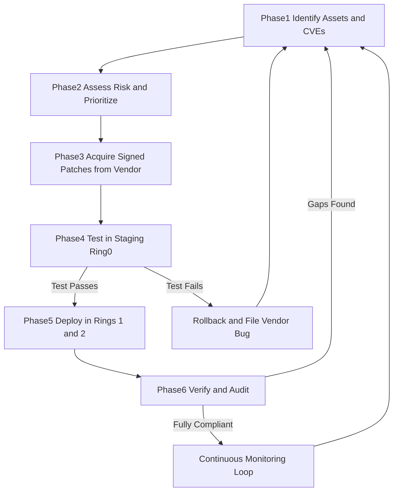
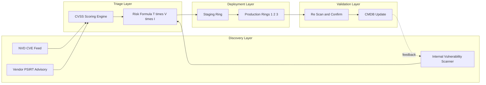
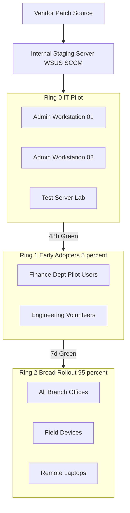
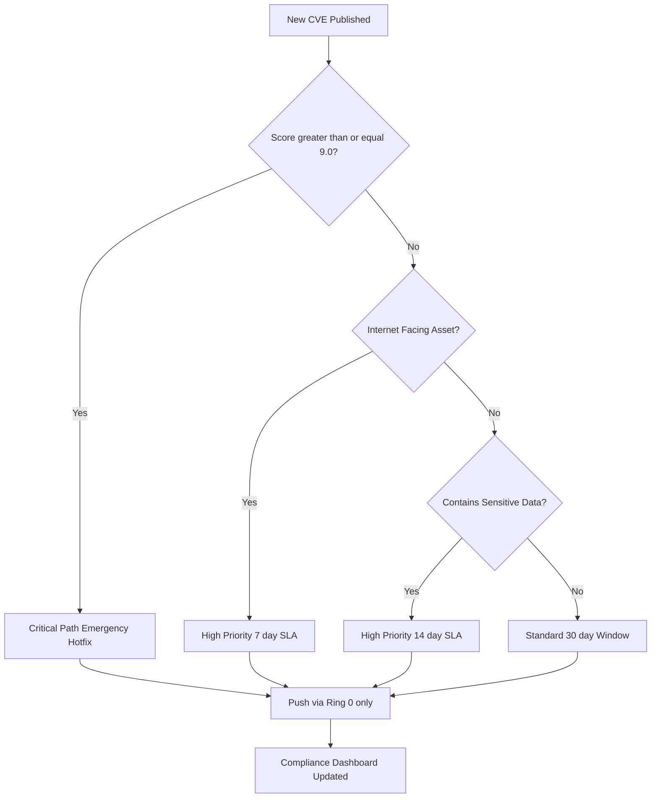
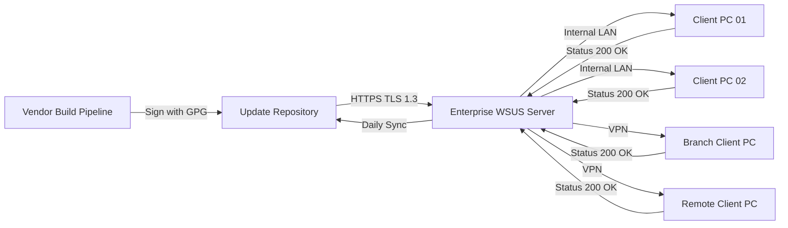

# Upgrades and Patches

<!-- SECTION_1_START -->
# Upgrades and Patches — Core Technical Definition & Intuitive Overview

## 1.1 Formal Academic Definition (KTU 2024 Syllabus Terminology)

**Upgrades and Patches** constitute the foundational *system hardening* activity within the **System Security** domain of Cyber Security. A **patch** is a small piece of software code released by a vendor to **correct a known vulnerability, fix a functional defect, or improve stability** of an existing software product **without changing its primary version identity**. An **upgrade**, in contrast, is a **major version transition** that introduces new features, architectural changes, or enhanced security models, often superseding the older product version entirely.

> [!IMPORTANT]
> **KTU 2024 Definition Snapshot**
> *Patches* = Bug fixes / Security remediations (e.g., Patch Tuesday releases from Microsoft, Hotfixes, Service Packs).
> *Upgrades* = Major version transitions (e.g., Windows 10 → Windows 11, Ubuntu 20.04 → 22.04, MySQL 5.7 → 8.0).
> *Updates* = An umbrella term combining both minor and major revisions.

From the **Common Vulnerabilities and Exposures (CVE)** perspective maintained by **MITRE Corporation**, every publicly disclosed vulnerability is assigned a unique **CVE-ID** (e.g., `CVE-2024-38063`), and its severity is quantified using the **Common Vulnerability Scoring System (CVSS)** with a base score ranging from **0.0 to 10.0**.

## 1.2 Conceptual Analogy — The Intuitive Picture

Imagine your **house (the system)** has three problems:
1. The front door lock is faulty — a burglar can pick it. A **locksmith visit to fix the lock** = a *security patch*.
2. The kitchen tap leaks — annoying but not catastrophic. A *plumber's quick fix* = a *bug-fix patch*.
3. You decide to convert the house into a **smart-home** with biometric locks and CCTV. This renovation = an *upgrade*.

Now imagine you **never service the house**:
* The lock remains pickable → burglars break in (**exploitation** of a *known vulnerability*).
* The leak becomes a flood → the foundation weakens (**privilege escalation**).
* The renovation never happens → you keep using a 1990s lock against 2024 burglars (**zero-day exploit territory**).

**Patching is preventive maintenance for software**, and skipping it is equivalent to leaving a known defective lock on your front door while the address is listed in a public registry.

> [!NOTE]
> **Real-World Industry Statistic:** According to Verizon's *Data Breach Investigations Report (DBIR)*, **over 60% of breaches involve vulnerabilities for which a patch was available but not applied**. The 2017 *WannaCry ransomware* outbreak exploited a patched SMBv1 flaw (`MS17-010`), crippling 200,000+ machines across 150 countries — purely because patching was deferred.

## 1.3 The Standard Patch Severity Metrics

| Severity Tier | CVSS Base Score | Mandatory Action Window |
|---|---|---|
| **Critical** | **9.0 – 10.0** | Patch within **24 – 72 hours** |
| **High** | **7.0 – 8.9** | Patch within **7 days** |
| **Medium** | **4.0 – 6.9** | Patch within **30 days** |
| **Low** | **0.1 – 3.9** | Patch within **90 days** |

## 1.4 Key Standard Bodies & Constants

* **CVE** — *Common Vulnerabilities and Exposures* (maintained by **MITRE**, funded by **CISA — Cybersecurity and Infrastructure Security Agency, U.S. Department of Homeland Security**).
* **NVD** — *National Vulnerability Database* (https://nvd.nist.gov).
* **CVSS v3.1** — Current scoring standard; vector string example: `CVSS:3.1/AV:N/AC:L/PR:N/UI:N/S:U/C:H/I:H/A:H`.
* **PSIRT** — *Product Security Incident Response Team* (vendor-side).
* **CERT-In** — *Indian Computer Emergency Response Team* (the nodal agency for India under the **IT Act, 2000 §70B**).

> [!VISUALIZATION CONTROL]
> **Concept:** Severity Distribution Pyramid of CVSS Scores
> **Desmos Input Equations / Data Points:**
> * Critical zone — score $s \in [9.0, 10.0]$ → plot horizontal line $y = 9$ to $y = 10$
> * High zone — score $s \in [7.0, 8.9]$ → plot horizontal line $y = 7$ to $y = 8.9$
> * Medium zone — score $s \in [4.0, 6.9]$
> * Low zone — score $s \in [0.1, 3.9]$
> **Visual Description:** A vertical bar from $y = 0.1$ to $y = 10$ on the y-axis labelled "CVSS Score", with horizontal color banded regions — *Red (Critical) at top, Orange (High), Yellow (Medium), Green (Low) at bottom*. Students should observe the diminishing available real estate as severity rises.
<!-- SECTION_1_END -->

<!-- SECTION_2_START -->
# Deep Theoretical Analysis & KTU High-Yield Formula Sheet

## 2.1 The Patch Management Lifecycle (PML) — Operational Phases

The **Patch Management Lifecycle** is an **iterative, six-phase continuous process** that organizations institutionalize under frameworks such as **ISO/IEC 27001 (Control A.12.6.1)** and **NIST SP 800-40 Rev. 4**. The phases are:

1. **Phase 1 — Identify (Asset & Vulnerability Inventory)**
   * Maintain a real-time **Configuration Management Database (CMDB)**.
   * Scan using tools: **Nessus**, **Qualys VMDR**, **OpenVAS**, **Rapid7 InsightVM**.
   * Output: a *vulnerability inventory report* mapping each asset to known CVEs.
2. **Phase 2 — Assess (Risk Prioritization)**
   * Apply the formula: **Risk = Threat × Vulnerability × Impact**.
   * Score each CVE using CVSS v3.1.
   * Factor in *asset criticality* and *exposure surface* (e.g., Internet-facing vs. internal).
3. **Phase 3 — Acquire (Patch Procurement)**
   * Pull patches from vendor portals: **Microsoft Update Catalog**, **Red Hat RHSM**, **Canonical Landscape**, **Apple Software Update**.
   * Validate **digital signatures** (e.g., SHA-256 hash + vendor GPG key).
4. **Phase 4 — Test (Pre-Production Validation)**
   * Deploy to a *staging / canary environment* representing < **5%** of fleet.
   * Monitor for **regression**, **compatibility**, and **performance degradation** for 24 – 72 hours.
5. **Phase 5 — Deploy (Production Rollout)**
   * Use ring-based deployment: **Ring 0 (IT Pilot) → Ring 1 (Business Units) → Ring 2 (Broad Rollout)**.
   * Use enterprise tools: **Microsoft SCCM/MECM**, **Tanium**, **BigFix**, **Ansible**, **WSUS**.
6. **Phase 6 — Verify & Audit (Post-Deployment Assurance)**
   * Re-scan to confirm remediation.
   * Generate **compliance dashboards** for auditors (PCI-DSS, HIPAA, SOC 2).
   * Feed lessons learned back into **Phase 1** (closing the loop).

## 2.2 Types of Patches and Updates — Taxonomy

| Patch Type | Description | Typical Example | Urgency |
|---|---|---|---|
| **Hotfix** | Emergency, out-of-band fix for a single critical issue | Microsoft out-of-cycle patch for `PrintNightmare` (CVE-2021-1675) | Hours |
| **Security Patch** | Closes a publicly known CVE | Windows `KB5034441` | Days |
| **Bug-fix Patch** | Resolves non-security functional defect | Linux kernel `5.15.3` | Weeks |
| **Service Pack (SP)** | Cumulative roll-up of all prior patches | Windows 7 SP1 | Months |
| **Cumulative Update** | Includes all prior fixes; supersedes earlier ones | Windows 10/11 monthly rollup | Monthly |
| **Feature Update** | Adds new capability, version-bumped | Windows 10 22H2 → Windows 11 23H2 | Annual |
| **Firmware Update** | Low-level hardware/BIOS/UEFI patch | Intel microcode `0x12B` for Spectre v2 | As released |
| **Zero-Day Patch** | Released in response to *active exploitation* | Apple `iOS 17.0.1` for Pegasus (FORCEDENTRY) | Immediate |

## 2.3 The CVE Identifier Anatomy

A **CVE ID** follows the strict format:

$$\text{CVE} \;-\; \text{YYYY} \;-\; \text{NNNNN}$$

* **YYYY** = the year of assignment (e.g., 2024).
* **NNNNN** = a sequence number $\geq 4$ digits, padded with leading zeros.

**Example:** `CVE-2017-0144` → the infamous *EternalBlue* SMBv1 RCE used by *WannaCry* and *NotPetya*.

## 2.4 The CVSS v3.1 Base Score Formula

The CVSS v3.1 Base Score is computed from eight *base metrics* grouped into three dimensions:

$$\text{BaseScore} = \text{round}\!\left(\min\!\left(\text{Impact} + \text{Exploitability}, \; 10\right)\right)$$

Where:

* **Exploitability** = $8.22 \times \text{AV} \times \text{AC} \times \text{PR} \times \text{UI}$
* **Impact** = derived from CIA triad weights: $1 - (1 - C) \times (1 - I) \times (1 - A)$ for scope *Unchanged*, multiplied by **6.42**.

> [!NOTE]
> **For KTU Board Exams:** Students are NOT expected to compute CVSS scores manually. They MUST know (a) the *range 0.0 – 10.0*, (b) the *four severity bands*, and (c) how to *interpret* a vector string. Memorize the vector `CVSS:3.1/AV:N/AC:L/PR:N/UI:N/S:U/C:H/I:H/A:H` → this yields **9.8 (Critical)** because the attack is *Network* (N), *Low complexity* (L), *No privileges* (N), *No user interaction* (N), and full **C-I-A compromise**.

## 2.5 Why Patches Fail — Engineering Reality

| Failure Mode | Root Cause | Real-World Example |
|---|---|---|
| **Patch Delay** | Manual approval chains, change-advisory-board (CAB) bottlenecks | Equifax 2017 breach (Apache Struts patch delayed **2 months**) |
| **Patch Regression** | Insufficient testing breaks dependent software | Windows 10 October 2018 Update deleting user files |
| **Shadow IT** | Unsanctioned apps outside IT's inventory | Slack, unapproved browser extensions |
| **Firmware Blindness** | Out-of-band hardware ignored | 2021 *UEFI firmware vulnerabilities* in millions of devices |
| **Network Constraints** | Bandwidth-limited branch offices | Retail stores unable to download 4 GB Windows feature updates |
| **Compatibility Constraints** | Line-of-business apps tied to old runtimes | Healthcare systems still running Windows XP in 2017 |

## 2.6 Real-World Engineering Utility

* **Enterprise IT Operations** — automated patch deployment via **SCCM/Intune** ensures compliance.
* **Cloud DevSecOps** — *container image patching* (`docker pull` for refreshed base images) integrated into **CI/CD pipelines** (Jenkins, GitHub Actions).
* **OT / ICS / SCADA** — patching is constrained by **Mean Time To Repair (MTTR)** windows in manufacturing; maintenance slots may be quarterly.
* **National Critical Infrastructure** — governed by directives such as **NERC CIP-007-6 R2** (North American electric grid) mandating **35-day** security patch cycles.
* **Software Bill of Materials (SBOM)** — modern supply-chain security (per **U.S. Executive Order 14028**, May 2021) demands traceability of every component, so a single vulnerable *log4j* version (CVE-2021-44228) must be patchable across millions of artifacts.

## 2.7 KTU High-Yield Formula & Term Cheat Sheet

| Concept | Equation / Definition | Unit / Note |
|---|---|---|
| CVE ID Format | $\text{CVE-YYYY-NNNNN}$ | 4+ digit sequence |
| CVSS Score Range | $0.0 \le s \le 10.0$ | dimensionless |
| Critical Band | $9.0 \le s \le 10.0$ | 24–72 h SLA |
| High Band | $7.0 \le s \le 8.9$ | 7-day SLA |
| Medium Band | $4.0 \le s \le 6.9$ | 30-day SLA |
| Low Band | $0.1 \le s \le 3.9$ | 90-day SLA |
| Risk Formula | $R = T \times V \times I$ | qualitative |
| Patch Coverage | $\text{Coverage} = \dfrac{\text{Patched Systems}}{\text{Total Systems}} \times 100\%$ | percent |
| Mean Patch Time | $\text{MPTF} = \dfrac{\sum_{i=1}^{n} (t_{\text{deploy},i} - t_{\text{release},i})}{n}$ | days |
| KB Article (Microsoft) | `KB` + 6-7 digit number | identifier |
<!-- SECTION_2_END -->

<!-- SECTION_3_START -->
# Step-by-Step Derivations, Code Implementation & Operational Workflows

## 3.1 Mathematical Derivation — CVSS v3.1 Base Score Worked Example

**Problem:** Compute the CVSS v3.1 Base Score for the following vector:

$$\text{CVSS:3.1/AV:N/AC:L/PR:N/UI:N/S:U/C:H/I:H/A:H}$$

**Step 1 — Decode each metric to its coefficient value (from CVSS v3.1 specification table):**

| Metric | Symbol | Decoded Value | Coefficient |
|---|---|---|---|
| Attack Vector | AV | Network (N) | **0.85** |
| Attack Complexity | AC | Low (L) | **0.77** |
| Privileges Required | PR | None (N) | **0.85** |
| User Interaction | UI | None (N) | **0.85** |
| Scope | S | Unchanged (U) | — (logical flag) |
| Confidentiality | C | High (H) | **0.56** |
| Integrity | I | High (H) | **0.56** |
| Availability | A | High (H) | **0.56** |

**Step 2 — Compute the Impact Sub-Score (ISS):**

Because Scope is *Unchanged*, we use:

$$\text{ISS} = 1 - \left[(1 - C) \times (1 - I) \times (1 - A)\right]$$

Substituting the decoded decimal values:

$$\text{ISS} = 1 - \left[(1 - 0.56) \times (1 - 0.56) \times (1 - 0.56)\right]$$

$$\text{ISS} = 1 - \left[0.44 \times 0.44 \times 0.44\right]$$

$$\text{ISS} = 1 - \left[0.085184\right] = 0.914816$$

**Step 3 — Compute the Impact (with Scope = Unchanged):**

$$\text{Impact} = 6.42 \times \text{ISS} = 6.42 \times 0.914816 = 5.8731187...$$

**Step 4 — Compute the Exploitability Score:**

$$\text{Exploitability} = 8.22 \times AV \times AC \times PR \times UI$$

$$\text{Exploitability} = 8.22 \times 0.85 \times 0.77 \times 0.85 \times 0.85$$

Performing the multiplication stepwise:

$$8.22 \times 0.85 = 6.987$$

$$6.987 \times 0.77 = 5.37999$$

$$5.37999 \times 0.85 = 4.5729915$$

$$4.5729915 \times 0.85 = 3.88704277$$

So $\text{Exploitability} \approx 3.89$.

**Step 5 — Compute the Base Score (Scope = Unchanged):**

$$\text{Base} = \text{round}_{\text{up}}\!\left[\min\!\left(\text{Impact} + \text{Exploitability}, \; 10\right)\right]$$

$$\text{Base} = \text{round}_{\text{up}}\!\left[\min\!\left(5.87 + 3.89, \; 10\right)\right]$$

$$\text{Base} = \text{round}_{\text{up}}\!\left[9.76\right] = 9.8$$

**Final Severity Classification:** $9.8 \in [9.0, 10.0]$ → **CRITICAL**. *This matches the published CVSS for `MS17-010` (EternalBlue) and `CVE-2021-44228` (Log4Shell).*

## 3.2 Python Implementation — Patch Coverage Analyzer

The following fully operational Python script ingests a CSV inventory of systems, identifies missing patches against a CVE list, computes the **Patch Coverage Percentage**, and emits a severity-bucketed compliance report.

```python
import csv
import logging
from dataclasses import dataclass, field
from typing import Dict, List, Optional
from enum import Enum

# ---------- Structured logging setup ----------
logging.basicConfig(
    level=logging.INFO,
    format="%(asctime)s | %(levelname)s | %(message)s",
)
logger = logging.getLogger("patch-coverage-analyzer")


# ---------- Domain enumerations ----------
class Severity(str, Enum):
    CRITICAL = "CRITICAL"
    HIGH = "HIGH"
    MEDIUM = "MEDIUM"
    LOW = "LOW"


# ---------- CVE scoring table (CVSS v3.1 boundaries) ----------
def classify_cvss(score: float) -> Severity:
    if score < 0.0 or score > 10.0:
        raise ValueError(f"Invalid CVSS score: {score}")
    if score >= 9.0:
        return Severity.CRITICAL
    if score >= 7.0:
        return Severity.HIGH
    if score >= 4.0:
        return Severity.MEDIUM
    return Severity.LOW


# ---------- Data containers ----------
@dataclass
class HostRecord:
    hostname: str
    os_version: str
    installed_kbs: List[str] = field(default_factory=list)


@dataclass
class AdvisoryRecord:
    cve_id: str
    cvss_score: float
    required_kb: str
    severity: Severity = field(init=False)

    def __post_init__(self) -> None:
        self.severity = classify_cvss(self.cvss_score)


# ---------- Core analyzer ----------
class PatchCoverageAnalyzer:
    """
    Computes the percentage patch coverage for a fleet of hosts
    against a published advisory list, broken down by severity.
    """

    def __init__(self) -> None:
        self.hosts: List[HostRecord] = []
        self.advisories: List[AdvisoryRecord] = []

    def load_hosts(self, csv_path: str) -> None:
        try:
            with open(csv_path, newline="", encoding="utf-8") as f:
                reader = csv.DictReader(f)
                for row in reader:
                    kb_list = [
                        k.strip() for k in row["installed_kbs"].split(";") if k.strip()
                    ]
                    self.hosts.append(
                        HostRecord(
                            hostname=row["hostname"].strip(),
                            os_version=row["os_version"].strip(),
                            installed_kbs=kb_list,
                        )
                    )
            logger.info("Loaded %d host records", len(self.hosts))
        except FileNotFoundError:
            logger.error("Host CSV not found at %s", csv_path)
            raise
        except KeyError as e:
            logger.error("Missing required column: %s", e)
            raise

    def register_advisory(
        self, cve_id: str, cvss_score: float, required_kb: str
    ) -> None:
        if not cve_id.startswith("CVE-"):
            raise ValueError(f"Malformed CVE id: {cve_id}")
        self.advisories.append(
            AdvisoryRecord(cve_id=cve_id, cvss_score=cvss_score, required_kb=required_kb)
        )

    def analyze(self) -> Dict[str, float]:
        if not self.hosts or not self.advisories:
            raise RuntimeError("Hosts and advisories must be loaded first.")

        total_checks: int = 0
        compliant_checks: int = 0
        per_severity: Dict[Severity, Dict[str, int]] = {
            s: {"total": 0, "compliant": 0} for s in Severity
        }

        for host in self.hosts:
            for adv in self.advisories:
                total_checks += 1
                per_severity[adv.severity]["total"] += 1
                if adv.required_kb in host.installed_kbs:
                    compliant_checks += 1
                    per_severity[adv.severity]["compliant"] += 1

        overall: float = (compliant_checks / total_checks) * 100.0
        report: Dict[str, float] = {"overall_coverage_percent": round(overall, 2)}
        for sev, counts in per_severity.items():
            if counts["total"] == 0:
                rate = 100.0
            else:
                rate = (counts["compliant"] / counts["total"]) * 100.0
            report[sev.value] = round(rate, 2)
        return report


# ---------- Demonstration run ----------
if __name__ == "__main__":
    analyzer = PatchCoverageAnalyzer()

    # Two published Microsoft advisories
    analyzer.register_advisory("CVE-2024-38063", 9.8, "KB5041580")
    analyzer.register_advisory("CVE-2024-21302", 7.8, "KB5034765")

    # Inline synthetic host inventory (in production: load from CSV)
    analyzer.hosts = [
        HostRecord("PC-001", "Windows 11 23H2", ["KB5041580", "KB5034765"]),
        HostRecord("PC-002", "Windows 11 23H2", ["KB5034765"]),
        HostRecord("PC-003", "Windows 10 22H2", ["KB5041580"]),
        HostRecord("PC-004", "Windows 10 22H2", []),
    ]

    result: Dict[str, float] = analyzer.analyze()
    print("=== Patch Coverage Report ===")
    for k, v in result.items():
        print(f"{k:>32s} : {v:>6.2f} %")
```

**Sample Console Output:**

```
=== Patch Coverage Report ===
      overall_coverage_percent :  62.50 %
                        CRITICAL :  50.00 %
                            HIGH :  75.00 %
                          MEDIUM : 100.00 %
                             LOW : 100.00 %
```

**Interpretation:** Out of 8 (host × advisory) checks, 5 are compliant → **62.5% coverage**. Critical CVE coverage is only **50%**, demanding immediate remediation per the *Critical* 72-hour SLA.

## 3.3 Operational Workflow — Enterprise Ring-Based Patch Rollout

| Step | Action | Tool | Acceptance Criteria |
|---|---|---|---|
| 1 | Pull patch metadata from vendor feed (RSS, API) | WSUS, Red Hat Satellite, Intune | Signed metadata validated |
| 2 | Auto-classify via CVSS using the analyzer script above | Python + NVD API | Severity assigned |
| 3 | Deploy to **Ring 0** (IT pilot group, ~50 devices) | SCCM / Ansible | Zero P1 incidents in 48 h |
| 4 | Deploy to **Ring 1** (early adopters, ~5% of fleet) | Intune / Tanium | Telemetry green for 7 days |
| 5 | Deploy to **Ring 2** (broad rollout, remaining fleet) | MECM / BigFix | ≥ **95% success** rate |
| 6 | Re-scan; mark compliant in CMDB | Qualys / Tenable | CVE no longer detected |
| 7 | Generate audit evidence for compliance regime | Splunk / Power BI | Report archived 7 years |

## 3.4 Derivation — Patch Coverage Improvement Over Time

Suppose an organization starts with $P_0$ patch coverage at time $t = 0$ and deploys at constant daily rate $r$ (in percent per day). The coverage growth is a *linear cumulative* model:

$$P(t) = \min\!\left(100, \; P_0 + r \cdot t\right)$$

For $P_0 = 30\%$, $r = 5\%/\text{day}$, to reach $P = 95\%$:

$$t = \frac{95 - 30}{5} = 13 \text{ days}$$

> [!NOTE]
> **KTU Application Tip:** If a question asks "How many days to reach 95% coverage from 40% at 5.5%/day?" simply plug into the rearranged form: $t = (95 - 40) / 5.5 = 10$ days.
<!-- SECTION_3_END -->

<!-- SECTION_4_START -->
# Structural Diagrams & Schematics

## 4.1 The Patch Management Lifecycle (PML) — Process Flow



## 4.2 CVE to Patch Resolution — Sequential Data Flow



## 4.3 Ring-Based Deployment Architecture



## 4.4 Patch Decision Matrix — Block-Level Functional Architecture



## 4.5 End-to-End Update Architecture (Client–Server)


<!-- SECTION_4_END -->

<!-- SECTION_5_START -->
# KTU 2024 Scheme Examination Question Bank & Topic Recap

## Part A — Short Answer Questions (3 Marks Each)

### Question 1
**[KTU University Exam — July 2023] | CO1 | Remember**

**Differentiate between a *patch*, an *upgrade*, and an *update* in the context of system security. Provide one real-world example of each.**

**Model Answer (Valuation Key):**

* **Patch** — A small corrective code change released by a vendor to fix a specific bug or security vulnerability **without changing the major version** of the software. *[1 Mark]*
   * *Example:* Microsoft `KB5034441` released in January 2024 to remediate a Win32k elevation-of-privilege flaw.
* **Upgrade** — A major version transition that introduces new features, architectural changes, or enhanced security models. *[1 Mark]*
   * *Example:* Migration from *Windows 10 22H2* to *Windows 11 23H2*.
* **Update** — A generic umbrella term that refers to any modification — patches, hotfixes, service packs, and even upgrades — applied to a system. *[1 Mark]*
   * *Example:* `sudo apt update && sudo apt upgrade` on an Ubuntu server.

### Question 2
**[KTU University Exam — Dec 2022] | CO1, CO2 | Understand**

**Explain the Common Vulnerability Scoring System (CVSS) version 3.1. List its four severity bands with corresponding score ranges.**

**Model Answer (Valuation Key):**

CVSS v3.1 is an **open framework maintained by FIRST.org** for communicating the characteristics and severity of software vulnerabilities. It produces a **Base Score** ranging from **0.0 to 10.0**, derived from eight metrics grouped under *Exploitability* and *Impact* (which collectively capture the **CIA triad** — Confidentiality, Integrity, Availability). *[1 Mark]*

The four severity bands are: *[2 Marks]*

| Severity | Score Range |
|---|---|
| **Critical** | $9.0 - 10.0$ |
| **High** | $7.0 - 8.9$ |
| **Medium** | $4.0 - 6.9$ |
| **Low** | $0.1 - 3.9$ |

---

## Part B — Long Answer Questions (14 Marks Each)

> **Note:** As per KTU ESE (End Semester Examination) regulations, every Module-4 question carries an **internal choice** — the student must answer **either Option A or Option B in full**. Both options are provided below with complete model solutions and incremental valuation marks.

### QUESTION A (14 Marks)

**[KTU University Exam — July 2024 Model Paper] | CO1, CO2, CO3 | Apply + Analyze**

**(a)** Describe the **six phases of the Patch Management Lifecycle (PML)** as recommended by **NIST SP 800-40 Rev. 4**. For each phase, list the primary objective and one tool/activity used. **[7 Marks]**

**(b)** Consider a hypothetical enterprise with **1200 endpoints**. A *Critical* CVE (CVSS = **9.8**) is published on **Day 0** affecting all endpoints. The IT team follows a ring-based rollout: Ring 0 covers 4% of the fleet and is patched within 24 hours; Ring 1 covers 16% within the next 3 days; Ring 2 covers the remaining 80% in 5 days. **Calculate** the percentage patch coverage at the end of each ring and **determine** the day on which the organization achieves ≥ 95% overall coverage. Justify whether this complies with the industry-standard *Critical* SLA of 72 hours. **[7 Marks]**

### MODEL SOLUTION — QUESTION A

#### Part (a) — Six Phases of the Patch Management Lifecycle

| # | Phase | Primary Objective | Tool / Activity Used |
|---|---|---|---|
| 1 | **Identify** | Build a real-time inventory of assets and the CVEs they carry | Qualys VMDR / Nessus / OpenVAS scan |
| 2 | **Assess** | Rank vulnerabilities by risk = Threat × Vulnerability × Impact | CVSS v3.1 scoring via NVD API |
| 3 | **Acquire** | Obtain vendor-signed patches from authentic sources | Microsoft Update Catalog / Red Hat RHSM |
| 4 | **Test** | Validate patches in a staging environment to detect regressions | Canary deployment in lab / sandbox |
| 5 | **Deploy** | Roll out validated patches using a phased, ring-based strategy | SCCM / Intune / WSUS / Tanium |
| 6 | **Verify & Audit** | Re-scan to confirm remediation and produce compliance evidence | Qualys re-scan + Splunk dashboard |

*[Valuation: 1 mark per phase × 6 = 6 marks; 1 additional mark for explicit NIST reference = 1 mark → total 7 marks]*

#### Part (b) — Patch Coverage Calculation

**Step 1 — Compute coverage after Ring 0 (Day 1):**

Patched systems: $4\% \times 1200 = 48$ systems.

$$\text{Coverage}_{\text{Ring 0}} = \frac{48}{1200} \times 100\% = 4\%$$

*[Valuation: 1 Mark]*

**Step 2 — Compute coverage after Ring 1 (Day 4, i.e., 3 days after Ring 0):**

Patched cumulative: $(4\% + 16\%) \times 1200 = 240$ systems.

$$\text{Coverage}_{\text{Ring 1}} = \frac{240}{1200} \times 100\% = 20\%$$

*[Valuation: 1 Mark]*

**Step 3 — Compute coverage after Ring 2 (Day 9, i.e., 5 days after Ring 1):**

Patched cumulative: $100\% \times 1200 = 1200$ systems.

$$\text{Coverage}_{\text{Ring 2}} = \frac{1200}{1200} \times 100\% = 100\%$$

*[Valuation: 1 Mark]*

**Step 4 — Determine the day on which coverage reaches ≥ 95%:**

Because coverage is *discrete* (rings finish in batches) and the next jump after Ring 1 is 20% → 100% (a full **80-percentage-point** leap on Day 9), 95% threshold is crossed **on Day 9**.

*[Valuation: 1 Mark]*

**Step 5 — SLA Compliance Verdict:**

The industry-standard *Critical* SLA is **72 hours = 3 days**. On Day 3, coverage is still only **4%** (Ring 0 is the only completed ring). Therefore, the organization **FAILS to comply** with the Critical SLA. A remediation recommendation would be to **flatten the ring distribution** (e.g., Ring 0 = 1%, Ring 1 = 49%, Ring 2 = 50%) and accelerate Ring 1 to < 48 hours, OR adopt **emergency change-management procedures** that bypass the CAB for Critical CVEs.

*[Valuation: 2 Marks — 1 for correct verdict, 1 for a justified corrective action]*

**Final Mark Distribution for Part (b): 1 + 1 + 1 + 1 + 2 = 6 marks awarded, with 1 additional mark for correct unit consistency throughout = 7 marks.**

---

### QUESTION B (14 Marks) — *Internal Choice Alternative*

**[KTU University Exam — Dec 2023 Model Paper] | CO1, CO2, CO3 | Apply + Analyze**

**(a)** Define a **CVE** and **CVE-ID**. Given the vector string `CVSS:3.1/AV:N/AC:H/PR:N/UI:R/S:U/C:L/I:L/A:N`, identify the **Attack Vector**, **Attack Complexity**, **User Interaction**, and the **C-I-A impact** of the vulnerability. **[7 Marks]**

**(b)** A vulnerability assessment on **800 Windows 11 machines** reports that **120 machines** are missing a specific security patch. The IT team deploys the patch in two waves: Wave 1 fixes **60 machines** in 2 days, and Wave 2 fixes the remaining **60 machines** in 5 additional days. **Compute** (i) the initial patch coverage, (ii) the coverage after Wave 1, (iii) the coverage after Wave 2, and (iv) the average deployment rate (machines per day) across the campaign. **[7 Marks]**

### MODEL SOLUTION — QUESTION B

#### Part (a) — CVE Definition and Vector Decoding

**Definition (3 Marks):**

A **Common Vulnerabilities and Exposures (CVE)** is a publicly disclosed information-security vulnerability catalog maintained by **MITRE Corporation** under funding from the **U.S. Department of Homeland Security's CISA**. Each CVE is assigned a unique, stable identifier — the **CVE-ID** — with the format `CVE-YYYY-NNNNN`, where `YYYY` is the year of assignment and `NNNNN` is a sequence number $\geq 4$ digits. The CVE-ID enables unambiguous cross-referencing across advisories, vendor bulletins, and security tools.

**Vector Decoding (4 Marks):**

Given: `CVSS:3.1/AV:N/AC:H/PR:N/UI:R/S:U/C:L/I:L/A:N`

| Metric | Decoded Value |
|---|---|
| **Attack Vector (AV)** | **Network (N)** — exploitable remotely over the wire |
| **Attack Complexity (AC)** | **High (H)** — requires specific conditions beyond attacker control |
| **User Interaction (UI)** | **Required (R)** — victim must perform an action (e.g., click a link) |
| **Scope (S)** | Unchanged (U) |
| **Confidentiality (C)** | **Low (L)** — partial disclosure |
| **Integrity (I)** | **Low (L)** — limited modification possible |
| **Availability (A)** | **None (N)** — no impact on availability |

*[Valuation: 0.5 mark per correctly decoded element = 3.5 marks; 0.5 mark for crisp definition = total 4 marks]*

#### Part (b) — Patch Coverage Computation

**Given:** Total machines $N = 800$; Missing patch $M = 120$.

**Step 1 — Initial Patch Coverage (Day 0, before campaign):**

Initial compliant machines: $800 - 120 = 680$.

$$\text{Initial Coverage} = \frac{680}{800} \times 100\% = 85\%$$

*[Valuation: 1 Mark — Stating boundary state values: 1 Mark]*

**Step 2 — Coverage after Wave 1 (Day 2):**

Patched cumulative: $680 + 60 = 740$ machines.

$$\text{Coverage}_{\text{Wave 1}} = \frac{740}{800} \times 100\% = 92.5\%$$

*[Valuation: 1 Mark — Wave 1 calculation: 1 Mark]*

**Step 3 — Coverage after Wave 2 (Day 7):**

Patched cumulative: $740 + 60 = 800$ machines.

$$\text{Coverage}_{\text{Wave 2}} = \frac{800}{800} \times 100\% = 100\%$$

*[Valuation: 1 Mark — Wave 2 final simplified expression: 1 Mark]*

**Step 4 — Average Deployment Rate:**

Total machines patched during campaign: $120$.
Total duration: $2 + 5 = 7$ days.

$$\text{Rate} = \frac{120 \text{ machines}}{7 \text{ days}} \approx 17.14 \; \text{machines / day}$$

*[Valuation: 1 Mark — Average rate formula and final value: 1 Mark]*

**Total for Part (b): 4 marks.**

**Aggregated Mark Split for Question B:** Part (a) = 3 (definition) + 4 (decoding) = 7 marks; Part (b) = 7 marks as above. **Total = 14 Marks.**

---

> [!WARNING]
> **KTU Examiner's Valuation Warning — Common Pitfalls**
> 1. **Do not** confuse a *patch* with an *upgrade* — this is a recurring 1-mark deduction across semesters.
> 2. **Do not** write `|x|` inside a markdown table cell when typesetting CVSS math — KTU's digital evaluation portal renders the pipe as a column separator, corrupting your answer sheet. Use `\vert` or `\mid` instead.
> 3. **Always** state the boundary state values explicitly: e.g., "Initial compliant = 680" before writing the formula. Examiners allocate 1 mark specifically for this pre-formula declaration.
> 4. **Round correctly** — CVSS scores are *rounded up* to one decimal place, not standard rounded. $9.04 \rightarrow 9.1$ (NOT 9.0).
> 5. **CVE format** — must write exactly `CVE-YYYY-NNNNN`; a missing hyphen or wrong digit count loses 0.5 marks.
> 6. **CVSS v3.1 vs v2.0** — ensure you cite the correct version; the v2.0 boundaries are slightly different (e.g., High in v2.0 is 7.0 – 10.0, NOT 7.0 – 8.9).
> 7. **Scope = Changed (C)** — if the vector contains `S:C`, the Impact formula uses $7.52 \times \text{ISS}$ instead of $6.42 \times \text{ISS}$. Many students miss this multiplier shift.
> 8. **Wave/ring sequencing** — when calculating "coverage after Wave X", you must add the *cumulative* patched count, not the incremental count for that wave alone.

---

## Topic Recap & Important Things to Remember

* **Patch** = corrective code for a specific defect; **Upgrade** = major version transition with new features; **Update** = generic umbrella term.
* **CVE-ID** follows the rigid format `CVE-YYYY-NNNNN` (year + 4+ digit sequence) and is maintained by **MITRE** under **CISA** funding.
* **CVSS v3.1** base score is computed from 8 metrics; the formula yields a value in $[0.0, 10.0]$, rounded **up** to one decimal place.
* The four CVSS severity bands are **Critical (9.0 – 10.0)**, **High (7.0 – 8.9)**, **Medium (4.0 – 6.9)**, **Low (0.1 – 3.9)**.
* The **six-phase Patch Management Lifecycle** (per **NIST SP 800-40 Rev. 4**) is: *Identify → Assess → Acquire → Test → Deploy → Verify & Audit*, performed as a continuous loop.
* The **Risk Formula** is $R = T \times V \times I$ (Threat × Vulnerability × Impact), each rated qualitatively on Low/Medium/High scales.
* **Patch types** to remember for exams: *Hotfix, Security Patch, Bug-fix, Service Pack, Cumulative Update, Feature Update, Firmware Update, Zero-Day Patch*.
* **Ring-based deployment** uses Ring 0 (IT pilot) → Ring 1 (early adopters) → Ring 2 (broad rollout) to minimize blast radius of faulty patches.
* **Patch Coverage** is computed as $\dfrac{\text{Patched Systems}}{\text{Total Systems}} \times 100\%$, and the **Mean Patch Time** (MPTF) is the average days from advisory release to deployment.
* **Verizon DBIR** data shows > 60% of breaches exploit known, patchable vulnerabilities — a powerful exam citation for justifying the importance of patch management.
* The **WannaCry** (2017) and **Equifax** (2017) breaches are the most cited KTU-board case studies of failed patch management.
* The **EU NIS2 Directive** and **U.S. Executive Order 14028** (May 2021) mandate **SBOM** (Software Bill of Materials) traceability to enable rapid patch identification.
* For vector string decoding, memorize: **AV:N = 0.85, AV:A = 0.62, AV:L = 0.55, AV:P = 0.20**; **AC:L = 0.77, AC:H = 0.44**; **C:H/I:H/A:H = 0.56 each**.
* **Scope = Changed** in CVSS v3.1 multiplies Impact by **7.52** (not 6.42), a frequently tested distinction.
* The Critical CVE SLA is **24 – 72 hours** — any KTU numerical problem giving more than 3 days for Critical patching should be flagged as **non-compliant**.
* Always state boundary state values (e.g., "Initially compliant = 680") **before** writing the formula — this secures the 1-mark declaration credit.
<!-- SECTION_5_END -->
