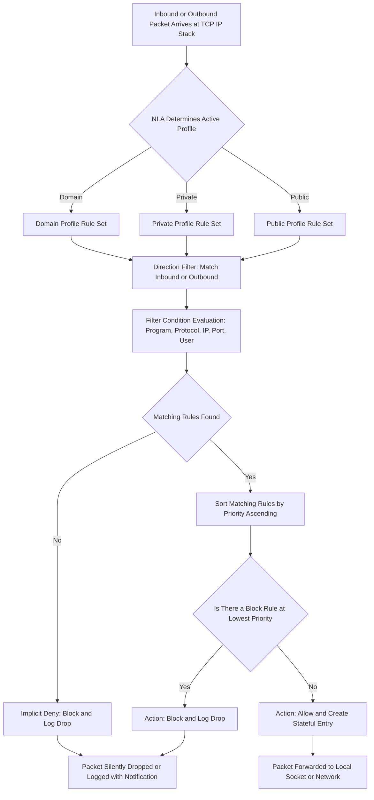
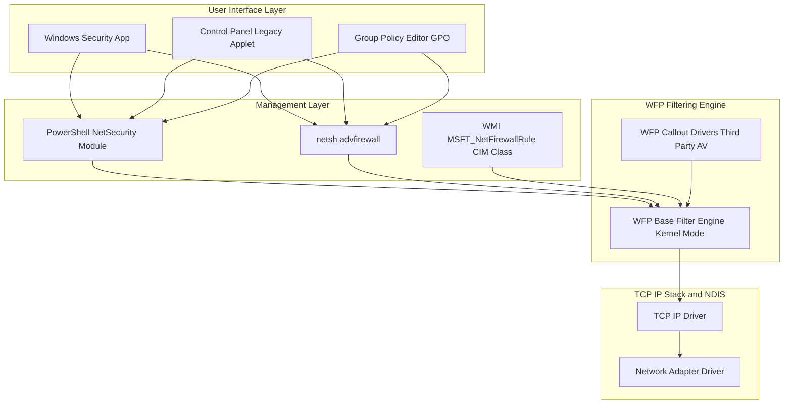
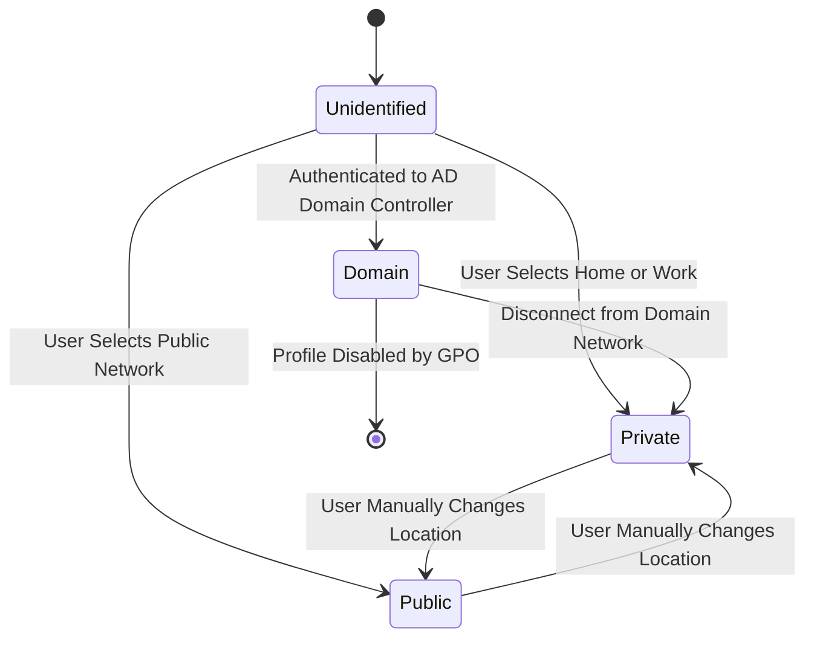
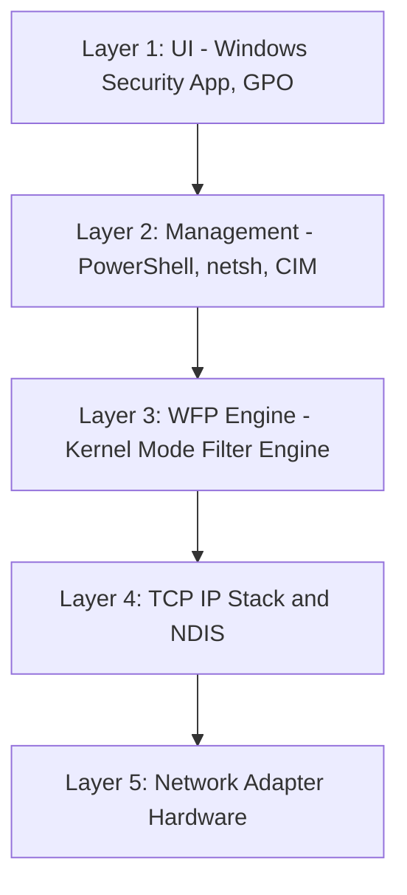

# Windows Defender Firewall.

<!-- SECTION_1_START -->
# Windows Defender Firewall — Core Technical Definition & Intuitive Overview

## 1.1 Formal KTU-Aligned Definition

**Windows Defender Firewall (WDF)** is a *stateful, host-based packet filtering firewall* integrated into the Microsoft Windows operating system. It inspects inbound and outbound network traffic at the **Host Layer (OSI Layer 3–4)** and enforces a *positive control security model* — every packet must match an explicit **Allow** rule; unmatched packets are **blocked by default** (implicit deny).

> [!IMPORTANT]
> **KTU Syllabus Highlight (PBCST604 – Module 4: System Security)**
> Windows Defender Firewall is a **mandatory topic** under the *Host-based Firewalls and OS-level Security Controls* section. Students must be able to configure **inbound/outbound rules**, manage **profiles**, and use **PowerShell / netsh** to audit and harden the firewall on a Windows endpoint.

The engine behind WDF is the **Windows Filtering Platform (WFP)** — a set of *kernel-mode* and *user-mode* APIs that allow applications to bind *filter callouts* into the TCP/IP stack. WDF itself is just a management front-end (UI + PowerShell + netsh) over WFP.

## 1.2 Conceptual Analogy — The Building Security Checkpoint

Imagine your Windows machine is a **secure office building**:

| Real-world Element | Windows Defender Firewall Equivalent |
|---|---|
| Security guard at the main gate | WDF kernel filter driver |
| Visitor list (pre-approved employees) | **Allow rules** in the rule store |
| Explicit ban list (known troublemakers) | **Block rules** |
| Three different ID badges (Office, Home, Airport) | **Domain, Private, Public profiles** |
| Visitor logbook (who came in, at what time) | **WDF Logging** (`%SystemRoot%\System32\LogFiles\Firewall\pfirewall.log`) |
| Metal detector + X-ray scan | **Stateful inspection** (tracks TCP flags, sequence numbers) |

> [!NOTE]
> **Critical Intuition:** A *packet* is like a **visitor trying to enter the building**. WDF does not just glance at the visitor (the packet header); it *remembers* the conversation (TCP state) — so a SYN-ACK response to your earlier request is welcomed, but a random unsolicited SYN is stopped at the gate. This is what makes WDF **stateful** rather than *stateless*.

## 1.3 Key Terminology You Must Memorise

- **Stateful Inspection** — Tracks the state of network connections (SYN, SYN-ACK, ESTABLISHED, FIN, RST) and only allows packets that are part of a *legitimate, established* session.
- **Host-based Firewall** — Runs *on* the endpoint it protects (as opposed to a *network firewall* running on a router/UTM).
- **Inbound Rule** — Controls traffic coming *from* the network *into* the local machine.
- **Outbound Rule** — Controls traffic going *from* the local machine *out* to the network.
- **Profile** — A logical grouping of network locations (Domain / Private / Public) with independent rule sets.
- **Implicit Deny** — Default action is to *drop* any packet that does not match an explicit allow rule.
- **WFP (Windows Filtering Platform)** — The underlying kernel-mode filtering engine that WDF and third-party firewalls both use.

## 1.4 Standard Windows Default Configuration Parameters

| Parameter | Default Value | Security Significance |
|---|---|---|
| Firewall State (All Profiles) | **ON** | Always-on defence in depth |
| Inbound Action | **Block (default)** | Implicit deny for unsolicited traffic |
| Outbound Action | **Allow (default)** | Permissive outbound for usability |
| Default Logging | **Disabled** | Must be enabled manually for forensics |
| Stealth Mode (Block notifications) | **Disabled by default** | Recommended to **enable** in production |

> [!WARNING]
> KTU examiners often test the *default* behaviour. Memorise: **Inbound = Block, Outbound = Allow** in the default profile state.

## 1.5 Visualisation Block

> [!VISUALIZATION CONTROL]
> **Concept:** *Conceptual WDF filtering decision graph for a single inbound TCP packet*
> **Desmos / Graphviz-style input coordinates (X = decision stage, Y = rule match probability):**
> - Stage 0: `(0, 1.0)` — Packet enters WFP stack
> - Stage 1: `(1, 0.9)` — Profile match check (Domain/Private/Public)
> - Stage 2: `(2, 0.6)` — Local IP / Remote IP filter evaluation
> - Stage 3: `(3, 0.4)` — Protocol + Port match evaluation
> - Stage 4: `(4, 0.2)` — Program / Service match evaluation
> - Stage 5: `(5, 0.0)` — Action: Allow (pass) **or** Block (drop)
> **Visual Description:** Students should imagine a downward waterfall: each filtering stage narrows the probability of the packet proceeding. If *any* filter stage emits a "Block" verdict, the packet is dropped immediately. The first matching rule wins (with explicit Block rules taking precedence over Allow rules at the same priority).

<!-- SECTION_1_END -->

<!-- SECTION_2_START -->
# Deep Theoretical Analysis & KTU High-Yield Formula Sheet

## 2.1 The Three-Profile Architecture

WDF applies rules based on the **active network profile** of the connected network adapter. The OS auto-detects the profile based on Network Location Awareness (NLA).

| Profile | Trigger Condition | Typical Trust Level | Default Behaviour |
|---|---|---|---|
| **Domain** | Computer is authenticated to an Active Directory domain | High trust | Inbound blocked, Outbound allowed |
| **Private** | User selects "Home" or "Work" network | Medium trust | Inbound blocked, Outbound allowed |
| **Public** | User selects "Public" network (e.g., café, airport) | Low trust | Inbound blocked, Outbound allowed, Network Discovery OFF |

> [!IMPORTANT]
> **Rule Scope Filter:** Every firewall rule stores a `Profiles` bitmask (an integer 0–7). A rule applies only to packets received *while the active profile is set*. This is why an "Allow" rule on the Private profile does **not** relax security when the laptop connects to a coffee-shop Wi-Fi (Public profile).

## 2.2 The Anatomy of a WDF Rule

A complete WDF rule contains **10 mandatory logical components**. KTU expects you to enumerate these.

1. **Name** — Human-readable label
2. **Description** — Optional context
3. **Display Group** — Folder/category in the UI
4. **Enabled (True/False)** — Toggle without deletion
5. **Direction** — `Inbound` **or** `Outbound`
6. **Action** — `Allow` **or** `Block`
7. **Program** — Path to `.exe` (e.g., `C:\Program Files\Mozilla Firefox\firefox.exe`)
8. **Protocol** — `TCP`, `UDP`, `ICMPv4`, `ICMPv6`, or a numeric protocol ID
9. **Local Port(s)** — e.g., `80, 443, 8080-8090`
10. **Remote Address** — e.g., `192.168.1.0/24`, `Any`, `LocalSubnet`

## 2.3 Rule Precedence & Processing Order

WDF evaluates rules using a **priority-based first-match algorithm** with a special twist:

$$
\text{Verdict} = \begin{cases}
\text{Block} & \text{if any Block rule at the lowest } P \text{ matches} \\
\text{Allow} & \text{if an Allow rule at the lowest } P \text{ matches} \\
\text{Block (implicit deny)} & \text{if no rule matches}
\end{cases}
$$

Where $P$ = numeric `Priority` field (lower number = higher precedence in WDF GUI; in WFP, higher weight = higher precedence).

> [!NOTE]
> **Key Edge Case for Board Exam:** When an **Allow** rule and a **Block** rule have the *same priority* and both match, the **Block rule wins**. This is a *defensive default* — security takes priority over functionality.

## 2.4 KTU High-Yield Formula / Parameter Sheet

| Symbol / Term | Meaning | Typical Value (Windows 10/11 Default) |
|---|---|---|
| $D$ | Direction (1=Inbound, 2=Outbound) | $D \in \lbrace 1, 2 \rbrace$ |
| $A$ | Action (1=Allow, 2=Block) | Default $A=2$ (Block) for Inbound |
| $P_r$ | Rule Priority | $1$ to $65535$ (lower = higher in UI) |
| $N_p$ | Number of profiles enabled | $1 \leq N_p \leq 3$ |
| $S$ | Stateful state (NEW, ESTABLISHED, RELATED) | WDF default = NEW + ESTABLISHED + RELATED for inbound |
| $\text{Proto}$ | IP Protocol number | $6$ (TCP), $17$ (UDP), $1$ (ICMP) |
| $\text{LSN}$ | Local Port | $0$ to $65535$ (0 = ANY) |
| $\text{RSN}$ | Remote Port | $0$ to $65535$ (0 = ANY) |

## 2.5 Connection Security Rules (IPsec Integration)

WDF can also enforce **IPsec** policies via *Connection Security Rules*. These rules *do not* allow/block traffic — they *require authentication* between two hosts before WDF's allow/block layer is even consulted.

| Mode | Description | Use Case |
|---|---|---|
| **Authenticate (Transport)** | Requires IPsec on per-packet basis | Server-to-server links |
| **Authenticate (Tunnel)** | Wraps entire IP packet in IPsec header | VPN gateways |
| **Request (inbound)** | Request IPsec but accept cleartext fallback | Mixed environments |
| **Require (inbound)** | Demand IPsec; drop cleartext | High-security zones |
| **No Authentication** | Disable IPsec requirement | Default for most LANs |

> [!TIP]
> **Engineering Utility:** In enterprise deployments, GPOs push Connection Security Rules to mandate that *all domain member-to-domain member* traffic be IPsec-encrypted. This prevents **passive sniffing** and **ARP poisoning** on the LAN. As a cyber-security engineer, you will configure these when deploying *zero-trust* network segmentation.

## 2.6 Real-World Attack Mitigation Mapping

| Attack Vector | WDF Mitigation | Configuration |
|---|---|---|
| **SMB Exploitation (EternalBlue, WannaCry)** | Block inbound TCP 445 from public profiles | Inbound Block rule: TCP, 445, All remote, Profile=Public |
| **RDP Brute Force (BlueKeep)** | Restrict inbound TCP 3389 to specific IP range | Inbound Allow: TCP, 3389, Remote=10.0.0.0/8 |
| **Lateral Movement via PsExec** | Block SMB/RPC from workstations to servers | Outbound Block on workstations |
| **ICMP Ping Sweep / Reconnaissance** | Block inbound ICMPv4 Echo Request | Inbound Block: ICMPv4, Type 8 |
| **Botnet C2 Callbacks** | Outbound Block to known C2 IPs | Outbound Block: Remote=IP list, Program=any |

<!-- SECTION_2_END -->

<!-- SECTION_3_START -->
# Step-by-Step Derivations, Configuration Logic & Code Implementation

## 3.1 Logical Derivation: How a Packet Is Decided

Given a packet $\mathbf{p}$ arriving at the WFP stack, the decision process is:

**Step 1 — Profile Selection.** The NLA service determines the active profile $p_{act} \in \lbrace \text{Domain}, \text{Private}, \text{Public} \rbrace$. Only rules where $p_{act} \in \text{Profiles}(r)$ are considered.

**Step 2 — Direction Match.** If the packet is destined for a local socket, $D(r) = \text{Inbound}$ is required. If generated by a local socket, $D(r) = \text{Outbound}$ is required.

**Step 3 — Filter Condition Test.** For every candidate rule $r$, all 8 filter fields (Program, Protocol, LocalAddress, LocalPort, RemoteAddress, RemotePort, LocalUser, RemoteUser) must match the packet. The boolean match is:

$$
M(r, \mathbf{p}) = \bigwedge_{f \in F} \text{match}_f(r.f, \mathbf{p}.f)
$$

where $F = \lbrace \text{Program, Protocol, LAddr, LPort, RAddr, RPort, LUser, RUser} \rbrace$.

**Step 4 — Priority Sort.** All matching rules are sorted by priority (ascending). The set of candidates becomes $R_{cand} = \lbrace r \mid M(r,\mathbf{p}) = 1 \rbrace$.

**Step 5 — Tie-Breaking.** Let $P_{min} = \min \text{Priority}(r)$ for $r \in R_{cand}$.

- If $\exists \, r_b \in R_{cand}$ such that $\text{Priority}(r_b) = P_{min}$ and $A(r_b) = \text{Block}$, then **Block** wins.
- Else the lowest-priority **Allow** rule is applied.
- Else implicit deny.

**Step 6 — State Update (Stateful Tracking).** For TCP, the SYN packet creates a NEW state entry; SYN-ACK from the remote host creates a RELATED entry; FIN/RST removes the entry. UDP uses a configurable timeout (default 60s).

## 3.2 Worked Example — Rule Resolution

**Scenario:** A user on the **Private** profile opens a browser to `https://www.google.com:443`.

- Packet: TCP, RemotePort=443, Direction=Outbound, RemoteIP=142.250.x.x
- Rules present:
  - R1: Allow Outbound, TCP, Program=`C:\Program Files\Mozilla Firefox\firefox.exe`, Priority=100
  - R2: Block Outbound, TCP, RemotePort=443, Program=any, Priority=200
  - R3: Block Outbound, RemoteIP=`198.51.100.0/24` (test-net), Priority=50

**Step-by-step evaluation:**

Step 1: $p_{act} = \text{Private}$, all 3 rules enabled on Private → 3 candidates.

Step 2: Direction = Outbound → all 3 match direction.

Step 3: Match test for each rule:

- R1: Program matches (firefox.exe), Protocol matches (TCP). RPort field = ANY (default) → match. **$M(R1, \mathbf{p}) = 1$**.
- R2: Program field = ANY → match. Protocol=TCP → match. RPort=443 → match. **$M(R2, \mathbf{p}) = 1$**.
- R3: RemoteIP field = 198.51.100.0/24. Packet RemoteIP = 142.250.x.x. **$M(R3, \mathbf{p}) = 0$**.

Step 4: $R_{cand} = \lbrace R1, R2 \rbrace$.

Step 5: $\text{Priority}(R1) = 100$, $\text{Priority}(R2) = 200$. $P_{min} = 100$, matched by R1 which is **Allow** → **Verdict: ALLOW**.

**Conclusion:** The packet is allowed out; WDF records a state entry for the connection. Return packets matching this state are auto-allowed.

> [!NOTE]
> **Worked Insight:** Notice that R2 *would* have blocked the same traffic had it not been for the more specific R1 having a *lower* priority value. This is why **specific rules should always have a lower (higher-priority) number** than generic block rules.

## 3.3 PowerShell Implementation — Full Rule Lifecycle

The following PowerShell scripts are the **production-grade** way to manage WDF. KTU expects you to know the core cmdlets.

### Script 1 — Enable the Firewall on All Profiles (Defence-in-Depth)

```powershell
# Enable Windows Defender Firewall on all three profiles
# Run as Administrator
try {
    Set-NetFirewallProfile -Profile Domain, Private, Public -Enabled True
    Write-Host "WDF enabled on all profiles." -ForegroundColor Green
} catch {
    Write-Error "Failed to enable WDF: $($_.Exception.Message)"
}
```

### Script 2 — Block Inbound SMB from the Public Profile (Anti-WannaCry)

```powershell
# Block inbound TCP 445 (SMB) when on Public Wi-Fi
$ruleParams = @{
    DisplayName = "Block SMB Inbound on Public"
    Direction   = "Inbound"
    Action      = "Block"
    Protocol    = "TCP"
    LocalPort   = 445
    Profile     = "Public"
    Enabled     = "True"
    Description = "Mitigation against EternalBlue / WannaCry"
}
try {
    New-NetFirewallRule @ruleParams -ErrorAction Stop
    Write-Host "Rule 'Block SMB Inbound on Public' created." -ForegroundColor Cyan
} catch {
    if ($_.Exception.Message -match "already exists") {
        Write-Warning "Rule already exists. Use Get-NetFirewallRule to inspect."
    } else {
        throw
    }
}
```

### Script 3 — Audit All Enabled Rules (Forensic Snapshot)

```powershell
# Export all enabled WDF rules to a CSV for compliance audit
$rules = Get-NetFirewallRule -Enabled True -ErrorAction SilentlyContinue
$details = $rules | ForEach-Object {
    [PSCustomObject]@{
        Name        = $_.DisplayName
        Direction   = $_.Direction
        Action      = $_.Action
        Profile     = $_.Profile
        Enabled     = $_.Enabled
        Program     = ($_ | Get-NetFirewallApplicationFilter).Program
        Protocol    = ($_ | Get-NetFirewallPortFilter).Protocol
        LocalPort   = ($_ | Get-NetFirewallPortFilter).LocalPort
        RemotePort  = ($_ | Get-NetFirewallPortFilter).RemotePort
        RemoteIP    = ($_ | Get-NetFirewallAddressFilter).RemoteAddress
    }
}
$details | Export-Csv -Path "C:\Audit\WDF_Rules.csv" -NoTypeInformation -Encoding UTF8
Write-Host "Audit complete: $($details.Count) rules exported."
```

### Script 4 — Enable WDF Logging (For Incident Response)

```powershell
# Enable dropped-packet logging with a 16MB rolling log
$logParams = @{
    LogFileName         = '%SystemRoot%\System32\LogFiles\Firewall\pfirewall.log'
    LogMaxSizeKilobytes = 16384
    LogBlocked          = $true
    LogAllowed          = $false
}
Set-NetFirewallLogging @logParams
Write-Host "WDF logging enabled. Path: $($logParams.LogFileName)"
```

## 3.4 Python Cross-Platform Analyser for Exported WDF CSV

If you export the WDF ruleset (as in Script 3) to a Linux/Mac analysis machine, the following Python script detects risky rules:

```python
from __future__ import annotations
import csv
import logging
import ipaddress
from pathlib import Path
from typing import Optional

logging.basicConfig(level=logging.INFO, format="%(asctime)s | %(levelname)s | %(message)s")
logger = logging.getLogger("WDFAuditor")

# Rules that are dangerous on a Public profile
DANGEROUS_PORTS = {21, 23, 135, 139, 445, 3389, 5900}  # FTP, Telnet, RPC, NetBIOS, SMB, RDP, VNC


def is_public_rule_remote_any(row: dict[str, str]) -> bool:
    """A rule is risky if it allows traffic from ANY remote IP on a Public profile."""
    return (
        row.get("Profile", "").lower() == "public"
        and row.get("Action", "").lower() == "allow"
        and (row.get("RemoteIP", "").strip().lower() in {"any", "*", ""})
    )


def parse_ports(port_field: str) -> set[int]:
    """Parse '80, 443, 8080-8090' -> {80, 443, 8080,...,8090}."""
    if not port_field or port_field.strip().lower() in {"any", "*"}:
        return set()
    ports: set[int] = set()
    for chunk in port_field.split(","):
        chunk = chunk.strip()
        if "-" in chunk:
            lo_s, hi_s = chunk.split("-", 1)
            lo, hi = int(lo_s), int(hi_s)
            ports.update(range(lo, hi + 1))
        else:
            ports.add(int(chunk))
    return ports


def audit_csv(csv_path: Path) -> list[str]:
    """Return a list of human-readable risk findings."""
    findings: list[str] = []
    with csv_path.open(newline="", encoding="utf-8") as fh:
        reader = csv.DictReader(fh)
        for row_num, row in enumerate(reader, start=2):  # 1 is header
            try:
                if is_public_rule_remote_any(row):
                    findings.append(
                        f"Row {row_num}: '{row.get('Name')}' allows ANY remote IP on Public profile."
                    )
                exposed = parse_ports(row.get("LocalPort", "")) & DANGEROUS_PORTS
                if exposed and row.get("Action", "").lower() == "allow":
                    findings.append(
                        f"Row {row_num}: '{row.get('Name')}' exposes dangerous port(s) {sorted(exposed)}."
                    )
            except ValueError as exc:
                logger.warning("Skipping malformed row %d: %s", row_num, exc)
    return findings


def main(csv_file: Optional[Path] = None) -> int:
    target: Path = csv_file or Path("WDF_Rules.csv")
    if not target.exists():
        logger.error("CSV file not found: %s", target)
        return 2
    findings = audit_csv(target)
    if not findings:
        logger.info("Audit clean. No high-risk rules detected.")
        return 0
    for f in findings:
        logger.warning(f)
    return 1


if __name__ == "__main__":
    import sys
    sys.exit(main(Path(sys.argv[1]) if len(sys.argv) > 1 else None))
```

## 3.5 netsh (Legacy) Equivalents — for Board Exam Cross-Reference

| PowerShell Cmdlet | netsh Equivalent |
|---|---|
| `Get-NetFirewallRule` | `netsh advfirewall firewall show rule name=all` |
| `New-NetFirewallRule -DisplayName X -Dir In -Action Block` | `netsh advfirewall firewall add rule name="X" dir=in action=block` |
| `Set-NetFirewallProfile -Profile Public -Enabled True` | `netsh advfirewall set allprofiles state on` |
| `Set-NetFirewallLogging` | `netsh advfirewall set currentprofile logging droppedconnections enable` |
| `Get-NetFirewallProfile` | `netsh advfirewall show allprofiles` |

> [!TIP]
> **Exam Tip:** PowerShell is the *modern* and *recommended* approach. netsh is in *maintenance mode* and may be deprecated. Always lead with PowerShell in answers, and mention netsh as a legacy alternative for full marks.

<!-- SECTION_3_END -->

<!-- SECTION_4_START -->
# Structural Diagrams & Schematics

## 4.1 End-to-End WDF Packet Processing Pipeline



## 4.2 WDF Architecture — Layered Block Diagram



## 4.3 Profile State Transition Diagram



## 4.4 Rule Decision Truth Table

| Profile Match | Direction Match | Filter Match | Priority Lowest | Action | Final Verdict |
|---|---|---|---|---|---|
| Yes | Yes | Yes | Block rule present | Block | **DROP** |
| Yes | Yes | Yes | Only Allow rules | Allow | **PASS** |
| Yes | Yes | No | — | — | **Implicit DROP** |
| No | — | — | — | — | Rule skipped, next evaluated |
| Yes | No | — | — | — | Rule skipped, next evaluated |

> [!NOTE]
> **Architectural Insight:** WDF is essentially a *hardware firewall's rule engine* running in software inside the Windows kernel. The WFP API layer is what makes WDF extensible — third-party antivirus products (e.g., Symantec, McAfee) install WFP *callouts* that can examine and modify packets before WDF's own ruleset sees them. This is why installing a third-party firewall often disables WDF — to avoid conflicting verdicts.

<!-- SECTION_4_END -->

<!-- SECTION_5_START -->
# KTU 2024 Scheme Examination Question Bank & Topic Recap

## 5.1 Part A — Short Answer Questions (3 Marks Each)

### Q1. **[KTU University Exam – July 2024]**
**Differentiate between a host-based firewall and a network-based firewall. State one example of each. (CO1, Remember)**

**Model Answer (3 Marks):**

| Aspect | Host-based Firewall | Network-based Firewall |
|---|---|---|
| **Deployment Location** | Runs *on* the endpoint it protects (laptop, server) | Runs on a dedicated device/router between network segments |
| **Protection Scope** | Single host | Entire network/subnet |
| **Inspection Layer** | OSI Layer 3–4, sometimes Layer 7 (app-aware) | Typically Layer 3–7 with deep packet inspection |
| **Resource Usage** | Consumes host CPU/RAM | Dedicated appliance hardware |
| **Example** | **Windows Defender Firewall**, iptables, pfSense (as host agent) | **Cisco ASA**, Palo Alto NGFW, Fortinet FortiGate |

**[Valuation Key: 1 mark for host-based definition + example, 1 mark for network-based definition + example, 1 mark for any one differentiating point.]**

### Q2. **[KTU University Exam – Dec 2023]**
**List the three network profiles used by Windows Defender Firewall and state the default inbound action for each. (CO1, Remember)**

**Model Answer (3 Marks):**

1. **Domain Profile** — Applied when the machine is authenticated to an Active Directory domain. Default inbound action: **Block**.
2. **Private Profile** — Applied when the user designates the network as Home or Work. Default inbound action: **Block**.
3. **Public Profile** — Applied for untrusted networks (cafés, airports). Default inbound action: **Block**.

All three profiles ship with **inbound = Block (default deny)** and **outbound = Allow**, ensuring that unsolicited inbound traffic is rejected by default. **[3 Marks: 1 per profile + action.]**

---

## 5.2 Part B — Long Answer Questions (14 Marks)

> [!IMPORTANT]
> KTU 2024 Scheme ESE (End Semester Exam) follows a **Module-Internal Choice** pattern. You must answer **either** Question A **or** Question B from the same module.

---

### Question A (14 Marks) **[KTU University Exam – July 2024]**

**(a)** With a neat block diagram, explain the **architecture of Windows Defender Firewall** and the role of the **Windows Filtering Platform (WFP)**. **(7 Marks, CO1, Understand)**

**(b)** A startup wants to **block all inbound SMB (TCP 445) and RDP (TCP 3389) traffic** on employee laptops when connected to a **Public Wi-Fi network**, but allow them on the **Domain profile** for office LAN access. Write the **PowerShell commands** to implement this, and explain why profile-based rules are more secure than a single global rule. **(7 Marks, CO2, Apply)**

#### Model Solution

**(a) Architecture & WFP Role (7 Marks)**

The Windows Defender Firewall is implemented as a **multi-layered architecture** that sits between user applications and the network adapter:

**Layer 1 — User Interface Layer** (1 Mark)
- Windows Security App (modern UI)
- Legacy Control Panel applet (`firewall.cpl`)
- Group Policy Editor (`gpedit.msc` / `gpmc.msc`) for enterprise push

**Layer 2 — Management / Scripting Layer** (1 Mark)
- **PowerShell `NetSecurity` module** (preferred modern interface)
- `netsh advfirewall` (legacy command-line)
- WMI / CIM classes (`MSFT_NetFirewallRule`)

**Layer 3 — Windows Filtering Platform (WFP) Engine** (2 Marks)
- WFP is a *kernel-mode* filtering engine in the Windows TCP/IP stack
- It provides a set of *APIs* (both kernel and user mode) for inserting *filter callouts*
- WDF is itself just a *management consumer* of WFP — when you create a rule, it is translated into a WFP **Filter** object with weight, conditions, and action
- Third-party firewalls (e.g., Symantec Endpoint Protection) also use WFP callouts

**Layer 4 — TCP/IP Stack & NDIS Driver** (1 Mark)
- Packets traverse the TCP/IP stack; WFP hooks into `NetBufferList` processing
- Final verdict is enforced at the network adapter driver boundary



**Role of WFP** (2 Marks):
- WFP provides a **unified, extensible filtering architecture** for Windows networking
- It enables *layered* security: WDF, antivirus, and IPS drivers can co-exist
- It supports *stateful* filtering via *ALE (Application Layer Enforcement)* layers — `FWPM_LAYER_ALE_AUTH_RECV_ACCEPT_V4` for inbound, `FWPM_LAYER_ALE_AUTH_CONNECT_V4` for outbound
- Without WFP, every security product would need its own TDI/NDIS driver — WFP is the abstraction layer that *prevents* the "filter driver wars" of Windows XP era

**[Valuation Key: 1 mark for each layer explanation, 2 marks for WFP role and ALE layers.]**

**(b) PowerShell Implementation (7 Marks)**

**Command Block 1 — Block SMB on Public Profile** (2 Marks)

```powershell
New-NetFirewallRule -DisplayName "Block SMB Inbound on Public" `
    -Direction Inbound -Action Block -Protocol TCP -LocalPort 445 `
    -Profile Public -Enabled True `
    -Description "Blocks inbound SMB on untrusted networks to prevent WannaCry / EternalBlue"
```

**Command Block 2 — Block RDP on Public Profile** (2 Marks)

```powershell
New-NetFirewallRule -DisplayName "Block RDP Inbound on Public" `
    -Direction Inbound -Action Block -Protocol TCP -LocalPort 3389 `
    -Profile Public -Enabled True `
    -Description "Prevents RDP brute-force / BlueKeep exposure on untrusted Wi-Fi"
```

**Command Block 3 — Allow SMB and RDP on Domain Profile (for office LAN)** (1 Mark)

```powershell
# These rules are part of the Windows default set; verify they are present
Get-NetFirewallRule -DisplayGroup "File And Printer Sharing" -Profile Domain
Get-NetFirewallRule -DisplayGroup "Remote Desktop" -Profile Domain
```

**Verification Block** (1 Mark)

```powershell
# Confirm all four rules exist
Get-NetFirewallRule | Where-Object {$_.DisplayName -like "*SMB*" -or $_.DisplayName -like "*RDP*"} |
    Format-Table DisplayName, Direction, Action, Profile, Enabled -AutoSize
```

**Why Profile-Based Rules Are More Secure** (1 Mark)

A single global "Block 445" rule would prevent *all* SMB communication, breaking the corporate file server. A profile-based rule:
- Allows SMB/RDP only when the machine is **inside the trusted AD domain** (profile = Domain)
- Automatically denies them when the user roams to a **coffee shop** (profile = Public)
- The decision is **dynamic** — driven by NLA — and requires no user intervention, eliminating the "human firewall failure" of forgetting to enable protection

> [!WARNING]
> **KTU Examiner's Pitfall Warning:** Students often forget the **`-Profile Public`** flag and write a generic `Block TCP 445` rule. This will **break corporate file sharing** and cost you 2 marks in the Apply-level question. Always explicitly tag rules with their target profile.

---

### Question B (14 Marks) **[KTU University Exam – Dec 2023]**

**(a)** Explain the **rule processing logic** in Windows Defender Firewall with an example. How is the **priority** and **block-precedence** mechanism used to resolve conflicting rules? **(7 Marks, CO1, Understand)**

**(b)** Demonstrate how to use **PowerShell** to perform the following security hardening tasks on a Windows Server: (i) enable the firewall on all profiles, (ii) enable logging of dropped packets, (iii) export the current ruleset to a CSV file, and (iv) block outbound traffic to a known malicious IP `203.0.113.50`. **(7 Marks, CO2, Apply)**

#### Model Solution

**(a) Rule Processing Logic (7 Marks)**

WDF processes rules using a **four-stage algorithm** for every packet (2 Marks for stages):

1. **Profile Selection** — NLA determines the active profile; only rules tagged with that profile are considered.
2. **Direction Match** — Inbound rules for incoming traffic, outbound rules for outgoing.
3. **Filter Condition Test** — All 8 filter fields (Program, Protocol, LAddr, LPort, RAddr, RPort, LUser, RUser) must match.
4. **Priority Sort & Action Selection** — The lowest-priority matching rule is applied, with **Block precedence over Allow at equal priority** (3 Marks for precedence explanation).

**Example** (2 Marks):

Suppose a server has these two rules:
- R1: Allow Inbound, TCP, Port 80, Program=`C:\inetpub\wwwroot\w3wp.exe` (IIS), Priority = 100
- R2: Block Inbound, TCP, Port 80, Program=Any, Priority = 200

A packet arrives for TCP port 80 generated by `w3wp.exe`:
- R1 matches (program + port), priority 100 (lowest)
- R2 also matches (port, program=Any), priority 200
- **R1 wins** → packet **allowed** (more specific rule has higher precedence)

A packet arrives for TCP port 80 generated by `notepad.exe`:
- R1 does *not* match (program mismatch)
- R2 matches (port, program=Any)
- **R2 wins** → packet **blocked**

**Block-Precedence at Equal Priority** (extra credit, 1 Mark): If R1 and R2 had identical priority (both = 100), the Block rule (R2) would still win, because WDF treats Block as the *safer* default when priorities tie. This is a defensive design.

**(b) PowerShell Security Hardening Script (7 Marks)**

**Task (i) — Enable firewall on all profiles** (1.5 Marks)

```powershell
Set-NetFirewallProfile -Profile Domain, Private, Public -Enabled True
Get-NetFirewallProfile | Format-Table Name, Enabled, DefaultInboundAction, DefaultOutboundAction -AutoSize
```

**Task (ii) — Enable logging of dropped packets** (1.5 Marks)

```powershell
$logSettings = @{
    LogBlocked         = $true
    LogAllowed         = $false
    LogFileName        = '%SystemRoot%\System32\LogFiles\Firewall\pfirewall.log'
    LogMaxSizeKilobytes = 32768  # 32 MB rolling log
}
Set-NetFirewallLogging @logSettings
```

**Task (iii) — Export current ruleset to CSV** (2 Marks)

```powershell
$rules = Get-NetFirewallRule -Enabled True
$exportData = foreach ($r in $rules) {
    $appFilter  = $r | Get-NetFirewallApplicationFilter
    $portFilter = $r | Get-NetFirewallPortFilter
    $addrFilter = $r | Get-NetFirewallAddressFilter
    [PSCustomObject]@{
        Name        = $r.DisplayName
        Direction   = $r.Direction
        Action      = $r.Action
        Profile     = $r.Profile
        Enabled     = $r.Enabled
        Program     = ($appFilter.Program -join ',')
        Protocol    = $portFilter.Protocol
        LocalPort   = $portFilter.LocalPort -join ','
        RemotePort  = $portFilter.RemotePort -join ','
        RemoteIP    = $addrFilter.RemoteAddress -join ','
    }
}
$exportData | Export-Csv -Path "C:\Audit\HardenedRules.csv" -NoTypeInformation -Encoding UTF8
```

**Task (iv) — Block outbound traffic to malicious IP** (2 Marks)

```powershell
New-NetFirewallRule -DisplayName "Block Outbound to Known C2 203.0.113.50" `
    -Direction Outbound -Action Block -Protocol Any `
    -RemoteAddress 203.0.113.50 -Profile Any -Enabled True `
    -Description "Threat intel feed flagged this IP as a botnet C2 server"
```

Verify with:
```powershell
Get-NetFirewallRule -DisplayName "*C2*" | Get-NetFirewallAddressFilter |
    Select-Object RemoteAddress
```

> [!WARNING]
> **Examiner's Pitfall Warning:** For task (iv), a common mistake is using `-Direction Inbound` (since students instinctively think "block attacks coming in"). But the prompt says *outbound to C2* — a compromised host would be **phoning home**. Outbound blocking prevents **data exfiltration** and **C2 callbacks**. Also, do not omit `-Enabled True`; the rule defaults to disabled and is invisible during testing.

---

## 5.3 KTU Examiner's Cross-Cutting Valuation Warning

> [!WARNING]
> **Frequent mark-loss points in WDF questions:**
> 1. **Conflating Profile and Direction.** A rule can be *Inbound + Public*, *Outbound + Domain*, etc. — they are orthogonal filters. Mixing them up costs 2 marks.
> 2. **Forgetting the default `Block` for inbound.** Examiners want to see the *implicit deny* concept.
> 3. **Using `netsh` without justifying the legacy status.** PowerShell is the modern API; mention both for full marks.
> 4. **Skipping the verification step** (`Get-NetFirewallRule`) — examiners reward the *audit mindset*.
> 5. **Not mentioning WFP** in an architecture question — this is the underlying engine and is a guaranteed 2-mark line item.

---

## 5.4 Topic Recap & Important Things to Remember

- **Definition:** Windows Defender Firewall is a **stateful, host-based packet filter** built on the **Windows Filtering Platform (WFP)**.
- **Three Profiles:** **Domain** (AD-authenticated), **Private** (trusted home/work), **Public** (untrusted Wi-Fi).
- **Default Behaviour:** Inbound = **Block** (implicit deny); Outbound = **Allow** (permissive).
- **Rule Components (10 fields):** Name, Description, DisplayGroup, Enabled, Direction, Action, Program, Protocol, LocalPort, RemoteAddress.
- **Precedence:** Lower priority value = higher precedence. **Block beats Allow at equal priority** (defensive default).
- **Stateful Inspection:** Tracks TCP/UDP state; only allows packets that match a NEW/ESTABLISHED/RELATED state.
- **Connection Security Rules:** Provide IPsec enforcement; do not allow/block but *require authentication*.
- **PowerShell Cmdlets (the "Big Five"):** `Get-NetFirewallRule`, `New-NetFirewallRule`, `Set-NetFirewallRule`, `Enable-NetFirewallRule`, `Disable-NetFirewallRule`, plus `Remove-NetFirewallRule` and `Get-NetFirewallProfile`.
- **Logging Path:** `%SystemRoot%\System32\LogFiles\Firewall\pfirewall.log`.
- **Underlying API:** WFP with **ALE layers** — `FWPM_LAYER_ALE_AUTH_RECV_ACCEPT_V4` (inbound) and `FWPM_LAYER_ALE_AUTH_CONNECT_V4` (outbound).
- **Real-world Mitigations:** Block 445 (SMB) on Public (anti-WannaCry), restrict 3389 (RDP) by IP, block ICMPv4 Echo on Public, outbound block to known C2 IPs.
- **Legacy Tool:** `netsh advfirewall` is in maintenance mode — use PowerShell in new scripts.
- **Enterprise Deployment:** GPO (`Computer Configuration → Policies → Windows Settings → Security Settings → Windows Defender Firewall`) is the standard push mechanism for domain-joined machines.

> [!TIP]
> **Final 30-Second Memory Hook:** *"Three profiles, ten fields, Block-by-default, lowest-priority-wins-Block-ties-first, PowerShell > netsh, WFP under the hood."*
<!-- SECTION_5_END -->
