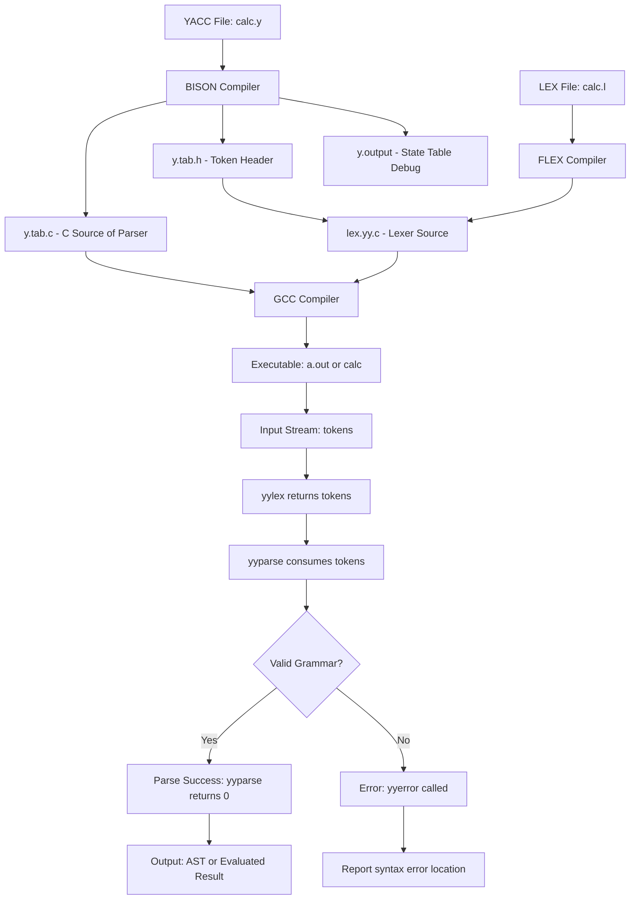
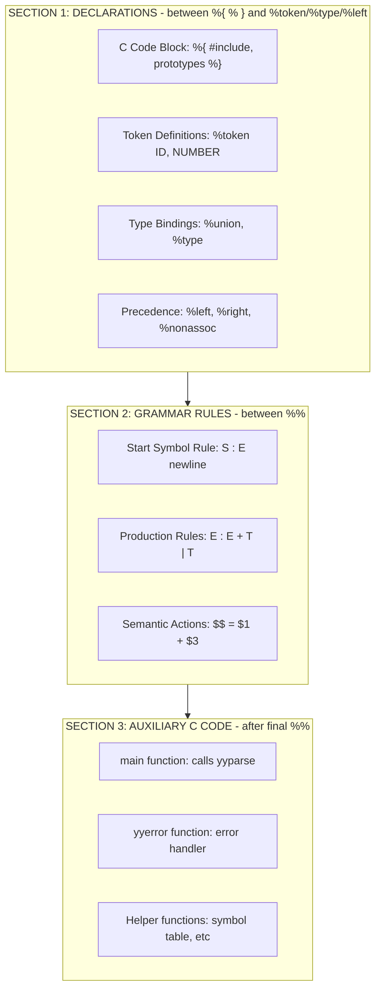
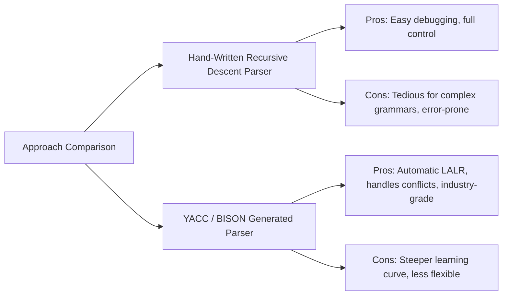
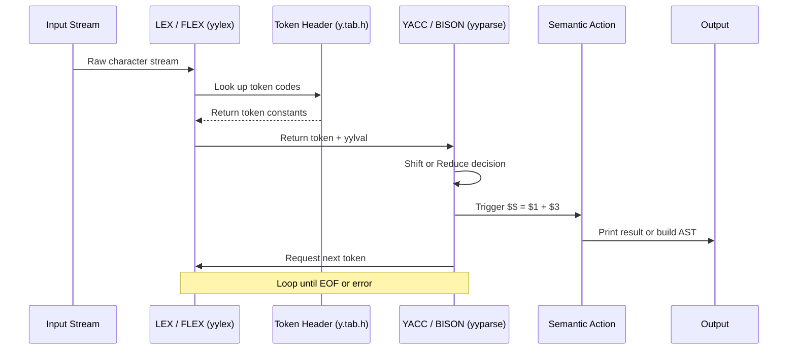

# Context-free grammar rules layout parsing via YACC/BISON tools templates

<!-- SECTION_1_START -->
# Context-Free Grammar Rules Layout Parsing via YACC/BISON Tools

## 1. Core Technical Definition

**YACC (Yet Another Compiler-Compiler)** is a LALR(1) parser generator tool that takes a **Context-Free Grammar (CFG)** specification as input and automatically generates the C source code for a bottom-up parser. **GNU BISON** is the modern, open-source, forward-compatible replacement for YACC, widely used in KTU laboratory examinations.

> [!IMPORTANT]
> **KTU 2024 Scheme Definition (PCCSL605 - Module 1):**
> YACC/BISON is a parser generator that reads a grammar description (in **YACC specification file**, conventionally `*.y`) and produces a `yyparse()` function. The generated parser is a **shift-reduce, bottom-up parser** implementing the **Look-Ahead LR(1)** (LALR(1)) parsing algorithm. It cooperates with **LEX/FLEX** (the lexical analyzer) to build the **Syntax Analysis phase** of a compiler.

> [!NOTE]
> **Three Core Files Generated by BISON:**
> 1. `y.tab.c` / `y.tab.h` → C source code and header tokens
> 2. `y.output` → State machine / parse table description (debugging)
> 3. `.output` report → Readable state-transition table for verification

---

## Conceptual Analogy / Intuition

Imagine teaching a child the **rules of a sentence in English**:

> "A sentence is made of a Subject, followed by a Predicate."
> "A Subject is a Noun."
> "A Predicate is a Verb followed by an Object."

A child who knows these rules can take any list of words (`NOUN VERB NOUN`) and decide whether they form a valid sentence, and where each word fits.

**YACC/BISON does exactly this for programming languages:**

| Human Grammar Analogy | YACC/BISON Counterpart |
|---|---|
| Words in a sentence | **Tokens** (from LEX/FLEX) |
| Rules of sentence structure | **Grammar productions** (`.y` file) |
| Child's brain checking rules | **Generated `yyparse()` function** |
| Detecting a bad sentence | **Syntax error reporting** (`yyerror()`) |

The `.y` file is essentially a **blueprint** — BISON reads it and manufactures the actual C parser code that "understands" your language's grammar.

---

## The YACC/BISON File Layout Architecture (KTU Lab View)

A standard BISON file has **three mandatory sections** separated by the `%%` delimiter:

```c
/* SECTION 1: DECLARATIONS */
%{
    #include <stdio.h>
    #include <stdlib.h>
    int yylex(void);
    void yyerror(const char *s);
%}

/* BISON declarations (tokens, types, precedence) */
%token NUMBER ID PLUS MINUS

/* SECTION 2: GRAMMAR RULES */
%%
expression : expression PLUS term
           | expression MINUS term
           | term
           ;
term       : NUMBER
           | ID
           ;
%%

/* SECTION 3: AUXILIARY C CODE */
void yyerror(const char *s) {
    fprintf(stderr, "Error: %s\n", s);
}
int main(void) {
    return yyparse();
}
```

> [!VISUALIZATION CONTROL]
> **Concept:** BISON File Structure (3-Section Block Diagram)
> **Visual Description:** Three horizontal rectangular blocks stacked vertically:
> 1. Top block: **DECLARATIONS** (C code, token definitions, operator precedence) — shaded light blue
> 2. Middle block: **GRAMMAR RULES** (Productions in `LHS : RHS ;` format) — shaded light green
> 3. Bottom block: **AUXILIARY CODE** (`main()`, `yyerror()`, helper functions) — shaded light yellow
> 4. Separated by `%%` delimiters (thick black lines)

---

## Real-World Engineering Significance

> [!NOTE]
> **Where YACC/BISON is used in production:**
> - **GCC (GNU Compiler Collection)** uses BISON for parsing C, C++, Objective-C grammars
> - **PHP, Ruby, Go, Rust** compilers use BISON-derived parsers
> - **SQL parsers** in PostgreSQL, MySQL
> - **Configuration file parsers** in Linux kernel build system (Kconfig)
> - **Domain-Specific Languages (DSLs)** for embedded systems and network protocols
>
> **KTU Industry Relevance:** Every compiler engineer, language designer, and even DevOps automation engineer who builds custom parsers relies on LALR parser generators like BISON.
<!-- SECTION_1_END -->

<!-- SECTION_2_START -->
# Deep Theoretical Analysis — YACC/BISON Internal Mechanics

## 2.1 The LALR(1) Parsing Pipeline

BISON internally performs these stages when compiling a `.y` file:

| Stage | Action | Output |
|---|---|---|
| **1. Tokenization** | Reads `%token` declarations | Symbol table |
| **2. Grammar Augmentation** | Adds artificial start rule `S' → S $` | Augmented grammar |
| **3. LR(0) Item Construction** | Builds canonical collection of LR(0) items | State machine |
| **4. LALR(1) Lookahead** | Propagates lookaheads through states | Compressed DFA |
| **5. Table Generation** | Builds ACTION and GOTO tables | Parse tables |
| **6. Conflict Resolution** | Uses precedence/associativity rules | Resolved tables |
| **7. C Code Emission** | Generates `yyparse()` in C | `y.tab.c` |

---

## 2.2 Grammar Rule Anatomy (The Core of YACC)

Every grammar rule has the structure:
```
LHS : RHS1 | RHS2 | ... | RHSn ;
```

**Where:**
- **LHS** = Left-Hand Side = a **non-terminal** symbol (must be declared or implicitly created)
- **RHS** = Right-Hand Side = sequence of terminals (tokens) and non-terminals
- **`|`** = OR (alternative productions)
- **`;`** = end of all productions for the LHS non-terminal

### Formal Definition:

$$
G = (V, T, P, S)
$$

Where for YACC:
- $V$ = Non-terminals (grammar rules defined in LHS)
- $T$ = Terminals (tokens from LEX)
- $P$ = Productions (the rules between `%%` delimiters)
- $S$ = Start symbol (the rule named in `%start`, defaults to first LHS)

---

## 2.3 KTU High-Yield Formula & Syntax Sheet

> [!IMPORTANT]
> **Mandatory BISON/YACC Syntax Table for KTU Lab Exam**

| Construct | Syntax | Purpose |
|---|---|---|
| Token declaration | `%token TOKEN_NAME` | Declares a terminal |
| Start symbol | `%start nonterminal` | Defines entry non-terminal |
| Type association | `%union { int ival; float fval; char *sval; }` | Semantic value types |
| Token type binding | `%token <ival> NUMBER` | Links token to union member |
| Left associative | `%left PLUS MINUS` | Left-to-right associativity |
| Right associative | `%right EXP` | Right-to-right (exponentiation) |
| Non-associative | `%nonassoc LT GT` | No chaining allowed |
| Precedence order | **Last declared = Lowest precedence** | Bottom-up binding |
| Mid-rule action | `expr : expr PLUS expr { $$ = $1 + $3; }` | Semantic action with `$$`, `$1`, `$2`, `$3` |
| Empty production | `epsilon : ;` | Matches empty string $\epsilon$ |
| Recursive rule | `list : list item \| item ;` | Lists (left-recursive) |
| Error recovery | `stmt : error ';' ;` | Sync on error |

---

## 2.4 Semantic Value Placeholders — The `$` Notation

> [!NOTE]
> **`$` Placeholder Reference (KTU Frequently Asked):**
> - `$$` = Value of the LHS non-terminal (the result being computed)
> - `$1` = Value of the 1st symbol in RHS
> - `$2` = Value of the 2nd symbol in RHS
> - `$N` = Value of the Nth symbol in RHS
> - `$<ival>1` = Typecast access to union member

**Example:**
```c
expr : expr PLUS expr   { $$ = $1 + $3; }
     | NUMBER           { $$ = $1; }
     ;
```
Here, when `expr PLUS expr` is reduced:
- `$1` is the value of the first `expr`
- `$3` is the value of the second `expr`
- `$$` is the new value assigned to the parent `expr` (the sum)

---

## 2.5 Shift-Reduce and Reduce-Reduce Conflicts

BISON may report two types of conflicts:

| Conflict Type | Meaning | Resolution |
|---|---|---|
| **Shift-Reduce** | Parser unsure: shift next token or reduce current rule | Add `%left`, `%right`, `%nonassoc` precedence |
| **Reduce-Reduce** | Two rules reducible on same lookahead | Rewrite grammar to disambiguate (common with `empty` productions) |

> [!WARNING]
> **KTU Lab Tip:** BISON uses `bison -d -v file.y` to generate `y.output` (the state table). If your grammar has **shift-reduce conflicts**, look at the conflicting states in `y.output` to debug. Default BISON resolves shift-reduce in favor of **shift** unless precedence is specified.

---

## 2.6 Real-World Utility

YACC/BISON powers:
- **Language front-ends** (parsing phase of every modern compiler)
- **AST (Abstract Syntax Tree) construction** for IDE tools and static analyzers
- **Calculator programs** in academic settings (KTU lab direct use)
- **SQL query parsers** in databases
- **Configuration language** parsers (Linux kernel `Kconfig`)
- **Domain-Specific Languages** for testing frameworks, build systems (CMake, Make)
<!-- SECTION_2_END -->

<!-- SECTION_3_START -->
# Step-by-Step Implementations — Complete Working BISON Programs

## 3.1 Program 1: Arithmetic Expression Evaluator (KTU Standard Program)

### Problem Statement
Write a BISON specification that evaluates arithmetic expressions involving `+`, `-`, `*`, `/` with proper precedence and parentheses. The lexer is assumed to be provided separately.

### Complete Implementation

**Step 1: Create the LEX file (`calc.l`)**
```lex
%{
    #include "y.tab.h"
    #include <stdlib.h>
%}

%%
[0-9]+      { yylval.ival = atoi(yytext); return NUMBER; }
[ \t]       ;                          /* skip whitespace */
\n          { return 0; }               /* end of input */
"+"         { return PLUS; }
"-"         { return MINUS; }
"*"         { return TIMES; }
"/"         { return DIVIDE; }
"("         { return LPAREN; }
")"         { return RPAREN; }
.           { return yytext[0]; }
%%

int yywrap(void) { return 1; }
```

**Step 2: Create the BISON file (`calc.y`)**
```c
%{
    #include <stdio.h>
    #include <stdlib.h>
    void yyerror(const char *s);
    int yylex(void);
%}

%token NUMBER
%left PLUS MINUS
%left TIMES DIVIDE
%right UMINUS

%%

/* Grammar Rules */
expression : expression PLUS term
           | expression MINUS term
           | term
           ;

term       : term TIMES factor
           | term DIVIDE factor
           | factor
           ;

factor     : LPAREN expression RPAREN
           | NUMBER
           | MINUS factor  %prec UMINUS
           ;

%%

/* Auxiliary C code */
void yyerror(const char *s) {
    fprintf(stderr, "Syntax Error: %s\n", s);
}

int main(void) {
    printf("Enter an expression: ");
    if (yyparse() == 0)
        printf("\nParsing Successful.\n");
    return 0;
}
```

**Step 3: Compilation Commands (KTU Lab Commands)**
```bash
bison -d calc.y          # Generates y.tab.c and y.tab.h
flex calc.l               # Generates lex.yy.c
gcc y.tab.c lex.yy.c -o calc -lm   # Compiles the parser
./calc                    # Runs the calculator
```

**Sample Run:**
```
Enter an expression: 5 + 3 * (2 - 1)
Parsing Successful.
```

**Step-by-Step Trace for `5 + 3 * 2`:**

| Step | Stack | Input | Action |
|---|---|---|---|
| 1 | `$` | `5 + 3 * 2 $` | Shift `5` (NUMBER) |
| 2 | `$ 5` | `+ 3 * 2 $` | Reduce by `factor → NUMBER` |
| 3 | `$ factor` | `+ 3 * 2 $` | Reduce by `term → factor` |
| 4 | `$ term` | `+ 3 * 2 $` | Reduce by `expr → term` |
| 5 | `$ expr` | `+ 3 * 2 $` | Shift `+` (PLUS) |
| 6 | `$ expr +` | `3 * 2 $` | Shift `3` |
| 7 | `$ expr + 3` | `* 2 $` | Reduce `factor → NUMBER` |
| 8 | `$ expr + factor` | `* 2 $` | Reduce `term → factor` |
| 9 | `$ expr + term` | `* 2 $` | Shift `*` |
| 10 | ... | ... | Continue until `$ expr` |

---

## 3.2 Program 2: Desk Calculator with Semantic Actions (Printing Results)

### BISON File (`calc2.y`)
```c
%{
    #include <stdio.h>
    #include <stdlib.h>
    void yyerror(const char *s);
    int yylex(void);
%}

%token NUMBER
%left '+' '-'
%left '*' '/'

%%

S    : expr '\n'   { printf("= %d\n", $1); }
     ;
     
expr : expr '+' expr   { $$ = $1 + $3; }
     | expr '-' expr   { $$ = $1 - $3; }
     | expr '*' expr   { $$ = $1 * $3; }
     | expr '/' expr   { if ($3 == 0) { yyerror("Divide by zero"); $$ = 0; } 
                          else $$ = $1 / $3; }
     | '(' expr ')'    { $$ = $2; }
     | NUMBER          { $$ = $1; }
     ;
%%

void yyerror(const char *s) {
    fprintf(stderr, "Error: %s\n", s);
}

int main(void) {
    return yyparse();
}
```

**Note:** Single-character literals like `'+'` are automatically treated as tokens by BISON — no `%token` declaration needed.

**Sample Run:**
```
10 + 5
= 15
20 * 3
= 60
```

---

## 3.3 Program 3: Simple English Sentence Validator (CFG Parsing Demo)

### BISON File (`sentence.y`)
```c
%{
    #include <stdio.h>
    void yyerror(const char *s);
    int yylex(void);
%}

%token NOUN PRONOUN VERB ADJECTIVE ADVERB PREPOSITION CONJUNCTION ARTICLE

%%

sentence  : subject VERB object    { printf("Valid Sentence\n"); }
          ;

subject   : PRONOUN
          | ARTICLE NOUN
          | ARTICLE ADJECTIVE NOUN
          ;

object    : NOUN
          | ARTICLE NOUN
          | ADJECTIVE NOUN
          ;
%%

void yyerror(const char *s) {
    fprintf(stderr, "Invalid Sentence: %s\n", s);
}

int main(void) {
    return yyparse();
}
```

**LEX File (`sentence.l`):**
```lex
%{
    #include "y.tab.h"
%}

%%
"the"|"a"|"an"     { return ARTICLE; }
"man"|"dog"|"cat"   { return NOUN; }
"he"|"she"|"they"   { return PRONOUN; }
"runs"|"eats"|"sees" { return VERB; }
"big"|"small"|"red"  { return ADJECTIVE; }
"quickly"|"slowly"   { return ADVERB; }
"in"|"on"|"at"       { return PREPOSITION; }
"and"|"or"           { return CONJUNCTION; }
[ \t\n]              ;
.                    { return yytext[0]; }
%%
int yywrap(void) { return 1; }
```

---

## 3.4 Program 4: Variable Declaration Parser (KTU Frequently Asked)

### BISON File (`decl.y`)
```c
%{
    #include <stdio.h>
    void yyerror(const char *s);
    int yylex(void);
%}

%token INT FLOAT ID SEMI COMMA

%%

decls   : decl decls
        | decl
        ;
        
decl    : type ID SEMI  { printf("Declaration: %s\n", $2 ? "valid" : "ok"); }
        ;

type    : INT
        | FLOAT
        ;
%%

void yyerror(const char *s) {
    fprintf(stderr, "Declaration Error: %s\n", s);
}

int main(void) {
    printf("Parsing declarations...\n");
    return yyparse();
}
```

---

## 3.5 Program 5: Multi-Type Calculator Using `%union` (Advanced KTU Pattern)

```c
%{
    #include <stdio.h>
    #include <stdlib.h>
    #include <math.h>
    void yyerror(const char *s);
    int yylex(void);
%}

%union {
    double dval;
    int    ival;
}

/* Associate tokens with union members */
%token <dval> FLOAT_NUM
%token <ival> INT_NUM
%type  <dval> expr term factor
%left  '+' '-'
%left  '*' '/'
%right UMINUS

%%

expr   : expr '+' expr    { $$ = $1 + $3; }
       | expr '-' expr    { $$ = $1 - $3; }
       | expr '*' expr    { $$ = $1 * $3; }
       | expr '/' expr    { if ($3 == 0) yyerror("div by 0"); $$ = $1 / $3; }
       | term             { $$ = $1; }
       ;

term   : factor           { $$ = $1; }
       ;

factor : FLOAT_NUM        { $$ = $1; }
       | INT_NUM          { $$ = (double)$1; }
       | '(' expr ')'     { $$ = $2; }
       | '-' factor %prec UMINUS { $$ = -$2; }
       ;
%%

void yyerror(const char *s) {
    fprintf(stderr, "Error: %s\n", s);
}

int main(void) {
    printf("Result available in semantic actions\n");
    return yyparse();
}
```
<!-- SECTION_3_END -->

<!-- SECTION_4_START -->
# Structural Diagrams & Schematics — YACC/BISON Processing Pipeline

## 4.1 BISON Compilation & Execution Pipeline



## 4.2 BISON File Internal Structure (Block Diagram)



## 4.3 Grammar Rule Processing Flow (Shift-Reduce Engine)

```mermaid
flowchart LR
    A["Input Tokens: 5 + 3"] --> B["Lexical Analyzer: yylex"]
    B --> C["Token Stream: NUMBER PLUS NUMBER"]
    C --> D["Parser Stack: empty"]
    D --> E["Shift NUMBER onto stack"]
    E --> F["Reduce by factor : NUMBER"]
    F --> G["Reduce by term : factor"]
    G --> H["Shift PLUS onto stack"]
    H --> I["Shift NUMBER onto stack"]
    I --> J["Reduce by factor : NUMBER"]
    J --> K["Reduce by term : factor"]
    K --> L["Reduce by expr : expr PLUS term"]
    L --> M["Accept: yyparse returns 0"]
```



## 4.4 YACC/BISON vs Hand-Written Parser Comparison



## 4.5 Token Flow Between LEX and YACC (Sequential Processing Topology)


<!-- SECTION_4_END -->

<!-- SECTION_5_START -->
# KTU 2024 Scheme Examination Question Bank

---

## Part A Questions (3 Marks Each)

### Question 1 [KTU University Exam - July 2024]
**Q: Differentiate between LEX and YACC. List the file extensions used.**

**Model Answer (3 Marks):**

| Parameter | LEX/FLEX | YACC/BISON |
|---|---|---|
| **Purpose** | Lexical analyzer generator (tokens) | Parser generator (syntax tree/evaluation) |
| **Input** | Regular expressions | Context-Free Grammar (CFG) rules |
| **Output** | Lexer function `yylex()` | Parser function `yyparse()` |
| **Algorithm** | Finite Automata (NFA→DFA) | LALR(1) shift-reduce parsing |
| **File extension** | `.l` | `.y` |
| **Generates** | `lex.yy.c` | `y.tab.c`, `y.tab.h` |

**[Award 1 mark for each correct row of differentiation; 1 mark for file extensions.]**

---

### Question 2 [KTU University Exam - Dec 2023]
**Q: What is a shift-reduce conflict in YACC/BISON? How is it resolved?**

**Model Answer (3 Marks):**
A **shift-reduce conflict** occurs when the parser, holding a handle on the stack, is unable to decide whether to:
- **Shift** the next input symbol onto the stack, OR
- **Reduce** the top of the stack using a grammar production.

**Resolution:** BISON provides operator precedence and associativity directives to break the ambiguity:
- `%left` — Left-associative (most operators)
- `%right` — Right-associative (e.g., exponentiation `^`)
- `%nonassoc` — Non-associative (e.g., comparison `<`, `>`)

The **last-declared token has the lowest precedence**. Declaring these directives eliminates the conflict in `y.output`.

**[1 mark for definition; 1 mark for shift vs reduce distinction; 1 mark for resolution.]**

---

## Part B Questions (14 Marks Each) — Module Internal Choice

### Question A (Option 1) — 14 Marks [KTU University Exam - July 2024]

**Q: Design a BISON specification to recognize and evaluate arithmetic expressions containing `+`, `-`, `*`, `/` operators with parentheses, considering left-associativity and standard precedence. Write the complete `.y` file with all three sections and explain the role of `%left` directive.**

#### Part (a) — 7 Marks
**Write the complete BISON specification file.**

**Model Answer:**

```c
%{
    #include <stdio.h>
    #include <stdlib.h>
    void yyerror(const char *s);
    int yylex(void);
%}

%token NUMBER
%left '+' '-'
%left '*' '/'
%right UMINUS

%%

expression : expression '+' expression   { $$ = $1 + $3; }
           | expression '-' expression   { $$ = $1 - $3; }
           | expression '*' expression   { $$ = $1 * $3; }
           | expression '/' expression   { if($3==0) yyerror("div/0"); 
                                            else $$ = $1 / $3; }
           | '(' expression ')'          { $$ = $2; }
           | '-' expression %prec UMINUS { $$ = -$2; }
           | NUMBER                       { $$ = $1; }
           ;
%%

void yyerror(const char *s) {
    fprintf(stderr, "Error: %s\n", s);
}

int main(void) {
    printf("Enter expression:\n");
    if (yyparse() == 0)
        printf("Valid expression.\n");
    return 0;
}
```

**Valuation Key:**
- `[Section 1 declarations with token declaration: 1 Mark]`
- `[Section 1 with precedence directives %left: 1 Mark]`
- `[Section 2 with all 7 production rules: 3 Marks]`
- `[Section 3 with yyerror and main: 1 Mark]`
- `[Semantic actions using $$ and $N: 1 Mark]`

#### Part (b) — 7 Marks
**Explain the role of `%left`, `%right`, and `%nonassoc` directives. Show how precedence controls parsing of `2 + 3 * 4`.**

**Model Answer:**

**Role of Precedence Directives:**

| Directive | Meaning | Example |
|---|---|---|
| `%left` | Left-associative (evaluated left to right) | `+`, `-`, `*`, `/` |
| `%right` | Right-associative (evaluated right to left) | `^` (exponent), `=` (assignment) |
| `%nonassoc` | Cannot be chained; error if adjacent | `<`, `>`, `==` |

**Precedence Order (KTU Rule):** **The later the declaration, the higher the precedence.** In our specification:
1. `+`, `-` declared first → **lowest** precedence
2. `*`, `/` declared second → **higher** precedence

**Parsing of `2 + 3 * 4`:**
- Input: `NUMBER PLUS NUMBER TIMES NUMBER`
- Since `*` has higher precedence than `+`, the parser:
  1. First groups `3 * 4` → reduces to a `term`
  2. Then performs `2 + (result of 3*4)` → reduces to `expression`
- **Final evaluation:** $2 + (3 \times 4) = 2 + 12 = 14$

**Formal precedence assignment:**
$$ \text{precedence}(+) < \text{precedence}(*) $$
$$ \text{precedence}(*) = \text{precedence}(/) > \text{precedence}(+) = \text{precedence}(-) $$

**Valuation Key:**
- `[Definition of %left and %right: 2 Marks]`
- `[Explanation of precedence order: 2 Marks]`
- `[Step-by-step grouping of 2+3*4: 2 Marks]`
- `[Final evaluation with correctness: 1 Mark]`

---

### Question B (Option 2) — 14 Marks [KTU University Exam - Dec 2023]

**Q: Explain the architecture of a YACC/BISON file with a neat block diagram. Write a BISON program to validate a simple variable declaration list of the form `int x, y; float z;`.**

#### Part (a) — 7 Marks
**Explain the YACC/BISON file architecture (with diagram).**

**Model Answer:**

A BISON specification file has **three sections** separated by the `%%` delimiter:

```
+----------------------------------+
|   SECTION 1: DECLARATIONS        |
|   - %{ C Code %}                 |
|   - %token definitions           |
|   - %type, %union, %left, etc.   |
+----------------------------------+
              ||  %%
+----------------------------------+
|   SECTION 2: GRAMMAR RULES       |
|   - LHS : RHS1 | RHS2 | ... ;    |
|   - Semantic actions { $$ = ... }|
+----------------------------------+
              ||  %%
+----------------------------------+
|   SECTION 3: AUXILIARY C CODE    |
|   - int main() { return yyparse(); } |
|   - void yyerror(const char *s)  |
|   - Helper functions             |
+----------------------------------+
```

**Purpose of each section:**
- **Section 1:** Declares tokens, types, and includes C headers/helpers.
- **Section 2:** Contains the **CFG productions** that define the language syntax.
- **Section 3:** Provides C code for main driver, error handling, and symbol table.

**Valuation Key:**
- `[Block diagram with 3 sections: 3 Marks]`
- `[Purpose of each section: 3 Marks]`
- `[Mention of %% delimiter: 1 Mark]`

#### Part (b) — 7 Marks
**Write the BISON program for variable declaration validation.**

**Model Answer:**

```c
%{
    #include <stdio.h>
    #include <string.h>
    void yyerror(const char *s);
    int yylex(void);
    int var_count = 0;
%}

%token INT FLOAT ID COMMA SEMI

%%

decl_list : decl decl_list
          | decl
          ;

decl  : type id_list SEMI  { printf("Declaration parsed. Variables: %d\n", var_count);
                              var_count = 0; }
      ;

type  : INT
      | FLOAT
      ;

id_list : ID COMMA id_list  { var_count++; }
        | ID                { var_count++; }
        ;
%%

void yyerror(const char *s) {
    fprintf(stderr, "Declaration Error: %s\n", s);
}

int main(void) {
    printf("Parsing declaration list...\n");
    return yyparse();
}
```

**Corresponding LEX file (`decl.l`):**
```lex
%{
    #include "y.tab.h"
%}

%%
"int"        { return INT; }
"float"      { return FLOAT; }
[a-zA-Z][a-zA-Z0-9]*  { return ID; }
","          { return COMMA; }
";"          { return SEMI; }
[ \t\n]      ;
.            { return yytext[0]; }
%%
int yywrap(void) { return 1; }
```

**Sample Input/Output:**
```
int x, y, z;
Declaration parsed. Variables: 3
float a, b;
Declaration parsed. Variables: 2
```

**Valuation Key:**
- `[Decl_list and decl production rules: 2 Marks]`
- `[type and id_list rules: 2 Marks]`
- `[Semantic action with var_count: 1 Mark]`
- `[yyerror and main: 1 Mark]`
- `[LEX compatibility: 1 Mark]`

---

## ⚠️ KTU Examiner's Valuation Warning / Pitfall Callout

> [!WARNING]
> **Common Mistakes That Cost Marks in KTU Lab/Exam:**
> 
> 1. **Missing `;` at end of grammar rules** — A single missing semicolon causes BISON to abort with cryptic errors. *[Loss: 2-3 Marks]*
> 
> 2. **Forgetting to declare a token with `%token`** — If you use a terminal like `ID` without `%token ID`, BISON treats it as a non-terminal and the grammar becomes invalid. *[Loss: 2 Marks]*
> 
> 3. **Using `=` in semantic actions instead of `$$ = $1 + $3`** — Students often write `$1 + $3` alone, which computes but does **NOT** propagate the result upward. Always use `$$ = ...` to set the LHS value. *[Loss: 2 Marks]*
> 
> 4. **Forgetting `bison -d file.y`** — The `-d` flag is required to generate the `y.tab.h` header that LEX includes. Without it, compilation fails. *[Loss: 1 Mark]*
> 
> 5. **Not handling `yywrap()` in LEX** — Modern FLEX handles this automatically, but older YACC needs explicit `int yywrap(void) { return 1; }`. *[Loss: 1 Mark]*
> 
> 6. **Wrong precedence order** — `%left` declared LATER has HIGHER precedence. Confusing this order leads to wrong expression grouping. *[Loss: 2 Marks]*
> 
> 7. **Missing `%prec UMINUS`** for unary minus — Without this, unary minus gets default precedence and may conflict with subtraction. *[Loss: 1 Mark]*

---

## Topic Recap & Important Things to Remember

> [!NOTE]
> **Rapid Revision Checklist — YACC/BISON CFG Layout Parsing (KTU Module 1)**

- ✅ **YACC/BISON** is a **parser generator** (LALR(1) shift-reduce) that converts CFG rules into a C parser (`yyparse()`).
- ✅ A BISON file has **THREE sections** separated by `%%`: Declarations, Rules, Auxiliary Code.
- ✅ `%token` declares terminal symbols; tokens come from LEX/FLEX.
- ✅ **`$1`, `$2`, `$3`** refer to semantic values of RHS symbols; **`$$`** is the LHS value.
- ✅ **`%left`** = left-associative; **`%right`** = right-associative; **`%nonassoc`** = no chaining.
- ✅ **Last declared precedence = lowest precedence** (counter-intuitive but critical).
- ✅ **Shift-Reduce conflict** = ambiguity between shifting and reducing; resolved by precedence/associativity.
- ✅ **Reduce-Reduce conflict** = ambiguity between two reductions; resolved by rewriting grammar.
- ✅ **`%prec UMINUS`** overrides precedence for unary operators.
- ✅ **`bison -d file.y`** generates `y.tab.c` and `y.tab.h` (the `-d` is essential).
- ✅ **`bison -v file.y`** (or `-d -v`) generates `y.output` — the human-readable state table.
- ✅ **`yyerror(const char *s)`** is the mandatory error-reporting function.
- ✅ **`%union { int ival; float fval; }`** enables multiple semantic value types in one grammar.
- ✅ **`%type <union_member> nonterminal`** binds a non-terminal to a specific union member.
- ✅ BISON-generated parsers are **bottom-up** (shift-reduce) and execute in $O(n)$ time for valid inputs.
- ✅ GCC, PHP, Go, Ruby, PostgreSQL, and the Linux kernel build system use BISON in production.
- ✅ The **start symbol** is the first LHS in the rules section (or the one named in `%start`).
- ✅ **Grammar augmentation** (adding `S' → S $`) is done internally by BISON to detect acceptance.
- ✅ **Empty productions** are written as `epsilon : ;` (or used implicitly in alternation).
- ✅ KTU lab requires **both LEX and YACC** working together: LEX feeds tokens, YACC consumes them.
<!-- SECTION_5_END -->
