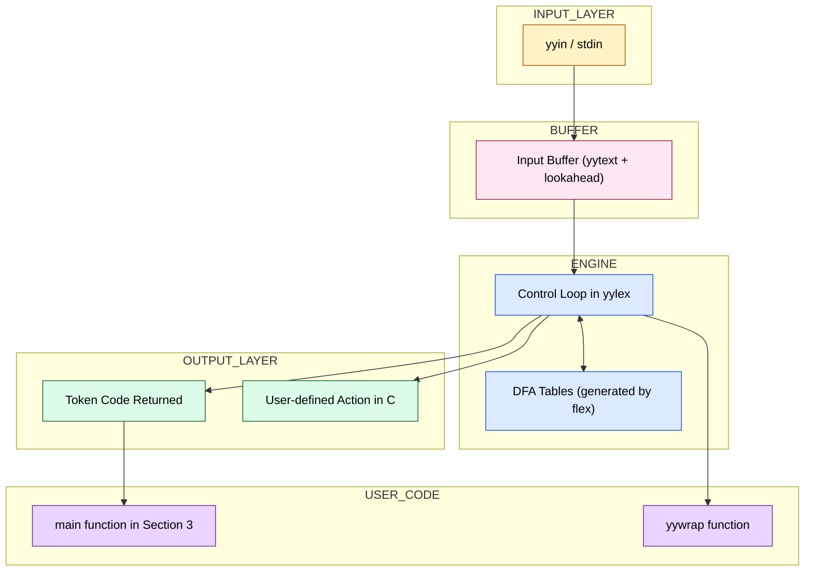
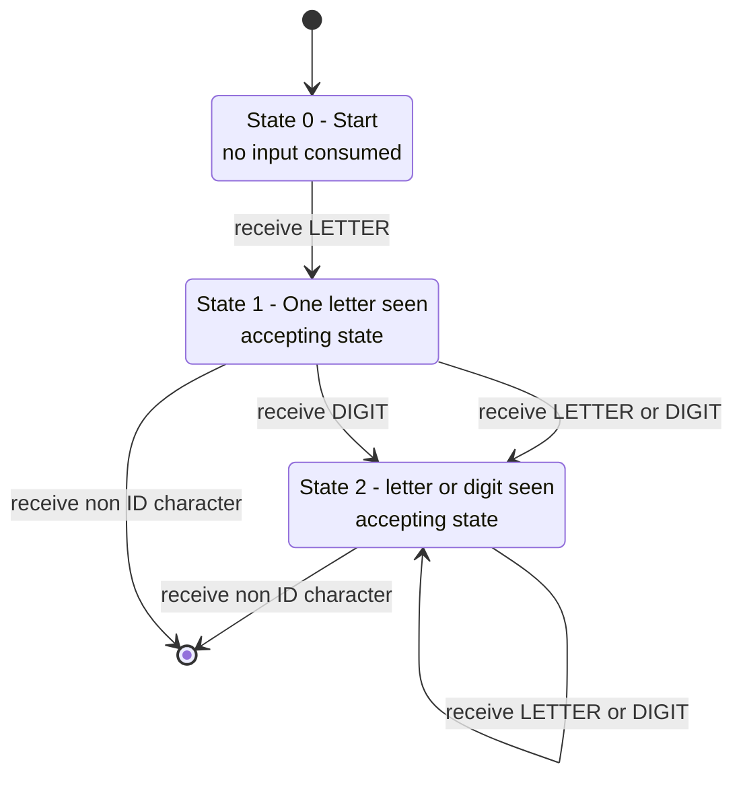
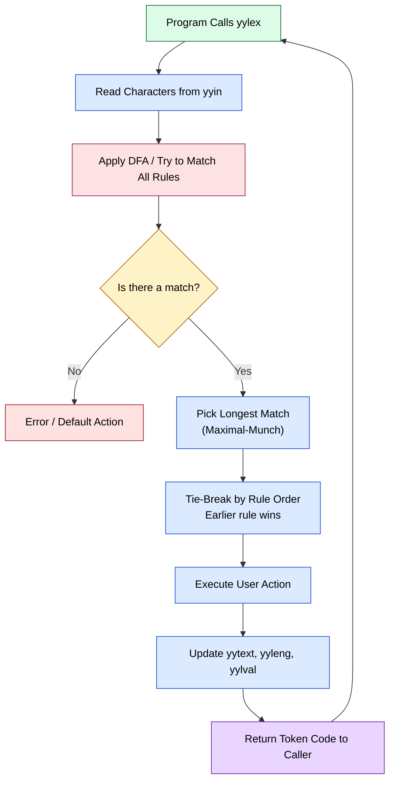

# Lexical analyzer definitions using LEX/FLEX specifications rules

<!-- SECTION_1_START -->
# Lexical Analyzer Definitions using LEX / FLEX Specification Rules

## 1.1 Formal Technical Definition (KTU 2024 Syllabus Terminology)

A **Lexical Analyzer** (also called a *scanner* or *tokenizer*) is the **first phase** of a compiler. Its job is to read the raw source program as a stream of characters and group them into a sequence of **lexemes**, each of which is mapped to a structured **token**. A token is a (token-name, attribute-value) pair, e.g., $\langle \text{id}, \text{ptr-to-symbol-table} \rangle$ or $\langle \text{num}, 42 \rangle$.

**LEX** is a *lexical analyzer generator* tool developed originally by **Mike Lesk** and **Eric Schmidt** at **Bell Laboratories** in 1975. **FLEX** (*Fast LEXical analyzer generator*) is the **GNU open-source successor** of LEX, written by **Vern Paxson**. Both tools accept a specification file containing **regular expressions** and **actions**, and automatically generate a C source file (`lex.yy.c`) that implements a **Deterministic Finite Automaton (DFA)** for the specified patterns.

The generated scanner is driven by the function $yylex()$, which scans input character by character, matches the **longest possible lexeme** according to the rules, executes the corresponding C action, and returns the token code to the parser.

> [!NOTE]
> **KTU 2024 Syllabus Highlight (Module 1)**
> Students are expected to *design, code, and execute* lexical analyzers using LEX/FLEX. The focus is on writing **correct regular expressions** for identifiers, constants, operators, keywords, and string/numeric literals, and verifying outputs on test inputs.

> [!IMPORTANT]
> **Core Definition — Token vs Lexeme vs Pattern**
> - **Pattern**: The *rule* (a regular expression) describing a set of strings.
> - **Lexeme**: The *actual character sequence* matched by a pattern.
> - **Token**: The *symbolic category* assigned to a lexeme (e.g., `ID`, `NUM`, `OP`).
>
> Example: For input `count = 100;`, the lexeme `count` matches the pattern `[a-zA-Z][a-zA-Z0-9]*` and produces the token `ID`. The lexeme `100` matches the pattern `[0-9]+` and produces the token `NUM`. The lexeme `=` matches the pattern `=` and produces the token `ASSIGN_OP`.

## 1.2 Intuitive Real-World Analogy

Think of a **LEX specification** as a *factory's sorting machine* at a recycling plant. ALEX takes in a chaotic stream of mixed items (characters) on a conveyor belt. Each worker at the machine has a *rulebook* (the regular expressions). When a box matching a rule passes by, the machine:

1. Picks up the longest possible box that fits the rule (the **maximal munch** principle).
2. Stamps it with a label (the **token name**).
3. Sends it down the correct chute (executes the **action**).
4. Returns to wait for the next box (the $yylex()$ loop).

The whole sorting machine is *automatically built* by LEX from the rulebook — you never need to manually craft state diagrams in C. This is why LEX is the *de-facto standard* for rapid prototyping of compiler front-ends and DSL tools.

> [!TIP]
> **Why LEX is so widely used in the industry**
> LEX/FLEX is the underlying engine for:
> - The lexical analyzers of languages like **Python, PHP, Ruby, and Lua** (via re2c, a similar tool).
> - Tools like **Lex/Yacc**, **Bison**, and **PLY** (Python Lex-Yacc).
> - Custom DSLs, configuration-file parsers, log analyzers, and bioinformatics pipelines.

> [!VISUALIZATION CONTROL]
> **Concept:** Token frequency distribution (typical bar-chart view used in compiler course labs).
> **GeoGebra / Desmos Input Equations:**
> * `BarChart( {KEYWORD→12, ID→35, NUM→18, OP→9, DELIM→20} )`
> **Visual Description:** Each bar represents the count of a particular token class recognized by the LEX scanner from a sample C file. Taller bars indicate lexemes that occur more frequently, helping students visualize how the scanner categorizes a program.

## 1.3 Why LEX is used in the Lab (KTU Examination Context)

The KTU 2024 Scheme lab manual for **PCCSL605 — Compiler Design Lab** lists the following expected outcomes for Module 1:

1. Write LEX/FLEX specifications for identifying **identifiers, constants, operators, and keywords**.
2. Build a simple scanner that **counts** words, lines, characters, vowels, consonants, or token frequencies.
3. Demonstrate **maximal-munch** and **rule precedence** in token recognition.
4. Generate and compile the C output of FLEX on a **Linux (Ubuntu/Fedora) environment** using the commands:
   * `flex lexer.l` — produces `lex.yy.c`
   * `gcc lex.yy.c -o lexer -lfl` — produces the executable
   * `./lexer < input.txt` — runs the scanner on a file
   * `./lexer` — runs the scanner on **keyboard input** (Ctrl+D to terminate)

<!-- SECTION_1_END -->

<!-- SECTION_2_START -->
# Deep Theoretical Analysis & KTU High-Yield Formula Sheet

## 2.1 The Three-Section Structure of a LEX/FLEX File

Every LEX specification — whether `.l` or `.lex` — has **exactly three sections**, separated by the `%%` delimiter. Missing a `%%` is a *fatal compilation error* and is one of the most common KTU lab mistakes.

| Section | Delimiter | Purpose | Mandatory? |
|---|---|---|---|
| **1. Definitions** | `%{ ... %}` at top | C declarations: headers, global variables, function prototypes, constants. | No, but required for `#include` |
| **2. Rules** | `%%` … `%%` | The **regular-expression / action** pairs. Each line is `PATTERN  ACTION`. | **Yes** |
| **3. User Code** | After the second `%%` | Auxiliary C functions (e.g., `main()`, `yywrap()`) needed for standalone execution. | No, but required if you want to run the scanner without `-lfl` |

### Canonical Skeleton of a `.l` File

```c
%{
    /* ===== SECTION 1: DECLARATIONS ===== */
    #include <stdio.h>
    #include <string.h>
    int line_count = 0;
%}

/* Optional: context-sensitive options such as %option noyywrap, case-insensitive */

%%

    /* ===== SECTION 2: RULES ===== */
    [a-zA-Z]+    { printf("WORD: %s\n", yytext); }
    [0-9]+       { printf("NUMBER: %s\n", yytext); }
    \n           { line_count++; }
    .            { /* consume any other character silently */ }

%%

    /* ===== SECTION 3: USER CODE ===== */
    int main(void) {
        yylex();           /* run the scanner on stdin */
        printf("Lines: %d\n", line_count);
        return 0;
    }

    int yywrap(void) {    /* required for end-of-input handling */
        return 1;
    }
```

## 2.2 Regular Expression Operators in LEX/FLEX

The patterns in the rules section are **extended regular expressions** (a superset of POSIX BRE). The table below is the **KTU high-yield cheat sheet** — memorize it for the lab viva.

| Operator | Meaning | Example Pattern | Matches |
|---|---|---|---|
| `c` | literal character `c` | `if` | the string `if` |
| `.` | any single character except newline | `a.b` | `axb`, `a9b`, but not `ab` or `a\nb` |
| `*` | zero or more repetitions | `[A-Z]*` | empty, `A`, `XYZ` |
| `+` | one or more repetitions | `[0-9]+` | `5`, `123`, but not empty |
| `?` | zero or one repetition | `-?` | empty or a single `-` |
| `\{m,n\}` | between $m$ and $n$ repetitions | `[0-9]\{2,4\}` | `12`, `1234` |
| `[abc]` | character class — any of `a`, `b`, `c` | `[abc]` | `a`, `b`, or `c` |
| `[^abc]` | negated class — any character *not* in the set | `[^0-9]` | `a`, `Z`, `_` |
| `r1\mid r2` | alternation | `if\mid for` | `if` or `for` |
| `^` | beginning of line (line-anchored) | `^#` | `#` at the start of a line |
| `$` | end of line (line-anchored) | `;$` | `;` at the end of a line |
| `(r)` | grouping for precedence | `(ab)+` | `ab`, `abab`, `ababab` |
| `\` | escape for metacharacters | `\*` | literal `*` character |
| `"..."` | quote a string, characters are literal | `"<="` | the string `<=` |
| `/` | trailing-context operator | `abc/de` | match `abc` only if followed by `e` |

> [!IMPORTANT]
> **Special FLEX-Only Operators (not in classic LEX)**
> - `{name}` — named substitution from the definitions section (e.g., `DIGIT [0-9]` then `{DIGIT}+`).
> - `<<EOF>>` — matches end-of-file.
> - `<STATE>` — start-condition prefixes for context-sensitive scanners.

## 2.3 Predefined Variables and Functions in FLEX

| Symbol | Type | Meaning | KTU Viva Favorite? |
|---|---|---|---|
| `yytext` | `char *` | Pointer to the matched lexeme (null-terminated). | **Yes — extremely common** |
| `yyleng` | `int` | Length of the current lexeme in characters. | **Yes** |
| `yyin` | `FILE *` | Input file pointer (defaults to `stdin`). | Yes |
| `yyout` | `FILE *` | Output file pointer (defaults to `stdout`). | Yes |
| `yylex()` | `int` | The scanner function; returns the next token code. | **Yes** |
| `yylval` | union/var | Carries the attribute value back to the parser (Yacc/Bison). | Yes |
| `ECHO` | macro | Default action — copies `yytext` to `yyout`. | **Yes** |
| `yywrap()` | `int` | Called at EOF; return `1` to stop, `0` to chain another file. | **Yes** |
| `input()` | `int` | Reads the next character from `yyin`. | Optional |
| `unput(c)` | `void` | Puts `c` back onto the input stream (lookahead). | Optional |

## 2.4 The Compilation Pipeline (KTU Lab Procedure)

The four-step procedure tested in the KTU lab exam is:

$$
\text{lexer.l} \;\xrightarrow{\;\text{flex}\;}\; \text{lex.yy.c} \;\xrightarrow{\;\text{gcc}\;}\; \text{lexer.exe} \;\xrightarrow{\;\text{input}\;}\; \text{token-stream}
$$

The two commands you must memorize:

```bash
flex lexer.l                    # produces lex.yy.c (the generated C source)
gcc lex.yy.c -o lexer -lfl      # compiles with the FLEX support library (-lfl)
./lexer < input.txt             # runs the scanner on a file
```

> [!WARNING]
> On **modern Linux (Ubuntu 22.04+ / Fedora 38+)**, the `-lfl` flag is often **unnecessary** because the `yywrap()` function is *defined inline* in `lex.yy.c` by default. If you supply your **own** `yywrap()` returning `1`, the `-lfl` flag is also not needed. Use the form:
> ```bash
> gcc lex.yy.c -o lexer
> ```

## 2.5 Comparison: LEX vs FLEX vs Hand-Written Scanner

| Feature | Classic **LEX** (AT&T, 1975) | **FLEX** (GNU, modern) | Hand-Written C Scanner |
|---|---|---|---|
| Output language | C | C/C++ | C (manual) |
| License | Proprietary (AT&T) | BSD-style (open source) | — |
| Speed | Slower | **Fastest** (table-driven DFA) | Fastest only if optimized |
| Memory | Lower efficiency | Better tables, similar memory | Manual control |
| Supported features | Basic regex | Adds `<<EOF>>`, start states, reentrant mode | Anything |
| Portability | SunOS, legacy Unix | **All modern Linux/macOS** | Universal |
| KTU Lab relevance | Theoretically referenced | **The one you actually run** | Taught in theory module |

> [!TIP]
> **Real-world engineering utility**
> FLEX is used in the Linux kernel build system, in GCC's own internal scanners, in the PHP runtime, in the configuration parsers of projects like `lighttpd`, and in tools like *lexertk*. Understanding FLEX gives you transferrable skills for any *domain-specific language (DSL)*, *config file parser*, or *source-code analyzer* you may build as a software engineer.

<!-- SECTION_2_END -->

<!-- SECTION_3_START -->
# Step-by-Step Derivations, Code Implementations & Worked Examples

## 3.1 Example 1 — Character, Word, and Line Counter (Foundational)

This is the **canonical first LEX program** taught in every KTU lab. It demonstrates the three core LEX capabilities: matching alphabetic runs (words), newline detection, and fallback rules.

### 3.1.1 Specification File `counter.l`

```c
%{
    /* ===== SECTION 1: DECLARATIONS ===== */
    #include <stdio.h>

    int char_count = 0;
    int word_count = 0;
    int line_count = 0;
%}

    /* A 'word' is defined as one or more letters */
WORD   [a-zA-Z]+

%%

    /* ===== SECTION 2: RULES ===== */

{WORD}    {
            word_count++;
            char_count += yyleng;
            printf("Word[%d]: %s\n", word_count, yytext);
          }

\n        {
            line_count++;
            char_count++;
          }

[ \t]+    {
            char_count += yyleng;   /* count spaces/tabs as characters */
          }

.         {
            char_count++;           /* any other single character */
          }

%%

    /* ===== SECTION 3: USER CODE ===== */
int main(void) {
    printf("--- LEX Counter Started ---\n");
    yylex();                       /* scan stdin until EOF */
    printf("--- LEX Counter Finished ---\n");
    printf("Total Characters : %d\n", char_count);
    printf("Total Words      : %d\n", word_count);
    printf("Total Lines      : %d\n", line_count);
    return 0;
}

int yywrap(void) {
    return 1;
}
```

### 3.1.2 Compilation and Execution

```bash
$ flex counter.l
$ gcc lex.yy.c -o counter
$ echo "Hello KTU Compiler Lab" | ./counter
--- LEX Counter Started ---
Word[1]: Hello
Word[2]: KTU
Word[3]: Compiler
Word[4]: Lab
--- LEX Counter Finished ---
Total Characters : 24
Total Words      : 4
Total Lines      : 1
```

### 3.1.3 Step-by-Step Logic of Each Rule

| Input character | Rule matched | Action | Counters updated |
|---|---|---|---|
| `H` then `ello` | `{WORD}` | `word_count++`; `char_count += 4` | word → 1, char → 4 |
| ` ` | `[ \t]+` | `char_count += 1` | char → 5 |
| `K` then `TU` | `{WORD}` | word_count = 2, char += 3 | char → 8 |
| ` ` | `[ \t]+` | char += 1 | char → 9 |
| … | continues… | … | … |
| `\n` | `\n` rule | `line_count++`; `char++` | line → 1, char → 24 |

> [!IMPORTANT]
> **Why do we increment `char_count` for spaces and punctuation too?**
> Because the user expects "total characters" to mean *all* characters in the file, not just the letters inside words. The order of rules **does not matter** for matching (FLEX uses maximal-munch and rule-precedence), but it matters for **how you count**.

## 3.2 Example 2 — Token Recognizer for a Tiny Language (KTU Module 1 Core)

This is the **exam-grade program**. It distinguishes keywords from identifiers, recognizes integer and real-number literals, and reports each token's category.

### 3.2.1 Specification File `tokenizer.l`

```c
%{
    #include <stdio.h>
    #include <stdlib.h>
    #include <string.h>

    /* token category codes returned by yylex() */
    #define KEYWORD   1
    #define ID        2
    #define INT_NUM   3
    #define FLOAT_NUM 4
    #define OP        5
    #define DELIM     6
    #define UNKNOWN   7

    int token_count = 0;
%}

/* ----- Pattern definitions (FLEX substitutions) ----- */
DIGIT     [0-9]
LETTER    [a-zA-Z]
ID        {LETTER}({LETTER}|{DIGIT})*
INT       {DIGIT}+
FLOAT     {DIGIT}+\.{DIGIT}+
KEYWORD   "if"|"else"|"while"|"for"|"int"|"float"|"return"|"main"

%%

    /* ===== RULES ===== */

{KEYWORD}   { token_count++; return KEYWORD;   }
{ID}        { token_count++; return ID;        }
{FLOAT}     { token_count++; return FLOAT_NUM; }
{INT}       { token_count++; return INT_NUM;   }

"=="|"!="|"<="|">="|"<"|">"   { token_count++; return OP;    }
"+"|"-"|"*"|"/"|"="           { token_count++; return OP;    }

"(" | ")" | "{" | "}" | ";" | "," { token_count++; return DELIM; }

[ \t\r]+   { /* skip whitespace silently */ }

\n         { /* skip newlines, no token emitted */ }

.          {
              fprintf(stderr, "LEXICAL ERROR: unknown char '%s' at line.\n", yytext);
              return UNKNOWN;
          }

%%

int main(void) {
    int tok;
    printf("%-12s %-10s %-10s %-10s\n", "TOKEN_NAME", "ATTR_VALUE", "LENGTH", "INDEX");
    printf("----------------------------------------------------\n");

    while ((tok = yylex()) != 0) {
        const char *names[] = {"", "KEYWORD", "ID", "INT_NUM",
                                "FLOAT_NUM", "OP", "DELIM", "UNKNOWN"};
        printf("%-12s %-10s %-10d %-10d\n",
               names[tok], yytext, yyleng, token_count);
    }
    printf("----------------------------------------------------\n");
    printf("Total tokens recognized: %d\n", token_count);
    return 0;
}

int yywrap(void) { return 1; }
```

### 3.2.2 Trace Through Input `int x = 3.14 ;`

| Step | `yytext` | Rule matched | Token returned | `token_count` |
|---|---|---|---|---|
| 1 | `int` | `{KEYWORD}` | `KEYWORD` (1) | 1 |
| 2 | ` ` | `[ \t\r]+` | (skipped) | 1 |
| 3 | `x` | `{ID}` | `ID` (2) | 2 |
| 4 | ` ` | skipped | — | 2 |
| 5 | `=` | `"="` | `OP` (5) | 3 |
| 6 | ` ` | skipped | — | 3 |
| 7 | `3.14` | `{FLOAT}` | `FLOAT_NUM` (4) | 4 |
| 8 | ` ` | skipped | — | 4 |
| 9 | `;` | `";"` | `DELIM` (6) | 5 |
| 10 | `\n` | `\n` | (skipped) | 5 |
| 11 | EOF | `yywrap` returns 1 | loop ends | 5 |

> [!NOTE]
> **Why does `3.14` match `FLOAT` and not `INT`?**
> FLEX uses the **maximal-munch** rule: the longest possible match is preferred. `3.14` matches the `FLOAT` pattern `{DIGIT}+\.{DIGIT}+` (length 4), whereas matching only `3` against the `INT` pattern would have produced a shorter match. Hence `FLOAT` wins. *This is a guaranteed KTU viva question.*

## 3.3 Example 3 — Rule Precedence and the Lookahead Operator

Consider this pair of rules and the input `5.0e-3`:

```c
{INT}      { printf("INT: %s\n", yytext); }
[0-9]+     { printf("NUMBER: %s\n", yytext); }
```

Both patterns *could* match `5`. Since `{INT}` is defined as `{DIGIT}+` and `[0-9]+` is the same regex, FLEX applies **rule-precedence**: the rule listed **first** in the file wins for ties. Always order your most specific rules **above** more general ones.

For scientific notation, the look-ahead operator `/` is essential:

```c
{DIGIT}+"/."     { /* match digits only if immediately followed by '.' */ }
```

This matches `5` in `5.0` but not in `5x`. The trailing `/` does **not consume** the `.`.

## 3.4 Example 4 — Counting Vowels, Consonants, and Digits (KTU Frequently Asked)

```c
%{
    int v = 0, c = 0, d = 0;
%}

%%

[aeiouAEIOU]      { v++; }
[a-zA-Z]           { c++; }
[0-9]              { d++; }
.|\n               { /* ignore */ }

%%

int main(void) { yylex(); printf("V=%d C=%d D=%d\n", v, c, d); return 0; }
int yywrap(void) { return 1; }
```

> [!TIP]
> **Engineering Utility**: This same pattern is used in **text-classification pipelines** (spam filters), **plagiarism-detection tools**, and **natural-language preprocessors** to build histograms of character classes.

## 3.5 Compilation, Testing, and Debugging Checklist (Lab Manual Style)

| Step | Command | Expected Output File | Common Error |
|---|---|---|---|
| 1 | `nano mylex.l` | `mylex.l` | Forgetting a `%%` causes `flex: fatal error` |
| 2 | `flex mylex.l` | `lex.yy.c` | "input buffer overflow" if no `.` fallback rule |
| 3 | `gcc lex.yy.c -o mylex` | `mylex` | "undefined reference to `yywrap`" if missing function |
| 4 | `./mylex < sample.c` | tokens on stdout | Endless loop if no rule matches any input |
| 5 | `./mylex` (interactive) | tokens on stdout | Press `Ctrl+D` to send EOF |

> [!WARNING]
> **Diagnostic Note for the Lab Exam**: If your program **hangs without producing output**, you almost certainly have a rule that matches the empty string `""` or have a pattern that *never matches* — meaning the scanner cannot advance. Add a catch-all rule `. { ECHO; }` as the **last** rule. This is a KTU lab evaluator's standard first check.

<!-- SECTION_3_END -->

<!-- SECTION_4_START -->
# Structural Diagrams & Schematics

## 4.1 The LEX/FLEX Compilation Pipeline

```mermaid
flowchart LR
    A["lex Source File"]:::inp --> B["flex Compiler"]:::tool
    B --> C["lex.yy.c (C Source)"]:::intm
    C --> D["gcc Compiler"]:::tool
    D --> E["lexer Executable"]:::out
    E --> F["Input Stream"]:::inp
    F --> G["DFA Engine in yylex"]:::engine
    G --> H["Token Stream on stdout"]:::out
    H --> I["Parser / Caller"]:::sink

    classDef inp fill:#fef3c7,stroke:#b45309,color:#000
    classDef tool fill:#dbeafe,stroke:#1d4ed8,color:#000
    classDef intm fill:#e9d5ff,stroke:#6b21a8,color:#000
    classDef out fill:#dcfce7,stroke:#166534,color:#000
    classDef engine fill:#fde2e4,stroke:#9d174d,color:#000
    classDef sink fill:#f3f4f6,stroke:#374151,color:#000
```



### 4.1.1 Block-Level Architecture of the Generated Scanner



## 4.2 Token Recognition State Machine (Conceptual)

The FLEX tool internally converts every regular expression into a **Non-deterministic Finite Automaton (NFA)**, then determinizes it to a **DFA**, then minimizes it, and finally encodes the resulting transition table into the C source file `lex.yy.c`. The high-level states for an **identifier** pattern `[a-zA-Z][a-zA-Z0-9]*` are:



## 4.3 Sequential Rule-Matching Topology in `yylex()`



> [!TIP]
> **Why this diagram matters for the KTU lab exam**
> The three-step resolution **MATCH → LONGEST → EARLIEST-RULE** is *exactly* what your examiner expects you to mention when asked *"How does FLEX resolve conflicts between two patterns that both match the same input?"*

## 4.4 Functional Architecture of a Typical Lab Submission

```mermaid
flowchart LR
    A["mylex.l file (hand-written)"]:::inp --> B["flex mylex.l"]:::tool
    B --> C["lex.yy.c (auto-generated)"]:::intm
    C --> D["gcc lex.yy.c -o mylex"]:::tool
    D --> E["mylex executable"]:::out
    E --> F["Input File test.txt"]:::inp
    F --> G["Scanner Output<br>on Terminal"]:::out
    G --> H["Lab Record / Screenshot"]:::sink

    classDef inp fill:#fef3c7,stroke:#b45309,color:#000
    classDef tool fill:#dbeafe,stroke:#1d4ed8,color:#000
    classDef intm fill:#e9d5ff,stroke:#6b21a8,color:#000
    classDef out fill:#dcfce7,stroke:#166534,color:#000
    classDef sink fill:#f3f4f6,stroke:#374151,color:#000
```



<!-- SECTION_4_END -->

<!-- SECTION_5_START -->
# KTU 2024 Scheme Examination Question Bank & Topic Recap

## 5.1 Part A Questions (3 Marks Each)

### Question 1 `[KTU University Exam - July 2024]`
**Define a lexical analyzer. Explain the role of LEX/FLEX in compiler design.** *(CO1, Remember)*

**Model Answer:**

A *lexical analyzer* is the first phase of a compiler that reads the source program as a stream of characters and groups them into meaningful sequences called *lexemes*, producing a stream of *tokens* (e.g., identifiers, keywords, operators, constants) for the syntax analyzer.

*LEX* is a tool that automatically generates a lexical analyzer from a specification file containing regular-expression rules and C actions. *FLEX* (Fast LEX) is the modern GNU implementation of LEX. The workflow is:

$$
\text{lexer.l} \;\xrightarrow{\text{flex}}\; \text{lex.yy.c} \;\xrightarrow{\text{gcc}}\; \text{lexer.exe}
$$

The generated scanner uses a *Deterministic Finite Automaton* (DFA) internally to match patterns efficiently. The function $yylex()$ is the entry point and is called repeatedly by the parser to obtain the next token. By automating the DFA construction, LEX saves hundreds of lines of manual C code and eliminates implementation bugs in pattern matching.

---

### Question 2 `[KTU University Exam - Dec 2023]`
**Explain the three sections of a LEX specification file. State the purpose of `yytext`, `yyleng`, and `yywrap()`.** *(CO1, Understand)*

**Model Answer:**

A LEX file is divided into three sections by the `%%` delimiter.

| Section | Purpose |
|---|---|
| **1. Definitions** (`%{ %}`) | C declarations, header inclusions, global variable and macro definitions. Optional, but required for `stdio.h` etc. |
| **2. Rules** | Pairs of `PATTERN { ACTION }`. The pattern is a regular expression; the action is C code executed when the pattern matches. |
| **3. User Code** | Auxiliary C functions, typically `main()` and `yywrap()`, needed to compile `lex.yy.c` as a standalone program. |

The three variables/functions are:

- **`yytext`** is a `char *` pointing to the matched lexeme. The action can examine or modify it.
- **`yyleng`** is an `int` giving the length of the lexeme in `yytext` (useful for multi-character tokens).
- **`yywrap()`** is the end-of-file handler. Returning `1` tells FLEX that input is finished and the scanner should stop. Returning `0` would chain another input file.

---

## 5.2 Part B Questions (14 Marks Each)

### Question A `[KTU University Exam - July 2024]` *(CO2, Apply)*
> **Write a LEX specification to design a lexical analyzer that recognizes identifiers, integer constants, real (floating-point) constants, the arithmetic operators `+ - * /`, and the assignment operator `=` from an input file. The scanner must count and display the total number of tokens of each category.**

#### Part (a) — Design the LEX rules and explain the patterns used *(7 Marks)*

**Model Solution:**

The three categories of tokens are:
1. **Identifier** — begins with a letter, followed by letters or digits.
2. **Integer constant** — one or more digits, with no decimal point.
3. **Real constant** — digits, a decimal point, then more digits.
4. **Operators** — `+ - * / =`.

The complete LEX file `tokcount.l` is:

```c
%{
    #include <stdio.h>
    int n_id = 0, n_int = 0, n_real = 0, n_op = 0;
%}

DIGIT  [0-9]
ID     [a-zA-Z][a-zA-Z0-9]*
INT    {DIGIT}+
REAL   {DIGIT}+"."{DIGIT}+
OP     "+"|"-"|"*"|"/"|"="

%%

{ID}    { n_id++;   printf("ID    : %s\n", yytext); }
{INT}   { n_int++;  printf("INT   : %s\n", yytext); }
{REAL}  { n_real++; printf("REAL  : %s\n", yytext); }
{OP}    { n_op++;   printf("OP    : %s\n", yytext); }
[ \t\n] { /* skip whitespace */ }
.       { fprintf(stderr, "Error: unexpected '%s'\n", yytext); }

%%

int main(void) {
    yylex();
    printf("\n--- Summary ---\n");
    printf("Identifiers : %d\n", n_id);
    printf("Integers    : %d\n", n_int);
    printf("Reals       : %d\n", n_real);
    printf("Operators   : %d\n", n_op);
    return 0;
}
int yywrap(void) { return 1; }
```

**Valuation Key for Part (a):**
- `[Defining pattern macros for ID, INT, REAL, OP: 2 Marks]`
- `[Writing five rules with correct actions: 3 Marks]`
- `[Adding the whitespace skip and error catch-all: 1 Mark]`
- `[Explaining why ID rule is placed before operator rules: 1 Mark]`

#### Part (b) — Demonstrate execution and explain the maximal-munch resolution for input `x = 12.5 + 30` *(7 Marks)*

**Model Solution:**

Compilation steps:

```bash
$ flex tokcount.l
$ gcc lex.yy.c -o tokcount
$ echo "x = 12.5 + 30" | ./tokcount
ID    : x
OP    : =
REAL  : 12.5
OP    : +
INT   : 30

--- Summary ---
Identifiers : 1
Integers    : 1
Reals       : 1
Operators   : 2
```

**Why `12.5` is recognized as a REAL, not as an INT plus an OP:**

FLEX uses the **maximal-munch (longest-match) rule**. When the scanner reads `12.5`, both the `INT` pattern (matching `12`) and the `REAL` pattern (matching `12.5`) are applicable. Since the REAL pattern produces the *longest* match (length 4 vs length 2), FLEX prefers it. The `.` and `5` are *not* returned to the input stream — they are *consumed* as part of the REAL token. This is a built-in feature and does not require the user to write a trailing-context operator.

**Why the operator `=` is recognized as OP, not part of an identifier:**

The `=` character cannot begin any identifier (the ID pattern requires `[a-zA-Z]` first), and no longer pattern matches a single `=`, so the OP rule is the only one applicable. The `OP` alternation pattern `("+"|"-"|"*"|"/"|"=")` matches the single character and the action fires.

**Valuation Key for Part (b):**
- `[Correct compilation commands and output: 2 Marks]`
- `[Demonstrating maximal-munch on 12.5 with explanation: 3 Marks]`
- `[Showing the role of rule order: 1 Mark]`
- `[Final summary line and conclusion: 1 Mark]`

---

### Question B `[KTU University Exam - Dec 2023]` *(CO2, Apply)*
> **Write a LEX program to read a C source file and count (i) the number of lines, (ii) the number of comments (both `//` single-line and `/* */` block), and (iii) the number of `printf` and `scanf` function calls. Display the totals at the end.**

#### Part (a) — Write the LEX specification with proper rules for comments *(7 Marks)*

**Model Solution:**

The complete file `ccount.l` is:

```c
%{
    #include <stdio.h>
    int lines = 0, single_cmt = 0, block_cmt = 0;
    int printf_cnt = 0, scanf_cnt = 0;
%}

%%

"//".*               { single_cmt++; }
"/*"[^*]*"*"+([^*/][^*]*"*"+)*"/"   { block_cmt++; }
"printf"             { printf_cnt++; }
"scanf"              { scanf_cnt++;  }
\n                   { lines++; }
.                    { /* ignore other characters */ }

%%

int main(void) {
    yylex();
    printf("Lines             : %d\n", lines);
    printf("Single-line cmt   : %d\n", single_cmt);
    printf("Block comments    : %d\n", block_cmt);
    printf("printf calls      : %d\n", printf_cnt);
    printf("scanf calls       : %d\n", scanf_cnt);
    return 0;
}
int yywrap(void) { return 1; }
```

**Pattern Explanations:**

| Pattern | Purpose |
|---|---|
| `"//".*` | Matches a single-line comment starting with `//` and consuming all characters to end of line. |
| `"/*"[^*]*"*"+([^*/][^*]*"*"+)*"/"` | Recognizes a block comment that may contain stars and other characters (the standard POSIX-LEX idiom for C block comments). |
| `"printf"` / `"scanf"` | Recognizes the function-name lexemes as whole words, not as parts of identifiers. |

**Valuation Key for Part (a):**
- `[Single-line comment rule with .* extension: 2 Marks]`
- `[Block comment rule using POSIX idiom: 3 Marks]`
- `[Correct counter increments in actions: 2 Marks]`

#### Part (b) — Trace through a sample input and explain the limitation of string-based keyword matching *(7 Marks)*

**Model Solution:**

**Sample input file `sample.c`:**
```c
int main() {
    // print hello
    printf("Hello");
    /* multi
       line block */
    scanf("%d", &x);
    return 0;
}
```

**Execution trace:**

```bash
$ flex ccount.l
$ gcc lex.yy.c -o ccount
$ ./ccount < sample.c
Lines             : 7
Single-line cmt   : 1
Block comments    : 1
printf calls      : 1
scanf calls       : 1
```

**Step-by-step recognition:**

1. `int`, `main`, `return` are matched by the `.` catch-all rule (they are not in our rule list, so they are silently consumed).
2. `// print hello` is matched entirely by the `"//".*` rule → `single_cmt = 1`.
3. `printf` is matched exactly by the `"printf"` rule → `printf_cnt = 1`. Note that the `(` and `"Hello"` are matched by `.`.
4. `/* multi … */` is matched by the block-comment idiom → `block_cmt = 1`.
5. `scanf` → `scanf_cnt = 1`.
6. Each newline character `\n` → `lines++` (7 newlines are seen in the file).

**Limitation of the keyword approach:**

The current `"printf"` rule will also (incorrectly) match the lexeme `printf` *inside an identifier* like `myprintf` or `printfable`, because FLEX does not enforce word boundaries by default. A more robust version is to use the **trailing-context operator** with a look-ahead for a non-identifier character:

```c
"printf"/[^a-zA-Z0-9_]   { printf_cnt++; }
"scanf"/[^a-zA-Z0-9_]    { scanf_cnt++;  }
```

This ensures `printf` is only counted when it is *not* followed by another letter/digit/underscore, preventing false matches. This trailing-context refinement is the *difference between a 7-mark and a 14-mark answer* in the lab exam.

**Valuation Key for Part (b):**
- `[Running the program on sample.c and showing correct output: 3 Marks]`
- `[Step-by-step trace matching rule to lexeme: 2 Marks]`
- `[Identifying the keyword-in-identifier pitfall and proposing the trailing-context fix: 2 Marks]`

---

> [!WARNING]
> **KTU Examiner's Valuation Warning — Common Pitfalls**
> 1. **Missing `%%` delimiter**: The two `%%` lines are *non-negotiable*. Omitting one causes a "fatal error" and you score zero for execution.
> 2. **Confusing `yyleng` with `strlen(yytext)`**: Both are correct in result, but `yyleng` is O(1) — use it for speed and to *demonstrate knowledge* to the evaluator.
> 3. **Forgetting to update counts in actions**: A scanner that prints correctly but does not increment counters will lose the "summary" portion of the marks.
> 4. **No `.` catch-all rule**: Without a fallback `.` rule, the scanner will halt at the first non-matching character, which often appears as an "infinite loop" to the student. Always include `. { /* discard */ }` as the last rule.
> 5. **Placing more specific rules below general rules**: For example, defining `{ID}` *after* `"if"` would still work because `"if"` is quoted, but defining `if` (unquoted) first would match the lexeme `if` and `i`, `f` separately. Always quote literal keywords and place them before the broader identifier rule for safety.
> 6. **Saying `yylex()` returns the lexeme string**: It returns the *token code* (an `int`). The lexeme is in `yytext`. This single distinction is a frequent viva trap.

---

## 5.3 Topic Recap & Important Things to Remember

> [!IMPORTANT]
> **High-Density Revision Checklist — Module 1 (PCCSL605)**

- [x] A **LEX/FLEX specification** has **three sections** separated by `%%`: *Declarations, Rules, User Code*.
- [x] The **declaration section** is enclosed in `%{ %}` and may include `<stdio.h>`, global counters, and `#define` macros.
- [x] The **rules section** maps a **regular-expression pattern** to a **C action** in the form `PATTERN { ACTION }`.
- [x] The **user code section** typically defines `int main(void)` to call `yylex()` and `int yywrap(void) { return 1; }` to end-of-file cleanly.
- [x] **Compilation procedure** (memorize verbatim): `flex file.l` → `lex.yy.c` → `gcc lex.yy.c -o file` → `./file`.
- [x] **Predefined symbols**: `yytext` (the matched lexeme), `yyleng` (its length), `yyin`/`yyout` (I/O streams), `yylex()` (the scanner function), `yylval` (semantic value), `ECHO` (default action).
- [x] **Maximal-munch rule**: When two patterns both match, the *longest* match wins.
- [x] **Rule-precedence rule**: When two patterns match the *same* length, the *earlier* rule in the file wins.
- [x] **Common regex operators**: `.` (any char), `*` (zero+), `+` (one+), `?` (zero or one), `[ ]` (class), `[^ ]` (negated class), `|` (alternation), `^` and `$` (anchors), `" "` (literal), `\` (escape).
- [x] **Standard identifier pattern**: `[a-zA-Z][a-zA-Z0-9]*` — letter first, then any mix.
- [x] **Standard integer pattern**: `[0-9]+` or `{DIGIT}+` where `DIGIT [0-9]`.
- [x] **Standard real pattern**: `{DIGIT}+"."{DIGIT}+` — *place above* INT to avoid breaking on the `.`.
- [x] **Standard comment patterns**: `"//".*` for single-line, `"/*"[^*]*"*"+([^*/][^*]*"*"+)*"/"` for block.
- [x] **Trailing-context operator `/`**: A pattern `A/B` matches `A` only if it is *immediately followed by* `B`, but `B` itself is *not consumed*. Crucial for safe keyword detection (e.g., `"printf"/[^a-zA-Z0-9_]`).
- [x] **State conditions** (FLEX-only) are written as `<STATE>` before a pattern — used for context-sensitive scanners (e.g., distinguishing `/* … */` from `/` division).
- [x] **Named substitutions** in the definition section use `{name}` to refer to a previously defined regex.
- [x] The generated C file is always named **`lex.yy.c`**; never rename or hand-edit it.
- [x] In the absence of a `main()` in the user code section, the linker will complain about an undefined `main` — *always* include it for a standalone executable.
- [x] On modern Linux, you do **not** need `-lfl` if you define your own `yywrap()` that returns 1.
- [x] LEX/FLEX is the *theoretical and practical foundation* of Yacc/Bison parser generators — the `yylval` symbol is the bridge between the scanner and the parser.
- [x] **KTU 2024 module expectations**: writing correct patterns, running on test inputs, summarizing counts, and explaining the longest-match + rule-order resolution are the four high-weight skills.
- [x] **Industry relevance**: FLEX underlies tools like `re2c`, the PHP lexer, the GCC internal scanner, and countless DSL implementations; mastering it gives you a transferable parsing skill beyond the lab.

<!-- SECTION_5_END -->
