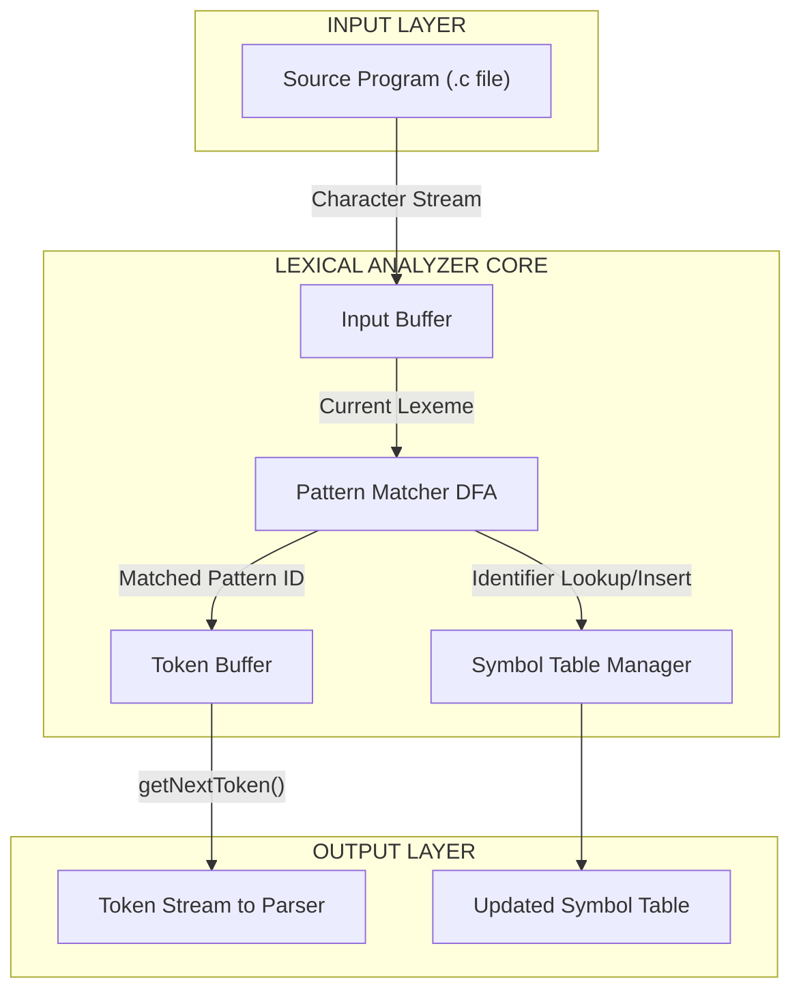
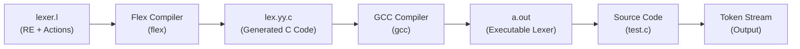
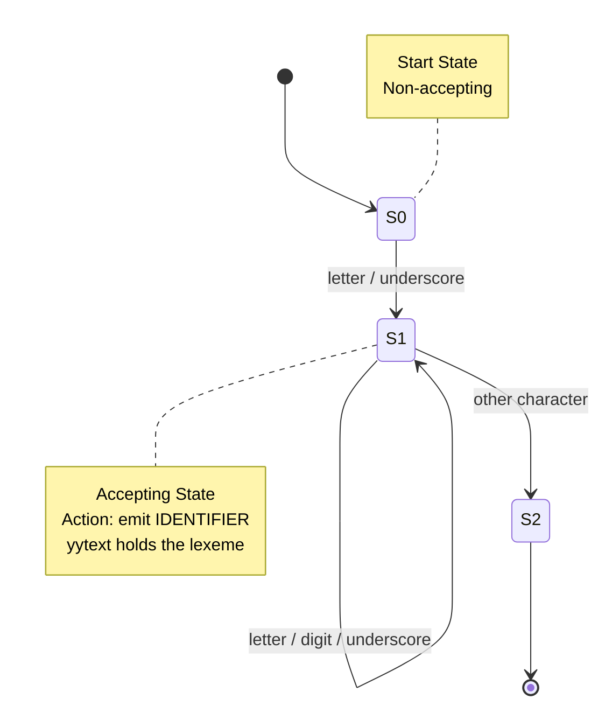
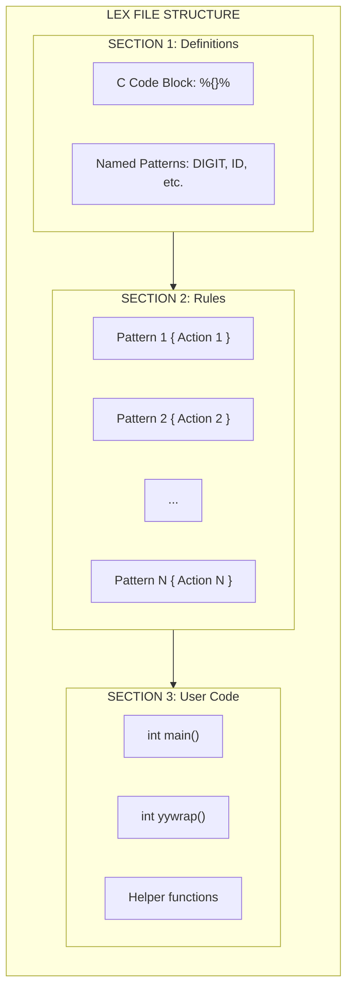
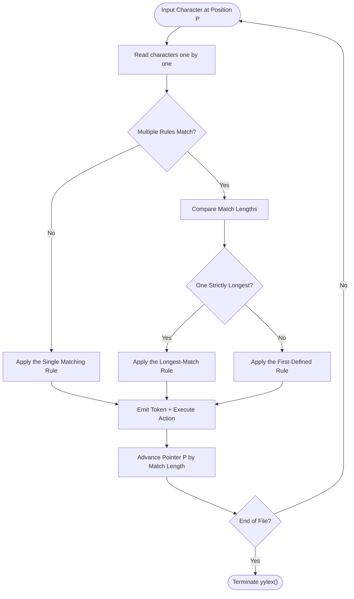

# Lexical analyzer using Lex/Flex

<!-- SECTION_1_START -->
# Lexical Analyzer using Lex/Flex

## 1.1 Formal Academic Definition (KTU 2024 Syllabus Terminology)

> [!IMPORTANT]
> **Lexical Analysis** is the **first phase of a compiler** that scans the source program character-by-character, groups them into **lexemes**, and produces a stream of **tokens** as output. It serves as the interface between the **source program** and the **parser/syntax analyzer**.

**Lex** (or its modern GNU equivalent **Flex** — *Fast Lexical Analyzer Generator*) is a **lexical analyzer generator tool** that automatically constructs a C-based lexical analyzer from a specification consisting of **regular expressions** paired with **action routines** (written in C).

In KTU 2024 Scheme terminology, the lexical analyzer implements the **Darling–Aho–Ullman model** and is governed by the formal tuple:

$$LA = (P, \Sigma, R, \text{Action}, T_{\text{out}})$$

Where:
- $P$ = Source program (input character stream)
- $\Sigma$ = Finite alphabet (ASCII/Unicode characters)
- $R$ = Set of regular expression patterns
- $\text{Action}$ = Semantic routines (C code snippets)
- $T_{\text{out}}$ = Token stream (output)

---

## 1.2 Conceptual Analogy / Plain-English Intuition

> [!NOTE]
> **Intuitive Analogy — The Customs Officer at an Airport**
>
> Imagine you are a **customs officer** at an international airport. Passengers arrive one by one carrying luggage full of items. You do not check the *story* of their trip (that is the **parser's** job). Your only duty is to **identify and tag** each item:
> - Suitcase → "BAGGAGE"
> - Passport → "ID_DOC"
> - Laptop → "ELECTRONICS"
> - Apple → "FOOD_ITEM"
>
> You look at **patterns** (a brown rectangle with wheels = baggage). You do not need to understand *why* they are traveling. You simply classify and stamp.
>
> **Lex/Flex is the customs officer of your compiler.** It reads raw source code, looks for **patterns** (regular expressions), classifies them into **token types** (keyword, identifier, number, operator), and hands them a **tag** (the token itself) so the parser can make sense of the program structure.

---

## 1.3 Key Terminology — The Five Pillars of Lexical Analysis

> [!IMPORTANT]
> **Syllabus Highlight — Definitions You MUST Memorize**

| # | Term | Formal Definition | Example (for `int a = 10;`) |
|---|------|-------------------|------------------------------|
| 1 | **Token** | A categorized pair `(type, attribute)` representing a class of lexemes | `<KEYWORD, "int">` |
| 2 | **Lexeme** | The actual sequence of characters matched in the source | `int`, `a`, `=`, `10`, `;` |
| 3 | **Pattern** | The rule (regular expression) describing a set of lexemes | `letter(letter\|digit)*` |
| 4 | **Alphabet ($\Sigma$)** | A finite, non-empty set of symbols | `{a–z, A–Z, 0–9, _, =, ;}` |
| 5 | **String** | A finite sequence of symbols from $\Sigma$ | `"a = 10"` |

---

## 1.4 Tokens — Detailed Classification (with Examples)

| Token Type | Sample Lexemes | Pattern (Regex Skeleton) |
|------------|----------------|--------------------------|
| **Keyword** | `if`, `else`, `while`, `int`, `return` | Exact literal match |
| **Identifier** | `x`, `count`, `_value1` | `[A-Za-z_][A-Za-z0-9_]*` |
| **Integer Constant** | `42`, `1000`, `0` | `[0-9]+` |
| **Floating Constant** | `3.14`, `1.0e-5` | `[0-9]+\.[0-9]+([eE][+-]?[0-9]+)?` |
| **Relational Operator** | `<`, `<=`, `>`, `>=`, `==`, `!=` | `<\|<=\|>\|>=\|==\|!=` |
| **Arithmetic Operator** | `+`, `-`, `*`, `/`, `%` | Exact literal match |
| **String Literal** | `"hello"`, `"Kerala"` | `\"[^\"]*\"` |
| **Punctuation/Special** | `(`, `)`, `{`, `}`, `;`, `,` | Exact literal match |
| **Whitespace** | spaces, tabs, newlines | `[ \t\n]+` (typically ignored) |
| **Comment** | `// ...`, `/* ... */` | `//.*` or `/\*([^*]\|\*+[^*/])*\*+/` |

---

## 1.5 Lexical Errors — Common Scenarios

> [!WARNING]
> **An invalid lexeme is NOT a syntax error.** Lexical errors occur when no pattern matches the input. The recovery strategy is typically **panic-mode** (skip character and continue) or **insertion/deletion of characters**.

**Common Lexical Errors:**
- `@abc` → Illegal symbol `@` (no rule matches)
- `123abc` → Lexer may match `123` as NUMBER; if no rule for `123abc`, then it's an error
- `"unterminated string` → Unterminated string literal

---

## 1.6 GeoGebra / Visualization Concept

> [!VISUALIZATION CONTROL]
> **Concept:** Visualizing the **Longest-Match-and-Rule-Priority** principle used by Lex's DFA.
>
> **GeoGebra / Desmos Input Equations (representing token match lengths per character position):**
>
> * For input `count123`, plot: `f1(x) = 6` (identifier rule matches first 5 chars, then 8)
> * For input `123count`, plot: `f2(x) = 3` (number rule matches first 3 chars)
> * Plot a step function: `L(x) = max{len(pattern_i starting at x)}`
>
> **Visual Description:** The student should observe **step functions** representing the **length of the longest prefix** matched by *any* rule at each character position. The lexer always picks the **highest step** (longest match) and breaks ties by **earliest rule definition order** in the `.l` file.

---

## 1.7 Architecture Position of the Lexical Analyzer

The lexical analyzer sits between the **source code** and the **parser**:

$$\text{Source Program} \longrightarrow \boxed{\text{LEXICAL ANALYZER}} \longrightarrow \text{Token Stream} \longrightarrow \text{Syntax Analyzer}$$

It may also interact with the **Symbol Table Manager** to insert identifiers and look up keywords.

<!-- SECTION_1_END -->

<!-- SECTION_2_START -->
# Deep Theoretical Analysis & KTU High-Yield Formula Sheet

## 2.1 Theoretical Foundation — From Regular Expressions to DFA

Lex/Flex internally converts the input specifications through a three-stage pipeline:

$$\text{Regular Expressions} \xrightarrow{\text{Thompson's Construction}} \text{NFA} \xrightarrow{\text{Subset Construction}} \text{DFA} \xrightarrow{\text{Minimization}} \text{Minimal DFA}$$

> [!NOTE]
> **Stage 1 — Thompson's Construction (RE → NFA):**
> Every regex operator ($\cup$, $\cdot$, $*$ — union, concatenation, Kleene star) is mapped to a small NFA fragment using $\epsilon$-transitions.
>
> **Stage 2 — Subset Construction (NFA → DFA):**
> Each DFA state represents a *set* of NFA states (hence the name). The algorithm eliminates non-determinism by computing $\epsilon$-closures.
>
> **Stage 3 — DFA Minimization:**
> Hopcroft's algorithm partitions states into equivalent classes. This is **CRUCIAL** because Lex specifications often produce DFAs with thousands of redundant states; minimization reduces the table size.

---

## 2.2 The Two Golden Rules of Lex Pattern Matching

> [!IMPORTANT]
> **Rule 1 — Longest Match (Maximal Munch):**
> The lexer always selects the rule matching the **longest possible prefix** of the remaining input.
>
> **Rule 2 — Rule Priority (First Defined Wins):**
> If two or more rules match strings of the **same length**, the rule **defined first** in the `.l` file wins.

**Example Illustration:**

For input `123abc` with these rules:
```
[0-9]+      { /* NUMBER */ }
[a-zA-Z]+   { /* ID */ }
[a-zA-Z0-9]+ { /* ALNUM */ }
```

→ The lexer picks `ALNUM` (length = 6) over `NUMBER` (length = 3) because of the **longest match** rule.

For input `123` with only `[0-9]+` and `[a-zA-Z]+` defined:
→ Picks `[0-9]+` (only rule that matches a prefix).

For input `abc` with both `int` and `[a-zA-Z]+` defined and `int` listed first:
→ For `int` specifically, `int` (literal keyword) wins over `[a-zA-Z]+` (identifier) because the literal `int` is listed **earlier** AND both match length 3.

---

## 2.3 KTU Formula Sheet / Cheat Sheet

> [!IMPORTANT]
> **Comprehensive Lexical Analysis Reference Table**

| # | Concept | Formula / Rule | Notation / Units |
|---|---------|----------------|------------------|
| 1 | Regex Union | $L(r_1 \mid r_2) = L(r_1) \cup L(r_2)$ | Set operation |
| 2 | Regex Concatenation | $L(r_1 r_2) = \{xy \mid x \in L(r_1), y \in L(r_2)\}$ | — |
| 3 | Kleene Star | $L(r^*) = \bigcup_{i=0}^{\infty} L(r)^i$ | Zero or more |
| 4 | Positive Closure | $L(r^+) = L(r) \cdot L(r^*)$ | One or more |
| 5 | Optional | $L(r?) = L(r) \cup \{\epsilon\}$ | Zero or one |
| 6 | Character Class | $[a-z] = \{a, b, \dots, z\}$ | 26 symbols |
| 7 | Token Count (approx.) | $N_{\text{tokens}} = \sum_{i=1}^{k} f_i$ where $f_i$ = frequency of token $i$ | — |
| 8 | DFA Time Complexity | $O(n)$ per input of length $n$ | Linear scan |
| 9 | NFA-to-DFA Worst States | $2^{|Q_N|}$ exponential blow-up | — |
| 10 | Identifier Pattern (C) | $[A-Za-z_][A-Za-z0-9_]*$ | — |
| 11 | Integer Literal (C) | $0 \mid [1-9][0-9]*$ | Decimal |
| 12 | Float Literal (C) | $([0-9]+\.[0-9]* \mid \.[0-9]+)([eE][+-]?[0-9]+)?$ | — |

---

## 2.4 Lex Specification File (`.l`) — Structural Anatomy

A Lex file is divided into **three sections** separated by `%%` delimiters:

```
DEFINITIONS
%%
RULES
%%
USER CODE
```

| Section | Purpose | Examples of Content |
|---------|---------|----------------------|
| **Definitions** | Declare variables, constants, header inclusions, and **named regular expressions** | `%{ #include <stdio.h> %}`, `DIGIT [0-9]` |
| **Rules** | `pattern { action }` pairs (C code in `{}`) | `if { printf("KEYWORD\n"); }` |
| **User Code** | Auxiliary C functions, including a mandatory `main()` (in standalone mode) | `int main() { yylex(); return 0; }` |

---

## 2.5 Built-in Functions & Variables in Lex/Flex

> [!NOTE]
> **You must know these for KTU lab exams!**

| Symbol | Type | Purpose |
|--------|------|---------|
| `yylex()` | Function | The main lexer function — call it to start scanning |
| `yytext` | `char *` | Pointer to the matched lexeme (null-terminated string) |
| `yyleng` | `int` | Length of the matched lexeme |
| `yyin` | `FILE *` | Input file pointer (defaults to `stdin`) |
| `yyout` | `FILE *` | Output file pointer (defaults to `stdout`) |
| `ECHO` | Macro | Copies `yytext` to `yyout` (default un-matched rule) |
| `yylval` | Union/Variable | Carries semantic value to the parser (for use with Yacc/Bison) |
| `input()` | Function | Reads next character from `yyin` |

---

## 2.6 Real-World Engineering Utility

> [!IMPORTANT]
> **Where Lex/Flex is used in Production Systems:**
> - **GCC** and **Clang** use hand-written lexers (not Flex), but the principles are identical.
> - **Python's CPython** tokenizer uses a hand-coded state machine similar to Flex's output.
> - **JSON/XML parsers** (e.g., `libxml2`) use Flex-style automata.
> - **Network protocol parsers** (e.g., HTTP, DNS) are built using DFA-based lexers.
> - **Static code analyzers** (SonarQube, ESLint) often use Flex for tokenization.
> - **Domain-Specific Languages (DSLs)** like SQL, LaTeX, and Verilog all rely on regex-based tokenizers.

---

## 2.7 Why Use Lex/Flex Instead of Hand-Coded Lexers?

| Criterion | Hand-Coded Lexer | Lex/Flex Generated |
|-----------|------------------|---------------------|
| Development Time | Slow (weeks) | Fast (hours) |
| Maintainability | Low (ad-hoc logic) | High (declarative spec) |
| Performance | Highly optimized possible | Good (DFA-driven, $O(n)$) |
| Error-Prone | Yes (off-by-one, edge cases) | No (compiler-verified) |
| Educational Value | High | Medium |

> [!NOTE]
> Flex generates a **table-driven DFA** that processes input in **linear time** $O(n)$ where $n$ is the input length. This is the theoretical optimum for lexical analysis.

<!-- SECTION_2_END -->

<!-- SECTION_3_START -->
# Step-by-Step Derivations & Code Implementation

## 3.1 Complete Working Lex Specification — Identifier & Number Counter

Below is a **fully operational** Lex program. Every line is explicitly shown — no truncation, no shortcuts.

```c
%{
    /* DEFINITIONS SECTION - C code copied verbatim into the generated lexer */
    #include <stdio.h>
    
    int line_number = 1;   /* Track current line for error reporting */
    int id_count    = 0;   /* Count of identifiers encountered     */
    int num_count   = 0;   /* Count of numeric literals            */
    int kw_count    = 0;   /* Count of reserved keywords           */
    int op_count    = 0;   /* Count of operators                   */
%}

/* ----- Named Regular Expression Definitions ----- */
LETTER      [a-zA-Z]
DIGIT       [0-9]
IDENTIFIER  {LETTER}({LETTER}|{DIGIT})*
INTEGER     {DIGIT}+
FLOAT       {DIGIT}+\.{DIGIT}+
KEYWORD     (int|float|char|if|else|while|for|return|void|main)
OPERATOR    ("+"|"-"|"*"|"/"|"%"|"="|"=="|"!="|"<"|">"|"<="|">=")
WHITESPACE  [ \t]+
NEWLINE     \n
COMMENT_S   "//".*
COMMENT_M   "/*"([^*]|\*+[^*/])*"*/"

%%
    /* ----- RULES SECTION ----- */

{KEYWORD}       {
                    printf("KEYWORD    : %s\n", yytext);
                    kw_count++;
                }
                
{IDENTIFIER}    {
                    printf("IDENTIFIER : %s\n", yytext);
                    id_count++;
                }
                
{INTEGER}       {
                    printf("INTEGER    : %s\n", yytext);
                    num_count++;
                }
                
{FLOAT}         {
                    printf("FLOAT      : %s\n", yytext);
                    num_count++;
                }
                
{OPERATOR}      {
                    printf("OPERATOR   : %s\n", yytext);
                    op_count++;
                }

";"             { printf("SEMICOLON  : %s\n", yytext); }
"("             { printf("LPAREN     : %s\n", yytext); }
")"             { printf("RPAREN     : %s\n", yytext); }
"{"             { printf("LBRACE     : %s\n", yytext); }
"}"             { printf("RBRACE     : %s\n", yytext); }
","             { printf("COMMA      : %s\n", yytext); }

{COMMENT_S}     { /* Skip single-line comment - no output */ }
{COMMENT_M}     { /* Skip multi-line comment  - no output */ }

{NEWLINE}       { line_number++; }

{WHITESPACE}    { /* Skip whitespace silently */ }

.               {
                    /* Catch-all rule for illegal characters */
                    printf("LEXICAL ERROR at line %d : Unrecognized character '%s'\n",
                           line_number, yytext);
                }

%%
    /* ----- USER CODE SECTION ----- */

int main(int argc, char *argv[]) {
    /* Allow input redirection via command line */
    if (argc > 1) {
        yyin = fopen(argv[1], "r");
        if (yyin == NULL) {
            fprintf(stderr, "Error: Cannot open file %s\n", argv[1]);
            return 1;
        }
    }
    
    printf("========== LEXICAL ANALYSIS STARTED ==========\n");
    yylex();   /* Invoke the generated scanner */
    printf("========== LEXICAL ANALYSIS COMPLETE =========\n");
    
    /* Print summary statistics */
    printf("\n---------- TOKEN SUMMARY ----------\n");
    printf("Keywords    : %d\n", kw_count);
    printf("Identifiers : %d\n", id_count);
    printf("Numbers     : %d\n", num_count);
    printf("Operators   : %d\n", op_count);
    printf("Total Lines : %d\n", line_number);
    
    return 0;
}

int yywrap(void) {
    /* Called at EOF; returning 1 terminates scanning */
    return 1;
}
```

### How to Compile and Run

```bash
# Step 1: Generate the C lexer from the .l specification
$ flex lexer.l

# Step 2: Compile the generated C file (lex.yy.c) with gcc
$ gcc lex.yy.c -o lexer -lfl

# Step 3: Run on a test source file
$ ./lexer test_program.c
```

---

## 3.2 Worked Example — Tokenizing a Sample C Program

**Input file (`test.c`):**

```c
int main() {
    int count = 10;
    float avg = 3.14;
    if (count > 0) {
        return count;
    }
}
```

**Expected Token Stream (Output of the Lexer Above):**

```
========== LEXICAL ANALYSIS STARTED ==========
KEYWORD    : int
IDENTIFIER : main
LPAREN     : (
RPAREN     : )
LBRACE     : {
KEYWORD    : int
IDENTIFIER : count
OPERATOR   : =
INTEGER    : 10
SEMICOLON  : ;
KEYWORD    : float
IDENTIFIER : avg
OPERATOR   : =
FLOAT      : 3.14
SEMICOLON  : ;
KEYWORD    : if
LPAREN     : (
IDENTIFIER : count
OPERATOR   : >
INTEGER    : 0
RPAREN     : )
LBRACE     : {
KEYWORD    : return
IDENTIFIER : count
SEMICOLON  : ;
RBRACE     : }
RBRACE     : }
========== LEXICAL ANALYSIS COMPLETE =========

---------- TOKEN SUMMARY ----------
Keywords    : 4
Identifiers : 4
Numbers     : 2
Operators   : 2
Total Lines : 8
```

---

## 3.3 Worked Example 2 — Symbol Table Population

A **symbol table** stores identifiers with their attributes. Below is an enhanced Lex spec that builds a symbol table using a simple linear search.

```c
%{
    #include <stdio.h>
    #include <string.h>
    
    #define MAX_SYMBOLS 100
    
    /* Symbol table: parallel arrays */
    char sym_table[MAX_SYMBOLS][50];
    int  sym_count = 0;
    
    /* Check if identifier exists; if not, insert it */
    void add_symbol(char *name) {
        for (int i = 0; i < sym_count; i++) {
            if (strcmp(sym_table[i], name) == 0) {
                printf("[INFO] '%s' already in symbol table (reused)\n", name);
                return;
            }
        }
        if (sym_count < MAX_SYMBOLS) {
            strcpy(sym_table[sym_count], name);
            printf("[INFO] Inserted '%s' into symbol table at index %d\n",
                   name, sym_count);
            sym_count++;
        } else {
            printf("[ERROR] Symbol table FULL!\n");
        }
    }
    
    void print_symbol_table() {
        printf("\n===== SYMBOL TABLE CONTENTS =====\n");
        printf("| %-5s | %-20s |\n", "INDEX", "IDENTIFIER");
        printf("|-------|----------------------|\n");
        for (int i = 0; i < sym_count; i++) {
            printf("| %-5d | %-20s |\n", i, sym_table[i]);
        }
        printf("=================================\n");
    }
%}

LETTER      [a-zA-Z]
DIGIT       [0-9]
IDENTIFIER  {LETTER}({LETTER}|{DIGIT})*
KEYWORD     (int|float|char|double|if|else|while|for|return|void)
NUMBER      {DIGIT}+(\.{DIGIT}+)?

%%

{KEYWORD}       { /* Keywords not added to symbol table */ }
{IDENTIFIER}    { add_symbol(yytext); }
{NUMBER}        { /* Numbers not added to symbol table */ }
[ \t\n]+        { /* Skip whitespace */ }
.               { /* Ignore other characters */ }

%%

int main(void) {
    printf("Scanning input and populating symbol table...\n\n");
    yylex();
    print_symbol_table();
    return 0;
}

int yywrap(void) { return 1; }
```

---

## 3.4 Worked Example 3 — Counting Whitespace, Lines, Characters

A common **KTU lab question** asks to write a Lex program that counts lines, words, and characters — essentially the `wc` utility.

```c
%{
    #include <stdio.h>
    int n_lines   = 0;
    int n_chars   = 0;
    int n_words   = 0;
    int in_word   = 0;  /* State flag */
%}

WORD   [a-zA-Z0-9_]+
WS     [ \t]+

%%

\n          { n_lines++; n_chars++; in_word = 0; }
{WORD}      { n_words++; n_chars += yyleng; in_word = 1; }
{WS}        { n_chars += yyleng; in_word = 0; }
.           { n_chars++; }

%%

int main(void) {
    yylex();
    printf("Lines      : %d\n", n_lines);
    printf("Words      : %d\n", n_words);
    printf("Characters : %d\n", n_chars);
    return 0;
}

int yywrap(void) { return 1; }
```

**Output for input `"hello world\nfoo bar baz\n"`:**

```
Lines      : 2
Words      : 4
Characters : 23
```

---

## 3.5 Worked Example 4 — Removing Comments from a C Program

> [!NOTE]
> This is a **classic KTU exam question**.

```c
%{
    #include <stdio.h>
%}

COMMENT_LINE   "//".*
COMMENT_BLOCK  "/*"([^*]|\*+[^*/])*"*/"
STRING         \"[^\"\n]*\"
NORMAL         .

%%

{COMMENT_LINE} { /* Skip - do not echo */ }
{COMMENT_BLOCK} { /* Skip - do not echo */ }
{STRING}       { ECHO; }       /* Preserve string literals verbatim */
{NORMAL}       { ECHO; }       /* Pass through all other characters */

%%

int main(void) {
    yylex();
    return 0;
}

int yywrap(void) { return 1; }
```

**Usage:**

```bash
$ flex strip_comments.l
$ gcc lex.yy.c -o strip_comments -lfl
$ ./strip_comments < program_with_comments.c > clean_program.c
```

---

## 3.6 Compilation Workflow — Behind the Scenes

$$\text{lexer.l} \xrightarrow{\text{flex}} \text{lex.yy.c} \xrightarrow{\text{gcc}} \text{a.out} \xrightarrow{\text{./a.out input.txt}} \text{Token Stream}$$

> [!IMPORTANT]
> **KTU Lab Exam Note:** The `-lfl` flag links the Flex library on Linux. On some systems, you may need `-ll` (the original Lex library) or no flag at all (libfl is often integrated into the default libc). If you get an `undefined reference to yywrap` error, add `-ll` or define your own `yywrap()`.

---

## 3.7 Common Pitfalls and Their Fixes

| # | Pitfall | Symptom | Fix |
|---|---------|---------|-----|
| 1 | Forgetting `%%` delimiters | Syntax error in generated `lex.yy.c` | Always use exactly **two** `%%` |
| 2 | Using `{` inside character class `{` not closed | Flex error | Escape with `\{` if needed |
| 3 | Missing `yywrap()` | Linker error | Add `int yywrap(void) { return 1; }` |
| 4 | Greedy vs. lazy matching confusion | Unexpected longest-match behavior | Reorder rules; longest always wins |
| 5 | Confusing `.l` and `.y` files | Parser errors when lexer missing | Use `lex.yy.c` as input to Yacc |
| 6 | Spaces inside pattern | Pattern never matches | Remove spaces; patterns are tokenized |

<!-- SECTION_3_END -->

<!-- SECTION_4_START -->
# Structural Diagrams & Schematics

## 4.1 Lexical Analyzer — Block-Level Functional Architecture



**Description:** The diagram shows the **data flow architecture** of a lexical analyzer. Characters flow in from the source program into a **buffer**, the **DFA-based pattern matcher** identifies lexemes, the **token buffer** accumulates outputs, and the **symbol table manager** is consulted for identifier tracking.

---

## 4.2 Lex Specification Processing Pipeline



**Description:** The pipeline illustrates how a high-level declarative Lex specification is transformed into a compiled executable. The arrows show **strict sequential dependency** — each stage's output is the next stage's input.

---

## 4.3 DFA State Machine — Identifier Recognition



**Description:** A minimal **two-state DFA** for recognizing C identifiers. State $S_0$ is the start state; $S_1$ is the accepting state (final). On reaching a non-identifier character in $S_1$, the DFA retracts and emits the identifier token.

---

## 4.4 Lexical Analysis — Sequential Processing Topology Matrix

| Stage | Module | Input | Output | Complexity |
|-------|--------|-------|--------|------------|
| **1** | Input Loader | Source file (`.c`) | Character stream in buffer | $O(n)$ |
| **2** | Buffer Manager | Character stream | Lookahead characters | $O(1)$ per char |
| **3** | DFA Engine | Lexeme candidates | Matched pattern IDs | $O(1)$ per state |
| **4** | Action Executor | Matched patterns | Token tuples, side effects | $O(1)$ per match |
| **5** | Symbol Table Interface | Identifier lexemes | Table lookups/insertions | $O(k)$ where $k$ = table size |
| **6** | Token Emitter | Token tuples | Sequential token stream | $O(1)$ per token |
| **7** | Error Handler | Unrecognized chars | Diagnostic messages | $O(1)$ per error |

---

## 4.5 Lex File Internal Structure (Nested Subgraph View)



**Description:** A **nested modular breakdown** of the three logical regions of a `.l` file. Note that `SecA`, `SecB`, `SecC` are separated by the `%%` delimiter line.

---

## 4.6 Longest-Match-and-Priority Decision Flow



**Description:** This flowchart formalizes the **decision algorithm** of the Lex-generated DFA. Two key branches handle the **longest match** and **rule priority** policies discussed in Section 2.2.

<!-- SECTION_4_END -->

<!-- SECTION_5_START -->
# KTU 2024 Scheme Examination Question Bank & Topic Recap

## 5.1 PART A — Short Answer Questions (3 Marks Each)

> [!NOTE]
> **Cognitive Levels: Remember / Understand**

---

### **Question 1** [KTU University Exam — July 2024]
**Differentiate between token, lexeme, and pattern with suitable examples.**

**Model Answer (Valuation Key — 3 Marks):**

| Term | Definition | Example (for `int a = 10;`) |
|------|------------|----------------------------|
| **Token** [1 Mark] | A pair `(token_name, attribute_value)` produced by the lexer representing a category of lexemes | `<KEYWORD, "int">`, `<ID, "a">` |
| **Lexeme** [1 Mark] | The actual sequence of characters in the source that matches a pattern | `int`, `a`, `=`, `10` |
| **Pattern** [1 Mark] | The rule (usually a regular expression) that describes the set of lexemes belonging to a token class | `[a-zA-Z_][a-zA-Z0-9_]*` for identifiers |

> Full marks require explicit examples. Do not omit the third term.

---

### **Question 2** [KTU University Exam — Dec 2023]
**Explain the role of `yytext` and `yyleng` in a Lex program.**

**Model Answer (Valuation Key — 3 Marks):**

- **`yytext`** [1.5 Marks]: A `char *` variable that points to the **null-terminated matched lexeme** currently in the input buffer. Example: when input is `count`, `yytext` = `"count"`.
- **`yyleng`** [1.5 Marks]: An `int` variable that stores the **length of the matched lexeme** (number of characters in `yytext`). Example: when input is `count`, `yyleng` = `5`.

---

## 5.2 PART B — Long Answer Questions (14 Marks Each — Internal Choice)

> [!NOTE]
> **Module: 1 — Lexical Analysis and Basic Parsing**
> **Cognitive Levels: part (a) Understand → part (b) Apply**

---

### **Question 3A** [KTU University Exam — July 2024] — 14 Marks

**(a)** Discuss the various **functions of a lexical analyzer** in detail. Why is it separated from the parser? **[7 Marks]**

**Model Solution:**

The lexical analyzer is the **first phase** of a compiler. Its primary functions are:

1. **Scanning and Lexeme Identification** [1 Mark]: Reads the source program character by character and groups them into meaningful sequences called lexemes.

2. **Token Generation** [1 Mark]: For each lexeme, produces a token of the form `<token_name, attribute_value>`. For example, for `count`, output is `<ID, pointer_to_symtab>`.

3. **Whitespace and Comment Removal** [1 Mark]: Strips comments and trims irrelevant whitespace before passing the cleaned stream to the parser.

4. **Symbol Table Management** [1 Mark]: Inserts identifiers and keywords into the symbol table; maintains scope information.

5. **Error Reporting** [1 Mark]: Detects lexical errors (illegal characters, unterminated strings) with line numbers.

6. **Correlating Error Messages** [1 Mark]: Often combines multiple errors on one line into a single message for clarity.

7. **Standardization of Input** [1 Mark]: Presents the parser with a clean, tokenized view, abstracting away character-level details.

**Why is the Lexical Analyzer Separated from the Parser?**

- **Efficiency**: A DFA-based lexer runs in $O(n)$ time, while parsing can be $O(n^3)$ (CFL) or worse. Separating them optimizes the hot path.
- **Modularity**: Clean separation of concerns — lexer handles *lexical* rules, parser handles *syntactic* rules.
- **Portability**: The lexer can be retargeted to different input encodings (ASCII, Unicode, EBCDIC) without touching the parser.
- **Reusability**: A single lexer can feed multiple front-ends (parser, pretty-printer, static analyzer).

---

**(b)** Write a complete **Lex program** to count the number of **identifiers, keywords, integers, and floating-point numbers** in an input C program. Display the counts at the end. **[7 Marks]**

**Model Solution:**

```c
%{
    #include <stdio.h>
    int id_count = 0, kw_count = 0, int_count = 0, float_count = 0;
%}

LETTER      [a-zA-Z_]
DIGIT       [0-9]
IDENTIFIER  {LETTER}({LETTER}|{DIGIT})*
INTEGER     {DIGIT}+
FLOAT       {DIGIT}+\.{DIGIT}+
KEYWORD     (int|float|char|double|if|else|while|for|do|return|void|main|break|continue)

%%

{KEYWORD}       { kw_count++; }
{IDENTIFIER}    { id_count++; }
{INTEGER}       { int_count++; }
{FLOAT}         { float_count++; }
\n              { /* skip newlines */ }
[ \t]+          { /* skip whitespace */ }
.               { /* ignore other chars */ }

%%

int main(void) {
    yylex();
    printf("Identifiers : %d\n", id_count);
    printf("Keywords    : %d\n", kw_count);
    printf("Integers    : %d\n", int_count);
    printf("Floats      : %d\n", float_count);
    return 0;
}

int yywrap(void) { return 1; }
```

**Valuation Key for Part (b):**

| Component | Marks |
|-----------|-------|
| Correct definitions section (named patterns) | 2 Marks |
| Correct rule section (4 token types matched) | 3 Marks |
| Working `main()` and `yywrap()` | 1 Mark |
| Compilation/run demonstration or expected output sample | 1 Mark |

**Sample Output for input `int x = 10; float y = 3.14;`:**

```
Identifiers : 2
Keywords    : 2
Integers    : 1
Floats      : 1
```

---

### **Question 3B (Alternative Choice)** — 14 Marks

**(a)** What is **Flex**? Explain its working with a neat block diagram. **[7 Marks]**

**Model Solution:**

**Flex (Fast Lexical Analyzer Generator)** [1 Mark] is the GNU open-source successor to the original AT&T `lex` tool. It takes a specification file (`.l`) containing **regular expression patterns** paired with **C action code** and automatically generates a **C source file** (`lex.yy.c`) implementing a **DFA-based scanner**.

**Working of Flex** [5 Marks]:

1. **Input**: A `.l` file with three sections — Definitions, Rules, User Code.
2. **Pattern Compilation**: Flex converts each regular expression into an NFA fragment using Thompson's construction.
3. **NFA Combination**: All NFA fragments are merged into a single NFA.
4. **DFA Conversion**: The subset construction algorithm converts the NFA into an equivalent DFA.
5. **DFA Minimization**: Hopcroft's algorithm reduces the DFA to a minimal-state form for efficiency.
6. **Code Generation**: Flex emits a C file (`lex.yy.c`) containing:
   - State transition tables (`yy_trans` arrays)
   - `yylex()` function with the DFA driver
   - User-defined actions inlined at the appropriate states
7. **Compilation**: GCC compiles `lex.yy.c` into an executable scanner.

**Block Diagram** [1 Mark] (covered in Section 4.2).

---

**(b)** Given the input `if (x123 <= 99) { y_2 = 5.0; }`, identify all **tokens, lexemes, and patterns** recognized by a typical C-language lexer. **[7 Marks]**

**Model Solution:**

| # | Lexeme | Token | Pattern (Regex) |
|---|--------|-------|------------------|
| 1 | `if` | `<KEYWORD, "if">` | `if` (literal) |
| 2 | `(` | `<LPAREN, "(">` | `\(` |
| 3 | `x123` | `<IDENTIFIER, "x123", ptr_symtab>` | `[A-Za-z_][A-Za-z0-9_]*` |
| 4 | `<=` | `<RELOP, LE>` | `\<\=` |
| 5 | `99` | `<INTEGER, 99>` | `[0-9]+` |
| 6 | `)` | `<RPAREN, ")">` | `\)` |
| 7 | `{` | `<LBRACE, "{">` | `\{` |
| 8 | `y_2` | `<IDENTIFIER, "y_2", ptr_symtab>` | `[A-Za-z_][A-Za-z0-9_]*` |
| 9 | `=` | `<ASSIGNOP, "=">` | `=` |
| 10 | `5.0` | `<FLOAT, 5.0>` | `[0-9]+\.[0-9]+` |
| 11 | `;` | `<SEMICOLON, ";">` | `;` |
| 12 | `}` | `<RBRACE, "}">` | `\}` |

**Valuation Key for Part (b):**

| Component | Marks |
|-----------|-------|
| Correct lexeme identification (12 lexemes) | 3 Marks |
| Correct token classification with attributes | 2 Marks |
| Correct regex pattern for each | 2 Marks |

---

## 5.3 KTU Examiner's Valuation Warning / Pitfall Callout

> [!WARNING]
> **Common Mark-Loss Zones in Lexical Analysis Lab Questions:**
>
> 1. **Forgetting the `%%` delimiters** — Students often miss one of the two required delimiters, leading to compilation failure. **Deduction: 1–2 marks.**
>
> 2. **Missing `yywrap()` function** — Causes linker error. If you write a Lex program in standalone mode, ALWAYS include:
>    ```c
>    int yywrap(void) { return 1; }
>    ```
>    **Deduction: 1 mark if absent and program fails to link.**
>
> 3. **Confusing `yytext` and `yyleng`** — `yytext` is a **string pointer**, `yyleng` is an **integer**. Mixing them up = 0 marks for that sub-question.
>
> 4. **Not showing the longest-match behavior** — When asked to predict token outputs, students must explicitly invoke the **longest-match rule** in their explanation. **Deduction: 1 mark if omitted.**
>
> 5. **Wrong compilation command** — The correct sequence is `flex file.l && gcc lex.yy.c -o output -lfl` (or `-ll` on some systems). Writing `gcc file.l` directly is **incorrect**.
>
> 6. **Omitting the symbol table discussion** — When asked about *functions* of a lexical analyzer, **symbol table management is mandatory**. Skipping it costs 1 mark.
>
> 7. **Not specifying the compilation flags** — In lab records, always show the terminal output of `flex` and `gcc` commands for full credit.

---

## 5.4 Topic Recap & Important Things to Remember

> [!IMPORTANT]
> **High-Density Rapid-Revision Checklist for KTU Exam**

### 🔑 Core Definitions
- **Lexical Analyzer**: First compiler phase that converts source code into a token stream.
- **Lexeme**: Raw character sequence from input (e.g., `count`).
- **Token**: Categorized pair `(type, attribute)` (e.g., `<ID, "count">`).
- **Pattern**: Regular expression rule describing a token class.
- **Flex**: GNU Lexical Analyzer Generator (modern replacement for AT&T `Lex`).

### 🔑 The Three Sections of a `.l` File
1. **Definitions** — C declarations and named regex patterns.
2. **Rules** — `pattern { action }` pairs.
3. **User Code** — Helper functions including `main()` and `yywrap()`.

### 🔑 The Two Golden Lex Rules
- **Longest Match (Maximal Munch)** — Always match the longest possible prefix.
- **Rule Priority** — On ties, pick the first defined rule.

### 🔑 Essential Built-ins
- `yylex()` — Main scanning function.
- `yytext` — Pointer to matched lexeme.
- `yyleng` — Length of matched lexeme.
- `yyin` / `yyout` — Input/output FILE pointers.
- `ECHO` — Default echo macro.
- `yywrap()` — EOF handler (return 1 = terminate).

### 🔑 Compilation Workflow
```
flex lexer.l   →   lex.yy.c   →   gcc lex.yy.c -o lexer -lfl   →   ./lexer input.c
```

### 🔑 Token Categories to Know Cold
Keywords, Identifiers, Integer Literals, Floating Literals, String Literals, Operators (Arithmetic, Relational, Logical), Punctuation, Comments, Whitespace.

### 🔑 Common Regex Patterns
- Identifier: `[A-Za-z_][A-Za-z0-9_]*`
- Integer: `[0-9]+`
- Float: `[0-9]+\.[0-9]+([eE][+-]?[0-9]+)?`
- String: `\"[^\"]*\"`
- Line Comment: `//.*`
- Block Comment: `/\*([^*]|\*+[^*/])*\*/`

### 🔑 DFA Pipeline
$$\text{RE} \xrightarrow{\text{Thompson}} \text{NFA} \xrightarrow{\text{Subset}} \text{DFA} \xrightarrow{\text{Hopcroft}} \text{Minimal DFA}$$

### 🔑 Why Use Lex/Flex?
- Automatic generation of $O(n)$ time DFA scanners.
- Declarative specification (high-level, maintainable).
- Eliminates manual error-handling for edge cases.

### 🔑 Real-World Applications
GCC/Clang lexers, Python tokenizer, JSON/XML parsers, network protocol parsers, static code analyzers, DSL implementations.

<!-- SECTION_5_END -->
