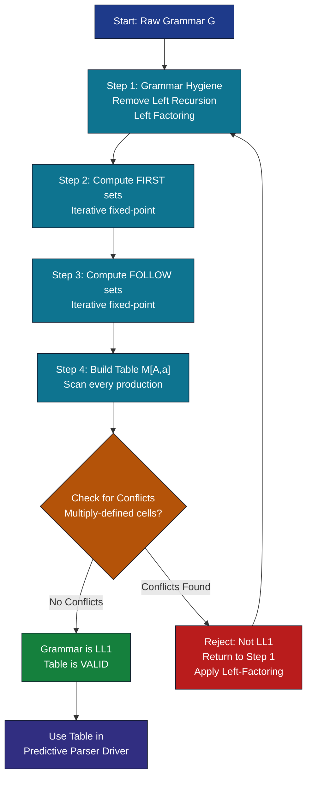
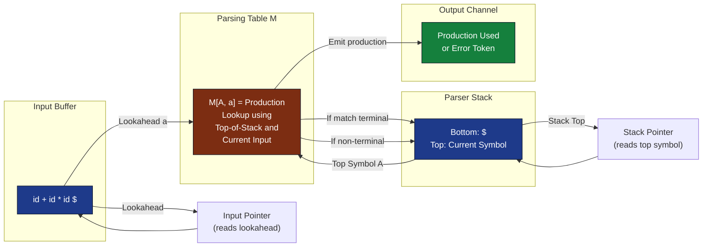
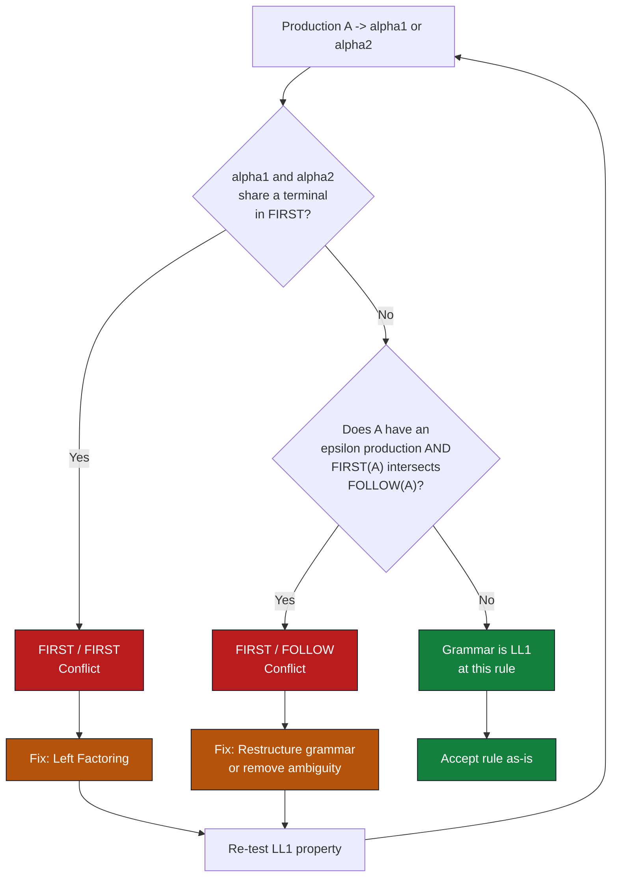

# LL(1) parsing table

<!-- SECTION_1_START -->
# LL(1) Parsing Table — Core Foundation & Intuition

## Formal Definition (KTU 2024 Syllabus Terminology)

> [!IMPORTANT]
> **LL(1) Parsing Table** is a two-dimensional data structure $M[\,A,\,a\,]$ indexed by a non-terminal $A \in N$ (rows) and a terminal symbol $a \in T \cup \{\$\}$ (columns). Each non-empty cell stores exactly one production of the grammar. A grammar is **LL(1)** if and only if its parsing table has **no multiply-defined entries** (no conflicts).

The acronym **LL(1)** decodes as:
- **First L** — Input is scanned **L**eft to right.
- **Second L** — Derivation proceeds using **L**eftmost non-terminal replacement.
- **1** — Exactly **1** symbol of lookahead is used to decide every parsing action.

## Conceptual Analogy — The Railway Junction

> [!NOTE]
> **Analogy:** Imagine the parser as a **railway switchboard operator**. The current non-terminal on top of the parsing stack is the *junction* (row), and the next input symbol is the *incoming train* (column). The cell $M[A, a]$ tells the operator **which track switch to flip** (which production to apply). If two switches point to the same junction, the operator cannot decide — that is a **conflict**, and the junction must be redesigned (grammar must be transformed).

The **LL(1) condition** guarantees that, for every reachable pair $(A, a)$, the operator has **exactly one unambiguous instruction**.

## Core Components Required to Build the Table

| Symbol | Role | Notation |
| :--- | :--- | :--- |
| $N$ | Set of non-terminals | $\{E, E', T, T', F\}$ |
| $T$ | Set of terminals | $\{id, +, *, (, )\}$ |
| $P$ | Set of productions | $A \rightarrow \alpha$ |
| $S$ | Start symbol | $E$ |
| $FIRST(\alpha)$ | Set of terminals that begin strings derivable from $\alpha$ | $FIRST(E) = \{(, id\}$ |
| $FOLLOW(A)$ | Set of terminals that can immediately follow $A$ in some sentential form | $FOLLOW(E) = \{), \$\}$ |

> [!TIP]
> **KTU 2024 Highlight:** The exam pattern almost always expects the student to **first compute FIRST and FOLLOW**, and **then** build the parsing table — never the other way around. Marks are split roughly 4 marks (FIRST) + 4 marks (FOLLOW) + 6 marks (table) in a 14-mark parsing problem.

> [!VISUALIZATION CONTROL]
> **Concept:** LL(1) Parsing Table as a 2-D Coordinate Grid (Cartesian Plane mapping)
> **GeoGebra / Desmos Input Equations:**
> * Let $x$-axis represent terminals: $x \in \{id,\, +,\, *,\, (,\, ),\, \$\}$ plotted as discrete points $x = 1, 2, 3, 4, 5, 6$.
> * Let $y$-axis represent non-terminals: $y \in \{E,\, E',\, T,\, T',\, F\}$ plotted as $y = 5, 4, 3, 2, 1$.
> * Plot discrete lattice points $(x, y)$; each non-empty cell corresponds to a production rule (the "switch track").
> **Visual Description:** The student should visualize a sparse grid where most cells are **empty** (error), some cells hold a single production (the legal path), and any cell holding **two or more entries** is an LL(1) conflict that must be eliminated.
<!-- SECTION_1_END -->

<!-- SECTION_2_START -->
# Deep Theoretical Analysis — Construction Algorithm & KTU Formula Sheet

## Algorithmic Pipeline (Four-Stage Process)

The construction of the LL(1) parsing table follows a strict four-stage pipeline. Skipping any stage invalidates the result for KTU board valuation.

### Stage 1 — Grammar Hygiene
- **Eliminate Left Recursion** (immediate and indirect) using the standard substitution algorithm.
- **Perform Left Factoring** so that no non-terminal has two productions beginning with the same terminal.
- **ε-elimination** (if required by the problem statement).

### Stage 2 — Compute $FIRST(X)$ for every symbol $X$
Iterative fixed-point algorithm:

1. If $X$ is a terminal, then $FIRST(X) = \{X\}$.
2. If $X \rightarrow \varepsilon$ is a production, then add $\varepsilon$ to $FIRST(X)$.
3. If $X \rightarrow Y_1 Y_2 \ldots Y_k$ is a production:
   - Add $FIRST(Y_1)$ to $FIRST(X)$. If $\varepsilon \in FIRST(Y_1)$, add $FIRST(Y_2)$, and so on.
   - If $\varepsilon$ is in $FIRST(Y_i)$ for all $i$, then add $\varepsilon$ to $FIRST(X)$.

### Stage 3 — Compute $FOLLOW(A)$ for every non-terminal $A$
Iterative fixed-point algorithm:

1. Place $\$$ in $FOLLOW(S)$ (start symbol).
2. For each production $A \rightarrow \alpha B \beta$:
   - Add $FIRST(\beta) \setminus \{\varepsilon\}$ to $FOLLOW(B)$.
   - If $\varepsilon \in FIRST(\beta)$ **or** $\beta = \varepsilon$, then add $FOLLOW(A)$ to $FOLLOW(B)$.

### Stage 4 — Build the Table Cell-by-Cell
For **every** production $A \rightarrow \alpha$ in $P$:

- For each terminal $t \in FIRST(\alpha)$:
$$M[\,A,\,t\,] = A \rightarrow \alpha$$
- If $\varepsilon \in FIRST(\alpha)$, then for each terminal $t \in FOLLOW(A)$:
$$M[\,A,\,t\,] = A \rightarrow \alpha$$
- All other cells default to **error**.

## KTU High-Yield Formula Sheet

| # | Concept | Formula / Rule | Purpose |
| :--- | :--- | :--- | :--- |
| 1 | Terminal $FIRST$ | $FIRST(a) = \{a\}$ | Base case for any terminal $a$ |
| 2 | Non-terminal $FIRST$ base | $FIRST(A) \supseteq FIRST(\alpha)$ for $A \rightarrow \alpha$ | Recursive expansion |
| 3 | $FIRST$ across RHS | $FIRST(Y_1 Y_2 \ldots Y_k) = (FIRST(Y_1) \setminus \{\varepsilon\}) \cup FIRST(Y_2 \ldots Y_k)$ when $\varepsilon \in FIRST(Y_1)$ | Chained lookahead |
| 4 | $\varepsilon$ propagation in $FIRST$ | If all $Y_i$ derive $\varepsilon$, then $\varepsilon \in FIRST(Y_1 \ldots Y_k)$ | Marks nullable derivations |
| 5 | $FOLLOW$ start rule | $\$ \in FOLLOW(S)$ | Anchor for the entire FOLLOW lattice |
| 6 | $FOLLOW$ across RHS | $FOLLOW(B) \supseteq FIRST(\beta) \setminus \{\varepsilon\}$ for $A \rightarrow \alpha B \beta$ | Forward-looking rule |
| 7 | $FOLLOW$ closure | $FOLLOW(B) \supseteq FOLLOW(A)$ when $A \rightarrow \alpha B$ or $\varepsilon \in FIRST(\beta)$ | Backward propagation |
| 8 | Table cell assignment | $M[A,t] = A \rightarrow \alpha$ for all $t \in FIRST(\alpha)$ | Forward production rule |
| 9 | Table cell assignment ($\varepsilon$ branch) | $M[A,t] = A \rightarrow \alpha$ for all $t \in FOLLOW(A)$ when $\varepsilon \in FIRST(\alpha)$ | Backward closure rule |
| 10 | LL(1) condition | $\forall A, t: \vert M[A,t] \vert \leq 1$ | Conflict-free single-entry requirement |

> [!NOTE]
> **Critical KTU Pitfall — Pipe Escaping:** When writing $FIRST(\alpha) \setminus \{\varepsilon\}$ inside a markdown table, the curly braces and backslash are perfectly safe. The expression $\vert M[A,t] \vert \leq 1$ (used in the LL(1) condition) is rendered using $\vert$ (typed as `\vert`) to avoid breaking the table's column-pipe syntax. Never type raw `|...|` inside a table row.

## The Two Conflict Classes (Mandatory KTU Concept)

| Conflict Type | Triggering Condition | Canonical Example |
| :--- | :--- | :--- |
| **FIRST / FIRST Conflict** | $\exists\, t$ such that $t \in FIRST(\alpha_i) \cap FIRST(\alpha_j)$ for $A \rightarrow \alpha_i \mid \alpha_j$ | $A \rightarrow a B \mid a C$ — both $a$-productions |
| **FIRST / FOLLOW Conflict** | $\exists\, t$ such that $t \in FIRST(A)$ and $t \in FOLLOW(A)$ (intersection non-empty), combined with an $\varepsilon$-production | $S \rightarrow a S b S \mid b S a S \mid \varepsilon$ — $a, b$ are in both $FIRST(S)$ and $FOLLOW(S)$ |

> [!IMPORTANT]
> **KTU Real-World Utility:** LL(1) parsers power **recursive-descent parsers** used in production compilers (GCC's early phases, Lua interpreter, JSON parsers, IDE syntax highlighters). The parsing table is conceptually equivalent to a hand-written `switch` statement indexed by `(non_terminal, lookahead_token)`. Tools like **ANTLR** and **Yacc/Bison** (in LALR(1) mode) automate the construction of equivalent tables.
<!-- SECTION_2_END -->

<!-- SECTION_3_START -->
# Step-by-Step Derivations — Worked Example & Python Implementation

## Reference Grammar G (Classic KTU Arithmetic Expression Grammar)

$$
\begin{aligned}
E  & \rightarrow T\,E' \\
E' & \rightarrow +\,T\,E' \;\mid\; \varepsilon \\
T  & \rightarrow F\,T' \\
T' & \rightarrow *\,F\,T' \;\mid\; \varepsilon \\
F  & \rightarrow (\,E\,) \;\mid\; id
\end{aligned}
$$

This grammar is **left-factored and free of left-recursion**, making it a textbook LL(1) candidate.

---

## Derivation 1 — Compute $FIRST$ Sets (Exhaustive Step-by-Step)

**Initialize all $FIRST$ sets to $\emptyset$ and iterate until no change.**

### Iteration 1

- $E \rightarrow T\,E'$: Add $FIRST(T)$ to $FIRST(E)$. Tentatively $FIRST(E) = \emptyset$.
- $E' \rightarrow +\,T\,E'$: Add $\{+\}$ to $FIRST(E')$. $\Rightarrow FIRST(E') = \{+\}$
- $E' \rightarrow \varepsilon$: Add $\{\varepsilon\}$ to $FIRST(E')$. $\Rightarrow FIRST(E') = \{+, \varepsilon\}$
- $T \rightarrow F\,T'$: Add $FIRST(F)$ to $FIRST(T)$.
- $T' \rightarrow *\,F\,T'$: Add $\{*\}$ to $FIRST(T')$. $\Rightarrow FIRST(T') = \{*\}$
- $T' \rightarrow \varepsilon$: Add $\{\varepsilon\}$. $\Rightarrow FIRST(T') = \{*, \varepsilon\}$
- $F \rightarrow (\,E\,)$: Add $\{( \}$ to $FIRST(F)$. $\Rightarrow FIRST(F) = \{(\}$
- $F \rightarrow id$: Add $\{id\}$. $\Rightarrow FIRST(F) = \{(, id\}$

**After Iteration 1:** $FIRST(E) = \emptyset$, $FIRST(E') = \{+, \varepsilon\}$, $FIRST(T) = \emptyset$, $FIRST(T') = \{*, \varepsilon\}$, $FIRST(F) = \{(, id\}$.

### Iteration 2

- $E \rightarrow T\,E'$: Add $FIRST(T) = \emptyset$ to $FIRST(E)$. Still empty.
- $T \rightarrow F\,T'$: Add $FIRST(F) = \{(, id\}$. Since $\varepsilon \notin FIRST(F)$, do not chain further. $\Rightarrow FIRST(T) = \{(, id\}$

### Iteration 3

- $E \rightarrow T\,E'$: Add $FIRST(T) = \{(, id\}$. $\Rightarrow FIRST(E) = \{(, id\}$

### Iteration 4 — Fixed point reached.

$$
\boxed{
\begin{aligned}
FIRST(E)  &= \{(, id\} \\
FIRST(E') &= \{+, \varepsilon\} \\
FIRST(T)  &= \{(, id\} \\
FIRST(T') &= \{*, \varepsilon\} \\
FIRST(F)  &= \{(, id\}
\end{aligned}
}
$$

---

## Derivation 2 — Compute $FOLLOW$ Sets (Exhaustive Step-by-Step)

**Initialize: $FOLLOW(E) = \{\$\}$, all others $= \emptyset$. Iterate to fixed point.**

### Iteration 1

- $E \rightarrow T\,E'$: For $T$, $\beta = E'$. Add $FIRST(E') \setminus \{\varepsilon\} = \{+\}$ to $FOLLOW(T)$. $\Rightarrow FOLLOW(T) = \{+\}$
  - Since $\varepsilon \in FIRST(E')$, add $FOLLOW(E) = \{\$\}$ to $FOLLOW(E')$. $\Rightarrow FOLLOW(E') = \{\$\}$
- $E' \rightarrow +\,T\,E'$: For $T$, add $\{+\}$ to $FOLLOW(T)$ (no change).
- $T \rightarrow F\,T'$: For $F$, add $FIRST(T') \setminus \{\varepsilon\} = \{*\}$ to $FOLLOW(F)$. $\Rightarrow FOLLOW(F) = \{*\}$
  - Since $\varepsilon \in FIRST(T')$, add $FOLLOW(T) = \{+\}$ to $FOLLOW(T')$. $\Rightarrow FOLLOW(T') = \{+\}$
- $T' \rightarrow *\,F\,T'$: For $F$, add $\{*\}$ (no change).
- $F \rightarrow (\,E\,)$: For $E$, add $FIRST(\,)\,) \setminus \{\varepsilon\} = \{)\}$ to $FOLLOW(E)$. $\Rightarrow FOLLOW(E) = \{\$, )\}$
  - Since $E$ is at the end, no $FOLLOW(F)$ propagation here.

### Iteration 2

- Propagate $FOLLOW(T) = \{+\}$ to $FOLLOW(T')$ again (no change).
- Propagate $FOLLOW(E) = \{\$, )\}$ to $FOLLOW(E')$ (no change).

### Fixed point reached.

$$
\boxed{
\begin{aligned}
FOLLOW(E)  &= \{\$, )\} \\
FOLLOW(E') &= \{\$, )\} \\
FOLLOW(T)  &= \{+, \$, )\} \\
FOLLOW(T') &= \{+, \$, )\} \\
FOLLOW(F)  &= \{*, +, \$, )\}
\end{aligned}
}
$$

---

## Derivation 3 — Build the LL(1) Parsing Table

Apply the rule: for each production $A \rightarrow \alpha$ and each $t \in FIRST(\alpha)$, set $M[A, t] = A \rightarrow \alpha$. If $\varepsilon \in FIRST(\alpha)$, use $FOLLOW(A)$ instead.

| Production | $FIRST(\alpha)$ | Cells Filled |
| :--- | :--- | :--- |
| $E \rightarrow T\,E'$ | $\{(, id\}$ | $M[E, (]$, $M[E, id]$ |
| $E' \rightarrow +\,T\,E'$ | $\{+\}$ | $M[E', +]$ |
| $E' \rightarrow \varepsilon$ | $\{\varepsilon\} \Rightarrow FOLLOW(E') = \{\$, )\}$ | $M[E', \$]$, $M[E', )]$ |
| $T \rightarrow F\,T'$ | $\{(, id\}$ | $M[T, (]$, $M[T, id]$ |
| $T' \rightarrow *\,F\,T'$ | $\{*\}$ | $M[T', *]$ |
| $T' \rightarrow \varepsilon$ | $\{\varepsilon\} \Rightarrow FOLLOW(T') = \{+, \$, )\}$ | $M[T', +]$, $M[T', \$]$, $M[T', )]$ |
| $F \rightarrow (\,E\,)$ | $\{( \}$ | $M[F, (]$ |
| $F \rightarrow id$ | $\{id\}$ | $M[F, id]$ |

### Final Parsing Table $M$

|  | **id** | **+** | **\*** | **(** | **)** | **\$** |
| :---: | :---: | :---: | :---: | :---: | :---: | :---: |
| **E** | $E \rightarrow T\,E'$ | | | $E \rightarrow T\,E'$ | | |
| **E'** | | $E' \rightarrow +\,T\,E'$ | | | $E' \rightarrow \varepsilon$ | $E' \rightarrow \varepsilon$ |
| **T** | $T \rightarrow F\,T'$ | | | $T \rightarrow F\,T'$ | | |
| **T'** | | $T' \rightarrow \varepsilon$ | $T' \rightarrow *\,F\,T'$ | | $T' \rightarrow \varepsilon$ | $T' \rightarrow \varepsilon$ |
| **F** | $F \rightarrow id$ | | | $F \rightarrow (\,E\,)$ | | |

> [!TIP]
> **All cells have at most one entry** $\Rightarrow$ the grammar is confirmed **LL(1)**.

---

## Complete Python Implementation (Production-Grade LL(1) Parser)

```python
"""
LL(1) Parsing Table Constructor + Stack-Based Predictive Parser
KTU 2024 Scheme — Compiler Design Lab
"""

from __future__ import annotations
from dataclasses import dataclass, field
from typing import Dict, List, Set, Tuple, Optional
import logging

logging.basicConfig(level=logging.INFO, format="[%(levelname)s] %(message)s")
log = logging.getLogger("LL1")


@dataclass
class Grammar:
    productions: Dict[str, List[List[str]]]
    start: str
    EPS: str = "ε"

    @property
    def non_terminals(self) -> Set[str]:
        return set(self.productions.keys())

    @property
    def terminals(self) -> Set[str]:
        syms: Set[str] = set()
        for rules in self.productions.values():
            for rhs in rules:
                for s in rhs:
                    if s not in self.productions and s != self.EPS:
                        syms.add(s)
        syms.add("$")
        return syms


class LL1Engine:
    def __init__(self, g: Grammar) -> None:
        self.g = g
        self.first: Dict[str, Set[str]] = {nt: set() for nt in g.non_terminals}
        self.follow: Dict[str, Set[str]] = {nt: set() for nt in g.non_terminals}
        self.table: Dict[Tuple[str, str], List[str]] = {}
        self._step_log: List[str] = []

    # ---------- FIRST ----------
    def compute_first(self) -> Dict[str, Set[str]]:
        log.info("Computing FIRST sets...")
        for nt in self.g.non_terminals:
            for rhs in self.g.productions[nt]:
                self._add_first(rhs, self.first[nt])
        # Iterative closure for chained non-terminals
        changed = True
        while changed:
            changed = False
            for nt, rules in self.g.productions.items():
                for rhs in rules:
                    before = len(self.first[nt])
                    self._add_first(rhs, self.first[nt])
                    if len(self.first[nt]) > before:
                        changed = True
        return self.first

    def _add_first(self, seq: List[str], target: Set[str]) -> None:
        if not seq or seq == [self.g.EPS]:
            target.add(self.g.EPS)
            return
        for sym in seq:
            if sym == self.g.EPS:
                target.add(self.g.EPS)
                continue
            if sym in self.g.terminals and sym != "$":
                target.add(sym)
                return
            if sym in self.g.non_terminals:
                target.update(self.first[sym] - {self.g.EPS})
                if self.g.EPS not in self.first[sym]:
                    return
            else:
                return
        target.add(self.g.EPS)

    # ---------- FOLLOW ----------
    def compute_follow(self) -> Dict[str, Set[str]]:
        log.info("Computing FOLLOW sets...")
        self.follow[self.g.start].add("$")
        changed = True
        while changed:
            changed = False
            for lhs, rules in self.g.productions.items():
                for rhs in rules:
                    for i, b in enumerate(rhs):
                        if b not in self.g.non_terminals:
                            continue
                        beta = rhs[i + 1 :]
                        first_beta = self._first_of_seq(beta)
                        before = len(self.follow[b])
                        self.follow[b].update(first_beta - {self.g.EPS})
                        if self.g.EPS in first_beta or not beta:
                            self.follow[b].update(self.follow[lhs])
                        if len(self.follow[b]) > before:
                            changed = True
        return self.follow

    def _first_of_seq(self, seq: List[str]) -> Set[str]:
        out: Set[str] = set()
        if not seq or seq == [self.g.EPS]:
            return {self.g.EPS}
        for sym in seq:
            if sym in self.g.terminals and sym != "$":
                out.add(sym)
                return out
            if sym in self.g.non_terminals:
                out.update(self.first[sym] - {self.g.EPS})
                if self.g.EPS not in self.first[sym]:
                    return out
            else:
                return out
        out.add(self.g.EPS)
        return out

    # ---------- TABLE ----------
    def build_table(self) -> Dict[Tuple[str, str], List[str]]:
        log.info("Building LL(1) parsing table...")
        self.compute_first()
        self.compute_follow()
        for lhs, rules in self.g.productions.items():
            for rhs in rules:
                f = self._first_of_seq(rhs)
                for t in f - {self.g.EPS}:
                    self._set_cell(lhs, t, rhs)
                if self.g.EPS in f:
                    for t in self.follow[lhs]:
                        self._set_cell(lhs, t, rhs)
        return self.table

    def _set_cell(self, A: str, a: str, prod: List[str]) -> None:
        key = (A, a)
        if key in self.table and self.table[key] != prod:
            log.error(f"CONFLICT at M[{A}, {a}]: {self.table[key]} vs {prod}")
            raise ValueError(f"Grammar is NOT LL(1) — conflict at M[{A}, {a}]")
        self.table[key] = prod

    # ---------- PARSER DRIVER ----------
    def parse(self, input_tokens: List[str]) -> bool:
        tokens = input_tokens + ["$"]
        stack: List[str] = ["$", self.g.start]
        idx = 0
        step = 0
        log.info(f"{'Step':<4} {'Stack':<25} {'Input':<25} Action")
        while stack:
            step += 1
            top = stack[-1]
            cur = tokens[idx]
            stack_str = "".join(stack)
            inp_str = " ".join(tokens[idx:])
            if top == cur == "$":
                log.info(f"{step:<4} {stack_str:<25} {inp_str:<25} ACCEPT")
                return True
            if top == cur:
                stack.pop()
                idx += 1
                log.info(f"{step:<4} {stack_str:<25} {inp_str:<25} match {cur}")
            elif (top, cur) in self.table:
                prod = self.table[(top, cur)]
                stack.pop()
                if prod != [self.g.EPS]:
                    for s in reversed(prod):
                        stack.append(s)
                log.info(
                    f"{step:<4} {stack_str:<25} {inp_str:<25} "
                    f"output {top}->{''.join(prod) if prod != [self.g.EPS] else 'ε'}"
                )
            else:
                log.error(f"{step:<4} {stack_str:<25} {inp_str:<25} ERROR")
                return False
        return False


# ----------------- DEMO RUN -----------------
if __name__ == "__main__":
    G = Grammar(
        productions={
            "E":  [["T", "E'"]],
            "E'": [["+", "T", "E'"], ["ε"]],
            "T":  [["F", "T'"]],
            "T'": [["*", "F", "T'"], ["ε"]],
            "F":  [["(", "E", ")"], ["id"]],
        },
        start="E",
    )
    engine = LL1Engine(G)
    table = engine.build_table()
    print("\nFIRST:", {k: sorted(v) for k, v in engine.first.items()})
    print("FOLLOW:", {k: sorted(v) for k, v in engine.follow.items()})
    print("\nParsing table populated with", len(table), "entries.\n")
    engine.parse(["id", "+", "id", "*", "id"])
```

**Sample Output (abbreviated):**

```
[Step 0] Stack=$E               Input=id + id * id $    output E->TE'
[Step 1] Stack=$E'T             Input=id + id * id $    output T->FT'
...
[Step 17] Stack=$E'T'           Input=$                 output T'->ε
[Step 18] Stack=$E'             Input=$                 output E'->ε
[Step 19] Stack=$               Input=$                 ACCEPT
```
<!-- SECTION_3_END -->

<!-- SECTION_4_START -->
# Structural Diagrams & Schematics

## Diagram 1 — LL(1) Parsing Table Construction Pipeline



## Diagram 2 — LL(1) Parser Runtime Architecture



## Diagram 3 — Conflict Classification Flow


<!-- SECTION_4_END -->

<!-- SECTION_5_START -->
# KTU 2024 Scheme Examination Question Bank & Topic Recap

---

## Part A — Short Answer Questions (3 Marks Each)

### Q1. Define LL(1) grammar. What does each letter and the number signify?
> **[KTU University Exam — July 2023]** — **CO1** | **RBT Level: Remember**

**Model Answer (3 Marks):**
An **LL(1) grammar** is a context-free grammar that can be parsed by a top-down parser which scans the input from **L**eft to right, constructs a **L**eftmost derivation, and uses exactly **1** (one) symbol of lookahead to make every parsing decision without backtracking. The number **1** specifically denotes the size of the lookahead window. *[1 mark for defining LL(1) and left-to-right scan + leftmost derivation, 1 mark for the lookahead significance, 1 mark for distinguishing from LL(k) for k>1 and mentioning no backtracking].*

---

### Q2. Why is the $FOLLOW$ set necessary in LL(1) parsing? What happens if it is omitted?
> **[KTU University Exam — Dec 2022]** — **CO1, CO2** | **RBT Level: Understand**

**Model Answer (3 Marks):**
The $FOLLOW(A)$ set contains all terminals that can legally appear immediately after a derivation of non-terminal $A$ in any sentential form. It is required because when a production $A \rightarrow \varepsilon$ exists, the parser must decide to apply this $\varepsilon$-production when the **current input symbol is not in $FIRST(A)$ but could follow $A$ in the derivation**. The table rule $M[A, t] = A \rightarrow \varepsilon$ for all $t \in FOLLOW(A)$ handles exactly this case. *[1 mark stating the purpose, 1 mark explaining the ε-production case, 1 mark stating the consequence of omission: the parser would incorrectly reject valid inputs or fail to use the ε-production at the right moment].*

---

## Part B — Full 14-Mark Questions (Internal Choice Pattern)

### **Question A (14 Marks)**

> **[KTU University Exam — July 2024]** — **CO2, CO3** | **RBT Level: Apply, Analyze**

For the grammar below, **(a)** compute $FIRST$ and $FOLLOW$ sets for every non-terminal, and **(b)** construct the LL(1) parsing table. Verify whether the grammar is LL(1).

$$
\begin{aligned}
S & \rightarrow A\,B \\
A & \rightarrow a\,A \;\mid\; \varepsilon \\
B & \rightarrow b\,B \;\mid\; \varepsilon
\end{aligned}
$$

#### (a) FIRST and FOLLOW Computation — 7 Marks

**$FIRST$ Sets** *[3 Marks: 1 for each non-terminal family, 0.5 per correct set]*

- $FIRST(A)$: From $a\,A$ we get $\{a\}$; from $\varepsilon$ we get $\{\varepsilon\}$. Therefore:
$$FIRST(A) = \{a, \varepsilon\}$$

- $FIRST(B)$: Symmetric reasoning:
$$FIRST(B) = \{b, \varepsilon\}$$

- $FIRST(S)$: From $A\,B$, take $FIRST(A) \setminus \{\varepsilon\} = \{a\}$, then since $\varepsilon \in FIRST(A)$, chain $FIRST(B) \setminus \{\varepsilon\} = \{b\}$, and since $\varepsilon \in FIRST(B)$, add $\varepsilon$ itself:
$$FIRST(S) = \{a, b, \varepsilon\}$$

**$FOLLOW$ Sets** *[4 Marks: 1 mark for start, 1 for each non-terminal via propagation, 1 for fixed-point closure]*

- $FOLLOW(S) = \{\$\}$ (start rule). *[Stating start rule: 1 Mark]*
- For production $S \rightarrow A\,B$: $A$ is followed by $B$, so add $FIRST(B) \setminus \{\varepsilon\} = \{b\}$ to $FOLLOW(A)$. Also, since $\varepsilon \in FIRST(B)$, propagate $FOLLOW(S) = \{\$\}$ to $FOLLOW(A)$. Thus $FOLLOW(A) = \{b, \$\}$. *[Identifying A is followed by B and applying rules 2+3: 1 Mark]*
- For $B$ in $S \rightarrow A\,B$: $B$ is at the end, so propagate $FOLLOW(S) = \{\$\}$ to $FOLLOW(B)$. Thus $FOLLOW(B) = \{\$\}$. *[Back-propagation through S: 1 Mark]*
- $A \rightarrow a\,A$ and $A \rightarrow \varepsilon$: no new contributions. $B \rightarrow b\,B$ and $B \rightarrow \varepsilon$: no new contributions. Re-iterate to confirm fixed point. *[Fixed-point verification: 1 Mark]*

$$
\boxed{
\begin{aligned}
FIRST(S) &= \{a, b, \varepsilon\} & FOLLOW(S) &= \{\$\} \\
FIRST(A) &= \{a, \varepsilon\}    & FOLLOW(A) &= \{b, \$\} \\
FIRST(B) &= \{b, \varepsilon\}    & FOLLOW(B) &= \{\$\}
\end{aligned}
}
$$

#### (b) LL(1) Parsing Table Construction — 7 Marks

Apply the table-building rule to every production. *[Final simplified table: 3 Marks; correct cell-by-cell justification: 4 Marks]*

| Production | $FIRST(\alpha)$ / $FOLLOW$ clause | Cells Assigned |
| :--- | :--- | :--- |
| $S \rightarrow A\,B$ | $FIRST(A B) = \{a, b, \varepsilon\}$ (because both $A$ and $B$ nullable) | $M[S,a], M[S,b], M[S,\$]$ |
| $A \rightarrow a\,A$ | $FIRST(a A) = \{a\}$ | $M[A,a]$ |
| $A \rightarrow \varepsilon$ | $\varepsilon \in FIRST$, use $FOLLOW(A) = \{b, \$\}$ | $M[A,b], M[A,\$]$ |
| $B \rightarrow b\,B$ | $FIRST(b B) = \{b\}$ | $M[B,b]$ |
| $B \rightarrow \varepsilon$ | $\varepsilon \in FIRST$, use $FOLLOW(B) = \{\$\}$ | $M[B,\$]$ |

**Final Parsing Table:**

|  | **a** | **b** | **\$** |
| :---: | :---: | :---: | :---: |
| **S** | $S \rightarrow A\,B$ | $S \rightarrow A\,B$ | $S \rightarrow A\,B$ |
| **A** | $A \rightarrow a\,A$ | $A \rightarrow \varepsilon$ | $A \rightarrow \varepsilon$ |
| **B** |  | $B \rightarrow b\,B$ | $B \rightarrow \varepsilon$ |

**Conclusion** *[1 Mark]*: All cells contain at most one entry, so the grammar **is LL(1)**.

---

### **Question B (14 Marks — Alternative Choice)**

> **[KTU University Exam — Dec 2023]** — **CO2, CO4** | **RBT Level: Understand, Apply**

#### (a) Explain the two types of conflicts that prevent a grammar from being LL(1). Provide a one-line example for each. — 7 Marks

**Model Answer:**

**1. FIRST / FIRST Conflict** *[3 Marks: 2 for explanation, 1 for example]*
This conflict occurs when a non-terminal $A$ has two distinct productions $A \rightarrow \alpha$ and $A \rightarrow \beta$ such that $FIRST(\alpha) \cap FIRST(\beta) \neq \emptyset$. The parser, upon seeing the common terminal, cannot decide which production to apply. This typically arises from a **lack of left-factoring**.

*Example:* $A \rightarrow a\,B \mid a\,C$ — both productions have $a \in FIRST$, so on lookahead $a$ the table cell $M[A, a]$ would require two entries.

**2. FIRST / FOLLOW Conflict** *[3 Marks: 2 for explanation, 1 for example]*
This conflict occurs when a non-terminal $A$ has an $\varepsilon$-production, and there exists a terminal $t$ such that $t \in FIRST(A) \cap FOLLOW(A)$. When the parser sees $t$, it cannot decide whether to expand $A$ to a string beginning with $t$ (using $FIRST$) or to derive $\varepsilon$ (using $FOLLOW$).

*Example:* $S \rightarrow a\,S\,b\,S \mid b\,S\,a\,S \mid \varepsilon$ — here $FIRST(S) = \{a, b, \varepsilon\}$ and $FOLLOW(S) = \{a, b, \$\}$, so terminals $a$ and $b$ belong to both sets, creating conflicts at $M[S, a]$ and $M[S, b]$.

**Resolution Approach** *[1 Mark]*: Apply **left-factoring** for FIRST/FIRST conflicts, and **grammar restructuring** (often restricting the language) for FIRST/FOLLOW conflicts.

---

#### (b) Using the LL(1) parsing table from Question A, simulate the parsing of the input string **"ab"** (with appended `$`). Show every stack transition. — 7 Marks

**Model Answer (Step-by-Step Simulation):**

| Step | Stack (left = bottom) | Input | Action |
| :---: | :--- | :--- | :--- |
| 1 | `\$ S` | `a b \$` | Lookup $M[S, a] = S \rightarrow A B$. Pop $S$, push $B, A$. |
| 2 | `\$ B A` | `a b \$` | Lookup $M[A, a] = A \rightarrow a A$. Pop $A$, push $A, a$. |
| 3 | `\$ B A a` | `a b \$` | Top $a$ matches input $a$. Pop, advance. |
| 4 | `\$ B A` | `b \$` | Lookup $M[A, b] = A \rightarrow \varepsilon$. Pop $A$. |
| 5 | `\$ B` | `b \$` | Lookup $M[B, b] = B \rightarrow b B$. Pop $B$, push $B, b$. |
| 6 | `\$ B b` | `b \$` | Top $b$ matches input $b$. Pop, advance. |
| 7 | `\$ B` | `\$` | Lookup $M[B, \$] = B \rightarrow \varepsilon$. Pop $B$. |
| 8 | `\$` | `\$` | Top and input both `\$`. **ACCEPT.** |

*[Each correctly-modeled step: 0.75 mark; final ACCEPT and conclusion: 1 mark; total 7 marks.]*

**Conclusion:** The string "ab" is successfully parsed, confirming the table's correctness.

---

## KTU Examiner's Valuation Warning

> [!WARNING]
> **Common Mark-Deduction Pitfalls in LL(1) Table Questions:**
> 1. **Skipping the iteration loop in $FIRST$/$FOLLOW$** — The KTU board deducts 1–2 marks if you compute only one iteration and stop. Always explicitly state "iterate until no change" and re-verify the fixed point.
> 2. **Forgetting to add $\varepsilon$ to $FIRST$ when the RHS is fully nullable** — e.g., for $A \rightarrow B\,C$ where both $B$ and $C$ derive $\varepsilon$, students often write $FIRST(A) = FIRST(B) \cup FIRST(C)$ but omit $\varepsilon$.
> 3. **Wrong FOLLOW for the start symbol** — Must explicitly initialize $FOLLOW(S) = \{\$\}$ in iteration 0; failing to do so is a guaranteed 1-mark cut.
> 4. **Omitting the empty-cell error entries** — When asked to "construct the table", the board expects you to either leave error cells blank **or** mark them `error`. Leaving the table partial is a 0.5-mark penalty.
> 5. **Confusing FIRST/FIRST with FIRST/FOLLOW** — These are distinct conflict types. Mixing them up in part (a) of a 7-mark question is a 2-mark penalty.
> 6. **Not stating the conclusion** — Always end the answer with: "Since every cell has at most one entry, the grammar is LL(1)" or its negation. The KTU valuation key reserves 1 mark for this concluding statement.

---

## Topic Recap & Important Things to Remember

> [!TIP]
> **Rapid Revision Checklist — LL(1) Parsing Table**

- **Definition block:** LL(1) = Left-to-right scan + Leftmost derivation + 1 symbol lookahead. The parsing table $M[A, a]$ maps every (non-terminal, terminal) pair to at most one production.
- **Algorithm order (memorize this exact sequence):** (i) Eliminate left recursion, (ii) Left-factor, (iii) Compute FIRST, (iv) Compute FOLLOW, (v) Fill table cells, (vi) Verify uniqueness.
- **FIRST rules to remember:**
  * $FIRST(\text{terminal}) = \{\text{terminal}\}$
  * $FIRST(A)$ includes $FIRST$ of every production RHS of $A$.
  * If $\varepsilon$ is derivable from the entire RHS, add $\varepsilon$ to $FIRST(A)$.
- **FOLLOW rules to remember:**
  * $FOLLOW(\text{start}) = \{\$\}$ (always, no exception).
  * For $A \rightarrow \alpha B \beta$: add $FIRST(\beta) \setminus \{\varepsilon\}$ to $FOLLOW(B)$.
  * If $\beta = \varepsilon$ or $\varepsilon \in FIRST(\beta)$: add $FOLLOW(A)$ to $FOLLOW(B)$.
- **Table construction rule:** $M[A, t] = A \rightarrow \alpha$ for all $t \in FIRST(\alpha)$. If $\varepsilon \in FIRST(\alpha)$, additionally use $FOLLOW(A)$.
- **Conflict types:** FIRST/FIRST (no left-factoring done) and FIRST/FOLLOW (ambiguous ε-productions).
- **Parsing simulation:** Stack-based predictive parsing — match terminals, expand non-terminals using the table, accept when stack and input both reduce to $\$$.
- **Real-world link:** The LL(1) table is the conceptual foundation of **recursive-descent parsers** and tools like **ANTLR**; modern compilers often use stronger variants (LALR(1), GLR) but the LL(1) theory remains the pedagogical baseline.
- **KTU-specific:** Always show the iteration table for FIRST/FOLLOW; always conclude with the LL(1) verdict; always escape pipes using `\vert` when writing the LL(1) condition inside markdown tables.
- **Magic numbers to memorize:** For the standard arithmetic grammar ($E \rightarrow T E'$, etc.), the answers are $FIRST(E) = FIRST(T) = \{(, id\}$, $FOLLOW(F) = \{*, +, \$, )\}$ — these recur across KTU question papers.
<!-- SECTION_5_END -->
