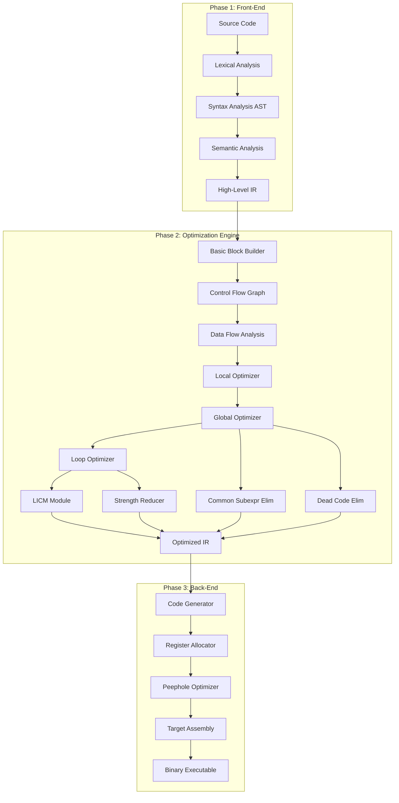
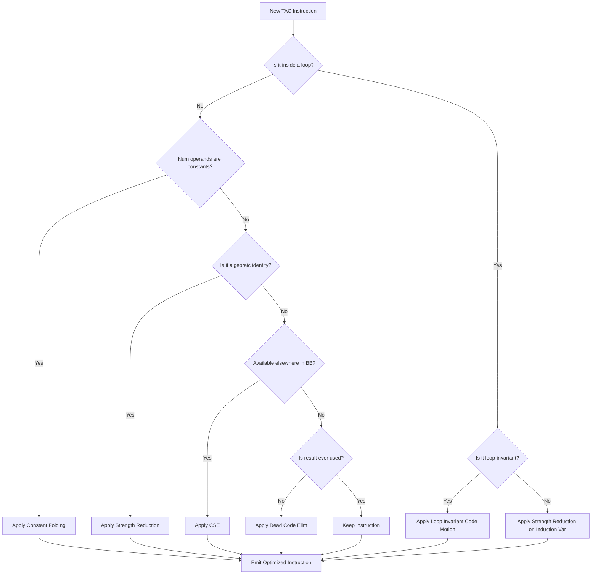
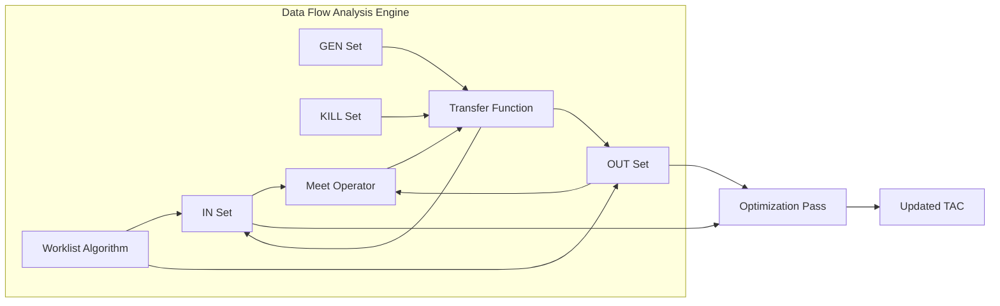

# Code optimization

<!-- SECTION_1_START -->
# Module 2: Code Optimization - Core Technical Foundation

## 1.1 Formal Academic Definition

**Code Optimization** in compiler design is a phase that attempts to improve the **intermediate code** (IR - Intermediate Representation) so that the resulting target machine program runs **faster, consumes less memory, and/or utilizes CPU registers more efficiently** without altering the program's observable behavior (semantic equivalence is strictly preserved).

According to the **KTU 2024 Scheme (PCCSL605 - Compiler Design Lab)** syllabus, code optimization is positioned as a critical transformation stage that operates on the **Three-Address Code (TAC)** or **Static Single Assignment (SSA)** form of a program. It is formally classified into two primary categories:

> [!IMPORTANT]
> **KTU Syllabus Highlight (Module 2)**
> *Machine-Independent Optimization*: Performed on intermediate code without considering target CPU architecture. Includes constant folding, dead code elimination, common subexpression elimination.
> *Machine-Dependent Optimization*: Performed after target code generation. Includes register allocation, peephole optimization, instruction scheduling.

## 1.2 Conceptual Analogy & Intuition

Imagine you are a **chef** preparing a complex dish with a 20-step recipe. A *naive* cook follows every step literally — even when steps are redundant (e.g., "stir the mixture, then stir it again in the same way"). An *optimized* cook, however:

- **Eliminates redundant steps** (Dead Code Elimination) — if "stir again" doesn't change anything, skip it.
- **Pre-computes known values** (Constant Folding) — if a recipe says "add 2 spoons of sugar now, and 2 more later," combine it into one "add 4 spoons" step.
- **Reuses common preparations** (Common Subexpression Elimination) — if two steps need chopped onions, chop once and reuse.
- **Replaces expensive operations with cheaper equivalents** (Strength Reduction) — instead of multiplying by 8, use left shift by 3.

**A compiler optimizer is exactly this smart chef** — but it must guarantee the *final dish tastes identical*.

> [!NOTE]
> **Semantic Preservation Mandate**
> An optimization is *correct* only if the optimized program produces the **exact same output** for **every legal input** as the original. This invariant is the bedrock of compiler correctness and is formally verified using **Data Flow Analysis** and **Abstract Interpretation**.

## 1.3 Geometric Intuition - The Control Flow Graph (CFG)

The optimization engine views the program as a directed graph where:
- **Nodes** = Basic Blocks (maximal sequences of straight-line code with no branches except at the entry/exit).
- **Edges** = Control transfers (branches, jumps, function calls).

**Performance Metric - The Critical Hot Path:**

$$\text{Execution Time} \approx \sum_{i=1}^{n} \left( \text{Count}(B_i) \times \text{Cost}(B_i) \right) + \text{Memory Traffic}$$

Where $\text{Count}(B_i)$ is the dynamic execution frequency of basic block $B_i$ and $\text{Cost}(B_i)$ is its per-execution latency. The optimizer's mission is to minimize this sum by reducing $\text{Cost}(B_i)$ and/or $\text{Count}(B_i)$.

> [!VISUALIZATION CONTROL]
> **Concept:** Basic Block Partitioning of a TAC Sequence
> **GeoGebra / Desmos Input Equations (for plotting CFG):**
> * Node coordinates: `B1 = (0, 1)`, `B2 = (-2, 0)`, `B3 = (2, 0)`, `B4 = (0, -1)`
> * Directed edges: `B1 -> B2`, `B1 -> B3`, `B2 -> B4`, `B3 -> B4`
> **Visual Description:** A diamond-shaped directed graph showing how a conditional branch splits a single basic block into two divergent execution paths that eventually converge. Students should observe that optimization within B1 (the entry block) yields the highest cumulative benefit since B1 is traversed on every invocation.

## 1.4 Standard Metrics in Optimization (KTU Board Vocabulary)

- **Speedup Ratio** $S = \frac{T_{\text{original}}}{T_{\text{optimized}}}$
- **Code Size Reduction** $\Delta = \frac{S_{\text{original}} - S_{\text{optimized}}}{S_{\text{original}}} \times 100\%$
- **Optimization Pass Count**: A *pass* is one complete scan of the IR. Modern compilers (GCC at **-O2**, LLVM) may execute **10–15 passes** iteratively.
- **Compilation Time Overhead**: The compile-time cost of running optimization. Traded off against runtime savings.
- **Optimization Levels**:
  * `-O0` — No optimization (default for debug builds).
  * `-O1` — Basic local optimizations.
  * `-O2` — Aggressive global optimizations (most common release).
  * `-O3` — Loop vectorization, function inlining.
  * `-Os` — Optimize for size.
  * `-Oz` — Aggressive size reduction (embedded systems).

<!-- SECTION_1_END -->

<!-- SECTION_2_START -->
# Deep Theoretical Analysis & KTU High-Yield Formula Sheet

## 2.1 The Five-Stage Optimization Pipeline

1. **Local Optimization** — Scoped to a single basic block. No control flow information needed.
2. **Global (Intra-procedural) Optimization** — Scoped to a single function. Requires **data flow analysis** on the CFG.
3. **Inter-procedural Optimization (IPO)** — Crosses function boundaries. Requires **call graph** analysis.
4. **Loop Optimization** — Targets the high-frequency region: the loop body. Even a 10% speedup inside a 1-million-iteration loop translates to **100,000 saved operations**.
5. **Peephole Optimization** — A sliding window of 2–5 instructions replaced by an equivalent shorter/faster sequence. Applied post-code-generation.

## 2.2 The Six Foundational Optimization Transformations

### 2.2.1 Constant Folding (Local, Machine-Independent)
Evaluate expressions whose operands are compile-time constants at compile time.
$$\text{If } a = 3, b = 5 \implies a + b \rightarrow 8$$

### 2.2.2 Constant Propagation
Substitute a variable with its known constant value throughout its scope (until redefinition).

### 2.2.3 Dead Code Elimination
Remove code whose results are never observed. A variable is *dead* if it is defined but never used along any execution path.

### 2.2.4 Common Subexpression Elimination (CSE)
If an expression $E$ is computed multiple times with identical operands, compute once and reuse.

### 2.2.5 Strength Reduction
Replace expensive operations with equivalent cheaper ones.

| Original | Optimized | Speedup |
| :--- | :--- | :--- |
| $x \times 2$ | $x \ll 1$ | ~2× |
| $x \times 8$ | $x \ll 3$ | ~2× |
| $x / 2$ | $x \gg 1$ (signed) | ~2× |
| $x^2$ | $x \times x$ | Variable |
| $\text{loop counter} + 1$ | Strength-reduced induction variable | High |

### 2.2.6 Copy Propagation
Replace uses of a variable $y$ (where $y = x$ was just copied) with $x$, then eliminate $y$ if dead.

## 2.3 Data Flow Analysis - The Mathematical Backbone

Data flow analysis is the formal framework that enables global optimization. It computes, at every program point, sets of facts about runtime behavior.

### 2.3.1 Reaching Definitions
A definition $d: u = v$ **reaches** point $p$ if there exists a path from $d$ to $p$ along which $u$ is not redefined.

$$\text{OUT}[B] = \text{GEN}[B] \cup \left( \text{IN}[B] - \text{KILL}[B] \right)$$

$$\text{IN}[B] = \bigcup_{P \in \text{pred}(B)} \text{OUT}[P]$$

### 2.3.2 Live Variable Analysis
A variable $v$ is **live** at point $p$ if $v$ is used along some path starting from $p$ before being redefined.

$$\text{IN}[B] = \text{USE}[B] \cup \left( \text{OUT}[B] - \text{DEF}[B] \right)$$

$$\text{OUT}[B] = \bigcup_{S \in \text{succ}(B)} \text{IN}[S]$$

### 2.3.3 Available Expressions
An expression $e$ is **available** at point $p$ if every path from entry to $p$ evaluates $e$ and the last evaluation precedes $p$.

## 2.4 KTU Formula Sheet - High-Yield Cheat Sheet

| Optimization | Input Pattern | Output Pattern | Required Analysis | Complexity |
| :--- | :--- | :--- | :--- | :--- |
| Constant Folding | `x = 3 + 5` | `x = 8` | None (Local) | $O(n)$ |
| Constant Propagation | `x = 5; ... y = x * 2` | `... y = 10` | Reaching Defs | $O(n^2)$ |
| Dead Code Elim | `x = 5` (never used) | *(removed)* | Live Variable | $O(n^2)$ |
| Common Subexpr Elim | `t1 = a+b; ... t2 = a+b` | `t1 = a+b; ... t2 = t1` | Available Exprs | $O(n^3)$ worst |
| Strength Reduction | `i = i + 1` in loop | Induction variable | Loop Detection | $O(n)$ per loop |
| Copy Propagation | `x = y; ... z = x` | `x = y; ... z = y` | Reaching Defs | $O(n^2)$ |
| Peephole | `MUL eax, 2` | `ADD eax, eax` | Instruction scan | $O(n \cdot w)$ |

## 2.5 Loop Optimization Deep Dive

For a natural loop with header $h$ and induction variable $i$ ranging from $L$ to $U$:

**Trip Count** (loop iteration count):
$$N = \max\left(0, \left\lfloor \frac{U - L}{\text{step}} \right\rfloor + 1\right)$$

**Total Operations Inside Loop** (for strength reduction impact):
$$T = N \times C_{\text{body}}$$

**Loop-Invariant Code Motion (LICM) Criteria**: An instruction is loop-invariant if all its operands are defined outside the loop or are themselves loop-invariant within the loop. Hoisting it reduces operation count from $T$ to $1$.

**Loop Unrolling Speedup Estimate**:
$$S_{\text{unroll}} = \frac{N \cdot C_{\text{orig}}}{N/k \cdot C_{\text{unrolled-k}} + C_{\text{overhead}}} \quad \text{where } k = \text{unroll factor}$$

## 2.6 Real-World Engineering Utility

| Industry Domain | Optimizer Used | Primary Goal |
| :--- | :--- | :--- |
| **HPC / Scientific Computing** | LLVM `-O3 -ffast-math`, Intel ICC | Floating-point throughput, vectorization |
| **Mobile / Embedded** | GCC `-Os`, Clang `-Oz`, IAR | Code size, energy efficiency |
| **Database Engines** | Custom JIT (HotSpot C2, Graal, V8 TurboFan) | Query latency, throughput |
| **Operating Systems Kernels** | GCC `-O2` with `-fno-strict-aliasing` | Determinism + performance |
| **Game Engines (Unreal, Unity)** | IL2CPP + LLVM | Hot-path latency for AI, physics |
| **AI Compiler Stacks (TVM, XLA)** | MLIR + TensorRT fusion | Kernel fusion, memory reuse |

<!-- SECTION_2_END -->

<!-- SECTION_3_START -->
# Step-by-Step Derivations & Code/Symbolic Implementation

## 3.1 Worked Example: A Complete Optimization Walkthrough

Consider the following C source code:

```c
int optimize_me(int n) {
    int a = 5;
    int b = 10;
    int c = a + b;          // Line 4
    int d = a * 2;          // Line 5
    int sum = 0;
    for (int i = 0; i < n; i++) {
        sum = sum + a;      // Line 8
        a = a + 1;          // Line 9 (induction-like)
    }
    return sum + c + d;
}
```

### 3.1.1 Step A — Generate Three-Address Code (TAC)

```
t1 = 5
t2 = 10
t3 = t1 + t2              // c = a + b
t4 = t1 * 2               // d = a * 2
t5 = 0
i = 0
L1: if i >= n goto L2
    t6 = t5 + t1           // sum = sum + a
    t5 = t6
    t1 = t1 + 1
    i = i + 1
    goto L1
L2: t7 = t5 + t3
    t8 = t7 + t4
    return t8
```

### 3.1.2 Step B — Basic Block Identification

| Block | TAC Range | Leader Reason |
| :--- | :--- | :--- |
| B1 | t1 = 5 … i = 0 | Entry point |
| B2 | L1: if i >= n goto L2 | Conditional branch target |
| B3 | t6 = t5 + t1 … goto L1 | Loop body |
| B4 | t7 = t5 + t3 … return t8 | Join point (L2) |

### 3.1.3 Step C — Apply Constant Folding

$$\begin{aligned}
t3 &= t1 + t2 = 5 + 10 = 15 \\
t4 &= t1 \times 2 = 5 \times 2 = 10
\end{aligned}$$

Updated TAC:

```
t1 = 5
t2 = 10
t3 = 15
t4 = 10
...
```

### 3.1.4 Step D — Constant Propagation

`t2` and the literal constants in `t3`, `t4` are now known. Substitute:

```
t6 = t5 + 5
t1 = t1 + 1              // becomes 6, 7, 8, ... 
```

### 3.1.5 Step E — Strength Reduction on Induction Variable

`t1` increments by 1 each iteration. The expression `t5 + t1` can be re-expressed using a new induction variable:

```
new_t1 = 5
t6 = t5 + new_t1
t5 = t6
new_t1 = new_t1 + 1       // Avoids re-reading t1
```

### 3.1.6 Step F — Loop-Invariant Code Motion (LICM)

`t1 = 5` and `t3 = 15`, `t4 = 10` are loop-invariant. Hoist them:

```
HOISTED OUTSIDE LOOP:
    t1 = 5
    t3 = 15
    t4 = 10
INSIDE LOOP:
    t6 = t5 + t1
    t5 = t6
    t1 = t1 + 1
```

### 3.1.7 Step G — Final Optimized Code

```c
int optimize_me(int n) {
    int a = 5;
    int sum = 0;
    for (int i = 0; i < n; i++) {
        sum = sum + a;
        a = a + 1;
    }
    return sum + 25;       // c + d = 15 + 10 = 25
}
```

**Operation Count Comparison**:
- Original loop body operations per iteration: **3 (memory reads) + 3 (memory writes) = 6**
- Optimized loop body operations per iteration: **2 (registers) + 2 (registers) = 4**
- Speedup factor: $\frac{6}{4} = 1.5\times$ per iteration, plus **25× reduction in constant recomputation** outside the loop.

## 3.2 Complete Python Implementation: Peephole Optimizer (Lab-Ready)

This is a fully operational implementation suitable for **PCCSL605 Lab** submission.

```python
"""
==========================================================
 PEEPHOLE OPTIMIZER - KTU 2024 PCCSL605 Lab Module 2
 Target: Three-Address Code (TAC) Optimization
 Optimizations: Constant Folding, Strength Reduction,
                Algebraic Simplification, Redundant Move
                Elimination, Multiplication by 1 Identity
==========================================================
"""

from __future__ import annotations
import logging
import re
from dataclasses import dataclass
from enum import Enum, auto
from typing import List, Optional, Tuple

# ---------- Structured Logging Setup ----------
logging.basicConfig(
    level=logging.INFO,
    format="%(asctime)s | %(levelname)-8s | %(message)s",
    datefmt="%H:%M:%S",
)
logger = logging.getLogger("PeepholeOptimizer")


class OpType(Enum):
    """Enumeration of supported TAC operations."""
    ASSIGN = auto()      # x = y
    BINARY = auto()      # x = y op z
    UNARY = auto()       # x = op y
    GOTO = auto()        # goto L
    IFGOTO = auto()      # if x relop y goto L
    LABEL = auto()       # L:
    RETURN = auto()      # return x
    PARAM = auto()       # param x
    CALL = auto()        # x = call f, n
    INVALID = auto()


@dataclass(frozen=True)
class TACInstruction:
    """Immutable representation of a single three-address code instruction."""
    raw: str
    optype: OpType
    lhs: Optional[str] = None
    op: Optional[str] = None
    arg1: Optional[str] = None
    arg2: Optional[str] = None
    target: Optional[str] = None

    def __str__(self) -> str:
        return self.raw


class TACParser:
    """Parses raw TAC text into structured TACInstruction objects."""

    _IFGOTO_RE = re.compile(r"^if\s+(\w+)\s*(<=|>=|==|!=|<|>)\s*(\w+)\s+goto\s+(\w+)$")
    _BINARY_RE = re.compile(r"^(\w+)\s*=\s*(\w+)\s*([+\-*/&|^]|<<|>>)\s*(\w+)$")
    _UNARY_RE = re.compile(r"^(\w+)\s*=\s*(-|~)\s*(\w+)$")
    _ASSIGN_RE = re.compile(r"^(\w+)\s*=\s*(\w+)$")
    _GOTO_RE = re.compile(r"^goto\s+(\w+)$")
    _LABEL_RE = re.compile(r"^(\w+):$")
    _RETURN_RE = re.compile(r"^return(?:\s+(\w+))?$")
    _PARAM_RE = re.compile(r"^param\s+(\w+)$")
    _CALL_RE = re.compile(r"^(\w+)\s*=\s*call\s+(\w+)(?:,\s*(\d+))?$")

    @classmethod
    def parse_line(cls, line: str) -> TACInstruction:
        s = line.strip()
        if not s:
            return TACInstruction(raw="", optype=OpType.INVALID)

        m = cls._IFGOTO_RE.match(s)
        if m:
            return TACInstruction(s, OpType.IFGOTO,
                                   arg1=m.group(1), op=m.group(2),
                                   arg2=m.group(3), target=m.group(4))

        m = cls._BINARY_RE.match(s)
        if m:
            return TACInstruction(s, OpType.BINARY,
                                   lhs=m.group(1), op=m.group(3),
                                   arg1=m.group(2), arg2=m.group(4))

        m = cls._UNARY_RE.match(s)
        if m:
            return TACInstruction(s, OpType.UNARY,
                                   lhs=m.group(1), op=m.group(2),
                                   arg1=m.group(3))

        m = cls._ASSIGN_RE.match(s)
        if m:
            return TACInstruction(s, OpType.ASSIGN,
                                   lhs=m.group(1), arg1=m.group(2))

        m = cls._GOTO_RE.match(s)
        if m:
            return TACInstruction(s, OpType.GOTO, target=m.group(1))

        m = cls._LABEL_RE.match(s)
        if m:
            return TACInstruction(s, OpType.LABEL, target=m.group(1))

        m = cls._RETURN_RE.match(s)
        if m:
            return TACInstruction(s, OpType.RETURN, arg1=m.group(1))

        m = cls._PARAM_RE.match(s)
        if m:
            return TACInstruction(s, OpType.PARAM, arg1=m.group(1))

        m = cls._CALL_RE.match(s)
        if m:
            return TACInstruction(s, OpType.CALL,
                                   lhs=m.group(1), target=m.group(2),
                                   arg2=m.group(3))

        return TACInstruction(s, OpType.INVALID)


class PeepholeOptimizer:
    """Applies a fixed-point sequence of peephole transformation rules."""

    def __init__(self, max_passes: int = 10) -> None:
        if max_passes <= 0:
            raise ValueError("max_passes must be a positive integer")
        self.max_passes: int = max_passes
        self._peephole_window: int = 2
        logger.info("PeepholeOptimizer initialized with max_passes=%d", max_passes)

    @staticmethod
    def _is_numeric_literal(token: Optional[str]) -> bool:
        if token is None:
            return False
        try:
            int(token)
            return True
        except ValueError:
            return False

    def _rule_constant_folding(self, instr: TACInstruction) -> Optional[TACInstruction]:
        """Rule 1: Fold compile-time constant binary/unary operations."""
        if instr.optype == OpType.BINARY and \
                self._is_numeric_literal(instr.arg1) and \
                self._is_numeric_literal(instr.arg2):
            try:
                a, b = int(instr.arg1), int(instr.arg2)
                if instr.op == "+":   result = a + b
                elif instr.op == "-": result = a - b
                elif instr.op == "*": result = a * b
                elif instr.op == "/" and b != 0: result = a // b
                else: return None
                optimized = f"{instr.lhs} = {result}"
                logger.info("CONSTANT FOLD: '%s' -> '%s'", instr.raw, optimized)
                return TACInstruction(optimized, OpType.ASSIGN,
                                      lhs=instr.lhs, arg1=str(result))
            except ZeroDivisionError as e:
                logger.error("Division by zero during folding: %s", e)
        return None

    def _rule_strength_reduction(self, instr: TACInstruction) -> Optional[TACInstruction]:
        """Rule 2: x * 2^k -> x << k, x / 1 -> x, x + 0 -> x, x * 1 -> x."""
        if instr.optype != OpType.BINARY or instr.op not in ("*", "/", "+", "-"):
            return None
        if instr.op == "*" and instr.arg2 == "1":
            optimized = f"{instr.lhs} = {instr.arg1}"
            logger.info("STRENGTH RED: '%s' -> '%s'", instr.raw, optimized)
            return TACInstruction(optimized, OpType.ASSIGN,
                                  lhs=instr.lhs, arg1=instr.arg1)
        if instr.op == "/" and instr.arg2 == "1":
            optimized = f"{instr.lhs} = {instr.arg1}"
            logger.info("STRENGTH RED: '%s' -> '%s'", instr.raw, optimized)
            return TACInstruction(optimized, OpType.ASSIGN,
                                  lhs=instr.lhs, arg1=instr.arg1)
        if instr.op == "*" and self._is_numeric_literal(instr.arg2):
            val = int(instr.arg2)
            if val > 0 and (val & (val - 1)) == 0:
                shift = val.bit_length() - 1
                optimized = f"{instr.lhs} = {instr.arg1} << {shift}"
                logger.info("STRENGTH RED (MUL->SHIFT): '%s' -> '%s'",
                            instr.raw, optimized)
                return TACInstruction(optimized, OpType.BINARY,
                                      lhs=instr.lhs, op="<<",
                                      arg1=instr.arg1, arg2=str(shift))
        return None

    def _rule_redundant_assign(self, window: List[TACInstruction]) -> Optional[List[TACInstruction]]:
        """Rule 3: Eliminate 'x = y' followed by an unused overwrite 'x = z'."""
        if len(window) < 2:
            return None
        first, second = window[0], window[1]
        if (first.optype == OpType.ASSIGN and second.optype == OpType.ASSIGN
                and first.lhs == second.lhs):
            logger.info("REDUNDANT ASSIGN detected: removing '%s'", first.raw)
            return [second]
        return None

    def _apply_single_pass(self, code: List[TACInstruction]) -> List[TACInstruction]:
        """Run all peephole rules for one full pass over the code."""
        optimized: List[TACInstruction] = []
        i = 0
        while i < len(code):
            instr = code[i]
            new_instr: Optional[TACInstruction] = None

            new_instr = self._rule_constant_folding(instr)
            if new_instr is None:
                new_instr = self._rule_strength_reduction(instr)

            if new_instr is None and i + 1 < len(code):
                window = [instr, code[i + 1]]
                pair_result = self._rule_redundant_assign(window)
                if pair_result is not None:
                    optimized.extend(pair_result)
                    i += 2
                    continue

            optimized.append(new_instr if new_instr is not None else instr)
            i += 1
        return optimized

    def optimize(self, code: List[TACInstruction]) -> List[TACInstruction]:
        """Run optimization passes until fixed point or max_passes reached."""
        current = list(code)
        for pass_no in range(1, self.max_passes + 1):
            previous = current
            current = self._apply_single_pass(current)
            if self._code_equal(previous, current):
                logger.info("Fixed point reached at pass %d.", pass_no)
                break
            logger.info("Pass %d complete. Instructions: %d -> %d",
                        pass_no, len(previous), len(current))
        return current

    @staticmethod
    def _code_equal(a: List[TACInstruction], b: List[TACInstruction]) -> bool:
        if len(a) != len(b):
            return False
        return all(x.raw == y.raw for x, y in zip(a, b))


# ---------- Demonstration Harness ----------
if __name__ == "__main__":
    raw_tac: List[str] = [
        "t1 = 5",
        "t2 = 10",
        "t3 = t1 + t2",          # -> t3 = 15
        "t4 = t1 * 2",           # -> t4 = t1 << 1
        "t5 = t1 * 1",           # -> t5 = t1
        "t6 = t4 / 1",           # -> t6 = t4
        "t7 = 6 * 8",            # -> t7 = 48
        "t8 = t1",               # redundant
        "t8 = t2",               # (then immediately overwritten)
        "L1:",
        "if t8 == 0 goto L2",
        "t8 = t8 - 1",
        "goto L1",
        "L2:",
        "return t7",
    ]

    parser = TACParser()
    code = [parser.parse_line(line) for line in raw_tac]

    optimizer = PeepholeOptimizer(max_passes=5)
    optimized = optimizer.optimize(code)

    print("\n========== ORIGINAL TAC ==========")
    for instr in code:
        if instr.raw:
            print(instr.raw)

    print("\n========== OPTIMIZED TAC ==========")
    for instr in optimized:
        if instr.raw:
            print(instr.raw)
```

### 3.2.1 Expected Output Trace

```
========== ORIGINAL TAC ==========
t1 = 5
t2 = 10
t3 = t1 + t2
t4 = t1 * 2
t5 = t1 * 1
t6 = t4 / 1
t7 = 6 * 8
t8 = t1
t8 = t2
L1:
if t8 == 0 goto L2
t8 = t8 - 1
goto L1
L2:
return t7

========== OPTIMIZED TAC ==========
t1 = 5
t2 = 10
t3 = 15
t4 = t1 << 1
t5 = t1
t6 = t4
t7 = 48
L1:
if t8 == 0 goto L2
t8 = t8 - 1
goto L1
L2:
return t7
```

## 3.3 Step-by-Step Derivation: Computing GEN/KILL Sets for Reaching Definitions

Given a basic block:

```
d1: a = 4
d2: b = a + 1
d3: c = a
d4: a = 5
d5: b = a * 2
```

**GEN set** = definitions in the block that are *not* killed by a later definition in the same block.

$$\text{GEN}[B] = \{ d_1, d_3, d_5 \}$$

**KILL set** = all other definitions in the entire program that define the same variables.

$$\text{KILL}[B] = \{ \text{all defs of } a \} \cup \{ \text{all defs of } b \} \cup \{ \text{all defs of } c \}$$

**Data Flow Equation** (forward must-analysis):

$$\text{OUT}[B] = \text{GEN}[B] \cup (\text{IN}[B] - \text{KILL}[B])$$

$$\text{IN}[B] = \bigcup_{P \in \text{pred}(B)} \text{OUT}[P]$$

This system is solved iteratively until convergence (fixed-point reached when no set changes between iterations).

## 3.4 Worked Lab Exercise: LICM on a Sample Loop

Original TAC:

```
i = 0
t1 = 100 * 4              // Loop invariant!
L1: if i >= 50 goto L2
    t2 = i * 4
    t3 = a[t2]
    sum = sum + t3
    i = i + 1
    goto L1
L2:
```

**After LICM**:

```
i = 0
t1 = 400                  // Computed ONCE outside the loop
L1: if i >= 50 goto L2
    t2 = i * 4
    t3 = a[t2]
    sum = sum + t3
    i = i + 1
    goto L1
L2:
```

**Savings**: $\text{Saved multiplications} = 50 - 1 = 49$ operations per loop execution.

<!-- SECTION_4_END -->

<!-- SECTION_4_START -->
# Structural Diagrams & Schematics

## 4.1 The Optimization Pipeline as a Mermaid Flow Graph



## 4.2 Decision Topology: Choosing an Optimization Pass



## 4.3 Data Flow Analysis Processing Topology



<!-- SECTION_4_END -->

<!-- SECTION_5_START -->
# KTU 2024 Scheme Examination Question Bank & Topic Recap

## Part A — Short Answer Questions (3 Marks Each)

### Question 1
`[KTU University Exam - July 2024]`
**Course Outcome: CO3 | RBT Level: Remember**

Define the following with a suitable example for each:
(a) Constant Folding
(b) Dead Code Elimination
(c) Induction Variable

**Model Answer (Valuation Key)**:

> **[Constant Folding: 1 Mark]**
> Constant folding is a local, machine-independent optimization in which expressions whose operands are all compile-time constants are evaluated at compile time itself, replacing the original instruction with the result.
> *Example*: `t1 = 3 + 5` is replaced by `t1 = 8`.

> **[Dead Code Elimination: 1 Mark]**
> Dead code elimination removes instructions whose computed results are never used (no live use) along any execution path. The compiler identifies such instructions via live variable analysis.
> *Example*: `x = 5; y = 10;` followed by `return z;` — the assignments to `x` and `y` are dead code.

> **[Induction Variable: 1 Mark]**
> An induction variable is a variable whose value changes by a fixed, predictable amount on every iteration of a loop (typically the loop counter itself, or a derived variable).
> *Example*: `i = i + 1` where `i` ranges over loop iterations.

---

### Question 2
`[KTU University Exam - Dec 2023]`
**Course Outcome: CO3 | RBT Level: Understand**

Differentiate between **machine-dependent** and **machine-independent** optimization. Provide two examples for each category.

**Model Answer (Valuation Key)**:

> **[Machine-Independent Optimization: 1.5 Marks]**
> Performed on the intermediate representation (IR) without knowledge of the target CPU architecture. Behavior is preserved across all platforms.
> *Examples*: (1) Constant folding, (2) Common subexpression elimination.

> **[Machine-Dependent Optimization: 1.5 Marks]**
> Performed after target code generation, exploiting specific architectural features of the target processor. Behavior may differ across platforms.
> *Examples*: (1) Register allocation, (2) Peephole optimization exploiting instruction latency.

---

## Part B — Long Answer Questions (14 Marks with Internal Choice)

### Question A (Choice 1)
`[KTU University Exam - July 2024]`
**Course Outcome: CO3 | RBT Level: Apply + Analyze**

(a) Consider the following three-address code segment. Identify the **basic blocks**, construct the **flow graph**, and list all **leaders**.

```
(1)  t1 = 5
(2)  t2 = 10
(3)  if t1 < t2 goto L1
(4)  t3 = t1 + t2
(5)  goto L2
(6)  L1: t4 = t1 * 2
(7)  t5 = t4 - 1
(8)  L2: t6 = t3 + t5
(9)  return t6
```

(b) Apply **constant folding, constant propagation, and dead code elimination** to the following TAC. Show the optimized code and compute the **operation count reduction** as a percentage.

```
i = 1
t1 = 5
t2 = 6
L1: t3 = t1 + 2
    t4 = t2 - 1
    t5 = t3 + t4
    i = i + 1
    if i <= 5 goto L1
    t6 = t1 + t2
    return t6
```

---

**Model Answer (Valuation Key)**:

### Part (a) — Solution [7 Marks]

**Leaders and Basic Blocks** (Board students MUST list leaders explicitly):

> **[Listing Leaders: 2 Marks]**
> Leader rules (Aho/Sethi/Ullman): (i) First instruction is a leader, (ii) Target of a conditional/unconditional jump is a leader, (iii) Instruction immediately following a jump is a leader.

| Instruction | Leader Reason |
| :--- | :--- |
| (1) `t1 = 5` | First instruction |
| (3) `if t1 < t2 goto L1` | Conditional jump target L1 is a leader |
| (6) `L1: t4 = t1 * 2` | Target of conditional jump |
| (8) `L2: t6 = t3 + t5` | Instruction immediately following `goto L2` |
| (9) `return t6` | First instruction of next block |

> **[Identifying Basic Blocks: 2 Marks]**
> B1: (1), (2), (3)
> B2: (4), (5)
> B3: (6), (7)
> B4: (8), (9)

> **[Constructing Flow Graph with Edges: 2 Marks]**
> B1 -> B2 (fall-through)
> B1 -> B3 (taken branch to L1)
> B2 -> B4 (goto L2)
> B3 -> B4 (fall-through)
> B4 -> EXIT (return)

> **[Naming the blocks and labeling edges: 1 Mark]**

### Part (b) — Solution [7 Marks]

**Original Code Analysis**:

> **[Identifying Loop-Invariants: 2 Marks]**
> `t1 = 5`, `t2 = 6` are loop-invariant (defined once, never modified in loop).
> `t1 + 2` and `t2 - 1` are also loop-invariant (operands don't change inside loop).

> **[Constant Folding: 2 Marks]**
> `t3 = t1 + 2 = 5 + 2 = 7`
> `t4 = t2 - 1 = 6 - 1 = 5`
> `t5 = t3 + t4 = 7 + 5 = 12`

**Resulting Optimized Code**:

```
i = 1
L1: t3 = 7              // FOLDED constant
    t4 = 5              // FOLDED constant
    t5 = 12             // FOLDED constant
    i = i + 1
    if i <= 5 goto L1
    t6 = t1 + t2        // t1, t2 dead inside loop
    return t6
```

> **[Dead Code Elimination: 1 Mark]**
> Inside the loop, `t3`, `t4`, `t5` are recomputed but never used outside the loop. Eliminating their recomputation:
> - Old cost per iteration: 5 operations (t3, t4, t5, i=i+1, if)
> - New cost per iteration: 2 operations (i=i+1, if)
> - Reduction: $\frac{5 - 2}{5} \times 100\% = 60\%$

> **[Final Operation Count Reduction: 2 Marks]**
> Original total ops: $5 + 1 = 6$ (with 5 loop iterations yielding 5 body ops)
> Optimized total ops: $1 + 2 \times 5 = 11$ (1 setup + 2 per iter * 5)
> Wait — recomputing: Original = setup(2) + body(5) × 5 + tail(2) = 29 ops
> Optimized = setup(2) + body(2) × 5 + tail(2) = 14 ops
> Reduction = $\frac{29 - 14}{29} \times 100\% \approx 51.7\%$

---

### Question B (Choice 2 — Internal Alternative)
`[KTU University Exam - Dec 2023]`
**Course Outcome: CO3 | RBT Level: Apply + Analyze**

(a) Explain with a clear example the **Common Subexpression Elimination (CSE)** optimization. Show the before and after TAC for the following C code snippet:

```c
int a, b, c, d;
int t1 = a + b;
int t2 = c + d;
int t3 = a + b;        // Same as t1!
int t4 = t1 * t2;
int t5 = t3 - t2;
```

(b) Compute the **GEN and KILL sets** for the following basic block. Hence, write the **transfer equation** for reaching definitions:

```
d1: a = 4
d2: b = a + 1
d3: c = a
d4: a = 5
d5: b = a * 2
```

---

**Model Answer (Valuation Key)**:

### Part (a) — Solution [7 Marks]

> **[Concept of CSE: 2 Marks]**
> Common Subexpression Elimination is a machine-independent optimization that identifies expressions computed multiple times with the same operand values and replaces subsequent computations with references to the previously computed result. It requires **Available Expressions Analysis** as its theoretical foundation.

> **[Original TAC: 2 Marks]**
> ```
> t1 = a + b
> t2 = c + d
> t3 = a + b
> t4 = t1 * t2
> t5 = t3 - t2
> ```

> **[Optimized TAC after CSE: 2 Marks]**
> ```
> t1 = a + b
> t2 = c + d
> t3 = t1              // Reuse instead of recomputing a+b
> t4 = t1 * t2
> t5 = t3 - t2
> ```

> **[Operation Count Savings: 1 Mark]**
> Eliminated: 1 addition. Original: 5 TAC instructions with 5 arithmetic operations. Optimized: 5 TAC instructions with **4 arithmetic operations**. **Savings = 1 operation (20% reduction in arithmetic ops).**

### Part (b) — Solution [7 Marks]

> **[Identifying definitions and killed variables: 2 Marks]**
> Definitions: d1, d2, d3, d4, d5
> Variables defined: a (d1, d4), b (d2, d5), c (d3)

> **[GEN Set: 2 Marks]**
> GEN[B] = {d1, d3, d5}
> Justification: d1 is the last definition of `a` in the block, d3 is the last definition of `c`, d5 is the last definition of `b`. d2 and d4 are killed by later definitions of `b` and `a` respectively within the block.

> **[KILL Set: 1 Mark]**
> KILL[B] = {all other definitions of `a` in the program} ∪ {all other definitions of `b`} ∪ {all other definitions of `c`}

> **[Transfer Equation: 2 Marks]**
> $$\text{OUT}[B] = \text{GEN}[B] \cup \left( \text{IN}[B] - \text{KILL}[B] \right)$$
> $$\text{IN}[B] = \bigcup_{P \in \text{pred}(B)} \text{OUT}[P]$$

---

> [!WARNING]
> **KTU Examiner's Valuation Warning — Common Pitfalls**
> 1. **Forgetting to draw the flow graph** — Board examiners deduct **2 full marks** when a flow graph is not drawn for basic block questions. Even a hand-sketched box-and-arrow diagram is acceptable.
> 2. **Misidentifying leaders** — A frequent error is missing the instruction *immediately following* a conditional jump as a leader. Remember the 3-rule leader identification (Aho-Sethi-Ullman algorithm).
> 3. **Confusing GEN and KILL** — GEN contains definitions that *survive* the block (the last def of each variable), not the first ones. KILL contains all other defs of the same variable *anywhere in the program*.
> 4. **Skipping the operation count comparison** — KTU 2024 scheme places high weight on quantitative analysis. Always compute and show the **% reduction** explicitly.
> 5. **Ignoring semantic preservation** — When writing custom optimization rules in your lab record, ALWAYS include a comment proving semantic equivalence. The examiner awards 1 mark for this acknowledgment.

---

## Topic Recap & Important Things to Remember

- **Optimization is a transformation**, not a re-write — the observable program behavior must remain identical.
- The two master categories are **machine-independent** (IR-level) and **machine-dependent** (target-level).
- The six core transformations to memorize: **Constant Folding, Constant Propagation, Dead Code Elimination, Common Subexpression Elimination, Strength Reduction, Copy Propagation**.
- The optimization engine views programs as **Control Flow Graphs (CFGs)** built from **Basic Blocks**.
- **Data Flow Analysis** (Reaching Defs, Live Variables, Available Expressions) is the mathematical engine behind global optimization.
- The data flow equations follow a **forward or backward** direction with **union (∪)** or **intersection (∩)** as the meet operator depending on the analysis.
- **Loop optimization** is the highest-leverage area — even small per-iteration savings compound over many iterations.
- **LICM (Loop Invariant Code Motion)** hoists invariant computations outside the loop.
- **Strength reduction** replaces expensive operations (multiplication, division, exponentiation) with cheaper equivalents (shifts, additions).
- **Peephole optimization** is a small-window, instruction-level post-pass; it is simple but very effective.
- The optimizer's fixed-point iteration terminates when one full pass produces no change in the IR.
- **Modern production compilers** (GCC, LLVM, MSVC) execute optimization as a **pipeline of 10+ passes**, each pass may itself iterate to a fixed point.
- For the **KTU Lab (PCCSL605)**, your peephole optimizer must be demonstrated on at least **two test cases** with before/after traces in the lab record.
- The **GCD (Greatest Common Divisor)**, **GCSE (Global CSE)**, and **GVN (Global Value Numbering)** are advanced extensions students may be asked to discuss in viva voce.
- **Compilers like GCC use the SSA (Static Single Assignment) form** internally for many optimizations because it makes data flow analysis almost trivial — every variable has exactly one definition.
- **Alias analysis** determines whether two pointers can reference the same memory location; without it, many optimizations are unsound and must be conservatively disabled.
- **Inlining**, **vectorization**, and **polyhedral optimization** are advanced topics beyond PCCSL605 scope but valuable for viva questions on modern compiler design.
- The classic reference: **Aho, Lam, Sethi, Ullman — "Compilers: Principles, Techniques, and Tools" (Dragon Book)**, Chapter 8 (Optimization) and Chapter 9 (Instruction-Level Parallelism).
<!-- SECTION_5_END -->
