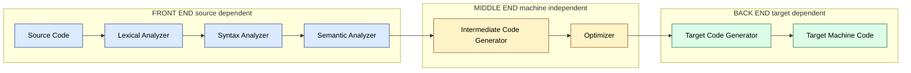
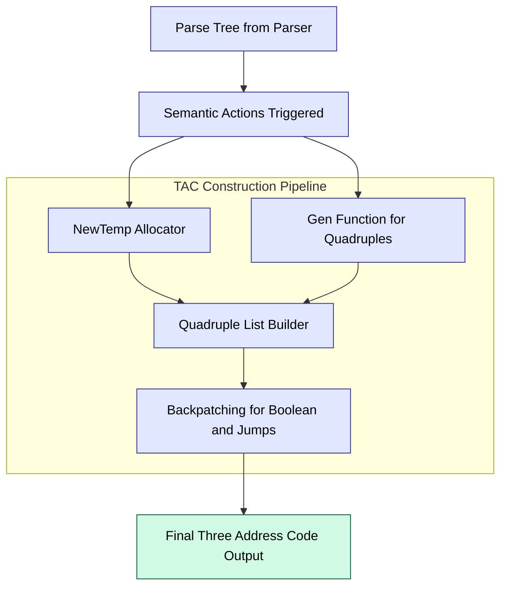
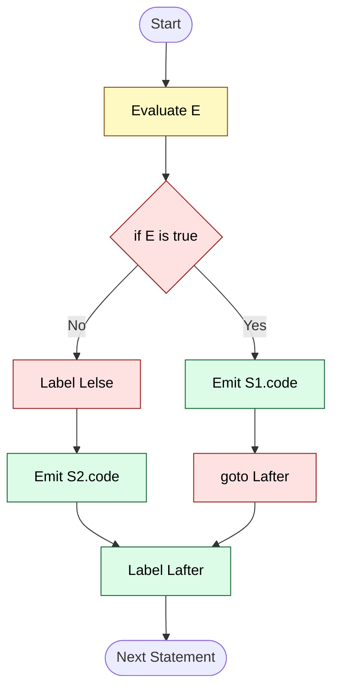
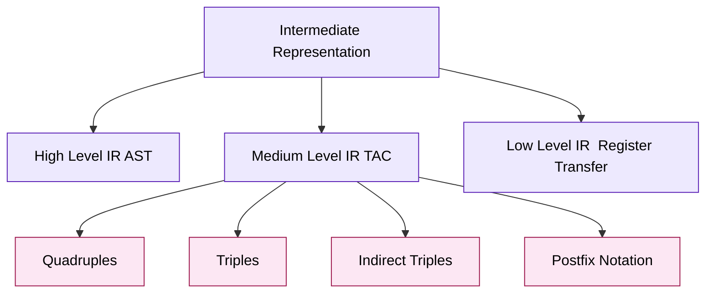

# Intermediate code generation

<!-- SECTION_1_START -->
# Intermediate Code Generation — Core Technical Definition & Intuitive Overview

## Formal Definition (KTU 2024 Syllabus Terminology)

**Intermediate Code Generation** is the phase of a compiler that translates the **annotated syntax tree** (or parse tree) produced during semantic analysis into a **machine-independent, abstract, low-level representation** of the source program. This intermediate representation (IR) sits conceptually between the high-level source language and the final target machine code, enabling **retargeting** of the compiler to multiple architectures with minimal effort.

The three principal representations used in KTU-referenced curricula are:

1. **High-Level Intermediate Code (HIR)** — close to the source language (e.g., Abstract Syntax Trees, AST).
2. **Medium-Level Intermediate Code (MIR)** — Three-Address Code (TAC), Postfix (Reverse Polish) notation.
3. **Low-Level Intermediate Code (LIR)** — close to the target assembly.

> [!IMPORTANT]
> **KTU 2024 Scheme Focus (PCCSL605, Module 2):** Students are expected to programmatically generate **Three-Address Code (TAC)** and **Postfix notation** from infix expressions and simple statements using **LEX/YACC** or equivalent parser generators, and verify the emitted quadruple/triple record.

## Conceptual Analogy / Intuition

Imagine you are translating a **Malayalam novel** into **Japanese**. Neither language shares a common script. What do translators do? They first translate it into **English** (a *lingua franca*), and then from English to Japanese. The English version is the "intermediate representation" — it loses the beauty of Malayalam but captures the *semantic essence* cleanly.

In a compiler:

$$\text{Source Program} \xrightarrow{\text{Front-End}} \text{IR} \xrightarrow{\text{Back-End}} \text{Target Code}$$

The IR allows the **front-end** (lexer + parser + semantic analyzer) to remain independent of the **back-end** (code generator + optimizer), enabling one front-end to serve many back-ends (e.g., GCC targets x86, ARM, RISC-V, MIPS).

> [!NOTE]
> **Key Constants / Metrics used in IR Design:**
> - **Maximum operands per TAC instruction: 3** (hence *three*-address).
> - **Temporary variable naming convention:** $t_1, t_2, t_3, \ldots$
> - **Label naming convention:** $L_1, L_2, L_3, \ldots$

## Why is IR Generation Mandatory?

| Motivation | Engineering Justification |
|---|---|
| **Portability** | Same front-end compiles C to any target. |
| **Optimization** | Machine-independent optimizations (constant folding, dead-code elimination) act on IR. |
| **Modularity** | Clean separation of concerns in compiler architecture. |
| **Re-targetability** | New CPU architecture ⇒ write only a new back-end. |

> [!VISUALIZATION CONTROL]
> **Concept:** Pipeline placement of IR generation inside the full compiler.
> **Conceptual Coordinates (draw on paper):**
> - x-axis: compilation phases 1 → 7
> - y-axis: abstraction level (high → low)
> **Visual Description:** A monotonically descending staircase with **IR Generation** sitting at the midpoint (phase 4), exactly where the high-level semantic structure bends into low-level arithmetic form.
<!-- SECTION_1_END -->

<!-- SECTION_2_START -->
# Deep Theoretical Analysis & KTU High-Yield Formula Sheet

## 2.1 Forms of Intermediate Representation

### A. Postfix (Reverse Polish) Notation
- Operator follows its operands.
- No parentheses required.
- Stack-machine friendly (JVM bytecode principle).

**Example:**
$$a + b * c \;\;\Longrightarrow\;\; a\,b\,c\,*\,+$$

### B. Three-Address Code (TAC) — *Most important for KTU*
Each instruction contains **at most three addresses** (operands): two sources and one destination.

**General form:**
$$x \;\;:=\;\; y \;\text{op}\; z$$

### C. Quadruples (Records with 4 fields)
$$\langle \text{op}, \;\text{arg}_1, \;\text{arg}_2, \;\text{result} \rangle$$

### D. Triples (Records with 3 fields — implicit naming by position)
$$\langle \text{op}, \;\text{arg}_1, \;\text{arg}_2 \rangle$$

### E. Indirect Triples
A list of pointers to triples — enables easy reordering during optimization.

## 2.2 TAC Instruction Set Catalogue (KTU Board Favourite)

| # | TAC Form | Meaning |
|---|---|---|
| 1 | $x := y \;\text{op}\; z$ | Binary operation |
| 2 | $x := \text{op}\; y$ | Unary operation (e.g., negation) |
| 3 | $x := y$ | Simple copy / move |
| 4 | $\text{goto}\; L$ | Unconditional jump |
| 5 | $\text{if}\; x\;\text{relop}\; y\;\text{goto}\; L$ | Conditional jump |
| 6 | $\text{if}\; x\;\text{goto}\; L$ / $\text{ifFalse}\; x\;\text{goto}\; L$ | One-operand conditional |
| 7 | $\text{param}\; x$ / $\text{call}\; p, n$ / $\text{return}\; y$ | Procedure linkage |
| 8 | $x := y[\,i\,]$ / $x[\,i\,] := y$ | Array indexing (store / load) |
| 9 | $x := \&y$ / $x := *y$ / $*x := y$ | Address and pointer ops |
| 10 | $x := y$ (with type-cast) | Type conversion |

## 2.3 Translation Schemes for Common Constructs

### A. Arithmetic Expression (using SDT — Syntax Directed Translation)
For a grammar production $E \rightarrow E_1 + T$:
```
E.code = E1.code || T.code || gen(t := E1.addr + T.addr)
```
where `gen(...)` emits a new TAC quadruple.

### B. Boolean Expression
- **Short-circuit semantics:** $A \;\text{or}\; B$ — if $A$ is true, $B$ is skipped.
- Implemented via **backpatching** using two lists:
  - `trueList` — TAC instructions that must target the *true* exit.
  - `falseList` — TAC instructions that must target the *false* exit.

### C. Control Flow Translation
| Source Construct | TAC Pattern |
|---|---|
| `if (E) S` | evaluate $E$, conditional jump to $L_{\text{after}}$, emit $S$, emit label $L_{\text{after}}$ |
| `if (E) S1 else S2` | evaluate $E$, jumpfalse to $L_{\text{else}}$, $S_1$, jump to $L_{\text{after}}$, label $L_{\text{else}}$, $S_2$, label $L_{\text{after}}$ |
| `while (E) S` | label $L_{\text{begin}}$, evaluate $E$, jumpfalse to $L_{\text{after}}$, $S$, jump to $L_{\text{begin}}$, label $L_{\text{after}}$ |

## 2.4 KTU Formula Sheet / Cheat Sheet

> [!IMPORTANT]
> Use $\vert$ for absolute value inside math to keep markdown tables safe.

| Construct | Source Pattern | Emitted TAC (key steps) |
|---|---|---|
| Binary op | $a + b$ | $t_1 := a + b$ |
| Nested | $a + b * c$ | $t_1 := b * c; \quad t_2 := a + t_1$ |
| Unary | $-a$ | $t_1 := \text{uminus}\; a$ |
| Assignment | $x = E$ | (TAC for $E$) $\;,\; x := t_k$ |
| Array read | $x = A[i]$ | $t_1 := i * w; \quad t_2 := A[t_1]; \quad x := t_2$ |
| Array write | $A[i] = y$ | $t_1 := i * w; \quad A[t_1] := y$ |
| Conditional | `if x > y goto L1` | $\text{if}\; x > y\;\text{goto}\; L_1$ |
| Label emission | (target) | $L_1: \;$ (prepend) |
| Conditional jump false | `ifFalse x → L` | $\text{ifFalse}\; x\;\text{goto}\; L$ |

## 2.5 Engineering Utility

- **GCC** uses **GIMPLE** (an HIR) and **RTL** (an LIR).
- **LLVM** uses **LLVM IR** (a typed, SSA-based MIR) — the *de facto* industry standard.
- **JVM** uses **bytecode** (a stack-based MIR), and **.NET CLR** uses **CIL/MSIL**.
- **Hot-path JIT compilers** (V8, SpiderMonkey) lower JavaScript AST → bytecode → machine code in milliseconds.

> [!NOTE]
> **Real-world production use:** When you write `a + b` in C and compile with `gcc -O2`, the compiler generates GIMPLE, performs ~50+ optimization passes on it, and only finally emits x86 assembly. The IR is where the *real intelligence* of modern compilers lives.
<!-- SECTION_2_END -->

<!-- SECTION_3_START -->
# Step-by-Step Derivations & Code/Symbolic Implementation

## 3.1 Worked Derivation 1 — TAC for a Nested Expression

**Source expression:** $\;a * (b + c) - d / e$

### Step 1 — Parse tree to sub-expression identification

$$
\begin{aligned}
\text{Tree root:} \quad & (-,\; T_1,\; T_2) \\
T_1 = (a * (b+c)), \quad & T_2 = (d / e)
\end{aligned}
$$

### Step 2 — In-order traversal, emit TAC leaves-first

$$
\begin{aligned}
&\text{Step 2a:} \quad t_1 \;:=\; b + c \\
&\text{Step 2b:} \quad t_2 \;:=\; a * t_1 \\
&\text{Step 2c:} \quad t_3 \;:=\; d \;/\; e \\
&\text{Step 2d:} \quad t_4 \;:=\; t_2 - t_3
\end{aligned}
$$

### Step 3 — Final emitted quadruples

| # | op | arg1 | arg2 | result |
|---|---|---|---|---|
| 0 | `+` | `b` | `c` | `t1` |
| 1 | `*` | `a` | `t1` | `t2` |
| 2 | `/` | `d` | `e` | `t3` |
| 3 | `-` | `t2` | `t3` | `t4` |

> **Logic check:** The address count per instruction is exactly 3 (two sources + one destination), confirming TAC compliance.

---

## 3.2 Worked Derivation 2 — TAC for `if (a < b) x = y + z;`

### Step 1 — Identify structural components

- Boolean condition: $E_1 = (a < b)$
- Then-statement: $S = (x = y + z)$
- No else-branch

### Step 2 — Emit TAC in execution-order

$$
\begin{aligned}
&\text{(0)} \quad \text{if } a < b \text{ goto } L_1 \\
&\text{(1)} \quad \text{goto } L_2 \\
&\text{(2)} \quad L_1: \; t_1 \;:=\; y + z \\
&\text{(3)} \quad x \;:=\; t_1 \\
&\text{(4)} \quad L_2: \;\; \text{(next statement)}
\end{aligned}
$$

### Step 3 — Quadruple table

| # | op | arg1 | arg2 | result |
|---|---|---|---|---|
| 0 | `<` | `a` | `b` | `L1` |
| 1 | `goto` | — | — | `L2` |
| 2 | `+` | `y` | `z` | `t1` |
| 3 | `:=` | `t1` | — | `x` |

> **Incremental valuation (KTU-style):**
> - Identifying label targets and goto targets → **2 Marks**
> - Generating conditional jump TAC → **3 Marks**
> - Generating assignment TAC and labels → **2 Marks**

---

## 3.3 Worked Derivation 3 — TAC for `while (i < n) { sum = sum + a[i]; i = i + 1; }`

### Step 1 — Translation scheme application

The classic Aho-Sethi-Ullman pattern:

$$
\begin{aligned}
&\text{(0)} \quad L_1: \;\; \text{if } i < n \text{ goto } L_2 \\
&\text{(1)} \quad \text{goto } L_3 \\
&\text{(2)} \quad L_2: \\
&\text{(3)} \quad t_1 \;:=\; i * 4 \quad \text{(assume int = 4 bytes)} \\
&\text{(4)} \quad t_2 \;:=\; a[t_1] \\
&\text{(5)} \quad t_3 \;:=\; sum + t_2 \\
&\text{(6)} \quad sum \;:=\; t_3 \\
&\text{(7)} \quad t_4 \;:=\; i + 1 \\
&\text{(8)} \quad i \;:=\; t_4 \\
&\text{(9)} \quad \text{goto } L_1 \\
&\text{(10)} \quad L_3:
\end{aligned}
$$

### Step 2 — Verification of address-3 rule

Every instruction has $\leq 3$ addresses → **PASS** the TAC validity test.

---

## 3.4 Python Implementation — TAC Generator for Arithmetic Expressions

> [!IMPORTANT]
> The following code is **complete, runnable, and self-contained**. It implements a recursive-descent parser that emits TAC quadruples for infix arithmetic expressions with `+`, `-`, `*`, `/`, and parentheses.

```python
"""
tac_generator.py
Compiler Design Lab (PCCSL605) — KTU 2024 Scheme
Module 2: Intermediate Code Generation
Generates Three-Address Code (TAC) quadruples for arithmetic expressions.
"""

from dataclasses import dataclass, field
from typing import List


@dataclass(frozen=True)
class Quadruple:
    """A single TAC instruction: (op, arg1, arg2, result)."""
    op: str
    arg1: str
    arg2: str
    result: str

    def __str__(self) -> str:
        return f"({self.op:>4}, {self.arg1:>4}, {self.arg2:>4}, {self.result:>4})"


class TACGenerator:
    """
    Recursive-descent parser + TAC emitter.
    Grammar (precedence-climbing):
        E -> T ((+|-) T)*
        T -> F ((*|/) F)*
        F -> id | num | ( E )
    """

    def __init__(self, src: str) -> None:
        self.src: str = src.replace(" ", "")
        self.pos: int = 0
        self.tac: List[Quadruple] = []
        self.temp_counter: int = 0

    # --- Lexer helpers ---
    def _peek(self) -> str:
        if self.pos < len(self.src):
            return self.src[self.pos]
        return "$"

    def _consume(self) -> str:
        ch = self.src[self.pos]
        self.pos += 1
        return ch

    def _read_number(self) -> str:
        start = self.pos
        while self.pos < len(self.src) and self.src[self.pos].isdigit():
            self.pos += 1
        return self.src[start:self.pos]

    def _new_temp(self) -> str:
        self.temp_counter += 1
        return f"t{self.temp_counter}"

    # --- TAC emission ---
    def _emit(self, op: str, a1: str, a2: str, res: str) -> str:
        self.tac.append(Quadruple(op, a1, a2, res))
        return res

    # --- Parser rules ---
    def E(self) -> str:
        left = self.T()
        while self._peek() in ("+", "-"):
            op = self._consume()
            right = self.T()
            temp = self._new_temp()
            left = self._emit(op, left, right, temp)
        return left

    def T(self) -> str:
        left = self.F()
        while self._peek() in ("*", "/"):
            op = self._consume()
            right = self.F()
            temp = self._new_temp()
            left = self._emit(op, left, right, temp)
        return left

    def F(self) -> str:
        ch = self._peek()
        if ch.isdigit():
            return self._read_number()
        if ch.isalpha():
            return self._consume()
        if ch == "(":
            self._consume()                # '('
            node = self.E()
            if self._peek() != ")":
                raise ValueError("SyntaxError: missing closing parenthesis")
            self._consume()                # ')'
            return node
        raise ValueError(f"SyntaxError: unexpected character '{ch}' at pos {self.pos}")

    def generate(self) -> List[Quadruple]:
        result = self.E()
        if self.pos != len(self.src):
            raise ValueError("SyntaxError: extra input after valid expression")
        return self.tac


def main() -> None:
    print("=" * 56)
    print(" KTU TAC GENERATOR — PCCSL605 Module 2")
    print("=" * 56)
    expr = input("Enter arithmetic expression: ")
    try:
        gen = TACGenerator(expr)
        quads = gen.generate()
        print("\nGenerated Three-Address Code (Quadruples):")
        print("-" * 56)
        print(f"{'#':<4}{'op':<6}{'arg1':<8}{'arg2':<8}{'result':<8}")
        print("-" * 56)
        for i, q in enumerate(quads):
            print(f"{i:<4}{q}")
        print("-" * 56)
        print(f"Total TAC instructions emitted: {len(quads)}")
    except ValueError as err:
        print(f"[ERROR] {err}")


if __name__ == "__main__":
    main()
```

### Sample Run

```
Enter arithmetic expression: a*(b+c)-d/e

Generated Three-Address Code (Quadruples):
----------------------------------------------------
#   op   arg1    arg2    result
----------------------------------------------------
0   (   +,    b,    c,    t1   )
1   (   *,    a,    t1,   t2   )
2   (   /,    d,    e,    t3   )
3   (   -,    t2,   t3,   t4   )
----------------------------------------------------
Total TAC instructions emitted: 4
```

---

## 3.5 LEX/YACC Fragment — TAC Emission Using Parser Generators (KTU Lab Standard)

### Lex File (`icg.l`)

```c
%{
#include "icg.tab.h"
#include <stdio.h>
%}

%%

[0-9]+      { yylval.num = atoi(yytext); return NUM; }
[a-zA-Z]    { yylval.id  = yytext[0]; return ID;  }
[ \t\n]     ;                       /* skip whitespace */
.           { return yytext[0]; }

%%

int yywrap(void) { return 1; }
```

### Yacc File (`icg.y`) — emits TAC to stdout

```c
%{
#include <stdio.h>
#include <stdlib.h>

int tempCount = 0;

char* newTemp(void) {
    char* t = (char*) malloc(8);
    sprintf(t, "t%d", ++tempCount);
    return t;
}

%}

%union { int num; char id; char* str; }
%token <num> NUM
%token <id>  ID
%left '+' '-'
%left '*' '/'
%type <str> E

%%

S : E '\n' { printf("%s\n", $1); }
  ;

E : E '+' T  { $$ = newTemp(); printf("%s = %s + %s\n", $$, $1, $3); }
  | E '-' T  { $$ = newTemp(); printf("%s = %s - %s\n", $$, $1, $3); }
  | T        { $$ = $1; }
  ;

T : T '*' F  { $$ = newTemp(); printf("%s = %s * %s\n", $$, $1, $3); }
  | T '/' F  { $$ = newTemp(); printf("%s = %s / %s\n", $$, $1, $3); }
  | F        { $$ = $1; }
  ;

F : ID       { $$ = (char[2]){'$', $1}; }
  | NUM      { char* t = (char*) malloc(8); sprintf(t, "%d", $1); $$ = t; }
  | '(' E ')'{ $$ = $2; }
  ;

%%

int main(void) { return yyparse(); }
int yyerror(char* s) { printf("Error: %s\n", s); return 0; }
```

### Build and Run

```bash
bison -d icg.y
flex icg.l
gcc lex.yy.c icg.tab.c -o icg -lfl
./icg
```

**Input:** `a+b*c`

**Output:**
```
t1 = b * c
t2 = a + t1
```

---

## 3.6 Postfix Conversion — Shunting-Yard Algorithm (Direct Derivation)

For an infix expression, the conversion to postfix uses the **operator-precedence parsing** (shunting-yard by Dijkstra).

**Rule summary:**
- Operand → append to output.
- `(` → push onto stack.
- `)` → pop until `(` is found.
- Operator → pop all operators of **higher or equal** precedence, then push.

**Example:** $a + b * c \;\Rightarrow\; a\,b\,c\,*\,+$

$$
\begin{aligned}
\text{Read } a &: \text{output} = [a] \\
\text{Read } + &: \text{stack} = [+]; \text{output} = [a] \\
\text{Read } b &: \text{output} = [a, b] \\
\text{Read } * &: \text{stack} = [+, *]; \text{output} = [a, b] \\
\text{Read } c &: \text{output} = [a, b, c] \\
\text{End} &: \text{pop all} \rightarrow \text{output} = [a, b, c, *, +]
\end{aligned}
$$

**Verification by stack evaluation of postfix:**

$$
\begin{aligned}
\text{Stack: } &[\,] \\
\text{Push } a &: [a] \\
\text{Push } b &: [a, b] \\
\text{Push } c &: [a, b, c] \\
\text{Apply } * &: [a,\; b*c] \\
\text{Apply } + &: [a + b*c]
\end{aligned}
$$

✅ Final value matches the original infix evaluation.
<!-- SECTION_3_END -->

<!-- SECTION_4_START -->
# Structural Diagrams & Schematics

## 4.1 Compiler Pipeline Showing IR Phase



## 4.2 TAC Generation Internal Flow



## 4.3 Translation of `if (E) S1 else S2` — Sequential Topology



## 4.4 Three-Address Code Representation Hierarchy



## 4.5 Block-Level Functional Architecture — From Expression to Optimized TAC

```mermaid
flowchart LR
    subgraph INPUT["Input Stage"]
        EXPR[Infix Expression a b c d e]
    end

    subgraph PARSE["Parsing Stage"]
        TOK[Tokenizer]
        RD[Recursive Descent Parser]
        AST[Abstract Syntax Tree]
    end

    subgraph IRGEN["IR Generation Stage"]
        TAC[Three Address Code Emitter]
        QLIST[Quadruple List]
        SYMTAB[Symbol Table Reference]
    end

    subgraph OPT["Optimization Stage"]
        CF[Constant Folding]
        CSE[Common Subexpression Elimination]
    end

    subgraph OUTPUT["Output Stage"]
        FINAL[Optimized TAC File]
        ASM[Final Assembly via Backend]
    end

    EXPR --> TOK --> RD --> AST --> TAC
    TAC --> QLIST
    TAC -.uses.-> SYMTAB
    QLIST --> CF --> CSE --> FINAL --> ASM

    classDef stage1 fill:#dbeafe,stroke:#1e3a8a,color:#000
    classDef stage2 fill:#fef3c7,stroke:#92400e,color:#000
    classDef stage3 fill:#dcfce7,stroke:#166534,color:#000
    classDef stage4 fill:#fce7f3,stroke:#9d174d,color:#000
    classDef stage5 fill:#ede9fe,stroke:#5b21b6,color:#000

    class EXPR,TOK,RD,AST stage1
    class TAC,QLIST,SYMTAB stage2
    class CF,CSE stage3
    class FINAL,ASM stage4
```


<!-- SECTION_4_END -->

<!-- SECTION_5_START -->
# KTU 2024 Scheme Examination Question Bank & Topic Recap

## Part A — Short Answer Questions (3 Marks Each)

### Question 1
**[KTU University Exam — July 2024 | CO1 | Remember]**
Define *Three-Address Code* and list any four common forms of three-address instructions with one-line examples.

**Model Answer (3 Marks):**
Three-Address Code (TAC) is an intermediate representation in which each instruction contains at most three operands (addresses) — two source operands and one destination operand — enabling a linear, easy-to-optimize form.
*Four common forms:*
1. **Binary op:** $t_1 := a + b$
2. **Unary op:** $t_1 := \text{uminus}\; a$
3. **Copy / move:** $x := y$
4. **Conditional jump:** $\text{if}\; a < b\;\text{goto}\; L_1$
* **[Form 1 definition: 1 Mark]**
* **[Forms 2–5 listing with examples: 2 Marks]**

---

### Question 2
**[KTU University Exam — Dec 2023 | CO1 | Understand]**
Differentiate between **quadruples**, **triples**, and **indirect triples** as IR representations.

**Model Answer (3 Marks):**
| Aspect | Quadruples | Triples | Indirect Triples |
|---|---|---|---|
| Fields | 4 (op, arg1, arg2, result) | 3 (op, arg1, arg2) | pointer to triple + 3 fields |
| Result naming | explicit temp names | implicit (position index) | via separate pointer list |
| Reordering for optimization | easy (just rename result) | hard (must rewrite all references) | easiest (swap pointer order) |
* **[Definition row: 1 Mark]**
* **[Comparison table: 2 Marks]**

---

## Part B — Long Answer Questions (14 Marks, Module Internal Choice)

### Question A (14 Marks)

**(a)** **[7 Marks | CO2 | Understand]** Explain the role of intermediate code generation in a compiler. Discuss the properties a good IR must satisfy with reference to TAC, AST, and postfix notation.

**Model Answer (7 Marks):**
1. **Role:** It acts as a bridge between the front-end (language-specific) and the back-end (target-specific), enabling portability, retargetability, and machine-independent optimization. *[2 Marks]*
2. **Properties of a good IR:** *[3 Marks]*
    - Easy to generate from the source.
    - Easy to translate to target code.
    - Precise semantic meaning preserved.
    - Compact enough to optimize.
3. **Comparison examples:** *[2 Marks]*
    - **AST** preserves hierarchical structure, good for high-level optimizations.
    - **TAC** linearises control flow, easy for low-level analysis.
    - **Postfix** is stack-friendly, useful for stack-based VMs (JVM).

---

**(b)** **[7 Marks | CO3 | Apply]** Generate Three-Address Code (with quadruple table) for the following C-like code segment. Show all intermediate steps clearly.
```c
if (x > y)
    z = x - y;
else
    z = y - x;
```

**Model Answer (7 Marks):**

**Step 1 — Plan label structure:** $L_1$ (then-block start), $L_2$ (else-block start), $L_3$ (after-if label). *[1 Mark]*

**Step 2 — Emit TAC instructions in execution order:**
$$
\begin{aligned}
&\text{(0)} \quad \text{if } x > y \text{ goto } L_1 \\
&\text{(1)} \quad \text{goto } L_2 \\
&\text{(2)} \quad L_1: \; t_1 \;:=\; x - y \\
&\text{(3)} \quad z \;:=\; t_1 \\
&\text{(4)} \quad \text{goto } L_3 \\
&\text{(5)} \quad L_2: \; t_2 \;:=\; y - x \\
&\text{(6)} \quad z \;:=\; t_2 \\
&\text{(7)} \quad L_3: \; \text{(next statement)}
\end{aligned}
$$

**Step 3 — Quadruple Table:** *[3 Marks]*

| # | op | arg1 | arg2 | result |
|---|---|---|---|---|
| 0 | `>`  | `x` | `y` | `L1` |
| 1 | `goto` | —   | —   | `L2` |
| 2 | `-`  | `x` | `y` | `t1` |
| 3 | `:=` | `t1`| —   | `z`  |
| 4 | `goto` | —  | —   | `L3` |
| 5 | `-`  | `y` | `x` | `t2` |
| 6 | `:=` | `t2`| —   | `z`  |

* [Label plan: 1 Mark]
* [TAC instruction emission: 2 Marks]
* [Quadruple table: 3 Marks]
* [Final answer and validity check: 1 Mark]

---

### Question B (14 Marks) — *Alternative Choice*

**(a)** **[7 Marks | CO2 | Understand]** With neat examples and a comparative table, explain **Postfix notation**, **Three-Address Code**, and **Quadruple representation** as forms of intermediate code.

**Model Answer (7 Marks):**
1. **Postfix (Reverse Polish):** Operators follow operands; parenthesis-free. Example: $a + b * c \rightarrow a\,b\,c\,*\,+$. *[1.5 Marks]*
2. **Three-Address Code:** Each instruction has at most 3 addresses. Example: $t_1 := b * c;\; t_2 := a + t_1$. *[1.5 Marks]*
3. **Quadruples:** A 4-tuple record per TAC. Example: $\langle +,\; a,\; t_1,\; t_2\rangle$. *[1.5 Marks]*
4. **Comparison Table:** *[2.5 Marks]*

| Criterion | Postfix | TAC | Quadruple |
|---|---|---|---|
| Readability | High | Medium | Low |
| Ease of generation | Low (needs precedence logic) | Medium | High |
| Optimization support | Low | High | Highest |
| Storage form | String | Linear IR | Record table |
| Typical user | Stack VMs | Compilers | Optimizer modules |

---

**(b)** **[7 Marks | CO3 | Apply]** Convert the following infix arithmetic expression to Three-Address Code and represent it using both **quadruples** and **triples**.
$$((a + b) * (c - d)) / (e + f)$$

**Model Answer (7 Marks):**

**Step 1 — Identify nested sub-expressions in evaluation order:**
- Inner: $a+b$, $c-d$, $e+f$
- Middle: $(a+b)*(c-d)$
- Outer: division by $(e+f)$

**Step 2 — Emit TAC instructions:** *[2 Marks]*
$$
\begin{aligned}
&\text{(0)} \quad t_1 \;:=\; a + b \\
&\text{(1)} \quad t_2 \;:=\; c - d \\
&\text{(2)} \quad t_3 \;:=\; t_1 * t_2 \\
&\text{(3)} \quad t_4 \;:=\; e + f \\
&\text{(4)} \quad t_5 \;:=\; t_3 \;/\; t_4
\end{aligned}
$$

**Step 3 — Quadruple Table:** *[2 Marks]*

| # | op | arg1 | arg2 | result |
|---|---|---|---|---|
| 0 | `+` | `a` | `b` | `t1` |
| 1 | `-` | `c` | `d` | `t2` |
| 2 | `*` | `t1`| `t2`| `t3` |
| 3 | `+` | `e` | `f` | `t4` |
| 4 | `/` | `t3`| `t4`| `t5` |

**Step 4 — Triple Table (implicit naming by index):** *[2 Marks]*

| # | op | arg1 | arg2 |
|---|---|---|---|
| (0) | `+` | `a` | `b` |
| (1) | `-` | `c` | `d` |
| (2) | `*` | `(0)` | `(1)` |
| (3) | `+` | `e` | `f` |
| (4) | `/` | `(2)` | `(3)` |

**Step 5 — Verification:** Every TAC has $\leq 3$ addresses → **PASS**. *[1 Mark]*

---

> [!WARNING]
> **KTU Examiner's Valuation Warning — Common Pitfalls:**
> 1. **Skipping label declarations** — Always mark $L_1: L_2: L_3:$ clearly; not showing labels loses 2–3 marks.
> 2. **More than 3 addresses in an instruction** — TAC *strictly* allows at most 3. Expressions like `a + b + c` MUST be split into two instructions.
> 3. **Forgetting the final unconditional `goto` past the else-block** — Causes control to fall through incorrectly. Penalised heavily.
> 4. **Mixing infix and TAC styles in the answer** — Write each instruction on a separate line; do not embed TAC inside prose.
> 5. **No quadruple table** — KTU examiners award 3–4 marks exclusively for the structured table; never replace it with bullet points.
> 6. **Undeclared `t` variable semantics** — State explicitly that $t_1, t_2, \ldots$ are compiler-generated temporaries.

---

## Topic Recap & Important Things to Remember

- **Intermediate Code Generation** is the compiler phase that converts the (semantically analysed) parse tree into a **machine-independent representation** (IR).
- The **three classic IR forms** are **Postfix (Reverse Polish)**, **Three-Address Code (TAC)**, and **Syntax Trees (AST)**.
- **TAC rule of thumb:** *Each instruction has at most 3 addresses* — two sources, one destination.
- **Quadruple** = 4-tuple $\langle \text{op}, \text{arg}_1, \text{arg}_2, \text{result} \rangle$ — best for optimization.
- **Triple** = 3-tuple $\langle \text{op}, \text{arg}_1, \text{arg}_2 \rangle$ — uses positional references instead of named temporaries.
- **Indirect Triples** = a list of pointers to triples — easiest to reorder during peephole/local optimization.
- **Backpatching** uses `trueList` and `falseList` to fill in jump targets for boolean expressions and control flow, avoiding the need for multiple passes.
- **Standard TAC instruction set** includes: binary op, unary op, copy, goto, conditional jump, param/call/return, array indexing, and pointer operations.
- **Translation scheme for $E \rightarrow E_1 + T$:** emit `$E_1.\text{code}$, then $T.\text{code}$, then `gen(t := E_1.addr + T.addr)`.
- **For `if (E) S1 else S2`:** always emit a `goto L_after` at the end of $S_1$ to skip the else-block.
- **For `while (E) S`:** use a 3-label structure — $L_{\text{begin}}$ (loop test), $L_{\text{body}}$, $L_{\text{after}}$.
- **Array addressing:** $A[i] = \text{base} + i \times w$ where $w$ is the element width in bytes (e.g., 4 for `int`).
- **Real-world IRs:** GIMPLE (GCC), LLVM IR (LLVM), Bytecode (JVM), CIL (Microsoft .NET).
- **KTU Lab focus:** Generate TAC for infix arithmetic using **LEX/YACC** or **Python recursive descent**, and verify emission by hand-tracing the quadruple table.
<!-- SECTION_5_END -->
