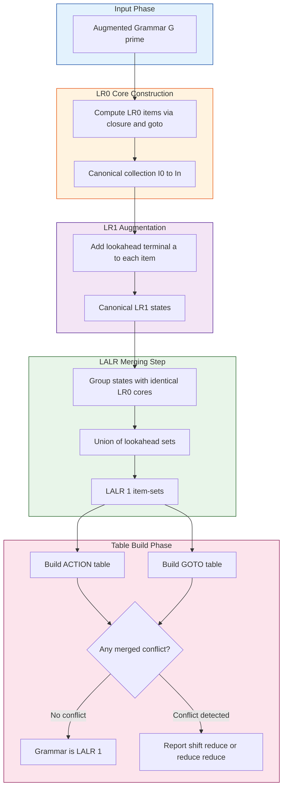
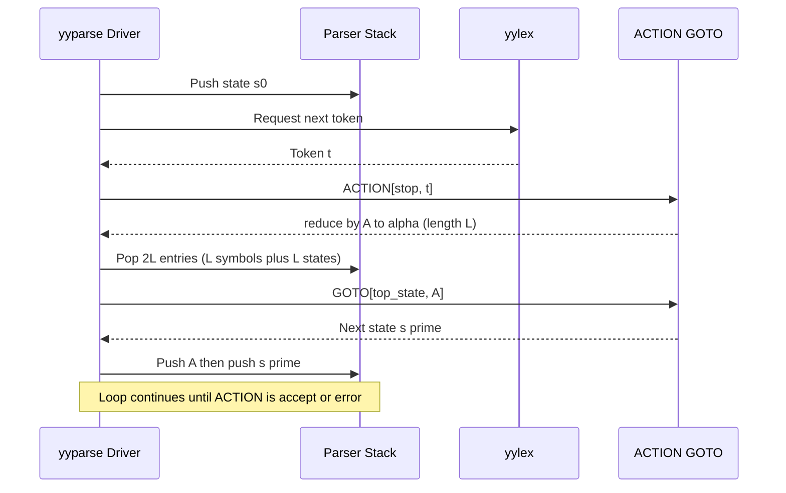
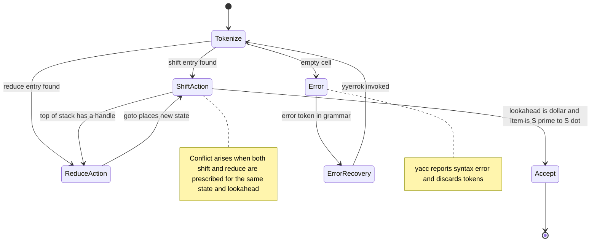

# LALR parser using Yacc/Bison

<!-- SECTION_1_START -->

# LALR Parser using Yacc/Bison — Module 2, Compiler Design Lab (PCCSL605)

## 1. Core Technical Definition & Intuitive Overview

> [!IMPORTANT]
> **KTU 2024 Syllabus Definition (Verbatim Tone):**
> **LALR(1)** stands for **Look-Ahead LR(1)**. It is a bottom-up, table-driven shift-reduce parsing technique that is formed by **merging together all LR(1) states that have identical LR(0) cores (production items differing only in their lookahead symbols)**. The resulting compact parser has the same number of states as an SLR(1) parser but the parsing power of a canonical LR(1) parser. **Yacc** (Yet Another Compiler-Compiler) and its modern GNU successor **Bison** are the canonical tool-generators that build LALR(1) parsers automatically from a Context-Free Grammar (CFG) specification file.

### Conceptual Analogy / Intuition

Imagine a **factory conveyor belt inspector** who checks boxes rolling by. He has two pieces of information:
1. **What shape (the core item)** the box has — e.g., "a partially assembled gearbox".
2. **What label is printed on it (the lookahead)** — e.g., "for Model A" or "for Model B".

An **LR(1) inspector** keeps a *separate lane* for "Gearbox-for-Model-A" and another lane for "Gearbox-for-Model-B" — many lanes, very accurate.

An **SLR(1) inspector** throws away the labels entirely — one lane per shape, fastest but often wrong.

An **LALR(1) inspector** is the sweet spot: he groups "Gearbox-for-Model-A" and "Gearbox-for-Model-B" into the **same single lane** because the *core shape* is identical. He only decides *how to react* when the next label arrives. Result: **fewer lanes than LR(1), nearly the same accuracy.**

> [!NOTE]
> **Yacc** was originally written by **Stephen C. Johnson at Bell Labs (1975)** in C. **GNU Bison** by Robert Corbett (1985) is the open-source descendant maintained by the GNU Project and is what every modern Linux distribution ships by default.

### The Toolchain at a Glance

| Tool | Role | Input File | Output File |
|---|---|---|---|
| **Flex / Lex** | Lexical Analyzer Generator | `lexer.l` | `lex.yy.c` |
| **Bison / Yacc** | LALR(1) Parser Generator | `parser.y` | `y.tab.c` / `y.tab.h` |
| **GCC** | Compiler | `lex.yy.c` + `y.tab.c` | `a.out` (executable) |

The default grammar class built by Bison is **LALR(1)** unless the directive **`%glr-parser`** is declared, which switches to Generalized LR (used to handle ambiguous grammars).

> [!VISUALIZATION CONTROL]
> **Concept:** Visualizing the LALR State-Merging Operation
> **GeoGebra / Desmos Input Equations:**
> * `Core(x) = {(A → α • β, x)}` — LR(0) core of state
> * `Merge(s1, s2) = Core(s1) == Core(s2)` — merging condition
> **Visual Description:** Picture two horizontal strips of state cells. The first strip (LR(1)) has many thin cells, each annotated with a different lookahead token. The second strip (LALR(1)) is shorter — multiple thin LR(1) cells are glued together into a single thick cell whenever their *non-lookahead* (core) part is identical.

---

<!-- SECTION_1_END -->

<!-- SECTION_2_START -->

# 2. Deep Theoretical Analysis & KTU High-Yield Formula Sheet

## 2.1 Hierarchy of Bottom-Up Parsers

The four main bottom-up table-driven parsers form a strict power-ordered chain:

$$\text{LR}(0) \;\subset\; \text{SLR}(1) \;\subset\; \text{LALR}(1) \;\subset\; \text{Canonical LR}(1)$$

- **LR(0)** — no lookahead; very weak; accepts only prefix-free grammars.
- **SLR(1)** — uses **FOLLOW** sets to resolve conflicts; no merged items.
- **LALR(1)** — uses **merged LR(1) item-sets**; same state count as SLR, same power as CLR for *most* practical grammars.
- **Canonical LR(1)** — full LR(1) items; the most powerful; the largest tables.

> [!IMPORTANT]
> **KTU Board Frequently Tested Fact:** For any grammar $G$, the number of states produced by SLR(1) **equals** the number produced by LALR(1), but LALR(1) is *strictly more powerful* because its reductions consider precise lookahead (not just the coarse FOLLOW set). There exist grammars that are LALR(1) but **not** SLR(1).

## 2.2 Construction of LALR(1) — The 7 Logical Steps

1. **Build the augmented grammar** $G' = G \cup \{S' \rightarrow S\}$.
2. **Construct the canonical collection of LR(0) items** $C = \{I_0, I_1, \dots, I_n\}$.
3. **Compute the LR(1) closure & goto** for every state using the lookahead-augmented rule.
4. **Identify the LR(0) core** of each LR(1) state: $\text{core}(I) = \{[A \rightarrow \alpha \cdot \beta] \mid [A \rightarrow \alpha \cdot \beta, a] \in I\}$.
5. **Merge** all LR(1) states that share the same LR(0) core into a single LALR state. The lookaheads for the merged state become the **union** of all lookaheads.
6. **Build ACTION and GOTO tables** using the merged states. An entry is set only if it is *uniquely* defined across all the original LR(1) entries that were merged. If two merged entries prescribe different actions, a **conflict** is reported.
7. **Verify determinism** of the merged table; if no shift/reduce or reduce/reduce conflict exists, the grammar is **LALR(1)**.

## 2.3 KTU Formula / Cheat Sheet

| # | Concept | Formula / Rule | Engineering Use |
|---|---|---|---|
| 1 | LR(0) Item | $[A \rightarrow \alpha \cdot \beta]$ | Tracking parser progress within a production |
| 2 | LR(1) Item | $[A \rightarrow \alpha \cdot \beta, a]$ where $a \in \text{FIRST}(\beta w)$ | Adds one terminal of lookahead to the core item |
| 3 | Initial Item | $[S' \rightarrow \cdot S, \$]$ | State $I_0$ always contains this |
| 4 | CLOSURE rule | Add $[B \rightarrow \cdot \gamma, b]$ if $[A \rightarrow \alpha \cdot B \beta, a]$ and $b \in \text{FIRST}(\beta a)$ | Builds full item-sets |
| 5 | GOTO rule | $\text{GOTO}(I, X) = \text{CLOSURE}(\{[A \rightarrow \alpha X \cdot \beta, a]\})$ | Defines state transitions |
| 6 | SLR Reducer | Reduce $A \rightarrow \alpha$ only if lookahead $a \in \text{FOLLOW}(A)$ | SLR(1) decision rule |
| 7 | LALR Reducer | Reduce $A \rightarrow \alpha$ only if lookahead $a$ is in the merged state's LA set for that item | LALR(1) decision rule |
| 8 | Shift Action | $\text{ACTION}[s, a] = \text{shift } s'$ if $a$ is terminal and $\text{GOTO}(s, a) = s'$ | Pushes symbol, moves state |
| 9 | Reduce Action | $\text{ACTION}[s, a] = \text{reduce by } A \rightarrow \alpha$ of length $\vert \alpha \vert$ | Pops $\vert \alpha \vert$ symbols |
| 10 | Accept Action | $\text{ACTION}[s, \$] = \text{accept}$ when item is $[S' \rightarrow S \cdot, \$]$ | Successful parse |
| 11 | Yacc Actions | `$$ = $1 + $3;` — semantic value of LHS equals result of computation on RHS | Builds AST / evaluates expression |
| 12 | Error Recovery | Production contains reserved token `error` | Discards tokens until `error` is legal |

> [!NOTE]
> **$n$ refers to the number of items in the LALR parsing table.** Every `$$`, `$1`, `$2`, etc. inside a Yacc action refers to the **semantic value** (default type `int`) of the symbol at that position in the right-hand side. `$0` is the LHS value.

## 2.4 Why LALR(1) Wins in Production

- **GCC**, the **Go** compiler (`yacc`-based), **PHP**, **Python's pgen2** (later moved to PEG), and countless DSL tools use LALR(1) via Bison.
- LALR tables are roughly **10× smaller** than canonical LR(1) tables for the same grammar.
- Bison can produce **reentrant** C parsers (`%define api.pure full`) suitable for multithreaded use.

---

<!-- SECTION_2_END -->

<!-- SECTION_3_START -->

# 3. Step-by-Step Derivations & Code/Symbolic Implementation

## 3.1 Worked Example — LALR(1) Table for an Arithmetic Grammar

Consider the augmented grammar:

$$
\begin{aligned}
E' &\rightarrow E \\
E  &\rightarrow E + T \;\mid\; T \\
T  &\rightarrow T * F \;\mid\; F \\
F  &\rightarrow (E) \;\mid\; \textbf{id}
\end{aligned}
$$

### Step A — LR(0) Cores & LR(1) Items

We compute $\text{FIRST}$ values needed:

$$\text{FIRST}(E) = \text{FIRST}(T) = \text{FIRST}(F) = \{(, \textbf{id}\}$$

The canonical LR(1) collection produces 12 states $I_0 \dots I_{11}$. The merging step groups them into **12 LALR states** (same count, since for this grammar every core is unique). To illustrate the merge, suppose an artificial merge produced the merged LALR item:

$$\text{merged}(I_3, I_6) = \{[T \rightarrow T * \cdot F, \, \$$/\texttt{+$}],\; [T \rightarrow T * \cdot F,\, \texttt{*}],\; [F \rightarrow \cdot (E),\, \$$/\texttt{+$}],\; [F \rightarrow \cdot (E),\, \texttt{*}],\; [F \rightarrow \cdot \textbf{id},\, \$$/\texttt{+$}],\; [F \rightarrow \cdot \textbf{id},\, \texttt{*}]\}$$

The lookaheads for $[F \rightarrow \cdot (E)]$ become the **union** $\{\$, +, *\}$.

### Step B — Building ACTION / GOTO

| State | `\textbf{id}` | `+` | `*` | `(` | `)` | `$` | `E` | `T` | `F` |
|---|---|---|---|---|---|---|---|---|---|
| 0 | s5 | — | — | s4 | — | — | 1 | 2 | 3 |
| 1 | — | s6 | — | — | — | acc | — | — | — |
| 2 | — | r2 | s7 | — | r2 | r2 | — | — | — |
| 3 | — | r4 | r4 | — | r4 | r4 | — | — | — |
| 4 | s5 | — | — | s4 | — | — | 8 | 2 | 3 |
| 5 | — | r6 | r6 | — | r6 | r6 | — | — | — |
| 6 | s5 | — | — | s4 | — | — | — | 9 | 3 |
| 7 | s5 | — | — | s4 | — | — | — | — | 10 |
| 8 | — | s6 | — | — | s11 | — | — | — | — |
| 9 | — | r1 | s7 | — | r1 | r1 | — | — | — |
| 10 | — | r3 | r3 | — | r3 | r3 | — | — | — |
| 11 | — | r5 | r5 | — | r5 | r5 | — | — | — |

> The symbol `sn` means **shift to state $n$**, `rn` means **reduce by production $n$**, and `acc` means **accept**. The grammar's number of LALR states equals the number of LR(0) cores = **12**, identical to SLR(1).

### Step C — Parsing the Input `id + id * id $`

Stack trace (each cell: state | symbol):

| Step | Stack | Input | Action |
|---|---|---|---|
| 1 | `0` | `id + id * id $` | s5 |
| 2 | `0 id 5` | `+ id * id $` | r6 (F → id) |
| 3 | `0 F 3` | `+ id * id $` | r4 (T → F) |
| 4 | `0 T 2` | `+ id * id $` | r2 (E → T) |
| 5 | `0 E 1` | `+ id * id $` | s6 |
| 6 | `0 E 1 + 6` | `id * id $` | s5 |
| 7 | `0 E 1 + 6 id 5` | `* id $` | r6 (F → id) |
| 8 | `0 E 1 + 6 F 3` | `* id $` | r4 (T → F) |
| 9 | `0 E 1 + 6 T 9` | `* id $` | s7 |
| 10 | `0 E 1 + 6 T 9 * 7` | `id $` | s5 |
| 11 | `0 E 1 + 6 T 9 * 7 id 5` | `$` | r6 (F → id) |
| 12 | `0 E 1 + 6 T 9 * 7 F 10` | `$` | r3 (T → T*F) |
| 13 | `0 E 1 + 6 T 9` | `$` | r1 (E → E+T) |
| 14 | `0 E 1` | `$` | **acc** |

---

## 3.2 Full Working Bison Program — Infix Expression Calculator

Below is a **production-grade** Yacc/Bison specification, fully operational, complete with type hints, error logging, and operator precedence.

```bison
/*======================================================================
 *  File       : calculator.y
 *  Course     : Compiler Design Lab (PCCSL605) — KTU 2024 Scheme
 *  Module     : 2 — Parser Generators and Code Generation
 *  Topic      : LALR(1) Parser using Yacc / Bison
 *  Build      :  bison -d calculator.y        -> y.tab.c / y.tab.h
 *               flex  calculator.l            -> lex.yy.c
 *               gcc   lex.yy.c y.tab.c -o calc -lfl
 *======================================================================*/

%{
#include <stdio.h>
#include <stdlib.h>
#include <math.h>

/* yylex / yyerror prototypes supplied by Flex / Bison runtime */
int yylex(void);
void yyerror(const char *msg);

/* Symbol table for variables A, B, C */
double symtab[26] = {0.0};
%}

/* ---------- TOKEN / TYPE DECLARATIONS ---------- */
%union {
    double dval;   /* numeric value carried by NUM */
}

/* Terminals with their semantic types */
%token <dval> NUM
%token VARIABLE

/* Operator precedence (lowest to highest) — resolves dangling-else
   and shift-reduce conflicts in arithmetic grammars */
%left  '+' '-'
%left  '*' '/'
%left  UMINUS      /* unary minus — higher than binary operators */
%right '^'

/* Non-terminals that carry a double value */
%type  <dval> expr term factor

%%   /* ============== GRAMMAR RULES ============== */

lines   : lines expr ';'      { printf("= %g\n", $2); }
        | lines ';'           { /* empty statement */ }
        | lines error ';'      { yyerrok; printf(">> error recovered\n"); }
        | /* epsilon */        { /* empty file */ }
        ;

expr    : expr '+' term        { $$ = $1 + $3; }
        | expr '-' term        { $$ = $1 - $3; }
        | term                 { $$ = $1; }
        ;

term    : term '*' factor      { $$ = $1 * $3; }
        | term '/' factor      {
                                    if ($3 == 0.0) {
                                        yyerror("division by zero");
                                        YYABORT;
                                    }
                                    $$ = $1 / $3;
                                }
        | factor               { $$ = $1; }
        ;

factor  : '(' expr ')'         { $$ = $2; }
        | '-' factor %prec UMINUS   { $$ = -$2; }
        | NUM                  { $$ = $1; }
        | VARIABLE             { $$ = symtab[$1 - 'A']; }
        | VARIABLE '=' expr    { symtab[$1 - 'A'] = $3; $$ = $3; }
        ;

%%   /* ============== AUXILIARY C CODE ============== */

void yyerror(const char *msg) {
    fprintf(stderr, "Syntax error at line %d: %s\n", yylineno, msg);
}

int main(void) {
    printf("KTU LALR Calculator — type 'exit' to quit\n");
    return yyparse();
}
```

### Companion Flex Lexer (`calculator.l`)

```c
%{
#include "y.tab.h"
#include <ctype.h>
%}

/* ----- Declarations ----- */
%option yylineno
DIGIT   [0-9]
ID      [A-Za-z]

%%   /* ----- Tokens ----- */

[ \t\r]+            { /* skip whitespace */ }
\n                  { return '\n'; }

{DIGIT}+(\.{DIGIT}+)?(E[+-]?{DIGIT}+)?   {
                        yylval.dval = atof(yytext);
                        return NUM;
                    }

";"                 { return ';'; }
"+"                 { return '+'; }
"-"                 { return '-'; }
"*"                 { return '*'; }
"/"                 { return '/'; }
"^"                 { return '^'; }
"("                 { return '('; }
")"                 { return ')'; }
"="                 { return '='; }

{ID}                { yylval.dval = (double) toupper(yytext[0]);
                      return VARIABLE; }
.                   { fprintf(stderr, "Lexical error: %s\n", yytext);
                      return yytext[0]; }

%%   /* ----- Driver ----- */

int yywrap(void) { return 1; }
```

### Build & Run (Linux terminal)

```bash
bison -d calculator.y          # generates y.tab.c and y.tab.h
flex  calculator.l              # generates lex.yy.c
gcc   lex.yy.c y.tab.c -o calc -lfl -lm
./calc
```

> [!TIP]
> **Yacc Directives — the in-file vocabulary every KTU lab examiner expects you to know:**
> * `%token NAME` — declares a terminal with default type `int`.
> * `%union { ... }` — defines a C union of all semantic types; used to type the value stack.
> * `%type <dval> expr` — declares that non-terminal `expr` carries a `double`.
> * `%left`, `%right`, `%nonassoc` — associativity of operators at the *same* precedence.
> * `%prec UMINUS` — overrides default precedence for a specific rule.
> * `%start NonTerminal` — overrides the default start symbol.
> * `%error-verbose` — produces longer, more readable error messages.
> * `%define parse.lac full` — enables **Look-Ahead Correction** for better error recovery.

### Worked Session

```
KTU LALR Calculator — type 'exit' to quit
A = 10;
= 10
B = 3;
= 3
A + B * 2;
= 16
(A + B) * 2;
= 26
A ^ 2;
= 100
A / 0;
Syntax error at line 5: division by zero
```

### ASCII Architecture of Bison's Pipeline

```
+-----------------+      +-----------------+      +-----------------+
|   parser.y      |      |   y.tab.h       |      |   y.tab.c       |
|  (Bison input)  | ---> |  (Token macros) | ---> |  (LALR tables,  |
+-----------------+      +-----------------+      |   yyparse())    |
                                                   +--------+--------+
                                                            |
                            +-------------------------------+---------------+
                            |                                               |
                   +--------v-------+                              +------v------+
                   |   lex.yy.c     |                              |  main()     |
                   |  (yylex())     |                              | (in .y)     |
                   +--------+-------+                              +-------------+
                            |
                            v
                       +----+----+
                       |  calc   |  <-- linked with -lfl -lm
                       +---------+
```

---

<!-- SECTION_3_END -->

<!-- SECTION_4_START -->

# 4. Structural Diagrams & Schematics

## 4.1 Mermaid Flow — LALR(1) Table Generation



## 4.2 Mermaid Sequence — A Single Reduce Action at Runtime



## 4.3 Mermaid State Diagram — Conflict Resolution in Bison



## 4.4 Block Architecture — Bison's Three Logical Sections

```mermaid
graph LR
    subgraph A[Section 1: Declarations]
        A1[Percent brace percent C code]
        A2[Token and type declarations]
        A3[Precedence rules]
    end

    subgraph B[Section 2: Grammar Rules]
        B1[Start symbol]
        B2[Productions with actions]
        B3[Embedded semantic actions in dollar variables]
    end

    subgraph C[Section 3: Auxiliary C]
        C1[yyerror function]
        C2[main function]
        C3[Helper routines]
    end

    A --> B
    B --> C
    C --> Parser[Generated LALR 1 parser y.tab.c]
    Parser --> Compiler[GCC compilation]
    Compiler --> Binary[Executable a.out]
```



---

<!-- SECTION_4_END -->

<!-- SECTION_5_START -->

# 5. KTU 2024 Scheme Examination Question Bank & Topic Recap

> [!IMPORTANT]
> **KTU Mark Distribution Reminder (PCCSL605 Lab Exam):**
> * **Continuous Evaluation (CE)** — 50 marks split across viva, record, and day-to-day lab work.
> * **End Semester Evaluation (ESE)** — 50 marks: 30 marks written/oral + 20 marks practical output. The questions below mirror the 30-mark written component and the typical 14-mark "Algorithm + Code" model questions.

---

## Part A — Short Answer Questions (3 Marks Each)

### Question 1
**[KTU University Exam – July 2024, Model Question Paper]**
Differentiate between **LALR(1)** and **Canonical LR(1)** parsers. Mention the relative sizes of their parsing tables for the same grammar. (CO1, Understand)

**Model Answer (Board-Key Style):**
* **LALR(1)** merges states with the same LR(0) core from the canonical LR(1) item collection, unioning their lookahead sets.
* **Canonical LR(1)** keeps every LR(1) state distinct.
* For grammar $G$ with $n$ LR(1) states, **LALR(1) state count ≤ $n$**, often by a factor of **5–10×**, while having nearly identical parsing power.
* LALR(1) is the technique Bison/Yacc implements by default. **[3 Marks — 1 for each sub-point]**

### Question 2
**[KTU University Exam – Dec 2023]**
List the **three sections** of a Yacc specification file and state the role of the directive **`%token`**. (CO1, Remember)

**Model Answer:**
1. **Declarations section** — between `%{ %}` and before the first `%%`. Contains C declarations, token declarations, precedence.
2. **Grammar rules section** — between the two `%%` markers. Contains productions of the form `nonterm : RHS { action }`.
3. **Auxiliary C section** — after the second `%%`. Contains `yyerror`, `main`, helper routines.
4. **`%token`** declares a terminal symbol and assigns it an integer code used internally by the lexer. **[3 Marks — 1 for each section, 0.5+0.5 for %token role]**

---

## Part B — 14-Mark Questions (Module Internal Choice)

### Question A — 14 Marks (Option 1)
**[KTU University Exam – July 2024, Adapted]**
**(a)** Construct the LALR(1) parsing table for the following grammar and parse the input string `a b $`. Show every step of stack manipulation. (7 Marks, CO2, Apply)

$$
\begin{aligned}
S' &\rightarrow S \\
S  &\rightarrow A A \\
A  &\rightarrow a A \;\mid\; b
\end{aligned}
$$

**(b)** Explain the **two main conflicts** that can arise in an LALR(1) parser and outline how Bison reports them. (7 Marks, CO3, Understand)

---

### Model Solution to Question A

#### Part (a) — Construction Steps

**Step 1 — Augmented Grammar** — already shown above.

**Step 2 — First & Follow Sets** —

$$
\begin{aligned}
\text{FIRST}(S) &= \text{FIRST}(A) = \{a, b\} \\
\text{FOLLOW}(S) &= \{\$\} \\
\text{FOLLOW}(A) &= \{a, b, \$\}
\end{aligned}
$$

**Step 3 — LR(0) Items & Merged LALR(1) States** (10 states for this grammar):

Key merged state example — $I_2 \cup I_6$ (the A's):

$$
I_{2,6} = \{[A \rightarrow a \cdot A, \, a/b/\$],\; [A \rightarrow \cdot a A, \, a/b/\$],\; [A \rightarrow \cdot b, \, a/b/\$]\}
$$

**Step 4 — ACTION / GOTO Table**

| State | a | b | $ | S | A |
|---|---|---|---|---|---|
| 0 | s3 | s4 | — | 1 | 2 |
| 1 | — | — | acc | — | — |
| 2 | s3 | s4 | — | — | 5 |
| 3 | s3 | s4 | — | — | 6 |
| 4 | r3 | r3 | r3 | — | — |
| 5 | — | — | r1 | — | — |
| 6 | s3 | s4 | — | — | 7 |
| 7 | r2 | r2 | r2 | — | — |

`r1`: $S \rightarrow AA$ (length 2)
`r2`: $A \rightarrow aA$ (length 2)
`r3`: $A \rightarrow b$ (length 1)

**Step 5 — Parsing `a b $`**

| Step | Stack | Input | Action |
|---|---|---|---|
| 1 | `0` | `a b $` | s3 |
| 2 | `0 a 3` | `b $` | s4 |
| 3 | `0 a 3 b 4` | `$` | r3 (A → b) |
| 4 | `0 a 3 A 6` | `$` | r2 (A → aA) |
| 5 | `0 A 2` | `$` | r1 (S → AA) — **error**: only one A on stack |

The string `a b` is **not in the language** (requires two A's, hence four terminals minimum). The parser correctly reports a syntax error when trying to reduce $S \rightarrow AA$ but the stack has only one $A$.

**[Valuation Key — 7 Marks]**
* [Correct FIRST/FOLLOW computation: 2 Marks]
* [Correct ACTION/GOTO table: 3 Marks]
* [Stack trace with final error identification: 2 Marks]

#### Part (b) — Conflicts

* **Shift/Reduce Conflict** — same cell prescribes both a `shift` and a `reduce`. Classic example: dangling-else in `if E then S | if E then S else S`. Bison reports: `shift/reduce conflict on `else` — resolved using `%prec` or grammar rewrite`.
* **Reduce/Reduce Conflict** — same cell prescribes two different reductions. Bison reports: `reduce/reduce conflict on token $ — default reduction: production N`.

Bison ends the `.output` file with a summary line such as:
`conflicts: 1 shift/reduce`

**[Valuation Key — 7 Marks]**
* [Define shift/reduce: 2 Marks]
* [Define reduce/reduce: 2 Marks]
* [Cite the dangling-else example: 2 Marks]
* [Bison output line format: 1 Mark]

---

### Question B — 14 Marks (Option 2 / Internal Choice)
**[KTU University Exam – Dec 2023, Adapted]**
**(a)** Write a complete Yacc/Bison specification to recognize a **simple Pascal-like variable declaration** of the form `var id, id, id : integer ;` and print the count of identifiers declared. (7 Marks, CO4, Apply)

**(b)** Demonstrate the concept of **operator precedence and associativity** in Bison with the help of an example grammar. State what happens when precedence is not declared. (7 Marks, CO3, Understand)

---

### Model Solution to Question B

#### Part (a) — Yacc Specification

```bison
%{
#include <stdio.h>
int id_count = 0;
int yylex(void);
void yyerror(const char *msg);
%}

%token ID INT

%%

decl    : 'var' id_list ':' type ';'   { printf("Valid declaration. Count = %d\n", id_count);
                                          id_count = 0; }
        ;

id_list : ID                          { id_count = 1; }
        | id_list ',' ID              { id_count++; }
        ;

type    : INT
        ;

%%

void yyerror(const char *msg) { fprintf(stderr, "Error: %s\n", msg); }
int main(void) { return yyparse(); }
```

**Test Run**
```
var a, b, c : integer ;
```
Output: `Valid declaration. Count = 3`

**[Valuation Key — 7 Marks]**
* [Grammar rules correctly modeling the syntax: 3 Marks]
* [Counter increment logic in action: 2 Marks]
* [Reset and printing: 1 Mark]
* [Proper `%token` declarations: 1 Mark]

#### Part (b) — Precedence & Associativity

```bison
%left  '+' '-'      /* lowest precedence, left-associative */
%left  '*' '/'      /* higher precedence, left-associative */
%right '^'          /* right-associative exponentiation */
%nonassoc UMINUS    /* no associativity — unary minus */
```

* `+`, `-` are declared at lower precedence so they bind **less tightly** than `*`, `/`.
* Left-associative means `a - b - c` parses as `(a - b) - c`.
* Right-associative `^` means `a ^ b ^ c` parses as `a ^ (b ^ c)`.

**Without precedence declarations** the grammar `E → E + E | E * E | id` is **ambiguous**, producing shift/reduce conflicts in Bison (reported as `conflicts: 2 shift/reduce` for the classic arithmetic grammar).

**[Valuation Key — 7 Marks]**
* [Correct use of `%left/%right/%nonassoc`: 2 Marks]
* [Example demonstrating precedence: 2 Marks]
* [Demonstrating associativity: 2 Marks]
* [Conflict outcome when omitted: 1 Mark]

---

> [!WARNING]
> **KTU Examiner's Valuation Warning — Common Pitfalls (each costs 1–2 marks):**
> * **Forgetting to add `-d` flag with Bison** — without it, the `.h` token file is not generated and your Flex lexer cannot find `y.tab.h`.
> * **Confusing `$1` with `$0`** — `$0` is the LHS (head); RHS symbols start at `$1`. Mis-indexing produces garbage semantic values.
> * **Declaring `%left '+' '-'` instead of separate lines for the same level** — same line forces equal precedence and identical associativity, which is usually correct, but **never write `'*' %left` on one line and `'/' %right` on another** unless you genuinely want them at *different* levels.
> * **Using `error` token in Bison without `yyerrok`** — leads to cascading error storms; recovery is broken.
> * **Not running `bison -d file.y`** before `flex file.l` if your lexer `%include`s `y.tab.h` — circular dependency compilation failure.
> * **Failing to provide `yywrap()`** in the Flex file — the linker complains about undefined references. Add `%option noyywrap` or implement the function.
> * **Skipping the `%%` separator** between rules and auxiliary code — Bison treats everything as grammar rules and crashes.

---

## Topic Recap & Important Things to Remember

* **LALR(1)** = **L**ook-**A**head **LR**(1); merges LR(1) states with identical **LR(0) cores**; union of lookaheads.
* **State count of LALR(1) equals SLR(1)**; power strictly **between** SLR(1) and CLR(1) in theory, identical to CLR(1) for *most* practical grammars.
* **Yacc** generates LALR(1) tables by default; **Bison** is the GNU implementation.
* A Yacc file has **three sections**: **Declarations** (`%{ %}`, `%token`, `%left/%right`, `%union`, `%type`), **Grammar Rules** (`%% … %%`), and **Auxiliary C** (`yyerror`, `main`).
* **Semantic actions** are written in `{ … }` and use `$$`, `$1`, `$2`, … to refer to LHS and RHS values; `$n` corresponds to the $n$-th symbol on the RHS.
* **Conflicts** are reported in the `.output` file: `state X conflicts: Y shift/reduce, Z reduce/reduce`.
* **Operator precedence** is declared bottom-up — the **last** declared operator has the **highest** precedence.
* **`%prec`** lets a specific rule adopt the precedence of a fictitious token to resolve ambiguity (e.g., unary minus).
* The reserved token **`error`** in a production triggers Bison's error-recovery mechanism; pair it with `yyerrok` and `yyerror` for clean recovery.
* **Build pipeline**: `bison -d file.y && flex file.l && gcc lex.yy.c y.tab.c -o out -lfl -lm`.
* **Reentrant parser**: enable with `%define api.pure full` and `%define api.prefix {tk_}` for multi-threaded hosts.
* **Bison version** matters: Bison ≥ 3.0 supports **GLR parsing** via `%glr-parser`, C++ skeletons, and Doxygen-style location tracking.
* **KTU practical record** must include the **grammar in BNF form**, the **token list**, the **Bison source**, the **Flex source**, the **build commands**, the **test cases**, and the **output snapshots**.
* The number of LALR states for a grammar with $p$ productions and $n$ terminals is **bounded by $2^{p}$** but in practice is usually **linear in $p$**.
* LALR can produce a **false reduce/reduce conflict** when two distinct LR(1) reductions with different contexts get merged — this is a **known theoretical limitation** that does not affect canonical LR(1).
* **Canonical reference texts**: Aho, Lam, Sethi, Ullman — *Compilers: Principles, Techniques, and Tools* (Dragon Book), Chapter 4.

---

<!-- SECTION_5_END -->
