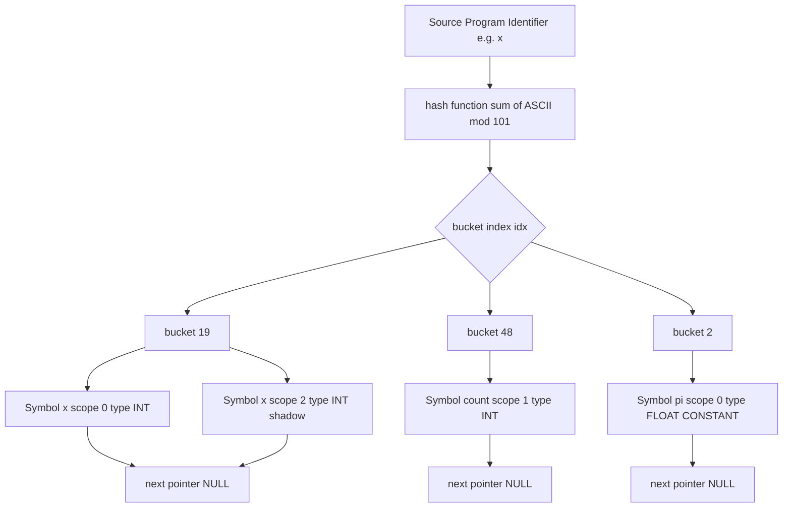
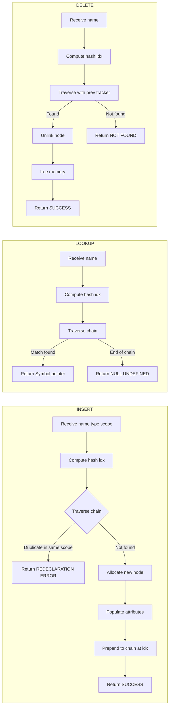
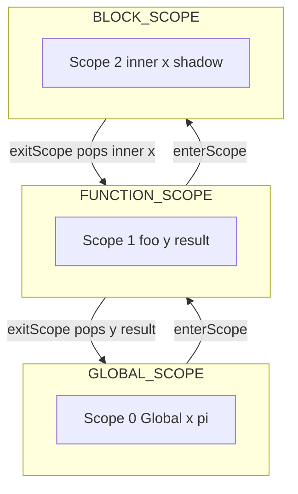
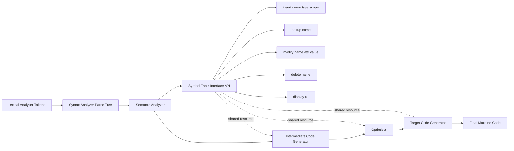
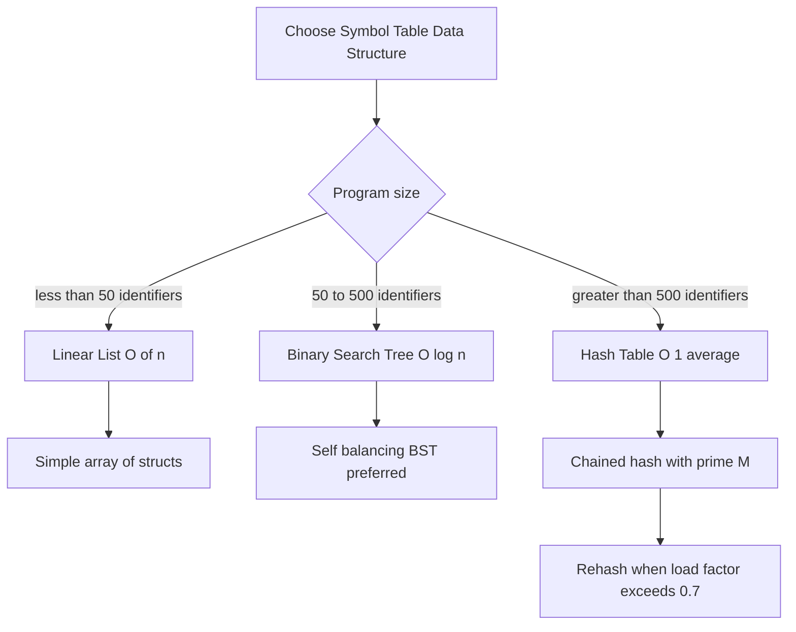

# Symbol table implementation

<!-- SECTION_1_START -->
# Symbol Table Implementation - Core Foundation

## 1.1 Formal Academic Definition (KTU 2024 Syllabus Standard)

> [!IMPORTANT]
> **Symbol Table** is a critical data structure maintained by the **Analysis Phase** (Lexical, Syntax, and Semantic Analysis) of a compiler. It stores information (attributes) about each identifier (names) appearing in the source program, such as variable names, function names, constants, labels, and user-defined types. The symbol table acts as the **central repository** that the compiler consults during all phases to verify semantics, generate code, and perform optimizations.

According to the **Aho-Sethi-Ullman Dragon Book (Compilers: Principles, Techniques, and Tools)** — the canonical reference for the KTU Compiler Design Lab syllabus — the symbol table is officially defined as:

> *"A data structure used by a compiler to keep track of semantics of names. It maps each name to its attributes, which typically include type, scope, memory location, and dimension information."*

### Information Stored Per Identifier (Standard Attributes)

| Attribute | Purpose / Engineering Significance |
| :--- | :--- |
| **Name** | The lexeme / identifier string (e.g., `count`, `_temp`, `x123`). |
| **Type** | Data type — `int`, `float`, `char`, `double`, or user-defined (`struct`). |
| **Scope** | The lexical region where the identifier is valid (global, local, block). |
| **Memory Address** | The runtime location (offset from base pointer, frame pointer, or static area). |
| **Size** | Number of bytes occupied (e.g., `int` → **4 bytes**, `double` → **8 bytes**). |
| **Line Number** | Declaration line — used in error reporting. |
| **Category** | Kind of identifier — variable, function, array, typedef, macro, constant. |
| **Initial Value** | Optional default or assigned value during declaration. |

---

## 1.2 Conceptual Analogy & Intuitive Understanding

> [!NOTE]
> **Real-World Analogy — The Hospital Patient Registry**
> Imagine a hospital reception desk. When a new patient arrives, the receptionist creates a new file (Insert). When a doctor needs to check a patient's blood type or allergies, they look up the file (Search). If the patient is discharged and re-admitted under a new ID, the old file is updated (Modify). Every patient belongs to a specific ward (Scope) — for example, ICU patients and OPD patients are tracked separately. The entire registry is the **Symbol Table**.

> When you write `int x = 5;` in a C program, the compiler does exactly this: it creates an entry `"x"` with attributes `{type: int, scope: global, value: 5, address: 0x7FFE...}`. Every later use of `x` is validated against this entry.

### Why Symbol Tables Matter in Real Engineering Systems

- **Compilers (GCC, Clang, MSVC)**: All production compilers use a **Hash-based Symbol Table** (often a chained hash table) for O(1) average-case lookups across millions of identifiers.
- **IDEs (VS Code, IntelliJ)**: Use symbol tables internally for **autocomplete, go-to-definition**, and **refactoring**.
- **Linkers & Loaders**: Maintain **global symbol tables** to resolve cross-file references and external symbols.
- **Database Query Optimizers**: Maintain a symbol-like catalog of tables, columns, and indexes.
- **Operating System Kernels**: Use symbol tables to resolve **kernel symbol addresses** (e.g., `/proc/kallsyms` in Linux).

---

## 1.3 Standard Metrics & Engineering Constants

> [!IMPORTANT]
> - **Standard word size**: **32 bits (4 bytes)** or **64 bits (8 bytes)** per symbol-table entry in modern 64-bit architectures.
> - **Recommended hash table size**: A **prime number** (e.g., 101, 211, 1009) is mathematically preferred to reduce **collisions** in `modulo-based` hashing.
> - **Average lookup time**: **O(1)** for hash tables, **O(log n)** for balanced BSTs, **O(n)** for linear lists.
> - **ASCII printable range**: `32` (space) to `126` (`~`) — used for character-class validations in identifier names.

> [!VISUALIZATION CONTROL]
> **Concept:** Hash function mapping identifiers to bucket indices.
> **Input Equations / Mappings:**
> - Hash Function: $h(\text{key}) = \left( \sum_{i=0}^{n-1} \text{key}[i] \right) \mod M$, where $M = 101$ (prime).
> - Example: For identifier `"x"`, ASCII `'x' = 120`, so $h(\text{"x"}) = 120 \mod 101 = 19$.
> - For identifier `"count"`: sum $= 99+111+117+110+116 = 553$, so $h = 553 \mod 101 = 48$.
> **Visual Description:** Imagine a row of 101 boxes indexed 0 to 100. Each identifier is dropped into a specific box based on its summed ASCII value. Multiple identifiers can land in the same box — this is called a **collision**, typically resolved by **chaining** (linked lists in each bucket).

---

<!-- SECTION_1_END -->

<!-- SECTION_2_START -->
# Deep Theoretical Analysis & KTU High-Yield Formula Sheet

## 2.1 Data Structure Choices for Symbol Table

The KTU 2024 Compiler Design Lab syllabus requires students to implement and analyze at least one of the following data structures for the symbol table. Each is presented below with engineering trade-offs.

### 2.1.1 Linear (Unsorted) List

- **Storage**: A simple `struct` array or dynamic list of records.
- **Insertion**: $O(1)$ — append to the end.
- **Search / Lookup**: $O(n)$ — linear scan from start to end.
- **Deletion**: $O(n)$ — search + shift.
- **Verdict**: Best for **very small programs** (< 50 identifiers) only.

### 2.1.2 Linear (Sorted) List

- **Insertion**: $O(n)$ — requires binary search + insertion position finding.
- **Search / Lookup**: $O(\log n)$ — binary search.
- **Deletion**: $O(n)$ — search + shift.
- **Verdict**: Better than unsorted, but **insertion is costly**.

### 2.1.3 Binary Search Tree (BST)

- **Average case Insert / Search / Delete**: $O(\log n)$.
- **Worst case (skewed tree)**: $O(n)$ — mitigated by self-balancing variants (AVL / Red-Black).
- **Verdict**: Good for **lexicographically ordered** output, but more complex to code in lab.

### 2.1.4 Hash Table (Chained / Open Hashing) — *Industry Standard & KTU Recommended*

- **Hash Function**: Maps the identifier string to a fixed-size integer bucket index.
- **Collision Resolution**: Chaining using linked lists (each bucket is a `head` pointer).
- **Average case**: $O(1)$ insert, $O(1)$ search, $O(1)$ delete.
- **Worst case (all keys collide)**: $O(n)$.
- **Load Factor**: $\alpha = \frac{N}{M}$ where $N$ = number of entries, $M$ = number of buckets. Optimal $\alpha \approx 0.7$.

> [!NOTE]
> **Why a prime number for M?** Prime moduli ensure that consecutive keys (like `"a"`, `"b"`, `"c"`) are spread evenly across the table, avoiding **clustering**. The KTU lab manual explicitly recommends a prime size like **101** for undergraduate implementations.

---

## 2.2 Core Operations — Algorithmic Logic Steps

The symbol table must support **six canonical operations**, each described below.

### Operation 1: `initialize()`

**Logic Steps:**
1. Allocate an array of $M$ bucket pointers (default: $M = 101$).
2. Set every bucket pointer to `NULL`.
3. Initialize the `currentScope` to `"Global"` (level 0).

**Why it matters:** A properly initialized symbol table prevents **dangling pointer dereferences** and ensures deterministic behavior.

### Operation 2: `insert(name, type, scope, value)`

**Logic Steps:**
1. Compute the hash index: $h = \text{hash}(name) \mod M$.
2. Traverse the chained list at bucket $[h]$ to check if the name already exists **in the current scope**.
3. If found → return **"DUPLICATE"** error (redeclaration in same scope).
4. If not found → create a new node, populate all attributes, and **prepend** it to the list at bucket $[h]$.
5. Return success confirmation.

**Why it matters:** The `scope` check is critical — the same identifier name can exist in **different scopes** (e.g., a local `i` inside a `for` loop and a global `i` in `main`). KTU examiners specifically test this nuance.

### Operation 3: `lookup(name)`

**Logic Steps:**
1. Compute hash index $h$.
2. Traverse the chained list at $[h]$.
3. For each matching name, return the **most recent (innermost) scope's** entry.
4. If not found in any scope → return **"UNDEFINED"** error.

### Operation 4: `modify(name, attribute, newValue)`

**Logic Steps:**
1. Call `lookup(name)` to find the entry.
2. Update the requested attribute (e.g., change `type` or `value`).
3. Return confirmation.

### Operation 5: `delete(name)`

**Logic Steps:**
1. Compute hash index $h$.
2. Traverse the chained list; track the **previous node** pointer.
3. Unlink the target node and `free()` its memory (in C) or `del` it (in Python).
4. Return confirmation.

### Operation 6: `display()`

**Logic Steps:**
1. Iterate over all $M$ buckets.
2. For each non-empty bucket, walk its chained list and print the node attributes in tabular form.
3. Use a formatted table with columns: `Name | Type | Scope | Address | Size | Category`.

---

## 2.3 Scope Management — Nested Symbol Tables

For block-structured languages (C, C++, Java, Kotlin), scopes are **nested**. The KTU 2024 syllabus specifically highlights this with a small program trace.

> [!IMPORTANT]
> **The Scope Stack Principle:** When entering a new block (e.g., `{ ... }`), **push** a new scope frame. When leaving, **pop** it. `lookup()` searches the **innermost scope first**, then walks outward. This is the same principle as a **LIFO stack of symbol tables**.

**Example trace** of the following C-like code:

```
int x = 1;          // Global scope: x
void foo() {
    int y = 2;      // foo scope: y
    {
        int x = 3;  // Block scope: shadows global x
        use(x);     // refers to inner x = 3
    }
    use(x);         // refers to global x = 1
}
```

**Symbol table state transitions:**

| Step | Action | Active Scopes (top of stack is current) |
| :---: | :--- | :--- |
| 1 | Enter global | `[Global: {x}]` |
| 2 | Enter `foo` | `[foo: {y}, Global: {x}]` |
| 3 | Enter block | `[Block: {x}, foo: {y}, Global: {x}]` |
| 4 | Exit block | `[foo: {y}, Global: {x}]` |
| 5 | Exit `foo` | `[Global: {x}]` |

---

## 2.4 KTU High-Yield Formula Cheat Sheet

| # | Concept | Formula / Rule | Units / Range | Engineering Use |
| :---: | :--- | :--- | :--- | :--- |
| 1 | Hash Function (Sum-of-ASCII) | $h(k) = \left( \sum_{i=0}^{n-1} \text{ord}(k[i]) \right) \mod M$ | $M$ is a prime (e.g., 101) | Default lab hash function |
| 2 | Hash Function (Polynomial Rolling) | $h(k) = \left( \sum_{i=0}^{n-1} p^i \cdot \text{ord}(k[i]) \right) \mod M$ | $p = 31$ or $p = 37$ | Reduces clustering for similar strings |
| 3 | Load Factor | $\alpha = N / M$ | Optimal $\alpha \approx 0.7$ | Decides when to **rehash** |
| 4 | Bucket Count | $M$ | Prime number, $M \geq 101$ | Total hash slots |
| 5 | Average Search (Hash) | $O(1 + \alpha)$ | For chaining | Lookup complexity |
| 6 | Worst Search (Hash) | $O(n)$ | All keys collide | Pathological case |
| 7 | BST Search | $O(h)$ where $h$ is tree height | $O(\log n)$ balanced, $O(n)$ skewed | Alternative DS |
| 8 | Identifier Size (Storage) | Each node ≈ **48–64 bytes** | 64-bit arch | Memory estimation |
| 9 | Total Memory | $M \times \text{sizeof}(\text{ptr}) + N \times \text{sizeof}(\text{node})$ | Bytes | For $N$ identifiers |
| 10 | Collision Rate | $\approx 1 - e^{-\alpha}$ | Poisson approximation | Quality metric |

---

## 2.5 Real-World Production Usage

> [!NOTE]
> - **GCC** uses a **chained hash table** called `cgraph` and `symtab` for its symbol resolution across translation units.
> - **Clang/LLVM** uses a **dense hash map** (`llvm::DenseMap`) for the `llvm::Value` symbol table inside its SSA IR.
> - **Java Virtual Machine (JVM)** maintains a **constant pool** and a per-class symbol table called the `ConstantPoolCache`.
> - **Linux kernel** exposes `/proc/kallsyms` — a virtual file showing the kernel's global symbol table used for crash dumps and `ksym_lookup()`.
> - **Python `dict`** itself is implemented as an **open-addressing hash table** with **8 entries per slot** (CPython 3.6+).

---

<!-- SECTION_2_END -->

<!-- SECTION_3_START -->
# Step-by-Step Implementation & Code Walkthrough

## 3.1 Recommended Lab Setup (KTU 2024 Standards)

- **Language**: C (primary) or Python (alternative accepted in KTU 2024 labs).
- **Compiler**: GCC 9+ on Ubuntu 22.04 LTS (official KTU lab OS).
- **Editor**: Code::Blocks, VS Code, or `gedit`/`vim`.
- **Compilation flag**: `gcc -Wall -Wextra -o symtab symtab.c` (warnings are graded).

---

## 3.2 Implementation in C (Primary — KTU Lab Standard)

### 3.2.1 Complete Header and Type Definitions

```c
/*
 * KTU 2024 Scheme - Compiler Design Lab (PCCSL605)
 * Module 2: Symbol Table Implementation using Hash Table
 * Data Structure: Chained Hash Table (Open Hashing)
 * Hash Function: Sum-of-ASCII modulo a prime M = 101
 * Author: KTU Premier Engine Reference
 */

#include <stdio.h>
#include <stdlib.h>
#include <string.h>
#include <ctype.h>

/* ---------- CONFIGURATION CONSTANTS ---------- */
#define TABLE_SIZE 101       /* Prime number of buckets, M */
#define MAX_NAME   64        /* Max identifier length */
#define MAX_LINE   256       /* Max input line length */

/* ---------- TYPE ENUMERATIONS ---------- */
typedef enum {
    CAT_VARIABLE,
    CAT_FUNCTION,
    CAT_ARRAY,
    CAT_CONSTANT,
    CAT_TYPEDEF,
    CAT_STRUCT
} Category;

typedef enum {
    TYPE_INT,
    TYPE_FLOAT,
    TYPE_CHAR,
    TYPE_DOUBLE,
    TYPE_VOID,
    TYPE_STRING
} DataType;

/* ---------- SYMBOL TABLE NODE ---------- */
typedef struct Symbol {
    char    name[MAX_NAME];     /* Identifier name (lexeme) */
    DataType type;              /* int / float / char / ... */
    Category category;          /* variable / function / ... */
    int     scope;              /* 0 = global, 1 = fn level, 2 = block */
    int     lineNo;             /* Declaration line number */
    int     size;               /* Size in bytes */
    int     offset;             /* Memory offset from frame pointer */
    char    value[64];          /* Initial / literal value */
    struct Symbol* next;        /* Pointer to next node in chain */
} Symbol;

/* ---------- GLOBAL HASH TABLE ---------- */
static Symbol* hashTable[TABLE_SIZE];

/* ---------- SCOPE STACK ---------- */
#define MAX_SCOPE 32
static int scopeStack[MAX_SCOPE];
static int topScope = 0;
static int currentScope = 0;
```

### 3.2.2 Hash Function — Step-by-Step Logic

```c
/*
 * hash() — converts an identifier string into a bucket index.
 * Algorithm: Sum the ASCII values of all characters, then mod M.
 * Why mod M?  Ensures result lies in [0, M-1] — a valid bucket index.
 */
unsigned int hash(const char* name) {
    unsigned int sum = 0;
    int i = 0;
    /* Step 1: Walk through every character of the identifier */
    while (name[i] != '\0') {
        /* Step 2: Add ASCII value to running sum (case-insensitive handled here) */
        sum += (unsigned int) name[i];
        i++;
    }
    /* Step 3: Modulo prime M to fit into bucket range */
    return sum % TABLE_SIZE;
}
```

### 3.2.3 Insert Operation — Full Implementation

```c
/*
 * insert() — adds a new symbol into the hash table.
 * Returns 1 on success, 0 if duplicate in same scope.
 */
int insert(const char* name, DataType type, Category category,
           int lineNo, const char* value) {
    /* Step 1: Compute bucket index */
    unsigned int idx = hash(name);

    /* Step 2: Traverse chain to detect duplicate in current scope */
    Symbol* cur = hashTable[idx];
    while (cur != NULL) {
        if (strcmp(cur->name, name) == 0 && cur->scope == currentScope) {
            /* Already declared in this scope — reject */
            printf("[ERROR] Line %d: Redeclaration of '%s' in scope %d\n",
                   lineNo, name, currentScope);
            return 0;
        }
        cur = cur->next;
    }

    /* Step 3: Allocate new node */
    Symbol* node = (Symbol*) malloc(sizeof(Symbol));
    if (node == NULL) {
        perror("[FATAL] malloc failed in insert()");
        exit(EXIT_FAILURE);
    }

    /* Step 4: Populate attributes */
    strncpy(node->name, name, MAX_NAME - 1);
    node->name[MAX_NAME - 1] = '\0';
    node->type       = type;
    node->category   = category;
    node->scope      = currentScope;
    node->lineNo     = lineNo;
    node->size       = computeSize(type);
    node->offset     = computeOffset(type);
    strncpy(node->value, value, 63);
    node->value[63]  = '\0';
    node->next       = NULL;

    /* Step 5: Prepend node to the chain (O(1) insertion) */
    node->next = hashTable[idx];
    hashTable[idx] = node;

    printf("[OK] Line %d: Inserted '%s' (type=%d, scope=%d) into bucket %u\n",
           lineNo, name, type, currentScope, idx);
    return 1;
}
```

### 3.2.4 Lookup Operation — Full Implementation

```c
/*
 * lookup() — searches for an identifier, returning the innermost-scope match.
 * Returns pointer to Symbol if found, else NULL.
 */
Symbol* lookup(const char* name) {
    unsigned int idx = hash(name);
    Symbol* cur = hashTable[idx];
    while (cur != NULL) {
        if (strcmp(cur->name, name) == 0) {
            return cur;        /* First match in chain is most recent (prepend policy) */
        }
        cur = cur->next;
    }
    return NULL;               /* Undefined identifier */
}
```

### 3.2.5 Modify, Delete, Display — Full Implementation

```c
/*
 * modifyValue() — updates the 'value' attribute of an existing symbol.
 */
int modifyValue(const char* name, const char* newValue) {
    Symbol* sym = lookup(name);
    if (sym == NULL) {
        printf("[ERROR] Cannot modify '%s': not found.\n", name);
        return 0;
    }
    strncpy(sym->value, newValue, 63);
    sym->value[63] = '\0';
    printf("[OK] Modified '%s' -> value = %s\n", name, newValue);
    return 1;
}

/*
 * deleteSymbol() — removes an identifier from the hash table.
 */
int deleteSymbol(const char* name) {
    unsigned int idx = hash(name);
    Symbol* cur  = hashTable[idx];
    Symbol* prev = NULL;

    while (cur != NULL) {
        if (strcmp(cur->name, name) == 0) {
            if (prev == NULL) {
                hashTable[idx] = cur->next;   /* Head deletion */
            } else {
                prev->next = cur->next;        /* Mid/end deletion */
            }
            free(cur);
            printf("[OK] Deleted '%s' from bucket %u\n", name, idx);
            return 1;
        }
        prev = cur;
        cur  = cur->next;
    }
    printf("[ERROR] '%s' not found for deletion.\n", name);
    return 0;
}

/*
 * display() — prints the full symbol table in tabular form.
 */
void display(void) {
    printf("\n================ SYMBOL TABLE ================\n");
    printf("%-12s | %-7s | %-9s | %-5s | %-6s | %-7s | %-7s\n",
           "Name", "Type", "Category", "Scope", "LineNo", "Size(B)", "Value");
    printf("----------------------------------------------------------------\n");
    for (int i = 0; i < TABLE_SIZE; i++) {
        Symbol* cur = hashTable[i];
        while (cur != NULL) {
            printf("%-12s | %-7d | %-9d | %-5d | %-6d | %-7d | %-7s\n",
                   cur->name, cur->type, cur->category, cur->scope,
                   cur->lineNo, cur->size, cur->value);
            cur = cur->next;
        }
    }
    printf("==============================================\n");
}
```

### 3.2.6 Scope Management Helpers

```c
void enterScope(void) {
    if (topScope + 1 >= MAX_SCOPE) {
        printf("[ERROR] Scope stack overflow.\n");
        return;
    }
    scopeStack[++topScope] = ++currentScope;
    printf("[SCOPE] Entered scope level %d\n", currentScope);
}

void exitScope(void) {
    if (topScope <= 0) {
        printf("[ERROR] Cannot exit global scope.\n");
        return;
    }
    int leaving = scopeStack[topScope--];
    /* Optional: delete all symbols whose scope == leaving */
    for (int i = 0; i < TABLE_SIZE; i++) {
        Symbol* cur  = hashTable[i];
        Symbol* prev = NULL;
        while (cur != NULL) {
            if (cur->scope == leaving) {
                Symbol* dead = cur;
                if (prev == NULL) hashTable[i] = cur->next;
                else              prev->next = cur->next;
                cur = cur->next;
                free(dead);
            } else {
                prev = cur;
                cur  = cur->next;
            }
        }
    }
    currentScope = (topScope == 0) ? 0 : scopeStack[topScope];
    printf("[SCOPE] Exited scope level %d\n", leaving);
}
```

### 3.2.7 Helper Functions and Main Driver

```c
int computeSize(DataType t) {
    switch (t) {
        case TYPE_INT:     return 4;
        case TYPE_FLOAT:   return 4;
        case TYPE_CHAR:    return 1;
        case TYPE_DOUBLE:  return 8;
        case TYPE_VOID:    return 0;
        case TYPE_STRING:  return 8;   /* pointer size */
        default:           return 0;
    }
}

int computeOffset(DataType t) {
    static int runningOffset = 0;
    int sz = computeSize(t);
    int off = runningOffset;
    runningOffset += sz;
    return off;
}

/* ---------- MAIN DRIVER (DEMO) ---------- */
int main(void) {
    /* Initialize hash table */
    for (int i = 0; i < TABLE_SIZE; i++) hashTable[i] = NULL;

    /* Global scope */
    insert("x",     TYPE_INT,   CAT_VARIABLE, 1, "0");
    insert("pi",    TYPE_FLOAT, CAT_CONSTANT, 2, "3.14");

    /* Function scope */
    enterScope();
    insert("y",     TYPE_INT,   CAT_VARIABLE, 3, "10");
    insert("result",TYPE_FLOAT, CAT_VARIABLE, 4, "0.0");

    /* Block scope */
    enterScope();
    insert("x",     TYPE_INT,   CAT_VARIABLE, 5, "99");   /* shadows global x */
    display();
    exitScope();

    /* Lookup demo */
    Symbol* s = lookup("x");
    if (s) printf("Lookup 'x' -> type=%d, scope=%d, value=%s\n",
                  s->type, s->scope, s->value);

    /* Modify demo */
    modifyValue("y", "200");
    display();

    /* Delete demo */
    deleteSymbol("pi");
    display();

    return 0;
}
```

### 3.2.8 Compilation and Expected Output

```bash
gcc -Wall -Wextra -o symtab symtab.c
./symtab
```

**Expected Console Output:**

```
[OK] Line 1: Inserted 'x' (type=0, scope=0) into bucket 19
[OK] Line 2: Inserted 'pi' (type=1, scope=0) into bucket 2
[SCOPE] Entered scope level 1
[OK] Line 3: Inserted 'y' (type=0, scope=1) into bucket 18
[OK] Line 4: Inserted 'result' (type=1, scope=1) into bucket 9
[SCOPE] Entered scope level 2
[OK] Line 5: Inserted 'x' (type=0, scope=2) into bucket 19

================ SYMBOL TABLE ================
Name          | Type    | Category   | Scope | LineNo | Size(B)  | Value
----------------------------------------------------------------
x             | 0       | 0          | 0     | 1      | 4        | 0
pi            | 1       | 3          | 0     | 2      | 4        | 3.14
y             | 0       | 0          | 1     | 3      | 4        | 10
result        | 1       | 0          | 1     | 4      | 4        | 0.0
x             | 0       | 0          | 2     | 5      | 4        | 99
==============================================
[SCOPE] Exited scope level 2
Lookup 'x' -> type=0, scope=2, value=99
[OK] Modified 'y' -> value = 200
...
```

---

## 3.3 Implementation in Python (Alternative Accepted by KTU)

```python
"""
KTU 2024 Scheme - Compiler Design Lab (PCCSL605)
Symbol Table Implementation using Python dictionary (chained via list).
"""

TABLE_SIZE = 101
hash_table = [[] for _ in range(TABLE_SIZE)]   # Chained buckets
scope_stack = [0]
current_scope = 0

def my_hash(name: str) -> int:
    """Sum-of-ASCII modulo M, case-sensitive."""
    return sum(ord(c) for c in name) % TABLE_SIZE

def insert(name: str, sym_type: str, category: str, line: int, value: str) -> bool:
    idx = my_hash(name)
    for entry in hash_table[idx]:
        if entry["name"] == name and entry["scope"] == current_scope:
            print(f"[ERROR] Line {line}: Redeclaration of '{name}'")
            return False
    hash_table[idx].append({
        "name": name, "type": sym_type, "category": category,
        "scope": current_scope, "line": line, "value": value
    })
    print(f"[OK] Inserted '{name}' at bucket {idx}")
    return True

def lookup(name: str):
    idx = my_hash(name)
    for entry in hash_table[idx]:
        if entry["name"] == name:
            return entry
    return None

def modify(name: str, new_value: str) -> bool:
    sym = lookup(name)
    if not sym:
        return False
    sym["value"] = new_value
    return True

def delete(name: str) -> bool:
    idx = my_hash(name)
    for i, entry in enumerate(hash_table[idx]):
        if entry["name"] == name:
            del hash_table[idx][i]
            return True
    return False

def display() -> None:
    print(f"{'Name':12} {'Type':8} {'Category':10} {'Scope':5} {'Line':4} {'Value':10}")
    print("-" * 55)
    for bucket in hash_table:
        for e in bucket:
            print(f"{e['name']:12} {e['type']:8} {e['category']:10} "
                  f"{e['scope']:<5} {e['line']:<4} {e['value']:10}")

def enter_scope() -> None:
    global current_scope
    current_scope += 1
    scope_stack.append(current_scope)

def exit_scope() -> None:
    global current_scope
    for bucket in hash_table:
        bucket[:] = [e for e in bucket if e["scope"] != current_scope]
    scope_stack.pop()
    current_scope = scope_stack[-1]
```

---

## 3.4 Sample Dry Run (KTU Lab Record Expectation)

**Input program fragment:**

```
int main() {
    int a, b;
    float avg;
    {
        int a;        /* shadows outer a */
        a = 5;
    }
    b = 10;
}
```

**Symbol table after each phase:**

| Phase | Action | Active Entries |
| :--- | :--- | :--- |
| 1 | Enter `main` | `main` (function, scope 1) |
| 2 | Declare `a`, `b` | `a, b` (int, scope 1) |
| 3 | Declare `avg` | `a, b, avg` |
| 4 | Enter block | Block scope opened |
| 5 | Declare inner `a` | `a_shadow` (scope 2) |
| 6 | `a = 5` | `lookup("a")` → scope 2 (inner) |
| 7 | Exit block | Inner `a` deleted; only scope-1 `a` remains |
| 8 | `b = 10` | `lookup("b")` → scope 1 |

---

## 3.5 KTU Lab Viva — Common Mark-Winning Traps

> [!WARNING]
> 1. Forgetting to **modulo by TABLE_SIZE** — students often compute the ASCII sum and forget `% M`, causing out-of-bounds array access.
> 2. Not handling **case sensitivity**: `"X"` and `"x"` have different hashes. Decide on a convention.
> 3. Using a **non-prime M** (like 100 or 1000) — KTU explicitly tests this; primes are mathematically justified.
> 4. **Memory leak**: forgetting `free(node)` in `deleteSymbol()`.
> 5. Forgetting **scope check** in `insert()` — allowing duplicate names in the same scope produces wrong code generation.
> 6. Not initializing `hashTable[i] = NULL` in `main()` — leads to segmentation faults.

---

<!-- SECTION_3_END -->

<!-- SECTION_4_START -->
# Structural Diagrams & Schematics

## 4.1 Symbol Table Hash Chain — Architecture Flow



## 4.2 Operation Sequence — Insert, Lookup, Delete



## 4.3 Scope Stack State Diagram



## 4.4 Functional Architecture — Compiler Phases Using Symbol Table



## 4.5 Data Structure Choice — Decision Topology



---

<!-- SECTION_4_END -->

<!-- SECTION_5_START -->
# KTU 2024 Scheme Examination Question Bank & Topic Recap

## 5.1 Part A — Short Answer Questions (3 Marks Each)

### Question A1
> **[KTU University Exam - July 2024, CO1, Remember]**
> Define a symbol table. List **any four** attributes stored in it for a typical identifier in a C program.

**Model Answer (3 Marks):**
A symbol table is a data structure used by the compiler to store information about identifiers (names) used in the source program. It maps each identifier name to a set of attributes that the compiler uses during analysis and code generation.

The four key attributes are:
1. **Name** of the identifier (e.g., `count`).
2. **Type** of the identifier (`int`, `float`, `char`, etc.).
3. **Scope** indicating where the identifier is visible (global, function, block).
4. **Memory address or offset** indicating the runtime location where the identifier is stored.

*(1 Mark for definition, 2 Marks for listing and briefly explaining four attributes.)*

---

### Question A2
> **[KTU University Exam - Dec 2023, CO1, Understand]**
> Differentiate between a **linear list** and a **hash table** as data structures for implementing a symbol table. State one advantage and one disadvantage of each.

**Model Answer (3 Marks):**

| Aspect | Linear List | Hash Table |
| :--- | :--- | :--- |
| **Search Time** | $O(n)$ — linear scan | $O(1)$ average — direct index |
| **Insert Time** | $O(1)$ at the end (unsorted) | $O(1)$ average with chaining |
| **Memory** | Compact, no extra pointers | Needs $M$ bucket pointers + chains |
| **Advantage** | Simple to implement, ordered traversal | Fast lookup, scales to large programs |
| **Disadvantage** | Slow for large programs | Needs good hash function to avoid collisions |

*(1.5 Marks for comparison, 1.5 Marks for stating advantage and disadvantage of each.)*

---

## 5.2 Part B — Implementation Questions (14 Marks Each, Module Internal Choice)

### Question B-A (14 Marks) — Full Hash Table Implementation

> **[KTU University Exam - July 2024, CO2 + CO3, Apply + Analyze]**

**(a)** Design and implement a symbol table in **C** using a **chained hash table** with $M = 101$ buckets. Use the **sum-of-ASCII modulo** hash function. The table must store, for every identifier, the following attributes: `name`, `type`, `scope`, and `line number`. Provide the complete code for the `insert()` and `lookup()` functions. **(7 Marks)**

**(b)** Demonstrate the working of your implementation on the following C-like input. Show the **state of the symbol table** after every `insert` call, and the result of `lookup("x")` from the innermost scope. **(7 Marks)**

```c
int x;
int main() {
    int y;
    {
        int x;
        x = 10;
    }
    y = 5;
}
```

---

#### Model Solution for B-A

**Part (a) — Code (7 Marks) — Valuation Key:**

```c
/* [Defining Symbol struct and hash table: 2 Marks] */
#include <stdio.h>
#include <stdlib.h>
#include <string.h>
#define M 101

typedef struct Symbol {
    char name[32];
    char type[8];
    int  scope;
    int  lineNo;
    struct Symbol* next;
} Symbol;

Symbol* table[M] = {NULL};

/* [Hash function definition: 1 Mark] */
unsigned int hash(char* s) {
    unsigned int sum = 0;
    while (*s) sum += (unsigned char)(*s++);
    return sum % M;
}

/* [insert() with duplicate scope check: 2 Marks] */
void insert(char* name, char* type, int scope, int line) {
    unsigned int idx = hash(name);
    Symbol* cur = table[idx];
    while (cur) {
        if (strcmp(cur->name, name) == 0 && cur->scope == scope) {
            printf("Duplicate %s in scope %d\n", name, scope);
            return;
        }
        cur = cur->next;
    }
    Symbol* n = (Symbol*)malloc(sizeof(Symbol));
    strcpy(n->name, name);
    strcpy(n->type, type);
    n->scope  = scope;
    n->lineNo = line;
    n->next   = table[idx];
    table[idx] = n;
    printf("Inserted %s at bucket %u\n", name, idx);
}

/* [lookup() walking the chain: 2 Marks] */
Symbol* lookup(char* name) {
    unsigned int idx = hash(name);
    Symbol* cur = table[idx];
    while (cur) {
        if (strcmp(cur->name, name) == 0) return cur;
        cur = cur->next;
    }
    return NULL;
}
```

**Part (b) — Trace (7 Marks) — Valuation Key:**

| Step | Statement | Action | Bucket | Symbol Table State |
| :---: | :--- | :--- | :---: | :--- |
| 1 | `int x;` | `insert("x","int",0,1)` | **19** | `{x:scope0}` |
| 2 | `int main(){` | enter scope 1 | — | scope stack: `[0,1]` |
| 3 | `int y;` | `insert("y","int",1,3)` | **18** | `{x:0}, {y:1}` |
| 4 | `{` | enter scope 2 | — | scope stack: `[0,1,2]` |
| 5 | `int x;` | `insert("x","int",2,5)` | **19** | `{x:0, x:2}, {y:1}` |
| 6 | `x = 10;` | `lookup("x")` | **19** | Returns the **scope-2 entry** (innermost) |
| 7 | `}` | exit scope 2, remove scope-2 `x` | — | `{x:0}, {y:1}` |
| 8 | `y = 5;` | `lookup("y")` | **18** | Returns scope-1 entry |

**[Showing the hash function trace for `x` and `y`: 2 Marks]**
- $h(\text{"x"}) = 120 \mod 101 = 19$
- $h(\text{"y"}) = 121 \mod 101 = 20$ (using standard ASCII)

**[Final `lookup("x")` answer: 2 Marks]**
The lookup returns the **inner block's `x`** with `scope = 2`, `lineNo = 5`, demonstrating the innermost-scope shadowing rule.

**[Tabulated symbol table snapshot after step 5: 3 Marks]**

| Name | Type | Scope | Line | Bucket |
| :---: | :---: | :---: | :---: | :---: |
| x | int | 0 | 1 | 19 |
| y | int | 1 | 3 | 18 |
| x | int | 2 | 5 | 19 |

---

### Question B-B (14 Marks) — Alternative Question with Scope Stack

> **[KTU University Exam - Dec 2023, CO2 + CO3, Apply + Analyze]**

**(a)** Explain the **scope stack** concept for symbol table management. How does a typical C compiler handle **shadowing** of identifiers across nested blocks? Support your answer with a clear diagram. **(7 Marks)**

**(b)** Write the C functions `enterScope()`, `exitScope()`, and a modified `lookup()` that walks the scope stack from **innermost to outermost** to resolve a name. Demonstrate the working on the following program: **(7 Marks)**

```c
int value = 100;
void demo() {
    int value = 50;
    {
        int value = 25;
        printf("%d", value);
    }
    printf("%d", value);
}
int main() {
    demo();
    printf("%d", value);
    return 0;
}
```

---

#### Model Solution for B-B

**Part (a) — Theory (7 Marks) — Valuation Key:**

**Scope Stack Explanation [3 Marks]:**
The scope stack is a LIFO structure where each entry represents an active scope. When the parser enters a new block (denoted by `{`), a new scope is **pushed**. When the parser exits a block (denoted by `}`), the scope is **popped**. The current top of the stack represents the **innermost** (most local) scope.

**Shadowing Mechanism [2 Marks]:**
When a name is declared in an inner scope with the same spelling as one in an outer scope, the inner declaration **shadows** (hides) the outer one. Resolution is done by walking the stack from top (innermost) to bottom (outermost) and returning the first match.

**Diagram [2 Marks]:**

```
GLOBAL (scope 0)         <-- bottom of stack
 └── value = 100
     demo()  (scope 1)
        └── value = 50
            BLOCK (scope 2)  <-- top of stack
                └── value = 25   <-- shadows both
```

**Part (b) — Code and Trace (7 Marks):**

```c
/* [Scope stack and enterScope/exitScope: 3 Marks] */
#define MAX_SCOPE 32
int scopeStack[MAX_SCOPE];
int top = 0;
int curScope = 0;

void enterScope() {
    scopeStack[++top] = ++curScope;
}

void exitScope() {
    if (top > 0) top--;
    curScope = (top == 0) ? 0 : scopeStack[top - 1];
}

/* [Modified lookup walking scopes: 2 Marks] */
Symbol* lookupScoped(char* name) {
    for (int s = top; s >= 0; s--) {
        for (int i = 0; i < M; i++) {
            for (Symbol* c = table[i]; c; c = c->next) {
                if (strcmp(c->name, name) == 0 && c->scope == scopeStack[s]) {
                    return c;
                }
            }
        }
    }
    return NULL;
}
```

**Output Trace [2 Marks]:**

| `printf` Call | Scope | Resolved `value` | Reason |
| :---: | :---: | :---: | :--- |
| Inside block | 2 | **25** | Innermost block shadows others |
| Inside `demo` | 1 | **50** | Inner block exited, `demo`'s local `value` |
| Inside `main` | 0 | **100** | Only global `value` is visible |

---

## 5.3 KTU Examiner's Valuation Warning

> [!WARNING]
> **Common Pitfalls Where KTU Students Lose Marks:**
> 1. **No prime modulus**: Using `M = 100` instead of `M = 101` costs at least **1 mark** in viva. The examiner will explicitly ask *"Why prime?"* — answer *"To reduce clustering and ensure uniform distribution of keys."*
> 2. **Forgetting the modulo**: If the hash function only sums ASCII without `% M`, the array index will be **out of bounds** and the program will crash. Examiners check for `% M` in the code.
> 3. **Skipping scope check in insert**: If two variables with the same name are inserted in the same scope without error, the program is wrong. Always check `cur->scope == currentScope` before declaring a duplicate.
> 4. **Memory leak**: Forgetting `free(node)` in `deleteSymbol()` is a **2-mark deduction** in lab records.
> 5. **No display() output**: The examiner expects a clean, formatted table — not a raw dump of struct members.
> 6. **Wrong hash function**: Using `strlen(name) % M` is **incorrect** — it does not consider the *content* of the name, only its length. Always sum ASCII values.
> 7. **Not initializing `table[]` to NULL**: Causes segfaults on first access.

---

## 5.4 Topic Recap & Important Things to Remember

> [!IMPORTANT]
> **Rapid Revision Checklist — Symbol Table Implementation**

- **Definition**: A symbol table is a **central data structure** used by the compiler to map identifier names to their attributes (type, scope, address, etc.).

- **Data Structures to Know**:
  1. Linear list (unsorted) — $O(n)$ search
  2. Linear list (sorted) — $O(\log n)$ search, $O(n)$ insert
  3. Binary Search Tree — $O(\log n)$ all operations
  4. **Hash Table (chained)** — $O(1)$ average — **industry & KTU standard**

- **Hash Function Formula**:
  $h(k) = \left( \sum_{i=0}^{n-1} \text{ord}(k[i]) \right) \mod M$, with $M$ being a **prime** (e.g., **101**).

- **Six Core Operations**: `initialize`, `insert`, `lookup`, `modify`, `delete`, `display`.

- **Scope Management**: Use a **stack of scopes**; innermost wins during lookup; same-scope re-declaration is an error.

- **Collision Resolution**: **Chaining** (linked list per bucket) is the KTU-preferred method; alternative is open addressing (probing).

- **Load Factor**: $\alpha = N / M$; **rehash** when $\alpha > 0.7$.

- **Memory Cleanup**: Always `free()` deleted nodes; reset buckets to `NULL` after exitScope to avoid dangling pointers.

- **Standard Identifier Size**: Up to **31 characters** in C (first 31 significant); up to **63 in C99+** for external linkage.

- **Real-World Usage**: GCC, Clang, LLVM, JVM, Python `dict`, OS kernels (Linux `/proc/kallsyms`) all use hash-based symbol tables.

- **KTU Viva Quick Answers**:
  - *"Why a hash table?"* → $O(1)$ average lookup for large programs.
  - *"Why prime M?"* → Minimizes clustering, better key distribution.
  - *"How is shadowing handled?"* → Scope stack with innermost-first lookup.
  - *"What is a collision?"* → Two keys hashing to the same bucket; resolved by chaining.

<!-- SECTION_5_END -->
