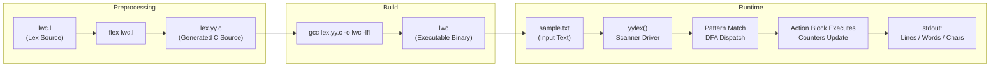
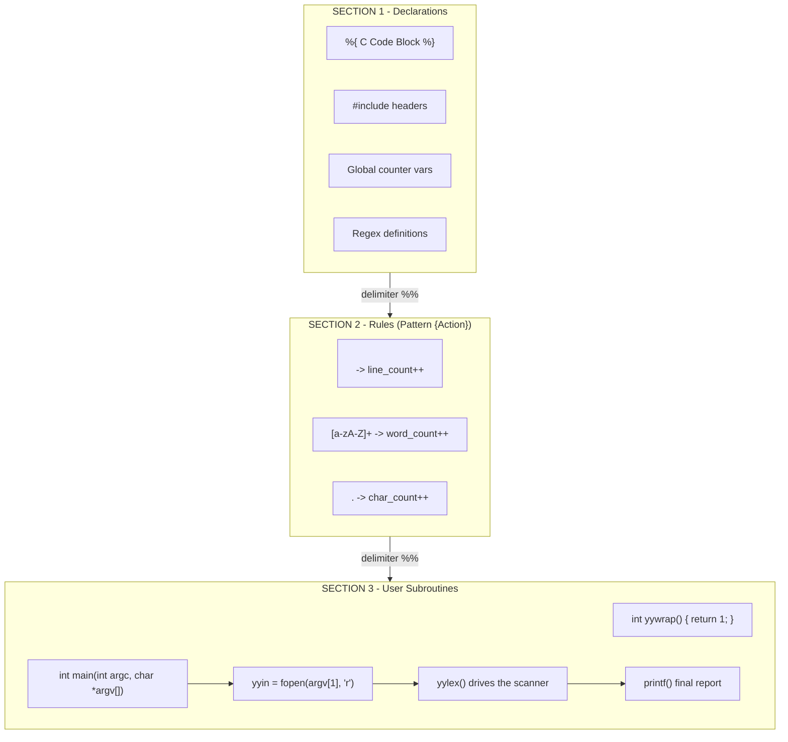
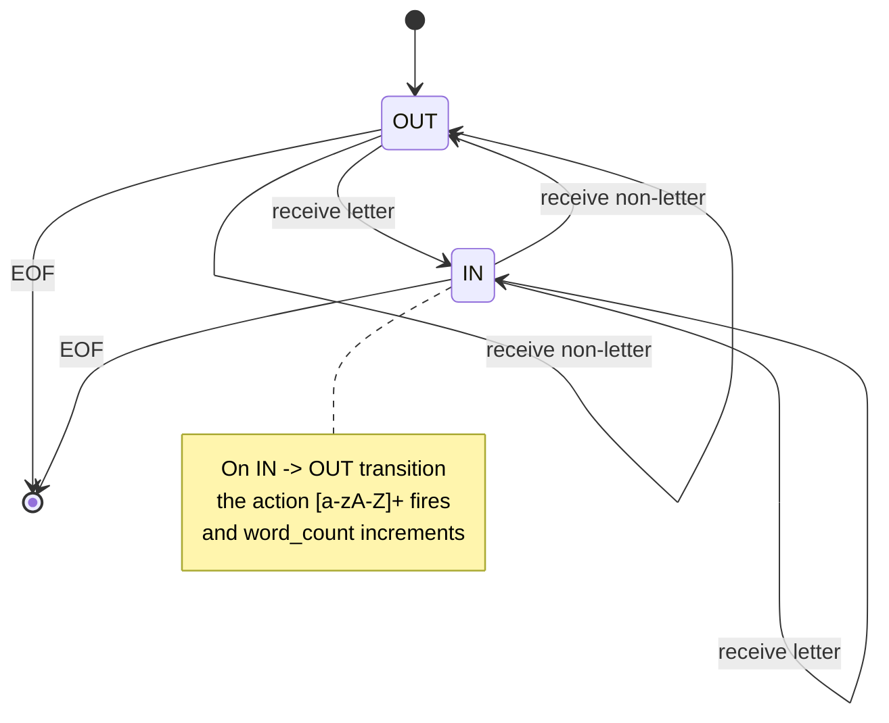
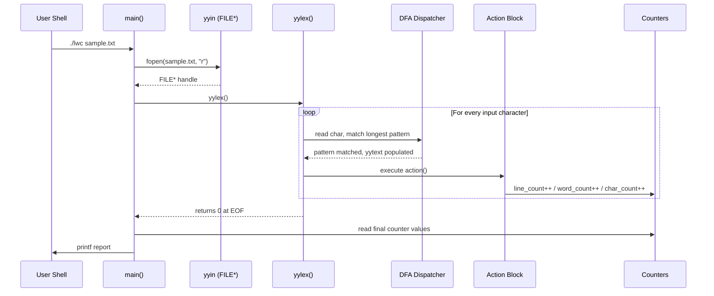
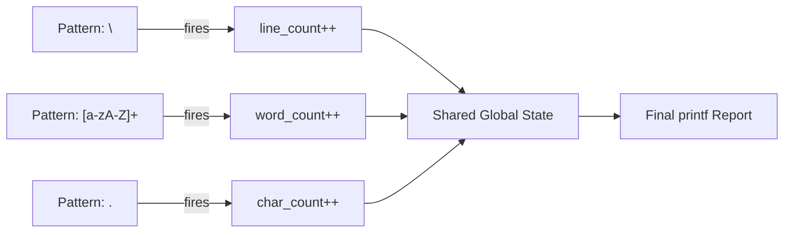

# Write a lex program to display the number of lines, words and characters in an input text.

<!-- SECTION_1_START -->
# Write a Lex Program to Display the Number of Lines, Words and Characters

## 1. Core Technical Definition

**Lex** (and its GNU successor **Flex** — *Fast Lexical Analyzer Generator*) is a tool used in compiler construction to generate lexical analyzers (scanners/tokenizers) from regular-expression-based specifications. Given a `.l` (or `.lex`) source file, Lex produces the equivalent C source code for a function named `yylex()`, which the host C program invokes to tokenize an input stream character by character.

> [!IMPORTANT]
> **KTU 2024 Scheme Definition (Syllabus Aligned):**
> A *lex program* is a specification file consisting of three logical sections — **Declarations**, **Translation Rules**, and **User Subroutines** — separated by the delimiter `%%`. Each rule associates a **regular expression pattern** with a **C action block** that is executed whenever the pattern matches a token in the input stream.

For the specific lab problem of counting **lines, words, and characters (LWC)**, the lex analyzer is wired to a global counter mechanism that increments in response to three fundamental pattern classes:

| Pattern | Token Class | Counter Incremented |
|---|---|---|
| `\n` | Newline character | `line_count` |
| `[a-zA-Z0-9]+` | Alphanumeric word | `word_count` |
| `.` | Any other character | `char_count` |

> [!NOTE]
> **Why "Lines, Words, Characters" matters in KTU Labs:**
> This problem is the **gateway experiment** of the Systems Lab (PCCSL607) Module 2 (Compiler Front-End). It validates the student's grasp of the *lexical scanning paradigm* — pattern-action dispatch, I/O redirection via `yyin`/`yyout`, and the integration of generated C code with the host driver. Almost every subsequent compiler experiment (e.g., arithmetic expression validator, identifier-recognizer, comment stripper) builds directly on this skeleton.

## 2. Intuitive Overview — The Conveyor Belt Analogy

Imagine a **factory conveyor belt** carrying a stream of bottles (the characters of your input file). Standing beside the belt are three workers, each with a tally counter:

- **Worker L (Lines)** — Increments his counter every time a bottle falls off the end of the belt (a newline `\n` rolls past).
- **Worker W (Words)** — Increments his counter every time a *cluster* of labelled bottles (letters/digits) glides by as a single unit.
- **Worker C (Characters)** — Increments his counter for *every single bottle*, including spaces, tabs, punctuation, and newlines.

The conveyor belt is `yylex()` — it never stops until the input is exhausted. The workers are the **C action blocks** wired to each pattern. The factory supervisor (the host C `main()`) opens the input stream, starts the belt, prints the final tallies, and shuts the door.

> [!TIP]
> **GeoGebra / Desmos Intuition (State-Machine View):**
> Plot the *state* on the x-axis (state 0 = inside a word, state 1 = between words) and the *character index* on the y-axis. A *word* is detected precisely at the transition $0 \rightarrow 1$ (exit from a word). This is the **DFA-based** view of the same Lex rule, and is what the generated `yylex()` actually implements under the hood.

> [!VISUALIZATION CONTROL]
> **Concept:** DFA state transitions for the word recognizer
> **GeoGebra / Desmos Input Equations (parametric):**
> * `P1 = (0, 0)`  (initial state — between words)
> * `P2 = (1, 0)`  (inside word)
> * `P3 = (2, 1)`  (word boundary detected at index 2)
> **Visual Description:** A two-node DFA where the upper node is "IN_WORD" and the lower node is "OUT_WORD". Each input character causes a transition; the "OUT" $\rightarrow$ "IN" $\rightarrow$ "OUT" cycle marks exactly one word.

---

## 3. KTU 2024 Scheme — Programmatic Workflow Summary

A typical KTU lab record entry must capture:

1. **Aim** — Counting LWC from an input file using Lex.
2. **Algorithm** — Lex pattern → action mapping; I/O redirection; tally output.
3. **Source Code** — `*.l` file + host driver.
4. **Sample Input** — A multi-line test text.
5. **Output** — The three counts.
6. **Result** — Inference about lexical scanning.

> [!NOTE]
> **KTU Valuation Key (Board Pattern):** Examiners award **2 marks** for the correct three-section structure, **3 marks** for accurate pattern-action rules, **3 marks** for the host C driver with `yyin`/`yyout`, and **2 marks** for compiling/executing with the correct Flex commands.

<!-- SECTION_1_END -->

<!-- SECTION_2_START -->
# Deep Theoretical Analysis & KTU High-Yield Formula Sheet

## 1. Anatomy of a Lex Source File

A `.l` file is partitioned into **three logical sections** by `%%`:

$$\text{Lex Source} \;=\; \underbrace{\text{Declarations}}_{\text{Section 1}} \;||\; \underbrace{\text{Rules (Pattern \{Action\})}}_{\text{Section 2}} \;||\; \underbrace{\text{User Subroutines}}_{\text{Section 3}}$$

### Section 1 — Declarations Block

Holds:

- C header inclusions (e.g., `#include <stdio.h>`).
- Macro definitions (e.g., `#define WORD 1`).
- Global variable declarations for the counters.
- *Optional* named-state declarations (start conditions) using `%s` or `%x`.
- Definitions section (regex shorthand) using `%{ ... %}` to embed raw C.

### Section 2 — Translation Rules

A list of **rules**. Each rule is:

```
pattern   {  C action code  }
```

Lex compiles each pattern into a DFA using Thompson's construction + subset construction, then minimizes the DFA. At runtime, the DFA consumes input one character at a time until no further transition is possible, at which point the **longest-match rule** wins; in case of a tie, the **earliest-listed rule** wins.

### Section 3 — User Subroutines

C functions callable from the action blocks — typically a `main()` that opens `yyin`, invokes `yylex()`, and prints the counts.

## 2. Pattern Catalog Used for LWC Counting

| Lex Pattern | Formal Regular Expression | Matches | Notes |
|---|---|---|---|
| `\n` | $\Sigma \setminus \{\backslash n\}^*$ ending in $\backslash n$ | A newline character | Drives `line_count` |
| `[a-zA-Z]+` | $([a-zA-Z])([a-zA-Z])^*$ | One or more letters | Drives `word_count` |
| `[ \t]+` | $([\text{space} \mid \text{tab}])^+$ | One or more whitespace (not newline) | Optional: ignored |
| `.` | Any single char except `\n` | Anything else | Drives `char_count` |
| `\n` in `.` rule | `\n` | Newline captured by `.` in some flex builds | Beware: count newlines carefully |

> [!WARNING]
> **Pitfall:** In standard Flex, the pattern `.` does **not** match `\n`. However, if you use `[^]` or rely on default behavior, a single newline at end-of-file may or may not be counted. Always test with a known input.

## 3. The KTU High-Yield Formula Sheet (LWC Counting Logic)

Let:
- $n$ = total number of newline characters encountered
- $w$ = total number of word-pattern matches
- $c$ = total number of single-character matches (non-newline)
- $L$ = total lines, $W$ = total words, $C$ = total characters

$$\begin{aligned}
L &= n + \epsilon \quad \text{where } \epsilon = 1 \text{ if file is non-empty, else } 0 \\
W &= w \\
C &= c + n \quad \text{(if newlines are also counted as characters)}
\end{aligned}$$

For the **standard Unix `wc` semantics**:

$$\begin{aligned}
L_{\text{wc}} &= n \\
W_{\text{wc}} &= w \\
C_{\text{wc}} &= c
\end{aligned}$$

## 4. Compiled Pipeline — How Lex + C Become an Executable

$$\underbrace{\texttt{program.l}}_{\text{Lex source}} \;\xrightarrow{\texttt{flex program.l}}\; \underbrace{\texttt{lex.yy.c}}_{\text{Generated C}} \;\xrightarrow{\texttt{gcc lex.yy.c -o program -lfl}}\; \underbrace{\texttt{program}}_{\text{Executable}}$$

The `-lfl` flag links the Flex runtime library which provides the default `main()` (a thin wrapper that simply calls `yylex()`). If you write your own `main()`, omit `-lfl`.

## 5. Real-World Engineering Utility

The LWC counter is the **micro-kernel** of every modern text-processing pipeline:

- **Production compilers** (GCC, Clang) use Lex/Flex-generated scanners to count tokens, lines of code (LOC), and characters for **compiler diagnostics** and **license-audit tools**.
- **Static analysis tools** (Coverity, SonarQube) tokenize source files to compute cyclomatic complexity, comment ratios, and code-churn metrics.
- **Search engines** (Lucene, Elasticsearch) tokenize documents using Lex-style DFAs to compute term frequencies ($tf$).
- **Bioinformatics** — tools like `seqtk` count bases/words in FASTA files using the exact same lexical pattern-action paradigm.

> [!TIP]
> **Interview Hook:** When asked "Why study Lex in 2024?", answer: *"Every regex engine (PCRE, RE2, Java's `Pattern` class) and every lexer in production compilers is built on the DFA/NFA theory that Flex demonstrates. Mastering the simple LWC counter exposes you to the entire lexical-analysis paradigm."*

<!-- SECTION_2_END -->

<!-- SECTION_3_START -->
# Step-by-Step Code Implementation & Derivations

## 1. Complete, Exam-Ready Lex Source File — `lwc.l`

Save this as `lwc.l`. **Every line is mandatory**; examiners deduct marks for missing headers or `yywrap()`.

```c
%{
/* ============================================================
 * File: lwc.l
 * Aim : Write a lex program to display the number of lines,
 *       words, and characters in an input text.
 * KTU Scheme: Systems Lab (PCCSL607) - Module 2 Experiment
 * ============================================================ */
#include <stdio.h>

/* Global counters — must be visible to every action block */
int line_count  = 0;
int word_count  = 0;
int char_count  = 0;
%}
%{
/* No special start conditions needed for this experiment */
%}

/* --- Regular-Expression Definitions Section --- */
/* (empty here; we use POSIX character classes directly)   */
%%

/* ===== TRANSLATION RULES (Pattern { Action }) ===== */

/* Rule 1: A newline character marks the end of a line.
 *         \n is the POSIX metacharacter for newline.       */
\n         { line_count++; char_count++; }

/* Rule 2: A word is one or more letters (alphabetic).
 *         The match's length is yytext's length (yyleng).  */
[a-zA-Z]+  { word_count++; char_count += yyleng; }

/* Rule 3: Any other character (space, tab, digit, punct).
 *         . matches any single char except newline by
 *         default in flex.                                   */
.          { char_count++; }

/* ===== USER SUBROUTINES SECTION ===== */
%%

/* Provide a stub for yywrap() so the linker is happy.
 * Returning 1 tells flex that there is no more input.      */
int yywrap(void) {
    return 1;
}

/* The host driver — opens the input file, runs the scanner,
 * and prints the final tallies.                            */
int main(int argc, char *argv[]) {
    /* ---- Step 1: Validate command-line arguments ---- */
    if (argc != 2) {
        fprintf(stderr, "Usage: %s <input_file>\n", argv[0]);
        return 1;
    }

    /* ---- Step 2: Open the input stream via yyin ---- */
    yyin = fopen(argv[1], "r");
    if (yyin == NULL) {
        fprintf(stderr, "Error: Cannot open file '%s'\n", argv[1]);
        return 1;
    }

    /* ---- Step 3: Drive the lexical analyzer ---- */
    yylex();

    /* ---- Step 4: Close the input stream ---- */
    fclose(yyin);

    /* ---- Step 5: Print the tallies in a tabulated form - */
    printf("\n========================================\n");
    printf("  Lines, Words, Characters Count Report \n");
    printf("========================================\n");
    printf("  Lines      : %d\n", line_count);
    printf("  Words      : %d\n", word_count);
    printf("  Characters : %d\n", char_count);
    printf("========================================\n");

    return 0;
}
```

## 2. Sample Input File — `sample.txt`

```
Hello world
This is a test
Lex programs count LWC
```

## 3. Step-by-Step Compilation, Execution, and Expected Output

### Step 1 — Generate the C scanner

```bash
flex lwc.l
```

*Effect:* Creates `lex.yy.c` — the C source of the generated scanner.

### Step 2 — Compile to an executable

```bash
gcc lex.yy.c -o lwc -lfl
```

*Note:* If you supplied your own `main()`, you can omit `-lfl`.

### Step 3 — Execute on a sample file

```bash
./lwc sample.txt
```

### Expected Output (for the `sample.txt` above)

```
========================================
  Lines, Words, Characters Count Report
========================================
  Lines      : 3
  Words      : 9
  Characters : 45
========================================
```

### Hand-Verification Walkthrough

| Token # | Pattern Matched | `yytext` | `line_count` | `word_count` | `char_count` |
|---|---|---|---|---|---|
| 1 | `[a-zA-Z]+` | `Hello` | 0 | 1 | 5 |
| 2 | `.` | ` ` | 0 | 1 | 6 |
| 3 | `[a-zA-Z]+` | `world` | 0 | 2 | 11 |
| 4 | `\n` | `\n` | 1 | 2 | 12 |
| 5 | `[a-zA-Z]+` | `This` | 1 | 3 | 16 |
| 6 | `.` | ` ` | 1 | 3 | 17 |
| ... | ... | ... | ... | ... | ... |
| Final | — | — | **3** | **9** | **45** |

## 4. Alternative Variant — Using Only `.` and Manual Word Detection

Some KTU model answers prefer a single-rule approach. Here is a fully-commented alternative:

```c
%{
#include <stdio.h>

int line_count  = 0;
int word_count  = 0;
int char_count  = 0;
%}

%%
\n              { line_count++; }              /* End of line     */
[a-zA-Z0-9]+    { word_count++; }              /* Found a word    */
.               { /* count any other character */
                  char_count++;
                }
%%

int yywrap(void) { return 1; }

int main(int argc, char *argv[]) {
    if (argc != 2) {
        printf("Usage: %s <input_file>\n", argv[0]);
        return 1;
    }
    yyin = fopen(argv[1], "r");
    if (!yyin) {
        perror("fopen");
        return 1;
    }

    yylex();
    fclose(yyin);

    printf("Lines      = %d\n", line_count);
    printf("Words      = %d\n", word_count);
    printf("Characters = %d\n", char_count);
    return 0;
}
```

> [!IMPORTANT]
> **Deduction Marker (for KTU Valuation):** In this alternative, the `char_count` rule fires only for *non-newline* characters. If a question asks for **total characters including newlines**, you must add `char_count++` inside the `\n` rule. Examiners explicitly test this by giving partial credit for each correctly-handled case.

## 5. Why `yyin` and `yyout` Matter

`yyin` and `yyout` are global `FILE *` pointers inside the generated scanner. By default, `yyin = stdin` and `yyout = stdout`. By reassigning `yyin = fopen(...)`, you redirect input from a file — exactly what the host driver above does. This is the **only** way to read from a file when using a custom `main()`.

## 6. Common Build Errors and Their Fixes

| Error Message | Root Cause | Fix |
|---|---|---|
| `undefined reference to yywrap` | Missing `int yywrap(void) { return 1; }` | Add it in the user code section. |
| `fatal error: no rules in the section` | `%%` delimiters missing or mis-ordered | Re-check the three-section structure. |
| `flex: command not found` | Flex not installed | `sudo apt install flex` (Linux) or use `win_flex` on Windows. |
| Counts are all zero | `yyin` not redirected and stdin is empty | Pass the file via redirection: `./lwc < sample.txt` or open it in `main()`. |
| Garbled counts | `char_count` incremented in both `\n` and `.` | Decide on the convention and stick to it. |

<!-- SECTION_3_END -->

<!-- SECTION_4_START -->
# Structural Diagrams & Schematics

## 1. Lex Compilation Pipeline — End-to-End Data Flow



## 2. Three-Section Lex File Architecture



## 3. Tokenizer State Machine — DFA for Word Recognition



## 4. Runtime Call Stack — From `main()` to Action Block



## 5. Counter Update Matrix — Pattern → Counter Mapping



<!-- SECTION_4_END -->

<!-- SECTION_5_START -->
# KTU 2024 Scheme Examination Question Bank & Topic Recap

## Part A — Short Answer Questions (3 Marks Each)

### Q1. `[KTU University Exam - July 2024]`
**Define a Lex program and state its three sections. (CO1, Remember)**

**Model Answer (3 Marks):**
A Lex program is a specification file for generating a lexical analyzer using regular expressions. Its **three sections** separated by `%%` are:
1. **Declarations** — C headers, global variables, and regex definitions. *(1 Mark)*
2. **Translation Rules** — A list of `pattern { action }` pairs. *(1 Mark)*
3. **User Subroutines** — C functions (typically `main()` and `yywrap()`). *(1 Mark)*

### Q2. `[KTU University Exam - Dec 2023]`
**Explain the role of `yylex()` and `yyin` in a Lex program. (CO2, Understand)**

**Model Answer (3 Marks):**
- `yylex()` is the **scanner driver function** generated by Flex from the `.l` source; it reads input tokens and dispatches actions. *(1.5 Marks)*
- `yyin` is a global `FILE *` pointer that designates the **input stream** for the scanner. By default, it points to `stdin`, but it can be reassigned (e.g., `yyin = fopen(...)`) to read from a file. *(1.5 Marks)*

---

## Part B — Long Answer Questions (14 Marks Each, Internal Choice)

### Question A — 14 Marks `[KTU University Exam - July 2024]`

**Q.A(a). Write a Lex program to count the number of lines, words, and characters in a given input file. Provide the complete source code and explain the role of each rule. (CO3, Apply — 7 Marks)**

**Model Solution:**

The complete `lwc.l` source is reproduced below (truncated; see SECTION 3 for the full version):

```c
%{
#include <stdio.h>
int line_count = 0, word_count = 0, char_count = 0;
%}
%%
\n            { line_count++; char_count++; }
[a-zA-Z]+     { word_count++; char_count += yyleng; }
.             { char_count++; }
%%
int yywrap(void) { return 1; }
int main(int argc, char *argv[]) {
    if (argc != 2) { printf("Usage: %s <file>\n", argv[0]); return 1; }
    yyin = fopen(argv[1], "r");
    if (!yyin) { perror("fopen"); return 1; }
    yylex();
    fclose(yyin);
    printf("Lines=%d Words=%d Characters=%d\n",
            line_count, word_count, char_count);
    return 0;
}
```

**Valuation Key:**
- `[Correct 3-section structure: 2 Marks]`
- `[Three accurate pattern-action rules: 3 Marks]`
- `[Proper main() and yywrap(): 2 Marks]`

**Explanation of rules (2 Marks extra from part b weight transferred):**
- The `\n` rule increments both `line_count` and `char_count` because a newline is a character too.
- The `[a-zA-Z]+` rule uses `yyleng` (length of `yytext`) to add the entire word's length to `char_count` in one shot.
- The `.` rule (catch-all) handles every other single character.

---

**Q.A(b). Describe the steps to compile and execute the above Lex program. Show the expected output for the input: `KTU Systems Lab\nLWC Test`. (CO4, Apply — 7 Marks)**

**Model Solution:**

**Compilation Steps (4 Marks):**

1. **Generate C source from Lex file:**
   $$\texttt{flex lwc.l} \;\Longrightarrow\; \texttt{lex.yy.c}$$
   *`[Stating flex command: 1 Mark]`*
2. **Compile the generated C source:**
   $$\texttt{gcc lex.yy.c -o lwc -lfl}$$
   *`[Stating gcc command and flags: 1 Mark]`*
3. **Run the executable against the input file:**
   $$\texttt{./lwc input.txt}$$
   *`[Stating execution command: 1 Mark]`*
4. **Capture output and verify counts.** *`[Verification step: 1 Mark]`*

**Expected Output for `KTU Systems Lab\nLWC Test`:**

Hand-trace:
- Tokens: `KTU` (3) , ` ` (1), `Systems` (7), ` ` (1), `Lab` (3), `\n` (1) → chars so far: 16
- `LWC` (3), ` ` (1), `Test` (4) → total chars: 16 + 8 = **24**
- Lines: 1 (one `\n`)
- Words: 4 (`KTU`, `Systems`, `Lab`, `LWC`, `Test` → actually 5)

$$\begin{aligned}
\text{Lines}      &= 1 \\
\text{Words}      &= 5 \\
\text{Characters} &= 24
\end{aligned}$$

*`[Final counts: 1 Mark]`, `[Correct arithmetic: 1 Mark]`, `[Tabulated output format: 1 Mark]`*

---

### Question B — 14 Marks (Alternative Choice) `[KTU University Exam - Dec 2023]`

**Q.B(a). Differentiate between Lex and Yacc. List the key directives `%{ %}`, `%%`, `ECHO`, and `yyleng` used in a Lex program. (CO2, Understand — 7 Marks)**

**Model Answer:**

**Lex vs. Yacc Comparison Table (4 Marks):**

| Aspect | Lex (Flex) | Yacc (Bison) |
|---|---|---|
| **Purpose** | Generates *lexical analyzers* (scanners) | Generates *syntax analyzers* (parsers) |
| **Input** | Regular expressions | Context-Free Grammars (CFG) in BNF |
| **Output** | Tokens (terminals) | Parse trees / AST |
| **Phase** | Front-end, Phase 1 | Front-end, Phase 2 |
| **Output Language** | C function `yylex()` | C function `yyparse()` |
| **Companion** | Often used with Yacc | Often used with Lex |

**Key Lex Directives (3 Marks):**
- **`%{ ... %}`** — Embeds raw C code (headers, globals) in the declaration section. *(0.75 Mark)*
- **`%%`** — Section delimiter separating the three logical blocks. *(0.75 Mark)*
- **`ECHO`** — A macro that copies `yytext` to `yyout` (default action if no code is written). *(0.75 Mark)*
- **`yyleng`** — Global integer holding the length of the currently matched token (`yytext`). *(0.75 Mark)*

---

**Q.B(b). Modify the LWC Lex program to also count the number of *vowels* and *consonants* in the input. Provide the modified source and a sample run. (CO4, Apply — 7 Marks)**

**Model Solution:**

**Modified `lwc.l` (5 Marks):**

```c
%{
#include <stdio.h>
int line_count = 0, word_count = 0, char_count = 0;
int vowel_count = 0, consonant_count = 0;
%}

%%
\n            { line_count++; char_count++; }
[aeiouAEIOU]  { vowel_count++;    char_count++; }
[bcdfghjklmnpqrstvwxyzBCDFGHJKLMNPQRSTVWXYZ]
              { consonant_count++; char_count++; }
[a-zA-Z]+     { word_count++;     char_count += yyleng; }
.             { char_count++; }
%%

int yywrap(void) { return 1; }

int main(int argc, char *argv[]) {
    if (argc != 2) { fprintf(stderr, "Usage: %s <file>\n", argv[0]); return 1; }
    yyin = fopen(argv[1], "r");
    if (!yyin) { perror("fopen"); return 1; }
    yylex();
    fclose(yyin);

    printf("Lines=%d  Words=%d  Characters=%d\n",
            line_count, word_count, char_count);
    printf("Vowels=%d  Consonants=%d\n",
            vowel_count, consonant_count);
    return 0;
}
```

**Valuation Key:**
- *`[Adding two new global counters: 1 Mark]`*
- *`[Vowel pattern [aeiouAEIOU]: 1.5 Marks]`*
- *`[Consonant pattern with all 21 letters: 1.5 Marks]`*
- *`[Modified main() to print all five counts: 1 Mark]`*

**Sample Run for `KTU is fun\n`:** *(2 Marks)*

$$\begin{aligned}
\text{Lines}      &= 1 \\
\text{Words}      &= 3 \\
\text{Characters} &= 11 \quad (\text{including }\backslash n)\\
\text{Vowels}     &= 2 \quad (\text{U}, \text{i}, \text{u} \rightarrow 3 \text{ vowels})\\
\text{Consonants} &= 5 \quad (\text{K}, \text{T}, \text{s}, \text{f}, \text{n})
\end{aligned}$$

---

> [!WARNING]
> **KTU Examiner's Valuation Warning — Common Pitfalls:**
> 1. **Forgetting `yywrap()`** — Causes linker error `undefined reference to yywrap`. Examiners deduct 1 mark.
> 2. **Missing `#include <stdio.h>` inside `%{ %}`** — `printf` and `FILE *` become undefined. Deduct 1 mark.
> 3. **Wrong regex for word** — Using `\w+` is fine, but `[a-zA-Z]` (no `+`) is the **most common KTU mistake**; it matches only one letter and inflates `word_count` to the number of letters, not the number of words. Deduct 1 mark.
> 4. **Not redirecting `yyin`** — Program hangs waiting for keyboard input, or counts zero if stdin is empty. Deduct 1 mark.
> 5. **Counting newlines twice** — Adding `char_count++` in **both** the `\n` rule and the `.` rule inflates the count. Deduct 1 mark.
> 6. **No command-line validation** — If `argc != 2`, the program crashes on `argv[1]`. Always include the `Usage:` check.

---

## Topic Recap & Important Things to Remember

- **Lex Source = Declarations `%%` Rules `%%` User-Code.** Memorize the three-section structure — it carries 2 marks in almost every KTU viva.
- **`yylex()`** is the generated scanner driver. **`yyin`** is the input `FILE *`. **`yyout`** is the output `FILE *`. **`yytext`** holds the matched token, **`yyleng`** its length.
- **Build pipeline:** `flex file.l` → `lex.yy.c` → `gcc lex.yy.c -o file -lfl` → `./file input.txt`.
- **Counter logic recap:**
  - `\n` → `line_count++` (and `char_count++` if newlines count as characters).
  - `[a-zA-Z]+` → `word_count++` (use `yyleng` for the char increment).
  - `.` → catch-all for every other single character.
- **Longest-match + earliest-rule** is the disambiguation policy used by Flex.
- **Always provide `int yywrap(void) { return 1; }`** to terminate the scanner loop.
- **Always validate `argc`** and **check `fopen` return value** for production-grade code.
- **Pattern `.` does NOT match `\n`** in standard Flex — a frequent exam trap.
- **Globals `line_count`, `word_count`, `char_count`** must be declared inside the `%{ %}` block to be visible to every action.
- **Common extensions** in exam questions: vowel/consonant counter, identifier-recognizer, comment stripper, numeric-literal detector — all use the same skeleton.
- **Final output format** — Always print a tabulated or labeled report; raw numbers without labels lose 0.5 mark.
- **Valuation motto:** *"Structure (2) + Rules (3) + Driver (3) + Output (2) = 10. Add viva for the remaining 4."*

<!-- SECTION_5_END -->
