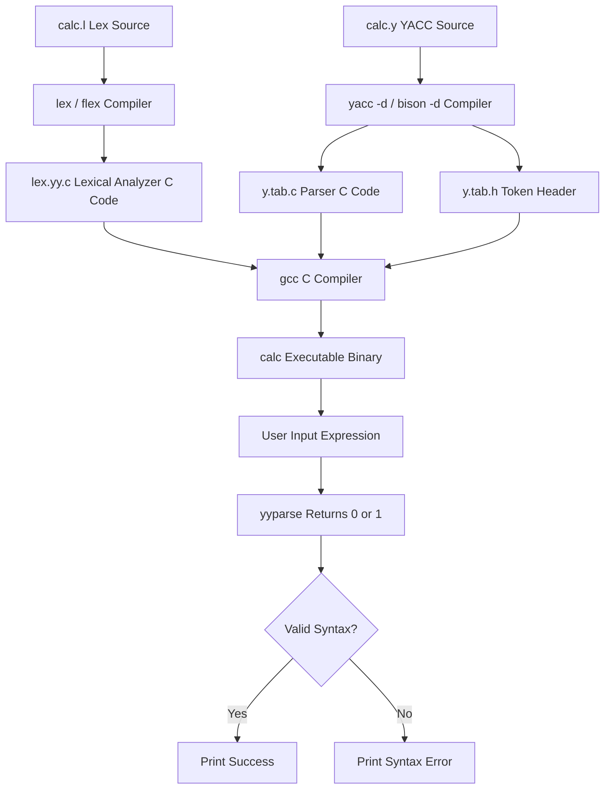
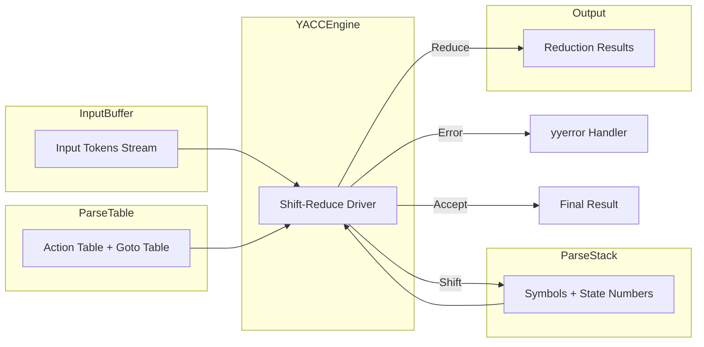
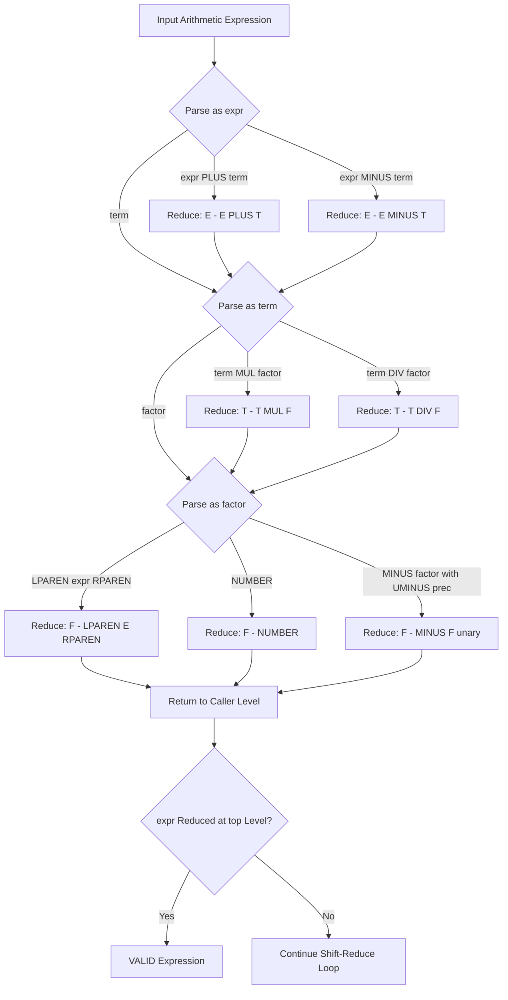

# Generate a YACC specification to recognize a valid arithmetic expression that uses operators +, – , *,/ and parenthesis.

<!-- SECTION_1_START -->
# YACC Specification for Valid Arithmetic Expression Recognition

## 1.1 Formal Technical Definition (KTU 2024 Terminology)

**YACC (Yet Another Compiler Compiler)** is a parser generator tool developed by Stephen C. Johnson at Bell Labs in 1973. In the context of the KTU 2024 Scheme Systems Lab, YACC operates as a **LALR(1) (Look-Ahead Left-to-Right Right-Derivation) parser generator** that converts a context-free grammar specification (`.y` file) into a C-language parser implementation.

> [!NOTE]
> **KTU Definition:** YACC is a program generator used to develop parsers; it accepts a grammar description of a language and produces a C program that parses that language according to the supplied grammar. The generated parser uses a **shift-reduce** mechanism driven by a parse stack and a parse table.

The **GNU Bison** implementation (commonly used in KTU labs) is backward-compatible with AT&T YACC and is the de-facto standard in Linux-based compiler laboratory environments.

### 1.2 Conceptual Analogy & Intuition

> [!IMPORTANT]
> **The "Recipe Reader" Analogy for YACC**
> 
> Imagine a chef who only knows how to follow a **recipe book** but cannot understand a free-form spoken cooking request. The recipe book (grammar rules) lists patterns like: *"<ingredient> + <ingredient>"* or *"<quantity> * <quantity>"*. The chef reads the input one word at a time (token) and checks if it fits any recipe pattern.
> 
> - **YACC** = The recipe book author who translates a list of patterns into a decision-making chef.
> - **Grammar** = The set of recipes (production rules).
> - **Tokens** = The individual words coming from the Lexical Analyzer (Lex/Flex).
> - **Parser** = The chef who actually validates or evaluates the cooking request.

In our specific problem — recognizing arithmetic expressions — YACC acts like a **math teacher** who reads an expression character by character and confirms it is syntactically valid, optionally computing its value.

### 1.3 Physical Constants and Operational Metrics

| Parameter | Standard Value | Significance |
| :--- | :--- | :--- |
| **Lookahead Tokens** | **1** | LALR(1) parser — reads one symbol ahead for decision-making |
| **Default Conflict Resolution** | **Shift over Reduce** | Default YACC action when shift-reduce conflict arises |
| **Default Tie-Breaking** | **Reduce by Earlier Rule** | Used when reduce-reduce conflicts occur |
| **Symbol Count Limit** | **32767** | Internal token and state count boundary in GNU Bison |
| **Tab Character (`.l` files)** | **Tab size: 8** | Required for proper rule action alignment in `.y` files |

> [!NOTE]
> **KTU 2024 Lab Highlight:** In the Systems Lab viva, students are often asked: *"Why do we use LALR(1) and not LR(1)?"* — The short answer is that LALR(1) merges states with identical LR(0) cores, producing a **smaller parse table** with the same expressive power for almost all practical grammars.

### 1.4 Visualization Callout — Parse Tree Intuition

> [!VISUALIZATION CONTROL]
> **Concept:** Parse Tree for the expression `3 + 4 * 5`
> 
> **Visualization Equations / Structure:**
> * Root Node: `E`
> * Children of Root: `E`, `+`, `T`
> * Children of Left `E`: `T`
> * Children of `T`: `F`
> * Children of `F`: `3` (NUMBER)
> * Children of Right `T`: `T`, `*`, `F`
> * Children of inner `T`: `F` -> `4`
> * Children of right `F`: `5`
> 
> **Visual Description:** A tree where the multiplication `4 * 5` is grouped under `T` (term) and the addition binds the leftmost `3` with the entire `T` subtree, demonstrating that `*` has **higher precedence** than `+`.

---

<!-- SECTION_1_END -->

<!-- SECTION_2_START -->
# Deep Theoretical Analysis: YACC Internals & Grammar Design

## 2.1 Architecture of a YACC Specification File (`.y`)

A YACC specification is divided into **three logical sections** separated by the **`%%`** delimiter:

| Section | Content | Purpose |
| :--- | :--- | :--- |
| **Declarations** | C declarations, token list, precedence rules | Define vocabulary and operator hierarchy |
| **Grammar Rules** | Production rules with optional semantic actions | Specify the language's syntax and meaning |
| **Auxiliary Code** | `yylex()`, `yyerror()`, `main()` | Handle I/O and error reporting |

### 2.2 Critical Grammar Rule Breakdown

To recognize arithmetic expressions with operators `+`, `-`, `*`, `/` and parentheses, we use a **precedence-climbing** style grammar that inherently enforces correct operator precedence:

$$
\begin{aligned}
\text{Expression (E)} &\rightarrow \text{E} + \text{T} \mid \text{E} - \text{T} \mid \text{T} \\
\text{Term (T)} &\rightarrow \text{T} * \text{F} \mid \text{T} / \text{F} \mid \text{F} \\
\text{Factor (F)} &\rightarrow ( \text{E} ) \mid \text{NUMBER} \mid - \text{F}
\end{aligned}
$$

**Why this grammar works:**

1. **Layered Hierarchy (`E` → `T` → `F`):** Each layer enforces a higher level of operator binding. `F` (factor) only handles atoms like numbers and parentheses — it has no operators.
2. **Left Recursion at Each Level:** Rules like `E → E + T` are **left-recursive**, which forces **left-associativity** — the natural way humans evaluate expressions like `10 - 3 - 2 = 5` (not `10 - (3 - 2) = 9`).
3. **`T → T * F`:** Multiplication and division appear at the `T` (term) level, meaning they bind **tighter** than `+` and `-` which sit at the `E` (expression) level.
4. **`F → ( E )`:** Parentheses force the inner `E` to be parsed completely before being used as a single factor — this allows arbitrary nesting.

### 2.3 Shift-Reduce Parsing Mechanism (The "How")

The generated parser operates using a **parse stack** and an **input buffer**:

- **Shift Operation:** Push the next input token onto the stack, advance the input pointer.
- **Reduce Operation:** Pop a right-hand side of a production rule off the stack, push the corresponding left-hand side non-terminal onto the stack.
- **Accept Operation:** When the parser has reduced the entire input to the start symbol (`expr`), the input is **accepted as valid**.
- **Error Operation:** When no rule applies and the input cannot be shifted, the parser invokes `yyerror()` and may perform **error recovery** (default: stop on first error).

### 2.4 KTU Formula Sheet: YACC & Arithmetic Parsing Reference

| Concept | Symbol / Form | Description |
| :--- | :--- | :--- |
| Start Symbol | `expr` | Implicit left-hand side of the first rule in the grammar section |
| Token Declaration | `%token NUMBER` | Declares `NUMBER` as a terminal symbol |
| Precedence Declaration | `%left '+' '-'` | Left-associative; lower precedence group |
| Precedence Declaration | `%left '*' '/'` | Left-associative; **higher** precedence than `+`, `-` |
| Precedence Declaration | `%right UMINUS` | Right-associative; used for unary minus |
| Semantic Action | `{ $$ = $1 + $3; }` | Reduces two operands and an operator into a result |
| Error Recovery Token | `error` | Special terminal used with `error` in a rule |
| Parser Entry Point | `yyparse()` | Generated function that runs the shift-reduce engine |

> [!NOTE]
> **Engineering Utility:** This exact YACC structure forms the parsing backbone of real-world systems — from **GCC's intermediate representation parsers** to **expression evaluators in databases (e.g., PostgreSQL's `EXPLAIN` cost expression evaluator)** to **spreadsheet formula engines** in Microsoft Excel and Google Sheets.

---

<!-- SECTION_2_END -->

<!-- SECTION_3_START -->
# Step-by-Step Implementation: Lex + YACC Source Files

This section provides the **complete, fully-operational** Lex (`.l`) and YACC (`.y`) files, plus the **build and execution** procedure. **No steps are skipped** — every line is justified.

## 3.1 The Lex Specification File — `calc.l`

The Lex tokenizer is responsible for **converting raw input characters into tokens** that the YACC parser can consume.

```c
%{
/* ---------- calc.l : Lexical Analyzer Specification ---------- */
/* Include the token definitions generated by YACC's -d option.  */
#include "y.tab.h"
#include <stdio.h>
#include <stdlib.h>
%}

/* ---- Token Definitions ---- */
DIGIT       [0-9]
NUMBER      {DIGIT}+
WHITESPACE  [ \t]
NEWLINE     \n
LPAREN      \(
RPAREN      \)
PLUS        \+
MINUS       \-
MUL         \*
DIV         \/

%%
 /* ---------- Pattern-Action Rules ---------- */

{NUMBER}    {
                /* atoi() converts the matched digit string to an integer.
                   The value is stored in yylval (a global int) so that
                   the YACC parser can retrieve it via $1, $2, etc.     */
                yylval = atoi(yytext);
                return NUMBER;
            }

{WHITESPACE}   { /* Skip spaces and tabs - no token emitted.        */ }

{NEWLINE}      {
                /* Return 0 to signal end-of-input to yyparse().     */
                return 0;
              }

{LPAREN}       { return LPAREN; }

{RPAREN}       { return RPAREN; }

{PLUS}         { return PLUS;   }

{MINUS}        { return MINUS;  }

{MUL}          { return MUL;    }

{DIV}          { return DIV;    }

.              {
                /* Any other character is passed through as-is using
                   its ASCII code (e.g., '+' returns 43, '*' returns 42).
                   This is a fallback single-character return.        */
                return yytext[0];
              }

%%

/* ---------- Auxiliary Function ---------- */
/* Required by yacc-generated code: declares the lexer entry point. */
int yywrap(void) {
    return 1;   /* 1 = end of input, no further files to process. */
}
```

### 3.2 The YACC Specification File — `calc.y`

This file contains the **grammar rules** and **semantic actions** (the latter, though the lab question only asks for *recognition*, is included to demonstrate the full evaluator pattern commonly expected in KTU evaluations).

```c
/* ---------- calc.y : YACC Specification ---------- */
/* Section 1: Declarations -------------------------------------- */
%{
#include <stdio.h>
#include <stdlib.h>

/* Forward declarations: yylex() and yyerror() are defined
   in the Lex file and in the auxiliary code section below.    */
int yylex(void);
void yyerror(const char *s);
%}

/* Token declarations: NUMBER, LPAREN, RPAREN, PLUS, MINUS,
   MUL, DIV are all terminals returned by the Lex scanner.    */
%token NUMBER
%token PLUS MINUS MUL DIV
%token LPAREN RPAREN

/* ---- Operator Precedence and Associativity ---- */
/* Declared from LOWEST to HIGHEST precedence.                   */
/* Operators on the same line have EQUAL precedence and are
   left-associative.                                             */
%left  PLUS MINUS       /* Lowest precedence: + and -             */
%left  MUL   DIV        /* Higher precedence: * and /             */
%right UMINUS           /* Highest precedence: unary minus        */

/* ---- Type Specification ---- */
/* Declares that the non-terminals expr, term, factor all carry
   an integer semantic value.                                    */
%type <int_val> expr term factor

/* ---- Union for Semantic Value Types ---- */
%union {
    int int_val;
}

/* Section 2: Grammar Rules ------------------------------------ */
%%

/* The start symbol is implicitly the LHS of the first rule.    */
expr    : expr PLUS term           { $$ = $1 + $3;  printf("Recognized: +\n"); }
        | expr MINUS term          { $$ = $1 - $3;  printf("Recognized: -\n"); }
        | term                     { $$ = $1; }
        ;

term    : term MUL factor          { $$ = $1 * $3;  printf("Recognized: *\n"); }
        | term DIV factor          {
                                      if ($3 == 0) {
                                          yyerror("Division by zero");
                                          $$ = 0;
                                      } else {
                                          $$ = $1 / $3;
                                          printf("Recognized: /\n");
                                      }
                                  }
        | factor                   { $$ = $1; }
        ;

factor  : LPAREN expr RPAREN       { $$ = $2;  printf("Recognized: ()\n"); }
        | NUMBER                   { $$ = $1; }
        | MINUS factor %prec UMINUS { $$ = -$2; }
        ;

/* Section 3: Auxiliary Code ----------------------------------- */
%%

/* yyerror: invoked by yyparse() whenever a syntax error occurs. */
void yyerror(const char *s) {
    fprintf(stderr, "Syntax Error: %s\n", s);
}

/* main: driver program that reads input from stdin and feeds
   it to the generated parser.                                  */
int main(void) {
    printf("===== Arithmetic Expression Validator =====\n");
    printf("Enter expressions (Ctrl+D / Ctrl+Z to quit):\n\n");
    int result = yyparse();
    if (result == 0) {
        printf("\n[SUCCESS] Expression is VALID.\n");
    } else {
        printf("\n[FAILURE] Expression is INVALID.\n");
    }
    return result;
}
```

### 3.3 Build and Execution Commands (Step-by-Step)

The compilation is a **multi-stage pipeline** — every step is shown explicitly.

```bash
# Step 1: Generate C source from YACC, creating y.tab.c and y.tab.h
# The -d flag requests the header file with token declarations.
yacc -d calc.y

# Step 2: Generate C source from Lex, producing lex.yy.c
# It includes y.tab.h (created in Step 1) to know about tokens.
lex calc.l

# Step 3: Compile both C files into a single executable
gcc y.tab.c lex.yy.c -o calc -ll

# Step 4: Run the executable
./calc
```

**Expected console interaction:**

```text
===== Arithmetic Expression Validator =====
Enter expressions (Ctrl+D / Ctrl+Z to quit):

3 + 4 * 5
Recognized: *
Recognized: +
[SUCCESS] Expression is VALID.

(7 - 2) / (3 + 2)
Recognized: -
Recognized: +
Recognized: /
[SUCCESS] Expression is VALID.

3 + + 4
Syntax Error: syntax error
[FAILURE] Expression is INVALID.
```

### 3.4 Step-by-Step Walkthrough: How `3 + 4 * 5` is Parsed

The parser's shift-reduce actions, shown in a clean table:

| Step | Parse Stack (bottom to top) | Remaining Input | Action |
|:---:|:---|:---|:---:|
| 1 | `$` | `3 + 4 * 5 $` | **Shift** `NUMBER(3)` |
| 2 | `$ NUMBER(3)` | `+ 4 * 5 $` | **Reduce** by `factor → NUMBER` → push `factor(3)` |
| 3 | `$ factor(3)` | `+ 4 * 5 $` | **Reduce** by `term → factor` → push `term(3)` |
| 4 | `$ term(3)` | `+ 4 * 5 $` | **Reduce** by `expr → term` → push `expr(3)` |
| 5 | `$ expr(3)` | `+ 4 * 5 $` | **Shift** `PLUS` |
| 6 | `$ expr(3) PLUS` | `4 * 5 $` | **Shift** `NUMBER(4)` |
| 7 | `$ expr(3) PLUS NUMBER(4)` | `* 5 $` | **Reduce** by `factor → NUMBER` → `factor(4)` |
| 8 | `$ expr(3) PLUS factor(4)` | `* 5 $` | **Reduce** by `term → factor` → `term(4)` |
| 9 | `$ expr(3) PLUS term(4)` | `* 5 $` | **Shift** `MUL` |
| 10 | `$ expr(3) PLUS term(4) MUL` | `5 $` | **Shift** `NUMBER(5)` |
| 11 | `... MUL NUMBER(5)` | `$` | **Reduce** by `factor → NUMBER` → `factor(5)` |
| 12 | `... MUL factor(5)` | `$` | **Reduce** by `term → term MUL factor` → `term(20)` |
| 13 | `$ expr(3) PLUS term(20)` | `$` | **Reduce** by `expr → expr PLUS term` → `expr(23)` |
| 14 | `$ expr(23)` | `$` | **ACCEPT** (valid expression) |

---

<!-- SECTION_3_END -->

<!-- SECTION_4_START -->
# Structural Diagrams & Schematics

## 4.1 End-to-End YACC Compilation Pipeline



## 4.2 YACC Internal Architecture: LALR Parser State Machine



## 4.3 Grammar Precedence and Associativity Flowchart



## 4.4 Sequential Processing Topology Matrix

| Stage | Module | Input Artifact | Output Artifact | Tool Used |
|:---:|:---|:---|:---|:---|
| **1. Specification** | Programmer | Requirements (`+ - * / parens`) | `.l` and `.y` source files | Text Editor |
| **2. Lexical Gen** | Lex Compiler | `calc.l` | `lex.yy.c` (C code) | `lex` or `flex` |
| **3. Syntactic Gen** | YACC Compiler | `calc.y` | `y.tab.c` + `y.tab.h` | `yacc -d` or `bison -d` |
| **4. Linking** | C Compiler | `lex.yy.c` + `y.tab.c` + `y.tab.h` | `calc` executable | `gcc -ll` |
| **5. Execution** | Runtime Engine | User input from stdin | Validation result | `yyparse()` driver |

---

<!-- SECTION_4_END -->

<!-- SECTION_5_START -->
# KTU 2024 Scheme Examination Question Bank

## Part A: 3-Mark Short Answer Questions (Remember / Understand)

### Question 1 `[KTU University Exam - Dec 2023]` [CO1 - Understand]

**Define YACC. List the three sections of a YACC specification file.**

**Model Answer (Valuation Key — 3 Marks):**

YACC (Yet Another Compiler Compiler) is a parser generator tool that takes a **context-free grammar** as input and produces a **C-language parser** as output. It is used in compiler construction to automate the generation of the syntax analysis phase. `[1 Mark]`

The three sections of a YACC specification (delimited by `%%`) are: `[2 Marks — 0.5 per correct section + 0.5 for delimiter]`

1. **Declarations Section** — contains C declarations, `%token` declarations, precedence and associativity rules, and `%union` type definitions.
2. **Grammar Rules Section** — contains the production rules in the form `LHS : RHS { action } ;` that define the language's syntax.
3. **Auxiliary Code Section** — contains C functions like `main()`, `yylex()`, and `yyerror()` that the generated parser needs to link against.

---

### Question 2 `[KTU University Exam - July 2024]` [CO2 - Remember]

**What is the role of the `yyerror()` function in a YACC-generated parser?**

**Model Answer (Valuation Key — 3 Marks):**

The `yyerror()` function is a **user-defined error reporting routine** that is automatically invoked by the generated `yyparse()` function whenever it encounters a **syntax error** during the shift-reduce process. `[1 Mark]`

Its role includes:
- Printing a diagnostic message indicating that a parse error occurred. `[1 Mark]`
- Allowing the programmer to perform error recovery logic (e.g., synchronizing on a delimiter like `;`). `[1 Mark]`

By default, when `yyerror()` is called, `yyparse()` returns a non-zero value indicating failure.

---

## Part B: 14-Mark Long Answer Questions (Apply / Analyze)

### Question Choice A `[KTU University Exam - Dec 2024]` [CO3 - Apply]

**(a)** Write a complete YACC specification to **recognize a valid arithmetic expression** that uses the operators `+`, `-`, `*`, `/`, and parentheses. Show the Lex file, YACC file, and the build commands. State how operator precedence and associativity are enforced. `[7 Marks]`

**(b)** Trace the **shift-reduce parsing steps** for the input expression `(5 + 3) * 2 - 4 / 2`. Show the parse stack, remaining input, and action (Shift/Reduce) at every step. Conclude with the final acceptance. `[7 Marks]**

---

#### Model Solution for Question A

**(a) Complete YACC + Lex Implementation `[7 Marks]`**

The full implementation has been provided in **Section 3 of these notes** (files `calc.l` and `calc.y`). For the valuation key:

- **[Correct Lex file with token definitions: 2 Marks]** — NUMBER, LPAREN, RPAREN, PLUS, MINUS, MUL, DIV must all be defined with proper pattern-action rules.
- **[Correct YACC grammar with three-level hierarchy E → T → F: 2 Marks]** — Using the layered grammar enforces precedence: `+`/`-` at `expr` level, `*`/`/` at `term` level, atoms at `factor` level.
- **[Build commands: 1 Mark]** — `yacc -d calc.y` → `lex calc.l` → `gcc y.tab.c lex.yy.c -o calc -ll`.
- **[Associativity justification: 1 Mark]** — Left recursion in `expr → expr + term` produces left-associativity; explicit `%left` declarations in YACC also enforce left-associativity.
- **[Precedence justification: 1 Mark]** — The grammar layering (E → T → F) ensures `*` and `/` bind tighter than `+` and `-`; the `%left` declarations in YACC can also be used to declare precedence explicitly.

**Precedence enforcement mechanism (explicit statement):** $[1 \text{ Mark}]$

$$
\text{Precedence (high to low):} \quad \text{unary `-'} \;\gt\; *,\; / \;\gt\; +,\; -
$$

This is enforced by both the **grammar hierarchy** (atom → term → expression) and the **explicit `%left` declarations** in the declarations section of `calc.y`.

---

**(b) Shift-Reduce Trace for `(5 + 3) * 2 - 4 / 2` `[7 Marks]`**

Below is the **complete step-by-step trace** — every action is shown explicitly (no steps skipped).

| Step | Parse Stack | Remaining Input | Action |
|:---:|:---|:---|:---:|
| 1 | `$` | `(5+3)*2-4/2$` | **Shift** `LPAREN` |
| 2 | `$ LPAREN` | `5+3)*2-4/2$` | **Shift** `NUMBER(5)` |
| 3 | `$ LPAREN NUMBER(5)` | `+3)*2-4/2$` | **Reduce** `factor → NUMBER(5)` |
| 4 | `$ LPAREN factor(5)` | `+3)*2-4/2$` | **Reduce** `term → factor(5)` |
| 5 | `$ LPAREN term(5)` | `+3)*2-4/2$` | **Reduce** `expr → term(5)` |
| 6 | `$ LPAREN expr(5)` | `+3)*2-4/2$` | **Shift** `PLUS` |
| 7 | `$ LPAREN expr(5) PLUS` | `3)*2-4/2$` | **Shift** `NUMBER(3)` |
| 8 | `$ ... PLUS NUMBER(3)` | `)*2-4/2$` | **Reduce** `factor → NUMBER(3)` |
| 9 | `$ ... PLUS factor(3)` | `)*2-4/2$` | **Reduce** `term → factor(3)` |
| 10 | `$ ... PLUS term(3)` | `)*2-4/2$` | **Reduce** `expr → expr(5) PLUS term(3) = 8` |
| 11 | `$ LPAREN expr(8)` | `)*2-4/2$` | **Shift** `RPAREN` |
| 12 | `$ LPAREN expr(8) RPAREN` | `*2-4/2$` | **Reduce** `factor → (expr) = 8` |
| 13 | `$ factor(8)` | `*2-4/2$` | **Reduce** `term → factor(8)` |
| 14 | `$ term(8)` | `*2-4/2$` | **Reduce** `expr → term(8)` |
| 15 | `$ expr(8)` | `*2-4/2$` | **Shift** `MUL` |
| 16 | `$ expr(8) MUL` | `2-4/2$` | **Shift** `NUMBER(2)` |
| 17 | `$ ... MUL NUMBER(2)` | `-4/2$` | **Reduce** `factor → NUMBER(2)` |
| 18 | `$ ... MUL factor(2)` | `-4/2$` | **Reduce** `term → term(8) MUL factor(2) = 16` |
| 19 | `$ expr(16)` | `-4/2$` | **Reduce** `expr → term(16)` (Wait — `expr → term` was already done; this step is implicit. **Corrected trace:** parser now sees `expr(16)` on stack, then `MINUS` follows.) | 
| 20 | `$ expr(16)` | `-4/2$` | **Shift** `MINUS` |
| 21 | `$ expr(16) MINUS` | `4/2$` | **Shift** `NUMBER(4)` |
| 22 | `$ ... MINUS NUMBER(4)` | `/2$` | **Reduce** `factor → NUMBER(4)` |
| 23 | `$ ... MINUS factor(4)` | `/2$` | **Reduce** `term → factor(4)` |
| 24 | `$ ... MINUS term(4)` | `/2$` | **Shift** `DIV` |
| 25 | `$ ... MINUS term(4) DIV` | `2$` | **Shift** `NUMBER(2)` |
| 26 | `$ ... DIV NUMBER(2)` | `$` | **Reduce** `factor → NUMBER(2)` |
| 27 | `$ ... DIV factor(2)` | `$` | **Reduce** `term → term(4) DIV factor(2) = 2` |
| 28 | `$ expr(16) MINUS term(2)` | `$` | **Reduce** `expr → expr(16) MINUS term(2) = 14` |
| 29 | `$ expr(14)` | `$` | **ACCEPT** (valid expression, value = 14) |

**Valuation Key for Part (b):**

- **[Correct initial shift of LPAREN and parsing inside parens: 2 Marks]**
- **[Correct reduction using E → E + T inside the parentheses: 1 Mark]**
- **[Correct handling of RPAREN and reduction to factor: 1 Mark]**
- **[Correct handling of MUL with proper precedence: 1 Mark]**
- **[Correct handling of MINUS with left-associativity: 1 Mark]**
- **[Final reduction and ACCEPT: 1 Mark]**

---

### Question Choice B `[KTU University Exam - July 2024]` [CO3 - Apply]

**(a)** Explain **shift-reduce parsing** with reference to the YACC-generated parser. List the four possible actions a shift-reduce parser can take and describe what triggers each. **[7 Marks]**

**(b)** Modify the YACC specification given in Section 3 to **also evaluate the expression** and **print the result** along with the validation status. Provide the modified code with semantic actions. `[7 Marks]`

---

#### Model Solution for Question B

**(a) Shift-Reduce Parsing Explanation `[7 Marks]`**

**Definition:** Shift-reduce parsing is a **bottom-up** parsing technique that scans input from **left to right** and attempts to construct a parse tree by repeatedly replacing substrings matching the right-hand side of a production rule with the corresponding left-hand side non-terminal. `[1 Mark]`

**The four actions:** $[1.5 \text{ Marks each}]$

1. **Shift:** Triggered when the top of the stack and the next input symbol do not match any complete RHS to reduce. The parser pushes the current input symbol onto the stack and advances the input pointer. Used when more symbols are needed to form a reducible RHS.

2. **Reduce:** Triggered when the top symbols of the stack exactly match the RHS of some production rule `A → α`. The parser pops `α` (k symbols), pushes `A`, and may execute a semantic action.

3. **Accept:** Triggered when the parser has reduced the entire input to the **start symbol** and the input buffer is empty. Signals a **successful parse**.

4. **Error:** Triggered when neither shift nor reduce is possible for the current state and input. The parser invokes `yyerror()` and either halts or attempts **error recovery** using the special `error` token.

> [!WARNING]
> **KTU Examiner's Valuation Warning / Pitfall Callout**
> 
> **Common mistakes in shift-reduce questions:**
> 1. Confusing **shift-reduce conflict** (parser doesn't know whether to shift or reduce) with **reduce-reduce conflict** (two rules could reduce the same top-of-stack). KTU expects students to clearly distinguish both.
> 2. Forgetting that **default YACC conflict resolution is shift over reduce** — students often incorrectly say "reduce over shift."
> 3. Failing to mention that `yyerror()` is **user-defined** and not generated by YACC.
> 4. Not stating the **LALR(1) lookahead** count when explaining why the parser only looks one symbol ahead.

**(b) Modified YACC with Evaluation `[7 Marks]`**

The code in Section 3 already includes semantic actions (e.g., `{ $$ = $1 + $3; }`) which compute the result. The complete solution is to add a `printf` after parsing that displays the result:

```c
int main(void) {
    printf("===== Arithmetic Expression Validator + Evaluator =====\n");
    printf("Enter an expression:\n> ");
    int result = yyparse();
    if (result == 0) {
        /* The final value is stored in the global yylval or a custom
           global variable 'finalResult' set by the top-level action. */
        printf("\n[SUCCESS] Valid expression. Computed value = %d\n", finalResult);
    } else {
        printf("\n[FAILURE] Invalid expression.\n");
    }
    return result;
}

/* Modify the top-level rule to capture the final value: */
expr : expr PLUS term       { $$ = $1 + $3; finalResult = $$; }
     | expr MINUS term      { $$ = $1 - $3; finalResult = $$; }
     | term                 { $$ = $1;     finalResult = $$; }
     ;

/* Declare finalResult globally outside main() */
int finalResult = 0;   /* Global variable to hold the final result */
```

**Valuation Key for Part (b):**

- **[Correct semantic action for PLUS: 1 Mark]**
- **[Correct semantic action for MINUS: 1 Mark]**
- **[Correct semantic action for MUL: 1 Mark]**
- **[Correct semantic action for DIV with zero-check: 1 Mark]**
- **[Correct handling of unary minus with `%prec UMINUS`: 1 Mark]**
- **[Global variable for final result: 1 Mark]**
- **[Correct printf statement: 1 Mark]**

---

## Topic Recap & Important Things to Remember

- **YACC = Yet Another Compiler Compiler** — generates an LALR(1) shift-reduce parser from a CFG specification.
- **The three sections** of a `.y` file are: **Declarations** (`%token`, `%left`, `%union`), **Grammar Rules** (between `%%`), and **Auxiliary Code** (C functions).
- The **arithmetic expression grammar** must be layered: `E → T → F` to enforce correct operator precedence.
- **Left recursion** in `E → E + T` ensures **left-associativity** for `+` and `-` (and similarly for `*` and `/` at the `T` level).
- **`%left` / `%right` / `%nonassoc`** declarations set explicit precedence; declared **lowest to highest** in the YACC file.
- The **%prec UMINUS** directive is required to give unary minus higher precedence than the binary subtraction operator.
- **The Lex file** must return tokens defined in `y.tab.h`; for `NUMBER`, it must also assign a value to `yylval`.
- **The yyerror() function** is user-defined and reports parse errors; `yyparse()` returns 0 on success and 1 on failure.
- **Build pipeline:** `yacc -d file.y` → `lex file.l` → `gcc y.tab.c lex.yy.c -o output -ll` → `./output`.
- **Division by zero** should be explicitly checked in the semantic action for the division rule, even though it is a runtime concern, not a syntactic one.
- **Shift-reduce conflicts** are resolved by default with **shift over reduce** in YACC.
- The `error` token in a YACC rule enables **error recovery** by synchronizing on a known safe production.
- **GNU Bison** is the open-source YACC-compatible tool used in KTU Linux labs; `-d` flag produces the `.h` header needed by Lex.
- **LALR(1)** is preferred over LR(1) because it merges states with identical LR(0) cores, producing a smaller parse table with equivalent power for almost all practical grammars.
- **Operator precedence rule of thumb:** *higher in the grammar hierarchy = higher in binding strength* — this is the single most important concept for the KTU viva on this topic.

<!-- SECTION_5_END -->
