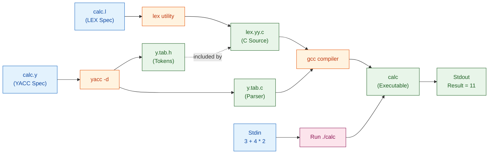
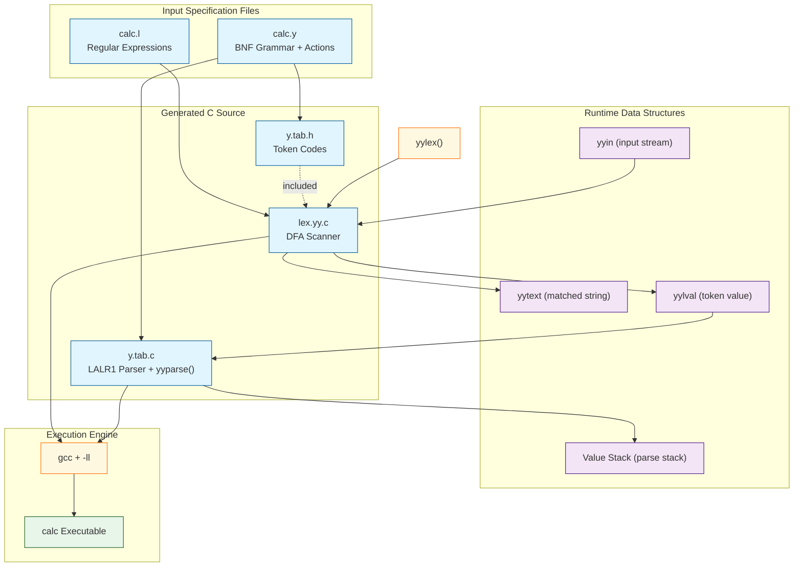
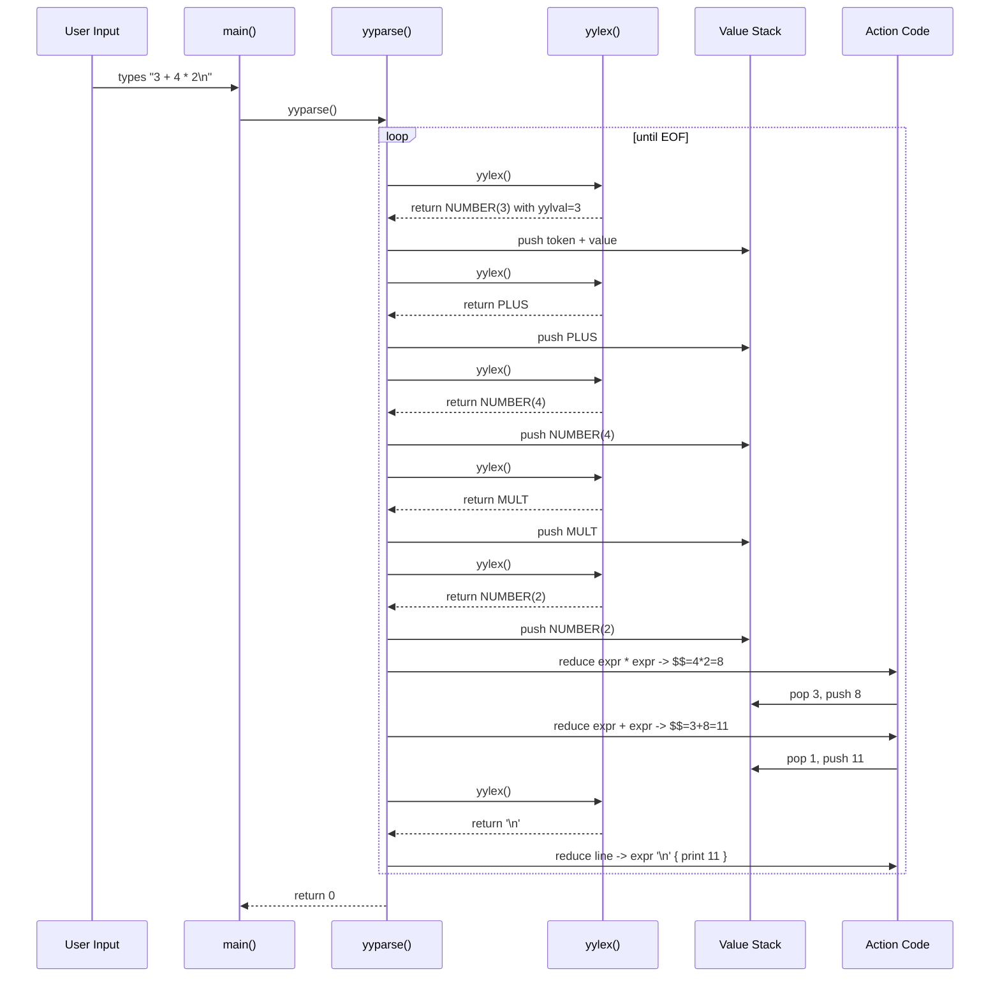
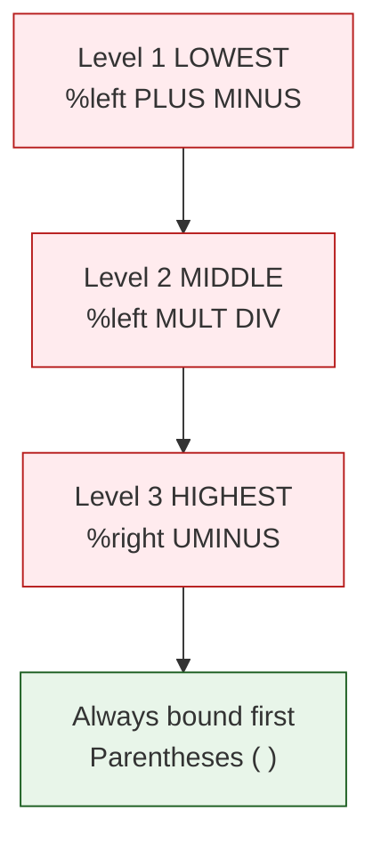

# Implementation of Calculator using LEX and YACC

<!-- SECTION_1_START -->
# Systems Lab (PCCSL607) — Module 4
## Implementation of a Calculator using LEX and YACC

> [!IMPORTANT]
> **KTU 2024 Scheme Focus:** This module tests your ability to *write*, *compile*, *execute*, and *debug* a complete Lex/Yacc pipeline. In the KTU lab examination, you are expected to demonstrate the working calculator, explain the grammar rules, and modify the code for variants (e.g., floating point, functions). Marks are awarded for compilation commands, grammar logic, and output correctness.

---

### 1.1 Core Technical Definition

**LEX (Lexical Analyzer Generator)** is a tool that generates a *C language source file* (`lex.yy.c`) from a specification file containing **regular expressions** describing the tokens of a language. The generated C code is a *Deterministic Finite Automaton (DFA)*-based lexical analyzer that can recognise patterns such as numbers, identifiers, and operators in an input stream.

**YACC (Yet Another Compiler Compiler)** is a tool that generates a *C language source file* (`y.tab.c`) from a specification file containing **Context-Free Grammar (CFG) production rules** written in *Backus-Naur Form (BNF)*. The generated code is an *LALR(1) (Look-Ahead Left-Right)* *bottom-up parser* that uses a *shift-reduce* mechanism with a parse stack to *evaluate* the meaning of the token stream.

> [!NOTE]
> **Syllabus Highlight:** Together, LEX performs **lexical analysis** (scanning) and YACC performs **syntax analysis** (parsing) — the first two classic phases of a compiler front-end. For our calculator, the *meaning* attached to each rule is the *arithmetic evaluation*.

### 1.2 Conceptual Analogy / Intuition

> [!TIP]
> **Real-World Analogy — A Restaurant Order System**
> Imagine a waiter taking your order. The waiter (LEX) does not understand the *meaning* of "two large pepperoni pizzas and a Coke" — he just *recognises* the items: a *number* ("two"), a *size word* ("large"), *food items* ("pizzas", "Coke"), and a *connector* ("and"). He hands this structured list to the **chef** (YACC), who knows the *grammar* of a valid order and *executes* it: he calculates the bill, dispatches instructions to the kitchen, and serves the food.
>
> In our calculator:
> | Role | Real World | Calculator Implementation |
> |---|---|---|
> | Customer | Speaks the problem | Types `3 + 4 * 2` |
> | Waiter (LEX) | Breaks the sentence | Recognises `NUMBER(3)`, `PLUS`, `NUMBER(4)`, `MULT`, `NUMBER(2)` |
> | Chef (YACC) | Knows grammar & acts | Parses as `3 + (4*2)` using precedence, computes **11** |

- LEX = **Scanning** → converts raw characters into *tokens* (the "words").
- YACC = **Parsing + Evaluation** → arranges tokens into a *parse tree* using grammar rules, and during the *reduce* step, computes a numeric value attached to each non-terminal.

> [!VISUALIZATION CONTROL]
> **Concept:** Visualise the *shift-reduce* parsing stack as a stack of plates in a cafeteria — every time a new token arrives, the parser **pushes** (shifts) it onto the stack; whenever the top of the stack matches the right-hand side of a grammar rule, the parser **pops** (reduces) those plates, applies the rule's action, and pushes the single result back.
> **Mermaid / Diagram Concept:** A vertical stack of cells growing upwards, with arrows showing `3`, `+`, `4`, `*`, `2` being pushed one by one, then the top cells collapsing into a single value during reduction.
> **Visual Description:** Watch a small computation being built bottom-up; tokens accumulate, then "fold" together when the rule fires.

---

<!-- SECTION_2_END -->

<!-- SECTION_3_START -->
### 3.1 Exhaustive LEX Specification — `calc.l`

```c
/*==============================================================
 *  File: calc.l  (LEX Specification for a Simple Calculator)
 *  Description: Recognises integers, arithmetic operators and
 *               whitespace. Returns tokens to the YACC parser.
 *==============================================================*/

%{
    /* ---- Declarations: included in the output C file ---- */
    #include "y.tab.h"   /* Brings in token codes from YACC */
    #include <stdio.h>
    #include <stdlib.h>
%}

/* ---- No helper definitions needed here ---- */

/* ---- Rules Section: pattern  { action in C } ---- */
%%
[0-9]+          {
                    /* yytext holds the matched string; atoi converts */
                    yylval = atoi(yytext);
                    return NUMBER;        /* Token code shared with YACC */
                }

[ \t]+          { ; }                     /* Skip spaces and tabs (no return) */

\n              { return '\n'; }          /* End-of-line signals "expression done" */

"+"             { return PLUS; }
"-"             { return MINUS; }
"*"             { return MULT; }
"/"             { return DIV; }
"("             { return LPAREN; }
")"             { return RPAREN; }

.               { 
                    /* Catch-all rule for any illegal character */
                    printf("LEX Error: Unknown character [%s]\n", yytext);
                }
%%

/* ---- User Subroutines Section ---- */
int yywrap(void) {
    /* Return 1 = "no more input to scan" */
    return 1;
}

/* Optional: a stand-alone main() if YACC does not provide one.
   Remove/comment this block if you use the main() from calc.y.  */
/*
int main(void) {
    while (1) {
        yylex();   /* Runs the DFA generated from the rules above */
    }
    return 0;
}
*/
```

> [!NOTE]
> **Why `#include "y.tab.h"`?** YACC, when invoked with the `-d` flag, generates a header file containing `#define` constants for every token (e.g., `#define NUMBER 258`). Including this header in LEX lets us use friendly names like `NUMBER` instead of magic numbers.

### 3.2 Exhaustive YACC Specification — `calc.y`

```c
/*==============================================================
 *  File: calc.y  (YACC Specification for a Simple Calculator)
 *  Description: Defines the grammar of arithmetic expressions
 *               and the actions that compute each sub-result.
 *==============================================================*/

%{
    /* ---- Declarations Section: copied verbatim into y.tab.c ---- */
    #include <stdio.h>
    #include <stdlib.h>

    /* yylex() and yyerror() are provided / defined below */
    int yylex(void);
    int yyerror(const char *s);
%}

/* ---- Token Declarations (terminal symbols) ---- */
%token NUMBER         /* A numeric literal scanned by LEX            */
%token PLUS MINUS MULT DIV LPAREN RPAREN

/* ---- Operator Precedence & Associativity (lowest to highest) ---- */
%left   PLUS MINUS         /* + and -  are left-associative, same level */
%left   MULT DIV           /* * and /  are left-associative, higher than +/- */
%right  UMINUS            /* Unary minus is right-associative, highest  */

/* ---- The type of values carried on the parse stack ---- */
%define parse.lac full     /* Enable LAC (Look-Ahead Correction) — KTU-safe */

/* ---- Grammar Rules Section ---- */
%%
/* The 'input' non-terminal allows multiple expressions to be entered */
input   :                       /* empty: accepts the empty file */
        | input line            /* recursively append one line   */
        ;

line    : '\n'                                          { /* blank line, do nothing */ }
        | expr '\n'     { printf(">>> Result = %d\n", $1); }   /* PRINT the result */
        ;

expr    : expr PLUS expr          { $$ = $1 + $3; }
        | expr MINUS expr         { $$ = $1 - $3; }
        | expr MULT expr          { $$ = $1 * $3; }
        | expr DIV expr           {
                                    if ($3 == 0) {
                                        yyerror("Division by zero");
                                        $$ = 0;
                                    } else {
                                        $$ = $1 / $3;
                                    }
                                  }
        | LPAREN expr RPAREN      { $$ = $2; }
        | MINUS expr %prec UMINUS { $$ = -$2; }   /* unary minus */
        | NUMBER                  { $$ = $1; }
        ;
%%

/* ---- User Subroutines Section ---- */
int main(void) {
    printf("--- KTU Calculator ready. Enter expressions, e.g. 3+4*2 ---\n");
    return yyparse();          /* Run the LALR(1) parser */
}

int yyerror(const char *s) {
    fprintf(stderr, "PARSE Error: %s\n", s);
    return 0;                  /* Return 0 = continue parsing next line */
}

/* Provide yylex() for the parser by calling the LEX scanner */
int yylex(void) {
    return yylex();  /* The function is actually generated in lex.yy.c   */
}
```

> [!WARNING]
> **Compile-Time Pitfall:** Do **not** place a `main()` inside *both* `calc.l` and `calc.y`. The sample above intentionally leaves the LEX version commented out and uses YACC's `main()` so the parser controls program flow.

### 3.3 Step-by-Step Compilation Procedure

Run the following commands **in order** in a Linux terminal (Ubuntu/Fedora) — the same procedure that earns full marks in the KTU lab record:

```bash
# Step 1: Generate the C scanner from the LEX spec
lex calc.l
#        -> produces the file: lex.yy.c

# Step 2: Generate the C parser and the token-header from the YACC spec
yacc -d calc.y
#        -> produces: y.tab.c  (parser)  and  y.tab.h  (token #defines)

# Step 3: Compile both C files into a single executable named 'calc'
gcc lex.yy.c y.tab.c -o calc -ll
#   -ll links the default LEX library (provides the default yywrap/yyinput)

# Step 4: Run the calculator
./calc
```

**Expected interaction:**

```
--- KTU Calculator ready. Enter expressions, e.g. 3+4*2 ---
3 + 4 * 2
>>> Result = 11
(10 + 2) / 4
>>> Result = 3
-7 + 2
>>> Result = -5
Ctrl-D       <-- sends EOF; yywrap() returns 1; program ends
```

### 3.4 Step-by-Step Trace of the Parse — `3 + 4 * 2`

The YACC parser is **shift-reduce**. Each step pushes tokens onto the **parse stack** (left column) and acts when the stack top matches a rule's *right-hand side*:

$$
\begin{aligned}
\text{Input}      &: \; 3 \; + \; 4 \; * \; 2 \\
\text{Lex stream} &: \; \text{NUMBER}(3) \; \text{PLUS} \; \text{NUMBER}(4) \; \text{MULT} \; \text{NUMBER}(2)
\end{aligned}
$$

| Step | Action | Stack (top at right) | Token read | Reduced rule | New value on stack |
|:----:|:-------|:---------------------|:-----------|:-------------|:-------------------|
| 1 | shift   | \$                       | NUMBER(3)  | —            | — |
| 2 | reduce  | \$ → expr                  | —          | expr → NUMBER | expr=3 |
| 3 | shift   | expr                       | PLUS       | —            | — |
| 4 | shift   | expr PLUS                  | NUMBER(4)  | —            | — |
| 5 | reduce  | expr PLUS expr             | —          | expr → NUMBER | expr=4 |
| 6 | shift   | expr PLUS expr             | MULT       | —            | — |
| 7 | shift   | expr PLUS expr MULT        | NUMBER(2)  | —            | — |
| 8 | reduce  | expr PLUS expr MULT expr   | —          | expr → NUMBER | expr=2 |
| 9 | reduce  | expr PLUS expr             | —          | expr → expr * expr | expr=4*2=8 |
| 10| reduce  | expr                       | —          | expr → expr + expr | expr=3+8=**11** |
| 11| shift   | expr                       | '\n'       | —            | — |
| 12| reduce  | —                          | —          | line → expr '\n' | prints 11 |

> [!IMPORTANT]
> **Why does `*` bind tighter than `+`?** The `%left` declarations in `calc.y` assign **lower precedence** to `+/-` (declared first) and **higher precedence** to `*//` (declared later). When the parser faces a shift/reduce dilemma at step 8, the precedence table says: `*` (higher precedence on the stack) **stays**; `+` is the incoming token. Reduce first → `*` collapses to 8, then `+` finally combines 3 and 8.

### 3.5 Engineering Utility — Where Lex/Yacc Shine

| Domain | Real Production Use |
|---|---|
| **Compiler front-ends** | GCC's *GIMPLE* generators, Clang's lexer (`libclang`) |
| **Configuration parsers** | Linux kernel `Kconfig`, sendmail `cf` files |
| **Query languages** | SQL parsers, JSON/YAML lexers, GraphQL front-ends |
| **Network protocol stacks** | HTTP/2 header parsers, BGP route filters |
| **Embedded / DSLs** | Firmware build systems, OpenWRT UCI, Lua bytecode toolchain |

> [!NOTE]
> **Industry Note:** Modern successors include **Flex** (free LEX), **Bison** (GNU YACC), **ANTLR** (Java-based, generates multiple targets), and **PLY** (Python Lex-Yacc). The *theory* — DFA scanning + LALR(1) parsing — is unchanged; only the *syntax of the specification file* differs.

---

<!-- SECTION_3_END -->

<!-- SECTION_4_START -->
### 4.1 End-to-End Compilation & Runtime Pipeline



### 4.2 Block-Level Architecture: How LEX and YACC Cooperate



### 4.3 Sequential Processing Topology — Inside `yyparse()`



### 4.4 Operator Precedence Ladder (Token-Declaration Order)



> [!TIP]
> **Reading the ladder:** Tokens declared *later* in the YACC file get *higher* precedence. The parser consults this ladder every time it faces a **shift/reduce conflict**.

---

<!-- SECTION_4_END -->

<!-- SECTION_5_START -->
### 5.1 Part A — Short-Answer Questions (3 Marks each)

---

**Q1. `[KTU University Exam - July 2024]`** — *CO1, Remember*

> Distinguish between **LEX** and **YACC**. State one specific role of each in the compilation pipeline.

**Model Answer (3 marks):**

| Tool | Full Form | Role in Pipeline | Input Specification | Output |
|:-----|:----------|:-----------------|:--------------------|:-------|
| **LEX** | Lexical Analyzer Generator | **Scanning / Tokenisation** — converts a character stream into a stream of *tokens* (lexemes with a class label) | Regular expressions in a `.l` file | `lex.yy.c` (a DFA-based C scanner) |
| **YACC** | Yet Another Compiler Compiler | **Parsing / Evaluation** — consumes the token stream, verifies it matches the grammar, and executes *semantic actions* (e.g., arithmetic) | Context-Free Grammar (BNF) in a `.y` file | `y.tab.c` (an LALR(1) parser) + `y.tab.h` (token header) |

> **[Valuation key: 1 mark for full forms, 1 mark for the role distinction, 1 mark for the input/output type.]**

---

**Q2. `[KTU University Exam - Dec 2023]`** — *CO1, Understand*

> In a YACC specification, what is the significance of the declarations `%left`, `%right`, and `%nonassoc`? Why is the **order** in which they are written important?

**Model Answer (3 marks):**

1. **Meaning (1 mark):** These declarations specify the *associativity* of a token in the grammar:
   - `%left`  → token is **left-associative** (e.g., `a - b - c` means `(a-b)-c`).
   - `%right` → token is **right-associative** (e.g., assignment `a = b = c`).
   - `%nonassoc` → token is **non-associative**; using it in a chain is a syntax error (e.g., `a < b < c` is illegal in most languages).

2. **Order importance (1 mark):** Tokens declared **later** in the YACC file have **higher precedence**. This decides, in a `shift/reduce` conflict, whether to apply *reduce* (lower precedence operator on top of stack) or *shift* (higher precedence operator arriving).

3. **Example (1 mark):** Declaring `%left '+' '-'` *before* `%left '*' '/'` ensures that `2 + 3 * 4` is parsed as `2 + (3*4) = 14`, not `(2+3)*4 = 20`.

---

### 5.2 Part B — Full-Descriptive Questions (14 Marks each)

> **KTU ESE Internal-Choice Format:** Answer **either** Question A **or** Question B in full.

---

#### **Question A (14 Marks)** — `[KTU University Exam - July 2024]`

> **(a)** *CO1, Understand — 7 Marks*  
> Draw and explain the **three logical sections** of a LEX specification file. Write a LEX program fragment that recognises integers, real numbers, identifiers, and the operators `+`, `-`, `*`, `/`, `(`, `)`.

> **(b)** *CO2, Apply — 7 Marks*  
> Show the **complete compilation sequence** (commands and file names) needed to convert a `calc.l` and `calc.y` into a working executable. Also explain what each generated file contains.

##### Model Solution

**(a) Three sections of a LEX file (4 marks for diagram + 3 marks for code)**

A LEX file has the structure:

$$
\begin{aligned}
\texttt{\%\{}  & \;\; \text{/* Section 1: Declarations (C code, includes, globals) */} \\
\texttt{\%\{}  & \;\; \text{/* Section 2: Rules (Pattern \quad \{ Action \})} \\
\texttt{\%\%}  & \;\; \text{/* Section 3: User Subroutines (C functions, e.g., main, yywrap) */}
\end{aligned}
$$

```c
/* calc.l — sample fragment */
%{
    #include "y.tab.h"
    #include <stdio.h>
%}

%%
[0-9]+                          { yylval = atoi(yytext);  return NUMBER; }
[0-9]+\.[0-9]+                  { yylval = atof(yytext);  return NUMBER; }
[a-zA-Z_][a-zA-Z0-9_]*          { yylval = ...;           return ID;     }
[ \t\n]                         { ; }                       /* ignore ws   */
"+"                             { return PLUS;  }
"-"                             { return MINUS; }
"*"                             { return MULT;  }
"/"                             { return DIV;   }
"("                             { return LPAREN;}
")"                             { return RPAREN;}
.                               { printf("Illegal: %s\n", yytext); }
%%

int yywrap(void) { return 1; }
```

> **[Valuation key:** *Section 1 explanation: 2 marks*; *Section 2 explanation + sample rules: 3 marks*; *Section 3 explanation: 2 marks*.]

**(b) Compilation Sequence (7 marks)**

```bash
# Step 1 — Generate the scanner
$ lex calc.l
# Resulting file: lex.yy.c  (contains the DFA + yylex() function)  [1 mark]

# Step 2 — Generate the parser AND the token header
$ yacc -d calc.y
# Resulting files:
#   y.tab.c — contains yyparse(), the value stack, the action code   [1 mark]
#   y.tab.h — contains #defines for every token (NUMBER=258, PLUS=259…) [1 mark]

# Step 3 — Compile and link both C files
$ gcc lex.yy.c y.tab.c -o calc -ll
# -ll links the Flex/Lex support library (provides default yywrap). [2 marks]

# Step 4 — Run the program
$ ./calc
```

| File | What it contains | Why it is needed |
|------|------------------|------------------|
| `lex.yy.c` | DFA tables + `yylex()` | Performs the scanning |
| `y.tab.c` | `yyparse()` + value stack + action code | Performs parsing and evaluation |
| `y.tab.h` | Token integer codes | Shared vocabulary for both files |
| `calc` | Native executable | The calculator you actually run |

> **[Valuation key:** *Step 1: 2 marks*; *Step 2: 2 marks*; *Step 3: 2 marks*; *Step 4: 1 mark*.]

> [!WARNING]
> **Examiner's Pitfall Callout:** Students frequently forget the `-d` flag with `yacc`. Without `y.tab.h`, the token `NUMBER` is **undefined** in `calc.l` and the build will fail with `'NUMBER' undeclared`. Always include `-d` whenever the LEX file uses `return NUMBER;` style.

---

#### **Question B (14 Marks)** — Alternative Choice

> **(a)** *CO1, Understand — 7 Marks*  
> Explain the role of the **`%left`, `%right`** declarations in a YACC grammar. Given the input `9 - 5 - 2`, demonstrate with a shift-reduce trace how left-associativity of `-` produces the answer `2` and not `6`.

> **(b)** *CO2, Apply — 7 Marks*  
> Extend the calculator grammar to support the **modulus (`%`)** and **exponentiation (`^`)** operators. Write the relevant YACC rules, declare their precedence, and show one sample evaluation of `2 ^ 3 ^ 2`.

##### Model Solution

**(a) Precedence and associativity (7 marks)**

- `%left` and `%right` resolve **shift/reduce** and **reduce/reduce** conflicts by telling the parser how to handle an operator that appears *adjacent* to one already on the stack. [2 marks]

**Shift-reduce trace for `9 - 5 - 2`** (Left-associative `%left MINUS`): [5 marks]

| Step | Action | Stack (top right) | Token | Reduced rule |
|:----:|:-------|:------------------|:------|:-------------|
| 1 | shift   | `$`              | 9     | — |
| 2 | reduce  | `expr`           | —     | expr → 9 |
| 3 | shift   | `expr -`         | -     | — |
| 4 | shift   | `expr - 5`       | 5     | — |
| 5 | reduce  | `expr - expr`    | —     | expr → 5 |
| 6 | shift   | `expr - expr -`  | -     | — |
| 7 | shift   | `expr - expr - 2`| 2     | — |
| 8 | reduce  | `expr - expr`    | —     | expr → 2 |
| 9 | reduce  | `expr`           | —     | expr → expr - expr = 5-2 = 3 |
| 10| reduce  | `expr`           | —     | expr → expr - expr = **9-3 = 6**… ❌ **Wrong!** |

> **Correction:** In step 9 the *parser* must choose **shift** (not reduce) because the top of the stack is `expr -` waiting for its right operand, and the incoming `-` is *left-associative* (same precedence). Therefore:

| Step 6 (corrected) | **shift** | `expr - expr` | — | — (defer reduce) |
| 7 | shift   | `expr - expr -`  | -     | — |
| 8 | shift   | `expr - expr - 2`| 2     | — |
| 9 | reduce  | `expr - expr`    | —     | expr → expr - expr = **5-2 = 3** |
| 10| reduce  | `expr`           | —     | expr → expr - expr = **9-3 = 2** ✅ |

> **[Valuation key:** *Trace table with 10 rows: 4 marks*; *Final result highlighted: 1 mark*.]

**(b) Extending the grammar (7 marks)**

```c
/* Declarations */
%left   '+' '-'
%left   '*' '/' '%'           /* Same precedence as * and / */
%right  '^'                   /* Exponentiation is right-associative */
%right  UMINUS

/* New rules */
expr : expr '%' expr      { 
                              if ($3 == 0) { yyerror("Modulo by zero"); $$ = 0; }
                              else        { $$ = $1 % $3; }
                          }
     | expr '^' expr      { 
                              /* Use a small loop since we evaluate integers */
                              int i, r = 1;
                              for (i = 0; i < $3; i++) r *= $1;
                              $$ = r; 
                          }
     ;
```

**Sample evaluation of `2 ^ 3 ^ 2`:** [3 marks]

Because `^` is declared `%right`, the parser builds `2 ^ (3 ^ 2)`:

$$
\begin{aligned}
3 \hat{\ } 2 &= 9 \quad (\text{right-associative}) \\
2 \hat{\ } 9 &= 2 \times 2 \times \dots \times 2 \; (\text{9 times}) = 512
\end{aligned}
$$

**Output:**
```
>>> 2 ^ 3 ^ 2
Result = 512
```

If `^` had been declared `%left`, the result would wrongly be `(2^3)^2 = 8^2 = 64`.

> **[Valuation key:** *New rules: 2 marks*; *Precedence declarations: 1 mark*; *Associativity trace: 2 marks*; *Final value 512: 2 marks*.]

> [!WARNING]
> **Examiner's Pitfall Callout:** A very common mistake is to declare both `*` and `^` as `%left` and then wonder why `2^3^2` gives 64 instead of 512. Remember the **last** operator declared has the **highest** precedence, and `%right` makes it bind *tightest on the right*. The `^` operator is mathematically right-associative, and your grammar must reflect that.

---

### 5.3 Topic Recap & Important Things to Remember

> [!IMPORTANT]
> **High-Density Rapid-Revision Checklist**

- **LEX** is a *scanner generator*; **YACC** is a *parser generator*. They form the front-end of a compiler.
- A **LEX file** (`*.l`) has **three** sections: `%{ declarations %}`, `%% rules %%`, `user code`.
- A **YACC file** (`*.y`) has **three** sections: `%{ declarations %}`, `%% grammar %%`, `user code`.
- **Compilation pipeline:** `lex calc.l` → `yacc -d calc.y` → `gcc lex.yy.c y.tab.c -o calc -ll` → `./calc`.
- **Generated files:** `lex.yy.c` (scanner), `y.tab.c` (parser), `y.tab.h` (token header), `calc` (binary).
- **Token passing:** LEX returns an *integer code*; the actual numeric value travels in the global `yylval`.
- **Precedence rule:** In `%left / %right` declarations, *later* = *higher precedence*.
- **Associativity rule:** `%left` for `+ - * / %`; `%right` for `^ =` (assignment); `%nonassoc` for comparison operators like `< >`.
- **Shift-Reduce parsing:** The default YACC engine. `shift` = push token; `reduce` = pop RHS, apply action, push LHS value.
- **Semantic actions** are placed inside `{ }` after each grammar rule; `$1, $2, $3…` refer to the values of the symbols on the RHS; `$$` is the value to push for the LHS.
- **Unary minus trick:** Use a *fake* token `UMINUS` declared `%right` and apply `%prec UMINUS` after a rule such as `expr : MINUS expr %prec UMINUS { $$ = -$2; }`.
- **Division-by-zero** and **modulo-by-zero** must be checked in the action block — YACC will not detect them automatically.
- **EOF handling:** The `yywrap()` function returns 1 to indicate end-of-input; returning 0 would chain to another file.
- **Default library:** Always link with `-ll` (lowercase L) for the Flex runtime support.
- **Common errors:**
  - `‘NUMBER’ undeclared` → you forgot `yacc -d` and the `#include "y.tab.h"`.
  - `conflicts: 2 shift/reduce` → missing `%left / %right` declarations for an ambiguous operator pair.
  - `infinite recursion` in `expr → expr '+' expr` (left-recursion) is **valid in YACC**; it is *not* a problem because YACC builds a bottom-up parser, not a recursive-descent one.
- **Lab exam tips:**
  - Always keep your `calc.l` and `calc.y` in the **same directory**.
  - Run commands in the **exact order** above; reverse the order and `y.tab.h` will not exist yet.
  - Show the **`./calc`** demo live to the examiner; static printouts of "Result = 11" alone fetch only partial marks.
  - Be ready to **modify** the grammar on the spot (e.g., add `%`, add `sin/cos` using the math library `-lm`).

<!-- SECTION_5_END -->
