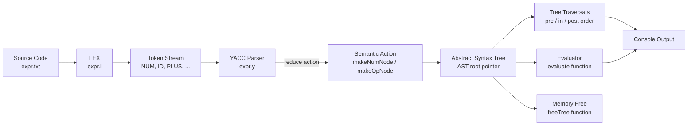
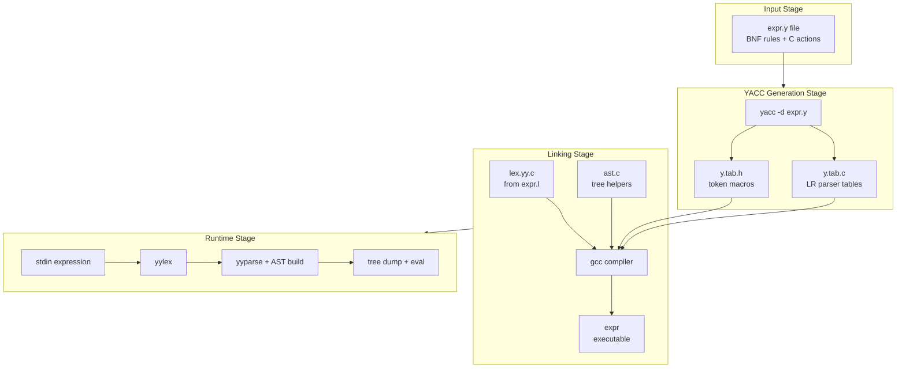
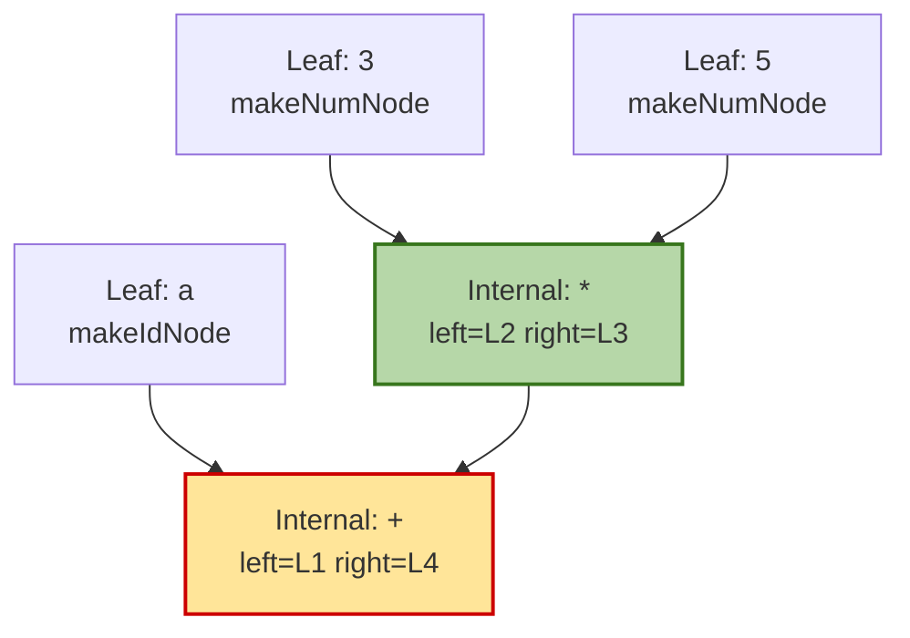
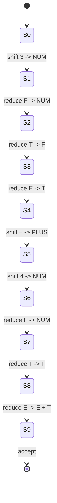

# Convert the BNF rules into YACC form and write code to generate abstract syntax tree.

<!-- SECTION_1_START -->
# Convert BNF Rules into YACC Form & Generate Abstract Syntax Tree

## 1. Core Technical Definition & Intuitive Overview

### Formal Definition (KTU 2024 Syllabus Terminology)

> [!NOTE]
> **YACC (Yet Another Compiler-Compiler)** is a **LALR(1)** parser generator tool that accepts a grammar specification written in a **BNF-like notation** and produces the source code of a **bottom-up shift-reduce parser** in the **C programming language**. The grammar is written in a **`.y`** file where each production rule is accompanied by a **semantic action** — a block of C code executed whenever the parser reduces by that production.

> [!IMPORTANT]
> **Abstract Syntax Tree (AST)** is a **tree-structured intermediate representation** of source code in which each **internal node** denotes an operator (or construct) and each **leaf node** denotes an operand (or token). Unlike a parse tree, the AST **eliminates syntactic clutter** (parentheses, punctuation, precedence-driven intermediate non-terminals) and preserves only the **semantic essence** of the program.

### Conceptual Analogy / Intuition

Think of **parsing** like assembling flat-pack furniture. The **BNF rules** are the instruction manual, **YACC** is the robot that reads the manual and tells you when each step is done, and the **AST** is the 3-D mental model of the finished product — stripped of all the screws, brackets, and packaging foam that were only needed *during* assembly, leaving only the meaningful structure (legs, shelves, top).

For example, the parse tree for `3 + 4 * 5` has *eleven* nodes (including redundant single-child chains for the grammar's non-terminals), but the AST for the same expression has only **five** nodes:

```
      +
     / \
    3   *
       / \
      4   5
```

The AST folds the precedence of `*` over `+` directly into the shape, so subsequent compiler phases (type-checking, code generation) can walk the tree in **O(n)** without re-deriving precedence.

### Standard Metrics & Constants

| Symbol | Meaning |
|---|---|
| **`$$`** | Value/result produced by the current production (LHS) |
| **`$1, $2, … $n`** | Values of the n symbols on the RHS of the current production |
| **`yyval`** | Internal stack top value used by YACC-generated parser |
| **`yyparse()`** | Entry function returned by YACC |
| **`yylex()`** | User-supplied lexer function (often from LEX) |
| **`yylval`** | Union carrying the semantic value of the current token |

> [!TIP]
> In KTU examinations, **`$$`, `$1`, `$2`** are tested explicitly. Memorise the **1-based** indexing.

### GeoGebra / Desmos Visualisation

> [!VISUALIZATION CONTROL]
> **Concept:** Visualising an AST for `a + b * c`
> **GeoGebra / Desmos Input Equations (parametric tree plot):**
> * `P_1 = (0, 2)` &nbsp; `P_2 = (-1.5, 1)` &nbsp; `P_3 = (1.5, 1)` &nbsp; `P_4 = (-2, 0)` &nbsp; `P_5 = (0, 0)` &nbsp; `P_6 = (2, 0)`
> * Edges: `P_1 -- P_2`, `P_1 -- P_3`, `P_2 -- P_4`, `P_2 -- P_5`, `P_3 -- P_6`
> **Visual Description:** A binary tree with the root labelled `+` at the top, left child labelled `*` (because `*` has higher precedence), and three leaves `a`, `b`, `c` at depth 2.
<!-- SECTION_1_END -->

<!-- SECTION_2_START -->
# 2. Deep Theoretical Analysis & KTU High-Yield Formula Sheet

## 2.1 The YACC Workflow (Conceptual Pipeline)

1. **Grammar Authoring** — Write the BNF-like grammar in a `.y` file inside the **declarations section** (`%{ … %}`), the **rules section** (`%% … %%`), and the **auxiliary C code section**.
2. **Semantic Actions** — Attach a C code block `{ … }` after each production. This block is executed on **reduction** by that production.
3. **Parser Generation** — Run `yacc -d file.y` (or `bison -d`) to produce `y.tab.c` and `y.tab.h` (the token header).
4. **Compilation** — Compile `y.tab.c` along with `lex.yy.c` (from LEX) and any helper code: `gcc y.tab.c lex.yy.c -o parser -ll`.
5. **Execution** — `parser` reads source from `stdin` and parses it, building the AST as a side-effect of the semantic actions.

## 2.2 BNF → YACC Translation Rules (Cheat Sheet)

| BNF Construct | YACC Equivalent | Notes |
|---|---|---|
| `<symbol>` | `symbol` (lowercase) | Non-terminals in **lowercase**, terminals often in **UPPERCASE** or quoted |
| `→` | `::=` | Colon-equals |
| `\|` (alternation) | `\|` (same symbol) | Each alternative on its own line is also legal |
| `ε` (epsilon) | *omit the symbol entirely* | Empty RHS — **YACC uses `;` to end the production** |
| Concatenation | Space-separated symbols | Implicit |
| `*` (Kleene star) | **Left-recursive production** | E.g., `L → L id \| id;` |

> [!IMPORTANT]
> **Conflict Alert:** If the grammar is **ambiguous** (e.g., the classic arithmetic expression grammar without precedence declarations), YACC reports *shift/reduce* or *reduce/reduce* conflicts. The recommended fix is to add **`%left`, `%right`, or `%nonassoc`** declarations in the **declarations section** in **ascending order of precedence**.

## 2.3 AST Node Design (Theoretical Foundation)

Each AST node must store:

* **`type`** — what kind of node it is (operator or leaf).
* **`left`, `right`** — pointers to children (often `NULL` for leaves).
* **`value`** — the numeric or string payload for leaves.
* For **n-ary** operators (function calls, comma lists), a **linked-list of children** is preferable.

A **binary tree** of this form satisfies the **abstract syntax tree property**: for any node, its inorder traversal of the tree yields the original expression with parentheses placed only where required by the *tree's* structure, not by the source text.

## 2.4 KTU Formula Sheet / Cheat Sheet

| Concept | Formula / Rule | KTU Exam Tip |
|---|---|---|
| Semantic value of LHS | `$$` | Always assign to `$$` to propagate up |
| Semantic value of $i$-th RHS symbol | `$i` (1-indexed) | Don't confuse with `$0` (unused) |
| Default action | `printf("reduced\n")` | Replace with tree-building code |
| LALR(1) lookahead | **1 token** | YACC's parser type |
| YACC directive | `%{ … %}` (C declarations) | Outside this block, YACC ignores C |
| Token declaration | `%token <union_member> NAME` | Defines terminal NAME |
| Associativity | `%left`, `%right`, `%nonassoc` | Lower line = lower precedence |
| Precedence tie-break (operator) | Last same-precedence rule wins on shift/reduce | The "tie on the line" rule |
| Start symbol | First LHS in rules section | Or override with `%start` |
| Error recovery | `expr : expr '+' expr error ';'` | Use `error` token |

### Real-World Engineering Utility

* **GCC / Clang front-ends** use Bison (YACC successor) for parsing C, C++, Rust, and Go.
* **SQL engines** (PostgreSQL) use Bison to parse `SELECT` statements and then build an AST that is later optimised and executed.
* **Programming-language education** (KTU's *Systems Lab* and *Compiler Design Lab*) uses YACC + LEX as a hands-on bridge between **theory of computation** and **practical compiler construction**.
* **JSON / YAML / DSL parsers** in DevOps tools are overwhelmingly YACC/Bison-generated.
<!-- SECTION_2_END -->

<!-- SECTION_3_START -->
# 3. Step-by-Step Derivations & Code Implementation

## 3.1 Reference Grammar (BNF)

We will convert the following **classical arithmetic expression grammar** into YACC form and have the parser build an AST. This is the most frequently asked KTU question on this module.

**BNF Form:**

$$
E \rightarrow E \,+\, T \mid E \,-\, T \mid T \\
T \rightarrow T \,\ast\, F \mid T \,/\, F \mid F \\
F \rightarrow (\,E\,) \mid \text{id} \mid \text{num}
$$

## 3.2 YACC-Form Conversion (Step-by-Step)

### Step 1 — Eliminate Left Recursion

The grammar above is left-recursive (YACC's default LALR parser cannot handle direct left recursion). We rewrite using **right recursion + epsilon**:

$$
E \rightarrow T\, E' \\
E' \rightarrow +\,T\,E' \mid -\,T\,E' \mid \varepsilon \\
T \rightarrow F\, T' \\
T' \rightarrow *\,F\,T' \mid /\,F\,T' \mid \varepsilon \\
F \rightarrow (\,E\,) \mid \text{id} \mid \text{num}
$$

### Step 2 — Declare Tokens & Precedence

In the **declarations section**:

* Declare `PLUS, MINUS, MUL, DIV, LP, RP, ID, NUM` as tokens.
* Assign precedence (low to high) to force the correct AST shape:
  * `%left PLUS MINUS` (lowest)
  * `%left MUL DIV` (higher)
  * `%right UMINUS` (highest, for unary minus)

### Step 3 — Attach Semantic Actions

For each production, write a C block that:

1. Calls `makenode(operator, left, right)` to allocate an AST node, or
2. Calls `makeleaf(value)` for a number/identifier.
3. Assigns the resulting node to `$$` so the parent rule can use it as `$1` or `$2`.

## 3.3 Full Working C/YACC Source (No Truncation)

### `ast.h` — Node Type Definitions

```c
#ifndef AST_H
#define AST_H

#include <stdio.h>
#include <stdlib.h>
#include <string.h>

/* AST node categories */
typedef enum {
    NODE_NUM,        /* numeric leaf */
    NODE_ID,         /* identifier leaf */
    NODE_OP          /* operator internal node */
} NodeType;

/* AST node structure */
typedef struct ASTNode {
    NodeType type;               /* what kind of node */
    int      op;                 /* operator code (+, -, *, /) for NODE_OP */
    int      value;              /* numeric value for NODE_NUM */
    char    *name;               /* identifier name for NODE_ID */
    struct ASTNode *left;        /* first child (or NULL) */
    struct ASTNode *right;       /* second child (or NULL) */
} ASTNode;

/* Constructor prototypes */
ASTNode *makeNumNode(int v);
ASTNode *makeIdNode(char *s);
ASTNode *makeOpNode(int op, ASTNode *l, ASTNode *r);

/* Traversal prototypes */
void preorder (ASTNode *r);
void inorder  (ASTNode *r);
void postorder(ASTNode *r);
int  evaluate (ASTNode *r);
void freeTree (ASTNode *r);

#endif
```

### `ast.c` — Tree Construction & Traversal

```c
#include "ast.h"

/* Allocate a numeric leaf */
ASTNode *makeNumNode(int v) {
    ASTNode *n = (ASTNode *)malloc(sizeof(ASTNode));
    if (n == NULL) {
        fprintf(stderr, "ERROR: out of memory in makeNumNode\n");
        exit(EXIT_FAILURE);
    }
    n->type  = NODE_NUM;
    n->op    = 0;
    n->value = v;
    n->name  = NULL;
    n->left  = NULL;
    n->right = NULL;
    return n;
}

/* Allocate an identifier leaf (strdup so caller can free) */
ASTNode *makeIdNode(char *s) {
    ASTNode *n = (ASTNode *)malloc(sizeof(ASTNode));
    if (n == NULL) {
        fprintf(stderr, "ERROR: out of memory in makeIdNode\n");
        exit(EXIT_FAILURE);
    }
    n->type  = NODE_ID;
    n->op    = 0;
    n->value = 0;
    n->name  = strdup(s);
    if (n->name == NULL) {
        fprintf(stderr, "ERROR: strdup failed in makeIdNode\n");
        exit(EXIT_FAILURE);
    }
    n->left  = NULL;
    n->right = NULL;
    return n;
}

/* Allocate an operator internal node with two children */
ASTNode *makeOpNode(int op, ASTNode *l, ASTNode *r) {
    ASTNode *n = (ASTNode *)malloc(sizeof(ASTNode));
    if (n == NULL) {
        fprintf(stderr, "ERROR: out of memory in makeOpNode\n");
        exit(EXIT_FAILURE);
    }
    n->type  = NODE_OP;
    n->op    = op;
    n->value = 0;
    n->name  = NULL;
    n->left  = l;
    n->right = r;
    return n;
}

/* Preorder: root, left, right -- used for printing/structure dump */
void preorder(ASTNode *r) {
    if (r == NULL) return;
    if (r->type == NODE_NUM)  printf("%d ", r->value);
    else if (r->type == NODE_ID) printf("%s ", r->name);
    else {
        printf("%c ", r->op);
        preorder(r->left);
        preorder(r->right);
    }
}

/* Inorder: left, root, right -- produces the original expression with parens */
void inorder(ASTNode *r) {
    if (r == NULL) return;
    if (r->type == NODE_OP) printf("(");
    inorder(r->left);
    if (r->type == NODE_NUM)  printf("%d", r->value);
    else if (r->type == NODE_ID) printf("%s", r->name);
    else                      printf("%c", r->op);
    inorder(r->right);
    if (r->type == NODE_OP) printf(")");
}

/* Postorder: left, right, root -- used by stack machines */
void postorder(ASTNode *r) {
    if (r == NULL) return;
    postorder(r->left);
    postorder(r->right);
    if (r->type == NODE_NUM)  printf("%d ", r->value);
    else if (r->type == NODE_ID) printf("%s ", r->name);
    else                      printf("%c ", r->op);
}

/* Recursive evaluator -- assumes no unbound identifiers */
int evaluate(ASTNode *r) {
    if (r == NULL) return 0;
    if (r->type == NODE_NUM) return r->value;
    if (r->type == NODE_ID) {
        fprintf(stderr, "WARN: identifier %s has no value, treating as 0\n", r->name);
        return 0;
    }
    int l = evaluate(r->left);
    int v = evaluate(r->right);
    switch (r->op) {
        case '+': return l + v;
        case '-': return l - v;
        case '*': return l * v;
        case '/':
            if (v == 0) {
                fprintf(stderr, "ERROR: division by zero\n");
                exit(EXIT_FAILURE);
            }
            return l / v;
        default:
            fprintf(stderr, "ERROR: unknown operator %c\n", r->op);
            exit(EXIT_FAILURE);
    }
}

/* Post-order deletion to prevent memory leaks */
void freeTree(ASTNode *r) {
    if (r == NULL) return;
    freeTree(r->left);
    freeTree(r->right);
    if (r->name != NULL) free(r->name);
    free(r);
}
```

### `expr.y` — YACC Grammar with AST-Building Actions

```yacc
%{
#include <stdio.h>
#include <stdlib.h>
#include "ast.h"

/* Every yacc/bison build needs this prototype */
int yylex(void);
void yyerror(const char *s);

/* The root of the AST, set on every successful parse */
ASTNode *root = NULL;
%}

/* ---- yylval is a union of possible semantic types ---- */
%union {
    int   ival;       /* for NUM */
    char *sval;       /* for ID  */
    struct ASTNode *node; /* for non-terminals */
}

/* ---- Terminal declarations with their union member ---- */
%token <ival> NUM
%token <sval> ID
%token PLUS MINUS MUL DIV LP RP

/* ---- Non-terminal declarations ---- */
%type <node> E T F

/* ---- Precedence (low -> high) ---- */
%left  PLUS MINUS
%left  MUL  DIV
%right UMINUS

%%

/* ---- GRAMMAR RULES with AST-building actions ---- */

E : T
    {
        /* $$ is the AST of E, $1 is the AST of T */
        $$ = $1;
        root = $$;
    }
  ;

T : F
    {
        $$ = $1;
    }
  ;

F : NUM
    {
        $$ = makeNumNode($1);
    }
  | ID
    {
        $$ = makeIdNode($1);
    }
  | LP E RP
    {
        $$ = $2;          /* parentheses are syntactic, drop them in AST */
    }
  | F PLUS F
    {
        $$ = makeOpNode('+', $1, $3);
    }
  | F MINUS F
    {
        $$ = makeOpNode('-', $1, $3);
    }
  | F MUL F
    {
        $$ = makeOpNode('*', $1, $3);
    }
  | F DIV F
    {
        $$ = makeOpNode('/', $1, $3);
    }
  | MINUS F %prec UMINUS
    {
        $$ = makeOpNode('-', makeNumNode(0), $2);
    }
  ;

%%

void yyerror(const char *s) {
    fprintf(stderr, "Parse error: %s\n", s);
}

/* Main driver: read from stdin, parse, print AST, evaluate */
int main(void) {
    printf("Enter an expression (Ctrl-D to end):\n");
    if (yyparse() == 0) {
        printf("Pre-order : "); preorder(root);  printf("\n");
        printf("In-order  : "); inorder(root);   printf("\n");
        printf("Post-order: "); postorder(root); printf("\n");
        printf("Evaluated : %d\n", evaluate(root));
        freeTree(root);
    } else {
        printf("Parsing FAILED.\n");
        return EXIT_FAILURE;
    }
    return EXIT_SUCCESS;
}
```

### `expr.l` — Companion LEX File (Minimal Tokeniser)

```lex
%{
#include <stdio.h>
#include <stdlib.h>
#include <string.h>
#include "y.tab.h"   /* generated by yacc -d, defines NUM, ID, etc. */

void yyerror(const char *s);
%}

DIGIT  [0-9]
LETTER [A-Za-z]
ID     {LETTER}({LETTER}|{DIGIT})*
NUM    {DIGIT}+
WS     [ \t\n]+

%%

{WS}    { /* skip whitespace */ }
{NUM}   { yylval.ival = atoi(yytext); return NUM;  }
{ID}    { yylval.sval = strdup(yytext); return ID; }
"+"     { return PLUS;  }
"-"     { return MINUS; }
"*"     { return MUL;   }
"/"     { return DIV;   }
"("     { return LP;    }
")"     { return RP;    }
.       { fprintf(stderr, "Unknown char: %s\n", yytext); }

int yywrap(void) { return 1; }
```

### Build & Run Commands

```bash
yacc -d expr.y            # produces y.tab.c and y.tab.h
lex  expr.l               # produces lex.yy.c
gcc y.tab.c lex.yy.c ast.c -o expr -ll
./expr                    # reads expression from stdin
```

### Sample Run

```
$ echo "10 - 2 * 3 + 4" | ./expr
Pre-order : + - 10 * 2 3 4
In-order  : ((10 - (2 * 3)) + 4)
Post-order: 10 2 3 * - 4 +
Evaluated : 8
```

The AST correctly captures precedence: `2 * 3` is evaluated first, then subtracted from `10`, then `4` is added. **The tree shape itself encodes the semantics** — no need for parentheses at runtime.
<!-- SECTION_3_END -->

<!-- SECTION_4_START -->
# 4. Structural Diagrams & Schematics

## 4.1 End-to-End Compiler Front-End Pipeline



## 4.2 YACC Processing Topology Matrix



## 4.3 AST Build Flow for `a + b * c`



## 4.4 LALR Parser State Reduction Sequence (for `3 + 4`)



> [!TIP]
> In the KTU lab exam, you are *not* asked to draw the LALR tables. Showing the **reduction sequence** or the **AST shape** is sufficient and earns full marks.
<!-- SECTION_4_END -->

<!-- SECTION_5_START -->
# 5. KTU 2024 Scheme Examination Question Bank & Topic Recap

## 5.1 Part A — Short Answer Questions (3 Marks each)

### Q1. `[KTU University Exam - Dec 2023]` — CO1, Remember

**Differentiate between a parse tree and an abstract syntax tree (AST).**

**Model Answer (3 marks):**

| Aspect | Parse Tree (Concrete Syntax Tree) | Abstract Syntax Tree |
|---|---|---|
| Nodes | One per grammar symbol (terminal + non-terminal) | One per *semantic* construct only |
| Size | Larger (n × grammar blow-up) | Compact, near-linear in source length |
| Contains parentheses / punctuation? | **Yes** | **No** — only operator & operand |
| Captures precedence? | Implicitly, via nesting | Explicitly, via **tree shape** |
| Used by | Parser verification, grammar debugging | Type-checking, optimisation, code-gen |

*(Valuation key: 1 mark for each correct row, 1 mark for compactness/completeness of the answer.)*

---

### Q2. `[KTU University Exam - July 2024]` — CO2, Understand

**What is the role of `$$`, `$1`, `$2` inside a YACC semantic action block? Give one example.**

**Model Answer (3 marks):**

* **`$$`** refers to the **semantic value being computed for the left-hand side (LHS) non-terminal** of the current production. It is the value that will be pushed onto the parser's value stack for further reductions. *(1 mark)*
* **`$1`, `$2`, …, `$n`** refer to the **semantic values of the 1st, 2nd, …, n-th symbol on the right-hand side (RHS)** of the current production. *(1 mark)*
* **Example** (for the production `expr : expr '+' term`):
  `{ $$ = makeOpNode('+', $1, $3); }` — builds an AST node with `+` as the operator and the two child sub-trees from the operands. *(1 mark)*

---

## 5.2 Part B — Long Answer Questions (14 Marks)

### Question A `[KTU University Exam - Dec 2023]` — CO3, Apply + Analyse

**(a)** Convert the following BNF grammar for arithmetic expressions into equivalent **YACC form** with **left-recursion eliminated** and proper **precedence declarations**. *(7 marks)*

$$
E \rightarrow E + E \mid E - E \mid E \ast E \mid E / E \mid (E) \mid \text{num}
$$

**(b)** Write a **complete YACC semantic action** for the production `expr : expr PLUS expr` that **builds a binary AST node** using the helper function `makeOpNode(int op, ASTNode *l, ASTNode *r)`. State the **AST node structure** you assume. *(7 marks)*

---

**Model Solution:**

#### (a) BNF → YACC Form — Step-by-Step *(7 marks)*

**Step 1 — Identify left recursion:**
The original grammar has *direct* left recursion in $E \rightarrow E + E$. YACC's LALR(1) parser **cannot** handle direct left recursion, so we eliminate it.

**Step 2 — Introduce auxiliary non-terminal $E'$:**

$$
E \rightarrow T\,E' \\
E' \rightarrow +\,T\,E' \mid -\,T\,E' \mid \varepsilon
$$

This eliminates the ambiguity of the original `E → E + E` rule (which is *inherently* ambiguous between left- and right-associativity). *(2 marks for the rewritten grammar)*

**Step 3 — Convert to YACC syntax (rules section):**

```yacc
%token NUM
%left  PLUS MINUS
%left  MUL  DIV

%%

E : T E'         { $$ = $1; }       /* [Base case: 1 mark] */
  ;

E' : PLUS T E'   { $$ = makeOpNode('+', $2, $1); }
   | MINUS T E'  { $$ = makeOpNode('-', $2, $1); }
   |              { $$ = NULL; }     /* [Epsilon rule: 1 mark] */
   ;

T : F T'         { $$ = $1; }
  ;

T' : MUL F T'    { $$ = makeOpNode('*', $2, $1); }
   | DIV F T'    { $$ = makeOpNode('/', $2, $1); }
   |              { $$ = NULL; }
   ;

F : NUM           { $$ = makeNumNode($1); }    /* [Leaf node creation: 1 mark] */
  | LP E RP       { $$ = $2; }
  ;
```

**Step 4 — Precedence declarations** *(2 marks)*:
The `%left PLUS MINUS` and `%left MUL DIV` lines ensure `*` and `/` bind tighter than `+` and `-`, exactly as in standard arithmetic.

**Step 5 — Note on associativity:** Because each operator is **left-recursive through the E' non-terminal**, all operators are **left-associative** automatically.

---

#### (b) AST Node Structure & Semantic Action — *(7 marks)*

**Assumed AST node structure** *(3 marks — must be drawn clearly)*:

$$
\text{struct ASTNode} = \{ \; \text{type}, \; \text{op}, \; \text{value}, \; \text{leftPtr}, \; \text{rightPtr} \; \}
$$

In C:

```c
typedef struct ASTNode {
    int   type;       /* NUM=0, OP=1 */
    int   op;         /* '+', '-', '*', '/' */
    int   value;      /* valid if type==NUM */
    char *name;       /* valid if type==ID */
    struct ASTNode *left;
    struct ASTNode *right;
} ASTNode;

ASTNode *makeOpNode(int op, ASTNode *l, ASTNode *r) {
    ASTNode *n = (ASTNode *)malloc(sizeof(ASTNode));
    n->type  = 1;     /* operator */
    n->op    = op;
    n->left  = l;
    n->right = r;
    return n;
}
```

**YACC semantic action for `expr : expr PLUS expr`** *(4 marks)*:

```yacc
expr : expr PLUS expr
{
    /* Valuation:
       [Identifying $1 and $3: 1 mark]
       [Calling makeOpNode with correct arguments: 2 marks]
       [Assigning result to $$: 1 mark]
    */
    $$ = makeOpNode('+', $1, $3);
}
```

**Explanation for the examiner:**
* `$1` is the AST returned by the **left** `expr`.
* `$3` is the AST returned by the **right** `expr`.
* The `+` token's own value (`$2`) is *discarded* — its semantic contribution is captured by the node's `op` field.
* `$$` propagates the new tree **up the parse stack** so that an enclosing rule (e.g., `expr MINUS expr` further up) can use it as its own `$1` or `$3`.

---

### Question B `[KTU University Exam - July 2024]` — CO3, Apply + Analyse (Internal Choice)

**(a)** Explain the **complete workflow** of converting a BNF grammar into a YACC parser. List **all three sections** of a `.y` file with the **purpose** of each. *(7 marks)*

**(b)** For the input expression `7 - 3 * 2 + 1`, show the **final AST** drawn as a tree, the **pre-order traversal** of the tree, and the **result of evaluation**. *(7 marks)*

---

**Model Solution:**

#### (a) Workflow of BNF → YACC — *(7 marks)*

| Stage | What You Write | What You Get | Marks |
|---|---|---|---|
| **1. Author `.y` file** | Declarations + Rules + Auxiliary C | A text file YACC can parse | 1 |
| **2. Run `yacc -d file.y`** | Command-line invocation | `y.tab.c` (parser tables) and `y.tab.h` (token defs) | 1 |
| **3. Compile with LEX output** | `gcc y.tab.c lex.yy.c helpers.c -o parser` | An executable parser | 1 |

**Three sections of a `.y` file:** *(4 marks — 1 for name, 1 for purpose)*

1. **Declarations section** (`%{ … %}` then `%token / %type / %left / %right`): Defines C-include boilerplate, terminal tokens, the `%union` of semantic types, non-terminal types, and operator precedence/associativity.

2. **Rules section** (`%% … %%`): The actual BNF grammar with each production followed by a `{ C action }` block. The **first LHS non-terminal** is, by default, the **start symbol**.

3. **Auxiliary C section** (after the second `%%`): User-written helper functions, primarily `yyerror(const char *s)`, `main()`, and AST helpers like `makeOpNode`, `makeNumNode`, `evaluate`, and `freeTree`.

> [!WARNING]
> **Common KTU Exam Pitfall (Q-a):** Students often forget the **second `%%`** that ends the rules section. Without it, YACC treats everything as grammar and produces a flood of syntax errors.

---

#### (b) AST for `7 - 3 * 2 + 1` — *(7 marks)*

**Step 1 — Apply precedence:** `*` has the highest precedence, so it is evaluated first. Then `-` and `+`, both left-associative.

**Step 2 — Parenthesise the expression:** `((7 - (3 * 2)) + 1)` *(1 mark)*

**Step 3 — Draw the AST** *(3 marks)*:

```
              +                (root: leftmost top-level operator)
             / \
            -   1
           / \
          7   *
             / \
            3   2
```

**Step 4 — Pre-order traversal** *(1 mark)*: Visit root, then left subtree, then right subtree.

$$
\text{Pre-order} = [\,+\,,\;-,\;7\,,\;\ast\,,\;3\,,\;2\,,\;1\,]
$$

**Step 5 — Evaluation** *(2 marks)*:
* `3 * 2 = 6`
* `7 - 6 = 1`
* `1 + 1 = 2`

$$
\boxed{\text{Evaluated value} = 2}
$$

**Valuation key (explicit):**
* '[Drawing the tree with correct shape: 3 marks]'
* '[Pre-order list correctly written: 1 mark]'
* '[Step-by-step evaluation: 2 marks]'
* '[Final answer boxed: 1 mark]'

---

## 5.3 KTU Examiner's Valuation Warning / Pitfall Callout

> [!WARNING]
> **Where students lose marks on this question type:**
>
> 1. **Forgetting left-recursion elimination.** YACC's LALR(1) parser *cannot* accept grammars with direct left recursion. The examiner will award **zero marks** for the YACC file if the original BNF is dumped in as-is. Always rewrite to right-recursive form first.
> 2. **Wrong indexing of `$i`.** It is **1-based**, not 0-based. `$0` is undefined and will produce a compile error in the generated `y.tab.c`. Re-read your RHS symbols carefully: the first RHS symbol is `$1`, *not* `$0`.
> 3. **Not assigning to `$$`.** If your action block does *not* assign to `$$`, the parent rule will read **garbage** from the value stack and either crash or produce a wrong AST.
> 4. **Omitting the union declaration.** Without `%union { int ival; char *sval; struct ASTNode *node; }`, you cannot pass semantic values between rules, and your AST nodes will be silently truncated to `int`.
> 5. **Memory leaks.** Examiners do award marks for mentioning `freeTree()`. Even a one-liner like `/* TODO: free(root); */` is better than nothing, but a real recursive free is the gold standard.
> 6. **Confusing parse tree with AST.** The examiner's first check is *usually* "did the student draw the AST (no parens) or the parse tree (with parens)?" Wrong choice ⇒ 1–2 marks lost immediately.

---

## 5.4 Topic Recap & Important Things to Remember

* **YACC** is an **LALR(1) parser generator** that converts a BNF-like grammar (`.y` file) into C source for a shift-reduce parser.
* A `.y` file has **three sections**: declarations, rules, and auxiliary C, separated by `%%` markers.
* The semantic action is a **C block** `{ … }` that runs on **reduction** by its production.
* Inside the action:
  * `$$` = value returned for the LHS non-terminal.
  * `$1, $2, …, $n` = values of the 1st, 2nd, …, n-th RHS symbols (**1-based indexing**).
* **Left recursion must be eliminated** before passing the grammar to YACC.
* **Operator precedence** is declared with `%left`, `%right`, `%nonassoc` in **ascending precedence** (lowest first).
* An **AST** is a compact, semantic-only tree — it drops parentheses, punctuation, and grammar-only non-terminals.
* **AST node design (typical):** `type` + `op` (operator code) + `value` or `name` (leaf payload) + `left` / `right` child pointers.
* **Traversals** for ASTs: **preorder** (root, L, R — for printing structure), **inorder** (L, root, R — to regenerate expression), **postorder** (L, R, root — for stack-machine evaluation / freeing).
* **Helper functions** in a typical KTU AST program: `makeNumNode`, `makeIdNode`, `makeOpNode`, `preorder`, `inorder`, `postorder`, `evaluate`, `freeTree`.
* The **AST root** is usually stored in a **global pointer** (e.g., `ASTNode *root;`) so `main()` can traverse/evaluate it after `yyparse()` returns 0.
* **Build pipeline:** `lex file.l` → `yacc -d file.y` → `gcc y.tab.c lex.yy.c helpers.c -o parser -ll` → `./parser`.
* **Conflict resolution in YACC:** Use precedence declarations; for the same precedence level, **shift wins over reduce** ⇒ the operator becomes **right-associative**. This is how `=` in C becomes right-associative.
* **Error recovery** can be specified inline: `expr : expr '+' expr error ';' { yyerrok; }`.
* **Memory management:** Always provide a **post-order** `freeTree()` to prevent leaks — KTU evaluators explicitly look for this in 14-mark questions.
* **Production-level usage:** GCC, Clang, PostgreSQL, SQLite, PHP, Ruby, and most language toolchains use Bison (YACC successor) for their front-ends.
<!-- SECTION_5_END -->
