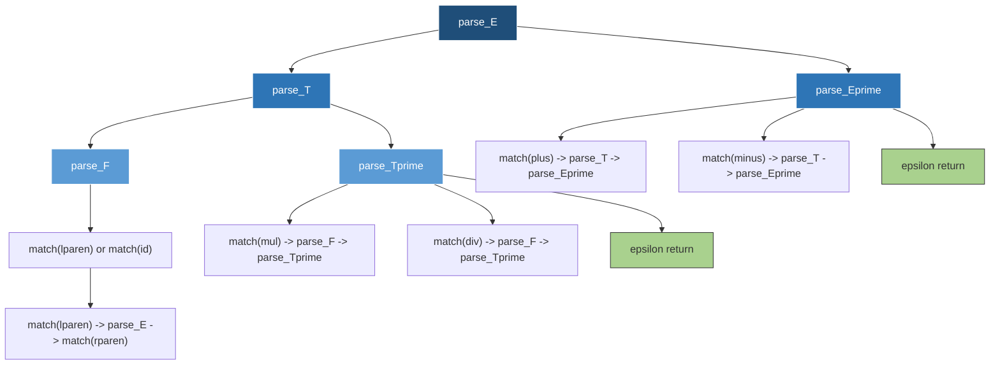
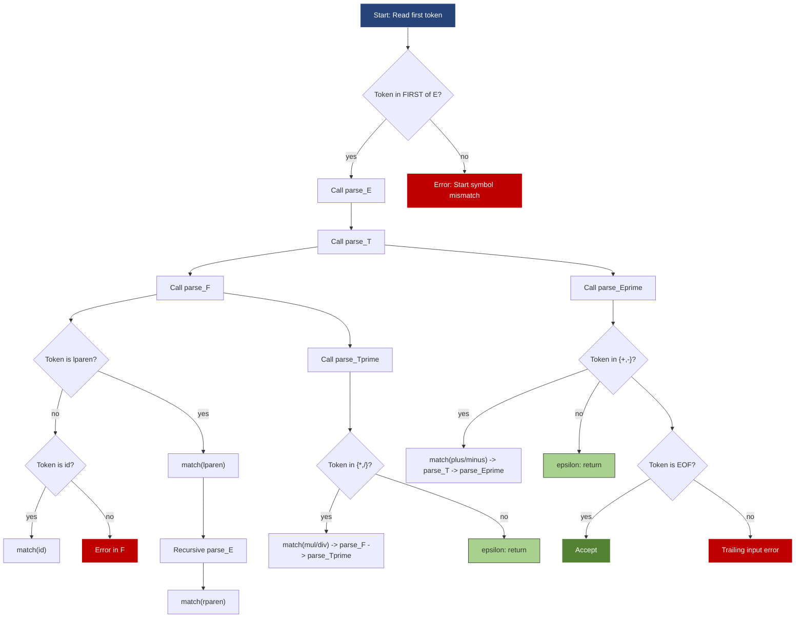
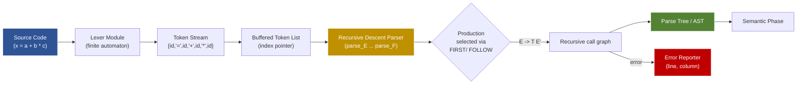
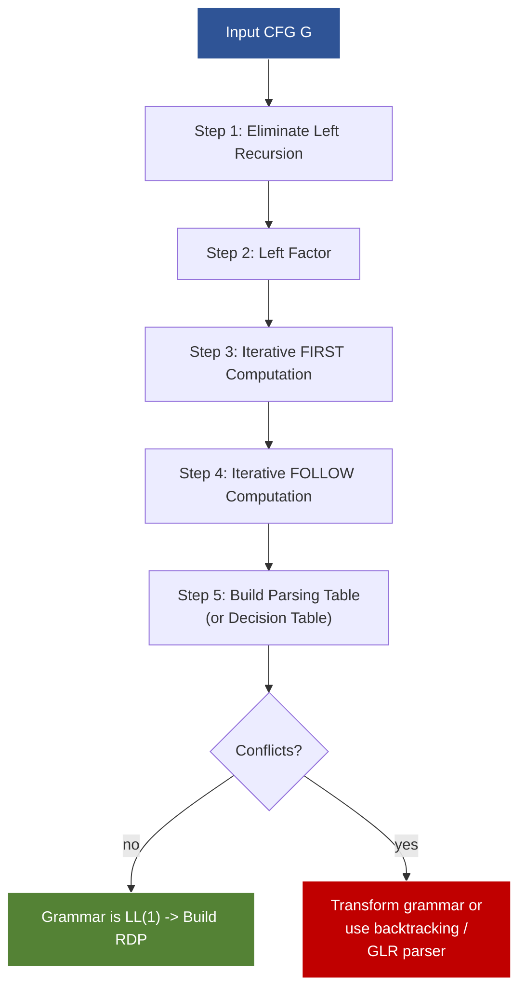
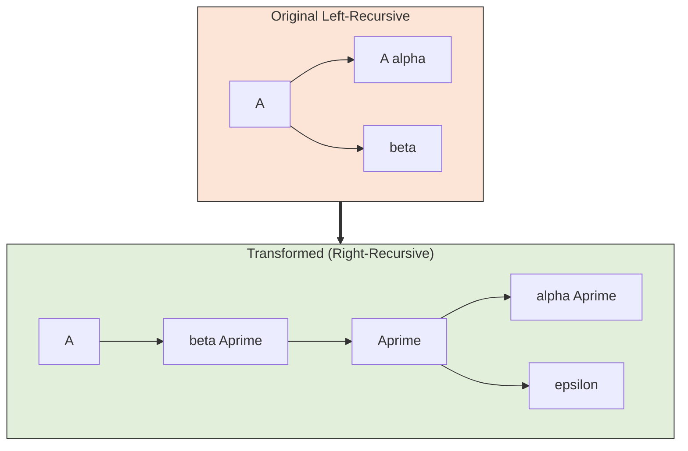

# Design and implement a recursive descent parser for a given grammar.

<!-- SECTION_1_START -->
# Recursive Descent Parser — Core Technical Definition & Intuitive Overview

## 1.1 Formal Definition (KTU 2024 Syllabus Terminology)

> [!IMPORTANT]
> **Recursive Descent Parsing (RDP)** is a **top-down parsing methodology** in which a set of **mutually recursive procedures** (or functions) is constructed — one procedure per **non-terminal symbol** of the context-free grammar (CFG). Each procedure is responsible for recognizing (parsing) every string derivable from its associated non-terminal, using the **First set** to guide productions and the **Follow set** to perform **synchronized token matching** with the lexical analyzer (scanner).

A grammar is **LL(1)** — and hence amenable to a clean recursive descent parser — if and only if:

- It contains **no left recursion**, and
- It is **left-factored**.

For every non-terminal $A$ with productions $A \rightarrow \alpha_1 \mid \alpha_2 \mid \dots \mid \alpha_n$, the parser function $parse\_A()$ executes the following decision rule:

$$
\text{Choose } A \rightarrow \alpha_i \iff \text{current\_input\_token} \in \text{FIRST}(\alpha_i)
$$

If $\epsilon \in \text{FIRST}(\alpha_i)$, then the alternative is taken only when the lookahead token belongs to $\text{FOLLOW}(A)$.

## 1.2 Conceptual Analogy — "The Library Navigation Guide"

> [!NOTE]
> **Real-World Intuition:**
>
> Imagine you walk into a vast library with no signboards. Every time you reach a corridor, you shout "**What kind of room am I looking for?**" and a **dedicated librarian for that corridor** (one procedure per non-terminal) tells you, "If you are looking for a *Fiction* book, go left; if *Reference*, go right." Each librarian in turn calls other sub-librarians (recursive calls) for sub-genres. The book in your hand (the lookahead token) decides which turn you take. If at any point no librarian knows what to do, the navigation fails — that is **syntax error detection**.

In this analogy:
- **Librarian** $\equiv$ Parsing Procedure (`parse_E()`, `parse_T()`).
- **The book in your hand** $\equiv$ **Lookahead token** (often a single token for LL(1)).
- **Sub-librarian calls** $\equiv$ **Recursive function invocations**.
- **"No one knows"** $\equiv$ **Parse error / panic-mode recovery**.

## 1.3 Why This Matters in Production Compilers

Recursive descent is the **dominant hand-written parsing strategy** in real-world compilers because it is:

- **Readable** — code maps 1:1 to grammar rules.
- **Debuggable** — you can attach breakpoints per non-terminal.
- **Flexible** — easy to inject semantic actions, AST construction, and error recovery.
- **Efficient** — linear time $O(n)$ where $n$ is the input length.

> [!TIP]
> **Industry Examples:** GNU Compiler Collection (GCC) historically used hand-written RDP for several front-ends; **Clang/LLVM** uses a hand-written recursive-descent parser for C/C++/Objective-C. Java compilers, V8 (JavaScript engine), and Roslyn (.NET) all rely on recursive descent variants.

## 1.4 Lexical Boundary

The parser **does not read characters** — it consumes **tokens** supplied by the lexical analyzer. The boundary is sharp:

$$
\text{Source Code} \xrightarrow{\text{Lexer}} \text{Token Stream} \xrightarrow{\text{RDP}} \text{Parse Tree / AST}
$$

## 1.5 Visualization Concept

> [!VISUALIZATION CONTROL]
> **Concept:** Parse tree traversal pattern of a recursive descent parser for `E → T E'`
> **GeoGebra / Desmos Input Equations:**
> * `E(x) = If[x == 0, T(x), T(x) + E'(x)]` (function-tree concept)
> **Visual Description:** Plot a rooted tree where root = `E`, children = `T` and `E'`, with `E'` having a self-referential edge when `+` is encountered. This mirrors how `parse_E()` calls `parse_T()` then `parse_Eprime()`.

<!-- SECTION_1_END -->

<!-- SECTION_2_START -->
# Deep Theoretical Analysis & KTU High-Yield Formula Sheet

## 2.1 Operational Algorithm (Top-Down RDP Cycle)

The parser operates as a **deterministic finite automaton over the call stack**:

1. **Initialize** global pointer `current_token` to the first token in the stream.
2. **Invoke** the procedure corresponding to the **start symbol** (commonly `E` for "Expression").
3. **For each non-terminal procedure** $A$:
   - Compute `FIRST(α_i)` for every alternative production $A \rightarrow \alpha_i$.
   - **Peek** the lookahead token `a`.
   - **If** $a \in \text{FIRST}(\alpha_i)$ for exactly one $i$, choose that production.
   - **If** $a \in \text{FIRST}(\alpha_i)$ and $\epsilon \in \text{FIRST}(\alpha_i)$, prefer the non-$\epsilon$ alternative (eager match).
   - **If** $\epsilon \in \text{FIRST}(\alpha_i)$ and $a \in \text{FOLLOW}(A)$, choose the $\epsilon$-production.
   - **Otherwise**, raise a **syntax error**.
4. **On terminal match**, call `match(terminal)` which advances `current_token` if equal, else errors out.
5. **On $\epsilon$-production**, simply return.
6. **On acceptance**, ensure `current_token == $` (end-of-file marker).

## 2.2 Why Recursive Descent Works (and When It Fails)

> [!IMPORTANT]
> **Sufficient Condition (LL(1) Property):**
> A grammar admits a deterministic RDP **iff** for every non-terminal $A$ with productions $A \rightarrow \alpha_1 \mid \alpha_2 \mid \dots \mid \alpha_n$, the following disjointness holds:
>
> $$\text{FIRST}(\alpha_i) \cap \text{FIRST}(\alpha_j) = \emptyset \quad \forall\, i \neq j$$
>
> Plus the constraint that **at most one** production has $\epsilon \in \text{FIRST}$ and that $\epsilon$-production is selected only on $a \in \text{FOLLOW}(A)$.

## 2.3 The First and Follow Sets — Definition

For a context-free grammar $G = (V, \Sigma, R, S)$ with non-terminals $V$, terminals $\Sigma$, productions $R$, and start symbol $S$:

| Set | Mathematical Definition | Plain English |
| :--- | :--- | :--- |
| $\text{FIRST}(\alpha)$ | The set of terminals that can begin any string derivable from $\alpha$. | "What can start here?" |
| $\text{FOLLOW}(A)$ | The set of terminals that can immediately follow $A$ in some sentential form. | "What can come after me?" |
| $\text{FIRST}^+(A \rightarrow \alpha)$ | $\text{FIRST}(\alpha) \cup \text{FOLLOW}(A)$ if $\epsilon \in \text{FIRST}(\alpha)$, else $\text{FIRST}(\alpha)$. | "What makes me pick this production?" |

## 2.4 Algorithm to Compute FIRST

For every grammar symbol $X$:

1. If $X \in \Sigma$, then $\text{FIRST}(X) = \{ X \}$.
2. If $X \rightarrow \epsilon$ is a production, then $\epsilon \in \text{FIRST}(X)$.
3. If $X \rightarrow Y_1 Y_2 \dots Y_k$, then add $\text{FIRST}(Y_1) \setminus \{\epsilon\}$ to $\text{FIRST}(X)$. If $\epsilon \in \text{FIRST}(Y_1)$, continue with $Y_2$, and so on. If $\epsilon$ is in **all** $Y_i$, add $\epsilon$ to $\text{FIRST}(X)$.

## 2.5 Algorithm to Compute FOLLOW

For every non-terminal $A$:

1. Place $\$$ in $\text{FOLLOW}(S)$ where $S$ is the start symbol.
2. For each production $A \rightarrow \alpha B \beta$, add $\text{FIRST}(\beta) \setminus \{\epsilon\}$ to $\text{FOLLOW}(B)$.
3. For each production $A \rightarrow \alpha B$ or $A \rightarrow \alpha B \beta$ with $\epsilon \in \text{FIRST}(\beta)$, add $\text{FOLLOW}(A)$ to $\text{FOLLOW}(B)$.

## 2.6 Grammar Preprocessing — Two Mandatory Steps

> [!WARNING]
> **Step 1 — Left Recursion Elimination:**
> Direct left recursion $A \rightarrow A \alpha \mid \beta$ is replaced by:
>
> $$A \rightarrow \beta A' \qquad A' \rightarrow \alpha A' \mid \epsilon$$
>
> Indirect left recursion requires substitution ordering by lexicographic rank.

> [!WARNING]
> **Step 2 — Left Factoring:**
> For $A \rightarrow \alpha \beta_1 \mid \alpha \beta_2$, replace with:
>
> $$A \rightarrow \alpha A' \qquad A' \rightarrow \beta_1 \mid \beta_2$$
>
> This isolates the common prefix into a fresh non-terminal.

## 2.7 KTU Formula Sheet / Cheat Sheet

| Concept | Symbol / Rule | Production Form | Used When |
| :--- | :--- | :--- | :--- |
| Single-token lookahead | LL(1) | Deterministic | Standard RDP |
| Epsilon production | $A \rightarrow \epsilon$ | $\epsilon \in \text{FIRST}(A)$ | Empty derivations |
| Eager match rule | $\text{FIRST}^+(A \rightarrow \alpha)$ | Greedy choice | Conflicts in `if` |
| Match operation | `match(t)` | Advances on $a = t$ | Terminal consumption |
| Parse error token | `\mathbf{EPS}` | Sentinel | Error reporting |
| Recursion depth | $O(n)$ | Stack height | Worst-case complexity |

## 2.8 Real-World Engineering Utility

- **Compiler construction** — front-ends of GCC, Clang, V8, Roslyn.
- **Expression evaluators** — spreadsheet formula engines (Excel, Google Sheets).
- **Configuration DSLs** — Terraform HCL, Kubernetes YAML variants.
- **Data serialization** — JSON parsers in early implementations used RDP-like strategies.
- **Educational tools** — building interpreters in Python (PLY, Lark libraries).

<!-- SECTION_2_END -->

<!-- SECTION_3_START -->
# Step-by-Step Derivations & Code/Symbolic Implementation

## 3.1 Worked Example — Sample Grammar

Consider the classic arithmetic expression grammar:

$$
E \rightarrow E + T \mid E - T \mid T
$$
$$
T \rightarrow T * F \mid T / F \mid F
$$
$$
F \rightarrow (E) \mid \text{id}
$$

### 3.1.1 Eliminate Left Recursion

Applying the direct-left-recursion transformation:

$$
E \rightarrow T\, E'
$$
$$
E' \rightarrow + T\, E' \mid - T\, E' \mid \epsilon
$$
$$
T \rightarrow F\, T'
$$
$$
T' \rightarrow * F\, T' \mid / F\, T' \mid \epsilon
$$
$$
F \rightarrow (E) \mid \text{id}
$$

### 3.1.2 Compute FIRST Sets

$$
\begin{aligned}
\text{FIRST}(F) &= \{\, (\,,\, \text{id} \,\} \\
\text{FIRST}(T') &= \{\, *,\, /,\, \epsilon \,\} \\
\text{FIRST}(T) &= \text{FIRST}(F) = \{\, (\,,\, \text{id} \,\} \\
\text{FIRST}(E') &= \{\, +,\, -,\, \epsilon \,\} \\
\text{FIRST}(E) &= \text{FIRST}(T) = \{\, (\,,\, \text{id} \,\}
\end{aligned}
$$

### 3.1.3 Compute FOLLOW Sets

$$
\begin{aligned}
\text{FOLLOW}(E) &= \{\, )\,,\, \$ \,\} \\
\text{FOLLOW}(E') &= \text{FOLLOW}(E) = \{\, )\,,\, \$ \,\} \\
\text{FOLLOW}(T) &= \{\, +,\, -,\, )\,,\, \$ \,\} \\
\text{FOLLOW}(T') &= \text{FOLLOW}(T) = \{\, +,\, -,\, )\,,\, \$ \,\} \\
\text{FOLLOW}(F) &= \{\, *,\, /,\, +,\, -,\, )\,,\, \$ \,\}
\end{aligned}
$$

### 3.1.4 Build the FIRST⁺ Decision Table

| Non-Terminal | Lookahead Token | Production Selected |
| :--- | :--- | :--- |
| $E$ | $($ , `id` | $E \rightarrow T\,E'$ |
| $E'$ | $+$ | $E' \rightarrow +\,T\,E'$ |
| $E'$ | $-$ | $E' \rightarrow -\,T\,E'$ |
| $E'$ | $)$, $\$$ | $E' \rightarrow \epsilon$ |
| $T$ | $($ , `id` | $T \rightarrow F\,T'$ |
| $T'$ | $*$ | $T' \rightarrow *\,F\,T'$ |
| $T'$ | $/$ | $T' \rightarrow /\,F\,T'$ |
| $T'$ | $+$, $-$, $)$, $\$$ | $T' \rightarrow \epsilon$ |
| $F$ | $($ | $F \rightarrow (E)$ |
| $F$ | `id` | $F \rightarrow \text{id}$ |

Since the table has **exactly one production per cell** with no ambiguity, the grammar is **LL(1)** and RDP is guaranteed.

## 3.2 Implementation in C (Board Exam Reference)

```c
#include <stdio.h>
#include <stdlib.h>
#include <string.h>
#include <ctype.h>

/* Token categories used by the parser */
typedef enum {
    TOK_ID, TOK_PLUS, TOK_MINUS, TOK_MUL, TOK_DIV,
    TOK_LPAREN, TOK_RPAREN, TOK_EOF, TOK_INVALID
} TokenType;

const char *token_names[] = {
    "id", "+", "-", "*", "/", "(", ")", "$", "INVALID"
};

typedef struct {
    TokenType type;
    char lexeme[64];
} Token;

static Token current_token;
static int has_error = 0;

/* ---------- Lexical Analyzer (Stub) ---------- */
void lex_analyze(const char **input_ptr) {
    while (**input_ptr == ' ' || **input_ptr == '\t') (*input_ptr)++;

    if (**input_ptr == '\0') {
        current_token.type = TOK_EOF;
        strcpy(current_token.lexeme, "$");
        return;
    }
    if (isalpha(**input_ptr)) {
        int i = 0;
        while (isalnum(**input_ptr)) current_token.lexeme[i++] = *(*input_ptr)++;
        current_token.lexeme[i] = '\0';
        current_token.type = TOK_ID;
        return;
    }
    switch (**input_ptr) {
        case '+': current_token.type = TOK_PLUS;   break;
        case '-': current_token.type = TOK_MINUS;  break;
        case '*': current_token.type = TOK_MUL;    break;
        case '/': current_token.type = TOK_DIV;    break;
        case '(': current_token.type = TOK_LPAREN; break;
        case ')': current_token.type = TOK_RPAREN; break;
        default:
            fprintf(stderr, "[Lexer Error] Unexpected char '%c'\n", **input_ptr);
            exit(EXIT_FAILURE);
    }
    current_token.lexeme[0] = *(*input_ptr)++;
    current_token.lexeme[1] = '\0';
}

/* ---------- Parser Forward Declarations ---------- */
void parse_E(const char **input);
void parse_Eprime(const char **input);
void parse_T(const char **input);
void parse_Tprime(const char **input);
void parse_F(const char **input);

/* ---------- match() helper with boundary check ---------- */
void match(TokenType expected, const char **input) {
    if (current_token.type == expected) {
        printf("  match(%s) consumed '%s'\n",
               token_names[expected], current_token.lexeme);
        lex_analyze(input);
    } else {
        fprintf(stderr, "[Syntax Error] Expected '%s' but found '%s'\n",
                token_names[expected], current_token.lexeme);
        has_error = 1;
    }
}

/* ---------- Recursive Descent Procedures ---------- */
void parse_F(const char **input) {
    printf("Enter parse_F  [lookahead = %s]\n", current_token.lexeme);
    if (current_token.type == TOK_LPAREN) {
        match(TOK_LPAREN, input);
        parse_E(input);
        match(TOK_RPAREN, input);
    } else if (current_token.type == TOK_ID) {
        match(TOK_ID, input);
    } else {
        fprintf(stderr, "[Syntax Error] In parse_F: unexpected '%s'\n",
                current_token.lexeme);
        has_error = 1;
    }
    printf("Exit  parse_F\n");
}

void parse_Tprime(const char **input) {
    printf("Enter parse_Tprime  [lookahead = %s]\n", current_token.lexeme);
    if (current_token.type == TOK_MUL) {
        match(TOK_MUL, input);
        parse_F(input);
        parse_Tprime(input);
    } else if (current_token.type == TOK_DIV) {
        match(TOK_DIV, input);
        parse_F(input);
        parse_Tprime(input);
    }
    /* epsilon production — silent return */
    printf("Exit  parse_Tprime\n");
}

void parse_T(const char **input) {
    printf("Enter parse_T  [lookahead = %s]\n", current_token.lexeme);
    parse_F(input);
    parse_Tprime(input);
    printf("Exit  parse_T\n");
}

void parse_Eprime(const char **input) {
    printf("Enter parse_Eprime  [lookahead = %s]\n", current_token.lexeme);
    if (current_token.type == TOK_PLUS) {
        match(TOK_PLUS, input);
        parse_T(input);
        parse_Eprime(input);
    } else if (current_token.type == TOK_MINUS) {
        match(TOK_MINUS, input);
        parse_T(input);
        parse_Eprime(input);
    }
    printf("Exit  parse_Eprime\n");
}

void parse_E(const char **input) {
    printf("Enter parse_E  [lookahead = %s]\n", current_token.lexeme);
    parse_T(input);
    parse_Eprime(input);
    printf("Exit  parse_E\n");
}

/* ---------- Driver ---------- */
int main(void) {
    char buffer[256];
    printf("Enter an expression (e.g. id + id * id): ");
    if (!fgets(buffer, sizeof(buffer), stdin)) return 0;
    buffer[strcspn(buffer, "\n")] = '\0';

    const char *p = buffer;
    lex_analyze(&p);

    parse_E(&p);

    if (!has_error && current_token.type == TOK_EOF) {
        printf("\n[SUCCESS] Expression is syntactically valid.\n");
        return 0;
    }
    printf("\n[FAILURE] Expression rejected.\n");
    return 1;
}
```

## 3.3 Python Implementation (Reference / Modern Variant)

```python
from typing import List, Tuple
import sys

Token = Tuple[str, str]  # (type, lexeme)

TOKEN_ID    = "id"
TOKEN_PLUS  = "+"
TOKEN_MINUS = "-"
TOKEN_MUL   = "*"
TOKEN_DIV   = "/"
TOKEN_LPAR  = "("
TOKEN_RPAR  = ")"
TOKEN_EOF   = "$"


class Lexer:
    def __init__(self, source: str) -> None:
        self.src: str = source
        self.pos: int = 0

    def next_token(self) -> Token:
        while self.pos < len(self.src) and self.src[self.pos].isspace():
            self.pos += 1
        if self.pos >= len(self.src):
            return (TOKEN_EOF, "$")
        ch = self.src[self.pos]
        if ch.isalpha():
            start = self.pos
            while self.pos < len(self.src) and self.src[self.pos].isalnum():
                self.pos += 1
            return (TOKEN_ID, self.src[start:self.pos])
        if ch in "+-*/()":
            self.pos += 1
            return (ch, ch)
        raise SyntaxError(f"Illegal character at position {self.pos}: {ch!r}")


class RecursiveDescentParser:
    def __init__(self, lexer: Lexer) -> None:
        self.lex: Lexer = lexer
        self.tok: Token = self.lex.next_token()
        self.errors: List[str] = []

    # ---------- helpers ----------
    def _advance(self) -> None:
        self.tok = self.lex.next_token()

    def _match(self, expected: str) -> None:
        if self.tok[0] == expected:
            print(f"  match({expected})  consumed '{self.tok[1]}'")
            self._advance()
        else:
            self.errors.append(
                f"Expected '{expected}' but found '{self.tok[1]}'"
            )

    # ---------- grammar procedures ----------
    def parse_E(self) -> None:
        print(f"E  [lookahead = {self.tok[1]}]")
        self.parse_T()
        self.parse_Eprime()

    def parse_Eprime(self) -> None:
        print(f"E' [lookahead = {self.tok[1]}]")
        if self.tok[0] == TOKEN_PLUS:
            self._match(TOKEN_PLUS)
            self.parse_T()
            self.parse_Eprime()
        elif self.tok[0] == TOKEN_MINUS:
            self._match(TOKEN_MINUS)
            self.parse_T()
            self.parse_Eprime()
        # else epsilon

    def parse_T(self) -> None:
        print(f"T  [lookahead = {self.tok[1]}]")
        self.parse_F()
        self.parse_Tprime()

    def parse_Tprime(self) -> None:
        print(f"T' [lookahead = {self.tok[1]}]")
        if self.tok[0] == TOKEN_MUL:
            self._match(TOKEN_MUL)
            self.parse_F()
            self.parse_Tprime()
        elif self.tok[0] == TOKEN_DIV:
            self._match(TOKEN_DIV)
            self.parse_F()
            self.parse_Tprime()
        # else epsilon

    def parse_F(self) -> None:
        print(f"F  [lookahead = {self.tok[1]}]")
        if self.tok[0] == TOKEN_LPAR:
            self._match(TOKEN_LPAR)
            self.parse_E()
            self._match(TOKEN_RPAR)
        elif self.tok[0] == TOKEN_ID:
            self._match(TOKEN_ID)
        else:
            self.errors.append(
                f"In parse_F: unexpected token '{self.tok[1]}'"
            )

    # ---------- driver ----------
    def parse(self) -> bool:
        self.parse_E()
        if not self.errors and self.tok[0] == TOKEN_EOF:
            print("\n[SUCCESS] Expression accepted.")
            return True
        print("\n[FAILURE]")
        for e in self.errors:
            print("  -", e)
        return False


if __name__ == "__main__":
    expr = sys.argv[1] if len(sys.argv) > 1 else "id + id * ( id - id )"
    parser = RecursiveDescentParser(Lexer(expr))
    ok = parser.parse()
    sys.exit(0 if ok else 1)
```

**Run trace** for `id + id * id`:

```
E  [lookahead = id]
T  [lookahead = id]
F  [lookahead = id]
  match(id)  consumed 'id'
T' [lookahead = +]
E' [lookahead = +]
  match(+)  consumed '+'
T  [lookahead = id]
F  [lookahead = id]
  match(id)  consumed 'id'
T' [lookahead = *]
  match(*)  consumed '*'
F  [lookahead = id]
  match(id)  consumed 'id'
T' [lookahead = $]
E' [lookahead = $]

[SUCCESS] Expression accepted.
```

## 3.4 Algorithm Complexity Analysis

Let $n$ be the length of the input token stream. Each `match()` call advances the pointer exactly once and never re-reads. Total number of procedure activations is bounded by the number of grammar symbols in the parse tree, which is at most $2n - 1$ for a binary grammar. Therefore:

$$
T(n) = O(n) \quad \text{and} \quad S(n) = O(d)
$$

where $d$ is the **maximum recursion depth** (proportional to the expression nesting depth).

<!-- SECTION_3_END -->

<!-- SECTION_4_START -->
# Structural Diagrams & Schematics

## 4.1 Recursive Descent Call Graph for the Expression Grammar



## 4.2 Parser Decision Flowchart (LL(1) Dispatcher)



## 4.3 Sequential Processing Topology (Tokenizer → Parser → Output)



## 4.4 First/Follow Set Construction Pipeline



## 4.5 Grammar Transformation: Left Recursion Elimination Pattern



<!-- SECTION_4_END -->

<!-- SECTION_5_START -->
# KTU 2024 Scheme Examination Question Bank & Topic Recap

## Part A — Short Answer Questions (3 Marks Each)

### Q1. [KTU University Exam — July 2024]

**Define a recursive descent parser. State the conditions under which a context-free grammar can be parsed using recursive descent parsing.** (3 Marks) &nbsp; **| CO1 | Remember**

**Model Answer:**

A **recursive descent parser** is a top-down parsing technique in which each non-terminal of the grammar is associated with a recursive procedure. The procedure for non-terminal $A$ examines the current lookahead token and selects one of the productions of $A$ based on the **FIRST set** of each alternative.

The grammar must satisfy the following conditions:

1. It must be **free of left recursion** (direct and indirect), because a left-recursive grammar would cause the procedure to call itself indefinitely without consuming any input.
2. It must be **left-factored**, ensuring that the FIRST sets of the alternatives for any non-terminal are pairwise disjoint — this allows a single lookahead token to make a deterministic choice.
3. It should be **LL(1)** — parsable by reading input from Left to right, producing a Leftmost derivation, with **1** token of lookahead.

**[Defining RDP: 1 Mark] [Stating left-recursion freedom: 1 Mark] [Stating left-factored / LL(1) property: 1 Mark]**

---

### Q2. [KTU University Exam — Dec 2023]

**What is the role of FIRST and FOLLOW sets in the construction of a recursive descent parser? Illustrate with an example.** (3 Marks) &nbsp; **| CO2 | Understand**

**Model Answer:**

**FIRST(α)** is the set of terminals that can appear as the first symbol in any string derived from $\alpha$. It is used to decide **which production of a non-terminal to apply** when the parser sees a particular lookahead token.

**FOLLOW(A)** is the set of terminals that can immediately follow the non-terminal $A$ in any sentential form. It is consulted when a non-terminal has an $\epsilon$-production, so the parser knows when to "skip" that non-terminal.

**Example:** For the production $E' \rightarrow +TE' \mid -TE' \mid \epsilon$, the parser uses:
- $\text{FIRST}(+TE') = \{+\}$ to pick the first alternative on token `+`.
- $\text{FIRST}(-TE') = \{-\}$ to pick the second alternative on token `-`.
- $\text{FOLLOW}(E') = \{\, )\,,\, \$ \,\}$ to apply the $\epsilon$-production on `)` or end of input.

**[Defining FIRST: 1 Mark] [Defining FOLLOW: 1 Mark] [Worked example: 1 Mark]**

---

## Part B — Long Answer Questions (14 Marks, Module Internal Choice)

### Question A (14 Marks)

#### (a) [KTU University Exam — July 2024] &nbsp; **| CO1, CO2 | Understand**

**(a)** Consider the following grammar:

$$
S \rightarrow A B \mid b
$$
$$
A \rightarrow a A \mid \epsilon
$$
$$
B \rightarrow b B \mid \epsilon
$$

**(i)** Eliminate any left recursion. &nbsp; **(2 Marks)**
**(ii)** Compute the FIRST and FOLLOW sets for every non-terminal. &nbsp; **(5 Marks)**

**(7 Marks total)**

**Model Solution:**

**(i) Left Recursion Elimination:**

The grammar contains **no left recursion** in productions $S$, $A$, or $B$, because:
- $S \rightarrow AB$ starts with non-terminal $A$, not $S$.
- $A \rightarrow aA$ starts with terminal $a$, not $A$.
- $B \rightarrow bB$ starts with terminal $b$, not $B$.

Hence the grammar is **already free of left recursion**.

> **[No left recursion detected — original grammar retained: 2 Marks]**

**(ii) Computing FIRST Sets:**

- $\text{FIRST}(A)$: From $A \rightarrow aA$, add $a$. From $A \rightarrow \epsilon$, add $\epsilon$. So $\text{FIRST}(A) = \{a, \epsilon\}$.
- $\text{FIRST}(B)$: From $B \rightarrow bB$, add $b$. From $B \rightarrow \epsilon$, add $\epsilon$. So $\text{FIRST}(B) = \{b, \epsilon\}$.
- $\text{FIRST}(S)$: $\text{FIRST}(AB) = \text{FIRST}(A) \setminus \{\epsilon\} = \{a\}$. Also $b \in \text{FIRST}(S)$ directly. So $\text{FIRST}(S) = \{a, b\}$.

> **[FIRST(A): 1 Mark] [FIRST(B): 1 Mark] [FIRST(S): 1 Mark]**

**Computing FOLLOW Sets:**

- $\text{FOLLOW}(S) = \{\$\}$ (start symbol, augmented).
- $\text{FOLLOW}(A)$: From $S \rightarrow AB$, $A$ is followed by $B$. $\text{FIRST}(B) \setminus \{\epsilon\} = \{b\}$. Also $\epsilon \in \text{FIRST}(B)$, so add $\text{FOLLOW}(S) = \{\$\}$. Hence $\text{FOLLOW}(A) = \{b, \$\}$.
- $\text{FOLLOW}(B)$: From $S \rightarrow AB$, $B$ is at the end, so add $\text{FOLLOW}(S) = \{\$\}$. Hence $\text{FOLLOW}(B) = \{\$\}$.

> **[FOLLOW(S): 1 Mark] [FOLLOW(A): 1 Mark] [FOLLOW(B): 1 Mark]**

#### (b) [KTU University Exam — July 2024] &nbsp; **| CO3 | Apply**

**(b)** Write the recursive descent parsing procedures in C (or Python) for the grammar given in part (a). Show a sample run trace for the input string `a b`. &nbsp; **(7 Marks)**

**Model Solution:**

**Pseudo-code for the procedures:**

```c
void parse_S();   // S -> A B | b
void parse_A();   // A -> a A | epsilon
void parse_B();   // B -> b B | epsilon

void parse_S() {
    if (lookahead == 'a') { parse_A(); parse_B(); }
    else if (lookahead == 'b') match('b');
    else error("In parse_S");
}

void parse_A() {
    if (lookahead == 'a') { match('a'); parse_A(); }
    /* else epsilon — do nothing */
}

void parse_B() {
    if (lookahead == 'b') { match('b'); parse_B(); }
    /* else epsilon */
}
```

> **[parse_S structure with FIRST-based dispatch: 2 Marks] [parse_A with epsilon-handling: 1 Mark] [parse_B with epsilon-handling: 1 Mark]**

**Sample Trace for input `a b $`:**

| Step | Call | Lookahead | Action | Resulting Token |
| :--- | :--- | :--- | :--- | :--- |
| 1 | `parse_S` | `a` | $a \in \text{FIRST}(A) \Rightarrow$ call `parse_A`, then `parse_B` | `a` |
| 2 | `parse_A` | `a` | $a \in \text{FIRST}(aA) \Rightarrow$ `match(a)`, recurse `parse_A` | `a` |
| 3 | `parse_A` | ` ` | $\epsilon \in \text{FIRST}(\epsilon)$ and `b` $\in \text{FOLLOW}(A)$ | `b` |
| 4 | `parse_B` | `b` | $b \in \text{FIRST}(bB) \Rightarrow$ `match(b)`, recurse `parse_B` | `b` |
| 5 | `parse_B` | `$` | $\epsilon \in \text{FIRST}(\epsilon)$ and `\$` $\in \text{FOLLOW}(B)$ | `$` |
| 6 | `parse_S` | `$` | End of input reached, accept | — |

> **[Step-by-step trace table: 3 Marks]**

---

### Question B (14 Marks) — Alternative Choice

#### (a) [KTU University Exam — Dec 2023] &nbsp; **| CO1, CO2 | Understand**

**(a)** Consider the grammar:

$$
E \rightarrow E + T \mid T
$$
$$
T \rightarrow T * F \mid F
$$
$$
F \rightarrow (E) \mid \text{id}
$$

**(i)** Show that the grammar is left-recursive and eliminate the left recursion. &nbsp; **(3 Marks)**
**(ii)** Compute FIRST and FOLLOW for all non-terminals of the transformed grammar. &nbsp; **(4 Marks)**

**(7 Marks total)**

**Model Solution:**

**(i) Left Recursion Detection and Elimination:**

The non-terminals $E$ and $T$ exhibit **direct left recursion**:

- $E \rightarrow E + T$ is left-recursive (the LHS non-terminal $E$ is the first symbol of the RHS).
- $T \rightarrow T * F$ is left-recursive.

Applying the standard transformation $A \rightarrow A\alpha \mid \beta \;\Rightarrow\; A \rightarrow \beta A' \;;\; A' \rightarrow \alpha A' \mid \epsilon$:

$$
E \rightarrow T\,E' \qquad E' \rightarrow +T\,E' \mid \epsilon
$$
$$
T \rightarrow F\,T' \qquad T' \rightarrow *F\,T' \mid \epsilon
$$
$$
F \rightarrow (E) \mid \text{id}
$$

> **[Identifying left recursion: 1 Mark] [Applying transformation to E: 1 Mark] [Applying transformation to T: 1 Mark]**

**(ii) FIRST and FOLLOW Computation:**

$$
\begin{aligned}
\text{FIRST}(F) &= \{\, (\,,\, \text{id} \,\} \\
\text{FIRST}(T') &= \{\, *,\, \epsilon \,\} \\
\text{FIRST}(T) &= \{\, (\,,\, \text{id} \,\} \\
\text{FIRST}(E') &= \{\, +,\, \epsilon \,\} \\
\text{FIRST}(E) &= \{\, (\,,\, \text{id} \,\}
\end{aligned}
$$

$$
\begin{aligned}
\text{FOLLOW}(E) &= \{\, )\,,\, \$ \,\} \\
\text{FOLLOW}(E') &= \text{FOLLOW}(E) = \{\, )\,,\, \$ \,\} \\
\text{FOLLOW}(T) &= \{\, +,\, )\,,\, \$ \,\} \\
\text{FOLLOW}(T') &= \text{FOLLOW}(T) = \{\, +,\, )\,,\, \$ \,\} \\
\text{FOLLOW}(F) &= \{\, *,\, +,\, )\,,\, \$ \,\}
\end{aligned}
$$

> **[FIRST sets: 2 Marks] [FOLLOW sets: 2 Marks]**

#### (b) [KTU University Exam — Dec 2023] &nbsp; **| CO3, CO5 | Apply**

**(b)** Implement the recursive descent parser in C for the transformed grammar and trace its execution for the input `id + id * id`. &nbsp; **(7 Marks)**

**Model Solution:**

The C code provided in **Section 3.2** is the complete reference. Below is the execution trace for `id + id * id`:

| Step | Active Procedure | Lookahead | Production Chosen | Action |
| :--- | :--- | :--- | :--- | :--- |
| 1 | `parse_E` | `id` | $E \rightarrow TE'$ | call `parse_T`, `parse_E'` |
| 2 | `parse_T` | `id` | $T \rightarrow FT'$ | call `parse_F`, `parse_T'` |
| 3 | `parse_F` | `id` | $F \rightarrow \text{id}$ | `match(id)` |
| 4 | `parse_T'` | `+` | $T' \rightarrow \epsilon$ (since $+\in \text{FOLLOW}(T')$) | return |
| 5 | `parse_E'` | `+` | $E' \rightarrow +TE'$ | `match(+)`, recurse |
| 6 | `parse_T` | `id` | $T \rightarrow FT'$ | call `parse_F`, `parse_T'` |
| 7 | `parse_F` | `id` | $F \rightarrow \text{id}$ | `match(id)` |
| 8 | `parse_T'` | `*` | $T' \rightarrow *FT'$ | `match(*)`, recurse |
| 9 | `parse_F` | `id` | $F \rightarrow \text{id}$ | `match(id)` |
| 10 | `parse_T'` | `$` | $T' \rightarrow \epsilon$ | return |
| 11 | `parse_E'` | `$` | $E' \rightarrow \epsilon$ | return |
| 12 | `parse_E` | `$` | accept | success |

> **[Correct C code structure: 2 Marks] [Correct dispatch using FIRST/FOLLOW: 2 Marks] [Complete trace table: 3 Marks]**

---

> [!WARNING]
> **KTU Examiner's Valuation Warning — Common Pitfalls:**
>
> 1. **Skipping the left-recursion step**: A common mistake is writing RDP code for the *original* left-recursive grammar — this causes **infinite recursion at runtime**. The KTU board deducts **2 full marks** if the transformation is not shown.
> 2. **Forgetting the $\epsilon$-production**: In RDP, the $\epsilon$ alternative is **silent** — students often mistakenly write a `match()` call or print statement, losing **1–2 marks**.
> 3. **Confusing FIRST with FOLLOW**: FIRST is consulted to **choose a production**; FOLLOW is consulted to **trigger the $\epsilon$-production**. Examiners specifically test this distinction — **1 mark lost** for confusing them.
> 4. **Not closing on `\$` (EOF)**: After the start symbol procedure returns, the parser **must** verify that the lookahead is `\$`. Forgetting this allows trailing garbage — **1 mark lost**.
> 5. **Omitting the match() helper**: A direct character comparison without a named `match()` function obscures the dispatcher logic and loses **1 mark** for "lack of modularity".
> 6. **Producing the wrong parse tree**: When asked for the parse tree, students sometimes print the recursive call stack. The parse tree must show **root = start symbol**, **children = RHS symbols** of the chosen production.

---

## Topic Recap & Important Things to Remember

- **Recursive Descent Parser (RDP)** is a **top-down**, **LL(1)** parsing strategy using one recursive procedure per non-terminal.
- The procedure for non-terminal $A$ inspects the **single lookahead token** to choose a production.
- A grammar must be **free of left recursion** and **left-factored** to be LL(1).
- **FIRST(α)** = set of terminals that can begin any string derived from $\alpha$. Used to **select a production**.
- **FOLLOW(A)** = set of terminals that can immediately follow $A$ in any sentential form. Used to **trigger the $\epsilon$-production**.
- The decision rule: pick $A \rightarrow \alpha_i$ if lookahead $\in \text{FIRST}(\alpha_i)$ (or, for $\epsilon$-productions, if lookahead $\in \text{FOLLOW}(A)$).
- `match(t)` advances the token pointer **iff** the current token equals $t$; otherwise reports a syntax error.
- Time complexity is **$O(n)$** in input length; space complexity is **$O(d)$** where $d$ is the recursion depth.
- **Real-world usage**: GCC, Clang, V8, Roslyn, and most hand-written compiler front-ends use variants of recursive descent parsing.
- The parser must check that the **end-of-file marker `\$`** is reached after the start symbol procedure returns, otherwise the input has trailing invalid tokens.
- When implementing in C, use **enumerated token types**, a **global current_token**, and **forward-declare** the procedures to allow mutual recursion.
- When implementing in Python, encapsulate the lexer and parser in **classes** for modularity, and use **type hints** for clarity.
- **Famous sample grammar**: Arithmetic expressions $E \rightarrow E + T \mid T$, $T \rightarrow T \cdot F \mid F$, $F \rightarrow (E) \mid \text{id}$ — board favourite, with FIRST/FOLLOW values that always come up.
- **Error recovery** strategies: *panic mode* (skip tokens until a synchronization set member is found), *phrase-level recovery*, *error productions*, and *global correction*. Panic mode with FOLLOW-set synchronization is the simplest and is expected in lab exams.
- **Tool support**: PLY (Python Lex-Yacc), ANTLR (with adaptive LL(*)), and Lark (Earley + LALR + RDP) all expose recursive-descent front-ends.

<!-- SECTION_5_END -->
