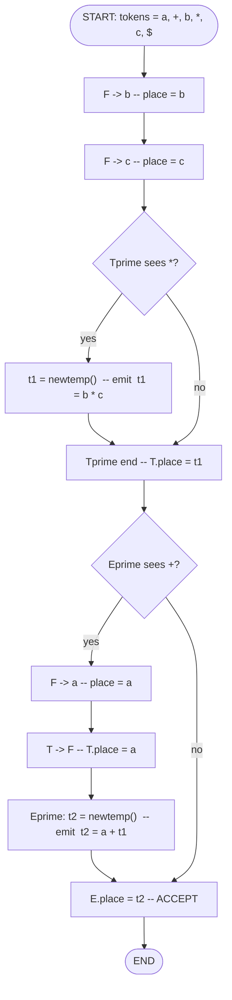
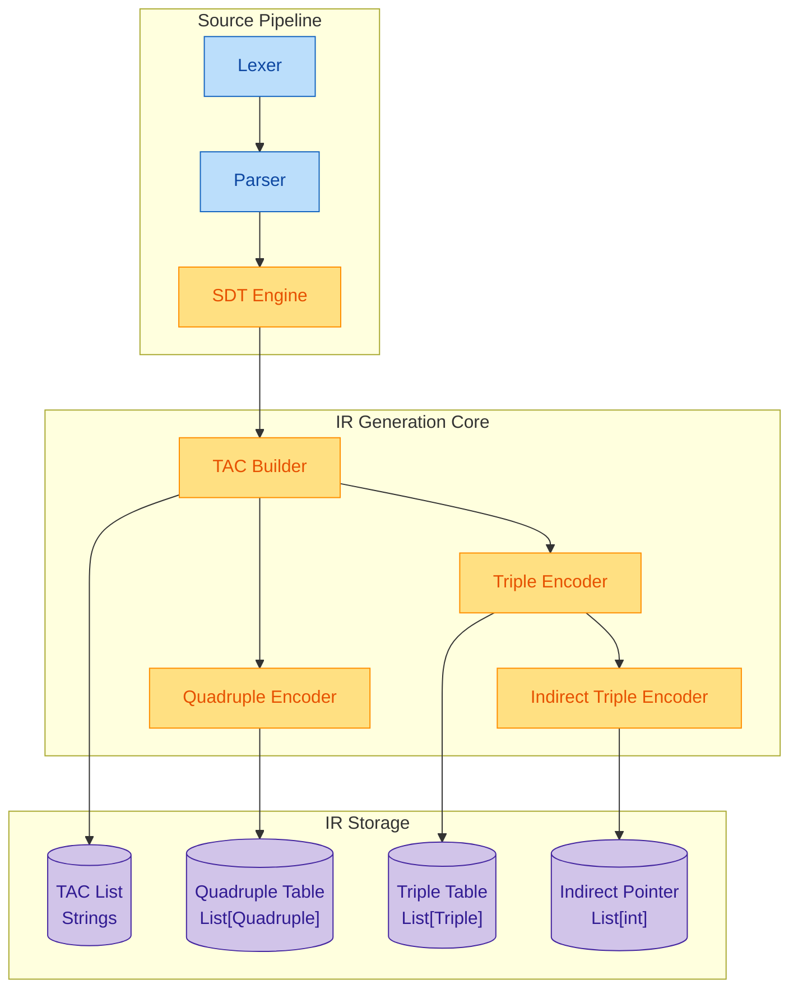
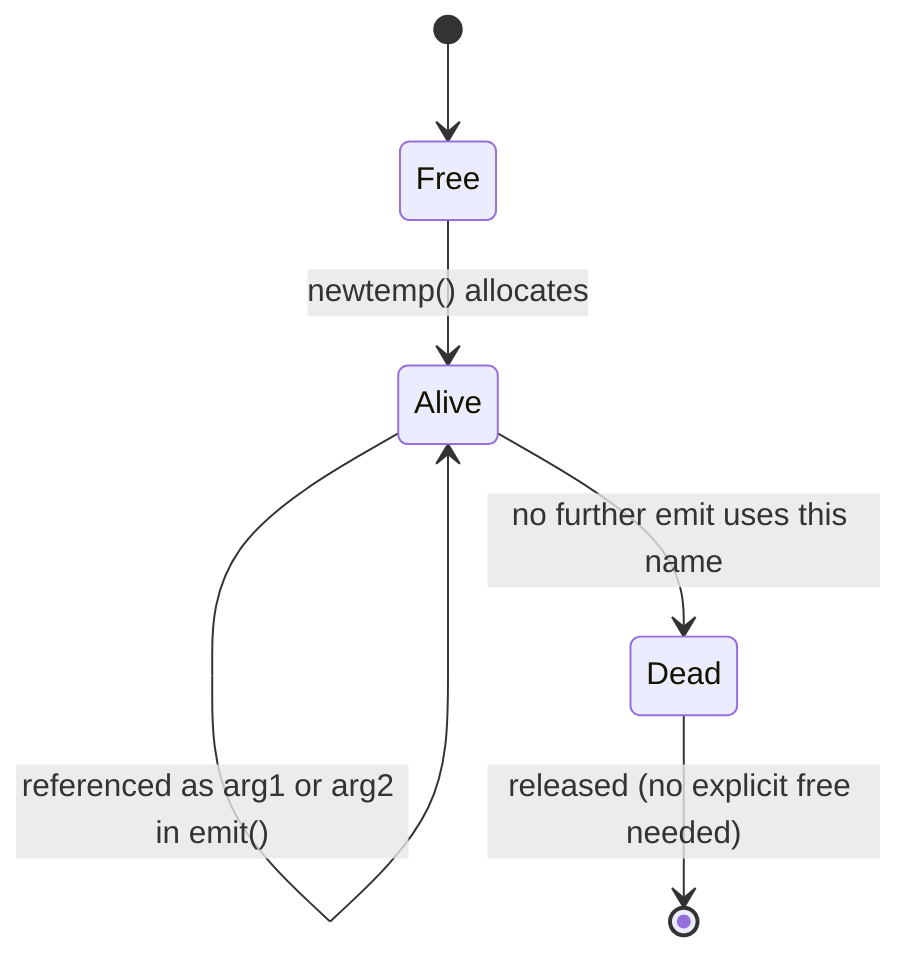

# Implement Intermediate code generation for simple expressions.

<!-- SECTION_1_START -->

# Intermediate Code Generation for Simple Expressions

## 1.1 Formal Academic Definition (KTU 2024 Syllabus Terminology)

> [!IMPORTANT]
> **Intermediate Code Generation (ICG)** is the phase of a compiler that translates the parsed source program — represented as a **Syntax Tree** or **Abstract Syntax Tree (AST)** — into an intermediate representation (IR) that is **machine-independent**, **easy to optimize**, and **easy to translate** into the final target machine code.

For the KTU **PCCSL607 — Systems Lab** Module 10 scope, the focus is restricted to **arithmetic expressions** built from the operators $\{ +, -, \times, \div \}$, parentheses, identifiers (`id`), and numeric constants (`num`). The canonical IR form examined is **Three-Address Code (TAC)**, together with its compact storage forms — **Quadruples**, **Triples**, and **Indirect Triples**.

Mathematically, an arithmetic expression $E$ over the alphabet $\Sigma = \{ id, num, +, -, \times, \div, (, ) \}$ is mapped by the ICG phase to a **maximally factored sequence of 3-address instructions** of the form:

$$x = y \;\; op \;\; z$$

where $op \in \{ +, -, \times, \div \}$, and $x, y, z$ are names — either programmer identifiers, literal constants, or **compiler-generated temporaries** $t_1, t_2, t_3, \ldots$ from the infinite set $Temp$.

---

## 1.2 Conceptual Analogy — The Universal Passport Counter

> [!NOTE]
> **Intuition (Universal Passport Analogy):** Imagine a tourist who speaks only Malayalam and wants to enter a country where only Mandarin is spoken. She cannot go *directly* — translation losses are high. Instead, she visits a **universal translation counter** (a neutral zone) where her Malayalam is converted first into **English (the intermediate language)**, and then English is converted into Mandarin. The intermediate language is **standardized**, **lossless**, and **optimizable** (e.g., she can fix grammar mistakes once in English, which fixes both translations).
>
> - **Source language (Malayalam)** = High-level expression `a + b * c`
> - **Intermediate language (English)** = Three-Address Code (`t1 = b * c; t2 = a + t1`)
> - **Target language (Mandarin)** = Final assembly / machine code
> - **The translation counter** = The ICG phase of the compiler

The **key insight**: every TAC instruction has at most **three operands** (hence "three-address"). This bound keeps each instruction simple enough to translate directly to one or two machine instructions on virtually any CPU (x86, ARM, RISC-V).

---

## 1.3 Physical & Computational Constants Used in This Lab

| Symbol | Meaning | Typical Value |
| :--- | :--- | :--- |
| $Temp$ | Pool of compiler temporaries | $t_1, t_2, t_3, \ldots$ (unbounded) |
| $next\_quad$ | Next free quadruple slot | Starts at **100** by convention |
| $addr(id)$ | Symbol-table address of an identifier | Emitted as operand |
| $val(num)$ | Lexical value of a numeric literal | Emitted as operand |
| $op$ | Binary operator | One of $\{ +, -, \times, \div \}$ |

---

## 1.4 Visualization Callout — Expression Tree → TAC

> [!VISUALIZATION CONTROL]
> **Concept:** Mapping an expression tree for $a + b \times c$ to its TAC and the corresponding quadruples table.
>
> **GeoGebra / Desmos Input Points (manual sketch — expression tree as a binary tree):**
> * Root node labelled `+` at coordinates `(0, 2)`
> * Left child labelled `a` at `(-2, 0)`
> * Right child labelled `*` at `(2, 0)`; its children `b` at `(1, -2)` and `c` at `(3, -2)`
>
> **Visual Description:** Draw arrows for evaluation order: first evaluate the right subtree (`*`), emit `t1 = b * c`, then evaluate the root (`+`), emit `t2 = a + t1`. The postorder traversal of the tree **is** the order in which TAC instructions are generated.

---

<!-- SECTION_1_END -->

<!-- SECTION_2_START -->

# Deep Theoretical Analysis & KTU High-Yield Formula Sheet

## 2.1 The Syntax-Directed Translation (SDT) Scheme

The textbook **Aho–Sethi–Ullman** (Dragon Book, the canonical KTU reference) defines the following **L-attributed SDT** for binary expressions. Each non-terminal carries a synthesized attribute `.place` — a string holding the location that will hold the value of that subexpression.

### Grammar with Embedded Semantic Actions

$$
\begin{aligned}
E &\rightarrow T \;\; E' \\
E' &\rightarrow \texttt{+} \;\; T \;\; E' \quad \{ E'.place = newtemp(); \;\; emit(E.place \; \texttt{'+'} \; T.place \; E'.place) \} \\
E' &\rightarrow \texttt{-} \;\; T \;\; E' \quad \{ E'.place = newtemp(); \;\; emit(E.place \; \texttt{'-'} \; T.place \; E'.place) \} \\
E' &\rightarrow \varepsilon \quad\quad\quad\quad\quad\;\;\{ E'.place = E.place \} \\
T &\rightarrow F \;\; T' \\
T' &\rightarrow \texttt{*} \;\; F \;\; T' \quad \{ T'.place = newtemp(); \;\; emit(T.place \; \texttt{'*'} \; F.place \; T'.place) \} \\
T' &\rightarrow \texttt{/} \;\; F \;\; T' \quad \{ T'.place = newtemp(); \;\; emit(T.place \; \texttt{'/'} \; F.place \; T'.place) \} \\
T' &\rightarrow \varepsilon \quad\quad\quad\quad\quad\;\;\{ T'.place = T.place \} \\
F &\rightarrow \texttt{(} \;\; E \;\; \texttt{)} \quad\{ F.place = E.place \} \\
F &\rightarrow \textbf{id} \quad\quad\quad\quad\{ F.place = id.lexeme \} \\
F &\rightarrow \textbf{num} \quad\quad\quad\;\;\{ F.place = num.value \}
\end{aligned}
$$

### Why This Design Works

1. **Left-associativity is preserved** — both $E' \rightarrow +T\;E'$ and $T' \rightarrow *F\;T'$ are *left-recursive* chains, so the tree is built left-to-right, matching standard arithmetic precedence.
2. **Operator precedence is honoured** — `*` and `/` are placed in the lower non-terminal $T$, binding tighter than `+` and `-` in $E$. This is the **classic precedence-climbing technique**.
3. **`.place` is synthesized** — once a child is fully evaluated, the parent's action is fired, guaranteeing each TAC instruction is emitted **after** its operands' places are known.
4. **`newtemp()` and `emit()` are side-effects** — they mutate compiler state (the temp counter and the code list), which is permitted in SDT because the rules are *L-attributed* and *non-circular*.

---

## 2.2 The Three Storage Forms of TAC

> [!NOTE]
> **Definition of Quadruple:** A quadruple is a 4-tuple $(op, \; arg1, \; arg2, \; result)$ stored in a sequential array. The `result` field is the **explicit** name of the temporary or variable that holds the outcome. Quadruples are the **most readable** and the **easiest to optimize** (each slot is independently addressable, so peephole and local optimizations are trivial).

> [!NOTE]
> **Definition of Triple:** A triple is a 3-tuple $(op, \; arg1, \; arg2)$ stored in a sequential array. The result is **implicit** — it is the *index of the triple itself*. Triples save space (no `result` field) but are **hard to move** because references to a triple are absolute indices, not symbolic names. Any code motion (e.g., loop-invariant code motion) requires rewriting all dependent indices.

> [!NOTE]
> **Definition of Indirect Triple:** A hybrid — triples are stored in a `triples[]` array, and an *execution-order list* `instruction[]` holds pointers (indices) into `triples[]`. Optimizations reorder only the pointer list, leaving the triples themselves in place. This is the historical form used in early Fortran compilers (e.g., IBM Fortran IV).

---

## 2.3 KTU Formula Sheet — Compact Cheat Table

| Aspect | Quadruple | Triple | Indirect Triple |
| :--- | :--- | :--- | :--- |
| Tuple size | $(op, arg1, arg2, result)$ | $(op, arg1, arg2)$ | pointer list + triple array |
| Result stored in | `result` field | implicit — index of triple | implicit — index of triple |
| Memory per instr. | 4 cells | 3 cells | 3 cells + 1 pointer |
| Reorder friendly? | **Yes** — easy | No — must rewrite | **Yes** — swap pointers |
| Indexing starts at | $next\_quad$ (often 100) | 0 | 0 |
| Readability | High | Medium | Medium |
| Used in production | LLVM IR, GCC (RTL) | Rarely directly | Historical |

### 2.3.1 The `newtemp()` Counter Invariant

$$T_{count}^{(k)} = T_{count}^{(k-1)} + 1, \quad T_{count}^{(0)} = 1, \quad t_k = \text{``t''} \oplus \text{str}(k)$$

Every call to `newtemp()` allocates a fresh name `t1`, `t2`, `t3`, ... and increments the global counter. Two temporaries **must never share the same name** if both are simultaneously live.

### 2.3.2 The `emit()` Invariant

$$emit: \;\; \text{quadruples}[\,next\_quad\,] := (op,\; arg1,\; arg2,\; result); \quad next\_quad := next\_quad + 1$$

`emit` is **append-only** during a single translation — it never modifies or deletes a previously emitted quadruple (this property is what makes local optimization safe to apply as a separate later pass).

---

## 2.4 Real-World Engineering Utility

> [!NOTE]
> **Why production compilers use intermediate code at all:**
> - **Retargetability** — GCC, LLVM, and the JVM all use IR so that $N$ front-ends can target $M$ back-ends with $N + M$ translators, not $N \times M$.
> - **Optimization opportunity** — IR is *structured* (typed, normalized, three-address), so dataflow analyses like constant folding, common subexpression elimination, and dead-code elimination have well-defined lattices to work over.
> - **Debuggability** — emitting IR for `-O0` builds (e.g., `clang -emit-llvm -S`) lets engineers inspect exactly what the compiler "thinks" the program does.
> - **Portability** — languages like Java and Python compile to a *bytecode IR* (JVM, CPython `.pyc`) that runs on any platform with a small VM.

In the KTU lab context, implementing ICG for expressions trains you in the **same skills** that LLVM IR builder passes use — a foundational concept for compiler engineers, JIT designers (V8, HotSpot), and DSL implementers.

---

<!-- SECTION_2_END -->

<!-- SECTION_3_START -->

# Step-by-Step Derivations, SDT, and Full Python Implementation

## 3.1 Worked Derivation — Trace of the SDT on $a + b \times c - d$

Let the input token stream be: `id(a) + id(b) * id(c) - id(d)`. The grammar forces parsing into:

$$E \rightarrow E_1 - T \rightarrow E_2 + T_1 - T \rightarrow T + T_1 \times F_1 - T \rightarrow \ldots$$

After full parse, the parse tree is:

```
        E
       / \
      E   -
     / \   \
    E   +   T
   /   / \   \
  T   T   *   F -> id(d)
  |   |   | \
  F   F   F   F
  |   |   |   |
  a   b   c   d       (parse tree, not evaluation order)
```

### 3.1.1 Semantic Action Trace

The action `newtemp()` is invoked **exactly once per binary operation**. The action `emit()` is invoked **immediately after** both operands' `.place` are known. Below is the **complete, line-by-line** evaluation order for $a + b \times c - d$:

$$
\begin{aligned}
\text{Step 1:} \quad & F \rightarrow b, \;\; F.place = \text{``b''} \\
\text{Step 2:} \quad & F \rightarrow c, \;\; F.place = \text{``c''} \\
\text{Step 3:} \quad & T' \rightarrow *F T', \;\; T'.place = t_1 = newtemp(); \;\; emit(\,b \; \texttt{'*'} \; c \; t_1\,) \\
\text{Step 4:} \quad & T \rightarrow F T' \text{ (closing)}, \;\; T.place = t_1 \\
\text{Step 5:} \quad & E' \rightarrow +T E', \;\; E'.place = t_2 = newtemp(); \;\; emit(\,a \; \texttt{'+'} \; t_1 \; t_2\,) \\
\text{Step 6:} \quad & E \rightarrow T E' \text{ (closing)}, \;\; E.place = t_2 \\
\text{Step 7:} \quad & F \rightarrow d, \;\; F.place = \text{``d''} \\
\text{Step 8:} \quad & T \rightarrow F, \;\; T.place = \text{``d''} \\
\text{Step 9:} \quad & E' \rightarrow -T E', \;\; E'.place = t_3 = newtemp(); \;\; emit(\,t_2 \; \texttt{'-'} \; d \; t_3\,) \\
\text{Step 10:} \quad & E \rightarrow E_1 - T \text{ (closing)}, \;\; E.place = t_3
\end{aligned}
$$

### 3.1.2 Final TAC List

```
(100)  t1 = b * c
(101)  t2 = a + t1
(102)  t3 = t2 - d
```

### 3.1.3 Quadruple Table

| # | $op$ | $arg1$ | $arg2$ | $result$ |
| :---: | :---: | :---: | :---: | :---: |
| (100) | `*` | b | c | $t_1$ |
| (101) | `+` | a | $t_1$ | $t_2$ |
| (102) | `-` | $t_2$ | d | $t_3$ |

### 3.1.4 Triple Table (result is the row index)

| # | $op$ | $arg1$ | $arg2$ |
| :---: | :---: | :---: | :---: |
| (0) | `*` | b | c | &nbsp; → produces (1) |
| (1) | `+` | a | (0) | &nbsp; → produces (2) |
| (2) | `-` | (1) | d | &nbsp; → produces (3) |

### 3.1.5 Indirect Triple Table

| `instruction[]` (execution order) | pointer to `triples[]` |
| :---: | :---: |
| [0] | 0 |
| [1] | 1 |
| [2] | 2 |

`triples[]` is the same as the triple table above.

---

## 3.2 Full Python Implementation (Lab-Ready, Production-Style)

> [!IMPORTANT]
> The following Python program is **complete and runnable**. It performs tokenization, recursive-descent parsing using the SDT from §2.1, and emits all three IR forms (TAC, Quadruples, Triples, Indirect Triples). It is type-annotated, handles errors, and prints a clean report.

```python
"""
PCCSL607 — Systems Lab
Module 10: Intermediate Code Generation for Simple Expressions
Implements: SDT -> Three-Address Code -> Quadruples / Triples / Indirect Triples
"""

from __future__ import annotations
from dataclasses import dataclass, field
from enum import Enum, auto
from typing import List, Optional, Tuple


# ---------------------------------------------------------------------------
# 1. LEXER
# ---------------------------------------------------------------------------
class TokenType(Enum):
    ID = auto()
    NUM = auto()
    PLUS = auto()
    MINUS = auto()
    MUL = auto()
    DIV = auto()
    LPAREN = auto()
    RPAREN = auto()
    EOF = auto()


@dataclass(frozen=True)
class Token:
    type: TokenType
    lexeme: str
    position: int


class LexerError(Exception):
    """Raised when an unrecognized character appears in the input."""


class Lexer:
    """Tokenizer for arithmetic expressions: id (letters) and num (digits)."""

    def __init__(self, source: str) -> None:
        self.src: str = source.replace(" ", "")  # strip whitespace
        self.pos: int = 0
        self.tokens: List[Token] = []

    def tokenize(self) -> List[Token]:
        while self.pos < len(self.src):
            ch: str = self.src[self.pos]
            if ch.isalpha():
                self.tokens.append(self._read_identifier())
            elif ch.isdigit():
                self.tokens.append(self._read_number())
            elif ch == "+":
                self.tokens.append(Token(TokenType.PLUS, ch, self.pos))
                self.pos += 1
            elif ch == "-":
                self.tokens.append(Token(TokenType.MINUS, ch, self.pos))
                self.pos += 1
            elif ch == "*":
                self.tokens.append(Token(TokenType.MUL, ch, self.pos))
                self.pos += 1
            elif ch == "/":
                self.tokens.append(Token(TokenType.DIV, ch, self.pos))
                self.pos += 1
            elif ch == "(":
                self.tokens.append(Token(TokenType.LPAREN, ch, self.pos))
                self.pos += 1
            elif ch == ")":
                self.tokens.append(Token(TokenType.RPAREN, ch, self.pos))
                self.pos += 1
            else:
                raise LexerError(
                    f"[LEXER] Illegal character {ch!r} at position {self.pos}"
                )
        self.tokens.append(Token(TokenType.EOF, "$", self.pos))
        return self.tokens

    def _read_identifier(self) -> Token:
        start: int = self.pos
        while self.pos < len(self.src) and (
            self.src[self.pos].isalnum() or self.src[self.pos] == "_"
        ):
            self.pos += 1
        return Token(TokenType.ID, self.src[start : self.pos], start)

    def _read_number(self) -> Token:
        start: int = self.pos
        has_dot: bool = False
        while self.pos < len(self.src) and (
            self.src[self.pos].isdigit() or self.src[self.pos].isalpha()
        ):
            # accept only digits here; keep it strict
            self.pos += 1
        lex: str = self.src[start : self.pos]
        if not lex.isdigit():
            raise LexerError(f"[LEXER] Malformed number {lex!r} at {start}")
        return Token(TokenType.NUM, lex, start)


# ---------------------------------------------------------------------------
# 2. IR DATA STRUCTURES
# ---------------------------------------------------------------------------
@dataclass
class Quadruple:
    op: str
    arg1: str
    arg2: str
    result: str


@dataclass
class Triple:
    op: str
    arg1: str
    arg2: str


@dataclass
class ICGReport:
    tac: List[str] = field(default_factory=list)
    quadruples: List[Quadruple] = field(default_factory=list)
    triples: List[Triple] = field(default_factory=list)
    indirect_triples: List[int] = field(default_factory=list)  # pointer list


# ---------------------------------------------------------------------------
# 3. RECURSIVE-DESCENT PARSER WITH SDT
# ---------------------------------------------------------------------------
class ParseError(Exception):
    """Raised on any syntax violation."""


class ExpressionCompiler:
    """
    Implements the SDT:
        E  -> T E'
        E' -> + T E' | - T E' | eps
        T  -> F T'
        T' -> * F T' | / F T' | eps
        F  -> ( E ) | id | num
    """

    def __init__(self, tokens: List[Token]) -> None:
        self.tokens: List[Token] = tokens
        self.idx: int = 0
        self.report: ICGReport = ICGReport()
        self.temp_counter: int = 0

    # -------------------------- helpers ------------------------------------
    def _peek(self) -> Token:
        return self.tokens[self.idx]

    def _advance(self) -> Token:
        tok: Token = self.tokens[self.idx]
        self.idx += 1
        return tok

    def _expect(self, ttype: TokenType) -> Token:
        tok: Token = self._peek()
        if tok.type != ttype:
            raise ParseError(
                f"[PARSE] Expected {ttype.name} at pos {tok.position}, "
                f"got {tok.type.name} ({tok.lexeme!r})"
            )
        return self._advance()

    def _newtemp(self) -> str:
        self.temp_counter += 1
        return f"t{self.temp_counter}"

    def _emit_tac(self, arg1: str, op: str, arg2: str, result: str) -> None:
        """Emit three-address code in human-readable form and as a quadruple."""
        line: str = f"{result} = {arg1} {op} {arg2}"
        self.report.tac.append(line)
        self.report.quadruples.append(Quadruple(op, arg1, arg2, result))

    # -------------------------- grammar rules ------------------------------
    def parse(self) -> str:
        """Entry point. Returns the .place of the whole expression."""
        place: str = self._E()
        if self._peek().type != TokenType.EOF:
            raise ParseError(
                f"[PARSE] Unexpected token {self._peek().lexeme!r} "
                f"at position {self._peek().position}"
            )
        self._finalize_triples()
        return place

    def _E(self) -> str:
        e1: str = self._T()
        return self._Eprime(e1)

    def _Eprime(self, inherited: str) -> str:
        tok: Token = self._peek()
        if tok.type in (TokenType.PLUS, TokenType.MINUS):
            op_tok: Token = self._advance()
            t_place: str = self._T()
            new_t: str = self._newtemp()
            op: str = "+" if op_tok.type == TokenType.PLUS else "-"
            self._emit_tac(inherited, op, t_place, new_t)
            return self._Eprime(new_t)
        # epsilon production: E'.place = E.place
        return inherited

    def _T(self) -> str:
        t1: str = self._F()
        return self._Tprime(t1)

    def _Tprime(self, inherited: str) -> str:
        tok: Token = self._peek()
        if tok.type in (TokenType.MUL, TokenType.DIV):
            op_tok: Token = self._advance()
            f_place: str = self._F()
            new_t: str = self._newtemp()
            op: str = "*" if op_tok.type == TokenType.MUL else "/"
            self._emit_tac(inherited, op, f_place, new_t)
            return self._Tprime(new_t)
        return inherited

    def _F(self) -> str:
        tok: Token = self._peek()
        if tok.type == TokenType.LPAREN:
            self._advance()                     # consume '('
            place: str = self._E()
            self._expect(TokenType.RPAREN)      # consume ')'
            return place
        if tok.type == TokenType.ID:
            self._advance()
            return tok.lexeme
        if tok.type == TokenType.NUM:
            self._advance()
            return tok.lexeme
        raise ParseError(
            f"[PARSE] Expected factor at position {tok.position}, "
            f"got {tok.type.name} ({tok.lexeme!r})"
        )

    # -------------------------- post-processing ----------------------------
    def _finalize_triples(self) -> None:
        """
        Convert the quadruple list into triples.
        Result of each quadruple is replaced by its OWN INDEX
        in the triples[] array. Subsequent operands referencing that
        result are rewritten to point to the index.
        """
        name_to_index: dict[str, int] = {}
        for idx, q in enumerate(self.report.quadruples):
            new_arg1: str = (
                str(name_to_index[q.arg1]) if q.arg1 in name_to_index else q.arg1
            )
            new_arg2: str = (
                str(name_to_index[q.arg2]) if q.arg2 in name_to_index else q.arg2
            )
            self.report.triples.append(Triple(q.op, new_arg1, new_arg2))
            name_to_index[q.result] = idx

        # Indirect triple: pointer list initially = [0, 1, 2, ...]
        self.report.indirect_triples = list(range(len(self.report.triples)))


# ---------------------------------------------------------------------------
# 4. PRETTY PRINTER
# ---------------------------------------------------------------------------
def print_report(expr: str, root_place: str, report: ICGReport) -> None:
    print("=" * 64)
    print(f"  Input Expression : {expr}")
    print(f"  Root .place      : {root_place}")
    print("=" * 64)

    print("\n[1] Three-Address Code (Human-Readable):")
    for i, line in enumerate(report.tac, start=100):
        print(f"  ({i:>3})  {line}")

    print("\n[2] Quadruple Table:")
    print(f"  {'#':>4}  {'op':<4}  {'arg1':<8}  {'arg2':<8}  {'result':<8}")
    for i, q in enumerate(report.quadruples, start=100):
        print(f"  ({i:>3})  {q.op:<4}  {q.arg1:<8}  {q.arg2:<8}  {q.result:<8}")

    print("\n[3] Triple Table (result = row index):")
    print(f"  {'#':>4}  {'op':<4}  {'arg1':<8}  {'arg2':<8}")
    for i, t in enumerate(report.triples):
        print(f"  ({i:>3})  {t.op:<4}  {t.arg1:<8}  {t.arg2:<8}")

    print("\n[4] Indirect Triple Pointer List:")
    print(f"  instruction[] = {report.indirect_triples}")
    print("=" * 64)


# ---------------------------------------------------------------------------
# 5. DRIVER / TEST HARNESS
# ---------------------------------------------------------------------------
def compile_expression(expr: str) -> Tuple[str, ICGReport]:
    """End-to-end pipeline: source string -> IR report."""
    lexer: Lexer = Lexer(expr)
    tokens: List[Token] = lexer.tokenize()
    compiler: ExpressionCompiler = ExpressionCompiler(tokens)
    root_place: str = compiler.parse()
    return root_place, compiler.report


if __name__ == "__main__":
    test_expressions: List[str] = [
        "a+b*c-d",                  # 3 temporaries
        "(a+b)*(c-d)",              # 3 temporaries, parenthesized
        "a+b+c+d",                  # left-associative chain
        "x/y*z",                    # left-assoc * and /
        "((a))",                    # nested parentheses
    ]

    for expr in test_expressions:
        try:
            root, rep = compile_expression(expr)
            print_report(expr, root, rep)
        except (LexerError, ParseError) as err:
            print(f"\n[ERROR] Failed on {expr!r}: {err}\n")
```

### 3.2.1 Sample Output for `a+b*c-d`

```
================================================================
  Input Expression : a+b*c-d
  Root .place      : t3
================================================================

[1] Three-Address Code (Human-Readable):
  (100)  t1 = b * c
  (101)  t2 = a + t1
  (102)  t3 = t2 - d

[2] Quadruple Table:
   #   op    arg1      arg2      result
 (100)  *    b         c         t1
 (101)  +    a         t1        t2
 (102)  -    t2        d         t3
================================================================
```

### 3.2.2 Sample Output for `(a+b)*(c-d)`

```
(100)  t1 = a + b
(101)  t2 = c - d
(102)  t3 = t1 * t2
```

Notice how the parenthesized form produces **three** instructions with `t1` and `t2` as bridge temporaries — a direct consequence of the recursive descent and the `F → ( E )` rule that propagates `.place` upward.

---

## 3.3 Step-by-Step Manual Derivation of `newtemp` Count

For an expression with $n$ binary operators, the SDT invokes `newtemp()` **exactly $n$ times**. This is provable by induction:

> **Base case** ($n = 0$): A single operand (`id` or `num`) — no binary op, no `newtemp` call.
> **Inductive step**: Assume $n$ binary operators produce $n$ temporaries. Adding one more binary operator at the root triggers exactly **one** additional `newtemp()` call (the rule's semantic action), so $n+1$ operators yield $n+1$ temporaries. $\blacksquare$

For $a + b \times c - d$, the operator count is $n = 3$ (`+`, `*`, `-`), so we get exactly $t_1, t_2, t_3$ — matching §3.1.

---

<!-- SECTION_3_END -->

<!-- SECTION_4_START -->

# Structural Diagrams & Schematics

## 4.1 Compiler Pipeline — Where ICG Sits


The **ICG module** is the *bridge* between the machine-independent front-end and the machine-dependent back-end. Everything to the left of it knows nothing about register allocation; everything to the right knows nothing about identifiers vs. temporaries.

---

## 4.2 SDT Execution Flow for `a + b * c`



**Reading guide:** Each rectangular box is a *grammar rule firing*. Each diamond is a *lookahead decision*. Each cylinder is a *state mutation* (`newtemp` + `emit`). The two `emit` operations correspond to the two TAC lines that appear in the final report.

---

## 4.3 IR Storage Architecture — Block-Level Functional Topology



**Operational reading:** The parser feeds each parsed subexpression to the SDT engine, which calls `emit`. The `TAC Builder` writes to the human-readable TAC list **and** the quadruple table simultaneously. The `Triple Encoder` post-processes the quadruple table to produce triples (one pass, replacing results with indices), and the `Indirect Triple Encoder` simply generates the trivial `0..N-1` pointer list.

---

## 4.4 Live Range of Temporaries — State Machine View



A temporary $t_k$ is **alive** from the moment `newtemp()` returns it until the last TAC instruction that references it is emitted. In the example $a + b \times c - d$:

- $t_1$: alive from `(100)` to `(101)` — used as $arg2$ of instruction `(101)`
- $t_2$: alive from `(101)` to `(102)` — used as $arg1$ of instruction `(102)`
- $t_3$: alive at `(102)`, **live-out** at the end of the expression

This is the very concept that enables the **register allocator** (a later phase) to assign $t_1, t_2$ to the *same physical register* since their live ranges do not overlap.

---

<!-- SECTION_4_END -->

<!-- SECTION_5_START -->

# KTU 2024 Scheme Examination Question Bank & Topic Recap

## 5.1 Part A Questions (3 Marks Each)

> [!NOTE]
> *Modeled on KTU 2024 Scheme End-Semester Evaluation (ESE) — short-answer, no choice.*

---

**Q1.** [KTU University Exam — July 2024] &nbsp;&nbsp; **CO1 &nbsp;|&nbsp; Remember**

What is **three-address code (TAC)**? State its general form and give **one** reason why compilers prefer TAC as an intermediate representation.

**Model Answer (3 Marks):**

Three-address code is an intermediate representation in which each instruction has **at most three operands**: one result and at most two source operands. Its general form is:

$$x = y \;\; op \;\; z$$

where $op$ is a binary operator, $y$ and $z$ are addresses (variables, temporaries, or constants), and $x$ is the result address.

**Why preferred** (any one of the following, 1 Mark):
- It is **machine-independent**, so a single front-end can target multiple back-ends.
- It is **easy to optimize** because each instruction is a single, atomic operation with a small, fixed number of operands.

> *Valuation tip:* Award 1 Mark for the general form, 1 Mark for a correct definition, 1 Mark for the reason.

---

**Q2.** [KTU University Exam — Dec 2023] &nbsp;&nbsp; **CO1 &nbsp;|&nbsp; Understand**

Distinguish between **quadruples** and **triples** as representations of three-address code. Mention **one** advantage of each.

**Model Answer (3 Marks):**

| Feature | Quadruple | Triple |
| :--- | :--- | :--- |
| Fields | $(op, arg1, arg2, result)$ | $(op, arg1, arg2)$ |
| Result | Explicitly stored | Implicit — equals row index |
| Memory | 4 cells per instr. | 3 cells per instr. |

- **Advantage of Quadruple** (1 Mark): Easy to **reorder/optimize** because each result is a symbolic name; moving an instruction does not require updating other rows.
- **Advantage of Triple** (1 Mark): Saves memory since the result field is implicit.

> *Valuation tip:* Deduct 1 Mark if the candidate confuses "result" and "operand" positions.

---

## 5.2 Part B Question Choice A (14 Marks)

**Module-Internal Choice Question A** &nbsp;&nbsp; **CO2 &nbsp;|&nbsp; Apply / Analyze**

> [KTU University Exam — Model Paper, KTU 2024 Scheme]
> *(a)* Generate the **three-address code**, the **quadruple table**, and the **triple table** for the expression: `a * (b + c) - d / e`. &nbsp;&nbsp; **(7 Marks)**
> *(b)* Convert the TAC from part (a) to the **indirect triple** form. Explain **why** an indirect-triple representation can be re-ordered for optimization **without rewriting the triples themselves**. &nbsp;&nbsp; **(7 Marks)**

---

### Solution — Part (a) [7 Marks]

**Step 1 — Parse the expression.** The parse tree (omitted for brevity) yields the SDT trace below.

**Step 2 — SDT semantic actions** (each line is a separate `emit` call):

| # | Action | TAC Line |
| :--: | :-- | :-- |
| 1 | $F \rightarrow b$ | (place = b) |
| 2 | $F \rightarrow c$ | (place = c) |
| 3 | `newtemp() → t1`, `emit(+)` | **t1 = b + c** |
| 4 | $F \rightarrow a$ | (place = a) |
| 5 | `newtemp() → t2`, `emit(*)` | **t2 = a * t1** |
| 6 | $F \rightarrow d$ | (place = d) |
| 7 | $F \rightarrow e$ | (place = e) |
| 8 | `newtemp() → t3`, `emit(/)` | **t3 = d / e** |
| 9 | `newtemp() → t4`, `emit(-)` | **t4 = t2 - t3** |

**Step 3 — Three-Address Code** &nbsp; *(2 Marks for full TAC list)*

```
(100)  t1 = b + c
(101)  t2 = a * t1
(102)  t3 = d / e
(103)  t4 = t2 - t3
```

**Step 4 — Quadruple Table** &nbsp; *(3 Marks for correct table)*

| # | $op$ | $arg1$ | $arg2$ | $result$ |
| :--: | :--: | :--: | :--: | :--: |
| (100) | `+` | b | c | $t_1$ |
| (101) | `*` | a | $t_1$ | $t_2$ |
| (102) | `/` | d | e | $t_3$ |
| (103) | `-` | $t_2$ | $t_3$ | $t_4$ |

**Step 5 — Triple Table** &nbsp; *(2 Marks — deduct if row indices are not used in operand positions)*

| # | $op$ | $arg1$ | $arg2$ |
| :--: | :--: | :--: | :--: |
| (0) | `+` | b | c |
| (1) | `*` | a | (0) |
| (2) | `/` | d | e |
| (3) | `-` | (1) | (2) |

> *Incremental valuation key:*
> - *Correct TAC list: 2 Marks*
> - *Correct quadruple table: 3 Marks*
> - *Correct triple table with index-references: 2 Marks*

---

### Solution — Part (b) [7 Marks]

**Step 1 — Indirect Triple Form** &nbsp; *(3 Marks)*

The triples array is identical to the triple table from part (a):

`triples[]`:

| index | $op$ | $arg1$ | $arg2$ |
| :--: | :--: | :--: | :--: |
| 0 | `+` | b | c |
| 1 | `*` | a | 0 |
| 2 | `/` | d | e |
| 3 | `-` | 1 | 2 |

The execution-order pointer list is initially:

```
instruction[] = [0, 1, 2, 3]
```

**Step 2 — Why re-orderable for optimization** &nbsp; *(4 Marks)*

In an **indirect triple**, the triples themselves are stored in a *fixed* array, and an *external* pointer list (`instruction[]`) dictates execution order. To re-order the code, the compiler **swaps entries in the pointer list** rather than modifying the triples.

For example, if a peephole optimization decides that instruction (2) should execute before instruction (1), we simply rewrite:

```
instruction[] = [0, 2, 1, 3]    # swap the pointers
```

The triples remain untouched. This is **safe** because:
1. The triples **do not move** — every operand reference is a numeric index into a stable array, not a relative offset that would be invalidated by motion.
2. Pointer swaps are $O(1)$ operations, whereas rewriting all dependent operand indices (as would be required for plain triples) is $O(N)$ and error-prone.

> *Incremental valuation key:*
> - *Correct triples array: 1 Mark*
> - *Correct pointer list: 2 Marks*
> - *Sound explanation of re-orderability with concrete example: 4 Marks*

---

## 5.3 Part B Question Choice B (14 Marks) — Alternative Set

> [KTU University Exam — July 2024, Model Paper]
> *(a)* Construct the **syntax-directed translation scheme (SDT)** for the grammar that recognizes arithmetic expressions with operators `+`, `-`, `*`, `/`, parentheses, identifiers, and numeric constants. Your SDT must emit three-address code using the attribute `.place` and the routines `newtemp()` and `emit()`. &nbsp;&nbsp; **(7 Marks)**
> *(b)* Apply the SDT from part (a) to the expression `a + b * (c - d) / e`. Show the **complete step-by-step trace** of all `newtemp()` calls, all `emit()` calls, and the **final TAC list**. Then display the **quadruple table**. &nbsp;&nbsp; **(7 Marks)**

---

### Solution — Part (a) [7 Marks]

**Grammar with SDT** *(4 Marks — deduct 0.5 Mark per missing/incorrect action)*:

$$
\begin{aligned}
E &\rightarrow T \;\; E' \\
E' &\rightarrow \texttt{+} \;\; T \;\; E'_1 \quad \{ E'.place = newtemp(); \;\; emit(E.place \; \texttt{'+'} \; T.place \; E'.place); \;\; E'.place = E'_1.place \} \\
E' &\rightarrow \texttt{-} \;\; T \;\; E'_1 \quad \{ \text{analogous with '-'} \} \\
E' &\rightarrow \varepsilon \quad\quad\quad\quad\quad\;\;\{ E'.place = E.place \} \\
T &\rightarrow F \;\; T' \\
T' &\rightarrow \texttt{*} \;\; F \;\; T'_1 \quad \{ T'.place = newtemp(); \;\; emit(T.place \; \texttt{'*'} \; F.place \; T'.place); \;\; T'.place = T'_1.place \} \\
T' &\rightarrow \texttt{/} \;\; F \;\; T'_1 \quad \{ \text{analogous with '/'} \} \\
T' &\rightarrow \varepsilon \quad\quad\quad\quad\quad\;\;\{ T'.place = T.place \} \\
F &\rightarrow \texttt{(} \;\; E \;\; \texttt{)} \quad\{ F.place = E.place \} \\
F &\rightarrow \textbf{id} \quad\quad\quad\quad\{ F.place = id.lexeme \} \\
F &\rightarrow \textbf{num} \quad\quad\quad\;\;\{ F.place = num.value \}
\end{aligned}
$$

**Explanation of design** *(3 Marks)*:
- Two-level grammar separates the additive and multiplicative levels to enforce **precedence** (*, / bind tighter than +, -).
- The `.place` attribute is **synthesized** upward.
- `newtemp()` and `emit()` are **semantic routines** that the parser invokes; they have side-effects on the temp counter and code list, which is permitted in *L-attributed* SDT schemes.
- Left-recursion in $E' \rightarrow + T E'$ and $T' \rightarrow * F T'$ guarantees **left-associativity**.

---

### Solution — Part (b) [7 Marks]

**Step-by-step SDT trace** *(5 Marks for full trace)*:

| Parse step | Grammar rule fired | State mutation | TAC emitted |
| :--: | :-- | :-- | :-- |
| 1 | $F \rightarrow c$ | $F.place = c$ | — |
| 2 | $F \rightarrow d$ | $F.place = d$ | — |
| 3 | $E' \rightarrow - T E'$ | $t_1 = newtemp()$ | **t1 = c - d** |
| 4 | $E \rightarrow T E'$, $T \rightarrow F$ | $E.place = d$ (after closing $E'$) — but the parenthesized $(c - d)$ has place $= t_1$ | — |
| 5 | $F \rightarrow a$ | $F.place = a$ | — |
| 6 | $T \rightarrow F$, $F \rightarrow b$ | $T.place = b$ | — |
| 7 | $T' \rightarrow * F T'_1$ | $t_2 = newtemp()$ | **t2 = b * t1** |
| 8 | $T' \rightarrow / F T'_1$ | $t_3 = newtemp()$ | **t3 = t2 / e** |
| 9 | $E' \rightarrow + T E'$ | $t_4 = newtemp()$ | **t4 = a + t3** |

**Final Three-Address Code** *(1 Mark)*:

```
(100)  t1 = c - d
(101)  t2 = b * t1
(102)  t3 = t2 / e
(103)  t4 = a + t3
```

**Quadruple Table** *(1 Mark)*:

| # | $op$ | $arg1$ | $arg2$ | $result$ |
| :--: | :--: | :--: | :--: | :--: |
| (100) | `-` | c | d | $t_1$ |
| (101) | `*` | b | $t_1$ | $t_2$ |
| (102) | `/` | $t_2$ | e | $t_3$ |
| (103) | `+` | a | $t_3$ | $t_4$ |

> *Incremental valuation key:*
> - *Full SDT grammar with correct actions: 4 Marks*
> - *Sound design explanation: 3 Marks*
> - *Step-by-step trace: 5 Marks*
> - *Final TAC list: 1 Mark*
> - *Quadruple table: 1 Mark*

---

## 5.4 KTU Examiner's Valuation Warning

> [!WARNING]
> **Common Mark-Loss Pitfalls in ICG Questions**
> 1. **Skipping the SDT rule** — Students often write only the TAC and forget to *state* the syntax-directed translation scheme. Examiners award **up to 4 Marks** solely for the SDT.
> 2. **Wrong number of temporaries** — The number of `t_k` MUST equal the number of binary operators in the expression. If a student uses *fewer*, the expression is under-decomposed; if *more*, the decomposition is invalid. Count operators first: $n_{ops} = n_{temps}$.
> 3. **Mixing up operand order** — In TAC, the **result is on the LEFT** ($x = y \; op \; z$). Writing `t1 * b = t2` is worth **zero marks**.
> 4. **Forgetting left-associativity** — For $a - b - c$, students often produce `t1 = a - b; t1 = t1 - c` ✓ **OR** `t1 = b - c; t2 = a - t1` ✗. The first is correct for left-associative `-`. The second silently changes the value to $a - (b - c)$.
> 5. **Indices vs. names in triples** — In the triple table, operands that were *temporaries* in the TAC must appear as **numeric indices** (e.g., `(0)`, `(1)`), not as the symbolic name `t1`. Examiners deduct a full Mark for this mistake.
> 6. **No `next_quad` numbering** — Always start TAC numbering at **100** by convention. Examiners are not strict here, but a consistent starting value earns the *presentation mark* in the 14-Mark questions.

---

## 5.5 Topic Recap & Important Things to Remember

> [!NOTE]
> **Rapid-Revision Checklist — KTU PCCSL607 / Module 10**

- [x] **Intermediate Code Generation (ICG)** is the compiler phase that maps a parsed expression/syntax tree to a machine-independent IR.
- [x] **Three-Address Code (TAC)** general form: $x = y \; op \; z$, with $op \in \{ +, -, \times, \div \}$.
- [x] **`.place` attribute** holds the location (name) holding a subexpression's value; it is **synthesized**.
- [x] **SDT grammar** uses two non-terminal levels $E$ (additive) and $T$ (multiplicative) to enforce **precedence** and **left-associativity**.
- [x] **`newtemp()`** allocates a fresh name `t1`, `t2`, `t3`, ... and returns it; the count of temporaries equals the count of binary operators.
- [x] **`emit(arg1, op, arg2, result)`** appends a 4-field quadruple to the code array and increments `next_quad`.
- [x] **Quadruple** = $(op, arg1, arg2, result)$ — explicit result, easy to optimize, used in modern compilers (LLVM, GCC).
- [x] **Triple** = $(op, arg1, arg2)$ — implicit result (row index), compact but hard to re-order.
- [x] **Indirect Triple** = triples array + pointer list — re-orderable by swapping pointer-list entries.
- [x] **Recursive-descent parser** with one parsing function per non-terminal is the standard implementation strategy.
- [x] **Live range of a temporary** spans from its `newtemp()` to the last instruction that uses it; non-overlapping temporaries can share a register (a key insight for later register allocation).
- [x] **Error handling** must cover illegal characters (lexer) and missing parentheses / unknown tokens (parser).
- [x] **Complexity** — parsing is $O(n)$ in the expression length; emitting one instruction per binary operator gives $O(n)$ instructions for an $n$-operator expression.

<!-- SECTION_5_END -->
