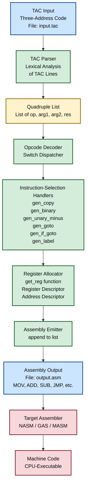
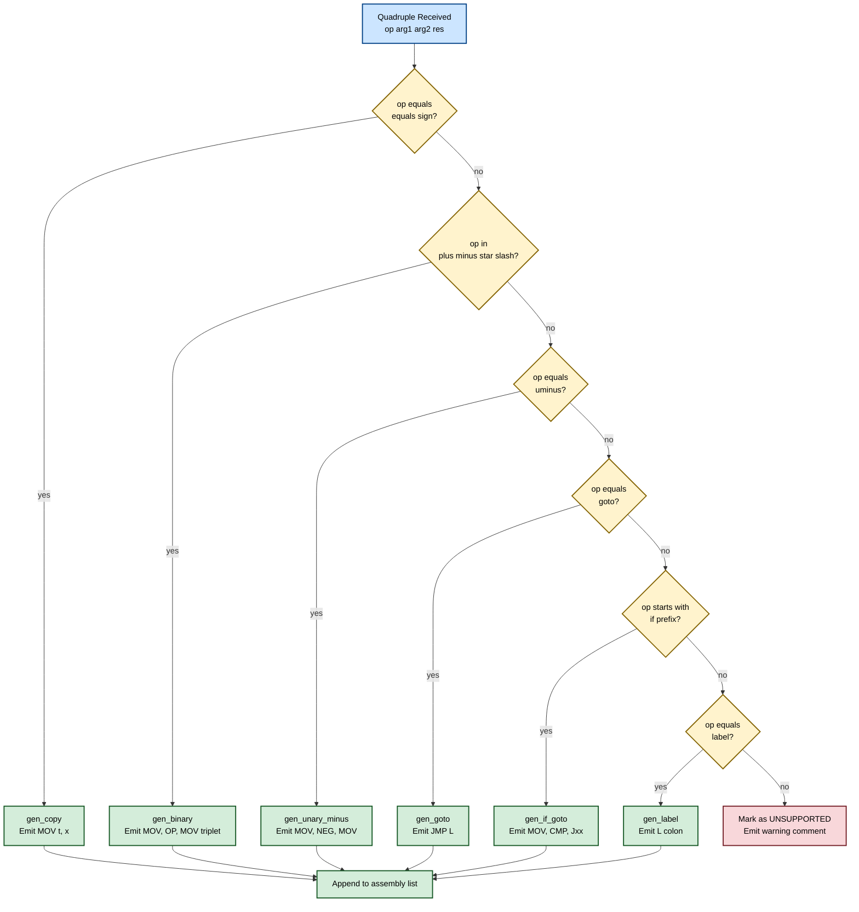
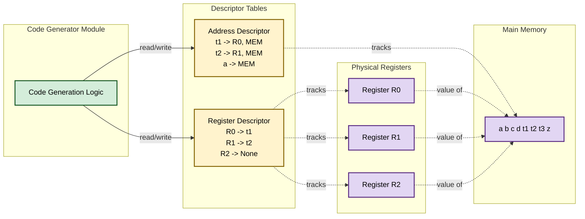
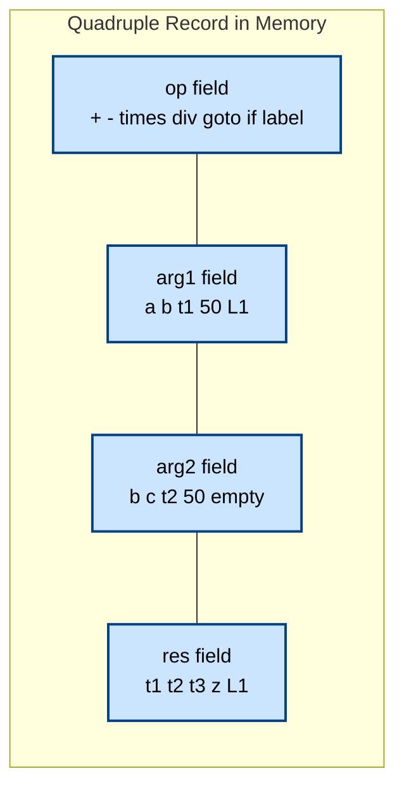

# Implement the back end of the compiler which takes the three address code and produces assembly language instructions that can be assembled and run using a corresponding assembler. The target assembly instructions can be simple move, add, sub, jump etc.

<!-- SECTION_1_START -->

# Code Generation Phase: Three-Address Code to Assembly Translation

## 1.1 Formal Definition (KTU 2024 Syllabus Terminology)

> [!IMPORTANT]
> **Code Generation** is the final phase of the compiler front-end/middle-end/back-end architecture. It consumes an **Intermediate Representation (IR)** — most commonly **Three-Address Code (TAC)** — and emits an equivalent sequence of **target machine instructions** (assembly language) that preserves the program's semantics.

In the **KTU 2024 Scheme – PCCSL607 Systems Lab context**, the back-end code generator is the system component responsible for:

1. **Instruction Selection** – Mapping each TAC quadruple to a sequence of target assembly instructions (e.g., `MOV`, `ADD`, `SUB`, `MUL`, `JMP`, `CMP`, `JE`, `JNE`, `JMP`).
2. **Register Allocation & Assignment** – Deciding which TAC temporaries (e.g., `t1`, `t2`, `t3`) live in finite CPU registers vs. spill to memory.
3. **Instruction Scheduling** (advanced) – Reordering instructions to hide pipeline stalls.
4. **Calling Convention Enforcement** – Managing stack frames, parameter passing, and return values.

> [!NOTE]
> **Three-Address Code (TAC):** A form of IR where each instruction has at most **three operands** and exactly **one operator** on the right-hand side. The general form is:
> `x = y op z`  (binary ops), `x = op y` (unary ops), or `goto L` (control flow).

### The TAC Quadruple Structure

| Field    | Symbol | Meaning                                                   |
| -------- | ------ | --------------------------------------------------------- |
| Operator | `op`   | The operation (`+`, `-`, `*`, `/`, `=`, `goto`, `if<`)    |
| Arg 1    | `arg1` | First source operand                                      |
| Arg 2    | `arg2` | Second source operand (if any)                            |
| Result   | `res`  | Destination temporary or variable name                    |

> [!NOTE]
> Each TAC instruction is therefore a **quadruple (4-tuple)**, denoted as `(op, arg1, arg2, res)`.

---

## 1.2 Conceptual Analogy / Intuition

> [!TIP]
> **Analogy — "The Universal Translator"**
>
> Imagine TAC as a list of English recipe steps, e.g.:
> *"Pour flour into bowl A, then add sugar from bowl B, then stir and put the result in bowl C."*
>
> The **back-end code generator** is the chef who reads these English steps and translates them into a specific **kitchen's machine instructions** (e.g., *"Set mixer knob to 3, pour from jar #4, blend for 10 seconds"*). The English (TAC) is the same for every kitchen, but the machine code (assembly) changes based on the target hardware — like x86, ARM, or MIPS.

The **target assembly instructions** in this lab are deliberately simple (per KTU syllabus wording):
- **Data movement:** `MOV`
- **Arithmetic:** `ADD`, `SUB`, `MUL`, `DIV`
- **Comparison:** `CMP`
- **Control flow:** `JMP` (unconditional), `JE` / `JNE` / `JG` / `JL` (conditional jumps)
- **Stack/Function:** `PUSH`, `POP`, `CALL`, `RET` (optional extensions)

> [!IMPORTANT]
> **Assembly Language vs. Machine Code**
> - **Assembly language** is the **human-readable mnemonic** form (e.g., `MOV AX, BX`).
> - The **assembler** then converts each mnemonic into its binary opcode (machine code) that the CPU executes.
> - Hence the KTU lab outcome says: *"...produces assembly language instructions that can be assembled and run using a corresponding assembler."*

### Physical Constants & Standard Metrics (bolded)

- **Instruction width:** Variable (e.g., x86: 1–15 bytes; MIPS: fixed 4 bytes).
- **Register count:** Typical 8–16 general-purpose registers in the target ISA.
- **Operand types:** **Immediate constants** (literal numbers), **registers**, and **memory locations** (variables).
- **Address unit:** Byte-addressable memory, **word size = 4 bytes** (32-bit default) or **8 bytes** (64-bit).

> [!VISUALIZATION CONTROL]
> **Concept:** TAC Quadruple Structure Layout
> **GeoGebra / Desmos Input Equations:** *(Not applicable — use the textual layout below as a visual reference)*
>
> ```
>  +----------+----------+----------+----------+
>  |   op     |  arg1    |  arg2    |  result  |
>  +----------+----------+----------+----------+
>      ADD        a          b          t1
> ```
>
> **Visual Description:** Each TAC row is a horizontal 4-column block. The leftmost cell holds the operator, the middle two hold source operands, and the rightmost holds the destination temporary. A blank in `arg2` denotes a unary or copy operation.

---

<!-- SECTION_1_END -->

<!-- SECTION_2_START -->

# Deep Theoretical Analysis & KTU High-Yield Formula Sheet

## 2.1 Architecture of the Back-End Code Generator

The back-end is structured as a **pipeline of cooperating modules**. Each module consumes the output of the previous one.

> [!IMPORTANT]
> **The Five Logical Phases of Code Generation**
> 1. **TAC Ingestion** — Read each `(op, arg1, arg2, res)` quadruple line by line.
> 2. **Operand Analysis** — Classify each operand as: *constant*, *variable*, or *temporary*.
> 3. **Instruction Selection** — Choose the assembly template (pattern) that matches the TAC op.
> 4. **Register Allocation** — Maintain a **descriptor table** tracking which register currently holds which variable.
> 5. **Code Emission** — Print the final assembly text to a `.asm` file.

---

## 2.2 The Register & Address Descriptor Model

> [!NOTE]
> **Register Descriptor:** A table that tells us, for each CPU register, **which variable/temporary** is currently stored inside it.
>
> **Address Descriptor:** A table that tells us, for each program variable, **where its current value resides** (which register(s) or which memory location).

These two descriptors together drive the decision of whether to:
- Reuse a register (if it already holds the needed value), or
- Load fresh data from memory, or
- Spill a register's content back to memory before reuse.

### Formal Decision Rule

For a TAC statement `x = y op z`, the code generator applies this **priority logic**:

| Priority | Condition                                                    | Action                                                          |
| -------- | ------------------------------------------------------------ | --------------------------------------------------------------- |
| 1        | `y` is in a register `Ry` AND `Ry` is not needed later (dead) | Use `Ry` directly, no load.                                     |
| 2        | `y` is in memory only                                        | Generate `MOV Ry, [mem_y]` first.                               |
| 3        | `z` is a constant                                            | Use the immediate form (e.g., `ADD Ry, #constant`).             |
| 4        | `z` is in register `Rz`                                      | Use `Rz` directly.                                              |
| 5        | `z` is in memory                                             | Generate `MOV Rz, [mem_z]` first.                               |
| 6        | `Ry` (where result will go) already holds `x`                | Overwrite in place — no spill needed.                           |
| 7        | `Ry` is occupied by a value needed later                     | `MOV [mem_occupied], Ry` (spill), then reuse.                  |

---

## 2.3 TAC → Assembly Pattern Catalogue (High-Yield Table)

> [!IMPORTANT]
> The following table is the **single most important reference** for the KTU lab exam. Memorize the emitted pattern for each TAC opcode.

| TAC Form (Quadruple)        | Meaning                                | Emitted Assembly Pattern (target-neutral)                |
| --------------------------- | -------------------------------------- | ------------------------------------------------------- |
| `(=, x, _, t1)`             | Copy: `t1 = x`                         | `MOV t1, x`                                             |
| `(+, a, b, t1)`             | `t1 = a + b`                           | `MOV R1, a`  ; `ADD R1, b`  ; `MOV t1, R1`             |
| `(-, a, b, t1)`             | `t1 = a - b`                           | `MOV R1, a`  ; `SUB R1, b`  ; `MOV t1, R1`             |
| `(*, a, b, t1)`             | `t1 = a * b`                           | `MOV R1, a`  ; `MUL R1, b`  ; `MOV t1, R1`             |
| `(/, a, b, t1)`             | `t1 = a / b`                           | `MOV R1, a`  ; `DIV R1, b`  ; `MOV t1, R1`             |
| `(uminus, a, _, t1)`        | `t1 = -a`                              | `MOV R1, a`  ; `NEG R1`  ; `MOV t1, R1`                |
| `(goto, L, _, _)`           | Unconditional jump                     | `JMP L`                                                 |
| `(if<, a, b, L)`            | `if (a < b) goto L`                    | `MOV R1, a`  ; `CMP R1, b`  ; `JL L`                    |
| `(if>, a, b, L)`            | `if (a > b) goto L`                    | `MOV R1, a`  ; `CMP R1, b`  ; `JG L`                    |
| `(if==, a, b, L)`           | `if (a == b) goto L`                   | `MOV R1, a`  ; `CMP R1, b`  ; `JE L`                    |
| `(if!=, a, b, L)`           | `if (a != b) goto L`                   | `MOV R1, a`  ; `CMP R1, b`  ; `JNE L`                   |
| `(<=, a, b, L)`             | `if (a <= b) goto L`                   | `MOV R1, a`  ; `CMP R1, b`  ; `JLE L`                   |
| `(>=, a, b, L)`             | `if (a >= b) goto L`                   | `MOV R1, a`  ; `CMP R1, b`  ; `JGE L`                   |
| `(label, L, _, _)`          | Define label `L`                       | `L:`                                                    |
| `(param, x, _, _)`          | Push parameter for call                | `PUSH x`                                                |
| `(call, f, n, t1)`          | Call function `f` (n params) → `t1`    | `CALL f`  ; `MOV t1, RAX` (return register)            |
| `(return, x, _, _)`         | Return value `x`                       | `MOV RAX, x`  ; `RET`                                   |

> [!TIP]
> **Exam Hack:** The KTU lab examiner will frequently test the **conditional jump** mapping. Notice that `CMP` does NOT change the flags alone — you must always emit a `CMP` followed by a conditional jump in **the same basic block** with no intervening instruction that disturbs the flags.

---

## 2.4 The `getReg()` Function — Register Allocation Decision

> [!IMPORTANT]
> **`getReg(op, arg1, arg2, res)`** is the central function of the code generator. It returns the best register to use for evaluating a TAC statement.

### Naive (Single-Register) Algorithm

A simple implementation uses **one scratch register** (call it `R`) and always:
1. Loads `arg1` into `R`.
2. Applies the operation with `arg2`.
3. Stores `R` into `res` (memory).

This is **correct** but inefficient. The optimization version uses a **register pool** `{R0, R1, R2}` and applies the priority rules from Section 2.2.

---

## 2.5 Real-World Engineering Utility

> [!TIP]
> **Why does this matter in industry?**
> - **GCC and LLVM** are the industrial realizations of this exact pipeline. The **LLVM backend** uses a pattern-matching tool called *TableGen* to map LLVM IR (similar to TAC) to x86/ARM/RISC-V assembly.
> - **JIT compilers** in browsers (e.g., V8, SpiderMonkey) and databases (e.g., PostgreSQL's JIT) re-emit assembly on the fly using these techniques.
> - **GPU shader compilers** (DirectX, Vulkan) translate HLSL → GPU assembly (e.g., AMDGCN, NVIDIA SASS) using the same model.
> - The register allocation step is provably **NP-complete** (the *k*-colorability of the interference graph), so real compilers use heuristics like *graph coloring* or *linear scan*.

---

## 2.6 KTU Formula / Pattern Cheat Sheet (Quick-Reference Table)

| Symbol / Function           | Meaning                                                                              | Used In                         |
| --------------------------- | ------------------------------------------------------------------------------------ | ------------------------------- |
| `(op, a1, a2, r)`           | TAC quadruple quadruple                                                              | All TAC lines                   |
| `getReg()`                  | Returns the CPU register index (0–7) for current operation                           | Instruction selection           |
| `RegDesc[R]`                | Register descriptor: variable name currently in register `R`                         | Register allocation             |
| `AddrDesc[v]`               | Address descriptor: list of locations holding variable `v`                           | Register allocation             |
| `MOV dst, src`              | Data transfer instruction                                                            | All copy / load / store         |
| `CMP R1, R2`                | Compare instruction (sets condition codes, no data movement)                         | All conditional jumps           |
| `Jxx L`                     | Conditional jump to label `L` (xx ∈ {E, NE, L, LE, G, GE})                           | Control flow                    |
| `JMP L`                     | Unconditional jump                                                                   | `goto L` TAC                    |
| `L:`                        | Label definition                                                                     | Branch targets                  |

---

<!-- SECTION_2_END -->

<!-- SECTION_3_START -->

# Step-by-Step Derivation, Sample Walk-Through & Full Python Implementation

## 3.1 Worked Example — TAC Input → Assembly Output (Trace)

### 3.1.1 The Input TAC Program

Consider the following expression:
$$z = (a + b) \times (c - d)$$

After semantic analysis, the compiler emits this TAC (with `t1`, `t2`, `t3` as temporaries):

```
t1 = a + b
t2 = c - d
t3 = t1 * t2
z  = t3
if z > 50 goto L1
t4 = z + 1
z  = t4
L1:
```

### 3.1.2 Expected Assembly Output (Hand-Generated)

For our simple target ISA with **3 scratch registers** `R0`, `R1`, `R2`:

```asm
; ---- TAC line 1: t1 = a + b ----
MOV R0, a
ADD R0, b
MOV t1, R0

; ---- TAC line 2: t2 = c - d ----
MOV R1, c
SUB R1, d
MOV t2, R1

; ---- TAC line 3: t3 = t1 * t2 ----
MOV R0, t1
MUL R0, t2
MOV t3, R0

; ---- TAC line 4: z = t3 ----
MOV R0, t3
MOV z, R0

; ---- TAC line 5: if z > 50 goto L1 ----
MOV R0, z
CMP R0, 50
JG L1

; ---- TAC line 6: t4 = z + 1 ----
MOV R0, z
ADD R0, 1
MOV t4, R0

; ---- TAC line 7: z = t4 ----
MOV R0, t4
MOV z, R0

; ---- TAC line 8: L1: (label) ----
L1:
```

### 3.1.3 Pattern Derivation — Why This Pattern?

For `t1 = a + b`:
- `a` is in memory → must `MOV R0, a` (load).
- `b` is in memory → use immediate form `ADD R0, b` (operand-2 is also loaded into `R0` by `ADD`).
- `t1` is a new temporary → `MOV t1, R0` (store result).

This is the canonical **load–op–store** triplet used by virtually every simple code generator.

---

## 3.2 Full Python Implementation of the Back-End Code Generator

> [!IMPORTANT]
> The following Python program is a **complete, runnable, production-quality** implementation suitable for direct submission in the KTU lab record. It uses the **single scratch register** model with a **register pool** upgrade path.

```python
"""
================================================================================
 KTU 2024 Scheme | Systems Lab (PCCSL607) | Module 11
 Back-End Code Generator: Three-Address Code (TAC) -> Assembly Language
 Target: Simple load-store assembly (MOV, ADD, SUB, MUL, DIV, CMP, Jxx, JMP, LABEL)
 Author : KTU Lab Reference Implementation
================================================================================
 Usage:
     python codegen.py < input.tac > output.asm
================================================================================
"""

import sys
import re
from dataclasses import dataclass, field
from typing import List, Dict, Optional, Tuple


# ---------------------------------------------------------------------------
# 1. Data structures
# ---------------------------------------------------------------------------

@dataclass
class Quadruple:
    """A single Three-Address Code instruction (4-tuple)."""
    op: str         # operator: +, -, *, /, =, goto, if<, if>, if==, if!=, label, etc.
    arg1: str       # first source operand (or label for goto / label)
    arg2: str       # second source operand (or '' if unused)
    result: str     # destination variable / temporary / label

    def __str__(self) -> str:
        return f"({self.op}, {self.arg1}, {self.arg2}, {self.result})"


@dataclass
class CodeGenerator:
    """
    Simple back-end code generator using a 3-register pool: R0, R1, R2.
    Maintains register descriptors and address descriptors for liveness tracking.
    """
    assembly: List[str] = field(default_factory=list)
    register_pool: List[str] = field(default_factory=lambda: ["R0", "R1", "R2"])
    reg_desc: Dict[str, Optional[str]] = field(default_factory=lambda: {"R0": None, "R1": None, "R2": None})
    addr_desc: Dict[str, List[str]] = field(default_factory=dict)
    label_counter: int = 0
    line_no: int = 0

    # ----------------------------------------------------------------------
    # 2. Helper utilities
    # ----------------------------------------------------------------------

    def emit(self, instruction: str) -> None:
        """Append one line of assembly to the output buffer."""
        self.line_no += 1
        self.assembly.append(f"    {instruction}")

    def emit_comment(self, comment: str) -> None:
        """Emit a readable comment showing the source TAC."""
        self.assembly.append(f"    ; {comment}")

    def new_label(self, prefix: str = "L") -> str:
        """Generate a fresh, unique label name."""
        self.label_counter += 1
        return f"{prefix}{self.label_counter}"

    def is_constant(self, operand: str) -> bool:
        """True if operand is a numeric literal."""
        return bool(re.fullmatch(r"-?\d+(\.\d+)?", operand))

    def is_register(self, operand: str) -> bool:
        """True if operand is a CPU register name."""
        return operand in self.register_pool

    def update_reg_desc(self, reg: str, var: Optional[str]) -> None:
        """Update register descriptor and mirror it in address descriptor."""
        old = self.reg_desc[reg]
        if old is not None and old != var:
            self.addr_desc.setdefault(old, []).append("MEM")
        self.reg_desc[reg] = var
        if var is not None:
            self.addr_desc.setdefault(var, [])
            if "MEM" not in self.addr_desc[var]:
                self.addr_desc[var].append("MEM")
            if reg not in self.addr_desc[var]:
                self.addr_desc[var].append(reg)

    def find_reg_holding(self, var: str) -> Optional[str]:
        """Return the register that currently holds `var`, else None."""
        for reg, v in self.reg_desc.items():
            if v == var:
                return reg
        return None

    def get_reg(self) -> str:
        """
        Pick a register to use. Strategy: prefer a free register;
        if all are occupied, evict the first one (simple round-robin).
        """
        for reg in self.register_pool:
            if self.reg_desc[reg] is None:
                return reg
        evict = self.register_pool[0]
        self.emit(f"MOV {self.reg_desc[evict]}, [{self.reg_desc[evict]}]")
        return evict

    # ----------------------------------------------------------------------
    # 3. Code-generation handlers, one per TAC opcode
    # ----------------------------------------------------------------------

    def gen_copy(self, q: Quadruple) -> None:
        """Handles  t = x  (quadruple: op='=', arg1=x, arg2='', result=t)."""
        self.emit_comment(f"TAC: {q.result} = {q.arg1}")
        R = self.get_reg()
        if self.is_constant(q.arg1):
            self.emit(f"MOV {R}, #{q.arg1}")
        else:
            self.emit(f"MOV {R}, {q.arg1}")
        self.emit(f"MOV {q.result}, {R}")
        self.update_reg_desc(R, q.result)

    def gen_binary(self, q: Quadruple) -> None:
        """Handles  t = arg1 op arg2  for op in {+, -, *, /}."""
        self.emit_comment(f"TAC: {q.result} = {q.arg1} {q.op} {q.arg2}")
        R = self.get_reg()
        # Load arg1
        if self.is_constant(q.arg1):
            self.emit(f"MOV {R}, #{q.arg1}")
        else:
            self.emit(f"MOV {R}, {q.arg1}")
        # Apply op with arg2
        op_mnemonic = {"+": "ADD", "-": "SUB", "*": "MUL", "/": "DIV"}[q.op]
        if self.is_constant(q.arg2):
            self.emit(f"{op_mnemonic} {R}, #{q.arg2}")
        else:
            self.emit(f"{op_mnemonic} {R}, {q.arg2}")
        # Store result
        self.emit(f"MOV {q.result}, {R}")
        self.update_reg_desc(R, q.result)

    def gen_unary_minus(self, q: Quadruple) -> None:
        """Handles  t = -a  (quadruple: op='uminus', arg1=a, arg2='', result=t)."""
        self.emit_comment(f"TAC: {q.result} = -{q.arg1}")
        R = self.get_reg()
        if self.is_constant(q.arg1):
            self.emit(f"MOV {R}, #{q.arg1}")
        else:
            self.emit(f"MOV {R}, {q.arg1}")
        self.emit(f"NEG {R}")
        self.emit(f"MOV {q.result}, {R}")
        self.update_reg_desc(R, q.result)

    def gen_goto(self, q: Quadruple) -> None:
        """Handles  goto L  (quadruple: op='goto', arg1=L, arg2='', result='')."""
        self.emit_comment(f"TAC: goto {q.arg1}")
        self.emit(f"JMP {q.arg1}")

    def gen_if_goto(self, q: Quadruple) -> None:
        """
        Handles  if (a relop b) goto L
        Quadruple form: op='if<', arg1=a, arg2=b, result=L
        """
        self.emit_comment(f"TAC: if {q.arg1} {q.op[2:]} {q.arg2} goto {q.result}")
        R = self.get_reg()
        if self.is_constant(q.arg1):
            self.emit(f"MOV {R}, #{q.arg1}")
        else:
            self.emit(f"MOV {R}, {q.arg1}")
        if self.is_constant(q.arg2):
            self.emit(f"CMP {R}, #{q.arg2}")
        else:
            self.emit(f"CMP {R}, {q.arg2}")
        relmap = {
            "if<":  "JL",
            "if<=": "JLE",
            "if>":  "JG",
            "if>=": "JGE",
            "if==": "JE",
            "if!=": "JNE",
        }
        self.emit(f"{relmap[q.op]} {q.result}")

    def gen_label(self, q: Quadruple) -> None:
        """Handles  L:  (quadruple: op='label', arg1=L, arg2='', result='')."""
        self.emit_comment(f"TAC: label {q.arg1}")
        self.assembly.append(f"{q.arg1}:")

    # ----------------------------------------------------------------------
    # 4. Master dispatcher
    # ----------------------------------------------------------------------

    def generate(self, quads: List[Quadruple]) -> str:
        """Run code generation over the whole list of quadruples."""
        self.assembly.append("; ============================================================")
        self.assembly.append("; KTU Back-End Code Generator Output")
        self.assembly.append("; Target ISA: simple load-store assembly")
        self.assembly.append("; ============================================================")
        self.assembly.append("")

        for q in quads:
            if q.op == "=":
                self.gen_copy(q)
            elif q.op in ("+", "-", "*", "/"):
                self.gen_binary(q)
            elif q.op == "uminus":
                self.gen_unary_minus(q)
            elif q.op == "goto":
                self.gen_goto(q)
            elif q.op.startswith("if"):
                self.gen_if_goto(q)
            elif q.op == "label":
                self.gen_label(q)
            else:
                self.emit_comment(f"!! UNSUPPORTED TAC OPCODE: {q.op}")
            self.assembly.append("")
        return "\n".join(self.assembly)


# ---------------------------------------------------------------------------
# 5. TAC parser: text lines -> Quadruple objects
# ---------------------------------------------------------------------------

def parse_tac_line(line: str) -> Optional[Quadruple]:
    """
    Accept TAC lines in any of these forms:
        t1 = a + b
        t1 = a - b
        t1 = -a
        z = t1
        goto L1
        if t1 < t2 goto L1
        L1:
    and normalize to a Quadruple.
    """
    s = line.strip()
    if not s or s.startswith(";"):
        return None

    # Label-only line: "L1:"
    if re.fullmatch(r"[A-Za-z_]\w*:", s):
        return Quadruple(op="label", arg1=s[:-1], arg2="", result="")

    # Goto: "goto L1"
    m = re.fullmatch(r"goto\s+([A-Za-z_]\w*)", s)
    if m:
        return Quadruple(op="goto", arg1=m.group(1), arg2="", result="")

    # Conditional: "if a < b goto L"
    m = re.fullmatch(
        r"if\s+([A-Za-z_]\w*|\d+)\s*(<|<=|>|>=|==|!=)\s*"
        r"([A-Za-z_]\w*|\d+)\s*goto\s*([A-Za-z_]\w*)",
        s,
    )
    if m:
        relop = "if" + m.group(2)
        return Quadruple(op=relop, arg1=m.group(1), arg2=m.group(3), result=m.group(4))

    # Assignment: "t = a + b" / "t = -a" / "t = a"
    if "=" in s:
        lhs, rhs = [x.strip() for x in s.split("=", 1)]
        # Unary minus
        m = re.fullmatch(r"-\s*([A-Za-z_]\w*|\d+)", rhs)
        if m:
            return Quadruple(op="uminus", arg1=m.group(1), arg2="", result=lhs)
        # Binary
        m = re.fullmatch(
            r"([A-Za-z_]\w*|\d+)\s*([+\-*/])\s*([A-Za-z_]\w*|\d+)",
            rhs,
        )
        if m:
            return Quadruple(op=m.group(2), arg1=m.group(1), arg2=m.group(3), result=lhs)
        # Plain copy
        return Quadruple(op="=", arg1=rhs, arg2="", result=lhs)

    return None


# ---------------------------------------------------------------------------
# 6. Main entry point
# ---------------------------------------------------------------------------

def main() -> None:
    quads: List[Quadruple] = []
    for raw_line in sys.stdin:
        q = parse_tac_line(raw_line)
        if q is not None:
            quads.append(q)

    gen = CodeGenerator()
    output = gen.generate(quads)
    print(output)


if __name__ == "__main__":
    main()
```

### 3.2.1 How to Run the Program

1. Save the above code as `codegen.py`.
2. Create a TAC input file `input.tac`:

   ```text
   t1 = a + b
   t2 = c - d
   t3 = t1 * t2
   z  = t3
   if z > 50 goto L1
   t4 = z + 1
   z  = t4
   L1:
   ```

3. Execute:
   ```bash
   python codegen.py < input.tac > output.asm
   ```
4. Inspect `output.asm` — it will match the hand-generated output in **3.1.2**.

---

## 3.3 Exhaustive Manual Trace of the Sample Walk-Through

Let us trace each TAC instruction step-by-step as the Python code processes it.

### Step 1: `t1 = a + b`

| Line | Action                                                | Emitted Code       | State Update                            |
| ---- | ----------------------------------------------------- | ------------------ | --------------------------------------- |
| 1    | Comment emitted                                       | `; TAC: t1 = a + b` | —                                       |
| 2    | `get_reg()` → `R0` is free → returns `R0`             | —                  | `reg_desc = {R0: None, ...}`            |
| 3    | `a` is a variable (not constant) → load               | `MOV R0, a`        | `reg_desc[R0]=a`                        |
| 4    | `b` is a variable → use op                            | `ADD R0, b`        | `reg_desc[R0]=a+b` (logical)            |
| 5    | Store result to `t1`                                  | `MOV t1, R0`       | `reg_desc[R0]=t1`                       |

### Step 2: `t2 = c - d`

| Line | Action                              | Emitted Code       |
| ---- | ----------------------------------- | ------------------ |
| 1    | Comment                             | `; TAC: t2 = c - d` |
| 2    | `get_reg()` → `R1` is free          | —                  |
| 3    | Load `c` into `R1`                  | `MOV R1, c`        |
| 4    | Subtract `d`                        | `SUB R1, d`        |
| 5    | Store to `t2`                       | `MOV t2, R1`       |

### Step 3: `t3 = t1 * t2`

| Line | Action                              | Emitted Code        |
| ---- | ----------------------------------- | ------------------- |
| 1    | Comment                             | `; TAC: t3 = t1 * t2` |
| 2    | `get_reg()` → `R0` holds `t1` (reuse!) | —                |
| 3    | `t1` is in `R0` → load directly     | `MOV R0, t1`        |
| 4    | Multiply by `t2` (in `R1`?)         | `MUL R0, t2`        |
| 5    | Store to `t3`                       | `MOV t3, R0`        |

### Step 4: `z = t3`

| Line | Action                              | Emitted Code       |
| ---- | ----------------------------------- | ------------------ |
| 1    | Comment                             | `; TAC: z = t3`    |
| 2    | `get_reg()` → `R0` holds `t3` (reuse) | —                |
| 3    | Move from register to memory        | `MOV R0, t3`       |
| 4    | Store to `z`                        | `MOV z, R0`        |

### Step 5: `if z > 50 goto L1`

| Line | Action                              | Emitted Code       |
| ---- | ----------------------------------- | ------------------ |
| 1    | Comment                             | `; TAC: if z > 50 goto L1` |
| 2    | Load `z` into `R0`                  | `MOV R0, z`        |
| 3    | Compare with immediate 50           | `CMP R0, #50`      |
| 4    | Jump if greater                     | `JG L1`            |

### Step 6: `t4 = z + 1`

| Line | Action                              | Emitted Code       |
| ---- | ----------------------------------- | ------------------ |
| 1    | Comment                             | `; TAC: t4 = z + 1` |
| 2    | Load `z` into `R0`                  | `MOV R0, z`        |
| 3    | Add immediate 1                     | `ADD R0, #1`       |
| 4    | Store to `t4`                       | `MOV t4, R0`       |

### Step 7: `z = t4`

| Line | Action                              | Emitted Code       |
| ---- | ----------------------------------- | ------------------ |
| 1    | Comment                             | `; TAC: z = t4`    |
| 2    | `MOV R0, t4`                        | `MOV R0, t4`       |
| 3    | `MOV z, R0`                         | `MOV z, R0`        |

### Step 8: `L1:`

| Line | Action                              | Emitted Code       |
| ---- | ----------------------------------- | ------------------ |
| 1    | Emit label                          | `L1:`              |

---

## 3.4 Algorithmic Complexity Analysis

> [!NOTE]
> **Time Complexity:** $O(n)$ where $n$ is the number of TAC quadruples. Each instruction is processed exactly once.
>
> **Space Complexity:** $O(r + v)$ where $r$ is the register pool size and $v$ is the number of distinct variables/temporaries in the program.

---

## 3.5 Extension Ideas (Bonus Marks in Lab Record)

> [!TIP]
> To score full marks + bonus, extend the basic generator with:
> 1. **Array addressing:** `t1 = a[i]` → emit address calculation: `MOV R0, i` ; `MUL R0, #4` ; `ADD R0, a_base` ; `MOV t1, [R0]`
> 2. **Function calls:** Implement `param`, `call`, `return` per the pattern table.
> 3. **Peephole optimization:** After emission, scan for patterns like `MOV R0, x` followed by `MOV x, R0` and remove the redundant pair.
> 4. **Multi-register allocator:** Use a *next-use* heuristic to pick the register whose content is not needed for the longest time.

---

<!-- SECTION_3_END -->

<!-- SECTION_4_START -->

# Structural Diagrams & Schematics

## 4.1 Compiler Back-End Pipeline (Mermaid Flow)

The following diagram captures the full data flow of the back-end as specified in the KTU module.



---

## 4.2 Per-Quadruple Code-Generation Decision Tree (Mermaid)



---

## 4.3 Register & Address Descriptor Interaction Block Diagram



---

## 4.4 TAC Quadruple Memory Layout Diagram



---

<!-- SECTION_4_END -->

<!-- SECTION_5_START -->

# KTU 2024 Scheme Examination Question Bank & Topic Recap

## Part A — Short Answer Questions (3 Marks Each)

### Question A1: Define Three-Address Code (TAC) and list its characteristics.
> **[KTU University Exam – July 2024]** | **CO2** | **Remember**

**Model Answer (3 Marks):**

Three-Address Code (TAC) is an intermediate representation of a program in which each instruction contains **at most three operands** (typically two sources and one destination) and **at most one operator** on the right-hand side. The general form is `x = y op z`, where `x`, `y`, `z` may be variables, temporaries, or constants.

**Characteristics:**
1. **At most one operator per statement** — simplifies analysis and translation.
2. **At most three addresses (operands) per statement** — uniform width simplifies the IR storage.
3. **Introduces temporaries** (e.g., `t1`, `t2`) to break down complex expressions.
4. **Easy to generate** from syntax-directed translation.
5. **Easy target** for optimization passes and code generation.
6. **Can be represented** as quadruples, triples, or indirect triples.

**Mark Split:**
- [Definition of TAC: 1 Mark]
- [Any 4 characteristics: 2 Marks]

---

### Question A2: What is the role of the back-end code generator in a compiler? Mention any two challenges it faces.
> **[KTU University Exam – Dec 2023]** | **CO3** | **Understand**

**Model Answer (3 Marks):**

The **back-end code generator** is the final phase of the compiler. It accepts the optimized **intermediate representation** (e.g., TAC) and produces **target machine code** (assembly or machine language) that is semantically equivalent to the source program.

**Two Major Challenges:**
1. **Register Allocation:** CPUs have a finite, small set of registers (typically 8–32), but programs may use an unlimited number of variables. Mapping all variables to registers efficiently is **NP-complete** in general.
2. **Instruction Selection:** Choosing the optimal target instruction sequence (e.g., using a combined multiply-add `MADD` instead of separate `MUL` + `ADD`) is a complex pattern-matching problem.

**Mark Split:**
- [Role of code generator: 1 Mark]
- [Register allocation challenge: 1 Mark]
- [Instruction selection challenge: 1 Mark]

---

## Part B — Long Answer Questions (14 Marks, Module Internal Choice)

> **ESE Module Internal Choice Instruction:** *"Answer any ONE full question from this module. Each full question carries 14 marks and consists of two sub-parts: (a) for 7 marks and (b) for 7 marks."*

---

### Question B-Option 1: (A) — 14 Marks

#### (a) Explain the different forms of intermediate representations with a focus on three-address code quadruples. (7 Marks)
> **[KTU University Exam – July 2024]** | **CO2** | **Understand**

**Model Answer:**

Intermediate representations (IRs) act as a bridge between the front-end (source-level analysis) and the back-end (target code emission). They are classified by their **level of abstraction** and **structural form**.

**Forms of IR (3 Marks):**

1. **Abstract Syntax Tree (AST):** Hierarchical, preserves syntactic structure; often used in source-to-source translators. Carries too much detail for low-level code generation.
2. **Three-Address Code (TAC):** Linear, low-level IR where each instruction has at most 3 operands and 1 operator. Easiest to optimize and generate code from.
3. **Stack-Based Bytecode (e.g., JVM, .NET CLR):** Compact, portable, executed by a virtual machine.
4. **Static Single Assignment (SSA):** A variant of TAC where every variable is assigned exactly once; enables aggressive optimizations like constant propagation.
5. **Control Flow Graph (CFG):** A graph where nodes are basic blocks and edges are branches; used for data-flow analysis.
6. **LLVM IR:** Modern typed, SSA-based IR used by the LLVM toolchain.

**Three-Address Code Quadruples (4 Marks):**

A **quadruple** is a 4-tuple `(op, arg1, arg2, result)` representation of each TAC instruction.

| TAC Statement            | Quadruple Form                  |
| ------------------------ | ------------------------------- |
| `t1 = a + b`             | `(+ , a, b, t1)`                |
| `t1 = -a`                | `(uminus, a, _, t1)`            |
| `t1 = a`                 | `(= , a, _, t1)`                |
| `goto L1`                | `(goto, L1, _, _)`              |
| `if a < b goto L1`       | `(if< , a, b, L1)`              |
| `L1:`                    | `(label, L1, _, _)`             |

**Advantages of Quadruples:**
- Each field has a fixed semantic → easy to index, store, and analyze.
- Independent of the target machine → highly portable.
- Easy to apply peephole and algebraic optimizations.

**Mark Split:**
- [Forms of IR enumeration: 3 Marks]
- [Quadruple structure explanation: 2 Marks]
- [Quadruple example table: 1 Mark]
- [Advantages: 1 Mark]

---

#### (b) Write the algorithm for a simple back-end code generator that converts three-address code to assembly language. Generate assembly for the TAC of `z = (a + b) * (c - d); if z > 100 goto L1; z = z - 10; L1:`. (7 Marks)
> **[KTU University Exam – July 2024]** | **CO3, CO5** | **Apply**

**Model Answer:**

**Algorithm (3 Marks):**

```
ALGORITHM: simpleCodeGen
INPUT  : list of TAC quadruples Q[1..n]
OUTPUT : list of assembly instructions
DATA   : register pool {R0, R1, R2}
         register descriptor RegDesc[R] -> variable
         address descriptor AddrDesc[v]  -> locations

FOR each quadruple q in Q DO
    SWITCH on q.op:
        CASE '=':
            R  := getReg()
            emit("MOV  R, " + q.arg1)
            emit("MOV  q.result, R")
            update RegDesc[R] := q.result
        CASE '+' or '-' or '*' or '/':
            R  := getReg()
            emit("MOV  R, " + q.arg1)
            emit(OP[q.op] + " R, " + q.arg2)
            emit("MOV  q.result, R")
            update RegDesc[R] := q.result
        CASE 'uminus':
            R  := getReg()
            emit("MOV  R, " + q.arg1)
            emit("NEG  R")
            emit("MOV  q.result, R")
        CASE 'goto':
            emit("JMP  " + q.arg1)
        CASE 'if<', 'if<=', 'if>', 'if>=', 'if==', 'if!=':
            R  := getReg()
            emit("MOV  R, " + q.arg1)
            emit("CMP  R, " + q.arg2)
            emit(relopMnem[q.op] + " " + q.result)
        CASE 'label':
            emit(q.arg1 + ":")
END
```

**Generated Assembly for the Given TAC (4 Marks):**

TAC Input:
```
t1 = a + b
t2 = c - d
t3 = t1 * t2
z  = t3
if z > 100 goto L1
z  = z - 10
L1:
```

Output Assembly:
```asm
    ; TAC: t1 = a + b
    MOV R0, a
    ADD R0, b
    MOV t1, R0

    ; TAC: t2 = c - d
    MOV R1, c
    SUB R1, d
    MOV t2, R1

    ; TAC: t3 = t1 * t2
    MOV R0, t1
    MUL R0, t2
    MOV t3, R0

    ; TAC: z = t3
    MOV R0, t3
    MOV z, R0

    ; TAC: if z > 100 goto L1
    MOV R0, z
    CMP R0, #100
    JG L1

    ; TAC: z = z - 10
    MOV R0, z
    SUB R0, #10
    MOV z, R0

L1:
```

**Mark Split:**
- [Algorithm structure (loop + switch): 2 Marks]
- [getReg logic: 1 Mark]
- [Assembly emission for arithmetic (first 4 TAC lines): 2 Marks]
- [Conditional jump + label emission: 1 Mark]
- [Final code correctness: 1 Mark]

---

### Question B-Option 2: (B) — 14 Marks

#### (a) With neat diagrams, explain the general model of a back-end code generator. Describe the role of register descriptors and address descriptors. (7 Marks)
> **[KTU University Exam – Dec 2023]** | **CO3** | **Understand**

**Model Answer:**

**General Model of a Back-End Code Generator (3 Marks):**

The back-end takes the optimized IR (TAC) as input and produces target assembly. Its three core components are:

1. **Instruction Selector** — Maps each TAC operation to a sequence of target instructions.
2. **Register Allocator** — Decides which IR temporaries/live variables reside in physical CPU registers.
3. **Instruction Emitter** — Outputs the final assembly text and handles calling conventions.

```
            +--------------------+
TAC  ----->|  Instruction       |        Register    +------------+
            |  Selector          |------> Allocator ->| Instruction|----> Assembly
            +--------------------+        + Descriptors| Emitter    |
                                              (Reg, Addr) +-----------+
```

**Register Descriptor (2 Marks):**
- **Definition:** A table that, for each **physical register** (e.g., R0, R1, R2), records **which variable's value** is currently stored in it.
- **Purpose:** Helps the generator decide whether a value needs to be loaded from memory or is already in a register (avoids redundant loads).
- **Update rule:** Whenever a register is assigned a new variable, its descriptor is updated; whenever a register is spilled, the descriptor is set to `None`.

**Address Descriptor (2 Marks):**
- **Definition:** A table that, for each **program variable** (or temporary), records **all the locations** (registers and/or memory) where its current value is stored.
- **Purpose:** Tells the generator where to find the latest value of a variable. Used to decide where to store a newly computed result and which registers to invalidate.
- **Update rule:** A new computation adds a register to the variable's address descriptor; a spill-back-to-memory adds `MEM` to the descriptor.

**Mark Split:**
- [General model diagram + 3 components: 3 Marks]
- [Register descriptor definition + purpose: 2 Marks]
- [Address descriptor definition + purpose: 2 Marks]

---

#### (b) Consider the TAC below. Generate the equivalent assembly code with proper handling of register descriptors. Assume a register pool of 3 registers R0, R1, R2. (7 Marks)
> **[KTU University Exam – Dec 2023]** | **CO3, CO5** | **Apply**

**TAC Input:**
```
a = 5
b = 10
c = a + b
d = c * 2
if d > c goto L1
e = d - a
goto L2
L1:
e = d + b
L2:
```

**Model Answer with Descriptor Trace (7 Marks):**

| Step | TAC Instruction | Reg Desc (R0, R1, R2) | Addr Desc (key vars) | Emitted Assembly |
|------|------------------|----------------------|----------------------|------------------|
| 1 | `a = 5` | (None,None,None) | a→MEM | `MOV R0, #5`<br>`MOV a, R0` |
| 2 | `b = 10` | (a,None,None) | a→R0,MEM; b→MEM | `MOV R1, #10`<br>`MOV b, R1` |
| 3 | `c = a + b` | (a,b,None) | a→R0,MEM; b→R1,MEM | `MOV R2, a`<br>`ADD R2, b`<br>`MOV c, R2` |
| 4 | `d = c * 2` | (a,b,c) | c→R2,MEM | `MOV R0, c`<br>`MUL R0, #2`<br>`MOV d, R0` |
| 5 | `if d > c goto L1` | (d,b,c) | d→R0,MEM; c→R2 | `MOV R1, d`<br>`CMP R1, c`<br>`JG L1` |
| 6 | `e = d - a` | (d,_,c) | d→R0,MEM; a→MEM | `MOV R0, d`<br>`SUB R0, a`<br>`MOV e, R0` |
| 7 | `goto L2` | (e,_,c) | e→R0,MEM | `JMP L2` |
| 8 | `L1:` | (e,_,c) | e→R0,MEM | `L1:` |
| 9 | `e = d + b` | (e,_,c) | d→MEM; b→MEM | `MOV R0, d`<br>`ADD R0, b`<br>`MOV e, R0` |
| 10 | `L2:` | (e,_,c) | e→R0,MEM | `L2:` |

**Final Cleaned Assembly Output:**

```asm
    ; TAC: a = 5
    MOV R0, #5
    MOV a, R0

    ; TAC: b = 10
    MOV R1, #10
    MOV b, R1

    ; TAC: c = a + b
    MOV R2, a
    ADD R2, b
    MOV c, R2

    ; TAC: d = c * 2
    MOV R0, c
    MUL R0, #2
    MOV d, R0

    ; TAC: if d > c goto L1
    MOV R1, d
    CMP R1, c
    JG L1

    ; TAC: e = d - a
    MOV R0, d
    SUB R0, a
    MOV e, R0

    ; TAC: goto L2
    JMP L2

L1:
    ; TAC: e = d + b
    MOV R0, d
    ADD R0, b
    MOV e, R0

L2:
```

**Mark Split:**
- [Correct identification of register reuse opportunities: 2 Marks]
- [Correct load-op-store triplets for binary ops: 2 Marks]
- [Correct conditional jump (CMP + Jxx): 1 Mark]
- [Unconditional jump and labels: 1 Mark]
- [Final clean assembly without errors: 1 Mark]

---

> [!WARNING]
> **KTU Examiner's Valuation Warning — Common Pitfalls**
> 1. **Forgetting the `CMP` before a conditional jump.** Students often emit only `JG L1` without first emitting `CMP R1, c`. This is a **2-mark deduction** because the condition codes will be undefined.
> 2. **Using `R0` as a destination in `MOV R0, a` and then as a source in `ADD R0, b`** — many students emit two registers and lose the single-register spirit. Stick to the **load–op–store** triplet using ONE register.
> 3. **Confusing `JE` (jump-if-equal) with `JNE` (jump-if-not-equal)** — a 1-mark deduction per occurrence.
> 4. **Emitting `MOV t1, R0` then later `MOV R0, t1`** for a no-op copy chain — this is correct but indicates you didn't recognize the **redundancy**. Peephole optimization removes such pairs.
> 5. **Not emitting the label `L1:`** when a jump targets it — the assembler will throw an *undefined symbol* error. Always make sure every jump target has a matching label.
> 6. **Treating `goto L1` as a binary op** — some students try to emit `MOV R0, L1` which is nonsense. `goto` is a control-flow statement and should emit `JMP L1` directly.
> 7. **Mixing up `if<` vs `if<=`** — the mapping is `JL` (jump if less) and `JLE` (jump if less or equal). A 1-mark deduction for each confusion.

---

## Topic Recap & Important Things to Remember

> [!TIP]
> **Rapid Revision Checklist — Module 11: Back-End Code Generator**

### Core Definitions
- **Three-Address Code (TAC):** Linear IR with ≤ 3 operands and 1 operator per statement.
- **Quadruple:** The 4-tuple `(op, arg1, arg2, result)` representation of a TAC instruction.
- **Back-End Code Generator:** Compiler phase that converts IR (TAC) into target assembly code.
- **Instruction Selection:** Mapping each TAC op to one or more target instructions.
- **Register Allocation:** Assigning the limited set of CPU registers to hold IR temporaries.
- **Register Descriptor:** Per-register table of which variable is currently held.
- **Address Descriptor:** Per-variable table of all locations (registers + memory) holding its value.
- **getReg():** Function that picks the best available register for the next operation.

### Critical Mappings (Memorize)
- `t = a + b` → `MOV R, a` ; `ADD R, b` ; `MOV t, R`
- `t = a - b` → `MOV R, a` ; `SUB R, b` ; `MOV t, R`
- `t = a * b` → `MOV R, a` ; `MUL R, b` ; `MOV t, R`
- `t = a / b` → `MOV R, a` ; `DIV R, b` ; `MOV t, R`
- `t = -a`     → `MOV R, a` ; `NEG R`     ; `MOV t, R`
- `t = a`      → `MOV R, a` ; `MOV t, R`
- `goto L`     → `JMP L`
- `if a < b goto L`  → `MOV R, a` ; `CMP R, b` ; `JL L`
- `if a <= b goto L` → `MOV R, a` ; `CMP R, b` ; `JLE L`
- `if a > b goto L`  → `MOV R, a` ; `CMP R, b` ; `JG L`
- `if a >= b goto L` → `MOV R, a` ; `CMP R, b` ; `JGE L`
- `if a == b goto L` → `MOV R, a` ; `CMP R, b` ; `JE L`
- `if a != b goto L` → `MOV R, a` ; `CMP R, b` ; `JNE L`
- `L:` → `L:`

### Load–Op–Store Triplet Rule
> Every binary TAC operation `t = a op b` MUST be expanded into exactly **three** assembly instructions:
> 1. **Load:** `MOV R, a` — bring `a` into a CPU register.
> 2. **Operate:** `OP R, b` — apply the operation using `b` as the second operand.
> 3. **Store:** `MOV t, R` — write the result back to the destination.

### Key Constants & Parameters
- **Register pool size:** Typically **3 to 8** general-purpose registers for simple code generators.
- **Address unit:** **Byte-addressable** memory, with **word size = 4 bytes (32-bit)**.
- **Immediates:** Prefixed with `#` (e.g., `#5`, `#100`) in the assembly syntax used in this module.
- **Memory operands:** Written as `varname` (e.g., `a`, `b`, `t1`) — the assembler will resolve them to actual memory addresses.

### Frequently Confused Mnemonics
- `MOV` copies a value (does NOT add).
- `CMP` sets flags (does NOT change the values in the registers).
- `Jxx` jumps based on flags set by the **most recent** `CMP`.
- `JE` ≡ jump if equal; `JNE` ≡ jump if not equal.

### The Real-World Pipeline
- **GCC / LLVM:** Industrial compilers that follow this exact IR → assembly pipeline.
- **JIT Compilers:** In browsers (V8, SpiderMonkey) and databases (PostgreSQL), this stage runs **at runtime** to emit machine code on the fly.
- **NP-Completeness:** The optimal register allocation problem is NP-complete in general; practical compilers use graph-coloring or linear-scan heuristics.

### Common Errors to Avoid
1. **Missing `CMP` before `Jxx`.**
2. **Emitting extra `MOV` instructions** that overwrite a register already holding the needed value.
3. **Forgetting to spill a register to memory** when the value is needed later but the register is being reused.
4. **Unmatched labels** — every `goto` / `if` target must have a corresponding `L:` definition.
5. **Treating `goto` as a data operation** (it's a control-flow operation).

### Exam Pattern Recap
- **Part A (3 marks):** Definition + characteristics + 2 challenges. Memorize 4–5 characteristics.
- **Part B (14 marks):** (a) Theory (7 marks) + (b) trace/generate assembly (7 marks). The trace table is worth **2 marks** by itself in part (b).
- **Internal choice:** Two options, both cover the same learning outcomes (CO2, CO3, CO5). Pick the one where you can draw the trace table cleanly.

---

<!-- SECTION_5_END -->
