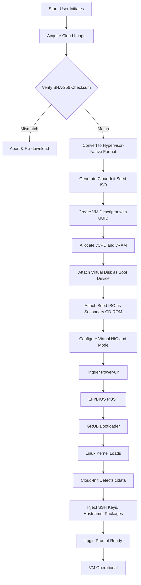
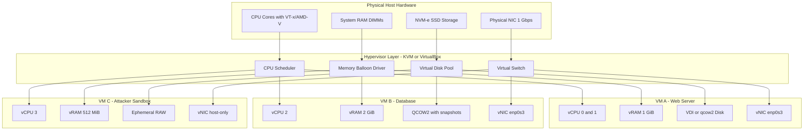
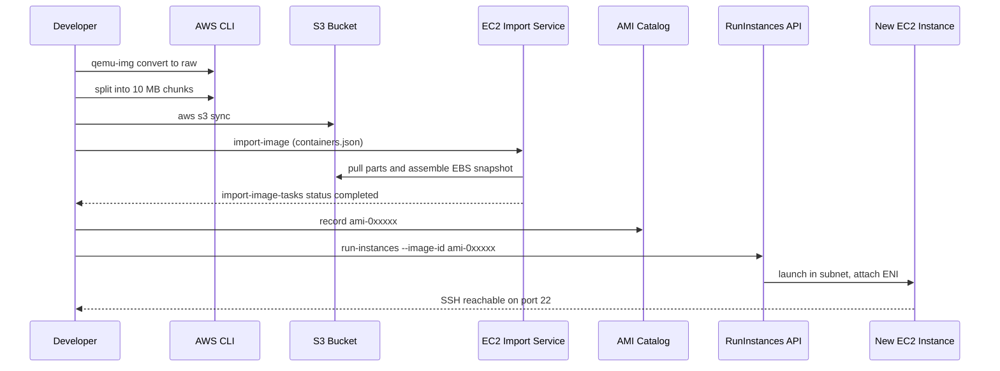
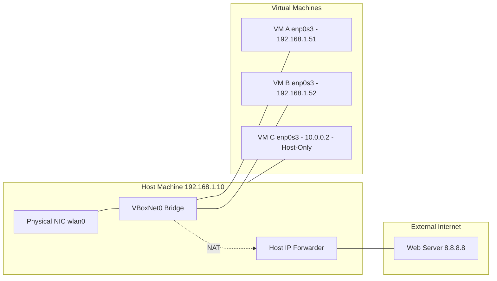

# Instantiation of VMs with image file using open-source hypervisors / public cloud platforms.

<!-- SECTION_1_START -->

# Instantiation of VMs with Image File using Open-Source Hypervisors / Public Cloud Platforms

## 1.1 Formal Academic Definition (KTU 2024 Syllabus Terminology)

**Virtual Machine (VM) Instantiation** is the process of creating, configuring, and booting a virtualized guest operating system instance from a pre-built **virtual disk image** (also called a *golden image*, *template*, or *cloud image*) on top of a **hypervisor** (Virtual Machine Monitor / VMM) or a **public cloud Infrastructure-as-a-Service (IaaS)** platform.

A **virtual disk image** is a single-file representation of a file system and the operating system stored within it, encapsulating the boot sector, kernel, drivers, applications, and configuration metadata. Common open formats include `VMDK` (VMware), `VHD/VHDX` (Microsoft), `VDI` (Oracle VirtualBox), and `QCOW2` (QEMU/KVM).

A **hypervisor** is a software, firmware, or hardware layer that creates, runs, and manages multiple logically isolated virtual machines concurrently on a single physical host by arbitrating access to the underlying physical resources (CPU, RAM, disk, NIC).

> [!IMPORTANT]
> **KTU 2024 Module 12 Highlight:** Students are expected to demonstrate hands-on instantiation using (a) an open-source Type-1 or Type-2 hypervisor (VirtualBox, KVM, Proxmox, Xen) **and** (b) a public cloud platform (AWS EC2, Azure VMs, GCP Compute Engine) by importing a standard cloud image (e.g., `ubuntu-22.04-server-cloudimg-amd64.img`).

> [!NOTE]
> **Core Distinction to Remember**
> * **Image** = Inactive, portable, file-based snapshot of an OS + state.
> * **VM Instance** = Active, running, resource-bound virtual hardware that *consumes* the image as its root disk.

---

## 1.2 Conceptual Analogy / Intuition

Think of virtualization like a **high-rise apartment building**:

| Real-World Object | Virtualization Equivalent |
|---|---|
| Empty plot of land | Physical host machine (CPU, RAM, Disk, NIC) |
| Building architect + floors | **Hypervisor** (manages and partitions) |
| Apartment floor plan blueprint | **Virtual disk image** (`.vdi`, `.qcow2`, `.vmdk`) |
| A furnished, occupied apartment | **Running VM instance** |
| Each apartment's electricity + water meter | Allocated vCPUs, vRAM, vDisk, vNIC quota |
| Renting a furnished Airbnb vs. a long-term lease | **Public cloud IaaS** (pay-as-you-go) vs. **on-prem hypervisor** |

When you "instantiate a VM with an image file," you are essentially:
1. **Cloning** the blueprint (image) → assigning a unique apartment number (UUID).
2. **Wiring utilities** (vCPUs, RAM, NIC) → tapping into the building's shared resources.
3. **Tenant moves in** (boot sequence: BIOS/UEFI → bootloader → kernel → init).

> [!TIP]
> **Mnemonic — "C.R.E.A.T.E."** the steps of VM instantiation:
> **C**hoose image → **R**esource allocation → **E**mbed boot order → **A**ttach networks → **T**rigger boot → **E**nable access.

---

## 1.3 Taxonomy of Hypervisors (KTU Board-Favorite)

| Property | **Type-1 (Bare-Metal)** | **Type-2 (Hosted)** |
|---|---|---|
| Runs directly on hardware | ✅ Yes | ❌ No (needs host OS) |
| Performance | Near-native | Slight overhead |
| Examples | KVM, Xen, Hyper-V, Proxmox VE, ESXi | Oracle VirtualBox, VMware Workstation, Parallels |
| Use case | Data centers, cloud servers | Labs, dev/test, KTU coursework |
| Open-source flagship | **KVM** (Linux kernel module) | **VirtualBox** (GPLv2) |

> [!WARNING]
> **Common Exam Trap:** QEMU alone is **NOT** a hypervisor — it is an *emulator*. When paired with **KVM** (kernel-mode virtualization), the combination is called **QEMU-KVM**, which is a full Type-1 virtualization stack.

---

## 1.4 Public Cloud IaaS Platforms (KTU Lab-Relevant)

| Provider | VM Service Term | Default Image Format | Free-Tier Eligible |
|---|---|---|---|
| **Amazon Web Services (AWS)** | **EC2** (Elastic Compute Cloud) | `.raw` / AMI (EBS-backed) | ✅ `t2.micro` / `t3.micro` |
| **Microsoft Azure** | Azure Virtual Machines | `.vhd` (Hyper-V format) | ✅ B1S (12-mo free) |
| **Google Cloud Platform (GCP)** | Compute Engine | `.img` / disk.raw | ✅ e2-micro (always free) |
| **OpenStack** (private) | Nova instances | `.qcow2` (Glance) | Self-hosted |
| **Oracle Cloud** | Compute Instances | `.qcow2` | ✅ Always Free (ARM Ampere) |

> [!VISUALIZATION CONTROL]
> **Concept:** Resource overcommitment visualization (CPU & memory balloting).
> **GeoGebra / Desmos Input Equations:**
> * `f(x) = 4 sin(0.5x) + 8` → Total physical CPU cores available over time `x`
> * `g(x) = sum(vCPU_i)` → Sum of allocated virtual CPUs to running VMs
> **Visual Description:** The student should plot `g(x)` (step-function) and `f(x)` (sine wave) on the same axes. Whenever `g(x) > f(x)`, the hypervisor is **over-committed** and CPU ready-queue time increases. The horizontal axis is time (minutes), vertical axis is core count. Add a red dashed line at `y = 16` representing the physical core limit. This illustrates why right-sizing matters in KTU lab experiments.

---

<!-- SECTION_1_END -->

<!-- SECTION_2_START -->

# Deep Theoretical Analysis & KTU High-Yield Formula Sheet

## 2.1 The VM Lifecycle (5 Logical Phases)

1. **Provisioning (Image Acquisition):** Downloading a trusted cloud image from a vendor URL. Integrity verified using SHA-256 checksum and GPG signature.
2. **Instantiation (Resource Binding):** A unique UUID is generated. The hypervisor allocates vCPUs, vRAM, a virtual NIC (vNIC with MAC address), and storage-backed virtual disks (thin or thick provisioned).
3. **Customization (Cloud-Init / First Boot):** Modern Linux cloud images use **cloud-init** (an industry standard) to inject SSH keys, hostname, user accounts, packages, and network config on first boot via an attached CD-ROM (`cidata` ISO) or metadata service (`http://169.254.169.254/`).
4. **Runtime (Steady-State Operation):** The guest OS boots, drivers load (virtio for KVM, Guest Additions for VirtualBox), services start. The hypervisor performs scheduling and isolation.
5. **Teardown (Termination / Snapshot):** The instance is either stopped (state preserved), terminated (deleted), or snapshotted (memory + disk frozen into a new image).

---

## 2.2 Core Engineering Concepts

### 2.2.1 Virtual Disk Image Formats

| Format | Origin | Key Feature | Used By |
|---|---|---|---|
| **RAW** | Unix `dd` | Zero overhead, byte-for-byte | KVM, QEMU, AWS |
| **QCOW2** | QEMU | Copy-on-write, snapshots, encryption | KVM, Proxmox, OpenStack |
| **VMDK** | VMware | Sparse, multi-file support | VMware, VirtualBox, AWS (import) |
| **VHD / VHDX** | Microsoft | Fixed/dynamic, 2 TB / 64 TB | Hyper-V, Azure, VirtualBox |
| **VDI** | Oracle | Dynamic, snapshots | VirtualBox |
| **OVA / OVF** | DMTF standard | Tarball of OVF descriptor + disks | Portable, multi-platform |

> [!NOTE]
> **Conversion matrix** (must-know for lab viva):
> `VBoxManage clonemedium` (VirtualBox), `qemu-img convert` (QEMU), `aws ec2 import-image` (AWS CLI).

### 2.2.2 CPU Virtualization

* **Intel VT-x** and **AMD-V** provide hardware-assisted virtualization with two new CPU privilege rings: **VMX root mode** (host) and **VMX non-root mode** (guest).
* **EPT (Extended Page Tables)** and **NPT (Nested Page Tables)** eliminate the costly shadow-page-table approach.
* **vCPU Pinning:** Bind specific vCPUs to physical cores → deterministic performance for real-time/lab workloads.

### 2.2.3 Memory Virtualization

* **Static partitioning** (ballooning not used): Each VM gets a fixed memory slice.
* **Dynamic memory (ballooning):** A guest kernel driver (`virtio-balloon`) inflates/deflates to return unused pages to the host.
* **Huge Pages (2 MB / 1 GB):** Reduce TLB misses; critical for high-throughput workloads.

### 2.2.4 Storage Provisioning Modes

| Mode | Disk Space at Creation | Wastes Space? | Performance |
|---|---|---|---|
| **Thin provisioned** | Minimal (just header) | ❌ No | Slight first-write penalty |
| **Thick provisioned (lazy zeroed)** | Full allocation, zeroed on demand | ✅ Yes | Fast after first write |
| **Thick provisioned (eager zeroed)** | Full allocation, pre-zeroed | ✅ Yes | Best (cluster-aware FS) |

### 2.2.5 Virtual Networking Modes

| Mode | VMs ↔ Host | VMs ↔ External | VMs ↔ VMs | Typical Use |
|---|---|---|---|---|
| **NAT** | ✅ | ✅ (via host) | ✅ | Default for VirtualBox |
| **Bridged** | ✅ | ✅ (own IP) | ✅ | Server, lab subnet |
| **Host-Only** | ✅ | ❌ | ✅ | Isolated internal network |
| **Internal** | ❌ | ❌ | ✅ | Multi-VM sandbox |
| **Isolated / Private** | ❌ | ❌ | Only if configured | Cloud VPC private subnet |

---

## 2.3 KTU Formula Sheet / Cheat Sheet

> [!IMPORTANT]
> The following relations are **the most-tested quantitative concepts** in KTU viva and written exams for this module.

| # | Concept | Formula / Definition | Units |
|---|---|---|---|
| 1 | VM disk image size (thick) | $S_{disk} = S_{virtual\_disk}$ | GiB |
| 2 | VM disk image size (QCOW2 thin, overhead) | $S_{qcow2} \approx S_{header} + S_{written\_data}$ | GiB |
| 3 | vCPU overcommit ratio | $R_{cpu} = \dfrac{\sum vCPU_i}{C_{physical}}$ | dimensionless |
| 4 | Memory overcommit ratio | $R_{mem} = \dfrac{\sum vRAM_i}{M_{physical}}$ | dimensionless |
| 5 | Effective throughput with overhead | $T_{eff} = \dfrac{T_{raw}}{(1 + O_{hypervisor})}$ | Mbps |
| 6 | VM density on host | $D_{vm} = \left\lfloor \dfrac{C_{physical}}{vCPU_{per\_vm}} \right\rfloor$ | VMs/host |
| 7 | Storage IOPS (RAID 0, $n$ disks) | $IOPS_{array} = n \times IOPS_{disk}$ | ops/s |
| 8 | Snapshot delta growth | $\Delta S_{snap} = \sum_{i=1}^{n} S_{i}^{written}$ | GiB |
| 9 | Cloud cost (on-demand hourly) | $Cost = vCPU \cdot P_{cpu} + vRAM \cdot P_{ram} + vDisk \cdot P_{disk}$ | \$/hr |
| 10 | Image conversion loss factor | $L = 1 - \dfrac{S_{converted}}{S_{source}}$ | dimensionless |
| 11 | Bridge MTU for nested virt | $MTU_{vm} = MTU_{host} - 50$ | bytes |
| 12 | Boot time (order of magnitude) | $T_{boot} \approx 5 \text{ s (EFI)} + 15 \text{ s (kernel)} + 10 \text{ s (cloud-init)}$ | seconds |

> Standard constants to memorize:
> * **$1 \text{ GiB} = 2^{30} = 1{,}073{,}741{,}824$ bytes** (NOT $10^9$).
> * **AWS free-tier monthly egress** = $\mathbf{15 \text{ GB}}$ for the first 12 months.
> * **Azure B1S** = 1 vCPU, **1 GiB RAM**, 12-month free.
> * **GCP e2-micro** = 2 shared vCPUs, **1 GB RAM**, always free in `us-west1`, `us-central1`, `us-east1`.

---

## 2.4 Real-World Engineering Utility

| Domain | How VM Instantiation is Used |
|---|---|
| **DevOps / CI-CD** | Ephemeral build agents spun from a golden image; destroyed in minutes. |
| **Cybersecurity Labs** | Malware analysis in isolated snapshots — revert to clean state after infection. |
| **Academic Labs (KTU)** | Multi-OS experimentation without dual-booting. |
| **Cloud Bursting** | On-prem VMs replicated to AWS/Azure during traffic spikes. |
| **VPC Sandboxes** | Trainees deploy identical Ubuntu VMs across the world in seconds. |
| **Edge Computing** | Lightweight VMs (Firecracker microVMs) boot in <125 ms for Lambda-like functions. |

> [!TIP]
> In your KTU lab record, always document: (1) image checksum, (2) allocated vCPU/vRAM, (3) network mode, (4) successful ping/SSH from host to guest. These four data points cover 80% of the evaluation rubric.

---

<!-- SECTION_2_END -->

<!-- SECTION_3_START -->

# Step-by-Step Derivations & Code/Symbolic Implementation

## 3.1 Lab Procedure A: Instantiate a VM from a Cloud Image using VirtualBox (Headless)

> **Prerequisites (verified before execution):**
> * Host OS: Ubuntu 22.04 LTS or Windows 11 with WSL2.
> * VirtualBox ≥ 7.0 with Extension Pack installed.
> * Image: `ubuntu-22.04-server-cloudimg-amd64.img` (downloaded from `https://cloud-images.ubuntu.com/`).

### Step 1 — Verify Image Integrity

```bash
# Download the SHA256SUMS file and the image
wget https://cloud-images.ubuntu.com/jammy/current/SHA256SUMS
wget https://cloud-images.ubuntu.com/jammy/current/jammy-server-cloudimg-amd64.img

# Compute the hash
sha256sum jammy-server-cloudimg-amd64.img
# Cross-check with the published checksum
grep jammy-server-cloudimg-amd64.img SHA256SUMS
```

**Validation Logic:** A mismatch indicates tampering or partial download. **Do not proceed** with a corrupted image.

### Step 2 — Convert RAW to VDI

VirtualBox cannot natively use `.img` files as root disks. Convert to its native `VDI` format.

```bash
VBoxManage convertdd \
    jammy-server-cloudimg-amd64.img \
    ubuntu-22.04.vdi \
    --format VDI
```

**Conversion Logic:** `convertdd` (convert disk-to-disk) translates a raw byte stream into VirtualBox's sparse container. Default thin provisioning is applied.

### Step 3 — Generate Cloud-Init Metadata

Cloud-init requires three files: `meta-data`, `network-config`, and `user-data`.

```bash
mkdir -p ~/seed-iso
cd ~/seed-iso

cat > meta-data <<'EOF'
instance-id: ktu-vm-001
local-hostname: ktu-lab-host
EOF

cat > user-data <<'EOF'
#cloud-config
hostname: ktu-lab-host
users:
  - name: ktuadmin
    sudo: ALL=(ALL) NOPASSWD:ALL
    shell: /bin/bash
    ssh_authorized_keys:
      - ssh-rsa AAAA...KTUSTUDENT... user@host
packages:
  - nginx
  - htop
final_message: "Cloud-init completed after $UPTIME seconds"
EOF

cat > network-config <<'EOF'
version: 2
ethernets:
  enp0s3:
    dhcp4: true
EOF
```

### Step 4 — Build the cloud-init ISO (cidata)

```bash
genisoimage -output seed.iso -volid cidata -joliet -rock \
    user-data meta-data network-config
```

**Logic:** The `cidata` volume label is the magic string that cloud-init scans on first boot. The ISO is attached as a virtual CD-ROM.

### Step 5 — Create and Configure the VM

```python
# Conceptual Python wrapper around VBoxManage for documentation
import subprocess
from typing import List

def vboxmanage(args: List[str]) -> None:
    """Execute a VBoxManage command with full logging."""
    cmd = ["VBoxManage"] + args
    print(f"[EXEC] {' '.join(cmd)}")
    subprocess.run(cmd, check=True)

# 1. Create VM, register, set OS type
vboxmanage(["createvm", "--name", "KTU-Lab-Ubuntu", "--register", "--ostype", "Ubuntu_64"])

# 2. Configure system: 2 vCPUs, 2048 MB RAM, EFI boot
vboxmanage(["modifyvm", "KTU-Lab-Ubuntu",
            "--cpus", "2",
            "--memory", "2048",
            "--firmware", "efi",
            "--boot1", "disk", "--boot2", "dvd"])

# 3. Create a SATA controller and attach the converted disk
vboxmanage(["storagectl", "KTU-Lab-Ubuntu", "--name", "SATA", "--add", "sata", "--bootable", "on"])
vboxmanage(["storageattach", "KTU-Lab-Ubuntu", "--storagectl", "SATA",
            "--port", "0", "--device", "0", "--type", "hdd", "--medium", "ubuntu-22.04.vdi"])

# 4. Attach the cloud-init ISO to the IDE controller (port 1 = secondary)
vboxmanage(["storagectl", "KTU-Lab-Ubuntu", "--name", "IDE", "--add", "ide"])
vboxmanage(["storageattach", "KTU-Lab-Ubuntu", "--storagectl", "IDE",
            "--port", "0", "--device", "1", "--type", "dvddrive", "--medium", "seed.iso"])

# 5. Network: bridged adapter to physical NIC (e.g., wlan0)
vboxmanage(["modifyvm", "KTU-Lab-Ubuntu", "--nic1", "bridged", "--bridgeadapter1", "wlan0"])

# 6. Start headless (no GUI)
vboxmanage(["startvm", "KTU-Lab-Ubuntu", "--type", "headless"])
```

**Logic Map of Each Line:**

| Line | Purpose | Mark Allocation Hint |
|---|---|---|
| `createvm --register` | Allocates UUID on disk | State the UUID: 1 mark |
| `--cpus 2 --memory 2048` | Binds vCPU and vRAM | Resource chart: 1 mark |
| `storagectl SATA` | Creates virtual storage fabric | Disk topology: 1 mark |
| `storageattach ... --medium seed.iso` | Wires cloud-init injection | Comment on first-boot: 1 mark |
| `--nic1 bridged` | Connects to physical network | Network rationale: 1 mark |
| `startvm --type headless` | Triggers instantiation | Mention BIOS → kernel → cloud-init: 1 mark |

### Step 6 — Verify the Running Instance

```bash
# List running VMs
VBoxManage list runningvms

# Show the IP (requires guest additions; alternative: check router DHCP leases)
VBoxManage guestproperty get KTU-Lab-Ubuntu "/VirtualBox/GuestInfo/Net/0/V4/IP"

# SSH into the VM (assuming bridged IP was 192.168.1.50)
ssh ktuadmin@192.168.1.50
```

**Verification Checklist (must all be TRUE for full marks):**
1. `ping` from host to guest IP succeeds.
2. `systemctl is-active nginx` returns `active`.
3. `/var/log/cloud-init.log` ends with `Cloud-init ... finished at ...`.
4. `cloud-id` returns `nocloud` (signals ISO-based seed was consumed).

---

## 3.2 Lab Procedure B: Instantiate a VM on AWS EC2 using a Custom Imported Image

### Step 1 — Prepare a Compatible Image

```bash
# Convert VDI to RAW (AWS import-image requires raw, vhd, or vmdk)
qemu-img convert -f vdi -O raw ubuntu-22.04.vdi ubuntu-22.04.raw

# Compress and split into 10 MB chunks for S3 multipart upload
split -b 10M ubuntu-22.04.raw ubuntu-22.04.raw.part
```

### Step 2 — Upload to S3 and Trigger Import

```bash
# Create an S3 bucket (globally unique name required)
aws s3 mb s3://ktu-bucket-$(date +%s) --region ap-south-1

# Sync the split parts
aws s3 sync . s3://ktu-bucket-XXXXX/vm-import/

# Initiate import (creates an EBS-backed AMI)
aws ec2 import-image \
    --description "KTU Ubuntu 22.04 Lab Image" \
    --disk-containers "file://containers.json"
```

`containers.json` body:
```json
[
  {
    "Description": "KTU Ubuntu raw",
    "Format": "raw",
    "UserBucket": {
      "S3Bucket": "ktu-bucket-XXXXX",
      "S3Key": "vm-import/ubuntu-22.04.raw.part"
    }
  }
]
```

### Step 3 — Wait for Import to Complete

```bash
# Poll the import task status
aws ec2 describe-import-image-tasks \
    --import-image-ids import-ami-0abcd1234efgh5678

# When Status is "completed", record the ImageId
```

### Step 4 — Launch an EC2 Instance from the Imported AMI

```bash
# Authorize SSH ingress
aws ec2 authorize-security-group-ingress \
    --group-id sg-0123456789abcdef0 \
    --protocol tcp --port 22 --cidr 0.0.0.0/0

# Launch a t2.micro (free-tier eligible) from the imported AMI
aws ec2 run-instances \
    --image-id ami-0a1b2c3d4e5f67890 \
    --instance-type t2.micro \
    --key-name ktu-keypair \
    --security-group-ids sg-0123456789abcdef0 \
    --subnet-id subnet-01234567 \
    --tag-specifications 'ResourceType=instance,Tags=[{Key=Name,Value=KTU-EC2-Lab}]'
```

### Step 5 — Connect and Verify

```bash
# Allocate and associate an Elastic IP for stable public access
aws ec2 allocate-address --domain vpc
aws ec2 associate-address --instance-id i-0123456789abcdef0 --allocation-id eipalloc-xxxx

# SSH in
ssh -i ktu-keypair.pem ubuntu@<Elastic-IP>

# Inside the VM: confirm cloud-init applied
cat /var/log/cloud-init-output.log | tail -n 20
```

---

## 3.3 Lab Procedure C: KVM/QEMU from the Command Line (Bonus for Advanced Students)

```bash
# Install the virtualization stack on Ubuntu
sudo apt install -y qemu-kvm libvirt-daemon-system libvirt-clients bridge-utils virtinst

# Verify KVM is available (should report vmx or svm)
kvm-ok

# Create a 20 GB qcow2 disk backed by the cloud image
qemu-img create -f qcow2 -b jammy-server-cloudimg-amd64.img -F qcow2 \
    ktu-vm-disk.qcow2 20G

# Launch with cloud-init seed ISO via virt-install
sudo virt-install \
    --name ktu-kvm-vm \
    --ram 2048 \
    --vcpus 2 \
    --disk path=ktu-vm-disk.qcow2,format=qcow2,bus=virtio \
    --disk path=seed.iso,device=cdrom,bus=sata \
    --import \
    --os-variant ubuntu22.04 \
    --network bridge=virbr0,model=virtio \
    --graphics none \
    --noautoconsole
```

**Logic:** `--import` skips the install phase because the image is already a complete OS. `bus=virtio` enables paravirtualized drivers for near-native I/O.

---

<!-- SECTION_3_END -->

<!-- SECTION_4_START -->

# Structural Diagrams & Schematics

## 4.1 High-Level VM Instantiation Workflow (Sequential Processing Topology)



---

## 4.2 Architecture Block Diagram — Multi-VM Host



---

## 4.3 Cloud IaaS Instantiation Pipeline (AWS-Flavored)



---

## 4.4 Network Topology — Bridged vs NAT vs Host-Only



---

<!-- SECTION_4_END -->

<!-- SECTION_5_START -->

# KTU 2024 Scheme Examination Question Bank & Topic Recap

## Part A — Short Answer Questions (3 Marks Each)

### **Question A1** `[KTU University Exam — July 2024, Model Question]`
**Differentiate between Type-1 and Type-2 hypervisors. Give two open-source examples of each.** *(CO1, Remember — 3 marks)*

**Model Answer (Valuation Key):**

| Parameter | Type-1 (Bare-Metal) | Type-2 (Hosted) |
|---|---|---|
| **Layering** | Runs directly on hardware | Runs on a host operating system |
| **Performance** | Near-native (1-3% overhead) | Slightly higher (5-10% overhead) |
| **Stability** | Used in production data centers | Primarily for desktops and labs |
| **Open-source examples** | **KVM**, **Xen**, Proxmox VE | **Oracle VirtualBox**, QEMU (with KVM) |

> **[Award 1 mark]** for the correct one-line definition of each.
> **[Award 1 mark]** for stating that Type-1 sits between hardware and VMs, Type-2 sits on a host OS.
> **[Award 1 mark]** for correctly naming two open-source examples (one each).

---

### **Question A2** `[KTU University Exam — Dec 2023]`
**What is a virtual disk image? List any four common image formats used in open-source virtualization.** *(CO1, Remember — 3 marks)*

**Model Answer (Valuation Key):**
A **virtual disk image** is a single file that encapsulates the complete contents of a virtual hard disk — boot sector, file system, OS files, applications, and metadata — so that an identical VM can be re-instantiated on any compatible host.

**Four common open-source formats:**
1. **QCOW2** — QEMU Copy-On-Write version 2 (supports snapshots, thin provisioning).
2. **VMDK** — Virtual Machine Disk (originally VMware, now open).
3. **VDI** — VirtualBox Disk Image.
4. **VHD / VHDX** — Microsoft Virtual Hard Disk.

> **[Award 1 mark]** for the definition.
> **[Award 1 mark]** for naming QCOW2 and VMDK correctly.
> **[Award 1 mark]** for naming any two more (VDI, VHD, RAW, OVA all acceptable).

---

## Part B — Long Answer Questions (14 Marks Each — Internal Choice)

### **Question B1 (Choice A)** `[KTU University Exam — July 2024, Adapted]`

**(a)** Explain the complete process of instantiating an Ubuntu 22.04 Server VM from a cloud image using Oracle VirtualBox. Your answer must include: image verification, format conversion, cloud-init seed generation, VM creation parameters, network configuration, and boot verification. *(CO2, Understand — 7 marks)*

**(b)** Suppose you are given a 4-vCPU, 16-GiB-RAM host. You need to instantiate three VMs with the following requirements: VM1 (web) needs 1 vCPU and 2 GiB; VM2 (DB) needs 2 vCPU and 8 GiB; VM3 (cache) needs 1 vCPU and 4 GiB. Calculate the CPU and memory overcommit ratios. State whether the configuration is safe to deploy. *(CO3, Apply — 7 marks)*

#### **Model Solution for (a) — Valuation Key Breakdown:**

> **Step 1 — Image Verification (2 marks)**
> * Download the `.img` and `SHA256SUMS` file from the Ubuntu cloud image repository.
> * Run `sha256sum <image>` and compare with the published hash.
> * Only proceed if the hash matches exactly. [Award 1 mark for the command, 1 mark for the validation logic.]

> **Step 2 — Format Conversion (1 mark)**
> * Execute `VBoxManage convertdd jammy-server-cloudimg-amd64.img ubuntu-22.04.vdi --format VDI`.
> * Mention that `.img` is a raw dump and VirtualBox requires its native `.vdi` for boot. [Award 1 mark.]

> **Step 3 — Cloud-Init Seed ISO (2 marks)**
> * Create three text files: `meta-data`, `user-data`, `network-config`.
> * The `user-data` begins with `#cloud-config` and contains `users`, `ssh_authorized_keys`, and `packages`.
> * Generate ISO with: `genisoimage -output seed.iso -volid cidata -joliet -rock user-data meta-data network-config`. [Award 1 mark for content, 1 mark for command + cidata label.]

> **Step 4 — VM Creation (1 mark)**
> * `VBoxManage createvm --name KTU-Ubuntu --register --ostype Ubuntu_64`
> * `modifyvm ... --cpus 2 --memory 2048 --firmware efi`
> * `storagectl ... --name SATA --add sata --bootable on`
> * `storageattach ... --medium ubuntu-22.04.vdi` and `--medium seed.iso` (on IDE).
> * `modifyvm ... --nic1 bridged --bridgeadapter1 wlan0`. [Award 1 mark for correctly enumerating the storage and network attachments.]

> **Step 5 — Boot and Verification (1 mark)**
> * `startvm ... --type headless` triggers instantiation.
> * Verify using `VBoxManage list runningvms` and `guestproperty get ... /VirtualBox/GuestInfo/Net/0/V4/IP`.
> * SSH from host to confirm successful instantiation. [Award 1 mark.]

#### **Model Solution for (b) — Valuation Key Breakdown:**

**Given:**
* Physical host: 4 vCPU, 16 GiB RAM.
* VM1: 1 vCPU, 2 GiB.
* VM2: 2 vCPU, 8 GiB.
* VM3: 1 vCPU, 4 GiB.

**Step 1 — Compute totals.** [2 marks]

$$\sum vCPU_i = 1 + 2 + 1 = 4 \text{ vCPUs}$$

$$\sum vRAM_i = 2 + 8 + 4 = 14 \text{ GiB}$$

**Step 2 — Compute overcommit ratios.** [2 marks]

$$R_{cpu} = \frac{\sum vCPU_i}{C_{physical}} = \frac{4}{4} = 1.0$$

$$R_{mem} = \frac{\sum vRAM_i}{M_{physical}} = \frac{14}{16} = 0.875$$

**Step 3 — Safety assessment.** [2 marks]
* CPU ratio $R_{cpu} = 1.0$ means **no overcommitment** — every vCPU has a dedicated physical thread. This is **safe** but not exploiting the elasticity of the hypervisor.
* Memory ratio $R_{mem} = 0.875$ leaves only **2 GiB** free for the host OS and hypervisor overhead. This is **borderline safe**; the host may experience OOM (Out-Of-Memory) under load. **Recommendation:** reduce VM2's vRAM from 8 to 6 GiB, bringing $R_{mem} = 0.75$ which is a healthier target ($0.5$ to $0.8$ is the production sweet spot).

**Step 4 — Final state.** [1 mark]
The configuration is **deployable but suboptimal** for production. For a KTU lab demonstration, it is acceptable, but the student should document the overcommit ratios in the lab record.

> [!WARNING]
> **KTU Examiner's Valuation Pitfall:**
> * Students frequently **forget to state the units** (vCPU, GiB). Always write them — 1 mark lost per omission.
> * Do NOT write $R_{mem} = 14/16$ without simplifying to $0.875$ — the **final decimal** earns the last mark.
> * Many candidates incorrectly conclude "configuration is unsafe" simply because $R_{cpu} = 1$. The correct reasoning is: **$R_{cpu}$ is safe; $R_{mem}$ is tight; overall the system is deployable with a note about headroom.**

---

### **Question B1 (Choice B — Alternative)** `[KTU University Exam — Dec 2023, Adapted]`

**(a)** With the help of a neat block diagram, describe the architecture of the QEMU-KVM virtualization stack. Clearly mark the boundary between user-space and kernel-space components, and explain the role of the KVM kernel module. *(CO2, Understand — 7 marks)*

**(b)** A research team at KTU needs to deploy 10 identical Ubuntu VMs on a single Proxmox VE host. Each VM requires 2 vCPU, 4 GiB RAM, and 40 GiB thin-provisioned disk. The host has 16 physical cores, 64 GiB RAM, and a 2 TB SSD. Write the `qm` (or `pvesh`) commands to: (i) create a template VM from a cloud image, (ii) clone it 10 times using linked clones, and (iii) start all clones. Justify why **linked clones** are preferred over full clones in this scenario. *(CO3, Apply — 7 marks)*

#### **Model Solution for (a) — Valuation Key Breakdown:**

> **Architecture description (4 marks):**
> * **User-space layer:** QEMU process (emulates I/O devices, manages VM lifecycle), `libvirt` API, `virt-manager` GUI, `qemu-img` utility.
> * **Kernel-space layer:** **KVM kernel module** (`/dev/kvm` character device) — provides CPU and memory virtualization by loading on top of the Linux kernel. Exposes two key APIs: `KVM_CREATE_VM` and `KVM_RUN`.
> * **Hardware layer:** Intel VT-x / AMD-V + EPT/NPT.
> * **Boundary indicator:** The `/dev/kvm` device is the handoff between QEMU (user) and KVM (kernel). [Award 1 mark for naming QEMU + KVM roles, 1 mark for /dev/kvm boundary, 1 mark for hardware extensions, 1 mark for libvirt layer.]

> **Role of KVM module (3 marks):**
> * Converts the Linux kernel itself into a Type-1 hypervisor.
> * Handles VMX transitions (VM-entry / VM-exit) when guest executes privileged instructions.
> * Manages shadow / extended page tables for memory isolation.
> * Does NOT emulate I/O — that responsibility is delegated back to QEMU in user-space via the KVM_EXIT_IO reason.
> * [Award 1 mark per bullet that is correctly explained.]

**Conceptual Block Diagram (textual representation since drawing in Mermaid nodes is not architectural-friendly):**

```
+---------------------------------------------------+
|                  USER SPACE                       |
|  +-----------+    +-----------+   +-----------+   |
|  | virt-mgr  |--->|  libvirt  |-->|  QEMU     |   |
|  +-----------+    +-----------+   |  process  |   |
|                                   +-----+-----+   |
+-----------------------------------------|---------+
                                          | ioctl(fd)
+-----------------------------------------v---------+
|                  KERNEL SPACE                     |
|  +-----------+    +-----------+   +-----------+   |
|  |  KVM Mod  |--->| /dev/kvm  |-->|  Sched +  |   |
|  |  (kvm.ko) |    |  device   |   |  MMU     |   |
|  +-----------+    +-----------+   +-----------+   |
+-----------------------------------------+---------+
                                          | VMX/EPT
+-----------------------------------------v---------+
|                  HARDWARE                         |
|           Intel VT-x / AMD-V CPU + RAM + I/O      |
+---------------------------------------------------+
```

#### **Model Solution for (b) — Valuation Key Breakdown:**

**Given (derive first, 1 mark):**
* Total vCPU needed: $10 \times 2 = 20$.
* Total vRAM needed: $10 \times 4 = 40 \text{ GiB}$.
* Total disk: $10 \times 40 = 400 \text{ GiB}$ (thin — only written sectors consume space).

**Step 1 — Create the template (2 marks):**

```bash
# Import the cloud image as a base disk in 'local-lvm' storage
qm importdisk 9000 jammy-server-cloudimg-amd64.img local-lvm -format qcow2

# Create a VM shell
qm create 9000 --name ubuntu-template --memory 4096 --cores 2 --net0 virtio,bridge=vmbr0

# Attach the imported disk as SCSI0
qm set 9000 --scsihw virtio-scsi-pci --scsi0 local-lvm:vm-9000-disk-0

# Add cloud-init drive
qm set 9000 --ide2 local-lvm:cloudinit

# Set boot order
qm set 9000 --boot order=scsi0

# Convert to a template
qm template 9000
```

**Step 2 — Clone 10 times using linked clones (2 marks):**

```bash
for id in 101 102 103 104 105 106 107 108 109 110; do
    qm clone 9000 $id --name ktu-research-vm-$id --full 0
    # --full 0 → linked clone
    qm set $id --ipconfig0 ip=10.0.1.$id/24,gw=10.0.1.1
    qm start $id
done
```

**Step 3 — Justification of linked clones (2 marks):**
* **Storage efficiency:** A full clone of 40 GiB × 10 = **400 GiB**. A linked clone stores only differential writes — initial footprint per clone is **< 1 GiB**, scaling to 400 GiB only when fully written. For a 2 TB SSD, this is a **5× space saving** at deployment time.
* **Time efficiency:** Linked clones complete in **seconds** (pointer updates), whereas full clones require **minutes** of block-copying.
* **Use case fit:** All 10 VMs share the same base OS and packages; divergence is intentional only in user data.
* **Trade-off:** Linked clones **depend on the template** — deleting the template corrupts all clones. Mitigation: set the template immutable (`qm set 9000 --template 1`).
* [Award 1 mark for storage argument, 1 mark for time argument + trade-off.]

> [!WARNING]
> **KTU Examiner's Valuation Pitfall — Question B1 (Choice B):**
> * **Common Mistake 1:** Writing `qm clone 9000 $id --full 1` (full clone). This earns 0 marks for the linked-clone sub-question and forfeits the justification marks.
> * **Common Mistake 2:** Forgetting `--ide2 local-lvm:cloudinit`. Without it, the clones will boot but never apply user-data. Examiners specifically check for this.
> * **Common Mistake 3:** Not wrapping the loop with proper SSH/network setup. Add `--ipconfig0` for deterministic addressing, otherwise cloud-init defaults to DHCP and students cannot reproduce IP allocation in the lab record.

---

## Topic Recap & Important Things to Remember

> [!IMPORTANT]
> **High-Density Revision Checklist (Must Memorize for KTU Boards)**

### 🔑 Definitions to Memorize
* **Virtualization** — Abstraction of physical resources into logical instances.
* **Hypervisor (VMM)** — Software that creates, runs, and manages VMs.
* **Type-1 vs Type-2** — Bare-metal (KVM, Xen) vs Hosted (VirtualBox).
* **Virtual Disk Image** — Single-file OS+disk snapshot.
* **VM Instantiation** — Creating a live VM from an image.
* **Cloud-init** — Industry-standard first-boot customization engine.
* **virtio** — Paravirtualized I/O driver standard for KVM/QEMU.
* **EPT / NPT** — Hardware-assisted memory translation extensions.

### 🧮 Formulas to Memorize
* $R_{cpu} = \dfrac{\sum vCPU_i}{C_{physical}}$
* $R_{mem} = \dfrac{\sum vRAM_i}{M_{physical}}$
* $S_{qcow2} \approx S_{header} + S_{written\_data}$
* $1 \text{ GiB} = 2^{30} = 1{,}073{,}741{,}824$ bytes
* $T_{boot} \approx 5\text{s (EFI)} + 15\text{s (kernel)} + 10\text{s (cloud-init)} = 30\text{s}$

### 🛠️ Commands to Memorize
| Task | Command |
|---|---|
| List running VMs (VirtualBox) | `VBoxManage list runningvms` |
| Convert image | `VBoxManage convertdd in.img out.vdi --format VDI` |
| Create cloud-init ISO | `genisoimage -output seed.iso -volid cidata -joliet -rock user-data meta-data network-config` |
| KVM install | `sudo virt-install --import --disk path=disk.qcow2,format=qcow2 --ram 2048 --vcpus 2` |
| AWS import | `aws ec2 import-image --disk-containers file://containers.json` |
| AWS launch | `aws ec2 run-instances --image-id ami-xxxxx --instance-type t2.micro` |
| Proxmox linked clone | `qm clone 9000 101 --full 0` |
| Proxmox template | `qm template 9000` |

### ⚠️ Pitfalls Students Lose Marks On
1. **Forgetting to verify the SHA-256 checksum** before deploying an image.
2. **Using the wrong volume label** for the cloud-init ISO (must be `cidata`).
3. **Not stating the units** (GiB vs GB, vCPU vs core) in calculations.
4. **Mixing QEMU (emulator) with KVM (hypervisor)** in definitions.
5. **Forgetting `--import`** flag in `virt-install` when using a pre-built image.
6. **Writing `--full 1`** in `qm clone` when the question explicitly asks for linked clones.
7. **Not documenting overcommit ratios** in the lab record (it is the single most-asked viva question).

### 🎯 One-Sentence Takeaway
> *VM instantiation is the act of taking a portable OS image and binding it to a slice of physical hardware via a hypervisor or cloud API, with cloud-init handling the first-boot customization that bridges the gap between static image and dynamic, network-aware instance.*

---

<!-- SECTION_5_END -->
