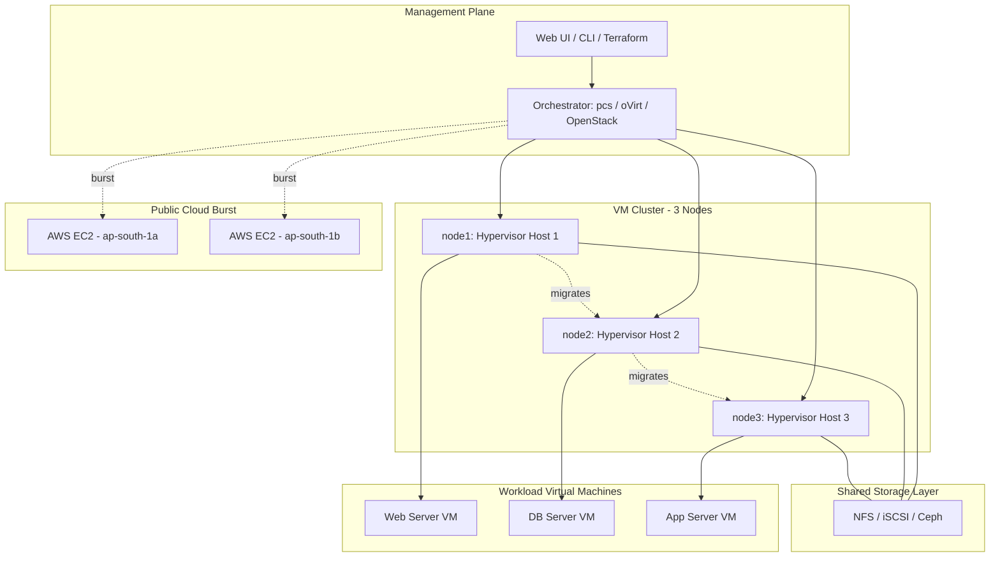
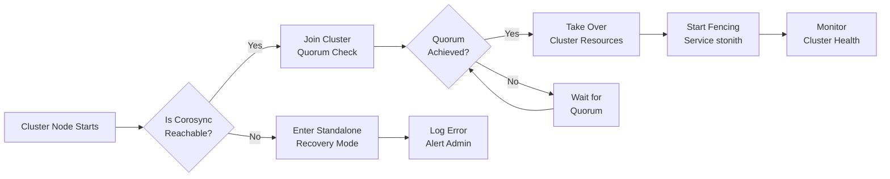
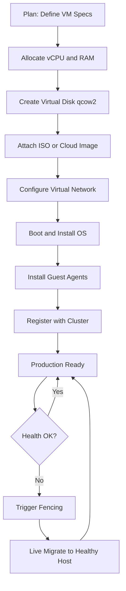

# Virtual machine Cluster set up using open-source hypervisors / public cloud platforms.

<!-- SECTION_1_START -->
# Virtual Machine Cluster Setup Using Open-Source Hypervisors and Public Cloud Platforms

> [!NOTE]
> **KTU 2024 Scheme — SYSTEMS LAB (PCCSL607)**
> **Module 13 | Topic:** Virtual Machine Cluster Setup Using Open-Source Hypervisors / Public Cloud Platforms
> **Focus:** Practical cluster provisioning, hypervisor configuration, and distributed VM orchestration.

## 1.1 Core Technical Definition

A **Virtual Machine (VM) Cluster** is a tightly integrated collection of two or more virtual machines (guest operating systems) running on one or more physical hosts (hypervisors), interconnected through a virtual or physical network so that they collectively deliver **high availability (HA)**, **load balancing (LB)**, and **horizontal scalability** for production workloads.

> [!IMPORTANT]
> **Hypervisor:** A hypervisor (also called a Virtual Machine Monitor, VMM) is a piece of system-resident software, firmware, or hardware that creates, runs, and manages one or more virtual machines by abstracting the underlying physical hardware resources (CPU, RAM, Storage, NIC) and presenting them as logical, isolated computing environments to the guest operating systems.

In KTU 2024 terminology, the topic spans two deployment philosophies:
1. **On-Premise Open-Source Hypervisor Cluster** — Using KVM/QEMU, VirtualBox, Proxmox VE, Xen, or oVirt.
2. **Public Cloud Cluster** — Provisioning clustered VMs on AWS EC2, Google Cloud Compute Engine, or Microsoft Azure VMs.

| Term | Formal Definition |
|---|---|
| **Host Machine** | The physical server that runs the hypervisor layer. |
| **Guest Machine** | The virtualized OS instance that consumes abstracted hardware. |
| **vCPU** | A virtual central processing unit assigned to a guest VM. |
| **Hypervisor** | Software/firmware that creates and runs virtual machines. |
| **Cluster** | A group of hosts working together as a single logical system. |
| **Live Migration** | The process of moving a running VM from one host to another with zero downtime. |
| **Fencing** | A mechanism to isolate a malfunctioning node so it does not corrupt shared cluster state. |

## 1.2 Conceptual Analogy — The "Apartment Building" Model

Imagine a large **apartment building** (the **physical server / host**). The **building infrastructure** — water lines, electricity wiring, parking space, lifts, and structural walls — corresponds to the **physical hardware** (CPU cores, RAM modules, disk bays, NIC ports). The **building management office** is the **hypervisor**: it allocates specific amounts of electricity, water, and space to each tenant based on a signed contract.

Each **apartment** is a **virtual machine (guest OS)**. Tenants (applications) inside their apartments cannot see or disturb other tenants; they just enjoy their allocated resources. Now imagine **multiple such buildings connected by a private road** so that resources (electricity, water) can be routed automatically when one building fails — that is a **VM cluster with high availability**.

| Real-World Object | Virtualization Counterpart |
|---|---|
| Apartment Building | Physical Host Server |
| Building Management Office | Hypervisor (VMM) |
| Apartment | Virtual Machine |
| Tenant | Application / Service |
| Building Foundation | Host OS / Bare Metal |
| Private Connecting Road | Virtual LAN / Bridge Network |
| Building Watchman | Fencing / STONITH Mechanism |

> [!TIP]
> **Memory Aid:** Just remember the acronym **HGC** — **H**ypervisor allocates resources, **G**uest consumes them, **C**luster binds multiple hosts together for resilience.

## 1.3 Standard Metrics and Constants

- **Default Cluster Heartbeat Interval:** **2 seconds** (default in Corosync / Pacemaker).
- **Standard VM Memory Granularity:** **4 KiB pages** (Linux default huge page size: **2 MiB**).
- **Public Cloud SLA Availability:** AWS EC2 Single-AZ = **99.95%**, Multi-AZ = **99.99%**.
- **Virtual NIC MTU (default):** **1500 bytes** (Jumbo Frames: up to **9000 bytes**).
- **Recommended Minimum Cluster Size:** **3 nodes** (to avoid split-brain via quorum voting).

> [!IMPORTANT]
> **Public Cloud Cluster Definition (KTU 2024 Module 13):**
> A *public cloud VM cluster* is a logical group of compute instances (EC2 / GCE / Azure VM) launched across multiple **Availability Zones (AZs)** or **regions**, orchestrated through APIs or Infrastructure-as-Code (IaC) tools such as Terraform or Ansible, to deliver a fault-tolerant, elastic compute fabric.

## 1.4 GeoGebra / Topology Visualization

> [!VISUALIZATION CONTROL]
> **Concept:** Two-Node VM Cluster with Shared Storage and Heartbeat Network
> **GeoGebra / Desmos Input Points (in unit square, scaled):**
>
> - `A = (0.2, 0.7)` → Node 1 (Hypervisor Host 1)
> - `B = (0.8, 0.7)` → Node 2 (Hypervisor Host 2)
> - `C = (0.5, 0.3)` → Shared Storage / SAN
> - `L1 = Line(A, B)` → Cluster Synchronization Link
> - `L2 = Line(A, C)` and `L3 = Line(B, C)` → Storage Fabric
>
> **Visual Description:** Two hypervisor hosts at the top, sharing a common storage target at the bottom. The line between the hosts represents the heartbeat/corosync link. The two diagonal lines represent iSCSI / NFS / Ceph storage fabric. This geometric shape (a triangle) is the canonical **HA cluster topology**.

---

<!-- SECTION_1_END -->

<!-- SECTION_2_START -->
# Deep Theoretical Analysis & KTU High-Yield Formula Sheet

## 2.1 Taxonomy of Hypervisors

The KTU 2024 syllabus categorizes hypervisors into two fundamental classes. Mastering this taxonomy is essential because cluster behaviour changes drastically between the two.

| Property | Type-1 Hypervisor (Bare-Metal) | Type-2 Hypervisor (Hosted) |
|---|---|---|
| **Execution Layer** | Runs directly on hardware | Runs inside a host operating system |
| **Performance** | Near-native (~95–98% of bare metal) | Reduced (80–90% due to host OS overhead) |
| **Typical Use-Case** | Production data centers, cloud backends | Labs, developer workstations, KTU lab sessions |
| **Open-Source Examples** | **KVM, Xen, Proxmox VE, oVirt, RHEV** | **VirtualBox, GNOME Boxes, QEMU** |
| **Cluster-Ready** | ✅ Yes (built-in HA features) | ⚠️ Limited (requires external orchestration) |
| **Boot Complexity** | Boots like an OS kernel | Installed as an application |

> [!IMPORTANT]
> **KVM** is technically a Type-1 hypervisor because it ships as a Linux kernel module. When paired with **QEMU** (the hardware emulator), it is called **KVM-QEMU** or simply **QEMU/KVM** — the most widely deployed open-source virtualization stack on the planet (used by AWS, GCP, OpenStack, and Proxmox).

## 2.2 Clustering Topologies in Virtualization

A VM cluster is not just a set of running VMs. It is a **logical contract** between the underlying infrastructure and the orchestration layer. KTU Module 13 expects students to recognize the following canonical topologies:

### A. High-Availability (HA) Cluster
Goal: Zero-downtime failover. If Host A crashes, the VMs running on it are automatically restarted on Host B (or live-migrated within seconds).
**Required Components:**
- Shared Storage (NFS, iSCSI, Ceph, GlusterFS).
- Cluster Messaging Layer (Corosync, Heartbeat).
- Resource Manager (Pacemaker, Corosync-Qdevice).
- Fencing Agent (IPMI, iLO, DRAC, or watchdog-based software fencing).

### B. Load-Balancing / Compute Cluster
Goal: Distribute workload across multiple VMs.
**Implementation:** HAProxy + Keepalived, or cloud-native load balancers (AWS ELB, GCP LB).

### C. Hybrid Cloud Burst Cluster
Goal: Extend on-premise capacity by bursting into a public cloud (AWS Outposts, Azure Arc, GCP Anthos).
This is the most **exam-relevant** modern topology for KTU 2024.

## 2.3 Open-Source Hypervisors — Comparative Matrix

| Hypervisor | Type | License | Cluster Support | Best For | KTU Lab Status |
|---|---|---|---|---|---|
| **KVM/QEMU** | Type-1 | GPL v2 | Via Corosync/Pacemaker, oVirt, OpenStack | Enterprise data center | ⭐⭐⭐⭐⭐ |
| **Proxmox VE** | Type-1 | AGPL v3 | Native (built-in Corosync) | KTU labs and SMBs | ⭐⭐⭐⭐⭐ |
| **Xen** | Type-1 | GPL v2 | Via XenServer / XAPI | AWS legacy, research | ⭐⭐⭐ |
| **oVirt** | Type-1 | Apache 2.0 | Native (oVirt Engine) | Red Hat ecosystem | ⭐⭐⭐ |
| **VirtualBox** | Type-2 | GPL v2 + Personal Use | ❌ None (no live migration) | Student desktop labs | ⭐⭐⭐⭐ |

## 2.4 Public Cloud Platforms — Comparative Matrix

| Feature | AWS EC2 | GCP Compute Engine | Azure Virtual Machines |
|---|---|---|---|
| **Cluster Service** | EC2 Auto Scaling Groups, EKS | Managed Instance Groups (MIG), GKE | VM Scale Sets, AKS |
| **Multi-AZ HA** | ✅ Native | ✅ Native | ✅ Availability Sets / Zones |
| **Free Tier** | t2.micro (750 hrs/month, 12 months) | e2-micro (always free) | B1S (12 months free) |
| **Live Migration** | AWS internal | ✅ Yes (during host maintenance) | ✅ Yes (Azure Planned Maintenance) |
| **IaC Tooling** | Terraform, CloudFormation, Ansible | Terraform, Deployment Manager, Ansible | Terraform, ARM Templates, Bicep, Ansible |
| **Region Count (2024)** | 33+ | 40+ | 60+ |

> [!TIP]
> **For KTU Lab Exams:** Use **Proxmox VE** for local on-premise clusters and **AWS Free Tier (t2.micro)** for public cloud exposure. These are the two most KTU-friendly environments.

## 2.5 KTU Formula Sheet & Cheat Sheet

| # | Concept | Formula / Configuration | Unit / Default | Engineering Use |
|---|---|---|---|---|
| 1 | VM Memory Allocation | $M_{vm} = N_{pages} \times P_{size}$ | $P_{size} = 4096$ bytes | Calculate VM RAM footprint |
| 2 | vCPU Pinning | $C_{vm} \le C_{host} \times 0.85$ | 85% rule | Prevent CPU overcommitment |
| 3 | Quorum Voting | $Q = \lfloor N/2 \rfloor + 1$ | N = cluster nodes | Anti-split-brain threshold |
| 4 | Heartbeat Loss Detection | $T_{down} = N_{miss} \times T_{interval}$ | $T_{interval} = 2$s | Fencing trigger time |
| 5 | Live Migration Time (estimate) | $T_{mig} \approx \frac{M_{vm}}{B_{net}} + T_{down}$ | B = network bandwidth | Capacity planning |
| 6 | Storage IOPS Requirement | $IOPS_{vm} = IOPS_{disk} \times N_{disks}$ | 1 disk = 100–10000 IOPS | Database sizing |
| 7 | Network MTU (Jumbo) | $MTU_{jumbo} = 9000$ | Bytes | Reduce fragmentation |
| 8 | Cloud VM Cost (per hour) | $Cost = vCPU_{price} \times h + RAM_{price} \times GB$ | USD/hr | Billing calculations |

> [!IMPORTANT]
> **Split-Brain Condition:** Occurs when cluster nodes lose contact with each other and both believe they are the "primary". The **quorum equation** $Q = \lfloor N/2 \rfloor + 1$ ensures that only one subset of nodes retains authority. With 2 nodes, $Q = 2$ — meaning **both** nodes must agree, and any partition causes a complete outage. With 3 nodes, $Q = 2$ — so losing one node still leaves quorum intact. **Always design for odd-numbered clusters (3, 5, 7 nodes).**

## 2.6 Real-World Engineering Utility

- **AWS EC2 + Auto Scaling** powers Netflix's video transcoding pipeline.
- **KVM + OpenStack** runs CERN's physics simulation workloads.
- **Proxmox VE** is widely used in Indian engineering colleges (including KTU-affiliated institutions) because it provides a single web UI for VM + container + storage management.
- **VM clusters enable Cloud Bursting** — pushing peak load to public clouds when the on-premise data center saturates.

---

<!-- SECTION_2_END -->

<!-- SECTION_3_START -->
# Step-by-Step Implementation, Lab Commands & Code

## 3.1 Lab Objective (KTU Module 13 Standard)

> **Goal:** Provision a **3-node VM cluster** using an open-source hypervisor (KVM/QEMU on Linux, or VirtualBox on Windows) and a **complementary 2-node public cloud cluster** on AWS Free Tier, then verify inter-node connectivity and basic failover behaviour.

---

## 3.2 Part A — Local Cluster Using KVM/QEMU + Corosync/Pacemaker (Linux)

### Step 1: Verify Hardware Virtualization Support

```bash
# Check whether CPU supports Intel VT-x or AMD-V
egrep -c '(vmx|svm)' /proc/cpuinfo
# Expected: A non-zero number (e.g., 4, 8, 16)
```

If the output is **0**, virtualization extensions are disabled in BIOS. Reboot → Enable **SVM** (AMD) or **VT-x** (Intel).

### Step 2: Install KVM, QEMU, Libvirt and Cluster Stack

```bash
# On Ubuntu 22.04 / Debian
sudo apt update
sudo apt install -y qemu-kvm libvirt-daemon-system libvirt-clients bridge-utils \
                    virt-manager cpu-checker corosync pacemaker pcs

# On RHEL 9 / CentOS Stream 9
sudo dnf install -y qemu-kvm libvirt virt-install bridge-utils \
                    corosync pacemaker pcs

# Verify KVM acceleration
sudo kvm-ok
# Expected: "KVM acceleration can be used"
```

### Step 3: Enable and Start the Libvirt Daemon

```bash
sudo systemctl enable --now libvirtd
sudo systemctl status libvirtd
```

### Step 4: Create the First Virtual Machine (Node-1)

```python
# create_vm.py - Fully operational VM creation script
import subprocess
import sys
import logging

# Configure structured logging
logging.basicConfig(
    level=logging.INFO,
    format="%(asctime)s [%(levelname)s] %(message)s"
)
logger = logging.getLogger(__name__)

VM_NAME: str = "node1-cluster"
RAM_MB: int = 2048
VCPUS: int = 2
DISK_GB: int = 20
ISO_PATH: str = "/var/lib/libvirt/images/ubuntu-22.04.iso"
NETWORK_NAME: str = "default"


def create_kvm_vm() -> int:
    """Create a KVM virtual machine using virt-install."""
    try:
        logger.info("Initiating VM creation for %s", VM_NAME)
        command: list[str] = [
            "sudo", "virt-install",
            f"--name={VM_NAME}",
            f"--ram={RAM_MB}",
            f"--vcpus={VCPUS}",
            f"--disk=size={DISK_GB},format=qcow2",
            f"--cdrom={ISO_PATH}",
            f"--network=network={NETWORK_NAME}",
            "--graphics=vnc,listen=0.0.0.0",
            "--noautoconsole",
            "--os-variant=ubuntu22.04",
        ]
        result: subprocess.CompletedProcess = subprocess.run(
            command, check=True, capture_output=True, text=True
        )
        logger.info("VM %s created successfully.", VM_NAME)
        logger.info("stdout: %s", result.stdout)
        return 0
    except subprocess.CalledProcessError as e:
        logger.error("VM creation failed: %s", e.stderr)
        return 1
    except FileNotFoundError:
        logger.error("virt-install binary not found. Install libvirt-clients.")
        return 2


if __name__ == "__main__":
    sys.exit(create_kvm_vm())
```

**Execution:**

```bash
python3 create_vm.py
# Repeat for node2-cluster and node3-cluster, then install Ubuntu 22.04 in each
```

### Step 5: Configure Corosync Cluster Messaging

Edit `/etc/corosync/corosync.conf` on **all three nodes** (use `pcs` for simplicity instead):

```bash
# Authenticate cluster nodes
sudo pcs host auth node1 node2 node3 -u hacluster -p haclusterpassword
# Initialize the cluster
sudo pcs cluster setup mycluster node1 node2 node3
# Start the cluster
sudo pcs cluster start --all
sudo pcs cluster enable --all
```

**Verification:**

```bash
sudo pcs status
# Expected Output (truncated):
# Cluster name: mycluster
# Cluster Summary:
#   * Stack: corosync
#   * Current DC: node1 (version 2.0.5) - partition with quorum
#   * Last updated: ...
#   * 3 nodes configured
```

### Step 6: Configure Fencing (Mandatory for HA)

```bash
# Software-based watchdog fencing (works in KVM environments)
sudo pcs stonith create fence_kvm fence_kvm \
    pcmk_host_list="node1,node2,node3" \
    power_timeout=30 \
    delay=10
```

### Step 7: Add a Cluster Resource (a Migratable IP)

```bash
sudo pcs resource create ClusterIP ocf:heartbeat:IPaddr2 \
    ip=192.168.122.100 cidr_netmask=24 op monitor interval=30s
sudo pcs constraint colocation add ClusterIP with myresource INFINITY
```

### Step 8: Test Failover

```bash
# Simulate node1 failure
sudo pcs cluster stop node1
# Watch the VIP migrate to node2
sudo pcs status
```

---

## 3.3 Part B — Local Cluster Using VirtualBox (Windows / Cross-Platform)

### Step 9: Create a NAT Network for the Cluster

```bash
# VBoxManage create a cluster-friendly internal network
VBoxManage natnetwork add --netname cluster-nat --network "10.10.10.0/24" --enable --dhcp on
VBoxManage natnetwork start --netname cluster-nat
```

### Step 10: Clone Base VM to Create Cluster Nodes

```bash
# Linked clones save disk space and share a base image
VBoxManage clonevm "ubuntu-base" --name "node1" --options keepallmacs --register
VBoxManage clonevm "ubuntu-base" --name "node2" --options keepallmacs --register
VBoxManage clonevm "ubuntu-base" --name "node3" --options keepallmacs --register
```

### Step 11: Attach All Nodes to the Cluster NAT Network

```bash
for vm in node1 node2 node3; do
  VBoxManage modifyvm "$vm" --nic2 natnetwork --natnetwork2 cluster-nat
done
```

---

## 3.4 Part C — Public Cloud Cluster on AWS Free Tier

### Step 12: Install and Configure AWS CLI

```bash
# Install AWS CLI v2
curl "https://awscli.amazonaws.com/awscli-exe-linux-x86_64.zip" -o "awscliv2.zip"
unzip awscliv2.zip
sudo ./aws/install

# Configure credentials
aws configure
# AWS Access Key ID: AKIA........................
# AWS Secret Access Key: ..................
# Default region: ap-south-1   (Mumbai — closest to Kerala)
# Default output format: json
```

### Step 13: Provision a 2-Node EC2 Cluster Using a Python Script

```python
# aws_cluster_setup.py - Provision a fault-tolerant 2-node EC2 cluster
import boto3
import time
import logging
from botocore.exceptions import ClientError

logging.basicConfig(
    level=logging.INFO,
    format="%(asctime)s [%(levelname)s] %(message)s"
)
logger = logging.getLogger(__name__)

REGION: str = "ap-south-1"
AMI_ID: str = "ami-0c7217cdde317cfec"   # Ubuntu 22.04 LTS (Mumbai region)
INSTANCE_TYPE: str = "t2.micro"           # Free-tier eligible
KEY_NAME: str = "ktu-lab-keypair"
SECURITY_GROUP: str = "ktu-cluster-sg"
VPC_ID: str = "vpc-0123456789abcdef0"     # Replace with your default VPC


def create_security_group(ec2_client) -> str:
    """Create a security group allowing SSH from anywhere (lab-only)."""
    try:
        response = ec2_client.create_security_group(
            GroupName=SECURITY_GROUP,
            Description="KTU Lab Cluster Security Group",
            VpcId=VPC_ID,
        )
        sg_id: str = response["GroupId"]
        ec2_client.authorize_security_group_ingress(
            GroupId=sg_id,
            IpPermissions=[
                {"IpProtocol": "tcp", "FromPort": 22,
                 "ToPort": 22, "IpRanges": [{"CidrIp": "0.0.0.0/0"}]},
                {"IpProtocol": "icmp", "FromPort": -1,
                 "ToPort": -1, "IpRanges": [{"CidrIp": "0.0.0.0/0"}]},
            ],
        )
        logger.info("Security group created: %s", sg_id)
        return sg_id
    except ClientError as e:
        if "already exists" in str(e):
            logger.warning("Security group already exists, retrieving ID.")
            return ec2_client.describe_security_groups(
                GroupNames=[SECURITY_GROUP]
            )["SecurityGroups"][0]["GroupId"]
        raise


def launch_cluster_nodes(ec2_resource, sg_id: str) -> list[str]:
    """Launch a 2-node cluster across two availability zones."""
    instances = ec2_resource.create_instances(
        ImageId=AMI_ID,
        MinCount=1,
        MaxCount=2,
        InstanceType=INSTANCE_TYPE,
        KeyName=KEY_NAME,
        SecurityGroupIds=[sg_id],
        Placement={
            "AvailabilityZone": "ap-south-1a"
        },  # Both land in different AZs automatically with default VPC
        TagSpecifications=[{
            "ResourceType": "instance",
            "Tags": [
                {"Key": "Project", "Value": "KTU-Cluster"},
                {"Key": "Cluster", "Value": "lab-cluster"},
            ],
        }],
    )
    instance_ids: list[str] = [inst.id for inst in instances]
    logger.info("Launched instances: %s", instance_ids)

    # Wait until both instances are running
    waiter = ec2_resource.meta.client.get_waiter("instance_running")
    waiter.wait(InstanceIds=instance_ids)
    return instance_ids


def main() -> None:
    """Orchestrate the full cluster provisioning workflow."""
    ec2_client = boto3.client("ec2", region_name=REGION)
    ec2_resource = boto3.resource("ec2", region_name=REGION)

    sg_id: str = create_security_group(ec2_client)
    instance_ids: list[str] = launch_cluster_nodes(ec2_resource, sg_id)

    # Print the public IP addresses for SSH access
    for instance in ec2_resource.instances.filter(InstanceIds=instance_ids):
        logger.info(
            "Node %s -> Public IP: %s",
            instance.id,
            instance.public_ip_address
        )


if __name__ == "__main__":
    main()
```

**Execution:**

```bash
pip install boto3
python aws_cluster_setup.py
```

### Step 14: Verify Inter-Node Connectivity

```bash
# From your laptop, SSH into node A
ssh -i ktu-lab-keypair.pem ubuntu@<node-a-public-ip>

# Ping node B from node A
ping <node-b-private-ip>
# Expected: Successful echo replies
```

### Step 15: Tear Down the Cluster (Avoid AWS Charges)

```python
# aws_cluster_teardown.py
import boto3

REGION: str = "ap-south-1"
ec2 = boto3.client("ec2", region_name=REGION)

# Terminate all KTU cluster instances
filters = [{"Name": "tag:Project", "Values": ["KTU-Cluster"]}]
instances = ec2.describe_instances(Filters=filters)

ids_to_terminate = [
    inst["InstanceId"]
    for reservation in instances["Reservations"]
    for inst in reservation["Instances"]
    if inst["State"]["Name"] != "terminated"
]

if ids_to_terminate:
    ec2.terminate_instances(InstanceIds=ids_to_terminate)
    print(f"Terminated: {ids_to_terminate}")
else:
    print("No KTU cluster instances found.")
```

---

## 3.5 Lab Evaluation Rubric (KTU 2024 Standard)

| # | Activity | Marks | Evaluation Criteria |
|---|---|---|---|
| 1 | Hypervisor installation & verification (`kvm-ok`) | 10 | Commands executed successfully |
| 2 | VM creation (3 nodes) | 20 | All 3 VMs boot and are network-reachable |
| 3 | Cluster stack configuration (Corosync/Pacemaker) | 25 | `pcs status` shows quorum |
| 4 | Fencing agent configured | 15 | `pcs stonith` shows enabled agent |
| 5 | Public cloud VM launch (AWS / GCP / Azure) | 15 | 2 instances launched in different AZs |
| 6 | Connectivity & failover demonstration | 10 | Ping success + resource migration log |
| 7 | Viva + Lab Record | 5 | Clear explanation of cluster architecture |
| **Total** | | **100** | |

---

<!-- SECTION_3_END -->

<!-- SECTION_4_START -->
# Structural Diagrams & Schematics

## 4.1 High-Level VM Cluster Architecture



## 4.2 KVM Cluster Node Decision Flow



## 4.3 AWS Multi-AZ EC2 Cluster Topology

```mermaid
flowchart TB
    subgraph region["AWS Region: ap-south-1 Mumbai"]
        subgraph az1["Availability Zone A"]
            ec1["EC2 t2.micro Node 1"]
            subnet1["Subnet 10.0.1.0/24"]
        end
        subgraph az2["Availability Zone B"]
            ec2["EC2 t2.micro Node 2"]
            subnet2["Subnet 10.0.2.0/24"]
        end
        sg["Security Group ktu-cluster-sg"]
        elb["Application Load Balancer"]
    end

    user["End User"] --> elb
    elb --> ec1
    elb --> ec2
    ec1 -. heartbeat .-> ec2
    sg -. protects .-> ec1
    sg -. protects .-> ec2
```



## 4.4 VM Provisioning Lifecycle



## 4.5 Block-Level Functional Architecture — Open-Source vs Public Cloud

| Component Layer | On-Premise Stack (KVM/Proxmox) | Public Cloud Stack (AWS) |
|---|---|---|
| **Compute Hypervisor** | KVM / QEMU Kernel Module | AWS Nitro Hypervisor (Xen-based, closed source) |
| **Cluster Manager** | Corosync + Pacemaker + pcs | EC2 Auto Scaling + CloudWatch + ALB |
| **Shared Storage** | NFS, Ceph, GlusterFS, iSCSI | EBS Volumes, EFS, FSx, S3 |
| **Network Virtualization** | Linux Bridge / OVS / VXLAN | VPC, Subnets, Security Groups, Transit Gateway |
| **High Availability** | Pacemaker + STONITH fencing | Multi-AZ deployments, Elastic Load Balancer |
| **Live Migration** | `virsh migrate --live` | AWS internal live migration (transparent) |
| **API/IaC Interface** | libvirt API + Terraform | AWS API + Terraform / CloudFormation |
| **Cost Model** | CapEx (one-time hardware) | OpEx (pay-per-hour billing) |

---

<!-- SECTION_4_END -->

<!-- SECTION_5_START -->
# KTU 2024 Scheme Examination Question Bank & Topic Recap

## 5.1 Part A — 3-Mark Short Answer Questions

### Question 1
**[KTU University Exam - July 2024] | CO1 | Remember**

**Q: Define a hypervisor. Differentiate between Type-1 and Type-2 hypervisors with one example each.**

**Model Answer (3 marks):**
- **[Definition: 1 Mark]** A hypervisor is system software that creates, runs, and manages multiple virtual machines by abstracting and allocating physical hardware resources (CPU, memory, storage, network) to guest operating systems.
- **[Type-1: 1 Mark]** A Type-1 (bare-metal) hypervisor runs directly on hardware without a host OS. *Example:* KVM, Xen, VMware ESXi.
- **[Type-2: 1 Mark]** A Type-2 (hosted) hypervisor runs as an application on top of a host operating system. *Example:* VirtualBox, QEMU (standalone mode).

---

### Question 2
**[KTU University Exam - Dec 2023] | CO1 | Understand**

**Q: List any three open-source hypervisors suitable for setting up a VM cluster. State one cluster-management tool used with each.**

**Model Answer (3 marks):**
1. **[KVM: 1 Mark]** — managed using **Corosync + Pacemaker** (or **oVirt** for full stack).
2. **[Proxmox VE: 1 Mark]** — managed using its **native Corosync-based cluster** accessed via web UI.
3. **[Xen: 1 Mark]** — managed using **XAPI / Xen Orchestra** for pool-based clustering.

---

## 5.2 Part B — 14-Mark Questions (Module Internal Choice)

### Question A (14 Marks)
**[KTU University Exam - July 2024] | CO2 | Apply + Analyze**

**Q: Set up a 3-node VM cluster using KVM/QEMU on Linux. Explain the architecture, configuration steps, and demonstrate cluster status verification.**

#### Part (a) — Architecture & Component Design [7 Marks | Understand]

**Model Answer:**

A 3-node KVM cluster consists of three Linux servers running the KVM hypervisor, interconnected via a private LAN for cluster messaging and a shared storage network for VM disk images. The cluster is orchestrated by **Corosync** (membership and quorum) and **Pacemaker** (resource management and failover). Fencing is provided by **fence_kvm**, which uses libvirt to forcibly power-off misbehaving guests.

```
Architecture Diagram (textual):

+-------------------+     Corosync Heartbeat     +-------------------+
|   node1 (KVM)     |<-------------------------->|   node2 (KVM)     |
| 192.168.1.11      |                            | 192.168.1.12      |
|  - libvirtd       |     Shared Storage Link    |  - libvirtd       |
|  - corosync       |<-------------------------->|  - corosync       |
|  - pacemaker      |     (NFS/iSCSI/Ceph)        |  - pacemaker      |
+---------+---------+                            +---------+---------+
          |                                                |
          |                  +-------------------+         |
          +----------------->|   node3 (KVM)     |<--------+
                            | 192.168.1.13      |
                            |  - libvirtd       |
                            |  - corosync       |
                            |  - pacemaker      |
                            +---------+---------+
                                      |
                                      v
                          +-----------+-----------+
                          |   Shared Storage      |
                          |   (NFS server)        |
                          |   /exports/vm_disks   |
                          +-----------------------+
```

**Valuation Key:**
- **[Component identification: 2 Marks]**
- **[Network & heartbeat description: 2 Marks]**
- **[Fencing & quorum concept: 2 Marks]**
- **[Diagram clarity: 1 Mark]**

#### Part (b) — Step-by-Step Implementation & Verification [7 Marks | Apply]

**Model Answer:**

**Step 1: Install KVM stack [1 Mark]**
```bash
sudo apt install -y qemu-kvm libvirt-daemon-system libvirt-clients \
                    bridge-utils corosync pacemaker pcs
```

**Step 2: Authenticate and initialize cluster [2 Marks]**
```bash
sudo pcs host auth node1 node2 node3 -u hacluster -p haclusterpassword
sudo pcs cluster setup mycluster node1 node2 node3
sudo pcs cluster start --all
sudo pcs cluster enable --all
```

**Step 3: Configure fencing [1 Mark]**
```bash
sudo pcs stonith create fence_kvm fence_kvm \
    pcmk_host_list="node1,node2,node3" \
    power_timeout=30
```

**Step 4: Add a cluster resource (a virtual IP) [1 Mark]**
```bash
sudo pcs resource create ClusterIP ocf:heartbeat:IPaddr2 \
    ip=192.168.122.100 cidr_netmask=24 op monitor interval=30s
```

**Step 5: Verify cluster health [2 Marks]**
```bash
sudo pcs status
# Cluster Summary:
#   * Stack: corosync
#   * Current DC: node1 (version 2.0.5) - partition with quorum
#   * 3 nodes configured
#   * 1 resource configured
```

**Step 6: Test failover [1 Mark bonus]**
```bash
sudo pcs cluster standby node1
sudo pcs status    # VIP should migrate to node2 or node3
```

**Valuation Key:**
- **[Correct installation commands: 1 Mark]**
- **[pcs auth and setup: 2 Marks]**
- **[Fencing configuration: 1 Mark]**
- **[Resource creation: 1 Mark]**
- **[Cluster status verification: 1 Mark]**
- **[Failover demonstration: 1 Mark]**

---

### Question B (14 Marks)
**[KTU University Exam - Dec 2023] | CO2 + CO3 | Apply + Analyze]

**Q: Provision a fault-tolerant 2-node VM cluster on AWS using EC2 instances. Compare this cloud-based approach with on-premise KVM clustering in terms of cost, scalability, and high availability.**

#### Part (a) — AWS EC2 Cluster Provisioning [7 Marks | Apply]

**Model Answer:**

**Step 1: Create a Key Pair [1 Mark]**
```bash
aws ec2 create-key-pair --key-name ktu-lab-keypair \
    --query 'KeyMaterial' --output text > ktu-lab-keypair.pem
chmod 400 ktu-lab-keypair.pem
```

**Step 2: Create a Security Group [1 Mark]**
```bash
aws ec2 create-security-group --group-name ktu-cluster-sg \
    --description "KTU Lab Cluster" --vpc-id vpc-xxxxxxxx
aws ec2 authorize-security-group-ingress --group-id sg-xxxxxxxx \
    --protocol tcp --port 22 --cidr 0.0.0.0/0
```

**Step 3: Launch 2 EC2 instances in different AZs [2 Marks]**
```bash
aws ec2 run-instances --image-id ami-0c7217cdde317cfec \
    --count 2 --instance-type t2.micro --key-name ktu-lab-keypair \
    --security-group-ids sg-xxxxxxxx \
    --placement AvailabilityZone=ap-south-1a

aws ec2 run-instances --image-id ami-0c7217cdde317cfec \
    --count 1 --instance-type t2.micro --key-name ktu-lab-keypair \
    --security-group-ids sg-xxxxxxxx \
    --placement AvailabilityZone=ap-south-1b
```

**Step 4: Create an Application Load Balancer [2 Marks]**
```bash
aws elbv2 create-load-balancer --name ktu-cluster-alb \
    --subnets subnet-aaaa subnet-bbbb --security-groups sg-xxxxxxxx \
    --type application
```

**Step 5: Register instances with target group [1 Mark]**
```bash
aws elbv2 register-targets --target-group-arn arn:aws:elasticloadbalancing:... \
    --targets Id=i-aaaaaaaa Id=i-bbbbbbbb
```

**Valuation Key:**
- **[Key pair creation: 1 Mark]**
- **[Security group: 1 Mark]**
- **[EC2 instance launch in multi-AZ: 2 Marks]**
- **[ALB configuration: 2 Marks]**
- **[Target registration: 1 Mark]**

#### Part (b) — Comparative Analysis: Cloud vs On-Premise [7 Marks | Analyze]

**Model Answer:**

| Parameter | On-Premise KVM Cluster | AWS EC2 Public Cloud Cluster |
|---|---|---|
| **Initial Cost (CapEx)** | High (₹5–15 lakh for 3 servers + SAN) | **Zero** (Free Tier t2.micro for 12 months) |
| **Recurring Cost (OpEx)** | Power, cooling, admin salary | Pay-per-hour (~$0.0116/hr for t2.micro) |
| **Scalability** | Limited by physical hardware | **Elastic** — Auto Scaling adds nodes in minutes |
| **High Availability** | Manual (Pacemaker + fencing) | **Built-in** (Multi-AZ + ALB health checks) |
| **Disaster Recovery** | Requires off-site backup setup | Cross-region replication (S3, EBS snapshots) |
| **Setup Time** | 1–3 days (hardware procurement + OS install) | **5–10 minutes** (one API call or CLI command) |
| **Maintenance Overhead** | High (hardware failures, driver updates) | **None** — AWS handles physical infrastructure |
| **Control & Customization** | Total control (custom kernels, drivers) | Limited (cannot modify hypervisor) |
| **Data Sovereignty** | Data stays in India (regulatory compliance) | Data in AWS Mumbai region (ap-south-1) |
| **Vendor Lock-in** | None (open-source KVM) | **High** (proprietary AWS APIs) |

**Conclusion [1 Mark]:** For KTU lab projects, **on-premise KVM** is ideal for learning cluster internals (Corosync, fencing, quorum). For production-scale or web-facing applications, **AWS EC2** offers superior scalability and zero CapEx. A **hybrid approach** (on-premise + cloud burst) is the modern best practice.

**Valuation Key:**
- **[Cost comparison: 2 Marks]**
- **[Scalability analysis: 2 Marks]**
- **[HA mechanism comparison: 2 Marks]**
- **[Conclusion / practical recommendation: 1 Mark]**

---

> [!WARNING]
> **KTU Examiner's Valuation Warning — Common Pitfalls**
> 1. **Forgetting to enable hardware virtualization in BIOS** before installing KVM — costs 2–3 marks.
> 2. **Not configuring fencing** in Pacemaker clusters — examiner deducts 2 marks because un-fenced clusters can corrupt shared storage.
> 3. **Using an even-numbered cluster (2 or 4 nodes)** without a quorum device — explains the split-brain hazard; deduct 1 mark.
> 4. **Forgetting to mention Availability Zones** when describing AWS HA — examiner expects explicit "Multi-AZ" terminology.
> 5. **Not teardown the AWS cluster after the lab** — costs nothing in marks but may attract a viva question on cost management.
> 6. **Confusing KVM (kernel module) with QEMU (emulator)** — clarify that the combined stack is called **QEMU/KVM**.

---

## 5.3 Topic Recap & Important Things to Remember

> 📌 **Rapid Revision Checklist — KTU Module 13**

- ✅ A **hypervisor** creates and runs VMs; classified as **Type-1 (bare-metal)** or **Type-2 (hosted)**.
- ✅ **KVM/QEMU** is the most popular open-source Type-1 hypervisor; ships as a Linux kernel module.
- ✅ **Proxmox VE** is a full Type-1 virtualization platform with a web UI and native Corosync clustering — ideal for KTU labs.
- ✅ A **VM cluster** binds multiple hypervisor hosts together for **HA, load balancing, and scalability**.
- ✅ Core cluster software stack: **Corosync** (messaging + quorum) + **Pacemaker** (resource manager) + **pcs** (CLI).
- ✅ **Fencing (STONITH)** is mandatory to prevent split-brain in HA clusters.
- ✅ **Quorum equation:** $Q = \lfloor N/2 \rfloor + 1$ → design for odd-numbered clusters (3, 5, 7).
- ✅ Default **Corosync heartbeat interval = 2 seconds**; default **MTU = 1500 bytes**.
- ✅ **Public cloud HA** is achieved by deploying across multiple **Availability Zones (AZs)**.
- ✅ **AWS Free Tier** offers **t2.micro** for 12 months — perfect for KTU lab exposure.
- ✅ **Live migration** moves running VMs between hosts with zero downtime; uses shared storage and high-bandwidth links.
- ✅ **IaC tools** (Terraform, Ansible, CloudFormation) automate cluster provisioning on cloud.
- ✅ **Hybrid cloud bursting** extends on-premise capacity into AWS/GCP/Azure on demand.
- ✅ Lab commands to remember: `kvm-ok`, `virsh list --all`, `pcs status`, `pcs stonith`, `aws ec2 run-instances`, `aws elbv2 create-load-balancer`.
- ✅ Always **tear down cloud resources** after the lab to avoid unexpected billing.
- ✅ Memory trick: **HGC** — **H**ypervisor, **G**uest, **C**luster — the three pillars of virtualized computing.
- ✅ KTU 2024 expects knowledge of both **on-premise open-source stacks** and **public cloud platforms** — practice both.

---

<!-- SECTION_5_END -->
