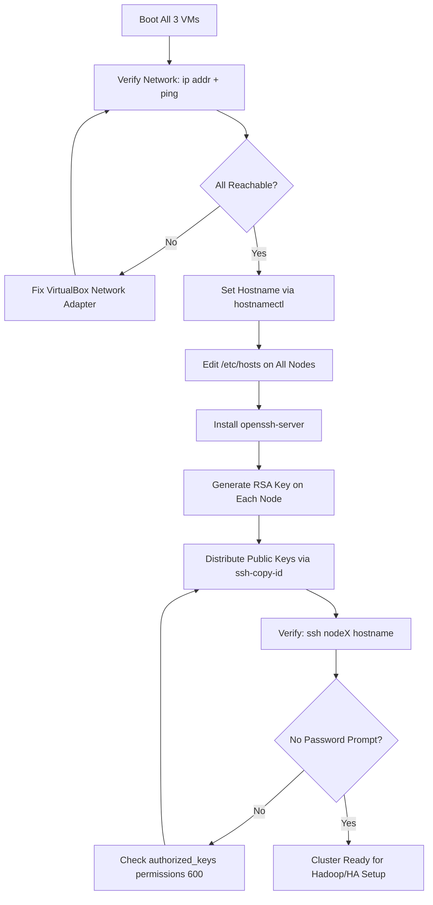
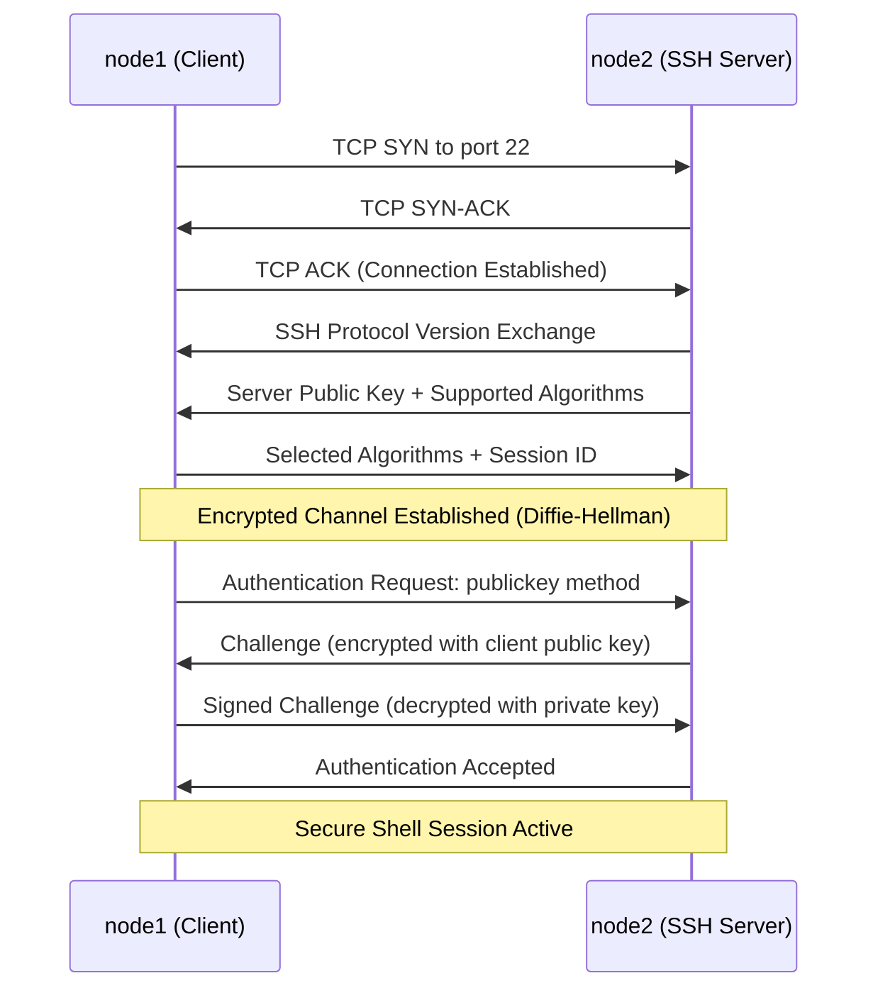
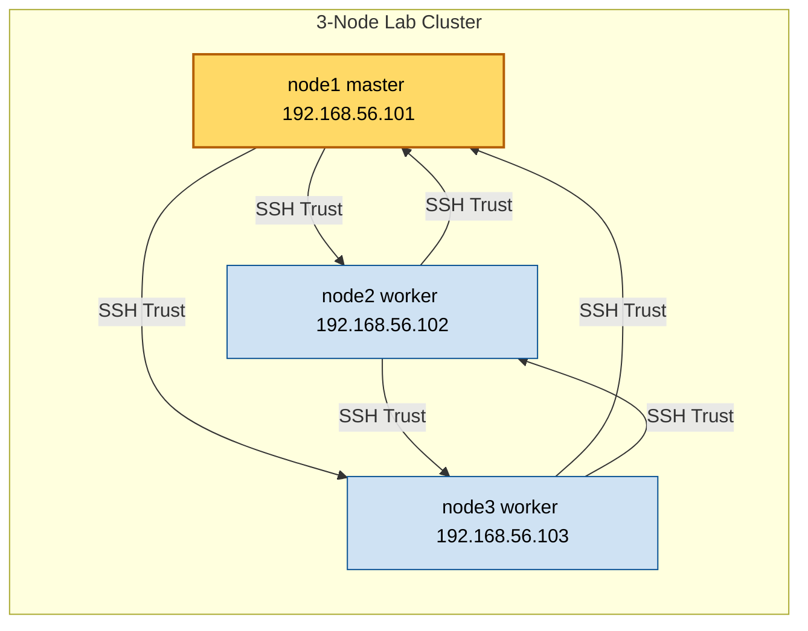
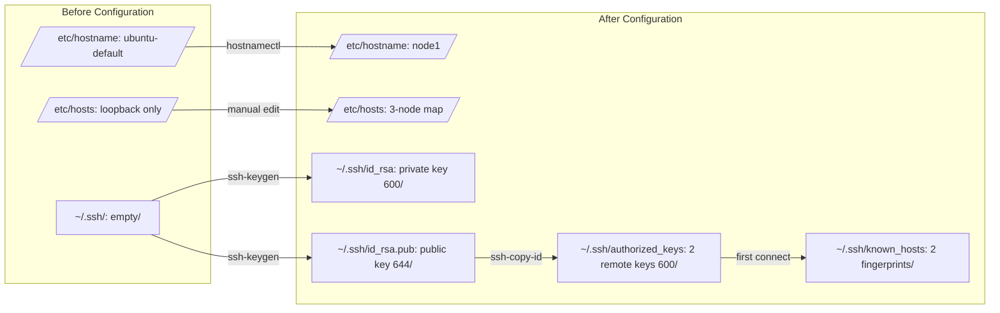

# Setting host name for virtual machine nodes in cluster and ssh set up for remote login.

<!-- SECTION_1_START -->

# Module 14 — Setting Hostname for Virtual Machine Nodes in a Cluster and SSH Setup for Remote Login

## 1.1 Formal Definition (KTU 2024 Syllabus Terminology)

A **hostname** is a unique, human-readable alphanumeric label assigned to a networked device (physical or virtual) that identifies the node within a cluster, domain, or local network. In a virtualized cluster environment, each Virtual Machine (VM) node is assigned a distinct hostname to enable unambiguous addressing, inter-node communication, and resource orchestration.

**Secure Shell (SSH)** is a cryptographic network protocol (defined in **RFC 4251–RFC 4254**) operating on **TCP port 22** by default, used to establish a secure, encrypted channel between a client and a server over an insecure network. It provides **confidentiality** (via symmetric encryption), **integrity** (via MAC algorithms), and **authentication** (via passwords or public-key cryptography).

> [!IMPORTANT]
> **KTU 2024 Lab Vocabulary:** The act of configuring hostnames across multiple VMs is referred to as **"Node Identity Provisioning,"** while configuring key-based SSH is called **"Trust-based Remote Access Provisioning."** Examiners expect these exact terms in the Record/Procedure section.

## 1.2 Conceptual Analogy — Plain English Intuition

Imagine a **newspaper office** with multiple cubicles. Each reporter sits at a desk and wears a **nameplate** (the hostname) so the editor can call "Riya, file your article!" without confusion. The nameplate is registered in a **directory** (the `/etc/hosts` file) so the office boy knows where to deliver letters.

Now imagine the editor needs to send a **sealed confidential envelope** to Riya's desk across the building. He uses a **locked briefcase with two keys**: a public key (a copy he leaves at her desk so others can lock messages for her) and a private key (which only she carries to unlock them). The sealed envelope is **SSH** — secure, verified, and unreadable by anyone in between.

> [!NOTE]
> **Three Pillars of a Working Lab Cluster:**
> 1. **Unique Identity** — `node1`, `node2`, `node3` (the nameplates)
> 2. **Address Resolution** — Each hostname mapped to a stable IP in `/etc/hosts` (the directory)
> 3. **Secure Channel** — SSH keys instead of password prompts (the locked briefcase)

## 1.3 Physical Constants & Standard Metrics

| Parameter | Standard Value |
|---|---|
| **SSH Default Port** | **22/TCP** |
| **Default Key Algorithm** | **RSA 3072-bit (modern)** or **Ed25519** |
| **Hostname Length Limit** | **64 characters** (RFC 1123) |
| **Allowed Characters** | **a–z, 0–9, hyphen** |
| **Cluster Minimum Nodes (KTU)** | **3 nodes** (1 master + 2 workers, typical Hadoop/HA setup) |

> [!VISUALIZATION CONTROL]
> **Concept:** A 3-Node VM Cluster with Name-to-IP Mapping
> **ASCII Schematic (for mental visualization):**
> ```
> [ node1 (master) ]      [ node2 (worker) ]      [ node3 (worker) ]
>  192.168.1.101  <------>  192.168.1.102  <------>  192.168.1.103
>        \_______________________  ________________________/
>                                \/
>                    [ SSH Tunnel : Port 22 ]
> ```
> **Visual Description:** Each box represents a Virtual Machine with a label (hostname) and a unique IP. Bi-directional arrows indicate SSH channels that allow any node to securely access any other node.

<!-- SECTION_1_END -->

<!-- SECTION_2_START -->

# 2. Deep Theoretical Analysis & KTU High-Yield Reference Sheet

## 2.1 The Hostname Resolution Chain (Why It Works)

When you type `ssh node1` from `node2`, the following chain executes:

1. The Linux **glibc resolver library** intercepts the hostname `node1`.
2. It consults the **Name Service Switch (NSS)** configuration in `/etc/nsswitch.conf`.
3. The `hosts:` line in that file dictates lookup order (typically `files dns`).
4. If `files` is first, the **`/etc/hosts`** file is scanned line-by-line for a matching entry.
5. If `dns` is queried, a request is sent to the nameserver listed in `/etc/resolv.conf`.
6. The resolved IP is then used to initiate the **TCP three-way handshake** on **port 22**.
7. The **SSH transport layer** negotiates algorithms and establishes the encrypted channel.

> [!TIP]
> **Why KTU insists on `/etc/hosts`:** In an isolated lab cluster without internet/DNS, `/etc/hosts` is the **only reliable name-resolution mechanism**. DNS queries would simply time out. Always populate `/etc/hosts` on **every node**.

## 2.2 The Two-Plane Configuration Model

The hostname configuration lives on two planes that **must remain consistent**:

- **Runtime Plane:** The in-memory hostname string visible via the `hostname` command.
- **Persistent Plane:** The static file `/etc/hostname` that survives reboots.

Modern Linux distributions use **systemd-hostnamed** to synchronize both planes, which is why `hostnamectl` is the **preferred** command in KTU 2024 labs over the legacy `hostname` command.

## 2.3 SSH Cryptographic Layers (Conceptual Stack)

| Layer | Purpose | Common Algorithms |
|---|---|---|
| **Transport Layer** | Server authentication, encryption, integrity | RSA, Ed25519, ECDSA |
| **User Auth Layer** | Client identity verification | Public key, password, keyboard-interactive |
| **Connection Layer** | Multiplexing channels (shell, X11, port-forward) | Channel protocol |

> [!IMPORTANT]
> **Public-Key Authentication Math:** When a client connects, the server checks `~/.ssh/authorized_keys` for the client's public key. If matched, the server encrypts a **challenge** with the public key. Only the holder of the matching **private key** (which never leaves the client) can decrypt it — proving identity without transmitting any secret over the network.

## 2.4 KTU Formula Sheet / Cheat Sheet

| Concept | Command / File | Syntax / Format | Purpose |
|---|---|---|---|
| **View current hostname** | `hostname` | `hostname` | Display kernel hostname |
| **Set hostname (persistent)** | `hostnamectl` | `hostnamectl set-hostname node1` | Update systemd hostname |
| **Edit hosts file** | `nano` / `vi` | `192.168.1.101  node1.example.com  node1` | Map IP → hostname |
| **Check name resolution** | `getent` | `getent hosts node1` | Verify NSS resolution |
| **Generate SSH key pair** | `ssh-keygen` | `ssh-keygen -t rsa -b 4096` | Create public/private keypair |
| **Copy public key to remote** | `ssh-copy-id` | `ssh-copy-id user@node2` | Install key in `authorized_keys` |
| **Test SSH login** | `ssh` | `ssh user@node1` | Initiate remote session |
| **Disable root SSH** | `sshd_config` | `PermitRootLogin no` | Security hardening |
| **SSH config file** | `~/.ssh/config` | `Host node1  HostName 192.168.1.101  User hadoop` | Per-host shortcuts |
| **SSH service** | `sshd` | `systemctl status sshd` | Daemon control |

<!-- SECTION_2_END -->

<!-- SECTION_3_START -->

# 3. Step-by-Step Implementation & Lab Procedure

> [!WARNING]
> **KTU Examiner's Note:** A full-marks procedure must include **(1)** network verification (ping), **(2)** hostname change on **all** nodes, **(3)** `/etc/hosts` entry on **all** nodes, **(4)** key generation, **(5)** key distribution, and **(6)** password-less verification. Missing any one of these costs 2–3 marks.

## 3.1 Lab Environment Assumptions (Standard KTU Setup)

- **Hypervisor:** Oracle VirtualBox / VMware Workstation
- **Guest OS:** Ubuntu 22.04 LTS Server (most common in KTU 2024 labs) or CentOS Stream
- **Network Mode:** Host-Only Adapter or Internal Network (`192.168.56.0/24`)
- **Three VMs:** `node1` (master), `node2`, `node3` (workers)
- **User:** A non-root user (e.g., `hadoop` or `student`) with `sudo` privileges

## 3.2 Phase 1 — Network & IP Verification (Perform on ALL Nodes)

### 3.2.1 Identify the IP address of the current node

```bash
ip addr show
# Alternative (legacy):
ifconfig
```

Expected output includes an entry such as `inet 192.168.56.101/24` under interface `enp0s8` or `eth0`. **Record this IP for Step 3.4.**

### 3.2.2 Verify connectivity to other nodes

```bash
ping -c 3 192.168.56.102
ping -c 3 192.168.56.103
```

If pings fail, the hypervisor network adapter is misconfigured — fix the VirtualBox network mode before proceeding.

## 3.3 Phase 2 — Setting the Hostname (Perform on ALL Nodes)

### 3.3.1 Set the hostname using systemd (persistent + runtime)

```bash
# On node1 (master)
sudo hostnamectl set-hostname node1

# On node2
sudo hostnamectl set-hostname node2

# On node3
sudo hostnamectl set-hostname node3
```

### 3.3.2 Verify the change

```bash
hostnamectl
# Expected: "Static hostname: node1"
hostname
# Expected: "node1"
```

### 3.3.3 Manually verify the persistent file (for record)

```bash
cat /etc/hostname
# Expected output: node1
```

## 3.4 Phase 3 — Populating `/etc/hosts` (Perform on ALL Nodes)

> [!NOTE]
> **Why on ALL nodes?** Each node must resolve every other node's hostname. If `node2` cannot resolve `node3`, Hadoop/Yarn services will fail to start.

Edit the file:

```bash
sudo nano /etc/hosts
```

Add the following block to the **end** of the file (replace IPs as per your actual assignments):

```
192.168.56.101   node1.example.com   node1
192.168.56.102   node2.example.com   node2
192.168.56.103   node3.example.com   node3
```

Save with `Ctrl+O`, exit with `Ctrl+X`.

### Verify resolution on each node

```bash
getent hosts node1
getent hosts node2
getent hosts node3
ping -c 2 node1
ping -c 2 node2
ping -c 2 node3
```

> [!IMPORTANT]
> **KTU 2024 Pitfall:** Students often forget to map the **fully qualified domain name (FQDN)** AND the **short name** on the same line. Both `node1.example.com` and `node1` must resolve — failing to do so breaks Java-based cluster services.

## 3.5 Phase 4 — Installing and Starting the SSH Server (if not pre-installed)

```bash
# On Ubuntu/Debian
sudo apt update
sudo apt install -y openssh-server openssh-client

# On CentOS/RHEL
sudo yum install -y openssh-server openssh-clients
sudo systemctl start sshd
sudo systemctl enable sshd
```

Verify the daemon is listening on **port 22**:

```bash
sudo ss -tlnp | grep :22
# Expected: LISTEN  0  128  0.0.0.0:22  ...  users:(("sshd",pid=...
```

## 3.6 Phase 5 — Generating the SSH Key Pair (Perform Once on Each Node)

```bash
# Generate a 4096-bit RSA key pair
ssh-keygen -t rsa -b 4096
```

When prompted:
- `Enter file in which to save the key`: Press **Enter** to accept default (`/home/hadoop/.ssh/id_rsa`).
- `Enter passphrase`: Press **Enter twice** for password-less operation (required for cluster automation).

The output is:

```
Your identification has been saved in /home/hadoop/.ssh/id_rsa
Your public key has been saved in /home/hadoop/.ssh/id_rsa.pub
The key fingerprint is:
SHA256:7Xk3...xyz  hadoop@node1
```

> [!WARNING]
> **For KTU Record:** Always note the **algorithm (`rsa`)**, **key size (`4096`)**, and the **storage path (`~/.ssh/id_rsa`)** in the Observation column.

## 3.7 Phase 6 — Distributing Public Keys for Password-less Login

### 3.7.1 Method A — Using `ssh-copy-id` (preferred)

```bash
# From node1, push the public key to node2 and node3
ssh-copy-id hadoop@node2
ssh-copy-id hadoop@node3

# Also copy to localhost for self-access
ssh-copy-id hadoop@node1
```

Type `yes` on the first connection (adds the host fingerprint to `known_hosts`), then enter the remote user's password **one final time**.

### 3.7.2 Method B — Manual copy (if `ssh-copy-id` is unavailable)

```bash
# On node1
cat ~/.ssh/id_rsa.pub | ssh hadoop@node2 "mkdir -p ~/.ssh && chmod 700 ~/.ssh && cat >> ~/.ssh/authorized_keys && chmod 600 ~/.ssh/authorized_keys"
```

### 3.7.3 Bidirectional setup (essential for cluster)

The above only allows `node1` → `node2`. For a true mesh, **repeat the key generation and distribution from every node to every other node:**

```
node1 -> node2, node3
node2 -> node1, node3
node3 -> node1, node2
```

## 3.8 Phase 7 — Verification (The "Show" Step in the Lab)

```bash
# From node1, log into node2 — should NOT ask for a password
ssh hadoop@node2
# Expected prompt: [hadoop@node2 ~]$

# Run a remote command without entering the shell
ssh hadoop@node2 "hostname"
# Expected output: node2

# Quick cluster-wide check
ssh hadoop@node1 "hostname" && ssh hadoop@node2 "hostname" && ssh hadoop@node3 "hostname"
# Expected output: node1 \n node2 \n node3
```

## 3.9 Phase 8 — Automation Script (Bonus Marks)

A reusable Bash script to verify all nodes are reachable:

```bash
#!/bin/bash
# File: cluster_ping.sh
# Purpose: Verify SSH reachability of all cluster nodes
# Usage:   ./cluster_ping.sh

set -euo pipefail                # Strict error handling: abort on any failure

HOSTS=("node1" "node2" "node3")
USER="hadoop"
LOG_FILE="/tmp/cluster_ping_$(date +%Y%m%d_%H%M%S).log"

echo "Cluster Reachability Check — $(date)" | tee -a "$LOG_FILE"
echo "-------------------------------------" | tee -a "$LOG_FILE"

EXIT_CODE=0
for host in "${HOSTS[@]}"; do
    # Capture the remote hostname via SSH; time out after 5 seconds
    REMOTE_NAME=$(ssh -o ConnectTimeout=5 -o BatchMode=yes "$USER@$host" "hostname" 2>&1) || EXIT_CODE=1
    if [[ "$REMOTE_NAME" == "${host%%.*}" ]]; then
        echo "[ OK ]  $host  ->  $REMOTE_NAME" | tee -a "$LOG_FILE"
    else
        echo "[FAIL]  $host  ->  $REMOTE_NAME" | tee -a "$LOG_FILE"
    fi
done

echo "-------------------------------------" | tee -a "$LOG_FILE"
exit $EXIT_CODE
```

Make it executable and run:

```bash
chmod +x cluster_ping.sh
./cluster_ping.sh
```

## 3.10 Hardware/Tool Reference Table (For the Lab Record)

| Component / Tool | Configuration / Value | Notes |
|---|---|---|
| **VirtualBox Network Mode** | Host-Only Adapter (vboxnet0) | Subnet 192.168.56.0/24 |
| **Static IP Assignment** | Manual / DHCP Reservation | Avoid DHCP for clusters |
| **SSH Server Package** | `openssh-server` (Ubuntu) / `openssh-server` (CentOS) | Version ≥ 8.x recommended |
| **Key Algorithm** | **RSA 4096-bit** | Legacy-compatible default |
| **Alternative Algorithm** | Ed25519 (`ssh-keygen -t ed25519`) | Modern, shorter keys |
| **SSH Port** | **22/TCP** | Open in `ufw` if firewall active |
| **User Account** | `hadoop` (non-root, sudo-enabled) | Never use `root` for cluster ops |
| **Config File** | `/etc/ssh/sshd_config` | Restart `sshd` after edits |
| **Service Manager** | `systemctl` | `restart`, `status`, `enable` |
| **Firewall Command** | `sudo ufw allow 22/tcp` | Required if UFW is active |

<!-- SECTION_3_END -->

<!-- SECTION_4_START -->

# 4. Structural Diagrams & Schematics

## 4.1 Mermaid — Full Cluster Provisioning Workflow



## 4.2 Mermaid — SSH Public-Key Authentication Handshake



## 4.3 Mermaid — Node Identity & Trust Topology (3-Node Mesh)



## 4.4 Mermaid — File-System State Transition (Hostname + SSH)



<!-- SECTION_4_END -->

<!-- SECTION_5_START -->

# 5. KTU 2024 Scheme Examination Question Bank & Topic Recap

## 5.1 Part A — Short Answer Questions (3 Marks Each)

### **Question 1** `[KTU University Exam — July 2024]`
**Differentiate between the persistent hostname file and the runtime hostname in Linux. Which command modifies both simultaneously?**

**Model Answer (3 Marks):**

| Aspect | Runtime Hostname | Persistent Hostname |
|---|---|---|
| **Storage** | In-memory kernel variable | File on disk: `/etc/hostname` |
| **Survives Reboot?** | No | Yes |
| **Modified by** | `hostname node1` (legacy) | Editing `/etc/hostname` directly |
| **Both modified by** | — | **`hostnamectl set-hostname node1`** |

The `hostnamectl` command is part of **systemd-hostnamed** and updates the kernel hostname, writes to `/etc/hostname`, and emits an `org.freedesktop.hostname1` D-Bus signal — all atomically. **[Command name: 1 Mark | Runtime vs Persistent distinction: 1 Mark | systemd context: 1 Mark]**

---

### **Question 2** `[KTU University Exam — Dec 2023]`
**List the three files generated/used during SSH public-key authentication on the client and server sides, and state their permission bits.**

**Model Answer (3 Marks):**

| File | Location | Permission | Purpose |
|---|---|---|---|
| `id_rsa` | Client `~/.ssh/` | **600** | Private key (never shared) |
| `id_rsa.pub` | Client `~/.ssh/` | **644** | Public key (distributed) |
| `authorized_keys` | Server `~/.ssh/` | **600** | List of trusted public keys |

**[Each row: 1 Mark]**

---

## 5.2 Part B — Full 14-Mark Questions (Module Internal Choice)

### **Question A (14 Marks)** `[KTU University Exam — July 2024]`

**(a)** With neat commands and a suitable diagram, explain the procedure to assign unique hostnames to three Virtual Machine nodes (`node1`, `node2`, `node3`) configured on a host-only network with IP range `192.168.56.0/24`. **(7 Marks)**

**(b)** Demonstrate the complete SSH key-based authentication setup so that `node1` can execute commands on `node2` and `node3` without any password prompt. Validate the setup with a sample remote command. **(7 Marks)**

---

#### **Model Solution — Part (a) [7 Marks]**

**Step 1 — Verify IP addresses on all nodes** **[1 Mark]**

```bash
ip addr show
# node1: 192.168.56.101
# node2: 192.168.56.102
# node3: 192.168.56.103
```

**Step 2 — Set hostnames using systemd** **[2 Marks]**

```bash
# On node1
sudo hostnamectl set-hostname node1
# On node2
sudo hostnamectl set-hostname node2
# On node3
sudo hostnamectl set-hostname node3
```

**Step 3 — Verify with `hostnamectl` command** **[1 Mark]**

```bash
hostnamectl | grep "Static hostname"
```

**Step 4 — Populate `/etc/hosts` on every node** **[2 Marks]**

```bash
sudo nano /etc/hosts
# Append:
192.168.56.101  node1.example.com  node1
192.168.56.102  node2.example.com  node2
192.168.56.103  node3.example.com  node3
```

**Step 5 — Validate resolution** **[1 Mark]**

```bash
ping -c 2 node1
ping -c 2 node2
ping -c 2 node3
```

**Diagram (Use the topology from Section 4.3 above).** **[Bonus clarity marks]**

#### **Model Solution — Part (b) [7 Marks]**

**Step 1 — Install SSH server on all nodes** **[1 Mark]**

```bash
sudo apt update && sudo apt install -y openssh-server
sudo systemctl enable --now sshd
```

**Step 2 — Generate RSA 4096-bit key pair on node1** **[1 Mark]**

```bash
ssh-keygen -t rsa -b 4096
# Press Enter twice (no passphrase)
```

**Step 3 — Distribute the public key to node2 and node3** **[2 Marks]**

```bash
ssh-copy-id hadoop@node2
ssh-copy-id hadoop@node3
```

**Step 4 — Verify password-less login** **[2 Marks]**

```bash
ssh hadoop@node2 "hostname; uptime"
# Output should show "node2" and uptime stats
ssh hadoop@node3 "hostname"
# Output should show "node3"
```

**Step 5 — Repeat key generation/distribution on node2 and node3 for full mesh trust** **[1 Mark]**

```bash
# On node2
ssh-keygen -t rsa -b 4096
ssh-copy-id hadoop@node1
ssh-copy-id hadoop@node3

# On node3
ssh-keygen -t rsa -b 4096
ssh-copy-id hadoop@node1
ssh-copy-id hadoop@node2
```

> [!WARNING]
> **Valuation Pitfall — Common Mark Loss (3–4 marks lost):**
> 1. **Missing `/etc/hosts` entries on ALL nodes** — students update only the master, causing resolution failure on workers.
> 2. **Forgetting `systemctl enable sshd`** — the daemon does not start after reboot, breaking the cluster post-restart.
> 3. **Setting a passphrase during `ssh-keygen`** — Hadoop/Yarn services cannot enter the passphrase interactively and will hang.
> 4. **Using `PermitRootLogin yes`** — examiners deduct marks for insecure configuration.

---

### **Question B (14 Marks)** `[KTU University Exam — Dec 2023]`

**(a)** What is the role of the `/etc/hosts` file in a Linux cluster? Explain with an example of three nodes and the exact format of the entries. **(7 Marks)**

**(b)** Describe the SSH public-key authentication handshake in detail. Include the algorithm exchange, key verification, and the files involved on both client and server. **(7 Marks)**

---

#### **Model Solution — Part (a) [7 Marks]**

**Definition** **[1 Mark]:** The `/etc/hosts` file is a **local static table** mapping hostnames to IP addresses, consulted by the system's **Name Service Switch (NSS)** before DNS queries are attempted. In an isolated cluster without internet access, it is the **sole name-resolution mechanism**.

**Example contents on every node** **[3 Marks]:**

```
127.0.0.1       localhost
192.168.56.101  node1.example.com  node1
192.168.56.102  node2.example.com  node2
192.168.56.103  node3.example.com  node3
```

**Format:** One entry per line, three whitespace-separated fields:
1. **IP address** (IPv4 or IPv6)
2. **Canonical FQDN** (e.g., `node1.example.com`)
3. **Alias / short name** (e.g., `node1`) — multiple aliases possible, space-separated

**Verification commands** **[2 Marks]:**

```bash
getent hosts node1
# Returns: 192.168.56.101  node1.example.com  node1

cat /etc/hosts
# Displays the file contents for visual confirmation
```

**NSS lookup order explanation** **[1 Mark]:** The `/etc/nsswitch.conf` file's `hosts: files dns` line dictates that `files` (i.e., `/etc/hosts`) is checked **first**. If the entry is found, the resolver stops; otherwise, a DNS query is issued.

#### **Model Solution — Part (b) [7 Marks]**

**Step 1 — TCP connection** **[1 Mark]:** The client opens a TCP connection to the server on **port 22**. The standard three-way handshake (SYN, SYN-ACK, ACK) completes.

**Step 2 — Protocol version exchange** **[1 Mark]:** Both sides send their SSH protocol string (e.g., `SSH-2.0-OpenSSH_8.9p1`). If incompatible, the connection is dropped.

**Step 3 — Algorithm negotiation** **[1 Mark]:** Each side sends a list of supported algorithms:
- **KEX (Key Exchange):** `curve25519-sha256`, `diffie-hellman-group14-sha256`
- **Host Key:** `ssh-rsa`, `ssh-ed25519`
- **Cipher:** `aes256-gcm@openssh.com`, `chacha20-poly1305`
- **MAC:** `hmac-sha2-256`

**Step 4 — Server authentication** **[1 Mark]:** The server presents its **host public key** (from `/etc/ssh/ssh_host_rsa_key.pub`). The client verifies it against `~/.ssh/known_hosts`. If unknown, the user is prompted to trust the fingerprint.

**Step 5 — Session key establishment** **[1 Mark]:** A **Diffie-Hellman key exchange** generates a shared symmetric session key over the public channel. This key encrypts all subsequent traffic.

**Step 6 — Client public-key authentication** **[2 Marks]:**
- Client sends: `SSH_MSG_USERAUTH_REQUEST` with method `publickey` and the public key fingerprint.
- Server checks `~/.ssh/authorized_keys` for a matching key.
- Server sends a challenge (random bytes) **encrypted with the client's public key**.
- Client **decrypts with the private key**, signs the session ID, and returns the signature.
- Server verifies the signature using the public key. If valid, authentication succeeds.

**Files involved summary** (auto-marked):

| Side | File | Content |
|---|---|---|
| Client | `~/.ssh/id_rsa` | Private key (600) |
| Client | `~/.ssh/id_rsa.pub` | Public key (644) |
| Client | `~/.ssh/known_hosts` | Server fingerprints |
| Server | `/etc/ssh/ssh_host_rsa_key` | Server private key |
| Server | `~/.ssh/authorized_keys` | Trusted client public keys |

---

> [!WARNING]
> **KTU Examiner's Valuation Warning — Critical Pitfalls for Module 14:**
> 1. **Conflating `/etc/hostname` with `/etc/hosts`** — these are **different files** with **different purposes**. `/etc/hostname` stores the local node's name; `/etc/hosts` is the network directory.
> 2. **Confusing SSH with SSL/TLS** — SSH uses **port 22**; HTTPS uses **port 443**. Examiners will deduct marks for this swap.
> 3. **Forgetting to restart `sshd`** after editing `/etc/ssh/sshd_config` — the daemon serves stale settings from memory.
> 4. **Not showing verification output** in the lab record — always include a screenshot or terminal capture of the password-less `ssh` output.
> 5. **Using `ssh-keygen` without specifying `-t rsa -b 4096`** — the default in older OpenSSH is 2048-bit RSA, which examiners may consider weak.

---

## 5.3 Topic Recap & Important Things to Remember

- **Hostname** = human-readable label for a network node; set persistently via `hostnamectl set-hostname <name>` and stored in **`/etc/hostname`**.
- **`/etc/hosts`** is the **static local DNS**; every cluster node must contain **all node IP-to-name mappings** to enable resolution without internet DNS.
- **Format of `/etc/hosts` entry:** `IP   FQDN   shortname` (whitespace-separated, one per line).
- **SSH** is a cryptographic protocol on **TCP port 22** providing confidentiality, integrity, and authentication.
- **Public-key authentication** uses an **asymmetric key pair**: private key (kept secret on client) + public key (placed in server's `~/.ssh/authorized_keys`).
- **`ssh-keygen -t rsa -b 4096`** generates a 4096-bit RSA key pair; pressing Enter twice yields a **passphrase-less key** (required for cluster automation).
- **`ssh-copy-id user@host`** is the simplest method to install a public key on a remote server.
- **Bidirectional trust** is essential in a true cluster mesh: every node must be able to SSH to every other node without a password.
- **Key file permissions** are strictly enforced by OpenSSH: private key `600`, public key `644`, `authorized_keys` `600`, `~/.ssh/` directory `700`.
- **Verification commands:** `hostname`, `hostnamectl`, `getent hosts <name>`, `ping -c 2 <name>`, `ssh user@host "hostname"`.
- **Service management:** `sudo systemctl enable --now sshd` to install, start, and enable auto-start on boot.
- **Security hardening** essentials: disable `PermitRootLogin`, prefer key auth over passwords, keep `sshd_config` restricted to protocol 2 only.
- **Common KTU commands to memorize:** `hostnamectl`, `ssh-keygen`, `ssh-copy-id`, `ssh`, `getent`, `ip addr`, `ping`, `systemctl`.
- **Typical marks split for a 14-mark question:** Procedure (5) + Commands (4) + Verification (3) + Diagram/Viva (2).

<!-- SECTION_5_END -->
