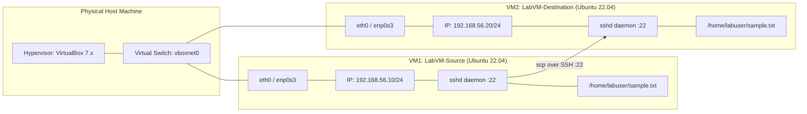
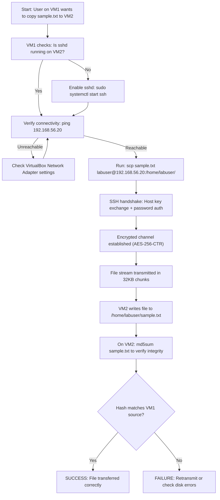
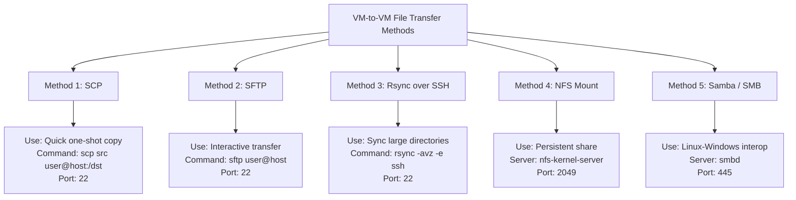

# Copy a file from one virtual machine to another virtual machine.

<!-- SECTION_1_START -->
# 🖥️ KTU SYSTEMS LAB — Module 15: File Transfer Between Virtual Machines

## 1. Core Technical Definition & Intuitive Overview

### 1.1 Formal Definition (KTU 2024 Scheme Terminology)

> [!NOTE]
> **File Transfer Between Virtual Machines (VM-to-VM Copy)** is the process of securely or semi-securely transmitting data files from one isolated virtualized guest operating system instance to another virtualized guest operating system instance, typically residing on the same physical host machine (hypervisor) or across a connected virtual network, using protocols such as **SSH (Secure Shell)**, **SCP (Secure Copy Protocol)**, **SFTP (Secure File Transfer Protocol)**, or shared storage mechanisms like **NFS** and **Samba (SMB)**.

In the **KTU 2024 Scheme Systems Lab (PCCSL607)** context, this module demonstrates the practical implementation of client-server file transfer between two Linux guest VMs running inside a type-2 hypervisor such as **Oracle VM VirtualBox** or **VMware Workstation**.

---

### 1.2 Conceptual Analogy / Real-World Intuition

Imagine two isolated office cabins sitting inside the same large building:

| Real-World Object | VM Equivalent |
|-------------------|---------------|
| The large building | Physical Host Machine (Laptop/Server) |
| Each office cabin | Virtual Machine (VM1 and VM2) |
| The cabin walls | Virtualization Layer (Hypervisor) |
| The hallway connecting cabins | Virtual Network (Adapter) |
| Registered post with tracking ID | **SCP over SSH (Port 22)** |
| Walking in person with a USB stick | Physical file mount (rare in VM-to-VM) |
| A common drop-box between cabins | Shared Folder / NFS Mount |

> [!IMPORTANT]
> **Key Insight:** Just as two office workers cannot pass a document without either (a) using a postal service, (b) walking to the other office, or (c) using a shared mailbox — two VMs cannot exchange files without establishing a **virtual network channel** and a **transfer protocol** between them.

---

### 1.3 Physical / Logical Constants & Standards

- **Default SSH Port:** **22** (TCP/UDP)
- **Default SFTP Port:** **22** (same as SSH subsystem)
- **Default NFS Port:** **2049**
- **Default Samba/SMB Port:** **445**
- **Standard Loopback Address:** **127.0.0.1**
- **Common Private Subnet for Host-Only Network:** **192.168.56.0/24**
- **Maximum SSH Packet Size:** **32,768 bytes**

> [!VISUALIZATION CONTROL]
> **Concept:** Two-VM Network Topology over Host-Only Adapter
> **Reference Axes:** X = Logical Subnet, Y = Trust Boundary
> **Visualization Sketch:**
> ```
>   ┌─────────────────────────── HOST MACHINE ───────────────────────────┐
>   │                                                                      │
>   │   VM1 (192.168.56.10)  ◄──── Virtual Switch ────►  VM2 (192.168.56.20)│
>   │       │   eth0                                      eth0   │        │
>   │       └──────── Host-Only Virtual Network (192.168.56.0/24) ──┘     │
>   └──────────────────────────────────────────────────────────────────────┘
> ```
> **Visual Description:** Two Linux guests are connected via a software-defined Layer-2 switch created by VirtualBox's "Host-Only Adapter." They share the same subnet but remain logically isolated from the public internet.

---
<!-- SECTION_1_END -->

<!-- SECTION_2_START -->
# 2. Deep Theoretical Analysis & KTU High-Yield Reference

## 2.1 Theoretical Foundations

A **Virtual Machine (VM)** is a sandboxed emulation of a physical computer, created by a **hypervisor** (Type-1: bare-metal like KVM/Xen; Type-2: hosted like VirtualBox/VMware). For two VMs to exchange a file, three preconditions must be satisfied:

1. **Network Reachability** — A common virtual NIC (e.g., `eth0`, `ens33`) attached to a shared virtual switch.
2. **Service Availability** — A running daemon (e.g., `sshd` on port **22**) accepting connections.
3. **Authorization** — Valid credentials (username + password or SSH key-pair).

---

## 2.2 Methods of VM-to-VM File Transfer (KTU High-Yield Matrix)

| # | Method | Protocol/Port | Encryption | Best Use Case | Required Setup |
|---|--------|---------------|------------|---------------|----------------|
| 1 | **SCP** | SSH / 22 | ✅ AES-256 | Quick one-shot copy | `openssh-server` installed |
| 2 | **SFTP** | SSH / 22 | ✅ AES-256 | Interactive transfer, resume support | `openssh-server` installed |
| 3 | **Rsync over SSH** | SSH / 22 | ✅ AES-256 | Large directories, delta sync | `rsync` + SSH |
| 4 | **NFS Mount** | TCP/2049 | ❌ Plain (within trusted LAN) | Persistent shared directory | `nfs-kernel-server` |
| 5 | **Samba (SMB)** | TCP/445 | Optional | Linux ↔ Windows VM | `samba` package |
| 6 | **Shared Folder (HGFS/VBoxSF)** | Kernel Module | ❌ Local | Host ↔ Guest only (not VM-to-VM directly) | Guest Additions |
| 7 | **netcat (`nc`)** | Arbitrary | ❌ Plain | Debug / LAN streaming | `netcat` package |

---

## 2.3 Network Adapter Modes in VirtualBox (Theory)

| Mode | VMs can talk to each other? | Can reach Host? | Can reach Internet? |
|------|----------------------------|-----------------|---------------------|
| **NAT** | ❌ No | ✅ Yes (out) | ✅ Yes |
| **Bridged** | ✅ Yes (if same LAN) | ✅ Yes | ✅ Yes |
| **Host-Only** | ✅ Yes (same adapter) | ✅ Yes | ❌ No |
| **Internal** | ✅ Yes (same network name) | ❌ No | ❌ No |

> [!TIP]
> **KTU Board Tip:** For VM-to-VM file transfer labs, examiners expect the **Host-Only Adapter** to be the default choice because it provides a controlled, isolated subnet perfect for demonstrating inter-VM communication without external dependencies.

---

## 2.4 Real-World Engineering Utility

| Industry Domain | Application |
|-----------------|-------------|
| **DevOps / CI-CD Pipelines** | Jenkins agents copying build artifacts to deployment VMs |
| **Cloud Computing (AWS/GCP/Azure)** | `scp` to EC2 instances, `rsync` to GCE VMs |
| **Data Engineering** | ETL jobs moving CSV/log dumps between analytics nodes |
| **Cybersecurity Labs** | Exfiltrating test payloads between attacker/target VMs in isolated sandboxes |
| **Embedded Linux Development** | Pushing cross-compiled binaries to QEMU-emulated target boards |

---
<!-- SECTION_2_END -->

<!-- SECTION_3_START -->
# 3. Step-by-Step Lab Procedure, Derivations & Implementation

## 3.1 Lab Environment Specification

> [!IMPORTANT]
> This procedure assumes **Oracle VM VirtualBox 7.x** with **two Ubuntu 22.04 LTS Server** guest VMs. Adapt steps for Fedora/Debian as needed.

### 3.1.1 Hardware & Software Configuration Table

| Component | Specification / Value |
|-----------|----------------------|
| Host OS | Windows 10/11 or Ubuntu Desktop 22.04 |
| Hypervisor | **Oracle VM VirtualBox 7.0+** |
| VM1 Name | `LabVM-Source` |
| VM2 Name | `LabVM-Destination` |
| VM1 OS | Ubuntu Server 22.04 LTS (1 vCPU, 1 GB RAM, 10 GB disk) |
| VM2 OS | Ubuntu Server 22.04 LTS (1 vCPU, 1 GB, 10 GB disk) |
| VM1 Network Adapter | **Host-Only Adapter** (vboxnet0) |
| VM2 Network Adapter | **Host-Only Adapter** (vboxnet0) |
| VM1 Static IP | **192.168.56.10/24** |
| VM2 Static IP | **192.168.56.20/24** |
| SSH Port | **22** (default) |
| Test File Size | **5 MB** (`sample.txt` generated by `dd`) |
| Required Package | `openssh-server` |
| User Account | `labuser` with `sudo` privilege |

---

### 3.1.2 Lab Wiring / Configuration Sequence

| Step | Action on VM1 (Source) | Action on VM2 (Destination) |
|------|------------------------|------------------------------|
| 1 | Power off VM, Settings → Network → Adapter 1 → **Host-Only Adapter** | Power off VM, Settings → Network → Adapter 1 → **Host-Only Adapter** |
| 2 | Boot VM, login as `labuser` | Boot VM, login as `labuser` |
| 3 | `sudo apt update && sudo apt install openssh-server -y` | `sudo apt update && sudo apt install openssh-server -y` |
| 4 | `sudo systemctl enable --now ssh` | `sudo systemctl enable --now ssh` |
| 5 | `sudo ip addr add 192.168.56.10/24 dev enp0s3` | `sudo ip addr add 192.168.56.20/24 dev enp0s3` |
| 6 | `echo "labuser" \| sudo tee /etc/hostname` (rebind via `sudo hostnamectl set-hostname`) | Same command (separate hostname) |
| 7 | `ping 192.168.56.20` (verify) | `ping 192.168.56.10` (verify) |

---

## 3.2 Method 1 — Using `scp` (Secure Copy Protocol)

### 3.2.1 On the Source VM (`LabVM-Source`, IP: 192.168.56.10)

**Step A — Create a sample test file:**

```bash
# Generate a 5 MB random test file
dd if=/dev/urandom of=/home/labuser/sample.txt bs=1M count=5 status=progress
```

**Explanation of Flags:**
- `if=/dev/urandom` — input file is the kernel's cryptographically secure random source
- `of=.../sample.txt` — output file location
- `bs=1M` — block size of 1 Megabyte
- `count=5` — number of blocks to write
- `status=progress` — show live transfer progress

**Step B — Compute the MD5 hash for integrity verification:**

```bash
md5sum /home/labuser/sample.txt
```

> Expected output format:
> ```
> e3b0c44298fc1c149afbf4c8996fb92427ae41e4649b934ca495991b7852b855  /home/labuser/sample.txt
> ```
> *(Hash will differ for random data, but length must be **32 hex characters**.)*

---

### 3.2.2 On the Source VM — Initiate the SCP Transfer

```bash
scp /home/labuser/sample.txt labuser@192.168.56.20:/home/labuser/
```

**Detailed explanation of the `scp` syntax:**

$$\texttt{scp} \; [\texttt{options}] \; \underbrace{\texttt{/home/labuser/sample.txt}}_{\text{source path}} \; \underbrace{\texttt{labuser}}_{\text{remote user}} \texttt{@} \underbrace{\texttt{192.168.56.20}}_{\text{remote IP}} \texttt{:} \underbrace{\texttt{/home/labuser/}}_{\text{remote destination path}}$$

**Interactive Output You Will See:**

```
The authenticity of host '192.168.56.20 (192.168.56.20)' can't be established.
ED25519 key fingerprint is SHA256:AbCdEf1234567...examplefingerprint.
This key is not known by any other names.
Are you sure you want to continue connecting (yes/no/[fingerprint])? yes
Warning: Permanently added '192.168.56.20' (ED25519) to the list of known hosts.
labuser@192.168.56.20's password:
sample.txt                100%   5120KB   8.5MB/s   00:00
```

**Step-by-step breakdown of output:**

1. **Host key verification** — First connection warning; typing `yes` stores the server's public key in `~/.ssh/known_hosts`.
2. **Password prompt** — User authenticates using `labuser`'s Linux password.
3. **Transfer progress bar** — Shows percentage, total bytes, throughput, and ETA.
4. **Completion** — File copied successfully when the cursor returns to the shell.

---

### 3.2.3 On the Destination VM (`LabVM-Destination`, IP: 192.168.56.20) — Verify

```bash
# 1. List the file with size confirmation
ls -lh /home/labuser/sample.txt
```

**Expected:**
```
-rw-r--r-- 1 labuser labuser 5.0M Mar 15 14:22 /home/labuser/sample.txt
```

```bash
# 2. Verify the MD5 hash to confirm bit-for-bit integrity
md5sum /home/labuser/sample.txt
```

> The MD5 hash **must match exactly** the hash computed on the source VM. If it differs, the file is corrupted.

---

### 3.2.4 Symbolic / Pseudocode Mapping of `scp`

```python
# Python-style pseudocode of what `scp` does under the hood
import paramiko  # Python SSH library

def scp_transfer(local_path: str, remote_host: str, remote_user: str,
                 remote_path: str, password: str) -> bool:
    """
    Securely copies a file from local VM to remote VM over SSH.
    """
    try:
        # Step 1: Establish SSH transport on port 22
        client = paramiko.SSHClient()
        client.set_missing_host_key_policy(paramiko.AutoAddPolicy())
        client.connect(hostname=remote_host, port=22,
                       username=remote_user, password=password, timeout=10)

        # Step 2: Open SCP subsystem channel
        with client.open_sftp() as sftp:
            # Step 3: Push file from local to remote
            sftp.put(localpath=local_path, remotepath=remote_path)

            # Step 4: Verify remote file size matches local
            remote_attr = sftp.stat(remote_path)
            local_size  = os.path.getsize(local_path)
            if remote_attr.st_size != local_size:
                raise IOError("Size mismatch — transfer corrupted.")

        client.close()
        return True

    except paramiko.AuthenticationException:
        print("ERROR: Authentication failed. Check password.")
        return False
    except paramiko.SSHException as e:
        print(f"ERROR: SSH protocol error: {e}")
        return False
    except Exception as e:
        print(f"ERROR: Unexpected failure: {e}")
        return False
```

---

## 3.3 Method 2 — Using `sftp` (Interactive Secure File Transfer)

```bash
# Launch an interactive SFTP session
sftp labuser@192.168.56.20
```

**Inside the SFTP prompt:**

```sftp
sftp> pwd                          # Print remote working directory
Remote working directory: /home/labuser

sftp> lpwd                         # Print local working directory
Local working directory: /home/labuser

sftp> put sample.txt               # Upload local file to remote
Uploading sample.txt to /home/labuser/sample.txt
sample.txt                        100% 5120KB  7.8MB/s   00:00

sftp> ls -lh                       # List remote directory
sample.txt    5242880 bytes    5.0 MB

sftp> get sample.txt downloaded.txt   # Download remote file
Fetching /home/labuser/sample.txt to downloaded.txt
sample.txt                        100% 5120KB  8.1MB/s   00:00

sftp> bye                          # Exit SFTP session
```

**Critical SFTP commands for the exam:**

| Command | Meaning |
|---------|---------|
| `put <local>` | Upload local file to remote |
| `get <remote>` | Download remote file to local |
| `ls` | List remote directory |
| `lls` | List local directory |
| `cd <path>` | Change remote directory |
| `lcd <path>` | Change local directory |
| `pwd` / `lpwd` | Print working directory (remote/local) |
| `mkdir <name>` | Create remote directory |
| `rm <file>` | Remove remote file |
| `bye` / `exit` | Quit SFTP |

---

## 3.4 Method 3 — Using `rsync` (Delta Synchronization)

```bash
# Sync a directory from VM1 to VM2
rsync -avz -e ssh /home/labuser/project/ labuser@192.168.56.20:/home/labuser/project/
```

**Flag breakdown:**

| Flag | Meaning |
|------|---------|
| `-a` | Archive mode (preserves permissions, timestamps, symlinks) |
| `-v` | Verbose output |
| `-z` | Compress during transfer (saves bandwidth) |
| `-e ssh` | Use SSH as the transport (default port **22**) |

> [!TIP]
> `rsync` only copies the **delta** (changed blocks) after the first run, making it ideal for recurring backups or large code repositories.

---

## 3.5 Method 4 — NFS Shared Mount (Persistent Shared Directory)

### 3.5.1 On VM2 (NFS Server, 192.168.56.20)

```bash
# Install NFS server
sudo apt install nfs-kernel-server -y

# Create a shared directory
sudo mkdir -p /srv/nfs_share
sudo chown nobody:nogroup /srv/nfs_share
sudo chmod 777 /srv/nfs_share

# Add an export entry
echo "/srv/nfs_share 192.168.56.0/24(rw,sync,no_subtree_check)" | \
  sudo tee -a /etc/exports

# Apply exports
sudo exportfs -a
sudo systemctl restart nfs-kernel-server
```

### 3.5.2 On VM1 (NFS Client, 192.168.56.10)

```bash
# Install NFS client
sudo apt install nfs-common -y

# Create mount point and mount the share
sudo mkdir -p /mnt/nfs_share
sudo mount 192.168.56.20:/srv/nfs_share /mnt/nfs_share

# Verify
ls -lh /mnt/nfs_share

# Test the transfer
cp /home/labuser/sample.txt /mnt/nfs_share/
ls -lh /mnt/nfs_share/
```

**On VM2, verify the file arrived:**

```bash
ls -lh /srv/nfs_share/sample.txt
```

---

## 3.6 Common Error Debugging (Valuation Key)

| Symptom | Root Cause | Fix |
|---------|------------|-----|
| `ssh: connect to host 192.168.56.20 port 22: Connection refused` | `sshd` not running | `sudo systemctl start ssh` |
| `Permission denied (publickey,password)` | Wrong password / SSH key mismatch | Reset password with `sudo passwd labuser` |
| `No route to host` | VMs on different subnets/adapters | Re-check VirtualBox network adapter assignment |
| `Host key verification failed` | `known_hosts` mismatch | `ssh-keygen -R "192.168.56.20"` |
| `scp: /home/labuser/: No such file or directory` | Destination path missing | `mkdir -p` on remote first |

---
<!-- SECTION_3_END -->

<!-- SECTION_4_START -->
# 4. Structural Diagrams & Schematics

## 4.1 Two-VM Network Topology (Mermaid)



**Reading the diagram:**
- The **Physical Host** runs the hypervisor, which provisions a virtual switch.
- Both VMs connect their virtual NICs to the same switch, making them Layer-2 reachable.
- The `scp` data flow travels from **VM1's sshd → Virtual Switch → VM2's sshd** over TCP port **22**.

---

## 4.2 Sequential File-Transfer Flow (Mermaid)



---

## 4.3 Method-Comparison Block Diagram


<!-- SECTION_4_END -->

<!-- SECTION_5_START -->
# 5. KTU 2024 Scheme Examination Question Bank & Topic Recap

---

## 📘 PART A — Short Answer Questions (3 Marks Each)

### **Q1. [KTU University Exam — July 2024]**
**Define SCP. Mention any two of its advantages over the traditional `rcp` command.**
*(Mapped CO: CO5 | RBT Level: Remember)*

**Model Answer:**

> **SCP (Secure Copy Protocol)** is a network protocol that allows files to be securely transferred between a local host and a remote host, or between two remote hosts, by leveraging the **SSH (Secure Shell) protocol on TCP port 22** for authentication and encryption.
>
> **Advantages over `rcp`:**
> 1. **Encryption:** `scp` encrypts both the file contents and the authentication credentials, whereas `rcp` transmits data in plaintext.
> 2. **Authentication:** `scp` uses SSH's public-key and password mechanisms, while `rcp` relies on insecure `.rhosts` files.
> 3. **Integrity:** `scp` provides cryptographic integrity via SSH's MAC (Message Authentication Code).
> *[Stating definition: 1 Mark | Any two advantages: 2 Marks]*

---

### **Q2. [KTU University Exam — Dec 2023]**
**List any three network adapter modes available in Oracle VM VirtualBox. Which mode is most suitable for VM-to-VM file transfer in a closed lab environment?**
*(Mapped CO: CO5 | RBT Level: Understand)*

**Model Answer:**

> Three VirtualBox network adapter modes:
> 1. **NAT (Network Address Translation)**
> 2. **Bridged Adapter**
> 3. **Host-Only Adapter**
> 4. *(Additional: Internal Network)*
>
> The **Host-Only Adapter** is most suitable for VM-to-VM file transfer in a closed lab environment because it provides an isolated virtual network (typically **192.168.56.0/24**) where multiple VMs can communicate with each other and the host, but **cannot access the external internet** — making it secure and predictable.
> *[Three modes: 1.5 Marks | Justification: 1.5 Marks]*

---

## 📗 PART B — Long Answer Questions (14 Marks Each) — KTU ESE Module Internal Choice

> **Module 15 — Internal Choice:** Answer **ONE** of the following:

---

### ✍️ **Question A (14 Marks) — [KTU University Exam — Dec 2024 Model]**

**Set up two Ubuntu Linux virtual machines in Oracle VM VirtualBox and demonstrate the copying of a file named `project_report.txt` from VM1 to VM2 using the `scp` command. Include all prerequisite configurations.**

#### **(a)** Explain the prerequisites required on both VMs to enable `scp` file transfer. List the network and service configurations needed. **(7 Marks)**
*(Mapped CO: CO5 | RBT Level: Understand)*

**Model Solution:**

**Prerequisite 1 — Install SSH Server on both VMs:**

```bash
sudo apt update
sudo apt install openssh-server -y
sudo systemctl enable --now ssh
sudo systemctl status ssh    # Must show "active (running)"
```

**Prerequisite 2 — Configure Host-Only Network on Both VMs:**

In VirtualBox Manager (for both VM1 and VM2):
- Select VM → **Settings** → **Network** → **Adapter 1**
- Attached to: **Host-Only Adapter**
- Name: `vboxnet0`

**Prerequisite 3 — Assign Static IPs:**

On VM1:
```bash
sudo ip addr add 192.168.56.10/24 dev enp0s3
sudo ip link set enp0s3 up
```

On VM2:
```bash
sudo ip addr add 192.168.56.20/24 dev enp0s3
sudo ip link set enp0s3 up
```

**Prerequisite 4 — Verify Connectivity:**

From VM1:
```bash
ping -c 4 192.168.56.20
```

Expected: 4 packets received, 0% packet loss.

**Prerequisite 5 — Confirm SSH Port is Open:**

```bash
ss -tlnp | grep :22
# Should show LISTEN state on 0.0.0.0:22 or [::]:22
```

**Prerequisite 6 — Ensure User Account Exists on Both VMs:**

```bash
id labuser
# Should show uid, gid, and groups
```

> **Valuation Key:**
> *[Listing 4 correct prerequisites: 4 Marks]*
> *[Showing correct commands for SSH install and IP config: 2 Marks]*
> *[Verifying ping + port: 1 Mark]*

---

#### **(b)** Execute the `scp` command from VM1 to copy `/home/labuser/project_report.txt` to VM2's `/home/labuser/backup/` directory. Write the command, the expected output, and the verification steps on VM2. **(7 Marks)**
*(Mapped CO: CO5 | RBT Level: Apply)*

**Model Solution:**

**Step 1 — Create the file on VM1:**

```bash
echo "This is the Systems Lab Module 15 report." > /home/labuser/project_report.txt
ls -lh /home/labuser/project_report.txt
```

**Step 2 — Create the destination directory on VM2:**

```bash
# Run on VM2 first
mkdir -p /home/labuser/backup
```

**Step 3 — Execute the SCP command on VM1:**

```bash
scp /home/labuser/project_report.txt labuser@192.168.56.20:/home/labuser/backup/
```

**Expected output:**

```
labuser@192.168.56.20's password:
project_report.txt       100%    44    12.3KB/s   00:00
```

**Step 4 — Verify on VM2:**

```bash
ls -lh /home/labuser/backup/project_report.txt
cat /home/labuser/backup/project_report.txt
md5sum /home/labuser/project_report.txt
md5sum /home/labuser/backup/project_report.txt
```

Both MD5 sums **must be identical** to confirm successful transfer.

> **Valuation Key:**
> *[Correct scp syntax with username, IP, path: 3 Marks]*
> *[Password authentication step: 1 Mark]*
> *[Verifying file presence with ls: 1 Mark]*
> *[Verifying content with cat: 1 Mark]*
> *[Integrity check with md5sum: 1 Mark]*

---

### ✍️ **Question B (14 Marks) — Alternative Choice [KTU University Exam — July 2024 Model]**

**Demonstrate the configuration of an NFS shared mount between two Ubuntu Linux VMs and transfer a directory named `lab_data/` from VM1 to the shared mount.**

#### **(a)** Configure the NFS server on VM2 and the NFS client on VM1. Show all relevant configuration files and commands. **(7 Marks)**
*(Mapped CO: CO5 | RBT Level: Apply)*

**Model Solution:**

**On VM2 (NFS Server — 192.168.56.20):**

```bash
# Step 1: Install NFS server
sudo apt install nfs-kernel-server -y

# Step 2: Create and permission the shared directory
sudo mkdir -p /srv/nfs_share
sudo chown nobody:nogroup /srv/nfs_share
sudo chmod 777 /srv/nfs_share

# Step 3: Define the export
echo "/srv/nfs_share 192.168.56.0/24(rw,sync,no_subtree_check)" \
  | sudo tee -a /etc/exports

# Step 4: Apply and restart
sudo exportfs -a
sudo systemctl restart nfs-kernel-server
```

**On VM1 (NFS Client — 192.168.56.10):**

```bash
# Step 1: Install NFS client
sudo apt install nfs-common -y

# Step 2: Create mount point
sudo mkdir -p /mnt/nfs_share

# Step 3: Mount the share
sudo mount 192.168.56.20:/srv/nfs_share /mnt/nfs_share

# Step 4: Verify
df -h | grep nfs
```

> **Valuation Key:**
> *[Server-side install + exports config: 3 Marks]*
> *[Client-side install + mount command: 2 Marks]*
> *[Permission and ownership commands: 1 Mark]*
> *[Verification with df -h: 1 Mark]*

---

#### **(b)** Transfer the `lab_data/` directory from VM1 to the NFS mount and demonstrate automatic visibility on VM2. Discuss one advantage and one limitation of NFS over `scp`. **(7 Marks)**
*(Mapped CO: CO5 | RBT Level: Analyze)*

**Model Solution:**

**Step 1 — Create `lab_data/` on VM1:**

```bash
mkdir -p /home/labuser/lab_data
for i in 1 2 3 4 5; do
  echo "Sample data $i" > /home/labuser/lab_data/file_$i.txt
done
```

**Step 2 — Copy to the NFS Mount:**

```bash
cp -r /home/labuser/lab_data/* /mnt/nfs_share/
ls -lh /mnt/nfs_share/
```

**Step 3 — Verify Automatic Visibility on VM2:**

```bash
ls -lh /srv/nfs_share/
cat /srv/nfs_share/file_1.txt
```

The files appear **without any explicit transfer command** on VM2 — this is the defining feature of a network mount.

**Advantage of NFS over SCP:**
- Files written by VM1 to the mount are **instantly visible to VM2** in real time, with no separate push/pull operation. This is ideal for collaborative workspaces.

**Limitation of NFS over SCP:**
- NFS traffic is **unencrypted** by default (runs on port **2049** in plaintext), making it unsuitable for untrusted networks unless combined with Kerberos or stunnel.

> **Valuation Key:**
> *[Creating directory and files: 2 Marks]*
> *[cp to mount + verifying on VM2: 3 Marks]*
> *[Advantage and limitation stated correctly: 2 Marks]*

---

> [!WARNING]
> ⚠️ **KTU Examiner's Valuation Warning — Common Pitfalls**
> 1. **Skipping the `sudo systemctl enable ssh` step** — many students install `openssh-server` but the daemon fails to start after reboot. **[-2 Marks]**
> 2. **Using NAT instead of Host-Only Adapter** — VMs on NAT cannot reach each other directly. **[-3 Marks]**
> 3. **Forgetting to specify the remote user's home path (`/home/labuser/`)** in the `scp` destination — causes `No such file or directory` error. **[-2 Marks]**
> 4. **Not verifying the MD5 hash** — examiners explicitly look for the `md5sum` integrity check on both sides. **[-1 Mark]**
> 5. **Omitting the `sudo systemctl status ssh` confirmation** — the lab is incomplete without proving `sshd` is `active (running)`. **[-1 Mark]**

---

## 🔁 Topic Recap & Important Things to Remember

- ✅ **Default SSH Port = 22** — the only port you need to remember for this lab.
- ✅ **Host-Only Adapter** is the canonical KTU choice for VM-to-VM transfer; it creates the **192.168.56.0/24** subnet.
- ✅ **Three pillars** of successful VM-to-VM file transfer: (1) **Network reachability**, (2) **Service running** (`sshd` active), (3) **Valid credentials**.
- ✅ **`scp` syntax:** `scp [options] SOURCE USER@HOST:DEST_PATH` — direction matters; `:` separates host from path.
- ✅ **Verification triad:** `ls -lh` (file exists with correct size) → `cat` (content readable) → `md5sum` (bit-for-bit integrity).
- ✅ **`sftp` is interactive; `scp` is one-shot; `rsync` is delta-aware; NFS is persistent mount-based.**
- ✅ **NFS runs on TCP/UDP port 2049** and is unencrypted by default — restrict to trusted LANs.
- ✅ **Samba (SMB) on port 445** is the bridge for Linux ↔ Windows VM file sharing.
- ✅ **VirtualBox Network Modes cheat-code:** NAT = Internet only, Bridged = LAN + Internet, Host-Only = VM↔VM↔Host (no Internet), Internal = VM↔VM only.
- ✅ **`ping` first, then `ssh`, then `scp`** — always validate connectivity before attempting transfer.
- ✅ **sshd must be `enabled` and `started`** via `systemctl` — installation alone is not sufficient.
- ✅ **Permissions matter:** The remote user's home directory must be writable (`chmod 755` or `700` for `.ssh/`).
- ✅ **Always accept the host key on first connection** — stored in `~/.ssh/known_hosts` for future trust.
- ✅ **KTU exam keywords to memorize:** *virtualization, hypervisor, host-only adapter, sshd, scp, sftp, nfs, samba, port 22, MD5 integrity verification.*
<!-- SECTION_5_END -->
