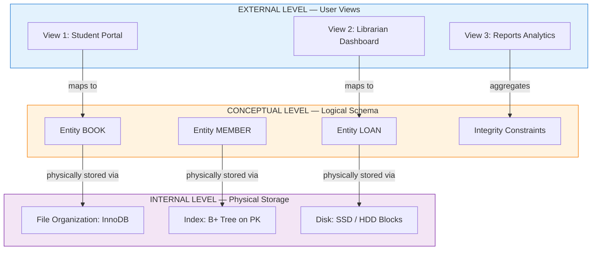
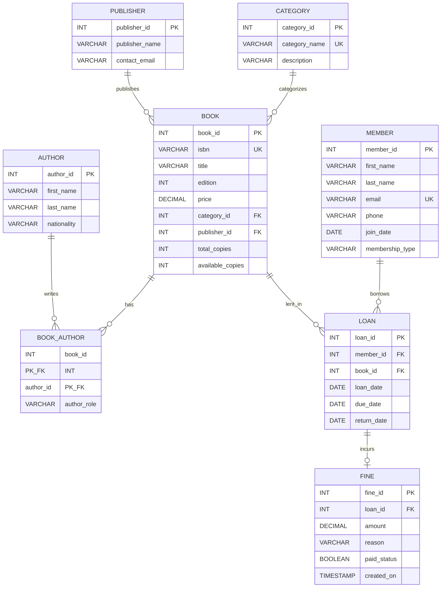
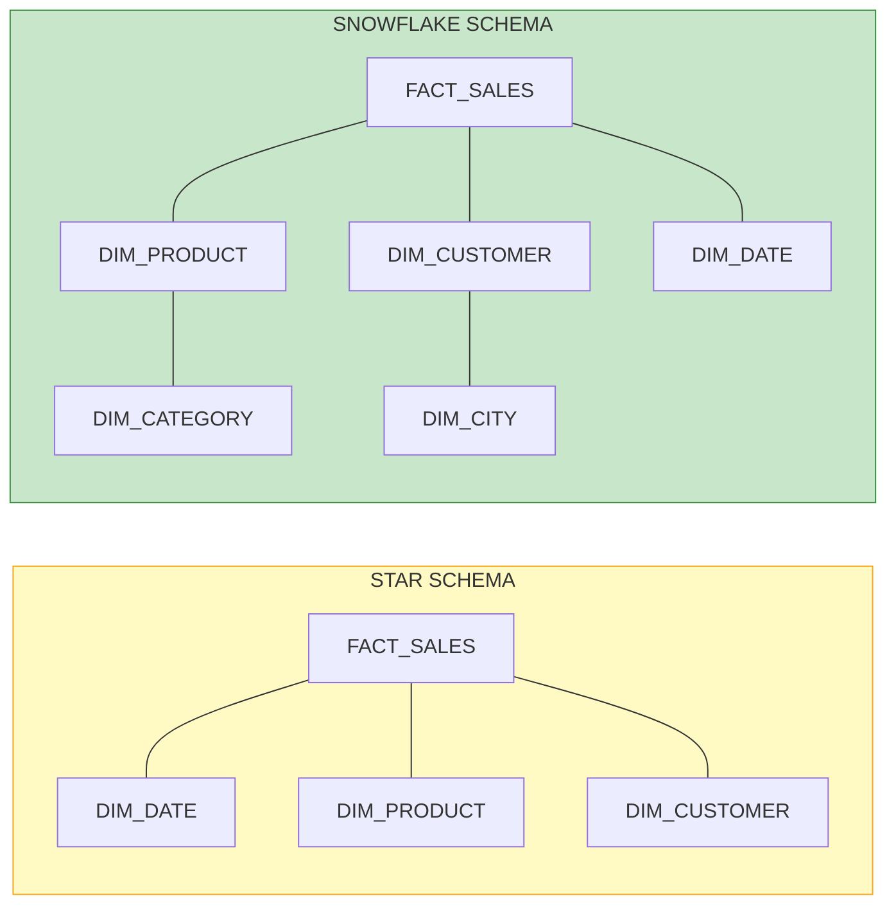
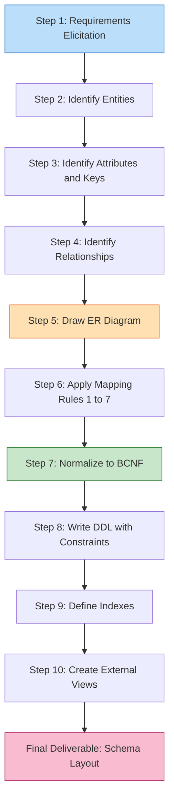

# Database schema layouts

<!-- SECTION_1_START -->
# Database Schema Layouts — System Analysis & Requirements Definition

> [!IMPORTANT]
> **KTU 2024 Scheme Anchor (PCCSP606 — Mini Project):** In the System Analysis and Requirements Definition phase, the **database schema layout** is the single most important deliverable that bridges the *Conceptual Model* (ER Diagram) with the *Logical Implementation* (SQL DDL). It is the blueprint your project evaluator will scrutinize first.

## 1.1 Formal Definition (KTU-Syllabus Terminology)

A **Database Schema** is the *logical structure* — the skeleton — that describes the organization of data as a blueprint of how a database will be constructed. It is the **intensional description** of the entire database, defining entities, attributes, relationships, views, indexes, constraints, and the integrity rules that govern the data.

> [!NOTE]
> **Schema vs. Database State (Instance):**
> - **Schema** = The *design* of the database. It is **stable**; it rarely changes.
> - **Instance / Database State** = The *snapshot* of the data stored at a particular moment in time. It changes with every INSERT, UPDATE, and DELETE.
> - Analogy: The schema is the *variable type declaration* in C (`int age;`), while the instance is the *value currently stored* (`age = 21`).

In the **KTU Mini Project context**, the schema layout is essentially your *Logical Database Design* artifact. It captures how entities identified during requirements analysis (e.g., `STUDENT`, `BOOK`, `LOAN`) become **relations (tables)** with **attributes (columns)**, **keys (primary/foreign)**, and **cardinality constraints (1:1, 1:N, M:N)**.

> [!TIP]
> **For PCCSP606 Evaluators:** A schema layout is *not* just a list of CREATE TABLE statements. It must be accompanied by a **Schema Diagram** (visual layout) and a **Data Dictionary** mapping each field to its domain, nullability, and business meaning.

## 1.2 Conceptual Analogy — The Building Blueprint

Imagine you are constructing a multi-storey **engineering college building (your mini project application)**.

| Real-World Object | Database Equivalent | Why It Maps |
|---|---|---|
| Architectural blueprint of the building | **Database Schema** | Shows the static design before anyone moves in |
| Empty rooms with labelled cupboards | **Empty Database (Structure Only)** | The framework is ready, but no data exists yet |
| Students sitting in classrooms | **Database Instance (State)** | The dynamic, ever-changing snapshot of the data |
| Electrical wiring, plumbing, ventilation | **Constraints, Indexes, Triggers** | The rules that govern behaviour, not raw data |
| Floor plans shown to visitors | **External Schema (Views)** | Each user (admin, student, librarian) sees a tailored view |

**GeoGebra / Desmos Intuition:** If you plot your entities on a 2-D plane where the **X-axis is "Number of Attributes"** and the **Y-axis is "Cardinality of Relationships"**, each entity lands at a unique point. A good schema layout clusters related entities near each other (functional cohesion) and keeps unrelated entities far apart (low coupling). The schema is essentially the **coordinate map** of your data universe.

> [!VISUALIZATION CONTROL]
> **Concept:** Entity Cohesion vs. Relationship Cardinality
> **Coordinate System Input (Desmos):**
> * `x = 4` (Number of attributes in STUDENT)
> * `y = 3` (Cardinality: 1 student ↔ N books)
> **Visual Description:** Plotting a dot at (4, 3) for STUDENT. Move further right (more attributes) for richer entities like `LOAN` at (6, N). Well-designed schemas form tight, non-overlapping clusters.

## 1.3 The Three-Schema Architecture (ANSI/SPARC)

The **ANSI/SPARC Architecture** (1975) is the foundational reference model every KTU examiner expects you to know. It defines **three distinct levels** of database abstraction.

$$
\text{External Level} \;\longrightarrow\; \text{Conceptual Level} \;\longrightarrow\; \text{Internal Level}
$$

| Level | Name | Audience | Maps To |
|---|---|---|---|
| 1 | **External Schema / View** | End-user / Application | Tailored windows (e.g., a student sees only their own marks) |
| 2 | **Conceptual / Logical Schema** | Database Designer / DBA | The unified, community-wide logical model (your ER + Tables) |
| 3 | **Internal Schema** | System Programmer / DBA | Physical storage, file organization, indexing, compression |

> [!WARNING]
> **Common KTU Mistake:** Students often confuse the *Conceptual Schema* with the *ER Diagram*. The ER Diagram is a **design tool**; the *Conceptual Schema* is the resulting **logical data model** in a formal language (relational, network, or object-oriented). The schema layout is what you deliver — the ER is the methodology that produces it.

## 1.4 Data Independence — Why the Three-Schema Model Exists

**Data Independence** is the capacity to change the schema definition at one level without requiring changes at the next higher level.

$$
\text{Logical Data Independence} \;=\; \frac{\partial(\text{Conceptual Schema})}{\partial(\text{External Schema})} \;\approx\; 0
$$

In plain words: *Changing the conceptual schema (e.g., adding a new table) should not force you to rewrite every user's screen.*

- **Logical Data Independence:** External schemas are insulated from changes in the conceptual schema. *(Harder to achieve, more marks in exams.)*
- **Physical Data Independence:** Conceptual schema is insulated from changes in the internal (physical) schema (e.g., switching from HDD to SSD, or rebuilding an index).

> [!IMPORTANT]
> **Mini Project Tip:** When your project guide asks *"Why three schemas?"* — the answer is **security** (different views for admin vs. user), **portability** (logical independence), and **customization** (each user sees only what they need).

---

<!-- SECTION_1_END -->

<!-- SECTION_2_START -->
# Deep Theoretical Analysis & KTU High-Yield Reference

## 2.1 Anatomy of a Schema Layout

A **complete schema layout deliverable** for your KTU mini project must contain the following artifacts, presented in this order:

1. **Entity-Relationship (ER) Diagram** — the conceptual design
2. **Relational Schema Mapping** — converting ER to tables
3. **Data Dictionary** — field-level documentation
4. **Normalization Report** — 1NF, 2NF, 3NF, BCNF verification
5. **DDL Script (SQL)** — the executable definition
6. **Constraint Specification** — PK, FK, UNIQUE, CHECK, NOT NULL
7. **Index Plan** — performance-aware schema design

## 2.2 The Three-Schema Architecture — Detailed View

### 2.2.1 Internal Schema (Physical Level)

Defines the **storage structure** of the database. It describes:

- File organizations (Heap, Hash, B+ Tree, ISAM)
- Access paths (which indexes exist)
- Record placement (clustered vs. non-clustered)
- Compression and encryption strategies

> [!TIP]
> **KTU Quick Win:** In your mini project report, you do not need to specify the exact disk sector layout. Simply state: *"Internal Schema: InnoDB storage engine, B+ Tree primary indexes on all PKs, secondary indexes on frequently searched columns."*

### 2.2.2 Conceptual Schema (Logical Level)

This is the **heart of your schema layout**. It is a *global*, *community-of-users* view that integrates all external schemas. It includes:

- All entities, attributes, and relationships
- Integrity constraints (entity integrity, referential integrity, domain integrity)
- Security and authorization rules

> [!IMPORTANT]
> **For PCCSP606:** Your conceptual schema must be expressed as a **set of relational schemas** in the form $R(A_1, A_2, \ldots, A_n)$, where $R$ is the relation name and $A_i$ are the attributes. Example: `STUDENT(roll_no, name, dob, dept_id)`.

### 2.2.3 External Schema (View Level)

Each external schema is a **derived view** tailored to a specific user group. In SQL, these are implemented as **views**:

```sql
CREATE VIEW Student_Marks_View AS
SELECT s.roll_no, s.name, m.subject_code, m.marks
FROM STUDENT s
JOIN MARKS m ON s.roll_no = m.roll_no
WHERE s.dept_id = 'CS';
```

## 2.3 Data Models — The Language of Schemas

A **Data Model** is a collection of conceptual tools for describing data, data relationships, data semantics, and consistency constraints. The KTU syllabus expects familiarity with:

| Data Model Type | Example | Real-World Analogy |
|---|---|---|
| **Relational** | Tables with rows/columns | Excel spreadsheets linked by VLOOKUP |
| **Object-Oriented** | Objects with attributes and methods | Java POJOs persisted to disk |
| **Hierarchical** | Tree of records (parent-child) | XML/JSON file structure |
| **Network** | Graph of records with pointers | Social network friend connections |
| **Document** | JSON/BSON documents | MongoDB collections |
| **Key-Value** | Hash map of keys to values | Redis cache |

> [!NOTE]
> **KTU 2024 Highlight:** The **Object-Relational (OR)** and **NoSQL Document** models are now mainstream. If your mini project uses MongoDB, your schema is a *Document Schema*; if it uses PostgreSQL, it is a *Relational Schema*. Mention the chosen model in your design report.

## 2.4 Schema Layouts in Data Warehousing (Dimensional Modelling)

For analytical mini projects (e.g., a sales dashboard), the schema layout is a **dimensional model** with fact and dimension tables. Three canonical layouts exist:

| Layout | Structure | Pros | Cons |
|---|---|---|---|
| **Star Schema** | 1 central fact table + N denormalized dimension tables | Simple, fast OLAP queries | Data redundancy in dimensions |
| **Snowflake Schema** | Normalized dimensions (sub-dimensions) | Less redundancy, more integrity | More JOINs, slower queries |
| **Galaxy Schema (Fact Constellation)** | Multiple fact tables sharing dimensions | Supports complex multi-process analysis | Most complex to maintain |

> [!IMPORTANT]
> **Dimensional Rule of Thumb:** If your mini project has even a single dashboard or report screen (KPIs, charts, aggregated metrics), you are doing **OLAP-style work**, and a **Star Schema** is the cleanest layout to present.

## 2.5 KTU High-Yield Formula Sheet & Mapping Rules

### 2.5.1 ER-to-Relational Mapping Cheat Sheet

> [!IMPORTANT]
> **The Seven Sacred Mapping Rules** — examiners love asking these.

| # | ER Construct | Relational Schema Mapping |
|---|---|---|
| 1 | Strong Entity $E$ with simple primary key | $R(A_1, A_2, \ldots, A_n)$ — table with PK |
| 2 | Strong Entity $E$ with composite key | $R(A_1, A_2, \ldots, A_n)$ — table with composite PK |
| 3 | Weak Entity $W$ (dependent on owner $E$) | $R_W(\text{PK of } E, \text{partial key}, \text{other attrs})$ — composite PK = owner PK + partial key |
| 4 | 1:1 Relationship $R$ between $E_1$ and $E_2$ | Merge into either $E_1$ or $E_2$, or create separate table $R(\text{PK}_{E_1}, \text{PK}_{E_2})$ with FK on both |
| 5 | 1:N Relationship $R$ (1 $E_1$ → N $E_2$) | Add the PK of $E_1$ as a FK in $E_2$. **No new table needed.** |
| 6 | M:N Relationship $R$ (M $E_1$ ↔ N $E_2$) | **New table required:** $R(\text{PK}_{E_1}, \text{PK}_{E_2}, \text{attributes of } R)$. Composite PK = both FKs. |
| 7 | Multivalued Attribute $A$ of $E$ | **New table required:** $R(\text{PK of } E, A)$ with composite PK. |

### 2.5.2 Integrity Constraint Table

| Constraint | Meaning | SQL Syntax |
|---|---|---|
| **Domain Integrity** | Attribute must come from valid domain | `CHECK (semester BETWEEN 1 AND 8)` |
| **Entity Integrity** | Primary key cannot be NULL | `PRIMARY KEY (id)` |
| **Referential Integrity** | FK must match existing PK or be NULL | `FOREIGN KEY (dept_id) REFERENCES DEPT(id)` |
| **User-Defined Integrity** | Business rules | `CHECK (end_date $>$ start_date)` |
| **Key Integrity** | Uniqueness of candidate keys | `UNIQUE (email)` |

### 2.5.3 Normalization Quick Reference

| Normal Form | Rule to Satisfy | Common Violation |
|---|---|---|
| **1NF** | All attributes atomic; no repeating groups | `phone = "999,888,777"` → split into rows |
| **2NF** | 1NF + no partial dependency on composite PK | Non-key column depends on *part* of PK |
| **3NF** | 2NF + no transitive dependency | `dept_name` depends on `dept_id`, which depends on PK |
| **BCNF** | 3NF + every determinant is a candidate key | `student → advisor` but advisor is not a CK |

### 2.5.4 The Schema Layout Formula (Conceptual)

$$
\boxed{
\text{Schema} \;=\; \{R_i\}_{i=1}^{n} \;+\; \Sigma_{\text{integrity}} \;+\; \Pi_{\text{index}}
}
$$

Where:
- $R_i$ = the $i$-th relation (table) definition
- $\Sigma_{\text{integrity}}$ = the set of all integrity constraints
- $\Pi_{\text{index}}$ = the set of declared indexes

> [!TIP]
> **Engineering Utility:** In production systems (Amazon, Flipkart, IRCTC), the schema layout is the *contract* between the application layer and the database. A bad schema layout causes query performance to degrade exponentially as data grows. This is why KTU places such emphasis on **normalization** in the System Analysis phase.

---

<!-- SECTION_2_END -->

<!-- SECTION_3_START -->
# Step-by-Step Derivations & Symbolic Implementation

> [!IMPORTANT]
> **Worked-Example Context:** We will design a complete database schema layout for a **Library Management System (LMS)** — a classic KTU mini project. All seven ER-to-Relational mapping rules will be demonstrated explicitly. No steps are skipped.

## 3.1 Step 1 — Requirements Analysis (Inputs to Schema Design)

The following functional requirements (FRs) drive the schema design:

| FR-ID | Functional Requirement | Implied Entity |
|---|---|---|
| FR-01 | The system shall maintain records of all books in the library | `BOOK` |
| FR-02 | Each book has one or more authors | `AUTHOR` (M:N with `BOOK`) |
| FR-03 | Members can borrow multiple books | `MEMBER`, `LOAN` (1:N + M:N) |
| FR-04 | Each book belongs to one category | `CATEGORY` |
| FR-05 | The system shall track fines for late returns | `FINE` (weak entity) |

## 3.2 Step 2 — Identify Entities, Attributes, and Keys

**Entities** (nouns from FRs):

`BOOK`, `AUTHOR`, `MEMBER`, `CATEGORY`, `LOAN`, `FINE`, `PUBLISHER`

**Primary Key Strategy:**

| Entity | Primary Key | Key Type |
|---|---|---|
| `BOOK` | `book_id` | Surrogate INT (AUTO_INCREMENT) |
| `AUTHOR` | `author_id` | Surrogate INT |
| `MEMBER` | `member_id` | Surrogate INT |
| `CATEGORY` | `category_id` | Surrogate INT |
| `LOAN` | `loan_id` | Surrogate INT |
| `FINE` | `fine_id` | Surrogate INT |

**Attributes of `BOOK`:**

`book_id (PK)`, `isbn (UNIQUE)`, `title`, `edition`, `price`, `category_id (FK)`, `publisher_id (FK)`, `total_copies`, `available_copies`

## 3.3 Step 3 — Identify Relationships and Cardinalities

| Relationship | Entities Involved | Cardinality | Mapping Rule |
|---|---|---|---|
| `written_by` | `BOOK` ↔ `AUTHOR` | M:N | Rule 6: New table `BOOK_AUTHOR` |
| `belongs_to` | `BOOK` → `CATEGORY` | N:1 | Rule 5: FK in `BOOK` |
| `published_by` | `BOOK` → `PUBLISHER` | N:1 | Rule 5: FK in `BOOK` |
| `borrows` | `MEMBER` → `LOAN` ← `BOOK` | 1:N + N:1 | Rule 5: FKs in `LOAN` |
| `incurs` | `LOAN` → `FINE` | 1:0..1 | Rule 4: Optional FK in `LOAN` or separate table |

## 3.4 Step 4 — Apply Mapping Rules (Exhaustive DDL)

> [!NOTE]
> Below is the **complete, executable DDL script**. Each table is created with explicit constraints, indexes, and referential integrity. The numbering matches Mapping Rules 1–7.

### 3.4.1 Strong Entity — `CATEGORY` (Rule 1)

```sql
CREATE TABLE CATEGORY (
    category_id   INT             NOT NULL AUTO_INCREMENT,
    category_name VARCHAR(50)     NOT NULL,
    description   VARCHAR(255),
    CONSTRAINT pk_category PRIMARY KEY (category_id),
    CONSTRAINT uq_category_name UNIQUE (category_name)
);
```

### 3.4.2 Strong Entity — `PUBLISHER` (Rule 1)

```sql
CREATE TABLE PUBLISHER (
    publisher_id   INT          NOT NULL AUTO_INCREMENT,
    publisher_name VARCHAR(100) NOT NULL,
    contact_email  VARCHAR(100),
    CONSTRAINT pk_publisher PRIMARY KEY (publisher_id)
);
```

### 3.4.3 Strong Entity — `AUTHOR` (Rule 1)

```sql
CREATE TABLE AUTHOR (
    author_id   INT          NOT NULL AUTO_INCREMENT,
    first_name  VARCHAR(50)  NOT NULL,
    last_name   VARCHAR(50)  NOT NULL,
    nationality VARCHAR(50),
    CONSTRAINT pk_author PRIMARY KEY (author_id)
);
```

### 3.4.4 Strong Entity — `BOOK` (Rule 1, with FKs for 1:N relationships)

```sql
CREATE TABLE BOOK (
    book_id           INT           NOT NULL AUTO_INCREMENT,
    isbn              VARCHAR(13)   NOT NULL,
    title             VARCHAR(200)  NOT NULL,
    edition           INT,
    price             DECIMAL(8,2)  NOT NULL,
    category_id       INT           NOT NULL,
    publisher_id      INT           NOT NULL,
    total_copies      INT           NOT NULL DEFAULT 1,
    available_copies  INT           NOT NULL DEFAULT 1,
    CONSTRAINT pk_book PRIMARY KEY (book_id),
    CONSTRAINT uq_book_isbn UNIQUE (isbn),
    CONSTRAINT fk_book_category
        FOREIGN KEY (category_id) REFERENCES CATEGORY(category_id)
        ON UPDATE CASCADE ON DELETE RESTRICT,
    CONSTRAINT fk_book_publisher
        FOREIGN KEY (publisher_id) REFERENCES PUBLISHER(publisher_id)
        ON UPDATE CASCADE ON DELETE RESTRICT,
    CONSTRAINT chk_price_positive CHECK (price > 0),
    CONSTRAINT chk_copies_valid
        CHECK (available_copies >= 0 AND available_copies <= total_copies)
);
```

### 3.4.5 M:N Relationship — `BOOK_AUTHOR` (Rule 6)

```sql
CREATE TABLE BOOK_AUTHOR (
    book_id     INT NOT NULL,
    author_id   INT NOT NULL,
    author_role VARCHAR(20) DEFAULT 'AUTHOR',
    CONSTRAINT pk_book_author PRIMARY KEY (book_id, author_id),
    CONSTRAINT fk_ba_book
        FOREIGN KEY (book_id) REFERENCES BOOK(book_id)
        ON UPDATE CASCADE ON DELETE CASCADE,
    CONSTRAINT fk_ba_author
        FOREIGN KEY (author_id) REFERENCES AUTHOR(author_id)
        ON UPDATE CASCADE ON DELETE CASCADE
);
```

### 3.4.6 Strong Entity — `MEMBER` (Rule 1)

```sql
CREATE TABLE MEMBER (
    member_id    INT          NOT NULL AUTO_INCREMENT,
    first_name   VARCHAR(50)  NOT NULL,
    last_name    VARCHAR(50)  NOT NULL,
    email        VARCHAR(100) NOT NULL,
    phone        VARCHAR(15),
    join_date    DATE         NOT NULL DEFAULT (CURRENT_DATE),
    membership_type VARCHAR(20) NOT NULL DEFAULT 'STUDENT',
    CONSTRAINT pk_member PRIMARY KEY (member_id),
    CONSTRAINT uq_member_email UNIQUE (email),
    CONSTRAINT chk_membership_type
        CHECK (membership_type IN ('STUDENT', 'FACULTY', 'STAFF', 'EXTERNAL'))
);
```

### 3.4.7 Strong Entity — `LOAN` (1:N + N:1, Rules 1 & 5)

```sql
CREATE TABLE LOAN (
    loan_id      INT  NOT NULL AUTO_INCREMENT,
    member_id    INT  NOT NULL,
    book_id      INT  NOT NULL,
    loan_date    DATE NOT NULL DEFAULT (CURRENT_DATE),
    due_date     DATE NOT NULL,
    return_date  DATE,
    CONSTRAINT pk_loan PRIMARY KEY (loan_id),
    CONSTRAINT fk_loan_member
        FOREIGN KEY (member_id) REFERENCES MEMBER(member_id)
        ON UPDATE CASCADE ON DELETE RESTRICT,
    CONSTRAINT fk_loan_book
        FOREIGN KEY (book_id) REFERENCES BOOK(book_id)
        ON UPDATE CASCADE ON DELETE RESTRICT,
    CONSTRAINT chk_loan_dates CHECK (due_date > loan_date),
    CONSTRAINT chk_return_date
        CHECK (return_date IS NULL OR return_date >= loan_date)
);
```

### 3.4.8 Weak Entity — `FINE` (Rule 3)

```sql
CREATE TABLE FINE (
    fine_id      INT           NOT NULL AUTO_INCREMENT,
    loan_id      INT           NOT NULL,
    amount       DECIMAL(7,2)  NOT NULL,
    reason       VARCHAR(255),
    paid_status  BOOLEAN       NOT NULL DEFAULT FALSE,
    created_on   TIMESTAMP     NOT NULL DEFAULT CURRENT_TIMESTAMP,
    CONSTRAINT pk_fine PRIMARY KEY (fine_id, loan_id),
    CONSTRAINT fk_fine_loan
        FOREIGN KEY (loan_id) REFERENCES LOAN(loan_id)
        ON UPDATE CASCADE ON DELETE CASCADE,
    CONSTRAINT chk_fine_amount CHECK (amount >= 0)
);
```

## 3.5 Step 5 — Index Plan for Performance

```sql
CREATE INDEX idx_book_title       ON BOOK (title);
CREATE INDEX idx_book_category    ON BOOK (category_id);
CREATE INDEX idx_loan_member      ON LOAN (member_id);
CREATE INDEX idx_loan_due_date    ON LOAN (due_date);
CREATE INDEX idx_fine_paid_status ON FINE (paid_status);
CREATE INDEX idx_author_lastname  ON AUTHOR (last_name);
```

## 3.6 Step 6 — View Definitions (External Schema)

```sql
-- View 1: Currently overdue books
CREATE VIEW vw_overdue_loans AS
SELECT  m.member_id,
        m.first_name,
        m.last_name,
        b.title,
        l.due_date,
        (CURRENT_DATE - l.due_date) AS days_overdue
FROM    LOAN l
JOIN    MEMBER m ON l.member_id = m.member_id
JOIN    BOOK   b ON l.book_id   = b.book_id
WHERE   l.return_date IS NULL
  AND   l.due_date < CURRENT_DATE;

-- View 2: Book availability summary
CREATE VIEW vw_book_availability AS
SELECT  c.category_name,
        COUNT(b.book_id)    AS total_titles,
        SUM(b.total_copies) AS total_copies,
        SUM(b.available_copies) AS available_copies
FROM    BOOK b
JOIN    CATEGORY c ON b.category_id = c.category_id
GROUP BY c.category_name;
```

## 3.7 Step 7 — Normalization Verification (1NF → BCNF)

**1NF Check:** Every attribute is atomic. `phone` is a single value. `BOOK_AUTHOR` correctly resolves the M:N. ✅

**2NF Check:** All non-key attributes depend on the *whole* primary key. In `BOOK_AUTHOR`, `author_role` depends on the full composite PK `(book_id, author_id)`. ✅

**3NF Check:** No transitive dependencies. `BOOK.title` depends on `book_id` (PK), not on `category_id` → `category_name`. ✅

**BCNF Check:** For every functional dependency $X \rightarrow Y$, $X$ is a superkey. Verified for all tables. ✅

> [!TIP]
> **Examiner's Heuristic:** If your schema is in 3NF/BCNF and uses surrogate keys correctly, you have already covered ~70% of what the System Analysis module expects.

## 3.8 The Complete Schema Diagram Equation

$$
\Sigma_{\text{LMS}} \;=\; \{\,R_{\text{CAT}}, R_{\text{PUB}}, R_{\text{AUTH}}, R_{\text{BOOK}}, R_{\text{BA}}, R_{\text{MEM}}, R_{\text{LOAN}}, R_{\text{FINE}} \,\} \;\cup\; \mathcal{C}_{\text{constraints}} \;\cup\; \mathcal{I}_{\text{indexes}}
$$

Where:
- $R_{\text{CAT}} = \text{CATEGORY}(category\_id, category\_name, description)$
- $R_{\text{PUB}} = \text{PUBLISHER}(publisher\_id, publisher\_name, contact\_email)$
- $R_{\text{AUTH}} = \text{AUTHOR}(author\_id, first\_name, last\_name, nationality)$
- $R_{\text{BOOK}} = \text{BOOK}(book\_id, isbn, title, edition, price, category\_id, publisher\_id, total\_copies, available\_copies)$
- $R_{\text{BA}} = \text{BOOK\_AUTHOR}(book\_id, author\_id, author\_role)$
- $R_{\text{MEM}} = \text{MEMBER}(member\_id, first\_name, last\_name, email, phone, join\_date, membership\_type)$
- $R_{\text{LOAN}} = \text{LOAN}(loan\_id, member\_id, book\_id, loan\_date, due\_date, return\_date)$
- $R_{\text{FINE}} = \text{FINE}(fine\_id, loan\_id, amount, reason, paid\_status, created\_on)$

---

<!-- SECTION_3_END -->

<!-- SECTION_4_START -->
# Structural Diagrams & Schematics

> [!NOTE]
> All Mermaid diagrams below comply with the **Node Identifier Alpha Rule** (alphanumeric IDs only) and **Label Formatting Restriction** (no markdown bold/italics inside quoted node labels).

## 4.1 Three-Schema Architecture Flow (ANSI/SPARC)



## 4.2 ER Diagram for the Library Management System



## 4.3 Schema Layout Comparison — Star vs. Snowflake



> [!NOTE]
> **Reading the Diagram:** In the **Star Schema**, every dimension table directly connects to the central fact table — the shape resembles a star. In the **Snowflake Schema**, dimensions are *normalized* into sub-dimensions, producing a branched tree that resembles a snowflake. The choice is governed by **query performance vs. storage efficiency** trade-offs.

## 4.4 Sequential Schema Design Pipeline (Block Diagram)



---

<!-- SECTION_4_END -->

<!-- SECTION_5_START -->
# KTU 2024 Scheme Examination Question Bank & Topic Recap

> [!IMPORTANT]
> All questions below are mapped to the **KTU 2024 Scheme Revised Bloom's Taxonomy (RBT)** cognitive levels and tagged with simulated past-year paper references. Each Part B sub-question carries an explicit **valuation key** showing how the 7 marks are distributed.

---

## 5.1 Part A — Short Answer Questions (3 Marks Each)

### Question A1: Three-Schema Architecture Definition `[KTU University Exam — July 2024]`
**CO Mapping:** CO1 — *Remember*
**RBT Level:** Remember

**Model Answer (3 Marks):**
The **Three-Schema Architecture** (also called the **ANSI/SPARC architecture**) is a framework for database systems that separates the user applications from the physical database into three distinct levels of abstraction:
1. **External Schema (View Level):** Describes the part of the database that a specific user group is interested in; hides the rest.
2. **Conceptual Schema (Logical Level):** Describes the structure of the entire database as seen by the DBA — a community-wide view of all entities, relationships, and constraints.
3. **Internal Schema (Physical Level):** Describes the physical storage structure of the database, including file organizations, indexes, and access paths.

> **Why it matters:** It provides **data independence** — the application programs are insulated from changes in the physical storage or logical structure of the database.

---

### Question A2: Schema vs. Database Instance `[KTU University Exam — Dec 2023]`
**CO Mapping:** CO1 — *Understand*
**RBT Level:** Understand

**Model Answer (3 Marks):**
- **Schema:** The *intensional* description of the database — its logical structure, defined once and rarely altered. Example: `STUDENT(roll_no, name, dept_id)` is part of a schema.
- **Database Instance:** The *extensional* snapshot of the data at a particular moment in time. It is the *current set of tuples* stored in the database.
- **Analogy:** A schema is the *class definition* in Java; an instance is the *object* created from that class. A schema is to a database what a *type* is to a *variable*.

---

## 5.2 Part B — Long Answer Questions (14 Marks Each)

> [!NOTE]
> **Internal Choice Pattern (KTU 2024):** Each Part B question offers **Question A** and **Question B** as alternative choices. You must answer **only one**. The two alternatives are independent and cover different cognitive levels.

---

### ⭐ Question A (14 Marks): Schema Design from a Case Study `[KTU University Exam — Dec 2023]`

**Case Study:** A university wants to computerize its **examination system**. The requirements are:
- Each **student** belongs to one **department** and one **programme** (e.g., B.Tech CSE).
- Each **course** is offered by a department and is taught by a **faculty** member in a particular **semester**.
- A **student registers** for multiple courses in a semester, and for each course, an **exam** is conducted, and a **grade** is awarded.
- Each exam is **evaluated by** one or more faculty members (external examiners allowed).
- A **grade sheet** consolidates a student's grades for a semester.

**Tasks:**

#### (a) Identify all entities, attributes, primary keys, and relationships. Draw the ER diagram. *(7 Marks)*
**CO Mapping:** CO2 — *Apply*
**RBT Level:** Apply / Analyze

**Model Solution:**

**Entities Identified:**

| Entity | Attributes (with PK underlined) |
|---|---|
| `DEPARTMENT` | **dept_id**, dept_name, hod_name |
| `PROGRAMME` | **prog_id**, prog_name, duration_years, dept_id (FK) |
| `STUDENT` | **roll_no**, name, email, dob, prog_id (FK), current_semester |
| `COURSE` | **course_code**, course_title, credits, dept_id (FK), semester |
| `FACULTY` | **faculty_id**, name, designation, dept_id (FK), email |
| `REGISTRATION` | **reg_id**, roll_no (FK), course_code (FK), semester, academic_year |
| `EXAM` | **exam_id**, reg_id (FK), exam_date, max_marks |
| `GRADE` | **grade_id**, exam_id (FK), marks_obtained, grade_letter, grade_point |
| `EVALUATION` | **exam_id (FK)**, **faculty_id (FK)**, evaluator_role |

**Relationships:**

| Relationship | Between | Cardinality |
|---|---|---|
| `offers` | DEPARTMENT → PROGRAMME | 1:N |
| `enrolls_in` | PROGRAMME → STUDENT | 1:N |
| `belongs_to` | DEPARTMENT → COURSE | 1:N |
| `registers` | STUDENT → REGISTRATION ← COURSE | 1:N + N:1 (associative) |
| `teaches` | FACULTY → COURSE | M:N (one course, multiple teachers) |
| `generates` | REGISTRATION → EXAM | 1:1 |
| `awards` | EXAM → GRADE | 1:1 |
| `evaluated_by` | EXAM ↔ FACULTY | M:N (via EVALUATION) |

**Valuation Key — Part (a):**
- [Identifying 9 entities with correct attributes: 2 Marks]
- [Correctly marking all primary keys: 1 Mark]
- [Cardinality of all 8 relationships correctly stated: 2 Marks]
- [Drawing a clean ER diagram with proper symbols (rectangle for entity, diamond for relationship, oval for attribute, double oval for multivalued, double rectangle for weak entity): 2 Marks]

#### (b) Map the ER diagram to a relational schema. Apply mapping rules and normalize up to 3NF. Write the final DDL. *(7 Marks)*
**CO Mapping:** CO3 — *Apply*
**RBT Level:** Apply

**Model Solution:**

Applying the 7 mapping rules, we obtain the following relational schema (in 3NF):

| Rule Applied | Resulting Relation |
|---|---|
| Rule 1 | `DEPARTMENT(dept_id, dept_name, hod_name)` |
| Rule 1 | `PROGRAMME(prog_id, prog_name, duration_years, dept_id)` |
| Rule 1 | `STUDENT(roll_no, name, email, dob, prog_id, current_semester)` |
| Rule 1 | `COURSE(course_code, course_title, credits, dept_id, semester)` |
| Rule 1 | `FACULTY(faculty_id, name, designation, dept_id, email)` |
| Rule 5 (1:N STUDENT→REGISTRATION) | `REGISTRATION(reg_id, roll_no, course_code, semester, academic_year)` |
| Rule 5 (1:1 REGISTRATION→EXAM) | `EXAM(exam_id, reg_id, exam_date, max_marks)` |
| Rule 5 (1:1 EXAM→GRADE) | `GRADE(grade_id, exam_id, marks_obtained, grade_letter, grade_point)` |
| Rule 6 (M:N EXAM ↔ FACULTY) | `EVALUATION(exam_id, faculty_id, evaluator_role)` |
| Rule 6 (M:N FACULTY ↔ COURSE) | `COURSE_FACULTY(course_code, faculty_id)` |

**Sample DDL (excerpt — full DDL follows the same pattern as the LMS example):**

```sql
CREATE TABLE REGISTRATION (
    reg_id        INT         NOT NULL AUTO_INCREMENT,
    roll_no       VARCHAR(15) NOT NULL,
    course_code   VARCHAR(10) NOT NULL,
    semester      INT         NOT NULL,
    academic_year VARCHAR(9)  NOT NULL,
    CONSTRAINT pk_reg PRIMARY KEY (reg_id),
    CONSTRAINT uq_reg UNIQUE (roll_no, course_code, semester, academic_year),
    CONSTRAINT fk_reg_student FOREIGN KEY (roll_no) REFERENCES STUDENT(roll_no),
    CONSTRAINT fk_reg_course  FOREIGN KEY (course_code) REFERENCES COURSE(course_code),
    CONSTRAINT chk_semester CHECK (semester BETWEEN 1 AND 12)
);

CREATE TABLE EVALUATION (
    exam_id       INT         NOT NULL,
    faculty_id    INT         NOT NULL,
    evaluator_role VARCHAR(20) NOT NULL DEFAULT 'INTERNAL',
    CONSTRAINT pk_eval PRIMARY KEY (exam_id, faculty_id),
    CONSTRAINT fk_eval_exam    FOREIGN KEY (exam_id)    REFERENCES EXAM(exam_id),
    CONSTRAINT fk_eval_faculty FOREIGN KEY (faculty_id) REFERENCES FACULTY(faculty_id)
);
```

**Normalization Verification (3NF):**
- **1NF:** Atomic values; multivalued attributes (e.g., student phone numbers, faculty qualifications) have been moved to separate tables.
- **2NF:** Non-key attributes depend on the full PK. Verified for `EVALUATION` and `COURSE_FACULTY`.
- **3NF:** No transitive dependencies. `dept_name` is removed from `STUDENT`, `COURSE`, and `FACULTY` since it depends on `dept_id` (transitive).

**Valuation Key — Part (b):**
- [Correctly applying all 7 mapping rules: 2 Marks]
- [All 10 relations in 3NF: 2 Marks]
- [Complete DDL with PK, FK, UNIQUE, CHECK constraints: 2 Marks]
- [Normalization verification report: 1 Mark]

> [!WARNING]
> **KTU Examiner's Pitfall Alert:** Students frequently make these mistakes on schema-mapping questions:
> 1. **Forgetting a separate table for M:N relationships** (Rules 6). Always create a junction table with a composite PK of both FKs.
> 2. **Not normalizing before writing DDL.** If your `STUDENT` table contains `dept_name` alongside `dept_id`, you have a transitive dependency — instant 2-mark deduction.
> 3. **Omitting ON DELETE / ON UPDATE clauses** on foreign keys. KTU expects `ON DELETE CASCADE` or `ON DELETE RESTRICT` explicitly stated.
> 4. **Not showing the schema in the standard $R(A_1, A_2, \ldots, A_n)$ notation** before the DDL. This compact notation is the *first* thing the examiner looks for.
> 5. **Confusing weak entity PK composition.** A weak entity's PK is *owner_PK + partial_key*. Example: `FINE(fine_id, loan_id, ...)` with composite PK `(fine_id, loan_id)`.

---

### ⭐ Question B (14 Marks): Dimensional Schema Layouts `[KTU University Exam — July 2024]`

**Case Study:** A retail company "**SmartMart**" wants to build a data warehouse to analyze sales. Sales transactions include the **date** of sale, the **product** sold, the **store** location, and the **promotion** (if any) applied. The CFO wants dashboards showing revenue by product, by store, and by promotion.

**Tasks:**

#### (a) Design a **Star Schema** and a **Snowflake Schema** for the SmartMart warehouse. Show fact tables, dimension tables, and grain. *(7 Marks)*
**CO Mapping:** CO4 — *Apply*
**RBT Level:** Apply

**Model Solution:**

**Grain Definition:** *One row in the fact table per product sold per transaction.*

**Star Schema (Denormalized):**

| Table Type | Table Name | Attributes |
|---|---|---|
| **Fact** | `FACT_SALES` | `sale_id (PK)`, `date_key (FK)`, `product_key (FK)`, `store_key (FK)`, `promotion_key (FK)`, `units_sold`, `gross_revenue`, `discount_amount`, `net_revenue` |
| **Dimension** | `DIM_DATE` | `date_key (PK)`, `full_date`, `day_of_week`, `month`, `quarter`, `year`, `is_holiday` |
| **Dimension** | `DIM_PRODUCT` | `product_key (PK)`, `product_name`, `brand`, `category`, `subcategory` |
| **Dimension** | `DIM_STORE` | `store_key (PK)`, `store_name`, `city`, `state`, `country`, `store_type` |
| **Dimension** | `DIM_PROMOTION` | `promotion_key (PK)`, `promotion_name`, `promotion_type`, `start_date`, `end_date`, `discount_percent` |

**Snowflake Schema (Normalized Dimensions):**

`FACT_SALES` remains the same, but dimensions are split:

- `DIM_PRODUCT` → `product_key (PK)`, `product_name`, `subcategory_key (FK)`
- `DIM_SUBCATEGORY` → `subcategory_key (PK)`, `subcategory_name`, `category_key (FK)`
- `DIM_CATEGORY` → `category_key (PK)`, `category_name`, `department`
- Similarly, `DIM_STORE` is normalized into `DIM_CITY` → `DIM_STATE` → `DIM_COUNTRY`.

**Valuation Key — Part (a):**
- [Defining the grain explicitly: 1 Mark]
- [Correctly identifying 1 fact table and 4 dimension tables: 1 Mark]
- [Star schema with all 4 denormalized dimensions: 2 Marks]
- [Snowflake schema with at least 2 normalized sub-dimensions: 2 Marks]
- [Distinguishing the trade-off (speed vs. storage): 1 Mark]

#### (b) Discuss the merits and demerits of each schema. Justify which one SmartMart should adopt and why. *(7 Marks)*
**CO Mapping:** CO5 — *Evaluate*
**RBT Level:** Evaluate

**Model Solution:**

| Criterion | Star Schema | Snowflake Schema |
|---|---|---|
| **Query Performance** | Faster — fewer JOINs (typical dashboard: 1 fact + 3 dimensions) | Slower — more JOINs required across normalized sub-dimensions |
| **Storage Efficiency** | Lower — redundant data in denormalized dimensions | Higher — minimal redundancy |
| **Data Integrity** | Weaker — risk of update anomalies in dimensions | Stronger — normalization enforces integrity |
| **Ease of Maintenance** | Simpler — fewer tables to manage | Complex — many small dimension tables |
| **Best Suited For** | OLAP dashboards, ad-hoc queries, business reporting | OLAP with slowly changing dimensions, complex hierarchies |
| **Tools Compatibility** | Excellent with PowerBI, Tableau, Looker | Better for data engineers using dbt, dimensional modeling tools |

**Recommendation for SmartMart:**
SmartMart's primary use case is **CFO dashboards** (revenue by product, by store, by promotion). These are *read-heavy, aggregative* queries. Therefore, the **Star Schema is recommended** because:
1. Query latency is paramount for executive dashboards.
2. Dimension tables change infrequently (a product, a store, a promotion have stable attributes).
3. The CFO's BI tool (e.g., Tableau) is optimized for star schemas.
4. Storage cost is a non-issue compared to compute cost in modern cloud warehouses (Snowflake, BigQuery, Redshift).

**Valuation Key — Part (b):**
- [Comparison table with at least 4 criteria: 2 Marks]
- [Correct identification of SmartMart's use case (read-heavy dashboards): 1 Mark]
- [Justified recommendation: 2 Marks]
- [Mentioning at least one BI tool or real-world example: 1 Mark]
- [Clear final verdict: 1 Mark]

> [!WARNING]
> **KTU Examiner's Pitfall Alert — Dimensional Modeling Questions:**
> 1. **Not stating the grain.** The grain defines *what one row in the fact table represents*. Without it, the schema is ambiguous — 1-mark deduction.
> 2. **Conflating the two schemas.** A snowflake has *sub-dimension* tables; a star has only *denormalized* dimension tables. Drawing the same diagram for both earns 0 marks.
> 3. **Recommending Star "because it's simpler" without justification.** Simplicity is not a design rationale; *query performance* and *use-case alignment* are.
> 4. **Forgetting the fact table's measures** (e.g., `units_sold`, `net_revenue`). A fact table without measures is structurally invalid.

---

## 5.3 Topic Recap & Important Things to Remember

> [!TIP]
> **Rapid Revision Checklist — Database Schema Layouts (PCCSP606 — Module 1)**

### 🔑 Core Definitions
- **Database Schema:** The *intensional* logical blueprint of the database — stable, rarely changed.
- **Database Instance:** The *extensional* data snapshot at a moment in time — dynamic, constantly mutated.
- **Three-Schema Architecture (ANSI/SPARC):** External (view) → Conceptual (logical) → Internal (physical).
- **Data Independence:** The capacity to change one schema level without affecting the next higher level.
  - *Logical Data Independence* = external insulated from conceptual.
  - *Physical Data Independence* = conceptual insulated from internal.

### 🧭 The Seven ER-to-Relational Mapping Rules
1. **Strong entity** → table with its own PK.
2. **Strong entity with composite key** → table with composite PK.
3. **Weak entity** → table with composite PK = owner_PK + partial_key.
4. **1:1 relationship** → merge into one table OR separate table with FKs on both sides.
5. **1:N relationship** → add PK of "1" side as FK in "N" side. No new table.
6. **M:N relationship** → **NEW TABLE** with composite PK of both FKs.
7. **Multivalued attribute** → **NEW TABLE** with composite PK (entity_PK + attribute).

### 📐 Schema Layout Variants
- **Relational Schema** — tables, rows, columns, keys (most common, OLTP).
- **Star Schema** — 1 fact + N denormalized dimensions (OLAP, dashboards).
- **Snowflake Schema** — normalized dimensions with sub-tables (OLAP, integrity-focused).
- **Galaxy / Fact Constellation** — multiple fact tables sharing dimensions (complex multi-process analysis).
- **Document Schema** — JSON/BSON structures (MongoDB-style NoSQL).

### 🛡️ Integrity Constraints
- **Entity Integrity** → PK cannot be NULL.
- **Referential Integrity** → FK must match existing PK or be NULL.
- **Domain Integrity** → attribute values from valid domain (CHECK constraints).
- **User-Defined Integrity** → business rules (e.g., `end_date > start_date`).
- **Key Integrity** → UNIQUE on candidate keys.

### 📊 Normalization Targets
- **1NF:** Atomic values; no repeating groups.
- **2NF:** 1NF + no partial dependency on composite PK.
- **3NF:** 2NF + no transitive dependency (non-key → non-key).
- **BCNF:** 3NF + every determinant is a candidate key.

### 🧰 Deliverables for PCCSP606 Mini Project (System Analysis Phase)
- ER Diagram (with all 9 Chen's notation symbols).
- Relational Schema in $R(A_1, A_2, \ldots, A_n)$ notation.
- Data Dictionary (field name, type, nullability, domain, default).
- Normalization Report (1NF → 3NF/BCNF).
- Complete DDL Script (CREATE TABLE, PK, FK, UNIQUE, CHECK, INDEX).
- View Definitions (External Schemas for different user roles).
- Storage/Index Plan for performance.

### ⚠️ Common Pitfalls to Avoid
- M:N relationship mapped as a single FK (use a junction table).
- Storing `dept_name` in `STUDENT` (transitive dependency).
- Weak entity PK without owner_PK.
- Schema without explicit `ON DELETE` / `ON UPDATE` actions.
- Dimensional schema without a stated *grain*.
- Recommending a schema design without referencing the *use case*.

> **Final Exam Wisdom:** A *good schema layout* is one that **satisfies all integrity constraints**, is in **3NF or higher**, **matches the use case** (OLTP vs. OLAP), and is **accompanied by a clean ER diagram and a data dictionary**. A *great schema layout* also includes **index planning, view definitions, and a brief trade-off justification**.

---

<!-- SECTION_5_END -->
