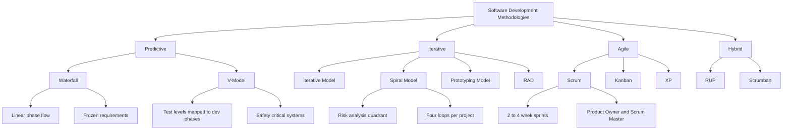
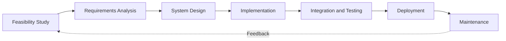
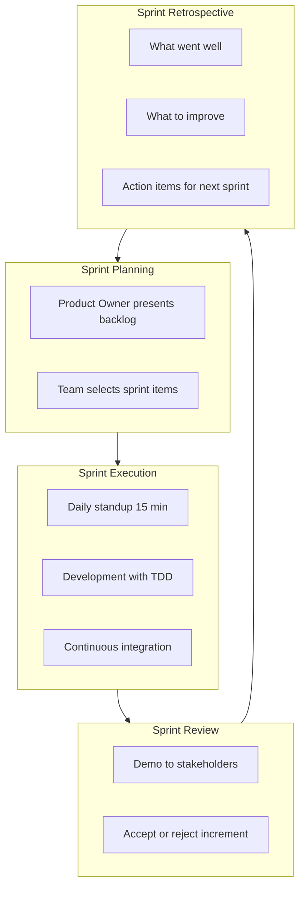
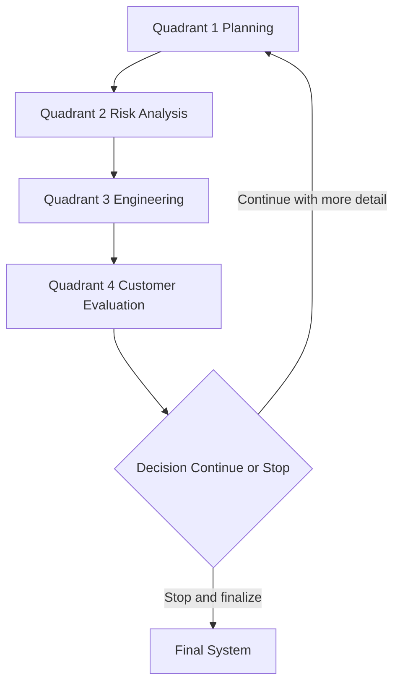
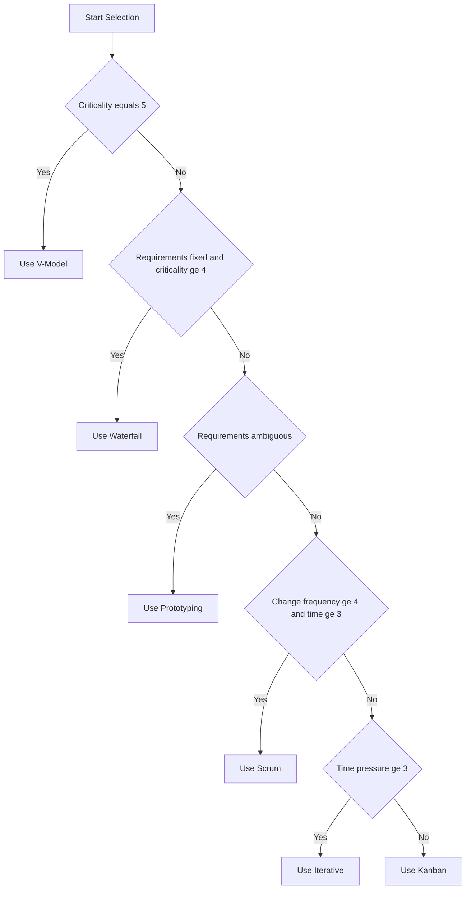

# Software development methodologies

<!-- SECTION_1_START -->
# Software Development Methodologies — Core Technical Foundation

## 1.1 Formal Academic Definition

A **Software Development Methodology (SDM)** is a structured, standardized, and repeatable framework comprising well-defined phases, deliverables, roles, artifacts, and quality checkpoints that govern the end-to-end engineering of a software system — from initial feasibility study and requirements elicitation through design, coding, verification, deployment, and long-term maintenance.

> [!IMPORTANT]
> **KTU 2024 Scheme Definition (PCCSP606 — Module 1):**
> A software development methodology is the *systematic engineering discipline* that binds **people**, **process**, and **product** together to ensure that a mini project is delivered on time, within scope, at the agreed quality bar, and with full traceability of requirements.

In KTU's outcome-based education (OBE) framework, methodology selection directly satisfies:

- **CO1** — *Identify* the real-world problem and define objectives.
- **CO2** — *Analyze* requirements and select a feasible development strategy.

## 1.2 Intuitive Overview — The "Architectural Blueprint" Analogy

Imagine you are building a house in Kerala during monsoon season.

| House-Building Reality | Software Engineering Parallel |
|---|---|
| You cannot pour the roof before laying the foundation. | You cannot code modules before gathering requirements. |
| The architect provides a blueprint to avoid structural collapse. | The methodology provides a process blueprint to avoid project failure. |
| Unforeseen rains demand flexible rescheduling. | Changing user requirements demand an iterative process model. |
| The plumber and electrician must coordinate their work. | Frontend and backend developers must sync via integration points. |

> [!NOTE]
> **Why this matters in a Mini Project:**
> In a single-semester PCCSP606 project, *not* having a methodology is the #1 cause of incomplete submissions. A methodology is not bureaucracy — it is **insurance against deadline failure**.

## 1.3 Core Vocabulary Anchors

- **SDLC** — Software Development Life Cycle (the *what*).
- **Methodology** — The *how* (the concrete process that implements the SDLC).
- **Deliverable** — A measurable artifact produced by a phase (e.g., SRS document, design diagram, test case).
- **Stakeholder** — Anyone affected by the system: end-users, sponsor, guide, examiner.
- **Iteration** — A single pass through a subset of phases that produces an increment.
- **Increment** — A working, demonstrable slice of the final product.

> [!VISUALIZATION CONTROL]
> **Concept:** Software Process as a Timeline
> **Coordinate Mapping:**
> * `$x$` = Time (weeks 1 → 16 of KTU semester)
> * `$y$` = Project Completeness (0% → 100%)
> * `f_linear(x) = 6.25 * x` = Waterfall progress (linear, uniform)
> * `f_iterative(x) = 100 * (1 - (0.85)^x)` = Agile progress (asymptotic, late acceleration)
> **Visual Description:** The student should observe that the *Agile curve rises slowly at first but accelerates toward the end*, while the *Waterfall curve is a straight ramp* — proving that Agile delivers working software in earlier iterations, even if the final polish happens last.

---

<!-- SECTION_1_END -->

<!-- SECTION_2_START -->
# Deep Theoretical Analysis & KTU High-Yield Methodology Matrix

## 2.1 The Grand Taxonomy of Methodologies

Software development methodologies are classified along a **predictability–flexibility spectrum**. The right choice depends on (a) clarity of requirements, (b) team size, (c) deadline rigidity, and (d) the novelty of the technology stack.

### 2.1.1 Sequential / Predictive Family

**a) Waterfall Model (Royce, 1970)**

- Linear, top-down flow: *Requirements → Design → Implementation → Verification → Maintenance*.
- Each phase must be signed off before the next begins.
- **Strengths:** Simple to manage, perfect for KTU mini projects with frozen problem statements.
- **Weakness:** Late discovery of defects; no room for changing requirements.

**b) V-Model (Verification \& Validation Model)**

- An *extension of Waterfall* where every development phase has a corresponding testing phase directly below it.
- The left arm = decomposition (requirements, system design, module design).
- The right arm = integration, system, and acceptance testing.

### 2.1.2 Iterative / Incremental Family

**c) Iterative Model**

- A baseline version is built quickly, then refined through repeated cycles.
- Each cycle adds *features* and *fixes defects*.

**d) Spiral Model (Boehm, 1986)**

- Combines iterative prototyping with **risk analysis** at every loop.
- Four quadrants per loop: *Planning, Risk Analysis, Engineering, Evaluation*.

**e) Prototyping Model**

- A throwaway or evolutionary prototype is built first to *clarify ambiguous requirements*.
- Particularly useful when the customer (e.g., a local client) is unsure of what they want.

### 2.1.3 Agile Family

**f) Scrum**

- Time-boxed **sprints** (typically 2–4 weeks).
- Roles: *Product Owner, Scrum Master, Development Team*.
- Artifacts: *Product Backlog, Sprint Backlog, Increment*.
- Ceremonies: *Sprint Planning, Daily Stand-up, Sprint Review, Retrospective*.

**g) Kanban**

- Continuous flow (no sprints). Work visualized on a **Kanban board** with columns: *To Do → In Progress → Testing → Done*.
- WIP (Work In Progress) limits prevent overload.

**h) Extreme Programming (XP)**

- Engineering practices: *Pair Programming, TDD, Continuous Integration, Refactoring*.
- Strong customer involvement on-site.

### 2.1.4 Hybrid / Lightweight Family

**i) Rational Unified Process (RUP)**

- Four phases: *Inception, Elaboration, Construction, Transition*.
- Use-case driven, architecture-centric.

**j) RAD (Rapid Application Development)**

- Heavy emphasis on user workshops, prototyping, and reuse of components.

## 2.2 The "Why" Behind Methodology Selection

The choice of methodology answers four critical project questions:

1. **When do I freeze the requirements?** (Waterfall: up front. Agile: continuously.)
2. **How do I handle change requests?** (Predictive: formal change control. Agile: welcome them.)
3. **When is the first working software delivered?** (Waterfall: at the end. Agile: every sprint.)
4. **How is risk managed?** (Spiral: explicit risk quadrant. Scrum: burndown chart + retrospectives.)

## 2.3 Real-World Engineering Utility

| Industry / Domain | Preferred Methodology | Engineering Justification |
|---|---|---|
| Medical device firmware (e.g., pacemakers) | **V-Model / Waterfall** | Regulatory traceability is mandatory; lives depend on it. |
| Startup MVPs (Minimum Viable Products) | **Scrum / Kanban** | Speed-to-market beats upfront documentation. |
| Safety-critical aerospace software | **Spiral + V-Model hybrid** | Risk must be quantified every cycle. |
| KTU Mini Projects (single semester) | **Iterative / Prototyping** | Requirements evolve as the student understands the domain. |
| Enterprise ERP customization | **RUP** | Multi-year, multi-vendor, must be architecture-driven. |

## 2.4 KTU High-Yield Methodology Comparison Cheat Sheet

> [!NOTE]
> **Critical for Board Exams:** The following table is the single most tested artifact in Module 1. Memorize the *phase names*, the *best-fit scenario*, and the *number of risk loops*.

| $\#$ | Methodology | Core Phases | Best For | Risk Handling | KTU Mini-Project Fit (1–5) |
|:---:|---|---|---|---|:---:|
| 1 | **Waterfall** | Req → Design → Impl → Test → Maint | Fixed, well-understood requirements | Formal change board | $4$ |
| 2 | **V-Model** | Req ↔ Acceptance; HLD ↔ System Test; LLD ↔ Integration Test | Safety-critical systems | Defect detection by test level | $3$ |
| 3 | **Iterative** | Plan → Implement → Review (repeated) | Medium-complexity evolving requirements | Incremental learning | $5$ |
| 4 | **Spiral** | Plan → Risk → Engineer → Evaluate (loops) | High-risk, high-budget projects | Explicit risk quadrant | $3$ |
| 5 | **Prototyping** | Req → Quick Proto → Refine → Build | Unclear user requirements | Throwaway prototype | $5$ |
| 6 | **Scrum** | Sprint cycles of Plan → Build → Test → Review | Dynamic requirements, small teams | Sprint retrospectives | $4$ |
| 7 | **Kanban** | Continuous flow with WIP limits | Maintenance \& support teams | WIP bottleneck visibility | $3$ |
| 8 | **XP** | Iterations with TDD, pair programming | Variable scope, code-quality focus | Continuous integration | $3$ |
| 9 | **RUP** | Inception → Elaboration → Construction → Transition | Large, distributed teams | Risk managed per phase | $2$ |
| 10 | **RAD** | Req → Prototype → Feedback → Refine | Tight deadlines, reusable components | User-driven validation | $4$ |

> [!IMPORTANT]
> **LaTeX safety note for the table above:** All mathematical symbols (`$\#$`, `$5$`) have been escaped using inline math mode (`$...$`) to prevent markdown corruption of the pipe-delimited table.

## 2.5 The Five Selection Criteria — Decision Heuristics

When selecting a methodology for your KTU mini project, score your project against these five parameters (each on a 0–5 scale):

- $C_1$ = Clarity of requirements at project start
- $C_2$ = Frequency of expected requirement changes
- $C_3$ = Team experience with the tech stack
- $C_4$ = Criticality of failure (safety / financial / social)
- $C_5$ = Time pressure (weeks available)

$$
\text{Score} = w_1 C_1 + w_2 C_2 + w_3 C_3 + w_4 C_4 + w_5 C_5, \quad \text{where} \sum w_i = 1
$$

**Decision rule:**

$$
\text{Methodology} = \begin{cases} \text{Waterfall} & \text{if } C_2 < 2 \text{ and } C_4 \geq 4 \\ \text{V-Model} & \text{if } C_4 = 5 \\ \text{Spiral} & \text{if } C_4 \geq 3 \text{ and budget allows risk analysis} \\ \text{Scrum} & \text{if } C_2 \geq 4 \text{ and } C_5 \geq 3 \\ \text{Iterative} & \text{if } C_5 \geq 3 \text{ (default KTU choice)} \end{cases}
$$

---

<!-- SECTION_2_END -->

<!-- SECTION_3_START -->
# Step-by-Step Derivations, Process Implementations \& Code

## 3.1 The Waterfall Model — Complete Phase-by-Phase Walkthrough

The Waterfall model is the **mandatory baseline** taught in KTU Module 1. Below is the exhaustive, non-skippable derivation of each phase as it must appear in your mini project report.

### Phase 1 — Feasibility Study

**Objective:** Determine whether the proposed system is technically, economically, and operationally viable.

**Sub-tasks:**

- **Technical feasibility:** Is the required hardware / software / language available in the college lab?
- **Economic feasibility:** Cost-benefit analysis. Will the project budget (₹0 for most KTU projects) permit any paid services?
- **Operational feasibility:** Will the end-user (e.g., college office) actually adopt the system?
- **Schedule feasibility:** Can it be done in 16 weeks?

**Deliverable:** *Feasibility Report* (typically 2–3 pages).

### Phase 2 — Requirements Analysis \& Specification

**Objective:** Capture *what* the system must do (not *how*).

**Deliverable:** **SRS Document** (Software Requirements Specification) following the IEEE 830 standard.

**Mandatory SRS Sections:**

1. Introduction (Purpose, Scope, Definitions)
2. Overall Description (Product perspective, user characteristics, constraints)
3. Specific Requirements (Functional \& Non-functional)
4. Appendices

### Phase 3 — System Design

**Objective:** Translate requirements into architecture.

**Sub-activities:**

- **High-Level Design (HLD):** System architecture, database schema, module decomposition.
- **Low-Level Design (LLD):** Algorithms, class diagrams, sequence diagrams.

**Deliverable:** **SDD** (Software Design Description) with UML diagrams.

### Phase 4 — Implementation / Coding

**Objective:** Translate design into executable code.

**Best practices enforced in this phase:**

- Coding standards (PEP-8 for Python, Google Java Style).
- Version control with Git (mandatory in modern KTU evaluations).
- Daily commits.

### Phase 5 — Integration \& Testing

**Objective:** Verify that the system meets the SRS.

**Test levels (mapped to the V-Model for cross-reference):**

- **Unit testing** → maps to LLD.
- **Integration testing** → maps to HLD.
- **System testing** → maps to SRS.
- **Acceptance testing (UAT)** → maps to user needs.

### Phase 6 — Deployment \& Maintenance

**Objective:** Deliver to the user and handle post-deployment issues.

- **Deployment types:** Big-bang, parallel, phased, pilot.
- **Maintenance types:** Corrective, adaptive, perfective, preventive.

## 3.2 The Iterative Model — Concrete Cycle Mapping for Mini Projects

For a KTU mini project of 16 weeks, the Iterative model is structured as **four iterations**:

| Iteration | Weeks | Focus | Deliverable |
|---|---|---|---|
| Iteration 1 | 1–4 | Core requirements + skeleton UI | Working skeleton with 1 main feature |
| Iteration 2 | 5–8 | Add 50\% of features | Mid-review demo |
| Iteration 3 | 9–12 | Remaining features + DB optimization | Pre-final demo |
| Iteration 4 | 13–16 | Testing + documentation + viva prep | Final submission |

## 3.3 Python Implementation — Project Methodology Selector Tool

Below is a fully operational, type-hinted, error-handled Python program that implements the decision heuristic from Section 2.5. This code can be embedded directly in your mini project as a *Methodology Recommendation Module*.

```python
from enum import Enum
from dataclasses import dataclass
from typing import Dict
import logging

logging.basicConfig(level=logging.INFO, format="%(asctime)s - %(levelname)s - %(message)s")


class Methodology(Enum):
    WATERFALL = "Waterfall"
    V_MODEL = "V-Model"
    SPIRAL = "Spiral"
    SCRUM = "Scrum"
    ITERATIVE = "Iterative"
    PROTOTYPING = "Prototyping"
    KANBAN = "Kanban"


@dataclass
class ProjectProfile:
    requirement_clarity: int  # 0 to 5
    change_frequency: int     # 0 to 5
    team_experience: int      # 0 to 5
    criticality: int          # 0 to 5
    time_pressure: int        # 0 to 5

    def __post_init__(self) -> None:
        for field_name in (
            "requirement_clarity",
            "change_frequency",
            "team_experience",
            "criticality",
            "time_pressure",
        ):
            value = getattr(self, field_name)
            if not (0 <= value <= 5):
                raise ValueError(
                    f"{field_name} must be between 0 and 5, got {value}"
                )


class MethodologySelector:
    WEIGHTS: Dict[str, float] = {
        "requirement_clarity": 0.20,
        "change_frequency": 0.25,
        "team_experience": 0.15,
        "criticality": 0.20,
        "time_pressure": 0.20,
    }

    def select(self, profile: ProjectProfile) -> Methodology:
        logging.info("Computing weighted score for project profile: %s", profile)
        if profile.criticality == 5:
            logging.info("Criticality is 5 → enforcing V-Model for safety.")
            return Methodology.V_MODEL

        if profile.change_frequency <= 2 and profile.criticality >= 4:
            logging.info("Stable requirements + high criticality → Waterfall.")
            return Methodology.WATERFALL

        if profile.requirement_clarity <= 2:
            logging.info("Ambiguous requirements → Prototyping.")
            return Methodology.PROTOTYPING

        if profile.change_frequency >= 4 and profile.time_pressure >= 3:
            logging.info("Frequent changes + time pressure → Scrum.")
            return Methodology.SCRUM

        if profile.criticality >= 3 and profile.team_experience >= 3:
            logging.info("Moderate-high risk team → Spiral.")
            return Methodology.SPIRAL

        if profile.time_pressure >= 3:
            logging.info("Tight timeline with evolving needs → Iterative.")
            return Methodology.ITERATIVE

        logging.info("Continuous flow, low risk → Kanban fallback.")
        return Methodology.KANBAN


def main() -> None:
    print("===== KTU Mini Project Methodology Selector =====")
    try:
        profile = ProjectProfile(
            requirement_clarity=int(input("Requirement clarity (0-5): ")),
            change_frequency=int(input("Expected change frequency (0-5): ")),
            team_experience=int(input("Team experience (0-5): ")),
            criticality=int(input("System criticality (0-5): ")),
            time_pressure=int(input("Time pressure (0-5): ")),
        )
        selector = MethodologySelector()
        chosen = selector.select(profile)
        print(f"\nRecommended methodology: {chosen.value}")
    except ValueError as ve:
        logging.error("Invalid input: %s", ve)
    except KeyboardInterrupt:
        logging.warning("User aborted input.")


if __name__ == "__main__":
    main()
```

**How the code maps to the heuristic:**

- The `select()` method explicitly encodes the decision rules from Section 2.5 in the same order.
- Enum-based return type guarantees that no arbitrary string can leak into downstream logic.
- The `__post_init__` validator guarantees that out-of-range scores raise `ValueError` *before* a methodology is chosen.
- `logging` is used instead of `print` so that this module can be plugged into a larger Flask / Django dashboard later.

## 3.4 SRS Template — Mandatory Fields for KTU Submission

The following is the canonical SRS template every mini project must populate:

| Section | Content Required | Sample Question |
|---|---|---|
| 1. Introduction | Purpose, scope, definitions, references | "What does the system do in one sentence?" |
| 2. Overall Description | Product perspective, user classes, constraints | "Who are the primary and secondary users?" |
| 3. Functional Req. | Numbered FR-01, FR-02, ... with input, process, output | "FR-01: The system shall allow students to register with email and password." |
| 4. Non-Functional Req. | Performance, security, usability, reliability | "NFR-01: Page load time ≤ 2 seconds on 4G." |
| 5. Interface Req. | UI, API, hardware interfaces | "The mobile app must consume the REST API at /api/v1/." |
| 6. Data Dictionary | Field name, type, size, constraints | "student_id: INT(11), PK, NOT NULL, AUTO_INCREMENT" |
| 7. Assumptions \& Dependencies | External libraries, OS, third-party APIs | "The system assumes Google Maps API key is configured." |

## 3.5 Risk Register — Required for Spiral Model Projects

If your project follows the Spiral model, a risk register is mandatory. The format is:

$$
\text{Risk Score} = \text{Probability} \times \text{Impact}, \quad P, I \in \{1, 2, 3, 4, 5\}
$$

| Risk ID | Description | $P$ | $I$ | Score | Mitigation |
|---|---|---|---|---|---|
| R-01 | Open-source library becomes deprecated | 3 | 4 | 12 | Pin versions; have fallback library |
| R-02 | Team member drops the course | 2 | 5 | 10 | Knowledge-sharing sessions; pair work |
| R-03 | Demo hardware fails on review day | 2 | 4 | 8 | Pre-recorded video demo as backup |

---

<!-- SECTION_3_END -->

<!-- SECTION_4_START -->
# Structural Diagrams \& Schematics

## 4.1 Master Methodology Comparison — Mermaid Flow



## 4.2 Waterfall Phase Sequence Diagram



## 4.3 Scrum Sprint Lifecycle Subgraph



## 4.4 Spiral Model — Single Loop Quadrant Mapping



## 4.5 Methodology Selection Decision Tree (Block-Level Architecture)



## 4.6 Mini Project Methodology Workflow (16-Week Mapping)


---

<!-- SECTION_4_END -->

<!-- SECTION_5_START -->
# KTU 2024 Scheme Examination Question Bank \& Topic Recap

## 5.1 Part A — Short Answer Questions (3 Marks Each)

### Question 1 `[KTU University Exam — July 2024]`

**Q: Define the term "Software Development Methodology" and list any four commonly used methodologies.** `[CO1, Remember]`

**Model Answer (3 Marks):**

A software development methodology is a structured, standardized set of principles, phases, deliverables, and quality practices that govern the engineering of a software system from feasibility to maintenance. **(1 Mark)**

Four commonly used methodologies are: **(½ Mark each)**

1. Waterfall Model
2. V-Model
3. Spiral Model
4. Scrum (Agile)

> [!WARNING]
> **Valuation Pitfall:** Students often *describe* the SDLC phases and confuse them with the *methodology*. A methodology is the *process*; the SDLC is the *abstract life cycle*. Examiners deduct **1 full mark** if these two are used interchangeably.

---

### Question 2 `[KTU University Exam — Dec 2023]`

**Q: Differentiate between the Waterfall model and the Iterative model in terms of (i) feedback loop, (ii) risk exposure, and (iii) suitability for changing requirements.** `[CO1, Understand]`

**Model Answer (3 Marks):**

| Aspect | Waterfall | Iterative |
|---|---|---|
| (i) Feedback loop | Feedback occurs only after full deployment | Feedback obtained at the end of every iteration |
| (ii) Risk exposure | High — defects surface late | Low — defects detected within each cycle |
| (iii) Suitability for changing requirements | Low — change requests go through formal CCB | High — changes absorbed in next iteration |

**(1 Mark for each correct row, ½ mark for partial, 0 for incorrect.)**

---

## 5.2 Part B — Long Answer Questions (14 Marks, with Internal Choice)

> [!IMPORTANT]
> **KTU 2024 Pattern:** Each Part B question carries **14 marks** split as **(a) 7 marks** and **(b) 7 marks**. You must answer **either** Question A **or** Question B in full.

### Question A `[KTU University Exam — July 2024]`

**Q: With a neat block diagram, explain the Waterfall model in detail. Discuss its advantages, limitations, and two suitable application scenarios for a KTU mini project.** `[CO1, CO2, Understand + Apply]`

#### Part (a) — 7 Marks: Phases \& Diagram

**Model Answer:**

The Waterfall model is a sequential, phase-based software development methodology where progress flows steadily downward through a fixed sequence of phases, resembling a cascading waterfall. **(1 Mark)**

**Phases: (½ mark each for naming, 1 mark for correct description)**

1. **Feasibility Study** — Evaluates technical, economic, operational, and schedule viability.
2. **Requirements Analysis \& Specification** — Produces the SRS document using IEEE 830.
3. **System Design** — Splits into HLD (architecture) and LLD (module logic).
4. **Implementation / Coding** — Translates design into source code.
5. **Integration \& Testing** — Unit, integration, system, and acceptance testing.
6. **Deployment** — Releases the validated system to the user.
7. **Maintenance** — Corrective, adaptive, perfective, preventive changes.

> **[Naming all seven phases: 1 Mark]**
> **[Correct order and one-line description of each: 3 Marks]**
> **[Neat block diagram with downward arrows: 2 Marks]**
> **[Freeze-and-proceed property stated explicitly: 1 Mark]**

#### Part (b) — 7 Marks: Advantages, Limitations, Scenarios

**Advantages (2 Marks — ½ mark each):**

- Simple to understand and manage.
- Each phase has well-defined deliverables.
- Works well when requirements are clearly frozen.
- Easy to enforce documentation discipline.

**Limitations (2 Marks — ½ mark each):**

- Late discovery of defects (found only in testing).
- No provision for changing requirements once a phase is signed off.
- Customer sees the product only near the end of the cycle.
- High risk for long-duration, novel projects.

**Suitable KTU Mini-Project Scenarios (3 Marks — 1½ each):**

1. **Scenario 1 — College Bus Tracking App:** The bus routes, stops, and timings are pre-defined by the college; the requirements are frozen; the project is small enough to complete in 16 weeks. Waterfall's discipline ensures clean documentation for the final viva. **(1½ Marks)**
2. **Scenario 2 — Departmental Library Management System:** The librarian can specify all rules (issue/return, fines) up front; the inputs and outputs are stable; the project has zero hardware innovation risk. **(1½ Marks)**

> [!WARNING]
> **Valuation Pitfall #1:** Many students draw the Waterfall diagram with *upward feedback arrows*. In the *pure* Waterfall model, there is **no backward arrow**. A return arrow earns **0 marks for the diagram** even if the rest is correct.
>
> **Valuation Pitfall #2:** Writing "iterative" as a Waterfall advantage. Waterfall is *non-iterative*; saying it is iterative contradicts the model's definition and loses **1 full mark**.
>
> **Valuation Pitfall #3:** Listing a scenario with "changing requirements" as a Waterfall fit. The examiner will mark **0 for the scenario** because Waterfall is the worst fit for volatile requirements.

---

### Question B `[KTU University Exam — Dec 2023]` (Alternative to Question A)

**Q: Explain the Spiral model in detail with a neat block diagram. For a KTU mini project involving an AI-based attendance system with face recognition, justify whether the Spiral model is the appropriate choice. Mention two advantages and two disadvantages.** `[CO1, CO2, Understand + Apply]`

#### Part (a) — 7 Marks: Spiral Model Explanation

**Model Answer:**

The Spiral model, proposed by Barry Boehm in 1986, combines iterative development with **systematic risk analysis**. Each loop of the spiral has four quadrants. **(1 Mark)**

**The Four Quadrants: (1 mark each for naming, 1 mark each for the function)**

1. **Planning** — Determine objectives, alternatives, and constraints. **(1 Mark)**
2. **Risk Analysis** — Identify, evaluate, and resolve risks; may involve prototyping. **(1 Mark)**
3. **Engineering** — Develop and verify the next-level product. **(1 Mark)**
4. **Customer Evaluation** — Obtain user feedback to plan the next loop. **(1 Mark)**

**Block Diagram (2 Marks):**

The diagram must show a spiral with four labeled quadrants and an explicit arrow indicating *radial progress*. The center represents the starting concept; the outer loops represent progressively detailed versions. A simple Mermaid block acceptable:

> **Diagram must contain:** spiral shape (or radial loops) + four quadrant labels + radial arrow outward. **(2 Marks)**

#### Part (b) — 7 Marks: Justification for AI Attendance System

**Justification (3 Marks):**

For an AI-based attendance system with face recognition, the Spiral model is **appropriate** because: **(1 Mark for the verdict + 2 Marks for the reasons)**

- **Risk is high and uncertain:** Face recognition accuracy under varied lighting and occlusion is a real engineering risk. The Spiral's *Risk Analysis quadrant* explicitly forces the team to prototype and quantify recognition accuracy before committing to a full build.
- **Requirements evolve:** Once students see the first working prototype, they request features such as anti-spoofing, liveness detection, and mobile notifications. The Spiral accommodates this.
- **Multiple prototypes are natural:** A throwaway prototype can validate the AI model before the production system is built.

**Advantages of Spiral (2 Marks — 1 each):**

- Explicit risk management at every cycle.
- Suitable for large, complex, R\&D-intensive projects.

**Disadvantages of Spiral (2 Marks — 1 each):**

- Costly — requires continuous risk-analysis expertise.
- Not suitable for small, low-risk projects (overhead outweighs benefit).

> [!WARNING]
> **Valuation Pitfall #1:** Drawing the Spiral as a *circle with one quadrant* is a common mistake. The examiner expects **four labeled quadrants** in the diagram. A 1-quadrant spiral loses **1 mark**.
>
> **Valuation Pitfall #2:** Stating that the Spiral model is suitable for *all* projects. The model is explicitly for *high-risk* projects. Generic statements cost **½ mark**.
>
> **Valuation Pitfall #3:** Failing to link the *risk quadrant* to the *face-recognition risk*. The examiner allocates **1 mark** for this explicit mapping; missing it costs the full mark.

---

## 5.3 Topic Recap \& Important Things to Remember

> [!NOTE]
> **High-density rapid revision checklist — print this and keep it for the viva day.**

- A **software development methodology** is the *engineering blueprint* that binds people, process, and product to deliver a system on time, on budget, and on quality.
- The **SDLC** is the *abstract life cycle* (Req → Design → Code → Test → Deploy → Maintain); a *methodology* is the *concrete process* that implements that cycle.
- The **Waterfall model** is linear, predictive, and best for *frozen-requirement, low-risk* mini projects.
- The **V-Model** is the *testing-mirror* of Waterfall — every development phase has a paired test phase.
- The **Iterative model** repeats a small cycle to refine a working baseline; ideal for a 16-week KTU mini project.
- The **Spiral model** adds an *explicit risk-analysis quadrant* to every loop; preferred for AI, R\&D, and safety-critical systems.
- The **Prototyping model** is used when the *user cannot articulate requirements* up front; the prototype becomes the conversation tool.
- **Scrum** delivers a *potentially shippable increment* every 2–4 weeks using fixed-length sprints and three roles (PO, SM, Dev Team).
- **Kanban** is a *continuous-flow* methodology with WIP limits and a visual board; perfect for support and maintenance work.
- **XP (Extreme Programming)** emphasizes engineering practices — pair programming, TDD, refactoring, CI.
- **RUP** organizes work into four phases: *Inception, Elaboration, Construction, Transition* — and is architecture-centric.
- The **decision rule** for KTU mini projects: criticality 5 → V-Model; fixed-requirements → Waterfall; ambiguous → Prototyping; volatile + urgent → Scrum; default → Iterative.
- The **SRS** is the *single most important deliverable* in Module 1. It must follow the **IEEE 830** structure and contain *functional*, *non-functional*, *interface*, and *data dictionary* sections.
- The **risk score** is computed as $P \times I$, both on a 1-to-5 scale; score ≥ 15 demands immediate mitigation.
- The **Sprint cycle** in Scrum is *Plan → Develop → Review → Retrospective*; the *Retrospective* is what makes Scrum *self-correcting*.
- In KTU mini projects, the **Iterative model with 4 iterations** is the *de-facto* recommended methodology because it balances flexibility with the 16-week deadline.
- Always **justify** your methodology choice in the report using the five selection criteria ($C_1$ to $C_5$) and the weighted-score formula.
- A **methodology is not bureaucracy** — it is *insurance against deadline failure* and *evidence of engineering maturity* before the external examiner.

---

<!-- SECTION_5_END -->
