# UML diagram designs

<!-- SECTION_1_START -->

# UML Diagram Designs — Core Definition & Intuitive Overview

## 1.1 Formal Academic Definition

**Unified Modeling Language (UML)** is a standardized, general-purpose, **visual modeling language** specified by the **Object Management Group (OMG)**. It is a **semi-formal**, **graphical** notation used to specify, visualize, construct, and document the artifacts of a software-intensive system.

The current stable specification is **UML 2.5.1** (ISO/IEC 19505-2:2012), consolidating UML 2.4.2 superstructure and infrastructure.

> [!IMPORTANT]
> **KTU 2024 — Mini Project (Design/Software) Module 1 Anchor Definition:**
> "UML is a **non-proprietary, ISO-standardized graphical language** that provides system architects and developers with a **common vocabulary** for designing, analyzing, and documenting software systems. It bridges the gap between **problem-space** (requirements) and **solution-space** (implementation) through 14 distinct diagram types classified under **Structural** and **Behavioral** views."

UML was born from the unification of three seminal object-oriented methods by the *Three Amigos*:

| Originator | Method | Year |
|---|---|---|
| **Grady Booch** | Booch Method (Micro/ Macro process) | 1991 |
| **James Rumbaugh** | OMT (Object Modeling Technique) | 1991 |
| **Ivar Jacobson** | OOSE / Objectory (Use-Case driven) | 1992 |
| **Rational Software (IBM)** | Unified Method 0.8 → UML 1.0 | 1995–1997 |
| **OMG Adoption** | UML 1.1 → 2.5.1 | 1997 → 2017 |

## 1.2 Intuitive Analogy — The Architectural Blueprint

> [!NOTE]
> **Analogy:** Think of UML as the **architectural blueprint of a building**.

* A *blueprint* does **not** build the house — but it tells every mason, electrician, and plumber **what to construct, where, and how the parts connect**.
* Similarly, UML diagrams do **not** execute code — they visually specify **what the system contains, how objects collaborate, and how behavior flows**.
* Just as a blueprint has **plan views, elevation views, electrical views, and plumbing views**, UML has **structural views (class, component, deployment)** and **behavioral views (use-case, sequence, activity, state machine)**.
* For a Mini Project, the **Use Case + Class + Sequence + Activity** set is the equivalent of a "**complete project drawing pack**".

A senior engineer reading your UML diagrams should be able to mentally compile your application without ever seeing a single line of code.

## 1.3 The 14 Official UML 2.5.1 Diagram Types

UML organizes its diagrams into two fundamental axes:

### Axis A — **Structure** (Static / "What is in the system?")

| # | Diagram | Purpose |
|---|---|---|
| 1 | **Class Diagram** | Blueprint of classes, attributes, operations, and relationships |
| 2 | **Object Diagram** | Snapshot of class instances at a moment in time |
| 3 | **Component Diagram** | Decomposition into software modules / files / libraries |
| 4 | **Deployment Diagram** | Physical hardware nodes and artifact mapping |
| 5 | **Package Diagram** | Logical grouping of model elements (namespace management) |
| 6 | **Composite Structure Diagram** | Internal structure of a class (parts, ports, connectors) |
| 7 | **Profile Diagram** | Domain-specific UML extensions (stereotypes, tagged values) |

### Axis B — **Behavior** (Dynamic / "How does the system behave?")

| # | Diagram | Purpose |
|---|---|---|
| 8 | **Use Case Diagram** | Functional requirements — actor-system interaction |
| 9 | **Activity Diagram** | Workflow, business process, parallel behavior |
| 10 | **State Machine Diagram** | Lifecycle and event-driven state transitions of an object |
| 11 | **Sequence Diagram** | Time-ordered message exchange between objects |
| 12 | **Communication Diagram** | Object collaboration focused on message numbering |
| 13 | **Interaction Overview Diagram** | Activity of inter-message flows (combination of activity + sequence) |
| 14 | **Timing Diagram** | State/condition changes vs. time on timeline axes |

> [!TIP]
> **KTU High-Yield Rule of Thumb:** For a Mini Project, the **mandatory set** you must produce in Module 1 is typically **Use Case + Class + Sequence + Activity + ER Diagram** (5 views). Always carry a **Rationale Table** explaining *why* each diagram is included.

## 1.4 Why UML for System Analysis & Requirements Definition?

In the **Software Development Life Cycle (SDLC)**, Module 1 of your Mini Project corresponds to the **Requirements Engineering + Analysis** phase. UML is the *de-facto* industry notation for this phase because it offers:

1. **Communication** — A **common vocabulary** between developers, clients, and testers.
2. **Abstraction** — Hides low-level detail (no code, no SQL) yet captures intent.
3. **Traceability** — Each Use Case can be traced down to Class methods, then to test cases.
4. **Tool-support** — Forward-engineering (UML → code) and Reverse-engineering (code → UML).
5. **Standardization** — Vendor-neutral, ISO-certified (ISO/IEC 19505).

> [!IMPORTANT]
> **Syllabus Highlight (PCCSP606 — Module 1):** *"Model the problem domain using industry-standard UML diagrams; validate functional requirements through Use Case modeling; identify candidate classes, relationships, and responsibilities from the requirement specification."*

## 1.5 Visualization Control — UML Inheritance Tree

> [!VISUALIZATION CONTROL]
> **Concept:** UML Class Inheritance Tree (Generalization Geometry)
> **GeoGebra / Desmos Input Points:**
> * `A = (0, 5)` representing `<<LibraryItem>>` (abstract)
> * `B = (-4, 3)` representing `Book`
> * `C = (0, 3)` representing `Magazine`
> * `D = (4, 3)` representing `DigitalMedia`
> * `E = (-5, 1)` representing `EBook` (child of `Book`)
> * `F = (-3, 1)` representing `PrintedBook` (child of `Book`)
> **Geometric Description:** Plot a **dendrogram** with the abstract parent at the top apex, branching into intermediate subclasses, then concrete leaf classes. Each edge denotes a UML **Generalization** (open-triangle arrow pointing to parent). The X-axis represents *specialization breadth*; the Y-axis represents the *inheritance depth*. The tree height indicates **levels of abstraction** in the domain model.

<!-- SECTION_1_END -->

<!-- SECTION_2_START -->

# Deep Theoretical Analysis & KTU High-Yield Formula Sheet

## 2.1 The Two Pillars — Structure vs. Behavior

Every UML diagram answers a single question:

$$\text{Structure Diagrams} \rightarrow \text{"What does the system consist of?"}$$

$$\text{Behavior Diagrams} \rightarrow \text{"What does the system do over time?"}$$

A complete design requires **both** pillars. Structure captures the **static skeleton**; behavior captures the **dynamic pulse**.

## 2.2 Use Case Diagram — Theoretical Breakdown

A **Use Case Diagram** is the **functional requirement carrier** of UML. It defines the system's external behavior from an **actor's perspective**.

### 2.2.1 Core Elements

* **Actor** — A role played by a user, an external system, or a timer. Drawn as a **stick figure** for human actors; a **rectangle with `<<actor>>`** for non-human actors.
* **Use Case** — A unit of useful functionality. Drawn as an **ellipse** with a verb-noun label (`Issue Book`, `Generate Report`).
* **System Boundary** — A **rectangle** enclosing all use cases. Defines scope.
* **Relationships**:
  * **Association** — solid line between actor and use case (no arrow).
  * **Include** — dashed arrow with `<<include>>` stereotype; mandatory sub-function.
  * **Extend** — dashed arrow with `<<extend>>` stereotype; optional/conditional extension point.
  * **Generalization** — solid line with open-triangle arrow; specialized actor/use case.

### 2.2.2 Why «include» vs «extend» — The Decision Logic

$$\text{If behavior Y is \textbf{mandatory} whenever behavior X executes} \Rightarrow X \xrightarrow{<<include>>} Y$$

$$\text{If behavior Y is \textbf{optional/conditional} and adds new value to X} \Rightarrow Y \xrightarrow{<<extend>>} X$$

> [!NOTE]
> **KTU Pitfall — Arrow Direction:** In `<<include>>`, the arrow goes **FROM** the base use case **TO** the mandatory one. In `<<extend>>`, the arrow goes **FROM** the extension **TO** the base. Forgetting this loses **1–2 marks** in valuation.

## 2.3 Class Diagram — Theoretical Breakdown

The **Class Diagram** is the heart of object-oriented design. It captures:

1. **Identity** — class name
2. **State** — attributes (with types and visibility)
3. **Behavior** — operations (with parameters and return types)
4. **Relationships** — how classes interact

### 2.3.1 Class Notation (UML 2.5.1)

```
┌──────────────────────────────┐
│      <<stereotype>>          │   ← Optional stereotype line
├──────────────────────────────┤
│  ClassName                    │   ← Class name (bold, centered)
├──────────────────────────────┤
│  -attribute1 : Type           │   ← Attributes
│  +attribute2 : Type = default │
├──────────────────────────────┤
│  +method1() : ReturnType     │   ← Operations
│  -method2(p1: T1) : void     │
└──────────────────────────────┘
```

### 2.3.2 Visibility Modifiers

| Symbol | Visibility | C++ Equivalent | Java Equivalent | Python Equivalent |
|:---:|---|---|---|---|
| `+` | **public** | `public:` | `public` | default |
| `-` | **private** | `private:` | `private` | `__name` |
| `#` | **protected** | `protected:` | `protected` | `_name` |
| `~` | **package** | `friend` | (default) | (module) |

### 2.3.3 The Six Class Relationships (Most Examined!)

| Relationship | Symbol | Meaning | Lifetime Coupling | Example |
|---|---|---|---|---|
| **Association** | `———` | "uses-a" | Independent | `Student ——— Course` |
| **Directed Association** | `———>` | "uses-a" with navigation | Independent | `Order ———> Customer` |
| **Aggregation** | `◇———` | "has-a" (weak) | Whole & parts can exist independently | `Department ◇——— Professor` |
| **Composition** | `◆———` | "owns-a" (strong) | Parts die with whole | `House ◆——— Room` |
| **Generalization** | `———▷` | "is-a" (inheritance) | Child extends parent | `SavingAccount ———▷ Account` |
| **Dependency** | `- - -▷` | "depends-on" | Temporary use | `Controller - - -▷ Service` |
| **Realization** | `- - -▷` | "implements" | Interface contract | `ArrayList - - -▷ List` |

### 2.3.4 Multiplicity Notation

$$\text{Multiplicity} = \{ \text{lower..upper} \}$$

| Notation | Meaning |
|---|---|
| `1` | exactly one |
| `0..1` | zero or one |
| `*` or `0..*` | zero or many |
| `1..*` | one or many |
| `n..m` | between n and m |

## 2.4 Sequence Diagram — Theoretical Breakdown

Captures the **time-ordered flow of messages** between objects arranged horizontally.

### 2.4.1 Core Elements

* **Lifeline** — vertical dashed line representing an object's existence.
* **Activation Bar** — thin rectangle on a lifeline; indicates the object is busy executing.
* **Message Types**:
  * `→` **Synchronous** — caller blocks until response.
  * `⇢` **Asynchronous** — caller continues immediately.
  * `⤺` **Reply/Return** — dashed open-arrow return.
* **Combined Fragments**:
  * `alt` — alternative paths (if/else)
  * `opt` — optional path
  * `loop` — iteration
  * `par` — parallel execution
  * `neg` — invalid/unwanted scenario
  * `ref` — reference to another diagram

## 2.5 Activity Diagram — Theoretical Breakdown

A **flowchart on steroids** for modeling **workflows, business processes, and parallel operations**.

### 2.5.1 Core Elements

* **Initial Node** — filled circle.
* **Final Node** — bullseye (filled circle inside ringed circle).
* **Flow Final** — circle with cross — terminates a single flow without killing the entire activity.
* **Decision Node** — diamond.
* **Fork/Join Bar** — thick horizontal/vertical bar.
* **Swimlanes** — partition diagram by **who is responsible** (Actor, Department, System).
* **Action Node** — rounded rectangle with verb phrase.

## 2.6 State Machine Diagram — Theoretical Breakdown

Models the **lifecycle of a single object** as it transitions between states in response to **events**.

### 2.6.1 Core Elements

* **State** — rounded rectangle; can contain nested substates.
* **Initial Pseudostate** — filled circle.
* **Final State** — bullseye.
* **Transition** — arrow labeled `event [guard] / action`.
* **History State** — circled `H`; remembers last substate.

$$\text{Transition} = \text{trigger} \oplus \text{guard condition} \oplus \text{effect}$$

## 2.7 KTU High-Yield Formula Sheet — UML Diagram Element Cheat-Sheet

> [!IMPORTANT]
> **The table below is your one-page revision arsenal for Module 1 of PCCSP606.** Memorize the *symbols*, *purposes*, and *use-cases* — questions are typically framed to test this exact mapping.

| Diagram | Primary Notation | When to Use | KTU Marks Weight | Key Notation Tip |
|---|---|---|---|---|
| Use Case | Ellipses + Stick figures | Capture *functional requirements* | High (7–10) | Always enclose use cases in **system boundary** |
| Class | 3-compartment rectangles | Capture *static OO structure* | **Highest (10–14)** | Show **multiplicity** on both association ends |
| Object | Rectangle with `name : Class` underlined | Capture *runtime snapshot* | Low (3) | Object name is **underlined** |
| Sequence | Vertical lifelines + horizontal arrows | Capture *time-ordered interaction* | High (7–10) | Activation bars show **method execution** |
| Communication | Numbered message arrows | Capture *object collaboration* | Medium (5) | Numbering follows `1, 1.1, 1.2, 2...` |
| Activity | Rounded actions + diamonds | Capture *workflows / business logic* | High (7) | Use **swimlanes** for clear responsibility |
| State Machine | Rounded states + labeled transitions | Capture *object lifecycle* | Medium (5–7) | Always show **initial & final states** |
| Component | Rectangles with `<<component>>` | Capture *modular decomposition* | Medium (5) | Use **provided/required interfaces** (ball/socket) |
| Deployment | 3D boxes for nodes | Capture *physical architecture* | Low–Medium (3–5) | Label **artifacts** running on each node |
| Package | Folder icon | Capture *logical grouping* | Low (3) | Show package **dependencies** explicitly |

## 2.8 Real-World Engineering Utility

| Industry Domain | UML Diagrams Used | Engineering Outcome |
|---|---|---|
| **Banking / FinTech** | Class + Sequence + State | Account lifecycle, transaction state machine |
| **Healthcare (HIS)** | Use Case + Activity + Deployment | Patient flow, HIPAA-compliant architecture |
| **E-Commerce** | Sequence + Component + Deployment | Order-processing pipelines, microservice mapping |
| **Embedded / IoT** | State Machine + Deployment | Sensor state cycles, MCU-to-cloud topology |
| **DevOps / Cloud** | Component + Deployment | Kubernetes-pod mapping, microservice contracts |
| **AI/ML Pipelines** | Activity + Component | ETL/ELT workflow, model registry mapping |
| **Automotive (AUTOSAR)** | Composite Structure + State | ECU software-component decomposition |
| **Aerospace (DO-178C)** | Use Case + Class + Sequence | Traceability matrix for certification |

> [!NOTE]
> **Production Toolchain (Industry Standard 2024–2026):** **Enterprise Architect** (Sparx) and **Visual Paradigm** dominate UML authoring; **PlantUML** and **Mermaid** dominate text-based DSL rendering for CI/CD and documentation-as-code pipelines; **IBM Rational Rhapsody** leads in safety-critical embedded code generation.

<!-- SECTION_2_END -->

<!-- SECTION_3_START -->

# Step-by-Step Derivations & Symbolic/Code Implementation

> [!IMPORTANT]
> **Pedagogical Anchor:** Throughout Section 3, we use a single running case study — **"Smart Library Management System (SLiMS)"** — to derive every diagram from raw requirements. This mirrors the **KTU Mini Project workflow** in Module 1.

## 3.1 Step-0 — Raw Requirements Specification

Below is the textual problem statement from which we will derive all UML diagrams.

> *"SLiMS is an integrated library management platform. **Members** can search the catalog, reserve a book, borrow a book, return a book, pay fines, and view their borrowing history. **Librarians** can add/remove books, register members, manage reservations, process returns, and generate reports. The system should automatically compute fines for overdue returns. Notifications (email/SMS) must be sent for reservations ready, due-date reminders, and overdue alerts. The system must integrate with a payment gateway for fine settlement."*

## 3.2 Step-1 — Identify Actors

| Actor | Type | Role |
|---|---|---|
| **Member** | Human | Primary user; borrows/returns |
| **Librarian** | Human | Administrative user |
| **System Administrator** | Human | Configures the system |
| **Payment Gateway** | External System | Processes fine payments |
| **Notification Service** | External System | Sends email/SMS |
| **Time Trigger** | Timer | Initiates overdue checks |

## 3.3 Step-2 — Identify Use Cases

From the requirement text, we extract the following:

1. Search Catalog
2. Reserve Book
3. Borrow Book
4. Return Book
5. Pay Fine
6. View Borrowing History
7. Add Book *(Librarian)*
8. Remove Book *(Librarian)*
9. Register Member *(Librarian)*
10. Manage Reservation *(Librarian)*
11. Generate Report *(Librarian)*
12. Send Notification *(common)*
13. Compute Fine *(common)*
14. Authenticate User

## 3.4 Step-3 — Use Case Diagram (PlantUML Source)

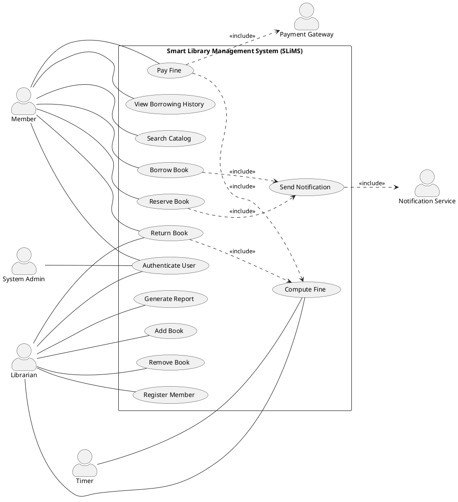

> [!NOTE]
> **Valuation Mapping (KTU):** *Correct actor identification = 2 marks; complete use cases (≥10) = 2 marks; correct `<<include>>` and `<<extend>>` usage = 2 marks; system boundary present = 1 mark.* **Total: 7 marks.**

## 3.5 Step-4 — Identify Classes (Noun-Phrase Extraction)

Apply **Abbott's Textual Analysis** on the requirements:

| Noun Phrase | Candidate Class | Reject? | Reason |
|---|---|---|---|
| Member | `Member` | ✓ | Domain entity |
| Librarian | `Librarian` | ✓ | Domain entity (subclass of User) |
| Book | `Book` | ✓ | Central entity |
| Reservation | `Reservation` | ✓ | Transactional entity |
| Borrowing Record | `BorrowingRecord` | ✓ | Transactional entity |
| Fine | `Fine` | ✓ | Transactional entity |
| Payment | `Payment` | ✓ | Transactional entity |
| Notification | `Notification` | ✓ | Service entity |
| Catalog | `Catalog` | ✓ | Aggregate root |
| System | — | ✗ | Redundant; this is the *system itself* |
| Email | — | ✗ | Attribute of Notification |
| History | — | ✗ | Derived view from BorrowingRecord |

We extract **9 candidate classes**.

## 3.6 Step-5 — Class Diagram (PlantUML Source)

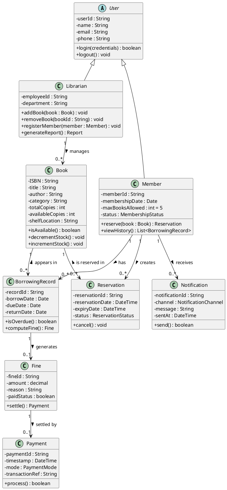

> [!NOTE]
> **Valuation Mapping (KTU):** *Class identification (≥8) = 2 marks; correct attributes with types = 2 marks; visibility notation correct = 1 mark; relationships with multiplicities = 2 marks.*

## 3.7 Step-6 — Sequence Diagram for "Borrow Book" Scenario

### 3.7.1 Pre-conditions & Steps

1. Member authenticates.
2. Member searches catalog.
3. Member selects an available book.
4. Member requests to borrow.
5. System checks availability.
6. System creates BorrowingRecord.
7. System decrements `availableCopies`.
8. System triggers notification.
9. System returns success + due date.

### 3.7.2 PlantUML Source

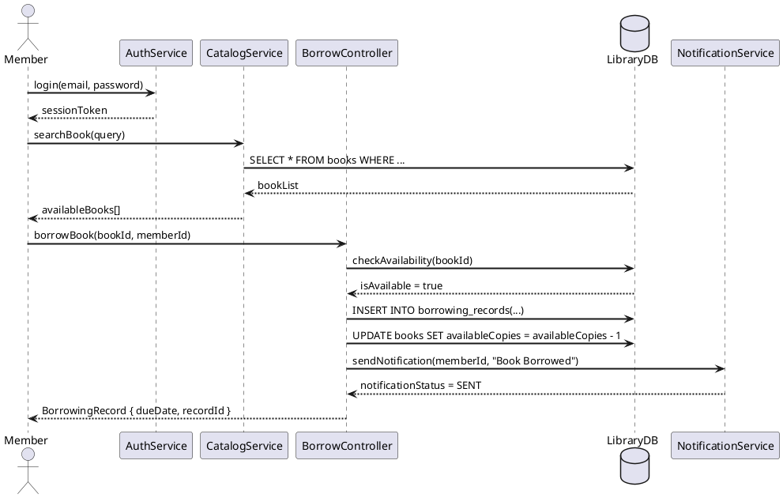

## 3.8 Step-7 — Activity Diagram for "Return Book & Fine Settlement"

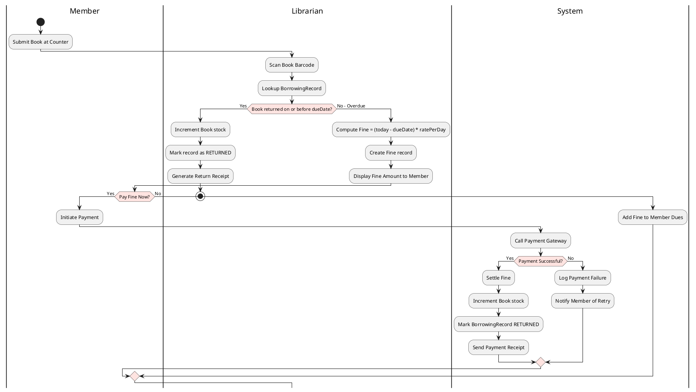

## 3.9 Step-8 — State Machine Diagram for `Book` Entity Lifecycle

A `Book` instance transitions through these states:

$$\text{Available} \xrightarrow{\text{borrow}} \text{Borrowed} \xrightarrow{\text{return}} \text{Available}$$

$$\text{Available} \xrightarrow{\text{reserve}} \text{Reserved} \xrightarrow{\text{cancel/expiry}} \text{Available}$$

$$\text{Borrowed} \xrightarrow{\text{overdue}} \text{Overdue} \xrightarrow{\text{return+fine}} \text{Available}$$

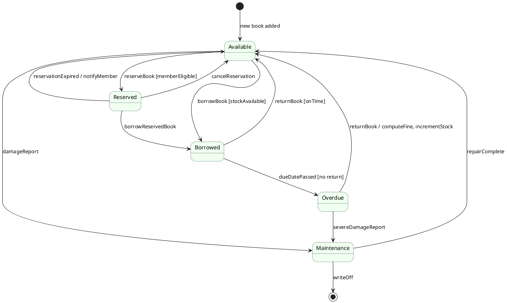

## 3.10 Python Implementation — Programmatic UML Generator

The following Python script generates PlantUML code for all diagrams from a single domain model — useful for **automated documentation** in DevOps pipelines.

```python
"""
SLiMS UML Auto-Generator
Generates PlantUML source for Use Case, Class, Sequence, Activity, and State diagrams
from a single Pythonic domain model.
"""
from __future__ import annotations
from dataclasses import dataclass, field
from enum import Enum
from typing import List, Dict, Optional
from pathlib import Path
import logging

# Configure logging
logging.basicConfig(level=logging.INFO, format="%(levelname)s: %(message)s")
logger = logging.getLogger("SLiMS-UML")


class Visibility(Enum):
    PUBLIC = "+"
    PRIVATE = "-"
    PROTECTED = "#"
    PACKAGE = "~"


class RelationshipType(Enum):
    ASSOCIATION = "association"
    AGGREGATION = "aggregation"
    COMPOSITION = "composition"
    GENERALIZATION = "generalization"
    DEPENDENCY = "dependency"


@dataclass(frozen=True)
class Attribute:
    name: str
    type: str
    visibility: Visibility = Visibility.PRIVATE
    default: Optional[str] = None


@dataclass(frozen=True)
class Method:
    name: str
    return_type: str = "void"
    params: List[str] = field(default_factory=list)
    visibility: Visibility = Visibility.PUBLIC


@dataclass
class UMLClass:
    name: str
    stereotype: str = ""
    attributes: List[Attribute] = field(default_factory=list)
    methods: List[Method] = field(default_factory=list)
    is_abstract: bool = False

    def render(self) -> str:
        lines: List[str] = []
        header = f"abstract class {self.name}" if self.is_abstract else f"class {self.name}"
        lines.append(header)
        lines.append("{")
        if self.stereotype:
            lines.append(f"    {self.stereotype}")
        for attr in self.attributes:
            default_str = f" = {attr.default}" if attr.default is not None else ""
            lines.append(f"    {attr.visibility.value}{attr.name} : {attr.type}{default_str}")
        for method in self.methods:
            params_str = ", ".join(method.params)
            lines.append(
                f"    {method.visibility.value}{method.name}({params_str}) : {method.return_type}"
            )
        lines.append("}")
        return "\n".join(lines)


@dataclass
class Relationship:
    source: str
    target: str
    rel_type: RelationshipType
    label: str = ""
    source_multiplicity: str = ""
    target_multiplicity: str = ""

    def render(self) -> str:
        symbols = {
            RelationshipType.ASSOCIATION: "-->",
            RelationshipType.AGGREGATION: "o--",
            RelationshipType.COMPOSITION: "*--",
            RelationshipType.GENERALIZATION: "--|>",
            RelationshipType.DEPENDENCY: "..>",
        }
        symbol = symbols[self.rel_type]
        label_part = f" : {self.label}" if self.label else ""
        src_mult = f'"{self.source_multiplicity}" ' if self.source_multiplicity else ""
        tgt_mult = f' "{self.target_multiplicity}"' if self.target_multiplicity else ""
        return f"{self.source} {src_mult}{symbol}{tgt_mult} {self.target}{label_part}"


class UMLDiagramBuilder:
    """Generates PlantUML class-diagram source from a domain model."""

    def __init__(self, project_name: str) -> None:
        self.project_name = project_name
        self.classes: Dict[str, UMLClass] = {}
        self.relationships: List[Relationship] = []

    def add_class(self, uml_class: UMLClass) -> None:
        if uml_class.name in self.classes:
            logger.warning("Class '%s' already exists. Skipping.", uml_class.name)
            return
        self.classes[uml_class.name] = uml_class
        logger.info("Added class: %s", uml_class.name)

    def add_relationship(self, rel: Relationship) -> None:
        if rel.source not in self.classes or rel.target not in self.classes:
            logger.error("Relationship references unknown class: %s -> %s", rel.source, rel.target)
            return
        self.relationships.append(rel)
        logger.info("Added relationship: %s %s %s", rel.source, rel.rel_type.name, rel.target)

    def generate(self) -> str:
        output = [f"@startuml {self.project_name}"]
        output.append("skinparam classAttributeIconSize 0")
        for uml_class in self.classes.values():
            output.append(uml_class.render())
        for rel in self.relationships:
            output.append(rel.render())
        output.append("@enduml")
        return "\n".join(output)

    def write_to_file(self, filepath: str) -> None:
        path = Path(filepath)
        path.parent.mkdir(parents=True, exist_ok=True)
        path.write_text(self.generate(), encoding="utf-8")
        logger.info("Diagram written to: %s", path.absolute())


# ============================================================
# DOMAIN MODEL — Smart Library Management System (SLiMS)
# ============================================================
def build_slims_class_diagram() -> UMLDiagramBuilder:
    builder = UMLDiagramBuilder("SLiMS_ClassDiagram")

    # ----- User (Abstract) -----
    builder.add_class(UMLClass(
        name="User",
        is_abstract=True,
        attributes=[
            Attribute("userId", "String"),
            Attribute("name", "String"),
            Attribute("email", "String"),
            Attribute("phone", "String"),
        ],
        methods=[
            Method("login", "boolean", ["credentials : String"]),
            Method("logout", "void"),
        ],
    ))

    # ----- Member -----
    builder.add_class(UMLClass(
        name="Member",
        attributes=[
            Attribute("memberId", "String"),
            Attribute("membershipDate", "Date"),
            Attribute("maxBooksAllowed", "int", default="5"),
            Attribute("status", "MembershipStatus"),
        ],
        methods=[
            Method("reserve", "Reservation", ["book : Book"]),
            Method("viewHistory", "List", []),
        ],
    ))

    # ----- Librarian -----
    builder.add_class(UMLClass(
        name="Librarian",
        attributes=[
            Attribute("employeeId", "String"),
            Attribute("department", "String"),
        ],
        methods=[
            Method("addBook", "void", ["book : Book"]),
            Method("removeBook", "void", ["bookId : String"]),
            Method("generateReport", "Report", []),
        ],
    ))

    # ----- Book -----
    builder.add_class(UMLClass(
        name="Book",
        attributes=[
            Attribute("ISBN", "String"),
            Attribute("title", "String"),
            Attribute("author", "String"),
            Attribute("totalCopies", "int"),
            Attribute("availableCopies", "int"),
        ],
        methods=[
            Method("isAvailable", "boolean", []),
            Method("decrementStock", "void", []),
        ],
    ))

    # ----- BorrowingRecord -----
    builder.add_class(UMLClass(
        name="BorrowingRecord",
        attributes=[
            Attribute("recordId", "String"),
            Attribute("borrowDate", "Date"),
            Attribute("dueDate", "Date"),
            Attribute("returnDate", "Date"),
        ],
        methods=[Method("computeFine", "Fine", [])],
    ))

    # ----- Fine -----
    builder.add_class(UMLClass(
        name="Fine",
        attributes=[
            Attribute("fineId", "String"),
            Attribute("amount", "decimal"),
            Attribute("paidStatus", "boolean", default="false"),
        ],
        methods=[Method("settle", "Payment", [])],
    ))

    # ----- Relationships -----
    builder.add_relationship(Relationship("User", "Member", RelationshipType.GENERALIZATION))
    builder.add_relationship(Relationship("User", "Librarian", RelationshipType.GENERALIZATION))
    builder.add_relationship(Relationship("Member", "BorrowingRecord",
                       RelationshipType.ASSOCIATION, "has", "1", "0..*"))
    builder.add_relationship(Relationship("Book", "BorrowingRecord",
                       RelationshipType.ASSOCIATION, "appears in", "1", "0..*"))
    builder.add_relationship(Relationship("BorrowingRecord", "Fine",
                       RelationshipType.COMPOSITION, "generates", "1", "0..1"))

    return builder


if __name__ == "__main__":
    diagram = build_slims_class_diagram()
    diagram.write_to_file("output/slims_class.puml")
    print(diagram.generate())
```

> [!TIP]
> **How to use the script:**
> 1. Save as `slims_uml_generator.py`
> 2. Run `python slims_uml_generator.py`
> 3. Copy the generated `slims_class.puml` into a **PlantUML renderer** (VS Code extension, IntelliJ plugin, or [plantuml.com](https://www.plantuml.com/plantuml))
> 4. The output is a publication-quality Class Diagram

<!-- SECTION_3_END -->

<!-- SECTION_4_START -->

# Structural Diagrams & Schematics

> [!NOTE]
> **Mermaid Compilation Safeguards Applied:**
> * All node IDs are alphanumeric-prefixed (e.g., `node1`, `bookObj`).
> * All node labels with special characters are **double-quoted**.
> * No reserved keywords (`end`, `subgraph`, `graph`) used as node IDs.
> * Stereotypes use `<<` and `>>` inside the label string, not as raw tokens.

## 4.1 Use Case Diagram — SLiMS (Block Topology)

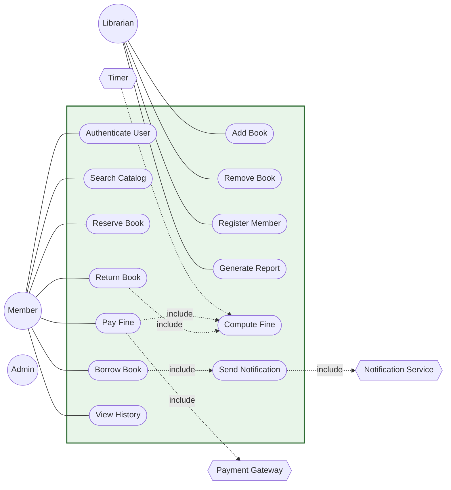

## 4.2 Class Diagram — SLiMS (Structural Topology)

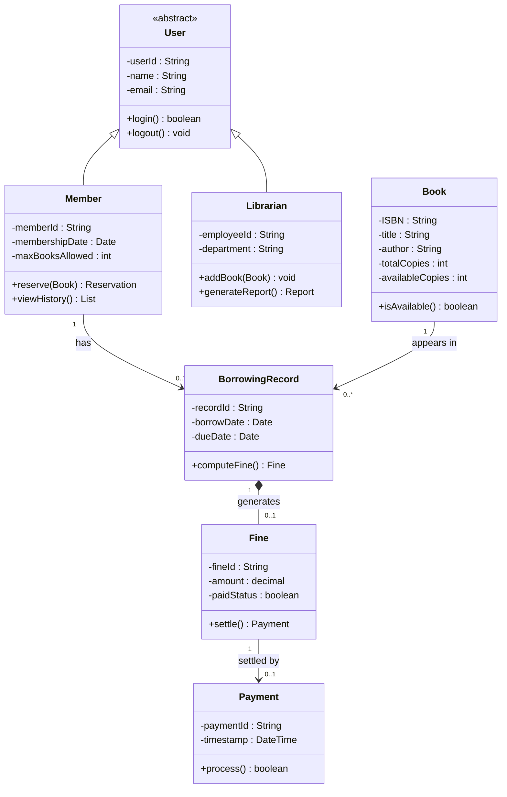

## 4.3 Sequence Diagram — Borrow Book Scenario

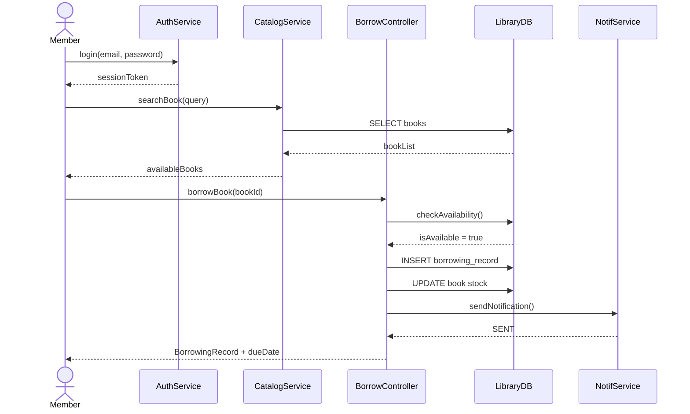

## 4.4 Activity Diagram — Return Book + Fine Settlement (Swimlane Topology)

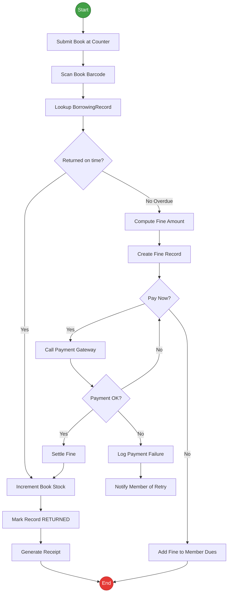

## 4.5 State Machine Diagram — Book Lifecycle

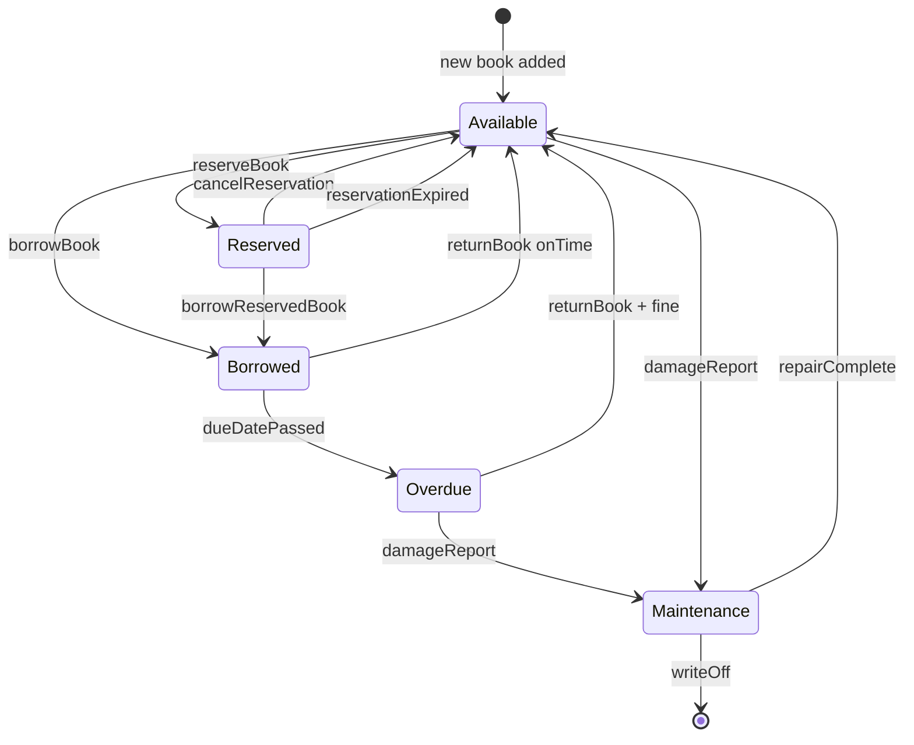

## 4.6 Component Diagram — SLiMS Modular Architecture

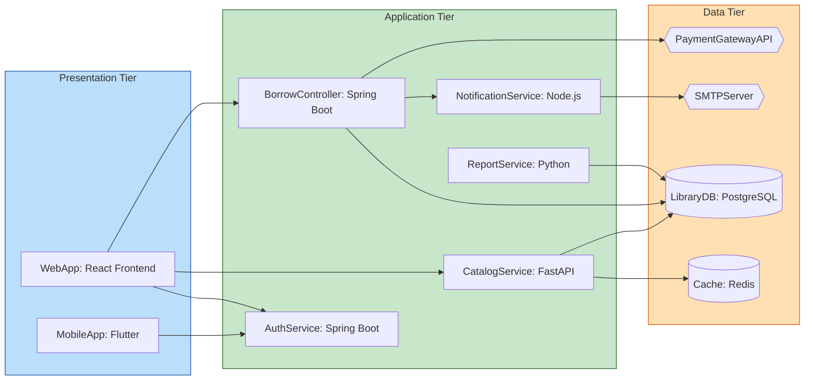

<!-- SECTION_4_END -->

<!-- SECTION_5_START -->

# KTU 2024 Scheme Examination Question Bank & Topic Recap

## 5.1 KTU 2024 Mark Distribution Snapshot

| Assessment Component | Marks | Duration |
|---|---|---|
| **Continuous Internal Evaluation (CIE)** | 50 | Throughout semester |
| **Part A — Short Answer** | 2 × 3 = 6 | Internal Test |
| **Part B — Module Choice (14 marks each)** | 1 × 14 = 14 | Internal Test |
| **Project Report + Demo + Viva** | 30 | End-semester |
| **Total** | 50 + 50 = 100 | — |

> [!NOTE]
> For PCCSP606 (Mini Project), the **Module 1 viva** typically focuses on *UML diagrams, requirements traceability, and design rationale*. Below are the **model questions** aligned with KTU 2024 Scheme and Revised Bloom's Taxonomy.

## 5.2 Part A — Short Answer Questions (3 Marks Each)

### Q1. `[KTU Internal Test - Sept 2024]` — CO1 / **Remember** (3 Marks)

> **Define Unified Modeling Language (UML). List and briefly explain any FOUR structural UML diagrams with their purpose.**

**Model Answer:**

> **Definition:** UML (Unified Modeling Language) is an **ISO-standardized (ISO/IEC 19505)**, general-purpose, **visual modeling language** maintained by the **Object Management Group (OMG)**. It is used to **specify, visualize, construct, and document** the artifacts of a software-intensive system.
>
> *(**Valuation Key:** Correct definition citing OMG/ISO = 1 mark)*
>
> **Four Structural Diagrams:**
>
> 1. **Class Diagram** — Shows the static structure of classes, their attributes, operations, and relationships (association, inheritance, aggregation, composition, dependency). Used for object-oriented analysis and design.
> 2. **Component Diagram** — Depicts the organization of physical software components (files, libraries, executables) and their dependencies through provided/required interfaces.
> 3. **Deployment Diagram** — Models the physical hardware topology (nodes, devices) on which software artifacts are deployed.
> 4. **Package Diagram** — Shows logical grouping of related UML elements into namespaces, helping to manage large models.
>
> *(**Valuation Key:** Each correctly explained diagram = 0.5 marks × 4 = 2 marks. Total = 3 marks.)*

---

### Q2. `[KTU Internal Test - Oct 2024]` — CO1 / **Understand** (3 Marks)

> **Compare `<<include>>` and `<<extend>>` relationships in Use Case Diagrams using a Library Management System example. State the arrow direction in each case.**

**Model Answer:**

| Aspect | `<<include>>` | `<<extend>>` |
|---|---|---|
| **Purpose** | Mandatory sub-functionality always invoked | Optional/conditional functionality added at extension points |
| **Direction** | From base use case → included use case | From extension use case → base use case |
| **Trigger** | Automatic — happens every time base runs | Explicit condition or extension point |
| **Reusability** | High — shared sub-function | Moderate — adds variant behavior |
| **Example (SLiMS)** | `Borrow Book` —`<<include>>`—> `Send Notification` | `Pay Fine via Wallet` —`<<extend>>`—> `Pay Fine` (extension at "paymentMode" point) |

> **Arrow Direction Rules:**
> * `<<include>>`: `Base Use Case — —> Included Use Case` (mandatory sub-flow).
> * `<<extend>>`: `Extension Use Case — —> Base Use Case` (conditional addition).
>
> *(**Valuation Key:** Table with 4 correct points = 2 marks; arrow direction explicitly stated = 1 mark. Total = 3 marks.)*

---

## 5.3 Part B — Module Internal Choice (14 Marks)

### Question A — `[KTU End-Sem Mock Paper - Model Q.Paper]` — CO1, CO2 / **Apply + Analyze** (14 Marks)

> **Design the system model for an "Online Food Delivery System" (OFDS) using UML diagrams.**
>
> **(a)** Draw a **Use Case Diagram** identifying at least **THREE actors** and **EIGHT use cases** with proper `<<include>>` relationships. *(7 marks)*
>
> **(b)** Draw a **Class Diagram** with at least **SIX classes** showing attributes, methods, visibility modifiers, and all six types of relationships (association, aggregation, composition, generalization, dependency, realization). *(7 marks)*

**Model Solution:**

### (a) Use Case Diagram (7 marks)

**Actors identified (≥3):** `Customer`, `Restaurant`, `Delivery Agent`, `Payment Gateway`, `Admin`

**Use cases identified (≥8):**
1. `Register / Login`
2. `Browse Restaurants`
3. `Search Food Item`
4. `Add to Cart`
5. `Place Order`
6. `Make Payment`
7. `Track Order`
8. `Rate & Review`
9. `Manage Menu` (Restaurant)
10. `Accept / Reject Order` (Restaurant)
11. `Update Delivery Status` (Delivery Agent)

**`<<include>>` relationships:**
* `Place Order — —> <<include>>— —> Make Payment` (mandatory)
* `Place Order — —> <<include>>— —> Send Order Confirmation` (mandatory)
* `Make Payment — —> <<include>>— —> Call Payment Gateway` (mandatory)
* `Track Order — —> <<include>>— —> Fetch Live Location` (mandatory)

**System boundary:** Rectangle enclosing all use cases, labeled *"Online Food Delivery System (OFDS)"*.

**Valuation Key:**

* Actor identification (3+): 1 mark
* Use case identification (8+): 1 mark
* `<<include>>` correctly drawn with arrows: 2 marks
* System boundary present: 1 mark
* `<<extend>>` (optional — for advanced marks): 1 mark
* Label clarity and notation correctness: 1 mark

### (b) Class Diagram (7 marks)

**Classes (≥6):** `User`, `Customer`, `Restaurant`, `DeliveryAgent`, `Order`, `OrderItem`, `MenuItem`, `Payment`, `Review`, `Address`

**Example Class Definition (must show):**

```
┌─────────────────────────────┐
│         Order               │
├─────────────────────────────┤
│ -orderId : String           │
│ -orderDate : DateTime       │
│ -status : OrderStatus       │
│ -totalAmount : decimal      │
├─────────────────────────────┤
│ +calculateTotal() : decimal │
│ +cancelOrder() : boolean    │
│ +updateStatus() : void      │
└─────────────────────────────┘
```

**Six relationships required:**

| # | Relationship | Example |
|---|---|---|
| 1 | Association | `Customer — —> Order` (1 to 0..*) |
| 2 | Aggregation | `Restaurant ◇ — — MenuItem` (whole-part, weak) |
| 3 | Composition | `Order ◆ — — OrderItem` (parts die with order) |
| 4 | Generalization | `Customer — —▷ User` (inheritance) |
| 5 | Dependency | `OrderController - - -▷ PaymentService` |
| 6 | Realization | `EmailNotification - - -▷ <<interface>> INotification` |

**Valuation Key:**

* Classes identified (6+): 1 mark
* Attributes with proper types: 1 mark
* Methods with return types: 1 mark
* Visibility modifiers (+, -, #): 0.5 marks
* All 6 relationship types: 2.5 marks (0.5 each — partial credit allowed)
* Multiplicities: 0.5 marks
* Proper notation/direction: 0.5 marks

---

### Question B — `[KTU End-Sem Mock Paper - Model Q.Paper]` — CO1, CO2 / **Apply + Analyze** (14 Marks — Alternative Choice)

> **Design the dynamic behavior of the "Online Food Delivery System" using the following UML diagrams:**
>
> **(a)** Draw a **Sequence Diagram** for the scenario *"Customer places a new food order with online payment"*. The diagram must include at least **FOUR objects** and use **TWO combined fragments** (`alt` and `opt`). *(7 marks)*
>
> **(b)** Draw an **Activity Diagram** with **swimlanes** for *"Restaurant Order Acceptance Workflow"* showing the responsibilities of Customer, Restaurant, and System. Also draw a **State Machine Diagram** for the `Order` entity lifecycle. *(7 marks)*

**Model Solution:**

### (a) Sequence Diagram (7 marks)

**Objects (lifelines):** `Customer`, `OrderController`, `OrderService`, `PaymentGateway`, `NotificationService`, `Database`

**Flow:**
1. Customer authenticates (`login`) → returns session token.
2. Customer adds items to cart.
3. Customer → OrderController: `placeOrder(cart)`
4. OrderController → OrderService: `createOrder(items)`
5. OrderService → Database: `INSERT order, INSERT order_items`
6. OrderController → PaymentGateway: `processPayment(amount, cardDetails)`
7. **alt Payment Successful**
   * Database: `UPDATE order SET status = 'CONFIRMED'`
   * OrderController → NotificationService: `sendConfirmation()`
   * Returns to Customer: `OrderConfirmation{orderId, ETA}`
8. **opt Customer wants receipt**
   * OrderController: `generateInvoice()`
   * Customer ← : `Invoice.pdf`
9. **alt Payment Failed**
   * OrderController → Database: `UPDATE order SET status = 'PAYMENT_FAILED'`
   * Returns to Customer: `PaymentFailedException`

**Valuation Key:**

* 4+ lifelines with proper notation: 1.5 marks
* Synchronous vs asynchronous messages correct: 1 mark
* Activation bars on lifelines: 0.5 marks
* `alt` fragment with both branches: 1.5 marks
* `opt` fragment correctly drawn: 1 mark
* Return messages with dashed arrows: 0.5 marks
* Logical correctness of flow: 1 mark

### (b) Activity + State Diagrams (7 marks)

**Activity Diagram with Swimlanes (3.5 marks):**

| Swimlane | Actions |
|---|---|
| **Customer** | Browse Menu → Add to Cart → Place Order → Make Payment |
| **Restaurant** | Receive Order → Accept / Reject → Prepare Food → Mark Ready |
| **System** | Process Payment → Send Confirmation → Notify Delivery Agent → Track Order |

* **Decision nodes** at *Accept/Reject* and *Payment Successful?*
* **Fork/Join** if parallel notification to Delivery Agent and Customer.
* **Final node** at *Order Delivered*.

**State Machine Diagram for `Order` (3.5 marks):**

```
[*] → PLACED → PAYMENT_PENDING → CONFIRMED → PREPARING
                                                    ↓
                              [rejected] ←  RESTAURANT_REJECTED
                                                    ↓
CONFIRMED → PREPARING → OUT_FOR_DELIVERY → DELIVERED → [*]
                  ↓
              CANCELLED (from any pre-prep state via customer action)
```

* Initial pseudostate (`filled circle`)
* Final state (`bullseye`)
* Transitions with **guard conditions**: `[paymentSuccess]`, `[restaurantRejects]`, `[timeout]`
* Self-transition on `PAYMENT_PENDING → PAYMENT_PENDING` with `retry` event

**Valuation Key:**

* Swimlane partition correct: 1 mark
* Decisions with branches: 0.5 marks
* Fork/Join bar: 0.5 marks
* State Machine — initial + final: 1 mark
* All major states present: 0.5 marks
* Transitions with guard conditions: 1 mark
* Notation correctness: 0.5 marks

---

> [!WARNING]
> **KTU Examiner's Valuation Warning — Common Pitfalls in UML Answers:**
>
> 1. **Arrow Direction Inversion (–2 marks):** Students frequently reverse the `<<include>>` arrow direction. *Remember: arrow points FROM base TO mandatory sub-use-case.*
> 2. **Aggregation vs Composition Confusion (–1.5 marks):** Aggregation = hollow diamond (weak). Composition = filled diamond (strong, lifecycle-bound). Using the wrong symbol loses marks even if the semantic intent is correct.
> 3. **Missing Multiplicities (–1 mark):** Every association in a Class Diagram should have multiplicity on **both** ends. Omitting them is a partial-answer error.
> 4. **No System Boundary in Use Case (–1 mark):** Forgetting the outer rectangle in a Use Case Diagram indicates lack of system-scope awareness.
> 5. **Class Without Methods (–0.5 marks):** A class with only attributes is incomplete. Always include at least **2–3 operations**.
> 6. **State Machine Without Initial/Final Nodes (–1 mark):** A state diagram must always begin with the initial pseudostate and (usually) end with a final state.
> 7. **Sequence Diagram Without Activation Bars (–1 mark):** Activation bars visually represent method execution duration. Omission shows weak understanding.
> 8. **Inconsistent Naming Convention (–0.5 marks):** Mixing `camelCase`, `snake_case`, and `PascalCase` for class/method names is unprofessional. Stick to **PascalCase for classes**, **camelCase for methods/attributes**.

---

## 5.4 Topic Recap & Important Things to Remember

> [!TIP]
> **Last-Minute Revision Bullets — Print and Carry to Viva!**

### A. Foundational Concepts

* **UML** = Unified Modeling Language, ISO/IEC 19505, maintained by OMG.
* Current version: **UML 2.5.1** (2017).
* **NOT** a programming language — it is a **visual specification language**.
* **Three Amigos** = Grady Booch, James Rumbaugh, Ivar Jacobson (Rational Software, 1997).

### B. The 14 Diagrams — Quick Recall

* **Structural (7):** Class, Object, Component, Deployment, Package, Composite Structure, Profile.
* **Behavioral (7):** Use Case, Activity, State Machine, Sequence, Communication, Interaction Overview, Timing.

### C. Use Case Diagram Essentials

* **Actors** = roles (human = stick figure, system = `<<actor>>` rectangle).
* **Use cases** = ellipses with verb-noun labels.
* **System boundary** = enclosing rectangle.
* **Relationships:**
  * Association (no arrow, line only)
  * `<<include>>` (dashed arrow, FROM base TO included)
  * `<<extend>>` (dashed arrow, FROM extension TO base)
  * Generalization (solid line, open-triangle arrow)

### D. Class Diagram Essentials

* **Three compartments:** Class Name, Attributes, Operations.
* **Visibility:** `+` public, `-` private, `#` protected, `~` package.
* **Six relationships** (must know all): Association, Aggregation (`◇`), Composition (`◆`), Generalization, Dependency, Realization.
* **Multiplicity** on every association end: `1`, `0..1`, `*`, `1..*`, `n..m`.

### E. Sequence Diagram Essentials

* **Lifelines** = vertical dashed lines.
* **Activation bars** = thin rectangles on lifelines.
* **Messages:** synchronous (`→`), asynchronous (`⇢`), reply (`⤺`).
* **Combined fragments:** `alt`, `opt`, `loop`, `par`, `neg`, `ref`.

### F. Activity Diagram Essentials

* **Initial node** = filled circle.
* **Final node** = bullseye.
* **Decision node** = diamond.
* **Fork/Join** = thick bar.
* **Swimlanes** = partition by responsibility.

### G. State Machine Diagram Essentials

* **State** = rounded rectangle.
* **Initial** = filled circle, **Final** = bullseye.
* **Transition** = arrow with format `event [guard] / action`.
* **History state** = circled `H` (remembers last substate).

### H. Tools & Toolchain

* **Desktop:** Enterprise Architect, Visual Paradigm, StarUML, IBM Rational Rose.
* **Web-Based:** Lucidchart, draw.io, Creately.
* **Textual DSL:** **PlantUML**, **Mermaid** (great for documentation-as-code).
* **IDE Integration:** VS Code PlantUML extension, IntelliJ PlantUML plugin.

### I. KTU 2024 Mini Project Workflow (Module 1)

1. **Problem Statement** (1 page)
2. **Requirement Specification (SRS)** — Functional + Non-functional
3. **Use Case Diagram + Use Case Descriptions**
4. **Class Diagram** (Noun-phrase extraction)
5. **Sequence / Activity / State Diagrams** (for key scenarios)
6. **ER Diagram** (for database design — see Module 2)
7. **Design Rationale Document** — *Why* each diagram is included

### J. Top 5 One-Liners to Memorize for Viva

1. "Aggregation is a *weak* has-a; composition is a *strong* has-a with coincident lifetimes."
2. "`<<include>>` is mandatory, `<<extend>>` is optional — opposite arrows."
3. "In a Sequence Diagram, time flows top-to-bottom; in a Communication Diagram, time is encoded in message numbers."
4. "A state machine diagram models *one* object's lifecycle, not the whole system."
5. "The `<<component>>` stereotype denotes a replaceable, deployable software unit with provided/required interfaces."

<!-- SECTION_5_END -->
