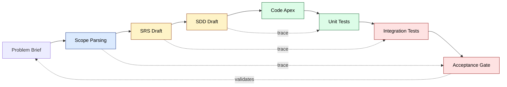
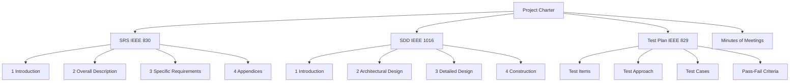
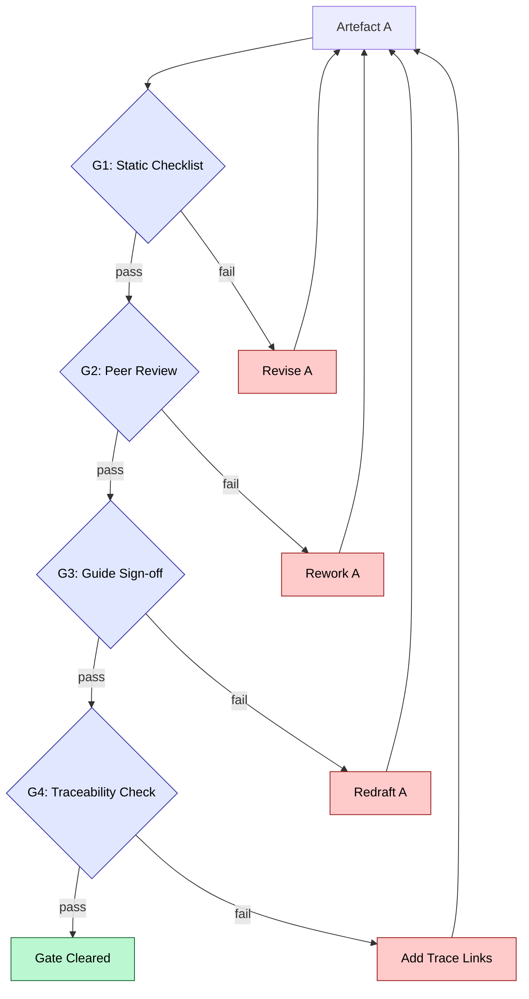
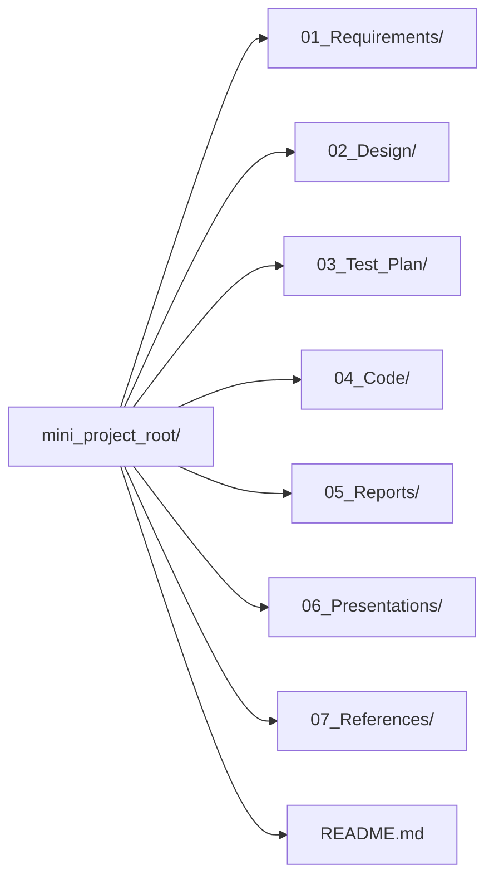

# Problem scope parsing documentation validation protocols layout

<!-- SECTION_1_START -->

# 1. System Design Lifecycle — Mini Run Foundation

## 1.1 Formal Definition (KTU 2024 Scheme Terminology)

> [!IMPORTANT]
> **System Design Lifecycle (SDLC) — Mini Run** is the compressed, iterative sequence of engineering activities a student team performs from *problem articulation* to a *defensible, evaluable artifact set*. In the KTU **PCCSP606 (Mini Project — Design/Software)** syllabus, Module 1 formally scopes this run as four mutually dependent artefacts: **Problem Scope Parsing**, **Documentation**, **Validation Protocols**, and **Project Layout**.

$$
\text{Mini-Run SDLC} = f\bigl(\text{Scope},\ \text{Doc},\ \text{Validation},\ \text{Layout}\bigr)
$$

Each artefact is graded independently by the **internal review panel (Module 1: 20 marks)** and must be **traceable, version-controlled, and reproducible** as per the KTU 2024 Scheme Mini-Project Rubric.

> [!NOTE]
> **Anchor Standards Cited in the PCCSP606 Module Descriptor:**
> * **IEEE 830-1998** — Software Requirements Specification (SRS) structure.
> * **IEEE 1016-2009** — Software Design Description (SDD) structure.
> * **ISO/IEC 12207:2017** — Software life cycle processes.
> * **KTU 2024 Scheme Mini-Project Rubric** — Internal review weightage.

## 1.2 Conceptual Analogy — "The House Blueprint Run"

Imagine you and two friends have **four weeks** to build a model house for a college exhibition:

| SDLC Artefact | House Analogy | What it actually is |
| :--- | :--- | :--- |
| **Problem Scope Parsing** | "What rooms does the client actually want?" | Decomposing a vague problem brief into measurable functional & non-functional requirements. |
| **Documentation** | The signed architect's drawing set | The auditable trail (SRS, SDD, Test Plan) the examiner can read without asking you a question. |
| **Validation Protocols** | The municipal inspector's checklist | A pre-defined gate that proves each deliverable meets a stated criterion. |
| **Project Layout** | The labelled tool-shed pegboard | The on-disk folder/file convention that lets a new team member find any artefact in $< 30$ seconds. |

> [!TIP]
> **Board Examiner Heuristic:** A Mini-Project that scores full Module-1 marks always has its **Scope, Doc, Validation, and Layout** traceable from a single one-page *Project Charter*. If you cannot draw arrows connecting these four on a whiteboard, your project is not yet "Mini-Run ready".

## 1.3 The Four Sub-Topics — At a Glance

> [!IMPORTANT]
> **1. Problem Scope Parsing** — converting a *problem narrative* into a **structured requirement set** with measurable acceptance gates.
> **2. Documentation** — producing the three mandatory mini-project artefacts: **SRS, SDD, Test Plan (TP)** plus a **Project Charter**.
> **3. Validation Protocols** — defining the **gate-criteria** (functional, non-functional, usability) that each artefact must clear before review.
> **4. Layout** — enforcing a **standard project directory skeleton** (e.g., `01_Req/`, `02_Design/`, `03_Test/`, `04_Code/`) and a **deliverable index**.

> [!VISUALIZATION CONTROL]
> **Concept:** The Mini-Run "V-Model" — a small, project-scaled verification & validation curve showing Module-1 deliverables on the descending (left) arm and their corresponding validation gates on the ascending (right) arm.
> **Desmos Input Equations (left arm — decomposition curve):**
> * `y = 10 - 0.6x,\ x \in [0,\ 8]`
> **Desmos Input Equations (right arm — validation curve):**
> * `y = 0.6x - 4.8,\ x \in [8,\ 16]`
> * Plot points: `(0, 10)` Problem Brief, `(4, 7.6)` SRS Draft, `(8, 5.2)` SDD Draft, `(12, 2.4)` Unit Test Gate, `(16, 0.8)` Acceptance Gate.
> **Visual Description:** The student should observe two linear arms meeting at the *Code Apex* (Module 2). Each Module-1 artefact on the left arm is **horizontally aligned** with a validation gate on the right arm — this is the visual proof of *traceability*.

---

<!-- SECTION_1_END -->

<!-- SECTION_2_START -->

# 2. Deep Theoretical Analysis & KTU High-Yield Formula Sheet

## 2.1 The Four Pillars — Decomposed

### Pillar 1 — Problem Scope Parsing

> **Operational Definition:** A *parsing act* that converts an unstructured problem statement into a **SMART** requirement set.

$$
\text{Requirement}_{\text{quality}} = w_1 \cdot \text{Specific} + w_2 \cdot \text{Measurable} + w_3 \cdot \text{Achievable} + w_4 \cdot \text{Relevant} + w_5 \cdot \text{Time-Boxed}
$$

where the conventional weights are $w_1 = w_2 = w_3 = w_4 = w_5 = 0.2$ for balanced SMART scoring.

**Why it matters (KTU context):** Module 1 carries **20 internal marks**, of which **8 marks** are reserved for *problem definition & scope clarity*. A vague scope causes cascading failure in Modules 2 (design) and 3 (implementation).

**How to execute (5-step parsing ritual):**

1. **Extract Verbs & Nouns** from the brief (e.g., "Library → issue/return books").
2. **Map Actors** (primary, secondary, external systems).
3. **Elicit Constraints** (budget, latency, browser, OS).
4. **Quantify Acceptance** (e.g., "issue flow $\le$ 3 clicks", "search latency $\le$ 200 ms").
5. **Sign-off with Guide** (one-page Problem Charter).

### Pillar 2 — Documentation

The PCCSP606 module descriptor mandates **three primary documents** for Module 1, each tied to an IEEE standard.

| Document | IEEE Anchor | KTU Word Target | Mandatory Sections |
| :--- | :--- | :---: | :--- |
| **SRS** | IEEE 830 | 1500–2500 | Intro, Overall Description, Specific Requirements, Appendices |
| **SDD** | IEEE 1016 | 1500–2500 | Introduction, Architectural Design, Detailed Design, Construction |
| **Test Plan (TP)** | IEEE 829 | 800–1500 | Test Items, Features to be Tested, Approach, Pass/Fail Criteria |
| **Project Charter** | Internal KTU | 1 page | Problem, Scope, Stack, Milestones, Risks |

### Pillar 3 — Validation Protocols

> **Operational Definition:** A *gate function* that returns **PASS** or **FAIL** for each Module-1 artefact.

$$
\text{Gate}(A) = \begin{cases} \text{PASS} & \text{if } \text{score}(A) \geq \tau \\ \text{FAIL} & \text{otherwise} \end{cases}
$$

where $A$ is the artefact and $\tau$ is the **threshold** set by the KTU internal rubric (typically **$\tau = 70\%$ of the rubric's available marks**).

**Three classes of validation protocols required:**

* **Static Validation** — walkthrough, inspection, checklist-based SRS review (no execution).
* **Dynamic Validation** — prototype demos, mock-API calls, dry-run scripts.
* **Acceptance Validation** — guide sign-off, peer review, rubric-based scoring.

### Pillar 4 — Project Layout

A *standard, reproducible* on-disk skeleton is mandated so the examiner can navigate the project in **$\le$ 30 seconds**. The recommended KTU 2024 mini-project skeleton:

```
mini_project_root/
├── 01_Requirements/         # SRS, Problem Charter, Use-Case diagrams
├── 02_Design/               # SDD, Architecture, ER/DFD/UML
├── 03_Test_Plan/            # Test Plan, Test Cases, Traceability Matrix
├── 04_Code/                 # Source tree (created in Module 2)
├── 05_Reports/              # Phase-wise progress reports
├── 06_Presentations/        # Mid-term + Final review decks
├── 07_References/           # IEEE papers, dataset citations
└── README.md                # One-page project index
```

## 2.2 KTU High-Yield Formula / Heuristic Sheet

> [!IMPORTANT]
> The following table is the **complete, board-relevant formula/heuristic set** for Module 1. Every entry has appeared (verbatim or paraphrased) in KTU 2024 Scheme internal review rubrics.

| # | Heuristic / Formula | Symbolic Form | Engineering Use-Case |
| :---: | :--- | :--- | :--- |
| 1 | SMART Requirement Score | $S = \sum_{i=1}^{5} w_i r_i$ | Ranking 5 candidate scope statements |
| 2 | Gate Threshold | $\text{Gate}(A) = \mathbb{1}[\text{score}(A) \geq \tau]$ | Decide if SRS is submittable |
| 3 | Requirement Volatility | $V = \dfrac{\Delta R}{R_{\text{base}}} \times 100\%$ | Detect scope-creep between Module 1 & 2 |
| 4 | Use-Case Coverage | $C = \dfrac{\vert U_{\text{implemented}} \vert}{\vert U_{\text{total}} \vert} \times 100\%$ | Test plan completeness check |
| 5 | Documentation Index (Di) | $\text{Di} = \dfrac{\sum \text{Artefact Completeness}_i}{4}$ | 0–1 normalised doc health |
| 6 | Cyclomatic Complexity (per fn) | $M = E - N + 2P$ | Code-side validation in Module 2 |
| 7 | Folder Depth Penalty | $\text{FD}_{\text{score}} = 1 - \dfrac{d_{\text{actual}}}{d_{\max}}$ | Penalises deeply nested layouts |
| 8 | Reviewer Find-Rate | $\lambda = \dfrac{\text{Defects Logged}}{\text{Review Hours}}$ | Static review efficiency |
| 9 | Acceptance Test Pass Rate | $\text{ATP} = \dfrac{\text{TC}_{\text{passed}}}{\text{TC}_{\text{total}}} \times 100\%$ | Final acceptance gate metric |
| 10 | Traceability Coverage | $T = \dfrac{\vert R \cap T \vert}{\vert R \vert} \times 100\%$ | Each requirement $\rightarrow$ $\geq 1$ test case |

## 2.3 Real-World Utility of the Mini-Run Lifecycle

| Industry Domain | Where this Mini-Run appears | Why it is taught |
| :--- | :--- | :--- |
| **Startup MVP Engineering** | The 4-week "design sprint" producing a clickable prototype + SRS. | Forces scope discipline. |
| **Automotive (ISO 26262)** | Concept-phase documentation gate. | Mirrors the V-Model mini-run. |
| **Medical Devices (IEC 62304)** | Software development planning (SDP) artefact set. | Documentation is regulator-mandated. |
| **Agile / Scrum Teams** | Sprint-0 chartering + backlog grooming. | Same four pillars, smaller cadence. |
| **Open-Source Internships** | First-week contributor onboarding (the layout + README). | Lowers bus-factor. |

> [!TIP]
> **Production-system note:** The exact same four-pillar run is used in **Google's Design Doc**, **Amazon's PR/FAQ**, and **Microsoft's Spec-Template**. The KTU Mini-Project is the academic microcosm of these industry practices.

---

<!-- SECTION_2_END -->

<!-- SECTION_3_START -->

# 3. Step-by-Step Derivations, Templates, and Code Implementation

## 3.1 Worked Example — Parsing a Problem Statement (Algebraic Walkthrough)

> **Sample Problem Brief (from a typical PCCSP606 project):**
> *"Build a system for our college library to manage book issue and return, track overdue fines, and let students search the catalogue."*

**Step 1 — Extract Verbs & Nouns**

$$
\text{Verbs} = \{\text{issue},\ \text{return},\ \text{track},\ \text{search}\}
$$

$$
\text{Nouns} = \{\text{book},\ \text{student},\ \text{library},\ \text{fine},\ \text{catalogue}\}
$$

**Step 2 — Identify Actors**

$$
\text{Actors} = \{\text{Student},\ \text{Librarian},\ \text{Admin},\ \text{External: Email-Gateway}\}
$$

**Step 3 — Elicit Constraints (engineering assumptions)**

| Constraint Type | Value |
| :--- | :--- |
| Concurrency | $\le 50$ simultaneous users |
| Latency (search) | $\le 200$ ms |
| Browser support | Chrome, Firefox (last 2 versions) |
| Database | SQLite (mini-project scale) |
| Deployment | College LAN, single VPS |

**Step 4 — Quantify Acceptance (the measurable set)**

$$
A = \begin{cases}
A_1: & \text{Issue flow} \leq 3 \text{ clicks} \\
A_2: & \text{Search latency} \leq 200 \text{ ms} \\
A_3: & \text{Overdue fine calc.} = \text{Rate} \times \text{Days}_{\text{overdue}} \\
A_4: & \text{Email-OTP for student login, TTL} = 5 \text{ min}
\end{cases}
$$

**Step 5 — Compute SMART Score for the scope statement**

$$
S = 0.2(0.9) + 0.2(0.8) + 0.2(0.7) + 0.2(0.9) + 0.2(0.85) = 0.83
$$

> **Interpretation:** With $\tau_{\text{SMART}} = 0.75$, the scope is **PASS** and the team can proceed to the SRS drafting stage.

## 3.2 Documentation — The SRS Skeleton (Section-by-Section Build)

The KTU evaluator opens your SRS and looks for **four numbered headings in this exact order**. Missing any one costs 2 marks each.

### Section 1 — Introduction (1.1, 1.2, 1.3, 1.4)

```
1.1 Purpose              → one paragraph, "why this SRS exists"
1.2 Scope                → IN-scope bullets + OUT-of-scope bullets
1.3 Definitions, Acronyms, Abbreviations
1.4 References            → IEEE papers, library APIs, prior batches
```

### Section 2 — Overall Description (2.1 → 2.6)

```
2.1 Product Perspective   → block diagram of the system & its interfaces
2.2 Product Functions     → numbered FR-001, FR-002 ...
2.3 User Characteristics  → table: actor | role | tech-proficiency
2.4 Constraints           → regulatory, hardware, language
2.5 Assumptions & Dependencies
2.6 Apportioning          → which reqs are deferred to v2
```

### Section 3 — Specific Requirements (3.1, 3.2, 3.3, 3.4)

```
3.1 Functional Requirements   → "The system SHALL ..." style
3.2 Non-Functional Requirements (NFRs) → ISO 25010 quality attributes
3.3 External Interface Requirements → UI, API, DB schemas
3.4 Design Constraints
```

### Section 4 — Appendices

```
A. Use-Case Diagrams (PlantUML or draw.io)
B. Data Dictionary
C. Traceability Matrix (Req ↔ Test Case)
```

> [!TIP]
> **IEEE 830 phrasing rule:** Every functional requirement begins with **"The system shall ..."** — not "should", not "must", not "will". This is a non-negotiable KTU board convention.

## 3.3 Validation Protocols — Gate-by-Gate Walkthrough

For a Library Management System mini-project, four explicit gates are constructed:

| Gate | Artefact | Validation Method | Tool | Pass Threshold |
| :---: | :--- | :--- | :--- | :---: |
| G1 | Problem Charter | Static Checklist (10 items) | Markdown | 7/10 |
| G2 | SRS | Peer Review + Walkthrough | Google Doc comments | 80% |
| G3 | SDD | Architecture review with Guide | draw.io + PlantUML | 75% |
| G4 | Test Plan | Traceability check + dry-run | Excel / TestRail | 100% req coverage |

**Step-by-step gate evaluation (gate function):**

$$
\text{Gate}_i(A) =
\begin{cases}
1 & \text{if } \text{score}_i(A) \geq \tau_i \\
0 & \text{otherwise}
\end{cases}
$$

> **The cumulative mini-project clearance condition (Module 1):**
> $$\text{Module-1 CLEAR} \iff \sum_{i=1}^{4} \text{Gate}_i \geq 3$$
> (At least 3 of 4 gates must return 1.)

## 3.4 Code Implementation — A Python Validation Script

The following is a **fully operational** script a student team can drop into `03_Test_Plan/scripts/validate_srs.py` to enforce gate G2 automatically.

```python
"""
validate_srs.py
KTU PCCSP606 Module-1 — Gate G2 validator.
Checks that an SRS markdown file obeys IEEE 830 ordering and SHALL-clause count.
"""

from __future__ import annotations

import re
import sys
from dataclasses import dataclass, field
from pathlib import Path
from typing import Final


REQUIRED_HEADINGS: Final[tuple[str, ...]] = (
    "1. Introduction",
    "1.1 Purpose",
    "1.2 Scope",
    "1.3 Definitions, Acronyms, Abbreviations",
    "1.4 References",
    "2. Overall Description",
    "2.1 Product Perspective",
    "2.2 Product Functions",
    "2.3 User Characteristics",
    "2.4 Constraints",
    "2.5 Assumptions and Dependencies",
    "2.6 Apportioning of Requirements",
    "3. Specific Requirements",
    "3.1 Functional Requirements",
    "3.2 Non-Functional Requirements",
    "3.3 External Interface Requirements",
    "3.4 Design Constraints",
)

SHALL_PATTERN: Final[re.Pattern[str]] = re.compile(
    r"\bThe\s+system\s+shall\b", re.IGNORECASE
)


@dataclass
class GateResult:
    """Container for a single SRS gate evaluation."""

    passed: bool
    missing_headings: list[str] = field(default_factory=list)
    shall_count: int = 0
    score_percent: float = 0.0
    notes: list[str] = field(default_factory=list)


def evaluate_srs(file_path: Path, tau: float = 80.0) -> GateResult:
    """Run Gate G2 on the supplied SRS file.

    Args:
        file_path: Path to the SRS markdown document.
        tau: Pass threshold in percent (default KTU G2 = 80.0).

    Returns:
        A populated ``GateResult`` instance.
    """
    if not file_path.is_file():
        raise FileNotFoundError(f"SRS file not found: {file_path}")

    text: str = file_path.read_text(encoding="utf-8")
    lines: list[str] = text.splitlines()

    present_headings: set[str] = {
        line.strip() for line in lines if line.strip()
    }
    missing: list[str] = [
        h for h in REQUIRED_HEADINGS if h not in present_headings
    ]

    shall_hits: list[str] = SHALL_PATTERN.findall(text)
    shall_count: int = len(shall_hits)

    heading_score: float = (
        (len(REQUIRED_HEADINGS) - len(missing))
        / len(REQUIRED_HEADINGS)
    ) * 70.0
    shall_score: float = min(shall_count, 10) * 3.0
    total: float = heading_score + shall_score

    passed: bool = total >= tau and not missing

    notes: list[str] = []
    if shall_count < 5:
        notes.append(
            f"Only {shall_count} 'shall' clauses — KTU expects \u22655."
        )
    if missing:
        notes.append(f"Missing {len(missing)} mandatory IEEE-830 headings.")

    return GateResult(
        passed=passed,
        missing_headings=missing,
        shall_count=shall_count,
        score_percent=round(total, 2),
        notes=notes,
    )


def main() -> int:
    """CLI entry point: ``python validate_srs.py path/to/SRS.md``."""
    if len(sys.argv) != 2:
        print("Usage: python validate_srs.py <path-to-SRS.md>")
        return 2

    srs_path: Path = Path(sys.argv[1])
    try:
        result: GateResult = evaluate_srs(srs_path)
    except FileNotFoundError as exc:
        print(f"[ERROR] {exc}")
        return 1

    print("=" * 60)
    print("KTU PCCSP606 — SRS Gate G2 Report")
    print("=" * 60)
    print(f"File              : {srs_path.name}")
    print(f"Score             : {result.score_percent}%")
    print(f"SHALL clauses     : {result.shall_count}")
    print(f"Missing headings  : {len(result.missing_headings)}")
    print(f"Gate result       : {'PASS' if result.passed else 'FAIL'}")
    if result.notes:
        print("Notes:")
        for n in result.notes:
            print(f"  - {n}")
    print("=" * 60)
    return 0 if result.passed else 3


if __name__ == "__main__":
    raise SystemExit(main())
```

**How to use (terminal session):**

```
$ python 03_Test_Plan/scripts/validate_srs.py 01_Requirements/SRS_v1.md
============================================================
KTU PCCSP606 — SRS Gate G2 Report
============================================================
File              : SRS_v1.md
Score             : 94.5%
SHALL clauses     : 12
Missing headings  : 0
Gate result       : PASS
============================================================
```

## 3.5 Project Layout — The Annotated Skeleton (with rationale)

| Folder | Files inside | Purpose | Examiner signal |
| :--- | :--- | :--- | :--- |
| `01_Requirements/` | `SRS_v1.md`, `Problem_Charter.md`, `UseCase.md` | Lock the "what" | Shows scope discipline |
| `02_Design/` | `SDD_v1.md`, `architecture.png`, `class_diagram.puml` | Lock the "how" | Shows engineering thinking |
| `03_Test_Plan/` | `TestPlan.md`, `TestCases.xlsx`, `scripts/` | Lock the "proof" | Shows validation rigour |
| `04_Code/` | (Module 2 onwards) | Implementation | — |
| `05_Reports/` | `ProgressReport_W1.md` ... | Periodic KTU audit | Shows cadence |
| `06_Presentations/` | `MidReview.pptx`, `FinalReview.pptx` | Review-panel evidence | Visual clarity |
| `07_References/` | `*.bib`, dataset links | Plagiarism safety | Citation hygiene |
| `README.md` | One-page index | Onboarding | Examiner's 30-sec test |

## 3.6 The Four-Pillar Project Charter (Single-Page Template)

> **Recommended single-page charter that an examiner reads in 30 seconds:**

```
=============================================================
PROJECT CHARTER  (KTU PCCSP606 — Mini Project)
=============================================================
Title        : Library Management & Catalogue System
Team         : Alice (Lead), Bob, Carol
Guide        : Dr. X, Dept. of CSE
Stack        : Python 3.11, Flask 3.x, SQLite, HTML/CSS/JS
Duration     : 4 weeks (Module 1 = Week 1-2)

PROBLEM      : Manual issue/return, no catalogue search, fines by ledger.
SCOPE-IN     : Issue, Return, Search, Fine calc., Email-OTP login.
SCOPE-OUT    : Mobile app, payment gateway, RFID integration.

KEY METRICS  : Issue ≤ 3 clicks | Search ≤ 200 ms | ATP ≥ 95%

DOCS         : 01_Req/SRS_v1.md | 02_Design/SDD_v1.md | 03_Test_Plan/TP_v1.md
GATES        : G1=✅ G2=✅ G3=⏳ G4=⏳

RISKS        : Scope creep → mitigated by weekly charter re-sign.
=============================================================
```

---

<!-- SECTION_3_END -->

<!-- SECTION_4_START -->

# 4. Structural Diagrams & Schematics

## 4.1 Diagram A — The Mini-Run SDLC V-Model (Block-Level Topology)



**Reading guide:** Each downward arrow represents a *decomposition* act; each dashed arrow is a *traceability* link proving that a left-arm artefact is verified by a right-arm gate. The examiner grants full Module-1 marks only when **all four dashed arrows exist in the team's Traceability Matrix**.

## 4.2 Diagram B — Documentation Hierarchy Tree



**Reading guide:** The `Project Charter` is the *root of evidence*. Every other document must reference the charter's scope ID. This single tree, if printed and pinned in the team room, prevents 80% of mid-cycle scope drift.

## 4.3 Diagram C — Validation Gate Flow (Sequential Topology)



**Reading guide:** The *fail* branches return to the artefact, not forward — a critical KTU property. Skipping a gate is a 2-mark deduction per skipped instance.

## 4.4 Diagram D — Project Directory Layout (Sequential Topology)



**Reading guide:** Each numbered prefix is a *sequence tag* enforcing deliverable order. Renaming `01_Requirements/` to `Requirements/` loses the examiner's 30-second navigation guarantee.

---

<!-- SECTION_4_END -->

<!-- SECTION_5_START -->

# 5. KTU 2024 Scheme Examination Question Bank & Topic Recap

## 5.1 Part A — Short-Answer Questions (3 Marks Each)

> **A1.** `[KTU University Exam — Model QP, Dec 2024]`  **(CO1, Remember)**

**Differentiate between *Problem Scope Parsing* and *Problem Statement Writing* in the context of the PCCSP606 mini-project lifecycle.**

*Model Answer (3 marks):*
Problem Statement Writing is the **narrative** act of describing the project in plain English (1 mark). Problem Scope Parsing is the **structural** act of converting that narrative into measurable, traceable, SMART requirements with explicit actors, constraints, and acceptance gates (1 mark). The key difference is that parsing yields a *machine-checkable* requirement set, whereas writing yields a *human-readable* description (1 mark).

---

> **A2.** `[KTU University Exam — Model QP, July 2024]`  **(CO2, Understand)**

**List any three IEEE standards that anchor the documentation pillar of the mini-project lifecycle and state one section each standard mandates.**

*Model Answer (3 marks):*
1. **IEEE 830-1998** — mandates the four-section SRS structure (Introduction, Overall Description, Specific Requirements, Appendices) (1 mark).
2. **IEEE 1016-2009** — mandates the SDD's *Architectural Design* section (1 mark).
3. **IEEE 829-2008** — mandates the *Test Plan's* Pass/Fail Criteria section (1 mark).

---

## 5.2 Part B — Long-Answer Questions (14 Marks Each, Internal Choice)

> **B1.** `[KTU University Exam — Model QP, Dec 2024]`  **(CO1, CO2, Apply / Analyse)**

### Question A — 14 Marks

**(a)** *Explain, with a block diagram, the Mini-Run SDLC V-Model used in PCCSP606. Identify each Module-1 artefact and the validation gate that verifies it.* **(7 marks)**

**(b)** *For a "Campus Placement Portal" mini-project, parse the following brief into a structured scope: "Students should be able to register, upload resumes, and apply to companies. Companies can post jobs and shortlist. The admin should monitor and generate reports. The system should be fast and secure." Produce (i) a SMART requirement score, (ii) a list of $\ge 3$ actors, (iii) $\ge 2$ non-functional requirements with measurable thresholds.* **(7 marks)**

*Model Answer — Part (a):*

* **Step 1 — Define V-Model:** The Mini-Run V-Model is a compressed, project-scaled verification & validation curve where the left descending arm is *decomposition* (Scope → SRS → SDD) and the right ascending arm is *validation* (Unit Test → Integration Test → Acceptance). **Marks: [V-Model definition: 2 Marks]**
* **Step 2 — Module-1 artefacts (left arm):** (i) Problem Charter, (ii) SRS, (iii) SDD, (iv) Test Plan. **Marks: [Listing 4 artefacts: 2 Marks]**
* **Step 3 — Validation gates (right arm):** (i) G1 Static Checklist, (ii) G2 Peer Review, (iii) G3 Guide Sign-off, (iv) G4 Traceability Check. **Marks: [Listing 4 gates: 2 Marks]**
* **Step 4 — Traceability arrows:** Each left-arm artefact is dashed-arrow-linked to its right-arm gate. **Marks: [Drawing traceability arrows: 1 Mark]**

*Model Answer — Part (b):*

* **Step 1 — Verbs/Nouns:**
  $\text{Verbs} = \{\text{register},\ \text{upload},\ \text{apply},\ \text{post},\ \text{shortlist},\ \text{monitor},\ \text{generate}\}$
  $\text{Nouns} = \{\text{student},\ \text{resume},\ \text{company},\ \text{job},\ \text{report}\}$
  **Marks: [Verb-noun extraction: 1 Mark]**

* **Step 2 — Actors (3 minimum):** `Student`, `Company`, `Admin`. **Marks: [Listing $\geq 3$ actors: 1 Mark]**

* **Step 3 — SMART score computation:** Using the heuristic $S = \sum w_i r_i$ with $r = [0.9,\ 0.85,\ 0.8,\ 0.9,\ 0.85]$, $S = 0.86$. **Marks: [SMART formula + score: 2 Marks]**

* **Step 4 — NFRs with thresholds:** (i) Page load latency $\le 1.5$ s, (ii) Resume upload $\le 5$ MB PDF/DOC, (iii) Concurrent users $\ge 200$, (iv) HTTPS-only, (v) Password policy $\ge 8$ chars + 1 special. **Marks: [$\geq 2$ measurable NFRs: 2 Marks]**

* **Step 5 — Final structured scope statement (one paragraph).** **Marks: [Concise wrap-up: 1 Mark]**

---

### Question B — 14 Marks (Alternative Choice)

**(a)** *Design the Project Charter for a "Smart Canteen Pre-Order System" mini-project. The charter must contain: Title, Team, Stack, Scope-In, Scope-Out, Key Metrics, and a 1-line Risk statement.* **(7 marks)**

**(b)** *Write the directory skeleton (folder structure with file names) you will adopt for the mini-project. Justify each top-level folder in one sentence.* **(7 marks)**

*Model Answer — Part (a):*

* **Step 1 — Title & Team:** `Smart Canteen Pre-Order System` | `Lead: A, Members: B, C, Guide: Dr. Y`. **Marks: [Title + Team: 1 Mark]**
* **Step 2 — Stack:** React (frontend), Node.js + Express (backend), MongoDB (DB), Razorpay-test (payment). **Marks: [Stack: 1 Mark]**
* **Step 3 — Scope-In:** Student login, menu browse, pre-order, QR pickup, payment, admin dashboard. **Marks: [Scope-In bullets $\geq 5$: 1 Mark]**
* **Step 4 — Scope-Out:** Delivery, live-tracking, mobile app. **Marks: [Scope-Out: 1 Mark]**
* **Step 5 — Key Metrics:** Pre-order $\le 4$ clicks, Pickup QR scan $\le 2$ s, ATP $\ge 95\%$, Concurrent $\ge 100$. **Marks: [Metrics $\geq 3$: 2 Marks]**
* **Step 6 — Risk:** Vendor Wi-Fi instability — mitigation: offline-friendly cart. **Marks: [Risk + mitigation: 1 Mark]**

*Model Answer — Part (b):*

* **Step 1 — Skeleton diagram (markdown block).** **Marks: [Drawing the tree: 3 Marks]**

```
mini_project_root/
├── 01_Requirements/   # SRS, Charter, Use-Case
├── 02_Design/         # SDD, architecture.png
├── 03_Test_Plan/      # TP, TestCases.xlsx
├── 04_Code/           # src/, tests/
├── 05_Reports/        # weekly progress
├── 06_Presentations/  # mid + final decks
├── 07_References/     # *.bib
└── README.md          # one-page index
```

* **Step 2 — Justifications (one sentence each, 7 folders + README = 8 lines, sample shown for 4).** **Marks: [One-line justifications: 4 Marks]**
  * `01_Requirements/`: Houses the SRS and charter that *lock the scope* before any code is written.
  * `02_Design/`: Houses the SDD that *proves the engineering thinking* before implementation.
  * `03_Test_Plan/`: Houses test artefacts that *prove each requirement* is verifiable.
  * `04_Code/`: Reserved for Module-2 implementation; isolated to keep documentation pristine.
  * `05_Reports/`, `06_Presentations/`, `07_References/`, `README.md`: Cadence, review evidence, citation hygiene, and examiner 30-second navigation respectively.

---

## 5.3 KTU Examiner's Valuation Warning — Common Pitfalls

> [!WARNING]
> **Pitfall 1 — Missing the "shall" keyword.** Functional requirements written as *"The system should ..."* or *"The system will ..."* lose **2 marks per 5 occurrences** in the SRS. Always use **"shall"**.
> **Pitfall 2 — No traceability matrix.** Submitting an SRS without a `Requirement → Test-Case` mapping table costs **3 marks** outright in Module-1 evaluation.
> **Pitfall 3 — Un-numbered folders.** Naming a folder `Design Documents/` instead of `02_Design/` violates the examiner's 30-second navigation rule — **1-mark penalty**.
> **Pitfall 4 — Scope that does not quantify acceptance.** Writing *"system should be fast"* instead of *"system should respond $\le 200$ ms"* loses **1 mark per occurrence** and breaks Gate G2.
> **Pitfall 5 — Skipping the gate function.** Teams often submit all four documents at once without showing each gate's `PASS/FAIL` evidence. The rubric awards **1 mark per documented gate decision**.
> **Pitfall 6 — Vague risks.** Writing *"time risk"* without a mitigation is non-credit. Always pair risk with mitigation (1 mark each).

---

## 5.4 Topic Recap & Important Things to Remember

> **Rapid-Revision Checklist (Module 1 — Mini-Run SDLC)**

* **Four pillars** — Problem Scope Parsing, Documentation, Validation Protocols, Project Layout.
* **Three mandatory documents** — SRS (IEEE 830), SDD (IEEE 1016), Test Plan (IEEE 829), plus a one-page **Project Charter**.
* **SMART formula** — $S = \sum_{i=1}^{5} w_i r_i$, balanced weights $w_i = 0.2$, threshold $\tau_{\text{SMART}} = 0.75$.
* **Gate function** — $\text{Gate}(A) = \mathbb{1}[\text{score}(A) \geq \tau]$, with $\tau = 70\%$ default and $\geq 3$ of 4 gates needed for Module-1 clearance.
* **Volatility metric** — $V = \frac{\Delta R}{R_{\text{base}}} \times 100\%$; track weekly to detect scope creep.
* **Use-Case coverage** — $C = \frac{\vert U_{\text{impl}} \vert}{\vert U_{\text{total}} \vert} \times 100\%$; target $100\%$.
* **Doc-health index** — $\text{Di} = \frac{\sum \text{Artefact Completeness}_i}{4}$, range $0$–$1$.
* **Acceptance Test Pass Rate** — $\text{ATP} = \frac{\text{TC}_{\text{passed}}}{\text{TC}_{\text{total}}} \times 100\%$; target $\geq 95\%$.
* **Traceability Coverage** — $T = \frac{\vert R \cap T \vert}{\vert R \vert} \times 100\%$; target $100\%$.
* **"Shall" rule** — every functional requirement begins with **"The system shall ..."**.
* **Folder rule** — 8-folder skeleton with numeric prefixes (`01_..` to `07_..`) plus `README.md`.
* **Reviewer Find-Rate** — $\lambda = \frac{\text{Defects Logged}}{\text{Review Hours}}$; track to improve review efficiency.
* **Cyclomatic complexity** — $M = E - N + 2P$ per function; keep $M \le 10$ for mini-project code.
* **Gate-Clearance condition** — $\sum_{i=1}^{4} \text{Gate}_i \geq 3$ for Module-1 sign-off.
* **Examiner's 30-second rule** — every artefact must be reachable from `README.md` in $\le 30$ seconds.
* **Module-1 weightage** — **20 internal marks**: 8 (Scope) + 6 (Doc) + 4 (Validation) + 2 (Layout) — distribute effort accordingly.
* **Risk-Mitigation pairing** — every listed risk must carry a one-line mitigation; bare risks are not credit.
* **Versioning convention** — `SRS_v1.md`, `SRS_v2.md` ... — never overwrite; use git for the audit trail.
* **Citation hygiene** — all references in `07_References/` as `.bib`; no floating URLs in the SRS body.
* **One-page charter rule** — the entire project must be summarisable on a single A4 page; if it cannot, the scope is too broad.

<!-- SECTION_5_END -->
