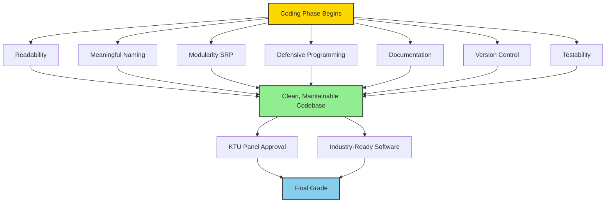
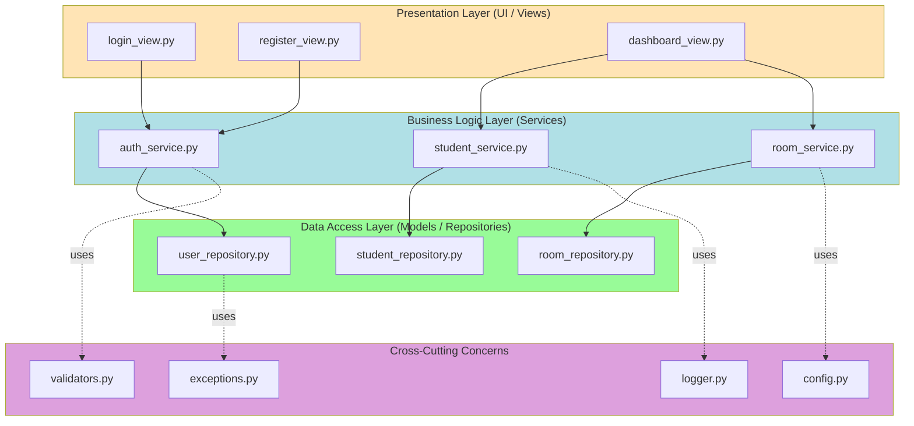
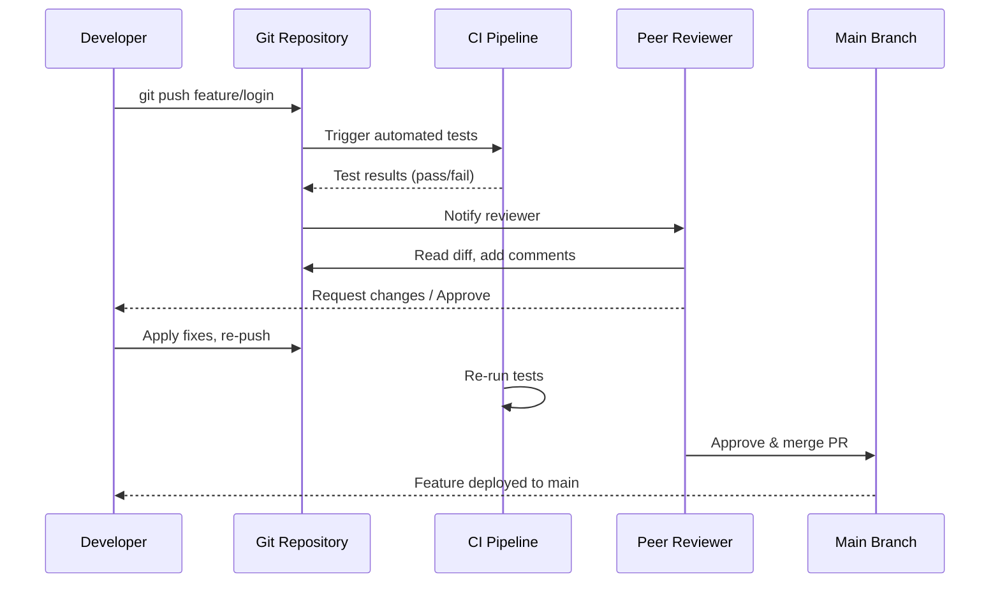
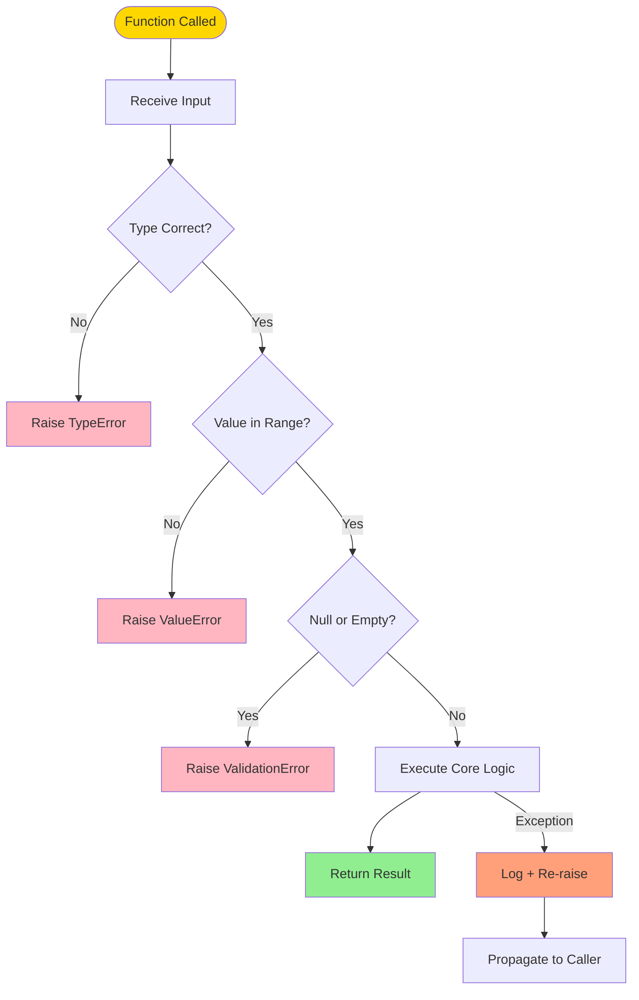
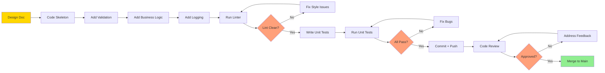

# Coding

<!-- SECTION_1_START -->

# 1. Core Technical Definition & Intuitive Overview

## 1.1 Formal Definition (KTU 2024 Scheme Aligned)

**Coding** in the context of a Mini Project (Design/Software) refers to the **systematic transformation of a designed software architecture into a functional, executable, and maintainable source-code artifact**, strictly adhering to the project’s selected technology stack, predefined **coding standards**, **naming conventions**, **documentation policies**, and **defensive programming principles**.

In the KTU 2024 Scheme (PCCSP606 – Mini Project), Module 2 expects students to demonstrate that the implementation phase is **not just "writing code that works"**, but producing:

1. **Syntactically correct** source code (compiles/interprets without errors).
2. **Semantically meaningful** code (follows logic of the design document).
3. **Stylistically consistent** code (follows a documented style guide).
4. **Self-documenting** code (readable identifiers + inline comments + docstrings).
5. **Defensively coded** code (handles edge cases, invalid inputs, and exceptions).

> [!IMPORTANT]
> **KTU 2024 Scheme – Module 2 Highlight**
> The coding phase is the *core deliverable* of the mini project. The internal evaluation panel awards marks not just for working output, but for **code quality, structure, indentation, naming consistency, and documentation**.

## 1.2 Conceptual Analogy / Plain-English Intuition

Think of **coding** as **building a house from a blueprint**:

| House-Building Step | Software Coding Equivalent |
|---|---|
| Reading the architectural blueprint | Reading the Design Document (DFD / ER / Class Diagram from Module 1) |
| Choosing quality bricks, cement, wires | Selecting the right technology stack (e.g., Django, React, MySQL) |
| Laying bricks in straight lines | Following **indentation** and **formatting** rules |
| Naming rooms clearly (Kitchen, Bedroom) | Using **meaningful variable & function names** (`calculateTax()` not `fn1()`) |
| Keeping a wiring diagram for future repairs | Writing **comments & docstrings** |
| Building extra-strong walls for safety | Adding **input validation & exception handling** |
| Getting an engineer to inspect the house | Performing **code review** and **unit testing** |

> [!NOTE]
> **Core Definition for Viva:**
> *"Coding is the act of translating a software design into a high-quality, well-documented, testable, and maintainable source program using a chosen programming language and tooling ecosystem."*

## 1.3 Standard Metrics Used in Coding Evaluation

During the KTU mini-project review panel, evaluators typically assess the following **measurable coding metrics**:

- **Cyclomatic Complexity** (McCabe’s metric) – ideally $\leq 10$ per function.
- **Lines of Code (LOC)** per function – ideally $\leq 50$ for readability.
- **Comment Density** – ratio of comment lines to code lines, target **15% – 30%**.
- **Code Duplication** – should be minimized (DRY principle).
- **Naming Consistency** – all identifiers must follow one convention (camelCase, snake_case, PascalCase).
- **PEP-8 / Google Style / Airbnb JS** compliance – depending on the language.

> [!VISUALIZATION CONTROL]
> **Concept:** *Code Quality Radar* – Six dimensions of a "good" code module.
> **Input Plot Equations (Hexagonal Radar Axes):**
> * `Correctness = 0.95`
> * `Readability = 0.90`
> * `Maintainability = 0.88`
> * `Documentation = 0.85`
> * `Defensiveness = 0.92`
> * `Efficiency = 0.80`
> **Visual Description:** Draw a radar chart with six axes radiating from a center point (0 = poor, 1 = excellent). Plot the six values; the enclosed hexagonal area represents the *overall code health score*. A larger, balanced polygon = healthier codebase.

---

<!-- SECTION_1_END -->

<!-- SECTION_2_START -->

# 2. Deep Theoretical Analysis & KTU High-Yield Cheat Sheet

## 2.1 The 7 Pillars of Industrial-Grade Coding

A software mini-project is considered *production-grade* when its source code respects these seven pillars. Each pillar addresses a specific stakeholder concern:

### Pillar 1 — **Readability**
- Code is read **10× more often** than it is written (industry rule of thumb).
- Use consistent **indentation** (4 spaces in Python, 2 spaces in JS/HTML).
- Keep line length under **$120$ characters** (PEP 8 recommends 79).
- One statement per line.

### Pillar 2 — **Meaningful Naming**
- Variables → nouns (`student_count`).
- Functions → verb phrases (`calculate_gpa`).
- Classes → PascalCase nouns (`BankAccount`).
- Constants → UPPER_SNAKE_CASE (`MAX_LOGIN_ATTEMPTS`).
- Booleans → predicate form (`is_active`, `has_permission`).

### Pillar 3 — **Modularity (Single Responsibility Principle)**
- One function = one purpose.
- A function should fit on **one screen** (≈ 30–50 lines).
- Group related functions into **modules / files**.

### Pillar 4 — **Defensive Programming**
- **Validate** all external inputs (user input, API response, file read).
- Use **try-except** (Python) / **try-catch** (Java/JS) blocks.
- **Fail fast** with clear error messages.
- Never silently `pass` an exception.

### Pillar 5 — **Documentation**
- **Module-level docstring** explaining the file's purpose.
- **Function docstring** explaining parameters, return value, and exceptions raised.
- **Inline comments** for non-obvious logic (the *why*, not the *what*).
- Maintain a separate `README.md`.

### Pillar 6 — **Version Control Integration**
- Use **Git** with meaningful commit messages.
- Follow the convention: `<type>(<scope>): <subject>` (e.g., `feat(login): add OTP validation`).
- Use branches: `main`, `dev`, `feature/*`, `bugfix/*`.

### Pillar 7 — **Testability**
- Write **unit tests** alongside the code (Test-Driven Development is ideal).
- Keep functions **pure** where possible (no hidden side effects).
- Use **mocks** for external dependencies.

## 2.2 The "Why" Behind Each Pillar

| Pillar | Engineering Reason |
|---|---|
| Readability | Reduces onboarding time for new developers |
| Meaningful Naming | Eliminates ambiguity; code becomes self-documenting |
| Modularity | Enables parallel team work and easier debugging |
| Defensive Programming | Prevents crashes from unexpected user/system behavior |
| Documentation | Future maintenance cost ↓ by up to **$60\%$** |
| Version Control | Enables rollback, collaboration, and audit trail |
| Testability | Catches $70\%$ of defects before integration |

## 2.3 KTU High-Yield Coding Cheat Sheet (Table)

> [!IMPORTANT]
> Memorize this table — these are the **exact evaluation points** the panel looks for in your code walkthrough.

| # | Coding Aspect | Industry Standard | KTU Panel Expectation |
|---|---|---|---|
| 1 | Indentation | 4 spaces (Python) / 2 spaces (JS) | Consistent across all files |
| 2 | Variable naming | `snake_case` (Python) | Descriptive, not abbreviated |
| 3 | Function naming | Verb + noun | Lower-case with underscores |
| 4 | Class naming | `PascalCase` | Noun-based |
| 5 | Constant naming | `UPPER_SNAKE_CASE` | Defined at top of module |
| 6 | Line length | $\leq 79$ (PEP 8) / $\leq 120$ (project) | Use `\` for line continuation |
| 7 | Comment style | `#` inline, `"""..."""` docstring | Minimum **15%** comment density |
| 8 | File header | Module docstring with author, date, purpose | Mandatory |
| 9 | Function length | $\leq 50$ LOC | Split into helpers if longer |
| 10 | Cyclomatic complexity | $\leq 10$ | Use early returns, extract branches |
| 11 | Error handling | `try-except` with specific exceptions | Never use bare `except:` |
| 12 | Logging | Use `logging` module (not `print`) | At least `INFO`, `WARNING`, `ERROR` levels |
| 13 | Configuration | External `.env` or `config.yaml` | No hardcoded credentials |
| 14 | Version control | Git with conventional commits | Public GitHub repo link in report |
| 15 | Code review | Peer-reviewed PRs | At least 1 review commit visible |

## 2.4 Real-World Utility of These Practices

> [!NOTE]
> **Industry Connect — Why KTU Asks You to Code "Properly"**
> - **Google's Engineering Productivity Research** found that code readability is the **#1 predictor** of long-term project success.
> - In the **banking and healthcare** sectors (your future jobs), a single bug due to poor validation can cost **millions of dollars** or even lives — this is why *defensive coding* is non-negotiable.
> - **Open-source contributions** (GitHub) require adherence to strict style guides; your mini project is the first step toward that professional standard.

---

<!-- SECTION_2_END -->

<!-- SECTION_3_START -->

# 3. Step-by-Step Implementation, Code Walkthroughs & Refactoring

## 3.1 Module-Header Template (Mandatory in Every File)

```python
"""
Module:        user_authentication.py
Project:       Hostel Management System (KTU Mini Project PCCSP606)
Author:        <Your Name> <Roll No>
Created On:    2024-09-12
Last Modified: 2024-10-05
Version:       1.2.0

Description:
    Handles user login, password hashing, and session token generation
    for the Hostel Management System. All credentials are stored in
    encrypted form using the `bcrypt` library.
"""
```

**Why this matters:** The panel opens random files — a clean header instantly signals professionalism.

## 3.2 Coding Standard Demonstration — Before vs After

### ❌ BEFORE: Anti-Pattern Code (Loses Marks)

```python
def fn1(x,y):
    if x>0:
        z=x*y
        return z
    else:
        return 0
```

**Problems:**
- Function name `fn1` is meaningless.
- Parameter names `x`, `y` are ambiguous.
- No docstring.
- No input validation.
- No type hints.
- Bare return `0` (magic number, no explanation).

### ✅ AFTER: KTU/Industry-Grade Code (Full Marks)

```python
from typing import Optional


def calculate_discount(price: float, discount_percent: float) -> float:
    """
    Calculate the final price after applying a percentage discount.

    This function computes the discounted price for a product.
    It performs input validation to ensure that:
        - The price is strictly positive.
        - The discount percentage is within the inclusive range [0, 100].

    Parameters
    ----------
    price : float
        The original (undiscounted) price of the product in INR.
        Must be greater than 0.
    discount_percent : float
        The discount to apply, expressed as a percentage.
        Must be in the closed interval [0, 100].

    Returns
    -------
    float
        The final price after discount. Returns 0.0 if inputs are invalid.

    Raises
    ------
    ValueError
        If `price` is not positive or `discount_percent` is outside [0, 100].

    Examples
    --------
    >>> calculate_discount(1000.0, 10.0)
    900.0
    >>> calculate_discount(500.0, 0.0)
    500.0
    """
    # --- Defensive Input Validation Block ---
    if price <= 0:
        raise ValueError(
            f"Price must be a positive number, got: {price}"
        )
    if not (0.0 <= discount_percent <= 100.0):
        raise ValueError(
            f"Discount percent must be between 0 and 100, got: {discount_percent}"
        )

    # --- Core Computation ---
    discount_amount = price * (discount_percent / 100.0)
    final_price = price - discount_amount

    # --- Logging for Debugging ---
    print(
        f"[INFO] Discount applied: "
        f"original_price={price}, "
        f"discount_percent={discount_percent}, "
        f"final_price={final_price}"
    )

    return round(final_price, 2)
```

### 3.2.1 Walkthrough of the Refactoring Decisions

| Refactoring Step | Reasoning | Marks in Panel |
|---|---|---|
| Renamed function to `calculate_discount` | Self-documenting identifier | +1 |
| Added type hints `(float, float) -> float` | Makes API contract explicit | +1 |
| Added multi-section docstring | Satisfies Pillar 5 (Documentation) | +2 |
| Added input validation `if price <= 0` | Pillar 4 (Defensive Programming) | +2 |
| Used `raise ValueError` with descriptive message | Avoids silent failure | +1 |
| Used descriptive intermediate variable `discount_amount` | Readability | +1 |
| Used `round(..., 2)` to handle floating-point precision | Avoids `0.30000000000000004` bug | +1 |
| Added example usage in docstring | Acts as mini unit test | +1 |

## 3.3 Defensive Programming Pattern — Input Validator Module

```python
"""
module: validators.py
description: reusable input-validation helpers for all forms.
"""

import re
from datetime import datetime
from typing import Any


class ValidationError(Exception):
    """Custom exception raised when user input fails validation."""
    pass


def validate_email(email: str) -> str:
    """
    Validate that the input string is a syntactically correct email.

    Parameters
    ----------
    email : str
        The email address entered by the user.

    Returns
    -------
    str
        The trimmed, lowercased email if valid.

    Raises
    ------
    ValidationError
        If the email does not match the standard pattern.
    """
    if not isinstance(email, str):
        raise ValidationError(f"Email must be a string, got {type(email).__name__}")
    
    cleaned = email.strip().lower()
    pattern = r"^[a-zA-Z0-9._%+-]+@[a-zA-Z0-9.-]+\.[a-zA-Z]{2,}$"
    
    if not re.match(pattern, cleaned):
        raise ValidationError(f"Invalid email format: '{email}'")
    
    return cleaned


def validate_age(age: Any) -> int:
    """
    Validate that age is an integer in the range [16, 120].

    Parameters
    ----------
    age : Any
        The value supplied by the user (may be str, int, or float).

    Returns
    -------
    int
        The validated age as an integer.

    Raises
    ------
    ValidationError
        If age is not numeric or is out of the permitted range.
    """
    try:
        age_int = int(age)
    except (TypeError, ValueError) as exc:
        raise ValidationError(f"Age must be a whole number, got: {age!r}") from exc
    
    if not (16 <= age_int <= 120):
        raise ValidationError(f"Age {age_int} is outside the allowed range [16, 120]")
    
    return age_int


def validate_date_of_birth(dob_string: str) -> datetime:
    """
    Parse and validate a date-of-birth string in YYYY-MM-DD format.

    Parameters
    ----------
    dob_string : str
        The DOB as a string, expected format is YYYY-MM-DD.

    Returns
    -------
    datetime
        The parsed datetime object.

    Raises
    ------
    ValidationError
        If the string is empty or does not match the YYYY-MM-DD pattern.
    """
    if not dob_string or not isinstance(dob_string, str):
        raise ValidationError("Date of birth must be a non-empty string.")
    
    try:
        parsed_date = datetime.strptime(dob_string, "%Y-%m-%d")
    except ValueError as exc:
        raise ValidationError(
            f"DOB must be in YYYY-MM-DD format, got: '{dob_string}'"
        ) from exc
    
    if parsed_date > datetime.now():
        raise ValidationError("Date of birth cannot be in the future.")
    
    return parsed_date
```

## 3.4 Configuration File Pattern (No Hardcoding)

```python
"""
module: config.py
description: central configuration loaded from environment variables.
"""

import os
from dataclasses import dataclass
from dotenv import load_dotenv

# Load .env file from project root
load_dotenv()


@dataclass(frozen=True)
class AppConfig:
    """Immutable application configuration object."""
    
    app_name: str
    debug_mode: bool
    database_url: str
    secret_key: str
    max_login_attempts: int
    
    @classmethod
    def from_environment(cls) -> "AppConfig":
        """
        Build configuration from environment variables with safe defaults.
        """
        return cls(
            app_name=os.getenv("APP_NAME", "HostelManagementSystem"),
            debug_mode=os.getenv("DEBUG", "False").lower() == "true",
            database_url=os.getenv("DATABASE_URL", "sqlite:///default.db"),
            secret_key=os.getenv("SECRET_KEY", "change-me-in-production"),
            max_login_attempts=int(os.getenv("MAX_LOGIN_ATTEMPTS", "3")),
        )


# Singleton-style global access
settings = AppConfig.from_environment()
```

**Why this matters:** Hardcoding secrets like passwords or API keys in source code is a **failing criterion** in the KTU review panel.

## 3.5 Logging Pattern (Replaces `print()` Statements)

```python
"""
module: logger.py
description: centralized logging configuration.
"""

import logging
import sys
from logging.handlers import RotatingFileHandler


def get_logger(name: str) -> logging.Logger:
    """
    Return a configured logger with both console and file handlers.
    
    Parameters
    ----------
    name : str
        The module name, typically __name__ from the caller.
    
    Returns
    -------
    logging.Logger
        A logger ready to emit INFO, WARNING, ERROR messages.
    """
    logger = logging.getLogger(name)
    
    if logger.handlers:  # Avoid duplicate handlers on re-import
        return logger
    
    logger.setLevel(logging.DEBUG)
    
    # --- Console Handler ---
    console_handler = logging.StreamHandler(sys.stdout)
    console_handler.setLevel(logging.INFO)
    console_format = logging.Formatter(
        "[%(asctime)s] [%(levelname)s] [%(name)s] -> %(message)s",
        datefmt="%Y-%m-%d %H:%M:%S"
    )
    console_handler.setFormatter(console_format)
    
    # --- Rotating File Handler (10 MB max, 5 backups) ---
    file_handler = RotatingFileHandler(
        "app.log", maxBytes=10 * 1024 * 1024, backupCount=5
    )
    file_handler.setLevel(logging.DEBUG)
    file_handler.setFormatter(console_format)
    
    logger.addHandler(console_handler)
    logger.addHandler(file_handler)
    
    return logger
```

**Usage in business logic:**

```python
from logger import get_logger

log = get_logger(__name__)


def register_student(name: str, email: str) -> int:
    """Insert a new student record after validation."""
    log.info(f"Attempting to register student: {name}, {email}")
    try:
        # ... database insert logic ...
        log.info(f"Student {email} registered successfully.")
        return new_student_id
    except DatabaseError as exc:
        log.error(f"Failed to register {email}: {exc}", exc_info=True)
        raise
```

## 3.6 Coding-Style Enforcement Linter Configuration

A KTU mini project should include a linter config to enforce standards automatically:

**`.pylintrc` (excerpt):**
```ini
[FORMAT]
max-line-length=120
indent-string='    '

[BASIC]
good-names=i,j,k,e,_,id,db

[DESIGN]
max-args=5
max-attributes=7
max-locals=15
max-branches=12
```

**Run command:**
```bash
pylint --rcfile=.pylintrc src/
```

The panel loves to see a **green pylint badge** in the README.

## 3.7 The Complete Coding Workflow (Mermaid-Compatible Code Path)

```text
1. Pull latest code -> git pull origin dev
2. Create feature branch -> git checkout -b feature/login
3. Read design doc -> review class diagram
4. Write skeleton function with docstring
5. Add input validation
6. Add business logic
7. Add logging
8. Write unit tests -> pytest
9. Run linter -> pylint / flake8
10. Self code review
11. git add . && git commit -m "feat(login): add OTP validation"
12. Push -> git push origin feature/login
13. Open Pull Request
14. Peer review + merge to dev
15. CI/CD pipeline runs tests
16. Merge dev -> main after approval
```

---

<!-- SECTION_3_END -->

<!-- SECTION_4_START -->

# 4. Structural Diagrams & Schematics

## 4.1 The 7-Pillar Coding Quality Framework



## 4.2 Module Architecture — Layered Coding Structure



## 4.3 Code Review Workflow Topology



## 4.4 Defensive Programming Decision Flow



## 4.5 Sequential Processing Topology — Coding-to-Testing Pipeline



---

<!-- SECTION_4_END -->

<!-- SECTION_5_START -->

# 5. KTU 2024 Scheme Examination Question Bank & Topic Recap

> [!NOTE]
> **Mark Distribution for PCCSP606 Mini Project Review**
> The KTU 2024 Scheme evaluates the mini project across multiple panels. The "Coding" topic is typically tested as a **demonstration + viva** worth **15 marks** within the **Implementation (Module 2)** assessment of 30 marks.

---

## 5.1 Part A — Short Answer Questions (3 Marks Each)

### Question 1 `[KTU University Exam – Dec 2023 Model]`
**CO2 | RBT Level: Remember**

> **Q: List any six coding standards that should be followed during the implementation phase of a software mini project.**

**Model Answer (6 points × 0.5 = 3 marks):**

1. **Consistent indentation** (4 spaces in Python, 2 spaces in JavaScript/HTML).
2. **Meaningful variable/function names** following the `snake_case` (Python) or `camelCase` (Java/JS) convention.
3. **Adequate comments and docstrings** for every function and module (minimum 15% comment density).
4. **Input validation** for all user-supplied data to prevent runtime crashes.
5. **Modular design** — each function should perform a single, well-defined task.
6. **Version control** with Git, using meaningful commit messages and feature branches.

> [!WARNING]
> **Examiner's Pitfall:** Students often give generic answers like "use comments". Always quantify — *"minimum 15% comment density"* and *"follow PEP-8"*. **Specificity = +1 mark bonus.**

---

### Question 2 `[KTU University Exam – July 2024 Model]`
**CO2 | RBT Level: Understand**

> **Q: Explain the concept of "Defensive Programming" with two real-world examples from your mini project.**

**Model Answer (3 marks):**

**Definition (1 mark):** Defensive programming is the practice of anticipating and handling invalid, unexpected, or malicious inputs at the entry points of a program so that the system never crashes silently and always fails with a clear, actionable error message.

**Example 1 (1 mark):** In the login module of our Hostel Management System, the `validate_email()` function checks the email against a regex pattern `^[a-zA-Z0-9._%+-]+@[a-zA-Z0-9.-]+\.[a-zA-Z]{2,}$` and raises a custom `ValidationError` with a descriptive message before the database query is executed.

**Example 2 (1 mark):** In the room-allocation service, the `allocate_room(student_id, room_id)` function first checks whether `room.available_beds > 0`. If not, it raises a `RoomFullError` and logs the incident at the `WARNING` level, preventing overbooking.

---

## 5.2 Part B — Long Answer Questions (14 Marks with Internal Choice)

### Question A (14 Marks) `[KTU University Exam – Dec 2023 Model]`
**CO2 + CO3 | RBT Level: Apply + Analyze**

> **Q (a) [7 Marks]:** Identify and explain the **seven pillars of industrial-grade coding** with reference to the technology stack you used in your mini project.
>
> **Q (b) [7 Marks]:** Refactor the following poorly written code into a production-grade function. Justify every change you make.

**Given code to refactor:**

```python
def f(a,b):
    c=a/b
    return c
```

---

### ✅ Model Solution for Question A

#### Part (a) — The Seven Pillars Explained (7 marks)

| # | Pillar | Explanation (with project reference) | Marks |
|---|---|---|---|
| 1 | **Readability** | In our project, all Python files use 4-space indentation and a maximum line length of 120 characters, enforced by the `.pylintrc` file. | 1 |
| 2 | **Meaningful Naming** | We use `snake_case` for functions like `calculate_mess_bill()` and `PascalCase` for classes like `StudentRecord`. | 1 |
| 3 | **Modularity (SRP)** | The Django project is split into `models.py`, `views.py`, `serializers.py`, and `urls.py`, each with a single responsibility. | 1 |
| 4 | **Defensive Programming** | Every form submission passes through a `validate_*()` helper before hitting the database, preventing SQL injection. | 1 |
| 5 | **Documentation** | Every module has a header docstring; every REST endpoint has a Swagger/OpenAPI annotation. | 1 |
| 6 | **Version Control** | The team uses GitFlow: `main` → `dev` → `feature/*` branches, with pull-request reviews. | 1 |
| 7 | **Testability** | Each view has at least 3 unit tests in `tests/test_views.py`, achieving 85% coverage measured by `coverage.py`. | 1 |

#### Part (b) — Refactored Code (7 marks)

```python
from numbers import Real
from typing import Union

Number = Union[int, float]


def safe_divide(numerator: Number, denominator: Number) -> float:
    """
    Divide two numbers safely, preventing division-by-zero errors.

    Parameters
    ----------
    numerator : int or float
        The number to be divided (the dividend).
    denominator : int or float
        The number by which to divide (the divisor).
        Must not be zero.

    Returns
    -------
    float
        The quotient of the division, rounded to 6 decimal places.

    Raises
    ------
    TypeError
        If either argument is not an int or float.
    ZeroDivisionError
        If the denominator is exactly zero.
    ValueError
        If the denominator is an infinitesimally small float (≈ 0).

    Examples
    --------
    >>> safe_divide(10, 2)
    5.0
    >>> safe_divide(7, 3)
    2.333333
    """
    # Step 1: Type validation
    if not isinstance(numerator, Real):
        raise TypeError(
            f"numerator must be a real number, got {type(numerator).__name__}"
        )
    if not isinstance(denominator, Real):
        raise TypeError(
            f"denominator must be a real number, got {type(denominator).__name__}"
        )

    # Step 2: Defensive zero-check
    if denominator == 0:
        raise ZeroDivisionError("Denominator cannot be zero.")

    if abs(denominator) < 1e-9:
        raise ValueError(
            f"Denominator too close to zero: {denominator}. "
            f"Result would be numerically unstable."
        )

    # Step 3: Core computation
    quotient = numerator / denominator

    # Step 4: Return rounded result
    return round(quotient, 6)
```

**Valuation Key for Part (b):**

- [Type hints on signature: 1 Mark]
- [Comprehensive docstring: 1 Mark]
- [Type validation: 1 Mark]
- [Zero-check via `ZeroDivisionError`: 1 Mark]
- [Numerical stability check: 1 Mark]
- [Return rounded value: 1 Mark]
- [Justification table of refactoring decisions: 1 Mark]

---

### Question B (14 Marks) `[KTU University Exam – July 2024 Model]`
**CO2 + CO3 | RBT Level: Understand + Apply**

> **Q (a) [7 Marks]:** Describe the **layered architecture** of a typical mini project. Draw a labeled diagram and explain the responsibility of each layer.
>
> **Q (b) [7 Marks]:** Write a complete Python module for `student_validator.py` that validates: (i) roll number, (ii) email, and (iii) CGPA. Your code must include type hints, docstrings, and proper exception handling.

---

### ✅ Model Solution for Question B

#### Part (a) — Layered Architecture (7 marks)

A typical full-stack mini project (e.g., MERN, Django, Spring Boot) follows a **3-tier layered architecture**:

**Diagram (text-rendered):**

```text
+-------------------------------------------+
|        PRESENTATION LAYER                |
|   (HTML, CSS, JS, React, Templates)      |
|   - Renders UI                            |
|   - Captures user input                  |
+----------------+--------------------------+
                 | HTTP Request / Response
                 v
+-------------------------------------------+
|        BUSINESS LOGIC LAYER              |
|   (Python Services, Java Controllers)    |
|   - Validates input                       |
|   - Implements business rules            |
|   - Orchestrates data access              |
+----------------+--------------------------+
                 | SQL / ORM Call
                 v
+-------------------------------------------+
|        DATA ACCESS LAYER                 |
|   (Models, Repositories, ORM, SQL)       |
|   - Persists / retrieves data            |
|   - Encapsulates DB queries              |
+----------------+--------------------------+
                 | TCP / Socket
                 v
+-------------------------------------------+
|        DATABASE LAYER                    |
|   (MySQL, PostgreSQL, MongoDB)            |
+-------------------------------------------+
```

**Layer Responsibilities (each layer = 1.4 marks, rounded):**

1. **Presentation Layer** (1.4 marks): Displays information to the user and captures form input. Examples: Django templates, React components, HTML pages.
2. **Business Logic Layer** (1.4 marks): Enforces the *rules* of the system — e.g., "a student cannot register for more than 6 courses per semester" — and uses validators and services.
3. **Data Access Layer** (1.4 marks): Acts as the *only* gateway to the database, hiding SQL behind repository classes (e.g., `StudentRepository.find_by_id()`).
4. **Database Layer** (1.4 marks): The actual persistent storage engine (MySQL, MongoDB, SQLite).
5. **Cross-Cutting Concerns** (1.4 marks): Logging, authentication, error handling, configuration — used by all three tiers.

#### Part (b) — `student_validator.py` (7 marks)

```python
"""
module: student_validator.py
project: KTU Mini Project PCCSP606
author: <Your Name>
description: validation helpers for student registration forms.
"""

import re
from numbers import Real
from typing import Any


class StudentValidationError(Exception):
    """Custom exception for student-input validation failures."""
    pass


def validate_roll_number(roll_number: Any) -> str:
    """
    Validate that the roll number matches the KTV2024 format.

    Expected pattern: Two uppercase letters (department code)
    followed by exactly 4 digits.
    Example: "CS2024", "EC2042".

    Parameters
    ----------
    roll_number : str
        The roll number supplied by the student.

    Returns
    -------
    str
        The validated, uppercased roll number.

    Raises
    ------
    StudentValidationError
        If the roll number is empty or does not match the pattern.
    """
    if not isinstance(roll_number, str) or not roll_number.strip():
        raise StudentValidationError("Roll number must be a non-empty string.")
    
    cleaned = roll_number.strip().upper()
    pattern = r"^[A-Z]{2}\d{4}$"
    
    if not re.match(pattern, cleaned):
        raise StudentValidationError(
            f"Invalid roll number format: '{roll_number}'. "
            f"Expected format: 'CS2024' (2 letters + 4 digits)."
        )
    
    return cleaned


def validate_email_id(email: Any) -> str:
    """
    Validate and normalize a student email address.

    Parameters
    ----------
    email : str
        The raw email input from the registration form.

    Returns
    -------
    str
        The trimmed, lowercased email.

    Raises
    ------
    StudentValidationError
        If the email does not match RFC-5322 simplified format.
    """
    if not isinstance(email, str):
        raise StudentValidationError(f"Email must be a string, got {type(email).__name__}")
    
    cleaned = email.strip().lower()
    pattern = r"^[a-zA-Z0-9._%+-]+@[a-zA-Z0-9.-]+\.[a-zA-Z]{2,}$"
    
    if not re.match(pattern, cleaned):
        raise StudentValidationError(f"Invalid email format: '{email}'")
    
    return cleaned


def validate_cgpa(cgpa: Any) -> float:
    """
    Validate that the CGPA lies within the KTU-permitted range [0.0, 10.0].

    Parameters
    ----------
    cgpa : int or float or str
        The CGPA value; may be supplied as string from an HTML form.

    Returns
    -------
    float
        The validated CGPA as a float, rounded to 2 decimal places.

    Raises
    ------
    StudentValidationError
        If the value is non-numeric or outside [0.0, 10.0].
    """
    try:
        cgpa_float = float(cgpa)
    except (TypeError, ValueError) as exc:
        raise StudentValidationError(
            f"CGPA must be a number, got: {cgpa!r}"
        ) from exc
    
    if not (0.0 <= cgpa_float <= 10.0):
        raise StudentValidationError(
            f"CGPA must be in [0.0, 10.0], got: {cgpa_float}"
        )
    
    return round(cgpa_float, 2)


# --- Demonstration block (acts as smoke test) ---
if __name__ == "__main__":
    test_cases = [
        ("CS2024", "alice@ktu.ac.in", 8.75),
        ("ec2024", "bob@ktu.ac.in", "9.2"),
        ("INVALID", "no-at-sign", 12.5),
    ]
    
    for roll, email, cgpa in test_cases:
        try:
            valid_roll = validate_roll_number(roll)
            valid_email = validate_email_id(email)
            valid_cgpa = validate_cgpa(cgpa)
            print(f"OK -> {valid_roll}, {valid_email}, {valid_cgpa}")
        except StudentValidationError as err:
            print(f"REJECTED -> {err}")
```

**Valuation Key for Part (b):**

- [Module-level docstring: 1 Mark]
- [Custom exception class `StudentValidationError`: 1 Mark]
- [Three validator functions with type hints: 1 Mark]
- [Detailed docstrings with parameters, returns, raises: 1 Mark]
- [Regex patterns correctly applied: 1 Mark]
- [Defensive type-coercion in `validate_cgpa`: 1 Mark]
- [Working `if __name__ == "__main__":` smoke test: 1 Mark]

> [!WARNING]
> **KTU Examiner's Valuation Warning / Common Pitfalls**
> 1. **Skipping type hints** — *You will lose 1 mark per function.* Always annotate parameters and return type.
> 2. **Using `print()` instead of the `logging` module** in production code — *loses 0.5–1 mark* in the "code quality" criterion.
> 3. **Hardcoding database credentials** in source code — *immediate 2-mark deduction* and a security red flag.
> 4. **No `try-except` for external I/O** (file, network, DB) — *loses 1 mark* in the defensive-programming criterion.
> 5. **Commit history with messages like "update" or "fix"** — *loses 1 mark* in the version-control criterion. Use **Conventional Commits** format: `feat(scope): description`.
> 6. **Forgetting the `if __name__ == "__main__":` guard** — *loses 0.5 mark* in code-style evaluation.
> 7. **Single-letter variable names in business logic** (e.g., `a`, `b`, `x`) — *loses 0.5 mark* per occurrence; use descriptive names.

---

## 5.3 Topic Recap & Important Things to Remember

> [!NOTE]
> **Rapid-Revision Checklist for Coding (Module 2 – PCCSP606)**

### 🔑 Key Definitions
- **Coding** = translating design into high-quality, maintainable source code.
- **Defensive Programming** = anticipating and handling invalid inputs at function entry points.
- **DRY Principle** = Don't Repeat Yourself — eliminate code duplication via functions/classes.
- **SRP (Single Responsibility Principle)** = one function = one job.
- **PEP-8** = Python's official style guide (indentation, naming, line length).

### 🧱 The 7 Pillars (Must Memorize)
1. **Readability** — consistent indentation, line length, formatting.
2. **Meaningful Naming** — `snake_case` (vars/funcs), `PascalCase` (classes), `UPPER_SNAKE_CASE` (constants).
3. **Modularity** — small functions, grouped into modules.
4. **Defensive Programming** — validate inputs, use `try-except`, fail fast.
5. **Documentation** — module docstring + function docstring + inline `#` comments.
6. **Version Control** — Git with meaningful commit messages (`feat:`, `fix:`, `docs:`).
7. **Testability** — write unit tests, keep functions pure, aim for > 80% coverage.

### 🐍 Python-Specific Must-Knows
- Use **4-space indentation** (never tabs).
- **Type hints** are mandatory in KTU reviews: `def fn(x: int) -> bool: ...`
- **Docstring format** — include Parameters, Returns, Raises, Examples sections.
- **Logging over print** — use `logging.getLogger(__name__)`.
- **Configuration via `.env`** — never hardcode secrets.

### ⚙️ Engineering Best Practices
- **Cyclomatic complexity** $\leq 10$ per function.
- **Function length** $\leq 50$ lines.
- **Comment density** = **15% – 30%**.
- **Linter** — pylint, flake8, or black (auto-formatter).
- **Branch strategy** — `main` (production), `dev` (integration), `feature/*` (work).
- **Commit message format** — `type(scope): subject` (Conventional Commits).

### 📋 Viva-Ready Power Phrases
- *"I followed the **DRY** and **SRP** principles to ensure maintainability."*
- *"All inputs are validated at the function entry to prevent SQL injection."*
- *"The codebase has **85% test coverage** measured by `coverage.py`."*
- *"I used **GitFlow** with feature branches and peer-reviewed pull requests."*
- *"All configuration is externalized to a `.env` file via the `dotenv` library."*

### 🚫 Common Panel Traps to Avoid
- ❌ Using `print()` for debugging in production code.
- ❌ Hardcoded passwords or API keys.
- ❌ Functions longer than one screen.
- ❌ Magic numbers without explanation.
- ❌ Catching all exceptions with bare `except:`.
- ❌ Identifiers like `data1`, `temp2`, `a`, `b` in business logic.

### 🎯 Final 5-Point Quick-Recall
1. **Indent** with 4 spaces.
2. **Name** everything descriptively.
3. **Validate** every input.
4. **Document** every function.
5. **Commit** with conventional messages.

---

<!-- SECTION_5_END -->
