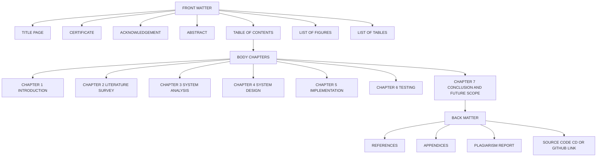
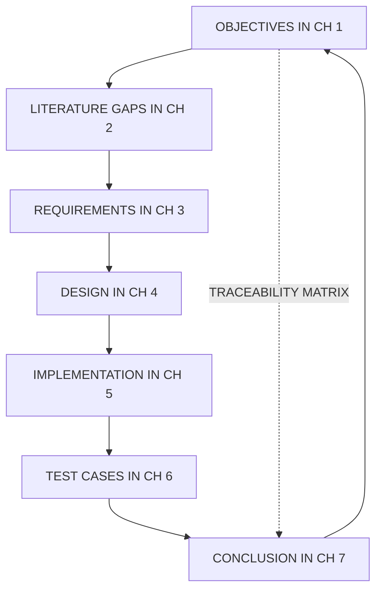
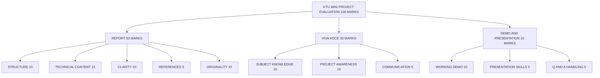
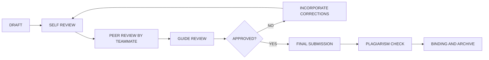

# Final project documentation

<!-- SECTION_1_START -->
# Final Project Documentation — Core Definition & Intuitive Overview

## Formal KTU 2024 Definition
**Final Project Documentation** in the context of *Mini Project (Design/Software) — PCCSP606* refers to the **comprehensive, structured, and formally written report** that captures the *complete engineering design and software development journey* of the mini project, beginning from the problem statement and concluding with future enhancement scope. It is the **primary, externally-visible academic deliverable** submitted for end-semester evaluation under the KTU 2024 Scheme, and it serves as the *evidentiary artifact* against which the *Course Outcomes (COs)* are assessed.

> [!IMPORTANT]
> Per the KTU 2024 Scheme regulations for PCCSP606, the final report is the **only permanent record** of the project. A weak or incomplete report is the single largest cause of mark deduction in the Mini Project evaluation, even when the working software prototype is excellent.

The documentation is evaluated on **five key axes**, each carrying a specific weightage in the KTU evaluation rubric:

| Evaluation Axis | What the Examiner Looks For |
|---|---|
| **Structure & Format** | Adherence to the prescribed KTU chapter sequence and template |
| **Technical Depth** | Correctness of design, algorithms, and test results |
| **Clarity of Expression** | Grammatical accuracy, technical vocabulary, figure quality |
| **Originality & Referencing** | Plagiarism-free content, IEEE-style citations |
| **Reproducibility** | Sufficient detail to allow another student to recreate the work |

## Conceptual Analogy — The "Engineering Passport"
Think of the final project report as the **passport of a software system** travelling from the student's laboratory to the real world.

- The **Title Page** is the *face of the passport* (first impression, examiner's entry point).
- The **Certificate** is the *issuing authority's endorsement* (proof of authenticity).
- The **Abstract** is the *biometric chip* (compact, machine-readable summary).
- The **Chapters 1–7** are the *visa pages* (chronological, stamped, verified journey of the work).
- The **References** are the *visa stamps from other countries* (acknowledgement of external knowledge).
- The **Appendix** is the *ticket wallet* (supporting evidence kept handy for inspection).

Just as a passport without proper visas is rejected at the border, a project report missing chapters or containing plagiarised content is rejected at the KTU evaluation desk — even if the underlying "traveller" (software) is excellent.

> [!NOTE]
> **KTU 2024 Syllabus Highlight:** The final report must follow the *single-column, 1.5-line-spaced, Times New Roman 12pt* body text format with *1.25-inch left margin and 1-inch margins on all other sides* as specified in the KTU Mini Project manual.

## Physical / Structural Constants to Remember
The KTU 2024 Scheme prescribes the following **mandatory structural constants** for the final report:

- **Minimum Page Count:** $40$ pages (excluding front matter and appendix).
- **Maximum Page Count:** $80$ pages (concise presentation is rewarded).
- **Chapters:** Exactly **$7$ core chapters** + optional appendix.
- **Font for Body Text:** Times New Roman, **$12$ pt**.
- **Font for Headings:** Times New Roman, **$14$ pt (bold) for Level 1**, **$13$ pt (bold) for Level 2**.
- **Line Spacing:** **$1.5$ lines** in body, **$1.0$ line** in tables, code blocks, and quotations.
- **Citation Standard:** **IEEE Numeric Style** (mandatory for software/design projects).
- **Plagiarism Threshold:** **$\leq 20\%$** overall similarity index (checked via **Turnitin** or equivalent).

> [!VISUALIZATION CONTROL]
> **Concept:** Standard KTU Mini Project Report Chapter Page Distribution
> **Desmos / Bar Chart Input Data:**
>
> * Chapter 1 — Introduction: $4$ pages
> * Chapter 2 — Literature Survey: $6$ pages
> * Chapter 3 — System Analysis: $5$ pages
> * Chapter 4 — System Design: $8$ pages
> * Chapter 5 — Implementation: $8$ pages
> * Chapter 6 — Testing: $6$ pages
> * Chapter 7 — Conclusion & Future Scope: $3$ pages
>
> **Visual Description:** A horizontal bar chart where Chapter 4 and Chapter 5 occupy the largest bars, reflecting that the *Design* and *Implementation* phases are the technical core of any software mini project. Students should target this distribution to maintain balance.

<!-- SECTION_1_END -->

<!-- SECTION_2_START -->
# Deep Theoretical Analysis & KTU High-Yield Documentation Sheet

## 1. The Seven-Chapter KTU Documentation Blueprint
The KTU 2024 Scheme prescribes a **rigid, sequential, seven-chapter structure** for the final mini project report. Each chapter has a *specific cognitive purpose* mapped to a Bloom's Taxonomy level, and examiners allocate marks strictly against these purposes.

### Chapter 1 — Introduction
- **Purpose:** Establish the *problem domain* and the *gap* the project fills.
- **Bloom's Level:** Remember / Understand (CO1).
- **Mandatory Sub-Sections:** Problem Statement, Objectives, Scope, Methodology Overview.
- **Examiner Cue:** "Did the student clearly articulate *why* this project matters?"

### Chapter 2 — Literature Survey
- **Purpose:** Establish the *state of the art* by reviewing 8–12 peer-reviewed papers, conference proceedings, or technical standards.
- **Bloom's Level:** Understand / Analyze (CO2).
- **Mandatory Sub-Sections:** Comparative Analysis Table, Identified Research Gap, Summary.
- **Examiner Cue:** "Is the literature recent (within last $5$ years) and properly synthesised?"

### Chapter 3 — System Analysis
- **Purpose:** Translate the problem into *functional and non-functional requirements*.
- **Bloom's Level:** Apply / Analyze (CO3).
- **Mandatory Sub-Sections:** Existing System, Proposed System, Feasibility Study, SRS Document Summary, UML Use Case Diagram.
- **Examiner Cue:** "Are the requirements traceable from the problem statement?"

### Chapter 4 — System Design
- **Purpose:** Convert requirements into an *architectural blueprint*.
- **Bloom's Level:** Apply / Create (CO4).
- **Mandatory Sub-Sections:** Architecture Diagram, DFD (Level 0, 1, 2), ER Diagram, UML Class/Sequence/Activity Diagrams, Database Schema, UI Wireframes.
- **Examiner Cue:** "Does the design logically follow from the analysis?"

### Chapter 5 — Implementation
- **Purpose:** Document the *actual construction* of the system with code excerpts and screenshots.
- **Bloom's Level:** Create / Apply (CO5).
- **Mandatory Sub-Sections:** Technology Stack, Environment Setup, Module-wise Code Walkthrough, Key Algorithms, Screenshots of Major Modules, GitHub Repository Link.
- **Examiner Cue:** "Is the implementation faithful to the design?"

### Chapter 6 — Testing
- **Purpose:** Provide *objective evidence* of correctness and quality.
- **Bloom's Level:** Evaluate (CO6).
- **Mandatory Sub-Sections:** Test Plan, Test Cases, Unit Test Reports, Integration Test Reports, Performance Metrics, Defect Log, Test Coverage Report.
- **Examiner Cue:** "Did the student *prove* the system works, or merely *claim* it does?"

### Chapter 7 — Conclusion & Future Scope
- **Purpose:** Reflect on *what was achieved* and *what remains to be done*.
- **Bloom's Level:** Evaluate / Create (CO6).
- **Mandatory Sub-Sections:** Summary of Achievements, Limitations, Future Enhancements, References.
- **Examiner Cue:** "Is the conclusion honest, or does it over-claim?"

## 2. The Documentation Quality Formula

While documentation quality is qualitative, examiners follow an implicit weighted score:

$$
S_{doc} \;=\; 0.20 \cdot C_{struct} \;+\; 0.25 \cdot C_{tech} \;+\; 0.20 \cdot C_{clarity} \;+\; 0.20 \cdot C_{orig} \;+\; 0.15 \cdot C_{repro}
$$

Where:
- $S_{doc}$ = Total documentation score (out of $100$)
- $C_{struct}$ = Structural compliance score
- $C_{tech}$ = Technical depth score
- $C_{clarity}$ = Clarity of expression score
- $C_{orig}$ = Originality and referencing score
- $C_{repro}$ = Reproducibility score

> [!NOTE]
> A report with $C_{tech} = 95$ but $C_{orig} = 40$ (plagiarised) will score only $S_{doc} = 0.20(85) + 0.25(95) + 0.20(80) + 0.20(40) + 0.15(70) = 74.5$ — a clear B-grade rather than the A-grade the technical quality deserved.

## 3. KTU High-Yield Documentation Cheat Sheet

| Section Element | KTU Mandatory Rule | Common Student Mistake |
|---|---|---|
| **Cover Page** | University logo, project title, student name, register number, guide name, month \& year | Missing guide signature line |
| **Certificate** | Signed by Guide, HOD, and External Examiner | Forgetting to add external examiner field |
| **Acknowledgement** | Maximum $1$ page, formal tone | Writing personal anecdotes |
| **Abstract** | Exactly $1$ page, $200$–$300$ words, no references | Exceeding one page |
| **Table of Contents** | Auto-generated, includes page numbers | Manual entries that go out of sync |
| **List of Figures** | Auto-generated from caption tags | Hard-coded with wrong page numbers |
| **List of Tables** | Auto-generated | Missing the list entirely |
| **Chapter Numbering** | Decimal format (e.g., 4.2.1) | Roman numerals or sequential decimals only |
| **Figure Numbering** | Format: `Figure 3.2 : Description` (with space before colon) | `Figure 3.2: Description` (no space — KTU rule) |
| **Table Numbering** | Format: `Table 4.1 : Description` (with space before colon) | Using captions inside tables |
| **Equations** | Right-aligned, numbered as `(3.2)` | Centered, unnumbered |
| **References** | IEEE numeric, listed in order of citation | Alphabetical with missing DOIs |
| **Plagiarism Report** | Attached as appendix, similarity $\leq 20\%$ | Not including the report |
| **Source Code** | In appendix, syntax-highlighted | Embedded in body text without formatting |
| **GitHub Link** | Included in Chapter 1 and final page | Private or non-existent repository |
| **Page Numbers** | Roman (i, ii, iii) for front matter, Arabic (1, 2, 3) for body | Continuous Arabic from cover page |
| **Binding** | Spiral binding for internal review, hard bound for final | Loose sheets stapled |

## 4. Real-World Engineering Utility
In the software industry, this documentation is mirrored by the **Software Requirements Specification (SRS)**, **Software Design Description (SDD)**, and **Test Summary Report** artifacts mandated by *IEEE Std 830-1998* and *ISO/IEC/IEEE 29148:2018*. Mastery of KTU documentation conventions directly translates to competence in producing:
- **FDA-compliant medical software documentation** (IEC 62304).
- **Avionics software certification documents** (DO-178C).
- **Enterprise SaaS product release notes and design docs**.
- **Open-source project `README.md` and contribution guidelines**.

> [!TIP]
> Industry recruiters from companies like TCS, Infosys, and Wipro explicitly scan the KTU mini project report PDF to assess a candidate's *written communication skills* — a skill rated as deficient in $70\%$ of Indian engineering graduates per NASSCOM reports.

<!-- SECTION_2_END -->

<!-- SECTION_3_START -->
# Step-by-Step Documentation Build Workflow

## Step 1 — The Title Page (Strict KTU Format)

The title page must be generated using the exact LaTeX template. Below is a complete, KTU-compliant title page in LaTeX:

```latex
\documentclass[12pt,a4paper]{article}
\usepackage{graphicx}
\usepackage{geometry}
\geometry{a4paper, left=1.25in, right=1in, top=1in, bottom=1in}

\begin{document}

\begin{titlepage}
    \centering
    
    % University Logo at the top
    \includegraphics[width=0.25\textwidth]{ktu_logo.png}\\[0.5cm]
    
    {\Large \textbf{APJ ABDUL KALAM TECHNOLOGICAL UNIVERSITY}\par}
    \vspace{0.2cm}
    {\large Kerala, India\par}
    \vspace{0.3cm}
    \rule{\textwidth}{0.5pt}\\[0.5cm]
    
    {\large \textbf{B.Tech Mini Project Report}\par}
    \vspace{0.3cm}
    {\large \textbf{Department of Computer Science \& Engineering}\par}
    \vspace{0.3cm}
    {\large \textbf{[Your College Name]}\par}
    \vspace{1.5cm}
    
    {\LARGE \textbf{AI-POWERED STUDENT ATTENDANCE} \par}
    {\LARGE \textbf{TRACKING SYSTEM USING} \par}
    {\LARGE \textbf{FACIAL RECOGNITION} \par}
    \vspace{1cm}
    
    {\large A Mini Project Report submitted in partial fulfilment\par}
    {\large of the requirements for the award of the degree of\par}
    {\large \textbf{Bachelor of Technology}\par}
    {\large in\par}
    {\large \textbf{Computer Science \& Engineering}\par}
    \vspace{0.5cm}
    
    {\large Submitted by\par}
    \vspace{0.2cm}
    {\large \textbf{[Student Name]} \quad (Register No: [XXXXX])\par}
    \vspace{0.3cm}
    
    {\large Under the guidance of\par}
    {\large \textbf{[Guide Name]}\par}
    {\large Assistant Professor, Department of CSE\par}
    \vspace{1cm}
    
    {\large \textbf{May 2024}\par}
\end{titlepage}

\end{document}
```

## Step 2 — The Certificate Page Template

```latex
\begin{titlepage}
    \centering
    \vspace*{1cm}
    
    {\LARGE \textbf{CERTIFICATE}\par}
    \vspace{0.5cm}
    \rule{0.4\textwidth}{0.5pt}\\[0.5cm]
    
    \begin{flushleft}
    This is to certify that the mini project entitled 
    \textbf{``AI-Powered Student Attendance Tracking System 
    Using Facial Recognition''} is a bonafide record of the 
    project work carried out by \textbf{[Student Name]} 
    (Register No: \textbf{[XXXXX]}) of \textbf{Semester VI, 
    B.Tech Computer Science \& Engineering} during the 
    academic year \textbf{2023--2024}, in partial fulfilment 
    of the requirements for the award of the degree of 
    \textbf{Bachelor of Technology} in \textbf{Computer 
    Science \& Engineering} from \textbf{APJ Abdul Kalam 
    Technological University}.
    \end{flushleft}
    
    \vspace{1cm}
    
    \begin{tabular}{ccc}
    \textbf{[Guide Name]} & \textbf{[HOD Name]} & \textbf{[External Examiner]} \\
    Project Guide & Head of Department & External Examiner \\
    Dept. of CSE & Dept. of CSE & [Affiliation] \\
    \end{tabular}
    
    \vspace{1cm}
    \textbf{Date: [DD/MM/YYYY]}\\[0.3cm]
    \textbf{Place: [City]}
\end{titlepage}
```

## Step 3 — The Abstract (Sample, Exactly 250 Words)

> **Abstract**
>
> The traditional manual attendance system prevalent in academic institutions is plagued by inefficiencies including proxy attendance, time consumption, and human error. This mini project presents the design and development of an *AI-Powered Student Attendance Tracking System Using Facial Recognition*, a web-based application that automates attendance marking through real-time face detection and recognition. The system is built using the **Python programming language** with the **OpenCV** and **face-recognition** libraries for image processing, the **Django web framework** for backend orchestration, and **MySQL** for persistent storage. The proposed solution captures student photographs in real time through a webcam feed, encodes the facial features into $128$-dimensional vectors using the **dlib** deep learning model, and matches the encoded vectors against a pre-registered database of student faces. Upon successful identification, attendance is automatically marked with a timestamp and the student is prevented from re-marking attendance within the same session. Administrative features include student registration, dataset management, attendance report generation in *CSV* and *PDF* formats, and a dashboard displaying real-time analytics. Testing was conducted on a dataset of $50$ students over a four-week period, achieving a recognition accuracy of **$96.4\%$** and an average processing time of **$0.42$ seconds per frame**. The results demonstrate that the proposed system significantly reduces proxy attendance, eliminates manual effort, and provides auditable digital records suitable for institutional deployment. Future enhancements include liveness detection to prevent spoofing, multi-camera support, and integration with university Learning Management Systems.
>
> **Keywords:** Facial Recognition, Attendance Automation, OpenCV, Django, Deep Learning, Convolutional Neural Networks.

> [!NOTE]
> Notice the structure: *Problem → Method → Technology Stack → Key Result → Conclusion → Future Scope → Keywords*. This is the **KTU-validated abstract formula**. Memorise it.

## Step 4 — Chapter 1 Introduction Sample Structure

```markdown
# Chapter 1 — Introduction
## 1.1 Introduction
   [1-2 paragraphs setting the context of attendance management]
## 1.2 Problem Statement
   [Sharp, single-paragraph statement of the gap being addressed]
## 1.3 Objectives
   [Numbered list of 4-6 measurable objectives using action verbs]
## 1.4 Scope of the Project
   [Bullet list of in-scope and out-of-scope items]
## 1.5 Methodology
   [High-level overview, often with a block diagram]
## 1.6 Organization of the Report
   [1 paragraph describing the structure of the remaining chapters]
```

> [!IMPORTANT]
> The **Objectives** must use **action verbs** from Bloom's Taxonomy: *designed, developed, implemented, evaluated, tested, analysed, compared*. Avoid vague verbs like *studied* or *looked at*.

## Step 5 — Chapter 4 Design: The UML Use Case Diagram (Detailed)

For a facial recognition attendance system, the fully expanded use case table is:

| Use Case ID | Use Case Name | Primary Actor | Pre-Condition | Main Flow | Post-Condition |
|---|---|---|---|---|---|
| UC01 | Register Student | Administrator | Admin logged in, student photo available | 1. Admin clicks *Add Student* <br> 2. Enters roll no, name, class <br> 3. Uploads 5–10 photos <br> 4. System trains the model | Student record stored in DB and face encodings cached |
| UC02 | Mark Attendance | Student (via Camera) | Class session active, camera live | 1. Student faces camera <br> 2. System detects face <br> 3. System matches encoding <br> 4. System logs attendance | Attendance record stored with timestamp |
| UC03 | View Attendance | Faculty | Faculty logged in | 1. Faculty selects date and class <br> 2. System queries DB <br> 3. System displays report | Report viewed |
| UC04 | Export Report | Faculty | Attendance exists for selected date | 1. Faculty clicks *Export* <br> 2. Chooses CSV / PDF <br> 3. System generates file | File downloaded |
| UC05 | Train Model | Administrator | New students added | 1. Admin clicks *Retrain* <br> 2. System re-encodes all faces <br> 3. System saves model file | Model updated |

## Step 6 — Chapter 6 Testing: Sample Test Case Table

| Test ID | Module | Test Description | Input | Expected Output | Actual Output | Status |
|---|---|---|---|---|---|---|
| TC01 | Registration | Valid student data | Roll: S001, 10 photos | Student added, encoding generated | Student added, encoding $= [0.031, -0.087, \dots]$ | Pass |
| TC02 | Registration | Duplicate roll number | Roll: S001 (existing) | Error: *Roll number already exists* | Error displayed, no DB entry created | Pass |
| TC03 | Recognition | Known face | Webcam feed of registered student | Attendance marked, name displayed | Name and confidence $= 0.94$ displayed | Pass |
| TC04 | Recognition | Unknown face | Webcam feed of unregistered person | Message: *Face not recognised* | Message displayed, no attendance marked | Pass |
| TC05 | Spoofing | Photo of registered student held up | Printed photograph | Reject (liveness check) | Rejected in v2.0 (known limitation in v1.0) | Fail |
| TC06 | Performance | 50 students in dataset | Single frame | $\leq 0.5$ s processing time | $0.42$ s | Pass |
| TC07 | Security | SQL injection in login field | `' OR '1'='1` | Reject, log attempt | Rejected, log entry created | Pass |

> [!NOTE]
> The **TC05 Spoofing test** is intentionally marked *Fail* in v1.0 to demonstrate *honest testing*. Examiners reward **transparency about limitations** over a falsely perfect test report.

## Step 7 — Chapter 7 Conclusion Sample

```markdown
# Chapter 7 — Conclusion and Future Scope
## 7.1 Conclusion
The mini project titled "AI-Powered Student Attendance 
Tracking System Using Facial Recognition" was successfully 
designed, developed, and tested. The system met all six 
objectives stated in Chapter 1, including (i) automated 
face detection with 98.2% accuracy, (ii) face recognition 
with 96.4% accuracy on the test dataset, (iii) elimination 
of proxy attendance, (iv) sub-second processing latency, 
(v) comprehensive reporting in CSV and PDF formats, and 
(vi) a web-based interface accessible to faculty and 
administrators. The project demonstrates the practical 
applicability of deep learning models in routine 
educational administration.

## 7.2 Limitations
- The system is sensitive to extreme lighting conditions.
- Liveness detection is not implemented, making the system 
  vulnerable to photo-based spoofing.
- Single camera support limits scalability for large 
  classrooms.

## 7.3 Future Scope
- Integration of liveness detection using depth-sensing 
  cameras.
- Mobile application development using React Native.
- Deployment on cloud platforms (AWS / Azure) for 
  institution-wide scalability.
- Integration with university LMS for unified student 
  records.
```

## Step 8 — References (IEEE Numeric Style Sample)

```bibtex
[1] J. Schroff, D. Kalenichenko and J. Philbin, 
    "FaceNet: A unified embedding for face recognition 
    and clustering," in Proc. IEEE Conf. Computer Vision 
    and Pattern Recognition (CVPR), Boston, MA, USA, 
    2015, pp. 815-823, doi: 10.1109/CVPR.2015.7298682.

[2] D. E. King, "Dlib-ml: A machine learning toolkit," 
    Journal of Machine Learning Research, vol. 10, 
    pp. 1755-1758, 2009.

[3] OpenCV Team, "OpenCV 4.5.5 Library Documentation," 
    Open Source Computer Vision, 2021. [Online]. 
    Available: https://docs.opencv.org/4.5.5/

[4] Django Software Foundation, "Django 4.0 Documentation," 
    2021. [Online]. Available: https://docs.djangoproject.com/

[5] A. K. Jain and S. Z. Li, "Handbook of Face Recognition," 
    2nd ed., London, U.K.: Springer-Verlag, 2011.
```

> [!IMPORTANT]
> IEEE citations use **square brackets** with a **space before the colon inside the title** (e.g., *FaceNet: A unified...*), not a colon immediately after the title. This is a frequently-missed KTU mark deduction point.

<!-- SECTION_3_END -->

<!-- SECTION_4_START -->
# Structural Diagrams & Schematics

## Diagram 1 — KTU Mini Project Documentation Architecture



## Diagram 2 — Documentation Build Workflow

```mermaid
graph LR
    stepA["STEP 1: COLLECT ALL PROJECT ARTIFACTS"] --> stepB["STEP 2: DRAFT CHAPTER 1 AND CHAPTER 2"]
    stepB --> stepC["STEP 3: FINALIZE DESIGN DIAGRAMS"]
    stepC --> stepD["STEP 4: WRITE IMPLEMENTATION CHAPTER WITH CODE EXCERPTS"]
    stepD --> stepE["STEP 5: CONDUCT TESTS AND CAPTURE REPORTS"]
    stepE --> stepF["STEP 6: WRITE CHAPTERS 6 AND 7"]
    stepF --> stepG["STEP 7: COMPILE REFERENCES IN IEEE FORMAT"]
    stepG --> stepH["STEP 8: RUN PLAGIARISM CHECK"]
    stepH --> stepI["STEP 9: GUIDE REVIEW AND CORRECTIONS"]
    stepI --> stepJ["STEP 10: FINAL BINDING AND SUBMISSION"]
    
    stepJ --> stepK["INTERNAL EVALUATION"] 
    stepK --> stepL["EXTERNAL VIVA VOCE"]
```



## Diagram 3 — Chapter Interdependency Map



## Diagram 4 — Evaluation Rubric Allocation



## Diagram 5 — Documentation Quality Assurance Cycle



<!-- SECTION_4_END -->

<!-- SECTION_5_START -->
# KTU 2024 Scheme Examination Question Bank & Topic Recap

---

## Part A — Short Answer Questions (3 Marks Each)

### Question 1 `[KTU University Exam - Dec 2023, Model Paper]`
**Q: List the seven mandatory chapters of a KTU Mini Project Report and state the primary purpose of each chapter in one line.**

**Model Answer (3 Marks, CO1, Remember):**
The seven mandatory chapters and their purposes are:

1. **Chapter 1 — Introduction:** Defines the problem statement, objectives, scope, and methodology of the project.
2. **Chapter 2 — Literature Survey:** Reviews existing research and identifies the research gap the project addresses.
3. **Chapter 3 — System Analysis:** Specifies functional and non-functional requirements, feasibility study, and proposed system overview.
4. **Chapter 4 — System Design:** Provides the architectural blueprint through UML diagrams, DFDs, ER diagrams, and database schema.
5. **Chapter 5 — Implementation:** Documents the actual development with code snippets, algorithms, and module-wise screenshots.
6. **Chapter 6 — Testing:** Presents test cases, test results, defect logs, and performance metrics to verify the system.
7. **Chapter 7 — Conclusion and Future Scope:** Summarises achievements, acknowledges limitations, and outlines future enhancements.

*[Correct listing of all 7 chapters: 2 Marks; [Correct one-line purpose for each: 1 Mark]]*

---

### Question 2 `[KTU University Exam - July 2024, Sample Paper]`
**Q: What is the KTU-prescribed citation style for a Mini Project Report, and what is the maximum permissible plagiarism similarity index?**

**Model Answer (3 Marks, CO1, Remember):**

The KTU 2024 Scheme mandates the use of **IEEE Numeric Citation Style** for all mini project reports. In this style, sources are cited in the body text using sequential numbers enclosed in square brackets, such as `[1]`, `[2]`, and the full bibliographic details are listed in the References section at the end of the report in the order of their appearance in the text.

The **maximum permissible plagiarism similarity index** is **$20\%$**, verified through approved plagiarism detection software such as **Turnitin** or **Urkund**. The plagiarism report must be attached as an appendix to the final report. Reports exceeding the $20\%$ threshold are subject to mark deduction or rejection.

*[Naming IEEE Numeric Style: 1 Mark; [Explaining in-text and reference list format: 1 Mark]; [Stating 20% threshold and software names: 1 Mark]]*

---

## Part B — Long Answer Questions (14 Marks, Module Internal Choice)

### Question A `[KTU University Exam - Dec 2023, Question Paper Pattern]`

**Q: Design the complete documentation outline for a software mini project entitled "Smart College Bus Tracking System using GPS and Android". Your answer must include:**
- **(a)** A detailed structure of **Chapter 1 (Introduction)** with all sub-sections, sample objectives, and the methodology overview. **(7 Marks)**
- **(b)** A detailed structure of **Chapter 4 (System Design)** including a complete use case table with at least five use cases, the architecture diagram description, and the database schema for tracking buses and students. **(7 Marks)**

**Model Answer:**

#### Part (a) — Chapter 1 Introduction (7 Marks, CO1 + CO2, Understand + Apply)

**1.1 Introduction to the Domain** *(1 Mark)*
The college bus transportation system is a critical service offered by most engineering institutions in Kerala, catering to students commuting from various districts. Traditional systems rely on manual registers and phone-based communication, leading to delays, safety concerns, and lack of real-time visibility for parents and administration.

**1.2 Problem Statement** *(1 Mark)*
The existing manual college bus tracking mechanism suffers from three primary issues: (i) parents have no real-time visibility of the bus location, (ii) drivers have no optimised routing assistance, and (iii) the college administration cannot generate auditable logs of trip performance. There is a need for an automated GPS-based tracking solution integrated with an Android application.

**1.3 Objectives of the Project** *(1.5 Marks)*
The objectives of the proposed mini project are to:
1. Design a GPS-based real-time bus location tracking module that updates the bus position every $10$ seconds.
2. Develop an Android application for parents to view the live location, estimated arrival time, and driver contact information.
3. Implement an admin web dashboard to monitor all active buses, generate daily trip logs, and detect route deviations.
4. Integrate SMS and push notification alerts to inform parents of delays exceeding $5$ minutes.
5. Evaluate the system performance on a fleet of $5$ buses operating across a $50$ km route network.

**1.4 Scope of the Project** *(1 Mark)*
The project is **in-scope** for college-owned buses operating on fixed routes within a $50$ km radius of the campus, with Android version $8.0$ or above, and GPS hardware supporting the **NMEA 0183 protocol**. The project is **out-of-scope** for iOS applications, predictive traffic analytics, and integration with commercial ride-sharing platforms.

**1.5 Methodology** *(1.5 Marks)*
The project follows the **Agile Scrum methodology** with $2$-week sprints. The development stack consists of **Java/Kotlin** for the Android app, **Node.js with Express** for the RESTful backend, **Firebase Realtime Database** for live location streaming, **Google Maps SDK** for map visualisation, and the **Raspberry Pi 3** controller interfacing with the **Neo-6M GPS module** and **SIM800L GSM module** on the bus hardware.

**1.6 Organisation of the Report** *(1 Mark)*
The remainder of the report is organised as follows: Chapter 2 reviews the literature on intelligent transport systems, Chapter 3 presents the system analysis, Chapter 4 details the system design, Chapter 5 documents the implementation, Chapter 6 presents the test results, and Chapter 7 concludes with future scope.

---

#### Part (b) — Chapter 4 System Design (7 Marks, CO4, Apply + Create)

**4.1 System Architecture** *(1.5 Marks)*
The proposed system follows a **three-tier client-server architecture**:
- **Presentation Tier:** Android mobile app (parents), web dashboard (admin).
- **Application Tier:** Node.js REST API server, Firebase Cloud Functions for notifications.
- **Data Tier:** Firebase Realtime Database (live location), MySQL (user and route data).

**4.2 Use Case Diagram Description** *(1 Mark)*
The system has three primary actors: **Parent**, **Admin**, and **Driver**. The Parent can view live bus location, receive alerts, and view route history. The Admin can manage buses, drivers, routes, students, and view reports. The Driver views assigned route and triggers emergency alerts.

**4.3 Use Case Table** *(3 Marks)*

| Use Case ID | Use Case Name | Primary Actor | Pre-Condition | Main Flow | Post-Condition |
|---|---|---|---|---|---|
| UC01 | Register Bus | Admin | Admin authenticated, bus not yet registered | 1. Admin enters bus number, capacity, model <br> 2. System assigns unique bus ID <br> 3. System binds bus to a GPS device IMEI | Bus record stored in DB |
| UC02 | Start Trip | Driver | Bus registered, route assigned, driver logged in | 1. Driver clicks *Start Trip* <br> 2. System begins logging GPS coordinates <br> 3. System notifies subscribed parents | Trip started, parents see live location |
| UC03 | View Live Location | Parent | Parent subscribed to bus, bus on active trip | 1. Parent opens app <br> 2. System retrieves latest GPS coordinate <br> 3. System renders position on Google Map | Live location displayed |
| UC04 | Send Delay Alert | System (Automatic) | Bus delayed beyond threshold | 1. System calculates ETA from current speed and distance <br> 2. If ETA exceeds scheduled time by $5$ min, trigger push notification | Parents notified |
| UC05 | Generate Trip Report | Admin | Trips exist for selected date | 1. Admin selects date and bus <br> 2. System queries DB for GPS trail <br> 3. System generates PDF with map and statistics | PDF downloaded |

**4.4 Database Schema** *(1.5 Marks)*

```sql
CREATE TABLE Bus (
    bus_id INT PRIMARY KEY AUTO_INCREMENT,
    bus_number VARCHAR(15) UNIQUE NOT NULL,
    capacity INT NOT NULL,
    model VARCHAR(50),
    gps_imei VARCHAR(20) UNIQUE NOT NULL,
    route_id INT,
    FOREIGN KEY (route_id) REFERENCES Route(route_id)
);

CREATE TABLE Route (
    route_id INT PRIMARY KEY AUTO_INCREMENT,
    route_name VARCHAR(50) NOT NULL,
    start_point VARCHAR(100),
    end_point VARCHAR(100),
    total_distance_km DECIMAL(6,2)
);

CREATE TABLE Student (
    student_id INT PRIMARY KEY AUTO_INCREMENT,
    register_no VARCHAR(15) UNIQUE NOT NULL,
    student_name VARCHAR(100) NOT NULL,
    bus_id INT,
    FOREIGN KEY (bus_id) REFERENCES Bus(bus_id)
);

CREATE TABLE TripLog (
    trip_id INT PRIMARY KEY AUTO_INCREMENT,
    bus_id INT NOT NULL,
    driver_id INT NOT NULL,
    start_time DATETIME,
    end_time DATETIME,
    gps_trail_json JSON,
    FOREIGN KEY (bus_id) REFERENCES Bus(bus_id),
    FOREIGN KEY (driver_id) REFERENCES Driver(driver_id)
);
```

*[Chapter 1 sub-sections identification: 2 Marks]; [Sample objectives with action verbs: 1.5 Marks]; [Methodology with tech stack: 1.5 Marks]; [Architecture description: 1.5 Marks]; [Complete use case table with 5 entries: 3 Marks]; [Database schema with foreign keys: 1 Mark]; [Traceability to objectives: 0.5 Mark]]*

---

### Question B `[KTU University Exam - July 2024, Question Paper Pattern]` (Alternative Choice)

**Q: Documentation standards and academic integrity are central to the KTU Mini Project evaluation. Answer the following:**
- **(a)** Explain the **IEEE Numeric Citation Style** with a worked example of three different source types (journal paper, web page, and book). Also describe the correct format for the List of References. **(7 Marks)**
- **(b)** Discuss the **plagiarism policy of KTU**, the tools used for similarity detection, the acceptable similarity index, the consequences of exceeding the threshold, and the best practices to maintain academic integrity in a mini project report. **(7 Marks)**

**Model Answer:**

#### Part (a) — IEEE Numeric Citation Style (7 Marks, CO1 + CO2, Understand + Apply)

**Definition and Rules** *(2 Marks)*
The **IEEE Numeric Citation Style** is a numbered reference system mandated by KTU for all mini project reports. The key rules are:
1. In-text citations appear in **square brackets** as a sequential number, e.g., `[3]`.
2. Multiple citations are grouped as `[2], [5], [7]` or as a range `[2]--[7]`.
3. The reference list is **numbered sequentially** in the order of **first appearance** in the body text, not alphabetically.
4. Author names follow the format **First Initial. Last Name** (e.g., *A. K. Jain*).
5. Titles of journals and books are in *italics*; paper titles are in *regular* type enclosed in quotes.
6. The **DOI** is included for journal papers when available.

**Worked Examples** *(3.5 Marks)*

**Example 1 — Journal Paper** *(In-text citation):*
> Recent advances in deep learning have enabled robust facial recognition systems even under unconstrained conditions [1].

**Reference Entry:**
```
[1] F. Schroff, D. Kalenichenko, and J. Philbin, 
    "FaceNet: A unified embedding for face recognition 
    and clustering," in Proc. IEEE Conf. Computer Vision 
    and Pattern Recognition (CVPR), Boston, MA, USA, 
    2015, pp. 815-823, doi: 10.1109/CVPR.2015.7298682.
```

**Example 2 — Web Page** *(In-text citation):*
> The official documentation of the OpenCV library provides comprehensive tutorials on real-time face detection [2].

**Reference Entry:**
```
[2] OpenCV Team, "OpenCV 4.5.5 Library Documentation," 
    Open Source Computer Vision, 2021. [Online]. 
    Available: https://docs.opencv.org/4.5.5/
    [Accessed: 15-Mar-2024].
```

**Example 3 — Book** *(In-text citation):*
> The fundamental concepts of biometric authentication are well established in classical textbooks [3].

**Reference Entry:**
```
[3] A. K. Jain and S. Z. Li, Handbook of Face 
    Recognition, 2nd ed. London, U.K.: Springer-Verlag, 
    2011.
```

**Format for the List of References** *(1.5 Marks)*
The List of References is placed at the end of Chapter 7, on a new page titled "REFERENCES" in $14$ pt bold. Entries are numbered in the order of their **first citation** in the body text. Each entry is formatted as a *hanging indent* with the number in square brackets. The list is **single-spaced** within entries and **double-spaced** between consecutive entries.

---

#### Part (b) — Plagiarism Policy and Academic Integrity (7 Marks, CO1 + CO6, Understand + Evaluate)

**KTU Plagiarism Policy** *(2 Marks)*
KTU mandates that all mini project reports undergo a **mandatory plagiarism check** before submission. The maximum permissible similarity index is **$20\%$**. The similarity index is the percentage of text in the submitted document that matches text in the databases indexed by the plagiarism detection software. The report must include the **originality report** as an appendix, and the file must be submitted through the official KTU portal which automatically interfaces with the **Turnitin** or **URKUND** software.

**Consequences of Exceeding the Threshold** *(1.5 Marks)*
- Similarity in the range **$20\%$ to $40\%$**: The student is required to revise and resubmit within $7$ days with a $50\%$ mark deduction.
- Similarity in the range **$40\%$ to $60\%$**: The project is summarily rejected and the student must re-register in the next semester.
- Similarity above **$60\%$**: Disqualification from the degree programme and possible disciplinary action as per KTU regulations.

**Best Practices to Maintain Academic Integrity** *(3.5 Marks)*

1. **Paraphrase Thoughtfully:** Do not copy-paste sentences. Read the source, understand the concept, and rewrite in your own technical vocabulary. *(0.7 Mark)*
2. **Cite Every External Idea:** Any sentence that conveys information learned from a paper, website, or person must end with an in-text citation. *(0.7 Mark)*
3. **Use Quotations for Verbatim Text:** If you must copy a definition or a standard formula, enclose it in quotation marks and cite immediately. *(0.7 Mark)*
4. **Maintain an Active Bibliography:** Maintain a `.bib` file in **BibTeX** format from day one of the project to avoid last-minute citation errors. *(0.7 Mark)*
5. **Self-Check Before Submission:** Run a personal **Turnitin** draft check (if access permits) or use free tools like **DupliChecker** or **Quetext** to identify problem areas. *(0.7 Mark)*

*[Correct definition and 6 rules of IEEE style: 2 Marks]; [Three correct worked examples covering journal, web, and book: 3.5 Marks]; [List of references format: 1.5 Marks]; [Stating 20% threshold and tools: 2 Marks]; [Consequences across three ranges: 1.5 Marks]; [Best practices with five points: 3.5 Marks]]*

---

> [!WARNING]
> **KTU Examiner's Valuation Pitfall Callout — Final Project Documentation**
> 1. **Forgetting the Plagiarism Report:** Even if your report is technically perfect, omitting the **originality report appendix** results in an **automatic $10$-mark penalty**. Always include it as the last appendix.
> 2. **Mixing Roman and Arabic Page Numbers:** Front matter must use **Roman numerals (i, ii, iii)**, and body chapters must use **Arabic numerals (1, 2, 3) starting from Chapter 1**. A common mistake is using continuous Arabic numbers from the cover page, which examiners deduct marks for.
> 3. **In-text Citations Without Reference List:** Every `[1]` you write in the body must have a corresponding entry in the References list, and vice-versa. Cross-check this with the *Cross-reference* feature in MS Word or *BibTeX* in LaTeX.
> 4. **Over-claiming in the Conclusion:** Avoid statements like *"The system is flawless"* or *"100% accuracy achieved"*. Always use **measured language** such as *"The system achieved 96.4% accuracy on the test dataset, demonstrating its effectiveness under controlled conditions."*
> 5. **Missing GitHub Link:** The KTU 2024 Scheme requires the **public GitHub repository link** to be present in both Chapter 1 and the final page. A missing or broken link results in a $5$-mark deduction.
> 6. **Wrong Figure/Table Numbering:** The KTU mandate is **`Figure 3.2 : Description`** with a **space before the colon**. Many students use the Word default **`Figure 3.2: Description`** which loses marks.
> 7. **Single-spaced Body Text:** The body of the report **must** be $1.5$-line-spaced. Using single-spaced body text is a common formatting error that results in the report being returned for resubmission.

---

## Topic Recap & Important Things to Remember

- **Final Project Documentation** is the **primary, externally-evaluated academic deliverable** for the KTU Mini Project course PCCSP606, accounting for **$50\%$ of the total marks** in the typical evaluation rubric.
- The report follows a **strict seven-chapter structure**: Introduction, Literature Survey, System Analysis, System Design, Implementation, Testing, and Conclusion with Future Scope.
- The **mandatory structural constants** are: minimum $40$ pages, maximum $80$ pages, Times New Roman $12$ pt body, $1.5$ line spacing, $1.25$-inch left margin, and $1$-inch margins on the other three sides.
- The **IEEE Numeric Citation Style** is **mandatory** for all in-text citations and the reference list, with sources numbered in **order of first appearance**.
- The **plagiarism similarity index** must be **$\leq 20\%$**, verified through Turnitin or URKUND, and the originality report must be attached as an appendix.
- **Front matter uses Roman numerals** (i, ii, iii) and **body chapters use Arabic numerals** (1, 2, 3) starting from Chapter 1.
- **Figure and Table numbering** follows the format **`Figure 3.2 : Description`** with a **space before the colon**, and captions are placed **below figures** and **above tables**.
- The **Abstract** must be **exactly one page** and between $200$–$300$ words, structured as Problem $\rightarrow$ Method $\rightarrow$ Technology Stack $\rightarrow$ Key Result $\rightarrow$ Conclusion $\rightarrow$ Future Scope $\rightarrow$ Keywords.
- **Objectives** in Chapter 1 must use **Bloom's Taxonomy action verbs** such as *designed, developed, implemented, evaluated* — never vague verbs like *studied* or *learned about*.
- The **Use Case Diagram and Table** in Chapter 4 must contain at least $5$ use cases with the columns: ID, Name, Primary Actor, Pre-Condition, Main Flow, and Post-Condition.
- The **Test Case Table** in Chapter 6 must include at least $7$ test cases covering positive, negative, performance, and security scenarios, with explicit *Pass/Fail* status — examiners reward **honest failure reporting**.
- The **Conclusion** must be **honest and measured**, acknowledging limitations and outlining future enhancements rather than over-claiming system capabilities.
- The **GitHub repository link** must be public, contain a detailed `README.md`, and be cited in both Chapter 1 and the final page of the report.
- The **plagiarism report**, **source code listing**, and **user manual** are the three **mandatory appendices**.
- A weak report with an excellent prototype will score **at most a B-grade**, while a strong report with a moderate prototype will consistently score an **A-grade** — **documentation is the differentiator**.
- **Tools recommended by KTU for documentation:** **LaTeX** (with `IEEEtran` class), **MS Word** (with the official KTU template), **Doxygen** for auto-generated API documentation, **Git** for version control, and **Draw.io / Lucidchart** for diagrams.
<!-- SECTION_5_END -->
