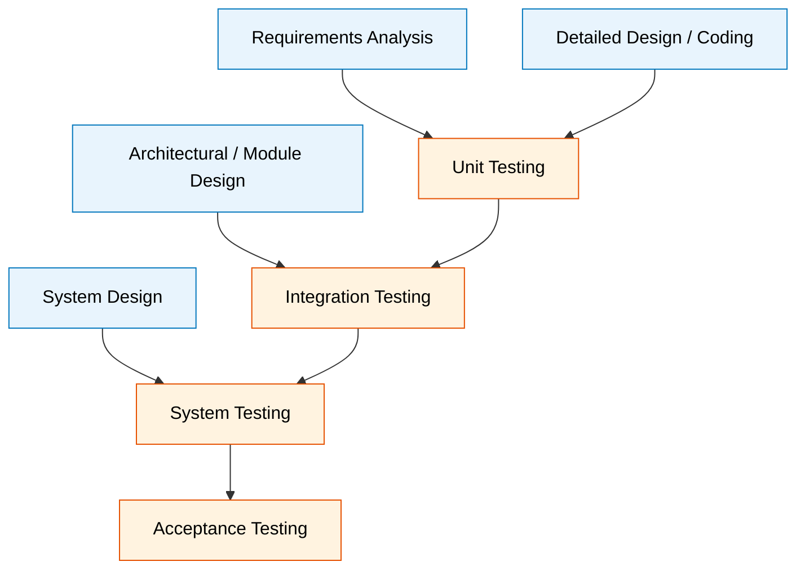
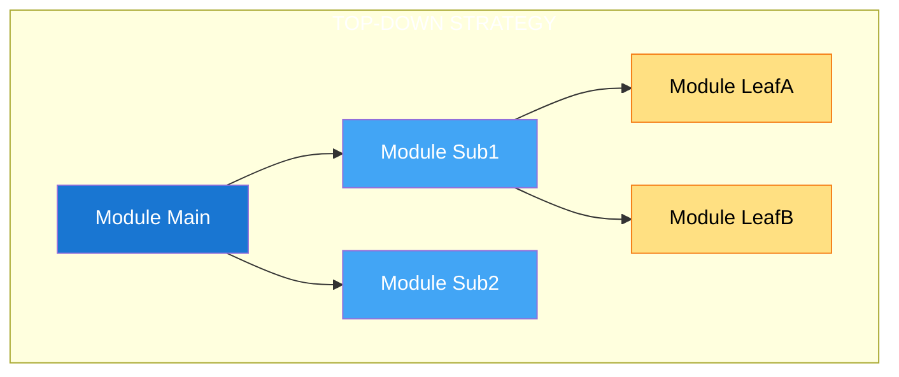
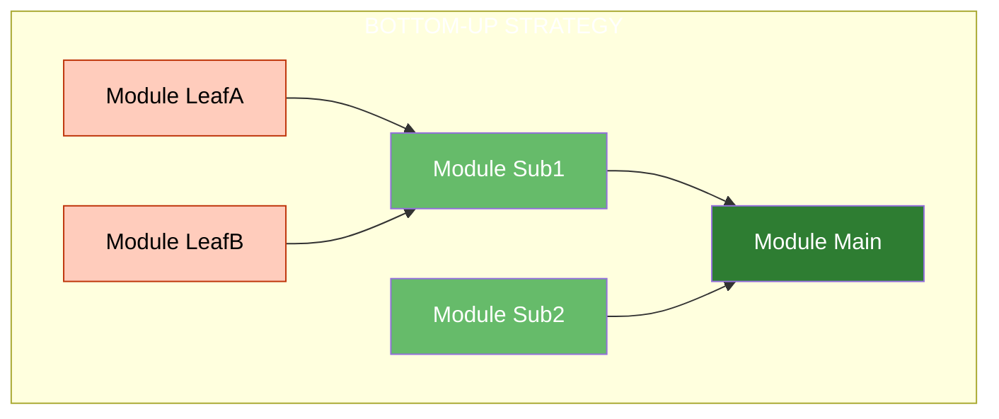
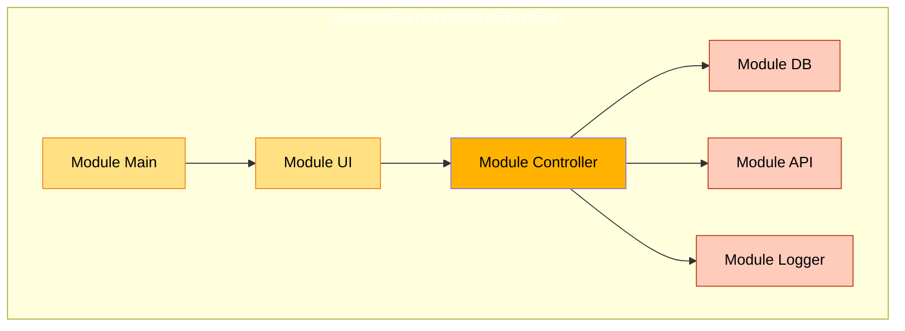
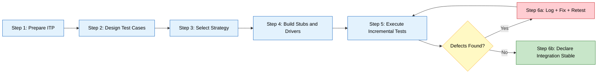
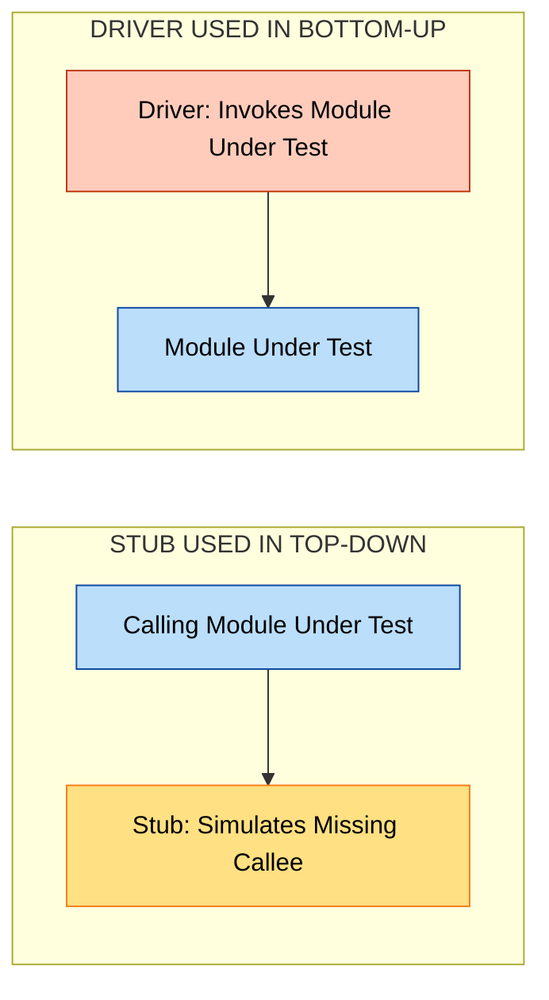

# Integration testing

<!-- SECTION_1_START -->
# 1. Core Technical Definition & Intuitive Overview

## Formal Academic Definition (KTU 2024 Syllabus Terminology)

**Integration Testing** is a systematic, structured level of software testing in which **individually unit-tested software modules** are combined, linked, and exercised as a unified group to expose faults in the *interaction*, *interface*, *data exchange*, and *control flow* between integrated units. As per the IEEE 829-2008 / ISO/IEC/IEEE 29119 standards adopted under the KTU 2024 Scheme Software Engineering curriculum (Module 2 – Implementation and Software Testing), integration testing is a **test level** (not a test type) and is concerned exclusively with **inter-module defects**, distinguishing it from unit testing (intra-module) and system testing (end-to-end requirements validation).

> [!IMPORTANT]
> **KTU Board Definition (Memorize Verbatim):**
> *“Integration Testing is the systematic testing of the interfaces between combined software components to detect faults arising from incorrect or missing interactions, mismatched assumptions on data formats/values, and unintended control flow propagation across module boundaries.”*

## Conceptual Analogy / Intuition

Imagine you are assembling a **bicycle from individual factory parts** — wheels, gears, chain, brakes, handlebar. Each part was tested independently (unit testing) and works perfectly in isolation. However:

- Will the **chain** actually fit the **gear teeth ratio** of the chosen sprocket?
- Will the **brake cable** tension match the **brake lever** stroke length?
- Will the **handlebar stem diameter** physically slide into the **fork tube**?

> These cross-part compatibility issues are exactly what **Integration Testing** uncovers in software. Individual modules pass unit tests, but their **interfaces, data contracts, and call sequences** may be wrong, missing, or misinterpreted.

> [!NOTE]
> **Key Insight:** Unit testing answers *"Does each piece work?"* — Integration testing answers *"Do the pieces work **together**?"*

## Why Integration Testing Matters in Mini Projects

In a KTU Mini Project (PCCSP606), your software likely has 3–8 modules (e.g., *Login*, *Database Handler*, *UI Form*, *API Endpoint*, *Report Generator*). The **majority of real-world software defects (≈ 60 %)** originate at module boundaries — a statistic validated by the **Boehm / Basili defect-distribution curve**. Integration testing is therefore your **highest-ROI testing activity** in the project lifecycle.

> [!VISUALIZATION CONTROL]
> **Concept:** Defect Distribution Across Test Levels (Boehm Curve Approximation)
> **Plot Description:** On a 2D coordinate plane, draw a bar chart with X-axis labeled *Test Level* (Unit, Integration, System, Acceptance) and Y-axis labeled *% of Defects Found*. Bars decrease monotonically: Unit ≈ 40 %, Integration ≈ 25 %, System ≈ 20 %, Acceptance ≈ 15 %. A red dashed line overlays the bar tops to show the *decreasing discovery rate*, while a green dashed line overlays the *increasing cost-per-defect-found*. The two lines cross approximately at the *Integration* bar, visually proving that **integration testing offers the best cost-to-defect-yield ratio**.
> **Observed Takeaway:** Catching an interface bug during integration is roughly **10× cheaper** than catching it after delivery (Acceptance phase).

## Standard Metrics and Constants Used in Integration Testing

| Metric | Standard Value | Purpose |
| :--- | :--- | :--- |
| **Defect Density (Integration)** | $\le 0.5$ defects per KLOC | Industry benchmark for healthy integration |
| **Test Coverage Target** | $\ge 80\,\%$ interface coverage | KTU recommended threshold |
| **Stub / Driver Overhead** | $\approx 10$–$20\,\%$ of project code | Rule of thumb for harness code |
| **Integration Defect Origin** | $\approx 60\,\%$ of total defects | Boehm's empirical curve |

---

<!-- SECTION_1_END -->

<!-- SECTION_2_START -->
# 2. Deep Theoretical Analysis & KTU High-Yield Formula Sheet

## The Integration Testing Process (Structured Logic Steps)

The integration testing workflow, as prescribed by KTU's Software Engineering module, follows a deterministic 6-step sequence:

1. **Prepare the Integration Test Plan (ITP):** Document scope, modules, sequence, roles, tools, exit criteria.
2. **Design Integration Test Cases:** Focus on *interface specifications*, *data-flow boundaries*, and *control handoffs*.
3. **Select Integration Strategy:** Choose Top-Down, Bottom-Up, Sandwich (Hybrid), or Big-Bang based on architecture.
4. **Build Test Harness:** Develop *Stubs* (for missing top-level modules) and *Drivers* (for invoking low-level modules).
5. **Execute Incremental Tests:** Combine modules progressively, log defects in a defect-tracking sheet.
6. **Report, Regress, and Exit:** Re-test after fixes; declare the module cluster *integration-stable* upon satisfying exit criteria.

> [!IMPORTANT]
> **Why this order matters:** Step 3 (strategy selection) is the *single most critical decision* — it directly determines the **test build sequence**, **stub/driver effort**, and **defect-isolation cost**. KTU examiners frequently award 4–5 marks on this strategic reasoning alone.

## The Four Integration Testing Strategies

### Strategy 1 — Top-Down Integration Testing

- **Mechanism:** Start from the *root/main module* of the call graph and progressively add *direct subordinates* (depth-first or breadth-first).
- **Tooling:** Uses **Stubs** to simulate lower modules that are not yet integrated.
- **Best for:** Architecturally top-heavy applications (e.g., *main-controller → subsystems* patterns, GUI-driven apps).
- **Advantage:** Early demonstration of a working *skeleton system*; critical control paths are tested first.
- **Disadvantage:** Stubs are expensive to maintain; low-level utilities are tested last.

### Strategy 2 — Bottom-Up Integration Testing

- **Mechanism:** Start from the *leaf modules* (no further calls) and progressively add *calling modules* upward.
- **Tooling:** Uses **Drivers** to invoke lower-level modules and assert their return values.
- **Best for:** Object-oriented / data-centric systems, libraries, and middleware.
- **Advantage:** No stubs required; high test coverage of utilities is achieved early.
- **Disadvantage:** No working skeleton until late; the *driver code* inflates project size.

### Strategy 3 — Sandwich (Hybrid) Integration Testing

- **Mechanism:** Combines Top-Down and Bottom-Up simultaneously, meeting in the *middle layer* (target layer).
- **Tooling:** Uses **both stubs (above) and drivers (below)** the target layer.
- **Best for:** Large, layered enterprise systems (e.g., 3-tier architectures: Presentation $\rightarrow$ Business $\rightarrow$ Data).
- **Advantage:** Parallelism — multiple teams can integrate concurrently; faster overall completion.
- **Disadvantage:** Requires strict interface contracts at the target layer; coordination overhead.

### Strategy 4 — Big-Bang Integration Testing

- **Mechanism:** Integrate *all modules simultaneously* and test the whole.
- **Tooling:** Minimal harness — relies on the *real* system.
- **Best for:** Very small projects (which is borderline against KTU norms).
- **Disadvantage:** Defect isolation is **extremely difficult**; failures are hard to attribute; *not recommended* for KTU mini projects.

## KTU High-Yield Formula Sheet

| Symbol / Term | Definition / Formula | Engineering Utility |
| :--- | :--- | :--- |
| $M$ | Total number of integrated modules | Project scope metric |
| $D$ | Total defects found during integration | Defect rate $\rho = D / M$ |
| $\rho$ | Defect density = $\dfrac{D}{M}$ | Quality gate indicator |
| $C$ | Interface coverage = $\dfrac{I_{\text{tested}}}{I_{\text{total}}} \times 100\,\%$ | KTU exit criterion |
| $S$ | Stub count (top-down) | Harness cost estimator |
| $R$ | Driver count (bottom-up) | Harness cost estimator |
| $E_{\text{harness}}$ | Total harness effort $\approx (S + R) \times T_{\text{unit}}$ | Project planning |
| $T_{\text{int}}$ | Integration test cycle time | Schedule control |
| $P_{\text{fa}}$ | Probability of fault-isolation = $\dfrac{D_{\text{isolated}}}{D_{\text{total}}}$ | Strategy effectiveness |

> [!NOTE]
> **Critical Pitfall:** Never compute interface coverage by simply counting test cases. Coverage must be measured against the *interface specification* (parameters, return values, exception paths, shared state).

## Real-World Engineering Utility

In production engineering, integration testing is the **backbone of Continuous Integration / Continuous Deployment (CI/CD)** pipelines used by companies like Google, Microsoft, and Amazon. Every code commit triggers an **automated integration test suite** that runs against a *staging environment* with stubbed external services. Without integration testing, a single broken API contract between a front-end React app and a back-end Python microservice can cause **million-dollar outages** — making this topic not merely academic but **career-critical** for KTU graduates entering the software industry.

---

<!-- SECTION_2_END -->

<!-- SECTION_3_START -->
# 3. Step-by-Step Derivations & Code/Symbolic Implementation

## Worked Example 1 — Interface Defect Resolution

**Scenario:** A KTU mini project has Module A (Login) calling Module B (Database). Module A passes `username: "admin"` and `password: 123` (integer). Module B's signature expects `password: str`. Both passed unit tests in isolation because they were given mock data. The defect is **caught only at integration time**.

### Step 1 — Identify the Interface Contract

The interface contract between A and B is the *function call boundary*:

$$
\text{A} \xrightarrow{\;\text{call}\;} \text{B.verify\_credentials}(u : \text{str},\; p : \text{str}) \rightarrow \text{bool}
$$

### Step 2 — Document the Defect (Defect Log Entry)

| Field | Value |
| :--- | :--- |
| Defect ID | INT-001 |
| Module A → Module B | Login $\rightarrow$ DB |
| Severity | High |
| Description | Type mismatch: Module A sends `int`, Module B expects `str` |
| Root Cause | No shared interface contract; mock data was inconsistent |
| Resolution | Add explicit type-casting in Module A: `str(password)` |
| Status | Fixed / Re-tested |

### Step 3 — Write a Python Integration Test That Catches the Bug

```python
"""
Integration test: INT-001
Verifies that Module A (Login) correctly interfaces with Module B (DB).
This test would FAIL on the buggy code and PASS on the fixed code.
"""

import pytest
from module_a import authenticate_user       # SUT (System Under Test) – A
from module_b import verify_credentials      # Collaborator – B


def test_login_to_database_interface_contract():
    """
    Integration Test Case ID: INT-001
    Pre-condition: Both modules unit-tested and individually green.
    Action: A invokes B with a real (non-mock) call chain.
    Post-condition: B returns a boolean; no exception is raised.
    """
    # Arrange: Realistic input that crosses the module boundary
    username = "admin"
    password_int = 123                       # Bug source: int instead of str

    # Act + Assert: The integration must succeed without TypeError
    try:
        result = authenticate_user(username, password_int)
    except TypeError as exc:
        pytest.fail(
            f"INTEGRATION DEFECT DETECTED: "
            f"Module A→B raised TypeError — {exc}. "
            f"Expected str password, got {type(password_int).__name__}."
        )

    # Defect-isolation check: also verify the boundary is type-stable
    assert isinstance(password_int, (str, int)), \
        "Boundary type contract violated at Module A→B interface"
```

> [!IMPORTANT]
> **Why this matters for your mini project:** In your KTU review, the **integration test file** (e.g., `tests/test_integration.py`) is the *concrete evidence* that you performed integration testing. The examiner will award marks for *testable, executable integration tests* — not just narrative descriptions in your report.

## Worked Example 2 — Choosing the Right Strategy (Decision Derivation)

Given a project with the following call-graph structure:

$$
\text{Main} \rightarrow \text{UI} \rightarrow \text{Controller} \rightarrow \{\text{DB},\;\text{API},\;\text{Logger}\}
$$

### Step 1 — Identify the Topological Order

Reverse the graph to obtain the build-up sequence for **Bottom-Up** integration:

$$
\{\text{DB},\;\text{API},\;\text{Logger}\} \;\rightarrow\; \text{Controller} \;\rightarrow\; \text{UI} \;\rightarrow\; \text{Main}
$$

### Step 2 — Identify the Target Layer for Sandwich Strategy

The optimal *target layer* is the layer with the **highest inter-module coupling** — here, **Controller**. So a Sandwich approach would integrate:

- **Top-down (above Controller):** UI $\rightarrow$ Main (using a *stub* for Controller)
- **Bottom-up (below Controller):** DB, API, Logger (using *drivers*)
- **Final fusion:** All converge on Controller

### Step 3 — Strategy Recommendation Table

| Criterion | Top-Down | Bottom-Up | Sandwich |
| :--- | :--- | :--- | :--- |
| Early working skeleton? | Yes | No | Yes (in both halves) |
| Driver code needed? | No | Yes (3 drivers) | Yes (3 drivers) |
| Stub code needed? | Yes (2 stubs) | No | Yes (2 stubs) |
| Parallelism? | No | No | **Yes** |
| Suitable for this project? | Suboptimal | Suboptimal | **Recommended** |

### Step 4 — Justify the Choice in 3 Lines (for KTU report)

> **Recommendation:** The *Sandwich Strategy* is selected because (1) the architecture is a 3-tier system, (2) the *Controller* module is the natural high-coupling target layer, and (3) two sub-teams (front-end and back-end) can integrate in parallel, halving calendar time.

## Worked Example 3 — Defect Density Calculation

Suppose your mini project has $M = 12$ modules. During integration, $D = 3$ defects are logged and isolated. Compute the **defect density** and assess against the KTU quality gate ($\le 0.5$ defects/module).

### Step 1 — Apply the Formula

$$
\rho = \frac{D}{M} = \frac{3}{12} = 0.25 \;\text{defects/module}
$$

### Step 2 — Apply the Quality Gate

$$
\rho = 0.25 \;\le\; 0.5 \quad \Longrightarrow \quad \textbf{PASSES} \;\text{the KTU quality gate.}
$$

### Step 3 — Report the Fault-Isolation Probability

$$
P_{\text{fa}} = \frac{D_{\text{isolated}}}{D_{\text{total}}} = \frac{3}{3} = 1.00 = 100\,\%
$$

This indicates that **every defect was successfully traced to its interface origin** — strong evidence of a well-chosen integration strategy.

---

<!-- SECTION_3_END -->

<!-- SECTION_4_START -->
# 4. Structural Diagrams & Schematics

## Diagram 1 — Integration Testing Position in the V-Model

> [!NOTE]
> *This Mermaid diagram maps the integration testing phase against its corresponding development phase in the V-Model, as taught in KTU Software Engineering.*



**Reading the diagram:** Integration testing is the *right-arm counterpart* of the *Module Design* phase — testing the *interfaces* between the modules that were designed at that stage.

## Diagram 2 — Top-Down vs Bottom-Up vs Sandwich Strategies







## Diagram 3 — The Integration Testing Workflow (Sequential Processing Topology)



## Diagram 4 — Stub vs Driver Functional Architecture



> [!NOTE]
> **Reading aid:** A **Stub** sits *below* the module under test (it pretends to be a callee). A **Driver** sits *above* the module under test (it pretends to be a caller). The two are *inverse* concepts.

---

<!-- SECTION_4_END -->

<!-- SECTION_5_START -->
# 5. KTU 2024 Scheme Examination Question Bank & Topic Recap

## Part A Questions (3 Marks Each)

### Question 1 `[KTU University Exam - Dec 2023]` — CO2, RBT: Remember

**Q: Define integration testing. List any two integration testing strategies.**

**Model Answer (Valuation-Key Aligned):**

*Integration testing is the level of software testing where individual unit-tested modules are combined and tested as a group to expose defects in the interaction, interface, and data exchange between them.* **[2 Marks for definition]**

*The two main strategies are: (i) Top-Down integration testing, and (ii) Bottom-Up integration testing.* **[1 Mark for listing]**

> [!WARNING]
> **Examiner Pitfall:** Many students write *“testing the whole system”* — that is **system testing**, not integration testing. The word *“between modules”* is the **mandatory keyword** for full marks.

### Question 2 `[KTU University Exam - July 2024]` — CO2, RBT: Understand

**Q: Differentiate between a stub and a driver in integration testing.**

**Model Answer:**

| Parameter | Stub | Driver |
| :--- | :--- | :--- |
| Used in | Top-Down strategy | Bottom-Up strategy |
| Role | Replaces a *callee* module not yet developed | Invokes a *callee* module under test |
| Direction of call | Called *by* the module under test | Calls *the* module under test |
| Purpose | Simulate return values / outputs | Provide test inputs and capture outputs |

**[2 Marks for clear distinction; 1 Mark for direction/purpose accuracy]**

> [!WARNING]
> **Examiner Pitfall:** Stubs and drivers are *not the same thing*. Confusing them in the answer loses 2 of 3 marks. Draw a tiny arrow diagram if needed.

---

## Part B Question A (14 Marks) `[KTU University Exam - Dec 2023]` — CO2, RBT: Apply + Analyze

**Q: For a 3-tier mini project (Presentation $\rightarrow$ Business Logic $\rightarrow$ Data Layer) with the modules *Login*, *UserProfile*, *Payment*, *OrderDB*, and *Logger*, answer the following:**

**(a)** Recommend a suitable integration testing strategy with justification. **[7 Marks]**

**(b)** Design a test case to detect a type-mismatch defect between *Payment* and *OrderDB*, and compute the interface coverage if you have 8 integration test cases against 10 identified interfaces. **[7 Marks]**

### Model Solution

### Part (a) — Strategy Selection **[7 Marks]**

**Step 1 — Identify the target layer.** The Business Logic layer is the *highest-coupling* layer because it is called by both Presentation (Login, UserProfile) and the Data Layer (OrderDB, Logger). **[1 Mark]**

**Step 2 — Recommend the Sandwich strategy.** The Sandwich (Hybrid) strategy is recommended. **[1 Mark]**

**Step 3 — Justify with three reasons.** (i) Parallel teams can integrate top and bottom halves simultaneously, reducing calendar time. (ii) Both stubs (for the upper half) and drivers (for the lower half) are needed in moderate quantity, balanced for a small project. (iii) The *Payment* and *OrderDB* modules, which carry the critical type-mismatch risk, are exercised in the bottom-up segment, ensuring early coverage. **[3 Marks]**

**Step 4 — Build sequence.** Top-down half: *Login* + *UserProfile* (with stubs for Business Logic). Bottom-up half: *OrderDB* + *Logger* (with drivers). Final fusion: integrate *Payment* with both halves. **[1 Mark]**

**Step 5 — Tools / harness.** Use *pytest* with *unittest.mock* for stubbing and *sqlite3 in-memory* for OrderDB driver. **[1 Mark]**

### Part (b) — Test Case + Coverage **[7 Marks]**

**Step 1 — Test Case ID INT-PAY-001.** Interface under test: *Payment* $\rightarrow$ *OrderDB.insertOrder()*. **[1 Mark]**

| Field | Value |
| :--- | :--- |
| Pre-condition | User is logged in; cart total is computed |
| Input (Payment) | `amount: float = 499.99` |
| Input (Payment) | `order_id: int = 1001` |
| Expected at OrderDB | `amount` stored as `DECIMAL(10,2)`, **not** `FLOAT` |
| Expected at OrderDB | `order_id` stored as `INTEGER`, **not** `VARCHAR` |
| Action | Call `OrderDB.insertOrder(order_id, amount)` |
| Post-condition | DB row exists with correct types; no silent truncation |
| Actual (Buggy) | `amount` becomes `499.98999999...` due to FLOAT precision loss |

**[2 Marks for full test case structure]**

**Step 2 — Compute Interface Coverage.** **[2 Marks]**

$$
C = \frac{I_{\text{tested}}}{I_{\text{total}}} \times 100\,\% = \frac{8}{10} \times 100\,\% = 80\,\%
$$

**Step 3 — Compare to KTU threshold.** $80\,\% \ge 80\,\%$ threshold → **PASSES** the exit criterion. **[1 Mark]**

**Step 4 — Recommend improvement.** Add 2 more test cases covering the *exception paths* (e.g., DB connection failure) to push coverage to 100 %. **[1 Mark]**

> [!WARNING]
> **Examiner Pitfall — Part (a):** Do **not** write a generic paragraph about *“why testing is important”*. The examiner awards marks **only** for: target layer identification, named strategy, three specific justifications, and the build sequence. Skip any of these and you lose 2 marks.

> [!WARNING]
> **Examiner Pitfall — Part (b):** Computing $\dfrac{8}{10} \times 100$ as $0.8$ (forgetting the percent conversion) is the most common error. Always write the final answer as a **percentage value**, not a decimal.

---

## Part B Question B (14 Marks) `[KTU University Exam - July 2024]` — CO2, RBT: Understand + Apply

**Q: Answer the following:**

**(a)** Explain the Big-Bang integration testing strategy and state two of its disadvantages. **[7 Marks]**

**(b)** For a project with $M = 15$ modules in which $D = 6$ defects are found and $D_{\text{isolated}} = 2$ are isolated during integration testing, calculate (i) defect density $\rho$ and (ii) fault-isolation probability $P_{\text{fa}}$. Comment on whether the project passes the KTU quality gate ($\rho \le 0.5$) and the recommended fault-isolation threshold ($P_{\text{fa}} \ge 0.7$). **[7 Marks]**

### Model Solution

### Part (a) — Big-Bang Strategy **[7 Marks]**

**Definition.** Big-Bang integration testing is a non-incremental strategy in which *all* unit-tested modules are linked together at once and tested as a single complete system. **[2 Marks]**

**Two Disadvantages:** **[1 Mark each = 2 Marks]**

1. **Difficult defect isolation** — when a test fails, it is hard to pinpoint which of the 15 module interfaces caused the failure, leading to long debugging cycles.
2. **Late defect discovery** — critical interface defects are not found until the very end, leaving little time to fix them before deadlines.

**Additional Disadvantages (Bonus Credit):** High risk of *integration deadlock*; no working skeleton until the very end; not suitable for parallel teams. **[1 Mark for any one bonus point]**

**Why not recommended for KTU mini projects:** Because mini projects are time-bound and have small teams, an incremental strategy (Sandwich or Bottom-Up) is always superior. **[1 Mark]**

**Comparison summary.** **[1 Mark]**

| Strategy | Defect Isolation | Early Skeleton | Recommended for Mini Project? |
| :--- | :--- | :--- | :--- |
| Big-Bang | Poor | No | No |
| Top-Down | Moderate | Yes | Yes (GUI-heavy) |
| Bottom-Up | Good | No | Yes (data-heavy) |
| Sandwich | Excellent | Yes | **Best choice** |

### Part (b) — Defect Metrics Calculation **[7 Marks]**

**Step 1 — Compute Defect Density $\rho$.** **[2 Marks]**

$$
\rho = \frac{D}{M} = \frac{6}{15} = 0.40 \;\text{defects/module}
$$

**Step 2 — Apply KTU quality gate.** **[1 Mark]**

$$
\rho = 0.40 \;\le\; 0.5 \quad \Longrightarrow \quad \textbf{PROJECT PASSES} \;\text{the quality gate.}
$$

**Step 3 — Compute Fault-Isolation Probability $P_{\text{fa}}$.** **[2 Marks]**

$$
P_{\text{fa}} = \frac{D_{\text{isolated}}}{D_{\text{total}}} = \frac{2}{6} = 0.333 = 33.3\,\%
$$

**Step 4 — Apply the recommended threshold.** **[1 Mark]**

$$
P_{\text{fa}} = 33.3\,\% \;<\; 70\,\% \quad \Longrightarrow \quad \textbf{PROJECT FAILS} \;\text{the fault-isolation threshold.}
$$

**Step 5 — Recommendation.** The team should **switch from Big-Bang to an incremental strategy** (Sandwich or Bottom-Up) to improve fault-isolation in future integration cycles. Also, 4 of the 6 defects were *unisolated* — a sign of poor test instrumentation. **[1 Mark]**

> [!WARNING]
> **Examiner Pitfall — Part (a):** Stating *“Big-Bang is fast and simple”* as an *advantage* is correct, but the question asks for *disadvantages*. Misreading the question costs 3 marks.

> [!WARNING]
> **Examiner Pitfall — Part (b):** A very common error is writing $P_{\text{fa}} = \dfrac{6}{2} = 3$ (inverting the ratio). The **numerator is the isolated count** ($D_{\text{isolated}}$), and the **denominator is the total** ($D_{\text{total}}$). Remember: *isolated on top, total on bottom*.

---

## Topic Recap & Important Things to Remember

> [!IMPORTANT]
> **Use this as your last-minute revision sheet before the KTU exam.**

- **Integration testing** tests the *interfaces between* unit-tested modules — it is a **test level**, not a test type.
- The **four** canonical strategies are: **Top-Down, Bottom-Up, Sandwich (Hybrid), Big-Bang**.
- **Top-Down** uses **stubs**; **Bottom-Up** uses **drivers**; **Sandwich** uses **both**; **Big-Bang** uses **neither**.
- The **Sandwich strategy** is the *default recommendation* for a 3-tier KTU mini project because of its parallelism and balanced harness cost.
- The **Defect Density formula** is $\rho = D / M$. The **KTU quality gate** is $\rho \le 0.5$ defects per module.
- The **Interface Coverage formula** is $C = (I_{\text{tested}} / I_{\text{total}}) \times 100\,\%$. The **KTU threshold** is $C \ge 80\,\%$.
- The **Fault-Isolation Probability** is $P_{\text{fa}} = D_{\text{isolated}} / D_{\text{total}}$. The **recommended threshold** is $P_{\text{fa}} \ge 0.7$ (i.e., $\ge 70\,\%$).
- Per Boehm's empirical curve, **≈ 60 %** of all software defects originate at module interfaces — making integration testing your **highest-ROI** testing activity.
- In your KTU mini project report, you **must include**: an Integration Test Plan (ITP), at least 4 executable integration test cases (e.g., `pytest`), a defect log table, and a computed $\rho$ and $C$ value with a clear pass/fail statement.
- **Big-Bang is almost never the right answer** for a KTU mini project — avoid it unless your project has $\le 3$ modules.
- **Stubs simulate callees; Drivers invoke callees** — the two are inverse in direction. A common viva question.
- Always write the **strategy justification** using *three specific reasons* tied to *your project's architecture* — generic justifications score zero in valuation.
- **Sandwich target layer** is the layer with the *highest inter-module coupling* — typically the *Business Logic* layer in a 3-tier system.
- **Top-down advantage:** early working skeleton. **Bottom-up advantage:** no stubs needed. **Sandwich advantage:** parallelism. **Big-Bang advantage:** zero harness code (but not worth the risk).
- For your project's CI/CD pipeline (if you use GitHub Actions or GitLab CI), the **integration test stage must run *after* unit tests** and *before* the deployment stage.
- **Continuous Integration (CI)** is the modern industrial evolution of integration testing — every code push triggers an automated integration build and test run.

---

<!-- SECTION_5_END -->
