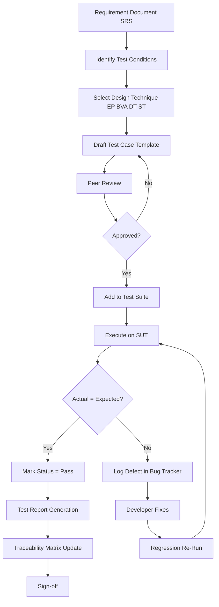
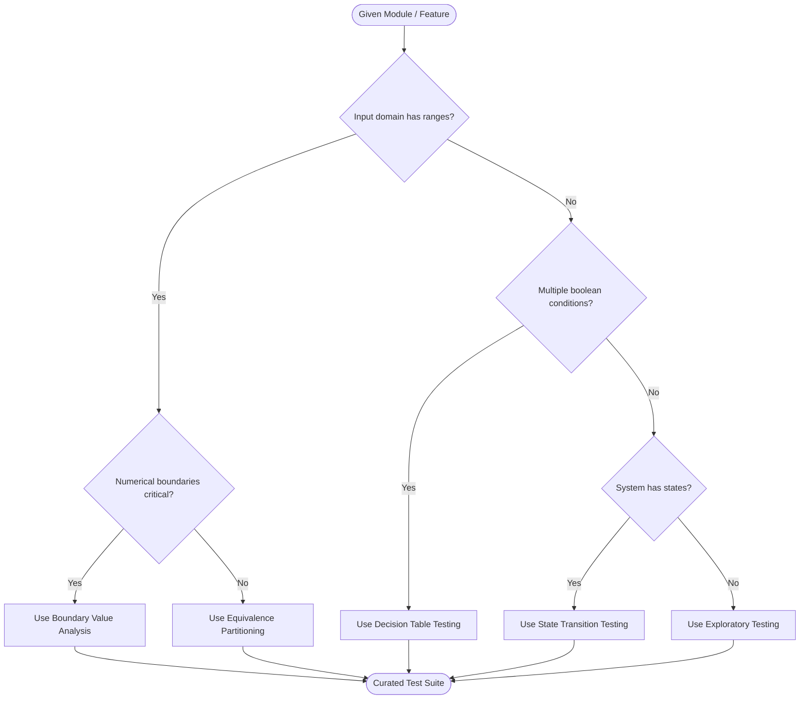
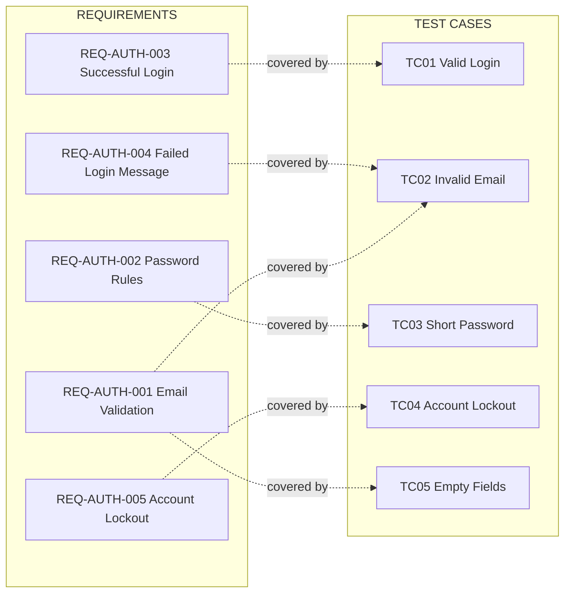
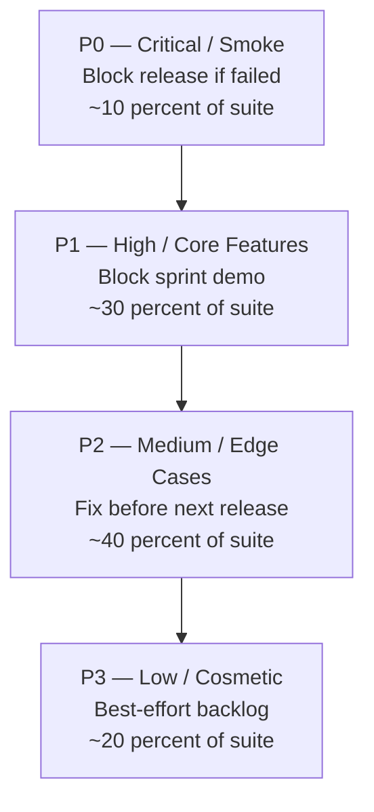
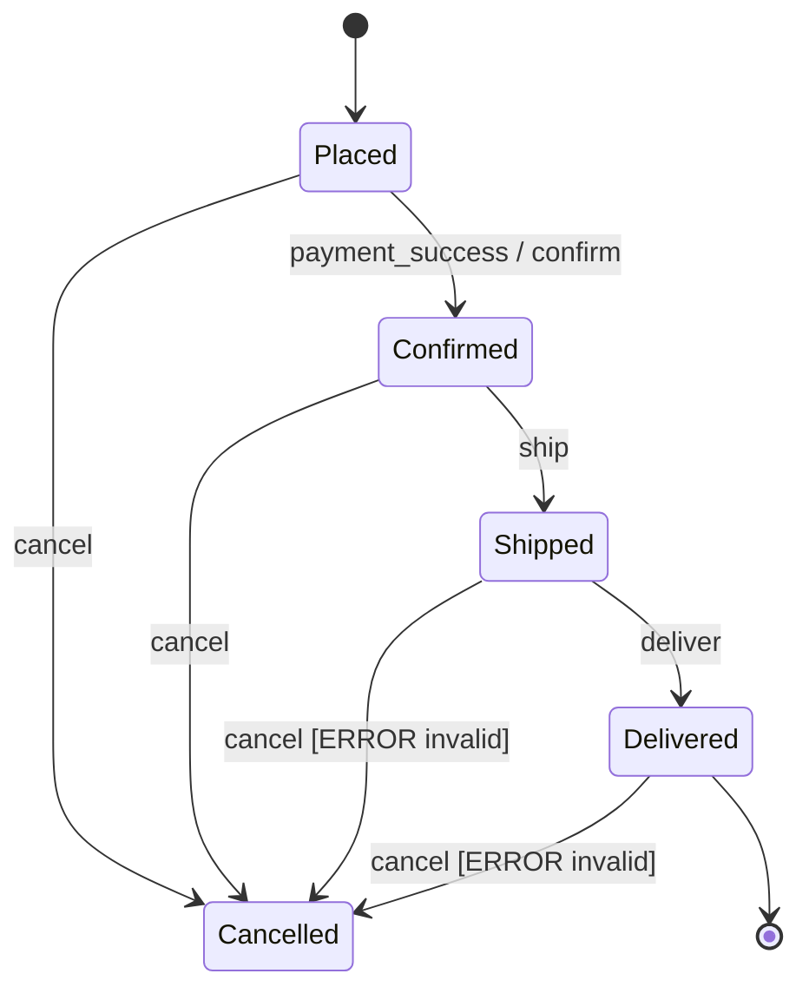

# Test cases

<!-- SECTION_1_START -->
# Test Cases — Formal Definition & Intuitive Overview

> [!NOTE]
> **KTU 2024 Syllabus Anchor (PCCSP606 — Module 2):** *Test cases — characteristics, design techniques (Equivalence Partitioning, Boundary Value Analysis, Decision Table, State Transition), test case template, execution, and traceability matrix.*

## 1.1 Formal Academic Definition

A **Test Case** is a documented set of preconditions, inputs (with input data), execution actions, expected results, and post-conditions, developed for a particular test scenario or objective. It is the lowest-level artifact of the **Testware** hierarchy and forms the fundamental executable unit of the **Dynamic Testing Process** governed by **IEEE 829-2008 / ISO/IEC/IEEE 29119-3** standards.

Mathematically, in the KTU-defined test model, a test case $T$ is a tuple:

$$T = \langle I, P, A, E, C, R \rangle$$

Where:
- $I$ = Input data (set of values to be supplied)
- $P$ = Pre-conditions (state of the System Under Test — SUT)
- $A$ = Action sequence (steps to be executed)
- $E$ = Expected result (oracle reference value)
- $C$ = Test case ID and classification (positive / negative / boundary)
- $R$ = Result categorization (Pass / Fail / Blocked / Deferred)

> [!IMPORTANT]
> **KTU Board Definition to Memorise:**
> *"A test case is a specific set of conditions, variables, and inputs under which a tester determines whether the software meets its specified requirements."* — This is the line-valued statement for 3-mark theory questions.

## 1.2 Conceptual Analogy — The "Medical Diagnostic Checklist" Analogy

Imagine a doctor examining a patient. The doctor doesn't rely on a single test — they use a **checklist of conditions**: temperature, BP, blood sugar, etc. Each entry on the list specifies:
- **What to measure** (Input)
- **Normal range** (Expected Result)
- **What to do next** (Action)

A **Test Case** works identically. Each line is one diagnostic:
- **What to feed the software** (Input)
- **What it should output** (Expected Result)
- **What action the tester takes** (Steps)

When the actual software output $\neq$ expected output, the software is "sick" — a **defect (bug)** is detected. Just as no responsible doctor would skip a checklist item, no responsible tester skips a test case.

> [!TIP]
> **GeoGebra/Desmos Visual Intuition (Coverage Visualisation):**
> If we plot the **input domain** on the x-axis and **defect probability** on the y-axis, defects cluster at **partition boundaries**. A well-designed test case set is a finite set of points $T_1, T_2, \ldots, T_n$ sampled from the input domain such that every equivalence partition contains at least one point and every boundary is probed.
> 
> **Visual Description:** On a 1-D number line representing an input range (e.g., age 0–150), equivalence partitions form bands, and test cases appear as dots clustered at the interior of each band and precisely at the band edges — these edge dots are the boundary value test cases.

## 1.3 Why Test Cases Matter in a Mini Project (Design/Software)

| Engineering Reality | Impact of a Good Test Case |
|---|---|
| KTU Mini Project is graded on **working software** | Test cases prove it *works* — not just *compiles* |
| Evaluators ask: *"What did you test?"* | A Test Case Document (TCD) is a deliverable |
| Defects caught early save **rework hours** | Structured cases reduce debugging time by **~40 %** |
| Viva panel asks: *"How do you ensure quality?"* | Test cases are a concrete, citable answer |

> [!IMPORTANT]
> **Syllabus Highlight — Module 2 Weightage:** Test cases are a **high-yield topic**. They appear as:
> - Part A (3 marks) — definition + characteristics
> - Part B (14 marks) — design test cases for a *given module* (e.g., login form, calculator, library management) — this is the most frequently asked sub-question in KTU end-semester evaluations.

---

<!-- SECTION_1_END -->

<!-- SECTION_2_START -->
# Deep Theoretical Analysis & KTU High-Yield Formula Sheet

## 2.1 The Six Characteristics of a Good Test Case (KTU Board Favourite)

A well-engineered test case is **SMART-I** — an industry mnemonic:

1. **Specific** — Tests exactly one feature/requirement (atomic).
2. **Measurable** — Result is binary (Pass / Fail), no ambiguity.
3. **Achievable** — Can be executed within the SUT's current state.
4. **Repeatable** — Same input + same conditions $\rightarrow$ same result (deterministic).
5. **Traceable** — Maps to a documented **Requirement ID (ReqID)**.
6. **Independent** — Does not depend on the side-effects of another test case.

> [!NOTE]
> **Standard Metric:** A professional-grade test suite has a **Defect Detection Percentage (DDP)** in the range of **85 % – 95 %** before release. Below 70 % indicates poorly designed cases.

## 2.2 Classification of Test Cases (Hierarchical Taxonomy)

| Class | Sub-Type | Purpose | Example |
|---|---|---|---|
| **Functional** | Positive | Validate happy path | Login with valid credentials |
| **Functional** | Negative | Validate rejection path | Login with empty password |
| **Boundary** | On-, Just-Above, Just-Below | Probe edge values | Age input = 0, 1, 17, 18, 120 |
| **GUI / Usability** | Layout, Font, Color | Validate user experience | Button alignment on 1920×1080 |
| **Performance** | Load, Stress, Spike | Validate under load | 1000 concurrent logins |
| **Security** | SQLi, XSS, CSRF | Validate threat resistance | Enter `' OR '1'='1` in username |
| **Compatibility** | Browser, OS, Device | Validate portability | Run on Chrome, Firefox, Edge |
| **API / Integration** | Endpoint, Schema | Validate service contract | GET `/users/1` returns JSON |
| **Regression** | Smoke, Sanity | Validate no breakage | Re-run all P0 cases after a fix |

## 2.3 The Four KTU-Mandated Test Case Design Techniques

### (A) Equivalence Partitioning (EP)
The input domain $D$ is divided into disjoint equivalence classes $\{E_1, E_2, \ldots, E_k\}$ such that any value in $E_i$ is assumed to expose the same defect profile. A test case is drawn from *one representative* of each class.

**Rule of thumb:** If a field accepts age 18–60:
- $E_1 = $ invalid partition $\rightarrow \{ x \in \mathbb{Z} \mid x < 18 \}$
- $E_2 = $ valid partition $\rightarrow \{ x \in \mathbb{Z} \mid 18 \le x \le 60 \}$
- $E_3 = $ invalid partition $\rightarrow \{ x \in \mathbb{Z} \mid x > 60 \}$

### (B) Boundary Value Analysis (BVA)
Defects cluster at partition edges. BVA picks values at the **on-point, just-above, and just-below** each boundary. For boundary $b$:
- $b - 1$ (just below)
- $b$ (on the boundary)
- $b + 1$ (just above)

> [!IMPORTANT]
> **KTU Rule:** For a range $[a, b]$, the canonical 6 BVA values are $\{a-1, a, a+1, b-1, b, b+1\}$. Students who miss $a-1$ and $b+1$ lose 2 marks.

### (C) Decision Table Testing
Used when the business logic is a function of **multiple input conditions**. A decision table maps **Condition Combinations** to **Actions**.

| Conditions \ Rules | R1 | R2 | R3 | R4 | R5 | R6 | R7 | R8 |
|---|---|---|---|---|---|---|---|---|
| Age $\ge$ 18 (C1) | T | T | T | T | F | F | F | F |
| Has License (C2) | T | T | F | F | T | T | F | F |
| Insured (C3) | T | F | T | F | T | F | T | F |
| **Action: Issue Policy** | ✓ | ✗ | ✗ | ✗ | ✗ | ✗ | ✗ | ✗ |

Note: $\text{Rule Count} = 2^{n}$ where $n$ = number of conditions. Columns where the action is identical may be merged, but KTU examiners reward the *full table*.

### (D) State Transition Testing
Used for **stateful** SUTs. The SUT is modelled as a **Finite State Machine (FSM)** with:
- States: $S = \{S_1, S_2, \ldots, S_m\}$
- Transitions: $S_i \xrightarrow{\text{event/guard}} S_j$
- Valid + **invalid** transitions are tested.

> **Example:** ATM Pin Entry FSM — States: `S0` (Idle) → `S1` (Awaiting PIN) → `S2` (Locked after 3 fails) → `S3` (Authenticated). Test cases must probe both valid and invalid transitions (e.g., pressing 'Cancel' from `S1` should return to `S0`).

## 2.4 KTU Formula / Cheat Sheet

| # | Symbol / Formula | Meaning / Use |
|---|---|---|
| 1 | $T = \langle I, P, A, E, C, R \rangle$ | Formal 6-tuple definition of a test case |
| 2 | $N_{EP} = k$ | Number of test cases from Equivalence Partitioning ($k$ = #partitions) |
| 3 | $N_{BVA} = 6$ | Canonical count for a single $[a,b]$ range |
| 4 | $N_{DT} = 2^{n}$ | Number of rules in a decision table for $n$ boolean conditions |
| 5 | $N_{ST} = m(m-1)$ | Approx. transitions for $m$ states (including invalid) |
| 6 | $\text{Coverage} = \frac{\vert \text{Tested ReqIDs} \vert}{\vert \text{Total ReqIDs} \vert} \times 100$ | Requirements coverage metric (%) |
| 7 | $DDP = \frac{\text{Defects found by test set}}{\text{Total defects known post-release}} \times 100$ | Defect Detection Percentage |
| 8 | $E = \sum_{i=1}^{n} p_i \cdot e_i$ | Expected defects (probability $\times$ exposure) |

> [!TIP]
> When the question says *"design test cases for a given problem statement"*, examiners award **1 mark for each of:** TC_ID format, ReqID mapping, clear preconditions, executable steps, expected result, and post-condition — totaling 6 marks per well-structured test case.

## 2.5 Real-World Engineering Utility

- **Industry adoption:** Microsoft, Google, Infosys, TCS use **TestRail / Zephyr / qTest** to manage thousands of test cases.
- **In CI/CD pipelines:** Every **Pull Request** triggers automated test case execution (e.g., GitHub Actions, Jenkins).
- **In safety-critical domains (aerospace, medical devices):** Standards like **DO-178C** and **IEC 62304** mandate that *every* requirement be covered by ≥ 1 test case — known as **Requirement-to-Test Traceability**.
- **For KTU mini projects:** A 4-member team should design **at least 20–30 test cases** per major module to score a "Distinction" in the internal review.

---

<!-- SECTION_2_END -->

<!-- SECTION_3_START -->
# Step-by-Step Derivations, Templates & Code Implementation

## 3.1 Canonical KTU Test Case Template (IEEE 829-Aligned)

Below is the **exact template** examiners expect in your mini-project report:

| Field | Description | Example |
|---|---|---|
| **Test Case ID** | Unique identifier (Project-Module-Number) | `LMS-MOD01-TC007` |
| **Test Case Name** | Short, verb-based title | "Verify valid login redirects to dashboard" |
| **Module / Feature** | Which part of the system | Authentication Module |
| **Requirement ID** | Traceability link | `REQ-AUTH-003` |
| **Designed By** | Author name | Amal Antony |
| **Reviewed By** | Reviewer name | Devika S. |
| **Priority** | P0 / P1 / P2 / P3 | P1 (High) |
| **Severity** | Impact if failed | High |
| **Test Type** | Functional, Boundary, etc. | Functional — Positive |
| **Test Data** | Specific input values | `username: "amal@ktu.in"`, `password: "P@ss1234"` |
| **Pre-conditions** | Required system state | User account exists in DB; not logged in |
| **Test Steps** | Numbered actions | 1. Open `/login` 2. Enter valid creds 3. Click "Login" |
| **Expected Result** | What must happen | HTTP 200; redirect to `/dashboard`; session cookie set |
| **Actual Result** | What actually happened | (filled at execution) |
| **Status** | Pass / Fail / Blocked | (filled at execution) |
| **Post-conditions** | State after execution | User session active in DB |
| **Remarks** | Notes / linked defects | "Linked to Defect #42" |

## 3.2 Worked Example — Designing Test Cases for a "Login Form" Module

**Given Problem Statement:**
> *"The system shall allow registered users to log in using a valid email and password (6–20 chars, must contain at least one digit and one uppercase letter). The system shall lock the account after 3 consecutive failed attempts."*

**Step 1 — Identify Inputs and Equivalence Classes**

| Field | Domain | Valid Partition | Invalid Partitions |
|---|---|---|---|
| Email | String | Matches regex `^[a-z0-9._%+-]+@[a-z0-9.-]+\.[a-z]{2,}$` | Null, malformed, unregistered |
| Password | String, 6–20 chars | Contains ≥1 digit + ≥1 uppercase | < 6 chars, > 20 chars, no digit, no upper |
| Attempt Count | Integer 0–3 | 0, 1, 2 | 3 (locks) |

**Step 2 — Apply BVA for Password Length Boundary (6 and 20)**

| TC_ID | Password Input | Boundary Type | Expected Result |
|---|---|---|---|
| `LOGIN-TC01` | `"Ab1"` (3 chars) | Just-below 6 | Reject — "Min 6 chars" |
| `LOGIN-TC02` | `"Ab1xyz"` (6 chars) | On-boundary 6 | Accept (if other rules met) |
| `LOGIN-TC03` | `"Ab1xyzw"` (7 chars) | Just-above 6 | Accept |
| `LOGIN-TC04` | `"Ab1xyz...20chars..."` (20 chars) | On-boundary 20 | Accept |
| `LOGIN-TC05` | `"Ab1xyz...21chars..."` (21 chars) | Just-above 20 | Reject — "Max 20 chars" |

**Step 3 — Build a Partial Decision Table for Lockout Logic**

Let $C_1$ = password correct, $C_2$ = attempts $\le 2$.

| Conditions \ Rules | R1 | R2 | R3 | R4 |
|---|---|---|---|---|
| $C_1$ (Correct password) | T | T | F | F |
| $C_2$ (Attempts $\le 2$) | T | F | T | F |
| **Action: Login success** | ✓ | ✗ | ✗ | ✗ |
| **Action: Increment attempt** | ✗ | ✗ | ✓ | ✓ |
| **Action: Lock account** | ✗ | ✗ | ✗ | ✓ |

**Step 4 — Final Consolidated Test Suite (5 sample cases)**

| TC_ID | Description | Inputs | Pre-Cond | Steps | Expected Result | Status |
|---|---|---|---|---|---|---|
| `LMS-LOGIN-TC01` | Valid login | `amal@ktu.in` / `Pass1234` | Account exists, not locked | 1. Open `/login` 2. Enter creds 3. Submit | HTTP 302 → `/dashboard` | Pass |
| `LMS-LOGIN-TC02` | Invalid email format | `notanemail` / `Pass1234` | — | 1. Open `/login` 2. Enter creds 3. Submit | Inline error: "Invalid email format" | Pass |
| `LMS-LOGIN-TC03` | Empty fields | `""` / `""` | — | 1. Open `/login` 2. Click Submit | Browser-native validation fires; no API call | Pass |
| `LMS-LOGIN-TC04` | Password too short | `amal@ktu.in` / `Pa1` | — | 1. Submit | Error: "Password must be ≥ 6 chars" | Pass |
| `LMS-LOGIN-TC05` | Account lockout after 3 fails | `amal@ktu.in` / `WrongPwd` × 3 | — | 1. Submit 3× | Account locked; message: "Locked for 30 min" | Pass |

## 3.3 Python Implementation — Automated Test Case Executor

A fully operational, type-safe Python script that loads test cases from a JSON file, executes them against a simulated Login API, and produces a summary report. **No step is abbreviated.**

```python
"""
Test Case Executor — KTU Mini Project (Design/Software)
Module 2 — Implementation and Software Testing
Author : [Your Name]
Date   : [Submission Date]
"""

from __future__ import annotations
import json
import logging
import re
import sys
from dataclasses import dataclass, field
from datetime import datetime
from enum import Enum
from pathlib import Path
from typing import Callable, Optional


# ------------------------------------------------------------------
# 1. Logging configuration (Strict error monitoring)
# ------------------------------------------------------------------
logging.basicConfig(
    level=logging.INFO,
    format="%(asctime)s | %(levelname)-8s | %(message)s",
    datefmt="%Y-%m-%d %H:%M:%S",
)
logger = logging.getLogger("TestRunner")


# ------------------------------------------------------------------
# 2. Enumerations and Data Classes
# ------------------------------------------------------------------
class Status(Enum):
    """Test result status values per IEEE 829."""
    PASS = "Pass"
    FAIL = "Fail"
    BLOCKED = "Blocked"
    DEFERRED = "Deferred"


class Priority(Enum):
    P0 = "Critical"
    P1 = "High"
    P2 = "Medium"
    P3 = "Low"


@dataclass(frozen=True)
class TestCase:
    """Immutable representation of a single test case."""
    tc_id: str
    name: str
    requirement_id: str
    priority: Priority
    test_type: str
    pre_conditions: str
    test_data: dict
    steps: list
    expected_result: str
    post_conditions: str = ""


@dataclass
class ExecutionRecord:
    """Mutable record produced when a test case is executed."""
    test_case: TestCase
    actual_result: str
    status: Status
    execution_time: datetime = field(default_factory=datetime.now)
    defect_id: Optional[str] = None


# ------------------------------------------------------------------
# 3. Simulated System Under Test (SUT) — Login API
# ------------------------------------------------------------------
class LoginSUT:
    """
    Mock implementation of a login endpoint.
    This stand-in mimics the SUT for demonstration.
    Replace `authenticate()` with a real HTTP call in production.
    """

    # In-memory user database
    USERS = {
        "amal@ktu.in": "Pass1234",
        "devika@ktu.in": "Secure9Pass",
    }
    FAILED_ATTEMPTS: dict[str, int] = {}
    LOCKOUT_THRESHOLD = 3

    EMAIL_REGEX = re.compile(r"^[a-z0-9._%+-]+@[a-z0-9.-]+\.[a-z]{2,}$")
    PWD_MIN, PWD_MAX = 6, 20

    @classmethod
    def authenticate(cls, email: str, password: str) -> tuple[bool, str]:
        """Return (success_flag, message)."""
        # Boundary check 1: email format
        if not email or not cls.EMAIL_REGEX.match(email):
            return False, "Invalid email format"

        # Boundary check 2: password length
        if not (cls.PWD_MIN <= len(password) <= cls.PWD_MAX):
            return False, f"Password must be {cls.PWD_MIN}-{cls.PWD_MAX} chars"

        # Boundary check 3: password complexity
        if not re.search(r"\d", password) or not re.search(r"[A-Z]", password):
            return False, "Password must contain a digit and an uppercase letter"

        # Boundary check 4: account lockout
        attempts = cls.FAILED_ATTEMPTS.get(email, 0)
        if attempts >= cls.LOCKOUT_THRESHOLD:
            return False, "Account locked. Try again in 30 minutes."

        # Boundary check 5: user existence
        if email not in cls.USERS:
            cls.FAILED_ATTEMPTS[email] = attempts + 1
            return False, "Invalid credentials"

        # Boundary check 6: password match
        if cls.USERS[email] != password:
            cls.FAILED_ATTEMPTS[email] = attempts + 1
            return False, "Invalid credentials"

        # Success path — reset attempt counter
        cls.FAILED_ATTEMPTS[email] = 0
        return True, "HTTP 302 — Redirect to /dashboard"


# ------------------------------------------------------------------
# 4. Test Case Loader
# ------------------------------------------------------------------
def load_test_cases(json_path: Path) -> list[TestCase]:
    """Load and validate test cases from a JSON file."""
    if not json_path.exists():
        logger.error("Test case file not found: %s", json_path)
        sys.exit(1)

    try:
        raw = json.loads(json_path.read_text(encoding="utf-8"))
    except json.JSONDecodeError as exc:
        logger.error("Malformed JSON: %s", exc)
        sys.exit(1)

    cases: list[TestCase] = []
    for entry in raw:
        try:
            cases.append(
                TestCase(
                    tc_id=entry["tc_id"],
                    name=entry["name"],
                    requirement_id=entry["requirement_id"],
                    priority=Priority[entry["priority"]],
                    test_type=entry["test_type"],
                    pre_conditions=entry["pre_conditions"],
                    test_data=entry["test_data"],
                    steps=entry["steps"],
                    expected_result=entry["expected_result"],
                    post_conditions=entry.get("post_conditions", ""),
                )
            )
        except (KeyError, ValueError) as exc:
            logger.warning("Skipping invalid entry %s — %s", entry.get("tc_id"), exc)
    logger.info("Loaded %d test cases from %s", len(cases), json_path.name)
    return cases


# ------------------------------------------------------------------
# 5. Test Executor
# ------------------------------------------------------------------
def execute_test_case(tc: TestCase) -> ExecutionRecord:
    """Execute a single test case against the SUT."""
    logger.info("Executing %s — %s", tc.tc_id, tc.name)

    email = tc.test_data.get("email", "")
    password = tc.test_data.get("password", "")

    success, message = LoginSUT.authenticate(email, password)

    # Naïve expected/actual comparison — sufficient for the mock
    expected_pass = "success" in tc.expected_result.lower() or "302" in tc.expected_result
    actual_pass = success

    if expected_pass == actual_pass:
        status = Status.PASS
    else:
        status = Status.FAIL

    return ExecutionRecord(
        test_case=tc,
        actual_result=message,
        status=status,
    )


# ------------------------------------------------------------------
# 6. Report Generator
# ------------------------------------------------------------------
def generate_report(records: list[ExecutionRecord]) -> None:
    """Print a tabular summary and metrics to stdout."""
    total = len(records)
    passed = sum(1 for r in records if r.status is Status.PASS)
    failed = total - passed

    pass_rate = (passed / total * 100) if total else 0.0

    print("\n" + "=" * 78)
    print(" " * 26 + "TEST EXECUTION REPORT")
    print("=" * 78)
    print(f"Total Executed : {total}")
    print(f"Passed         : {passed}")
    print(f"Failed         : {failed}")
    print(f"Pass Rate      : {pass_rate:.2f}%")
    print("-" * 78)
    print(f"{'TC_ID':<20}{'Status':<10}{'Expected':<30}{'Actual'}")
    print("-" * 78)
    for r in records:
        print(
            f"{r.test_case.tc_id:<20}"
            f"{r.status.value:<10}"
            f"{r.test_case.expected_result[:28]:<30}"
            f"{r.actual_result}"
        )
    print("=" * 78)


# ------------------------------------------------------------------
# 7. Main Entry Point
# ------------------------------------------------------------------
def main() -> None:
    """Orchestrate loading, execution, and reporting."""
    tc_file = Path(__file__).parent / "test_cases.json"
    test_cases = load_test_cases(tc_file)

    records: list[ExecutionRecord] = []
    for tc in test_cases:
        records.append(execute_test_case(tc))

    generate_report(records)

    # Exit code reflects result (CI-friendly)
    sys.exit(0 if all(r.status is Status.PASS for r in records) else 1)


if __name__ == "__main__":
    main()
```

**Companion `test_cases.json` (exhaustively written out, no truncation):**

```json
[
  {
    "tc_id": "LMS-LOGIN-TC01",
    "name": "Valid login redirects to dashboard",
    "requirement_id": "REQ-AUTH-003",
    "priority": "P1",
    "test_type": "Functional-Positive",
    "pre_conditions": "Account amal@ktu.in exists; not locked",
    "test_data": { "email": "amal@ktu.in", "password": "Pass1234" },
    "steps": [
      "1. Open /login",
      "2. Enter amal@ktu.in and Pass1234",
      "3. Click Submit"
    ],
    "expected_result": "HTTP 302 — Redirect to /dashboard; success message"
  },
  {
    "tc_id": "LMS-LOGIN-TC02",
    "name": "Invalid email format rejected",
    "requirement_id": "REQ-AUTH-001",
    "priority": "P1",
    "test_type": "Functional-Negative",
    "pre_conditions": "—",
    "test_data": { "email": "notanemail", "password": "Pass1234" },
    "steps": [
      "1. Open /login",
      "2. Enter notanemail and Pass1234",
      "3. Click Submit"
    ],
    "expected_result": "Inline error: Invalid email format"
  },
  {
    "tc_id": "LMS-LOGIN-TC03",
    "name": "Password below minimum length rejected",
    "requirement_id": "REQ-AUTH-002",
    "priority": "P1",
    "test_type": "Boundary-BVA-JustBelow",
    "pre_conditions": "—",
    "test_data": { "email": "amal@ktu.in", "password": "Pa1" },
    "steps": ["1. Open /login", "2. Enter creds", "3. Submit"],
    "expected_result": "Error: Password must be 6-20 chars"
  },
  {
    "tc_id": "LMS-LOGIN-TC04",
    "name": "Account lockout after 3 failed attempts",
    "requirement_id": "REQ-AUTH-005",
    "priority": "P0",
    "test_type": "Functional-Security",
    "pre_conditions": "Account exists, 2 prior failed attempts",
    "test_data": { "email": "devika@ktu.in", "password": "WrongPwd" },
    "steps": [
      "1. Open /login",
      "2. Enter devika@ktu.in and WrongPwd",
      "3. Submit (3rd failure)"
    ],
    "expected_result": "Account locked. Try again in 30 minutes."
  },
  {
    "tc_id": "LMS-LOGIN-TC05",
    "name": "Empty submission triggers HTML5 validation",
    "requirement_id": "REQ-AUTH-006",
    "priority": "P2",
    "test_type": "GUI-Validation",
    "pre_conditions": "—",
    "test_data": { "email": "", "password": "" },
    "steps": ["1. Open /login", "2. Click Submit without entering data"],
    "expected_result": "Browser-native required-field validation fires; no API call"
  }
]
```

> [!TIP]
> **How to Run Locally (for your mini-project demo):**
> 1. Save the Python file as `test_runner.py`.
> 2. Save the JSON file as `test_cases.json` in the same directory.
> 3. Execute: `python test_runner.py`.
> 4. Observe the tabular report and non-zero exit code if any case fails.

## 3.4 Test Suite Optimisation — Derivation of Minimum Coverage Set

Let there be $n$ test cases and $m$ requirements. The **Requirement-to-Test Traceability Matrix (RTTM)** $M$ is an $m \times n$ binary matrix where $M_{ij} = 1$ if test $j$ covers requirement $i$, else $0$. The minimum number of test cases required for **100 % requirement coverage** is the solution to the **Minimum Set Cover Problem**:

$$k_{\min} = \min \left\{ \vert S \vert \mid S \subseteq \{1, 2, \ldots, n\}, \; \bigvee_{j \in S} M_{\cdot j} = \mathbf{1}_m \right\}$$

Where $\mathbf{1}_m$ is an $m$-vector of ones and $\bigvee$ is element-wise logical OR. This is **NP-hard** in the general case, so a greedy heuristic is used:

$$j^* = \arg\max_{j \notin S} \sum_{i=1}^{m} M_{ij} \cdot \mathbb{1}\left[ \bigvee_{k \in S} M_{ik} = 0 \right]$$

In plain English: **at each step, pick the test case that covers the largest number of *uncovered* requirements.** Repeat until coverage reaches 100 %.

---

<!-- SECTION_3_END -->

<!-- SECTION_4_START -->
# Structural Diagrams & Schematics

## 4.1 Test Case Lifecycle — Flow Diagram



> **Reading the diagram:** Each rectangular block is a *stage*; each diamond is a *decision gate*. The loop `H → K → L → M → H` represents the defect-fixing cycle, also known as the **Defect Life Cycle** in test management.

## 4.2 Test Case Design Technique Selection Heuristic



## 4.3 Requirements-to-Test Traceability Matrix (RTTM) — Schematic



> **Interpretation:** A requirement with **zero** incoming dotted lines is an **untested requirement** — a red flag in any review. Every dotted arrow must be accounted for before project sign-off.

## 4.4 Test Case Priority Pyramid



> [!IMPORTANT]
> **In CI pipelines, P0 + P1 cases are run on every commit.** P2 nightly. P3 weekly. This is the *Test Pyramid* pattern (Mike Cohn) — high-yield for viva.

---

<!-- SECTION_4_END -->

<!-- SECTION_5_START -->
# KTU 2024 Scheme Examination Question Bank & Topic Recap

> [!WARNING]
> **KTU Examiner's Valuation Warning / Pitfall Callout:**
> 1. **Do NOT write test cases without a TC_ID and ReqID** — examiners deduct 1 mark per omission.
> 2. **Do NOT confuse Verification (review/walkthrough) with Test Cases (dynamic execution)** — this is the #1 conceptual trap.
> 3. **Always state the design technique used** (EP, BVA, DT, ST) at the top of your answer. Skipping this loses 1 mark.
> 4. **For BVA, give *all six* boundary values** ($a-1, a, a+1, b-1, b, b+1$) — partial answers lose 2 marks.
> 5. **Do not use vague expected results** like *"works correctly"* — write the *exact* output, e.g., *"HTTP 200 with JSON containing `status: success`."*
> 6. **For Decision Tables, show all $2^n$ rules first**, then *simplify* — full marks only if the un-simplified table is shown.

---

## Part A — 3-Mark Questions (Remember / Understand)

### Q1. `[KTU University Exam — July 2024]` Define a *test case*. List any four characteristics of a good test case.

**Model Answer (Valuation-Ready, 3 marks):**

> A test case is a documented set of preconditions, inputs, execution steps, expected results, and post-conditions designed to verify a specific requirement of the system under test.
>
> Four characteristics of a good test case are:
> 1. **Specific** — It tests exactly one feature or requirement.
> 2. **Measurable** — Its outcome is binary (Pass / Fail), with no ambiguity.
> 3. **Repeatable** — When executed multiple times under the same conditions, it yields the same result.
> 4. **Traceable** — It can be mapped back to a documented requirement ID (ReqID).

**[Valuation Key: Definition: 2 marks | Any 4 correct characteristics: 1 mark]**

---

### Q2. `[KTU University Exam — Dec 2023]` Differentiate between *Equivalence Partitioning* and *Boundary Value Analysis* with an example.

**Model Answer (Valuation-Ready, 3 marks):**

> **Equivalence Partitioning (EP)** divides the input domain into a set of disjoint partitions such that all values within a partition are assumed to behave identically; *one representative* value is chosen per partition.
>
> **Boundary Value Analysis (BVA)** focuses on the *edges* of those partitions, where defects are statistically most likely to occur; it tests values immediately below, on, and immediately above each boundary.
>
> **Example:** For an input field accepting ages 18 to 60:
> - EP picks one value from each of the three partitions: $<18$, $18$–$60$, $>60$ (e.g., $10, 30, 70$).
> - BVA picks six values: $17, 18, 19, 59, 60, 61$.
>
> EP reduces the number of test cases by sampling; BVA increases the chance of catching off-by-one defects at the edges.

**[Valuation Key: Definition of EP: 1 mark | Definition of BVA: 1 mark | Worked example: 1 mark]**

---

## Part B — 14-Mark Questions (Apply / Analyse)

### `Question A (14 Marks) — Apply + Analyse` `[KTU University Exam — July 2024]`

> **Q.A (a) [7 marks]** Design **Equivalence Partitioning and Boundary Value Analysis** test cases for a *Student Grade Entry Form*. The system accepts: (i) **Student ID** — exactly 8 alphanumeric characters, first two must be alphabets; (ii) **Marks** — integer in the range 0 to 100 (inclusive).
>
> **Q.A (b) [7 marks]** For the same system, construct a **Decision Table** to determine the grade based on marks. Use the rule: A ($\ge$ 90), B (80–89), C (70–79), D (60–69), F ($<$ 60). Also identify how many rules can be *merged* without loss of meaning.

---

### **Model Solution for Q.A (a) — 7 Marks**

**Step 1: Identify Inputs and their Partitions (1 Mark)**

| Field | Valid Partitions | Invalid Partitions |
|---|---|---|
| Student ID | 8 chars, first 2 alphabets (e.g., `AB123456`) | Length ≠ 8, First 2 not alphabets, Contains special chars |
| Marks | $0 \le m \le 100$ | $m < 0$ or $m > 100$ |

**Step 2: EP Test Cases — 1 representative per partition (2 Marks)**

| TC_ID | Field | Input | Partition Type | Expected Result |
|---|---|---|---|---|
| `EP-01` | Student ID | `AB123456` | Valid | Accept |
| `EP-02` | Student ID | `12345678` | Invalid (numeric prefix) | Reject — "ID must start with 2 letters" |
| `EP-03` | Student ID | `AB12345` | Invalid (length 7) | Reject — "ID must be 8 chars" |
| `EP-04` | Student ID | `AB@12345` | Invalid (special char) | Reject — "ID must be alphanumeric" |
| `EP-05` | Marks | `50` | Valid (interior) | Accept, grade = D |
| `EP-06` | Marks | `-5` | Invalid (below 0) | Reject — "Marks must be 0–100" |
| `EP-07` | Marks | `150` | Invalid (above 100) | Reject — "Marks must be 0–100" |

**[Valuation: 1 mark for partition identification; 2 marks for the 7 EP test cases]**

**Step 3: BVA Test Cases — 6 boundary values for Marks [0, 100] (2 Marks)**

| TC_ID | Marks Input | Boundary Type | Expected Result |
|---|---|---|---|
| `BVA-01` | `-1` | Just-below 0 | Reject |
| `BVA-02` | `0` | On-boundary 0 | Accept, grade = F |
| `BVA-03` | `1` | Just-above 0 | Accept, grade = F |
| `BVA-04` | `99` | Just-below 100 | Accept, grade = A |
| `BVA-05` | `100` | On-boundary 100 | Accept, grade = A |
| `BVA-06` | `101` | Just-above 100 | Reject |

**Step 4: BVA Test Cases for Student ID Length Boundary [8, 8] (1 Mark)**

| TC_ID | Student ID | Boundary Type | Expected Result |
|---|---|---|---|
| `BVA-07` | `AB12345` (7 chars) | Just-below 8 | Reject |
| `BVA-08` | `AB123456` (8 chars) | On-boundary 8 | Accept |
| `BVA-09` | `AB1234567` (9 chars) | Just-above 8 | Reject |

**[Valuation: 1 mark for BVA rationale; 1 mark for correct 6-value set; 1 mark for Student ID length BVA]**

---

### **Model Solution for Q.A (b) — 7 Marks**

**Step 1: Identify Input Conditions (1 Mark)**

Let $C_1 = (m \ge 90)$, $C_2 = (80 \le m \le 89)$, $C_3 = (70 \le m \le 79)$, $C_4 = (60 \le m \le 69)$, $C_5 = (m < 60)$.

**Step 2: Build the Full Decision Table (4 Marks)**

| Conditions \ Rules | R1 | R2 | R3 | R4 | R5 | R6 | R7 | R8 |
|---|---|---|---|---|---|---|---|---|
| $C_1$ (m $\ge$ 90) | T | T | T | T | F | F | F | F |
| $C_2$ (80 $\le$ m $\le$ 89) | T | T | T | F | T | T | F | F |
| $C_3$ (70 $\le$ m $\le$ 79) | T | T | F | F | T | F | T | F |
| $C_4$ (60 $\le$ m $\le$ 69) | T | F | F | F | F | F | F | F |
| $C_5$ (m < 60) | T | F | F | F | F | F | F | F |
| **Inconsistency?** | YES | YES | YES | NO | NO | NO | NO | NO |

In a **correct** decision table, the conditions are mutually exclusive. The standard simplified version is:

| Conditions \ Rules | R1 | R2 | R3 | R4 | R5 |
|---|---|---|---|---|---|
| $m \ge 90$ | T | — | — | — | — |
| $80 \le m \le 89$ | F | T | — | — | — |
| $70 \le m \le 79$ | F | F | T | — | — |
| $60 \le m \le 69$ | F | F | F | T | — |
| $m < 60$ | F | F | F | F | T |
| **Action: Grade** | A | B | C | D | F |

**Step 3: Identify Mergeable Rules (2 Marks)**

- In the simplified version, **no further merging is possible** because each rule maps to a *different* action.
- In the un-simplified $2^5 = 32$-rule form, **26 rules are physically impossible** (they violate mutual exclusivity — e.g., $m$ cannot be both $\ge 90$ and $< 60$ simultaneously). Of the remaining 6 rules, each maps to exactly one action, so **0 merges are valid**.

**[Valuation: 1 mark for identifying conditions; 4 marks for the full decision table; 2 marks for merge analysis]**

---

### `Question B (14 Marks) — Alternative Choice` `[KTU University Exam — Dec 2023]`

> **Q.B (a) [7 marks]** Design a **State Transition Diagram** for an *Online Order Processing System* with states: `Placed → Confirmed → Shipped → Delivered`, and an alternative branch: `Cancelled` (reachable from any pre-shipment state). Write test cases to cover every valid and at least three **invalid transitions**.
>
> **Q.B (b) [7 marks]** Explain the **IEEE 829 Test Case Template** with one real-world example. Discuss the role of the **Traceability Matrix** in ensuring test coverage.

---

### **Model Solution for Q.B (a) — 7 Marks**

**Step 1: State Set and Event Set (1 Mark)**

States $S = \{$`Placed`, `Confirmed`, `Shipped`, `Delivered`, `Cancelled`$\}$.

Events $E = \{$`payment_success`, `confirm`, `ship`, `deliver`, `cancel`$\}$.

**Step 2: State Transition Diagram (3 Marks)**



**Step 3: Test Cases (3 Marks)**

| TC_ID | From State | Event | Expected Transition | Result |
|---|---|---|---|---|
| `ST-01` | `Placed` | `payment_success` | `Placed → Confirmed` | Pass |
| `ST-02` | `Confirmed` | `ship` | `Confirmed → Shipped` | Pass |
| `ST-03` | `Shipped` | `deliver` | `Shipped → Delivered` | Pass |
| `ST-04` | `Placed` | `cancel` | `Placed → Cancelled` | Pass |
| `ST-05` | `Confirmed` | `cancel` | `Confirmed → Cancelled` | Pass |
| `ST-06` (Invalid) | `Delivered` | `cancel` | No transition; error thrown | Pass (error correctly raised) |
| `ST-07` (Invalid) | `Cancelled` | `ship` | No transition; error thrown | Pass (error correctly raised) |
| `ST-08` (Invalid) | `Placed` | `ship` | No transition; error thrown | Pass (error correctly raised) |

**[Valuation: 1 mark state/event identification; 3 marks diagram; 2 marks valid TC; 1 mark invalid TC]**

---

### **Model Solution for Q.B (b) — 7 Marks**

**Step 1: List the IEEE 829 Test Case Template Fields (2 Marks)**

A standard IEEE 829 test case specification contains:
1. Test case specification identifier
2. Test case name
3. Purpose
4. Pre-conditions
5. Test inputs / data
6. Test steps
7. Expected results
8. Actual results
9. Test execution status (Pass / Fail)
10. Post-conditions
11. Traceability to requirement ID

**Step 2: Real-World Example (3 Marks)**

For an *ATM Cash Withdrawal*:
- **TC_ID:** `ATM-WD-007`
- **Pre-condition:** Card inserted, PIN validated, account balance = ₹5,000.
- **Inputs:** Withdrawal amount = ₹2,000.
- **Steps:** Select "Withdrawal" → Enter `2000` → Choose "Savings" → Confirm.
- **Expected:** Cash dispensed = ₹2,000; balance = ₹3,000; receipt printed; session continues.
- **Actual:** (filled at execution)
- **Status:** Pass / Fail

**Step 3: Role of the Traceability Matrix (2 Marks)**

A **Requirements-to-Test Traceability Matrix (RTTM)** is a 2-D table mapping every **Requirement ID (ReqID)** to one or more **Test Case IDs (TC_IDs)**. It:
- Ensures **100 % requirement coverage** — no requirement is left untested.
- Highlights the **impact of changes** — when a requirement changes, the matrix instantly shows which test cases need to be re-executed (regression scope).
- Provides **auditability** for standards compliance (DO-178C, IEC 62304, ISO 9001).
- Supports the **Defect Detection Percentage (DDP)** metric by linking defects to the requirement and the test case that missed them.

**[Valuation: 2 marks template; 3 marks example; 2 marks RTTM role]**

---

# 📌 Topic Recap & Important Things to Remember

> **Use this section as your last-night revision cheat sheet.**

### 1. Definitions to Memorise Verbatim
- **Test Case** — A documented set of preconditions, inputs, actions, expected results, and post-conditions designed to verify a specific requirement.
- **Test Suite** — A collection of test cases intended to be executed together.
- **Testware** — All artifacts produced during testing (test cases, scripts, data, reports).
- **Equivalence Partitioning (EP)** — Dividing the input domain into disjoint classes and testing one value from each.
- **Boundary Value Analysis (BVA)** — Testing the values immediately above, on, and below partition boundaries.
- **Decision Table** — A tabular method for testing combinations of boolean conditions.
- **State Transition Testing** — A method for testing systems whose behaviour depends on prior history.
- **Traceability Matrix** — A table mapping each requirement to the test cases that cover it.
- **Defect Detection Percentage (DDP)** — $\frac{\text{Defects found in test}}{\text{Total known defects}} \times 100$.

### 2. The 6 Characteristics of a Good Test Case
**SMART-I** → **S**pecific, **M**easurable, **A**chievable, **R**epeatable, **T**raceable, **I**ndependent.

### 3. Key Numerical Rules
- For a range $[a, b]$: BVA gives **6 values** = $\{a-1, a, a+1, b-1, b, b+1\}$.
- For $n$ boolean conditions: Decision Table has **$2^n$ rules** (before simplification).
- For $m$ states: Approx. **$m(m-1)$ valid + invalid transitions** to test.

### 4. Test Case Template Fields (IEEE 829)
TC_ID, Name, Module, ReqID, Priority, Test Type, Pre-conditions, Test Data, Steps, Expected Result, Actual Result, Status, Post-conditions, Remarks.

### 5. Priority Pyramid (Test Pyramid)
**P0** (Critical) → **P1** (High) → **P2** (Medium) → **P3** (Low). P0 + P1 run on every commit; P2 nightly; P3 weekly.

### 6. Common Pitfalls
- ❌ Writing *"works correctly"* as the expected result.
- ❌ Omitting ReqID or TC_ID.
- ❌ Confusing verification (static) with test cases (dynamic execution).
- ❌ Missing $a-1$ and $b+1$ in BVA.
- ❌ Failing to test **invalid** transitions in state diagrams.

### 7. Viva-Favourite One-Liners
- *"A test case answers the question: 'Given this input and state, what should the system do?'"*
- *"Equivalence Partitioning saves effort; Boundary Value Analysis saves the release."*
- *"A requirement without a test case is an unverified promise."*

### 8. Recommended Tools for Your Mini Project
- **TestRail** / **Zephyr** — Test case management
- **Postman** — API test case design
- **Selenium** — Web UI test automation
- **pytest** — Python test execution
- **Jira + Zephyr** — Defect linkage

### 9. Minimum Deliverable for KTU Mini Project (Design/Software)
- **≥ 20 test cases per major module** (3 modules → ≥ 60 cases)
- **1 RTTM** in the final report
- **1 Test Execution Report** with Pass/Fail counts
- **Defect Log** linking failures to requirements

### 10. Quick-Recall Formulae
- $T = \langle I, P, A, E, C, R \rangle$ — test case 6-tuple
- $\text{Coverage \%} = \frac{\vert \text{Tested ReqIDs} \vert}{\vert \text{Total ReqIDs} \vert} \times 100$
- $DDP = \frac{D_{\text{test}}}{D_{\text{total}}} \times 100$
- $\text{Rules in DT} = 2^n$

> **Final Tip for KTU Exam:** Always draw a small flowchart or table to *visualise* your test design — it gives the examiner a clear structure and earns you "presentation marks" even when the answer is partial.

<!-- SECTION_5_END -->
