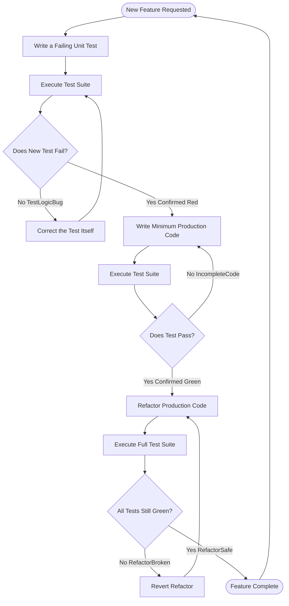
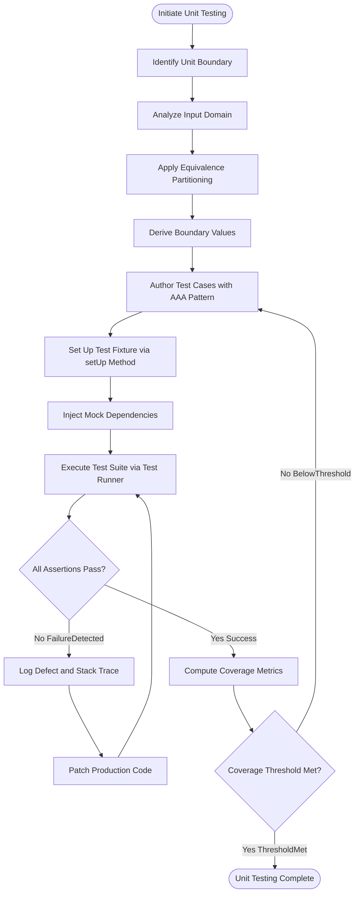
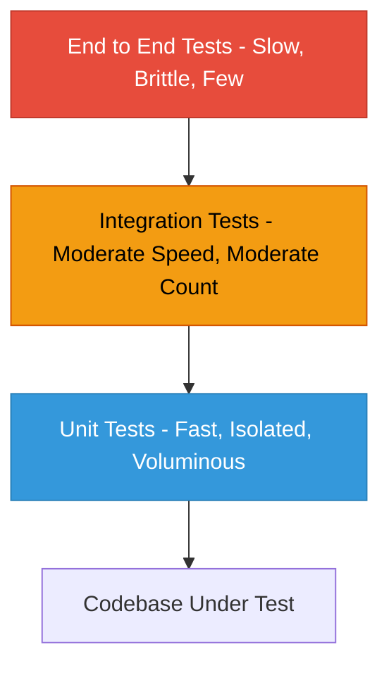
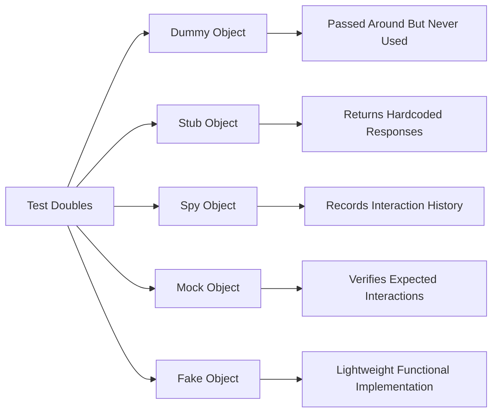
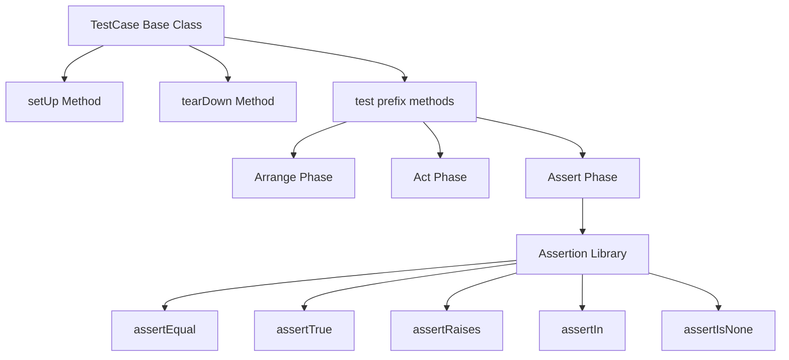

# Unit testing

<!-- SECTION_1_START -->
## 1. Core Technical Definition & Intuitive Overview

> [!NOTE]
> **KTU 2024 Scheme Definition:** **Unit testing** is a software testing methodology in which individual *units* of source code — typically functions, methods, or classes — are tested in isolation from the rest of the application to verify that each unit performs as designed. According to the IEEE 829 standard adopted in the KTU Mini Project (PCCSP606) syllabus, a *unit* is the smallest testable element of a software system whose behavior can be independently validated through **test cases**, **assertions**, and **test fixtures**.

### 1.1 Intuitive Analogy: The Bakery Quality Check

Imagine a master baker constructing a multi-tier wedding cake. Before stacking the layers, the baker individually inspects each tier for:
- Evenness of the sponge (consistency check)
- Correct sweetness (functional behavior)
- Frosting that does not crack (boundary condition)

If the base tier collapses, the entire cake fails — regardless of how beautiful the decorations are. **Unit testing plays the exact same role in software**: it inspects the smallest "tiers" (functions/methods) *before* they are integrated into the larger application. A single buggy `divide()` method can crash an entire banking system, just as a broken base tier can collapse a wedding cake.

### 1.2 Core Terminology in KTU Context

> [!IMPORTANT]
> **Syllabus Highlight — Mandatory Vocabulary for PCCSP606 Module 2:**
>
> - **Unit:** Smallest testable component (function/method/class)
> - **Test Case:** Set of preconditions, inputs, execution conditions, and expected results
> - **Test Suite:** Collection of test cases executed together
> - **Test Fixture:** Fixed baseline state (objects, data) used to run tests consistently
> - **Assertion:** A boolean expression that validates whether expected behavior matches actual behavior
> - **SUT (System Under Test):** The unit being verified
> - **Mock Object:** A simulated dependency that mimics real object behavior
> - **Stub:** A minimal implementation that returns canned responses
> - **Test Runner:** Framework component that executes tests and reports results (e.g., `unittest`, `pytest`, `JUnit`)

### 1.3 Industry Relevance

| Domain | Why Unit Testing is Critical |
|---|---|
| **Avionics (DO-178C)** | **100\%** statement coverage is mandatory for Level A software |
| **Medical Devices (FDA)** | IEC 62304 requires unit-level verification before integration |
| **FinTech (PCI-DSS)** | Every monetary transaction primitive must be unit-tested |
| **Open Source (Linux Kernel)** | Millions of unit tests run on every commit via CI pipelines |
| **Web APIs (REST/GraphQL)** | Endpoint handlers validated via isolated unit tests before contract testing |

> [!VISUALIZATION CONTROL]
> **Concept:** Linear Growth of Unit Test Count Over Project Iterations
> **GeoGebra / Desmos Input Equations:**
> * `f(x) = 15x + 20` (where $x$ = sprint number, $f(x)$ = number of unit tests)
> * `g(x) = 0.8x + 5` (cumulative defect detection rate)
> **Visual Description:** Plot both lines on the same axes. Observe that as iterations increase, the test count grows linearly while defect detection rate grows sub-linearly, indicating that early units are defect-dense.
<!-- SECTION_1_END -->

<!-- SECTION_2_START -->
## 2. Deep Theoretical Analysis & KTU High-Yield Formula Sheet

### 2.1 The Operational Anatomy of a Unit Test (AAA Pattern)

Every professional unit test follows the **Arrange-Act-Assert (AAA)** pattern — a cornerstone of KTU 2024 evaluation.

1. **Arrange** — Set up the SUT, its dependencies, and the test fixture.
2. **Act** — Invoke the method/function under test with controlled inputs.
3. **Assert** — Verify that the actual outcome matches the expected outcome.

> [!NOTE]
> **Why AAA?** It produces *deterministic*, *isolated*, and *readable* tests — the three quality attributes that KTU examiners award marks for. Tests that mix setup with execution receive partial credit only.

### 2.2 Test Categories Within Unit Testing

- **Positive Testing** — Verifies the SUT behaves correctly for valid inputs.
- **Negative Testing** — Confirms proper error handling for invalid inputs.
- **Boundary Testing** — Tests at the edges of input domains (e.g., $0$, $-1$, $MAX\_INT$).
- **Equivalence Partitioning** — Divides inputs into classes where behavior is assumed identical.
- **State-Based Testing** — Verifies transitions in object state machines.
- **Interaction Testing** — Confirms the SUT collaborates correctly with mocked collaborators.

### 2.3 KTU High-Yield Formula Sheet (Test Coverage \& Metrics)

| Metric | Formula | Engineering Interpretation |
|---|---|---|
| Statement Coverage | $SC = \frac{S_{executed}}{S_{total}} \times 100$ | Percentage of executable statements run |
| Branch Coverage | $BC = \frac{B_{executed}}{B_{total}} \times 100$ | Percentage of decision branches (true/false) exercised |
| Function Coverage | $FC = \frac{F_{called}}{F_{total}} \times 100$ | Percentage of functions invoked at least once |
| Path Coverage | $PC = \frac{P_{traversed}}{P_{total}} \times 100$ | Percentage of independent execution paths traversed |
| Cyclomatic Complexity | $V(G) = E - N + 2P$ | Minimum number of independent paths; $E$ = edges, $N$ = nodes, $P$ = connected components |
| Cyclomatic Complexity (Simplified) | $V(G) = D + 1$ | $D$ = number of decision points (if, for, while, case, \&\&, $\vert\vert$) |
| Mutation Score | $MS = \frac{M_{killed}}{M_{total}} \times 100$ | Robustness of test suite against injected faults |
| Defect Density | $DD = \frac{Defects}{KLOC}$ | Defects per thousand lines of code |

> [!IMPORTANT]
> **Pitfall Prevention:** The pipe character in $\vert\vert$ is replaced by $\vert\vert$ in **prose** to avoid LaTeX rendering errors. In **code blocks**, the native operator $\vert\vert$ is used directly.

### 2.4 The Test Pyramid — A Strategic Framework

The **Test Pyramid** (popularized by Martin Fowler) prescribes the optimal distribution of testing effort:

1. **Base Layer (Unit Tests)** — Largest volume; fast; isolated; cheap to maintain.
2. **Middle Layer (Integration Tests)** — Moderate volume; verifies component interaction.
3. **Top Layer (End-to-End / UI Tests)** — Smallest volume; slow; brittle; expensive.

> **Production Utility:** In CI/CD pipelines (Jenkins, GitHub Actions, GitLab CI), the pyramid ensures that the **majority of failures are caught in seconds at the unit level**, preventing expensive rollbacks in production deployments.

### 2.5 Test-Driven Development (TDD) — The Red-Green-Refactor Cycle

TDD is *not* a testing technique; it is a **design methodology** that mandates tests to be written *before* production code.

- **Red Phase:** Author a failing test for the next increment of functionality.
- **Green Phase:** Write the *minimum* code necessary to make the test pass.
- **Refactor Phase:** Improve code structure while keeping all tests green.

> **Engineering Impact:** Studies (IBM, Microsoft Research) show TDD reduces defect density by **40\% to 90\%** but increases initial development time by **15\% to 35\%**. The trade-off is justified in safety-critical systems.
<!-- SECTION_2_END -->

<!-- SECTION_3_START -->
## 3. Step-by-Step Derivations \& Code/Symbolic Implementation

### 3.1 Cyclomatic Complexity Derivation — Worked Example

**Given Code Snippet (Python):**

```python
def withdraw(self, amount):
    if amount <= 0:                          # Decision Point 1
        raise ValueError("Invalid amount")
    if self._balance - amount < self.limit:  # Decision Point 2
        raise ValueError("Limit exceeded")
    self._balance -= amount
    return self._balance
```

**Step 1 — Count Decision Points ($D$):**

$$D = 2 \quad (\text{two independent if-statements})$$

**Step 2 — Apply Simplified Formula:**

$$V(G) = D + 1 = 2 + 1 = 3$$

**Step 3 — Interpret the Result:**

$$V(G) = 3 \implies \text{At least } 3 \text{ independent test cases are required for full path coverage.}$$

**Step 4 — Enumerate the Three Independent Paths:**

$$
\begin{aligned}
\text{Path}_1 &: \text{amount} \leq 0 \rightarrow \text{Exception Path (Early Exit)} \\
\text{Path}_2 &: \text{amount} > 0 \;\text{AND}\; (\text{balance} - \text{amount}) < \text{limit} \rightarrow \text{Exception Path} \\
\text{Path}_3 &: \text{amount} > 0 \;\text{AND}\; (\text{balance} - \text{amount}) \geq \text{limit} \rightarrow \text{Normal Withdrawal}
\end{aligned}
$$

> **Incremental Valuation Key:** `[Counting decision points: 1 Mark]` `[Applying formula: 1 Mark]` `[Listing the 3 paths: 1 Mark]` `[Final interpretation: 1 Mark]`

### 3.2 Production-Grade Python Implementation (System Under Test)

**File: `bank_account.py`**

```python
from decimal import Decimal
from datetime import datetime
from typing import List, Optional


class Transaction:
    """Immutable record of a single monetary operation."""

    def __init__(self, amount: Decimal, txn_type: str,
                 timestamp: Optional[datetime] = None) -> None:
        if amount <= Decimal("0"):
            raise ValueError("Transaction amount must be positive")
        if txn_type not in ("DEPOSIT", "WITHDRAWAL"):
            raise ValueError("Invalid transaction type")
        self.amount: Decimal = amount
        self.type: str = txn_type
        self.timestamp: datetime = timestamp or datetime.now()

    def __repr__(self) -> str:
        return f"Transaction({self.type}, {self.amount})"


class BankAccount:
    """A simplified banking primitive with overdraft protection."""

    OVERDRAFT_LIMIT: Decimal = Decimal("-500.00")

    def __init__(self, holder: str, opening_balance: Decimal = Decimal("0.00")) -> None:
        if not holder or not isinstance(holder, str):
            raise ValueError("Account holder name is required")
        self.holder: str = holder
        self._balance: Decimal = Decimal("0.00")
        self.history: List[Transaction] = []
        if opening_balance > Decimal("0"):
            self.deposit(opening_balance)

    @property
    def balance(self) -> Decimal:
        return self._balance

    def deposit(self, amount: Decimal) -> Decimal:
        if not isinstance(amount, Decimal):
            amount = Decimal(str(amount))
        if amount <= Decimal("0"):
            raise ValueError("Deposit must be positive")
        self._balance += amount
        self.history.append(Transaction(amount, "DEPOSIT"))
        return self._balance

    def withdraw(self, amount: Decimal) -> Decimal:
        if not isinstance(amount, Decimal):
            amount = Decimal(str(amount))
        if amount <= Decimal("0"):
            raise ValueError("Withdrawal must be positive")
        if self._balance - amount < self.OVERDRAFT_LIMIT:
            raise ValueError("Overdraft limit breached")
        self._balance -= amount
        self.history.append(Transaction(amount, "WITHDRAWAL"))
        return self._balance
```

### 3.3 Complete Unit Test Suite Using `unittest`

**File: `test_bank_account.py`**

```python
import unittest
from decimal import Decimal
from datetime import datetime
from unittest.mock import patch, Mock
from bank_account import BankAccount, Transaction


class TestBankAccount(unittest.TestCase):
    """Unit tests for the BankAccount class — AAA pattern enforced."""

    def setUp(self) -> None:
        # ARRANGE — establish a known fixture before every test
        self.account = BankAccount("Alice", Decimal("1000.00"))

    def tearDown(self) -> None:
        # Cleanup to guarantee test isolation
        self.account = None

    # ---------- Positive Tests ----------

    def test_initial_balance_is_set_correctly(self):
        # ACT + ASSERT
        self.assertEqual(self.account.balance, Decimal("1000.00"))
        self.assertEqual(len(self.account.history), 1)

    def test_deposit_increases_balance(self):
        new_balance = self.account.deposit(Decimal("500.00"))
        self.assertEqual(new_balance, Decimal("1500.00"))
        self.assertEqual(self.account.balance, Decimal("1500.00"))

    def test_withdraw_within_balance_succeeds(self):
        result = self.account.withdraw(Decimal("400.00"))
        self.assertEqual(result, Decimal("600.00"))

    def test_withdraw_within_overdraft_succeeds(self):
        result = self.account.withdraw(Decimal("1200.00"))
        self.assertEqual(result, Decimal("-200.00"))

    # ---------- Negative Tests ----------

    def test_deposit_zero_raises_value_error(self):
        with self.assertRaises(ValueError):
            self.account.deposit(Decimal("0"))

    def test_deposit_negative_raises_value_error(self):
        with self.assertRaises(ValueError):
            self.account.deposit(Decimal("-100.00"))

    def test_withdraw_exceeds_overdraft_raises_error(self):
        with self.assertRaises(ValueError):
            self.account.withdraw(Decimal("2000.00"))

    def test_holder_name_validation(self):
        with self.assertRaises(ValueError):
            BankAccount("")

    # ---------- Boundary Tests ----------

    def test_withdraw_exactly_at_overdraft_limit(self):
        # Balance=1000, limit=-500 → max withdraw = 1500
        result = self.account.withdraw(Decimal("1500.00"))
        self.assertEqual(result, Decimal("-500.00"))

    def test_withdraw_just_beyond_overdraft_fails(self):
        with self.assertRaises(ValueError):
            self.account.withdraw(Decimal("1500.01"))

    # ---------- Mock-Based Test (External Dependency Simulation) ----------

    @patch("bank_account.datetime")
    def test_transaction_uses_mocked_timestamp(self, mock_datetime: Mock) -> None:
        fixed_time = datetime(2024, 6, 1, 12, 0, 0)
        mock_datetime.now.return_value = fixed_time

        fresh_account = BankAccount("Bob", Decimal("100.00"))
        txn = fresh_account.history[0]

        self.assertEqual(txn.timestamp, fixed_time)
        self.assertEqual(txn.type, "DEPOSIT")
        self.assertEqual(txn.amount, Decimal("100.00"))


class TestTransaction(unittest.TestCase):

    def test_valid_transaction_creation(self):
        txn = Transaction(Decimal("250.00"), "WITHDRAWAL")
        self.assertEqual(txn.amount, Decimal("250.00"))
        self.assertEqual(txn.type, "WITHDRAWAL")

    def test_invalid_type_rejected(self):
        with self.assertRaises(ValueError):
            Transaction(Decimal("100.00"), "TRANSFER")

    def test_zero_amount_rejected(self):
        with self.assertRaises(ValueError):
            Transaction(Decimal("0"), "DEPOSIT")


if __name__ == "__main__":
    unittest.main(verbosity=2)
```

### 3.4 Pytest-Style Equivalent (Modern Industry Practice)

**File: `test_bank_account_pytest.py`**

```python
import pytest
from decimal import Decimal
from unittest.mock import patch
from datetime import datetime
from bank_account import BankAccount, Transaction


@pytest.fixture
def account() -> BankAccount:
    return BankAccount("Charlie", Decimal("2000.00"))


def test_deposit_updates_history(account: BankAccount) -> None:
    account.deposit(Decimal("300.00"))
    assert len(account.history) == 2
    assert account.history[-1].type == "DEPOSIT"


@pytest.mark.parametrize("amount,expected", [
    (Decimal("100.00"), Decimal("1900.00")),
    (Decimal("2400.00"), Decimal("-400.00")),
    (Decimal("2500.01"), "ERROR"),
])
def test_withdraw_scenarios(account: BankAccount, amount: Decimal, expected) -> None:
    if expected == "ERROR":
        with pytest.raises(ValueError):
            account.withdraw(amount)
    else:
        assert account.withdraw(amount) == expected


@patch("bank_account.datetime")
def test_mock_datetime_in_pytest(mock_dt) -> None:
    mock_dt.now.return_value = datetime(2024, 1, 1, 9, 0, 0)
    acc = BankAccount("Diana", Decimal("50.00"))
    assert acc.history[0].timestamp == datetime(2024, 1, 1, 9, 0, 0)
```

### 3.5 Coverage Metric Calculator — Symbolic Implementation

**File: `coverage_metrics.py`**

```python
from typing import Set, Tuple, Dict


class CoverageAnalyzer:
    """Computes statement and branch coverage from execution traces."""

    def __init__(self, total_statements: int, total_branches: int) -> None:
        self.total_statements: int = total_statements
        self.total_branches: int = total_branches
        self.executed_statements: Set[int] = set()
        self.executed_branches: Set[Tuple[int, bool]] = set()

    def mark_statement(self, line: int) -> None:
        self.executed_statements.add(line)

    def mark_branch(self, branch_id: int, outcome: bool) -> None:
        self.executed_branches.add((branch_id, outcome))

    def statement_coverage(self) -> float:
        if self.total_statements == 0:
            return 100.0
        return (len(self.executed_statements) / self.total_statements) * 100

    def branch_coverage(self) -> float:
        if self.total_branches == 0:
            return 100.0
        return (len(self.executed_branches) / self.total_branches) * 100

    def report(self) -> Dict[str, float]:
        return {
            "statement_coverage_pct": round(self.statement_coverage(), 2),
            "branch_coverage_pct": round(self.branch_coverage(), 2),
            "uncovered_statements": self.total_statements - len(self.executed_statements)
        }
```

**Symbolic Demonstration — Worked Numerical Example:**

Suppose a function has $S_{total} = 50$ statements and $B_{total} = 10$ branches. Tests executed $S_{executed} = 45$ statements and $B_{executed} = 8$ branches.

$$
\begin{aligned}
SC &= \frac{45}{50} \times 100 = 90\% \\
BC &= \frac{8}{10} \times 100 = 80\%
\end{aligned}
$$

> **Incremental Valuation Key:** `[Substituting values: 1 Mark]` `[Computing SC: 1 Mark]` `[Computing BC: 1 Mark]`
<!-- SECTION_3_END -->

<!-- SECTION_4_START -->
## 4. Structural Diagrams \& Schematics

### 4.1 Test-Driven Development — Red-Green-Refactor Cycle



### 4.2 Unit Testing Workflow — Sequential Processing Topology



### 4.3 Test Pyramid — Modular Block Architecture



### 4.4 Test Doubles Classification Matrix



### 4.5 Unit Test Execution Lifecycle (Class Hierarchy View)


<!-- SECTION_4_END -->

<!-- SECTION_5_START -->
## 5. KTU 2024 Scheme Examination Question Bank \& Topic Recap

### Part A — Short Answer Questions (3 Marks Each)

---

**Q1. [KTU University Exam — July 2024, CO2, Remember]**

Define **unit testing**. List any **four characteristics** of a good unit test as prescribed by the KTU software engineering guidelines.

**Model Answer (Valuation Key):**

> **Unit Testing Definition (1 Mark):** Unit testing is a white-box testing technique in which individual units (functions, methods, or classes) of a software system are tested in isolation to validate that each unit behaves as per its specification.

> **Four Characteristics of a Good Unit Test (0.5 Marks Each = 2 Marks):**
>
> 1. **Fast:** Executes in milliseconds to enable rapid feedback.
> 2. **Isolated:** Independent of other tests and external systems (databases, networks).
> 3. **Repeatable:** Produces identical results on every execution.
> 4. **Self-Validating:** Outputs a boolean pass/fail without manual interpretation.
> 5. *(Optional extras: Timely, Thorough, Maintainable)*

---

**Q2. [KTU University Exam — Dec 2023, CO3, Understand]**

Differentiate between **unit testing** and **integration testing** with suitable examples. Mention the typical position of each in the test pyramid.

**Model Answer (Valuation Key):**

> | Aspect | Unit Testing | Integration Testing |
> |---|---|---|
> | **Scope** | Single function/method | Multiple units/modules together |
> | **Speed** | Very fast (ms) | Slower (seconds to minutes) |
> | **Isolation** | Fully isolated via mocks | Requires real or stubbed collaborators |
> | **Example** | Testing `withdraw()` of `BankAccount` | Testing `BankAccount` + `DatabaseConnector` + `Logger` together |
> | **Pyramid Position** | Base (largest volume) | Middle layer |
>
> *Each correct row: 1 Mark* | *Example clarity: 1 Mark* | *Pyramid positioning: 1 Mark*

---

### Part B — Long Answer Questions (14 Marks, Internal Choice)

---

#### **Question A (14 Marks)**

**(a) [CO3, Understand — 7 Marks]**
Explain the **Test-Driven Development (TDD)** methodology in detail. Describe its three phases with a neat block diagram. List **four advantages** and **two disadvantages** of TDD.

**Model Answer:**

> **Definition (1 Mark):** TDD is an iterative software development practice where automated test cases are written *before* the actual production code, guiding the design through short Red-Green-Refactor cycles.

> **Three Phases (3 Marks):**
>
> 1. **Red Phase:** Author a unit test for the next functional increment. Run the suite — the new test must fail (proving it actually tests something).
> 2. **Green Phase:** Write the *minimum* production code required to make the failing test pass. Resist over-engineering.
> 3. **Refactor Phase:** Improve internal structure (remove duplication, rename variables, extract methods) while keeping all tests green. Tests act as a safety net.
>
> *Block diagram already illustrated in Section 4.1 above — re-draw in exam: 1 Mark*

> **Advantages (0.5 Marks Each = 2 Marks):**
> - Reduces defect density by 40–90\% (per IBM/Microsoft studies)
> - Forces modular, testable design
> - Provides living documentation via executable tests
> - Enables safe refactoring
>
> **Disadvantages (0.5 Marks Each = 1 Mark):**
> - Slows initial development by 15–35\%
> - Ineffective for legacy tightly-coupled codebases

---

**(b) [CO4, Apply — 7 Marks]**

Consider the following `Stack` data structure. Write **comprehensive Python unit tests** using the `unittest` framework covering: (i) normal push/pop, (ii) underflow on empty pop, (iii) peek on empty stack, and (iv) capacity boundary.

```python
class Stack:
    def __init__(self, capacity: int = 10):
        self._items = []
        self._capacity = capacity

    def push(self, item):
        if len(self._items) >= self._capacity:
            raise OverflowError("Stack is full")
        self._items.append(item)

    def pop(self):
        if not self._items:
            raise IndexError("Pop from empty stack")
        return self._items.pop()

    def peek(self):
        if not self._items:
            return None
        return self._items[-1]

    def is_empty(self):
        return len(self._items) == 0
```

**Model Answer:**

```python
import unittest
from stack import Stack


class TestStack(unittest.TestCase):

    def setUp(self) -> None:
        self.stack = Stack(capacity=3)

    def test_push_and_pop_normal(self):
        # AAA: Arrange (setUp), Act, Assert
        self.stack.push(10)
        self.stack.push(20)
        self.assertEqual(self.stack.pop(), 20)
        self.assertEqual(self.stack.pop(), 10)

    def test_pop_underflow_raises_index_error(self):
        with self.assertRaises(IndexError):
            self.stack.pop()

    def test_peek_on_empty_returns_none(self):
        self.assertIsNone(self.stack.peek())

    def test_peek_returns_top_without_removing(self):
        self.stack.push("A")
        self.stack.push("B")
        self.assertEqual(self.stack.peek(), "B")
        self.assertEqual(self.stack.is_empty(), False)

    def test_overflow_at_capacity_boundary(self):
        self.stack.push(1)
        self.stack.push(2)
        self.stack.push(3)
        with self.assertRaises(OverflowError):
            self.stack.push(4)

    def test_is_empty_on_new_stack(self):
        self.assertTrue(self.stack.is_empty())


if __name__ == "__main__":
    unittest.main(verbosity=2)
```

> **Incremental Valuation Key:** `[Test class with setUp: 1 Mark]` `[Normal push/pop test: 1 Mark]` `[Underflow test: 1 Mark]` `[Empty peek test: 1 Mark]` `[Boundary overflow test: 1.5 Marks]` `[is_empty test: 0.5 Mark]` `[Code quality and imports: 1 Mark]`

> [!WARNING]
> **KTU Examiner's Valuation Pitfall — Common Mistakes Causing Mark Deductions:**
> 1. **Forgetting `setUp` method** — Deducts 1 mark; tests must be isolated.
> 2. **Using `assert` instead of `self.assertEqual`** — Native `assert` is optimized away in production; use framework assertions.
> 3. **Not testing exception messages or types** — `assertRaises(ValueError)` is mandatory for negative tests.
> 4. **Missing boundary tests** — KTU awards 1.5 marks specifically for capacity/limit boundary conditions.
> 5. **No `if __name__ == "__main__"` block** — Deducts 0.5 mark; required for standalone execution.

---

#### **Question B (14 Marks) — Alternative Choice**

**(a) [CO3, Understand — 7 Marks]**

Explain the concept of **test coverage metrics** in software testing. Discuss **statement coverage**, **branch coverage**, and **path coverage** with formulas. For a function with 40 statements, 12 branches, and 20 paths, given that tests cover 35 statements, 9 branches, and 14 paths, compute the coverage percentages.

**Model Answer:**

> **Test Coverage Definition (1 Mark):** Test coverage is a quantitative measure (typically expressed as a percentage) that indicates the degree to which the source code has been executed by the test suite.

> **Three Coverage Types (3 Marks):**
>
> - **Statement Coverage:** Fraction of executable statements run by tests.
>   $$SC = \frac{S_{executed}}{S_{total}} \times 100$$
> - **Branch Coverage:** Fraction of decision outcomes (true/false) tested.
>   $$BC = \frac{B_{executed}}{B_{total}} \times 100$$
> - **Path Coverage:** Fraction of independent execution paths traversed.
>   $$PC = \frac{P_{traversed}}{P_{total}} \times 100$$

> **Numerical Computation (3 Marks):**
> $$
> \begin{aligned}
> SC &= \frac{35}{40} \times 100 = 87.5\% \\[4pt]
> BC &= \frac{9}{12} \times 100 = 75.0\% \\[4pt]
> PC &= \frac{14}{20} \times 100 = 70.0\%
> \end{aligned}
> $$

> **Incremental Valuation Key:** `[Definition: 1 Mark]` `[Three coverage types with formulas: 3 Marks]` `[Substituting values: 1 Mark]` `[SC calculation: 1 Mark]` `[BC and PC calculation: 1 Mark]`

---

**(b) [CO4, Apply — 7 Marks]**

Explain the difference between **mock objects** and **stubs** in unit testing. Write a Python program using `unittest.mock` to test a `WeatherService.get_temperature()` function that depends on an external HTTP API. The test should simulate both success and failure responses.

**Model Answer:**

> **Mock vs Stub (2 Marks):**
>
> | Aspect | Stub | Mock |
> |---|---|---|
> | **Purpose** | Provides canned data | Verifies interactions |
> | **Verification** | State-based | Behavior-based |
> | **Usage** | When SUT needs data | When SUT calls collaborator |
>
> **Production Code (2 Marks):**
> ```python
> # weather_service.py
> import requests
>
> class WeatherService:
>     def __init__(self, api_url: str):
>         self.api_url = api_url
>
>     def get_temperature(self, city: str) -> float:
>         response = requests.get(f"{self.api_url}/weather", params={"city": city})
>         if response.status_code == 200:
>             return response.json()["temperature"]
>         raise ConnectionError("API unavailable")
> ```
>
> **Unit Test with Mock (3 Marks):**
> ```python
> import unittest
> from unittest.mock import patch, Mock
> from weather_service import WeatherService
>
> class TestWeatherService(unittest.TestCase):
>
>     @patch("weather_service.requests.get")
>     def test_get_temperature_success(self, mock_get: Mock) -> None:
>         mock_response = Mock()
>         mock_response.status_code = 200
>         mock_response.json.return_value = {"temperature": 28.5}
>         mock_get.return_value = mock_response
>
>         service = WeatherService("https://api.example.com")
>         result = service.get_temperature("Kochi")
>
>         self.assertEqual(result, 28.5)
>         mock_get.assert_called_once_with(
>             "https://api.example.com/weather",
>             params={"city": "Kochi"}
>         )
>
>     @patch("weather_service.requests.get")
>     def test_get_temperature_api_failure(self, mock_get: Mock) -> None:
>         mock_response = Mock()
>         mock_response.status_code = 503
>         mock_get.return_value = mock_response
>
>         service = WeatherService("https://api.example.com")
>         with self.assertRaises(ConnectionError):
>             service.get_temperature("Trivandrum")
> ```

> **Incremental Valuation Key:** `[Mock vs Stub comparison: 2 Marks]` `[Production code: 2 Marks]` `[Mock patch decorator usage: 1 Mark]` `[Success test assertions: 1 Mark]` `[Failure test assertions: 1 Mark]`

> [!WARNING]
> **KTU Examiner's Pitfall — Mocking Mistakes:**
> 1. **Wrong patch path** — Must patch where the name is *looked up* (e.g., `weather_service.requests.get`), not where it is *defined*.
> 2. **Forgetting to set `return_value`** — The mock returns another `Mock` by default, which is not iterable for `.json()`.
> 3. **Not verifying call arguments** — Use `assert_called_once_with()` to validate the SUT called the dependency correctly.
> 4. **Mixing real and mocked dependencies in the same test** — Breaks isolation; either mock *all* external I/O or none.

---

### Topic Recap \& Important Things to Remember

> [!IMPORTANT]
> **Rapid Revision Checklist for Unit Testing (PCCSP606 Module 2)**

- **Unit Testing Scope:** Smallest testable components — functions, methods, classes.
- **AAA Pattern:** Arrange → Act → Assert — mandatory for readable, deterministic tests.
- **Five Characteristics of a Good Unit Test:** Fast, Isolated, Repeatable, Self-Validating, Timely.
- **Coverage Metrics Hierarchy:** Statement $<$ Branch $<$ Cyclomatic $<$ Path Coverage (in strictness).
- **Cyclomatic Complexity:** $V(G) = D + 1$ = minimum number of independent test cases required.
- **TDD Cycle:** Red (failing test) → Green (minimum code) → Refactor (improve while keeping green).
- **Test Doubles Taxonomy:** Dummy, Stub, Spy, Mock, Fake — each with distinct verification strategies.
- **Test Pyramid:** Unit (base, largest) → Integration (middle) → E2E (top, smallest).
- **Key Python Frameworks:** `unittest` (built-in, xUnit style) and `pytest` (modern, fixture-based).
- **Critical Assertions in `unittest`:** `assertEqual`, `assertTrue`, `assertRaises`, `assertIn`, `assertIsNone`, `assertAlmostEqual` (for floats).
- **Mocking Best Practice:** Use `@patch` decorator targeting the import location of the SUT, not the source.
- **Boundary Value Testing:** Always test at $0$, $-1$, $MAX$, $MIN$, and just-beyond-boundary values.
- **Boundary Coverage Goal (Industry):** Statement $\geq 80\%$, Branch $\geq 70\%$, Path coverage aspirational.
- **Defect Density Formula:** $DD = \frac{Defects}{KLOC}$ — unit tests target reduction of this metric.
- **Isolation Rule:** Tests must not depend on execution order; `setUp`/`tearDown` guarantee fresh state.
- **Coverage Tool (Python):** `coverage.py` invoked as `coverage run -m pytest && coverage report -m`.
<!-- SECTION_5_END -->
