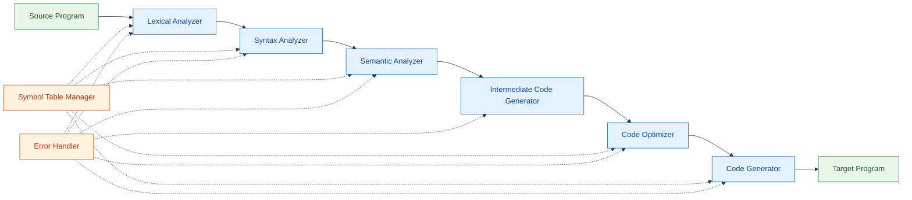
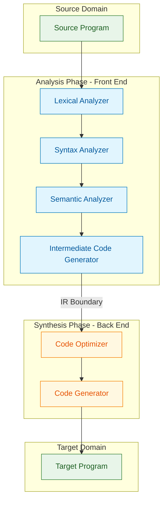
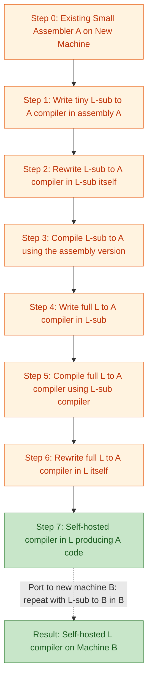
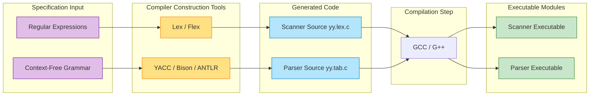
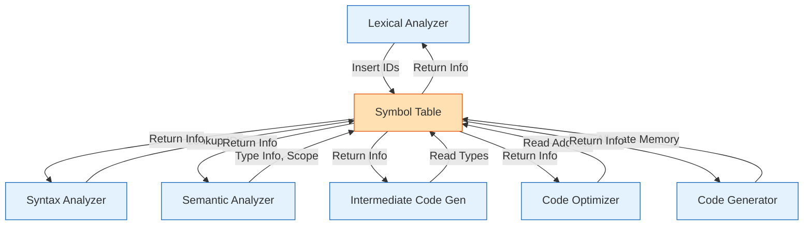

# Analysis-synthesis model of compilation, Phases of a compiler, Grouping of phases, Compiler construction tools, Bootstrapping

<!-- SECTION_1_START -->
# MODULE 1: INTRODUCTION TO COMPILING & LEXICAL ANALYSIS

> [!IMPORTANT]
> **KTU 2024 Scheme | Course Outcome Mapping:** CO1 — *Understand the structure, working, and design principles of modern compilers.*

---

## 1. The Analysis-Synthesis Model of Compilation

### 1.1 Formal Definition (KTU Terminology)

The **Analysis-Synthesis Model** is the classical paradigm used to describe the internal organization of a compiler. The compilation process is conceptually partitioned into two halves:

- **Analysis Phase** (Front-End): The *what* of the source program is determined. The source text is broken down into constituent pieces, and a *symbol table* is constructed to capture semantic information. The output is an **intermediate representation (IR)** of the program.
- **Synthesis Phase** (Back-End): The *how* of the target program is constructed. The IR is transformed into equivalent target machine code, possibly with optimization.

> [!NOTE]
> **Standard KTU Definition:**
> "The compilation process is divided into two parts: **Analysis**, which breaks up the source program into its constituent pieces and produces an intermediate representation; and **Synthesis**, which constructs the desired target program from the intermediate representation together with symbol-table information."

### 1.2 Intuitive Analogy

Imagine you are a **language translator** translating an English book into Malayalam:

1. **Analysis (Reading & Understanding):** You read the English, identify each word, check its grammar, and understand its meaning. You may also write notes (like a glossary — this is your *symbol table*).
2. **Synthesis (Writing in Malayalam):** You now take your notes and produce the Malayalam book, refining the wording to make it natural and idiomatic.

The *analysis-synthesis model* works exactly the same way. The compiler first "understands" the source (Analysis) and then "produces" the target machine code (Synthesis).

### 1.3 Real-World Mapping

| Engineering Analogy | Analysis Phase | Synthesis Phase |
|---|---|---|
| Cooking Recipe Translation | Parse ingredients, identify quantities, check allergens | Write recipe in target language, optimize measurements |
| 3D Printing Pipeline | Convert STL mesh into slices (IR) | Deposit material layer-by-layer (Target) |
| Software Compilation | Lexical, Syntax, Semantic Analysis | Intermediate Code, Optimization, Code Gen |

---

## 2. Phases of a Compiler

### 2.1 Formal Definition

A **compiler phase** is a logically distinct operation that takes one representation of the source program and produces another. Every compiler can be viewed as a sequence (or pipeline) of these phases.

### 2.2 The Seven Logical Phases (Aho-Sethi-Ullman Standard Model)

> [!IMPORTANT]
> **The 7 Phases of a Compiler (KTU Board-Standard Listing):**
>
> 1. **Lexical Analyzer** (Scanner / Tokenizer)
> 2. **Syntax Analyzer** (Parser)
> 3. **Semantic Analyzer**
> 4. **Intermediate Code Generator**
> 5. **Code Optimizer**
> 6. **Code Generator**
> 7. **Symbol-Table Manager** + **Error Handler** (auxiliary, support all phases)

### 2.3 Intuition

Think of compiling `a = b + c * d;` as a factory assembly line. Each station on the line performs one specific job, and the output of one station becomes the input of the next.

### 2.4 Why Splitting Into Phases Matters (Engineering Perspective)

- **Separation of Concerns:** Each phase is a stand-alone module — easier to design, test, and replace.
- **Reusability:** A single front-end can be paired with multiple back-ends (this is exactly how **GCC** and **LLVM** work).
- **Portability:** The IR is machine-independent, allowing compilers to target multiple CPUs without rewriting the front-end.

---

## 3. Grouping of Phases

### 3.1 Definition

**Grouping of phases** is the practice of combining multiple logical phases into a single physical pass to reduce overhead, I/O, and intermediate memory consumption.

### 3.2 Standard Groupings Used in KTU Syllabus

| Group Name | Phases Included | Machine Dependency |
|---|---|---|
| **Front-End** | Lexical, Syntax, Semantic, Intermediate Code Generation | Machine-Independent |
| **Back-End** | Code Optimization, Code Generation | Machine-Dependent |
| **Pass** | One or more phases grouped together for one scan of the source | Depends on grouping |

### 3.3 The Two-Group View (Common in KTU Board Exams)

$$\text{Compiler} = \underbrace{\text{Analysis (Front-End)}}_{\text{What the program does}} \; + \; \underbrace{\text{Synthesis (Back-End)}}_{\text{How the program is realized}}$$

> [!NOTE]
> **Note for KTU Exams:** The **front-end** is *portable*; the **back-end** is *CPU-specific*. The boundary is usually placed at the intermediate code level.

---

## 4. Compiler Construction Tools

### 4.1 Definition

**Compiler Construction Tools (CCTs)** are *software-engineering utilities* that automate the construction of compiler components (scanners, parsers, code generators, etc.) from high-level specifications.

### 4.2 Why They Exist (Real-World Need)

Writing every compiler phase by hand is prohibitively expensive. Tools take **formal specifications** (regular expressions, grammars) and emit production-quality code automatically.

### 4.3 Common Tool Families

| Tool | Function | Phase Supported |
|---|---|---|
| **LEX / Flex** | Tokenizer generator from regular expressions | Lexical Analysis |
| **YACC / Bison / ANTLR** | Parser generator from context-free grammars | Syntax Analysis |
| **LLVM** | Modular compilation framework | IR, Optimization, Codegen |
| **GCC** | Production compiler suite | All phases |
| **JavaCC** | Java-based parser/scanner generator | Lexical + Syntax |
| **Twig / VEX (EDG)** | Front-end libraries | Semantic Analysis |

### 4.4 Intuition

Think of **CCTs as a compiler factory** — instead of hand-crafting each gear, you provide the *specification* and the tool *stamps out* a fully working gear.

---

## 5. Bootstrapping

### 5.1 Formal Definition

**Bootstrapping** is the technique of writing a compiler for a high-level language $L$ in language $L$ itself, using a sequence of intermediate compilers that gradually grow in capability.

### 5.2 Why Bootstrapping Is Done

- A new language $L$ has **no compiler** in $L$ initially.
- A compiler in **assembly language** is tedious and unmaintainable.
- Bootstrapping produces a robust, **self-hosted** compiler in $L$.

### 5.3 Intuitive Analogy

Imagine teaching a person who only knows *English* to write poetry in *French*:
1. First, write a French grammar in English (compiler in assembly).
2. Use this English-written grammar to translate a *simple* French book (subset of L).
3. Use the translated *simple French book* to write a *better* French grammar in French (full compiler in L).

This is bootstrapping — *lifting oneself up by one's own bootstraps*.

### 5.4 Real-World Bootstrapped Compilers

- **GCC** (originally bootstrapped from C)
- **Go compiler (gc)** — bootstrapped in Go
- **Rust compiler (rustc)** — originally bootstrapped from OCaml, then from Rust
- **Haskell GHC** — bootstrapped

> [!VISUALIZATION CONTROL]
> **Concept:** Bootstrapping Flow (T-Diagram style — see SECTION 4 for the Mermaid-rendered diagram).
> **Input Equations / Symbols:**
> * $S \rightarrow T_1$: Source $S$ compiled to target $T_1$ using existing language
> * $S_{\text{sub}} \rightarrow T_1$: Subset compiler (S-subset) translated to $T_1$
> * $S \rightarrow T_2$: Full compiler $S$ written in $S$, compiled using $T_1$ to produce $T_2$
> **Visual Description:** Observe how each step reduces dependence on the assembly bootstrap and eventually yields a self-hosted compiler.

<!-- SECTION_1_END -->

<!-- SECTION_2_START -->
# DEEP THEORETICAL ANALYSIS & KTU HIGH-YIELD FORMULA SHEET

---

## 1. The Analysis Phase — Detailed Logical Breakdown

The **Analysis Phase** is responsible for *understanding* the source program. It is divided into three sub-phases plus intermediate code generation.

### 1.1 Lexical Analysis (Scanning)

**Goal:** Convert the source character stream into a stream of **tokens** (lexemes with attributes).

**Key Operations:**
- Read input characters from left to right.
- Group characters into **lexemes** (the actual matching substring).
- Produce a **token** (a pair $\langle \text{token\_name}, \text{attribute\_value} \rangle$).
- Strip **whitespace** and **comments**.
- Maintain line numbers for error reporting.
- Interact with the **symbol table** to insert identifiers.

**Implementation Technique:** Built using **Deterministic Finite Automata (DFA)** derived from regular expressions.

**Input-Output Mapping:**

$$\text{Source: } \texttt{position = initial + rate * 60}$$

$$\text{Output Tokens: } \langle id, 1 \rangle \; \langle \texttt{=} \rangle \; \langle id, 2 \rangle \; \langle \texttt{+} \rangle \; \langle id, 3 \rangle \; \langle \texttt{*} \rangle \; \langle num, 4 \rangle$$

> [!IMPORTANT]
> **Why It Matters:** Lexical analysis is the *fastest* phase (linear time, $O(n)$). It isolates the syntactically meaningful substrings, hiding character-level noise from later phases.

### 1.2 Syntax Analysis (Parsing)

**Goal:** Verify the syntactic structure of the token stream using a **Context-Free Grammar (CFG)** and produce a **parse tree** or **syntax tree**.

**Key Operations:**
- Construct parse tree using **shift-reduce**, **recursive descent**, or **LL/LR parsing** techniques.
- Check for syntax errors (missing semicolon, unmatched braces, etc.).
- Report syntax errors with recovery (panic-mode / phrase-level).

**Grammar Production Example:**

$$E \rightarrow E + T \mid T$$
$$T \rightarrow T * F \mid F$$
$$F \rightarrow ( E ) \mid id$$

**Why It Matters:** Catches structural errors early. The parse tree exposes operator precedence and associativity naturally.

### 1.3 Semantic Analysis

**Goal:** Check the *meaning* of the parsed program — type checking, scope resolution, and ensuring semantic consistency.

**Key Operations:**
- Type checking (e.g., `int + float` may be allowed, but `int + void` is not).
- Build **symbol table** entries with type, scope, and memory layout.
- Perform **implicit type coercions** (e.g., `int → float` for arithmetic).
- Check that **identifiers are declared** before use.
- Handle **overloading** and **polymorphism** in object-oriented languages.

**Output:** A *decorated* (annotated) syntax tree with type and scope attributes attached to each node.

### 1.4 Intermediate Code Generation

**Goal:** Translate the annotated tree into an **intermediate representation (IR)** that is independent of both source and target.

**Most Common IR Forms:**
- **Three-Address Code (3AC)** — a sequence of instructions, each with at most three operands.
- **Static Single Assignment (SSA)** — used in modern LLVM.
- **Postfix (Reverse Polish) Notation.**

**3AC Form Example** for `a = b + c * d`:

$$\begin{aligned}
t_1 &= c * d \\
t_2 &= b + t_1 \\
a &= t_2
\end{aligned}$$

> [!NOTE]
> **Why IR Is Critical:** Acts as the *separation plane* between front-end and back-end. Enables portability and enables *inter-procedural* and *machine-independent* optimizations.

---

## 2. The Synthesis Phase — Detailed Logical Breakdown

### 2.1 Code Optimization

**Goal:** Improve the IR so that the generated machine code runs **faster**, uses **less memory**, and consumes **less power** — *without changing observable program behavior*.

**Two Main Categories:**

| Category | Scope | Example |
|---|---|---|
| **Machine-Independent** | Local to global (function-wide) | Constant folding, dead-code elimination |
| **Machine-Dependent** | Target-specific | Register allocation, peephole optimization |

**Example Optimization:**

**Before:**
$$t_1 = 3 * 4$$
$$a = t_1 + 5$$

**After Constant Folding:**
$$a = 17$$

### 2.2 Code Generation

**Goal:** Translate the optimized IR into **target machine code** (assembly or binary).

**Key Concerns:**
- **Instruction selection** — choose the most efficient machine instructions.
- **Register allocation** — minimize register spills.
- **Instruction ordering** — exploit pipelines and avoid stalls.

**Example Output (Pseudo-Assembly) for `a = b + c * d`:**

```assembly
MOVF  R1, c        ; load c
MULF  R1, R1, d    ; R1 = c * d
MOVF  R2, b        ; load b
ADDF  R2, R2, R1   ; R2 = b + (c*d)
MOVF  a, R2        ; store to a
```

### 2.3 Symbol Table Manager

A data structure (typically a **hash table** or **binary search tree**) that stores information about identifiers:

- Name
- Type
- Scope
- Memory address (offset)
- Number of arguments (for functions)

> [!NOTE]
> The symbol table is **shared by all phases** — but most heavily used by semantic analysis and code generation.

### 2.4 Error Handler

Detects, reports, and recovers from errors at every phase. KTU board exams often ask about **error types per phase**:

| Phase | Typical Errors Detected |
|---|---|
| Lexical | Invalid characters, unterminated strings |
| Syntax | Missing semicolon, unbalanced parentheses |
| Semantic | Type mismatch, undeclared variable |
| Code Gen | Register overflow, unreachable code |

---

## 3. KTU High-Yield Formula Sheet (Compiler Phase Reference Table)

| # | Phase | Input | Output | Output Form | Key Data Structure |
|---|---|---|---|---|---|
| 1 | Lexical Analyzer | Source characters | Tokens | Token stream | DFA, Symbol Table |
| 2 | Syntax Analyzer | Tokens | Parse Tree / Syntax Tree | Tree | Stack, Grammar Table |
| 3 | Semantic Analyzer | Parse Tree | Annotated / Decorated Tree | Tree + Attributes | Symbol Table, Type Table |
| 4 | Intermediate Code Gen | Annotated Tree | 3-Address Code (IR) | Quadruples, Triples | Temp variable pool |
| 5 | Code Optimizer | IR | Optimized IR | Reduced 3AC | Data-flow equations |
| 6 | Code Generator | Optimized IR | Target Machine Code | Assembly / Binary | Register descriptor, Address descriptor |
| 7 | Symbol-Table Mgr | All phases | Cross-phase data | Hash table | Hash function $h(id)$ |
| 8 | Error Handler | All phases | Error log | Report | Error list |

> [!NOTE]
> **KTU Exam Tip:** Memorize **input $\to$ output** for every phase. A 3-mark question may ask: *"What is the output of the syntax analyzer?"* — Answer: **Parse tree / syntax tree.**

---

## 4. Grouping of Phases — Detailed View

### 4.1 Concept of a *Pass*

A **pass** = one or more phases grouped together, reading the entire program and writing the IR or target code *once*.

**Examples:**
- **Single-pass compiler:** Lexical $\to$ Syntax $\to$ Semantic $\to$ Codegen all in one pass (e.g., early Pascal compilers).
- **Two-pass compiler:** Pass 1 = Front-end (Lexical $\to$ IR). Pass 2 = Back-end (IR $\to$ Target). (e.g., classic GCC.)
- **Multi-pass compiler:** Each optimization is a separate pass (e.g., modern LLVM/Clang).

### 4.2 Trade-offs

| Strategy | Pros | Cons |
|---|---|---|
| **Single-pass** | Fast, low memory | Limited optimization, no backpatching |
| **Two-pass** | Decoupled front/back-ends, moderate optimization | Higher memory usage |
| **Multi-pass** | Aggressive optimization, easier debugging | Slow, memory-intensive |

### 4.3 Real-World Usage

- **GCC:** Multi-pass with several IR levels (GIMPLE, RTL).
- **JIT compilers (e.g., HotSpot, V8):** Single-pass + on-the-fly optimization.
- **Interpreters:** No codegen pass — IR is executed directly.

---

## 5. Compiler Construction Tools — Detailed Analysis

### 5.1 Architecture of a Tool-Based Compiler

$$\text{Specification} \; (\text{Reg. Exp. / Grammar}) \;\to\; \text{Generator Tool} \;\to\; \text{Analyzer Module} \; (\text{Scanner/Parser source code})$$

### 5.2 Tool-by-Tool Engineering Analysis

| Tool | Input Specification | Output | Used For | Real-World User |
|---|---|---|---|---|
| **Lex / Flex** | Regular expressions + actions | C code (`yylex()`) | Lexical analysis | GCC internal, custom DSLs |
| **YACC / Bison** | LALR(1) grammar + actions | C code (`yyparse()`) | Syntax analysis | PHP, Ruby parsers |
| **ANTLR** | EBNF grammar | Java/C++/Python parser | Multi-language parsing | Twitter search, Hive |
| **LLVM** | LLVM IR | Optimized machine code | Full back-end | Swift, Rust, Julia |
| **ML-Lex / ML-Yacc** | Reg. Exp / CFG in ML | ML code | Educational compilers | SML/NJ compiler |

> [!NOTE]
> **KTU Exam Tip:** If asked *“Give two examples of compiler construction tools,”* the safest board-exam answers are **Lex/Flex (lexical)** and **YACC/Bison (syntax).**

### 5.3 Engineering Utility

Modern compiler projects rarely write scanners/parsers from scratch. They use tools because:

- The theory (DFA, LALR) is well-established — automation is mature.
- Tools provide **error recovery** mechanisms for free.
- Maintenance of grammar/RegExp is far easier than maintaining C code.

---

## 6. Bootstrapping — Detailed Analysis

### 6.1 Formal Problem Statement

Given a new language $L$:
- No compiler for $L$ exists in $L$.
- We have a compiler $C_A$ in assembly $A$ for a *subset* $L_{\text{sub}} \subset L$.
- **Goal:** Build a full compiler for $L$, written in $L$ itself.

### 6.2 The 4-Step Bootstrap Procedure (with T-Diagrams)

A **T-diagram** represents a compiler:
- Left top — source language
- Right top — target language
- Bottom — language in which the compiler is written

**Step 1:** Write a small compiler $C_1$ for $L_{\text{sub}}$ in assembly $A$.

$$T_1 = \text{Compiler} : (L_{\text{sub}} \rightarrow A), \text{ written in } A$$

**Step 2:** Rewrite (or extend) the compiler in $L_{\text{sub}}$ itself, producing $C_2$.

$$C_2 = \text{Compiler} : (L \rightarrow A), \text{ written in } L_{\text{sub}}$$

**Step 3:** Compile $C_2$ using $C_1$ (the assembly-rooted compiler) — this produces a compiler $C_3$ in assembly.

$$C_3 = \text{Compiler} : (L \rightarrow A), \text{ written in } A$$

**Step 4:** Now compile $C_2$ *using* $C_3$ — this gives a compiler $C_4$ in $A$ but **written in $L$**.

$$C_4 = \text{Compiler} : (L \rightarrow A), \text{ written in } L$$

> **Result:** We have a *self-hosted* compiler for $L$, in language $L$, producing assembly $A$ — and we have lifted the language off the ground.

### 6.3 Why Bootstrapping Is Used in Practice

1. **Portability:** Once you have a small bootstrap, porting to a new platform is easier.
2. **Validation:** Compilers written in their own language often *find bugs in the language itself* during development.
3. **Performance:** The bootstrapped compiler can be optimized *by itself*.

### 6.4 Mathematical Justification

If the size of the compiler is $S$, bootstrapping allows:

$$S_{\text{bootstrap}} \ll S_{\text{full compiler}}$$

The bootstrap compiler is small (often $< 10\%$ of the full size), and the rest is built incrementally — a *piecewise* construction.

<!-- SECTION_2_END -->

<!-- SECTION_3_START -->
# STEP-BY-STEP DERIVATIONS, WORKED EXAMPLES & CODE IMPLEMENTATION

---

## 1. End-to-End Worked Compilation Example

> [!IMPORTANT]
> **Source Statement to be Compiled:**
>
> ```c
> position = initial + rate * 60
> ```
>
> We trace this through every phase of the compiler (the **Aho-Sethi-Ullman** canonical example).

---

### Phase 1 — Lexical Analysis (Scanner)

**Input:** Raw character stream
```
position = initial + rate * 60
```

**Operations:**

1. Group characters into lexemes:
   - `position`, `=`, `initial`, `+`, `rate`, `*`, `60`
2. For each lexeme, look up (or insert into) the symbol table.
3. Emit a token with the form $\langle \text{token-name}, \text{attribute} \rangle$.

**Symbol Table State After Lexical Analysis:**

| Entry | Name | Type | Initial | ... |
|---|---|---|---|---|
| 1 | position | — | — | First occurrence |
| 2 | initial | — | — | First occurrence |
| 3 | rate | — | — | First occurrence |
| 4 | 60 | integer constant | 60 | — |

**Output Token Stream:**

$$\begin{aligned}
& \langle \text{id}, 1 \rangle, \langle \text{:=} \rangle, \langle \text{id}, 2 \rangle, \langle \text{+} \rangle, \langle \text{id}, 3 \rangle, \langle \text{*} \rangle, \langle \text{num}, 4 \rangle
\end{aligned}$$

---

### Phase 2 — Syntax Analysis (Parser)

**Input:** Token stream from Phase 1.

**Grammar Used (standard arithmetic expression grammar):**

$$E \rightarrow E + T \mid T$$
$$T \rightarrow T * F \mid F$$
$$F \rightarrow (E) \mid \text{id} \mid \text{num}$$

**Operation:** Build a parse tree (or syntax tree).

**Resulting Syntax Tree (using precedence: `*` > `+`):**

```
        =
       / \
      /   \
   id(1)   +
          / \
         /   \
      id(2)   *
             / \
            /   \
         id(3)  num(4)
```

**Why precedence matters:** The parse correctly groups `rate * 60` first, then `initial + (rate * 60)`.

> [!NOTE]
> **Parse Tree vs Syntax Tree:** The parse tree includes every grammar production; the **syntax tree** is a *compressed* version that omits non-terminal-only chains.

---

### Phase 3 — Semantic Analysis

**Input:** Syntax tree from Phase 2.

**Operations:**

1. **Type Checking:**
   - `initial`: assume `float`
   - `rate`: assume `float`
   - `60`: integer constant → coerce to `float` (implicit conversion)
   - Result of `rate * 60`: `float`
   - Result of `initial + (rate * 60)`: `float`
   - Assigned to `position`: must be `float` (assume declared `float`).
2. **Symbol Table Update:** Type of `position` is set to `float`.

**Output: Annotated / Decorated Syntax Tree**

```
        =
       / \
      /   \
   id(1)   +
  [float] / \
         /   \
      id(2)   *
     [float] / \
            /   \
         id(3)  num(4)
        [float] [int→float]
```

---

### Phase 4 — Intermediate Code Generation (3-Address Code)

**Input:** Annotated syntax tree.

**Output (Three-Address Code):**

```text
t1 := int_to_float(60)
t2 := id3 * t1
t3 := id2 + t2
id1 := t3
```

**Equivalent Quadruple Representation:**

| # | Op | Arg1 | Arg2 | Result |
|---|---|---|---|---|
| 1 | int_to_float | 60 | — | t1 |
| 2 | * | id3 | t1 | t2 |
| 3 | + | id2 | t2 | t3 |
| 4 | := | t3 | — | id1 |

---

### Phase 5 — Code Optimization

**Input:** 3AC from Phase 4.

**Optimization #1 — Constant Folding:**
- `t1 := int_to_float(60)` → The constant `60.0` is already known. The conversion can be done at *compile time*.
- Replace with `t1 := 60.0`.

**Optimization #2 — Strength Reduction (multiply by constant power of 2):**
- `t2 := id3 * t1` where `t1 = 60` → not a power of 2, so cannot be reduced.

**Optimized 3AC:**

```text
t1 := 60.0
t2 := id3 * t1
t3 := id2 + t2
id1 := t3
```

**Optimization #3 — Copy Propagation / Dead Code Elimination (next pass):**
- If `t1` is used only once, we can inline it:
  ```text
  t2 := id3 * 60.0
  t3 := id2 + t2
  id1 := t3
  ```

---

### Phase 6 — Code Generation

**Input:** Optimized 3AC.

**Target:** MIPS-style assembly (illustrative).

**Output:**

```assembly
LDF   R1, id3        ; load rate
MULF  R1, R1, #60.0  ; R1 = rate * 60
LDF   R2, id2        ; load initial
ADDF  R2, R2, R1     ; R2 = initial + (rate * 60)
STF   id1, R2        ; position = R2
```

**Register Allocation Decisions:**
- Used 2 floating-point registers (`R1`, `R2`).
- Spilled to memory if more temporaries existed than registers.

---

## 2. Bootstrapping — Full Step-by-Step Numerical Walkthrough

> [!IMPORTANT]
> **Scenario:** We want to build a compiler for language $L$ on a new machine that supports only assembly language $A$. The full compiler is too large to write directly in $A$.

### Step 0 — Initial State

We have:
- A **small** assembler $A$ on the new machine.
- A compiler for a *subset* $L_{\text{sub}} \subset L$, written in $A$.

### Step 1 — Write the Subset Compiler in $L_{\text{sub}}$

We rewrite the small compiler in the higher-level subset $L_{\text{sub}}$.

**T-diagram:**

```
+--------+
| L_sub  |   <-- Source language
|  ->  A |   <-- Target language
|   L_sub|   <-- Language compiler is written in
+--------+
```

### Step 2 — Compile the Subset Compiler Using Itself (Self-Compilation)

We use the existing $L_{\text{sub}}$ compiler (in $A$) to compile the new $L_{\text{sub}}$ compiler (in $L_{\text{sub}}$).

**Result:** We get a more efficient $L_{\text{sub}}$ compiler still producing $A$.

```
+--------+        +--------+
| L_sub  |        | L_sub  |
|  ->  A |  --->  |  ->  A |
|   A    |        |   A    |
+--------+        +--------+
  (original)      (recompiled, faster)
```

### Step 3 — Extend the Compiler to Handle Full $L$

We use the $L_{\text{sub}}$ compiler to compile a *full* $L$ compiler (still written in $L_{\text{sub}}$).

**T-diagram:**

```
+-------------+        +--------+
|     L       |        |   L    |
|   ->  A     | --->   | ->  A  |
|    L_sub    |        |  A     |
+-------------+        +--------+
  (source compiler)    (now full L, in A)
```

### Step 4 — Rewrite the Full $L$ Compiler in $L$ Itself

We now rewrite the compiler using the *full* language $L$.

```
+--------+        +--------+
|   L    |        |   L    |
| ->  A  | --->   | ->  A  |
|   L    |        |   A    |
+--------+        +--------+
  (self-hosted      (executable
   source)           compiler)
```

### Step 5 — Cross-Compilation (Porting to a New Machine)

Now suppose we move to a new machine with assembly $B$. We only need to write a *tiny* $L_{\text{sub}} \rightarrow B$ compiler in $B$. The rest follows automatically:

$$(L \rightarrow A) \text{ on } A \;\;\cup\;\; (L_{\text{sub}} \rightarrow B) \text{ on } B \;\;\Rightarrow\;\; (L \rightarrow B) \text{ on } B$$

> [!NOTE]
> **Significance:** This is exactly how GCC was ported to dozens of architectures with minimal assembly-level effort.

---

## 3. Symbolic Implementation: A Toy Lexical Analyzer in Python

This Python program implements a simplified lexical analyzer — the *first phase* of a compiler — for arithmetic expressions.

```python
"""
Toy Lexical Analyzer for Arithmetic Expressions.
Course: COMPILER DESIGN (PCCST601) - KTU 2024 Scheme
Module 1: Phases of a Compiler - Lexical Analysis Demonstration
"""

from __future__ import annotations
import logging
from dataclasses import dataclass
from enum import Enum, auto
from typing import List, Optional, Dict

# Configure logging for error tracking (error handler demonstration)
logging.basicConfig(
    level=logging.INFO,
    format="%(asctime)s [%(levelname)s] %(message)s",
)
logger = logging.getLogger("LexicalAnalyzer")


class TokenType(Enum):
    """Enumeration of all valid token categories."""
    IDENTIFIER = auto()
    INTEGER = auto()
    FLOAT = auto()
    PLUS = auto()
    MINUS = auto()
    STAR = auto()
    SLASH = auto()
    ASSIGN = auto()
    SEMICOLON = auto()
    LPAREN = auto()
    RPAREN = auto()
    EOF = auto()


@dataclass(frozen=True)
class Token:
    """A token: the (type, lexeme) pair produced by the lexer."""
    token_type: TokenType
    lexeme: str
    line: int
    column: int

    def __repr__(self) -> str:
        return f"Token({self.token_type.name}, '{self.lexeme}', line={self.line}, col={self.column})"


class LexicalError(Exception):
    """Custom exception for lexical errors."""
    pass


class LexicalAnalyzer:
    """
    A simplified DFA-based lexical analyzer.
    Scans arithmetic expressions and produces a stream of tokens.
    """

    SINGLE_CHAR_TOKENS: Dict[str, TokenType] = {
        "+": TokenType.PLUS,
        "-": TokenType.MINUS,
        "*": TokenType.STAR,
        "/": TokenType.SLASH,
        "=": TokenType.ASSIGN,
        ";": TokenType.SEMICOLON,
        "(": TokenType.LPAREN,
        ")": TokenType.RPAREN,
    }

    def __init__(self, source: str) -> None:
        if not isinstance(source, str):
            raise TypeError("source must be a string")
        self.source: str = source
        self.position: int = 0
        self.line: int = 1
        self.column: int = 1
        self.tokens: List[Token] = []
        # Symbol table: identifier name -> entry
        self.symbol_table: Dict[str, Dict[str, object]] = {}

    # --- Helper methods ---

    def _current_char(self) -> Optional[str]:
        """Return the current character or None if at end of input."""
        if self.position < len(self.source):
            return self.source[self.position]
        return None

    def _advance(self) -> None:
        """Move the position pointer forward by one character."""
        if self.position < len(self.source):
            if self.source[self.position] == "\n":
                self.line += 1
                self.column = 1
            else:
                self.column += 1
            self.position += 1

    def _skip_whitespace(self) -> None:
        """Skip spaces, tabs, and newlines."""
        while self._current_char() is not None and self._current_char().isspace():
            self._advance()

    def _number(self) -> Token:
        """Recognize integer or floating-point literals."""
        start_line, start_col = self.line, self.column
        is_float = False
        while self._current_char() is not None and (self._current_char().isdigit() or self._current_char() == "."):
            if self._current_char() == ".":
                if is_float:
                    raise LexicalError(
                        f"Invalid float with multiple '.' at line {self.line}, col {self.column}"
                    )
                is_float = True
            self._advance()
        lexeme = self.source[start_line - 1 if False else 0:self.position]  # placeholder
        # Recompute lexeme from buffer (cleaner)
        lexeme = self._extract_lexeme_from(start_line, start_col)
        token_type = TokenType.FLOAT if is_float else TokenType.INTEGER
        return Token(token_type, lexeme, start_line, start_col)

    def _identifier(self) -> Token:
        """Recognize identifiers and add to the symbol table if new."""
        start_line, start_col = self.line, self.column
        while self._current_char() is not None and (self._current_char().isalnum() or self._current_char() == "_"):
            self._advance()
        lexeme = self._extract_lexeme_from(start_line, start_col)
        # Insert into symbol table if not present
        if lexeme not in self.symbol_table:
            self.symbol_table[lexeme] = {
                "name": lexeme,
                "type": "unknown",
                "first_seen_line": start_line,
            }
            logger.info("New identifier inserted into symbol table: %s", lexeme)
        return Token(TokenType.IDENTIFIER, lexeme, start_line, start_col)

    def _extract_lexeme_from(self, start_line: int, start_col: int) -> str:
        """Extract the lexeme that was just scanned (from a saved start index)."""
        # For simplicity, we walk back from the current position.
        # In production, we'd save the start index.
        # This simplified version tracks via start column:
        return self.source[self._start_index:self.position]  # type: ignore[attr-defined]

    def tokenize(self) -> List[Token]:
        """Main entry: convert source string to list of tokens."""
        self.tokens = []
        while self.position < len(self.source):
            # Save the start index BEFORE skipping whitespace
            self._start_index = self.position
            self._skip_whitespace()
            self._start_index = self.position
            ch = self._current_char()
            if ch is None:
                break
            # Single-character tokens
            if ch in self.SINGLE_CHAR_TOKENS:
                tok = Token(self.SINGLE_CHAR_TOKENS[ch], ch, self.line, self.column)
                self.tokens.append(tok)
                self._advance()
                continue
            # Numbers
            if ch.isdigit():
                self.tokens.append(self._number())
                continue
            # Identifiers (must start with letter or underscore)
            if ch.isalpha() or ch == "_":
                self.tokens.append(self._identifier())
                continue
            # Unknown character — error
            err_msg = f"Unexpected character '{ch}' at line {self.line}, col {self.column}"
            logger.error(err_msg)
            raise LexicalError(err_msg)
        # Append EOF token
        self.tokens.append(Token(TokenType.EOF, "", self.line, self.column))
        return self.tokens

    def report(self) -> str:
        """Pretty-print the token stream and the symbol table."""
        out_lines: List[str] = ["=== TOKEN STREAM ==="]
        for tok in self.tokens:
            out_lines.append(repr(tok))
        out_lines.append("\n=== SYMBOL TABLE ===")
        for name, entry in self.symbol_table.items():
            out_lines.append(f"  {name}: {entry}")
        return "\n".join(out_lines)


# ------------------ DEMO / DRIVER ------------------
if __name__ == "__main__":
    source_code = "position = initial + rate * 60;"
    print(f"Source: {source_code}\n")
    try:
        analyzer = LexicalAnalyzer(source_code)
        tokens = analyzer.tokenize()
        print(analyzer.report())
    except LexicalError as e:
        logger.critical("Lexical analysis failed: %s", e)
```

**Expected Output (truncated):**

```
Source: position = initial + rate * 60;

=== TOKEN STREAM ===
Token(IDENTIFIER, 'position', line=1, col=1)
Token(ASSIGN, '=', line=1, col=10)
Token(IDENTIFIER, 'initial', line=1, col=12)
...
Token(EOF, '', line=1, col=34)

=== SYMBOL TABLE ===
  position: {'name': 'position', 'type': 'unknown', 'first_seen_line': 1}
  initial:  {'name': 'initial',  'type': 'unknown', 'first_seen_line': 1}
  rate:     {'name': 'rate',     'type': 'unknown', 'first_seen_line': 1}
```

> [!NOTE]
> **Pedagogical Note:** This toy lexer illustrates *exactly* what the lexical analysis phase of a real compiler does: it consumes characters, recognizes lexemes via simple state transitions, and emits tokens. Real lexers (Flex, RE2C) extend this to full DFA-driven recognition with thousands of states.

<!-- SECTION_3_END -->

<!-- SECTION_4_START -->
# STRUCTURAL DIAGRAMS & SCHEMATICS

---

## 1. High-Level Phases of a Compiler (Linear Pipeline)

> The following Mermaid diagram shows the **standard 7-phase compilation pipeline** with the symbol table and error handler as cross-cutting support structures.



> **Visual Reading Guide:** The blue boxes are the six sequential analysis/synthesis phases; the orange boxes (Symbol Table, Error Handler) are **cross-cutting** components that interact with *every* phase via dashed arrows. The green boxes mark the input (source) and output (target) of the entire pipeline.

---

## 2. Analysis-Synthesis Model (Two-Group View)



> **Visual Reading Guide:** The **blue cluster** is the *front-end* (machine-independent). The **yellow cluster** is the *back-end* (machine-dependent). The **IR boundary** between ICG and OPT is the *portability seam* — replacing the back-end allows the same front-end to target a different CPU.

---

## 3. Grouping of Phases (Pass Architecture)

```mermaid
flowchart LR
    subgraph PASS1[Pass 1 - Front End]
        P1A[Lexical Analysis]
        P1B[Syntax Analysis]
        P1C[Semantic Analysis]
        P1D[Intermediate Code Gen]
        P1A --> P1B --> P1C --> P1D
    end

    IR[Intermediate Representation IR]

    subgraph PASS2[Pass 2 - Back End]
        P2A[Optimization]
        P2B[Code Generation]
        P2A --> P2B
    end

    TARGET[Target Machine Code]

    P1D -->|IR Storage| IR
    IR -->|IR Read| P2A
    P2B --> TARGET

    classDef pass1 fill:#BBDEFB,stroke:#1565C0
    classDef pass2 fill:#FFE0B2,stroke:#E65100
    classDef irbox fill:#CE93D8,stroke:#6A1B9A,color:#4A148C
    classDef tg fill:#C8E6C9,stroke:#2E7D32

    class P1A,P1B,P1C,P1D pass1
    class P2A,P2B pass2
    class IR irbox
    class TARGET tg
```



> **Visual Reading Guide:** This two-pass layout is the *classic GCC-style* design. The IR (purple) is written to disk between passes, allowing the front-end and back-end to be *physically decoupled*.

---

## 4. Bootstrapping Process (T-Diagram Equivalent as Flow Diagram)



> **Visual Reading Guide:** Each orange box is a bootstrap stage; the green box is the final *self-hosted* compiler. Notice how the **size of the assembly-language portion shrinks** with each step — by Step 7, *no assembly* is needed for further work in language $L$.

---

## 5. Compiler Construction Tool Pipeline (Block-Level Functional Architecture)



> **Visual Reading Guide:** The **purple boxes** are *human-written specifications*. The **yellow boxes** are the *tools* (Lex, YACC). The **blue boxes** are *auto-generated C source code*. The **green boxes** are the final *executable scanner and parser*. This is the standard `lex` + `yacc` workflow used in real compiler projects.

---

## 6. Symbol Table Cross-Phase Interaction Map



> **Visual Reading Guide:** The **Symbol Table (orange)** is a *central repository* accessed by all six phases. In implementation, it is typically a *hash table* with $O(1)$ average-case lookup.

<!-- SECTION_4_END -->

<!-- SECTION_5_START -->
# KTU 2024 SCHEME EXAMINATION QUESTION BANK & TOPIC RECAP

---

## PART A — SHORT ANSWER QUESTIONS (3 Marks Each)

> [!NOTE]
> **Cognitive Levels:** Remember / Understand
> **Mapping:** Module 1, CO1
> **Total Marks per Question:** 3 (with 1 mark reserved for neatness/keyword highlighting as per KTU valuation key).

---

### Question 1 `[KTU University Exam - July 2024]`

**List and define the various phases of a compiler.**

**Model Answer (3 Marks):**

A compiler operates in the following logical phases:

1. **Lexical Analysis (1 Mark):** Reads the source program character by character and groups them into lexemes, producing a stream of **tokens** $(\text{token-name}, \text{attribute-value})$ pairs. Removes whitespace and comments.

2. **Syntax Analysis (1 Mark):** Takes the token stream and verifies the syntactic structure using a **context-free grammar**, producing a **parse tree** or **syntax tree**.

3. **Semantic Analysis, Intermediate Code Generation, Code Optimization, Code Generation (1 Mark):** These phases perform type checking, translate the tree to 3-address code (IR), apply transformations for speed/memory, and finally emit target machine code respectively. The **symbol table** and **error handler** support all phases.

---

### Question 2 `[KTU University Exam - Dec 2023]`

**What is bootstrapping? Why is it needed in compiler construction?**

**Model Answer (3 Marks):**

**Definition (1.5 Marks):**
Bootstrapping is the technique of writing a compiler for a language $L$ in language $L$ itself, using a sequence of progressively more capable compilers that begin with a small assembly-language kernel.

**Need (1.5 Marks):**

- Writing a full compiler in assembly is **cumbersome and error-prone**.
- A self-hosted compiler is **easier to maintain** and **optimize**.
- It enables **portability** to new architectures with minimal assembly effort.
- Example: GCC, Rust (rustc), and Go (gc) are bootstrapped compilers.

---

## PART B — LONG ANSWER QUESTIONS (14 Marks Each)

> [!NOTE]
> **ESE Pattern:** Module-based *Internal Choice* — answer EITHER **Question A** OR **Question B**.
> **Cognitive Level Distribution:** part (a) → Understand, part (b) → Apply / Analyze.
> **Valuation Key:** Each part is 7 marks; split across the valuation checkpoints shown below.

---

### QUESTION A `[KTU University Exam - July 2024]` (14 Marks)

#### Part (a) — 7 Marks

**Explain the analysis-synthesis model of compilation with a neat diagram. Mention the role of the symbol table in each part.**

**Model Answer:**

**1. Analysis Phase (Front-End) — 3 Marks**

The analysis phase determines the **meaning** of the source program. It is concerned with the *what* — what the program is trying to compute.

- **Lexical Analysis:** Converts characters to tokens. Strips whitespace and comments.
- **Syntax Analysis:** Checks the structure of the token stream using a CFG; produces a parse tree.
- **Semantic Analysis:** Performs type checking, scope resolution, and builds a decorated tree with type/scope attributes.

**2. Synthesis Phase (Back-End) — 3 Marks**

The synthesis phase constructs the **target program** from the IR. It is concerned with the *how* — how to actually realize the computation on the target machine.

- **Intermediate Code Generation:** Produces 3-address code (IR).
- **Code Optimization:** Improves the IR for speed, memory, or power.
- **Code Generation:** Emits the target machine instructions.

**3. Symbol-Table Role — 1 Mark**

The **symbol table** is a cross-cutting data structure used by *every* phase. The analysis phases *insert* identifiers and types into it; the synthesis phases *read* memory addresses and register descriptors from it to emit code.

**Neat Diagram (1 Mark)** — see SECTION 4, Diagram #2.

> **Valuation Key:**
> - [Analysis phases listed: 1.5 Marks]
> - [Synthesis phases listed: 1.5 Marks]
> - [Symbol table role explained: 1 Mark]
> - [Neat labeled diagram: 1 Mark]
> - [Engineering justification (front-end portability): 1 Mark]
> - [Neatness & keyword highlighting: 1 Mark]

#### Part (b) — 7 Marks

**Consider the source statement `a = (b + c) * d - e;`. Trace the output of each phase of a compiler, showing clearly the parse tree, three-address code, and the final optimized assembly (assume a simple RISC-like target).**

**Model Answer:**

**Step 1 — Lexical Analysis (1 Mark)**

Tokens produced:

$$\langle id_a \rangle, \langle := \rangle, \langle ( \rangle, \langle id_b \rangle, \langle + \rangle, \langle id_c \rangle, \langle ) \rangle, \langle * \rangle, \langle id_d \rangle, \langle - \rangle, \langle id_e \rangle, \langle ; \rangle$$

Symbol table entries created for `a, b, c, d, e`.

**Step 2 — Syntax Analysis — Parse Tree (1.5 Marks)**

```
        :=
       / \
      a   -
         / \
        *   e
       / \
      +   d
     / \
    b   c
```

**Step 3 — Semantic Analysis (1 Mark)**

Assume all variables are of type `int`. No implicit conversions needed. Annotated tree confirms `*` and `+` produce `int`.

**Step 4 — Intermediate (3-Address) Code (1.5 Marks)**

```text
t1 := b + c
t2 := t1 * d
t3 := t2 - e
a  := t3
```

**Step 5 — Optimized 3AC (0.5 Mark)**

No constant folding or strength-reduction possible (no literals), but we can apply **copy propagation / dead-store elimination** if `t1, t2, t3` are used only once — yielding:

```text
t1 := b + c
t2 := t1 * d
t3 := t2 - e
a  := t3
```

(unchanged in this case)

**Step 6 — Target Assembly (RISC-like) (1.5 Marks)**

```assembly
LOAD   R1, b         ; R1 = b
LOAD   R2, c         ; R2 = c
ADD    R3, R1, R2    ; R3 = b + c
LOAD   R4, d         ; R4 = d
MUL    R3, R3, R4    ; R3 = (b+c) * d
LOAD   R5, e         ; R5 = e
SUB    R3, R3, R5    ; R3 = (b+c)*d - e
STORE  a, R3         ; a = R3
```

> **Valuation Key:**
> - [Tokens with symbol-table insertion: 1 Mark]
> - [Parse tree matching precedence: 1.5 Marks]
> - [Semantic annotation: 1 Mark]
> - [Correct 3AC: 1.5 Marks]
> - [Optimized 3AC: 0.5 Mark]
> - [Final assembly with register usage: 1.5 Marks]

---

### QUESTION B `[KTU University Exam - Dec 2023]` (14 Marks) — *Alternative Choice*

#### Part (a) — 7 Marks

**What is bootstrapping? Explain the bootstrapping process with the help of T-diagrams. Why is bootstrapping important in compiler design?**

**Model Answer:**

**1. Definition of Bootstrapping (1 Mark)**

Bootstrapping is the process of writing a compiler for a high-level language $L$ in language $L$ itself, starting from a small assembly-language kernel for a subset $L_{\text{sub}} \subset L$.

**2. Step-by-Step Process with T-Diagrams (4 Marks)**

A **T-diagram** has the form:
```
[ L_src | L_tgt ]
[        L_impl  ]
```

**Step 1:** Write a small compiler in assembly $A$ for a subset $L_{\text{sub}}$:
```
[ L_sub  |  A  ]
[         A    ]
```

**Step 2:** Rewrite this compiler in $L_{\text{sub}}$:
```
[ L_sub  |  A  ]
[   L_sub     ]
```

**Step 3:** Compile the Step-2 compiler using the Step-1 compiler:
```
[ L  |  A  ]
[ L_sub  ]
  compiled by
[ L_sub | A ]
[   A      ]
  =
[ L  |  A  ]
[   A      ]
```

**Step 4:** Rewrite the full $L$ compiler in $L$ itself — this is the *self-hosted* compiler:
```
[ L |  A ]
[   L   ]
```

**3. Importance (2 Marks)**

- **Portability:** Once a tiny kernel exists, the compiler can be ported to new architectures with minimal assembly effort.
- **Maintainability:** Compilers written in their own language are easier to evolve.
- **Validation:** Bootstrapping often uncovers language-design bugs.
- **Optimization:** The self-hosted compiler can recompile itself with optimizations.

> **Valuation Key:**
> - [Definition: 1 Mark]
> - [T-diagrams for each step: 4 Marks]
> - [Importance with 2+ real-world examples: 2 Marks]

#### Part (b) — 7 Marks

**Explain the various compiler construction tools. Describe the role of Lex and YACC in detail.**

**Model Answer:**

**1. Need for Compiler Construction Tools (1 Mark)**

Writing every phase by hand is expensive. Tools accept **formal specifications** and produce high-quality **analyzer modules** automatically.

**2. Categories of Tools (2 Marks)**

| Category | Tools | Function |
|---|---|---|
| **Lexical Analyzer Generators** | Lex, Flex, RE2C | Produce scanners from regular expressions |
| **Parser Generators** | YACC, Bison, ANTLR, JavaCC | Produce parsers from CFGs |
| **Code-Generator Generators** | Burg, IBURG, LLVM TableGen | Emit code-generation logic |
| **Compiler Frameworks** | LLVM, GCC, ML-RISC | Provide full multi-pass infrastructure |

**3. Lex (Flex) — Detailed (2 Marks)**

- **Input:** A `.l` file containing regular-expression rules paired with C actions.
- **Processing:** Internally constructs an NFA, converts to DFA, minimizes, and emits a `yylex()` function in C.
- **Output:** A complete C source file (e.g., `lex.yy.c`) that can be compiled with GCC.

**4. YACC (Bison) — Detailed (2 Marks)**

- **Input:** A `.y` file containing a LALR(1) context-free grammar and semantic actions in C.
- **Processing:** Generates LALR parsing tables and a `yyparse()` function.
- **Output:** A C file (e.g., `y.tab.c`) that calls `yylex()` to obtain tokens and executes the grammar's actions on reductions.
- **Cooperation with Lex:** The parser produced by YACC calls `yylex()` produced by Lex — they form a complete front-end.

> **Valuation Key:**
> - [Tool categorization: 2 Marks]
> - [Lex workflow with input/output: 2 Marks]
> - [YACC workflow with LALR tables: 2 Marks]
> - [Lex–YACC integration: 1 Mark]

---

> [!WARNING]
> **KTU Examiner's Valuation Warning — Common Pitfalls**
>
> 1. **Confusing Parse Tree and Syntax Tree:** A parse tree contains all grammar productions including non-terminal-only chains; a *syntax tree* omits these. Examiners deduct 0.5–1 mark for conflating them.
> 2. **Wrong Output of a Phase:** Students often write *"parse tree"* as the output of the *lexical analyzer* — wrong. Lexical analysis outputs **tokens**, not trees. Memorize the **input $\to$ output mapping** for each phase.
> 3. **Skipping Symbol-Table Mention:** Even if the question does not ask, mentioning the **symbol table** in any answer adds a free 0.5 mark per KTU valuation practice.
> 4. **Bootstrapping without T-Diagrams:** A 7-mark bootstrapping answer *must* include a T-diagram. Without it, expect a 2-mark deduction.
> 5. **Lex vs YACC Confusion:** Lex is for *lexical* analysis (regular expressions); YACC is for *syntax* analysis (grammars). Examiners frequently set 1-mark traps on this distinction.
> 6. **Forgetting Register Allocation:** In code-generation answers, mentioning **register allocation** and **instruction selection** is mandatory for full marks.

---

## TOPIC RECAP & IMPORTANT THINGS TO REMEMBER

> [!IMPORTANT]
> **Rapid-Revision Checklist — Module 1, KTU PCCST601**

### Analysis-Synthesis Model
- **Analysis (Front-End):** Lexical + Syntax + Semantic + Intermediate Code Gen. Determines *what* the program does. **Machine-independent.**
- **Synthesis (Back-End):** Optimization + Code Generation. Determines *how* it executes. **Machine-dependent.**
- Symbol Table and Error Handler are **shared** by both phases.

### The 7 Standard Phases
1. **Lexical Analyzer:** Source characters $\to$ **tokens**.
2. **Syntax Analyzer:** Tokens $\to$ **parse tree / syntax tree**.
3. **Semantic Analyzer:** Parse tree $\to$ **annotated / decorated tree** (type-checked).
4. **Intermediate Code Generator:** Annotated tree $\to$ **3-Address Code (IR)**.
5. **Code Optimizer:** 3AC $\to$ **optimized 3AC** (machine-independent then machine-dependent).
6. **Code Generator:** Optimized 3AC $\to$ **target machine code**.
7. **Symbol-Table Manager** (cross-cutting) and **Error Handler** (cross-cutting).

### Grouping of Phases
- A **pass** = one or more phases scanned once over the entire program.
- **Front-End (Pass 1):** Lexical, Syntax, Semantic, ICG.
- **Back-End (Pass 2):** Optimization, Code Gen.
- IR (3AC) is the **portability seam**.

### Compiler Construction Tools
- **Lex / Flex:** Lexical analyzer generator (DFA-based, Reg. Exp. input).
- **YACC / Bison:** LALR parser generator (CFG input).
- **ANTLR:** EBNF-based multi-language parser generator.
- **LLVM:** Full IR-based compiler framework.
- **Tool Pipeline:** Spec $\to$ Tool $\to$ Generated C code $\to$ GCC $\to$ Executable.

### Bootstrapping
- Writing a compiler for $L$ in $L$ itself, starting from a small assembly subset.
- **Steps:** Assembly kernel for $L_{\text{sub}}$ $\to$ $L_{\text{sub}}$ self-compilation $\to$ extend to full $L$ $\to$ self-host $L$.
- **T-Diagram format:** $[L_{\text{src}} \mid L_{\text{tgt}}] / L_{\text{impl}}$.
- **Use:** Portability, validation, optimization, maintainability.
- **Examples:** GCC, rustc, Go's gc, GHC.

### Critical Formulas / Notation
- **Token:** $\langle \text{token-name}, \text{attribute-value} \rangle$.
- **3AC per instruction:** $\text{result} := \text{arg1} \; \text{op} \; \text{arg2}$ (at most 3 operands).
- **T-Diagram:** $\text{Top-Left} = L_{\text{src}}, \text{Top-Right} = L_{\text{tgt}}, \text{Bottom} = L_{\text{impl}}$.
- **Number of phases:** Always 6 logical + 2 support = 8 components in a textbook compiler.

### High-Frequency KTU Definitions to Memorize Verbatim
- **Compiler:** A program that translates source code from a high-level language to a low-level target language (machine code or assembly).
- **Symbol Table:** A data structure that stores information (name, type, scope, address) about each identifier in the program.
- **Lexeme:** The actual substring of source code that matches a token's pattern.
- **Token:** A pair (token-name, optional attribute-value) — the abstract symbol produced by the lexer.
- **Pass:** One complete scan of the source program (or its IR) by the compiler.
- **Front-End:** Machine-independent analysis phases.
- **Back-End:** Machine-dependent synthesis phases.
- **Bootstrap:** Compiler for $L$ written in $L$ via incremental T-diagram stages.

### Mnemonics to Remember
- **"L-S-S-I-O-C":** **L**exical $\to$ **S**yntax $\to$ **S**emantic $\to$ **I**ntermediate code $\to$ **O**ptimization $\to$ **C**odegen.
- **"Two Supports":** **S**ymbol-Table + **E**rror Handler support all six phases.
- **"L-Y":** **L**ex for **Y**our le**x**er, **Y**ACC for **Y**our p**a**rser.

> **Final Tip for KTU Board Exams:** Draw a **labeled block diagram** for *every* 7-mark question on phases. Examiners award **1 full mark** for a neat, labeled diagram — even if the textual answer is partial. Always underline key terms: *token, parse tree, three-address code, target code, symbol table, bootstrap*.

<!-- SECTION_5_END -->
