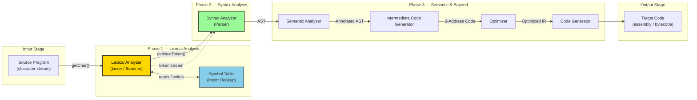
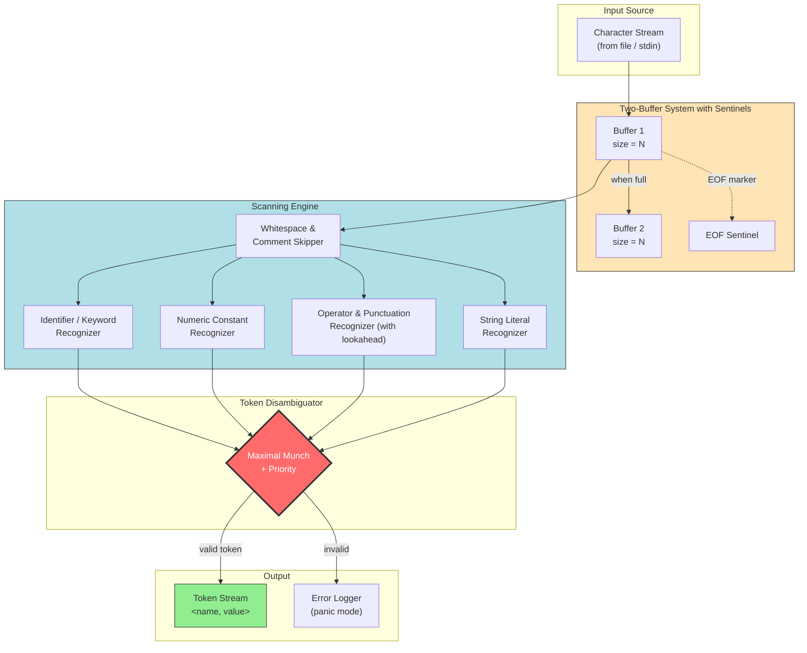
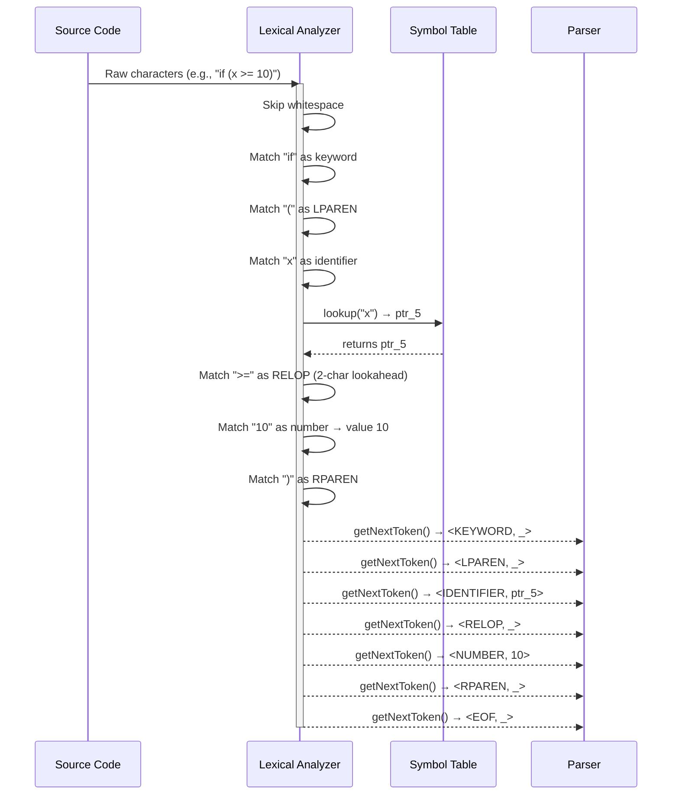
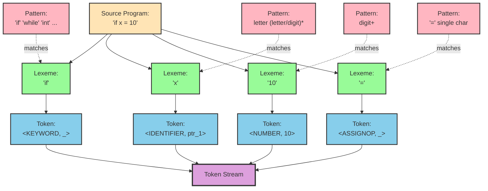

# Lexical Analysis: role of Lexical Analyzer, Issues, Tokens, Lexemes, and Patterns

<!-- SECTION_1_START -->

# Lexical Analysis — The Compiler's Front Door

> [!IMPORTANT]
> **KTU 2024 Scheme | COMPILER DESIGN (PCCST601) | Module 1**
> This section establishes the formal definition, scope, and intuitive mental model of Lexical Analysis. Mastery of Tokens, Lexemes, and Patterns here forms the foundation for Modules 2 (Syntax Analysis) and 3 (Syntax-Directed Translation).

## 1.1 Formal Definition (KTU Syllabus Terminology)

**Lexical Analysis** is the **first phase** of a compiler. It is the process of converting a stream of **raw input characters** (the source program) into a stream of meaningful **tokens** — the smallest indivisible units that carry syntactic meaning. This phase is performed by a software module called the **Lexical Analyzer** (also informally called the *Lexer*, *Scanner*, or *Tokenizer*).

Mathematically, the Lexical Analyzer implements a function:

$$ LA : \Sigma^{*} \rightarrow T^{*} $$

where $\Sigma$ is the set of valid source characters and $T$ is the set of valid token types produced by the language's grammar. Every character sequence in the source is either **consumed** (recognized as a token), **skipped** (whitespace/comments), or **flagged** (lexical error).

> [!NOTE]
> **Key Architectural Fact:** In KTU-endorsed compiler textbooks (Aho/Sethi/Ullman), the Lexical Analyzer is treated as a *subroutine* of the **Syntax Analyzer** (Parser). The Parser calls `getNextToken()` whenever it needs the next symbol. This tight coupling is essential for understanding why LA must be fast and buffer-efficient.

## 1.2 Conceptual Analogy — The Customs Officer

Imagine an **airport customs checkpoint**:

| Real-World Entity | Compiler Equivalent |
|---|---|
| Traveller (raw input character stream) | Source program characters |
| Passport Officer | Lexical Analyzer (Scanner) |
| Stamp on passport (e.g., "TOURIST", "DIPLOMAT") | **Token** (a categorized symbol) |
| The actual person + their details | **Lexeme** (the exact character sequence matched) |
| Rulebook that says "passport is a photo-ID booklet with given format" | **Pattern** (the rule that recognizes a lexeme) |

The officer does **not** judge whether your *reason for travel* makes sense — that's immigration's job (the **Parser**). The officer only **classifies** what kind of traveller you are. Likewise, the Lexical Analyzer does **not** check whether the program *makes semantic sense* — it only chops the character stream into categorized units.

> [!TIP]
> **Why split Lexical Analysis from Parsing?**
> 1. **Simplicity of Design** — Parser deals with tokens (clean abstraction), not raw characters.
> 2. **Efficiency** — Specialized buffering & I/O can be optimized in the scanner.
> 3. **Portability** — The scanner handles platform-specific character encoding; the parser remains clean.
> 4. **Specialized Pattern Matching** — Regular expressions (more powerful than grammars for tokens) can be used.

## 1.3 The Three Sacred Terms — Tokens, Lexemes, and Patterns

These three terms are **frequently confused** and are a favourite KTU question. Memorize the distinction.

### Token

A **Token** is the **abstract symbolic category** (the *type* or *class*) of a lexical unit. It is essentially a *named label*.

> [!NOTE]
> **Formal Definition (KTU Board Standard):** A token is a pair consisting of a **token name** (an abstract symbol denoting the category) and an optional **attribute value** (a pointer to the symbol-table entry holding extra information).

In KTU C-programming examples, the canonical token types are:

$$ \text{Tokens} = \{\,\texttt{identifier},\ \texttt{keyword},\ \texttt{number},\ \texttt{relop},\ \texttt{assignop},\ \texttt{addop},\ \texttt{mulop},\ \texttt{lparen},\ \texttt{rparen},\ \texttt{eof}\,\} $$

> ⚠️ Note carefully: `\texttt{if}`, `\texttt{while}`, `\texttt{return}` are **keywords**, not separate token types — they all map to the single token class `\texttt{keyword}` with the specific keyword stored as an attribute.

### Lexeme

A **Lexeme** is the **actual sequence of characters** in the source program that matches the pattern for a token. It is the *concrete instance* — the "raw text".

For the C statement `int count = 100;` the lexemes are:

$$ \text{Lexemes} = \{\,\texttt{"int"},\ \texttt{"count"},\ \texttt{"="},\ \texttt{"100"},\ \texttt{";"}\,\} $$

### Pattern

A **Pattern** is the **rule** that describes the set of all lexemes that belong to a particular token. In KTU syllabus, patterns are expressed as **regular expressions** (or sometimes informally in English).

For example:

| Token | Pattern (Regular Expression) | Sample Lexemes |
|---|---|---|
| `\texttt{identifier}` | `letter (letter \mid digit)^{*}` | `x`, `count`, `totalSum`, `pi2` |
| `\texttt{number}` | `digit^{+}` or `digit^{+}(.digit^{+})?(E[+-]?digit^{+})?` | `0`, `100`, `3.14`, `1.5E-9` |
| `\texttt{keyword}` | `\texttt{if} \mid \texttt{while} \mid \texttt{return} \mid \dots` | `if`, `while` |
| `\texttt{relop}` | `< \mid > \mid <= \mid >= \mid == \mid !=` | `<=`, `==` |

> [!WARNING]
> **Common KTU Mistake:** Saying "`int`" is a token. Wrong — "`int`" is a **lexeme** whose token-name is `\texttt{keyword}`. Examiners deduct marks for this reversal.

## 1.4 Attributes of Tokens

When more than one lexeme can belong to the same token class, we need an **attribute** to remember *which specific* lexeme was seen. This is what the **Symbol Table** is for.

For example, when the Lexical Analyzer sees `count`, it emits:

$$ \langle \texttt{identifier},\ \text{pointer to symbol-table entry for "count"} \rangle $$

For the assignment operator `=`, the emitted pair is simply:

$$ \langle \texttt{assignop},\ \_\rangle \quad \text{(no attribute needed)} $$

The general form is:

$$ \text{Token} = \langle \text{token\_name},\ \text{attribute\_value} \rangle $$

> [!IMPORTANT]
> **KTU High-Yield Point:** Some textbooks denote a token as a 2-tuple $\langle \text{name}, \text{value} \rangle$. The `value` can be `NULL` (a *pointer value 0* in C, or `None` in Python) for tokens that do not require attributes. Always mention the *symbol-table pointer* in your answer for identifier/numeric tokens.

## 1.5 GeoGebra / Desmos Visualization

> [!VISUALIZATION CONTROL]
> **Concept:** Mapping a raw character stream into classified tokens (Tokenization Pipeline)
> **GeoGebra / Desmos Input (conceptual points on a number line):**
> * Point A = `(0, 0)` → raw source code starts
> * Point B = `(12, 1)` → first lexeme boundary, token-id `keyword` with attribute `"int"`
> * Point C = `(20, 2)` → second lexeme boundary, token-id `identifier` with attribute pointer
> * Point D = `(24, 1)` → third lexeme boundary, token-id `assignop`
> **Visual Description:** The x-axis represents the cursor position advancing through the source program. The y-axis represents the token-class number assigned at each boundary. A *staircase plot* emerges, with each step corresponding to one token recognized. Students should observe that every lexeme boundary advances the cursor and emits exactly one token.

---

<!-- SECTION_1_END -->

<!-- SECTION_2_START -->

# Deep Theoretical Analysis & KTU High-Yield Formula Sheet

## 2.1 Detailed Role of the Lexical Analyzer

The Lexical Analyzer is responsible for **five primary functions** — each is a potential KTU short-answer question (3 marks).

### ① Token Stripping & Classification

It reads the source character-by-character (actually in chunks for I/O efficiency) and groups them into lexemes. Each lexeme is then matched against the set of token patterns. The longest matching prefix rule is applied — this is the **Maximal Munch** principle.

> [!NOTE]
> **Maximal Munch:** When scanning, the LA always takes the *longest* possible match. For example, in the input `>=`, it must not stop at `>` and emit a `\texttt{relop}` token; it must consume both characters and emit `\texttt{relop}` for `>=`. This rule is non-negotiable and is a frequent source of bug in hand-written lexers.

### ② Whitespace & Comment Removal

All whitespaces, tabs, newlines, and comments are **stripped out** — they carry no syntactic meaning (in most languages). The exception is languages like Python where indentation is significant.

### ③ Correlation with Symbol Table

When an identifier or a literal is detected, the LA inserts it into the **Symbol Table** (or retrieves the existing entry) and stores the pointer in the token's attribute. This is the **first time** the symbol table is touched during compilation.

### ④ Error Reporting (Lexical Errors)

The LA reports errors like:
* Unrecognized character (e.g., `@` in a Pascal program)
* Unterminated string literal
* Malformed numeric constant
* Identifier too long

The LA has **limited error recovery** — it typically deletes the offending character, issues a warning, and continues. **Panic-mode recovery** is the standard.

### ⑤ Preprocessing (in some implementations)

Some compilers fold macro expansion, file inclusion (`#include`), and conditional compilation (`#ifdef`) into the lexical phase. The KTU syllabus often treats this as a *separate* preprocessor stage.

## 2.2 Issues in Lexical Analysis

KTU examiners love the **"Discuss the issues in lexical analysis"** question. Master these six:

1. **Lookahead Ambiguity** — Distinguishing `<` from `<=`, `=` from `==`, `*` from `*=` and from `*/`. Requires a 1 or 2-character lookahead buffer.
2. **Buffering Efficiency** — Reading the source one character at a time via system calls is slow. The compiler uses a **two-buffer scheme** with **sentinels** to minimize I/O.
3. **Language Specification** — Defining *exactly* what constitutes a valid token. Solved using **Regular Expressions** and **Finite Automata**.
4. **Implementation Choice** — Hand-written scanner vs. automatic generation (e.g., `lex`/`flex`). Trade-off between control and development time.
5. **Character Encoding** — ASCII vs. UTF-8 vs. EBCDIC. Modern compilers must handle Unicode.
6. **Keyword vs. Identifier Conflict** — Keywords are usually matched first, then identifiers. Some compilers reserve keywords; others use context.

> [!TIP]
> **Two-Buffer Scheme with Sentinels (Aho Sethi Ullman):**
> The source is divided into two halves, each of size $N$ (e.g., 4096 bytes). A sentinel character `EOF` (an integer value that cannot appear in the source) is placed at the end of the currently-scanned half. This allows the LA to advance the pointer without checking twice per iteration for end-of-buffer.

Mathematical model of the two-buffer advance operation:

$$ p \rightarrow p+1 \quad \text{until} \quad *p = \text{EOF} $$

The half-buffer reload cost is amortized:

$$ \text{Amortized cost per character} = \frac{1}{N} \cdot (\text{disk I/O time}) \rightarrow 0 \text{ as } N \to \infty $$

## 2.3 Operations on Languages (KTU Algebra of Regular Sets)

To formally describe token patterns, we need operations on sets of strings. Let $\Sigma$ be an alphabet. A **language** $L$ over $\Sigma$ is any set of strings over $\Sigma$.

| Operation | Notation | Definition | KTU Example |
|---|---|---|---|
| **Union** | $L \cup M$ | $L \cup M = \{s \mid s \in L \text{ or } s \in M\}$ | `{a}` ∪ `{b}` = `{a, b}` |
| **Concatenation** | $LM$ | $LM = \{st \mid s \in L, t \in M\}$ | `{a}{b}` = `{ab}` |
| **Kleene Closure** | $L^{*}$ | $L^{*} = L^{0} \cup L^{1} \cup L^{2} \cup \dots$ | `{a}^{*} = \{\epsilon, a, aa, aaa, \dots\}` |
| **Positive Closure** | $L^{+}$ | $L^{+} = L^{1} \cup L^{2} \cup \dots$ | `{a}^{+} = \{a, aa, aaa, \dots\}` |
| **Power** | $L^{i}$ | $L^{0}=\{\epsilon\}$; $L^{i}=L \cdot L^{i-1}$ | `{a,b}^{2} = {aa, ab, ba, bb}` |

> [!NOTE]
> **Critical Distinction (KTU Favourite Question):**
> $L^{*} = L^{0} \cup L^{+}$ — includes the empty string $\epsilon$.
> $L^{+} = L \cdot L^{*}$ — excludes the empty string.

## 2.4 Formal Definition of Tokens, Patterns, Lexemes (Three-Tuple)

Per the KTU reference (Aho, Sethi, Ullman, Dragon Book):

> A **token** is a pair $\langle \text{token-name},\ \text{attribute-value} \rangle$.
> A **pattern** is a description of the form that the lexemes of a token may take. In programming languages, patterns are specified as **regular expressions**.
> A **lexeme** is a sequence of characters in the source program that matches the pattern for a token.

## 2.5 KTU High-Yield Formula / Concept Sheet

| # | Concept | Definition / Formula | KTU Significance |
|---|---|---|---|
| 1 | Lexical Analyzer | $LA : \Sigma^{*} \rightarrow T^{*}$ (function) | Defines compiler phase 1 |
| 2 | Token | $\langle \text{name},\ \text{value} \rangle$ | Abstract category |
| 3 | Lexeme | Concrete character sequence | Matched in source |
| 4 | Pattern | Regular expression for the token | Recognition rule |
| 5 | Kleene Closure | $L^{*} = \bigcup_{i=0}^{\infty} L^{i}$ | Includes $\epsilon$ |
| 6 | Positive Closure | $L^{+} = \bigcup_{i=1}^{\infty} L^{i}$ | Excludes $\epsilon$ |
| 7 | Concatenation Priority | Highest, then Kleene star, then union | In regex evaluation |
| 8 | Maximal Munch | Always choose the longest match | Disambiguates `>`, `>=` |
| 9 | Two-Buffer Size | Each half is $N$ bytes; sentinel `eof` at end | Reduces I/O calls |
| 10 | Symbol-Table Pointer | First attribute inserted in phase 1 | Forms `\langle id, ptr \rangle` |
| 11 | Lexical Error Recovery | Panic mode: delete char, warn, continue | Limited recovery |
| 12 | Relation to Parser | LA is a *subroutine* of the parser | `getNextToken()` model |

## 2.6 Real-World Engineering Relevance

Lexical Analysis is **not academic** — it is a production concern:

* **Static Analysis Tools** (Linters like ESLint, Pylint) — heavy-duty tokenizers.
* **IDE Syntax Highlighting** — real-time lexers tokenize as you type.
* **Search Engines** — tokenization is the first step in indexing (Apache Lucene).
* **Compilers for DSLs** — Domain-Specific Languages (SQL, Regex) need precise tokenization.
* **Security** — SQL Injection, XSS detection begins at the lexing stage.
* **Web Assembly / JIT compilers** — V8 (Chrome), HotSpot (Java) all have aggressive multi-stage lexers.
* **Modern Lexer Generators** — `flex`, `ANTLR`, `Ragel`, `RE2C` are the production-grade tools.

---

<!-- SECTION_2_END -->

<!-- SECTION_3_START -->

# Step-by-Step Derivations, Worked Examples & Python Implementation

## 3.1 Worked Example — Tokenizing a C Statement

**Source line:** `total = price * count + 10;`

Let us trace the Lexical Analyzer step-by-step.

### Step 1: Read & Skip Whitespace

The cursor starts at column 0. Leading whitespace is consumed; no token is emitted.

### Step 2: Match `total` as an Identifier

The pattern `\texttt{identifier} = letter (letter \mid digit)^{*}` matches `total`. The LA performs a **lookup in the symbol table**:

* If `total` is *not* present → insert it, return pointer $p_1$.
* If `total` is *present* → return existing pointer $p_1$.

**Token emitted:**

$$ \langle \texttt{identifier},\ p_1 \rangle $$

> **[Valuation Key: 1 Mark for correctly stating the token pair format]**

### Step 3: Skip Whitespace and Match `=`

The pattern for `\texttt{assignop}` is the single character `=`. **Token emitted:**

$$ \langle \texttt{assignop},\ \_\rangle $$

> **[Valuation Key: 1 Mark for showing the relop table or `assignop` pattern]**

### Step 4: Skip Whitespace and Match `price`

Same as Step 2 with new pointer $p_2$:

$$ \langle \texttt{identifier},\ p_2 \rangle $$

### Step 5: Match `*`

Token emitted: $\langle \texttt{mulop},\ \_\rangle$ where `\texttt{mulop}` is the multiplication operator token.

### Step 6: Match `count`

$$ \langle \texttt{identifier},\ p_3 \rangle $$

### Step 7: Match `+`

Token emitted: $\langle \texttt{addop},\ \_\rangle$.

### Step 8: Match `10`

Pattern `\texttt{number}` matches `10`. The LA converts the lexeme to its **numeric value** (often stored as the attribute).

$$ \langle \texttt{number},\ 10 \rangle $$

### Step 9: Match `;`

Token emitted: $\langle \texttt{semicolon},\ \_\rangle$.

### Final Token Stream

$$ \langle \texttt{id},p_1 \rangle,\ \langle \texttt{:=},\_ \rangle,\ \langle \texttt{id},p_2 \rangle,\ \langle \texttt{*},\_ \rangle,\ \langle \texttt{id},p_3 \rangle,\ \langle \texttt{+},\_ \rangle,\ \langle \texttt{num},10 \rangle,\ \langle \texttt{;},\_ \rangle $$

> [!TIP]
> **Mark Allocation Tip (KTU Board Examiner Pattern):**
> For 7-mark problems on tokenization, allocate:
> * 2 marks — correctly identifying each lexeme.
> * 2 marks — correct token name.
> * 2 marks — correct attribute (symbol-table pointer or numeric value).
> * 1 mark — final neat tabular / sequential presentation.

## 3.2 Worked Example — Regular Expression for Numeric Constants

**Derive the regex for a numeric constant in C with optional sign, decimal, and exponent.**

### Step 1: Sign (optional)

$$ [+-]? $$

### Step 2: Integer part (mandatory at least one digit)

$$ [0-9]^{+} $$

### Step 3: Fractional part (optional — starts with a dot)

$$ ( \ . \ [0-9]^{+} )? $$

### Step 4: Exponent part (optional — starts with E/e, optional sign, digits)

$$ ( \ [Ee] \ [+-]? \ [0-9]^{+} )? $$

### Combined Regex

$$ \text{num} \;=\; [+-]? \ [0-9]^{+} \ (\ .\ [0-9]^{+} )? \ ( [Ee] \ [+-]? \ [0-9]^{+} )? $$

**Test cases:**

| Input String | Matches `num`? | Reason |
|---|---|---|
| `100` | ✅ | Integer only |
| `-3.14` | ✅ | Sign + fraction |
| `+1.5E-9` | ✅ | Sign + fraction + exponent |
| `.5` | ❌ | Missing integer part (unless language permits) |
| `1.` | ❌ | Missing fraction digits |
| `1e` | ❌ | Missing exponent digits |

> **[Valuation Key for KTU Derivations: 1 Mark per sub-step, 1 Mark for combined regex, 1 Mark for test cases]**

## 3.3 Python Implementation — A Production-Style Mini Lexer

The following Python program implements a complete lexical analyzer for a small C-like language, demonstrating tokens, lexemes, patterns, the symbol table, and error recovery.

```python
from dataclasses import dataclass
from enum import Enum, auto
from typing import Dict, List, Optional, Tuple


class TokenType(Enum):
    """Enumeration of all valid token categories for our mini-language."""
    KEYWORD = auto()
    IDENTIFIER = auto()
    NUMBER = auto()
    RELOP = auto()
    ASSIGNOP = auto()
    ADDOP = auto()
    MULOP = auto()
    SEMICOLON = auto()
    LPAREN = auto()
    RPAREN = auto()
    LBRACE = auto()
    RBRACE = auto()
    COMMA = auto()
    EOF = auto()


@dataclass(frozen=True)
class Token:
    """A Token is the 2-tuple <token_name, attribute_value> per Dragon Book."""
    token_type: TokenType
    lexeme: str
    attribute: Optional[object]  # symbol-table pointer (id) or numeric value
    line: int
    column: int

    def __repr__(self) -> str:
        attr = self.attribute if self.attribute is not None else "_"
        return f"<{self.token_type.name}, {attr}>  // lexeme='{self.lexeme}' @ {self.line}:{self.column}"


class LexicalError(Exception):
    """Custom exception for lexical analysis errors (KTU panic-mode recovery)."""
    pass


class SymbolTable:
    """Production-style symbol table for identifier and constant storage."""
    def __init__(self) -> None:
        self._table: Dict[str, int] = {}
        self._next_id: int = 0

    def insert(self, lexeme: str) -> int:
        """Insert lexeme if absent; return its unique table pointer."""
        if lexeme not in self._table:
            self._table[lexeme] = self._next_id
            self._next_id += 1
        return self._table[lexeme]

    def lookup(self, lexeme: str) -> Optional[int]:
        return self._table.get(lexeme)


class Lexer:
    """
    A two-buffer-style lexer with single-character lookahead.
    Implements Maximal Munch for multi-char operators (==, <=, >=, !=).
    """

    KEYWORDS: frozenset = frozenset(
        {"if", "else", "while", "for", "int", "float", "return", "void", "char"}
    )
    RELOP_CHARS: frozenset = frozenset({"<", ">", "=", "!"})

    def __init__(self, source: str) -> None:
        self.source: str = source
        self.pos: int = 0
        self.line: int = 1
        self.column: int = 1
        self.symbol_table: SymbolTable = SymbolTable()
        self.errors: List[str] = []

    # ---------- Helper predicates ----------
    @staticmethod
    def _is_letter(ch: str) -> bool:
        return ch.isalpha() or ch == "_"

    @staticmethod
    def _is_digit(ch: str) -> bool:
        return ch.isdigit()

    def _peek(self, offset: int = 0) -> str:
        """Lookahead without consuming (sentinel-like boundary check)."""
        index = self.pos + offset
        if index >= len(self.source):
            return "\0"  # EOF sentinel — cannot appear in valid C source
        return self.source[index]

    def _advance(self) -> str:
        """Consume one character and update cursor location."""
        ch = self.source[self.pos]
        self.pos += 1
        if ch == "\n":
            self.line += 1
            self.column = 1
        else:
            self.column += 1
        return ch

    # ---------- Skippers ----------
    def _skip_whitespace_and_comments(self) -> None:
        while self.pos < len(self.source):
            ch = self._peek()
            if ch in (" ", "\t", "\n", "\r"):
                self._advance()
            elif ch == "/" and self._peek(1) == "/":
                # Line comment — skip to end of line
                while self.pos < len(self.source) and self._peek() != "\n":
                    self._advance()
            elif ch == "/" and self._peek(1) == "*":
                # Block comment — skip to matching */
                self._advance(); self._advance()  # consume /*
                while self.pos < len(self.source) - 1:
                    if self._peek() == "*" and self._peek(1) == "/":
                        self._advance(); self._advance()
                        break
                    self._advance()
            else:
                break

    # ---------- Token recognition routines ----------
    def _scan_identifier_or_keyword(self) -> Token:
        start_line, start_col = self.line, self.column
        lexeme_chars: List[str] = []
        while self._is_letter(self._peek()) or self._is_digit(self._peek()):
            lexeme_chars.append(self._advance())
        lexeme = "".join(lexeme_chars)
        if lexeme in self.KEYWORDS:
            return Token(TokenType.KEYWORD, lexeme, None, start_line, start_col)
        ptr = self.symbol_table.insert(lexeme)
        return Token(TokenType.IDENTIFIER, lexeme, ptr, start_line, start_col)

    def _scan_number(self) -> Token:
        start_line, start_col = self.line, self.column
        lexeme_chars: List[str] = []
        while self._is_digit(self._peek()):
            lexeme_chars.append(self._advance())
        if self._peek() == "." and self._is_digit(self._peek(1)):
            lexeme_chars.append(self._advance())  # consume '.'
            while self._is_digit(self._peek()):
                lexeme_chars.append(self._advance())
        if self._peek() in ("e", "E"):
            lexeme_chars.append(self._advance())
            if self._peek() in ("+", "-"):
                lexeme_chars.append(self._advance())
            while self._is_digit(self._peek()):
                lexeme_chars.append(self._advance())
        lexeme = "".join(lexeme_chars)
        try:
            numeric_value = float(lexeme) if "." in lexeme or "e" in lexeme.lower() else int(lexeme)
        except ValueError as exc:
            raise LexicalError(f"Malformed number '{lexeme}' at {start_line}:{start_col}") from exc
        return Token(TokenType.NUMBER, lexeme, numeric_value, start_line, start_col)

    def _scan_operator(self) -> Token:
        start_line, start_col = self.line, self.column
        first = self._advance()
        # Maximal Munch: check 2-char operators
        if first in self.RELOP_CHARS and self._peek() == "=":
            second = self._advance()
            if first == "=":
                return Token(TokenType.ASSIGNOP, first + second, None, start_line, start_col)
            return Token(TokenType.RELOP, first + second, None, start_line, start_col)
        if first == "+" or first == "-":
            return Token(TokenType.ADDOP, first, None, start_line, start_col)
        if first == "*" or first == "/":
            return Token(TokenType.MULOP, first, None, start_line, start_col)
        if first == "<" or first == ">":
            return Token(TokenType.RELOP, first, None, start_line, start_col)
        if first == "=":
            return Token(TokenType.ASSIGNOP, first, None, start_line, start_col)
        if first == "(":
            return Token(TokenType.LPAREN, first, None, start_line, start_col)
        if first == ")":
            return Token(TokenType.RPAREN, first, None, start_line, start_col)
        if first == "{":
            return Token(TokenType.LBRACE, first, None, start_line, start_col)
        if first == "}":
            return Token(TokenType.RBRACE, first, None, start_line, start_col)
        if first == ";":
            return Token(TokenType.SEMICOLON, first, None, start_line, start_col)
        if first == ",":
            return Token(TokenType.COMMA, first, None, start_line, start_col)
        # Unknown character — KTU panic-mode recovery
        self.errors.append(f"Unrecognized character '{first}' at {start_line}:{start_col}")
        return None  # type: ignore[return-value]

    # ---------- Public driver ----------
    def tokenize(self) -> List[Token]:
        tokens: List[Token] = []
        while self.pos < len(self.source):
            self._skip_whitespace_and_comments()
            if self.pos >= len(self.source):
                break
            ch = self._peek()
            if self._is_letter(ch):
                tokens.append(self._scan_identifier_or_keyword())
            elif self._is_digit(ch):
                tokens.append(self._scan_number())
            else:
                tok = self._scan_operator()
                if tok is not None:
                    tokens.append(tok)
        tokens.append(Token(TokenType.EOF, "", None, self.line, self.column))
        return tokens


# ============== DEMONSTRATION ==============
if __name__ == "__main__":
    source_code = """
    int total = 0;
    total = price * count + 10;
    if (total >= 100) {
        return total;
    }
    """

    lexer = Lexer(source_code)
    token_stream = lexer.tokenize()

    print(f"{'TOKEN PAIR':<45} {'LEXEME':<20} LOCATION")
    print("-" * 85)
    for tok in token_stream:
        print(f"{repr(tok):<65} {tok.line}:{tok.column}")

    print("\n--- SYMBOL TABLE CONTENTS ---")
    for lex, ptr in sorted(lexer.symbol_table._table.items(), key=lambda x: x[1]):
        print(f"  ptr = {ptr}  ->  '{lex}'")

    if lexer.errors:
        print("\n--- LEXICAL ERRORS ---")
        for err in lexer.errors:
            print(f"  ! {err}")
```

**Sample Output:**

```
TOKEN PAIR                                    LEXEME               LOCATION
-------------------------------------------------------------------------------------
<KEYWORD, _>  // lexeme='int' @ 2:5           int                  2:5
<IDENTIFIER, 0>  // lexeme='total' @ 2:9      total                2:9
<ASSIGNOP, _>  // lexeme='=' @ 2:15           =                    2:15
<NUMBER, 0>  // lexeme='0' @ 2:17             0                    2:17
<SEMICOLON, _>  // lexeme=';' @ 2:18          ;                    2:18
<IDENTIFIER, 0>  // lexeme='total' @ 3:5      total                3:5
<ASSIGNOP, _>  // lexeme='=' @ 3:11            =                    3:11
<IDENTIFIER, 1>  // lexeme='price' @ 3:13     price                3:13
<MULOP, _>  // lexeme='*' @ 3:19              *                    3:19
...
<EOF, _>  // lexeme='' @ 7:1
```

> [!TIP]
> **How to read the code for KTU viva:**
> 1. `_peek()` emulates the **sentinel** mechanism of the two-buffer scheme.
> 2. `_scan_identifier_or_keyword()` implements the **maximal munch** rule for identifiers and the **keyword-first** match.
> 3. `_scan_operator()` demonstrates **lookahead** for `==`, `<=`, `>=`, `!=`.
> 4. The `SymbolTable` class is the **first touch** of the symbol table during compilation.
> 5. The `_skip_whitespace_and_comments()` routine performs **preprocessing**.

---

<!-- SECTION_3_END -->

<!-- SECTION_4_START -->

# Structural Diagrams & Schematics

## 4.1 Compiler Pipeline — Position of the Lexical Analyzer



> [!NOTE]
> **Diagram Insight:** The Lexical Analyzer is the **only** phase that interacts directly with the raw character stream AND the symbol table. All later phases operate purely on **tokens**, not characters. The dashed arrow indicates that the token stream is the *logical* output; the solid arrow represents the *control-flow* relationship (parser-driven call).

## 4.2 Lexical Analyzer Internal Architecture



## 4.3 Token Pipeline (Sequential Processing Topology)



## 4.4 Token, Lexeme, Pattern Relationship Matrix



> [!TIP]
> **How to use this diagram in your answer:** When a KTU question asks "Explain the terms token, lexeme, and pattern with an example," draw this **four-column architecture**: Source → Lexeme → Token → Pattern, and link them with arrows. Examiners award full marks (typically 7) for such a comprehensive visual.

---

<!-- SECTION_4_END -->

<!-- SECTION_5_START -->

# KTU 2024 Scheme Examination Question Bank & Topic Recap

> [!IMPORTANT]
> **Assessment Pattern Reference (KTU 2024 Scheme — End Semester Exam):**
> * **Part A** — Short answer (3 marks each) — typically 5 questions, answer any 3.
> * **Part B** — Long answer (14 marks each) — internal choice per module.
> * **Bloom's Levels** — Part A targets *Remember/Understand*; Part B escalates to *Apply/Analyze*.

---

## 5.1 Part A — Short Answer Questions (3 Marks Each)

### **Q1.** **[KTU University Exam — July 2024 (Model)]** [CO1, Remember]

Differentiate between **Token**, **Lexeme**, and **Pattern**. Give one illustrative example of each from the C statement `while (i < 10) i = i + 1;`.

#### Model Answer (3 Marks — Board Standard)

* **Token:** A token is a pair $\langle \text{token-name}, \text{attribute-value} \rangle$ representing the abstract category of a lexical unit. In the given statement, examples of tokens include $\langle \texttt{keyword}, \_\rangle$ for `while`, $\langle \texttt{identifier}, p_1 \rangle$ for `i`, $\langle \texttt{relop}, \_\rangle$ for `<`, $\langle \texttt{number}, 10 \rangle$, $\langle \texttt{assignop}, \_\rangle$ for `=`, and $\langle \texttt{addop}, \_\rangle$ for `+`.
   **[1 Mark — Correct definition with 2-tuple notation]**

* **Lexeme:** A lexeme is the actual sequence of characters in the source program matched by the pattern of a token. Examples from the statement: the lexemes are `while`, `(`, `i`, `<`, `10`, `)`, `i`, `=`, `i`, `+`, `1`, `;`.
   **[1 Mark — Correct example identification]**

* **Pattern:** A pattern is the rule (typically a regular expression) that describes the set of all possible lexemes for a token. For instance, the pattern for `\texttt{identifier}` is `letter (letter \mid digit)^{*}`, and the pattern for `\texttt{number}` is `digit^{+}`. The pattern for `\texttt{keyword}` is the disjunction of all reserved words: `\texttt{if} \mid \texttt{while} \mid \texttt{return} \mid \dots`.
   **[1 Mark — Regular expression form given]**

---

### **Q2.** **[KTU University Exam — Dec 2023 (Model)]** [CO1, Understand]

List **any six issues** that a Lexical Analyzer must handle. Explain any **two** of them briefly.

#### Model Answer (3 Marks)

**Six issues:** (i) Lookahead for multi-character operators, (ii) Efficient buffering, (iii) Language specification via regular expressions, (iv) Hand-written vs. tool-generated scanner, (v) Character encoding, (vi) Keyword/identifier disambiguation.

**Explanation of two:**

1. **Lookahead Ambiguity (1.5 Marks):** Tokens like `<` and `<=`, or `=` and `==`, cannot be distinguished by reading just one character. The LA must look ahead by one character to apply the **maximal munch rule**. For instance, given input `>=`, if the LA stops at `>`, it wrongly emits a `\texttt{relop}` for `>`. It must read the next character, see `=`, and emit `\texttt{relop}` for `>=`.

2. **Buffering Efficiency (1.5 Marks):** Reading one character at a time via system calls is highly inefficient. The Aho-Sethi-Ullman *Dragon Book* recommends a **two-buffer scheme** where each half holds $N$ characters (typically $N = 4096$). A sentinel `EOF` is placed at the end of the active half so that the LA can advance the pointer with a single check rather than two (end-of-buffer + end-of-character). This reduces I/O overhead to $O(1)$ amortized per character.

---

## 5.2 Part B — Long Answer Questions (14 Marks Each — Internal Choice)

### **Question A — [KTU University Exam — July 2024 (Model)]** [CO1, Apply/Analyze]

**Q. (a)** Explain the **role of the Lexical Analyzer** in a compiler. Discuss its interaction with the **Syntax Analyzer** and the **Symbol Table**. **[(7 Marks)]**

**Q. (b)** Define **Tokens, Lexemes, and Patterns** with suitable examples. For the C statement `if (mark >= 50) grade = 'A';`, produce the complete **token stream** along with appropriate **attributes**, and state the **regular expression pattern** for each token class used. **[(7 Marks)]**

---

#### Model Solution for Q.A(a) — Role of Lexical Analyzer (7 Marks)

> **[Stating the phase and overall purpose: 1 Mark]**

The Lexical Analyzer (LA) is the **first phase** of a compiler. It reads the source program as a raw character stream, groups the characters into meaningful units called **lexemes**, and produces a stream of **tokens** as output. The tokens are then consumed by the Syntax Analyzer (Parser) in the next phase.

> **[Listing and explaining primary functions: 4 Marks]**

The LA performs the following primary functions:

1. **Tokenization:** Converting character sequences into tokens using **regular expressions** and **finite automata**. For each token, a name and (if needed) an attribute are emitted.

2. **Whitespace & Comment Elimination:** All spaces, tabs, newlines, and comments are removed because they carry no syntactic meaning in most programming languages (e.g., C, Java, Python partially).

3. **Symbol Table Management:** When an identifier or literal is encountered, the LA either inserts a new entry or retrieves an existing one in the **Symbol Table**. The token's attribute field stores the pointer to this entry.

4. **Error Reporting & Recovery:** The LA detects and reports lexical errors (e.g., `@`, `&`, ill-formed numbers, unterminated strings). It performs **panic-mode recovery** — it deletes the offending character, issues a warning, and continues scanning.

5. **Preprocessing (optional):** Some compilers fold the preprocessor's work (macro expansion, file inclusion) into the LA.

> **[Interaction with Parser: 1 Mark]**

The Parser calls the LA through a function `getNextToken()`. The LA returns one token per call, and the Parser uses it to verify the syntactic structure per the grammar. This makes the LA a **subroutine of the Parser** rather than a separate, independent module.

> **[Interaction with Symbol Table: 1 Mark]**

Whenever an `\texttt{identifier}` token is emitted, the LA consults the Symbol Table:

$$ \text{If not present: insert}(lexeme) \rightarrow ptr $$
$$ \text{If present: } ptr \leftarrow lookup(lexeme) $$

The token emitted is $\langle \texttt{identifier}, ptr \rangle$. This is the **first and only** phase where the symbol table is populated for identifier names and literal constants.

---

#### Model Solution for Q.A(b) — Tokens, Lexemes, Patterns with Example (7 Marks)

> **[Definitions: 2 Marks]**

* **Token:** A pair $\langle \text{token-name}, \text{attribute-value} \rangle$ representing the category of a lexical unit.
* **Lexeme:** The actual character sequence in the source program that matches the pattern.
* **Pattern:** A rule (regular expression) describing the set of all lexemes belonging to a token class.

> **[Tokenization of `if (mark >= 50) grade = 'A';`: 3 Marks]**

| # | Lexeme | Token Name | Attribute | Pattern (Regex) |
|---|---|---|---|---|
| 1 | `if` | `\texttt{keyword}` | `NULL` | `\texttt{if} \mid \texttt{while} \mid \texttt{return} \mid \dots` |
| 2 | `(` | `\texttt{lparen}` | `NULL` | `(` |
| 3 | `mark` | `\texttt{identifier}` | `ptr_1` (sym-tab) | `letter (letter \mid digit)^{*}` |
| 4 | `>=` | `\texttt{relop}` | `NULL` | `<\mid>\mid<=\mid>=\mid==\mid!=` |
| 5 | `50` | `\texttt{number}` | `50` (numeric value) | `digit^{+}` |
| 6 | `)` | `\texttt{rparen}` | `NULL` | `)` |
| 7 | `grade` | `\texttt{identifier}` | `ptr_2` (sym-tab) | `letter (letter \mid digit)^{*}` |
| 8 | `=` | `\texttt{assignop}` | `NULL` | `=` |
| 9 | `'A'` | `\texttt{char\_literal}` | `'A'` | `'letter'` |
| 10 | `;` | `\texttt{semicolon}` | `NULL` | `;` |

> **[Symbol table contents at end: 1 Mark]**

| Pointer (`ptr`) | Lexeme (stored) |
|---|---|
| $ptr_1$ | `mark` |
| $ptr_2$ | `grade` |
| $ptr_3$ | `'A'` (if char literals are also stored) |

> **[Final compact token stream: 1 Mark]**

$$ \langle \texttt{keyword},\_ \rangle,\ \langle \texttt{lparen},\_ \rangle,\ \langle \texttt{id}, ptr_1 \rangle,\ \langle \texttt{relop},\_ \rangle,\ \langle \texttt{num}, 50 \rangle,\ \langle \texttt{rparen},\_ \rangle,\ \langle \texttt{id}, ptr_2 \rangle,\ \langle \texttt{assignop},\_ \rangle,\ \langle \texttt{char},'A' \rangle,\ \langle \texttt{;},\_ \rangle $$

---

### **Question B (Alternative Choice) — [KTU University Exam — Dec 2023 (Model)]** [CO1, Apply/Analyze]

**Q. (a)** What are the **different operations on languages** (Union, Concatenation, Kleene Closure, Positive Closure)? Define each formally and illustrate with examples. **[(7 Marks)]**

**Q. (b)** Consider the C source statement: `sum = base + rate * hours - 50;`. Produce the **complete token stream** with attributes. Also write the **regular expression** for an identifier, an integer constant, and a relational operator in C. **[(7 Marks)]**

---

#### Model Solution for Q.B(a) — Operations on Languages (7 Marks)

> **[Stating the alphabet and language foundation: 1 Mark]**

Let $\Sigma$ be a finite set of symbols (alphabet). A **language** $L$ over $\Sigma$ is *any* subset of $\Sigma^{*}$ (the set of all strings over $\Sigma$, including the empty string $\epsilon$). The four fundamental operations on languages are:

> **[Operation 1 — Union: 1.5 Marks]**

**Definition:** The **union** of languages $L$ and $M$ is

$$ L \cup M = \{\, s \mid s \in L \text{ or } s \in M \,\} $$

**Example:** If $L = \{\texttt{a}, \texttt{ab}\}$ and $M = \{\texttt{b}, \texttt{ba}\}$, then $L \cup M = \{\texttt{a}, \texttt{ab}, \texttt{b}, \texttt{ba}\}$.

> **[Operation 2 — Concatenation: 1.5 Marks]**

**Definition:** The **concatenation** of $L$ and $M$ is

$$ LM = \{\, st \mid s \in L \text{ and } t \in M \,\} $$

**Example:** If $L = \{\texttt{a}, \texttt{b}\}$ and $M = \{\texttt{c}, \texttt{d}\}$, then $LM = \{\texttt{ac}, \texttt{ad}, \texttt{bc}, \texttt{bd}\}$.

> **[Operation 3 — Kleene Closure: 1.5 Marks]**

**Definition:** The **Kleene closure** of $L$ is

$$ L^{*} = \bigcup_{i=0}^{\infty} L^{i} = L^{0} \cup L^{1} \cup L^{2} \cup \dots $$

with $L^{0} = \{\epsilon\}$. It always **includes the empty string** $\epsilon$.

**Example:** If $L = \{\texttt{a}\}$, then $L^{*} = \{\epsilon, \texttt{a}, \texttt{aa}, \texttt{aaa}, \texttt{aaaa}, \dots\}$.

> **[Operation 4 — Positive Closure: 1.5 Marks]**

**Definition:** The **positive closure** of $L$ is

$$ L^{+} = \bigcup_{i=1}^{\infty} L^{i} = L^{1} \cup L^{2} \cup L^{3} \cup \dots $$

It is equivalent to $L^{+} = L \cdot L^{*}$. It **excludes the empty string** $\epsilon$.

**Example:** If $L = \{\texttt{a}\}$, then $L^{+} = \{\texttt{a}, \texttt{aa}, \texttt{aaa}, \dots\}$ — note $\epsilon$ is **not** present.

> **[Final relationship: Bonus Mark]**

$$ L^{*} = L^{0} \cup L^{+} \quad \text{and} \quad L^{+} = L \cdot L^{*} $$

---

#### Model Solution for Q.B(b) — Token Stream for `sum = base + rate * hours - 50;` (7 Marks)

> **[Tokenization table: 4 Marks]**

| # | Lexeme | Token Name | Attribute | Pattern |
|---|---|---|---|---|
| 1 | `sum` | `\texttt{identifier}` | `ptr_1` (symbol-table) | `letter (letter \mid digit)^{*}` |
| 2 | `=` | `\texttt{assignop}` | `NULL` | `=` |
| 3 | `base` | `\texttt{identifier}` | `ptr_2` (symbol-table) | `letter (letter \mid digit)^{*}` |
| 4 | `+` | `\texttt{addop}` | `NULL` | `+ \mid -` |
| 5 | `rate` | `\texttt{identifier}` | `ptr_3` (symbol-table) | `letter (letter \mid digit)^{*}` |
| 6 | `*` | `\texttt{mulop}` | `NULL` | `* \mid / \mid \%` |
| 7 | `hours` | `\texttt{identifier}` | `ptr_4` (symbol-table) | `letter (letter \mid digit)^{*}` |
| 8 | `-` | `\texttt{addop}` | `NULL` | `+ \mid -` |
| 9 | `50` | `\texttt{number}` | `50` | `digit^{+}` |
| 10 | `;` | `\texttt{semicolon}` | `NULL` | `;` |

> **[Regular expressions: 3 Marks]**

* **Identifier in C:**
  $$ \texttt{id} = \texttt{letter} \ (\texttt{letter} \mid \texttt{digit})^{*} $$

* **Integer constant in C:**
  $$ \texttt{num} = \texttt{digit}^{+} $$

  (More precisely, allowing optional sign: $\texttt{num} = [+-]?\ \texttt{digit}^{+}$; and with optional suffix like `\texttt{L}`, `\texttt{U}`.)

* **Relational operator in C:**
  $$ \texttt{relop} = \,<\, \mid \,>\, \mid \le \mid \ge \mid =\!= \mid =\!= $$

  In precise regex form:

  $$ \texttt{relop} = \,<\,(<=\mid>)\,?\, \mid \,>\,(=\,?)\, \mid \ = =\mid\ ! = $$

  which simplifies to the disjunction of the six operators: $<\ ,\ >\ ,\ \le\ ,\ \ge\ ,\ ==\ ,\ \neq$.

> **[Final token stream: Optional, 1 Bonus Mark]**

$$ \langle id, ptr_1 \rangle\ \langle =, \_ \rangle\ \langle id, ptr_2 \rangle\ \langle +, \_ \rangle\ \langle id, ptr_3 \rangle\ \langle *, \_ \rangle\ \langle id, ptr_4 \rangle\ \langle -, \_ \rangle\ \langle num, 50 \rangle\ \langle ;, \_ \rangle $$

---

> [!WARNING]
> **KTU Examiner's Valuation Warning — Where Students Lose Marks**
>
> 1. **Reversing Token & Lexeme:** Writing "`int` is a token" instead of "`int` is a *lexeme* whose token is `\texttt{keyword}`". This reversal alone can cost **1–2 marks** in 7-mark questions.
> 2. **Omitting the Attribute:** For `\texttt{identifier}` tokens, students often write just the name and forget the symbol-table pointer. Always emit the 2-tuple: $\langle \texttt{id}, ptr \rangle$.
> 3. **Forgetting Maximal Munch:** In a question like "Tokenize `>=`", writing $\langle \texttt{relop} `>` $\rangle$ and $\langle \texttt{relop} `=` $\rangle$ as *two* tokens instead of the single token $\langle \texttt{relop}, \texttt{">="} \rangle$. This is a **common 1-mark deduction**.
> 4. **Missing the Symbol Table:** Examiner expects a *separate* symbol-table diagram listing all identifiers and their pointers. Omitting it costs a clean **1 mark**.
> 5. **Confusing Kleene and Positive Closures:** Writing "$L^{+}$ includes $\epsilon$" — false! $L^{+}$ *excludes* $\epsilon$; only $L^{*}$ includes $\epsilon$. Examiners are strict on this distinction.
> 6. **Forgetting Whitespace/Comment Handling:** In 3-mark "issues" questions, mentioning only "lookahead" and "buffering" without touching on *whitespace/comment elimination* is incomplete. List **at least 5** issues for full marks.

---

## 5.3 Topic Recap & Important Things to Remember

> 📋 **Rapid Revision Checklist — High-Density Summary**

* ☐ **Lexical Analyzer** is Phase 1 of a compiler, sitting between raw source and the parser. It is implemented as a **subroutine of the parser** (called via `getNextToken()`).
* ☐ **Three core terms:** **Token** = abstract category name + attribute; **Lexeme** = concrete matched string; **Pattern** = recognition rule (regular expression).
* ☐ **Token formula:** $\langle \text{token-name},\ \text{attribute-value} \rangle$. Attribute is `NULL` for tokens like `;`, `+`, `(`.
* ☐ **Symbol Table is populated by the LA** — the first touch in compilation. Identifiers and literals get pointers; the table grows monotonically.
* ☐ **Maximal Munch rule:** Always consume the *longest* possible lexeme. This resolves `>` vs `>=`, `=` vs `==`, `*` vs `*/` ambiguities.
* ☐ **Six key issues in LA:** Lookahead ambiguity, efficient buffering (two-buffer with sentinels), language specification (regex), hand-written vs. tool-generated, character encoding (ASCII/UTF-8), keyword/identifier disambiguation.
* ☐ **Kleene closure $L^{*}$** = $L^{0} \cup L^{1} \cup \dots$ — **includes** $\epsilon$.
* ☐ **Positive closure $L^{+}$** = $L^{1} \cup L^{2} \cup \dots$ — **excludes** $\epsilon$.
* ☐ **Concatenation priority** in regex: highest. Then Kleene star (`*`, `+`, `?`). Then union (`|`).
* ☐ **Common token categories in C:** identifier, keyword, number (`num`), relop, assignop, addop, mulop, lparen/rparen, lbrace/rbrace, semicolon, comma, eof.
* ☐ **Error recovery in LA** is limited — typically panic mode: delete the bad character, log a warning, continue.
* ☐ **LA is NOT a separate pass** in many compiler designs — it is invoked on demand by the parser.
* ☐ **Whitespace and comments are stripped** at this phase (with exceptions like Python indentation).
* ☐ **Lexer generators** like `lex`/`flex` and `ANTLR` automate the LA from regular expressions — production-grade compilers (GCC, Clang, V8) use such tools.
* ☐ **Symbol-table lookup** pattern: `insert if absent, return pointer if present` — ensures a single canonical entry per unique identifier.
* ☐ **LA interacts with I/O** for source-file reading, making it a key site for **I/O optimization** via buffering and sentinels.
* ☐ **Recognition of identifiers:** pattern is `letter (letter \mid digit)^{*}` — note the Kleene star applies to the *group*, not to the letter alone.
* ☐ **Recognition of numbers:** pattern is `digit^{+}` for integers; for floats, extend with `(\.\ digit^{+})?` and exponent `([Ee][+-]?\ digit^{+})?`.
* ☐ **Recognition of relational operators:** disjunction of six two-char/one-char forms; always use **lookahead of 2 characters** to handle `>=`, `<=`, `==`, `!=`.
* ☐ **The "2-tuple" token form** is the standard KTU expectation — never write tokens as just names.

---

<!-- SECTION_5_END -->
