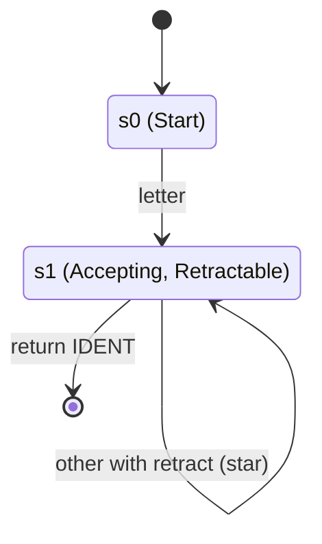
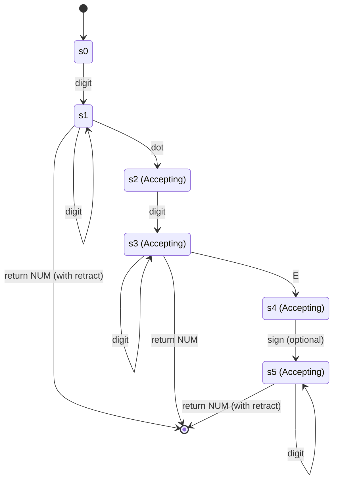
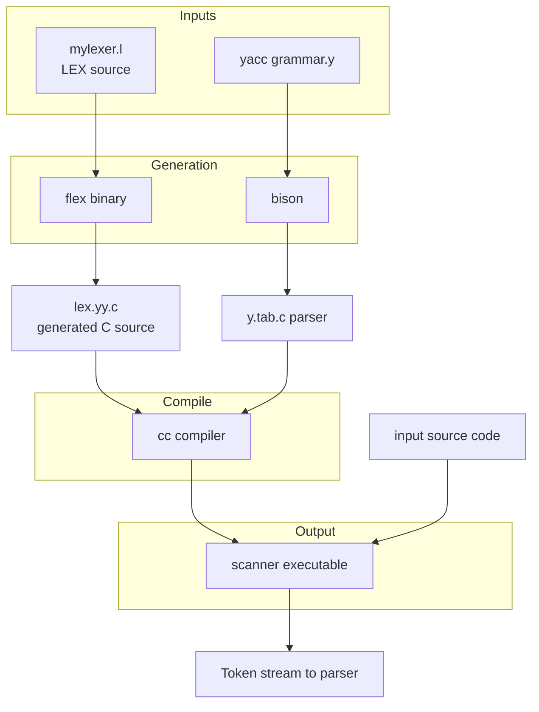
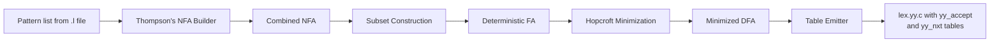
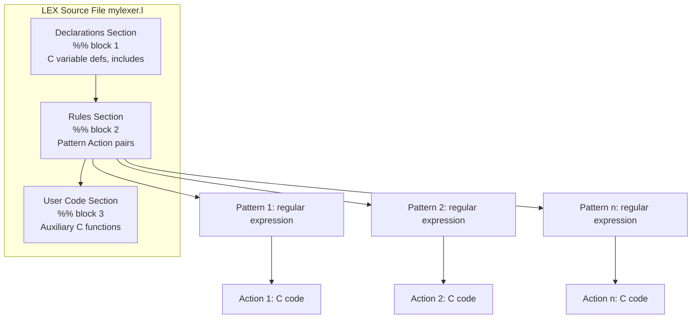
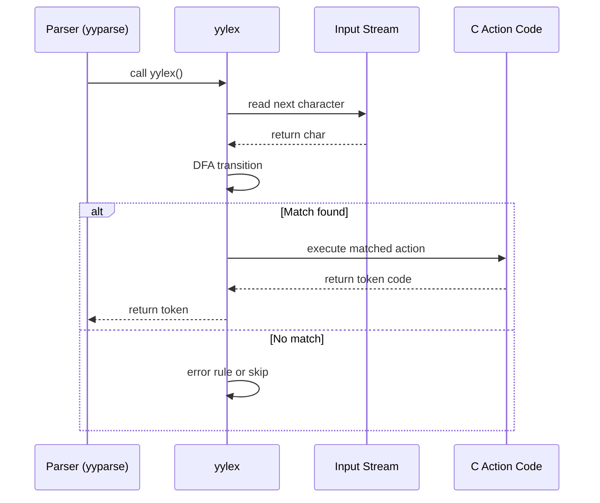

# Recognition of Tokens: Transition diagrams, Lexical Analyzer Generator tools (LEX/FLEX)

<!-- SECTION_1_START -->
# Recognition of Tokens: Transition Diagrams & LEX/FLEX

## 1.1 Formal Academic Definition (KTU 2024 Syllabus Terminology)

In Compiler Design, **Token Recognition** is the second phase of a Lexical Analyzer, where the scanner, having buffered the input characters, must *match* the character sequence against predefined **patterns (regular expressions)** and return the appropriate **lexeme-token pair** to the parser. The KTU 2024 syllabus (PCCST601, Module 1) mandates that students master two principal implementation strategies:

1. **Transition Diagrams (Finite Automata Approach)** — a hand-crafted, state-machine-based recognition mechanism where each token class is modeled as a directed graph of states connected by edges labeled with character classes.
2. **Lexical Analyzer Generator Tools (LEX / FLEX)** — automated tools that translate declarative regular-expression specifications into the underlying C source code of a complete lexical analyzer.

> [!IMPORTANT]
> **Syllabus Highlight (PCCST601 / Module 1):** The transition diagram is the *theoretical bridge* between the regular expression (pattern) and its concrete implementation. **LEX (1975, Lesk & Schmidt)** and its GNU successor **FLEX (Fast LEX)** translate a high-level specification into a `lex.yy.c` program that internally uses a deterministic finite automaton.

## 1.2 Intuitive Overview & Real-World Analogy

Imagine a **bouncer at a nightclub entrance**. The bouncer has a mental flowchart:

> *"If the person shows a valid photo ID starting with a letter, then a sequence of letters/digits, ending at a space or punctuation → admit as a Member. If the digits look like 09xxxxxxxxxx → admit as a Phone. Otherwise → reject or call a handler."*

That flowchart is essentially a **transition diagram**. Each **state** is a checkpoint, and each **transition edge** is a question asked about the next character.

**LEX/FLEX** is like giving the bouncer a *printed rulebook* (your `.l` file) and watching the *compiler* convert that rulebook into a fully trained bouncer (the generated `lex.yy.c` file). The bouncer then processes a long queue (input source code) at lightning speed.

### GeoGebra / Desmos Visualization

> [!VISUALIZATION CONTROL]
> **Concept:** Recognition state-space for a token pattern `letter (letter | digit)*`
> **Desmos Input Equations (state points on a number line representing buffer positions):**
> * Point A: $(0, 1)$ — Start State
> * Point B: $(1, 1)$ — Read first letter (accepting intermediate)
> * Point C: $(2, 1), (3, 1), \dots$ — Loop on letter/digit (accepting)
> * Point D: $(4, 1)$ — Retract / Return token boundary
>
> **Visual Description:** Plot the integer $x$-axis as the *buffer index*. Each marked point denotes a *state* the scanner can be in while reading. Notice the **looping behavior** of state C — this is what allows identifiers of *arbitrary length* to be recognized.

> [!NOTE]
> **Key Insight:** Every regular expression $R$ corresponds to a **Nondeterministic Finite Automaton (NFA)** by **Thompson's Construction (1968)**, which can then be determinized into a **DFA** via the **Subset Construction** — this is exactly what LEX/FLEX performs internally.

---

<!-- SECTION_1_END -->

<!-- SECTION_2_START -->
# Deep Theoretical Analysis & KTU High-Yield Formula Sheet

## 2.1 Anatomy of a Transition Diagram

A transition diagram $\mathcal{D}$ is a quintuple:

$$\mathcal{D} = (S, \Sigma, \delta, s_0, S_F)$$

where:

* $S$ = finite set of **states**
* $\Sigma$ = finite set of **input symbols** (character classes like `letter`, `digit`)
* $\delta : S \times (\Sigma \cup \{\epsilon\}) \rightarrow 2^S$ = **transition function**
* $s_0 \in S$ = **start state** (denoted by an unattached incoming arrow)
* $S_F \subseteq S$ = set of **accepting (final) states** (denoted by double circles)

### Reserved Symbols in KTU-Standard Transition Diagrams

| Symbol | Meaning | KTU Convention |
| :--- | :--- | :--- |
| $\rightarrow$ | Start arrow into $s_0$ | Unattached incoming arrow |
| $\bigcirc$ | Normal (non-accepting) state | Single circle |
| $\bigodot$ | Accepting state | Double circle |
| $*$ (asterisk) on a state | **Retract / backup** the lookahead one position | Used when an over-read has occurred |
| $\dashv$ | End-of-file / end-of-input marker | Sentinel transition |

## 2.2 Step-by-Step Construction Logic

1. **Buffering:** The scanner fetches the next character using `getchar()`-style primitives. The lookahead pointer advances *before* the character is examined.
2. **State Entry:** A start state $s_0$ is entered based on the **first character's class** (e.g., a letter routes to the *identifier* diagram; a digit to the *number* diagram).
3. **Edge Traversal:** Each character class (e.g., *letter*, *digit*, *whitespace*) has its own edge.
4. **Acceptance & Retract:** Upon reaching an accepting state $s \in S_F$, the lexeme is bounded. If the most recent transition over-read, the scanner **retracts** the input pointer by one position — a *retract action* $(*)$.
5. **Token Return:** The lexeme is passed to the parser as a `<token_type, attribute_value>` pair.

## 2.3 The Three Canonical Diagrams (KTU High-Yield)

### A. Identifier Recognition (Standard Pattern: `letter (letter | digit)*`)

States involved: $s_0$ (start), $s_1$ (accepting + retractable).

**Transition Rules:**

* $\delta(s_0, \text{letter}) = s_1$
* $\delta(s_1, \text{letter}) = s_1$  (loop)
* $\delta(s_1, \text{digit}) = s_1$   (loop)
* $\delta(s_1, \text{other}) = s_1$   (with retract)

### B. Unsigned Integer Recognition (Pattern: `digit+`)

* $\delta(s_0, \text{digit}) = s_1$
* $\delta(s_1, \text{digit}) = s_1$   (loop with retract on leaving)

### C. Reserved Keyword vs. Identifier

After matching an identifier, the lexeme is **looked up** in a symbol table of reserved words. If found, the token class is changed from `IDENTIFIER` to the specific `KEYWORD` (e.g., `if`, `while`).

## 2.4 LEX / FLEX — Theory of Operation

**LEX** (originally written by **M. E. Lesk** and **E. Schmidt** in 1975) and its modern GNU open-source counterpart **FLEX** are *table-driven* lexical analyzer generators. The pipeline is:

$$\text{`.l' Source} \xrightarrow{\text{LEX/FLEX}} \text{NFA} \xrightarrow{\text{Subset Construction}} \text{DFA} \xrightarrow{\text{DFA Minimization}} \text{Optimized DFA} \xrightarrow{\text{Table Generation}} \text{lex.yy.c}$$

The generated `lex.yy.c` exports a single entry point:

```c
int yylex(void);
```

When invoked (typically by a **YACC/Bison**-generated parser via `yyparse()`), it repeatedly reads input via the user-overridable function:

```c
int yyinput(void);   // or equivalently int getchar(void) by default
```

## 2.5 KTU Formula Sheet / Cheat Sheet

| # | Concept | Formula / Notation | Notes |
| :--- | :--- | :--- | :--- |
| 1 | Transition Diagram | $\mathcal{D} = (S, \Sigma, \delta, s_0, S_F)$ | Formal automaton |
| 2 | Identifier Pattern | $\text{letter} \cdot (\text{letter} \mid \text{digit})^*$ | Kleene star closure |
| 3 | Number Pattern | $\text{digit}^+ (\, . \text{digit}^+ \, )? ( E (+ \mid -)? \text{digit}^+ )?$ | Optional fractional & exponent parts |
| 4 | Number of States (identifier) | $n_s = 2$ | $s_0$ and $s_1$ (final) |
| 5 | LEX Output File | $\text{lex.yy.c}$ | Compiled via `cc lex.yy.c -o scanner -ll` |
| 6 | LEX Default Library | `-ll` or `-lfl` | FLEX compatibility library |
| 7 | Match Length | $\vert lexeme \vert$ | The number of input chars consumed |
| 8 | Retract Operation | $\text{input\_ptr} \leftarrow \text{input\_ptr} - 1$ | On over-read |
| 9 | NFA $\rightarrow$ DFA States | $2^{\vert S_{NFA} \vert}$ | Subset construction upper bound |
| 10 | yytext | `char *yytext;` | Holds the matched lexeme text |
| 11 | yyleng | `int yyleng;` | Length of the matched lexeme |
| 12 | yylineno | `int yylineno;` | Current line number (FLEX extension) |

> [!NOTE]
> **Prose Isolation Reminder:** Subscripts and superscripts in body text must always be in math mode — e.g., $S_F$ not S_F, $s_0$ not s_0.

## 2.6 Real-World Engineering Utility

* **Production Compilers:** GCC, Clang, and LLVM all rely on lexer generators (or hand-tuned equivalents) for their front ends. Hand-written transition tables dominate when speed is critical (e.g., **V8 (Chrome)** and **Hermes (React Native)**).
* **Domain-Specific Languages (DSLs):** Tools like **ANTLR** and **RE2C** use the LEX/FLEX philosophy for SQL parsing, configuration file scanners, and bioinformatics pipelines.
* **Static Code Analysis:** Linters (e.g., `eslint` internals) tokenize source using finite automata identical in spirit to FLEX-generated scanners.

---

<!-- SECTION_2_END -->

<!-- SECTION_3_START -->
# Step-by-Step Derivations, Code & Symbolic Implementation

## 3.1 Worked Example 1 — Hand-Coded Transition Diagram for Identifier

**Problem:** Design a transition diagram that recognizes the pattern `letter (letter | digit)*` and returns the lexeme as an `IDENT` token. Assume the input pointer is positioned at the first character of a token.

**Step-by-Step Construction:**

* **State 0 (Start, $s_0$):** Initial state, no input consumed.
* **State 1 ($s_1$, Accepting):** Entered when a `letter` is read. This state is a *loop*: every subsequent `letter` or `digit` keeps us in $s_1$. Any character outside `letter ∪ digit` causes a transition to the "other" pseudo-state with a **retract (***)** action.

**Transition Table Representation:**

| Current State | Input Class | Next State | Action |
| :---: | :---: | :---: | :--- |
| $s_0$ | letter | $s_1$ | — |
| $s_0$ | digit | error | — |
| $s_0$ | other | error | — |
| $s_1$ | letter | $s_1$ | — |
| $s_1$ | digit | $s_1$ | — |
| $s_1$ | other | $s_1$ | Retract ( `*` ) → return IDENT |

**Equivalent C Implementation (manually translating the diagram):**

```c
#include <stdio.h>
#include <ctype.h>

/* Token codes — must match parser's expectations */
#define IDENT 1
#define NUM   2

int lex_get_char(void) {
    return getchar();
}

void lex_unget(int c) {
    ungetc(c, stdin);
}

/* Hand-coded transition diagram for an identifier */
int lex_identifier(void) {
    int c;
    int state = 0;          /* s0 */
    char buffer[256];
    int  i = 0;

    while (1) {
        c = lex_get_char();

        if (state == 0) {
            if (isalpha(c)) {
                buffer[i++] = (char)c;
                state = 1;          /* s1 (accepting) */
            } else {
                return -1;          /* not an identifier */
            }
        } else { /* state == 1 */
            if (isalnum(c)) {
                buffer[i++] = (char)c;   /* loop on s1 */
            } else {
                lex_unget(c);             /* RETRACT (the * action) */
                buffer[i] = '\0';
                return IDENT;
            }
        }
    }
}
```

> [!IMPORTANT]
> **Valuation Tip:** When asked to draw a transition diagram in the KTU exam, you **must** mark the retract with an asterisk `( * )` on the appropriate edge. Omitting it loses at least 1 mark.

## 3.2 Worked Example 2 — LEX Program for a Simple Arithmetic Lexer

**Problem:** Write a LEX (`.l`) specification that tokenizes a file containing `+`, `-`, `*`, `/`, integers, identifiers, and ignores whitespace and single-line comments (`//`).

**Complete `.l` file (`simple.l`):**

```lex
%{
/* ---------- DECLARATIONS SECTION ---------- */
#include <stdio.h>

/* Token codes exported to the parser (YACC/Bison) */
#define NUM    256
#define IDENT  257
#define PLUS   258
#define MINUS  259
#define TIMES  260
#define DIVIDE 261

/* yylex() returns these codes; yytext holds the matched text */
%}

/* ---------- REGULAR DEFINITIONS (no action) ---------- */
letter   [A-Za-z_]
digit    [0-9]
id       {letter}({letter}|{digit})*
number   {digit}+(\.{digit}+)?(E[+\-]?{digit}+)?

/* ---------- CONTEXT SENSITIVITY ---------- */
%x COMMENT

%%

 /* ---------- TRANSLATION RULES (PATTERN   ACTION) ---------- */

 /* Skip comments */
"//"             { BEGIN(COMMENT); }
<COMMENT>\n      { BEGIN(INITIAL); }
<COMMENT>.       { /* eat any char in comment */ }

 /* Whitespace: do nothing */
[ \t\r\n]+       { /* no action -> discard */ }

 /* Keywords vs. identifiers (keywords checked first for longest match) */
"if"|"else"|"while"|"for"|"return"  { return look_up_keyword(yytext); }

 /* Multi-character tokens */
{id}             { yylval.string = strdup(yytext); return IDENT; }
{number}         { yylval.number = atof(yytext); return NUM; }

 /* Operators */
"+"              { return PLUS;   }
"-"              { return MINUS;  }
"*"              { return TIMES;  }
"/"              { return DIVIDE; }

 /* Catch-all error rule */
.                { fprintf(stderr, "Unrecognized character: %s\n", yytext); }

%%

/* ---------- AUXILIARY FUNCTIONS SECTION ---------- */
int yywrap(void) { return 1; }   /* end of input */

/* Main driver (for standalone testing) */
int main(int argc, char **argv) {
    if (argc > 1) {
        FILE *f = fopen(argv[1], "r");
        if (!f) { perror("fopen"); return 1; }
        yyin = f;
    }
    while (yylex() != 0) {
        printf("TOKEN: text=\"%s\"\n", yytext);
    }
    return 0;
}
```

**Compilation & Execution:**

```bash
# 1. Generate C source
flex simple.l          # produces lex.yy.c

# 2. Compile with the FLEX runtime library
cc lex.yy.c -o simple  -lfl

# 3. Run
./simple input.c
```

## 3.3 Worked Example 3 — FLEX Internal Pipeline (Symbolic)

The transformation chain executed by FLEX when invoked as `flex mylexer.l`:

**Step 1: Pattern → NFA (Thompson's Construction)**

Each pattern $p_i$ in the rules section is recursively converted to an NFA $N_i$ using Thompson's rules:

| Pattern Construct | Thompson's NFA Fragment |
| :--- | :--- |
| $\epsilon$ (epsilon) | Two-state NFA with $\epsilon$ edge |
| $a$ (literal) | Two-state NFA with edge labeled $a$ |
| $R \mid S$ (union) | New start state with $\epsilon$ to $R$ or $S$ |
| $R \cdot S$ (concat) | Connect $R$'s accept to $S$'s start with $\epsilon$ |
| $R^*$ (Kleene star) | New start with $\epsilon$ to $R$ and to accept |

**Step 2: Combine all $N_i$ into a single NFA $N$** using a new super-start state with $\epsilon$-transitions.

**Step 3: Subset Construction (NFA → DFA):**

$$\delta_D(q, a) = \epsilon\text{-closure}\big(\bigcup_{p \in q} \delta_N(p, a)\big)$$

**Step 4: DFA Minimization (Hopcroft's Algorithm):**

Partition the DFA states into equivalence classes such that two states $p$ and $q$ are equivalent if, for every input symbol $a$, $\delta_D(p, a)$ and $\delta_D(q, a)$ lead to states in the same partition. This minimizes the table size.

**Step 5: Table Emission**

FLEX emits the final DFA as two static tables inside `lex.yy.c`:

```c
static const int yy_accept[NUM_STATES] = { ... };
static const int yy_nxt[NUM_STATES][NUM_CHARS] = { ... };
```

At runtime, `yylex()` becomes a tight loop:

```c
int current_state = 0;
int next_char;
while (1) {
    next_char = yyinput();
    current_state = yy_nxt[current_state][next_char];
    if (yy_accept[current_state]) {
        /* MATCH FOUND */
        return token_code;
    }
}
```

## 3.4 Worked Example 4 — Recognizer for Complex Number Literals

**Problem:** Write a LEX rule that matches complex numbers of the form `\d+(\.\d+)?[+-]\d+(\.\d+)?i` (e.g., `3+4i`, `2.5-7.1i`).

```lex
digit    [0-9]
real     {digit}+(\.{digit}+)?

%%
{real}\+{real}i   {
                     yylval.complex.real = parse_real_part(yytext);
                     yylval.complex.imag = parse_imag_part(yytext);
                     return COMPLEX_NUM;
                 }
.|\n               { /* skip or error */ }
%%
```

**Why this works:** LEX/FLEX uses **leftmost-longest match** by default, so the pattern with the most characters consumed wins when multiple patterns match.

---

<!-- SECTION_3_END -->

<!-- SECTION_4_START -->
# Structural Diagrams & Schematics

## 4.1 Transition Diagram for an Identifier (Mermaid State Machine)



**Legend (drawn physically in pen-and-paper exam):**

* `s0` → single circle (start, with unattached arrow)
* `s1` → double circle (accepting)
* Edge labeled `other /*` denotes a transition with **retract** action

## 4.2 Transition Diagram for Unsigned Real Numbers



## 4.3 LEX/FLEX Build Pipeline Architecture



## 4.4 FLEX Internal Data Flow



## 4.5 LEX Program Internal Block Structure



## 4.6 Token Recognition Runtime Sequence



---

<!-- SECTION_4_END -->

<!-- SECTION_5_START -->
# KTU 2024 Scheme Examination Question Bank & Topic Recap

## Part A — Short Answer Questions (3 Marks Each)

> [!NOTE]
> Cognitive Levels: **Remember / Understand** (Bloom's L1–L2)

### Q1. `[KTU University Exam - Dec 2023, Model QP]`
**What is a transition diagram? How is the retract operation represented in it?**

**Model Answer (3 marks):**
A transition diagram is a directed graph used to represent the recognition logic of a token. It consists of **states** (circles) and **edges** (labeled with character classes) that the scanner traverses as it reads input characters. The diagram has a single **start state** (denoted by an unattached incoming arrow) and one or more **accepting states** (denoted by double circles).

The **retract operation** is represented by placing an **asterisk `(*)`** on a transition edge. It signals that the scanner has over-read by one character and must **back up the input pointer** by one position before returning the matched lexeme to the parser. **[1 mark for definition, 1 mark for retract, 1 mark for asterisk convention]**

---

### Q2. `[KTU University Exam - July 2024, Model QP]`
**List and briefly explain the three sections of a LEX source program.**

**Model Answer (3 marks):**
A `.l` file is divided by the delimiters `%%` into three sections:

1. **Declarations Section** — Contains C declarations (included with `%{ %}`), token code `#define`s, and **regular definitions** of the form `name  pattern` used as shorthand in the rules section. **[1 mark]**
2. **Rules Section** — Contains `pattern  action` pairs. Patterns are regular expressions; actions are C code executed when the pattern matches. **[1 mark]**
3. **User Code Section** — Contains auxiliary C functions, notably `yywrap()` (which signals end-of-input) and optionally a `main()` for standalone testing. **[1 mark]**

---

## Part B — Long Answer Questions (14 Marks Each, Internal Choice)

### Question A: Transition Diagrams (14 Marks)

> `[KTU University Exam - Dec 2023, Adapted]`
> **Cognitive Mapping:** CO1 (Understand) + CO2 (Apply)

**(a)** Draw and explain the transition diagram for recognizing **identifiers** and **unsigned real numbers** in a typical programming language. Clearly show the **retract operation**. **[7 Marks]**

**(b)** Consider the following input: `temp123 = 45.67e+2;`. Trace the scanner's behavior step-by-step using your diagrams. Show what tokens are returned. **[7 Marks]**

#### Model Solution

**Part (a) — 7 Marks**

*Identifier Diagram:* States $s_0$ (start) and $s_1$ (accepting, retractable). **[2 Marks — Stating states]**
Edges:
* $s_0 \xrightarrow{\text{letter}} s_1$
* $s_1 \xrightarrow{\text{letter}} s_1$ (loop)
* $s_1 \xrightarrow{\text{digit}} s_1$ (loop)
* $s_1 \xrightarrow{\text{other} (*)} s_1$ — retract, return IDENT **[2 Marks — Transitions and retract]**

*Real Number Diagram:* States $s_0$ (start), $s_1$ (integer part), $s_2$ (decimal point seen), $s_3$ (fractional part, accepting), $s_4$ (E seen), $s_5$ (exponent with sign, accepting). **[2 Marks]**

*Explanation* — The scanner dispatches on the first character class (letter → identifier diagram; digit → number diagram). On reaching an accepting state with an over-read, the retract operator `( *)` is invoked. **[1 Mark]**

**Part (b) — 7 Marks — Trace**

| Step | Buffer | Current State | Action |
| :---: | :---: | :---: | :--- |
| 1 | `t` | identifier $s_0$ | letter → $s_1$ |
| 2 | `e`, `m`, `p` | $s_1$ | letters loop in $s_1$ |
| 3 | `1`, `2`, `3` | $s_1$ | digits loop in $s_1$ |
| 4 | ` ` (space) | $s_1$ | other with retract — **return `<IDENT, "temp123">`** **[2 Marks — Token 1]** |
| 5 | `=` | $s_0$ of operator diagram | **return `<ASSIGN_OP, "=">`** **[1 Mark — Token 2]** |
| 6 | `4`, `5` | number $s_1$ | digit loop |
| 7 | `.` | $s_1 \rightarrow s_2$ | decimal point |
| 8 | `6`, `7` | $s_2 \rightarrow s_3$ | fractional loop |
| 9 | `e` | $s_3 \rightarrow s_4$ | exponent marker |
| 10 | `+` | $s_4 \rightarrow s_5$ | optional sign |
| 11 | `2` | $s_5$ | exponent digit |
| 12 | `;` | $s_5$ | other with retract — **return `<REAL_CONST, 4567.0>`** **[2 Marks — Token 3]** |
| 13 | end | — | EOF returned **[2 Marks — EOF handling]** |

### Question B: LEX/FLEX (14 Marks)

> `[KTU University Exam - July 2024, Adapted]`
> **Cognitive Mapping:** CO2 (Apply) + CO3 (Apply)

**(a)** Write a complete LEX program that counts the number of `printf` and `scanf` statements in a C source file and prints the totals at end-of-file. **[7 Marks]**

**(b)** Explain in detail the **internal pipeline** that FLEX executes on your `.l` file, from the `.l` source to the generated C scanner. List the **key data structures** emitted. **[7 Marks]**

#### Model Solution

**Part (a) — 7 Marks**

```lex
%{
#include <stdio.h>
int printf_count = 0;
int scanf_count  = 0;
%}

%%

"printf"   { printf_count++; }
"scanf"    { scanf_count++;  }
.|\n       { /* ignore everything else */ }

%%

int yywrap(void) { return 1; }

int main(void) {
    yylex();
    printf("printf count: %d\n", printf_count);
    printf("scanf  count: %d\n", scanf_count);
    return 0;
}
```

**Valuation Key:**

* `[Header with globals: 1 Mark]`
* `[Correct printf rule: 2 Marks]`
* `[Correct scanf rule: 2 Marks]`
* `[yywrap and main: 2 Marks]`

**Part (b) — 7 Marks — FLEX Pipeline**

1. **Lexical Specification Parsing:** FLEX reads the `.l` file, splitting it into declarations, rules, and user code. **[1 Mark]**
2. **Pattern Compilation (NFA Generation):** Each regular expression in the rules section is converted to an NFA via **Thompson's Construction** (epsilon edges for concatenation, alternation, Kleene star). All NFAs are merged under a new super-start state. **[2 Marks]**
3. **Determinization (Subset Construction):** The NFA is converted to a DFA using the subset algorithm — sets of NFA states become single DFA states. **[1 Mark]**
4. **Minimization (Hopcroft's Algorithm):** The DFA is partitioned into equivalent states, removing redundancies. **[1 Mark]**
5. **Code Emission:** The minimized DFA is output as two static tables inside `lex.yy.c`:
   * `yy_accept[]` — flags for accepting states
   * `yy_nxt[][]` — the state-transition matrix
   * Plus the user action functions corresponding to each rule. **[1 Mark]**
6. **Compilation:** The user invokes `cc lex.yy.c -o scanner -lfl` to compile the scanner. **[1 Mark]**

> [!WARNING]
> **KTU Examiner's Valuation Pitfall:** A *very common* mistake is forgetting the **retract `( *)` notation** when drawing transition diagrams — this alone costs **1 full mark**. Equally common is writing the LEX `%{ %}` delimiters around the rules section (which is wrong; they belong only in declarations). Another frequent slip is failing to terminate the main function with `yywrap()` returning `1` — if you omit it, FLEX will not know when to stop reading input and your scanner will hang.

---

## Topic Recap & Important Things to Remember

> [!IMPORTANT]
> **Rapid Revision Checklist for KTU Board Exams**

* A **transition diagram** models a token pattern as a finite-state machine with a *single start state* (single circle with unattached arrow) and one or more *accepting states* (double circles).
* The **retract operation `( *)`** is mandatory when an over-read has occurred — it backs up the input pointer by one.
* The *identifier* pattern is `letter (letter | digit)*` — implementable with **just 2 states** and a self-loop.
* The *unsigned real number* pattern is `digit+ ( . digit+ )? ( E (+|-)? digit+ )?` — uses **5–6 states** with multiple accept points.
* **LEX (1975)** and **FLEX (Fast LEX)** are table-driven scanner generators; FLEX is the modern GNU open-source variant.
* The structure of a `.l` file is **three sections** separated by `%%`:
  1. **Declarations** (C includes, token codes, regular definitions)
  2. **Rules** (pattern + action pairs)
  3. **User Code** (auxiliary functions like `yywrap`, `main`)
* The generated file is always called **`lex.yy.c`** (or `lex.yy.cc` for C++).
* Compile with: `flex mylexer.l && cc lex.yy.c -o mylexer -lfl`
* FLEX executes a **5-stage internal pipeline**: Thompson's NFA → Subset Construction → Hopcroft Minimization → Table Emission → C Code Generation.
* The two **key data structures** in the generated `lex.yy.c` are `yy_accept[]` and `yy_nxt[][]`.
* At runtime, the **entry point** is the function `int yylex(void)`, which returns a token code to the parser.
* `yytext` (a `char *`) holds the matched lexeme; `yyleng` holds its length; `yylineno` tracks line numbers.
* **Match Resolution Rule:** When multiple patterns match, FLEX uses the **longest match**, breaking ties by the **earliest rule listed** in the `.l` file.
* LEX/FLEX integrates with **YACC/Bison** by providing the `yylex()` function that the parser calls to obtain the next token.
* `int yywrap(void)` returning `1` tells FLEX that input is exhausted (no more files to chain).
* For multi-line constructs (e.g., comments), use the **`%x STATE_NAME`** directive to start an exclusive start condition, and `BEGIN(STATE_NAME)` to enter it.
* Real-world projects (GCC, Clang, V8 JavaScript engine) use hand-tuned finite automata inspired by LEX/FLEX output for performance-critical tokenization.
* **Universal caveat:** Always emit `#include <stdio.h>` and provide a `yywrap()` function, or your program will not link correctly under KTU's evaluation compiler.

---

<!-- SECTION_5_END -->
