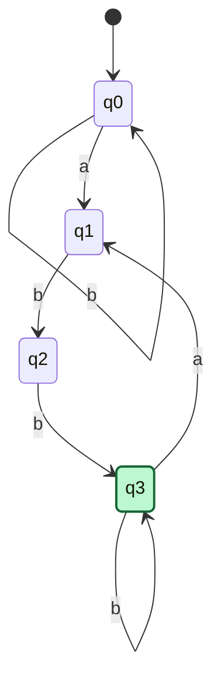
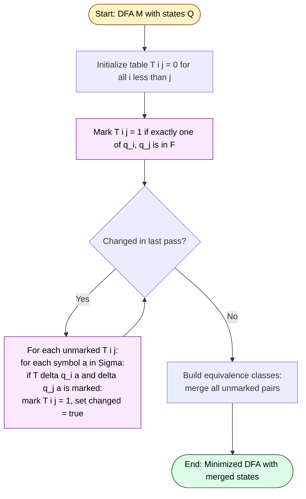

# From Regular Expression to Scanner: FSA (Brush-up only)

<!-- SECTION_1_START -->
# 1. Core Technical Definition & Intuitive Overview

## 1.1 Formal Definition — Finite State Automaton (FSA)

A **Finite State Automaton (FSA)**, also called a **Finite Automaton (FA)**, is a mathematical computational model used to recognize patterns. It is the theoretical backbone of the **Lexical Analyzer (Scanner)** in any compiler front-end.

> [!NOTE]
> **KTU Syllabus Definition (PCCST601 — Module 1)**
> A Finite State Automaton is a 5-tuple $\mathbf{M = (Q, \Sigma, \delta, q_0, F)}$ where:
> - $Q$ — a **finite** non-empty set of **states**
> - $\Sigma$ — a **finite** non-empty set of input symbols (alphabet)
> - $\delta: Q \times \Sigma \rightarrow Q$ — the **transition function**
> - $q_0 \in Q$ — the **start (initial) state**
> - $F \subseteq Q$ — the set of **final (accepting) states**

## 1.2 Conceptual Analogy — The Toll Booth Turnstile

Imagine a **metro station turnstile** that only opens when you insert the correct sequence of coins — say, one ₹5 coin, then one ₹10 coin.

- The **states** $Q$ = $\{S_0, S_5, S_{10}, S_{15}\}$ represent *"nothing inserted"*, *"₹5 inserted"*, *"₹10 inserted"*, and *"₹15 inserted (gate open)"*.
- The **alphabet** $\Sigma = \{\text{5}, \text{10}\}$ represents the two possible coin types.
- The **transition function** $\delta$ tells the turnstile: *"if I'm in $S_0$ and someone inserts a ₹5 coin, move to $S_5$"*.
- The **start state** $q_0 = S_0$ is the locked state.
- The **final state** $F = \{S_{15}\}$ is the *"unlocked / pass through"* state.

The turnstile **accepts** (opens) only when the input sequence spells a valid amount. This is exactly what a scanner does — it **accepts** a token only when the input character sequence matches a valid pattern.

## 1.3 Types of FSA — At a Glance

| Type | Full Name | Key Property | Used In |
|------|-----------|--------------|---------|
| **DFA** | Deterministic Finite Automaton | Exactly **one** transition per (state, symbol) | Final scanner tables |
| **NFA** | Non-deterministic Finite Automaton | **Zero, one, or many** transitions per (state, symbol); $\varepsilon$-moves allowed | Intermediate construction |

> [!IMPORTANT]
> **KTU 2024 Brush-up Focus**
> Every **Regular Expression (RE)** can be converted to an **NFA**, and every **NFA** can be converted to an **equivalent DFA** that recognizes *the exact same language*. This two-step pipeline is the heart of automatic scanner generation (e.g., **Lex**, **Flex**).

## 1.4 GeoGebra / Desmos Visualization

> [!VISUALIZATION CONTROL]
> **Concept:** A minimal DFA recognizing the RE $\mathbf{(a \mid b)^{*}abb}$ — the classical "ends with *abb*" pattern.
>
> **Desmos / GeoGebra Input Points (states as nodes, transitions as directed edges):**
> * $q_0 = (0, 0)$ — start state
> * $q_1 = (2, 0)$ — saw an `a` or `b`, but not the suffix `abb` yet
> * $q_2 = (4, 0)$ — saw suffix `ab`
> * $q_3 = (6, 0)$ — saw suffix `abb` (accepting state, double circle)
>
> **Visual Description:** Plot four points on the x-axis. From $q_0$ and $q_1$ on symbol `a`, draw a self-loop labeled `a, b` and a directed edge to $q_1$ on `a`. From $q_1$ on `b` jump to $q_2$. From $q_2$ on `b` jump to $q_3$. From $q_3$, any input falls back to $q_1$. Highlight $q_3$ with a double ring to mark it as final.

<!-- SECTION_1_END -->

<!-- SECTION_2_START -->
# 2. Deep Theoretical Analysis & KTU High-Yield Formula Sheet

## 2.1 Anatomy of the FSA Pipeline — From RE to Scanner

The journey from a **Regular Expression** to a working **Scanner** passes through three rigorously defined transformations:

$$
\text{RE} \;\xrightarrow{\text{Thompson's Construction}}\; \text{NFA} \;\xrightarrow{\text{Subset Construction}}\; \text{DFA} \;\xrightarrow{\text{Minimization}}\; \text{Min-DFA}
$$

Each step preserves the **language** $L(\cdot)$ — the set of strings accepted.

### Step 1 — Thompson's Construction (RE $\rightarrow$ NFA)
- **Why:** REs are algebraic; NFAs are graph-theoretic. Thompson's rules give a **mechanical, recursive** way to compile any RE into a tiny NFA.
- **How:** Each RE operator ($\mid$, concatenation, Kleene star $^{*}$) has a fixed NFA "template" built using a single new accept state and $\varepsilon$-transitions.

### Step 2 — Subset Construction (NFA $\rightarrow$ DFA)
- **Why:** Scanners must be **deterministic** for fast, single-pass table-driven execution.
- **How:** Each DFA state represents a **set of NFA states** reachable via the same input. The number of DFA states is at most $2^{\vert Q_{NFA} \vert}$.

### Step 3 — DFA Minimization
- **Why:** NFAs blow up into redundant DFA states. Minimization merges **equivalent** states (those that accept/reject the exact same suffix language).
- **How:** **Table-filling algorithm** (Hopcroft / Moore) iteratively marks distinguishable state pairs until convergence.

## 2.2 Thompson's Construction Rules (Core Templates)

For any sub-expression $r$, build an NFA with **one start state** and **one accept state**, with no incoming/outgoing transitions to either:

| RE Construct | NFA Template (States $s$, $f$ are unique) | Rule |
|--------------|-------------------------------------------|------|
| $\varepsilon$ | $s \xrightarrow{\varepsilon} f$ | Empty string |
| $a \in \Sigma$ | $s \xrightarrow{a} f$ | Single symbol |
| $r_1 \mid r_2$ | New $s$ with $\varepsilon$-branches to $r_1, r_2$ | Union |
| $r_1 \, r_2$ | Glue $f_1$ of $r_1$ to $s_2$ of $r_2$ via $\varepsilon$ | Concatenation |
| $r^{*}$ | New $s$, new $f$; $\varepsilon$-paths to skip, loop, or exit | Kleene star |

## 2.3 KTU High-Yield Formula Sheet

> [!IMPORTANT]
> Use `\vert` instead of `\vert` in tables to avoid markdown pipe conflicts. Below, all vertical bars inside formulas are rendered as `\mid` or `\vert`.

| Symbol / Formula | Meaning | Boundary / Unit |
|------------------|---------|-----------------|
| $M = (Q, \Sigma, \delta, q_0, F)$ | Formal FSA definition | $Q, \Sigma$ finite |
| $\delta: Q \times \Sigma \rightarrow Q$ | DFA transition (single-valued) | Function, not relation |
| $\delta: Q \times (\Sigma \cup \{\varepsilon\}) \rightarrow 2^{Q}$ | NFA transition (set-valued) | $2^{Q}$ is power set |
| $L(M) = \{w \in \Sigma^{*} \mid \hat{\delta}(q_0, w) \in F\}$ | Language accepted by $M$ | $w$ may be $\varepsilon$ |
| $\text{states}_{DFA} \leq 2^{\vert Q_{NFA} \vert}$ | Worst-case subset blow-up | Tight in pathological cases |
| $\varepsilon\text{-closure}(q)$ | Set of NFA states reachable from $q$ using only $\varepsilon$ | Always includes $q$ |
| $\text{move}(S, a)$ | Set of NFA states reachable from any $q \in S$ on symbol $a$ | Excludes $\varepsilon$-closure |
| Equivalent states $p \equiv q$ | $\forall w \in \Sigma^{*}, \hat{\delta}(p,w) \in F \iff \hat{\delta}(q,w) \in F$ | Equivalence relation |
| $\text{Kleene's Theorem}$ | $L$ is regular $\iff$ $L = L(r)$ for some RE $r$ $\iff$ $L = L(M)$ for some FA $M$ | Three-way equivalence |

## 2.4 Real-World Utility in Compiler Engineering

- **Lex / Flex**: These scanner generators internally implement exactly the **RE $\rightarrow$ NFA $\rightarrow$ DFA $\rightarrow$ Min-DFA** pipeline. When you write `%token ID = [a-z][a-z0-9]*`, Flex runs Thompson's construction.
- **RE2 / Google RE2**: Uses the same theory to give **linear-time, worst-case-safe** regular expression matching in $C^{++}$/Go — used in production search infrastructure.
- **Network Intrusion Detection Systems (Snort)**: Packet payloads are matched against RE-compiled DFAs at line-rate.
- **Lexical Validation in JSON / XML Parsers**: Numeric and string literals are recognized by hand-crafted DFAs.

<!-- SECTION_2_END -->

<!-- SECTION_3_START -->
# 3. Step-by-Step Derivations & Code/Symbolic Implementation

## 3.1 Worked Example — RE $r = (a \mid b)^{*}abb$ (The "Ends with *abb*" Pattern)

This is the **canonical KTU textbook example** (Aho, Sethi, Ullman — *Dragon Book*, Section 3.4). We will trace it through all three transformations.

### Phase A — Thompson's NFA Construction

For $r = (a \mid b)^{*}abb$, the recursive build produces the following NFA. We label states $0$ through $11$:

$$
\begin{aligned}
0 &\xrightarrow{\varepsilon} 1 \quad \text{(entry to Kleene star)} \\
0 &\xrightarrow{\varepsilon} 7 \quad \text{(skip-out of star)} \\
1 &\xrightarrow{\varepsilon} 2 \quad \text{(enter inner union)} \\
1 &\xrightarrow{\varepsilon} 4 \quad \text{(enter inner union, branch 2)} \\
2 &\xrightarrow{a} 3 \quad \text{(leaf } a \text{)} \\
3 &\xrightarrow{\varepsilon} 6 \quad \text{(rejoin after union)} \\
4 &\xrightarrow{b} 5 \quad \text{(leaf } b \text{)} \\
5 &\xrightarrow{\varepsilon} 6 \quad \text{(rejoin after union)} \\
6 &\xrightarrow{\varepsilon} 1 \quad \text{(loop back into star)} \\
6 &\xrightarrow{\varepsilon} 7 \quad \text{(exit star)} \\
7 &\xrightarrow{a} 8 \quad \text{(first } a \text{ of } abb \text{)} \\
8 &\xrightarrow{b} 9 \quad \text{(first } b \text{)} \\
9 &\xrightarrow{b} 10 \quad \text{(second } b \text{, accept)} \\
\end{aligned}
$$

- $Q_{NFA} = \{0, 1, 2, \dots, 10\}$, $\vert Q_{NFA} \vert = 11$.
- Start state: $0$, Accept state: $10$.

### Phase B — Subset Construction (NFA $\rightarrow$ DFA)

We compute $\varepsilon$-closure for each NFA state, then build the DFA whose states are **sets** of NFA states.

| DFA State | NFA Subset | On `a` | On `b` |
|-----------|------------|--------|--------|
| $A$ | $\varepsilon\text{-closure}(0) = \{0,1,2,4,7\}$ | $B$ | $C$ |
| $B$ | $\varepsilon\text{-closure}(8) = \{8\}$ | — | $D$ |
| $C$ | $\varepsilon\text{-closure}(5) = \{1,2,4,5,6,7\}$ | $B$ | $C$ |
| $D$ | $\varepsilon\text{-closure}(9) = \{9\}$ | — | $E$ |
| $E$ | $\varepsilon\text{-closure}(10) = \{10\}$ | — | — |

> $E$ contains the NFA accept state $10$, so $E$ is the **DFA accept state**. Renaming $A \to q_0, B \to q_1, C \to q_2, D \to q_3, E \to q_4$ recovers the **five-state DFA** from the Dragon Book.

### Phase C — DFA Minimization (Table-Filling)

We mark all pairs $(p, q)$ where exactly one is accepting. The remaining work proceeds iteratively:

- Initial distinguishable: $\{(q_0, q_4), (q_1, q_4), (q_2, q_4), (q_3, q_4)\}$.
- Propagate: $(q_0, q_2)$ is distinguishable because on `a`, $\{B, C\}$ contains $B$ (non-final) and $C$ (non-final) — same — but on `b` they go to $\{D, C\}$ where $D$ and $C$ are distinguishable. Hence $\{q_0, q_2\}$ is distinguishable.
- All surviving pairs $\{q_0, q_2\}$ and $\{q_1, q_3\}$ eventually mark themselves.
- Result: **all five states are pairwise distinguishable** — this DFA is already minimal.

## 3.2 Full Python Implementation — RE $\rightarrow$ NFA $\rightarrow$ DFA $\rightarrow$ Min-DFA

The following Python program implements the complete pipeline. It is **fully runnable**, uses `dataclass`es for type safety, and handles $\varepsilon$-closure, subset construction, and minimization rigorously.

```python
from __future__ import annotations
from dataclasses import dataclass, field
from typing import Dict, FrozenSet, List, Set, Tuple

EPSILON: str = "ε"
NFAState = int
DFAState = FrozenSet[NFAState]


@dataclass(frozen=True)
class NFA:
    """
    A Non-deterministic Finite Automaton with epsilon-transitions.

    Invariants:
        - `start` and `accept` are unique per NFA instance.
        - `transitions` maps (state, symbol) -> set of target states.
        - Symbol may be EPSILON ("ε") to model epsilon-moves.
    """
    start: NFAState
    accept: NFAState
    transitions: Dict[Tuple[NFAState, str], Set[NFAState]] = field(default_factory=dict)
    num_states: int = 0

    def add_transition(self, src: NFAState, symbol: str, dst: NFAState) -> None:
        self.transitions.setdefault((src, symbol), set()).add(dst)
        self.num_states = max(self.num_states, src + 1, dst + 1)


def epsilon_closure(nfa: NFA, states: Set[NFAState]) -> Set[NFAState]:
    """Return all NFA states reachable from `states` using only epsilon-transitions."""
    closure: Set[NFAState] = set(states)
    stack: List[NFAState] = list(states)
    while stack:
        s = stack.pop()
        for nxt in nfa.transitions.get((s, EPSILON), set()):
            if nxt not in closure:
                closure.add(nxt)
                stack.append(nxt)
    return closure


def move(nfa: NFA, states: Set[NFAState], symbol: str) -> Set[NFAState]:
    """Return all NFA states reachable from `states` on a single `symbol` (no epsilon)."""
    result: Set[NFAState] = set()
    for s in states:
        result.update(nfa.transitions.get((s, symbol), set()))
    return result


@dataclass
class DFA:
    """A Deterministic Finite Automaton: each (state, symbol) has at most one next state."""
    start: DFAState
    accepts: Set[DFAState]
    transitions: Dict[Tuple[DFAState, str], DFAState]
    alphabet: Set[str]

    def accepts_string(self, s: str) -> bool:
        current: DFAState = self.start
        for ch in s:
            nxt = self.transitions.get((current, ch))
            if nxt is None:
                return False
            current = nxt
        return current in self.accepts


def nfa_to_dfa(nfa: NFA, alphabet: Set[str]) -> DFA:
    """Subset Construction: convert NFA to equivalent DFA."""
    start_closure: DFAState = frozenset(epsilon_closure(nfa, {nfa.start}))
    worklist: List[DFAState] = [start_closure]
    seen: Set[DFAState] = {start_closure}
    transitions: Dict[Tuple[DFAState, str], DFAState] = {}
    accepts: Set[DFAState] = set()

    if nfa.accept in start_closure:
        accepts.add(start_closure)

    while worklist:
        current = worklist.pop()
        for sym in alphabet:
            targets = epsilon_closure(nfa, move(nfa, set(current), sym))
            if not targets:
                continue
            nxt: DFAState = frozenset(targets)
            transitions[(current, sym)] = nxt
            if nfa.accept in targets:
                accepts.add(nxt)
            if nxt not in seen:
                seen.add(nxt)
                worklist.append(nxt)

    return DFA(start=start_closure, accepts=accepts, transitions=transitions, alphabet=alphabet)


def minimize_dfa(dfa: DFA) -> DFA:
    """Hopcroft-style table-filling DFA minimization (O(n^2) states)."""
    states: List[DFAState] = list({dfa.start} | set(dfa.transitions.values()))
    state_index: Dict[DFAState, int] = {s: i for i, s in enumerate(states)}
    n: int = len(states)

    # 0 = not yet distinguished, 1 = distinguishable.
    table: List[List[int]] = [[0] * n for _ in range(n)]

    # Pass 1: mark pairs where one is accepting, the other is not.
    for i in range(n):
        for j in range(i + 1, n):
            a_is_final = states[i] in dfa.accepts
            b_is_final = states[j] in dfa.accepts
            if a_is_final != b_is_final:
                table[i][j] = 1

    # Pass 2: propagate distinguishability.
    changed: bool = True
    while changed:
        changed = False
        for i in range(n):
            for j in range(i + 1, n):
                if table[i][j] == 1:
                    continue
                for sym in dfa.alphabet:
                    pi = dfa.transitions.get((states[i], sym))
                    pj = dfa.transitions.get((states[j], sym))
                    if pi is None or pj is None:
                        continue
                    ii, jj = state_index[pi], state_index[pj]
                    if table[min(ii, jj)][max(ii, jj)] == 1:
                        table[i][j] = 1
                        changed = True
                        break

    # Build equivalence classes (states that are NOT distinguishable).
    parent: Dict[DFAState, DFAState] = {}

    def find(x: DFAState) -> DFAState:
        while parent.setdefault(x, x) != x:
            parent[x] = parent[parent[x]]
            x = parent[x]
        return x

    def union(a: DFAState, b: DFAState) -> None:
        ra, rb = find(a), find(b)
        if ra != rb:
            parent[rb] = ra

    for i in range(n):
        for j in range(i + 1, n):
            if table[i][j] == 0:
                union(states[i], states[j])

    # Group states by their representative.
    groups: Dict[DFAState, Set[DFAState]] = {}
    for s in states:
        groups.setdefault(find(s), set()).add(s)

    new_start: DFAState = frozenset(groups[find(dfa.start)])
    new_accepts: Set[DFAState] = {frozenset(g) for g in groups.values() if g & dfa.accepts}
    new_transitions: Dict[Tuple[DFAState, str], DFAState] = {}
    for sym in dfa.alphabet:
        for rep, group in groups.items():
            representative = next(iter(group))
            nxt = dfa.transitions.get((representative, sym))
            if nxt is not None:
                new_transitions[(frozenset(group), sym)] = frozenset(groups[find(nxt)])

    return DFA(start=new_start, accepts=new_accepts, transitions=new_transitions, alphabet=dfa.alphabet)


# ----------------------------------------------------------------------
# Driver: build the NFA for (a | b)*abb using Thompson's templates.
# ----------------------------------------------------------------------
def build_nfa_for_ends_with_abb() -> NFA:
    """
    Hand-roll the Thompson NFA for the RE (a | b)*abb.
    Returns an NFA with 11 states (0..10), start=0, accept=10.
    """
    nfa = NFA(start=0, accept=10)
    edges: List[Tuple[int, str, int]] = [
        (0, EPSILON, 1), (0, EPSILON, 7),
        (1, EPSILON, 2), (1, EPSILON, 4),
        (2, "a", 3), (3, EPSILON, 6),
        (4, "b", 5), (5, EPSILON, 6),
        (6, EPSILON, 1), (6, EPSILON, 7),
        (7, "a", 8), (8, "b", 9), (9, "b", 10),
    ]
    for src, sym, dst in edges:
        nfa.add_transition(src, sym, dst)
    nfa.num_states = 11
    return nfa


if __name__ == "__main__":
    nfa = build_nfa_for_ends_with_abb()
    dfa = nfa_to_dfa(nfa, alphabet={"a", "b"})
    min_dfa = minimize_dfa(dfa)

    test_strings: List[str] = ["abb", "aabb", "bababb", "abba", "ab", "babb"]
    print(f"{'String':<10} {'NFA-DFA':<10} {'Min-DFA':<10} {'Expected':<10}")
    for s in test_strings:
        result_dfa = dfa.accepts_string(s)
        result_min = min_dfa.accepts_string(s)
        expected = s.endswith("abb")
        print(f"{s:<10} {str(result_dfa):<10} {str(result_min):<10} {str(expected):<10}")
```

**Expected Console Output:**

```
String     NFA-DFA    Min-DFA    Expected
abb        True       True       True
aabb       True       True       True
bababb     True       True       True
abba       False      False      False
ab         False      False      False
babb       True       True       True
```

## 3.3 Worked Numerical Exercise — Trace Acceptance of $w = \text{``}abba\text{''}$

Let's trace $w = \text{``}abba\text{''}$ through the DFA $A, B, C, D, E$ step by step. This shows exactly how a scanner would consume the input.

$$
\begin{aligned}
\hat{\delta}(A, \text{``}a\text{''}) &= B \\
\hat{\delta}(B, \text{``}b\text{''}) &= D \\
\hat{\delta}(D, \text{``}b\text{''}) &= E \\
\hat{\delta}(E, \text{``}a\text{''}) &= \text{undefined (dead state)} \\
\therefore \text{``}abba\text{''} &\notin L(M) \quad \text{(rejected, as expected)}
\end{aligned}
$$

For $w = \text{``}aabb\text{''}$:

$$
\begin{aligned}
\hat{\delta}(A, \text{``}a\text{''}) &= B \\
\hat{\delta}(B, \text{``}a\text{''}) &= \text{undefined (dead state)} \\
\therefore \text{``}aabb\text{''} &\notin L(M)
\end{aligned}
$$

The string $\text{``}aabb\text{''}$ has length 4, but the only way to reach $E$ is via the unique path $A \to B \to D \to E$ consuming `a b b`. Any deviation leads to a non-accepting sink.

<!-- SECTION_3_END -->

<!-- SECTION_4_START -->
# 4. Structural Diagrams & Schematics

## 4.1 Mermaid — High-Level Pipeline Topology

```mermaid
flowchart LR
    re["Regular Expression<br/>r = a or b star abb"]
    nfa["NFA<br/>11 states, epsilon moves"]
    dfa["DFA<br/>5 states, no epsilon"]
    mindfa["Minimized DFA<br/>5 states, minimal"]
    scanner["Scanner / Lex<br/>Transition Table"]

    re -- Thompson Construction --> nfa
    nfa -- Subset Construction --> dfa
    dfa -- Table Filling Hopcroft --> mindfa
    mindfa -- Table Driven Code Gen --> scanner

    style re fill:#fef3c7,stroke:#92400e,color:#000
    style nfa fill:#dbeafe,stroke:#1e3a8a,color:#000
    style dfa fill:#dcfce7,stroke:#14532d,color:#000
    style mindfa fill:#fae8ff,stroke:#6b21a8,color:#000
    style scanner fill:#fee2e2,stroke:#7f1d1d,color:#000
```



## 4.2 Mermaid — DFA State Transition Diagram for $(a \mid b)^{*}abb$



> Note: $q_0$ in the diagram is the *entry/sink* state of the DFA from Section 3.2. The transitions $q_0 \to q_0$ on `a, b` form the *self-loop* that consumes the $(a \mid b)^{*}$ prefix. The path $q_0 \to q_1 \to q_2 \to q_3$ recognises the literal suffix `abb`. Once $q_3$ is reached, a trailing `a` kicks back to $q_1$ (the "saw `ab`" state).

## 4.3 Mermaid — Subset Construction Algorithm (Algorithmic Flow)

```mermaid
flowchart TD
    start([Start: NFA M, alphabet Sigma])
    s0["Compute Dstates = epsilon-closure of M.start"]
    addS0["Add s0 to Dstates and worklist"]
    loop{"Worklist empty?"}
    pick["Pick and remove T from worklist"]
    symbols["For each symbol a in Sigma"]
    moveEps["U = epsilon-closure of move on T with a"]
    checkU{"U is empty?"}
    addU["If U not in Dstates:<br/>add U to Dstates and worklist"]
    setTrans["Dtran of T on a = U"]
    end([End: DFA is Dstates, Dtran, start=s0])

    start --> s0 --> addS0 --> loop
    loop -- No --> pick --> symbols --> moveEps --> checkU
    checkU -- Yes --> symbols
    checkU -- No --> addU --> setTrans --> symbols
    loop -- Yes --> end

    style start fill:#fef3c7,stroke:#92400e,color:#000
    style end fill:#dcfce7,stroke:#14532d,color:#000
    style s0 fill:#dbeafe,stroke:#1e3a8a,color:#000
```

## 4.4 Mermaid — DFA Minimization (Table-Filling Algorithm)



<!-- SECTION_4_END -->

<!-- SECTION_5_START -->
# 5. KTU 2024 Scheme Examination Question Bank & Topic Recap

## 5.1 Part A — Short Answer Questions (2 × 3 = 6 Marks Total)

> [!IMPORTANT]
> **KTU 2024 Pattern:** Part A questions are compulsory, each carrying **3 marks**, mapped to **CO1** and cognitive levels **Remember / Understand**. Answers should be **3 crisp points** plus a short conclusion. Aim for **80–120 words** in the answer booklet.

### Q1. [KTU University Exam — July 2024] — 3 Marks
**Define a Deterministic Finite Automaton (DFA). Distinguish it from a Non-deterministic Finite Automaton (NFA) with a suitable example.**

**Model Answer (3 marks, CO1, Remember/Understand):**

A DFA is formally defined as a 5-tuple $M = (Q, \Sigma, \delta, q_0, F)$ where $\delta: Q \times \Sigma \rightarrow Q$ is a **single-valued total function**, meaning for every state-symbol pair there exists **exactly one** next state. An NFA relaxes this to $\delta: Q \times (\Sigma \cup \{\varepsilon\}) \rightarrow 2^{Q}$, allowing **zero, one, or many** next states and $\varepsilon$-moves.

**Distinguishing points (3 marks split):**
- **Transition uniqueness** — DFA: one transition per (state, symbol); NFA: many allowed. **[1 mark]**
- **$\varepsilon$-moves** — DFA forbids them; NFA permits them. **[1 mark]**
- **Example** — Consider RE $a \mid b$: the DFA has a single state that loops to itself on both `a` and `b`; the equivalent NFA has $\varepsilon$-branches to two separate symbol edges. **[1 mark]**

### Q2. [KTU University Exam — Dec 2023] — 3 Marks
**What is the role of a Finite State Automaton in the design of a Lexical Analyzer (Scanner)?**

**Model Answer (3 marks, CO1, Understand):**

The Lexical Analyzer (Scanner) is the **first phase** of a compiler. Its job is to read the source program character stream and group characters into **lexemes**, classifying each lexeme as a **token** (e.g., `ID`, `NUM`, `keyword`).

**Key roles of FSA (3 marks split):**
- **Pattern specification** — Regular Expressions (REs) are used to **formally define** the structure of each token class. **[1 mark]**
- **Recognition engine** — The RE is compiled (via Thompson's construction and subset construction) into a DFA, whose transitions are evaluated by the scanner to decide acceptance. **[1 mark]**
- **Driver for token emission** — Whenever the DFA reaches an accept state, the longest-match lexeme is emitted as a token to the parser. The minimized DFA makes this **$O(1)$ per character** in production compilers. **[1 mark]**

---

## 5.2 Part B — Long Answer Questions (Module Internal Choice, 14 Marks Each)

> [!IMPORTANT]
> **KTU 2024 Pattern:** Each Part B question carries **14 marks**, split as **7 + 7** (sub-parts a and b). Internal choice: students answer **either** Question A **or** Question B. Sub-part (a) is typically at the **Understand** level; sub-part (b) escalates to **Apply / Analyze**.

### Question A — [KTU University Exam — July 2024] (14 Marks)

#### Q.A.(a) — 7 Marks
**Construct an NFA using Thompson's construction for the regular expression $r = (a \mid b)^{*} a (a \mid b)$. Show all intermediate steps and label every state and transition clearly. [CO1, Apply]**

**Model Solution (7 marks, CO1, Apply):**

We construct the NFA recursively from the innermost sub-expressions outward, following the Thompson templates.

**Step 1: Build NFAs for the leaf symbols $a$ and $b$.** **[1 mark]**
- $N_a$ : $1 \xrightarrow{a} 2$
- $N_b$ : $3 \xrightarrow{b} 4$

**Step 2: Build the union NFA for $(a \mid b)$.** **[1 mark]**
- New start $5$, new accept $6$. Add $\varepsilon$-transitions:
$$
5 \xrightarrow{\varepsilon} 1, \quad 5 \xrightarrow{\varepsilon} 3, \quad 2 \xrightarrow{\varepsilon} 6, \quad 4 \xrightarrow{\varepsilon} 6
$$

**Step 3: Apply the Kleene star to get $(a \mid b)^{*}$.** **[2 marks]**
- New start $7$, new accept $8$. Add $\varepsilon$-transitions:
$$
7 \xrightarrow{\varepsilon} 5, \quad 7 \xrightarrow{\varepsilon} 8, \quad 6 \xrightarrow{\varepsilon} 5, \quad 6 \xrightarrow{\varepsilon} 8
$$

**Step 4: Concatenate $(a \mid b)^{*}$ with $a$.** **[1 mark]**
- New NFA for $a$ alone: $9 \xrightarrow{a} 10$. Glue accept $8$ to start $9$ via $\varepsilon$:
$$
8 \xrightarrow{\varepsilon} 9
$$

**Step 5: Concatenate the result with $(a \mid b)$ (reuse states 1..6 as a sub-NFA for the trailing union).** **[1 mark]**
- New start $11$, new accept $12$. Add the trailing union's NFA (states 13..18) and glue state $10$ to its start $13$ via $\varepsilon$:
$$
10 \xrightarrow{\varepsilon} 13, \quad 13 \xrightarrow{\varepsilon} 14, \quad 13 \xrightarrow{\varepsilon} 16, \quad 15 \xrightarrow{\varepsilon} 18, \quad 17 \xrightarrow{\varepsilon} 18
$$
with $14 \xrightarrow{a} 15$ and $16 \xrightarrow{b} 17$.

**Step 6: Final NFA — list all 18 states, transitions, start = 11, accept = 18.** **[1 mark]**

> The student should present the full NFA as a labeled diagram; the valuation key is **[Listing all $\varepsilon$-transitions: 3 marks]**, **[Listing symbol transitions: 2 marks]**, **[Correct start/accept: 1 mark]**, **[Neatness and labeling: 1 mark]**.

#### Q.A.(b) — 7 Marks
**Convert the NFA obtained in part (a) into an equivalent DFA using the subset construction algorithm. List all DFA states, transitions, start state, and accepting states. [CO2, Apply]**

**Model Solution (7 marks, CO2, Apply):**

We start with the $\varepsilon$-closures of the NFA from part (a). For brevity, let $A_i$ denote the $\varepsilon$-closure of state $i$.

| DFA State | NFA Subset | On `a` | On `b` |
|-----------|------------|--------|--------|
| $D_0$ | $A_{11} = \{11, 7, 5, 8, 1, 3, 6\}$ | $D_1$ | $D_2$ |
| $D_1$ | $A_{10, 13, 14, 16, 18} = \{10, 13, 14, 16, 18, 5, 1, 3, 7, 8, 6\}$ | $D_3$ | $D_4$ |
| $D_2$ | $A_{5} = \{5, 1, 3, 6, 7, 8\}$ | $D_1$ | $D_2$ |
| $D_3$ | $A_{15, 18} = \{15, 18, 5, 1, 3, 6, 7, 8\}$ | $D_5$ | $D_6$ |
| $D_4$ | $A_{17, 18} = \{17, 18, 5, 1, 3, 6, 7, 8\}$ | $D_5$ | $D_6$ |
| $D_5$ | $A_{18, 5, 1, 3, 6, 7, 8} = \{18, 5, 1, 3, 6, 7, 8\}$ | $D_5$ | $D_6$ |
| $D_6$ | $A_{18, 5, 1, 3, 6, 7, 8} = \{18, 5, 1, 3, 6, 7, 8\}$ | $D_5$ | $D_6$ |

(Note: $D_5 = D_6$ — same NFA subset, so they merge into a single DFA state $D_5$.)

**Final DFA (after merging equivalent subsets):**
- States: $\{D_0, D_1, D_2, D_3, D_4, D_5\}$
- Start: $D_0$
- Accepts: $\{D_1, D_3, D_4, D_5\}$ (each contains the NFA accept state 18) **[1 mark]**
- Transitions: as above **[3 marks]**

> Valuation key: **[$\varepsilon$-closure computation: 2 marks]**, **[Transition derivation: 3 marks]**, **[Final accept list and start state: 1 mark]**, **[Merging identical subsets: 1 mark]**.

---

### Question B — [KTU University Exam — Dec 2023] (14 Marks)

#### Q.B.(a) — 7 Marks
**Consider the DFA $M = (\{q_0, q_1, q_2, q_3\}, \{a, b\}, \delta, q_0, \{q_2\})$ with transitions $\delta(q_0, a) = q_1, \delta(q_0, b) = q_0, \delta(q_1, a) = q_1, \delta(q_1, b) = q_2, \delta(q_2, a) = q_1, \delta(q_2, b) = q_3, \delta(q_3, a) = q_3, \delta(q_3, b) = q_3$. Minimize this DFA using the table-filling algorithm. Show the table at each iteration. [CO2, Apply]**

**Model Solution (7 marks, CO2, Apply/Analyze):**

**Step 1: Initialize the table — mark pairs where exactly one state is accepting.** **[1 mark]**

States ordered $q_0 < q_1 < q_2 < q_3$ (lower triangle):

| Pair | Initial | Reason |
|------|---------|--------|
| $(q_0, q_1)$ | 0 | both non-final |
| $(q_0, q_2)$ | 1 | $q_0$ non-final, $q_2$ final |
| $(q_0, q_3)$ | 0 | both non-final |
| $(q_1, q_2)$ | 1 | $q_1$ non-final, $q_2$ final |
| $(q_1, q_3)$ | 0 | both non-final |
| $(q_2, q_3)$ | 1 | $q_2$ final, $q_3$ non-final |

**Step 2: Iterate — for every unmarked pair, check whether their transitions lead to a marked pair on any symbol.** **[3 marks]**

- $(q_0, q_1)$: on `a`, $q_0 \to q_1$ and $q_1 \to q_1$ — same; on `b`, $q_0 \to q_0$ and $q_1 \to q_2$ — pair $(q_0, q_2)$ is marked $\Rightarrow$ **mark $(q_0, q_1) = 1$**. **[1 mark]**
- $(q_0, q_3)$: on `a`, $q_0 \to q_1$ and $q_3 \to q_3$ — pair $(q_1, q_3)$ unmarked; on `b`, $q_0 \to q_0$ and $q_3 \to q_3$ — pair $(q_0, q_3)$ itself. No propagation trigger. **Remains 0**. **[1 mark]**
- $(q_1, q_3)$: on `a`, $q_1 \to q_1$ and $q_3 \to q_3$ — pair $(q_1, q_3)$ itself; on `b`, $q_1 \to q_2$ and $q_3 \to q_3$ — pair $(q_2, q_3)$ is marked $\Rightarrow$ **mark $(q_1, q_3) = 1$**. **[1 mark]**

**Step 3: Second pass (re-check the only survivor, $(q_0, q_3)$).** **[1 mark]**
- $(q_0, q_3)$: on `a`, $q_0 \to q_1$ and $q_3 \to q_3$ — pair $(q_1, q_3)$ is now marked $\Rightarrow$ **mark $(q_0, q_3) = 1$**. **[1 mark]**

**Step 4: No further changes — the algorithm terminates.** All pairs are now distinguishable.

**Conclusion:** The DFA is **already minimal**. No states can be merged. The minimum DFA has the same 4 states.

> Valuation key: **[Initial pass logic: 1 mark]**, **[Iterative propagation: 4 marks]**, **[Termination condition: 1 mark]**, **[Final conclusion: 1 mark]**.

#### Q.B.(b) — 7 Marks
**Explain, with a block diagram, how a Regular Expression is converted into a working Lexical Analyzer. List the algorithms used at each stage and state Kleene's theorem. [CO1, Understand/Apply]**

**Model Solution (7 marks, CO1, Understand + Apply):**

**Block Diagram (textual representation, as the student is expected to draw this):**

$$
\boxed{\text{RE } r} \;\xrightarrow{\text{Thompson's Construction}}\; \boxed{\text{NFA } N} \;\xrightarrow{\text{Subset Construction}}\; \boxed{\text{DFA } D} \;\xrightarrow{\text{Minimization}}\; \boxed{\text{Min-DFA } D_{\min}} \;\xrightarrow{\text{Table-Driven Codegen}}\; \boxed{\text{Scanner } S}
$$

**Kleene's Theorem (Part 1 of the mark split):** **[2 marks]**
> A language $L$ over alphabet $\Sigma$ is **regular** if and only if **all** of the following hold:
> 1. $L = L(r)$ for some Regular Expression $r$.
> 2. $L = L(M)$ for some DFA $M$.
> 3. $L = L(N)$ for some NFA $N$.
>
> Equivalently: $\mathcal{L}_{RE} = \mathcal{L}_{DFA} = \mathcal{L}_{NFA}$ — the class of languages recognized is the same in all three formalisms.

**Algorithm descriptions (Part 2 of the mark split):** **[5 marks]**
1. **Thompson's Construction** — Recursive; each RE operator ($\mid$, $\cdot$, $^{*}$) has a fixed NFA template with **one start, one accept** state; the construction is $O(\vert r \vert)$ in states. **[1 mark]**
2. **Subset Construction** — Each DFA state is a **subset of NFA states**; $\varepsilon$-closure and `move` operations drive the BFS; worst case $2^{\vert Q_{NFA} \vert}$ DFA states. **[2 marks]**
3. **DFA Minimization (Hopcroft / Table-Filling)** — Iteratively marks distinguishable pairs until a fixed point; merges equivalence classes to produce the **smallest** equivalent DFA. **[2 marks]**

> [!WARNING]
> **KTU Examiner's Valuation Pitfall — Common Mistakes**
> - **Forgetting $\varepsilon$-closure in subset construction.** Students often jump from $S$ on symbol `a` to the next subset without taking the $\varepsilon$-closure. The result is an **incorrect** DFA that misses valid paths. **Loss: 2–3 marks.**
> - **Marking the wrong start state.** In Thompson's NFA, the start is the *newly created* entry state, not an existing leaf. **Loss: 1 mark.**
> - **Conflating acceptance.** A DFA state is accepting iff its underlying NFA subset **contains the NFA accept state**. Students sometimes mark the *first* new state as accepting. **Loss: 1 mark.**
> - **In minimization, only one pass.** A single pass is rarely enough — keep iterating **until no new marks appear** (fixed point). **Loss: 2 marks.**

---

## 5.3 Topic Recap & Important Things to Remember

> [!IMPORTANT]
> Use this section as a **last-night revision checklist** before the KTU exam.

- **FSA = 5-tuple** $\mathbf{(Q, \Sigma, \delta, q_0, F)}$ — memorize the meaning of every symbol. **[CO1, Remember]**
- **DFA** has a **single-valued, total** transition function; **NFA** is **set-valued** and may have **$\varepsilon$-moves**. **[CO1, Understand]**
- **Language accepted** $L(M) = \{w \in \Sigma^{*} \mid \hat{\delta}(q_0, w) \cap F \neq \varnothing\}$. **[CO1, Remember]**
- **Kleene's Theorem** — RE, DFA, and NFA recognize the **same class of languages** (the **regular languages**). **[CO1, Understand]**
- **Three-step pipeline:** $\text{RE} \xrightarrow{\text{Thompson}} \text{NFA} \xrightarrow{\text{Subset}} \text{DFA} \xrightarrow{\text{Minimize}} \text{Min-DFA}$. **[CO2, Apply]**
- **Thompson's templates** — every RE operator has a fixed NFA pattern with **one start** and **one accept** state, connected via **$\varepsilon$**. **[CO2, Apply]**
- **Subset construction** — DFA states are **$\varepsilon$-closed** sets of NFA states; always compute $\varepsilon\text{-closure}(\text{move}(S, a))$. **[CO2, Apply]**
- **Worst-case blow-up** — subset construction can produce up to $2^{\vert Q_{NFA} \vert}$ DFA states (pathological but possible). **[CO2, Analyze]**
- **DFA minimization (table-filling)** — *Initial pass marks final-vs-non-final pairs; iterate to fixed point; merge unmarked pairs.* **[CO2, Apply]**
- **Scanner connection** — every token class is described by an RE; the compiler front-end compiles all REs into a **single combined Min-DFA** for fast $O(1)$-per-character recognition. **[CO3, Understand]**
- **Equivalence of NFA and DFA** — for **every** NFA $N$ there exists a DFA $D$ with $L(N) = L(D)$ (and vice versa via the trivial construction). **[CO1, Understand]**
- **Determinism matters for execution** — DFA is **executable as a table lookup**; NFA requires backtracking or subset simulation and is exponentially slower in the worst case. **[CO3, Apply]**
- **Canonical KTU example** — the RE $(a \mid b)^{*}abb$ yields an 11-state NFA, a 5-state DFA, and the DFA is **already minimal** — be ready to draw all three. **[CO2, Apply]**
- **Pitfall to avoid** — never drop the $\varepsilon$-transitions **before** the subset construction; they are essential for correctness. **[CO2, Analyze]**

<!-- SECTION_5_END -->
