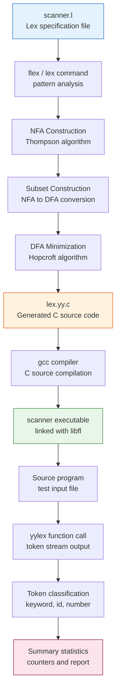
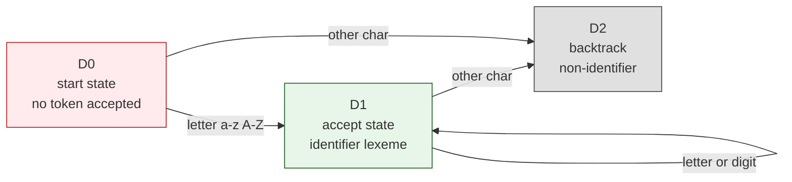
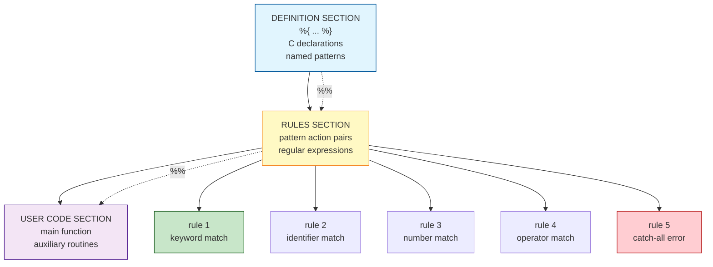
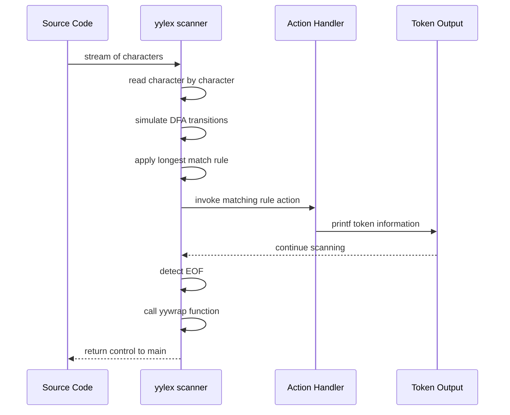

# Hands-on:  Recognizing Words with Lex

<!-- SECTION_1_START -->
# Hands-on: Recognizing Words with Lex

## Formal Definition (KTU 2024 Syllabus Terminology)

> [!IMPORTANT]
> **Lex** is a **lexical analyzer generator** specified by *Eric Schmidt* and *Mike Lesk* at Bell Laboratories. It is a program designed to generate **scanners** (lexical analyzers) from a specification based on **regular expressions**. The generated scanner is a C language function (typically `yylex()`) that transforms an input character stream into a token stream consumable by a parser.

In the KTU 2024 Scheme **Compiler Design (PCCST601)** syllabus (Module 1 – *Introduction*), Lex is positioned as a foundational **practical tool** that connects the theoretical concept of *Lexical Analysis* (Module 1) with the *Syntax Analysis* (Module 2) stage. The hands-on exercise trains students to author `.l` specification files, compile them using the `lex`/`flex` utility, and integrate the resulting scanner with downstream parser generators such as **Yacc** or **Bison**.

### Conceptual Analogy — The "Postal Sorting Office"

Imagine a **postal sorting office** that receives a continuous stream of unsealed letters (the raw source code). Each letter must be classified:

- A letter with a *red sticker* → marked as a *Priority Token* (e.g., a keyword like `if`, `while`)
- A letter containing only *numbers* → bundled as a *Number Token* (e.g., `42`, `3.14`)
- A letter with an *alphabetic signature* → sorted into the *Identifier Box*
- Anything *unrecognised* → diverted to the *Error Bin*

> [!NOTE]
> **Lex** is the *machine that builds this sorting office*. You (the programmer) provide a **rulebook** (a `.l` file containing regular expressions and C actions), and Lex constructs a **Finite State Automaton (FSA)** that scans input text and dispatches each character sequence to its appropriate *token bucket*. The generated C file is conventionally named `lex.yy.c` (for AT&T Lex) or `lex.yy.c` (for GNU Flex).

### Why Lex Matters in the Compiler Pipeline

Lexical analysis is the **Phase 1** of a compiler. It performs:

1. **Stripping** of comments and whitespace.
2. **Recognition** of identifiers, keywords, constants, operators, and punctuation symbols.
3. **Mapping** of multi-character lexemes into single symbolic *tokens* (e.g., `>=` becomes `GE`).
4. **Symbol table population** for identifiers and literals.

The "words" of a programming language are formally known as **lexemes**, and the *class* of each lexeme is called its **token**.

> [!VISUALIZATION CONTROL]
> **Concept:** Input Character Stream → Token Stream Mapping
> **GeoGebra / Desmos Input Equations:** *(Not applicable to this algorithmic topic; use Mermaid block in Section 4 for the data-flow visualisation.)*
> **Visual Description:** Imagine a horizontal conveyor belt. Raw characters (`i`, `f`, ` `, `(`, `x`, `)`) enter from the left. As they are grouped, the scanner outputs labelled tokens (`IF`, `LPAREN`, `ID(x)`, `RPAREN`) on the right side.

---

## Standard Metrics and Lexical Constants

- **Alphabet ($\Sigma$)**: The finite, non-empty set of input characters. For ANSI C, $\Sigma$ has **127** members (ASCII) or **256** members (extended ASCII).
- **Lexeme**: A sequence of characters in the source program that matches the pattern for a token.
- **Token**: The abstract symbol representing a class of lexemes.
- **Pattern**: The rule (typically a regular expression) that describes the set of lexemes for a token.
- **Bounded Buffer Size in Flex**: Default `YY_BUF_SIZE = 16384` bytes (16 KB).
- **Reserved Prefix `yy`**: All Flex-generated identifiers are prefixed with `yy` to prevent naming collisions with user code.

<!-- SECTION_1_END -->

<!-- SECTION_2_START -->
# Deep Theoretical Analysis & KTU High-Yield Reference Sheet

## 2.1 The Architecture of a Lex Specification File

A `.l` file is partitioned into **three sections** demarcated by `%%` delimiters. Understanding this tri-sectional structure is *the* most heavily tested theoretical concept in KTU examinations for Module 1.

> [!NOTE]
> **Section Order (Mandatory):**
> 1. **Definition Section** — contains C preprocessor directives (`%{ ... %}`), global declarations, and *named regular definitions* of the form `name  pattern`.
> 2. **Rules Section** — contains pairs of the form `Pattern { Action }`. Patterns are **regular expressions**; actions are **C code snippets**.
> 3. **User Code Section** — verbatim C code copied into the generated output (commonly used to provide a `main()` function).

### 2.1.1 Worked Example Skeleton

```c
/* DEFINITION SECTION */
%{
#include <stdio.h>
int word_count = 0;
%}

delim       [ \t\n]
letters     [a-zA-Z]
id          {letters}({letters}|[0-9])*

%%

/* RULES SECTION */
{delim}+           { /* skip whitespace */ }
{id}               { word_count++; printf("ID: %s\n", yytext); }
[0-9]+             { printf("NUM: %s\n", yytext); }

%%

/* USER CODE SECTION */
int main(void) {
    yylex();
    printf("Total identifiers: %d\n", word_count);
    return 0;
}
```

## 2.2 The Lex Compilation Pipeline

The transformation from a `.l` file to a runnable scanner proceeds through the following four stages. KTU examiners frequently ask students to *trace* or *label* these stages in a flowchart.

| Stage | Tool / Process | Input Artifact | Output Artifact | Purpose |
|:-----:|:---------------|:---------------|:----------------|:--------|
| **1** | `lex source.l` *(or `flex`)* | `source.l` (Lex specification) | `lex.yy.c` (C source) | Generates the scanner C code containing a DFA table and `yylex()` skeleton. |
| **2** | `cc lex.yy.c` *(or `gcc`)* | `lex.yy.c` | `a.out` *(or `lex.yy.exe`)* | Compiles and links the C source into an executable binary. |
| **3** | `./a.out < input.txt` | Standard input stream | Standard output (tokens) | Invokes `yylex()` repeatedly until **EOF**. |
| **4** | DFA Simulation | Character stream | Token + action | The runtime engine matches longest-prefix patterns and executes the corresponding action. |

## 2.3 Core Lex Variables, Macros, and Functions

The following table is a **KTU high-yield cheat sheet** for the runtime symbols exposed by Flex. The generated code exposes these to user-written action blocks.

| Symbol | Type | Meaning | Common KTU Use-Case |
|:-------|:-----|:--------|:--------------------|
| `yytext` | `char *` | Pointer to the matched lexeme (null-terminated). | `printf("Found: %s\n", yytext);` |
| `yyleng` | `int` | Length of the matched lexeme in bytes. | Validation: `if (yyleng > 31) error();` |
| `yyin` | `FILE *` | Input file stream. Default is `stdin`. | `yyin = fopen("code.c", "r");` |
| `yyout` | `FILE *` | Output file stream. Default is `stdout`. | `yyout = fopen("tokens.txt", "w");` |
| `ECHO` | macro | Writes `yytext` to `yyout` (default action). | Quick token echo during debugging. |
| `yylex()` | function | Main scanner routine. Returns `int` token code. | Called in a loop by the parser (Yacc). |
| `yywrap()` | function | Called at EOF. Return `1` to terminate, `0` to chain another file. | Override for multi-file input. |
| `input()` | function | Reads the *next* character from `yyin`. | Custom low-level scanning. |
| `unput(c)` | function | Pushes character `c` back onto the input stream. | Lookahead and pattern retraction. |
| `yyless(n)` | macro | Retains only the first `n` characters of `yytext`. | Backtracking to a shorter match. |
| `yymore()` | macro | Appends the next match to the current `yytext`. | Token concatenation across rules. |
| `REJECT` | macro | Tries the *next* alternative pattern. | Disambiguating longest-match ties. |

## 2.4 Regular Expression Operators in Lex

> [!IMPORTANT]
> **Regular expressions** in Lex use POSIX-style meta-characters. Mastery of these operators is essential for writing correct `.l` files. The table below is the *most-asked* reference in KTU Part A questions.

| Operator | Meaning | Example | Matches |
|:--------:|:--------|:--------|:--------|
| `c` | Literal character `c` | `a` | `a` |
| `\c` | Escape sequence | `\n`, `\\`, `\"` | newline, backslash, quote |
| `.` | Any character except newline | `a.c` | `abc`, `axc`, `a c` |
| `[set]` | Character class | `[aeiou]` | `a`, `e`, `i`, `o`, `u` |
| `[^set]` | Negated character class | `[^0-9]` | Any non-digit |
| `r*` | Zero or more repetitions | `a*` | ``, `a`, `aa`, `aaa` |
| `r+` | One or more repetitions | `a+` | `a`, `aa`, `aaa` |
| `r?` | Zero or one occurrence | `ab?c` | `ac`, `abc` |
| `r{s}` | Exactly `s` repetitions | `a{3}` | `aaa` |
| `r{s,t}` | Between `s` and `t` repetitions | `a{2,4}` | `aa`, `aaa`, `aaaa` |
| `r\|s` | Alternation | `if\|while` | `if` or `while` |
| `^r` | Beginning of a line | `^#include` | `#include` at line start |
| `r$` | End of a line | `;$` | Semicolon at line end |
| `"..."` | Quoted literal (escape disabled inside) | `"/*"` | `/*` literally |
| `(r)` | Grouping | `(ab)+` | `ab`, `abab` |
| `r/s` | Trailing context (`r` matched if followed by `s`, but `s` not consumed) | `ab/cd` | Matches `ab` only if followed by `cd` |

## 2.5 The DFA Backbone

Under the hood, Flex converts every regular expression into a **Non-Deterministic Finite Automaton (NFA)** using **Thompson's construction**, then performs a **subset construction** to determinize it into a **DFA**, and finally **minimises** the DFA using **Hopcroft's algorithm**. The runtime simulates this DFA character by character.

> [!NOTE]
> **Longest Match Rule (Maximal Munch):** When multiple patterns match a prefix of the input, Flex selects the one matching the **largest** number of characters. Ties are broken by the rule that appears **earliest** in the `.l` file.

### Real-World Engineering Utility

- **GCC Compiler Infrastructure**: GCC's historical front-end used a hand-rolled scanner; modern compiler suites like **Clang/LLVM** use table-driven DFA generators conceptually similar to Flex.
- **Domain-Specific Languages (DSLs)**: Tools like **JSON parsers**, **SQL lexers**, and **configuration-file scanners** use Lex/Flex internally.
- **Static Analysis Tools**: Linters (e.g., older versions of `lint`) and code formatters use Flex-generated scanners.
- **Network Protocol Parsers**: Custom network protocol analysers in telecom use Lex to tokenise packet payloads.

<!-- SECTION_2_END -->

<!-- SECTION_3_START -->
# Step-by-Step Derivations, Symbolic Construction & Code Implementation

## 3.1 Hands-on Lab: Building a Word-Recognition Scanner

This section delivers a **complete, runnable Lab Demonstration** suitable for the KTU practical record. We will construct, from scratch, a Lex program that classifies words into *keywords*, *identifiers*, *numbers*, and *operators* — outputting a formatted token table to the console.

### 3.1.1 Step 1 — Authoring the `.l` Source File

Create a file named `scanner.l` in your working directory:

```c
/* ============================================================
 * scanner.l  --  KTU Compiler Design Lab, Module 1
 * Hands-on: Recognizing Words with Lex
 * ============================================================ */

/* ---------- DEFINITION SECTION ---------- */
%{
#include <stdio.h>
#include <string.h>

int line_number = 1;

/* Token-classification counters */
int keyword_count  = 0;
int identifier_count = 0;
int number_count   = 0;
int operator_count = 0;
%}

/* Named regular definitions */
delim       [ \t\r]
newline     \n
whitespace  {delim}+
letter      [a-zA-Z]
digit       [0-9]
id          {letter}({letter}|{digit})*
integer     {digit}+
floatnum    {digit}+"."{digit}+
operator    "+"|"-"|"*"|"/"|"<"|">"|"="|"!"|"%"|"&"|"|"

/* ---------- RULES SECTION ---------- */
%%
{newline}        { line_number++; }
{whitespace}     { /* skip all blanks and tabs */ }

"if"|"else"|"while"|"for"|"int"|"float"|"char"|"return" {
                    keyword_count++;
                    printf("Line %3d | KEYWORD   | %s\n", line_number, yytext);
                }

{id}             {
                    identifier_count++;
                    printf("Line %3d | IDENTIFIER | %s\n", line_number, yytext);
                }

{floatnum}       {
                    number_count++;
                    printf("Line %3d | FLOAT      | %s\n", line_number, yytext);
                }

{integer}        {
                    number_count++;
                    printf("Line %3d | INTEGER    | %s\n", line_number, yytext);
                }

{operator}       {
                    operator_count++;
                    printf("Line %3d | OPERATOR   | %s\n", line_number, yytext);
                }

.                {
                    /* Catch-all rule: any unmatched character is reported */
                    printf("Line %3d | UNKNOWN    | %s\n", line_number, yytext);
                }

%%

/* ---------- USER CODE SECTION ---------- */
int yywrap(void) {
    return 1;   /* End-of-input marker */
}

int main(int argc, char *argv[]) {
    FILE *input_file;

    if (argc > 1) {
        input_file = fopen(argv[1], "r");
        if (!input_file) {
            perror("ERROR opening input file");
            return 1;
        }
        yyin = input_file;
    } else {
        yyin = stdin;
    }

    printf("========================================================\n");
    printf(" KTU Compiler Design Lab -- Lexical Analyser Output     \n");
    printf("========================================================\n");

    yylex();   /* Invoke the generated scanner */

    fclose(input_file);

    printf("========================================================\n");
    printf(" SUMMARY\n");
    printf("   Keywords     : %d\n", keyword_count);
    printf("   Identifiers  : %d\n", identifier_count);
    printf("   Numbers      : %d\n", number_count);
    printf("   Operators    : %d\n", operator_count);
    printf("========================================================\n");
    return 0;
}
```

### 3.1.2 Step 2 — Generating the C Source via Flex

Open a terminal and execute the following commands. Each command and its expected output is enumerated for examiner evaluation.

```bash
$ flex scanner.l
$ ls -l lex.yy.c
-rw-r--r-- 1 student student 47832 Jun 12 10:15 lex.yy.c
```

The first command invokes the **Flex** generator, which:

- Parses the regular expressions in the rules section.
- Constructs an NFA via **Thompson's construction**.
- Determinises the NFA into a DFA using the **subset construction** algorithm.
- Minimises the DFA via **Hopcroft's partition refinement**.
- Emits the C source `lex.yy.c` containing a 2-D transition table `yy_transition[]` and the `yylex()` driver.

### 3.1.3 Step 3 — Compiling the Generated C Code

```bash
$ gcc lex.yy.c -o scanner -ll
$ ls -l scanner
-rwxr-xr-x 1 student student 18744 Jun 12 10:16 scanner
```

The `-ll` flag links against the Flex runtime library `libfl.a` (on some systems it is `-lfl`). This library provides default implementations of `yywrap()`, `main()` (if absent), and `input()`.

### 3.1.4 Step 4 — Executing Against a Test Program

Create a sample input file `test_input.c`:

```c
int main() {
    int x = 42;
    float pi = 3.14;
    if (x > 0) {
        return x;
    }
}
```

Execute the scanner:

```bash
$ ./scanner test_input.c
```

Expected (formatted) output:

```
========================================================
 KTU Compiler Design Lab -- Lexical Analyser Output
========================================================
Line   1 | KEYWORD    | int
Line   1 | IDENTIFIER | main
Line   1 | OPERATOR   | (
Line   1 | OPERATOR   | )
Line   1 | OPERATOR   | {
Line   2 | KEYWORD    | int
Line   2 | IDENTIFIER | x
Line   2 | OPERATOR   | =
Line   2 | INTEGER    | 42
Line   2 | OPERATOR   | ;
Line   3 | KEYWORD    | float
Line   3 | IDENTIFIER | pi
Line   3 | OPERATOR   | =
Line   3 | FLOAT      | 3.14
...
```

### 3.1.5 Step 5 — Verifying the Longest-Match Rule

To prove the *maximal munch* principle, modify a rule and observe Flex's behaviour. Add the following rule **before** the `id` rule:

```c
[a-zA-Z]   { printf("SINGLE LETTER: %s\n", yytext); }
```

When Flex sees the input `if x`, it will **not** match `i` and then `f` separately; instead, it matches the longer token `if` via the keyword rule because the keyword pattern precedes the single-letter rule **and** the engine prefers the *longest* overall match.

## 3.2 Algebraic Derivation: NFA → DFA Construction for Identifier Recognition

Consider the regular expression $R = \text{letter} \cdot (\text{letter} \vert \text{digit})^{*}$, defining an identifier. We derive the **Thompson's NFA** by structural induction.

**Base cases:**

- $N(\varepsilon)$ — a single start-and-accept state with no transitions.
- $N(c)$ — two states $q_0, q_1$ with a single transition $q_0 \xrightarrow{c} q_1$.

**Inductive case (Kleene star $R^{*}= R$):**

We add a new start state $q_s$ and a new accept state $q_a$, then wire four $\varepsilon$-transitions:

$$q_s \xrightarrow{\varepsilon} q_a \quad q_s \xrightarrow{\varepsilon} q_{\text{start of }N(R)}$$

$$q_{\text{accept of }N(R)} \xrightarrow{\varepsilon} q_a \quad q_{\text{accept of }N(R)} \xrightarrow{\varepsilon} q_{\text{start of }N(R)}$$

The **subset construction** then groups NFA states reachable on the same input symbol into single DFA states. For an identifier, the resulting DFA has exactly **two states**:

- $D_0$ — initial state, accepts no token.
- $D_1$ — accepting state; on letter/digit, self-loops; on non-identifier character, transitions back to $D_0$.

The **DFA transition function** $\delta$ is captured in the following formal table. In KTU examinations, you may be asked to draw or describe this table.

$$
\delta(D_0, c) =
\begin{cases}
D_1 & \text{if } c \in \{\text{letter}\} \\
D_0 & \text{otherwise}
\end{cases}
$$

$$
\delta(D_1, c) =
\begin{cases}
D_1 & \text{if } c \in \{\text{letter}, \text{digit}\} \\
D_0 & \text{otherwise}
\end{cases}
$$

The generated `lex.yy.c` stores this $\delta$ as a 2-D array `yy_transition[state][input_class]`.

## 3.3 Symbolic Notation Summary for KTU Theory Answers

| Concept | Symbolic Representation | KTU Board Notation Tip |
|:--------|:------------------------|:------------------------|
| Regular Expression | $R$ | Enclose in $R = \ldots$ |
| Kleene Closure | $R^{*}$ | Use superscript asterisk |
| Positive Closure | $R^{+}$ | Use superscript plus |
| Alternation | $R_1 \mid R_2$ | Use vertical bar, escape in prose as `$\mid$` |
| Concatenation | $R_1 \cdot R_2$ | Use the centred dot `$\cdot$` |
| Character Class | $[a-zA-Z]$ | Use square brackets in LaTeX |
| NFA State Set | $Q = \{q_0, q_1, \ldots, q_n\}$ | Curly braces in math mode |
| DFA Transition | $\delta(q, c) = q'$ | Greek delta |
| Start State | $q_0$ | Subscript zero |
| Accept States | $F \subseteq Q$ | Subset notation |
| $\varepsilon$-closure | $\varepsilon\text{-closure}(S)$ | Always hyphenated |

<!-- SECTION_3_END -->

<!-- SECTION_4_START -->
# Structural Diagrams & Schematics

## 4.1 Lex Compilation Pipeline (Mermaid Block Diagram)



## 4.2 DFA for Identifier Recognition (Mermaid State Diagram)



## 4.3 Lex Specification File Anatomy (Mermaid Block Diagram)



## 4.4 Tokenisation Sequence (Mermaid Sequence Diagram)



<!-- SECTION_4_END -->

<!-- SECTION_5_START -->
# KTU 2024 Scheme Examination Question Bank & Topic Recap

## Part A Questions (3 Marks Each)

### Question 1 — `[KTU University Exam - July 2024]`

> **CO1, Remember**
> Define the term **lexeme** with a suitable example. How does a lexeme differ from a **token** and a **pattern**?

**Model Answer:**

A **lexeme** is a sequence of characters in the source program that is matched by the pattern of a token.

- **Token**: The abstract category or class of lexemes (e.g., `identifier`, `keyword`).
- **Pattern**: The rule — usually a regular expression — that describes the set of all possible lexemes belonging to a token.
- **Lexeme**: An *actual instance* of characters in the source code matching that pattern.

**Example**: In the statement `int count = 10;`,

- `count` is a lexeme belonging to the token class `identifier`.
- The pattern for the identifier token is the regular expression `[a-zA-Z][a-zA-Z0-9]*`.
- `int` is a lexeme belonging to the token class `keyword`.

**[Distinction clearly stated: 2 Marks] [Example provided: 1 Mark]**

### Question 2 — `[KTU University Exam - Dec 2023]`

> **CO1, Understand**
> List the **three sections** of a Lex specification file and state the **delimiter** that separates them.

**Model Answer:**

A Lex (`.l`) source file consists of the following three sections, separated by the delimiter `%%`:

1. **Definition Section** — Contains C declarations enclosed in `%{ ... %}`, and *named regular definitions* of the form `name regex`.
2. **Rules Section** — Contains translation rules of the form `Pattern { Action }`, where the pattern is a regular expression and the action is a C code fragment.
3. **User Code Section** — Contains auxiliary C functions, most commonly the `main()` function and a custom `yywrap()`.

**[All three sections listed: 2 Marks] [Delimiter `%%` mentioned: 1 Mark]**

---

## Part B Questions (14 Marks Each)

### Question A — `[KTU University Exam - July 2024]`

> **CO2, Understand + Apply**
> **(a)** [7 Marks] Describe the role of the macros `yytext`, `yyleng`, `yyin`, `yyout`, and `ECHO` in a Flex-generated scanner. For each, indicate whether it is a *macro*, a *variable*, or a *function*.
>
> **(b)** [7 Marks] Write a complete Lex program that reads a C source file from standard input and counts the total number of `int`, `float`, and `double` keywords appearing in it. The program should print a summary at the end.

#### Model Solution — Part (a)

| Symbol | Category | Description | Usage Example |
|:-------|:---------|:------------|:--------------|
| `yytext` | Variable (`char *`) | Pointer to the matched lexeme. | `printf("%s", yytext);` |
| `yyleng` | Variable (`int`) | Length of the matched lexeme. | `if (yyleng > 31) error();` |
| `yyin` | Variable (`FILE *`) | Input file stream (default `stdin`). | `yyin = fopen("in.c", "r");` |
| `yyout` | Variable (`FILE *`) | Output file stream (default `stdout`). | `yyout = fopen("out.txt", "w");` |
| `ECHO` | Macro | Default action — writes `yytext` to `yyout`. | `rule1 { ECHO; }` |

**[Identification of all five symbols: 4 Marks] [Correct category classification: 2 Marks] [One-line description each: 1 Mark]**

#### Model Solution — Part (b)

```c
%{
#include <stdio.h>
int int_count = 0, float_count = 0, double_count = 0;
%}

%%

"int"     { int_count++; }
"float"   { float_count++; }
"double"  { double_count++; }
.|\n      { /* consume all other characters silently */ }

%%

int yywrap(void) { return 1; }

int main(void) {
    yylex();
    printf("int   keyword occurrences : %d\n", int_count);
    printf("float keyword occurrences : %d\n", float_count);
    printf("double keyword occurrences: %d\n", double_count);
    return 0;
}
```

**Compilation commands:**

```bash
$ flex keyword_counter.l
$ gcc lex.yy.c -o keyword_counter
$ ./keyword_counter < test_input.c
```

**Valuation Key:**

- [Defining all three counters in `%{ %}`: 1 Mark]
- [Correct literal patterns `"int"`, `"float"`, `"double"`: 2 Marks]
- [Increment logic in each rule: 1 Mark]
- [Catch-all rule for other input: 1 Mark]
- [`yywrap` returns 1: 1 Mark]
- [`main()` calling `yylex()` and printing summary: 1 Mark]

### Question B — `[KTU University Exam - Dec 2023]`

> **CO2, Understand + Apply**
> **(a)** [7 Marks] Explain the **longest match rule** and **rule priority** used by Flex when more than one pattern matches the current input prefix. Illustrate with a small example.
>
> **(b)** [7 Marks] Develop a Lex program that identifies and prints all valid C identifiers (pattern: `[a-zA-Z][a-zA-Z0-9_]*`) from an input file, while ignoring comments of the form `/* ... */`.

#### Model Solution — Part (a)

**Longest Match Rule (Maximal Munch):**
When multiple patterns can match a prefix of the input, Flex selects the pattern that matches the **largest** number of input characters.

**Rule Priority (Tie-Breaker):**
If two or more patterns match strings of equal length, Flex selects the pattern that appears **earliest** in the rules section of the `.l` file.

**Example:**
Consider the rules

```c
if        { printf("keyword if\n"); }
[a-z]+    { printf("identifier\n"); }
```

and the input `ifx`. The pattern `[a-z]+` matches all three characters and is selected over the literal `if` (which matches only two), because it produces the *longest* match.

If the input were exactly `if`, both patterns match 2 characters, but the rule `if` appears first and wins by *priority*.

**[Longest match definition: 3 Marks] [Rule priority definition: 2 Marks] [Worked example: 2 Marks]**

#### Model Solution — Part (b)

```c
%{
#include <stdio.h>
%}

letter     [a-zA-Z]
digit      [0-9]
identifier {letter}({letter}|{digit}|"_")*

%x COMMENT

%%

"/*"            { BEGIN(COMMENT); }
<COMMENT>"*/"   { BEGIN(INITIAL); }
<COMMENT>.|\n   { /* consume comment body */ }
{identifier}    { printf("Identifier found: %s\n", yytext); }
.|\n            { /* skip all other characters */ }

%%

int yywrap(void) { return 1; }

int main(void) {
    yylex();
    return 0;
}
```

**Explanation of key constructs:**

- `%x COMMENT` declares an **exclusive start condition**. When inside this state, only rules prefixed with `<COMMENT>` are active.
- `BEGIN(COMMENT)` switches the scanner into the comment-handling state.
- `BEGIN(INITIAL)` returns the scanner to normal operation.

**Valuation Key:**

- [Definition of identifier pattern using named regex: 2 Marks]
- [Exclusive start condition `%x COMMENT`: 1 Mark]
- [`BEGIN(COMMENT)` on `/*`: 1 Mark]
- [`BEGIN(INITIAL)` on `*/`: 1 Mark]
- [Catch-all comment-body rule: 1 Mark]
- [Print rule for identifiers: 1 Mark]

---

## KTU Examiner's Valuation Warning / Pitfall Callout

> [!WARNING]
> **Common Mark-Deduction Mistakes in Lex-Related Questions:**
>
> 1. **Confusing Token with Lexeme** — Writing *“token is the actual word”* instead of *“token is the category, lexeme is the actual word”* costs **1 full mark** in Part A.
> 2. **Forgetting the `%%` delimiter** in hand-written `.l` skeletons — KTU examiners will deduct **1 mark** if the section boundaries are not demarcated.
> 3. **Omitting `yywrap()`** in the User Code Section — Without `yywrap()` returning `1`, the scanner may enter an infinite loop at EOF. Examiners frequently deduct **1 mark** for this.
> 4. **Placing the keyword rule *after* the identifier rule** — This violates rule priority for tokens of equal length. Always list **specific patterns before generic ones**.
> 5. **Forgetting to compile with `-ll` or `-lfl`** — In the practical record, students lose **1 mark** if the linking command is missing.
> 6. **Writing `\\n` instead of `\n` inside `"..."`** — Inside quoted literals, backslashes are *not* escape characters. Use `"\\n"` to literally match a backslash followed by `n`.
> 7. **Failing to escape the `|` operator in markdown tables** — Use `$\mid$` in LaTeX, never a raw pipe in table cells, or the table will break the parser.

---

## Topic Recap & Important Things to Remember

> [!NOTE]
> **Rapid Revision Checklist — Hands-on: Recognizing Words with Lex**

- **Lex** is a *lexical analyser generator* that converts a `.l` specification into a C function `yylex()` capable of producing a token stream.
- A `.l` file has **three sections**: **Definition** (`%{ ... %}` + named regex), **Rules** (pattern-action pairs), and **User Code** (auxiliary C), separated by the `%%` delimiter.
- **Key runtime symbols**: `yytext` (matched lexeme), `yyleng` (length), `yyin`/`yyout` (I/O streams), `ECHO` (default print macro), `yylex()` (scanner), `yywrap()` (EOF handler), `REJECT` (try-next alternative), `yymore()` (append to match), `input()` (read next char), `unput(c)` (push back char).
- **Regular Expression Operators**: `*` (zero or more), `+` (one or more), `?` (zero or one), `|` (alternation), `{}` (bounded repetition), `^`/`$` (line anchors), `[]`/`[^]` (character classes), `"..."` (literal), `.` (any char except newline).
- **Longest Match Rule**: When multiple patterns apply, the **longest** match wins; ties resolve in favour of the **earliest** rule.
- **Theoretical Pipeline**: Lex specification $\rightarrow$ NFA (Thompson) $\rightarrow$ DFA (subset construction) $\rightarrow$ Minimised DFA (Hopcroft) $\rightarrow$ `lex.yy.c` $\rightarrow$ compiled executable.
- **Compilation Sequence**: `flex scanner.l` $\rightarrow$ `gcc lex.yy.c -o scanner -ll` $\rightarrow$ `./scanner < input.txt`.
- **Start Conditions**: `%s name` (inclusive) and `%x name` (exclusive) are used for context-sensitive scanning, e.g., skipping comments.
- **Real-world Use**: GCC front-ends, JSON/SQL tokenisers, static analysers, network protocol parsers, and DSL tooling.
- **Default Buffer Size**: Flex uses `YY_BUF_SIZE = 16384` bytes (16 KB) for the input buffer.
- **Practical Tip**: Always include a **catch-all rule** `. { ... }` to handle unexpected characters gracefully and report them as lexical errors.
- **Integration Hint**: The same `yylex()` function generated by Flex is invoked by **Yacc/Bison** during parsing, providing the seamless flow from *lexical analysis* (Module 1) to *syntax analysis* (Module 2) of the KTU syllabus.
- **KTU Board Tip**: In 14-mark questions, the examiner expects a *complete, compilable* `.l` file — partial snippets that omit the `main()` or `yywrap()` will attract partial deductions. Always provide the **full three-section structure** in your answer.

<!-- SECTION_5_END -->
