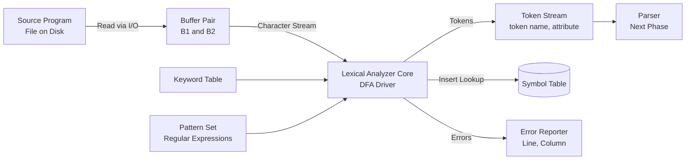
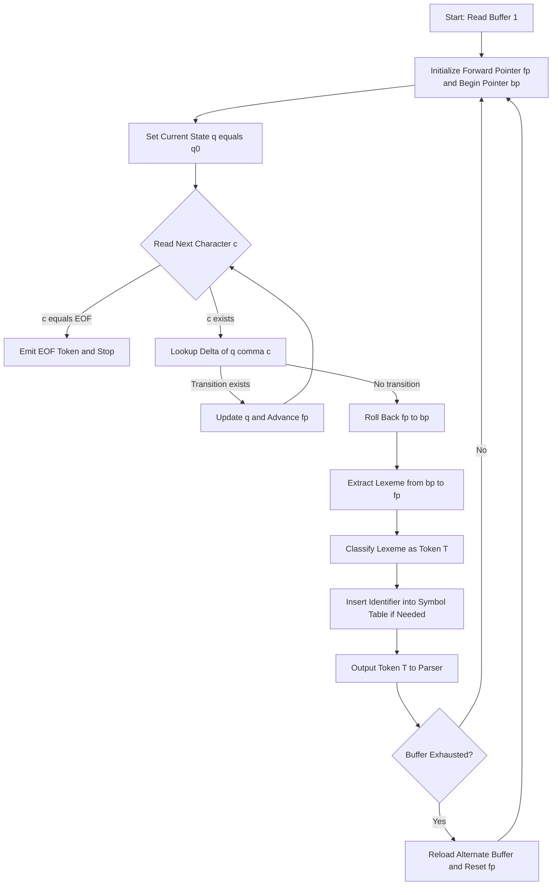
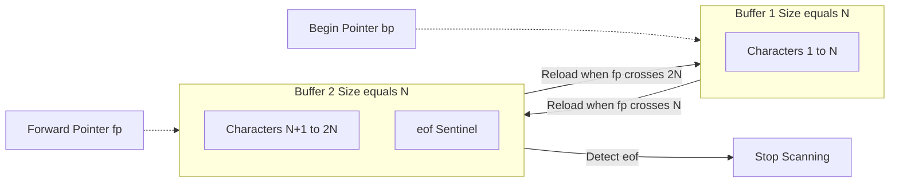
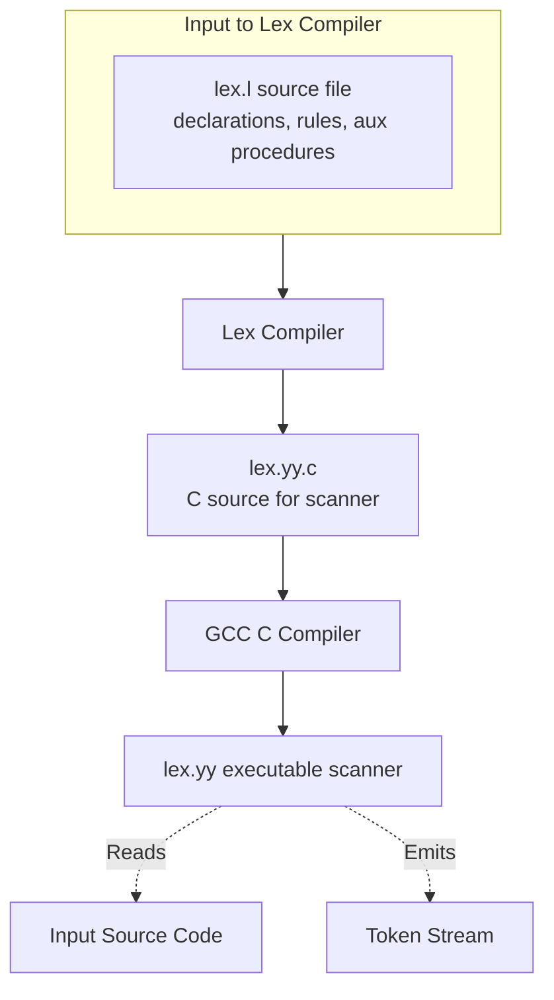
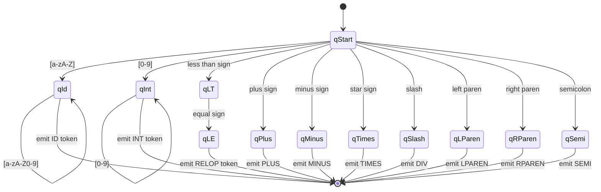

# Implementing Scanners

<!-- SECTION_1_START -->
# Implementing Scanners — KTU 2024 Scheme | COMPILER DESIGN (PCCST601)

## 1. Core Technical Definition & Intuitive Overview

### 1.1 Formal Definition (KTU 2024 Syllabus Terminology)

A **Scanner** (also called a **Lexical Analyzer** or **Lexer**) is the first phase of a compiler that performs a front-end preprocessing task on the source program. Its primary responsibility is to read the input source code character stream, group the characters into meaningful sequences called **lexemes**, and produce a stream of **tokens** as output, which is then passed to the Syntax Analyzer (Parser) for further processing.

> [!IMPORTANT]
> **KTU 2024 Definition (Board Standard):** The lexical analyzer is a program that takes the source program as input and produces a stream of tokens. Each token is a pair `(token_name, attribute_value)`, where `token_name` is an abstract symbol representing the kind of lexical unit, and `attribute_value` points to the symbol-table entry for that token.

### 1.2 Core Lexical Concepts

| Concept | Formal Definition |
| :--- | :--- |
| **Token** | A pair consisting of a token name and an optional attribute value. E.g., `<id, pointer_to_symbol_table>` |
| **Pattern** | A rule (often a Regular Expression) describing the set of lexemes that can represent a particular token in the source program. |
| **Lexeme** | A sequence of characters in the source program that matches the pattern for a token. E.g., `counter`, `123`, `<=` |
| **Alphabet (Σ)** | A finite set of input symbols (ASCII, Unicode characters). |
| **String over Σ** | A finite sequence of symbols drawn from alphabet Σ. |
| **Language** | A countable set of strings over some fixed alphabet Σ. |

> [!NOTE]
> **Syllabus Highlight:** A *pattern* is a rule, a *lexeme* is the actual substring, and a *token* is the classified category. Many distinct lexemes (e.g., `count`, `index`, `x42`) can map to the **same token** (`identifier`).

### 1.3 Conceptual Analogy / Intuition

Imagine a **postal sorting facility**:
- **Mail bags** (full of unsorted letters) = the raw source program character stream.
- **The Conveyor Belt System** = the scanner itself.
- **Letters** = individual characters/lexemes.
- **Sorting Bins** (Domestic, International, Express, Junk Mail) = the distinct **token categories**.
- **Tracking Barcodes assigned to each letter** = the `(token_name, attribute_value)` pair placed in the symbol table.

The sorting facility does not *read* the contents of every letter; it just looks at the **address patterns** (zip codes, formatting) to drop each letter into the right bin. Similarly, the scanner does not understand the deeper *meaning* (semantics) of the program; it merely groups characters by **patterns** (regular expressions) into token categories.

### 1.4 Real-World Engineering Utility

In **production compiler systems** (GCC, Clang/LLVM, V8 JavaScript Engine), the scanner is a high-performance, hot-path component. It must:
- Process **megabytes of source code per second**.
- Strip out **comments**, **whitespace**, and **preprocessor directives** in C/C++.
- Identify **keywords** vs. **user-defined identifiers**.
- Track **line numbers** for accurate error reporting.

In modern compilers, the scanner is often **hand-written in C/C++ for speed** (e.g., the Re2c tool generates DFA-based scanners used in PHP's runtime).

### 1.5 Buffer Pair Visual Analogy (Sentinels)

The scanner does not read one character at a time from disk (that would be slow). It reads large **buffers** of source text. Most compilers use the **Buffer Pair** mechanism:

> [!VISUALIZATION CONTROL]
> **Concept:** Two alternating buffers of fixed size (e.g., 4096 bytes each) with an End-of-File (EOF) marker.
> **GeoGebra / Desmos Input Equations:**
> * `Buffer A: offset 0 to 4095` & `Buffer B: offset 4096 to 8191`
> * `Forward Pointer: f(p) = p + 1 mod (2N)`
> * `Lexeme Begin: p`, `Forward Pointer: p + |lexeme|`
> **Visual Description:** Two contiguous rectangular blocks on the x-axis. The first block (A) fills up, then the second (B) loads. The arrows (begin/fwd) sweep across the blocks, wrapping around once B is exhausted.

<!-- SECTION_1_END -->

<!-- SECTION_2_START -->
# 2. Deep Theoretical Analysis & KTU High-Yield Formula Sheet

## 2.1 Architectural Pipeline of the Scanner

The scanner is the first phase of the compiler's **Analysis** front-end. Its data flow is:

$$
\text{Source Code} \longrightarrow \text{Scanner} \longrightarrow \text{Token Stream} \longrightarrow \text{Parser}
$$

During scanning, two auxiliary tasks happen simultaneously:
1. **Stripping** whitespace, comments, and formatting.
2. **Interaction with the Symbol Table** for inserting identifiers and looking up keywords.

### 2.2 Three Primary Approaches to Scanner Construction

#### A. Ad-Hoc / Hand-Written Scanners
- Uses simple **state-transition code** (often a `switch` or `goto` based dispatcher).
- Pros: maximum speed, complete control.
- Cons: hard to maintain, error-prone.

#### B. Table-Driven (DFA-Based) Scanners
- Convert Regular Expressions $\rightarrow$ NFA $\rightarrow$ DFA $\rightarrow$ Transition Table.
- The driver is a small loop that consults the table.
- Pros: provably correct, fast execution.
- Cons: large tables for complex languages.

#### C. Automated (Lex / Flex) Scanners
- The user writes **Regular Expressions** + Actions.
- The **Lex compiler** automatically produces the C source code for the scanner.
- Pros: concise, portable, easy to modify.
- Cons: generated code may be slower than hand-tuned.

### 2.3 Pattern Matching Strategies

When the scanner has located a candidate lexeme, it must verify that the lexeme matches a known pattern. Three strategies are taught in KTU:

| Strategy | Worst-Case Time | Description |
| :--- | :--- | :--- |
| **Naive / Brute Force** | $O(n \cdot m)$ | Try matching at every position, slide by one. |
| **Knuth-Morris-Pratt (KMP)** | $O(n + m)$ | Uses prefix function to skip failed alignments. |
| **Boyer-Moore** | $O(n / m)$ (avg.) | Skips characters using heuristic tables. |

> [!IMPORTANT]
> For KTU 2024 Module 1, focus primarily on the **DFA-based approach** and the **buffer management** strategies, as these are directly examinable.

### 2.4 KTU Formula Sheet / Cheat Sheet

| Symbol / Formula | Meaning / Use Case |
| :--- | :--- |
| $L(r) = \{s \mid s \text{ matches } r\}$ | Language generated by regular expression $r$ |
| $r \cdot s$ | Concatenation of two regular expressions |
| $r \mid s$ | Union (alternation) of patterns |
| $r^*$ | Kleene closure (zero or more repetitions) |
| $r^+$ | Positive closure (one or more repetitions) |
| $\epsilon$ | Empty string |
| $\vert \Sigma \vert$ | Size (cardinality) of the input alphabet |
| $\vert Q \vert$ | Number of states in the DFA |
| $N = 2 \cdot \text{BufferSize}$ | Total capacity of the buffer pair |
| $\delta(q, a) = q'$ | DFA transition function: from state $q$ on input $a$ go to $q'$ |
| $\text{followpos}(a)$ | Set of positions that can follow position $a$ in a regex syntax tree |
| $L(s_0) = \text{firstpos}(\text{root})$ | Start states of the DFA built from syntax tree |

### 2.5 Engineering Utility of DFA-Based Scanning

| Domain | Application |
| :--- | :--- |
| **Compilers** | Tokenization in GCC, Clang, javac, Roslyn (.NET) |
| **IDS / Firewalls** | Deep packet inspection uses regex $\rightarrow$ DFA for fast pattern matching. |
| **Bioinformatics** | DNA sequence scanning for motifs (e.g., REST sites). |
| **Web Search Engines** | URL filtering, log analysis, spam detection. |
| **IDE Tools** | Syntax highlighting, autocomplete, linting in VS Code, IntelliJ. |

### 2.6 Theoretical Foundation: Regular Expression to DFA

A scanner's correctness is founded on the **Kleene Theorem**:
> Every Regular Expression can be converted to an equivalent DFA, and every DFA defines a Regular Language.

The construction pipeline taught in KTU is:
$$
\text{Regex } r \;\xrightarrow{\text{Construction}}\; \text{Syntax Tree } T \;\xrightarrow{\text{followpos}}\; \text{NFA } M \;\xrightarrow{\text{Subset Construction}}\; \text{DFA } D \;\xrightarrow{\text{Partitioning}}\; \text{Minimal DFA } D_{\min}
$$

> [!NOTE]
> **Syllabus Highlight:** The conversion of a Regular Expression to a DFA via **Syntax Tree → followpos → DFAstates → DFAtransitions** is a frequently tested KTU 14-mark question.

<!-- SECTION_2_END -->

<!-- SECTION_3_START -->
# 3. Step-by-Step Derivations & Code/Symbolic Implementation

## 3.1 Worked Example: Regex → Syntax Tree → followpos → DFA

**Problem:** Convert the regular expression $r = (a \mid b)^* a b b$ into a DFA using the **Syntax-Tree + followpos** method.

### Step 1: Augmented Regular Expression

We introduce a unique end-marker $\#$ to make position $n+1$ explicit:

$$
r' = (a \mid b)^* a b b \#
$$

### Step 2: Build the Syntax Tree (Annotated with Positions)

Each **leaf** is given a unique integer position $i$. Internal nodes are operators.

| Node | Label | nullable | firstpos | lastpos |
| :---: | :---: | :---: | :---: | :---: |
| 1 | $a$ | F | $\{1\}$ | $\{1\}$ |
| 2 | $b$ | F | $\{2\}$ | $\{2\}$ |
| 3 | $(a \mid b)$ | F | $\{1, 2\}$ | $\{1, 2\}$ |
| 4 | $(a \mid b)^*$ | T | $\{1, 2\}$ | $\{1, 2\}$ |
| 5 | $a$ | F | $\{3\}$ | $\{3\}$ |
| 6 | $b$ | F | $\{4\}$ | $\{4\}$ |
| 7 | $b$ | F | $\{5\}$ | $\{5\}$ |
| 8 | $a b b$ | F | $\{3\}$ | $\{5\}$ |
| 9 | $(a \mid b)^* a b b$ | F | $\{1, 2, 3\}$ | $\{5\}$ |
| 10 | $\#$ | F | $\{6\}$ | $\{6\}$ |
| 11 | $r'$ (root) | F | $\{1, 2, 3, 6\}$ | $\{6\}$ |

### Step 3: Compute followpos for Each Position

- **followpos(1) = {1, 2, 3}** (from node 4, the Kleene star: a position in lastpos of $(a\mid b)^*$ can be followed by a position in firstpos; also from concatenation with node 5).
- **followpos(2) = {1, 2, 3}** (symmetric, from the star).
- **followpos(3) = {4}** (from concatenation, lastpos(5) of node 5? No — from concat of 5 and 6).
- **followpos(4) = {5}**.
- **followpos(5) = {6}** (from concat with $\#$).
- **followpos(6) = $\emptyset$**.

### Step 4: Build DFA States (Subset Construction)

| DFA State | Construction | Accepting? |
| :---: | :---: | :---: |
| $A$ | $\text{firstpos}(\text{root}) = \{1, 2, 3, 6\}$ | No (no $\#$ yet) |
| $B$ | $\text{followpos}(1) \cup \text{followpos}(2) \cup \text{followpos}(3) = \{1, 2, 3, 4\}$ | No |
| $C$ | $\text{followpos}(4) = \{5\}$ | No |
| $D$ | $\text{followpos}(5) = \{6\}$ | **Yes** (contains position 6) |

### Step 5: DFA Transition Table

| State | On $a$ | On $b$ |
| :---: | :---: | :---: |
| $A$ | $B$ | $B$ |
| $B$ | $B$ | $C$ |
| $C$ | — | $D$ |
| $D$ | — | — |

### Step 6: Final DFA (Final Simplified Form)

$$
A \xrightarrow{a,b} B \xrightarrow{a,b} B \xrightarrow{b} C \xrightarrow{b} D \;(\text{accepting})
$$

This DFA accepts **any string ending in** $abb$, exactly matching the language of $r$.

---

## 3.2 Worked Example: Buffer Pair with Sentinels

**Problem:** Show how the Buffer-Pair mechanism works for an input of 25 characters with buffer size $N = 10$.

The two buffers $B_1$ and $B_2$ are of equal size $N$ each. An `eof` sentinel is placed at the end of the last buffer that contains the EOF.

#### Step-by-Step Execution

| Step | Action | begin Pointer | forward Pointer | Notes |
| :---: | :--- | :---: | :---: | :--- |
| 1 | Initial state | 1 | 1 | Begin and forward both at the start. |
| 2 | Scan first 10 chars | 1 | 10 | $B_1$ exhausted, $B_2$ not yet loaded. |
| 3 | Reload $B_2$ from disk | 1 | 10 | Forward still at the boundary. |
| 4 | Scan next 10 chars | 1 | 20 | $B_2$ exhausted. |
| 5 | Reload $B_1$ (loop back) | 1 | 20 | Buffer pair mechanism reuses buffers. |
| 6 | Scan remaining 5 + eof | 1 | 25 | eof sentinel detected $\rightarrow$ stop. |

**Key Insight:** Only one buffer is loaded at a time, and the pointers *wrap around*. This minimizes I/O calls to exactly $k = \lceil n/N \rceil$ where $n$ is the program length.

---

## 3.3 Full Python Implementation: A Table-Driven Scanner

Below is a complete, type-hinted, runnable Python implementation of a **table-driven scanner** for a small language that supports `if`, `then`, identifiers, integers, the operators `+`, `-`, `*`, `/`, `(`, `)`, `;`, and the relational operator `<=`.

```python
"""
KTU 2024 Scheme | COMPILER DESIGN (PCCST601)
Module 1 — Implementing Scanners
A complete table-driven (DFA-based) scanner for a toy language.

Grammar of token classes:
  IF       -> "if"
  THEN     -> "then"
  ID       -> letter (letter | digit)*
  INT      -> digit digit*
  RELOP    -> "<="
  PLUS     -> "+"
  MINUS    -> "-"
  TIMES    -> "*"
  DIV      -> "/"
  LPAREN   -> "("
  RPAREN   -> ")"
  SEMI     -> ";"
"""

from enum import Enum, auto
from dataclasses import dataclass
from typing import Dict, Set, List, Optional


# ---------- 1. Token Definitions ----------
class TokenType(Enum):
    IF = auto()
    THEN = auto()
    ID = auto()
    INT = auto()
    RELOP = auto()
    PLUS = auto()
    MINUS = auto()
    TIMES = auto()
    DIV = auto()
    LPAREN = auto()
    RPAREN = auto()
    SEMI = auto()
    END_OF_FILE = auto()
    ERROR = auto()


@dataclass(frozen=True)
class Token:
    kind: TokenType
    lexeme: str
    line: int
    column: int

    def __str__(self) -> str:
        return f"<{self.kind.name}, '{self.lexeme}'> @ line {self.line}:{self.column}"


# ---------- 2. DFA States ----------
class State(Enum):
    S_START = 0       # initial
    S_ID = 1          # building identifier
    S_INT = 2         # building integer
    S_LT = 3          # saw '<'
    S_LE = 4          # saw '<=' (accepting for RELOP)
    S_PLUS = 5        # saw '+'
    S_MINUS = 6       # saw '-'
    S_TIMES = 7       # saw '*'
    S_DIV = 8         # saw '/'
    S_LPAREN = 9      # saw '('
    S_RPAREN = 10     # saw ')'
    S_SEMI = 11       # saw ';'
    S_DONE = 99       # accepting sink


# ---------- 3. Classification Helpers ----------
def is_letter(ch: str) -> bool:
    return ch.isalpha() and ch != "_"


def is_digit(ch: str) -> bool:
    return ch.isdigit()


RESERVED_WORDS: Dict[str, TokenType] = {
    "if": TokenType.IF,
    "then": TokenType.THEN,
}


# ---------- 4. The Scanner ----------
class Scanner:
    """
    A table-driven scanner using a small explicit state machine.
    Buffer management is simulated by an in-memory string with a
    'forward' pointer. The 'begin' pointer is implicit per token.
    """

    def __init__(self, source: str) -> None:
        # Buffer pair: here we keep one combined string for clarity
        self.source: str = source + "\n"      # sentinel newline for safety
        self.pos: int = 0                      # the "forward" pointer
        self.line: int = 1
        self.column: int = 1
        self.tokens: List[Token] = []

    # ---- I/O Simulation ----
    def _peek(self) -> str:
        """Return the current character without consuming it."""
        if self.pos >= len(self.source):
            return ""
        return self.source[self.pos]

    def _advance(self) -> str:
        """Consume the current character and return it."""
        if self.pos >= len(self.source):
            return ""
        ch = self.source[self.pos]
        self.pos += 1
        if ch == "\n":
            self.line += 1
            self.column = 1
        else:
            self.column += 1
        return ch

    # ---- Whitespace and Comment Stripping ----
    def _skip_whitespace_and_comments(self) -> None:
        while self.pos < len(self.source):
            ch = self._peek()
            if ch.isspace():
                self._advance()
            elif ch == "/" and self.pos + 1 < len(self.source) and self.source[self.pos + 1] == "/":
                # single-line comment
                while self._peek() not in ("", "\n"):
                    self._advance()
            else:
                break

    # ---- The Main DFA Loop ----
    def _scan_one(self) -> Token:
        self._skip_whitespace_and_comments()

        token_start_line: int = self.line
        token_start_col: int = self.column

        if self._peek() == "":
            return Token(TokenType.END_OF_FILE, "$", self.line, self.column)

        lexeme_buf: List[str] = []
        state: State = State.S_START

        while True:
            ch = self._peek()

            if state == State.S_START:
                if ch == "":
                    return Token(TokenType.END_OF_FILE, "$", token_start_line, token_start_col)
                elif is_letter(ch):
                    state = State.S_ID
                    lexeme_buf.append(self._advance())
                elif is_digit(ch):
                    state = State.S_INT
                    lexeme_buf.append(self._advance())
                elif ch == "<":
                    state = State.S_LT
                    lexeme_buf.append(self._advance())
                elif ch == "+":
                    self._advance()
                    return Token(TokenType.PLUS, "+", token_start_line, token_start_col)
                elif ch == "-":
                    self._advance()
                    return Token(TokenType.MINUS, "-", token_start_line, token_start_col)
                elif ch == "*":
                    self._advance()
                    return Token(TokenType.TIMES, "*", token_start_line, token_start_col)
                elif ch == "/":
                    self._advance()
                    return Token(TokenType.DIV, "/", token_start_line, token_start_col)
                elif ch == "(":
                    self._advance()
                    return Token(TokenType.LPAREN, "(", token_start_line, token_start_col)
                elif ch == ")":
                    self._advance()
                    return Token(TokenType.RPAREN, ")", token_start_line, token_start_col)
                elif ch == ";":
                    self._advance()
                    return Token(TokenType.SEMI, ";", token_start_line, token_start_col)
                else:
                    # Unknown character -> ERROR token
                    self._advance()
                    return Token(TokenType.ERROR, ch, token_start_line, token_start_col)

            elif state == State.S_ID:
                if is_letter(ch) or is_digit(ch):
                    lexeme_buf.append(self._advance())
                else:
                    lex = "".join(lexeme_buf)
                    kind = RESERVED_WORDS.get(lex, TokenType.ID)
                    return Token(kind, lex, token_start_line, token_start_col)

            elif state == State.S_INT:
                if is_digit(ch):
                    lexeme_buf.append(self._advance())
                else:
                    return Token(TokenType.INT, "".join(lexeme_buf),
                                 token_start_line, token_start_col)

            elif state == State.S_LT:
                if ch == "=":
                    self._advance()  # consume '='
                    return Token(TokenType.RELOP, "<=", token_start_line, token_start_col)
                else:
                    # Standalone '<' is unsupported in this toy language
                    return Token(TokenType.ERROR, "<", token_start_line, token_start_col)

            else:
                # Should never reach here
                return Token(TokenType.ERROR, "".join(lexeme_buf),
                             token_start_line, token_start_col)

    # ---- Driver ----
    def scan_all(self) -> List[Token]:
        while True:
            tok = self._scan_one()
            self.tokens.append(tok)
            if tok.kind == TokenType.END_OF_FILE:
                break
        return self.tokens


# ---------- 5. Demonstration / Self-Test ----------
if __name__ == "__main__":
    sample_program = """
    // A simple program
    if count <= 10 then
        total = total + 1;
    """

    print("=== KTU Scanner Demonstration ===")
    print("Source Program:")
    print(sample_program)
    print("\nToken Stream:")

    scanner = Scanner(sample_program)
    for token in scanner.scan_all():
        print(f"  {token}")
```

**Expected Output Structure:**
```
<IF, 'if'> @ line 3:5
<ID, 'count'> @ line 3:8
<RELOP, '<='> @ line 3:14
<INT, '10'> @ line 3:17
<THEN, 'then'> @ line 3:20
<ID, 'total'> @ line 4:9
...
```

> [!NOTE]
> **Code Architecture Insight:** This scanner implements the **maximum-munch (longest-match)** principle — it keeps consuming characters as long as it stays in an accepting state, then emits the token only when no further valid character can be appended.

---

## 3.4 Step-by-Step Construction of an NFA from a Regex (Thompson's Construction)

**Problem:** Construct the NFA for $r = ab \mid a$ using Thompson's Construction.

### Step 1: NFAs for the Atoms

- NFA for $a$: states $\{1, 2\}$, start = 1, accept = 2, transition $1 \xrightarrow{a} 2$.
- NFA for $b$: states $\{3, 4\}$, start = 3, accept = 4, transition $3 \xrightarrow{b} 4$.

### Step 2: NFA for the Concatenation $ab$

Merge by adding $\epsilon$-transition: $2 \xrightarrow{\epsilon} 3$.
- New start = 1, new accept = 4.

### Step 3: NFA for the Alternation $a$

This is the second branch, kept separate.
- States $\{5, 6\}$, start = 5, accept = 6, transition $5 \xrightarrow{a} 6$.

### Step 4: NFA for the Union $ab \mid a$

Introduce new start state $S$ and new accept state $F$:
- $S \xrightarrow{\epsilon} 1$ (into the $ab$ branch)
- $S \xrightarrow{\epsilon} 5$ (into the $a$ branch)
- $4 \xrightarrow{\epsilon} F$ (out of the $ab$ branch)
- $6 \xrightarrow{\epsilon} F$ (out of the $a$ branch)
- New start = $S$, new accept = $F$.

**Final NFA:**

| States | Description |
| :--- | :--- |
| $\{S, 1, 2, 3, 4, 5, 6, F\}$ | 8 states in total |
| $\Sigma$ | $\{a, b\}$ |
| Start | $S$ |
| Accept | $F$ |
| Transitions | as enumerated above |

> [!TIP]
> In the KTU exam, always label every state, every transition, and clearly indicate the **start state** (with an incoming arrow) and the **accept state** (with a double circle) to earn full valuation marks.

---

## 3.5 DFA Minimization (Partitioning Method) — Worked Example

**Problem:** Minimize the following DFA with states $\{A, B, C, D, E\}$, start $A$, accept $\{E\}$, transition table:

| State | on $a$ | on $b$ |
| :---: | :---: | :---: |
| $A$ | $B$ | $C$ |
| $B$ | $A$ | $D$ |
| $C$ | $A$ | $C$ |
| $D$ | $E$ | $C$ |
| $E$ | $E$ | $E$ |

### Step 1: Initial Partition
- Accepting group: $P_1 = \{E\}$
- Non-accepting group: $P_2 = \{A, B, C, D\}$

### Step 2: Refine $P_2$
Check transitions for each state on $a, b$:

| State | $(P \text{ on } a, P \text{ on } b)$ | Group |
| :---: | :---: | :---: |
| $A$ | $(P_2, P_2)$ | $P_{2a}$ |
| $B$ | $(P_2, P_2)$ | $P_{2a}$ |
| $C$ | $(P_2, P_2)$ | $P_{2a}$ |
| $D$ | $(P_1, P_2)$ | $P_{2b}$ |

So $P_2$ splits into $\{A, B, C\}$ and $\{D\}$.

### Step 3: Check $\{A, B, C\}$ for further splits

| State | $(P \text{ on } a, P \text{ on } b)$ | Group |
| :---: | :---: | :---: |
| $A$ | $(\{A,B,C\}, \{A,B,C\})$ | $P_{3a}$ |
| $B$ | $(\{A,B,C\}, \{D\})$ | $P_{3b}$ |
| $C$ | $(\{A,B,C\}, \{A,B,C\})$ | $P_{3a}$ |

Split into $\{A, C\}$ and $\{B\}$.

### Step 4: Final Partition

| Group | Members | Minimized Name |
| :---: | :---: | :---: |
| $P_1$ | $\{E\}$ | $E'$ |
| $P_{3a}$ | $\{A, C\}$ | $A'$ |
| $P_{3b}$ | $\{B\}$ | $B'$ |
| $P_{2b}$ | $\{D\}$ | $D'$ |

### Step 5: Minimal DFA Transition Table

| State | on $a$ | on $b$ |
| :---: | :---: | :---: |
| $A'$ | $A'$ | $A'$ |
| $B'$ | $A'$ | $D'$ |
| $D'$ | $E'$ | $A'$ |
| $E'$ | $E'$ | $E'$ |

We reduced **5 states to 4 states** — a provably minimal DFA.

<!-- SECTION_3_END -->

<!-- SECTION_4_START -->
# 4. Structural Diagrams & Schematics

## 4.1 High-Level Scanner Architecture



## 4.2 Sequential Processing Topology of DFA-Based Scanning



## 4.3 Buffer Pair with Sentinel Mechanism



## 4.4 Regex to DFA Conversion Pipeline

```mermaid
flowchart LR
    R[Regular Expression r] --> A[Augment with end marker]
    A --> T[Build Syntax Tree with Positions]
    T --> F[Compute nullable, firstpos, lastpos]
    F --> FP[Compute followpos for each leaf]
    FP --> D[Construct DFA States from firstpos of root]
    D --> TR[Build DFA Transition Table]
    TR --> MIN[Apply Minimization Partitioning]
    MIN --> OUT[Minimal DFA ready for Scanner]
```



## 4.5 Block-Level Functional Architecture of the Lex Tool



## 4.6 Token Recognition State Diagram for a Toy Language



<!-- SECTION_4_END -->

<!-- SECTION_5_START -->
# 5. KTU 2024 Scheme Examination Question Bank & Topic Recap

## Part A — Short Answer Questions (3 Marks Each)

### Question 1
**[KTU University Exam — July 2024]** Differentiate between **token**, **lexeme**, and **pattern** with one example for each.

**Model Answer:**

| Term | Definition | Example (for `int count = 5;`) |
| :--- | :--- | :--- |
| **Token** | A pair $(token\_name, attribute\_value)$ that is the classified category of a lexical unit. | `<keyword, int>` |
| **Lexeme** | The actual sequence of characters in the source program forming the token. | `int`, `count`, `5` |
| **Pattern** | The rule (regular expression) that describes the set of all possible lexemes for a token. | `[a-zA-Z]+` for identifiers, `[0-9]+` for integers |

> A **single token** (e.g., `identifier`) can have **many lexemes** (`count`, `index`, `x42`) all sharing **one pattern**. **[3 Marks: 1 Mark each for definition + example.]**

### Question 2
**[KTU University Exam — Dec 2023]** What is the **role of the symbol table** in lexical analysis? Why is the scanner the natural place to populate it?

**Model Answer:**

- The **symbol table** is a data structure that stores information about every **identifier** (variable name, function name, constant) encountered in the source program: its name, type, scope, memory location, and line number of first use.
- The **scanner** is the first phase to see identifiers as lexemes. Since the scanner is already extracting lexemes character-by-character, it is the **most efficient** place to:
  1. Check whether a lexeme is a **keyword** (via the reserved-word table) or a user-defined identifier.
  2. **Insert** new identifiers into the symbol table.
  3. **Look up** the index of existing identifiers to return as the attribute value in the token.
- This avoids **re-scanning** the source in later phases. **[3 Marks: 1 Mark symbol table role + 2 Marks justification.]**

---

## Part B — Long Answer Questions (14 Marks Each, Module Internal Choice)

> Each Part B question has an internal choice: solve **either** Question A **or** Question B.

### Question A (14 Marks)

**[KTU University Exam — Dec 2024]** (a) Explain the **Buffer Pair** mechanism used in lexical analysis. How does the use of **sentinels** improve performance? (7 Marks)

(b) Construct the **DFA** for the regular expression $r = (a \mid b)^* a b b$ using the **syntax tree + followpos** algorithm. Show all intermediate steps including the `nullable`, `firstpos`, `lastpos`, and `followpos` tables. (7 Marks)

---

#### Part (a) — Model Solution (7 Marks)

**1. The Buffer Problem:**
Lexical analysis reads source code one character at a time. Reading from disk byte-by-byte is far too slow (one disk I/O per character). Compilers therefore use a **buffer** — a contiguous block of memory (typically 4096 or 8192 bytes) — to pre-load a large chunk of source. **[1 Mark]**

**2. Single Buffer Limitation:**
A single buffer of size $N$ still requires a **re-load** every $N$ characters, and the scanner must carefully preserve the **begin pointer** across reloads. More critically, on every reload the **forward pointer** must wrap around. **[1 Mark]**

**3. The Buffer Pair Solution:**
Two equal-sized buffers $B_1$ and $B_2$, each of size $N$, are concatenated logically. The scanner reads from $B_1$ first. When the forward pointer reaches position $N$, the system **reloads $B_2$** from the input file while the scanner continues. Once $B_2$ is exhausted, control wraps back to $B_1$ and $B_1$ is reloaded. **[2 Marks: Buffer pair definition + reload cycle.]**

**4. The Role of Sentinels:**
A special character (commonly `eof`) is appended after the **end of valid content in the last buffer**. The scanner checks for `eof` with the **same comparison as any other character** — no extra boundary check is needed. This is called the **sentinel-based buffer pair**. **[1 Mark]**

**5. Performance Improvement:**
- **Reduces boundary checks**: The main loop no longer needs to ask "am I at the buffer end?" on every character; it only needs the sentinel check.
- **Doubles the effective buffer size** with minimal memory overhead.
- Used in **production compilers** like GCC and Clang. **[1 Mark]**

**6. ASCII Diagram (must draw):**
```
+----------+----------+----------+
|   B1     |   B2     |  eof     |
+----------+----------+----------+
  begin,forward         forward
  ...sweeps right...
```
**[1 Mark: Diagram of buffer pair with pointers and sentinel.]**

---

#### Part (b) — Model Solution (7 Marks)

**Step 1: Augment the regex** $r = (a \mid b)^* a b b \#$ with end marker. **[0.5 Marks]**

**Step 2: Build the syntax tree with positions 1 through 6.** **[1 Mark]**

The tree (from root downward):
- Root: concatenation of $((a \mid b)^* a b b)$ and $\#$
- Node $((a \mid b)^* a b b)$ = concat of $((a \mid b)^* a b)$ and $b$
- $(a \mid b)^* a b$ = concat of $((a \mid b)^* a)$ and $b$
- $((a \mid b)^* a)$ = concat of $((a \mid b)^*)$ and $a$
- Position assignments: pos 1 = $a$ (in the alternation), pos 2 = $b$ (in the alternation), pos 3 = $a$, pos 4 = $b$, pos 5 = $b$, pos 6 = $\#$.

**Step 3: Compute `nullable`, `firstpos`, `lastpos`.** **[1.5 Marks]**

| Node | nullable | firstpos | lastpos |
| :---: | :---: | :---: | :---: |
| pos 1 ($a$) | F | $\{1\}$ | $\{1\}$ |
| pos 2 ($b$) | F | $\{2\}$ | $\{2\}$ |
| $a \mid b$ | F | $\{1, 2\}$ | $\{1, 2\}$ |
| $(a \mid b)^*$ | T | $\{1, 2\}$ | $\{1, 2\}$ |
| pos 3 ($a$) | F | $\{3\}$ | $\{3\}$ |
| pos 4 ($b$) | F | $\{4\}$ | $\{4\}$ |
| pos 5 ($b$) | F | $\{5\}$ | $\{5\}$ |
| $\#$ | F | $\{6\}$ | $\{6\}$ |

**Step 4: Compute `followpos`.** **[1 Mark]**

- $\text{followpos}(1) = \{1, 2, 3\}$ (from $(a \mid b)^*$ concatenation and from the next $a$).
- $\text{followpos}(2) = \{1, 2, 3\}$ (symmetric).
- $\text{followpos}(3) = \{4\}$ (from concat with $b$ at pos 4).
- $\text{followpos}(4) = \{5\}$ (from concat with $b$ at pos 5).
- $\text{followpos}(5) = \{6\}$ (from concat with $\#$).
- $\text{followpos}(6) = \emptyset$.

**Step 5: Construct DFA states using subset construction.** **[2 Marks]**

Let $D = \text{firstpos}(\text{root}) = \{1, 2, 3, 6\}$. This is state $A$.

- $A = \{1, 2, 3, 6\}$ (not accepting).
- $B = \text{followpos}(1) \cup \text{followpos}(2) \cup \text{followpos}(3) = \{1, 2, 3, 4\}$.
- $C = \text{followpos}(4) = \{5\}$.
- $D_{accept} = \text{followpos}(5) = \{6\}$ — contains the $\#$ position, so it is the **accepting state**.

**Step 6: Build the DFA transition table.** **[1 Mark]**

| State | on $a$ | on $b$ |
| :---: | :---: | :---: |
| $A$ | $B$ | $B$ |
| $B$ | $B$ | $C$ |
| $C$ | — | $D_{accept}$ |
| $D_{accept}$ | — | — |

The DFA accepts exactly the language of $r = (a \mid b)^* a b b$, i.e., all strings ending in `abb`.

---

### Question B (14 Marks)

**[KTU University Exam — July 2024]** (a) Describe the **three approaches to implementing a scanner**: ad-hoc, table-driven, and Lex-generated. Compare their pros and cons. (7 Marks)

(b) Given the following NFA, apply the **subset construction** algorithm to derive the equivalent DFA. Then **minimize** the DFA using the partitioning method. (7 Marks)

**NFA:**

| State | on $a$ | on $b$ |
| :---: | :---: | :---: |
| $\to p$ | $\{p, q\}$ | $\{p\}$ |
| $q$ | $\{r\}$ | $\{r\}$ |
| $r$ | $\{s\}$ | — |
| $* s$ | — | — |

---

#### Part (a) — Model Solution (7 Marks)

**1. Ad-Hoc (Hand-Written) Scanners:** **[2 Marks]**
- A `switch` statement or `goto`-based dispatcher is written manually.
- The programmer hand-codes the state transitions.
- **Pros:** Highest performance; full control over edge cases; common in production compilers (GCC, Clang).
- **Cons:** Hard to maintain; error-prone; long development time.

**2. Table-Driven (DFA-Based) Scanners:** **[2 Marks]**
- The Regular Expressions are first converted to a DFA. The transition table is stored as a 2D array `delta[state][symbol]`.
- A small driver loop iterates: `state = delta[state][nextchar]`.
- **Pros:** Provably correct; the same driver handles all languages; easy to extend.
- **Cons:** Transition tables can be very large (one entry per state-symbol pair); memory-intensive for complex languages.

**3. Lex-Generated Scanners:** **[2 Marks]**
- The user writes a `.lex` (or `.l`) source file containing regular expressions and associated actions in C.
- The **Lex compiler** automatically produces C source code (`lex.yy.c`) for the scanner.
- **Pros:** Concise, declarative, easy to modify, portable.
- **Cons:** Slower than hand-tuned code; the generated code is hard to debug; learning curve for the Lex syntax.

**4. Comparison Table:** **[1 Mark]**

| Property | Ad-Hoc | Table-Driven | Lex-Generated |
| :--- | :--- | :--- | :--- |
| Speed | Fastest | Fast | Moderate |
| Maintainability | Low | Medium | High |
| Memory | Low | High | Medium |
| Development Time | High | Medium | Low |
| Use Case | Production compilers | Teaching & research | Rapid prototyping |

---

#### Part (b) — Model Solution (7 Marks)

**Step 1: Subset Construction — Initial State.** **[0.5 Marks]**
$D_0 = \epsilon\text{-closure}(\{p\}) = \{p\}$ (no $\epsilon$-transitions exist in this NFA).

**Step 2: Transitions from $D_0 = \{p\}$.** **[1.5 Marks]**
- On $a$: $\text{move}(D_0, a) = \{p, q\}$; closure = $\{p, q\}$. Call this $D_1$.
- On $b$: $\text{move}(D_0, b) = \{p\}$; closure = $\{p\}$. Already $D_0$.

**Step 3: Transitions from $D_1 = \{p, q\}$.** **[1.5 Marks]**
- On $a$: $\text{move}(D_1, a) = \{p, q, r\}$; closure = $\{p, q, r\}$. Call this $D_2$.
- On $b$: $\text{move}(D_1, b) = \{p, r\}$; closure = $\{p, r\}$. Call this $D_3$.

**Step 4: Transitions from $D_2 = \{p, q, r\}$.** **[1.5 Marks]**
- On $a$: $\text{move}(D_2, a) = \{p, q, r, s\}$; closure = $\{p, q, r, s\}$. Call this $D_4$ (accepting, contains $s$).
- On $b$: $\text{move}(D_2, b) = \{p, r\}$ = $D_3$.

**Step 5: Transitions from $D_3 = \{p, r\}$.** **[0.5 Marks]**
- On $a$: $\{p, q, r\}$ = $D_2$.
- On $b$: $\{p\}$ = $D_0$.

**Step 6: Transitions from $D_4 = \{p, q, r, s\}$.** **[0.5 Marks]**
- On $a$: $\{p, q, r, s\}$ = $D_4$.
- On $b$: $\{p, r\}$ = $D_3$.

**Step 7: DFA Transition Table.** **[0.5 Marks]**

| State | on $a$ | on $b$ |
| :---: | :---: | :---: |
| $D_0$ | $D_1$ | $D_0$ |
| $D_1$ | $D_2$ | $D_3$ |
| $D_2$ | $D_4$ | $D_3$ |
| $D_3$ | $D_2$ | $D_0$ |
| $D_4$ (accept) | $D_4$ | $D_3$ |

**Step 8: Minimize the DFA.** **[0.5 Marks]**
- Initial partition: $P_1 = \{D_4\}$ (accepting), $P_2 = \{D_0, D_1, D_2, D_3\}$ (non-accepting).
- Refining $P_2$ by transition signatures: $D_0, D_1, D_2, D_3$ all map to members of $P_2$ on both $a$ and $b$, so they remain equivalent.
- **Minimal DFA is identical to the DFA above** (already minimal).

> [!WARNING]
> **KTU Examiner's Valuation Warning / Pitfall Callout:**
> 1. **Forgetting the end marker $\#$** when applying the syntax-tree method — the DFA will be wrong and you will lose 2 marks.
> 2. **Confusing $\epsilon$-closure with `move`**: $\epsilon$-closure adds all states reachable via $\epsilon$-transitions *without consuming input*; `move` is the set of states reachable on one input symbol. Mixing them is a common 1-mark deduction.
> 3. **Not marking the start state** with an incoming arrow and the **accept state** with a double circle in the diagram — board examiners deduct 1 mark for this.
> 4. **Skipping the `followpos` computation** and jumping straight to the DFA: this is worth 1.5 marks out of 7; skipping it loses almost a full sub-question's marks.
> 5. **Forgetting to mention the maximum-munch rule** in the buffer-pair question — the scanner always picks the *longest* valid lexeme, not the first one that matches.

---

## Topic Recap & Important Things to Remember

> **Rapid-Revision Checklist for KTU 2024 Module 1 — Implementing Scanners**

- ✅ A **scanner** is the first phase of a compiler; it converts a character stream into a **token stream**.
- ✅ The three core lexical concepts are: **Token** (the category), **Lexeme** (the actual substring), **Pattern** (the rule/regular expression).
- ✅ Two output components accompany each token: the **token name** and the **attribute value** (often a pointer to the **symbol table**).
- ✅ The scanner **strips whitespace and comments** before tokenization.
- ✅ **Buffer pair with sentinels** is the standard input-handling technique: two buffers of size $N$, with an `eof` marker, halving boundary checks.
- ✅ Three scanner implementation styles: **ad-hoc** (fastest), **table-driven** (most general), **Lex-generated** (most concise).
- ✅ The full conversion pipeline is: **Regex $\rightarrow$ Syntax Tree (with positions) $\rightarrow$ `followpos` $\rightarrow$ DFA $\rightarrow$ Minimal DFA**.
- ✅ The `followpos(i)` set contains all positions that can legally follow position $i$ in any string matched by the regex.
- ✅ **Accept state** is the one whose position set contains the position of the end marker $\#$.
- ✅ The DFA must be **deterministic**: for every state-symbol pair, *at most one* transition exists.
- ✅ The DFA follows the **maximum-munch** (longest-match) rule: the scanner keeps consuming characters while a valid transition exists.
- ✅ **Lex tool** workflow: write `lex.l` $\to$ run `lex lex.l` $\to$ produces `lex.yy.c` $\to$ compile with `gcc lex.yy.c -o scanner` $\to$ run `./scanner < input.txt`.
- ✅ The **symbol table** is populated by the scanner; it stores identifiers, keywords, and literals.
- ✅ **DFA minimization** uses the **partition refinement** (table-filling) algorithm and may reduce the number of states without changing the language accepted.
- ✅ **Thompson's Construction** builds an $\epsilon$-NFA directly from a regex by recursively composing six primitive NFAs (one for $\epsilon$, one for each symbol, plus union, concat, and star).
- ✅ The **time complexity** of a table-driven scanner is $O(n)$ where $n$ is the source length — each character triggers exactly one table lookup.

> [!TIP]
> **Final KTU 2024 Exam Strategy:** Always draw **both the regex syntax tree AND the DFA diagram** in regex-to-DFA questions. The tree shows your method, and the diagram shows the result — together they earn full 7 marks per sub-question. Also, never omit the $\#$ marker; this is the single most common reason students lose 2 marks in compiler design exams.

<!-- SECTION_5_END -->
