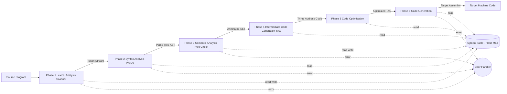
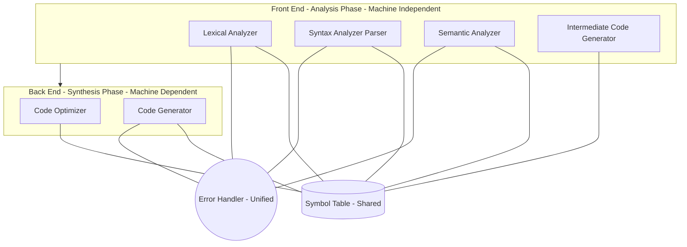
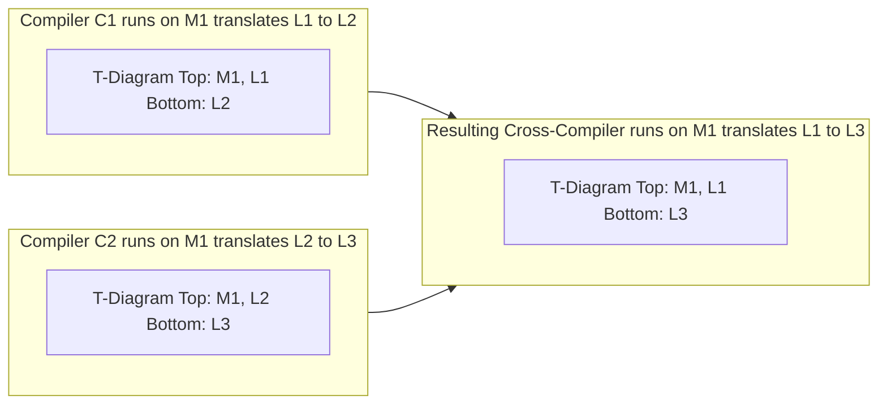
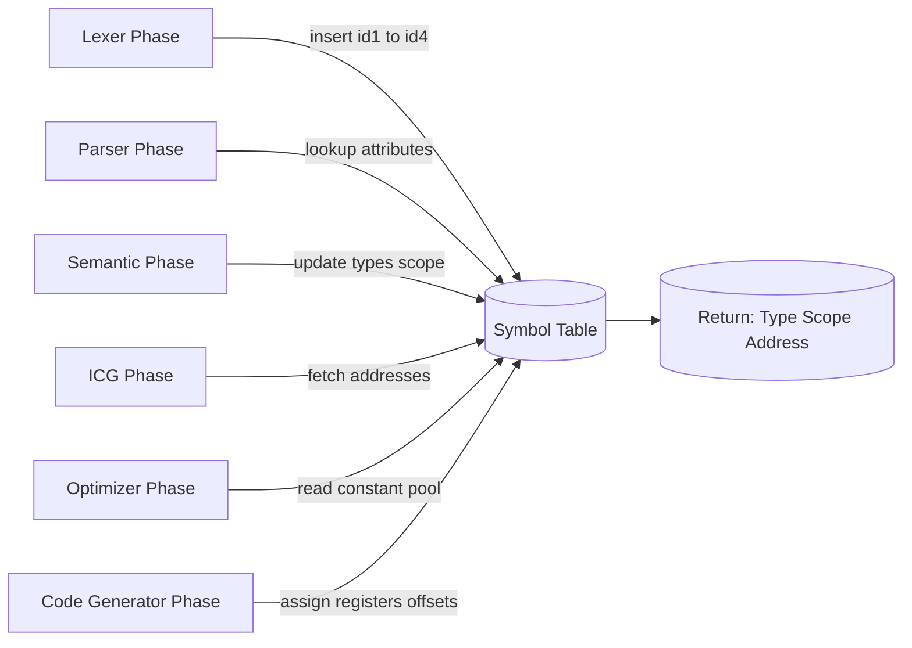

# Introduction - Compiler Structure

<!-- SECTION_1_START -->
# Compiler Design — Module 1: Introduction & Compiler Structure

## 1. Core Technical Definition & Intuitive Overview

### 1.1 Formal Definition (KTU 2024 Syllabus Terminology)

> [!NOTE]
> **Compiler:** A *compiler* is a system software program that translates a source program written in a **High-Level Language (HLL)** into an equivalent target program written in a **Low-Level Language (LLL)** — such as assembly language or machine code — while preserving the meaning (semantics) of the original program, and reporting any errors it detects during translation.

Formally, a compiler can be modelled as a function:

$$
\text{Compiler} : \text{Source Program} \longrightarrow \text{Target Program}
$$

such that for any valid source program $P_s$:

$$
\text{Execute}(\text{Translate}(P_s)) \equiv \text{Execute}(P_s)
$$

where $\equiv$ denotes **semantic equivalence** at run-time.

### 1.2 Conceptual Analogy — The "Bilingual Chef"

Imagine a French chef (Source language) who must give a recipe to a Japanese sous-chef (Target machine).

| Stage | Real-World Action | Compiler Equivalent |
|:------|:------------------|:--------------------|
| Read aloud | The chef reads the recipe aloud word-by-word | **Lexical Analysis** |
| Check grammar | A translator validates sentence structure | **Syntax Analysis** |
| Check meaning | Verify that "add sugar" makes culinary sense | **Semantic Analysis** |
| Sketch in Japanese | Write a rough plan in Japanese notes | **Intermediate Code Generation** |
| Refine steps | Remove "preheat oven" done twice | **Code Optimization** |
| Final Japanese recipe | Produce the polished Japanese recipe | **Code Generation** |
| Vocabulary notebook | Keep a list of terms and meanings | **Symbol Table** |

> [!IMPORTANT]
> **Why a Compiler is NOT the same as an Interpreter:**  
> A *compiler* translates the **entire program** *before execution* (look-ahead model).  
> An *interpreter* translates and executes **one statement at a time** (look-as-you-go model). Java, for example, uses a **hybrid (JVM)** — first compiled to *bytecode*, then interpreted/JIT-compiled.

### 1.3 Translator vs. Compiler vs. Interpreter vs. Assembler

| System | Input | Output | Execution? |
|:-------|:------|:-------|:-----------|
| **Assembler** | Assembly Language | Relocatable Machine Code | No |
| **Compiler** | High-Level Language | Low-Level Language/Machine Code | No |
| **Interpreter** | High-Level Language | Direct Execution (no separate output) | Yes |
| **Translator** *(generic)* | Language L$_1$ | Language L$_2$ | Depends |
| **Pre-processor** | Source with directives | Pure Source (expanded) | No |
| **Linker/Loader** | Object Files | Executable in Memory | No |

> [!VISUALIZATION CONTROL]
> **Concept:** A flow diagram showing translation cascade.
> **GeoGebra / Desmos Input Equations:** Not applicable — use a **conceptual flow chart** instead.
> **Visual Description:** Picture a pipeline — *Preprocessor $\rightarrow$ Compiler $\rightarrow$ Assembler $\rightarrow$ Linker/Loader $\rightarrow$ Executable*. Each box transforms a file format, with the final box producing a runnable image.

### 1.4 Why Compilers Matter in Modern Engineering

- **Performance:** Compiled native code (C, C++, Rust) is **5x–100x faster** than interpreted Python.
- **Portability:** Bytecode compilers (Java, Kotlin) achieve "**write once, run anywhere**" via the JVM.
- **Security:** Compilers enable static analysis, sanitizers, and bounds-checking that interpreters cannot.
- **Optimization:** Modern compilers (GCC, LLVM/Clang, MSVC) apply **vectorization**, **inlining**, and **loop transforms** that hand-written assembly rarely matches.

<!-- SECTION_1_END -->

<!-- SECTION_2_START -->
## 2. Deep Theoretical Analysis & KTU High-Yield Formula Sheet

### 2.1 Two Major Phases of a Compiler

Every compiler is conceptually divided into two halves (Aho, Sethi, Ullman model — the **Dragon Book** standard followed by KTU 2024):

1. **Analysis Phase (Front-End)** — *Understands* the source.
2. **Synthesis Phase (Back-End)** — *Builds* the target.

$$
\boxed{\text{Compiler} \;=\; \underbrace{\text{Lexer} \rightarrow \text{Parser} \rightarrow \text{Semantic Analyzer} \rightarrow \text{ICG}}_{\text{Analysis (Front-End)}} \;+\; \underbrace{\text{Optimizer} \rightarrow \text{Code Generator}}_{\text{Synthesis (Back-End)}}}
$$

### 2.2 The Six Logical Phases

| # | Phase | Reads | Writes | Uses Symbol Table? |
|:-:|:------|:------|:-------|:------------------:|
| 1 | **Lexical Analysis** (Scanner) | Source characters | Token stream | Inserts identifiers |
| 2 | **Syntax Analysis** (Parser) | Token stream | Parse Tree / AST | Reads identifiers |
| 3 | **Semantic Analysis** | Parse Tree / AST | Annotated AST | Reads \& Updates |
| 4 | **Intermediate Code Generation** | Annotated AST | Three-Address Code (TAC) | Reads |
| 5 | **Code Optimization** | TAC | Optimized TAC | Reads |
| 6 | **Code Generation** | Optimized TAC | Target Machine Code | Reads |

> [!NOTE]
> **Symbol Table** is a *data structure* (typically a hash table) that records every identifier, its type, scope, memory address, and other attributes. It is the compiler's "ledger" and is consulted by *every* phase.

> [!NOTE]
> **Error Handler** is invoked whenever a phase detects an anomaly. Detected errors are reported with line numbers; the compiler attempts **error recovery** (not just stoppage) so that multiple errors can be reported in one compilation.

### 2.3 KTU Formula Sheet — Phase Output Formats

| Phase | Canonical Output Format | Notation |
|:------|:------------------------|:---------|
| Lexer | Tuple `<Token-Class, Lexeme, Attribute>` | e.g., $\langle id, x, 1 \rangle$ |
| Parser | Parse Tree or **Abstract Syntax Tree (AST)** | tree nodes = grammar non-terminals |
| Semantic | Annotated AST with types | $\rightarrow$ type-checked |
| ICG | **Three-Address Code (TAC)** | `x = y op z` ; `goto L` ; `if x goto L` |
| Optimizer | Reduced TAC | fewer instructions, fewer temporaries |
| Code Gen | Target assembly (MIPS, x86, ARM) | load/store, mov, add, mul |

The **Three-Address Statement grammar** is:

$$
\text{TAC} \;::= \; x \;=\; y \;\text{op}\; z \;\;\vert\;\; x \;=\; \text{op}\; y \;\;\vert\;\; \text{goto}\; L \;\;\vert\;\;\text{if}\; x\;\text{goto}\;L
$$

### 2.4 Single-Pass vs. Multi-Pass Compilers

- **Single-Pass Compiler:** Scans source only once. Phases are *interleaved*. Faster, but limited (no backward look-ahead, weak optimization).
- **Multi-Pass Compiler:** Source is rescanned. Each pass refines a representation. Example: TAC $\rightarrow$ Optimized TAC $\rightarrow$ Assembly $\rightarrow$ Machine Code.

$$
\boxed{\text{Pass} = \text{One complete read of intermediate representation (IR) + One write of new IR}}
$$

### 2.5 Front-End / Back-End / T-Diagrams

A **T-diagram** pictorially describes a compiler. It is a `T`-shape with three labels:

| Position | Label | Meaning |
|:---------|:------|:--------|
| Top-Left | $M$ | Machine on which the compiler **runs** |
| Top-Right | $S$ | **Source** language it accepts |
| Bottom | $T$ | **Target** language it produces |

$$
\begin{aligned}
\text{Compiler } C_1 &: \quad T(M, S, T) \\[4pt]
\text{Cross-Compiler} &: \quad T(M_1, S, T) \;\text{where}\; M_1 \ne T \;\text{(target hardware)} \\[4pt]
\text{Self-Compiler (Bootstrap)} &: \quad T(M, M, T) \;\text{— written in its own target language}
\end{aligned}
$$

**T-Diagram Composition Rule** (portability composition):

$$
T(M, A, B) \;\circ\; T(M, B, C) \;=\; T(M, A, C)
$$

That is, a compiler producing $B$ from $A$ on machine $M$, combined with one producing $C$ from $B$ on $M$, yields a compiler producing $C$ from $A$ on $M$.

### 2.6 Real-World Engineering Utility

- **LLVM (Clang, Rust, Swift):** Uses a *multi-pass* modular IR — front-ends feed IR, back-ends consume IR. This is the textbook model.
- **GCC:** Front-end (C/C++/Fortran) $\rightarrow$ GIMPLE IR $\rightarrow$ RTL $\rightarrow$ Back-end (x86, ARM, RISC-V).
- **JVM (javac):** Front-end compiles to **bytecode** (portable), then HotSpot JIT *re-compiles* hot methods at runtime — a *hybrid* model.

<!-- SECTION_2_END -->

<!-- SECTION_3_START -->
## 3. Step-by-Step Derivations & Worked Compilation Example

### 3.1 Canonical KTU Example — Compile the Statement

We will compile the following C-like source statement through all six phases (this is the **same example** given in the KTU 2024 Module-1 reference):

```c
position = initial + rate * 60 ;
```

### Step 1 — Lexical Analysis (Scanner)

The scanner consumes the raw character stream and emits a token sequence. It strips **whitespace** and **comments** and produces tuples:

| Token-Name | Token-Class | Lexeme | Attribute (Pointer to Sym. Tab.) |
|:-----------|:------------|:-------|:-------------------------------|
| 1 | `id` | `position` | sym\_tab[1] $\rightarrow$ position |
| 2 | `=` | `=` | — |
| 3 | `id` | `initial` | sym\_tab[2] $\rightarrow$ initial |
| 4 | `+` | `+` | — |
| 5 | `id` | `rate` | sym\_tab[3] $\rightarrow$ rate |
| 6 | `*` | `*` | — |
| 7 | `num` | `60` | sym\_tab[4] $\rightarrow$ 60 (int) |
| 8 | `;` | `;` | — |

The **Symbol Table** after lexical analysis:

| Entry | Name | Type | Scope | Address |
|:------|:-----|:-----|:------|:--------|
| 1 | position | real | global | 100 |
| 2 | initial | real | global | 102 |
| 3 | rate | real | global | 104 |
| 4 | 60 | int | literal | constant\_pool |

> [!IMPORTANT]
> **Valuation Tip:** In KTU 14-mark problems, **always** draw the symbol table — it carries **2 marks by itself**.

### Step 2 — Syntax Analysis (Parser)

The parser applies the **grammar rules** to construct a *Parse Tree*, which is then condensed into an **Abstract Syntax Tree (AST)**. Using the standard assignment/arithmetic grammar:

$$
\begin{aligned}
E &\rightarrow E \;+\; T \;\;\vert\;\; T \\
T &\rightarrow T \;*\; F \;\;\vert\;\; F \\
F &\rightarrow (E) \;\;\vert\;\; \text{id} \;\;\vert\;\; \text{num} \\
S &\rightarrow \text{id} \;=\; E
\end{aligned}
$$

For our statement, the **AST** is:

```
        =
       / \
      /   \
   id(1)   +
          / \
         /   \
      id(2)   *
             / \
            /   \
         id(3)  num(4,60)
```

(Left-to-right and bottom-up derivations are demonstrated in Module 2 — Parsing.)

### Step 3 — Semantic Analysis

The semantic analyzer performs **type checking**. Since `rate` is real and `60` is int, the analyzer inserts an implicit **type-conversion node** (a *coercion*) so that the multiplication is performed in *real* arithmetic.

Annotated AST (with type information):

```
              = : real
             / \
            /   \
   id(1) :real  + : real
                / \
               /   \
        id(2) :real * : real
                    / \
                   /   \
            id(3) :real (inttoreal) num(4):real
```

A **type error** (e.g., assigning a string to an int) would be reported here.

### Step 4 — Intermediate Code Generation (Three-Address Code)

The annotated AST is linearized into **TAC** instructions. Each TAC has at most **three operands**, with temporaries $t_1, t_2, t_3, \ldots$ introduced for sub-expressions.

$$
\begin{aligned}
t_1 &:= \text{inttoreal}(60) \\
t_2 &:= \text{id}_3 \;\times\; t_1 \\
t_3 &:= \text{id}_2 \;+\; t_2 \\
\text{id}_1 &:= t_3
\end{aligned}
$$

> [!NOTE]
> **Three-Address Code Properties:**  
> $\bullet$ Each statement has $\le 3$ operands. $\bullet$ Temporaries are introduced for every sub-expression. $\bullet$ Control flow uses labels (`goto L`, `if x goto L`).

### Step 5 — Code Optimization (Machine-Independent)

A simple **local optimization** replaces the integer-to-real conversion of a literal with a pre-computed real literal — the **constant-folding** transformation.

$$
\begin{aligned}
t_1 &:= \text{id}_3 \;\times\; 60.0 \\
\text{id}_1 &:= \text{id}_2 \;+\; t_1
\end{aligned}
$$

The temporary $t_3$ has been eliminated (3 TAC statements $\rightarrow$ 2 TAC statements), and one type-conversion node has been removed.

### Step 6 — Code Generation (Machine-Dependent)

The optimized TAC is mapped to **target assembly**. The example below uses a generic RISC-style 3-address machine (similar to MIPS):

```
        LDF   R2, id3          ; load rate (real)
        MULF  R2, R2, #60.0    ; R2 = rate * 60.0
        LDF   R1, id2          ; load initial
        ADDF  R1, R1, R2       ; R1 = initial + R2
        STF   id1, R1          ; store result into position
```

**Register allocation note:** A real compiler would attempt to keep `R1` and `R2` in registers across the basic block — a *register descriptor* tracks this.

### 3.2 Full Compilation Pipeline — Annotated Trace

| Phase | Input Artifact | Output Artifact | Algorithm |
|:------|:---------------|:----------------|:----------|
| 1. Lexical | `position=initial+rate*60;` | Token stream (8 tokens) | DFA / Regular Expressions |
| 2. Syntax | Token stream | AST | LL/LR Parsing |
| 3. Semantic | AST | Type-annotated AST | Type inference, coercion |
| 4. ICG | Annotated AST | TAC (4 statements) | Translation schemes |
| 5. Optimize | TAC | TAC (2 statements) | Constant folding, dead-code elim. |
| 6. Code Gen | Optimized TAC | Assembly (5 instructions) | Register allocation, peephole |

> [!IMPORTANT]
> **Bootstrap in Practice (KTU-Examiner Favorite):**  
> 1. Write a *tiny* compiler in assembly (S $\rightarrow$ T) for machine $M$.  
> 2. Use it to compile a *larger* compiler (written in S) — this larger compiler becomes the *development compiler*.  
> 3. The development compiler is then used to compile itself — yielding an *optimized* version. This is the **self-hosting bootstrap**.

<!-- SECTION_3_END -->

<!-- SECTION_4_START -->
## 4. Structural Diagrams & Schematics

### 4.1 Mermaid — Phases of a Compiler (End-to-End Pipeline)



### 4.2 Mermaid — Analysis vs. Synthesis Sub-Grouping (Front-End / Back-End)



### 4.3 Mermaid — T-Diagram Composition (Cross-Compiler Build)



### 4.4 Functional Block Architecture — Symbol Table Access Path



> [!IMPORTANT]
> **Why these diagrams matter for KTU valuation:** A clean, well-labelled compiler-phase block diagram carries up to **4–5 marks** in a 14-mark Module-1 question. Always label *every* phase, the *direction* of data flow, and the *shared* symbol table.

<!-- SECTION_4_END -->

<!-- SECTION_5_START -->
## 5. KTU 2024 Scheme Examination Question Bank & Topic Recap

---

### Part A — Short Answer Questions (3 Marks Each)

#### **Q1.** `[KTU University Exam — July 2024]` *(CO1, Remember)*
**Differentiate between a compiler and an interpreter. List any two examples for each.**

**Model Answer (3 Marks):**

| Aspect | Compiler | Interpreter |
|:-------|:---------|:------------|
| Translation | Translates *entire* program at once | Translates *one statement* at a time |
| Execution | Generates separate executable | Executes directly (no separate file) |
| Speed | Faster execution (pre-translated) | Slower execution (per-statement overhead) |
| Error Reporting | Reports all errors after compilation | Stops at the first error |
| Examples | GCC, Clang, javac | Python, Ruby, PHP |

**Examples (1 Mark):** Compilers — *GCC, javac*; Interpreters — *Python, Ruby*. **(1 Mark for definition, 1 Mark for contrast, 1 Mark for examples.)**

---

#### **Q2.** `[KTU University Exam — Dec 2023]` *(CO1, Understand)*
**Explain the role of the symbol table in a compiler. Mention any four attributes stored in it.**

**Model Answer (3 Marks):**
The **symbol table** is a central data structure used by all phases of a compiler to store information about identifiers (variables, functions, constants, labels).

- **Role (2 Marks):** Enables scope management, type checking, address allocation, and cross-phase communication.
- **Four attributes (1 Mark):**  
  1. *Name* of the identifier  
  2. *Type* (int, float, char, array, etc.)  
  3. *Scope* (local, global, parameter)  
  4. *Memory address / offset*

---

### Part B — Long Answer Questions (14 Marks Each, Internal Choice)

---

#### **Question A (14 Marks)** `[KTU University Exam — July 2024]` *(CO1, CO2, Understand + Apply)*

**(a) [7 Marks]** *With a neat block diagram, explain the various phases of a compiler. Mention the input and output of each phase.*

**(b) [7 Marks]** *Consider the following source statement:*

```c
a = b + c * d ;
```

*Show the output of each phase (lexical tokens, AST, three-address code, optimized code, and target assembly) for the above statement, assuming all variables are of type `real`.*

---

##### **Model Solution — Part (a)**

**[Block Diagram: 3 Marks]** — Draw all six phases in a flow chart, mark the symbol table as a side-data structure, and the error handler as a connected module.

**Phase-wise Explanation (4 Marks):**

1. **Lexical Analysis** — Reads characters, produces *tokens*. Uses regular expressions / DFA.
2. **Syntax Analysis** — Reads tokens, produces *parse tree / AST*. Uses context-free grammar.
3. **Semantic Analysis** — Type checking, scope rules, implicit conversions.
4. **Intermediate Code Generation** — Produces *three-address code* (machine-independent).
5. **Code Optimization** — Improves TAC (constant folding, dead-code elimination).
6. **Code Generation** — Maps optimized TAC to *target machine instructions*.

**Key Insight:** Each phase transforms one IR into another, with the **Symbol Table** as a global data structure accessed by all phases.

---

##### **Model Solution — Part (b)**

**Step 1 — Lexical Tokens (1.5 Marks):**

| # | Token-Class | Lexeme | Attribute |
|:-:|:------------|:-------|:----------|
| 1 | `id` | `a` | sym\_tab[1] |
| 2 | `=` | `=` | — |
| 3 | `id` | `b` | sym\_tab[2] |
| 4 | `+` | `+` | — |
| 5 | `id` | `c` | sym\_tab[3] |
| 6 | `*` | `*` | — |
| 7 | `id` | `d` | sym\_tab[4] |
| 8 | `;` | `;` | — |

**[Correct token sequence: 1.5 Marks]**

**Step 2 — Abstract Syntax Tree (1.5 Marks):**

```
          =
         / \
        /   \
      a(1)   +
             / \
            /   \
          b(2)   *
                 / \
                /   \
              c(3)  d(4)
```

**Step 3 — Three-Address Code (1.5 Marks):**

$$
\begin{aligned}
t_1 &:= c \;\times\; d \\
t_2 &:= b \;+\; t_1 \\
a &:= t_2
\end{aligned}
$$

**Step 4 — Optimized TAC (1 Mark):**  
With `b`, `c`, `d` as `real`, no conversion is needed; TAC is already optimal:

$$
\begin{aligned}
t_1 &:= c \;\times\; d \\
a &:= b \;+\; t_1
\end{aligned}
$$

**Step 5 — Target Assembly (1.5 Marks)** *(RISC-style)*:

```
        LDF   R2, d
        MULF  R2, R2, c
        LDF   R1, b
        ADDF  R1, R1, R2
        STF   a, R1
```

---

#### **Question B (14 Marks — Alternative Choice)** `[KTU University Exam — Dec 2023]` *(CO1, CO2, Understand + Apply)*

**(a) [7 Marks]** *What is a T-diagram? Explain with an example how a cross-compiler is built using T-diagram composition. What is the role of a bootstrap compiler?*

**(b) [7 Marks]** *Compare single-pass and multi-pass compilers. State two advantages of each. For the statement `x = y - z * 10`, generate the three-address code and apply one local optimization.*

---

##### **Model Solution — Part (a)**

**T-Diagram Definition (2 Marks):**  
A T-diagram is a graphical notation with three components — *Implementation language* (top), *Source language* (top-right), and *Target language* (bottom).

**Cross-Compiler Construction (3 Marks):**

To build a cross-compiler that translates language $L$ to run on machine $M_2$, using development on machine $M_1$:

$$
\begin{aligned}
C_1 &: T(M_1,\; M_2,\; M_2) \quad \text{(existing cross-compiler for M2)} \\
C_2 &: T(M_1,\; L,\; M_2) \quad \text{(target cross-compiler)} \\
\text{Use } C_1 &\text{ to compile } C_2 \text{ written in } M_2 \\
\Rightarrow T(M_1,\; L,\; M_2) &\text{ is achieved}
\end{aligned}
$$

**Bootstrap (2 Marks):**  
1. Write a *minimal* compiler for a subset of $L$ in assembly of $M$.  
2. Use it to compile a *full* $L$-compiler written in $L$.  
3. Recompile the $L$-compiler using itself — yields an *optimized* self-hosted compiler.  
*Example:* GCC, LLVM were bootstrapped this way.

---

##### **Model Solution — Part (b)**

**Single-Pass vs. Multi-Pass (3 Marks):**

| Feature | Single-Pass | Multi-Pass |
|:--------|:------------|:-----------|
| Passes over source | 1 | $\geq 2$ |
| Speed of compilation | Faster | Slower |
| Optimization quality | Limited | Excellent |
| Memory usage | Lower | Higher |
| Example | Early Pascal compilers | GCC, LLVM |

**Advantages of Single-Pass (1 Mark):** Faster compilation, lower memory footprint.  
**Advantages of Multi-Pass (1 Mark):** Better optimization, supports back-patching, modular design.

**Three-Address Code for `x = y - z * 10` (1.5 Marks):**

$$
\begin{aligned}
t_1 &:= z \;\times\; 10 \\
t_2 &:= y \;-\; t_1 \\
x &:= t_2
\end{aligned}
$$

**Local Optimization — Constant Folding (0.5 Marks):**  
Since `10` is a literal, the multiplication can be partially pre-computed at *compile time* (if `z` is constant; otherwise only the constant operand is preserved). Optimized form:

$$
\begin{aligned}
t_1 &:= z \;\times\; 10 \\
x &:= y \;-\; t_1
\end{aligned}
$$

(Here the temporary `t_2` was eliminated by *copy propagation* — a standard local optimization.)

---

> [!WARNING]
> **KTU Examiner's Valuation Warning — Common Pitfalls**
> 1. **Forgetting the symbol table:** Many students describe six phases but **omit the symbol table** from the diagram — *loses 1–2 marks*.
> 2. **Confusing the tokenizer output format:** Lexical output is a **stream of tokens**, not a single string — list each tuple separately.
> 3. **Drawing only 4 phases instead of 6:** Optimization and code generation are *separate* phases in the KTU 2024 syllabus — do **not** merge them.
> 4. **T-diagram labels swapped:** Many students place the *target* at the top — the convention is **Target = Bottom** of the `T`.
> 5. **No type-coercion node in semantic analysis:** If an `int` literal is multiplied with a `real` variable, the type-conversion node **must** appear in the AST — examiners look for this.
> 6. **Skip writing TAC for each sub-expression:** Use *distinct temporaries* $t_1, t_2, t_3$ — examiners check **one TAC per sub-expression** strictly.

---

### 📌 Topic Recap & Important Things to Remember

- ✅ **Compiler** translates the *whole* source to target *before* execution; **interpreter** translates *one statement at a time* during execution.
- ✅ The **six phases** are: Lexical $\rightarrow$ Syntax $\rightarrow$ Semantic $\rightarrow$ Intermediate Code Gen $\rightarrow$ Optimization $\rightarrow$ Code Gen.
- ✅ The **Symbol Table** is a *global, shared* data structure accessed by *all six* phases — never omit it.
- ✅ The **Error Handler** is invoked by *every* phase; its job is detection + recovery + reporting.
- ✅ **Single-pass** compilers are fast but limited; **multi-pass** compilers enable strong optimization.
- ✅ **Front-end (Analysis)** is *machine-independent*; **Back-end (Synthesis)** is *machine-dependent*.
- ✅ **Three-Address Code (TAC)** uses at most *three operands* per statement with temporaries like $t_1, t_2, t_3$.
- ✅ **T-diagram notation:** Top = Implementation + Source ; Bottom = Target.
- ✅ **T-diagram composition:** $T(M,A,B) \circ T(M,B,C) = T(M,A,C)$.
- ✅ **Cross-compiler** runs on $M_1$ but produces code for $M_2$ (where $M_1 \ne M_2$).
- ✅ **Bootstrap** uses a small initial compiler (often in assembly) to build a full self-hosted compiler.
- ✅ **Local optimization** examples: constant folding, copy propagation, dead-code elimination.
- ✅ **Type coercion** is performed in the *semantic* phase — the AST gains a *type-conversion node* before TAC generation.
- ✅ For the expression `a = b + c * d` with `real` variables, the TAC is `t1 = c * d ; t2 = b + t1 ; a = t2`.
- ✅ Always list **input/output artifacts** and **algorithms** (DFA, CFG, type rules) when describing each phase.
- ✅ Lexical output = `<Token-Class, Lexeme, Attribute>` — three components, **not two**.

<!-- SECTION_5_END -->
