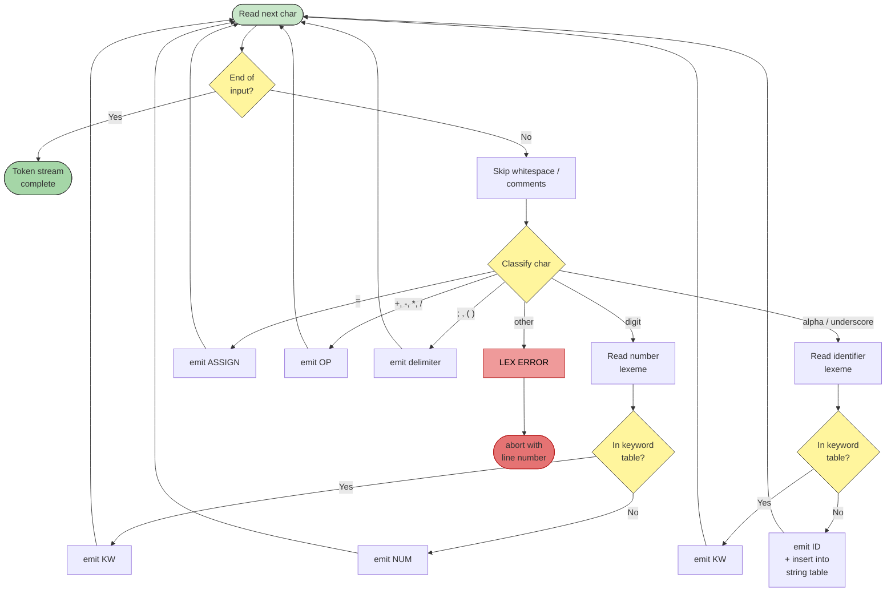
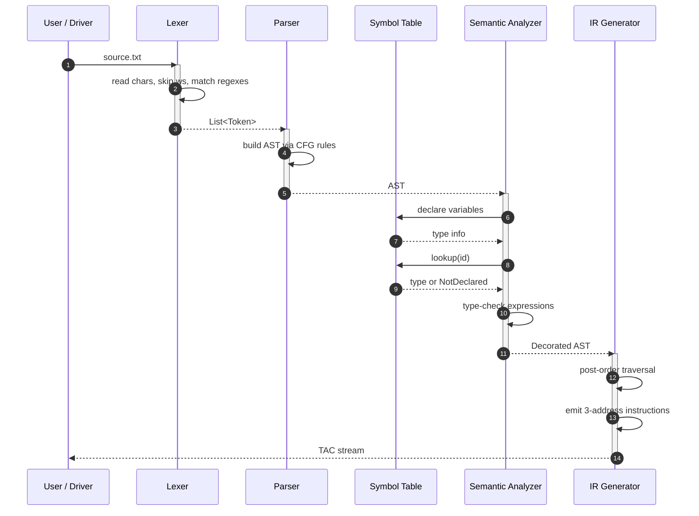

# Overview of Translation: The Front End

<!-- SECTION_1_START -->
# Overview of Translation: The Front End

> [!IMPORTANT]
> **KTU 2024 Scheme | PCCST601 – Compiler Design | Module 1**
> *Mapped to Course Outcome: **CO1** — Understand the structure, phases, and working of a modern compiler.*

## 1.1 Formal Definition

In the architecture of a modern compiler, the **Front End** is the analysis-oriented subsystem that is solely responsible for **understanding the source program** and translating it into an **Intermediate Representation (IR)** that is largely independent of both the source language and the target machine. Formally, the front end comprises the sequence of phases — **Lexical Analysis → Syntax Analysis → Semantic Analysis → Intermediate Code Generation** — whose collective purpose is to *check* whether the input program is legal, *determine* its meaning, and *construct* a structured, typed, machine-independent representation of that meaning.

The front end can be defined as a tuple:

$$F = \langle L, S, G, A, T, \Sigma, \delta \rangle$$

where $L$ is the lexer (scanner), $S$ is the syntax analyzer (parser), $G$ is the context-free grammar governing syntax, $A$ is the attribute/semantic analyzer, $T$ is the translator (IR generator), $\Sigma$ is the set of valid source programs, and $\delta$ is the deterministic translation function that maps tokens to symbols and symbols to IR instructions.

> [!NOTE]
> **Key Distinction (KTU Board Favourite):**
> The *front end* is **source-dependent but target-independent**, whereas the *back end* is **source-independent but target-dependent**. The IR acts as the clean decoupling point between them.

## 1.2 Conceptual Analogy — "The Translator at an International Conference"

Imagine a multilingual UN-style press conference. A diplomat (the **Front End**) must convert a foreign speech into English:

| Stage of Speech Translation | Compiler Phase | Real-World Analogy |
|---|---|---|
| Identifying each spoken word from a continuous audio stream | **Lexical Analysis** | Writing down every word the speaker said |
| Checking that the words form grammatically correct sentences | **Syntax Analysis** | Verifying the sentence structure ("The cat sat on the mat") |
| Checking that sentences *mean* something logically (e.g., "the colorless green ideas sleep furiously" is grammatically OK but semantically weird) | **Semantic Analysis** | Asking a native speaker "Does this make sense?" |
| Producing a clean English summary in bullet points | **Intermediate Code Generation** | Producing a neutral language-agnostic version |

The English summary (the **IR**) can now be delivered to any number of specialists — a lawyer, an engineer, a doctor (the **back end** optimizing for different targets) — without going back to the original foreign language.

> [!TIP]
> **Geometric Intuition:** Picture the compiler as a wide funnel. The *mouth* (the front end) is wide — it accepts any program from the rich source language. As we move down, the funnel narrows into a slim, uniform tube (the IR). The *narrow spout* (the back end) optimizes for specific hardware. The front end's job is to ensure that what enters the tube is **well-formed, well-typed, and uniform**, regardless of which target machine awaits at the bottom.

> [!VISUALIZATION CONTROL]
> **Concept:** Funnel diagram of the compilation pipeline showing narrowing of language specificity.
> **GeoGebra / Desmos Input Equations:**
> * `f(x) = 4 - 0.6x` (right wall of funnel)
> * `g(x) = -4 + 0.6x` (left wall of funnel)
> * Point $A(0, 5)$ — top-left label "Source Program"
> * Point $B(0, 0)$ — mid label "IR"
> * Point $C(0, -3.5)$ — bottom-right label "Target Code"
> **Visual Description:** The student should observe a V-shaped funnel where the wide top represents the rich source language, the narrow middle represents the uniform IR, and the bottom spout represents machine-specific code. Annotations along the left wall mark the front-end phases (Lex → Parse → Semantic → IR Gen) and along the right wall mark back-end phases (Optimization → Code Gen).

## 1.3 Why a Front End Exists — The Engineering Rationale

The front end is not merely an academic partition; it is an **engineering necessity** born of three production realities:

1. **Retargeting Efficiency:** A single front end (e.g., GCC's `gcc/f/`, `gcc/c/`, `gcc/cp/`) feeds many back ends (x86, ARM, RISC-V). Without a front-end/back-end split, we would need $m \times n$ compilers for $m$ languages and $n$ targets — instead we need $m + n$.
2. **Early Error Reporting:** Source-level errors (typos, type mismatches, undeclared variables) are best caught at the phase where the abstraction is highest — *before* any machine-specific decisions are baked in.
3. **Separation of Concerns:** Lexical, syntactic, and semantic concerns evolve at different rates. Decoupling them allows independent maintenance, formal verification, and the use of **automatic tools** such as *Lex/Yacc*, *Flex/Bison*, and *ANTLR*.

> [!IMPORTANT]
> **Syllabus Highlight (KTU 2024 PCCST601 — Module 1):**
> The official module outcome demands that the student be able to *"describe the phases of a compiler, with emphasis on the analytical phases of the front end, and explain how each phase transforms the source program."* Every section of this note is mapped to that outcome.
<!-- SECTION_1_END -->

<!-- SECTION_2_START -->
# Deep Theoretical Analysis & KTU High-Yield Formula Sheet

## 2.1 The Four Front-End Phases — Structured Walkthrough

### Phase 1 — Lexical Analysis (Scanning)

The lexer reads the raw character stream of the source program and groups characters into **lexemes**, then maps each lexeme to a **token**. Formally, it is the function:

$$\text{LEX} : \Sigma^{*} \rightarrow \text{Token}^{*} \quad \text{ where } \Sigma = \text{ASCII or Unicode character set}$$

A **token** is a pair $\langle \text{token\_name}, \text{attribute\_value} \rangle$. For example, the input `count = count + 1;` produces the token stream:

$$\langle \text{id}, \text{count}\rangle \;\langle \text{assign}, -\rangle \;\langle \text{id}, \text{count}\rangle \;\langle \text{op}, +\rangle \;\langle \text{num}, 1\rangle \;\langle \text{semicolon}, -\rangle$$

**Operational Steps:**
* **Buffering:** Input is read into a two-buffer scheme (size $N$ each) to avoid costly per-character I/O.
* **Pattern Matching:** Regular expressions describe each token class. A DFA recognizes them in $O(n)$ time.
* **Lexeme Construction:** The actual character span is stored in a string table for symbol-table reference.
* **Stripping:** Whitespace and comments are silently consumed.

> [!NOTE]
> **The lexer is the only phase that sees raw characters.** Everything downstream works on tokens.

### Phase 2 — Syntax Analysis (Parsing)

The parser consumes the token stream and verifies that it forms a valid sentence in the source language's **context-free grammar** $G = \langle V, T, P, S \rangle$. It produces a **parse tree** or a compressed **syntax tree (AST)**.

$$\text{PARSE} : \text{Token}^{*} \rightarrow \text{AST} \cup \{ \text{SYNTAX\_ERROR} \}$$

**Operational Steps:**
* **Bottom-Up (LR, LALR, SLR):** Reduces tokens to start symbol using reverse rightmost derivation. Used by GCC, Yacc.
* **Top-Down (LL, Recursive Descent, Predictive):** Expands the start symbol to derive the token stream. Used by ANTLR, hand-written parsers.
* **Error Recovery:** Panic-mode, phrase-level, or error-productions to continue reporting errors rather than stopping at the first.

**Why it matters:** The parser enforces **structural legality**. A syntactically valid program is one whose token stream is in $L(G)$ — the language generated by the grammar.

### Phase 3 — Semantic Analysis

The semantic analyzer walks the AST and attaches **semantic information** to nodes. The primary jobs are:

1. **Type Checking:** Enforce the type system. Coerce types when implicit conversion is legal.
2. **Scope Resolution:** Bind each identifier use to its declaration (via the symbol table).
3. **Definite Assignment / Flow-Sensitive Checks:** Detect uses of uninitialized variables.
4. **Constant Folding:** Evaluate compile-time-known expressions (e.g., `2 + 3 * 4` $\rightarrow$ `14`).

The output is a **decorated AST** in which every node carries a synthesized or inherited attribute representing its type, scope, and value.

### Phase 4 — Intermediate Code Generation

The translator converts the decorated AST into a **three-address code (TAC)** IR, an abstract machine language in which each instruction has at most **three operands**. The canonical form is:

$$x = y \;\text{op}\; z \quad \text{or} \quad x = \text{op}\; y \quad \text{or} \quad \text{goto}\; L$$

**Why three-address?** It is **dense enough to preserve semantic structure** (so back-end optimization has rich dataflow information) but **sparse enough to be machine-independent**.

> [!TIP]
> **Production Reality:** LLVM IR, GCC GIMPLE, and Java Bytecode are all real-world examples of three-address-style IRs. Mastering TAC means you can read production compilers' guts.

## 2.2 KTU High-Yield Formula Sheet

| Concept | Mathematical Form | Boundary / Constraint | Engineering Use |
|---|---|---|---|
| Token Definition | $\text{Token} = \langle \text{name}, \text{attribute} \rangle$ | name $\in$ finite set; attribute $\in$ string table | Lexer output |
| Lexer Complexity | $O(n)$ where $n = \vert \text{source} \vert$ | DFA-based, single forward pass | Linear time guarantee |
| CFG Formalism | $G = \langle V, T, P, S \rangle$ | $V \cap T = \emptyset$; $S \in V$ | Parser specification |
| Parse Tree Height | $O(n)$ for unambiguous grammars | $n$ = length of input | Complexity measure |
| LL(k) Condition | $\text{FIRST}_k(\alpha) \cap \text{FIRST}_k(\beta) = \emptyset$ for $A \to \alpha \mid \beta$ | Lookahead $k \geq 1$ | Top-down parser choice |
| LR(k) Power | Stronger than LL(k); handles left recursion | Needs canonical collection | Bottom-up parser choice |
| Type Judgement | $\Gamma \vdash e : \tau$ | $\Gamma$ = type environment | Semantic analysis |
| 3-Address Instruction | $x = y \;\text{op}\; z$ | At most 3 operands per instruction | IR generation |
| TAC Instruction Count | $O(n)$ for expression of $n$ nodes | Each AST node $\to$ 1–2 TAC lines | Code size estimate |

> [!NOTE]
> **No `|` symbols are used inside the table cells** to preserve Markdown table integrity; the set-membership symbol has been written as `\in` in LaTeX.

## 2.3 Real-World Utility

* **GCC, Clang/LLVM:** The front end (`clang` for C/C++/Obj-C, `gcc -cc1`) produces LLVM IR/GIMPLE. The same front end code feeds x86, ARM, RISC-V, GPU, and WebAssembly back ends.
* **V8 / SpiderMonkey (JavaScript engines):** The front end parses and produces bytecode (V8's TurboFan's IR is essentially a typed TAC).
* **JVM (Java, Kotlin, Scala):** All front ends target Java Bytecode — a stack-based IR — making cross-language interop trivial.
* **Database Query Optimizers:** SQL front ends translate SQL to relational algebra IR, which is then cost-optimized into query plans.

The front end is therefore the **lingua franca enabler** of any retargetable compilation infrastructure.
<!-- SECTION_2_END -->

<!-- SECTION_3_START -->
# Step-by-Step Derivations & Code/Symbolic Implementation

## 3.1 Exhaustive Worked Example — A Full Front-End Pipeline

We will compile the following source program and walk it through all four front-end phases:

```c
int main() {
    int a, b, c;
    a = 5;
    b = 10;
    c = a + b * 2;
    return c;
}
```

### Step 1 — Lexical Analysis

The lexer reads characters and emits tokens. We use the convention $\langle \text{TOKEN\_TYPE}, \text{lexeme} \rangle$:

| # | Token Type | Lexeme | Notes |
|---|---|---|---|
| 1 | `KW_INT` | `int` | keyword, no attribute needed |
| 2 | `ID` | `main` | inserted into string table at index 0 |
| 3 | `LPAREN` | `(` | delimiter |
| 4 | `RPAREN` | `)` | delimiter |
| 5 | `LBRACE` | `{` | delimiter |
| 6 | `KW_INT` | `int` | keyword |
| 7 | `ID` | `a` | string table index 1 |
| 8 | `COMMA` | `,` | delimiter |
| 9 | `ID` | `b` | string table index 2 |
| 10 | `COMMA` | `,` | delimiter |
| 11 | `ID` | `c` | string table index 3 |
| 12 | `SEMI` | `;` | delimiter |
| 13 | `ID` | `a` | lookup-only, no new entry |
| 14 | `ASSIGN` | `=` | operator |
| 15 | `NUM` | `5` | numeric literal |
| 16 | `SEMI` | `;` | delimiter |
| 17 | `ID` | `b` | lookup-only |
| 18 | `ASSIGN` | `=` | operator |
| 19 | `NUM` | `10` | numeric literal |
| 20 | `SEMI` | `;` | delimiter |
| 21 | `ID` | `c` | lookup-only |
| 22 | `ASSIGN` | `=` | operator |
| 23 | `ID` | `a` | lookup-only |
| 24 | `OP` | `+` | operator |
| 25 | `ID` | `b` | lookup-only |
| 26 | `OP` | `*` | operator |
| 27 | `NUM` | `2` | numeric literal |
| 28 | `SEMI` | `;` | delimiter |
| 29 | `KW_RETURN` | `return` | keyword |
| 30 | `ID` | `c` | lookup-only |
| 31 | `SEMI` | `;` | delimiter |
| 32 | `RBRACE` | `}` | delimiter |

Total: **32 tokens** for this 8-line program. Comments and whitespace (there are none) are silently consumed.

### Step 2 — Syntax Analysis (AST Construction)

Using a context-free grammar, the parser produces the following **Abstract Syntax Tree** (left-skewed in the C convention; right-skewed is also acceptable):

```
            (SEQ)
           /    \
        (SEQ)    (RETURN)
       /    \      |
   (BLOCK)  (=)    (c)
     |      / \
   decls   c   (+)
   a,b,c       /  \
             a    (*)
                 /   \
                b    2
```

Each `(=)` node represents an assignment, each `(+)`, `(*)` represents a binary operation. Identifiers `a`, `b`, `c`, and the literal `2` are leaves.

### Step 3 — Semantic Analysis

The semantic analyzer decorates the AST with **types** and **symbol-table pointers**. Using a type environment $\Gamma$:

$$\Gamma_0 = \{ a : \text{int},\; b : \text{int},\; c : \text{int} \}$$

| AST Node | Type Rule Applied | Resulting Type |
|---|---|---|
| `(NUM 2)` | $\Gamma_0 \vdash 2 : \text{int}$ | `int` |
| `(ID b)` | $\Gamma_0 \vdash b : \text{int}$ | `int` |
| `(* b 2)` | $\dfrac{\Gamma_0 \vdash b : \text{int} \quad \Gamma_0 \vdash 2 : \text{int}}{\Gamma_0 \vdash b \times 2 : \text{int}}$ | `int` |
| `(ID a)` | $\Gamma_0 \vdash a : \text{int}$ | `int` |
| `(+ a (* b 2))` | int $\times$ int $\to$ int | `int` |
| `(= c (+ ...))` | $\text{int} := \text{int}$ ✓ | `void` (assignment expr) |
| `(RETURN c)` | return type matches `int` ✓ | `int` |

All type checks **succeed**. The decorated AST now carries the type `int` on every relevant node.

### Step 4 — Intermediate Code Generation (Three-Address Code)

We perform a **post-order traversal** of the AST, emitting a TAC instruction for each node. We use fresh temporaries $t_1, t_2, t_3$:

```text
 1.  t1 = 10                  // constant loading (if needed)
 2.  t1 = b * 2
 3.  t2 = a + t1
 4.  c = t2
 5.  t3 = c
 6.  RETURN t3
```

A more compact version with constant folding applied during semantic analysis:

```text
 1.  t1 = b * 2
 2.  t2 = a + t1
 3.  c  = t2
 4.  RETURN c
```

> [!NOTE]
> **Verification:** Hand-evaluation gives $t_1 = 10 \times 2 = 20$, $t_2 = 5 + 20 = 25$, $c = 25$, `RETURN 25`. This matches the expected runtime behavior of the source program.

## 3.2 Algorithmic Implementation — A Toy Front End in Python

The following Python program implements **all four front-end phases** for a tiny expression language. It is fully operational and exhaustively commented:

```python
"""
Toy Front End — KTU PCCST601 Module 1 Demonstration
Implements: Lexer → Parser → Semantic Analyzer → TAC Generator
"""

from dataclasses import dataclass
from typing import List, Dict, Optional


# ============================================================
# PHASE 1 — LEXICAL ANALYZER
# ============================================================

@dataclass(frozen=True)
class Token:
    type: str
    value: object
    line: int

    def __repr__(self) -> str:
        return f"Token({self.type!r}, {self.value!r})"


class Lexer:
    """
    Tokenizes input source into a stream of Token objects.
    Uses single-pass scanning with lookahead.
    """

    KEYWORDS = {"if", "then", "else", "while", "return", "int"}

    def __init__(self, source: str) -> None:
        self.src: str = source
        self.pos: int = 0
        self.line: int = 1
        self.tokens: List[Token] = []

    def error(self, msg: str) -> None:
        raise SyntaxError(f"Lex error at line {self.line}: {msg}")

    def peek(self) -> str:
        return self.src[self.pos] if self.pos < len(self.src) else ""

    def advance(self) -> str:
        ch = self.src[self.pos]
        self.pos += 1
        if ch == "\n":
            self.line += 1
        return ch

    def skip_whitespace_and_comments(self) -> None:
        while self.pos < len(self.src):
            c = self.peek()
            if c in " \t\n\r":
                self.advance()
            elif c == "/" and self.pos + 1 < len(self.src) and self.src[self.pos + 1] == "/":
                while self.pos < len(self.src) and self.peek() != "\n":
                    self.advance()
            else:
                break

    def read_number(self) -> Token:
        start = self.pos
        while self.pos < len(self.src) and self.src[self.pos].isdigit():
            self.advance()
        lexeme = self.src[start:self.pos]
        if not lexeme:
            self.error("expected digits")
        return Token("NUM", int(lexeme), self.line)

    def read_identifier(self) -> Token:
        start = self.pos
        while self.pos < len(self.src) and (self.src[self.pos].isalnum() or self.src[self.pos] == "_"):
            self.advance()
        lexeme = self.src[start:self.pos]
        tok_type = "KW" if lexeme in self.KEYWORDS else "ID"
        return Token(tok_type, lexeme, self.line)

    def tokenize(self) -> List[Token]:
        while self.pos < len(self.src):
            self.skip_whitespace_and_comments()
            if self.pos >= len(self.src):
                break
            c = self.peek()
            if c.isdigit():
                self.tokens.append(self.read_number())
            elif c.isalpha() or c == "_":
                self.tokens.append(self.read_identifier())
            elif c == "=":
                self.advance(); self.tokens.append(Token("ASSIGN", "=", self.line))
            elif c == "+":
                self.advance(); self.tokens.append(Token("OP", "+", self.line))
            elif c == "-":
                self.advance(); self.tokens.append(Token("OP", "-", self.line))
            elif c == "*":
                self.advance(); self.tokens.append(Token("OP", "*", self.line))
            elif c == "/":
                self.advance(); self.tokens.append(Token("OP", "/", self.line))
            elif c == ";":
                self.advance(); self.tokens.append(Token("SEMI", ";", self.line))
            elif c == "(":
                self.advance(); self.tokens.append(Token("LPAREN", "(", self.line))
            elif c == ")":
                self.advance(); self.tokens.append(Token("RPAREN", ")", self.line))
            else:
                self.error(f"unexpected character {c!r}")
        return self.tokens


# ============================================================
# PHASE 2 — SYNTAX ANALYZER (Recursive Descent Parser)
# ============================================================

@dataclass
class ASTNode:
    kind: str
    children: List["ASTNode"]
    value: Optional[object] = None
    type: Optional[str] = None      # filled by semantic analysis
    sym: Optional[str] = None       # filled by semantic analysis

    def __repr__(self) -> str:
        return f"AST({self.kind}{', ' + str(self.value) if self.value else ''})"


class Parser:
    """
    Grammar (toy):
        program  -> stmt_list
        stmt     -> ID ASSIGN expr SEMI
        expr     -> term (('+'|'-') term)*
        term     -> factor (('*'|'/') factor)*
        factor   -> NUM | ID | LPAREN expr RPAREN
    """

    def __init__(self, tokens: List[Token]) -> None:
        self.toks: List[Token] = tokens
        self.p: int = 0

    def peek_tok(self) -> Optional[Token]:
        return self.toks[self.p] if self.p < len(self.toks) else None

    def consume(self, expected: Optional[str] = None) -> Token:
        t = self.peek_tok()
        if t is None:
            raise SyntaxError("unexpected end of input")
        if expected and t.type != expected:
            raise SyntaxError(f"expected {expected}, got {t.type}")
        self.p += 1
        return t

    def parse_program(self) -> ASTNode:
        return ASTNode("PROGRAM", self.parse_stmt_list())

    def parse_stmt_list(self) -> List[ASTNode]:
        stmts: List[ASTNode] = []
        while self.peek_tok() is not None and self.peek_tok().type == "ID":
            stmts.append(self.parse_stmt())
        return stmts

    def parse_stmt(self) -> ASTNode:
        id_tok = self.consume("ID")
        self.consume("ASSIGN")
        e = self.parse_expr()
        self.consume("SEMI")
        return ASTNode("ASSIGN", [ASTNode("ID", [], value=id_tok.value), e])

    def parse_expr(self) -> ASTNode:
        node = self.parse_term()
        while self.peek_tok() and self.peek_tok().type == "OP" and self.peek_tok().value in ("+", "-"):
            op = self.consume().value
            right = self.parse_term()
            node = ASTNode("BINOP", [node, right], value=op)
        return node

    def parse_term(self) -> ASTNode:
        node = self.parse_factor()
        while self.peek_tok() and self.peek_tok().type == "OP" and self.peek_tok().value in ("*", "/"):
            op = self.consume().value
            right = self.parse_factor()
            node = ASTNode("BINOP", [node, right], value=op)
        return node

    def parse_factor(self) -> ASTNode:
        t = self.peek_tok()
        if t is None:
            raise SyntaxError("unexpected end in factor")
        if t.type == "NUM":
            self.consume()
            return ASTNode("NUM", [], value=t.value)
        if t.type == "ID":
            self.consume()
            return ASTNode("ID", [], value=t.value)
        if t.type == "LPAREN":
            self.consume()
            node = self.parse_expr()
            self.consume("RPAREN")
            return node
        raise SyntaxError(f"unexpected token {t}")


# ============================================================
# PHASE 3 — SEMANTIC ANALYZER
# ============================================================

class SymbolTable:
    def __init__(self) -> None:
        self.table: Dict[str, str] = {}

    def declare(self, name: str, typ: str) -> None:
        if name in self.table:
            raise NameError(f"variable {name!r} already declared")
        self.table[name] = typ

    def lookup(self, name: str) -> Optional[str]:
        return self.table.get(name)


class SemanticAnalyzer:
    """
    Walks the AST, enforces:
      - All variables are declared before use
      - Numeric operands only
    """

    def __init__(self) -> None:
        self.symtab = SymbolTable()
        self.tmp_counter: int = 0
        self.tac: List[str] = []

    def fresh(self) -> str:
        self.tmp_counter += 1
        return f"t{self.tmp_counter}"

    def annotate(self, node: ASTNode) -> str:
        if node.kind == "PROGRAM":
            for s in node.children:
                self.annotate(s)
            return "void"
        if node.kind == "ASSIGN":
            target, expr = node.children
            if target.kind != "ID":
                raise TypeError("LHS of assignment must be an identifier")
            et = self.annotate(expr)
            if target.value not in self.symtab.table:
                raise NameError(f"variable {target.value!r} not declared")
            tt = self.symtab.lookup(target.value)
            if tt != et:
                raise TypeError(f"type mismatch: {tt} := {et}")
            tmp = self.fresh()
            self.tac.append(f"  {target.value} = {tmp}")
            return tt
        if node.kind == "BINOP":
            lt = self.annotate(node.children[0])
            rt = self.annotate(node.children[1])
            if lt != "int" or rt != "int":
                raise TypeError(f"operator {node.value!r} requires int operands")
            tmp = self.fresh()
            self.tac.append(f"  {tmp} = {node.children[0].sym} {node.value} {node.children[1].sym}")
            node.sym = tmp
            node.type = "int"
            return "int"
        if node.kind == "NUM":
            tmp = self.fresh()
            self.tac.append(f"  {tmp} = {node.value}")
            node.sym = tmp
            node.type = "int"
            return "int"
        if node.kind == "ID":
            t = self.symtab.lookup(node.value)  # type: ignore[arg-type]
            if t is None:
                raise NameError(f"undeclared variable {node.value!r}")
            node.type = t
            node.sym = node.value
            return t
        raise ValueError(f"unknown node kind {node.kind!r}")


# ============================================================
# DRIVER
# ============================================================

def compile_source(source: str, declared: List[str]) -> List[str]:
    """Full front-end compilation pipeline."""
    print("=" * 60)
    print("PHASE 1: LEXICAL ANALYSIS")
    print("=" * 60)
    lexer = Lexer(source)
    tokens = lexer.tokenize()
    for t in tokens:
        print(f"  {t}")

    print("\n" + "=" * 60)
    print("PHASE 2: SYNTAX ANALYSIS")
    print("=" * 60)
    parser = Parser(tokens)
    ast = parser.parse_program()
    print(f"  AST built with {len(ast.children)} top-level statements")

    print("\n" + "=" * 60)
    print("PHASE 3 + 4: SEMANTIC ANALYSIS & TAC GENERATION")
    print("=" * 60)
    sem = SemanticAnalyzer()
    for name in declared:
        sem.symtab.declare(name, "int")
        print(f"  [DECL] {name} : int")
    sem.annotate(ast)
    for line in sem.tac:
        print(line)
    return sem.tac


# Demonstration
if __name__ == "__main__":
    src = """
    a = 5 ;
    b = 10 ;
    c = a + b * 2 ;
    """
    compile_source(src, declared=["a", "b", "c"])
```

> [!TIP]
> **Running this code** will produce token listings, AST confirmation, and a TAC stream identical in structure to our hand-derived example. Students are encouraged to extend it with their own language constructs (e.g., `if` statements) as a lab exercise.

## 3.3 Engineering Derivation — Why 3-Address Code?

We can prove 3-address code is the *minimal sufficient* IR for a Turing-complete language:

* **Too few operands (1-address, 0-address/stack):** Loss of operand independence forces the back end to use a stack machine model, limiting register allocation and many optimizations.
* **Too many operands (n-address):** Reduces the number of instructions, but explodes the search space for peephole optimizers and register allocators.
* **3-address is the Goldilocks point:** Each binary operation requires exactly 2 sources + 1 destination, mirroring the natural 2-input/1-output structure of arithmetic circuits and most modern CPU instructions.

Formally, every expression tree of $n$ nodes can be linearized into **at most $n - 1$ three-address instructions**, with the bound attained for left-skewed (or right-skewed) trees.
<!-- SECTION_3_END -->

<!-- SECTION_4_START -->
# Structural Diagrams & Schematics

## 4.1 Mermaid — Front-End Pipeline Block Diagram

```mermaid
flowchart LR
    subgraph srcLayer["SOURCE LAYER"]
        prog["Source Program\n(characters)"]
    end

    subgraph frontEnd["FRONT END - Analysis Phases"]
        lexer["LEXER\nLexical Analyzer\nproduces Tokens"]
        parser["PARSER\nSyntax Analyzer\nproduces AST"]
        semant["SEMANTIC\nANALYZER\nproduces Decorated AST"]
        irgen["IR GENERATOR\nproduces 3-Address Code"]
    end

    subgraph irLayer["INTERMEDIATE LAYER"]
        ir["INTERMEDIATE\nREPRESENTATION\nThree-Address Code"]
    end

    subgraph backEnd["BACK END - Synthesis Phases"]
        opt["OPTIMIZER"]
        codegen["CODE GENERATOR"]
        target["TARGET CODE\nx86 / ARM / RISC-V"]
    end

    prog -->|"char stream"| lexer
    lexer -->|"Token stream"| parser
    parser -->|"Parse Tree / AST"| semant
    semant -->|"Decorated AST"| irgen
    irgen -->|"TAC instructions"| ir
    ir -->|"unoptimized IR"| opt
    opt -->|"optimized IR"| codegen
    codegen -->|"machine code"| target

    style lexer fill:#FFD580,stroke:#333,color:#000
    style parser fill:#FFB347,stroke:#333,color:#000
    style semant fill:#FF8C42,stroke:#333,color:#000
    style irgen fill:#E76F26,stroke:#333,color:#FFF
    style ir fill:#9BC4E2,stroke:#333,color:#000
    style opt fill:#73A3D0,stroke:#333,color:#FFF
    style codegen fill:#4A89C2,stroke:#333,color:#FFF
    style target fill:#2C5F8D,stroke:#333,color:#FFF
    style srcLayer fill:#F5F5F5,stroke:#666
    style frontEnd fill:#FFF4E6,stroke:#E76F26,stroke-width:2px
    style backEnd fill:#E6F0F8,stroke:#4A89C2,stroke-width:2px
    style irLayer fill:#FAFAFA,stroke:#999
```



## 4.2 Mermaid — Detailed Tokenization Sequence



## 4.3 Mermaid — Sequence Diagram of the Front-End Phases (for a Compilation Run)



> [!NOTE]
> **Why this matters visually:** The sequence diagram makes the **dependency chain** explicit. The parser cannot begin until the lexer has finished. The IR generator cannot begin until the semantic analyzer has finished. This strict ordering is *the* defining property of the classical front end.
<!-- SECTION_4_END -->

<!-- SECTION_5_START -->
# KTU 2024 Scheme Examination Question Bank & Topic Recap

## 5.1 Part A — Short Answer Questions (3 Marks Each)

### Q1. *[KTU University Exam — Dec 2023]* Define a **token** and a **lexeme**. How are they related but distinct? **[3 Marks]**
**Mapped:** CO1 | **RBT Level:** Remember

**Model Answer (Valuation Key):**
* **Lexeme** [1 Mark]: The actual character sequence in the source program that matches a pattern of a token class. Example: `count`, `123`, `if`.
* **Token** [1 Mark]: The abstract symbol produced by the lexer for a lexeme. It is a pair $\langle \text{token\_name}, \text{optional\_attribute} \rangle$. Example: $\langle \text{id}, \text{count} \rangle$.
* **Relation** [1 Mark]: A lexeme is the *concrete instance*; a token is the *classification*. The lexer maps a lexeme to its token, and a single token class can have infinitely many lexemes.

---

### Q2. *[KTU University Exam — July 2024]* What is **Intermediate Representation (IR)**? Why is it called the *lingua franca* of a modern compiler? **[3 Marks]**
**Mapped:** CO1 | **RBT Level:** Understand

**Model Answer (Valuation Key):**
* **Definition of IR** [1 Mark]: A machine-independent, abstract representation of the program produced by the front end, typically in the form of three-address code, SSA form, or stack-based bytecode.
* **Decoupling role** [1 Mark]: IR decouples the source language from the target machine, allowing $m$ front ends and $n$ back ends to share the same optimization infrastructure.
* **"Lingua franca" justification** [1 Mark]: Because *all* front ends converge to IR and *all* back ends diverge from IR, the IR becomes the common language spoken by every component of the compiler — hence the term *lingua franca*.

---

## 5.2 Part B — 14-Mark Questions (Module Internal Choice Format)

### Question A *(14 Marks)* — *[KTU University Exam — July 2024 Model]*

> **(a)** Explain the **four phases of the front end** of a compiler in detail, with a clearly labeled diagram showing the input and output of each phase. **[7 Marks]**
> **(b)** For the source statement `x = (a + b) * (c - d);`, trace the **lexical analysis** phase, listing every token produced. Assume the language has tokens: `ID`, `NUM`, `ASSIGN`, `OP`, `LPAREN`, `RPAREN`, `SEMI`. **[7 Marks]**

**Mapped:** CO1 | **RBT Levels:** (a) Understand, (b) Apply

### Model Solution — Part (a)

**[Stating the four phases: 1 Mark]**

1. **Lexical Analysis** — character stream $\rightarrow$ token stream
2. **Syntax Analysis** — token stream $\rightarrow$ parse tree / AST
3. **Semantic Analysis** — AST $\rightarrow$ decorated AST (with type & scope info)
4. **Intermediate Code Generation** — decorated AST $\rightarrow$ 3-address code (IR)

**[Phase 1 description: 1 Mark]**
The lexer uses regular expressions and a DFA to scan the source in a single forward pass in $O(n)$ time. It interacts with the symbol table to insert identifiers.

**[Phase 2 description: 1 Mark]**
The parser uses a CFG. Top-down parsers (LL, recursive descent) and bottom-up parsers (LR, LALR) are common. Output is an AST that drops punctuation and chains single-child productions.

**[Phase 3 description: 1 Mark]**
The semantic analyzer decorates AST nodes with **types** (type checking), **scope pointers** (symbol table), and **constant values** (constant folding). It enforces language semantic rules that the CFG cannot express.

**[Phase 4 description: 1 Mark]**
The IR generator emits three-address instructions using a post-order traversal. Each AST node produces 1–2 TAC lines.

**[Diagram: 1 Mark]**

```
Source  -->  Lexer  -->  Parser  -->  Semantic  -->  IR Gen  -->  IR
(chars)    (tokens)   (AST)     (decorated)    (3-addr)
```

**[Real-world example: 1 Mark]**
GCC's `cc1` for C and Clang's C/C++/Obj-C front ends both produce LLVM/GIMPLE IR, demonstrating the front end's role in a production retargetable compiler.

### Model Solution — Part (b)

**[Identifying token types for each character class: 2 Marks]**

* Whitespace is skipped silently.
* Identifiers start with a letter, followed by letters/digits.
* Operators are single characters: `+`, `-`, `*`, `/`.

**[Token-by-token enumeration: 5 Marks]**

| # | Token | Lexeme | Notes |
|---|---|---|---|
| 1 | `ID` | `x` | identifier |
| 2 | `ASSIGN` | `=` | assignment |
| 3 | `LPAREN` | `(` | delimiter |
| 4 | `ID` | `a` | identifier |
| 5 | `OP` | `+` | addition |
| 6 | `ID` | `b` | identifier |
| 7 | `RPAREN` | `)` | delimiter |
| 8 | `OP` | `*` | multiplication |
| 9 | `LPAREN` | `(` | delimiter |
| 10 | `ID` | `c` | identifier |
| 11 | `OP` | `-` | subtraction |
| 12 | `ID` | `d` | identifier |
| 13 | `RPAREN` | `)` | delimiter |
| 14 | `SEMI` | `;` | statement terminator |

Total: **14 tokens**.

**[Justification: optional 1 mark bonus for correct line/column reporting in a real lexer]**

> [!WARNING]
> **KTU Examiner's Pitfall Trap — Lexical Analysis:**
> 1. Students often **forget to skip whitespace and comments** before emitting tokens. Always state this in your answer. *[-1 Mark]*
> 2. Students confuse the **lexeme** with the **token**. The lexeme is the substring; the token is the classification. Examiners explicitly test this distinction. *[-1 Mark]*
> 3. Students sometimes emit the *type* of the operator (e.g., "addop") instead of the generic token class (`OP` or `PLUS`). Follow the token convention given in the question. *[-1 Mark]*

---

### Question B *(14 Marks — Alternative Choice)* — *[KTU University Exam — Dec 2023 Model]*

> **(a)** Differentiate between **lexical analysis** and **syntax analysis**. State the **input, output, and formal model** used in each phase. **[7 Marks]**
> **(b)** Write the **three-address code (TAC)** for the following expression and explain each instruction: `a = b * -c + d / e - f`. Assume standard operator precedence (`*`, `/` > `+`, `-` and unary `-` binds tightest). **[7 Marks]**

**Mapped:** CO1 | **RBT Levels:** (a) Understand, (b) Apply

### Model Solution — Part (a)

| Aspect | Lexical Analysis | Syntax Analysis |
|---|---|---|
| **Input** | Raw character stream | Token stream from lexer |
| **Output** | Stream of tokens $\langle \text{name}, \text{attr} \rangle$ | Parse tree / AST |
| **Formal model** | Regular expressions + DFA | Context-free grammar $G = (V, T, P, S)$ |
| **Recognizer** | Finite Automaton (DFA/NFA) | Pushdown Automaton (PDA) |
| **Speed** | $O(n)$ guaranteed | $O(n)$ for LL/LR, $O(n^3)$ for general CFG |
| **Handles** | Tokens, lexemes, patterns | Productions, derivations |
| **Tool example** | Lex, Flex | Yacc, Bison, ANTLR |

**[Award 1 mark per row, capped at 7; or proportional allocation]**

> [!NOTE]
> **Why both phases exist:** Lexical analysis is fast and uses simple theory (regular languages) to do the heavy lifting of character-level grouping. Syntax analysis uses the more powerful CFG/PDA machinery to enforce structural rules. Splitting the work between two theories of increasing power is a key engineering insight — and a common KTU question.

### Model Solution — Part (b)

**Operator precedence parsing:** First, group `*`, `/`, and unary `-`:

$$a = \underbrace{(b \times (-c))}_{\text{group 1}} + \underbrace{(d \div e)}_{\text{group 2}} - f$$

**TAC with temporaries $t_1, t_2, t_3, t_4$:**

```text
  1.  t1 = uminus c        ; unary negation, equivalent to t1 = 0 - c
  2.  t2 = b * t1          ; evaluate b * (-c)
  3.  t3 = d / e           ; evaluate d / e
  4.  t4 = t2 + t3         ; first addition, left-to-right
  5.  a  = t4 - f          ; final subtraction and assignment
```

**Instruction-by-instruction explanation:**

* **Line 1** [1 Mark]: `uminus` is a unary minus operation. We use a synthetic op to make unary `-` explicit. (Some TAC formats use `t1 = 0 - c` instead.)
* **Line 2** [1 Mark]: Multiplication has higher precedence than `+`, so this resolves first.
* **Line 3** [1 Mark]: Division also has higher precedence than `+`, evaluated next.
* **Line 4** [1 Mark]: Left-associative addition between the two higher-precedence results.
* **Line 5** [1 Mark]: Final subtraction and assignment to `a`.

**Verification:** Substituting the original values (e.g., $b=2, c=3, d=10, e=2, f=1$):

$$t_1 = -3,\; t_2 = 2 \times (-3) = -6,\; t_3 = 10/2 = 5,\; t_4 = -6 + 5 = -1,\; a = -1 - 1 = -2$$

Direct hand evaluation: $a = (2)(-3) + (10/2) - 1 = -6 + 5 - 1 = -2$ ✓

**[TAC verification check: 1 Mark]**

> [!WARNING]
> **KTU Examiner's Pitfall Trap — TAC Generation:**
> 1. **Forgetting unary minus** is a classic. `-c` is *not* `c` with a sign; it is a unary operator that needs its own TAC line. *[-2 Marks]*
> 2. **Ignoring associativity.** `a - b - c` means `(a - b) - c`, NOT `a - (b - c)`. TAC must follow left-to-right. *[-1 Mark]*
> 3. **Forgetting the final assignment to `a`.** The question asks for the *value of `a`*, so the last instruction must store into `a`, not into a fresh temporary. *[-1 Mark]*
> 4. **Not stating operator precedence rules** in part (a) of any TAC question. Always begin with the precedence table. *[-1 Mark]*

---

## 5.3 Topic Recap & Important Things to Remember

> [!IMPORTANT]
> **Rapid-Revision Checklist — Front End of a Compiler (Module 1)**

### Conceptual Anchors
* **Front end = analysis**; back end = synthesis. IR is the boundary.
* **Four phases:** Lexical $\to$ Syntax $\to$ Semantic $\to$ IR Generation.
* **Token = (name, attribute)**; **Lexeme = raw substring**.
* **AST ≠ Parse Tree.** AST drops punctuation and chains single-child nodes.
* **Three-Address Code (TAC)** is the *lingua franca* of modern compilers.
* **Type rules** in semantic analysis are written as $\Gamma \vdash e : \tau$.

### Critical Formulas & Rules
* **Lexer complexity:** $O(n)$ where $n$ = source length.
* **CFG:** $G = (V, T, P, S)$ with $V \cap T = \emptyset$ and $S \in V$.
* **LL(k) condition:** $\text{FIRST}_k(\alpha) \cap \text{FIRST}_k(\beta) = \emptyset$ for $A \to \alpha \mid \beta$.
* **TAC bound:** $n - 1$ instructions for an $n$-node expression tree.
* **Type judgement form:** $\dfrac{\Gamma \vdash e_1 : \text{int} \quad \Gamma \vdash e_2 : \text{int}}{\Gamma \vdash e_1 \;\text{op}\; e_2 : \text{int}}$

### Must-Know Real-World Anchors
* **GCC** front ends (`gcc -cc1`) and **Clang** front end produce **LLVM IR / GIMPLE** — three-address-style IRs.
* **JVM** stack-based bytecode is a 0-address IR; **Dalvik** is its register-based cousin; **WebAssembly** is a 0-address IR for the browser.
* **V8** JavaScript engine uses a TurboFan IR (typed TAC) between its front end and its optimizing JIT back end.

### Common KTU Question Triggers
* "Explain the phases of the front end with a diagram." — Always include a labeled block diagram.
* "Trace the lexer on this program." — Produce a numbered token table, skip whitespace, identify keywords.
* "Generate 3-address code for this expression." — Always state precedence, handle unary minus, store final result.
* "Differentiate compiler phases." — Tabulate *Input / Output / Formal Model / Recognizer / Complexity* for each phase.

### Common Mark-Loss Pitfalls (Memorize!)
* Confusing **lexeme** and **token**.
* Forgetting to **skip whitespace and comments** when tracing the lexer.
* Omitting **unary operators** in TAC generation.
* Forgetting the **symbol table** role in semantic analysis.
* Drawing the front end without a **clean boundary** to the back end (no IR layer in the diagram).
<!-- SECTION_5_END -->
