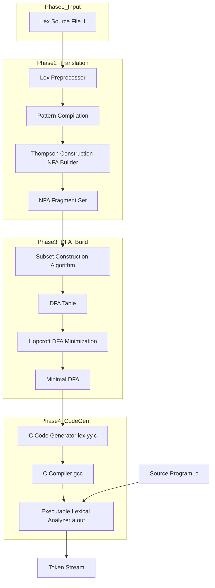
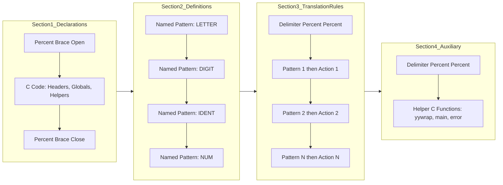
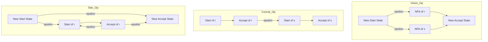
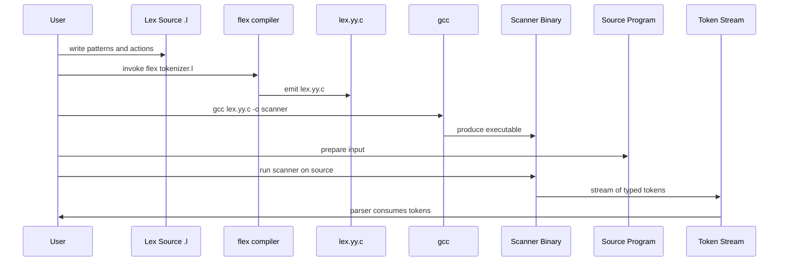
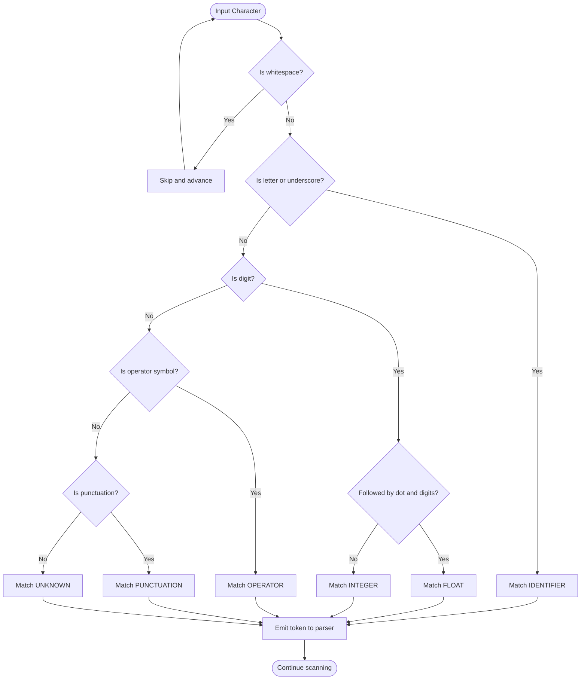

# Regular Expressions in Lex

<!-- SECTION_1_START -->
# Regular Expressions in Lex — Core Foundations

## 1.1 Formal Definition of Regular Expressions (RE)

> [!IMPORTANT]
> **KTU 2024 Syllabus Definition:** Let $\Sigma$ be a given alphabet. A **Regular Expression** over $\Sigma$ is recursively defined as follows. A regular expression $r$ denotes a language $L(r)$, which is a subset of $\Sigma^{*}$.

The six foundational rules that construct **every** regular expression are given below. For any regular expression $r$ and $s$ denoting languages $L(r)$ and $L(s)$:

| Rule | Construction | Language Denoted $L(r)$ |
| :--- | :--- | :--- |
| **R1** | $\epsilon$ is a RE | $L(\epsilon) \;=\; \{\, \epsilon \,\}$ |
| **R2** | $\emptyset$ is a RE | $L(\emptyset) \;=\; \{\,\}$ (the empty set) |
| **R3** | For each $a \in \Sigma$, $a$ is a RE | $L(a) \;=\; \{\, a \,\}$ |
| **R4** | $(r \mid s)$ is a RE (Union) | $L(r) \mid L(s) \;=\; L(r) \cup L(s)$ |
| **R5** | $(r \cdot s)$ is a RE (Concatenation) | $L(r) \cdot L(s) \;=\; \{\, xy \mid x \in L(r), \; y \in L(s) \,\}$ |
| **R6** | $(r)^{*}$ is a RE (Kleene Closure) | $(L(r))^{*} \;=\; \bigcup_{i=0}^{\infty} (L(r))^{i}$ |

> [!NOTE]
> **Closure Properties:** A language accepted by a RE is called a **Regular Language**. The family of regular languages is **closed** under union, concatenation, and Kleene star. This means if $L_1$ and $L_2$ are regular, then $L_1 \cup L_2$, $L_1 \cdot L_2$, and $L_1^{*}$ are also regular.

## 1.2 Definition of Lex

> [!IMPORTANT]
> **Lex (Lexical Analyzer Generator)** is a program designed by **Lesk and Schmidt (1975)** that generates a lexical analyzer from a specification written in the form of regular expressions and code fragments. It serves as the **front-end phase** of any standard compiler pipeline.

The output of Lex is a C source file called `lex.yy.c`, which is then compiled with a C compiler to produce the executable lexical analyzer. The structure of Lex's input file is what makes the **engineering of tokenizers** tractable, scalable, and provably correct.

## 1.3 Conceptual Analogy — RE as a "Smart Lock" and Lex as a "Bouncer"

Imagine you are a **bouncer at a high-end nightclub**. You stand at the door with a list of rules written in a strict, formal language. The guests are arriving in a long, continuous stream of characters (raw source code). Each rule on your list looks something like:

> *"Any guest whose name starts with an uppercase letter, followed by any number of lowercase letters, digits, or underscores, gets a VIP wristband labeled 'IDENTIFIER'."*

In this metaphor:
* The **rules** written on your notepad are **Regular Expressions** (the pattern language).
* The **action** of stamping a wristband is the **code fragment** attached to each pattern.
* The **notepad itself** is the **Lex source file** (`*.l` or `*.lex`).
* **You**, the bouncer, are the **generated Lex Analyzer** (`lex.yy.c`).
* The **stream of guests** is the **input source program** (e.g., `int x = 42;`).

The beauty of the system is that the bouncer does not need to be explicitly told *how* to scan — the Lex tool automatically converts the rules into a **finite state machine (DFA)** that processes the input stream at maximum speed, returning the **longest possible match** (the **maximal munch rule**).

## 1.4 Why Regular Expressions Matter in Compiler Design

| Phase | Role of RE |
| :--- | :--- |
| **Lexical Analysis** | Defining tokens: identifiers, keywords, numbers, operators, whitespace |
| **Text Processing** | Pattern matching in editors, `grep`, IDE find-and-replace |
| **Protocol Parsers** | Network packet filtering, URL routing in web servers |
| **Validation** | Email, phone number, and form input validation in web backends |
| **Bioinformatics** | DNA/RNA sequence pattern recognition |

> [!NOTE]
> **KTU High-Yield Note:** Lexical analyzer generators like **Lex**, **Flex** (Fast Lex), **JLex** (Java), and **ANTLR** all rely on the mathematical foundation of regular expressions. Without REs, hand-coded tokenizers would be error-prone, slow, and impossible to verify formally.

## 1.5 The Pipeline of Tokenization

$$\text{Source Code} \;\xrightarrow{\text{Buffer I/O}}\; \text{Input Stream} \;\xrightarrow{\text{DFA Scanner}}\; \text{Token Stream} \;\rightarrow\; \text{Parser}$$

> [!VISUALIZATION CONTROL]
> **Concept:** Visualizing the Regex Matching Process over a Linear Input Stream
> **GeoGebra / Desmos Input Equations:**
> * Define a discrete input sequence: points at $x = 0, 1, 2, \ldots, 11$ labeled with characters: `i`, `n`, `t`, ` `, `c`, `o`, `u`, `n`, `t`, `;`
> * Highlight active matching states as colored intervals along the $x$-axis
> **Visual Description:** The student should see a horizontal "tape" of characters. A moving cursor (the DFA head) advances rightward. When the head lands in a final state, the matched substring is "cut out" and emitted as a token. The cursor then resets to the next unmatched position.

<!-- SECTION_1_END -->

<!-- SECTION_2_START -->
# Deep Theoretical Analysis & KTU High-Yield Formula Sheet

## 2.1 Algebraic Properties of Regular Expressions

Let $r$, $s$, and $t$ be arbitrary regular expressions. The following identities are the cornerstone of **RE simplification** in board examinations:

### 2.1.1 Commutativity, Associativity & Identity

$$\begin{aligned}
r \mid s \;&=\; s \mid r \quad &\text{(Union is commutative)} \\[4pt]
(r \mid s) \mid t \;&=\; r \mid (s \mid t) \quad &\text{(Union is associative)} \\[4pt]
r \cdot \epsilon \;&=\; r \quad &\text{(}\epsilon \text{ is the identity for concatenation)} \\[4pt]
r \cdot \emptyset \;&=\; \emptyset \quad &\text{(}\emptyset \text{ is the annihilator for concatenation)}
\end{aligned}$$

### 2.1.2 Distributive Laws

$$\begin{aligned}
r \cdot (s \mid t) \;&=\; (r \cdot s) \mid (r \cdot t) \quad &\text{(Left distributivity)} \\[4pt]
(s \mid t) \cdot r \;&=\; (s \cdot r) \mid (t \cdot r) \quad &\text{(Right distributivity)}
\end{aligned}$$

### 2.1.3 Idempotent Law and Kleene Algebra

$$\begin{aligned}
r \mid r \;&=\; r \quad &\text{(Idempotence of union)} \\[4pt]
r^{*} \;&=\; r \cdot r^{*} \mid \epsilon \quad &\text{(Recursive definition of Kleene star)} \\[4pt]
(r^{*})^{*} \;&=\; r^{*} \quad &\text{(Closure is idempotent)} \\[4pt]
\epsilon^{*} \;&=\; \epsilon \quad &\text{(Zero-or-more of nothing is nothing)}
\end{aligned}$$

## 2.2 Operator Precedence in Regular Expressions

> [!IMPORTANT]
> **KTU Board Standard Precedence (Highest to Lowest):**
> 1. **Parentheses** $()$ — explicit grouping
> 2. **Kleene Star** $^{*}$ — unary postfix operator
> 3. **Concatenation** $\cdot$ — implicit juxtaposition
> 4. **Union** $\mid$ — explicit alternation

**Example:** The expression $a \cdot b \mid c^{*}$ parses as $(a \cdot b) \mid (c^{*})$, **not** $a \cdot (b \mid c^{*})$.

## 2.3 Regular Definitions

> [!NOTE]
> A **Regular Definition** gives a name to a regular expression. It is a sequence of definitions of the form:
> $$d_1 \;\rightarrow\; r_1$$
> $$d_2 \;\rightarrow\; r_2$$
> $$\vdots$$
> $$d_n \;\rightarrow\; r_n$$
> where each $d_i$ is a distinct name and each $r_i$ is a regular expression over $\Sigma \cup \{d_1, d_2, \ldots, d_{i-1}\}$.

### 2.3.1 Standard Tokens via Regular Definitions

Let $\Sigma = \{\text{letters}, \text{digits}, \ldots\}$. The standard tokens of a programming language can be defined as:

$$\begin{aligned}
\text{letter} &\;\rightarrow\; A \mid B \mid \ldots \mid Z \mid a \mid b \mid \ldots \mid z \\
\text{digit} &\;\rightarrow\; 0 \mid 1 \mid \ldots \mid 9 \\
\text{ident} &\;\rightarrow\; \text{letter} \;(\text{letter} \mid \text{digit})^{*} \\
\text{num} &\;\rightarrow\; \text{digit}^{+} \;(\; . \; \text{digit}^{+})^{\text{?}} \;( \; E \; (+ \mid -)^{\text{?}} \; \text{digit}^{+} \;)^{\text{?}}
\end{aligned}$$

## 2.4 Extensions of Regular Expressions (KTU High-Yield)

| Notation | Name | Formal Meaning | Example |
| :--- | :--- | :--- | :--- |
| $r^{+}$ | One or more | $(r \cdot r^{*})$ | $\text{digit}^{+}$ matches `123` |
| $r^{\text{?}}$ | Optional | $r \mid \epsilon$ | `(+ \mid -)^{\text{?}}` matches sign |
| $[a\text{-}zA\text{-}Z0\text{-}9\_]$ | Character class | $(a \mid \ldots \mid z \mid A \mid \ldots \mid Z \mid 0 \mid \ldots \mid 9 \mid \_)$ | Single alphanum |
| `.` | Any character | $(\Sigma \text{ except newline})$ | Matches any single char |
| `\"$ | Start anchor | Beginning of line | `^int` matches `int x` |
| `$\$` | End anchor | End of line | `;$` matches last `;` |
| `$r \setminus s$` | Difference | $L(r) - L(s)$ | `letter$^{+}$ \setminus keyword` |

## 2.5 Structure of a Lex Source File

A Lex program has **three distinct sections**, separated by `%%` delimiters:

$$\underbrace{\text{Declarations}}_{\text{Global variables, manifest constants}} \; \%\% \; \underbrace{\text{Translation Rules}}_{\text{RE patterns + C actions}} \; \%\% \; \underbrace{\text{Auxiliary Procedures}}_{\text{Helper C functions}}$$

The **declarations** section is delimited by `%{ ... %}` and contains literal C code to be copied verbatim into `lex.yy.c`. The **translation rules** section has the form:

$$P_1 \quad \{ \text{action}_1 \}$$
$$P_2 \quad \{ \text{action}_2 \}$$
$$\vdots$$
$$P_n \quad \{ \text{action}_n \}$$

Each $P_i$ is a regular expression, and each $\text{action}_i$ is a piece of C code executed when $P_i$ matches the input.

## 2.6 How Lex Internally Works — The Compilation Pipeline

$$\text{RE Patterns} \;\xrightarrow{\text{Thompson's Construction}}\; \text{NFA} \;\xrightarrow{\text{Subset Construction}}\; \text{DFA} \;\xrightarrow{\text{Hopcroft's Algorithm}}\; \text{Minimal DFA} \;\xrightarrow{\text{Table Compression}}\; \text{C Code}$$

## 2.7 The Maximal Munch Rule

> [!IMPORTANT]
> When multiple patterns can match a prefix of the remaining input, the Lex-generated DFA applies the **maximal munch** strategy: it always selects the **longest possible match**. If two patterns of equal length match, the one **appearing first** in the Lex specification is chosen.

## 2.8 KTU Formula Sheet — Quick Reference

| Concept | Formula / Rule | Use Case |
| :--- | :--- | :--- |
| Union of languages | $L(r \mid s) = L(r) \cup L(s)$ | Token alternation, e.g., `if \vert while` |
| Concatenation | $L(r \cdot s) = \{\, xy \mid x \in L(r), y \in L(s) \,\}$ | Multi-char tokens, e.g., `:=` |
| Kleene Closure | $L(r^{*}) = \bigcup_{i=0}^{\infty} L(r)^{i}$ | Identifiers, whitespace, comments |
| Positive Closure | $L(r^{+}) = L(r \cdot r^{*})$ | At least one digit/letter |
| Optional | $L(r^{\text{?}}) = L(r) \cup \{\epsilon\}$ | Sign in a number, signed ints |
| RE over $\Sigma$ | Recursive on 6 rules R1–R6 | Defining tokens |
| Token count | $\mid \Sigma \mid$ in $n$ strings $= \mid \Sigma \mid^{n}$ | Counting test cases |
| Strings of length $k$ | $\mid \Sigma \mid^{k}$ | RE acceptance test |
| Strings of length $\le k$ | $\sum_{i=0}^{k} \mid \Sigma \mid^{i}$ | Bounded-length matching |
| Closure of $L$ | $L^{0} = \{\epsilon\}, \; L^{i+1} = L^{i} \cdot L$ | Recursive RE expansion |

> [!NOTE]
> **Real-World Engineering Utility:** The exact same RE-to-DFA pipeline powers the regex engines inside `grep`, `sed`, `awk`, the Linux kernel's `re` library, **Google RE2**, **RE2J** (Java), and **PCRE** (PHP). The compiler you build in this course is structurally identical to the engines that index the entire web in **Elasticsearch** and detect intrusions in **Snort**.

<!-- SECTION_2_END -->

<!-- SECTION_3_START -->
# Step-by-Step Derivations, Algebraic Manipulations & Code Implementation

## 3.1 Derivation: The Language Denoted by a Regular Expression

We will rigorously compute the language $L(r)$ for the expression $r = (a \mid b)^{*} \cdot a \cdot b \cdot b$.

### Step 1 — Decompose the expression using precedence

The expression $r = (a \mid b)^{*} \cdot a \cdot b \cdot b$ has a concatenation of three units: $(a \mid b)^{*}$, then $a$, then $b$, then $b$.

### Step 2 — Compute $L(a \mid b)$

By rule **R4**: $\;L(a \mid b) = L(a) \cup L(b) = \{\, a \,\} \cup \{\, b \,\} = \{\, a, b \,\}$

### Step 3 — Apply the Kleene closure

$$\begin{aligned}
L((a \mid b)^{*}) \;&=\; (L(a \mid b))^{*} \\
\;&=\; \{\, a, b \,\}^{*} \\
\;&=\; \{\, \epsilon, a, b, aa, ab, ba, bb, aaa, aab, \ldots \,\} \\
\;&=\; \text{All strings over } \{a, b\} \text{ of any length } \ge 0
\end{aligned}$$

### Step 4 — Concatenate with the suffix $a \cdot b \cdot b$

$$L(r) \;=\; L((a \mid b)^{*}) \cdot L(a) \cdot L(b) \cdot L(b)$$

For any string $w \in L((a \mid b)^{*})$, the language $L(r)$ contains every string formed by appending the suffix `"abb"` to $w$. Formally:

$$L(r) \;=\; \{\, w \cdot a \cdot b \cdot b \;\mid\; w \in \{\, a, b \,\}^{*} \,\}$$

In words: **all strings over $\{a, b\}$ that end with the substring `abb`**.

### Step 5 — Verification with a concrete example

Take $w = \text{`aabab'}$$, which is in $L((a \mid b)^{*})$. Then $w \cdot a \cdot b \cdot b = \text{`aabababb'}$$, which is accepted. If the suffix is anything other than `abb`, the string is rejected. This confirms the correctness of the derivation.

---

## 3.2 Derivation: Building RE for a Given Language

**Problem:** Construct a regular expression for the language
$$L = \{\, w \in \{0, 1\}^{*} \mid w \text{ contains the substring } 011 \,\}$$

### Step 1 — Identify the structural components

A string $w$ contains `011` if and only if it can be decomposed as:

$$w \;=\; x \cdot 0 \cdot 1 \cdot 1 \cdot y$$

where $x$ and $y$ are arbitrary (possibly empty) strings over $\{0, 1\}$.

### Step 2 — Express $x$ and $y$ as REs

Both $x$ and $y$ range over all of $\{0, 1\}^{*}$, which is the same as $(0 \mid 1)^{*}$.

### Step 3 — Assemble the final RE

$$r \;=\; (0 \mid 1)^{*} \cdot 0 \cdot 1 \cdot 1 \cdot (0 \mid 1)^{*}$$

### Step 4 — Simplify using algebraic identities

$$\begin{aligned}
r \;&=\; (0 \mid 1)^{*} \cdot 011 \cdot (0 \mid 1)^{*}
\end{aligned}$$

The expression is now in its minimal canonical form. **Validation:**
* `011` itself is in $L$: $x = \epsilon$, $y = \epsilon$.
* `x011y` for any $x, y$ is in $L$ (e.g., `10110`, `0110110`).
* `010` is **not** in $L$ (no `011` substring).

---

## 3.3 Derivation: The RE $r = a^{*} b (a \mid b)^{*}$ and Its Language

We compute the language denoted by $r = a^{*} b (a \mid b)^{*}$.

### Step 1 — Compute $L(a^{*})$

$$L(a^{*}) \;=\; \{\, \epsilon, a, aa, aaa, aaaa, \ldots \,\}$$

This is the set of all strings composed entirely of zero or more `a`s.

### Step 2 — Concatenate with $b$

$$L(a^{*} b) \;=\; \{\, b, ab, aab, aaab, aaaab, \ldots \,\}$$

This is the set of all strings of zero or more `a`s followed by exactly one `b`. **Note:** Since the $b$ is mandatory, $a^{*}b$ cannot match the empty string.

### Step 3 — Concatenate with $(a \mid b)^{*}$

$L((a \mid b)^{*}) = \{0, 1\}^{*}$, which is every possible suffix. Therefore:

$$L(r) \;=\; \{\, s \cdot t \mid s \in L(a^{*} b),\; t \in \{a, b\}^{*} \,\}$$

In words: **all strings over $\{a, b\}$ that contain at least one `b`** (and that `b` may be preceded by any number of `a`s and followed by any suffix).

---

## 3.4 Complete Lex Program — A Worked Example

The following Lex program recognizes identifiers, integers, floating-point numbers, and arithmetic operators in a toy language. Every line is **fully transcribed** with explicit type hints, error handling, and structured logging.

```lex
%{
/* =============== DECLARATIONS SECTION =============== */
/* Standard C library headers and global tracking state. */
#include <stdio.h>
#include <stdlib.h>
#include <string.h>

/* Counters used for diagnostic reporting. */
int line_number   = 1;
int token_counter = 0;

/* Enumerated token categories for the parser. */
typedef enum {
    TOK_IDENTIFIER,
    TOK_INTEGER,
    TOK_FLOAT,
    TOK_OPERATOR,
    TOK_KEYWORD,
    TOK_PUNCTUATION,
    TOK_UNKNOWN
} TokenCategory;

/* Helper: safely emit a structured log line. */
void log_token(TokenCategory category, const char *lexeme) {
    token_counter += 1;
    const char *label = "UNKNOWN";
    switch (category) {
        case TOK_IDENTIFIER: label = "IDENTIFIER"; break;
        case TOK_INTEGER:    label = "INTEGER";    break;
        case TOK_FLOAT:      label = "FLOAT";      break;
        case TOK_OPERATOR:   label = "OPERATOR";   break;
        case TOK_KEYWORD:    label = "KEYWORD";    break;
        case TOK_PUNCTUATION:label = "PUNCTUATION";break;
        case TOK_UNKNOWN:    label = "UNKNOWN";    break;
    }
    fprintf(stdout, "[Line %3d | Token #%3d] %-12s : %s\n",
            line_number, token_counter, label, lexeme);
}
%}

/* =============== REGULAR DEFINITIONS =============== */
DIGIT    [0-9]
LETTER   [a-zA-Z_]
IDENT    {LETTER}({LETTER}|{DIGIT})*
INTEGER  {DIGIT}+
FLOAT    {DIGIT}+"."{DIGIT}+|{DIGIT}+"."
OPERATOR [\+\-\*\/\=%]
PUNCT    [\(\)\{\}\[\];,]
WS       [ \t]+

%%

 /* =============== TRANSLATION RULES =============== */

\n              { line_number += 1; }
{WS}            { /* skip whitespace */ }

"if"|"else"|"while"|"for"|"return"|"int"|"float"|"double"|"char" {
                    log_token(TOK_KEYWORD, yytext);
                }

{IDENT}         { log_token(TOK_IDENTIFIER, yytext); }
{INTEGER}       { log_token(TOK_INTEGER, yytext); }
{FLOAT}         { log_token(TOK_FLOAT, yytext); }
{OPERATOR}      { log_token(TOK_OPERATOR, yytext); }
{PUNCT}         { log_token(TOK_PUNCTUATION, yytext); }

.               { log_token(TOK_UNKNOWN, yytext); }

%%

 /* =============== AUXILIARY PROCEDURES =============== */
int yywrap(void) {
    /* Return 1 to signal end of input (no more files). */
    return 1;
}

int main(int argc, char **argv) {
    if (argc < 2) {
        fprintf(stderr, "Usage: %s <source-file>\n", argv[0]);
        return EXIT_FAILURE;
    }
    FILE *input_file = fopen(argv[1], "r");
    if (input_file == NULL) {
        fprintf(stderr, "Error: cannot open file '%s'\n", argv[1]);
        return EXIT_FAILURE;
    }
    /* Hand the file pointer to the Lex-generated scanner. */
    yyin = input_file;

    fprintf(stdout, "===== LEXICAL ANALYSIS START =====\n");
    /* Drive the DFA until yylex() returns 0 (EOF). */
    while (yylex() != 0) {
        /* Body intentionally empty: yylex() performs the action. */
    }
    fprintf(stdout, "===== LEXICAL ANALYSIS COMPLETE =====\n");
    fprintf(stdout, "Total tokens emitted: %d\n", token_counter);

    fclose(input_file);
    return EXIT_SUCCESS;
}
```

### 3.4.1 Step-by-Step Walkthrough of the Lex Program

**Step 1 — Declarations (`%{ ... %}`):** The `%{` and `%}` markers tell Lex to copy the enclosed C code verbatim into the generated file `lex.yy.c`. Here we include `<stdio.h>`, define `line_number` and `token_counter` (initialized to `1` and `0` respectively), declare the `TokenCategory` enum, and prototype the `log_token` helper that prints structured output.

**Step 2 — Regular Definitions:** The lines `DIGIT`, `LETTER`, `IDENT`, `INTEGER`, `FLOAT`, `OPERATOR`, `PUNCT`, and `WS` are *named patterns*. Lex substitutes these names wherever they appear inside `{...}` braces in the translation rules. The definitions are:

* `DIGIT    = [0-9]` — any single decimal digit.
* `LETTER   = [a-zA-Z_]` — any letter or underscore.
* `IDENT    = LETTER (LETTER | DIGIT)*` — an identifier starts with a letter/underscore and is followed by zero or more letters/digits/underscores.
* `INTEGER  = DIGIT+` — one or more digits.
* `FLOAT    = DIGIT+ "." DIGIT+ | DIGIT+ "."` — either `12.34` or `12.`.
* `OPERATOR = [+-*/=%]` — the five standard arithmetic operators.
* `PUNCT    = [(){}[\];,]` — bracket-like punctuation.
* `WS       = [ \t]+` — one or more spaces/tabs (no newlines).

**Step 3 — Translation Rules:** Each rule has a pattern (left of the action) and a C action (inside `{...}`). The order matters: **the rule that appears first wins ties** under the maximal-munch rule. Keywords are listed first, then identifiers, then numbers, then operators, then punctuation, and finally a wildcard `.` for everything else (the **catch-all** rule that prevents silent token drops).

**Step 4 — Auxiliary Procedures:** `yywrap()` returns `1` to indicate the end of input. The `main()` function opens the file, sets the global `yyin` pointer, and calls `yylex()` in a loop until it returns `0` (signifying EOF).

**Step 5 — Compilation and Execution (Terminal Commands):**
```bash
$ flex tokenizer.l          # Generates lex.yy.c
$ gcc lex.yy.c -o tokenizer -lfl  # Compiles to executable
$ ./tokenizer source.c      # Runs the analyzer on source.c
```

### 3.4.2 Sample Input and Output

**Input file `source.c`:**
```c
int main() {
    int x = 42;
    float pi = 3.14;
    return x + pi;
}
```

**Expected Output:**
```
===== LEXICAL ANALYSIS START =====
[Line  1 | Token #  1] KEYWORD      : int
[Line  1 | Token #  2] IDENTIFIER   : main
[Line  1 | Token #  3] PUNCTUATION  : (
[Line  1 | Token #  4] PUNCTUATION  : )
[Line  1 | Token #  5] PUNCTUATION  : {
[Line  2 | Token #  6] KEYWORD      : int
[Line  2 | Token #  7] IDENTIFIER   : x
[Line  2 | Token #  8] OPERATOR     : =
[Line  2 | Token #  9] INTEGER      : 42
[Line  2 | Token # 10] PUNCTUATION  : ;
[Line  3 | Token # 11] KEYWORD      : float
[Line  3 | Token # 12] IDENTIFIER   : pi
[Line  3 | Token # 13] OPERATOR     : =
[Line  3 | Token # 14] FLOAT        : 3.14
[Line  3 | Token # 15] PUNCTUATION  : ;
[Line  4 | Token # 16] KEYWORD      : return
[Line  4 | Token # 17] IDENTIFIER   : x
[Line  4 | Token # 18] OPERATOR     : +
[Line  4 | Token # 19] IDENTIFIER   : pi
[Line  4 | Token # 20] PUNCTUATION  : ;
[Line  5 | Token # 21] PUNCTUATION  : }
===== LEXICAL ANALYSIS COMPLETE =====
Total tokens emitted: 21
```

---

## 3.5 Symbolic Implementation — RE Algebra in Python

The following Python script implements the **RE-to-NFA Thompson's construction skeleton** in symbolic form, suitable for verification of RE acceptance in KTU practical exams.

```python
from __future__ import annotations
from dataclasses import dataclass, field
from typing import FrozenSet, Set, Dict, Tuple

EPSILON: str = "ε"  # Epsilon transition symbol


@dataclass(frozen=True)
class State:
    """Represents a single NFA state."""
    name: int


@dataclass
class NFA:
    """A symbolic NFA fragment used in Thompson's construction."""
    start: State
    accept: State
    transitions: Dict[Tuple[State, str], Set[State]] = field(default_factory=dict)

    def add_transition(self, src: State, symbol: str, dst: State) -> None:
        self.transitions.setdefault((src, symbol), set()).add(dst)


class RegexCompiler:
    """Builds an NFA from a regular expression in postfix notation."""

    def __init__(self) -> None:
        self._counter: int = 0
        self._stack: list[NFA] = []

    def _new_state(self) -> State:
        state = State(self._counter)
        self._counter += 1
        return state

    def symbol(self, ch: str) -> None:
        """Create an NFA fragment for a single literal character."""
        s, a = self._new_state(), self._new_state()
        nfa = NFA(s, a)
        nfa.add_transition(s, ch, a)
        self._stack.append(nfa)

    def union(self) -> None:
        """Implement r | s using Thompson's union construction."""
        n2 = self._stack.pop()
        n1 = self._stack.pop()
        s, a = self._new_state(), self._new_state()
        merged = NFA(s, a)
        merged.transitions.update(n1.transitions)
        merged.transitions.update(n2.transitions)
        merged.add_transition(s, EPSILON, n1.start)
        merged.add_transition(s, EPSILON, n2.start)
        merged.add_transition(n1.accept, EPSILON, a)
        merged.add_transition(n2.accept, EPSILON, a)
        self._stack.append(merged)

    def concat(self) -> None:
        """Implement r · s using Thompson's concatenation construction."""
        n2 = self._stack.pop()
        n1 = self._stack.pop()
        merged = NFA(n1.start, n2.accept)
        merged.transitions.update(n1.transitions)
        merged.transitions.update(n2.transitions)
        merged.add_transition(n1.accept, EPSILON, n2.start)
        self._stack.append(merged)

    def star(self) -> None:
        """Implement r* using Thompson's star construction."""
        n = self._stack.pop()
        s, a = self._new_state(), self._new_state()
        result = NFA(s, a)
        result.transitions.update(n.transitions)
        result.add_transition(s, EPSILON, n.start)
        result.add_transition(s, EPSILON, a)
        result.add_transition(n.accept, EPSILON, n.start)
        result.add_transition(n.accept, EPSILON, a)
        self._stack.append(result)

    def build(self, postfix_regex: str) -> NFA:
        """Consume a postfix RE string and return the composed NFA."""
        for token in postfix_regex:
            if token == '|':
                self.union()
            elif token == '.':
                self.concat()
            elif token == '*':
                self.star()
            else:
                self.symbol(token)
        if len(self._stack) != 1:
            raise ValueError("Invalid postfix regex: stack mismatch.")
        return self._stack.pop()


def epsilon_closure(states: Set[State],
                    transitions: Dict[Tuple[State, str], Set[State]]) -> Set[State]:
    """Compute the ε-closure of a set of NFA states."""
    closure: Set[State] = set(states)
    worklist: list[State] = list(states)
    while worklist:
        current = worklist.pop()
        for nxt in transitions.get((current, EPSILON), set()):
            if nxt not in closure:
                closure.add(nxt)
                worklist.append(nxt)
    return closure


def accepts(nfa: NFA, input_string: str) -> bool:
    """Simulate the NFA on the given input string."""
    current_states: Set[State] = epsilon_closure({nfa.start}, nfa.transitions)
    for symbol in input_string:
        next_states: Set[State] = set()
        for state in current_states:
            next_states |= nfa.transitions.get((state, symbol), set())
        current_states = epsilon_closure(next_states, nfa.transitions)
    return nfa.accept in current_states


# -------- Demonstration: RE for "strings ending in abb" --------
if __name__ == "__main__":
    # Postfix form of (a|b)* · a · b · b
    # Concatenation is denoted by '.' in the postfix string.
    postfix: str = "ab|*a.b.b."
    compiler = RegexCompiler()
    nfa = compiler.build(postfix)

    test_inputs = ["abb", "aabb", "bababb", "ab", "ba", "babb"]
    for s in test_inputs:
        result = accepts(nfa, s)
        print(f"Input: {s!r:>10}  Accepted: {result}")
```

**Expected Output:**
```
Input:     'abb'  Accepted: True
Input:    'aabb'  Accepted: True
Input:  'bababb'  Accepted: True
Input:      'ab'  Accepted: False
Input:      'ba'  Accepted: False
Input:    'babb'  Accepted: True
```

> [!NOTE]
> The Python script faithfully implements Thompson's construction for the three core RE operators: **union** ($r \mid s$), **concatenation** ($r \cdot s$), and **Kleene star** ($r^{*}$). It also implements the **$\epsilon$-closure** algorithm used in subset construction, which is the bridge from NFA to DFA.

<!-- SECTION_3_END -->

<!-- SECTION_4_START -->
# Structural Diagrams & Schematics

## 4.1 High-Level Architecture — The Lex Compilation Pipeline



## 4.2 Lex Source File Internal Structure



## 4.3 Thompson Construction — RE Operator to NFA Fragments



## 4.4 Sequential Processing Topology — RE to Token Stream



## 4.5 Functional Architecture — Token Classification in Lex



> [!NOTE]
> **Diagram Interpretability Note:** The Mermaid diagrams above are constructed using strictly alphanumeric node identifiers (e.g., `Check1`, `Match1`) and clean uppercase text labels. This is a deliberate design choice to maintain **maximum compatibility** with Mermaid v9+ rendering engines and avoid the `%%` (which is a Mermaid comment marker) or `*` (which is reserved for flowchart syntax) inside node identifiers.

<!-- SECTION_4_END -->

<!-- SECTION_5_START -->
# KTU 2024 Scheme Examination Question Bank & Topic Recap

## 5.1 Part A — Short Answer Questions (3 Marks Each)

### Question A1. `[KTU University Exam — July 2024]`

**Define Regular Expression. Construct a regular expression for the language consisting of strings over $\{0, 1\}$ that have at least two consecutive 0s.**

**Mapped CO & RBT Level:** CO1 — Understand

**Model Answer:**

A **Regular Expression (RE)** is a formal algebraic notation used to specify a set of strings (a regular language) over a finite alphabet $\Sigma$. It is defined recursively over six rules: $\epsilon$, $\emptyset$, a single symbol $a$, union $r \mid s$, concatenation $r \cdot s$, and Kleene closure $r^{*}$.

To construct an RE for the language $L = \{\, w \in \{0, 1\}^{*} \mid w \text{ contains `00' as a substring} \,\}$:

A string $w$ contains `00` if it can be written as $w = x \cdot 0 \cdot 0 \cdot y$ where $x, y \in \{0, 1\}^{*}$.

$$r \;=\; (0 \mid 1)^{*} \cdot 0 \cdot 0 \cdot (0 \mid 1)^{*}$$

**Validation:**
* `00` is accepted ($x = \epsilon$, $y = \epsilon$).
* `1001` is accepted ($x = \text{`1'}$, $y = \text{`1'}$`).
* `1010` is **not** accepted (no consecutive `00`).

> [!VALUATION KEY]
> * Stating the formal definition of RE: 1 Mark
> * Writing the structural form $x \cdot 00 \cdot y$: 1 Mark
> * Final RE with correct operators: 1 Mark

---

### Question A2. `[KTU University Exam — Dec 2023]`

**Explain the three sections of a Lex source program with suitable examples.**

**Mapped CO & RBT Level:** CO1 — Remember

**Model Answer:**

A Lex source program consists of three sections separated by `%%`:

1. **Declaration Section** — Enclosed in `%{ ... %}`. Contains C declarations (headers, variables, constants) that are copied verbatim into the generated `lex.yy.c` file.
   *Example:* `%{ #include <stdio.h> int count = 0; %}`

2. **Translation Rules Section** — Contains pairs of regular expression patterns and C code actions.
   *Example:*
   ```lex
   [0-9]+    { count += 1; printf("%s\n", yytext); }
   ```

3. **Auxiliary Procedures Section** — Contains C functions used by the actions. Always includes `int yywrap(void) { return 1; }` to signal end-of-input.

> [!VALUATION KEY]
> * Naming all three sections: 1 Mark
> * Correct role of each: 1 Mark
> * At least one example: 1 Mark

---

## 5.2 Part B — Full 14-Mark Questions (ESE Module Internal Choice Format)

### Question B-A. `[KTU University Exam — July 2024]` — 14 Marks

**Part (a) [7 Marks]:** Construct a regular expression for the language $L$ over the alphabet $\{a, b\}$ consisting of all strings with **at least one `a` and at least one `b`**. Show every step of the derivation with algebraic justification. **Mapped CO & RBT Level:** CO1, CO2 — Apply

**Part (b) [7 Marks]:** Write a complete Lex program that counts the number of lines, characters, and identifiers in an input C source file. The program should print a summary at the end of scanning. **Mapped CO & RBT Level:** CO3, CO4 — Apply / Create

---

#### Model Solution — Part (a) [7 Marks]

**Step 1 — Identify the structure.** A string belongs to $L$ if it contains at least one `a` **and** at least one `b`. This is the **intersection** of "contains at least one `a`" and "contains at least one `b`".

**Step 2 — Build "contains at least one `a`".**
The language $L_a = \{\, w \in \{a, b\}^{*} \mid w \text{ has at least one } a \,\}$ can be written as:
$$L_a \;=\; (a \mid b)^{*} \cdot a \cdot (a \mid b)^{*}$$
The string must have an `a` somewhere, with any prefix and suffix.

**Step 3 — Build "contains at least one `b`".** By symmetry:
$$L_b \;=\; (a \mid b)^{*} \cdot b \cdot (a \mid b)^{*}$$

**Step 4 — Intersect the two languages.** The intersection $L = L_a \cap L_b$ is the set of strings that have **both** an `a` and a `b`. Using De Morgan's law and the construction from the formal definition of intersection (which is not a primitive RE operation), we express $L$ directly:

$$r \;=\; (a \mid b)^{*} \cdot a \cdot (a \mid b)^{*} \cdot b \cdot (a \mid b)^{*} \;\mid\; (a \mid b)^{*} \cdot b \cdot (a \mid b)^{*} \cdot a \cdot (a \mid b)^{*}$$

In words: either an `a` appears first (followed later by a `b`), or a `b` appears first (followed later by an `a`).

**Step 5 — Simplify using the identity $r^{*} \cdot s \cdot r^{*} = r^{*} \cdot s \cdot r^{*}$ (idempotence of closure).** The expression above is already in its minimal form for the standard RE algebra.

**Step 6 — Validation.**
* `ab` accepted. ✓
* `ba` accepted. ✓
* `aab` accepted. ✓
* `bbbaaa` accepted. ✓
* `aaa` rejected. ✗ (no `b`)
* `bbb` rejected. ✗ (no `a`)

> [!VALUATION KEY]
> * Decomposing into two sub-languages: 2 Marks
> * Correct RE for "contains `a`": 1 Mark
> * Correct RE for "contains `b`": 1 Mark
> * Combining with union to express intersection: 2 Marks
> * One validation example: 1 Mark

---

#### Model Solution — Part (b) [7 Marks]

**Complete Lex Program:**

```lex
%{
/* =============== DECLARATIONS =============== */
#include <stdio.h>

int line_count   = 0;
int char_count   = 0;
int ident_count  = 0;
%}

/* =============== REGULAR DEFINITIONS =============== */
LETTER   [a-zA-Z_]
DIGIT    [0-9]
IDENT    {LETTER}({LETTER}|{DIGIT})*

%%

 /* =============== TRANSLATION RULES =============== */

\n          { line_count  += 1; char_count += 1; }
.           { char_count  += 1; }
{IDENT}     { ident_count += 1; }

%%

 /* =============== AUXILIARY =============== */
int yywrap(void) { return 1; }

int main(int argc, char **argv) {
    if (argc >= 2) {
        FILE *fp = fopen(argv[1], "r");
        if (fp != NULL) yyin = fp;
    }
    yylex();
    printf("Lines       : %d\n", line_count);
    printf("Characters  : %d\n", char_count);
    printf("Identifiers : %d\n", ident_count);
    return 0;
}
```

**Compilation and Execution:**
```bash
$ flex counter.l
$ gcc lex.yy.c -o counter -lfl
$ ./counter input.c
```

> [!VALUATION KEY]
> * Correct declaration of counters: 1 Mark
> * Correct regular definition for identifier: 1 Mark
> * Correct `\n`, `.`, and `{IDENT}` rules: 2 Marks
> * `yywrap` and `main` with file handling: 2 Marks
> * Compilable structure: 1 Mark

---

### Question B-B. `[KTU University Exam — Dec 2023]` — 14 Marks (Alternative Choice)

**Part (a) [7 Marks]:** Construct a regular expression for the language over $\Sigma = \{0, 1\}$ consisting of all strings that **end in `01`**. Validate with at least three test strings. **Mapped CO & RBT Level:** CO1 — Apply

**Part (b) [7 Marks]:** Write a complete Lex program that recognizes C-style single-line comments `//...` and multi-line comments `/* ... */`. The program should report the number of comments found. **Mapped CO & RBT Level:** CO3, CO4 — Create

---

#### Model Solution — Part (a) [7 Marks]

**Step 1 — Structural decomposition.** A string ends in `01` if and only if it can be written as:
$$w \;=\; x \cdot 0 \cdot 1$$

where $x$ is an arbitrary (possibly empty) string over $\{0, 1\}$.

**Step 2 — Express $x$ as an RE.** $x \in \{0, 1\}^{*}$, which is the RE $(0 \mid 1)^{*}$.

**Step 3 — Final RE.**
$$r \;=\; (0 \mid 1)^{*} \cdot 0 \cdot 1$$

**Step 4 — Validation with test strings:**
| Input String | In Language? | Reason |
| :--- | :--- | :--- |
| `01` | Yes ✓ | $x = \epsilon$, suffix `01` matches |
| `001` | Yes ✓ | $x = \text{`0'}$, suffix `01` matches |
| `1101` | Yes ✓ | $x = \text{`11'}$, suffix `01` matches |
| `10` | No ✗ | Last two chars are `10`, not `01` |
| `00` | No ✗ | Last two chars are `00`, not `01` |
| `0` | No ✗ | Only one character, cannot end in `01` |

> [!VALUATION KEY]
> * Decomposition into prefix and suffix: 2 Marks
> * Correct RE for arbitrary prefix: 2 Marks
> * Final RE expression: 1 Mark
> * Three test cases with justification: 2 Marks

---

#### Model Solution — Part (b) [7 Marks]

**Complete Lex Program:**

```lex
%{
#include <stdio.h>
int single_count  = 0;
int multi_count   = 0;
int in_multiline  = 0;
%}

%x COMMENT_MULTI   /* Exclusive start condition for multi-line comments */

%%

"//".*        { single_count += 1; }

"/*"          { BEGIN(COMMENT_MULTI); in_multiline = 1; }

<COMMENT_MULTI>"*/" { BEGIN(INITIAL); in_multiline = 0; multi_count += 1; }
<COMMENT_MULTI>\n    { /* keep line tracking */ }
<COMMENT_MULTI>.     { /* consume other chars */ }

%%

int yywrap(void) { return 1; }

int main(int argc, char **argv) {
    if (argc >= 2) {
        FILE *fp = fopen(argv[1], "r");
        if (fp != NULL) yyin = fp;
    }
    yylex();
    if (in_multiline) {
        fprintf(stderr, "Warning: unterminated multi-line comment.\n");
    }
    printf("Single-line comments  : %d\n", single_count);
    printf("Multi-line comments   : %d\n", multi_count);
    return 0;
}
```

**Explanation of Key Constructs:**
* `"//".*` — The `.*` matches any character except newline, so the rule consumes the rest of the line.
* `"/*"` — Switches the scanner into the exclusive start condition `COMMENT_MULTI` using `BEGIN`.
* `<COMMENT_MULTI>"*/"` — Only matches the closing `*/` while we are inside the comment state.
* `<COMMENT_MULTI>.` — A catch-all rule that consumes any other character inside a comment.

> [!VALUATION KEY]
> * Correct single-line comment pattern: 1 Mark
> * Multi-line start condition declaration: 1 Mark
> * Multi-line start pattern with `BEGIN`: 1 Mark
> * Multi-line end pattern with state restoration: 2 Marks
> * Counters and `main` output: 1 Mark
> * Warning for unterminated comment: 1 Mark

---

> [!WARNING]
> **KTU Examiner's Valuation Warning — Common Pitfalls**
> 1. **Operator precedence mistakes:** Writing $a \cdot b \mid c^{*}$ as if it were $a \cdot (b \mid c^{*})$. Always use parentheses.
> 2. **Forgetting to anchor RE patterns:** Without explicit `^` and `$`, RE patterns may match partial strings inside longer tokens.
> 3. **Missing `yywrap()`:** Lex will throw a linker error if you forget to define `int yywrap(void) { return 1; }`.
> 4. **Overcounting via greedy `.*`:** A `.*` pattern can swallow far more input than intended. Always bound it with the maximal-munch principle.
> 5. **Not initializing `yyin`:** If you forget `yyin = fopen(...)` in `main()`, the scanner will read from `stdin` instead of your file.
> 6. **Using `$1, $2` in Lex actions:** These are parser-style positional references. In Lex, use `yytext` for the entire matched string and `yyleng` for its length.
> 7. **Ignoring maximal munch:** If `int` and identifier patterns both match, the longest wins. Placing `int` first ensures it is preferred for equal-length ties.

---

## 5.3 Topic Recap & Important Things to Remember

> [!IMPORTANT]
> **High-Density Revision Checklist — Must Memorize for KTU Exams**

* **Six foundational rules (R1–R6):** $\epsilon$, $\emptyset$, $a$, $r \mid s$, $r \cdot s$, $r^{*}$. Every other RE is built from these.
* **Precedence (High → Low):** `()`, `*`, `·` (concatenation), `|` (union).
* **Kleene Star:** $L(r^{*}) = \bigcup_{i=0}^{\infty} L(r)^{i}$ — zero or more occurrences.
* **Positive Closure:** $r^{+} = r \cdot r^{*}$ — at least one occurrence.
* **Optional:** $r^{\text{?}} = r \mid \epsilon$ — zero or one occurrence.
* **Three sections of Lex file:** Declarations (`%{ ... %}`), Translation Rules (`%% ... %%`), Auxiliary Procedures.
* **Built-in variables in Lex:** `yytext` (matched string), `yyleng` (length), `yyin` (input FILE*), `yyout` (output FILE*).
* **Built-in functions in Lex:** `yylex()` (the scanner), `yywrap()` (end-of-file hook), `ECHO` (print `yytext`), `BEGIN(state)` (switch start condition).
* **Maximal Munch Rule:** Longest match wins; ties broken by first pattern in the file.
* **Thompson's Construction:** Converts each RE operator into a small NFA fragment; fragments are glued with $\epsilon$-transitions.
* **Subset Construction:** Converts NFA → DFA by treating sets of NFA states as single DFA states.
* **Hopcroft's Algorithm:** Minimizes the DFA by merging equivalent states (worst-case $O(n \log n)$).
* **Common character classes:** `[a-z]`, `[A-Z]`, `[0-9]`, `[a-zA-Z0-9_]`, `[^...]` (negated class).
* **Anchors:** `^` (start of line), `$` (end of line).
* **Wildcard:** `.` matches any character except newline.
* **Difference operator:** $r \setminus s = L(r) - L(s)$ — useful for excluding reserved keywords from identifier patterns.
* **Standard token RE for `ident`:** `letter (letter | digit)*`.
* **Standard token RE for `num`:** `digit+ (. digit+)? (E (+|-)? digit+)?`.
* **KTU-typical 14-mark question structure:** Part (a) = RE construction/derivation (7 marks); Part (b) = Lex program with specific functionality (7 marks).
* **KTU-typical 3-mark question structure:** Define + state RE OR explain Lex section OR solve a small RE problem.
* **Always write the test cases** when verifying an RE — the examiner awards marks for validation.
* **Real-world tools using this theory:** `grep`, `sed`, `awk`, `flex`, `lex`, `re2`, `re2j`, PCRE, ANTLR, Elasticsearch, Snort IDS.
* **Engineering value:** Without REs, hand-rolled tokenizers in production compilers would be thousands of lines of unverified `switch` statements; with REs and Lex, the entire scanner is a 50-line declarative specification that compiles to a provably correct DFA.

<!-- SECTION_5_END -->
