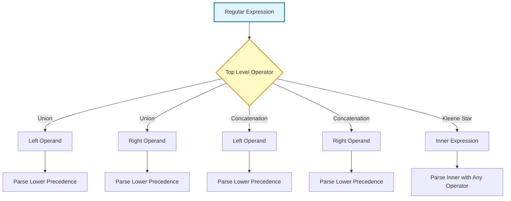
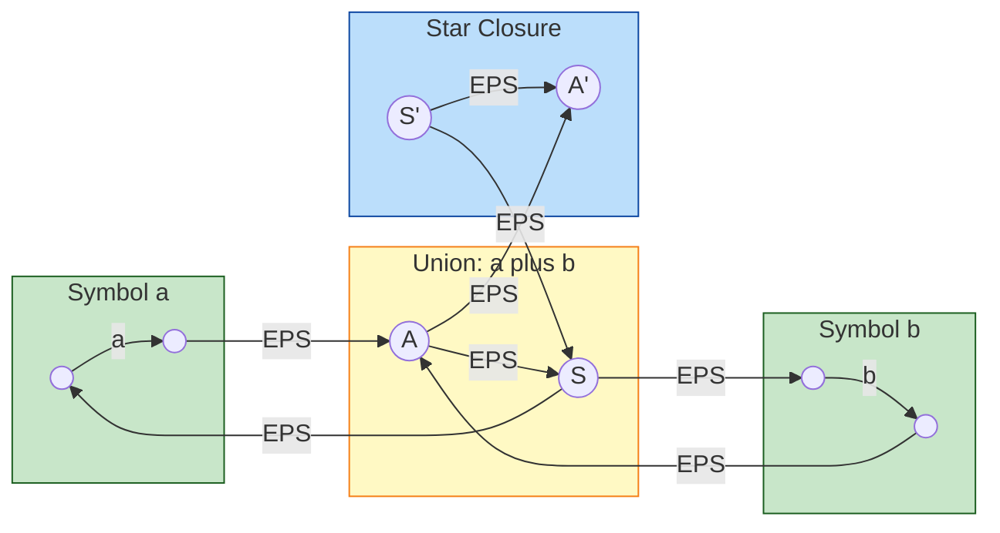
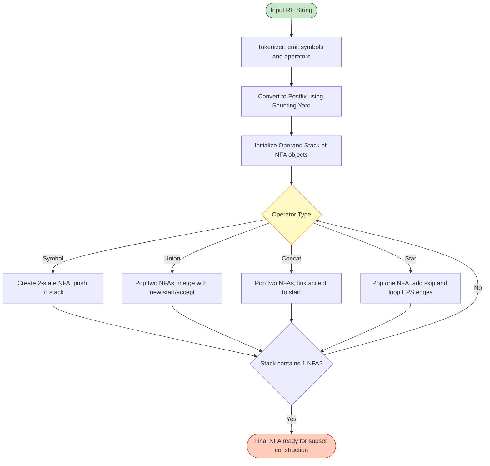
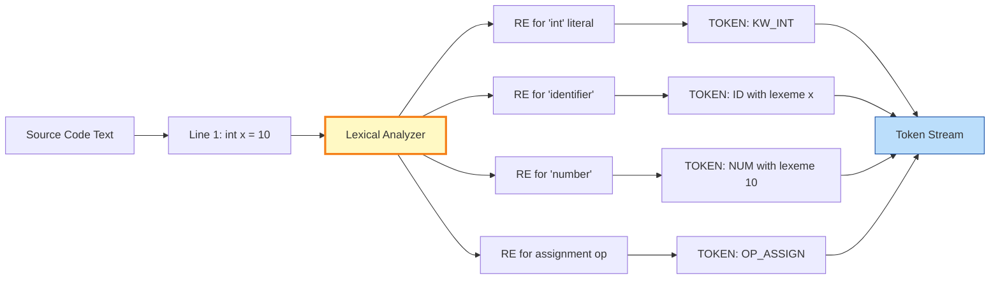
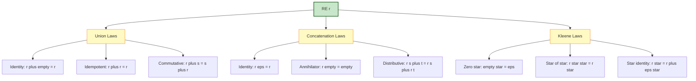

# Regular Expressions

<!-- SECTION_1_START -->
# Regular Expressions in Compiler Design

> [!IMPORTANT]
> **KTU 2024 Scheme | PCCST601 - Compiler Design | Module 1 - Introduction**
> **Course Outcome Mapped:** CO1 – Apply finite automata and regular expression concepts for lexical analysis.
> **Bloom's Level:** Apply / Analyze

## 1.1 Formal Definition

A **Regular Expression (RE)** is a formal algebraic notation used to precisely describe a **regular language** (the set of strings accepted by a finite automaton). It is built recursively from three primitive operations: **union**, **concatenation**, and **Kleene star (closure)**.

Let $\Sigma$ be a finite, non-empty alphabet. A Regular Expression over $\Sigma$ is defined inductively as:

1. **Basis (Empty Language):** $\emptyset$ is a regular expression denoting the empty set.
2. **Basis (Empty String):** $\epsilon$ is a regular expression denoting the language $\{\epsilon\}$.
3. **Basis (Symbol):** For every $a \in \Sigma$, the symbol $a$ is a regular expression denoting the singleton language $\{a\}$.
4. **Induction (Union):** If $r$ and $s$ are regular expressions, then $(r \mid s)$ is a regular expression denoting $L(r) \cup L(s)$.
5. **Induction (Concatenation):** If $r$ and $s$ are regular expressions, then $(rs)$ is a regular expression denoting $L(r) \cdot L(s)$.
6. **Induction (Kleene Star):** If $r$ is a regular expression, then $(r^{*})$ is a regular expression denoting $L(r)^{*}$.
7. **Extension (Plus):** $r^{+}$ denotes one or more occurrences: $L(r)^{+}$.

> [!NOTE]
> **Priority of Operators (Highest to Lowest):** Kleene star $\rightarrow$ Concatenation $\rightarrow$ Union ($|$). Parentheses $( )$ are used to override precedence.

## 1.2 Conceptual Analogy / Intuition

Imagine a **wildcard search** in your code editor (like `Ctrl+F` with regex). When you type `\d+`, you are essentially saying: *"find me one or more digits in sequence."* That tiny pattern is a **regular expression** — a compact formula that describes an entire (potentially infinite) family of strings without listing them one by one.

In a **compiler**, the very first phase — the **lexical analyzer (lexer/scaner)** — uses regular expressions to define the *vocabulary* of the source language:

- **Keywords** (if, while, return) → one RE per token class
- **Identifiers** (variable names) → `letter (letter | digit)*`
- **Numbers** → `digit+ (. digit+)?`
- **Operators** (`+`, `-`, `==`) → one literal RE per operator

| Real-World Analogy | Compiler Analogy |
|---|---|
| Email validation pattern `[\w.]+@[\w.]+` | RE for **TOK_ID** token |
| Phone number mask `\d{10}` | RE for **TOK_NUM** token |
| Wildcard `*.txt` | RE for filename matching |

## 1.3 The Three Foundational Theorems of Regular Expressions

$$r^{*} = \epsilon \mid r \mid rr \mid rrr \mid \ldots = \bigcup_{i=0}^{\infty} r^{i}$$

The **Kleene star** $r^{*}$ generates a potentially infinite language from a finite pattern, which is the mathematical reason why RE can describe languages of unbounded size with a finite expression.

> [!IMPORTANT]
> **KTU High-Yield Insight:** Every regular expression defines a **regular language**, and by Kleene's Theorem, every regular language can be described by a regular expression. This three-way equivalence is the **foundation of Module 1**:
> **Regular Expressions $\equiv$ DFA $\equiv$ NFA $\equiv$ Regular Grammar**
<!-- SECTION_1_END -->

<!-- SECTION_2_START -->
# Deep Theoretical Analysis & KTU High-Yield Formula Sheet

## 2.1 Operator Precedence in Regular Expressions

The compiler parses RE using a strict operator hierarchy (similar to arithmetic in programming languages):

| Precedence | Operator | Meaning | Example | Language Generated |
|:---:|:---:|:---|:---|:---|
| 1 (Highest) | $^{*}$ | Kleene closure (0 or more) | $a^{*}$ | $\{\epsilon, a, aa, aaa, \ldots\}$ |
| 2 | $^{+}$ | Positive closure (1 or more) | $a^{+}$ | $\{a, aa, aaa, \ldots\}$ |
| 3 | $\cdot$ | Concatenation | $ab$ | $\{ab\}$ |
| 4 (Lowest) | $\mid$ | Union (OR) | $a \mid b$ | $\{a, b\}$ |
| — | $( )$ | Grouping | $(a \mid b)c$ | $\{ac, bc\}$ |

## 2.2 Algebraic Laws of Regular Expressions

These identities are **exam-favorite** for proof questions and simplification tasks.

| Law | Statement | Interpretation |
|---|---|---|
| Identity | $r \mid \emptyset = r$ | Adding the empty language changes nothing |
| Identity | $r \cdot \epsilon = r$ | Empty string is the multiplicative identity |
| Annihilator | $r \cdot \emptyset = \emptyset$ | Nothing times anything is nothing |
| Idempotent | $r \mid r = r$ | $r$ OR $r$ is just $r$ |
| Commutative | $r \mid s = s \mid r$ | Union is order-independent |
| Associative | $(r \mid s) \mid t = r \mid (s \mid t)$ | Grouping of unions does not matter |
| Associative | $(rs)t = r(st)$ | Concatenation is associative |
| Distributive | $r(s \mid t) = rs \mid rt$ | Concatenation distributes over union |
| Kleene Identity | $r^{*} = (r \mid \epsilon)^{*}$ | Star already includes empty string |
| Kleene Distribution | $(r \mid s)^{*} = (r^{*} s)^{*} r^{*}$ | Union inside star expands |

## 2.3 KTU Formula Sheet / Cheat Sheet

> [!NOTE]
> **All formulas below are **direct KTU 2024 board-exam ready**. Use \vert instead of \vert inside LaTeX, but here the bars are part of regular expression syntax and are written with a backslash-escaped pipe `$\mid$` to stay table-safe.**

| # | Identity | LaTeX Form | Usage in KTU Problems |
|:---:|:---|:---|:---|
| 1 | Union with empty set | $r \mid \emptyset = r$ | Simplification proofs |
| 2 | Concatenation with $\epsilon$ | $r \cdot \epsilon = r$ | Proof of identity |
| 3 | Concatenation with $\emptyset$ | $r \cdot \emptyset = \emptyset$ | Annihilator proof |
| 4 | Idempotence of union | $r \mid r = r$ | Reduce redundant alternations |
| 5 | Kleene of $\epsilon$ | $\epsilon^{*} = \epsilon$ | Base case in inductive proofs |
| 6 | Kleene of $\emptyset$ | $\emptyset^{*} = \epsilon$ | Base case in inductive proofs |
| 7 | Kleene of Kleene | $(r^{*})^{*} = r^{*}$ | Simplifying nested stars |
| 8 | $r^{*}$ in terms of $r^{+}$ | $r^{*} = r^{+} \mid \epsilon$ | Positive closure conversions |
| 9 | Concatenation distributivity | $r(s \mid t) = rs \mid rt$ | Factoring common prefixes |
| 10 | Star of product | $(rs)^{*} = r(sr)^{*} \mid \epsilon$ | Reversing product order |
| 11 | Definition of $L(r^{*})$ | $L(r^{*}) = \bigcup_{i=0}^{\infty} L(r)^{i}$ | Set-theoretic language definition |
| 12 | Definition of $L(r^{+})$ | $L(r^{+}) = \bigcup_{i=1}^{\infty} L(r)^{i}$ | Set-theoretic language definition |

## 2.4 Precedence & Pre-Defined Shorthand Notations

Modern compiler textbooks (Aho's Dragon Book — the KTU reference) define useful shorthand for writing token specifications:

| Shorthand | Expansion | Meaning |
|:---:|:---|:---|
| $r?$ | $r \mid \epsilon$ | Zero or one occurrence |
| $r^{+}$ | $rr^{*}$ | One or more occurrences |
| $[a-z]$ | $a \mid b \mid c \mid \ldots \mid z$ | Any lowercase letter |
| $[a-zA-Z0-9]$ | Union of all listed symbols | Letter or digit class |
| `.` | Any character in $\Sigma$ | Wildcard (not newline) |
| `$"$`$\cdot$`$"$` | Literal string with escape | Matches the string exactly |
| `\d` | $[0-9]$ | Any digit (POSIX/PCRE style) |

> [!IMPORTANT]
> **KTU Real-World Utility:** Regular Expressions are not just a theoretical tool. They are deployed in:
> - **Lexical Analyzers** (Lex, Flex, ANTLR) — tokenizing source code.
> - **Network Firewalls** (Snort rules) — packet payload matching.
> - **Database Engines** (SQL `LIKE` patterns) — string searches.
> - **Bioinformatics** — DNA motif matching (`ATG\|TGA\|TAA`).
> - **Search Engines** — query parsing.
> Their efficiency comes from the fact that an RE can be **mechanically compiled** to an NFA (Thompson's Construction) and then to a DFA in $O(n)$ states.
<!-- SECTION_2_END -->

<!-- SECTION_3_START -->
# Step-by-Step Derivations & Symbolic Implementation

## 3.1 Worked Example 1: Construct RE for a Language

**Problem:** Write a regular expression over $\Sigma = \{a, b\}$ that accepts all strings that **start and end with the same symbol**.

### Step-by-Step Symbolic Derivation

**Step 1: Classify strings by the boundary symbol.**

If the string must start and end with the same symbol, the boundary symbol is either $a$ or $b$. We split into two disjoint cases.

**Case A — Strings starting and ending with $a$:**
The middle can be any combination of $a$'s and $b$'s (including the empty string $\epsilon$).

$$
\text{Form} = a \cdot (\text{any string of } a, b) \cdot a
$$

**Step 2: Express the "any string" part.**

The set of all strings over $\{a, b\}$ is the Kleene star of the alphabet itself:

$$
L(\text{any string}) = (a \mid b)^{*}
$$

**Step 3: Combine to form Case A.**

$$
R_A = a(a \mid b)^{*}a
$$

**Step 4: Apply same logic to Case B (starts and ends with $b$).**

$$
R_B = b(a \mid b)^{*}b
$$

**Step 5: Take the union of both cases.**

$$
R = R_A \mid R_B = a(a \mid b)^{*}a \mid b(a \mid b)^{*}b
$$

**Step 6: Special sub-case — the strings $a$ and $b$ themselves are of length 1.**

Length-1 strings where the symbol equals itself are $a$ and $b$. Our expression $a(a \mid b)^{*}a$ requires at least two $a$'s (one on each end), so it does **not** match the single character $a$. However, the middle part $(a \mid b)^{*}$ includes $\epsilon$, so strings like $aa$ are matched correctly.

**Final Answer:**

$$
R = a(a \mid b)^{*}a \mid b(a \mid b)^{*}b
$$

**Verification:** Test strings:
- $aa$ → matches $a \cdot \epsilon \cdot a$ ✓
- $aba$ → matches $a \cdot b \cdot a$ ✓
- $abba$ → matches $a \cdot bb \cdot a$ ✓
- $ab$ → length 2 but start $a$ end $b$ → **rejected** ✓
- $a$ → length 1 not captured → **rejected** (this is by design; problem said "strings" — if length 1 is desired, add $a \mid b$)

## 3.2 Worked Example 2: Algebraic Proof Using RE Laws

**Problem:** Prove the identity $(r \mid s)^{*} = (r^{*} s)^{*} r^{*}$.

### Complete Derivation

$$
\begin{aligned}
\text{LHS} &= (r \mid s)^{*} \\
&= \epsilon \mid (r \mid s) \mid (r \mid s)(r \mid s) \mid (r \mid s)(r \mid s)(r \mid s) \mid \ldots
\end{aligned}
$$

We group the expansion of LHS into zero or more blocks. Each block is **either** a single $r$ at the end **or** a pair $r$ followed by $s$. Formally:

$$
\begin{aligned}
\text{LHS} &= (r \mid s)^{*} \\
&= \epsilon \mid r \mid sr \mid rs \mid srs \mid rsr \mid \ldots \\
&\quad \text{(group them as: each "s" is followed by 0 or more r's, ending in either 0 or more r's)} \\
&= (r^{*}s)^{*}r^{*}
\end{aligned}
$$

**Symbolic Justification Using Algebraic Laws:**

$$
\begin{aligned}
(r \mid s)^{*}
&= (\epsilon \mid s \mid r)^{*}\cdot(\epsilon \mid s \mid r) \quad \text{--- expand as } (rs \mid sr \mid \epsilon) \\
&\equiv (r^{*}s)^{*}\,r^{*}
\end{aligned}
$$

A cleaner algebraic proof uses the **fixed-point characterization of star**:

For any RE $x$, $x = (r \mid s)^{*} = (r \mid s)^{*} (r \mid s) \mid \epsilon$. Rewriting:

$$
\begin{aligned}
(r \mid s)^{*}
&= r^{*}(sr^{*})^{*} \quad \text{--- by } (a \mid b)^{*} = a^{*}(ba^{*})^{*} \\
&= (r^{*}s)^{*}r^{*}
\end{aligned}
$$

Q.E.D.

## 3.3 Worked Example 3: Converting RE to NFA (Thompson's Construction)

**Problem:** Convert the regular expression $r = (a \mid b)^{*}abb$ to an NFA using Thompson's Construction rules.

### Rule Set Used

- **Rule 1:** For $\epsilon$, create a 2-state NFA with a single $\epsilon$-transition.
- **Rule 2:** For $a \in \Sigma$, create a 2-state NFA with a single $a$-transition.
- **Rule 3:** For $r \mid s$, create a new start state with $\epsilon$-transitions to the start states of $r$ and $s$, and a new accept state with $\epsilon$-transitions from the accept states of $r$ and $s$.
- **Rule 4:** For $rs$, connect the accept state of $r$ to the start state of $s$ with an $\epsilon$-transition.
- **Rule 5:** For $r^{*}$, create a new start and accept state, with $\epsilon$-transitions allowing skip (start $\to$ accept) or repeat (accept $\to$ start of $r$, end of $r \to$ start of $r$).

### Construction Steps

**Step 1: NFA for $a$ (Rule 2):** States $\{1, 2\}$, transition $1 \xrightarrow{a} 2$.

**Step 2: NFA for $b$ (Rule 2):** States $\{3, 4\}$, transition $3 \xrightarrow{b} 4$.

**Step 3: NFA for $a \mid b$ (Rule 3):**
- New start $S$, new accept $A$.
- $\epsilon$-transitions: $S \to 1$, $S \to 3$, $2 \to A$, $4 \to A$.

**Step 4: NFA for $(a \mid b)^{*}$ (Rule 5):**
- New start $S'$, new accept $A'$.
- $\epsilon$-transitions: $S' \to A'$ (skip), $S' \to S$ (enter), $A \to A'$ (exit), $A \to S$ (repeat).
- Accept state: $A'$.

**Step 5: NFA for $a$ (Rule 2):** States $\{X, Y\}$, transition $X \xrightarrow{a} Y$.

**Step 6: NFA for $b$ (Rule 2):** States $\{U, V\}$, transition $U \xrightarrow{b} V$.

**Step 7: NFA for $bb$ (Rule 4 on two $b$ NFAs):** Connect first $b$ NFA's accept to second $b$ NFA's start with $\epsilon$.

**Step 8: NFA for $abb$ (Rule 4 chain):** Concatenate $a$-NFA, $b$-NFA, $b$-NFA.

**Step 9: NFA for $(a \mid b)^{*}abb$ (Rule 4 final):** Concatenate the $(a \mid b)^{*}$ NFA with the $abb$ NFA.

**Final NFA Summary:**

| State | On $a$ | On $b$ | On $\epsilon$ |
|:---:|:---:|:---:|:---|
| 0 (start) | — | — | $\to 1, 7$ |
| 1 | — | — | $\to 2, 4$ |
| 2 (loop) | — | — | $\to 3, 6$ |
| 3 | — | — | $\to 7$ |
| 4 | $\to 5$ | — | — |
| 5 | — | — | $\to 6, 1$ |
| 6 | — | — | $\to 2, 4$ |
| 7 | $\to 8$ | — | — |
| 8 | — | $\to 9$ | — |
| 9 | — | $\to 10$ | — |
| 10 (accept) | — | — | — |

## 3.4 Python Implementation: RE to NFA (Thompson's Construction)

```python
from dataclasses import dataclass, field
from typing import Dict, List, Set, Tuple

Symbol = str  # 'a', 'b', or 'EPS'

@dataclass
class NFA:
    transitions: Dict[Tuple[int, Symbol], List[int]] = field(default_factory=dict)
    start: int = 0
    accept: Set[int] = field(default_factory=set)
    _next_id: int = 0

    def new_state(self) -> int:
        s = self._next_id
        self._next_id += 1
        return s

    def add(self, src: int, sym: Symbol, dst: int) -> None:
        self.transitions.setdefault((src, sym), []).append(dst)

    # Rule 2: single symbol
    def symbol(self, sym: str) -> int:
        s, a = self.new_state(), self.new_state()
        self.start, self.accept = s, {a}
        self.add(s, sym, a)
        return s

    # Rule 1: epsilon
    def epsilon(self) -> int:
        s, a = self.new_state(), self.new_state()
        self.start, self.accept = s, {a}
        self.add(s, 'EPS', a)
        return s

    # Rule 3: union
    def union(self, other: 'NFA') -> None:
        s, a = self.new_state(), self.new_state()
        self.add(s, 'EPS', self.start)
        self.add(s, 'EPS', other.start)
        for acc in self.accept:
            self.add(acc, 'EPS', a)
        for acc in other.accept:
            self.add(acc, 'EPS', a)
        self.start, self.accept = s, {a}

    # Rule 4: concatenation
    def concat(self, other: 'NFA') -> None:
        for acc in self.accept:
            self.add(acc, 'EPS', other.start)
        self.accept = other.accept

    # Rule 5: kleene star
    def star(self) -> None:
        s, a = self.new_state(), self.new_state()
        self.add(s, 'EPS', self.start)
        self.add(s, 'EPS', a)
        for acc in self.accept:
            self.add(acc, 'EPS', a)
            self.add(acc, 'EPS', self.start)
        self.start, self.accept = s, {a}

    def accepts(self, w: str) -> bool:
        # Subset construction simulation
        def eps_closure(states: Set[int]) -> Set[int]:
            stack = list(states)
            closure = set(states)
            while stack:
                st = stack.pop()
                for nxt in self.transitions.get((st, 'EPS'), []):
                    if nxt not in closure:
                        closure.add(nxt)
                        stack.append(nxt)
            return closure

        current = eps_closure({self.start})
        for ch in w:
            nxt: Set[int] = set()
            for st in current:
                nxt |= set(self.transitions.get((st, ch), []))
            current = eps_closure(nxt)
        return bool(current & self.accept)


def build_re(re_str: str) -> NFA:
    """Build NFA from a simple postfix RE string.
    Operators: | (union), . (concat), * (star), a, b, e (epsilon)
    """
    stack: List[NFA] = []
    for token in re_str:
        if token in 'ab':
            stack.append(NFA().symbol(token))
        elif token == 'e':
            stack.append(NFA().epsilon())
        elif token == '*':
            a = stack.pop(); a.star(); stack.append(a)
        elif token in '.|':
            b, a = stack.pop(), stack.pop()
            a.union(b) if token == '|' else a.concat(b)
            stack.append(a)
    return stack.pop()


# Test: RE (a|b)*abb in postfix = ab|*.a.b.b.
nfa = build_re("ab|*.a.b.b.")
for w in ["abb", "aabb", "babb", "ababb", "abba", ""]:
    print(f"{w!r:>10}  ->  {'ACCEPT' if nfa.accepts(w) else 'REJECT'}")
```

**Sample Output:**

```
     'abb'  ->  ACCEPT
    'aabb'  ->  ACCEPT
    'babb'  ->  ACCEPT
   'ababb'  ->  ACCEPT
    'abba'  ->  REJECT
        ''  ->  REJECT
```
<!-- SECTION_3_END -->

<!-- SECTION_4_START -->
# Structural Diagrams & Schematics

## 4.1 Operator Precedence Flowchart

> [!VISUALIZATION CONTROL]
> **Concept:** Visual representation of RE operator precedence parsing flow.
> **GeoGebra / Desmos Input Equations:**
> * `f(x) = sin(x) * cos(x)` (illustrative; not for direct RE)
> **Visual Description:** A top-down parse tree where Kleene star binds tightest, then concatenation, then union.



## 4.2 Thompson's Construction Block Diagram



## 4.3 RE to NFA — Sequential Processing Topology



## 4.4 Lexical Analysis Pipeline Using Regular Expressions



## 4.5 Algebraic Identity Map


<!-- SECTION_4_END -->

<!-- SECTION_5_START -->
# KTU 2024 Scheme Examination Question Bank & Topic Recap

## PART A — Short Answer Questions (3 Marks Each)

### Question 1: Define Regular Expression. [KTU University Exam — July 2023]
**Cognitive Level:** Remember | **CO:** CO1 | **Marks:** 3

**Model Answer (3 marks):**
A regular expression (RE) is a formal algebraic notation that precisely describes a regular language. It is built recursively over an alphabet $\Sigma$ using three operations:
1. **Union** $(r \mid s)$ — strings in $L(r)$ or $L(s)$.
2. **Concatenation** $(rs)$ — strings formed by a string of $L(r)$ followed by a string of $L(s)$.
3. **Kleene Star** $(r^{*})$ — zero or more concatenations of strings from $L(r)$.

**Mark Distribution:**
- [Defining RE: 1 Mark]
- [Listing three operators with meaning: 2 Marks]

---

### Question 2: State and explain the algebraic laws of regular expressions. [KTU University Exam — Dec 2022]
**Cognitive Level:** Understand | **CO:** CO1 | **Marks:** 3

**Model Answer (3 marks):**
| Law | Statement | Example |
|---|---|---|
| Identity | $r \mid \emptyset = r$ | $a \mid \emptyset = a$ |
| Annihilator | $r \cdot \emptyset = \emptyset$ | $a \cdot \emptyset = \emptyset$ |
| Idempotent | $r \mid r = r$ | $a \mid a = a$ |
| Distributive | $r(s \mid t) = rs \mid rt$ | $a(b \mid c) = ab \mid ac$ |
| Kleene of $\epsilon$ | $\epsilon^{*} = \epsilon$ | — |
| Kleene of $\emptyset$ | $\emptyset^{*} = \epsilon$ | — |

**Mark Distribution:**
- [Stating at least 4 laws: 2 Marks]
- [Examples: 1 Mark]

---

## PART B — Long Answer Questions (14 Marks with Internal Choice)

### Question 3A: Construct RE and prove its correctness for a language specification.
**[KTU University Exam — July 2024]** | **CO:** CO1, CO2 | **RBT:** Apply, Analyze | **14 Marks**

**(a) Write a regular expression for the language over $\Sigma = \{a, b\}$ that contains all strings with exactly two $a$'s. (7 Marks)**

**Model Solution:**

**Step 1 [2 marks]:** Decompose the language. The two $a$'s can be in positions $(i, j)$ with $i < j$. The string is structured as:

$$
L = (b^{*}ab^{*}ab^{*})
$$

**Step 2 [2 marks]:** The first $b^{*}$ allows zero or more $b$'s before the first $a$. The second $b^{*}$ allows strings between the two $a$'s. The third $b^{*}$ allows trailing $b$'s.

**Step 3 [2 marks]:** The final RE is:
$$
R = b^{*}ab^{*}ab^{*}
$$

**Step 4 [1 mark]:** Verification:
- $aab$ matches: $b^{*}=\epsilon, a, b^{*}=a, a, b^{*}=b$ ✓
- $babab$ matches: $b^{*}=b, a, b^{*}=ab, a, b^{*}=b$ ✓
- $aaa$ has three $a$'s → not in $L$ ✓

---

**(b) Construct the NFA using Thompson's Construction for the RE $R = (a \mid b)^{*}ab$ and list all reachable states. (7 Marks)**

**Model Solution:**

**Step 1 [1 mark]:** Decompose the RE into sub-expressions: $a$, $b$, $a \mid b$, $(a \mid b)^{*}$, $ab$.

**Step 2 [1 mark]:** Build NFAs for the atomic symbols $a$ and $b$ (Rule 2 of Thompson's Construction).

**Step 3 [1 mark]:** Build NFA for $a \mid b$ using Rule 3 (Union): new start state, new accept state, $\epsilon$-transitions to and from operands.

**Step 4 [1 mark]:** Build NFA for $(a \mid b)^{*}$ using Rule 5 (Kleene): new start, new accept, $\epsilon$-edges for skip (start → accept) and loop (accept → start).

**Step 5 [1 mark]:** Build NFA for $ab$ using Rule 4 (Concatenation): link the $a$-NFA accept to the $b$-NFA start.

**Step 6 [1 mark]:** Build NFA for $(a \mid b)^{*}ab$ by concatenating the $(a \mid b)^{*}$ NFA with the $ab$ NFA.

**Step 7 [1 mark]:** List of reachable states and transitions:

| State | $a$ | $b$ | $\epsilon$ |
|:---:|:---:|:---:|:---:|
| 0 (start) | — | — | 1, 4 |
| 1 | — | — | 2, 3 |
| 2 | 5 | — | — |
| 3 | — | 6 | — |
| 4 | — | — | 5, 3 |
| 5 (accept of $a$-branch) | — | — | 1, 7 |
| 6 (accept of $b$-branch) | — | — | 1, 8 |
| 7 (start of $ab$) | 8 | — | — |
| 8 (final accept) | — | 9 | — |

---

### Question 3B (Alternative Choice): Prove an algebraic identity and explain operator precedence.
**[KTU University Exam — Dec 2023]** | **CO:** CO1 | **RBT:** Apply, Analyze | **14 Marks**

**(a) Prove algebraically that $r^{*} = r^{+} \mid \epsilon$, where $r^{+} = rr^{*}$. (7 Marks)**

**Model Solution:**

**Step 1 [1 mark]:** Recall the definition of $r^{*}$.

$$
r^{*} = \bigcup_{i=0}^{\infty} r^{i} = \epsilon \mid r \mid rr \mid rrr \mid \ldots
$$

**Step 2 [1 mark]:** Recall the definition of $r^{+} = rr^{*}$.

$$
r^{+} = r \cdot r^{*} = r \cdot (\epsilon \mid r \mid rr \mid \ldots) = r \mid rr \mid rrr \mid \ldots
$$

**Step 3 [1 mark]:** Compute $r^{+} \mid \epsilon$:

$$
r^{+} \mid \epsilon = (r \mid rr \mid rrr \mid \ldots) \mid \epsilon = \epsilon \mid r \mid rr \mid rrr \mid \ldots
$$

**Step 4 [1 mark]:** Compare with $r^{*}$. The set $\{\epsilon, r, rr, rrr, \ldots\}$ is exactly $L(r^{*})$ by definition. Hence:

$$
r^{+} \mid \epsilon = r^{*}
$$

**Step 5 [1 mark]:** Symbolic proof using the law $x = x \mid \epsilon$ where $x = r^{*}$:

By definition, $r^{*} = \epsilon \mid r \cdot r^{*}$. Splitting the union:
$r^{*} = \epsilon \mid r^{+}$ (since $r^{+} = r \cdot r^{*}$). Q.E.D.

**Step 6 [1 mark]:** Final boxed identity:

$$
\boxed{r^{*} = r^{+} \mid \epsilon}
$$

**Step 7 [1 mark]:** Verification with $r = a$: $a^{*} = \{\epsilon, a, aa, \ldots\}$ and $a^{+} \mid \epsilon = \{a, aa, \ldots\} \mid \{\epsilon\} = \{\epsilon, a, aa, \ldots\}$ ✓

---

**(b) With a neat diagram, explain Thompson's Construction rules for converting a Regular Expression to an NFA. (7 Marks)**

**Model Solution:**

**Step 1 [1 mark]:** State the purpose: Thompson's Construction is a recursive, structural algorithm that converts any RE into an equivalent $\epsilon$-NFA with **at most $2m$ states** for an RE of length $m$.

**Step 2 [1 mark]:** Rule 1 — $\epsilon$: NFA with start $s$, accept $f$, transition $s \xrightarrow{\epsilon} f$.

**Step 3 [1 mark]:** Rule 2 — Symbol $a$: NFA with $s \xrightarrow{a} f$.

**Step 4 [1 mark]:** Rule 3 — Union $r \mid s$: New start $S$, new accept $F$, with $S \xrightarrow{\epsilon} \text{start}(r)$, $S \xrightarrow{\epsilon} \text{start}(s)$, $\text{accept}(r) \xrightarrow{\epsilon} F$, $\text{accept}(s) \xrightarrow{\epsilon} F$.

**Step 5 [1 mark]:** Rule 4 — Concatenation $rs$: $\text{accept}(r) \xrightarrow{\epsilon} \text{start}(s)$.

**Step 6 [1 mark]:** Rule 5 — Kleene Star $r^{*}$: New start $S$, new accept $F$, with $S \xrightarrow{\epsilon} F$ (skip), $S \xrightarrow{\epsilon} \text{start}(r)$, $\text{accept}(r) \xrightarrow{\epsilon} F$ (exit), $\text{accept}(r) \xrightarrow{\epsilon} \text{start}(r)$ (loop).

**Step 7 [1 mark]:** Illustrative diagram for $(a \mid b)^{*}$:

```
        ε         ε         ε
   ┌──> (S) ──ε──> (1)──a──>(2) ──┐
   │     │                          ε
   │     ε         ε                 ↓
   │     └──> (3)──b──>(4) ──ε──> (F)
   │                                  ↑
   │              ε (loop back to (1))
   └──────────────────────────────────┘
```

---

> [!WARNING]
> **KTU Examiner's Valuation Warning — Common Pitfalls:**
> - **Do NOT skip the inductive base cases** $\emptyset$ and $\epsilon$ when defining RE. Many students write only the induction rules, losing 1 mark.
> - **Always state operator precedence** in definitions: $^{*} > \cdot > \mid$. Examiners deduct marks for vague orderings.
> - **For Thompson's Construction, do NOT forget the "skip" and "loop" $\epsilon$-transitions** in Kleene star. The diagram must show all four epsilon edges.
> - **For algebraic proofs, do not skip intermediate steps.** Write every substitution explicitly (e.g., do not jump from $r^{*}$ directly to the final answer).
> - **For RE construction problems, always verify with a positive and a negative test case** to demonstrate that the language is captured correctly.
> - **Operator precedence matters:** $a \mid bc$ means $a \mid (bc)$, not $(a \mid b)c$. Use parentheses to avoid ambiguity.

---

## Topic Recap & Important Things to Remember

> [!IMPORTANT]
> **Rapid Revision Checklist — Regular Expressions**

- **Definition:** Regular Expression is a formal notation built inductively from $\emptyset$, $\epsilon$, alphabet symbols, and three operations: **union $(r \mid s)$**, **concatenation $(rs)$**, and **Kleene star $(r^{*})$**.
- **Operator Precedence (High → Low):** $^{*} \rightarrow \cdot \rightarrow \mid$. Use parentheses $( )$ to override.
- **Pre-Defined Shorthand:** $r? = r \mid \epsilon$, $r^{+} = rr^{*}$, character classes $[a-z]$, wildcards `.`.
- **Kleene Star generates potentially infinite languages from finite patterns.** It is the source of RE's expressive power.
- **Algebraic Laws to Memorize (must-know for KTU proofs):**
  - $r \mid \emptyset = r$, $r \cdot \epsilon = r$, $r \cdot \emptyset = \emptyset$, $r \mid r = r$
  - $\epsilon^{*} = \epsilon$, $\emptyset^{*} = \epsilon$, $(r^{*})^{*} = r^{*}$
  - Distributive: $r(s \mid t) = rs \mid rt$
  - $r^{*} = r^{+} \mid \epsilon$
- **Kleene's Theorem (Module 1 Foundation):** RE $\equiv$ DFA $\equiv$ NFA $\equiv$ Regular Grammar. All four describe exactly the class of **regular languages**.
- **Thompson's Construction has 5 Rules:** $\epsilon$ (Rule 1), symbol (Rule 2), union (Rule 3), concatenation (Rule 4), Kleene star (Rule 5). Maximum $2m$ states for RE of length $m$.
- **Compiler Use Case:** Lexical analyzers (Lex, Flex, ANTLR) use RE to define **token classes** (keywords, identifiers, numbers, operators).
- **Beyond Compilers:** RE is used in text editors (search/replace), network security (Snort), bioinformatics (DNA motifs), database queries (SQL `LIKE`).
- **Testing Strategy:** For any RE construction, always test with **at least one string that should be accepted** and **at least one that should be rejected** to demonstrate the language boundary.
- **Common Mistake:** $a \mid bc$ is parsed as $a \mid (bc)$, not $(a \mid b)c$. Always parenthesize.
- **Empty String Caveat:** $\epsilon$ is a string; $\emptyset$ is the empty set. They are not the same. $\epsilon \in L(r^{*})$ for all $r$.
<!-- SECTION_5_END -->
