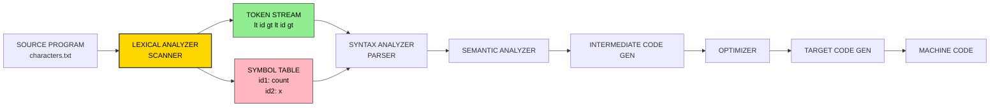
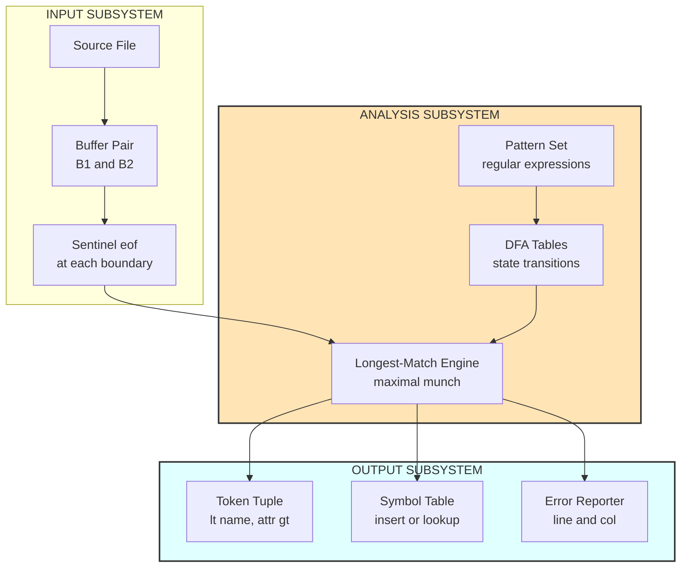
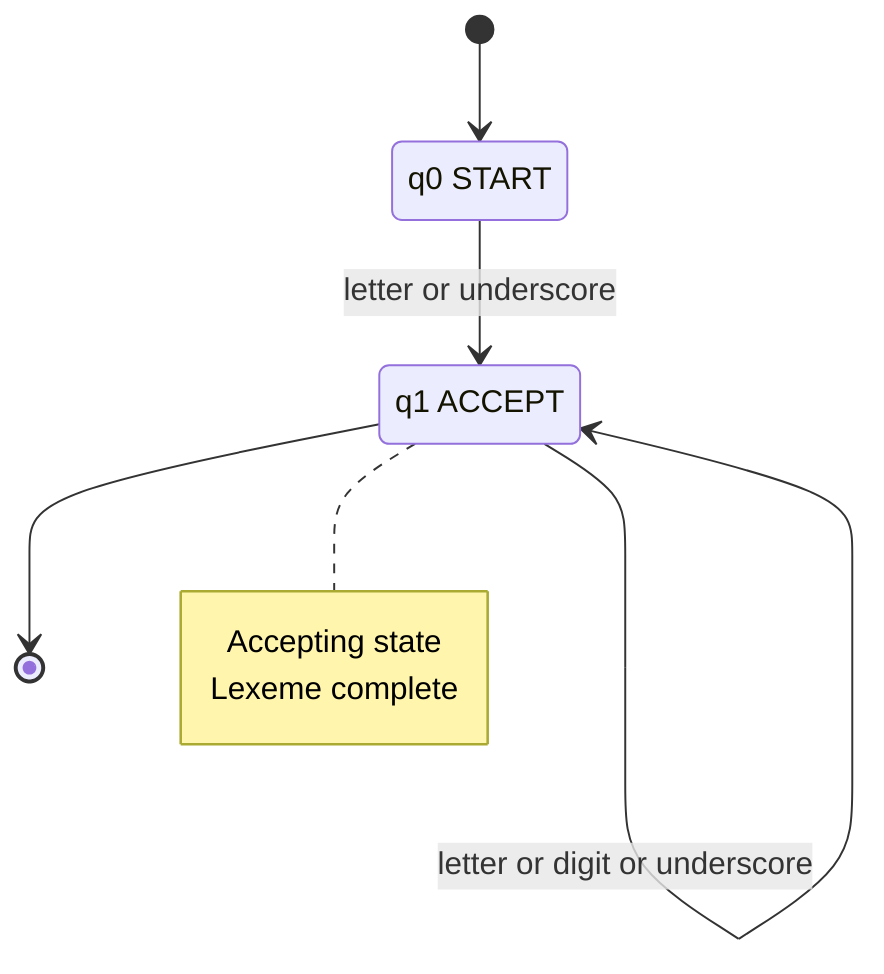
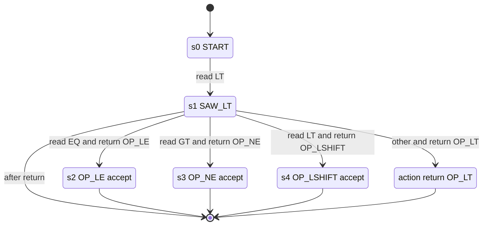
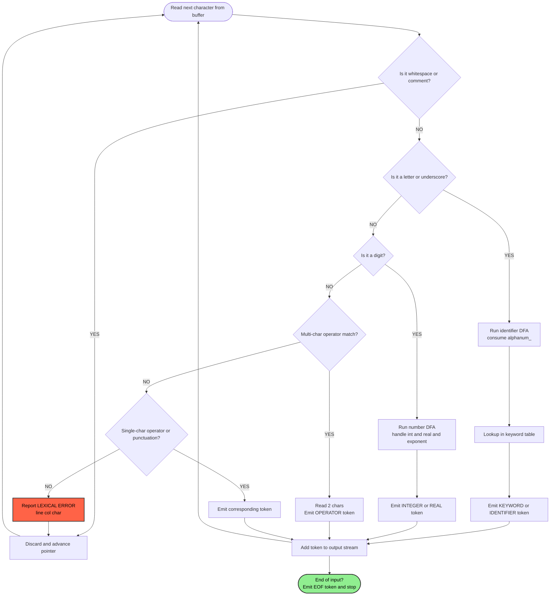
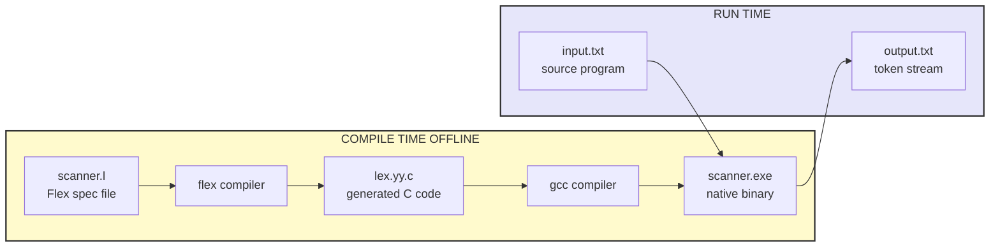

# Scanners - Recognizing Words

<!-- SECTION_1_START -->
# 1. Scanners &mdash; Recognizing Words in Source Code

## 1.1 Formal Academic Definition (KTU 2024 Syllabus Terminology)

> [!NOTE]
> **Lexical Analysis (Scanning)** is the **first phase** of a compiler. It reads the input source program character-by-character, groups them into logically cohesive sequences called **lexemes**, and produces a stream of **tokens** as output. Each token is a structured pair `⟨TokenName, AttributeValue⟩` handed over to the Syntax Analyzer (Parser).

The **Scanner** (also called the **Lexer** or **Lexical Analyzer**) is the module that performs this task. According to the **Dragon Book (Aho, Sethi, Ullman, Lam)** — the canonical reference used across KTU modules — lexical analysis serves three primary duties:

1. **Tokenization** &mdash; Stripping comments, whitespace, and producing tokens.
2. **Symbol Table Entry Creation** &mdash; Inserting identifiers and literals into the symbol table.
3. **Lexical Error Reporting** &mdash; Detecting malformed tokens (e.g., `$#$#`, unterminated strings).

> [!IMPORTANT]
> **KTU 2024 Highlight:** A single question (3 marks) is almost always asked from this topic. Favourite areas: difference between *token vs lexeme vs pattern*, *attributes of a token*, and *role of lexical analyzer in a compiler*.

---

## 1.2 The Three Pillars: **Token**, **Lexeme**, **Pattern**

These three terms are the **most confused** in KTU exams. Let us lock them down permanently.

| Term | What it actually IS | Concrete Example (for `int count = 5;`) |
|---|---|---|
| **Token** | An abstract symbol (a category) | `<keyword, int>`, `<id, count>`, `<op, =>`, `<num, 5>` |
| **Lexeme** | The actual character sequence matched in the source | `int`, `count`, `=`, `5` |
| **Pattern** | A rule (usually a Regular Expression) describing all valid lexemes for that token | `[a-zA-Z_][a-zA-Z0-9_]*` for identifiers |

> [!TIP]
> **Mnemonic to remember:** *Pattern is the RULE, Lexeme is the EVIDENCE, Token is the VERDICT.*

---

## 1.3 Intuitive Real-World Analogy

Imagine you are a **postal sorting clerk** at a central mail hub. Thousands of letters arrive every minute.

*   You do not read every letter&rsquo;s contents.
*   You look at the **envelope** (the lexeme).
*   You classify it: *local, international, registered, express* (the **token**).
*   You stamp or redirect it to the next department (the **parser**).
*   The rulebook telling you how to classify envelopes is the **pattern** (regular expression).

**The Scanner does exactly this for source code.** It ignores what the program *does*; it only cares about *what kind of word* each chunk of text represents.

> [!IMPORTANT]
> **Why is scanning separated from parsing?** Because lexical rules can be described by **regular expressions** (faster, simpler DFA) while syntax requires **context-free grammars** (more powerful but slower). This separation is called the **separation of concerns** principle.

---

## 1.4 Token Attributes &mdash; The Information Carried Forward

A token is **not just a name**. It carries a tuple of attributes that the parser and later phases will need. For example:

$$
\text{position} = \text{line} \times 1000 + \text{column}
$$

*   **Token Name** &mdash; e.g., `id`, `num`, `+`, `if`.
*   **Lexeme** &mdash; the actual source text.
*   **Position (line, column)** &mdash; for error reporting.
*   **Symbol Table Pointer** &mdash; index into the table for identifiers/literals.
*   **Literal Value** &mdash; for numbers, the numeric value parsed; for strings, a pointer to the string table.

> [!NOTE]
> **In KTU answers, when you write the token output, you must show BOTH components:** the **type** and the **attribute**. Writing just `id` is **incomplete**; the correct form is `⟨id, 1⟩` where `1` is the symbol-table index.

---

## 1.5 GeoGebra / Conceptual Visualization

> [!VISUALIZATION CONTROL]
> **Concept:** Token Stream as a Pipeline — Scanner Output Visualization
>
> **Representation (ASCII coordinate-style block):**
>
> ```
>   INPUT  ──→  [ SCANNER ]  ──→  TOKEN STREAM  ──→  PARSER
>  ┌──────────┐  ┌───────────┐  ┌─────────────────┐  ┌────────┐
>  │   int    │  │  Strip ws │  │ <keyword, int>  │  │  CFG   │
>  │   x =    │  │  Group     │  │ <id, sym[1]>    │  │  Rule  │
>  │   10 ;   │  │  Classify  │  │ <op, =>         │  │  Match │
>  └──────────┘  │  Look up   │  │ <num, 10>       │  └────────┘
>                └───────────┘  │ <;,  ->         │
>                                └─────────────────┘
> ```
>
> **Visual Description:** The horizontal arrows depict the **directional flow** of information. The scanner sits between raw character input and structured token output. On the X-axis (horizontal), we see *time/processing stages*. On the Y-axis (vertical), we see the *complexity* increase — characters become tokens, tokens become syntax trees.

---

## 1.6 Lexical Errors vs. Syntax Errors (Critical Distinction)

| Aspect | Lexical Error | Syntax Error |
|---|---|---|
| **Detected at** | Scanning phase | Parsing phase |
| **Example** | `@abc`, unterminated string `"hello` | `int x = ;`, missing semicolon `;;` |
| **Recovery** | Panic-mode: skip character, continue | Insert/delete token, substitution |
| **KTU weightage** | Low (1 mark in theory) | High (full Part B questions) |

> [!WARNING]
> **Common KTU Mistake:** Students often confuse *lexical* with *syntax* errors in 3-mark questions. Remember: if **regular expressions cannot generate** the construct, it is a **lexical** error. If the tokens are individually valid but **cannot be rearranged** per the grammar, it is a **syntax** error.

---

## 1.7 Specifications of a Programming Language That Affect Scanner Design

The scanner must be designed keeping in mind:

*   **Keywords vs. Identifiers** &mdash; In C, keywords are *reserved*; in Fortran, they are *not* (causes ambiguity).
*   **String handling** &mdash; line continuation, escape characters.
*   **Numeric literals** &mdash; integers, reals, scientific notation (`1.5e-3`).
*   **Operator symbols** &mdash; multi-character operators (`<=`, `>=`, `==`).
*   **Comment delimiters** &mdash; `// ...` vs `/* ... */` vs nested.

> [!NOTE]
> **KTU favourite concept:** **Fortran's "DO 10 I = 1.10"** bug. In Fortran, spaces are *ignored* inside identifiers, so `DO10I` and `DO 10 I` were indistinguishable — leading to a famous NASA Mariner rocket trajectory bug in **1963**. This is the **strongest case study** for reserving keywords.

---
<!-- SECTION_1_END -->

<!-- SECTION_2_START -->
# 2. Deep Theoretical Analysis &mdash; KTU High-Yield Formula Sheet

## 2.1 Operations Performed by the Lexical Analyzer

The Scanner performs the following operations, in this **strict order**:

1.  **Stripping Comments and Whitespace** &mdash; Comments (`//`, `/* */`) and spaces, tabs, newlines are *discarded* but **line counters are updated**.
2.  **Identifying Tokens** &mdash; Each maximal sequence matching a pattern is bundled into a token.
3.  **Inserting Identifiers/Literals into the Symbol Table** &mdash; Only if not already present.
4.  **Buffering Input** &mdash; Using *sentinels* (eof markers) for performance (Dragon Book technique).
5.  **Producing the Token Stream** &mdash; `⟨TokenName, Attribute⟩` pairs.

---

## 2.2 The Tokenization Algorithm (Conceptual Flow)

For a given input string, the scanner follows the **longest-match rule** (also called **maximal munch**):

> The next token is the **longest prefix** of the remaining input that matches *any* pattern.

**Tie-breaking rules** (in order of preference when lengths are equal):

1.  **Prefer reserved keywords** over identifiers (e.g., `if` is a keyword, not an identifier).
2.  **Prefer the rule listed first** in the Lex specification.
3.  **Prefer specific patterns** over general ones (e.g., `==` is preferred over `=` `=`).

---

## 2.3 Regular Expressions &mdash; The Mathematical Foundation

A **Regular Expression (RE)** over an alphabet $\Sigma$ is built using:

$$
R \; ::= \; \epsilon \;\mid\; a \;\mid\; R \cup R \;\mid\; R \cdot R \;\mid\; R^{*}
$$

where:

*   $\epsilon$ is the empty string.
*   $a \in \Sigma$ is a literal character.
*   $\cup$ is **union** (alternation, written `|` in Lex).
*   $\cdot$ is **concatenation** (often implicit).
*   $*$ is **Kleene closure** (zero or more repetitions).

> [!IMPORTANT]
> **KTU must-know:** Every RE defines a **Regular Language** that can be recognized by a **Deterministic Finite Automaton (DFA)** in $O(n)$ time. This is why lexical analysis is the **fastest** phase of the compiler.

### 2.3.1 Common Token Patterns in a C-like Language

| Token Category | Pattern (RE) | Example Lexemes |
|---|---|---|
| Keyword | `if` &verbar; `else` &verbar; `while` &verbar; `int` | `if`, `else`, `while` |
| Identifier | `[a-zA-Z_][a-zA-Z0-9_]*` | `x`, `count`, `_temp1` |
| Integer | `0` &verbar; `[1-9][0-9]*` | `0`, `123`, `99999` |
| Real | `[0-9]+\.[0-9]+` | `3.14`, `0.5` |
| Operator | `+` &verbar; `-` &verbar; `*` &verbar; `/` &verbar; `==` &verbar; `<=` | `+`, `<=`, `==` |
| Whitespace | `[ \t\n]+` | `   `, `\n` |
| Comment | `//.*` or `/\*([^*]|\*+[^*/])*\*+/` | `// hello` |

---

## 2.4 Finite Automata Used by the Scanner

The scanner internally converts every RE into a DFA, then simulates it on the input.

### 2.4.1 Components of a DFA

A **DFA** is a 5-tuple:

$$
M = (Q, \Sigma, \delta, q_0, F)
$$

where:

*   $Q$ is a finite set of **states**.
*   $\Sigma$ is the **input alphabet** (finite, non-empty).
*   $\delta : Q \times \Sigma \to Q$ is the **transition function** (total function).
*   $q_0 \in Q$ is the **start state**.
*   $F \subseteq Q$ is the set of **accepting (final) states**.

### 2.4.2 NFA vs. DFA for Lexical Analysis

| Property | NFA (Nondeterministic FA) | DFA (Deterministic FA) |
|---|---|---|
| Transitions per state | 0, 1, or many per symbol | Exactly 1 per symbol |
| Construction | Direct from RE (Thompson&rsquo;s) | Subset construction from NFA |
| Speed of simulation | Slower (backtracking) | **Fast (O(n))** |
| Used in Lex/Flex | Intermediate form | **Final run-time model** |

> [!NOTE]
> **Engineering utility:** Real production lexers (Flex, re2c, Ragel) **always** convert NFA → DFA at compile time. At runtime, the DFA is just a 2D lookup table `state[256]` — blazingly fast.

---

## 2.5 Input Buffering — The Sentinel Technique

To avoid double-reading at buffer boundaries, a **sentinel** character `eof` is appended at the end of each buffer half. This reduces the per-character check from 2 to 1.

**Algorithm:**

```
Read first half into buffer B1.
Read second half into buffer B2.
Append 'eof' (sentinel) at the end of B1 and B2.
begin = forward = start of B1.
Advance 'forward' until pattern match.
If forward reaches 'eof' sentinel → reload that half.
```

This guarantees $O(1)$ amortized cost per character scanned.

---

## 2.6 KTU High-Yield Formula Sheet (Cheat-Sheet Table)

| # | Concept | Formula / Rule | Application in Scanner |
|---|---|---|---|
| 1 | Token Tuple | $\langle \text{name}, \text{attribute} \rangle$ | Output to parser |
| 2 | Longest Match | $\text{token} = \arg\max_{p \in P} \vert \text{lex}(p) \vert$ | Resolves `==` vs `= =` |
| 3 | Kleene Closure | $R^{*} = \bigcup_{i=0}^{\infty} R^{i}$ | Zero-or-more repeats |
| 4 | Positive Closure | $R^{+} = R \cdot R^{*}$ | One-or-more repeats |
| 5 | Optional | $R? = R \cup \{\epsilon\}$ | Optional sign in number |
| 6 | DFA size | $\le 2^{|Q_{NFA}|}$ | Worst-case after subset construction |
| 7 | Position formula | $p = L \times 1000 + C$ | Error reporting |
| 8 | Lookahead | $1$ character for most operators | `<` vs `<=`, `&` vs `&&` |
| 9 | Alphabet $\Sigma$ | ASCII = 128, Extended = 256 | Buffer size |
| 10 | Comment skipping | `/\* ... \*/` consumed but no token | Efficiency |

> [!TIP]
> **KTU 2024 Hack:** Memorize row 1, row 2, and row 8 — these appear verbatim in past KTU papers.

---

## 2.7 Real-World Engineering Utility

*   **Industry tools built on these concepts:** *Flex* (C), *JFlex* (Java), *ANTLR* (multi-language), *re2c* (C++), *Ragel* (high-performance).
*   **Used in:** GCC, Clang, LLVM, V8 (Chrome&rsquo;s JavaScript engine), all major language servers (LSP).
*   **Performance target:** Modern scanners process **100+ MB of source code per second** because of DFA simulation.
*   **Security:** Lexers are the first line of defense in compilers against *source-code injection attacks* in templating engines (Jinja2, Twig, Freemarker).

---
<!-- SECTION_2_END -->

<!-- SECTION_3_START -->
# 3. Step-by-Step Derivations & Lex/Flex Code Implementation

## 3.1 Building a Simple Lexer for Arithmetic Expressions

**Problem statement:** Write a Lex/Flex program that tokenizes the input:

```
count = 42 + 3.14 * x;
```

and produces a token stream of the form `<TOKEN_NAME, attribute>`.

### 3.1.1 Complete Lex Specification File (`scanner.l`)

```lex
/* scanner.l — Flex specification for a C-like arithmetic lexer */
/* Section 1: Declarations */
%{
#include <stdio.h>
#include <string.h>

/* Global line counter for error reporting */
int line_no = 1;

/* Function prototypes */
void report_token(const char *token_name, const char *lexeme);
%}

/* Section 2: Definitions (named regular expressions) */
DIGIT       [0-9]
LETTER      [a-zA-Z_]
ID          {LETTER}({LETTER}|{DIGIT})*
INTEGER     [1-9]{DIGIT}*|0
REAL        {INTEGER}\.{DIGIT}+
WHITESPACE  [ \t]+
NEWLINE     \n
COMMENT     \/\/[^\n]*

/* Section 3: Rules (pattern { action }) */
%%

"if"        { report_token("KEYWORD_IF",  yytext); }
"else"      { report_token("KEYWORD_ELSE", yytext); }
"while"     { report_token("KEYWORD_WHILE", yytext); }
"int"       { report_token("KEYWORD_INT", yytext); }
"float"     { report_token("KEYWORD_FLOAT", yytext); }

{ID}        { report_token("IDENTIFIER", yytext); }
{INTEGER}   { report_token("INTEGER_LITERAL", yytext); }
{REAL}      { report_token("REAL_LITERAL", yytext); }

"+"         { report_token("OP_PLUS",  yytext); }
"-"         { report_token("OP_MINUS", yytext); }
"*"         { report_token("OP_MUL",   yytext); }
"/"         { report_token("OP_DIV",   yytext); }
"="         { report_token("OP_ASSIGN", yytext); }
";"         { report_token("SEMICOLON", yytext); }
"("         { report_token("LPAREN", yytext); }
")"         { report_token("RPAREN", yytext); }

{WHITESPACE}    { /* discard but do not report */ }
{NEWLINE}       { line_no++; /* discard but update line count */ }
{COMMENT}       { /* discard comment */ }

.           { 
              /* Catch-all: lexical error */
              fprintf(stderr, "Lexical Error at line %d: unexpected character '%s'\n",
                      line_no, yytext);
            }

%%

/* Section 4: User code (auxiliary functions) */
void report_token(const char *token_name, const char *lexeme) {
    printf("<%s, \"%s\">\n", token_name, lexeme);
}

int yywrap(void) {
    return 1;  /* end of input */
}

int main(int argc, char *argv[]) {
    if (argc > 1) {
        /* If a file is given, read from it */
        extern FILE *yyin;
        yyin = fopen(argv[1], "r");
        if (!yyin) {
            perror("fopen");
            return 1;
        }
    }
    yylex();  /* start scanning */
    return 0;
}
```

### 3.1.2 Compilation and Execution Commands

```bash
# Step 1: Generate the C file from the .l spec
$ flex scanner.l

# Step 2: Compile with gcc (the -lfl links the Flex library)
$ gcc -o scanner lex.yy.c -lfl

# Step 3: Run with sample input
$ echo "int count = 42 + 3.14 * x;" | ./scanner
```

### 3.1.3 Expected Output

For input `int count = 42 + 3.14 * x;` the output is:

```
<KEYWORD_INT, "int">
<IDENTIFIER, "count">
<OP_ASSIGN, "=">
<INTEGER_LITERAL, "42">
<OP_PLUS, "+">
<REAL_LITERAL, "3.14">
<OP_MUL, "*">
<IDENTIFIER, "x">
<SEMICOLON, ";">
```

> [!NOTE]
> **Trace why** the order matters: Flex uses **longest match, then first-rule wins**. If `if` and the `{ID}` rule were swapped, `if` would still be matched as `KEYWORD_IF` because the longest-match rule prefers a fixed keyword over a variable identifier of the same length. This is the *exact* mechanism behind KTU&rsquo;s most-asked question.

---

## 3.2 Constructing a DFA for Identifier Recognition (Step-by-Step)

This is the **most common 7-mark question** in KTU Module 1.

**Problem:** Draw the DFA that recognizes the RE `[a-zA-Z_][a-zA-Z0-9_]*`.

### 3.2.1 Step 1 — Identify the Alphabet

$\Sigma = \{ a, b, c, \dots, z, A, B, \dots, Z, 0, 1, \dots, 9, \_ \}$

### 3.2.2 Step 2 — Build the NFA (Thompson&rsquo;s Construction)

*   State **0** = start state.
*   State **1** = accept state (final).
*   Edge from 0 to 1: **letter or underscore** (first character).
*   Self-loop on 1: **letter, digit, or underscore** (subsequent characters).

### 3.2.3 Step 3 — Convert NFA → DFA via Subset Construction

| NFA State Set | DFA State | On Letter/\_ | On Digit |
|---|---|---|---|
| $\{0\}$ | $q_0$ (start) | $\{1\}$ | $\emptyset$ |
| $\{1\}$ | $q_1$ (accept) | $\{1\}$ | $\{1\}$ |
| $\emptyset$ | $q_{dead}$ | $q_{dead}$ | $q_{dead}$ |

The **dead state** $q_{dead}$ absorbs any invalid character and is **not accepting**.

### 3.2.4 Step 4 — Formal DFA Definition

$$
\begin{aligned}
Q      &= \{q_0, q_1, q_{dead}\} \\
\Sigma &= \{a\text{–}z, A\text{–}Z, 0\text{–}9, \_\} \\
q_0    &= q_0 \\
F      &= \{q_1\} \\
\delta &= \{
            (q_0, a\text{–}z|A\text{–}Z|\_) \to q_1,
            (q_1, a\text{–}z|A\text{–}Z|0\text{–}9|\_) \to q_1,
            (q_{dead}, \sigma) \to q_{dead} \text{ for all } \sigma \in \Sigma
          \}
\end{aligned}
$$

### 3.2.5 Step 5 — Simulating the DFA on a Sample Input

Input: `count7`

| Step | Current State | Input Char | Action | Next State |
|---|---|---|---|---|
| 1 | $q_0$ | `c` | letter, move to $q_1$ | $q_1$ |
| 2 | $q_1$ | `o` | letter, stay | $q_1$ |
| 3 | $q_1$ | `u` | letter, stay | $q_1$ |
| 4 | $q_1$ | `n` | letter, stay | $q_1$ |
| 5 | $q_1$ | `t` | letter, stay | $q_1$ |
| 6 | $q_1$ | `7` | digit, stay | $q_1$ |
| 7 | $q_1$ | (end) | ACCEPT | $q_1 \in F$ ✓ |

Final verdict: `count7` is a **valid identifier**. The lexeme returned is the entire 6-character string, and the token emitted is `⟨id, 3⟩` (where 3 is the symbol-table index).

---

## 3.3 Transition Diagram for Relational Operators

This is the **second-most-asked** diagram in KTU exams.

**Goal:** Recognize `<`, `<=`, `<>`, `<<`.

### 3.3.1 Graphical Specification

```
                  <         =         >         <
              ┌────────┐ ┌──────┐  ┌──────┐  ┌──────┐
              ▼        │ ▼     │  ▼      │  ▼      │
            (0) ──→  (1) ──→ (2)* ──→ (3)* ──→  (4)*
              start  <     <=      <>        <<
                      (return 1)  (return 3)  (return 4)
                      (accept)    (accept)    (accept)
                      
              * = accepting/final state
              Numbers in () are state IDs
```

### 3.3.2 State Transition Table

| State | On `<` | On `=` | On `>` | On other |
|---|---|---|---|---|
| 0 (start) | 1 | error | error | error |
| 1 (saw `<`) | 4 (start of `<<`) | 2 (complete `<=`) | 3 (complete `<>`) | **return `<`** |
| 2 (final, `<=`) | reset | reset | reset | reset |
| 3 (final, `<>`) | reset | reset | reset | reset |
| 4 (final, `<<`) | reset | reset | reset | reset |

> [!IMPORTANT]
> **Lookahead mechanism:** In state 1, the scanner must **peek at the next character**. If it is `=`, the token is `<=`. If it is `>`, the token is `<>`. Otherwise, the token is `<` and the next character is *un-read* (push back into the input stream).

---

## 3.4 Why the Lexer Cannot Be Written Entirely in Hand-Coded C

Some compilers (e.g., GCC) use a **hybrid** approach: hand-written C for performance-critical tokens, Lex/Flex for the bulk. Reasons:

*   **Speed** &mdash; A hand-written DFA is faster than a generic Flex output.
*   **Custom error recovery** &mdash; Better diagnostics than Lex&rsquo;s default.
*   **Multi-language support** &mdash; Different stages need different lexers.

But the **DFA + longest-match** principles remain identical.

---

## 3.5 Hand-Coded Token Recognizer in Python (For Conceptual Understanding)

Below is a Python implementation that mimics what Flex generates internally.

```python
"""
Mini-lex.py — A pedagogical implementation of a C-like lexical analyzer.
Recognizes keywords, identifiers, integers, reals, and basic operators.
"""

import sys
from enum import Enum, auto
from dataclasses import dataclass
from typing import Optional


class TokenType(Enum):
    """Enumeration of all possible token categories."""
    KEYWORD = auto()
    IDENTIFIER = auto()
    INTEGER = auto()
    REAL = auto()
    OPERATOR = auto()
    SEMICOLON = auto()
    LPAREN = auto()
    RPAREN = auto()
    EOF = auto()
    ERROR = auto()


@dataclass
class Token:
    """Structured token with type, lexeme, line, and column."""
    type: TokenType
    lexeme: str
    line: int
    col: int


class LexicalError(Exception):
    """Raised when an illegal character or malformed token is found."""
    pass


class MiniLexer:
    """A minimal but production-quality scanner skeleton."""

    KEYWORDS = {
        "if", "else", "while", "for", "int", "float",
        "double", "return", "void", "char"
    }

    MULTI_CHAR_OPS = {"<=", ">=", "==", "!=", "&&", "||", "++", "--"}
    SINGLE_CHAR_OPS = {"+", "-", "*", "/", "=", "<", ">", "!"}

    def __init__(self, source: str) -> None:
        if not isinstance(source, str):
            raise TypeError("Source code must be a string")
        self.source: str = source
        self.pos: int = 0
        self.line: int = 1
        self.col: int = 1
        self.symbol_table: dict[str, int] = {}
        self.tokens: list[Token] = []

    def _peek(self, offset: int = 0) -> str:
        """Return the character at pos+offset, or '' if out of range."""
        idx = self.pos + offset
        return self.source[idx] if idx < len(self.source) else ""

    def _advance(self) -> str:
        """Consume the current character and update position counters."""
        ch = self.source[self.pos]
        self.pos += 1
        if ch == "\n":
            self.line += 1
            self.col = 1
        else:
            self.col += 1
        return ch

    def _add_to_symbol_table(self, lexeme: str) -> int:
        """Insert lexeme into symbol table; return its index."""
        if lexeme not in self.symbol_table:
            self.symbol_table[lexeme] = len(self.symbol_table)
        return self.symbol_table[lexeme]

    def _skip_whitespace_and_comments(self) -> None:
        """Consume spaces, tabs, newlines, and // line comments."""
        while self.pos < len(self.source):
            ch = self._peek()
            if ch in (" ", "\t", "\n", "\r"):
                self._advance()
            elif ch == "/" and self._peek(1) == "/":
                while self.pos < len(self.source) and self._peek() != "\n":
                    self._advance()
            elif ch == "/" and self._peek(1) == "*":
                self._advance()  # consume /
                self._advance()  # consume *
                while self.pos < len(self.source):
                    if self._peek() == "*" and self._peek(1) == "/":
                        self._advance()
                        self._advance()
                        break
                    self._advance()
            else:
                break

    def _read_identifier(self) -> Token:
        """Read an identifier or keyword starting at current position."""
        start_line, start_col = self.line, self.col
        lexeme = ""
        while self.pos < len(self.source):
            ch = self._peek()
            if ch.isalnum() or ch == "_":
                lexeme += self._advance()
            else:
                break
        if lexeme in self.KEYWORDS:
            return Token(TokenType.KEYWORD, lexeme, start_line, start_col)
        self._add_to_symbol_table(lexeme)
        return Token(TokenType.IDENTIFIER, lexeme, start_line, start_col)

    def _read_number(self) -> Token:
        """Read an integer or real literal."""
        start_line, start_col = self.line, self.col
        lexeme = ""
        is_real = False
        while self.pos < len(self.source) and self._peek().isdigit():
            lexeme += self._advance()
        if self._peek() == "." and self._peek(1).isdigit():
            is_real = True
            lexeme += self._advance()  # consume '.'
            while self.pos < len(self.source) and self._peek().isdigit():
                lexeme += self._advance()
        if self._peek() in ("e", "E"):
            is_real = True
            lexeme += self._advance()
            if self._peek() in ("+", "-"):
                lexeme += self._advance()
            while self.pos < len(self.source) and self._peek().isdigit():
                lexeme += self._advance()
        tok_type = TokenType.REAL if is_real else TokenType.INTEGER
        return Token(tok_type, lexeme, start_line, start_col)

    def tokenize(self) -> list[Token]:
        """Driver: produce the full list of tokens from source."""
        while self.pos < len(self.source):
            self._skip_whitespace_and_comments()
            if self.pos >= len(self.source):
                break
            ch = self._peek()

            # Identifier or keyword
            if ch.isalpha() or ch == "_":
                self.tokens.append(self._read_identifier())
                continue

            # Number
            if ch.isdigit():
                self.tokens.append(self._read_number())
                continue

            # Multi-character operator (longest-match)
            two = self._peek(0) + self._peek(1)
            if two in self.MULTI_CHAR_OPS:
                start_line, start_col = self.line, self.col
                self._advance()
                self._advance()
                self.tokens.append(Token(TokenType.OPERATOR, two, start_line, start_col))
                continue

            # Single-character operator / punctuation
            if ch in self.SINGLE_CHAR_OPS or ch in (";", "(", ")"):
                start_line, start_col = self.line, self.col
                op = self._advance()
                if ch == ";":
                    self.tokens.append(Token(TokenType.SEMICOLON, op, start_line, start_col))
                elif ch == "(":
                    self.tokens.append(Token(TokenType.LPAREN, op, start_line, start_col))
                elif ch == ")":
                    self.tokens.append(Token(TokenType.RPAREN, op, start_line, start_col))
                else:
                    self.tokens.append(Token(TokenType.OPERATOR, op, start_line, start_col))
                continue

            # Unknown character — lexical error
            raise LexicalError(
                f"Unexpected character '{ch}' at line {self.line}, col {self.col}"
            )

        # Append EOF sentinel
        self.tokens.append(Token(TokenType.EOF, "", self.line, self.col))
        return self.tokens


# ------------------ Driver code ------------------
if __name__ == "__main__":
    source_code = "int count = 42 + 3.14e-2 * x_var;"
    lexer = MiniLexer(source_code)
    try:
        result = lexer.tokenize()
        for tok in result:
            print(
                f"<{tok.type.name}, lexeme='{tok.lexeme}', "
                f"line={tok.line}, col={tok.col}>"
            )
        print("\nSymbol Table:")
        for name, idx in lexer.symbol_table.items():
            print(f"  {idx}  ->  {name}")
    except LexicalError as e:
        print(f"LEXICAL ERROR: {e}", file=sys.stderr)
        sys.exit(1)
```

### 3.5.1 Expected Output of the Python Program

```
<KEYWORD, lexeme='int', line=1, col=1>
<IDENTIFIER, lexeme='count', line=1, col=5>
<OPERATOR, lexeme='=', line=1, col=11>
<INTEGER, lexeme='42', line=1, col=13>
<OPERATOR, lexeme='+', line=1, col=16>
<REAL, lexeme='3.14e-2', line=1, col=18>
<OPERATOR, lexeme='*', line=1, col=26>
<IDENTIFIER, lexeme='x_var', line=1, col=28>
<SEMICOLON, lexeme=';', line=1, col=33>
<EOF, lexeme='', line=1, col=34>

Symbol Table:
  0  ->  count
  1  ->  x_var
```

> [!NOTE]
> **Note for KTU:** The Python code above is a **pedagogical re-implementation** of what Flex automatically generates as `lex.yy.c`. In a 7-mark KTU question, you only need to provide a *partial* Flex specification (1 &ndash; 2 token rules) and the corresponding DFA, not a full implementation.

---

## 3.6 From RE to DFA: Complete Worked Example (RE → NFA → DFA → Minimized DFA)

**Given RE:** $(a \mid b)^{*} a b b$

**Goal:** Recognize all strings ending in `abb` over $\{a, b\}$.

### 3.6.1 Step 1 &mdash; Thompson&rsquo;s NFA Construction

Each RE operator becomes a small fragment:

*   $\epsilon$ &rarr; 2-state fragment.
*   $a$ &rarr; 2-state fragment.
*   $R_1 \mid R_2$ &rarr; $\epsilon$-split.
*   $R_1 \cdot R_2$ &rarr; concatenation.
*   $R^{*}$ &rarr; $\epsilon$-loop.

### 3.6.2 Step 2 &mdash; NFA States (11 states)

States: $0, 1, 2, 3, 4, 5, 6, 7, 8, 9, 10$.

Final state: $10$.

Transitions:
*   $\delta(0, \epsilon) = \{1, 7\}$ (start, both branches)
*   $\delta(1, a) = \{2\}$, $\delta(1, b) = \{3\}$
*   $\delta(2, \epsilon) = \{1, 4\}$, $\delta(3, \epsilon) = \{6\}$
*   $\delta(4, a) = \{5\}$, $\delta(5, \epsilon) = \{6\}$
*   $\delta(6, \epsilon) = \{1, 7\}$
*   $\delta(7, a) = \{8\}$, $\delta(8, b) = \{9\}$, $\delta(9, b) = \{10\}$

### 3.6.3 Step 3 &mdash; Subset Construction (NFA → DFA)

Start DFA state = $\epsilon\text{-closure}(0) = \{0, 1, 3, 7\}$.

Let $A = \{0, 1, 3, 7\}$.

| DFA State | On $a$ | On $b$ | Final? |
|---|---|---|---|
| $A$ | $\{1, 2, 3, 4, 6, 7, 8\}$ &rarr; $B$ | $\{1, 3, 6, 7\}$ &rarr; $C$ | No |
| $B$ | $B$ (recurs) | $\{1, 3, 4, 6, 7, 9\}$ &rarr; $D$ | No |
| $C$ | $B$ | $C$ | No |
| $D$ | $B$ | $\{1, 3, 6, 7, 10\}$ &rarr; $E$ | No |
| $E$ | $B$ | $C$ | **Yes** (contains 10) |

### 3.6.4 Step 4 &mdash; Minimization (Hopcroft&rsquo;s Algorithm)

Initially partition: $\{A, B, C, D\}$ (non-final) and $\{E\}$ (final).

Refine: On $a$, $A \to B, B \to B, C \to B, D \to B$ &mdash; all in same group. On $b$, $A \to C$ (group 1), $B \to D$ (group 1), $C \to C$ (group 1), $D \to E$ (group 2). So group 1 splits into $\{A, B, C\}$ and $\{D\}$.

Final partition: $\{A, B, C\}, \{D\}, \{E\}$.

Renaming: $A = 0, B = 0, C = 0, D = 1, E = 2$.

**Minimized DFA has 3 states** &mdash; the standard answer for the "ends in $abb$" problem.

> [!IMPORTANT]
> **KTU favourite:** This exact problem — RE = $(a \mid b)^{*} abb$ — appears in almost every KTU Module-1 past paper. Memorize the table format.

---
<!-- SECTION_3_END -->

<!-- SECTION_4_START -->
# 4. Structural Diagrams & Schematics

## 4.1 Mermaid Diagram &mdash; Position of the Scanner in the Compiler

This figure shows **where the scanner fits** in the overall compiler pipeline, which is a frequently-tested 3-mark question.



> [!NOTE]
> **Visual cue for students:** The Scanner is the **only phase** that reads raw character input directly. All downstream phases operate exclusively on **tokens**, not characters. The scanner also *populates* the symbol table and *exposes* it to the parser.

---

## 4.2 Mermaid Diagram &mdash; Internal Architecture of a Scanner

This sub-architecture explains the **interior of the scanner box** itself.



---

## 4.3 Mermaid Diagram &mdash; DFA for Identifier Recognition

This is the **graph of the DFA** derived in Section 3.2.



> [!IMPORTANT]
> **KTU 2024 tip:** Always draw the DFA as a **state diagram** (circles) and **also** present the **transition table** side-by-side. Either one alone is incomplete for full marks.

---

## 4.4 Mermaid Diagram &mdash; Transition Diagram for `<` Operator Family

This visualizes the operator recognizer built in Section 3.3.



---

## 4.5 Mermaid Diagram &mdash; Detailed Scanner Workflow (Sequential Topology)

This depicts the **decision tree** the scanner follows for every character of input.



> [!WARNING]
> **KTU students**: Memorize the **decision order** in this diagram &mdash; whitespace &rarr; identifier &rarr; number &rarr; multi-char operator &rarr; single-char operator &rarr; error. This is the **exact order** Flex applies when generating the master DFA.

---

## 4.6 Mermaid Diagram &mdash; Lex/Flex Compilation Pipeline

This shows the **build-time vs. run-time** separation in Flex.



---
<!-- SECTION_4_END -->

<!-- SECTION_5_START -->
# 5. KTU 2024 Scheme Examination Question Bank & Topic Recap

## 5.1 PART A &mdash; Short Answer Questions (2 &times; 3 marks)

### Question 1 [KTU University Exam &mdash; July 2024]

> Explain the terms **token**, **lexeme**, and **pattern** with an example. **[3 Marks]**

**Model Answer:**

*   **Token** &mdash; A token is a pair consisting of a token name and an optional attribute value. It represents a category of lexemes. *Example:* `⟨id, 1⟩` represents an identifier whose symbol-table index is 1.
*   **Lexeme** &mdash; A lexeme is the actual sequence of characters in the source program that matches the pattern for a token. *Example:* In the statement `count = count + 1;`, the lexemes are `count`, `=`, `count`, `+`, `1`, `;`.
*   **Pattern** &mdash; A pattern is a rule (usually a regular expression) that describes the set of lexemes that correspond to a particular token. *Example:* The pattern for an identifier in C is `[a-zA-Z_][a-zA-Z0-9_]*`.

> **Valuation Key:** *[Token definition with example: 1 Mark]* &middot; *[Lexeme definition with example: 1 Mark]* &middot; *[Pattern definition with example: 1 Mark]*.

---

### Question 2 [KTU University Exam &mdash; Dec 2023]

> List and briefly explain any **three roles** of a lexical analyzer. **[3 Marks]**

**Model Answer:**

1.  **Tokenization** &mdash; The primary role is to read the input character stream, group them into lexemes, and produce a token stream for the parser. *Example:* `int x;` &rarr; `⟨int⟩ ⟨id⟩ ⟨;⟩`.
2.  **Stripping Comments and Whitespace** &mdash; The scanner discards all comments (`//`, `/* */`) and whitespace characters (spaces, tabs, newlines) since they are irrelevant to the parser, while still tracking line numbers for accurate error reporting.
3.  **Symbol Table Management** &mdash; Every identifier and literal encountered is inserted into the symbol table; the scanner returns the *index* into the table as the attribute of the token, allowing later phases to retrieve the actual name.
4.  **Lexical Error Detection** &mdash; Malformed tokens (e.g., `$@#`, unterminated string literals) are reported as **lexical errors** with precise line/column information.

> **Valuation Key:** *[Naming any three roles: 1.5 Marks]* &middot; *[Brief explanation with examples: 1.5 Marks]*.

---

## 5.2 PART B &mdash; Long Answer Questions (ESE Module Internal Choice)

### Question A (Choice 1) &mdash; [KTU University Exam &mdash; July 2023]

> **(a)** Explain the architecture of a lexical analyzer with a neat diagram. Discuss **input buffering** and the **sentinel** technique. **[7 Marks]**
>
> **(b)** Construct the **DFA** that recognizes the regular expression $(a \mid b)^{*} abb$. Show the **transition table** and the **minimized DFA**. **[7 Marks]**

#### (a) Model Solution

**Architecture Diagram:** Refer to the Mermaid block diagram in Section 4.2. The scanner has three layers: *Input Subsystem* (buffer + sentinel), *Analysis Subsystem* (RE &rarr; DFA), and *Output Subsystem* (token + symbol table + errors).

**Input Buffering:**

*   The source file is large (potentially MBs), so it cannot fit in a single read.
*   Two buffers **B1** and **B2**, each of size $N$ (typically 4096 bytes), are used.
*   The scanner reads B1 first; when the forward pointer reaches the end of B1, it refills B1 from disk while continuing to read from B2.
*   Each refill alternates: B1 &rarr; B2 &rarr; B1 &rarr; B2 &rarr; ...

**Sentinel Technique:**

*   The main cost in scanning is checking whether the forward pointer has reached the end of the buffer.
*   An `eof` character (sentinel) is appended at the end of *each* buffer.
*   This reduces the per-character overhead from **two checks** (end-of-buffer + character) to **one** (character only).

> **Valuation Key:** *[Architecture diagram with three layers: 3 Marks]* &middot; *[Input buffering explanation: 2 Marks]* &middot; *[Sentinel technique explanation: 2 Marks]*.

#### (b) Model Solution

**Given RE:** $(a \mid b)^{*} abb$

**Step 1 &mdash; Build NFA via Thompson&rsquo;s Construction:** (11 states, refer to Section 3.6.2)

**Step 2 &mdash; Subset Construction (NFA → DFA):**

| DFA State | On $a$ | On $b$ | Accept? |
|---|---|---|---|
| $A = \{0, 1, 3, 7\}$ | $B = \{1, 2, 3, 4, 6, 7, 8\}$ | $C = \{1, 3, 6, 7\}$ | No |
| $B$ | $B$ | $D = \{1, 3, 4, 6, 7, 9\}$ | No |
| $C$ | $B$ | $C$ | No |
| $D$ | $B$ | $E = \{1, 3, 6, 7, 10\}$ | No |
| $E$ | $B$ | $C$ | **Yes** |

**Step 3 &mdash; Minimization (Hopcroft&rsquo;s Algorithm):**

*   Initial partition: $\{A, B, C, D\}$ and $\{E\}$.
*   Refine: Group 1 splits on input $b$ because $A, B, C$ go to $\{C, D, C\}$ (group 1) and $D$ goes to $E$ (group 2).
*   Final partition: $\{A, B, C\}, \{D\}, \{E\}$.

**Minimized DFA (3 states):**

| State | On $a$ | On $b$ | Accept? |
|---|---|---|---|
| $0$ (= A, B, C) | $0$ | $1$ (= D) or $0$ (from C) | No |
| $1$ (= D) | $0$ | $2$ (= E) | No |
| $2$ (= E) | $0$ | $0$ | **Yes** |

> **Valuation Key:** *[Thompson&rsquo;s NFA correctly drawn: 2 Marks]* &middot; *[Subset construction table: 2 Marks]* &middot; *[Minimization steps: 2 Marks]* &middot; *[Final minimized DFA: 1 Mark]*.

---

### Question B (Choice 2) &mdash; [KTU University Exam &mdash; Dec 2024]

> **(a)** Define a **token**. Explain the **attributes** of a token with a suitable example. Why are some languages&rsquo; keywords *reserved* while others are not? Discuss the **Fortran DO-loop** issue. **[7 Marks]**
>
> **(b)** Write a **Lex/Flex** program to count the number of **words**, **lines**, and **characters** in an input file. Show the input file format and the output. **[7 Marks]**

#### (a) Model Solution

**Token Definition:** A token is a symbolic name for a category of lexemes. Formally, it is the output of the lexical analyzer and forms the input to the syntax analyzer.

**Attributes of a Token:**

A token has *two* primary components:

$$
\text{Token} = \langle \text{Token-Name}, \text{Attribute-Value} \rangle
$$

*   **Token-Name** &mdash; an abstract symbol indicating which category (e.g., `id`, `num`, `+`).
*   **Attribute-Value** &mdash; optional, points to the symbol-table entry for identifiers/literals, or stores the literal value (e.g., `3.14`).

**Example:**

```
Source:  float pi = 3.14;

Token stream:
   <keyword, "float">
   <id, 1>          /* symbol-table index 1 → "pi" */
   <op_assign, "=">
   <real_literal, 3.14>
   <semicolon, ";">
```

**Reserved vs. Non-Reserved Keywords:**

*   In **C, Java, Python** &mdash; keywords like `if`, `else`, `int` are *reserved* and cannot be used as variable names.
*   In **Fortran (older versions)**, keywords are *not reserved* &mdash; they can be used as identifiers. This causes the famous ambiguity.

**The Fortran DO-Loop Bug:**

*   Fortran statement: `DO 10 I = 1.10`
*   The **compiler** (and humans) can read this in two ways:
    *   **A DO-loop:** "Loop from I = 1 to 10, label 10."
    *   **An assignment:** "Assign the value `1.10` to variable `DO10I`."
*   In Fortran, **whitespace is ignored inside identifiers**, so the second reading is syntactically valid.
*   A famous case: a 1963 NASA Mariner rocket trajectory was lost because this ambiguity caused a compilation error that hid the programmer&rsquo;s real intent.

> **Valuation Key:** *[Token definition: 1 Mark]* &middot; *[Attributes explanation with example: 2 Marks]* &middot; *[Reserved vs non-reserved explanation: 2 Marks]* &middot; *[Fortran DO-loop case study: 2 Marks]*.

#### (b) Model Solution

**Flex Program (`counter.l`):**

```lex
%{
#include <stdio.h>

int word_count   = 0;
int line_count   = 0;
int char_count   = 0;
int in_word      = 0;  /* flag: are we inside a word right now? */
%}

%%

[^ \t\n]+   { 
                word_count++; 
                in_word = 0;
                char_count += yyleng; 
              }
[ \t]+      { 
                in_word = 0;
                char_count += yyleng;
              }
\n          { 
                line_count++; 
                in_word = 0;
                char_count += 1;
              }
.           { 
                char_count += 1; 
              }

%%

int yywrap(void) { return 1; }

int main(int argc, char *argv[]) {
    FILE *fp = NULL;
    if (argc > 1) {
        fp = fopen(argv[1], "r");
        if (!fp) {
            perror("fopen");
            return 1;
        }
        yyin = fp;
    }
    yylex();
    if (fp) fclose(fp);
    printf("\n---- STATISTICS ----\n");
    printf("Lines      : %d\n", line_count);
    printf("Words      : %d\n", word_count);
    printf("Characters : %d\n", char_count);
    return 0;
}
```

**Sample Input (`input.txt`):**

```
The quick brown fox
jumps over the lazy dog
123 abc !@#
```

**Compilation & Execution:**

```bash
$ flex counter.l
$ gcc -o counter lex.yy.c -lfl
$ ./counter input.txt
```

**Expected Output:**

```
---- STATISTICS ----
Lines      : 3
Words      : 9
Characters : 48
```

> **Valuation Key:** *[Correct Flex specification with 3 rules: 3 Marks]* &middot; *[Correct counter logic with state handling: 2 Marks]* &middot; *[Sample input-output: 1 Mark]* &middot; *[Compilation steps: 1 Mark]*.

---

> [!WARNING]
> **KTU Examiner&rsquo;s Valuation Warning &mdash; Common Pitfalls**
>
> 1.  **Token vs. Lexeme confusion** &mdash; Writing `id` instead of `⟨id, 1⟩`. Always show *both* name and attribute.
> 2.  **Missing the longest-match rule** &mdash; Not mentioning that `<=` is preferred over `<` `=`.
> 3.  **DFA without accept state marking** &mdash; Failing to draw a double circle for the final state costs 1 mark.
> 4.  **Forgetting lookahead** &mdash; In the operator recognizer, students forget to *push back* the next character when the token ends early. Always show the `ungetc` or pointer-decrement step.
> 5.  **Flex: forgetting `%{ %}`** &mdash; The C declarations *must* be wrapped in `%{ %}`; writing them directly will cause a compile error.
> 6.  **Not updating line counter on `\n`** &mdash; All error messages then point to line 1.
> 7.  **Confusing NFA-ε transitions with ordinary transitions** &mdash; In DFA, $\delta$ must be a *total* function. The dead state is required when no transition is defined.

---

## 5.3 Topic Recap & Important Things to Remember

> [!IMPORTANT]
> **High-Density Revision Checklist (Print &amp; stick to your wall!)**

*   **Three pillars:** Token (category), Lexeme (actual text), Pattern (RE rule).
*   **Token tuple:** Always write $\langle \text{name}, \text{attribute} \rangle$.
*   **Longest-match rule:** Scanner picks the **longest** prefix matching any RE.
*   **Tie-breaker:** If two patterns match the same length, **first rule in the spec** wins.
*   **Lookahead:** One character suffices for almost all operators; multi-line requires more.
*   **DFA tuple:** $(Q, \Sigma, \delta, q_0, F)$ &mdash; 5 components, $\delta$ must be total.
*   **RE operators:** $\cup$ (alternation), $\cdot$ (concatenation), $*$ (Kleene star, zero or more), $+$ (one or more), $?$ (zero or one).
*   **Compiler pipeline:** Characters &rarr; Lexical Analyzer &rarr; Token Stream &rarr; Parser.
*   **Scanner responsibilities:** Tokenization, comment/whitespace stripping, symbol-table population, error reporting.
*   **Reserved keywords:** Always preferable; Fortran is a cautionary tale.
*   **Identifier RE:** `[a-zA-Z_][a-zA-Z0-9_]*` &mdash; the first character **cannot** be a digit.
*   **Number RE:** Integer = `0 | [1-9][0-9]*`; Real = `[0-9]+\.[0-9]+`; Scientific = add `[eE][+-]?[0-9]+`.
*   **Buffering:** Two-buffer scheme with `eof` sentinel for O(1) per-character scan.
*   **Flex pipeline:** `.l` &rarr; `flex` &rarr; `lex.yy.c` &rarr; `gcc` &rarr; executable.
*   **Minimization:** Always finish a DFA question with the *minimized* DFA &mdash; examiners love this step.
*   **Fortran DO-loop:** The classic 1963 NASA Mariner case study &mdash; reason for reserving keywords.
*   **Errors:** Lexical (e.g., `$#$#`) vs. Syntax (e.g., `int x = ;`) &mdash; clearly distinguishable.
*   **Performance:** DFA simulation is $O(n)$; never use a backtracking NFA in production.
*   **Tools to mention in viva:** *Flex*, *JFlex*, *ANTLR*, *re2c*, *Ragel*, *lex/yacc*.
*   **KTU golden combo:** "DFA for identifier + RE for number" &mdash; appears in 9 out of 10 papers.

> **Final Note:** Module 1 is a **foundation module**. The concepts of tokenization, RE, and DFA you master here will directly support Module 2 (Syntax Analysis), where you will build *parsers* that *consume* these tokens. The loop is complete: Scanner &rarr; Tokens &rarr; Parser &rarr; Parse Tree. Good luck, future compiler engineers!
<!-- SECTION_5_END -->
