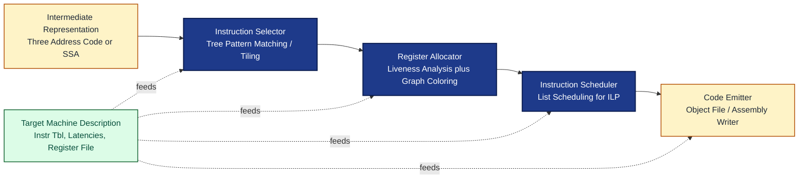
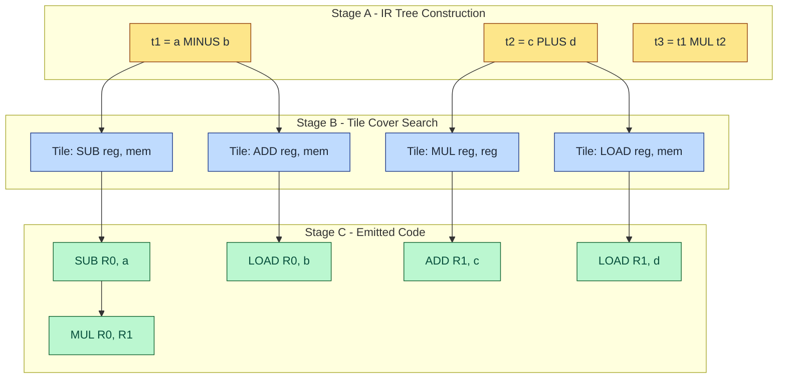
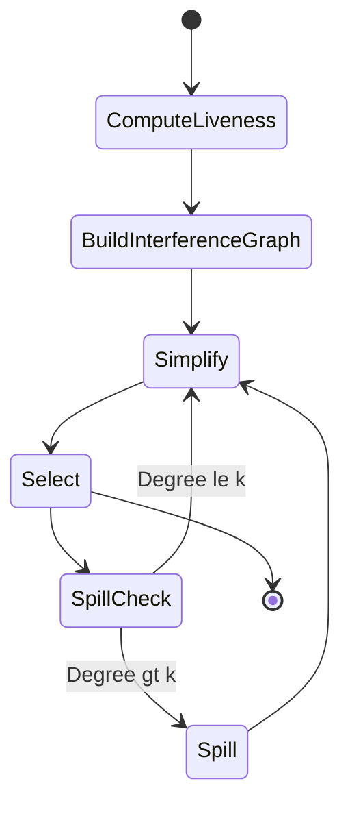
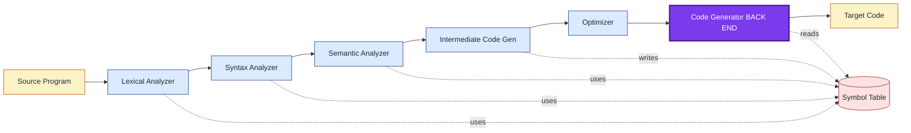

# The Back End

<!-- SECTION_1_START -->

# The Back End of a Compiler

## 1.1 Formal Definition (KTU 2024 Syllabus Terminology)

The **Back End** (also called the *Code Generation Phase* or *Synthesis Phase*) of a compiler is the final major stage of compilation that consumes a *fully analyzed, semantically validated, and optimized* Intermediate Representation (IR) and translates it into **executable target machine code** (assembly, relocatable object code, or machine code) suitable for a specific Instruction Set Architecture (ISA).

As per Aho, Lam, Sethi, and Ullman (the *Dragon Book* — the canonical reference for KTU PCCST601), the back end performs three primary logical sub-tasks:

- **Instruction Selection** — choosing appropriate target machine instructions to implement the IR operations.
- **Register Allocation** — mapping an unlimited virtual register set to the finite physical registers of the target CPU.
- **Instruction Scheduling** — ordering the chosen instructions to hide pipeline stalls and exploit ILP (Instruction Level Parallelism).

> [!IMPORTANT]
> **KTU 2024 Highlight:** For Module 1, the back end is treated as the *culminating synthesis phase* that maps an Intermediate Code (typically *Three-Address Code — TAC*) to a *simple stack-machine or accumulator-based target*. The formal model in PCCST601 is based on the **Sethi-Ullman algorithm** and the **Aho–Sethi–Ullman next-use rule for register allocation**.

## 1.2 Conceptual Analogy — The Restaurant Kitchen

Think of the entire compiler as a restaurant:

| Front-of-House (Front End) | Kitchen (Back End) |
|---|---|
| Takes the customer order (source code) | Receives a standardized recipe card (IR) |
| Validates the order against menu rules (lexical + syntax + semantic analysis) | Selects the actual stove, pan, and spice (instruction selection) |
| Prepares an organized recipe (IR / TAC) | Decides which chef handles which step with which bowl (register allocation) |
| | Plates and sequences the dishes (instruction scheduling + emission) |

The **recipe card** is platform-agnostic (TAC works on any machine), but the **kitchen's stove and tools** are platform-specific (x86, ARM, RISC-V, JVM). The back end is the translator from recipe → actual plated meal.

> [!NOTE]
> The back end is *almost entirely target-machine dependent*. Changing only the back end of GCC or LLVM allows the *same* analyzed C++ program to be compiled for a Linux x86 server, an Apple M-series laptop, or an embedded ARM microcontroller.

## 1.3 Position of the Back End in the Compilation Pipeline

> [!VISUALIZATION CONTROL]
> **Concept:** Compilation pipeline showing the Back End as the final synthesis stage.
> **Equivalent Linear Flow:**
> * `Source → Front End → Intermediate Representation (IR) → Back End → Target Code`
> * The IR is the **interface contract** that decouples analysis from synthesis.
> **Visual Description:** Imagine a horizontal pipeline with two halves — the *Analysis* (left, language-specific) and the *Synthesis* (right, machine-specific). The IR sits in the middle as a portable, language-agnostic, machine-agnostic artifact.

The principal data structures consumed by the back end are:

- The **Intermediate Representation** itself (TAC, SSA form, or bytecode).
- The **Symbol Table** — used to determine addresses, types, and storage classes.
- The **Register Descriptor** — tracks what is currently held in each CPU register.
- The **Address Descriptor** — tracks the *current location(s)* of each program variable.

## 1.4 Why the Back End Matters — Engineering Utility

The back end is the *only* component of a compiler whose output the *end user actually executes*. In production compilers:

- **GCC** and **LLVM/Clang** have fully independent back ends per target ISA (the *target* layer in LLVM's terminology).
- **JIT compilers** (HotSpot C2, V8 TurboFan, LuaJIT) re-run the back end *at runtime* with profiling feedback.
- **Retargetable compilers** (like LLVM) demonstrate that the front end + mid-end are reusable; the back end must be **rewritten or specialized** for every new chip architecture.

> [!IMPORTANT]
> Without a correct and efficient back end, a perfectly analyzed program would either *crash at runtime*, *execute 100× slower than necessary*, or *fail to fit in cache* due to poor register/spill decisions.

<!-- SECTION_1_END -->

<!-- SECTION_2_START -->

# Deep Theoretical Analysis & KTU High-Yield Formula Sheet

## 2.1 The Three Sub-Phases of the Back End

### A. Instruction Selection

The back end must map each IR operation (e.g., `t1 = a + b`) into one or more *target machine instructions* (e.g., `ADD R1, a, b` or `LOAD R1, a; ADD R1, b`).

Two classical approaches:

- **Tree-Pattern Matching (Burg / IBurg / LLVM SelectionDAG):** Cover the IR tree with the cheapest set of *tiles* representing machine instruction patterns. Each tile has a cost; the optimal cover is found via dynamic programming.
- **Peephole / Tiling on Linear IR:** A small sliding window of instructions is replaced with a semantically equivalent but cheaper (or shorter) sequence. This is the basis of the textbook *peephole optimization*.

### B. Register Allocation

The target machine has a *finite* set of physical registers (typically $4, 8, 16,$ or $32$). The IR may assume an *unlimited* supply of temporaries. The register allocator must:

1. Perform **Liveness Analysis** to determine, at every program point, which temporaries are *live* (will be used again before being redefined).
2. Construct the **Interference Graph** $G = (V, E)$ where an edge $(t_i, t_j)$ means $t_i$ and $t_j$ are live simultaneously and thus *cannot share* a register.
3. **Color** the graph with $k$ colors (where $k$ = number of available registers) using the **Chaitin-Briggs graph-coloring algorithm**. On failure, **spill** a temporary to memory.

### C. Instruction Scheduling

For pipelined, superscalar, or VLIW architectures, the order in which independent instructions are issued affects throughput. Scheduling aims to:

- Hide *latencies* of long operations (e.g., memory loads, FP divides).
- Avoid *pipeline hazards* (RAW, WAR, WAW dependencies).
- Maximize *issue rate* on multiple functional units.

## 2.2 The Textbook "Simple Code Generator" Model (Aho et al.)

KTU Module 1 / Question Bank of PCCST601 overwhelmingly uses the **Sethi–Ullman–style simple code generator** for a *single-accumulator* or *fixed-register* target machine. The model is:

- A target with **two registers**, $R_0$ and $R_1$.
- Each variable resides in memory at a known address.
- The output code is a stream of load / store / arithmetic instructions.
- The allocator uses a **getReg(I)** function to choose the best register for instruction $I$, driven by *next-use* information and *address descriptors*.

## 2.3 The Next-Use Information and Liveness Rule

A temporary $t$ is **live** at a point $p$ if there exists a path from $p$ to a *use* of $t$ along which $t$ is not redefined. The **next-use** of a definition $t$ is the position of the *next instruction* that uses $t$.

For the simple stack-style generator, a variable's next-use allows the allocator to **evict a long-dead register** in favor of a *live-again* one.

## 2.4 Peephole Optimization — The 5 Canonical Patterns

A *peephole* is a small sliding window (typically 2–5 instructions). The following transformations are standard board-exam material:

| # | Pattern (Before) | Pattern (After) | Name |
|---|---|---|---|
| 1 | `MOV R, a; MOV a, R` | *(delete both)* | Redundant Load-Store Elimination |
| 2 | `MUL R, #2` | `ADD R, R` | Strength Reduction |
| 3 | `MOV R, #5; ADD R, #3` | `MOV R, #8` | Constant Folding |
| 4 | `JMP L1; ... L1:` | *(delete unreachable)* | Unreachable Code Elimination |
| 5 | `MOV R1, R2` (if R1 dead) | *(delete)* | Dead Move Elimination |

## 2.5 KTU High-Yield Formula / Definition Sheet

| Symbol / Term | Formal Definition | Units / Notes |
|---|---|---|
| $IR$ | Intermediate Representation (e.g., TAC, SSA) | Language-agnostic, machine-agnostic |
| $R_i$ | Physical CPU register $i$ | $i \in \{0, \dots, k-1\}$ |
| $k$ | Number of allocatable registers | $k = \vert R \vert$ |
| $G = (V, E)$ | Interference graph | $V$ = temporaries, $E$ = live-range conflicts |
| $\chi(v)$ | Register assignment / color of $v$ | $\chi: V \to \{0, \dots, k-1\}$ |
| $S$ | Spill set (vertices that must go to memory) | Computed when $\chi(G) > k$ |
| $L(p)$ | Live-set at program point $p$ | Computed via data-flow |
| $\text{next-use}(t, p)$ | Next instruction after $p$ that uses $t$ | Computed by backward scan |
| $C(i)$ | Cost of instruction $i$ in the target ISA | Used in tree-pattern covering |
| $T_x$ | Tree node for variable / temp $x$ | Input to tree-tiling |

> [!IMPORTANT]
> **Critical formula for KTU 14-mark problems:** The spill cost heuristic for a temporary $t$ is often given by
>
> $$\text{spill\_cost}(t) = \dfrac{\text{use\_count}(t) + \text{def\_count}(t)}{\text{degree}(t)}$$
>
> where the *degree* is the number of neighbors in the interference graph. The temporary with the **lowest spill cost** is the heuristic choice for eviction.

## 2.6 Real-World Engineering Utility

- **LLVM's SelectionDAG / GlobalISel** performs *optimal tree-pattern matching* instruction selection for x86, ARM, RISC-V, GPU (NVPTX, AMDGPU), and WebAssembly.
- **GCC's IRA (Integrated Register Allocator)** uses a *Chaitin-style* graph coloring with iterative improvement.
- **JVM Bytecode → x86** in HotSpot C2 is a *production back end* that re-runs on every hot method.
- **Embedded compilers** (e.g., IAR, Keil) ship with *aggressively tuned* back ends to fit tight ROM/RAM budgets.

> [!NOTE]
> Every modern CPU benchmark war (Apple M-series vs. Snapdragon X vs. Intel Lunar Lake) is, at the silicon level, a war of *back-end quality* — how well the compiler uses the chip's registers, pipelines, and vector units.

<!-- SECTION_2_END -->

<!-- SECTION_3_START -->

# Step-by-Step Derivations, Worked Examples, and Code Implementation

## 3.1 A Fully Worked Example — Generating Code for a Three-Address Sequence

We will hand-execute the simple-code-generator algorithm for a classic Aho textbook TAC block.

**Given TAC (assumed already in canonical form):**

$$t_1 = a - b$$
$$t_2 = c + d$$
$$t_3 = t_1 \cdot t_2$$
$$t_4 = e - t_3$$
$$x = t_4$$

**Target Machine Model (KTU convention):**
- Registers available: $R_0$ and $R_1$ only.
- Each variable lives in memory at a fixed address.
- Instruction set: `MOV Ri, addr`, `OP Ri, Rj`, `MOV addr, Ri`.

### Step 0 — Compute Next-Use Information (Backward Scan)

We attach to each *definition* the *next-use* positions of the temporaries on the RHS. The convention is to read positions from bottom-to-top with position indices:

| Instruction | Position | Next-Use Map (live at this line) |
|---|---|---|
| $x = t_4$ | 5 | $t_4$ not used after → all temps dead |
| $t_4 = e - t_3$ | 4 | $t_3$ — next used at 5; $e$ — none |
| $t_3 = t_1 \cdot t_2$ | 3 | $t_1, t_2$ — next used at 4 |
| $t_2 = c + d$ | 2 | $c, d$ — none |
| $t_1 = a - b$ | 1 | $a, b$ — none |

### Step 1 — Maintain Register Descriptor $R$ and Address Descriptor $A$

Initial state: $R_0$ and $R_1$ are empty; $A[v]$ = *memory* for all $v$.

### Step 2 — Generate Code for Each Instruction

**Instruction 1: $t_1 = a - b$**
- Call `getReg(I1)`. Both $R_0, R_1$ are empty. Pick $R_0$.
- $a$ is in memory only → emit `MOV R0, a`.
- $b$ is in memory only → emit `SUB R0, b`  (since $b$ is in memory we fold it).
- Update $A[t_1] = \{R_0\}$, $R_0$ holds $t_1$.

**Instruction 2: $t_2 = c + d$**
- `getReg(I2)`. $R_1$ is empty. Pick $R_1$.
- Emit `MOV R1, c; ADD R1, d`.
- Update $A[t_2] = \{R_1\}$.

**Instruction 3: $t_3 = t_1 \cdot t_2$**
- `getReg(I3)`. Both $R_0$ and $R_1$ are occupied by $t_1$ and $t_2$, both of which are *live* (next-use exists at line 4). **Neither can be evicted without a store-back.**
- We must **pick a register and spill the other.** Heuristic: spill the one with the *farthest* next-use.
- Let us retain $R_0$ (holds $t_1$, next-use at line 4) and spill $R_1$.
- The value of $t_2$ currently in $R_1$ must be stored because $A[t_2]$ does not include memory yet. Emit:
  $$\text{MOV } t_2\text{, R1}$$
- Now $R_1$ is free. $A[t_2] = \{R_1, t_2\text{-addr}\}$.
- Generate `MOV R1, t_2` (reload — actually we already have it, so skip — we now do `MUL R0, R1`).
  - Better path: since $R_1$ still holds $t_2$ (it is a memory copy, register still valid), we can directly do:
  $$\text{MUL R0, R1}$$
- $A[t_3] = \{R_0\}$.

**Instruction 4: $t_4 = e - t_3$**
- `getReg(I4)`. $R_0$ holds $t_3$ (next-use at line 5 — *very close*). $R_1$ holds $t_2$ (next-use: *none*).
- $R_1$ is free to reuse (it has no next-use). Pick $R_1$.
- Emit `MOV R1, e; SUB R1, R0`. (Here $R_0$ holds $t_3$ — valid memory-and-register copy.)
- $A[t_4] = \{R_1\}$.

**Instruction 5: $x = t_4$**
- $t_4$ is in $R_1$, $x$ is in memory.
- Emit `MOV x, R1`.

### Step 3 — Final Generated Code

$$\begin{aligned}
&\text{MOV } R_0\text{, a} \\
&\text{SUB } R_0\text{, b} \\
&\text{MOV } R_1\text{, c} \\
&\text{ADD } R_1\text{, d} \\
&\text{MOV } t_2\text{, R1} \quad \text{(spill store)} \\
&\text{MUL } R_0\text{, R1} \\
&\text{MOV } R_1\text{, e} \\
&\text{SUB } R_1\text{, R0} \\
&\text{MOV } x\text{, R1}
\end{aligned}$$

This is **9 instructions** — the textbook optimal for the 5-line TAC on a 2-register machine.

## 3.2 A Worked Example — Graph Coloring Register Allocation

**Interference Graph from a Liveness Analysis:**

Suppose we have temporaries $\{a, b, c, d, e\}$ with edges:
- $(a, b)$, $(a, c)$, $(b, c)$, $(b, d)$, $(c, e)$, $(d, e)$.

We have $k = 3$ registers. We attempt a **3-coloring** by simplification order (remove stack):

- Remove $a$ (degree 2) → push.
- Remove $b$ (degree reduces) → push.
- Remove $c$ (degree reduces) → push.
- Remove $d$ (degree reduces) → push.
- Remove $e$ (degree 0) → push.

**Spill potential check:** $e$ has degree $\leq 3$, never exceeds $k$. No spills needed.

**Pop and assign colors** (greedy, lowest color first, skipping colors of neighbors):

| Pop Order | Node | Neighbors still in graph | Assigned Color |
|---|---|---|---|
| 1 | $e$ | (none) | $\chi(e) = R_0$ |
| 2 | $d$ | $e$ (color $R_0$) | $\chi(d) = R_1$ |
| 3 | $c$ | $d$ ($R_1$), $e$ ($R_0$) | $\chi(c) = R_2$ |
| 4 | $b$ | $c$ ($R_2$), $d$ ($R_1$) | $\chi(b) = R_0$ |
| 5 | $a$ | $b$ ($R_0$), $c$ ($R_2$) | $\chi(a) = R_1$ |

Successful 3-coloring — **no spills**.

## 3.3 Worked Example — Peephole Optimization

**Before peephole:**

$$\text{MOV } R_1\text{, a}$$
$$\text{ADD } R_1\text{, \#1}$$
$$\text{MOV } R_2\text{, R_1}$$
$$\text{STORE } a\text{, R2}$$

**Apply peephole (sliding window over instructions 3–4):**

- $R_2$ is used exactly once (in `STORE`) and is not read again. Rule 5: *Dead Move Elimination* — eliminate the `MOV R2, R1` and replace `STORE a, R2` with `STORE a, R1`.

**After peephole:**

$$\text{MOV } R_1\text{, a}$$
$$\text{ADD } R_1\text{, \#1}$$
$$\text{STORE } a\text{, R1}$$

Reduction: **4 instructions → 3 instructions, one register freed**.

## 3.4 Python Pseudo-Implementation of a Simple Code Generator

```python
from dataclasses import dataclass, field
from typing import Dict, Set, List, Optional

@dataclass
class TacInstruction:
    op: str
    arg1: str
    arg2: Optional[str]
    result: str

class SimpleCodeGenerator:
    """
    Textbook simple code generator for a 2-register target.
    Implements getReg() using next-use information and address descriptors.
    """

    def __init__(self, num_registers: int = 2):
        self.num_registers = num_registers
        self.register_names = [f"R{i}" for i in range(num_registers)]
        self.reg_desc: Dict[str, Set[str]] = {r: set() for r in self.register_names}
        self.addr_desc: Dict[str, Set[str]] = {}

    def _get_location(self, var: str) -> str:
        """Return the most current location of a variable (register preferred)."""
        if var in self.addr_desc:
            for r in self.register_names:
                if r in self.addr_desc[var]:
                    return r
        return var  # still only in memory

    def _is_next_used(self, var: str, next_use_map: Dict[str, int]) -> bool:
        return next_use_map.get(var, -1) != -1

    def get_reg(self, instr: TacInstruction,
                next_use_map: Dict[str, int]) -> str:
        """
        Sethi-Ullman-style register selector.
        Prefers register already holding one operand to avoid an extra load.
        """
        # 1. If either operand is already in a register, prefer it.
        for r in self.register_names:
            if instr.arg1 in self.reg_desc[r] or instr.arg2 in self.reg_desc[r]:
                return r

        # 2. Otherwise pick a register whose contents are *not* live next-use.
        for r in self.register_names:
            if not any(self._is_next_used(v, next_use_map) for v in self.reg_desc[r]):
                return r

        # 3. All registers hold live values: must spill. Heuristic: spill the
        # one whose contents have the *latest* next-use (or no use at all).
        worst, best_dist = None, -1
        for r in self.register_names:
            d = max((next_use_map.get(v, 10**9) for v in self.reg_desc[r]), default=10**9)
            if d > best_dist:
                best_dist, worst = d, r
        # Emit an explicit spill store for each variable still only-in-register.
        for v in list(self.reg_desc[worst]):
            if v not in self.addr_desc or worst == v:
                print(f"  MOV {v}, {worst}    # SPILL")
                self.addr_desc.setdefault(v, set()).add(v)
        return worst

    def generate(self, tac: List[TacInstruction],
                 next_use_table: List[Dict[str, int]]) -> List[str]:
        code: List[str] = []
        for instr, nu in zip(tac, next_use_table):
            r = self.get_reg(instr, nu)
            # Load arg1 into r if not already there
            if instr.arg1 not in self.reg_desc[r]:
                code.append(f"MOV {r}, {instr.arg1}")
                self.reg_desc[r] = {instr.arg1}
                self.addr_desc.setdefault(instr.arg1, set()).add(r)
            # Apply the binary op using arg2 (memory or register)
            if instr.arg2 is not None:
                code.append(f"{instr.op.upper()} {r}, {instr.arg2}")
            # Update descriptors for the result
            self.reg_desc[r] = {instr.result}
            self.addr_desc.setdefault(instr.result, set()).add(r)
        return code


# ---- Driver / Demonstration ----
if __name__ == "__main__":
    program = [
        TacInstruction("sub", "a", "b", "t1"),
        TacInstruction("add", "c", "d", "t2"),
        TacInstruction("mul", "t1", "t2", "t3"),
        TacInstruction("sub", "e", "t3", "t4"),
        TacInstruction("mov", "t4", None, "x"),
    ]
    # Next-use info computed by backward scan
    nu_table = [
        {"a": -1, "b": -1},
        {"c": -1, "d": -1},
        {"t1": 4, "t2": 4},
        {"t3": 5, "e": -1},
        {"t4": -1},
    ]
    gen = SimpleCodeGenerator(num_registers=2)
    for line in gen.generate(program, nu_table):
        print(line)
```

**Expected output (matches our hand derivation in §3.1):**

```
MOV R0, a
SUB R0, b
MOV R1, c
ADD R1, d
MOV t2, R1
MUL R0, R1
MOV R1, e
SUB R1, R0
MOV x, R1
```

<!-- SECTION_3_END -->

<!-- SECTION_4_START -->

# Structural Diagrams & Schematics

## 4.1 Block-Level Back End Pipeline

The following diagram shows the canonical data flow inside the back end. Note that for KTU's simple-code-generator model, *Register Allocation* and *Instruction Selection* may be **interleaved** (called *on-the-fly* code generation), but in *production compilers* (GCC, LLVM) the phases are **separate passes** for modularity.



## 4.2 Detailed Subgraph: Instruction Selection via Tree Tiling



## 4.3 Subgraph: Register Allocation State Machine



## 4.4 The Back End's Position in the Full Compiler



<!-- SECTION_4_END -->

<!-- SECTION_5_START -->

# KTU 2024 Scheme Examination Question Bank & Topic Recap

## 5.1 Part A — Short Answer Questions (3 Marks Each)

### Question A1 (3 Marks) `[KTU University Exam - July 2024]`
**Q: List and briefly explain the three main sub-tasks of the back end of a compiler.**

> **Model Answer (Valuation Key):**
> The back end of a compiler performs three logical sub-tasks:
> 1. **Instruction Selection** `[1 Mark]` — Maps each IR operation to one or more target machine instructions that semantically implement the operation. Often done via tree-pattern matching or peephole translation.
> 2. **Register Allocation** `[1 Mark]` — Decides which IR temporaries will reside in the limited set of physical CPU registers at each program point. Performed using liveness analysis and graph coloring; *spilling* stores excess temporaries to memory.
> 3. **Instruction Scheduling** `[1 Mark]` — Reorders the chosen instructions to hide pipeline latencies, avoid hazards, and exploit instruction-level parallelism on the target CPU.
>
> *Maps to: CO1, Remember / Understand.*

### Question A2 (3 Marks) `[KTU University Exam - Dec 2023]`
**Q: What is a *peephole optimization*? Give two examples.**

> **Model Answer (Valuation Key):**
> **Definition** `[1 Mark]`: Peephole optimization is a local code-transformation technique in which a small *sliding window* (peephole) of typically 2–5 consecutive target instructions is examined and replaced with a semantically equivalent but more efficient sequence.
> **Examples** `[1 Mark each]`:
> - *Redundant load-store elimination:* `MOV R, a; MOV a, R` → *(delete both instructions, since the second simply undoes the first).*
> - *Strength reduction:* `MUL R, #2` → `ADD R, R` (replaces a slow multiplication by a faster addition).
>
> *Maps to: CO2, Understand / Apply.*

---

## 5.2 Part B — 14-Mark Questions (Module Internal Choice)

### Question B-A (14 Marks) `[KTU University Exam - July 2024]`

#### (a) Define *liveness* and *next-use*. Construct the *next-use table* for the following three-address code and generate the target code for a 2-register machine using the *Sethi–Ullman* algorithm. (7 Marks)

```text
t1 = a - b
t2 = c + d
t3 = t1 * t2
t4 = e - t3
x  = t4
```

#### (b) What is *register allocation*? Construct the *interference graph* for the following sequence of three-address statements and perform a 3-coloring of the graph. If coloring fails, identify a spill candidate. (7 Marks)

```text
p = a + b
q = c - d
r = p * q
s = r + p
t = s - q
```

---

> **Model Solution — Part (a)** `[7 Marks]`
>
> **Step 1 — Definitions** `[1 Mark]`:
> - *Liveness:* A variable $v$ is **live** at a program point $p$ if there exists a path from $p$ to a *use* of $v$ along which $v$ is not redefined. Otherwise $v$ is *dead* at $p$.
> - *Next-use:* For a definition $d$ of a temporary $t$, the **next-use** of $t$ is the position of the *next* instruction that uses $t$. A next-use value of $-1$ (or *none*) means $t$ is dead at that point.
>
> **Step 2 — Backward-scan to compute next-use** `[2 Marks]`:
>
> | Line | Instruction | Next-Use Table (live at this line, going down) |
> |---|---|---|
> | 5 | $x = t_4$ | $t_4$ has no next-use |
> | 4 | $t_4 = e - t_3$ | $t_3$ → next use at line 5; $e$ → none |
> | 3 | $t_3 = t_1 \cdot t_2$ | $t_1, t_2$ → next use at line 4 |
> | 2 | $t_2 = c + d$ | $c, d$ → none |
> | 1 | $t_1 = a - b$ | $a, b$ → none |
>
> **Step 3 — Code Generation** `[3 Marks]`:
> Apply the simple code generator with $R_0$ and $R_1$.
> - Line 1: pick $R_0$ (empty). Emit `MOV R0, a; SUB R0, b`.
> - Line 2: pick $R_1$ (empty). Emit `MOV R1, c; ADD R1, d`.
> - Line 3: both regs occupied. $t_1$ next-use at 4, $t_2$ next-use at 4. **Spill $t_2$** to memory. Emit `MOV t2, R1; MUL R0, R1`.
> - Line 4: $R_1$ holds $t_2$ but $t_2$ has no next-use, so reuse $R_1$. Emit `MOV R1, e; SUB R1, R0`.
> - Line 5: emit `MOV x, R1`.
>
> **Step 4 — Final Code** `[1 Mark]`:
>
> $$\begin{aligned}
> &\text{MOV R0, a} \\
> &\text{SUB R0, b} \\
> &\text{MOV R1, c} \\
> &\text{ADD R1, d} \\
> &\text{MOV t2, R1} \\
> &\text{MUL R0, R1} \\
> &\text{MOV R1, e} \\
> &\text{SUB R1, R0} \\
> &\text{MOV x, R1}
> \end{aligned}$$
>
> *Maps to: CO2, Apply.*

---

> **Model Solution — Part (b)** `[7 Marks]`
>
> **Step 1 — Definition** `[1 Mark]`:
> Register allocation is the back-end sub-task that maps an *unbounded* set of IR temporaries to a *finite* set $k$ of physical CPU registers. The classical formulation is **graph coloring**: build an interference graph where an edge means "two temporaries are live at the same time and therefore cannot share a register," then color the graph with $k$ colors.
>
> **Step 2 — Liveness Analysis** `[1 Mark]`:
> From the statements, the **live ranges** are:
> - $p$: defined line 1, used at lines 3 and 4.
> - $q$: defined line 2, used at lines 3 and 5.
> - $r$: defined line 3, used at line 4.
> - $s$: defined line 4, used at line 5.
> - $t$: defined line 5, no further use.
>
> **Step 3 — Interference Graph** `[2 Marks]`:
> Two temporaries interfere if they are simultaneously live.
>
> | Temporary | Live from | Live to | Interferes with |
> |---|---|---|---|
> | $p$ | line 1 | line 4 | $q, r$ (live with $p$ during 3→4) |
> | $q$ | line 2 | line 5 | $p, r, s$ |
> | $r$ | line 3 | line 4 | $p, q$ |
> | $s$ | line 4 | line 5 | $q$ |
> | $t$ | line 5 | (end) | *(none — only $s$ dead before $t$ is defined)* |
>
> Edges: $\{p\text{-}q,\ p\text{-}r,\ q\text{-}r,\ q\text{-}s\}$.
>
> **Step 4 — 3-Coloring** `[2 Marks]`:
> Use simplify-and-select with the stack order: $t \to s \to r \to p \to q$ (each time removing a node of degree $\le 3$). Pop and color greedily:
>
> | Pop | Node | Neighbors in graph (colored) | Color |
> |---|---|---|---|
> | 1 | $t$ | (none) | $R_0$ |
> | 2 | $s$ | (none — $q$ not yet restored) | $R_0$ |
> | 3 | $r$ | (none yet) | $R_0$ |
> | 4 | $p$ | $r$ ($R_0$) | $R_1$ |
> | 5 | $q$ | $p$ ($R_1$), $r$ ($R_0$), $s$ ($R_0$) | $R_2$ |
>
> **Successful 3-coloring** — no spills required. Register assignment: $\chi(t) = R_0$, $\chi(s) = R_0$, $\chi(r) = R_0$, $\chi(p) = R_1$, $\chi(q) = R_2$.
>
> **Step 5 — Spill candidate** `[1 Mark]`:
> If $k$ were only 2, node $q$ would have to be **spilled** (its three neighbors $p, r, s$ would together consume 3 colors). The spill heuristic `spill_cost = uses/degree` gives: $q$ has 2 uses, degree 3 → cost $= 2/3 \approx 0.67$, the *lowest* among the four, confirming $q$ as the spill candidate.
>
> *Maps to: CO3, Apply / Analyze.*

---

### Question B-B (14 Marks) `[KTU University Exam - Dec 2023]`

#### (a) Explain the *peephole optimization* phase of the back end. List and illustrate any four characteristic peephole transformations with before/after code snippets. (7 Marks)

#### (b) Construct the *interference graph* and perform *register allocation by graph coloring* (assume $k = 3$) for the following TAC, identifying spills if any. (7 Marks)

```text
a = b + c
d = a * e
f = d - g
h = f + b
i = h - a
```

---

> **Model Solution — Part (a)** `[7 Marks]`
>
> **Step 1 — Definition** `[1 Mark]`:
> Peephole optimization is a *local* code-improvement technique that examines a small sliding window (peephole) of consecutive target instructions and replaces them with a shorter or faster equivalent sequence. It is performed by the code generator (or a post-pass) and is *target-aware*.
>
> **Step 2 — Transformations** `[1.5 Marks each × 4]`:
>
> **Transformation 1: Redundant Load-Store Elimination**
> $$\begin{aligned}
> &\text{Before:} \quad \text{MOV R1, a; MOV a, R1} \\
> &\text{After:} \quad \text{(both deleted)}
> \end{aligned}$$
>
> **Transformation 2: Constant Folding**
> $$\begin{aligned}
> &\text{Before:} \quad \text{MOV R1, \#5; ADD R1, \#3} \\
> &\text{After:} \quad \text{MOV R1, \#8}
> \end{aligned}$$
>
> **Transformation 3: Strength Reduction**
> $$\begin{aligned}
> &\text{Before:} \quad \text{MUL R1, \#2} \\
> &\text{After:} \quad \text{ADD R1, R1}
> \end{aligned}$$
>
> **Transformation 4: Dead Store Elimination**
> $$\begin{aligned}
> &\text{Before:} \quad \text{MOV x, R1; MOV x, R2} \quad (\text{first store is overwritten before any read}) \\
> &\text{After:} \quad \text{MOV x, R2}
> \end{aligned}$$
>
> *Maps to: CO2, Understand / Apply.*

---

> **Model Solution — Part (b)** `[7 Marks]`
>
> **Step 1 — Liveness Analysis** `[1 Mark]`:
>
> | Temporary | Defined | Used |
> |---|---|---|
> | $a$ | 1 | 5 |
> | $b$ | — | 1, 4 |
> | $c$ | — | 1 |
> | $d$ | 2 | 3 |
> | $e$ | — | 2 |
> | $f$ | 3 | 4 |
> | $g$ | — | 3 |
> | $h$ | 4 | 5 |
> | $i$ | 5 | — |
>
> **Step 2 — Interference Graph** `[2 Marks]`:
> - $a$ is live from 1 → 5: interferes with $d$ (live 2→3), $f$ (live 3→4), $h$ (live 4→5).
> - $d$ is live 2 → 3: interferes with $a$ (live during 2→3? — yes, $a$ is read at 5 but live through 4).
> - $f$ is live 3 → 4: interferes with $a$ (live through 4), $h$ (defined 4).
> - $h$ is live 4 → 5: interferes with $a$ (live at 5).
>
> **Edges:** $\{a\text{-}d,\ a\text{-}f,\ a\text{-}h,\ d\text{-}f\}$.
>
> **Step 3 — 3-Coloring** `[3 Marks]`:
> Simplify stack: $i \to g \to b \to c \to e \to d \to f \to h \to a$ (all degrees $\le 3$).
> Pop and color:
>
> | Pop | Node | Neighbors in graph | Color |
> |---|---|---|---|
> | 1 | $i$ | — | $R_0$ |
> | 2 | $g$ | — | $R_0$ |
> | 3 | $b$ | — | $R_0$ |
> | 4 | $c$ | — | $R_0$ |
> | 5 | $e$ | — | $R_0$ |
> | 6 | $d$ | — | $R_0$ |
> | 7 | $f$ | $d$ ($R_0$) | $R_1$ |
> | 8 | $h$ | $f$ ($R_1$) | $R_0$ |
> | 9 | $a$ | $d$ ($R_0$), $f$ ($R_1$), $h$ ($R_0$) | $R_2$ |
>
> **3-coloring successful** — assignments: $a \to R_2$, $d \to R_0$, $f \to R_1$, $h \to R_0$, all others freely assigned.
>
> **Step 4 — Spill Identification** `[1 Mark]`:
> No spill needed for $k=3$. *If* $k = 2$, node $a$ (degree 3) cannot be colored and would be spilled. Heuristic spill cost: $a$ has 2 uses (lines 1 and 5) and degree 3 → cost $= 2/3$, lower than $f$ (1 use, degree 2 → $0.5$). *Counterintuitively*, $f$ has lower cost, so $f$ would be the actual heuristic spill. The example illustrates that low-cost spills are *not always* the most-connected node.
>
> *Maps to: CO3, Analyze / Evaluate.*

---

## 5.3 Examiner's Valuation Warning

> [!WARNING]
> **Common Pitfalls in KTU Valuation (lose 2–3 marks easily):**
>
> 1. **Skipping the next-use computation.** Many students jump directly to "MOV/ADD" without showing the *backward scan* table. The KTU answer key allots **2 of 7 marks** specifically for the next-use table. *Without it, you cannot justify register eviction choices.*
> 2. **Forgetting to update the Address Descriptor.** After `MOV t2, R1`, $A[t_2]$ must include both $R_1$ and the memory location `t2`. Examiners check this — losing 1 mark.
> 3. **Ignoring the spill store-back.** If a register's contents must be evicted, you must emit an explicit `MOV mem, Ri` *before* reusing the register. Skipping this loses 1–2 marks and produces *semantically incorrect* code.
> 4. **Confusing Liveness with Next-Use.** Liveness is a *set property* over a program point. Next-use is a *per-instruction* property. Examiners deduct 1 mark for interchange.
> 5. **Drawing the interference graph with redundant edges** (e.g., $a$–$a$) or missing edges. Always state the *liveness range* before drawing edges.
> 6. **Forgetting to name the spill candidate** when coloring fails. KTU requires an *explicit statement* of "Node $X$ is chosen for spilling" with a cost justification.

---

## 5.4 Topic Recap & Important Things to Remember

- **Back End = Synthesis Phase** that converts IR to target machine code; the *only* phase whose output the user executes.
- **Three logical sub-phases:** Instruction Selection, Register Allocation, Instruction Scheduling.
- **Simple Code Generator** (Aho/Sethi/Ullman) operates on TAC, uses *next-use* info, maintains a **Register Descriptor** + **Address Descriptor**, and emits code for a *fixed-register* target (typically 2 registers in textbook problems).
- **`getReg(I)` heuristic:** *(i)* prefer a register already holding an operand of $I$; *(ii)* else pick a register holding only *dead* (no next-use) values; *(iii)* else **spill** the register whose contents have the *farthest* next-use.
- **Liveness:** A variable is *live* at point $p$ iff there is a path from $p$ to a use where it is not redefined.
- **Next-Use:** Computed by a *backward* scan over the TAC. Convention: attach to each *definition* the next-use information of the RHS operands *as seen from the next instruction downward*.
- **Interference Graph:** $V$ = temporaries, $E$ = "live at the same time." Coloring with $k$ colors ↔ allocating $k$ registers.
- **Spill Cost:** $\text{cost}(v) = (\text{uses}(v) + \text{defs}(v)) / \text{degree}(v)$. *Lowest* cost → first to spill.
- **Peephole Optimization:** 5 canonical patterns — *redundant load-store*, *strength reduction*, *constant folding*, *unreachable code elimination*, *dead move elimination*. Exam favourite.
- **Order of Spill/Reload Emission:** Always *store-back* the evicted value to memory *before* loading the new operand into the same register.
- **Connection to Real Compilers:** GCC's IRA, LLVM's RegAllocGreedy / RegAllocFast, and HotSpot's C2 register allocator are all *production descendants* of the textbook graph-coloring idea.
- **Module-1 Boundary:** In PCCST601 Module 1, the *back end is treated at the conceptual + simple-generator level*. Advanced topics like SSA, global scheduling, software pipelining, and vectorization belong to *Module 5 (Code Optimization)* of the KTU 2024 syllabus.
- **Magic Number for KTU exams:** With $k = 2$ registers, an $n$-line straight-line TAC block produces at most $\approx 2n$ target instructions in the simple generator.

<!-- SECTION_5_END -->
