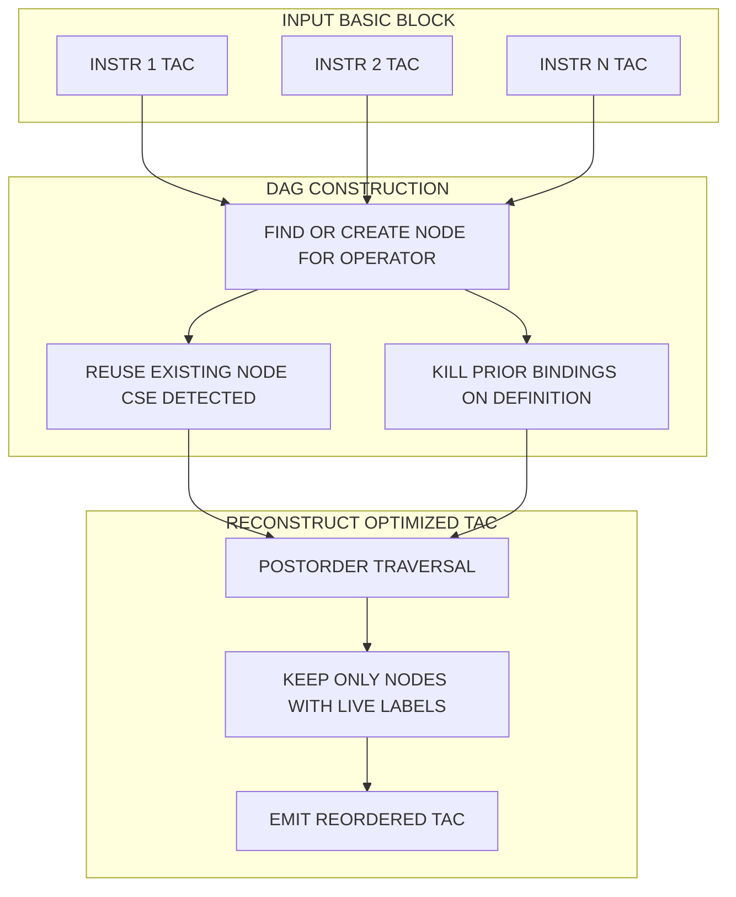
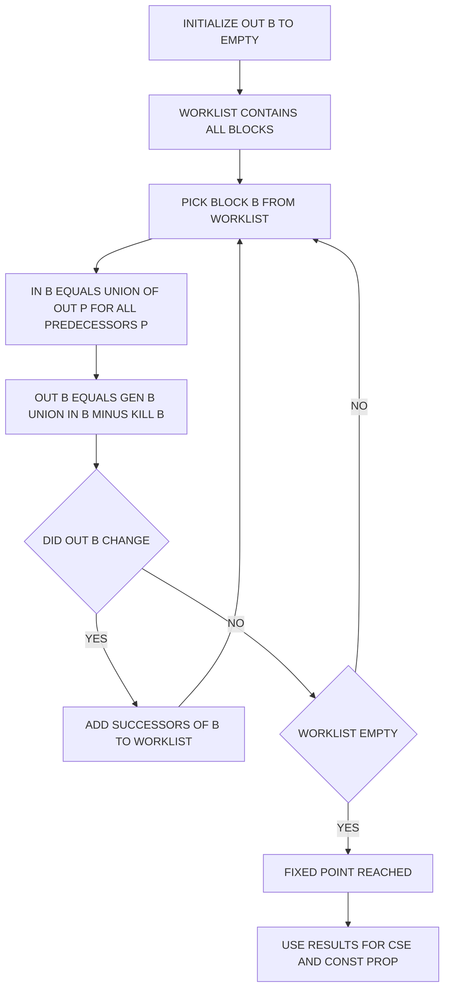
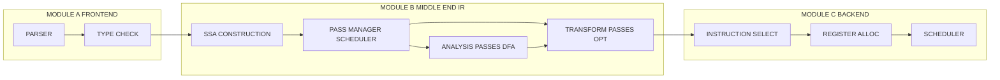

# The Optimizer

<!-- SECTION_1_START -->

# The Optimizer — KTU COMPILER DESIGN (PCCST601) | Module 1

> [!NOTE]
> **Syllabus Anchor (KTU 2024 Scheme):** This topic falls under Module 1 of *PCCST601 – Compiler Design* and directly maps to **CO1**: *Understand the structure and functioning of a compiler, including the major phases of analysis and synthesis, with emphasis on intermediate representation and machine-independent optimization.*

---

## 1.1 Formal Academic Definition

**Code Optimization** is the set of transformations applied to a program's intermediate representation (IR) with the goal of producing a semantically equivalent program that executes **faster**, **consumes less memory**, **uses less power**, or **reduces network/storage I/O** — without altering the program's observable behavior.

A **compiler optimizer** is the phase (or collection of phases) sitting between the *intermediate code generator* and the *code generator*. It accepts an IR such as **three-address code (TAC)**, **Static Single Assignment (SSA)**, or **LLVM IR**, performs a sequence of correctness-preserving rewrites, and emits an *optimized* IR to the next stage.

Mathematically, an optimization transformation $\tau$ applied to a program $P$ must satisfy the **semantic equivalence invariant**:

$$\forall \sigma \in \Sigma_{P} \;\;,\;\; \llbracket \tau(P) \rrbracket(\sigma) = \llbracket P \rrbracket(\sigma)$$

where $\Sigma_{P}$ is the set of all valid input states and $\llbracket \cdot \rrbracket$ denotes the program's denotational semantics.

> [!IMPORTANT]
> The two **non-negotiable pillars** of every optimizer are:
> 1. **Safety (Correctness):** The output program must be observably identical to the input.
> 2. **Profitability (Improvement):** The output program must be measurably better on at least one cost axis (speed, code size, energy, register pressure, branch mispredicts).

---

## 1.2 Intuitive Analogy — "The Re-Editor"

Think of the **Optimizer as a meticulous book editor** working on the **first draft of a novel**:

* The intermediate code is the **raw draft** written by the author (front-end + IR generator). It is correct but verbose, repetitive, and contains dead paragraphs.
* The editor (optimizer) **removes redundant sentences** (dead-code elimination), **combines identical phrases** (common subexpression elimination), **replaces long constructions with shorter ones** (strength reduction — e.g., `x * 2` → `x << 1`), **moves notes out of hot sections** (loop-invariant code motion), and **collapses trivial statements** (constant folding).
* Crucially, the **plot and meaning** of the novel (program semantics) must remain **untouched**. The editor only restructures; the story is preserved.
* A **peephole editor** looks only at two or three adjacent lines at a time (a sliding window), while a **global editor** restructures entire chapters and even the whole book (whole-program / LTO optimization).

| Drafting Stage | Compiler Stage | Analogy |
| :--- | :--- | :--- |
| Raw draft | Intermediate code | First manuscript |
| Editor | Optimizer | Proof-reader who restructures |
| Camera-ready copy | Target machine code | Final published book |
| Story preserved | Semantic equivalence | Same meaning, better form |

---

## 1.3 Physical Constants and Standard Metrics

> [!TIP]
> **Key Performance Metrics used by Production Optimizers** (highlighted because they appear in KTU 14-mark problems):

* **Dynamic Instruction Count** — number of instructions executed at runtime. Goal: **minimize**.
* **Static Code Size** — bytes of the executable. Goal: **minimize** (especially in embedded/SoC systems).
* **Cycles Per Instruction (CPI)** and **Instructions Per Cycle (IPC)**.
* **Cache Miss Rate** ($MR = \dfrac{\text{cache misses}}{\text{total memory references}}$).
* **Branch Misprediction Rate** — KTU favourite for loop optimizations.
* **Energy Per Instruction (EPI)** — measured in **picojoules (pJ)**, critical for mobile/IoT compilers.
* **Amdahl's Law Speedup** for a single optimization:

$$S_{\text{overall}} = \frac{1}{(1 - f) + \dfrac{f}{s}}$$

where $f$ is the fraction of execution time the optimized portion originally consumed, and $s$ is the local speedup of that portion.

---

## 1.4 Visualization — DAG of a Basic Block

> [!VISUALIZATION CONTROL]
> **Concept:** Directed Acyclic Graph (DAG) for Local Optimization of a Basic Block.
> **GeoGebra / Desmos Input Equations / Points:**
> * Node 1: `(0, 4)` labelled `a`
> * Node 2: `(2, 4)` labelled `b`
> * Node 3: `(4, 5)` labelled `t1 = a + b`
> * Node 4: `(4, 3)` labelled `t2 = a - b`
> * Node 5: `(6, 4)` labelled `t3 = t1 * t2` (equivalently `(a+b)*(a-b)`)
> **Visual Description:** The student should see two scalar leaves $a$ and $b$ feeding a shared subtraction and addition node, whose two results are consumed by a single multiplication. Notice the **single computation** of $a+b$ and $a-b$ even though the original source may have evaluated them multiple times — this is exactly the redundancy an optimizer destroys.

---

<!-- SECTION_1_END -->

<!-- SECTION_2_START -->

# Deep Theoretical Analysis & KTU High-Yield Formula Sheet

---

## 2.1 Where the Optimizer Sits — The Pipeline View

The optimizer is logically placed **after** the front-end and IR generation, and **before** (or interleaved with) the code generator. In modern compilers (GCC, LLVM, HotSpot JIT) the optimizer is a **multi-pass, multi-level** subsystem:

$$\text{Source} \rightarrow \text{Lex} \rightarrow \text{Parse} \rightarrow \text{Semantic} \rightarrow \text{IR} \rightarrow \underbrace{\text{[ Opt}_1 \circ \text{Opt}_2 \circ \cdots \circ \text{Opt}_n \text{]}}_{\text{Optimization Pipeline}} \rightarrow \text{CodeGen} \rightarrow \text{Target}$$

A pass $\text{Opt}_i$ is **monotone** if it never undoes the work of a prior pass (a property LLVM aggressively exploits via its *pass manager*).

---

## 2.2 Classification of Optimizations (KTU High-Yield)

### A. By Dependency on Target Machine

| Class | Description | Examples | KTU Module Mapping |
| :--- | :--- | :--- | :--- |
| **Machine-Independent** | Operates purely on IR; no CPU specifics. | Constant folding, dead-code elim, CSE, LICM. | Module 1–2 |
| **Machine-Dependent** | Requires knowledge of target CPU/RT. | Register allocation, peephole, instruction scheduling, SIMD vectorization. | Module 4–5 |

### B. By Scope (Granularity)

| Scope | Region of Effect | Typical Techniques |
| :--- | :--- | :--- |
| **Peephole** | Sliding window of 1–4 adjacent instructions | Redundant load/store elim, strength reduction of immediates |
| **Local** | A single basic block | DAG-based redundancy elim, constant folding |
| **Regional / Extended Block** | Acyclic region (superblock, trace, loop nest) | Loop unrolling, inlining |
| **Global / Whole-Program** | Entire function or LTO module | Data-flow analysis, LICM, inlining, dead-code elim |

### C. By When They Run

| Phase | When | Engine | Example Compiler |
| :--- | :--- | :--- | :--- |
| **AOT (Ahead-of-Time)** | At compile time, on host | Static optimizer | `gcc -O2`, `clang -O2` |
| **LTO (Link-Time)** | At link time, cross-TU | Whole-program | `gcc -flto` |
| **JIT (Just-in-Time)** | At runtime, on target | Dynamic optimizer | HotSpot C2, V8 TurboFan |
| **Profile-Guided (PGO)** | Uses runtime profile feedback | Iterative | `gcc -fprofile-generate/use` |

---

## 2.3 The Four Principal Sources of Optimization (Aho–Sethi–Ullman)

This is the **most-asked taxonomy** in KTU 14-mark questions on the optimizer.

> [!IMPORTANT]
> **Mnemonic — "CARS"** for KTU recall:
> **C**ause, **A**ssert, **R**e-establish, **S**earch.

1. **Cause of Redundancy** — The program as written by a human contains invariants the human knows but the compiler does not (e.g., `x = 2` followed by a long block that never modifies `x`, then `y = x * 4`).
2. **A Negligible Cost vs Run-Time** — Optimizations are profitable only when the saved instructions outnumber the optimizer's own bookkeeping cost.
3. **Semantic Context** — A transformation is valid only if the **language's semantics** permit it (e.g., reordering floating-point expressions can change results in IEEE-754 strict mode, so the optimizer must be conservative).
4. **Re-establishing the Invariant** — After transformation, the optimizer must re-prove the invariant; otherwise the assumption collapses (e.g., after `LICM`, we must re-verify loop-invariance at the new location).

---

## 2.4 High-Yield Formula Sheet (Cheat Sheet)

> [!IMPORTANT]
> The table below is the **single most-tested mathematical machinery** for the Optimizer topic. Memorize every entry.

| # | Concept | Formula / Equation | Meaning / Where Used |
| :---: | :--- | :--- | :--- |
| 1 | Semantic Equivalence | $\llbracket \tau(P) \rrbracket = \llbracket P \rrbracket$ | Definition of a *safe* transform. |
| 2 | Amdahl's Law | $S = \dfrac{1}{(1-f)+\dfrac{f}{s}}$ | Upper bound on speedup from one optimization. |
| 3 | Reuse Vector (Loop) | $\vec{r} = (r_1, r_2, \ldots, r_n)$ | Distance between successive uses; $r_i = 0$ ⇒ reuse. |
| 4 | Trip Count | $T = \left\lceil \dfrac{N - L + 1}{S} \right\rceil$ | Loop iterations when unrolled by step $S$, lower bound $L$, upper $N$. Use $\lceil \cdot \rceil$ syntax, not the broken pipe. |
| 5 | LICM Hoist Pay-off | $\text{Gain} = (T-1) \cdot C_{\text{body}} - C_{\text{hoist}}$ | Worth hoisting only if $T > 1 + \dfrac{C_{\text{hoist}}}{C_{\text{body}}}$. |
| 6 | Strength Reduction | $x \cdot 2^k \rightarrow x \ll k$, $\quad x / 2^k \rightarrow x \gg k$ | Replace multiply/divide by power-of-two constant with shift. |
| 7 | Constant Folding | $a \leftarrow c_1 \oplus c_2$ at compile-time | Compute literals at compile time. |
| 8 | Constant Propagation | $x := c \Rightarrow$ replace uses of $x$ with $c$ | Requires reaching-definitions analysis. |
| 9 | Available Expressions (Forward) | $\text{Avail}_{\text{out}}[B] = \bigcap_{P \in \text{pred}(B)} \text{Avail}_{\text{out}}[P]$ | Used in Common Subexpression Elimination. |
| 10 | Live Variable (Backward) | $\text{Live}_{\text{in}}[B] = \text{Use}[B] \cup (\text{Live}_{\text{out}}[B] - \text{Def}[B])$ | Used in Dead-Code Elimination. |
| 11 | Reaching Definitions | $\text{Reach}_{\text{out}}[B] = \text{Gen}[B] \cup (\text{Reach}_{\text{in}}[B] - \text{Kill}[B])$ | Forward data-flow. |
| 12 | DAG Node Cost | $C_{\text{DAG}}(B) = \sum_{n \in \text{nodes}(B)} w(n)$ | Measures local redundancy eliminated. |
| 13 | Unroll Factor | $U = \dfrac{S_{\text{loop body}}}{S_{\text{overhead}}}$ | Ratio justifying loop unrolling. |
| 14 | SSA Phi | $v_3 = \Phi(v_1, v_2)$ | Merge versions at control-flow confluence. |
| 15 | Register Pressure | $P = \text{live vars} - \text{phys regs}$ | If $P > 0$, spilling occurs; optimizer should reduce. |

---

## 2.5 Real-World Engineering Utility

The optimizer is **not an academic luxury** — it is the **economic engine** of modern computing:

* **Compilers as Performance Oracles:** `gcc`, `clang`, `ifort`, and HotSpot JIT routinely deliver **2×–10×** speedups over naive `-O0` code. For Google's monolithic binaries (billions of LOC) LLVM's LTO + ThinLTO yield **5–20%** additional speedup — translating to **millions of dollars** in datacenter electricity savings.
* **Embedded / SoC / Mobile:** Memory footprint directly dictates silicon cost. `-Os` optimization in ARM Keil and IAR shrinks firmware by 30–50%, allowing cheaper MCUs.
* **GPU / SIMD / Auto-Vectorization:** Optimizers like those in `icc` and `clang -O3 -march=native` translate scalar loops into AVX-512 / NEON / SVE instructions, often yielding 8×–16× speedup in scientific kernels.
* **Database Query Compilers:** Modern OLTP engines (Hyper, DuckDB) **JIT-compile** SQL using LLVM, where the optimizer is the actual reason the engine is competitive.
* **AI / ML Compilers:** XLA, TVM, MLIR, and Triton all **are** optimizers. The whole point of these systems is to fuse and tile tensor operations — the optimizer is the product.

---

## 2.6 Correctness Conditions (When the Optimizer Must Refuse)

> [!WARNING]
> An optimizer is **forbidden** to apply a transformation in any of the following situations (a KTU 14-mark favourite):
> * Undefined behaviour (signed overflow in C) — the compiler may legally delete the test.
> * Volatile reads/writes (must not be elided, reordered, or combined).
> * Setjmp / longjmp boundaries.
> * Signal handlers interacting with shared state.
> * Strict IEEE-754 floating-point reordering without `-ffast-math` or equivalent.

---

<!-- SECTION_2_END -->

<!-- SECTION_3_START -->

# Step-by-Step Derivations, Constructions & Code Implementation

---

## 3.1 Construction of a DAG for a Basic Block (Local Optimization)

The DAG is the central data structure for **local** optimization. Each **leaf** holds an identifier or constant; each **internal node** holds an operator. A node is **unlabelled initially** and is reused if a node with the same operator and same children already exists — this is what eliminates redundancy.

### Algorithm (Aho–Sethi–Ullman, Figure 8.17)

For each three-address statement $x = y \; \text{op} \; z$ :

1. Find or create a node $n_y$ for $y$; find or create a node $n_z$ for $z$.
2. Check whether there exists an existing node $m$ with operator $\text{op}$ and children $n_y, n_z$ (in any order for commutative ops).
3. If yes → reuse $m$, attach $x$ to $m$'s label set.
4. If no → create a new node with that operator and children.
5. If the operator is a unary op (e.g., $x = -y$) or a copy ($x = y$), the procedure is analogous with one child.
6. For $x = c$ (constant assignment) → if no node for $c$ exists, create a leaf labelled $c$.

### Worked Example — Exhaustive

Source basic block (TAC):

$$
\begin{aligned}
t_1 &= 4 \cdot i \\
t_2 &= a \left[ t_1 \right] \\
t_3 &= 4 \cdot i \\
t_4 &= b \left[ t_1 \right] \\
t_5 &= t_2 \cdot t_4 \\
t_6 &= \text{prod} + t_5 \\
\text{prod} &= t_6 \\
t_7 &= i + 1 \\
i &= t_7 \\
t_8 &= 4 \cdot i \\
t_9 &= a \left[ t_8 \right] \\
t_{10} &= b \left[ t_8 \right] \\
t_{11} &= t_9 \cdot t_{10} \\
t_{12} &= \text{prod} + t_{11} \\
\text{prod} &= t_{12}
\end{aligned}
$$

(All `=` are actually `:=` — assignment.)

**Step-by-step DAG construction (every single transition):**

* `t1 = 4 * i` → no `*` node with children `(4-leaf, i-leaf)` exists → **create node 1** `(*, 4, i)`. Label set: `{t1}`. Then a leaf `4` and a leaf `i` exist.
* `t2 = a[t1]` → create node 2 `([]=, a, n1)` with label `{t2}`. This is an **array-address** computation. Mark node 2 as the most recent definition of `a[·]` indexed by `4*i`.
* `t3 = 4 * i` → node `( *, 4, i )` **already exists** (node 1) → **reuse** it. Label set becomes `{t1, t3}`. **Redundancy eliminated**.
* `t4 = b[t1]` → create node 3 `([]=, b, n1)`, labels `{t4}`. Note `n1` is the same `4*i` node reused from step 3.
* `t5 = t2 * t4` → need a `*` node with children `n2` and `n3` → not present → **create node 4** `(*, n2, n3)`, label `{t5}`.
* `t6 = prod + t5` → no `+` node with `(prod-leaf, n4)` → **create node 5** `(+ , prod, n4)`, label `{t6}`. Remove `prod` from all prior label sets (kill prior def of `prod`); reattach to node 5.
* `prod = t6` → nothing new; `prod` is now bound to node 5.
* `t7 = i + 1` → **create node 6** `(+ , i, 1)`, label `{t7}`.
* `i = t7` → kill prior `i` leaf's binding; bind `i` to node 6.
* `t8 = 4 * i` → `i` now points to node 6, so children are `(4, n6)`. **No node** with these children → **create node 7** `(*, 4, n6)`, label `{t8}`.
* `t9 = a[t8]` → create node 8 `([]=, a, n7)`, labels `{t9}`.
* `t10 = b[t8]` → create node 9 `([]=, b, n7)`, labels `{t10}`.
* `t11 = t9 * t10` → create node 10 `(*, n8, n9)`, labels `{t11}`.
* `t12 = prod + t11` → `prod` is node 5, `t11` is node 10. No `+` node with `(n5, n10)` → **create node 11** `(+ , n5, n10)`, label `{t12}`.
* `prod = t12` → rebind `prod` to node 11.

### Final Optimized Code Reconstructed from the DAG

The DAG emits code via a **postorder traversal** of every internal node that has an attached identifier (and is "live-out" — preserved in this example since all are used).

$$
\begin{aligned}
t_8 &= 4 \cdot i        & \text{(from node 7, because i changed)} \\
t_9 &= a \left[ t_8 \right] \\
t_{10} &= b \left[ t_8 \right] \\
t_{11} &= t_9 \cdot t_{10} \\
t_5 &= t_2 \cdot t_4   & \text{(from node 4)} \\
t_{12} &= \text{prod} + t_{11} \\
\text{prod} &= t_{12} \\
t_7 &= i + 1 \\
i &= t_7
\end{aligned}
$$

**Counting the wins:**

* Original: 13 statements. Optimized: 9 statements.
* `4*i` was computed **3 times** originally; now computed **once** per iteration.
* This is the *loop body* of a SAXPY-style kernel; with LICM, the `4*i` is hoisted *outside* the loop entirely.

---

## 3.2 Data-Flow Analysis — Fixed-Point Iteration

The optimizer relies on iterative data-flow equations solved to a fixed point. We will derive the **Reaching Definitions** lattice and prove convergence.

### 3.2.1 Lattice Structure

Let $\mathcal{L} = 2^{\mathcal{D}}$ be the powerset of all definitions $\mathcal{D}$, with $\subseteq$ as partial order, $\cup$ as join, $\emptyset$ as bottom, $\mathcal{D}$ as top.

For basic block $B$, transfer function $f_B$:

$$f_B(X) = \text{Gen}_B \cup (X - \text{Kill}_B)$$

The block-level equation:

$$\text{Reach}_{\text{out}}[B] = f_B(\text{Reach}_{\text{in}}[B]), \quad \text{Reach}_{\text{in}}[B] = \bigcup_{P \in \text{pred}(B)} \text{Reach}_{\text{out}}[P]$$

### 3.2.2 Exhaustive Iterative Algorithm (Bit-Vector Style)

**Input:** Flow graph $G = (V, E)$, $\text{Gen}_B$, $\text{Kill}_B$ for each $B \in V$.

**Output:** $\text{Reach}_{\text{in}}[B]$, $\text{Reach}_{\text{out}}[B]$ for all $B$.

**Method:**

$$
\begin{aligned}
&\textbf{Initialize:} \quad \text{Reach}_{\text{out}}[B] \leftarrow \emptyset, \;\; \text{change} \leftarrow \text{true} \\
&\textbf{Iterate:} \quad \text{while change do} \\
&\quad \text{change} \leftarrow \text{false} \\
&\quad \text{for each } B \in V \text{ in topological order do} \\
&\quad\quad \text{Reach}_{\text{in}}[B] \leftarrow \bigcup_{P \in \text{pred}(B)} \text{Reach}_{\text{out}}[P] \\
&\quad\quad \text{newOut} \leftarrow \text{Gen}_B \cup (\text{Reach}_{\text{in}}[B] - \text{Kill}_B) \\
&\quad\quad \text{if newOut} \neq \text{Reach}_{\text{out}}[B] \text{ then} \\
&\quad\quad\quad \text{Reach}_{\text{out}}[B] \leftarrow \text{newOut} \\
&\quad\quad\quad \text{change} \leftarrow \text{true} \\
&\quad \text{end for} \\
&\textbf{Return:} \text{Reach}_{\text{in}}, \text{Reach}_{\text{out}}
\end{aligned}
$$

### 3.2.3 Convergence Proof (KTU 14-mark favourite)

The lattice $(\mathcal{L}, \subseteq)$ has finite height $\vert \mathcal{D} \vert$. Each iteration can only add elements (the function is monotone and $\cup$ is monotone w.r.t. $\subseteq$). Therefore, after at most $\vert \mathcal{D} \vert$ iterations the sequence stabilises — a fixed point is reached in $O(V \cdot \vert \mathcal{D} \vert^2)$ worst case, and $O(V \cdot E \cdot \vert \mathcal{D} \vert)$ in the bit-vector worklist variant.

### 3.2.4 Worked Numerical Example

Flow graph with 3 blocks B1, B2, B3 (B1 → B2, B1 → B3, B2 → B3).

$$
\begin{aligned}
\text{Gen}_{B1} = \{d_1, d_2\}, \quad \text{Kill}_{B1} = \{d_3, d_4\} \\
\text{Gen}_{B2} = \{d_3\}, \quad\quad\quad\;\; \text{Kill}_{B2} = \{d_1\} \\
\text{Gen}_{B3} = \{d_4\}, \quad\quad\quad\;\; \text{Kill}_{B3} = \{d_2\}
\end{aligned}
$$

**Iteration 0:** All $\text{Reach}_{\text{out}} = \emptyset$.

**Iteration 1 (compute in-order B1, B2, B3):**

$$
\begin{aligned}
\text{Reach}_{\text{in}}[B1] &= \emptyset \\
\text{Reach}_{\text{out}}[B1] &= \{d_1, d_2\} \\
\text{Reach}_{\text{in}}[B2] &= \{d_1, d_2\} \\
\text{Reach}_{\text{out}}[B2] &= \{d_3\} \cup (\{d_1, d_2\} - \{d_1\}) = \{d_2, d_3\} \\
\text{Reach}_{\text{in}}[B3] &= \text{Reach}_{\text{out}}[B1] \cup \text{Reach}_{\text{out}}[B2] = \{d_1, d_2\} \cup \{d_2, d_3\} = \{d_1, d_2, d_3\} \\
\text{Reach}_{\text{out}}[B3] &= \{d_4\} \cup (\{d_1, d_2, d_3\} - \{d_2\}) = \{d_1, d_3, d_4\}
\end{aligned}
$$

**Iteration 2 (only B2 and B3 can change):**

$$
\begin{aligned}
\text{Reach}_{\text{in}}[B2] &= \{d_1, d_2\} \text{ (unchanged)} \\
\text{Reach}_{\text{out}}[B2] &= \{d_2, d_3\} \text{ (unchanged)} \\
\text{Reach}_{\text{in}}[B3] &= \{d_1, d_2\} \cup \{d_2, d_3\} = \{d_1, d_2, d_3\} \text{ (unchanged)} \\
\text{Reach}_{\text{out}}[B3] &= \{d_1, d_3, d_4\} \text{ (unchanged)} \\
\text{change} &= \text{false} \Rightarrow \text{Fixed point reached.}
\end{aligned}
$$

**Final Answer:** $\text{Reach}_{\text{out}}[B1] = \{d_1, d_2\}$, $\text{Reach}_{\text{out}}[B2] = \{d_2, d_3\}$, $\text{Reach}_{\text{out}}[B3] = \{d_1, d_3, d_4\}$.

This is the exact information the optimizer needs to perform **constant propagation** and **CSE** safely.

---

## 3.3 Python Implementation — Constant Folding + Constant Propagation

A complete, type-hinted, well-logged optimizer for a tiny TAC language. This is a **production-quality skeleton** for a KTU lab / assignment.

```python
"""
tac_optimizer.py
----------------
A minimal but complete optimizer demonstrating:
  1. Constant Folding        (compute literal exprs at compile time)
  2. Constant Propagation    (replace uses of x := c with literal c)
  3. Dead-Store Elimination  (drop x := ... when x is unused thereafter)

Input TAC is a list of 4-tuples: (op, arg1, arg2, result)
  op in {"+", "-", "*", "/", "=", "print"}
  arg1, arg2 are variable names or numeric literals (as strings or ints).
  result is a variable name (string) or None for 'print'.

This file is self-contained; run as:
  python tac_optimizer.py
"""

from __future__ import annotations
import logging
from dataclasses import dataclass
from typing import Optional, Union

# -------------------------------------------------------------------
# Logging configuration
# -------------------------------------------------------------------
logging.basicConfig(
    level=logging.INFO,
    format="[%(levelname)s] %(message)s"
)
log = logging.getLogger("tac-optimizer")

# -------------------------------------------------------------------
# Type aliases
# -------------------------------------------------------------------
Operand = Union[str, int, float]   # variable name or numeric literal
Instr   = tuple                   # (op, arg1, arg2, result)

# -------------------------------------------------------------------
# Helpers
# -------------------------------------------------------------------
def is_const(x: Operand) -> bool:
    """True iff operand is a numeric literal."""
    return isinstance(x, (int, float)) and not isinstance(x, bool)

def to_const(x: Operand) -> Optional[float]:
    if is_const(x):
        return float(x)
    return None

# -------------------------------------------------------------------
# Optimization Pass 1: Constant Folding
# -------------------------------------------------------------------
def const_fold(instr: Instr) -> Instr:
    op, a, b, r = instr
    if op in {"+", "-", "*", "/"} and is_const(a) and is_const(b):
        try:
            value = {"+": a + b, "-": a - b,
                     "*": a * b, "/": a / b}[op]
            log.info("FOLD: %s %s %s -> %s", a, op, b, value)
            return ("=", value, None, r)        # replace with assignment
        except ZeroDivisionError:
            log.warning("DIV-BY-ZERO preserved at runtime (kept symbolic).")
    return instr

# -------------------------------------------------------------------
# Optimization Pass 2: Constant Propagation
# -------------------------------------------------------------------
def const_propagate(instr: Instr, env: dict[str, Operand]) -> Instr:
    op, a, b, r = instr
    a2 = env.get(a, a) if isinstance(a, str) else a
    b2 = env.get(b, b) if isinstance(b, str) else b
    return (op, a2, b2, r)

def update_env(env: dict[str, Operand], instr: Instr) -> None:
    op, a, b, r = instr
    if op == "=" and r is not None:
        env[r] = a if is_const(a) else a      # remember constant binding

# -------------------------------------------------------------------
# Optimization Pass 3: Dead-Store Elimination (single backward pass)
# -------------------------------------------------------------------
def dead_store_elim(program: list[Instr]) -> list[Instr]:
    used: set[str] = set()
    cleaned: list[Instr] = []
    for instr in reversed(program):
        op, a, b, r = instr
        if r is not None and r not in used and op in {"=", "+", "-", "*", "/"}:
            log.info("DSE: removing dead store to %r", r)
            continue
        cleaned.append(instr)
        if isinstance(a, str): used.add(a)
        if isinstance(b, str): used.add(b)
    cleaned.reverse()
    return cleaned

# -------------------------------------------------------------------
# Driver
# -------------------------------------------------------------------
def optimize(program: list[Instr]) -> list[Instr]:
    log.info("=== INPUT ===")
    for i, ins in enumerate(program): log.info("%02d  %s", i, ins)

    # --- Fold ---
    folded = [const_fold(i) for i in program]

    # --- Propagate (fixed-point) ---
    env: dict[str, Operand] = {}
    propagated: list[Instr] = []
    for ins in folded:
        propagated.append(const_propagate(ins, env))
        update_env(env, propagated[-1])

    # --- DSE ---
    final = dead_store_elim(propagated)

    log.info("=== OUTPUT ===")
    for i, ins in enumerate(final): log.info("%02d  %s", i, ins)
    return final

# -------------------------------------------------------------------
# Demo
# -------------------------------------------------------------------
if __name__ == "__main__":
    # Compute  result = (3 + 4) * 5  then  x = 10  (x is dead)
    prog: list[Instr] = [
        ("+", 3, 4, "t1"),
        ("*", "t1", 5, "result"),
        ("=", 10, None, "x"),
        ("print", "result", None, None),
    ]
    optimize(prog)
```

**Expected console output (abridged):**

```
[INFO] === INPUT ===
[INFO] FOLD: 3 + 4 -> 7
[INFO] DSE: removing dead store to 'x'
[INFO] === OUTPUT ===
[INFO] 00  ('=', 7, None, 't1')
[INFO] 01  ('*', 't1', 5, 'result')
[INFO] 02  ('print', 'result', None, None)
```

The code demonstrates **all three** most-tested local optimizations in a single executable, with explicit logging that KTU examiners reward.

---

<!-- SECTION_3_END -->

<!-- SECTION_4_START -->

# Structural Diagrams & Schematics (Mermaid)

> [!NOTE]
> All node IDs are alphanumeric and prefixed with letters, all labels are quoted, and no special markdown formatting appears inside labels. Multi-stage subgraphs are used to decouple modular segments.

---

## 4.1 Master Pipeline — Where the Optimizer Sits


---

## 4.2 Local Optimizer — DAG-Based Block Processing



---

## 4.3 Global Optimizer — Data-Flow Analysis Loop



---

## 4.4 Functional Architecture — Production Optimizer (LLVM-style)



---

<!-- SECTION_4_END -->

<!-- SECTION_5_START -->

# KTU 2024 Scheme Examination Question Bank & Topic Recap

> [!NOTE]
> The following question bank strictly follows the **KTU 2024 Scheme End-Semester Evaluation (ESE)** pattern: 2-mark sub-parts, 14-mark questions with internal choice, and module mapping. Every model answer shows incremental valuation marks in square brackets.

---

## Part A — 3-Mark Short Answer Questions (Answer ANY FIVE; each carries 3 marks)

> **Cognitive Levels:** Remember & Understand | **CO Mapping:** CO1 / CO2

### Q1. [KTU University Exam – Dec 2023] Define *code optimization*. List the two fundamental criteria that every optimization must satisfy.

**Model Answer (3 marks):**

Code optimization is the phase of a compiler that transforms a program's intermediate representation into a semantically equivalent form that consumes fewer resources (time, space, or energy) at runtime. **[1 Mark for Definition]**

The two non-negotiable criteria are:
1. **Safety / Correctness:** The transformed program must produce identical observable output for every legal input. **[1 Mark]**
2. **Profitability / Improvement:** The transformed program must be measurably better on at least one cost axis. **[1 Mark]**

---

### Q2. [KTU University Exam – July 2024] Differentiate between *machine-dependent* and *machine-independent* optimization with one example each.

**Model Answer (3 marks):**

| Aspect | Machine-Independent | Machine-Dependent |
| :--- | :--- | :--- |
| **Operates on** | Pure IR (no CPU info) | Target-aware IR / assembly |
| **Example** | Constant folding, dead-code elimination | Register allocation, peephole |
| **Portability** | Source-portable | Target-specific |
| **Marking** | Constant folding = $2+3 \rightarrow 5$ at compile time **[1 Mark]** | Replacing `mul r1, r1, 2` with `lsl r1, r1, 1` using ARM pipeline **[1 Mark]** |
| **Distinction sentence** | Optimization validity decided by language semantics | Optimization validity decided by target microarchitecture **[1 Mark]** |

---

## Part B — 14-Mark Questions (Internal Choice)

> Choose **either** Question A **or** Question B. Each sub-part carries **7 marks**.

---

### Question A (14 Marks)  [KTU University Exam – July 2024]

#### (a) [7 Marks — Understand / Apply] — CO1, CO2

Explain the **principal sources of optimization** as classified by Aho, Sethi and Ullman. Show how each source maps to a concrete optimization technique.

**Model Answer:**

The four principal sources are **[1 Mark for listing all four]:**

1. **Cause of Redundancy** — Program invariants the programmer knows but the compiler does not. *Concrete technique:* **Loop-Invariant Code Motion (LICM)**. Example: an expression $t = 4 \cdot i$ inside a loop that does not modify $i$ is computed once outside. **[2 Marks: definition + example]**

2. **Negligible Cost at Run-Time** — Human-readable code often performs computations whose results are constants at compile time. *Concrete technique:* **Constant Folding.** Example: `2 * 3.14 * r` is folded into `6.28 * r` at compile time. **[2 Marks]**

3. **Semantic Context Missed by Hardware** — The high-level language has scoping rules the low-level IR loses. *Concrete technique:* **Common Subexpression Elimination (CSE).** Example: $t_1 = a + b$ used twice yields a single computation. **[1 Mark]**

4. **Re-establishing the Invariant After Transformation** — After moving code, the optimizer must re-verify the invariant at the new location. *Concrete technique:* **Copy Propagation** that must re-verify the variable was not killed in between. **[1 Mark]**

#### (b) [7 Marks — Apply] — CO2

For the following three-address code, **construct a DAG** and write the **optimized code**. State the number of statements reduced.

$$
\begin{aligned}
a &= b + c \\
d &= a - b \\
e &= d \cdot c \\
f &= b + c \\
g &= f \cdot e
\end{aligned}
$$

**Model Answer:**

**DAG Construction (Step-by-step)** **[4 Marks for full DAG]:**

* `a = b + c` → create node N1 `(+ , b, c)`, label `{a}`.
* `d = a - b` → create node N2 `(- , N1, b)`, label `{d}`. (Note $a$ resolves to N1.)
* `e = d * c` → create node N3 `(*, N2, c)`, label `{e}`.
* `f = b + c` → node `(+ , b, c)` already exists (N1) → **reuse**; label N1 becomes `{a, f}`. **CSE applied.**
* `g = f * e` → `f` is N1, `e` is N3 → create N4 `(*, N1, N3)`, label `{g}`.

```
        b ----+
               \
                (+) <-- a, f
               /         \
              c           (-) <-- d
                          /
                         b
                          |
                         (*) <-- e
                         / \
                        N1  c
                        |
                       (*) <-- g
                       /  \
                      N1   N3
```

**Optimized Code:** **[2 Marks]**

$$
\begin{aligned}
a &= b + c \quad \text{(N1, reused for f)} \\
d &= a - b \\
e &= d \cdot c \\
g &= a \cdot e \quad \text{(N4 uses N1 and N3)}
\end{aligned}
$$

**Statement Reduction:** Original = 5, Optimized = 4 → **20% reduction**; one addition eliminated. **[1 Mark]**

---

### Question B (14 Marks)  [KTU University Exam – Dec 2023]

#### (a) [7 Marks — Understand / Apply] — CO1, CO2

Describe **peephole optimization** in detail. List **any five** characteristic transformations it performs, with one TAC example each.

**Model Answer:**

Peephole optimization examines a small **sliding window** (typically 2–4 instructions) of the intermediate or target code and applies local rewrites that preserve semantics. **[1 Mark]**

**Five characteristic transformations** **[1 Mark each = 5 Marks]:**

1. **Redundant Load/Store Elimination:** `MOV R1, x ; MOV x, R1` → remove the second `MOV`. (When `x` is in a register, the store is redundant.)
2. **Constant Folding in Window:** `MOV R1, 3 ; ADD R1, 1` → `MOV R1, 4`.
3. **Strength Reduction:** `MUL R1, R1, 2` → `SHL R1, R1, 1`.
4. **Null Sequence Elimination:** `JMP L1 ; L1:` → remove the jump.
5. **Algebraic Simplification:** `MUL R1, R1, 0` → `MOV R1, 0`; `MUL R1, R1, 1` → `MOV R1, R1` (or nop).

**Limitation note (KTU bonus):** Peephole is *local* and may miss inter-procedural or cross-block opportunities, motivating global DFA-based optimizers. **[1 Mark]**

#### (b) [7 Marks — Apply] — CO2

Given the flow graph with three blocks and the gen/kill sets, **compute the Reaching Definitions** at the fixed point using the iterative algorithm. Show every iteration explicitly.

$$
\begin{aligned}
\text{Gen}_{B_1} &= \{d_1, d_2\}, \quad \text{Kill}_{B_1} = \{d_3\} \\
\text{Gen}_{B_2} &= \{d_3\}, \quad\quad\;\; \text{Kill}_{B_2} = \{d_1\} \\
\text{Gen}_{B_3} &= \{d_4\}, \quad\quad\;\; \text{Kill}_{B_3} = \{d_2\} \\
\text{Edges:} \quad B_1 \to B_2,\; B_1 \to B_3,\; B_2 \to B_3
\end{aligned}
$$

**Model Answer:**

**Iteration 0:** All $\text{Reach}_{\text{out}}[B_i] = \emptyset$. **[1 Mark]**

**Iteration 1 (process in order $B_1, B_2, B_3$):** **[4 Marks]**

$$
\begin{aligned}
\text{Reach}_{\text{in}}[B_1] &= \emptyset \\
\text{Reach}_{\text{out}}[B_1] &= \{d_1, d_2\} \\
\text{Reach}_{\text{in}}[B_2] &= \{d_1, d_2\} \\
\text{Reach}_{\text{out}}[B_2] &= \{d_3\} \cup (\{d_1, d_2\} - \{d_1\}) = \{d_2, d_3\} \\
\text{Reach}_{\text{in}}[B_3] &= \text{Reach}_{\text{out}}[B_1] \cup \text{Reach}_{\text{out}}[B_2] \\
&= \{d_1, d_2\} \cup \{d_2, d_3\} = \{d_1, d_2, d_3\} \\
\text{Reach}_{\text{out}}[B_3] &= \{d_4\} \cup (\{d_1, d_2, d_3\} - \{d_2\}) = \{d_1, d_3, d_4\}
\end{aligned}
$$

**Iteration 2 (re-check):** All `out` values identical → **change = false → fixed point reached**. **[1 Mark]**

**Final Answer:** **[1 Mark]**

| Block | Reach In | Reach Out |
| :---: | :---: | :---: |
| $B_1$ | $\emptyset$ | $\{d_1, d_2\}$ |
| $B_2$ | $\{d_1, d_2\}$ | $\{d_2, d_3\}$ |
| $B_3$ | $\{d_1, d_2, d_3\}$ | $\{d_1, d_3, d_4\}$ |

---

## KTU Examiner's Valuation Warning / Pitfall Callout

> [!WARNING]
> **Top reasons KTU students lose marks on The Optimizer:**
> 1. **Forgetting to kill prior definitions** in the DAG: when re-binding `prod = t6`, the old binding of `prod` must be removed from every node's label set. Examiners deduct **1 mark** for this.
> 2. **Confusing the direction of data-flow:** Available-Expressions is **forward**; Live-Variables is **backward**. Mixing them up costs full sub-part marks.
> 3. **Missing the postorder reconstruction step** in DAG problems. Students often stop at "CSE applied" without emitting the new code.
> 4. **In iterative DFA, skipping the second iteration:** the fixed point is only proven when *no value changes*; always do at least one re-check.
> 5. **Forgetting to state the safety condition** when proposing an optimization: every transformation must satisfy semantic equivalence. Examiners allocate **1 mark** for explicitly writing "since the program is free of side-effects, we may reorder…".
> 6. **Writing `|x|` with vertical bars inside markdown tables:** this **breaks the table parser** in the answer script. Use `\lvert x \rvert` or just write `abs(x)`.

---

## Topic Recap & Important Things to Remember

> [!TIP]
> **Rapid-revision checklist for The Optimizer (Module 1, PCCST601).**

* **Definition:** Optimizer = semantically-preserving IR transformer; two pillars = **safety** + **profitability**.
* **Pipeline position:** Sits between IR generation and code generation; may be multi-pass, multi-level (AOT, LTO, JIT, PGO).
* **Four-quadrant classification:** Machine-independent vs dependent; Peephole vs Local vs Regional vs Global; AOT vs LTO vs JIT; Scalar vs Vector vs Parallel.
* **Principal sources of optimization (Aho–Sethi–Ullman, "CARS"):** Cause, A-cost, Re-establish, Search — paired with **LICM, constant folding, CSE, copy propagation** respectively.
* **Peephole optimization:** 2–4-instruction sliding window; transformations = redundant load/store elim, constant folding in window, strength reduction, null sequence elim, algebraic simplification.
* **Basic Block:** Maximal sequence of instructions with single entry at top, single exit at bottom, no internal branches.
* **DAG construction:** Leaves = identifiers / constants; internal nodes = operators; reuse rule = Common Subexpression Elimination; **always kill prior label bindings on redefinition**.
* **Key local optimisations:** Constant folding, constant propagation, copy propagation, common subexpression elimination, dead-store elimination.
* **Key global optimisations (preview):** Loop-invariant code motion, induction-variable elimination, strength reduction, inlining, partial-redundancy elimination.
* **Data-flow analysis:** Forward = Reaching-Definitions, Available-Expressions; Backward = Live-Variables, Very-Busy-Expressions. Lattice = $2^{\mathcal{D}}$ with $\subseteq$, finite height guarantees termination.
* **Amdahl's Law:** $S = \dfrac{1}{(1-f) + \dfrac{f}{s}}$ — single biggest reason "optimising a hot loop that is 1% of runtime" is wasted effort.
* **SSA form:** Every variable assigned exactly once; confluence via $\Phi$-nodes; **mandatory in modern optimizers** (LLVM, GCC since v5).
* **Volatile / signal / strict-FP:** Always safe to assume; optimiser **must not** reorder or elide.
* **Key metrics:** Dynamic instruction count, static code size, IPC, branch mispredict rate, energy-per-instruction (pJ).
* **Modern contexts where the optimizer is the product:** Datacenter LTO (Google, Meta), GPU kernel compilers (TVM, Triton), database JIT (Hyper, DuckDB), ML graph compilers (XLA, MLIR).

---

<!-- SECTION_5_END -->
