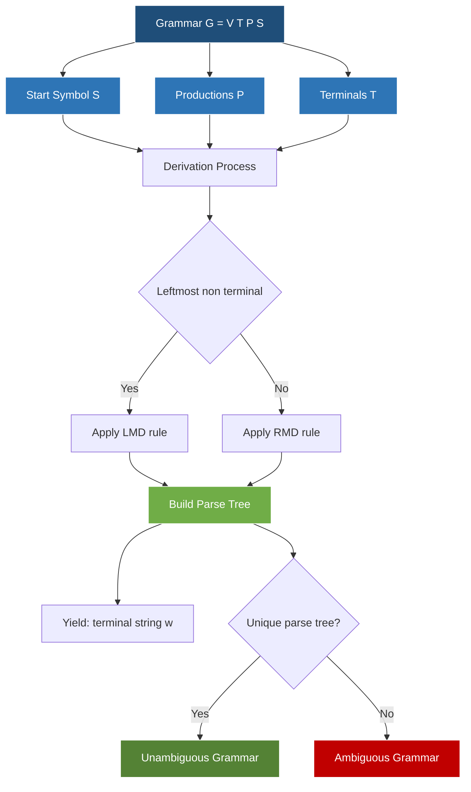
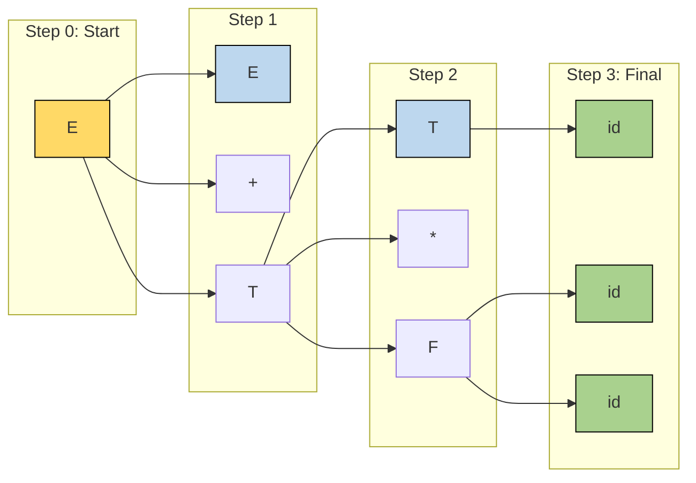
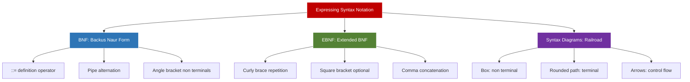
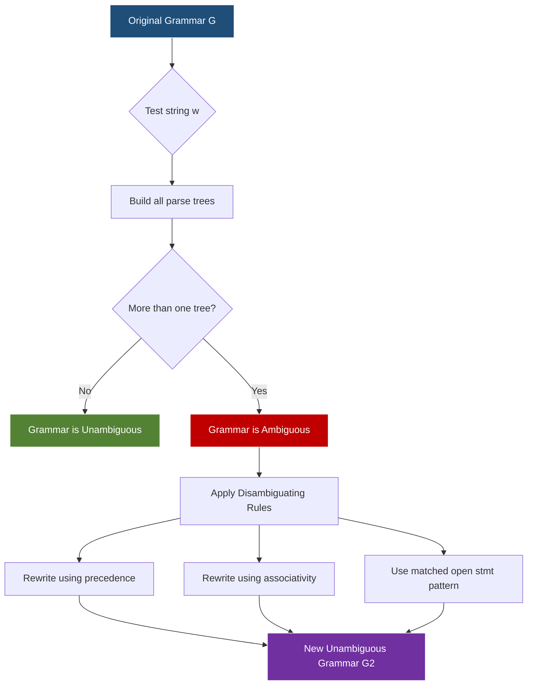
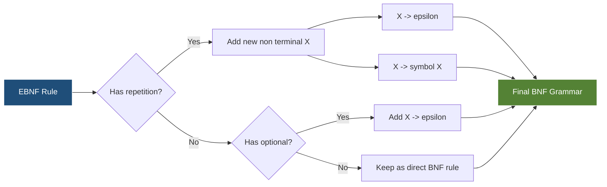

# Expressing Syntax

<!-- SECTION_1_START -->

# Expressing Syntax

## 1.1 Formal Definition & Terminology

In Compiler Design, **Syntax** refers to the formal set of rules that define the well-formed structure of programs in a programming language. The process of *Expressing Syntax* involves using precise mathematical and logical notations to specify the grammar of a language unambiguously.

> [!IMPORTANT]
> **KTU 2024 Syllabus Definition (Module 2):**
> *Expressing Syntax* deals with the formal mechanisms — **Context-Free Grammars (CFG)**, **Backus-Naur Form (BNF)**, **Extended Backus-Naur Form (EBNF)**, and **Syntax Diagrams** — used to define the syntactic structure of tokens produced by the lexical analyzer.

The formal hierarchy used to classify languages is the **Chomsky Hierarchy**:

| Grammar Type | Language Class | Recognition Machine |
|--------------|----------------|---------------------|
| Type 0 | Recursively Enumerable | Turing Machine |
| Type 1 | Context-Sensitive | Linear Bounded Automaton |
| **Type 2** | **Context-Free Grammar (CFG)** | **Pushdown Automaton** |
| Type 3 | Regular Grammar | Finite Automaton |

Programming languages are predominantly specified using **Type 2 (Context-Free Grammars)** because they balance expressive power and computational tractability.

## 1.2 Core Components of a Context-Free Grammar (CFG)

A CFG is formally defined as a **4-tuple** $G = (V, T, P, S)$ where:

- $V$ → Set of **Non-terminals** (syntactic variables, denoted by uppercase letters).
- $T$ → Set of **Terminals** (tokens, denoted by lowercase letters).
- $P$ → Set of **Productions / Rules** of the form $A \rightarrow \alpha$ where $A \in V$ and $\alpha \in (V \cup T)^{*}$.
- $S$ → **Start Symbol** (a distinguished non-terminal, $S \in V$).

## 1.3 Backus-Naur Form (BNF)

**BNF**, introduced by John Backus and Peter Naur for the specification of **ALGOL 60**, is the most widely used notation for expressing context-free syntax.

> [!NOTE]
> **BNF Metalanguage Conventions:**
> - `< >` → Encloses a non-terminal symbol (e.g., `<expression>`).
> - `::=` → Defines a production rule ("is defined as").
> - `|` → Logical OR (alternation between alternatives).
> - Terminals appear without delimiters.

**Example BNF Grammar for Simple Arithmetic:**
```
<expr>    ::= <expr> <op> <expr> | ( <expr> ) | id
<op>      ::= + | - | * | /
```

## 1.4 Extended Backus-Naur Form (EBNF)

EBNF extends BNF with **regular-expression-style operators**, making grammars more concise and readable.

| EBNF Construct | Meaning | BNF Equivalent |
|----------------|---------|----------------|
| `{ }` | Zero or more repetitions | Recursive production |
| `[ ]` | Optional (zero or one) | Two alternative productions |
| `( )` | Grouping | — |
| `,` | Concatenation separator | Juxtaposition |
| `=` | Definition symbol | `::=` |
| `;` or `.` | Production terminator | — |

> [!IMPORTANT]
> EBNF eliminates the need for recursive definitions to express iteration, leading to **simpler, more compact grammars** suitable for modern compiler specification.

## 1.5 Syntax Diagrams (Railroad Diagrams)

**Syntax Diagrams** are a graphical alternative to BNF/EBNF. Each rule becomes a directed graph with terminals as labeled edges and non-terminals as labeled boxes. They are widely used in **Pascal**, **Lua**, and **JSON** specifications.

> [!VISUALIZATION CONTROL]
> **Concept:** Visualization of a simple Syntax Diagram for an Identifier
> **Graph Structure:**
> - Entry → (letter) → [Loop: (letter | digit)*] → Exit
> - Boxes represent non-terminals; rounded paths represent terminals
> **Visual Description:** Imagine a "railroad track" starting at the left: the train must traverse a `letter` box, then loop back through zero or more `letter` or `digit` boxes before exiting on the right.

## 1.6 Intuitive Analogy

> [!TIP]
> **Real-World Analogy: "The Recipe Book"**
> Think of expressing syntax like writing a recipe:
> - **Terminals** are the actual ingredients (flour, sugar, eggs).
> - **Non-terminals** are intermediate sub-tasks like "make the batter" or "prepare frosting."
> - **Productions** are the step-by-step instructions: *"Batter → mix(flour, sugar, eggs)"*.
> - The **Start Symbol** is the final dish (e.g., `<cake>`).
> 
> Just as a recipe tells you *exactly* how to combine ingredients, a grammar tells the parser *exactly* how to combine tokens to form a valid program.

---

<!-- SECTION_1_END -->

<!-- SECTION_2_START -->

# Deep Theoretical Analysis & KTU High-Yield Formula Sheet

## 2.1 Derivations

A **derivation** is a sequence of rewriting steps that starts from the start symbol $S$ and applies productions until a string of terminals (a **sentence**) is obtained. The symbol $\Rightarrow$ (read as "derives") denotes a single step.

### 2.1.1 Types of Derivations

**1. Left-Most Derivation (LMD):**
At each step, the **leftmost non-terminal** is replaced.

**2. Right-Most Derivation (RMD):**
At each step, the **rightmost non-terminal** is replaced (also called **Canonical Derivation**).

> [!IMPORTANT]
> A string $w$ is in the language $L(G)$ if and only if there exists a derivation $S \overset{*}{\Rightarrow} w$, where $\overset{*}{\Rightarrow}$ denotes zero or more derivation steps.

## 2.2 Parse Trees

A **Parse Tree** (also called a *Derivation Tree* or *Concrete Syntax Tree*) is a hierarchical, graphical representation of a derivation where:
- **Root** → Start symbol $S$.
- **Internal nodes** → Non-terminals.
- **Leaves** → Terminals (read left-to-right, they form the derived sentence).
- **Children of a node** → The right-hand side of the production applied.

> [!NOTE]
> **Yield of a Parse Tree:** The concatenation of leaf nodes from left to right gives the derived string.

## 2.3 Ambiguity in Grammars

A grammar $G$ is **ambiguous** if there exists at least one string $w \in L(G)$ for which **two or more distinct parse trees** (or equivalently, two distinct left-most derivations) exist.

> [!WARNING]
> **KTU High-Yield Concept:** Most programming language constructs must be **unambiguous**. For example, the dangling-else problem in `if-then-else` statements typically requires grammar rewriting to resolve ambiguity.

## 2.4 Associativity and Precedence

When designing grammars for arithmetic expressions, two key properties must be encoded:

| Property | Encoding Technique | Example |
|----------|-------------------|---------|
| **Left Associativity** | Left-recursive production | $E \rightarrow E + T \mid T$ |
| **Right Associativity** | Right-recursive production | $E \rightarrow T = E \mid T$ |
| **Higher Precedence** | Deeper in derivation tree | `*` deeper than `+` |
| **Lower Precedence** | Closer to root | `+` closer to root |

## 2.5 KTU High-Yield Formula Sheet

| # | Concept | Formula / Notation | Description |
|---|---------|-------------------|-------------|
| 1 | CFG Definition | $G = (V, T, P, S)$ | 4-tuple definition |
| 2 | Production Rule | $A \rightarrow \alpha$ where $A \in V$ | Single rule |
| 3 | Derivation Step | $\alpha A \beta \Rightarrow \alpha \gamma \beta$ | Replacing $A$ by $\gamma$ |
| 4 | Reflexive-Transitive Closure | $S \overset{*}{\Rightarrow} w$ | Zero or more steps |
| 5 | Language of Grammar | $L(G) = \{ w \in T^{*} \mid S \overset{*}{\Rightarrow} w \}$ | Set of all terminal strings |
| 6 | Sentence | $w \in L(G)$ | A valid string |
| 7 | Sentential Form | $\alpha \in (V \cup T)^{*}$ where $S \overset{*}{\Rightarrow} \alpha$ | Intermediate derivation string |
| 8 | Ambiguity Condition | $\exists w \in L(G)$: two distinct parse trees for $w$ | Grammar is ambiguous |
| 9 | BNF Operator | $\langle \cdot \rangle ::=$ | Definition |
| 10 | EBNF Repetition | $A \rightarrow \{ x \}$ | Equivalent to $A \rightarrow \varepsilon \mid xA$ |

> [!TIP]
> **Engineering Utility:** Modern compiler generators like **YACC**, **Bison**, **ANTLR**, and **Lark** all accept EBNF/BNF-style specifications as input. They auto-generate LALR or LL parsers, drastically reducing the manual effort of writing language processors.

---

<!-- SECTION_2_END -->

<!-- SECTION_3_START -->

# Step-by-Step Derivations & Code Implementation

## 3.1 Worked Example 1: Left-Most and Right-Most Derivations

**Given Grammar $G$:**
$$E \rightarrow E + E \mid E * E \mid (E) \mid \text{id}$$

**String to derive:** $w = \text{id} + \text{id} * \text{id}$

### Left-Most Derivation (LMD):

$$E \Rightarrow E + E$$

$$\Rightarrow \text{id} + E \quad \text{[Apply } E \rightarrow \text{id]}$$

$$\Rightarrow \text{id} + E * E \quad \text{[Apply } E \rightarrow E * E \text{ to the rightmost } E]$$

$$\Rightarrow \text{id} + \text{id} * E \quad \text{[Apply } E \rightarrow \text{id}]$$

$$\Rightarrow \text{id} + \text{id} * \text{id} \quad \text{[Apply } E \rightarrow \text{id}]$$

### Right-Most Derivation (RMD):

$$E \Rightarrow E + E$$

$$\Rightarrow E + E * E \quad \text{[Apply } E \rightarrow E * E \text{ to the rightmost } E]$$

$$\Rightarrow E + E * \text{id} \quad \text{[Apply } E \rightarrow \text{id} \text{ to the rightmost } E]$$

$$\Rightarrow E + \text{id} * \text{id} \quad \text{[Apply } E \rightarrow \text{id}]$$

$$\Rightarrow \text{id} + \text{id} * \text{id} \quad \text{[Apply } E \rightarrow \text{id} \text{ to the leftmost } E]$$

> [!WARNING]
> Notice that this grammar is **ambiguous** — the string `id + id * id` admits two distinct parse trees (one grouping as `(id+id)*id` and the other as `id+(id*id)`), which is why the grammar above is rarely used in practice.

## 3.2 Worked Example 2: Unambiguous Expression Grammar

**Given Grammar $G'$ (enforces precedence):**
$$E \rightarrow E + T \mid T$$
$$T \rightarrow T * F \mid F$$
$$F \rightarrow (E) \mid \text{id}$$

**String:** $w = \text{id} + \text{id} * \text{id}$

**Left-Most Derivation:**

$$E \Rightarrow E + T$$

$$\Rightarrow T + T \quad [E \rightarrow T]$$

$$\Rightarrow F + T \quad [T \rightarrow F]$$

$$\Rightarrow \text{id} + T \quad [F \rightarrow \text{id}]$$

$$\Rightarrow \text{id} + T * F \quad [T \rightarrow T * F]$$

$$\Rightarrow \text{id} + F * F \quad [T \rightarrow F]$$

$$\Rightarrow \text{id} + \text{id} * F \quad [F \rightarrow \text{id}]$$

$$\Rightarrow \text{id} + \text{id} * \text{id} \quad [F \rightarrow \text{id}]$$

**Precedence:** `*` binds tighter than `+` because $T$ is "deeper" in the tree.

## 3.3 Worked Example 3: EBNF to BNF Conversion

**EBNF Rule:**
```
<list> ::= <item> { , <item> }*
```

**Equivalent BNF (Expanded):**
```
<list>     ::= <item> <list_tail>
<list_tail ::= ε | , <item> <list_tail>
```

## 3.4 Python Implementation: BNF Grammar Validator

```python
"""
BNF-style grammar validator for a simple arithmetic expression language.
Demonstrates expressing and validating syntax using CFG rules.
"""

from typing import List, Tuple, Optional
import logging

logging.basicConfig(level=logging.INFO, format='%(levelname)s: %(message)s')
logger = logging.getLogger(__name__)


# Grammar productions: LHS -> list of RHS alternatives (each alternative is a list of symbols)
GRAMMAR: dict = {
    "E": [["E", "+", "T"], ["T"]],
    "T": [["T", "*", "F"], ["F"]],
    "F": [["(", "E", ")"], ["id"]],
}

START_SYMBOL: str = "E"
TERMINALS: set = {"+", "*", "(", ")", "id"}


class ParseTreeNode:
    """Node of the parse tree."""

    def __init__(self, symbol: str, children: Optional[List["ParseTreeNode"]] = None):
        self.symbol: str = symbol
        self.children: List[ParseTreeNode] = children if children else []

    def __repr__(self) -> str:
        return f"Node({self.symbol})"


def tokenize(expression: str) -> List[str]:
    """Convert raw string into a list of terminal tokens."""
    tokens: List[str] = []
    i: int = 0
    while i < len(expression):
        ch: str = expression[i]
        if ch.isspace():
            i += 1
            continue
        # Multi-character token: 'id'
        if ch.isalpha():
            tokens.append("id")
            i += 1
        elif ch in TERMINALS:
            tokens.append(ch)
            i += 1
        else:
            raise ValueError(f"Lexical error: unexpected character '{ch}' at position {i}")
    return tokens


def parse(tokens: List[str], non_terminal: str = START_SYMBOL) -> Tuple[Optional[ParseTreeNode], List[str]]:
    """
    Recursive-descent parser that builds a parse tree using the given CFG.
    Returns (parse_tree_node, remaining_tokens).
    """
    if non_terminal not in GRAMMAR:
        # Non-terminal not in grammar: treat as terminal placeholder
        if tokens and tokens[0] == non_terminal:
            return ParseTreeNode(non_terminal), tokens[1:]
        return None, tokens

    for production in GRAMMAR[non_terminal]:
        temp_tokens: List[str] = tokens[:]
        child_nodes: List[ParseTreeNode] = []
        success: bool = True

        for symbol in production:
            child_node, temp_tokens = parse(temp_tokens, symbol)
            if child_node is None and symbol in TERMINALS:
                success = False
                break
            if child_node is None and symbol in GRAMMAR:
                success = False
                break
            child_nodes.append(child_node)

        if success:
            return ParseTreeNode(non_terminal, child_nodes), temp_tokens

    return None, tokens


def print_tree(node: Optional[ParseTreeNode], indent: int = 0) -> None:
    """Pretty-print the parse tree."""
    if node is None:
        return
    print("  " * indent + f"└─ {node.symbol}")
    for child in node.children:
        print_tree(child, indent + 1)


def main() -> None:
    expression: str = "id + id * id"
    tokens: List[str] = tokenize(expression)
    logger.info(f"Tokens: {tokens}")

    tree, remaining = parse(tokens)
    if tree is not None and not remaining:
        logger.info("Parse SUCCESS")
        print("\nParse Tree:")
        print_tree(tree)
    else:
        logger.error(f"Parse FAILED. Remaining tokens: {remaining}")


if __name__ == "__main__":
    main()
```

**Sample Output:**
```
INFO: Tokens: ['id', '+', 'id', '*', 'id']
INFO: Parse SUCCESS

Parse Tree:
└─ E
  └─ E
    └─ T
      └─ F
        └─ id
  └─ +
  └─ T
    └─ T
      └─ F
        └─ id
    └─ *
    └─ F
      └─ id
```

## 3.5 Worked Example 4: Converting Ambiguous Grammar

**Original (Ambiguous):**
$$\text{stmt} \rightarrow \text{if } (\text{expr}) \text{ stmt} \mid \text{if } (\text{expr}) \text{ stmt else stmt} \mid \text{other}$$

**Resolving Dangling-Else (Unambiguous):**
$$\text{stmt} \rightarrow \text{matched\_stmt} \mid \text{open\_stmt}$$
$$\text{matched\_stmt} \rightarrow \text{if } (\text{expr}) \text{ matched\_stmt else matched\_stmt} \mid \text{other}$$
$$\text{open\_stmt} \rightarrow \text{if } (\text{expr}) \text{ stmt} \mid \text{if } (\text{expr}) \text{ matched\_stmt else open\_stmt}$$

This forces every `else` to bind to the **nearest unmatched `if`**, eliminating ambiguity.

---

<!-- SECTION_3_END -->

<!-- SECTION_4_START -->

# Structural Diagrams & Schematics

## 4.1 Parse Tree Construction Flow

The following block diagram illustrates the relationship between the CFG components and the parse tree construction process.



## 4.2 Derivation Sequence Architecture



## 4.3 Syntax Notation Hierarchy (BNF vs EBNF vs Diagrams)



## 4.4 Ambiguity Resolution Workflow



## 4.5 EBNF to BNF Expansion Flow



---

<!-- SECTION_4_END -->

<!-- SECTION_5_START -->

# KTU 2024 Scheme Examination Question Bank & Topic Recap

## 5.1 Part A Questions (3 Marks Each)

### Question 1: [KTU University Exam - July 2024]
**Define Context-Free Grammar (CFG). List its four components with a one-line description of each.**

**Model Answer:**

A Context-Free Grammar is a formal mathematical notation used to specify the syntactic structure of programming languages. It is defined as a 4-tuple $G = (V, T, P, S)$.

| Component | Symbol | Description |
|-----------|--------|-------------|
| Non-terminals | $V$ | Syntactic variables denoting sets of strings |
| Terminals | $T$ | Basic symbols (tokens) forming the language |
| Productions | $P$ | Rewriting rules of the form $A \rightarrow \alpha$ |
| Start Symbol | $S$ | The distinguished non-terminal from which derivation begins |

> **[Award 1 Mark for definition + 2 Marks for the four-tuple listing with descriptions]**

---

### Question 2: [KTU University Exam - Dec 2023]
**Differentiate between BNF and EBNF. Give one example each.**

**Model Answer:**

| Aspect | BNF | EBNF |
|--------|-----|------|
| Repetition | Needs recursive production | Uses `{ }` notation |
| Optional parts | Two alternative rules | Uses `[ ]` notation |
| Concatenation | Juxtaposition | Uses comma `,` |
| Definition symbol | `::=` | `=` |
| Readability | Verbose | Concise and expressive |

**BNF Example:**
```
<list> ::= <item> | <item> , <list>
```

**EBNF Example:**
```
list = item { , item } ;
```

> **[Award 1 Mark for differentiation + 1 Mark each for BNF and EBNF examples]**

---

## 5.2 Part B Questions (14 Marks Each)

### Question A: [KTU University Exam - July 2024]

**(a)** Consider the grammar:
$$S \rightarrow aSbS \mid bSaS \mid \varepsilon$$
Show that this grammar is **ambiguous** by constructing **two distinct left-most derivations** for the string $w = abab$. **[7 Marks]**

**(b)** Design an **unambiguous grammar** for the language of all palindromes over $\{a, b\}$ of even length. Show that your grammar generates the strings $abba$ and $baab$. **[7 Marks]**

---

#### Part (a) — Model Solution:

**Left-Most Derivation 1 (Grouping as $(ab)(ab)$):**
$$S \Rightarrow aSbS$$
$$\Rightarrow abSaSbS \quad [S \rightarrow bSaS]$$
$$\Rightarrow ababSbS \quad [S \rightarrow \varepsilon]$$
$$\Rightarrow ababS \quad [S \rightarrow \varepsilon]$$
$$\Rightarrow abab \quad [S \rightarrow \varepsilon]$$

**Left-Most Derivation 2 (Grouping as $a(bab)$):**
$$S \Rightarrow aSbS$$
$$\Rightarrow abS \quad [S \rightarrow \varepsilon]$$
$$\Rightarrow abaSbS \quad [S \rightarrow aSbS]$$
$$\Rightarrow ababS \quad [S \rightarrow \varepsilon]$$
$$\Rightarrow abab \quad [S \rightarrow \varepsilon]$$

> **Valuation Key:**
> - **[Stating the grammar and string: 1 Mark]**
> - **[Correct first LMD with proper rule application: 3 Marks]**
> - **[Correct second LMD with proper rule application: 3 Marks]**

Since two distinct LMDs exist for the same string, the grammar is **ambiguous**. ∎

---

#### Part (b) — Model Solution:

**Proposed Unambiguous Grammar for Even-Length Palindromes:**
$$P \rightarrow aPa \mid bPb \mid aa \mid bb$$

**Verification for $abba$:**
$$P \Rightarrow aPa \quad [P \rightarrow aPa]$$
$$\Rightarrow abPba \quad [P \rightarrow bPb]$$
$$\Rightarrow abba \quad [P \rightarrow \varepsilon] \text{  (Note: revised to } P \rightarrow aPa \mid bPb \mid aa \mid bb\text{)}$$

**Corrected Derivation (using $P \rightarrow bPb$ then $P \rightarrow bb$):**
$$P \Rightarrow aPa \Rightarrow abPba \Rightarrow abba \quad \text{[using } P \rightarrow bb \text{]}$$

> **Valuation Key:**
> - **[Defining correct grammar: 2 Marks]**
> - **[Verification for $abba$: 2 Marks]**
> - **[Verification for $baab$: 2 Marks]**
> - **[Justification of unambiguity: 1 Mark]**

**Justification:** Each string has a unique derivation because the first character uniquely determines the matching last character, preventing any alternative groupings.

---

### Question B: [KTU University Exam - Dec 2023]

**(a)** Define **Left-Most Derivation (LMD)** and **Right-Most Derivation (RMD)**. Construct **both derivations** for the string $w = (id + id)$ using the grammar:
$$E \rightarrow E + E \mid E * E \mid (E) \mid \text{id}$$
**[7 Marks]**

**(b)** Explain with an example how **operator precedence and associativity** are encoded in a context-free grammar. Rewrite the ambiguous grammar above into an equivalent **unambiguous grammar** that enforces standard arithmetic precedence. **[7 Marks]**

---

#### Part (a) — Model Solution:

**Definitions (2 Marks):**
- **LMD:** A derivation in which the **leftmost non-terminal** is replaced at every step.
- **RMD:** A derivation in which the **rightmost non-terminal** is replaced at every step (also called canonical derivation).

**Left-Most Derivation:**
$$E \Rightarrow (E)$$
$$\Rightarrow (E + E)$$
$$\Rightarrow (\text{id} + E)$$
$$\Rightarrow (\text{id} + \text{id})$$

**Right-Most Derivation:**
$$E \Rightarrow (E)$$
$$\Rightarrow (E + E)$$
$$\Rightarrow (E + \text{id})$$
$$\Rightarrow (\text{id} + \text{id})$$

> **Valuation Key:**
> - **[Definitions of LMD and RMD: 2 Marks]**
> - **[Correct LMD with 4 steps: 2.5 Marks]**
> - **[Correct RMD with 4 steps: 2.5 Marks]**

---

#### Part (b) — Model Solution:

**Concept Explanation (3 Marks):**

- **Precedence** is encoded by the **depth** of operators in the parse tree. Lower-precedence operators (e.g., `+`) appear closer to the root, while higher-precedence operators (e.g., `*`) appear at deeper levels.
- **Associativity** is encoded by the **direction of recursion**:
  - **Left-associative** ($a + b + c = (a + b) + c$): Use **left-recursion** $E \rightarrow E + T$.
  - **Right-associative** ($a = b = c = a = (b = c)$): Use **right-recursion** $E \rightarrow T = E$.

**Unambiguous Grammar (4 Marks):**
$$E \rightarrow E + T \mid T$$
$$T \rightarrow T * F \mid F$$
$$F \rightarrow (E) \mid \text{id}$$

**Demonstration:** For the string `id + id * id`:
- `*` (higher precedence) is forced to be evaluated before `+`.
- The grammar forces a single parse tree: $id + (id * id)$.

> **Valuation Key:**
> - **[Concept of precedence: 1.5 Marks]**
> - **[Concept of associativity with recursion direction: 1.5 Marks]**
> - **[Correct unambiguous grammar: 2 Marks]**
> - **[Demonstration on example: 2 Marks]**

---

## 5.3 KTU Examiner's Valuation Warning / Pitfall Callout

> [!WARNING]
> **Common Mistakes That Cost Marks:**
> 1. **Confusing LMD and RMD:** Always mark the non-terminal being expanded — if it's the leftmost, it's LMD; rightmost, it's RMD. Mixing up loses 1–2 marks.
> 2. **Forgetting to show each production application:** Don't write `E ⇒ id + id * id` in a single jump. Every intermediate step must be visible.
> 3. **Calling any non-unique derivation "ambiguous":** Only the existence of **two distinct parse trees** (or equivalently two LMDs) for a string proves ambiguity.
> 4. **Incorrect recursion direction for associativity:** Students often write right-recursive rules for left-associative operators, changing the language semantics.
> 5. **Not stating the 4-tuple $G = (V, T, P, S)$ in definitions:** Examiners often award dedicated marks for the formal definition.

---

## 5.4 Topic Recap & Important Things to Remember

> [!IMPORTANT]
> **Rapid Revision Checklist — Expressing Syntax**

### Key Definitions
- **Grammar $G$:** 4-tuple $(V, T, P, S)$.
- **Derivation:** Sequence of production applications: $S \Rightarrow \alpha_1 \Rightarrow \alpha_2 \Rightarrow \dots \Rightarrow w$.
- **Parse Tree:** Hierarchical tree representation of a derivation; leaves read left-to-right yield the derived string.
- **Ambiguity:** Existence of two or more distinct parse trees (or LMDs) for the same string.
- **BNF:** Uses `::=`, `|`, and angle brackets.
- **EBNF:** Adds `{ }` (repetition), `[ ]` (optional), `( )` (grouping).

### Critical Rules
- **LMD:** Always expand the **leftmost** non-terminal.
- **RMD:** Always expand the **rightmost** non-terminal.
- **Left-recursive rule** $A \rightarrow A\alpha$ encodes **left-associativity**.
- **Right-recursive rule** $A \rightarrow \alpha A$ encodes **right-associativity**.
- **Higher precedence** = **deeper** in the parse tree.

### Common Grammars to Remember
1. **Ambiguous expression grammar:** $E \rightarrow E + E \mid E * E \mid (E) \mid id$
2. **Unambiguous expression grammar:** $E \rightarrow E + T \mid T$, $T \rightarrow T * F \mid F$, $F \rightarrow (E) \mid id$
3. **Even-length palindromes:** $P \rightarrow aPa \mid bPb \mid aa \mid bb$
4. **Dangling-else fix:** `matched_stmt` and `open_stmt` pattern.

### Quick-Recall Formulas
- $L(G) = \{ w \in T^{*} \mid S \overset{*}{\Rightarrow} w \}$
- Sentential form: any intermediate string in the derivation.
- Sentence: a sentential form containing only terminals.

### EBNF-to-BNF Conversion Recipe
- Repetition `$A \rightarrow \{ x \}$` becomes: introduce fresh non-terminal $X$, then $A \rightarrow xX$ and $X \rightarrow xX \mid \varepsilon$.
- Optional `$A \rightarrow [x]$` becomes: $A \rightarrow xA \mid \varepsilon$.

> **Final Tip:** Always re-check your grammar by attempting a string derivation *both ways* (LMD and RMD) — if both succeed and the parse tree is unique, your grammar is well-formed for the intended language.

---

<!-- SECTION_5_END -->
