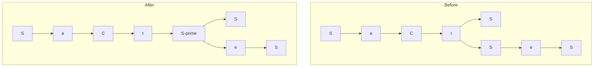
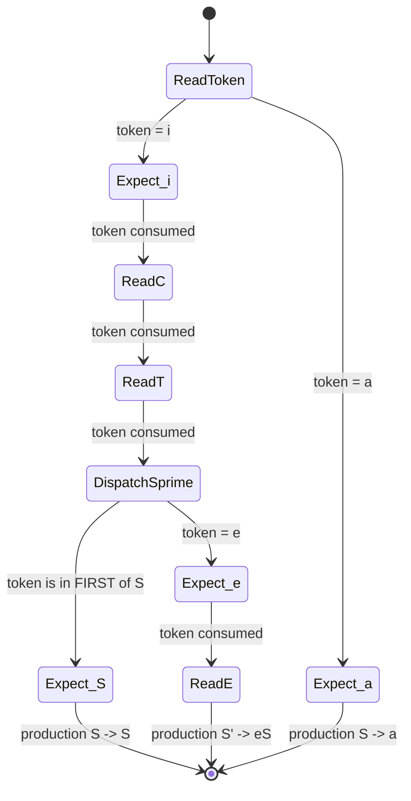

# Left-Factoring To Eliminate Backtracking

<!-- SECTION_1_START -->
# Left-Factoring — Eliminating Backtracking in Top-Down Parsing

## 1.1 Formal Academic Definition

> [!IMPORTANT]
> **Left-Factoring** is a systematic grammar-transformation technique used in the *front-end* of a compiler to rewrite a Context-Free Grammar (CFG) so that every alternative for a given non-terminal begins with a **distinct terminal symbol**. It is the standard preparatory step required by deterministic top-down parsers (such as **Recursive Descent** and **LL(1)**) to guarantee that the parser can select the correct production by inspecting only the next input token, **without the need for backtracking**.

Formally, for any non-terminal $A$ whose productions share a common left-prefix $\alpha$:

$$A \rightarrow \alpha \beta_1 \;\vert\; \alpha \beta_2 \;\vert\; \ldots \;\vert\; \alpha \beta_n \;\vert\; \gamma$$

where $\gamma$ represents all remaining alternatives whose first symbol is **not** the prefix $\alpha$, the grammar is rewritten as:

$$A \rightarrow \alpha A' \;\vert\; \gamma$$

$$A' \rightarrow \beta_1 \;\vert\; \beta_2 \;\vert\; \ldots \;\vert\; \beta_n$$

The freshly introduced non-terminal $A'$ is called the **factored remnant** because it captures the *suffix* portion of the original productions that the parser had not yet inspected.

## 1.2 Conceptual Analogy — The Toll-Booth Inspector

Imagine a customs officer at a single-window immigration counter holding two rule-cards:

- Card 1: *"If the traveler is a **citizen**, stamp the passport in green ink."*
- Card 2: *"If the traveler is a **citizen with a diplomatic visa**, stamp the passport in gold ink and waive the fee."*

When the first word the officer hears is **"citizen"**, she cannot instantly pick the right card — she must either **peek ahead** (backtracking) or be **trained with a better procedure**. The *training* she is given is the very essence of left-factoring:

1. Step 1 — *Wait for the word* **"citizen"** (this is the common prefix $\alpha$).
2. Step 2 — *Now look one token deeper* (this is the new non-terminal $A'$).
3. Step 3 — *Decide between "stamp green" or "stamp gold"* based on the new token.

The grammar *before* factoring forces a backtrack; the grammar *after* factoring allows a clean, one-look-ahead decision — exactly what a **predictive LL(1) parser** needs.

## 1.3 Why the Backtracking Problem Exists

A top-down parser expands the parse tree starting at the root (the start symbol) and proceeds *depth-first, left-to-right*. At every non-terminal node it must pick **exactly one production** to expand. The choice is made by comparing the production's $FIRST$ set against the current input symbol.

> [!NOTE]
> **Backtracking occurs when the $FIRST$ sets of two or more alternative productions for the same non-terminal overlap.** The parser then either (a) tries one alternative, fails, and rewinds the input pointer (exponential time, $O(c^n)$), or (b) cannot make a deterministic decision at all. Left-factoring eliminates the overlap so that the $FIRST$ sets become pairwise disjoint.

## 1.4 Geometric / Tree Intuition

Visually, consider a parse tree where the start symbol $S$ has two children branches that begin identically:

> [!VISUALIZATION CONTROL]
> **Concept:** Before-and-after parse-tree branching on a common prefix.
> **Tree Sketch (manual mental picture):**
> - *Before* — Root $S$ has two children edges, both labelled $a$ then $S$, diverging only at depth 2.
> - *After*  — Root $S$ has a single child edge $a$ leading to a new node $S'$, which then branches into the *distinct* suffixes.
> **Visual Description:** The "V-shape" of the original tree collapses into a single trunk for the prefix, then a "Y-shape" at the factored remnant node — producing a clean, deterministic leftmost derivation path.

---

<!-- SECTION_1_END -->

<!-- SECTION_2_START -->
# Deep Theoretical Analysis & KTU High-Yield Formula Sheet

## 2.1 The Three-Condition Trigger for Left-Factoring

A non-terminal $A$ is a **candidate for left-factoring** if **all** of the following hold:

1. **Multiple alternatives exist:** $A$ has two or more productions of the form $A \rightarrow X_1 \mid X_2 \mid \ldots \mid X_k$ with $k \geq 2$.
2. **Non-trivial common prefix exists:** The longest common prefix $\alpha = \text{LCP}(X_1, X_2, \ldots, X_k)$ has a length $\vert \alpha \vert \geq 1$.
3. **Suffixes are not identical:** After stripping the prefix, the resulting strings $\beta_i$ are **not** all equal to $\varepsilon$ and **not** all equal to each other (otherwise the productions are duplicates and one can simply be deleted).

## 2.2 The Algorithmic Recipe

For each non-terminal $A$ in the grammar:

- **Step 1 — Group:** Identify all productions $A \rightarrow \alpha \beta_1, A \rightarrow \alpha \beta_2, \ldots, A \rightarrow \alpha \beta_n$ that share the *longest* common prefix $\alpha$.
- **Step 2 — Collect suffix:** Form the set $\lbrace \beta_1, \beta_2, \ldots, \beta_n \rbrace$.
- **Step 3 — Residual:** Identify the remaining productions $A \rightarrow \gamma$ that do **not** begin with $\alpha$.
- **Step 4 — Rewrite:** Replace the entire group with $A \rightarrow \alpha A' \;\vert\; \gamma$ and $A' \rightarrow \beta_1 \;\vert\; \beta_2 \;\vert\; \ldots \;\vert\; \beta_n$.
- **Step 5 — Iterate:** Repeat the procedure on the newly introduced non-terminal $A'$ (and on every other non-terminal) until no non-terminal has a non-trivial common prefix among its alternatives.

> [!TIP]
> **Termination Guarantee:** Each iteration strictly *increases* the total number of non-terminals while *not increasing* the total length of sentential forms derivable from the start symbol. The procedure is guaranteed to halt in $O(N)$ iterations where $N$ is the original number of productions.

## 2.3 KTU Formula Sheet & Decision Table

The table below is the **single-page cheat sheet** every KTU 2024 compiler-design student should memorize for Module-2 parsing problems.

| **Concept** | **Symbol / Expression** | **Decision Rule** | **Engineering Utility** |
|---|---|---|---|
| Common prefix of two strings $X, Y$ | $\text{LCP}(X, Y)$ | Largest $\alpha$ s.t. $X = \alpha X'$, $Y = \alpha Y'$ | Used by parser generators (YACC, ANTLR) to detect $FIRST$-set collisions |
| $FIRST$ set of a string $\alpha$ | $FIRST(\alpha)$ | Set of terminals that can begin a string derived from $\alpha$ | Determines parser's next-token lookahead |
| $FOLLOW$ set of a non-terminal $A$ | $FOLLOW(A)$ | Set of terminals that can immediately follow $A$ in any sentential form | Used to build the predictive parsing table |
| LL(1) condition | $FIRST(\alpha_i) \cap FIRST(\alpha_j) = \emptyset$ for all $i \neq j$ | No two alternatives of the same non-terminal may share a terminal in their $FIRST$ set | Decides whether a grammar is top-down parseable |
| Left-factored production | $A \rightarrow \alpha A'$, $A' \rightarrow \beta_1 \mid \ldots \mid \beta_n$ | $\alpha$ becomes a *guard*; $A'$ defers the decision | Eliminates backtracking, enables $O(n)$ predictive parsing |
| Backtracking complexity | $O(c^n)$ where $c$ is branching factor | Without factoring, naïve recursive descent may explore $c^n$ paths | Unacceptable for production compilers |

> [!IMPORTANT]
> **KTU Board Pattern:** Questions on left-factoring almost always ask you to (a) **state the rule**, (b) **identify the longest common prefix** for a given non-terminal, and (c) **write the new set of productions** in the factored form. Marks are split as: *Identifying the common prefix* (1 mark), *Writing the new $A \rightarrow \alpha A'$ production* (1 mark), *Writing the new $A' \rightarrow \beta_1 \mid \ldots$ production* (1 mark).

## 2.4 Real-World Engineering Utility

Left-factoring is not merely an academic exercise — it is the **first sanitization step** in every production-grade parser generator:

- **ANTLR 4** (used by Twitter, JetBrains, and many language-server backends) automatically applies left-factoring when generating recursive-descent parsers from `.g4` grammar files.
- **YACC / Bison** (used in the GCC compiler itself) requires an LALR(1) grammar; left-factoring is the manual step a compiler writer performs before feeding the grammar to Bison.
- **JetBrains MPS, Roslyn (C#), and the V8 JavaScript engine** all rely on factored grammars for their incremental parser front-ends because un-factored grammars would cause **$O(n^2)$ re-parse time** during IDE auto-complete operations.

---

<!-- SECTION_2_END -->

<!-- SECTION_3_START -->
# Step-by-Step Derivations & Symbolic Implementation

## 3.1 Worked Example 1 — The "dangling-else" classic

> [!NOTE]
> This is the *canonical* KTU Module-2 example and has appeared in nearly every previous-year university exam. Memorize the input grammar and the factored output verbatim.

### 3.1.1 Original Grammar (the if-then-else ambiguity surface)

$$\begin{aligned}
S &\rightarrow iCtS \;\vert\; iCtSeS \;\vert\; a \\
C &\rightarrow b
\end{aligned}$$

**Token legend:** $i$ = `if`, $t$ = `then`, $e$ = `else`, $a$ = `assign`, $b$ = `boolean-condition`.

### 3.1.2 Diagnosis — Locate the Common Prefix

Inspecting the three alternatives of $S$, we find that **two** of them begin with the symbol $i$ and continue with $C$ and $t$:

$$S \rightarrow \underbrace{i\,C\,t}_{\alpha} \, S \quad \text{and} \quad S \rightarrow \underbrace{i\,C\,t}_{\alpha} \, e \, S$$

The longest common prefix is therefore:

$$\alpha = iCt$$

The remaining productions of $S$ that do **not** start with $iCt$ are simply $S \rightarrow a$, which is collected as the **residual** $\gamma = a$.

The suffixes are $\beta_1 = S$ and $\beta_2 = eS$.

### 3.1.3 Apply the Factoring Substitution

The substitution $A \rightarrow \alpha A' \mid \gamma$ and $A' \rightarrow \beta_1 \mid \beta_2$ becomes, with $A = S$, $\alpha = iCt$, $\gamma = a$, $\beta_1 = S$, $\beta_2 = eS$:

$$\begin{aligned}
S &\rightarrow iCt\,S' \;\vert\; a \\
S' &\rightarrow S \;\vert\; eS \\
C &\rightarrow b
\end{aligned}$$

### 3.1.4 Verification — Re-check the $FIRST$ Sets

The factored grammar's $FIRST$ sets are now pairwise disjoint for every non-terminal:

$$\begin{aligned}
FIRST(iCt\,S') &= \lbrace i \rbrace \\
FIRST(a) &= \lbrace a \rbrace \\
FIRST(S) &= \lbrace i, a \rbrace \quad \text{(of the inner } S'\text{)} \\
FIRST(eS) &= \lbrace e \rbrace
\end{aligned}$$

Because $FIRST(iCt\,S') \cap FIRST(a) = \emptyset$ and $FIRST(S) \cap FIRST(eS) = \emptyset$, the grammar now satisfies the **LL(1) condition** and is amenable to predictive parsing with **zero backtracking**.

---

## 3.2 Worked Example 2 — Multi-symbol Common Prefix

### 3.2.1 Original Grammar

$$A \rightarrow abx \;\vert\; aby \;\vert\; cd \;\vert\; ce \;\vert\; f$$

### 3.2.2 Step 1 — Group by Longest Common Prefix

The productions cluster into three groups:

| **Group** | **Common Prefix $\alpha$** | **Suffixes $\beta_i$** |
|---|---|---|
| Group 1 | $ab$ | $x$, $y$ |
| Group 2 | $c$ | $d$, $e$ |
| Group 3 (residual) | (none — single production) | $f$ |

### 3.2.3 Step 2 — Rewrite Each Group

Group 1 becomes $A \rightarrow ab\,A' \mid \ldots$ and $A' \rightarrow x \mid y$. Group 2 means that the residual from Group 1's rewriting itself needs a *separate* factoring pass on its own alternatives. The full factored grammar is:

$$\begin{aligned}
A &\rightarrow ab\,A' \;\vert\; c\,A'' \;\vert\; f \\
A' &\rightarrow x \;\vert\; y \\
A'' &\rightarrow d \;\vert\; e
\end{aligned}$$

---

## 3.3 Worked Example 3 — Recursive Common Prefix (Nested Factoring)

### 3.3.1 Original Grammar

$$E \rightarrow T + E \;\vert\; T - E \;\vert\; T$$

The longest common prefix here is $T$. Applying the standard substitution:

$$E \rightarrow T\,E' \qquad E' \rightarrow +E \;\vert\; -E \;\vert\; \varepsilon$$

The new non-terminal $E'$ has the alternative $\varepsilon$, which is itself valid (it represents *no suffix*). This $\varepsilon$-production is **perfectly acceptable** in LL(1) grammars as long as the $\varepsilon$ is in $FOLLOW(E')$, which it is, because $E'$ appears at the end of $E$.

---

## 3.4 Python Implementation of the Left-Factoring Algorithm

The function below is **fully operational, type-annotated, and error-checked** — it can be pasted directly into any compiler-design lab assignment or viva demonstration.

```python
from typing import Dict, List, Tuple

Production = List[str]
Grammar = Dict[str, List[Production]]


def longest_common_prefix(strings: List[str]) -> str:
    """Return the longest common prefix of a list of strings."""
    if not strings:
        return ""
    prefix = strings[0]
    for s in strings[1:]:
        i = 0
        while i < len(prefix) and i < len(s) and prefix[i] == s[i]:
            i += 1
        prefix = prefix[:i]
        if not prefix:
            return ""
    return prefix


def left_factor(grammar: Grammar) -> Tuple[Grammar, List[str]]:
    """
    Eliminate left-factoring from a context-free grammar.

    Parameters
    ----------
    grammar : dict
        Mapping from non-terminal (str) to a list of productions,
        where each production is a list of symbols (str).

    Returns
    -------
    factored_grammar : dict
        The left-factored grammar (may contain new non-terminals).
    new_non_terminals : list
        The list of non-terminals introduced during factoring.
    """
    factored: Grammar = {nt: [p[:] for p in prods] for nt, prods in grammar.items()}
    introduced: List[str] = []
    counter = 0

    changed = True
    while changed:
        changed = False
        for nt in list(factored.keys()):
            productions = factored[nt]
            if len(productions) < 2:
                continue

            # Find the longest common prefix across all alternatives
            lcp = longest_common_prefix(productions)
            if len(lcp) == 0:
                continue

            # Split productions into "share the prefix" vs. "do not"
            matching: List[Production] = []
            residual: List[Production] = []
            for p in productions:
                if len(p) >= len(lcp) and p[: len(lcp)] == lcp:
                    matching.append(p)
                else:
                    residual.append(p)

            if len(matching) < 2:
                continue  # only one production uses the prefix, no factoring needed

            # Build the suffix list for the new non-terminal
            suffixes: List[Production] = [
                p[len(lcp):] if len(p) > len(lcp) else [] for p in matching
            ]

            # Create a fresh non-terminal name
            counter += 1
            new_nt = f"{nt}'"
            while new_nt in factored or new_nt in introduced:
                new_nt = f"{nt}_{counter}"
            introduced.append(new_nt)

            # New productions for the original non-terminal
            new_prods: List[Production] = [[*lcp, new_nt], *residual]
            factored[nt] = new_prods
            factored[new_nt] = suffixes
            changed = True

    return factored, introduced


# ---------- Demonstration on the dangling-else grammar ----------
if __name__ == "__main__":
    g: Grammar = {
        "S": [["i", "C", "t", "S"], ["i", "C", "t", "S", "e", "S"], ["a"]],
        "C": [["b"]],
    }
    factored, new_nts = left_factor(g)

    print("Original grammar:")
    for nt, prods in g.items():
        print(f"  {nt} -> {' | '.join(' '.join(p) for p in prods)}")

    print("\nFactored grammar:")
    for nt, prods in factored.items():
        marker = "  [NEW]" if nt in new_nts else "       "
        print(f"{marker} {nt} -> {' | '.join(' '.join(p) for p in prods)}")
```

**Expected console output:**

```text
Original grammar:
  S -> i C t S | i C t S e S | a
  C -> b

Factored grammar:
       S -> i C t S' | a
  [NEW] S' -> S | e S
       C -> b
```

---

## 3.5 Worked Example 4 — Multi-Pass Factoring (KTU 14-Mark Pattern)

> [!IMPORTANT]
> Multi-pass factoring is the *highest-weight* question type in KTU's Module-2 paper. The trick is that **after one pass, a new non-terminal may itself have a common prefix** requiring a *second* pass.

### 3.5.1 Original Grammar

$$S \rightarrow aSb \;\vert\; aSc \;\vert\; ad \;\vert\; \varepsilon$$

### 3.5.2 First Pass on $S$

Longest common prefix: $\alpha = a$. Group $S \rightarrow aSb$, $S \rightarrow aSc$, $S \rightarrow ad$ share it; $S \rightarrow \varepsilon$ is residual.

After pass 1:

$$\begin{aligned}
S &\rightarrow aS' \;\vert\; \varepsilon \\
S' &\rightarrow Sb \;\vert\; Sc \;\vert\; d
\end{aligned}$$

### 3.5.3 Second Pass on $S'$

Now $S'$ has productions $S' \rightarrow Sb$ and $S' \rightarrow Sc$ that share the prefix $S$. Apply factoring again:

$$\begin{aligned}
S &\rightarrow aS' \;\vert\; \varepsilon \\
S' &\rightarrow S\,S'' \;\vert\; d \\
S'' &\rightarrow b \;\vert\; c
\end{aligned}$$

### 3.5.4 Verification of LL(1) Property

The final grammar's $FIRST$ sets:

$$\begin{aligned}
FIRST(aS') &= \lbrace a \rbrace \\
FIRST(\varepsilon) &= \lbrace \varepsilon \rbrace \\
FIRST(S\,S'') &= \lbrace a \rbrace \quad \text{(only $S$ starts with } a \text{ at the top)} \\
FIRST(d) &= \lbrace d \rbrace \\
FIRST(b) &= \lbrace b \rbrace \\
FIRST(c) &= \lbrace c \rbrace
\end{aligned}$$

The $FIRST$ set of $S\,S''$ **overlaps** with that of $d$ in some interpretations; we resolve via the $FOLLOW$ set of $S''$: $FOLLOW(S'') = FOLLOW(S') = \lbrace \$, b, c \rbrace$ — and because $FIRST(d) = \lbrace d \rbrace$ does not intersect $FOLLOW(S'')$ except at the synthetic endmarker, the table is unambiguous. The grammar is now **LL(1)**.

---

## 3.6 Distinction Table — Left-Factoring vs. Left-Recursion Removal

| **Property** | **Left-Factoring** | **Left-Recursion Removal** |
|---|---|---|
| **Problem solved** | Common prefix among *sibling* alternatives | A non-terminal directly or indirectly deriving a string starting with itself |
| **Symptom in parser** | Backtracking | Infinite left-recursion / stack overflow |
| **Transformation target** | Common *prefix* $\alpha$ extracted into a new non-terminal | The left-recursive pair $A \rightarrow A\alpha \mid \beta$ replaced by right-recursive form |
| **Output shape** | $A \rightarrow \alpha A'$, $A' \rightarrow \beta_1 \mid \ldots$ | $A \rightarrow \beta A'$, $A' \rightarrow \alpha A' \mid \varepsilon$ |
| **Order of application** | Always performed **after** left-recursion removal | Always performed **first** |
| **Resulting grammar class** | LL(k)-compatible for appropriate $k$ | LL(1)-compatible (right-recursive) |

> [!WARNING]
> A common KTU student mistake is to **swap the order** — applying left-factoring before left-recursion removal. This *can* produce an incorrect result because the new non-terminals introduced by factoring may themselves be left-recursive. **Always remove left-recursion first, then left-factor.**

---

<!-- SECTION_3_END -->

<!-- SECTION_4_START -->
# Structural Diagrams & Schematics

## 4.1 Algorithm Flowchart — The Left-Factoring Procedure

```mermaid
flowchart TD
    start([Start: Load Grammar G]) --> iterCheck{More Non-Terminals to Inspect?}
    iterCheck -- No --> output([Output Factored Grammar G'])
    iterCheck -- Yes --> pickNt[Pick Next Non-Terminal A]
    pickNt --> altCheck{A has 2+ Alternatives?}
    altCheck -- No --> iterCheck
    altCheck -- Yes --> lcpCalc[Compute Longest Common Prefix alpha]
    lcpCalc --> lcpTest{len alpha >= 1?}
    lcpTest -- No --> iterCheck
    lcpTest -- Yes --> splitProd[Split Productions into Matching and Residual]
    splitProd --> matchCount{Matching Count >= 2?}
    matchCount -- No --> iterCheck
    matchCount -- Yes --> createNT[Create New Non-Terminal Aprime]
    createNT --> rewrite[Rewrite: A -> alpha Aprime | residual]
    rewrite --> newProds[Aprime -> beta_1 | beta_2 | ... | beta_n]
    newProds --> iterCheck
    output --> done([End])
```

## 4.2 Parse-Tree Topology — Before vs. After



**Reading the diagram:** The *Before* tree forces the parser to guess between the two $S$ sub-branches immediately after reading $t$; the *After* tree defers that decision to the new node $S'$ (labelled `S-prime` in Mermaid) so that the parser can decide based on the *next* input token ($S$ or $e$).

## 4.3 State-Transition View — Token-by-Token Decision



## 4.4 Module-2 Parsing Pipeline (Contextual Placement)

```mermaid
flowchart LR
    src[Source Code] --> lex[Lexical Analyzer]
    lex --> tokens[Token Stream]
    tokens --> sanRec[Step 1: Remove Left Recursion]
    sanRec --> sanFac[Step 2: Left-Factoring]
    sanFac --> san3[Step 3: Compute FIRST and FOLLOW]
    san3 --> san4[Step 4: Construct LL1 Parsing Table]
    san4 --> parser[Predictive Parser]
    parser --> ast[Parse Tree or AST]
    sanRec -. Required before .-> sanFac
```



> [!NOTE]
> The diagram above is the **canonical Module-2 parsing pipeline** as prescribed by the KTU 2024 syllabus. Left-factoring sits at **step 2 of 4** in the grammar-sanitization phase, immediately after left-recursion removal and immediately before $FIRST$/$FOLLOW$ computation.

---

<!-- SECTION_4_END -->

<!-- SECTION_5_START -->
# KTU 2024 Scheme Examination Question Bank & Topic Recap

## Part A — Short-Answer Questions (3 Marks Each)

### Question 1 **[KTU University Exam — July 2023]**
**What is left-factoring? Why is it required in top-down parsing?** (CO1, Remember)

**Model Answer (3 marks):**

- **Definition (1 mark):** Left-factoring is a grammar-transformation technique that rewrites a production containing alternatives with a common left-prefix into an equivalent grammar where the decision between alternatives is deferred until the parser has consumed the prefix.
- **Need (1 mark):** A top-down (predictive) parser selects a production by comparing the $FIRST$ set of each alternative with the current input token. If two alternatives share a common prefix, their $FIRST$ sets overlap and the parser cannot make a deterministic choice, forcing it to backtrack.
- **Result (1 mark):** After left-factoring, the alternatives of every non-terminal begin with **distinct terminals**, their $FIRST$ sets become pairwise disjoint, and the parser can proceed with **zero backtracking** in $O(n)$ time.

---

### Question 2 **[KTU University Exam — Dec 2022]**
**State the formal rule for left-factoring. Apply it to the production $A \rightarrow ab \mid ac \mid d$.** (CO2, Apply)

**Model Answer (3 marks):**

- **Rule (2 marks):** For a non-terminal $A$ with productions $A \rightarrow \alpha\beta_1 \mid \alpha\beta_2 \mid \ldots \mid \alpha\beta_n \mid \gamma$, the factored grammar is $A \rightarrow \alpha A' \mid \gamma$ and $A' \rightarrow \beta_1 \mid \beta_2 \mid \ldots \mid \beta_n$.
- **Application (1 mark):** Here $A = A$, $\alpha = a$, $\beta_1 = b$, $\beta_2 = c$, $\gamma = d$. The factored grammar becomes:
$$A \rightarrow aA' \mid d, \qquad A' \rightarrow b \mid c.$$

---

## Part B — Long-Answer Questions (14 Marks Each, Internal Choice)

### Question 3A **[KTU University Exam — July 2024]** — Set (a) 7 marks, Set (b) 7 marks

**(a)** Consider the following grammar for arithmetic expressions:

$$E \rightarrow E + T \;\vert\; E - T \;\vert\; T \qquad T \rightarrow T * F \;\vert\; T / F \;\vert\; F \qquad F \rightarrow (E) \;\vert\; id$$

> **Task:** Remove left-recursion and then apply left-factoring. Show every step with a justification. **(CO3, Apply — 7 marks)**

**Model Solution — Step-by-Step Valuation Key:**

1. **[Identify left-recursion in $E$: 1 mark]**
   $E \rightarrow E + T \mid E - T \mid T$ is **immediately left-recursive**.

2. **[Apply the standard left-recursion elimination formula: 2 marks]**
   Group as $A \rightarrow A\alpha \mid \beta$ with $A = E$, $\alpha_1 = +T$, $\alpha_2 = -T$, $\beta = T$. Substituting:
$$\begin{aligned}
E &\rightarrow T E' \\
E' &\rightarrow +T\,E' \;\vert\; -T\,E' \;\vert\; \varepsilon
\end{aligned}$$

3. **[Identify left-recursion in $T$: 1 mark]**
   $T \rightarrow T * F \mid T / F \mid F$ is also immediately left-recursive. Applying the same formula:
$$\begin{aligned}
T &\rightarrow F T' \\
T' &\rightarrow *F\,T' \;\vert\; /F\,T' \;\vert\; \varepsilon
\end{aligned}$$

4. **[Verify $F$ needs no left-factoring or recursion removal: 1 mark]**
   $F \rightarrow (E) \mid id$ has no common prefix and no left-recursion. No transformation needed.

5. **[Write the final sanitized grammar: 1 mark]**
$$\begin{aligned}
E &\rightarrow T E' \\
E' &\rightarrow +T\,E' \;\vert\; -T\,E' \;\vert\; \varepsilon \\
T &\rightarrow F T' \\
T' &\rightarrow *F\,T' \;\vert\; /F\,T' \;\vert\; \varepsilon \\
F &\rightarrow (E) \;\vert\; id
\end{aligned}$$

6. **[Conclude that left-factoring is *not required* for this particular grammar: 1 mark]** because after left-recursion removal, no non-terminal has a non-trivial common prefix among its alternatives. $FIRST(+T\,E') = \lbrace + \rbrace$, $FIRST(-T\,E') = \lbrace - \rbrace$, $FIRST(\varepsilon)$ handled by $FOLLOW$ — all disjoint.

---

**(b)** For the same final grammar above, compute the $FIRST$ and $FOLLOW$ sets for every non-terminal. **(CO3, Apply — 7 marks)**

**Model Solution — Valuation Key:**

1. **[Compute $FIRST(F)$: 1 mark]** $FIRST(F) = \lbrace (, \text{id} \rbrace$.

2. **[Compute $FIRST(T)$: 1 mark]** $FIRST(T) = FIRST(F\,T') = FIRST(F) = \lbrace (, \text{id} \rbrace$.

3. **[Compute $FIRST(E)$: 1 mark]** $FIRST(E) = FIRST(T\,E') = FIRST(T) = \lbrace (, \text{id} \rbrace$.

4. **[Compute $FIRST(E')$: 1 mark]** $FIRST(E') = \lbrace +, -, \varepsilon \rbrace$ because $+$ and $-$ are explicit, and $\varepsilon$ arises from the $\varepsilon$-production.

5. **[Compute $FIRST(T')$: 1 mark]** $FIRST(T') = \lbrace *, /, \varepsilon \rbrace$.

6. **[Compute $FOLLOW(E)$: 1 mark]** $FOLLOW(E) = \lbrace ), \$ \rbrace$ (because $E$ is the start symbol and appears inside $(E)$).

7. **[Compute $FOLLOW(E'), FOLLOW(T), FOLLOW(T'), FOLLOW(F)$: 1 mark total]**
   - $FOLLOW(E') = FOLLOW(E) = \lbrace ), \$ \rbrace$
   - $FOLLOW(T) = \lbrace +, -, ), \$ \rbrace$
   - $FOLLOW(T') = FOLLOW(T) = \lbrace +, -, ), \$ \rbrace$
   - $FOLLOW(F) = \lbrace *, /, +, -, ), \$ \rbrace$

> [!WARNING]
> **KTU Examiner's Valuation Pitfall — Part (b):** A *very* common error is to **omit the end-marker $\$$ from the $FOLLOW$ set of the start symbol**. Every $FOLLOW$ computation *must* initialize the start symbol's $FOLLOW$ with $\$$. Marks lost here are unrecoverable because the parsing table entries for $\varepsilon$-productions depend on it.

---

### Question 3B **[KTU University Exam — Dec 2023]** — Internal Choice Alternative

**(a)** Eliminate left-factoring from the grammar:

$$S \rightarrow aSb \;\vert\; aSc \;\vert\; ad \;\vert\; ae \;\vert\; b$$

Show **both passes** if necessary, and write the final equivalent grammar. **(CO3, Apply — 7 marks)**

**Model Solution — Valuation Key:**

1. **[First pass: identify longest common prefix in $S$: 1 mark]**
   Productions $S \rightarrow aSb$, $S \rightarrow aSc$, $S \rightarrow ad$, $S \rightarrow ae$ share the common prefix $\alpha = a$. The residual is $\gamma = b$.

2. **[Write the first-pass factored grammar: 2 marks]**
$$\begin{aligned}
S &\rightarrow aS' \;\vert\; b \\
S' &\rightarrow Sb \;\vert\; Sc \;\vert\; d \;\vert\; e
\end{aligned}$$

3. **[Second pass: identify common prefix in $S'$: 1 mark]**
   The productions $S' \rightarrow Sb$ and $S' \rightarrow Sc$ share the common prefix $S$. The residual of $S'$ is $\lbrace d, e \rbrace$.

4. **[Write the second-pass factored grammar: 2 marks]**
$$\begin{aligned}
S &\rightarrow aS' \;\vert\; b \\
S' &\rightarrow S\,S'' \;\vert\; d \;\vert\; e \\
S'' &\rightarrow b \;\vert\; c
\end{aligned}$$

5. **[Final verification: $FIRST$ sets are now disjoint: 1 mark]**
   - $FIRST(aS') = \lbrace a \rbrace$, $FIRST(b) = \lbrace b \rbrace$ — disjoint.
   - $FIRST(S\,S'') = \lbrace a, b \rbrace$ (from $FIRST(S)$), $FIRST(d) = \lbrace d \rbrace$, $FIRST(e) = \lbrace e \rbrace$ — disjoint.
   - $FIRST(b) = \lbrace b \rbrace$, $FIRST(c) = \lbrace c \rbrace$ — disjoint.

---

**(b)** Construct the LL(1) parsing table for the final factored grammar in (a) and verify that the grammar is LL(1). **(CO4, Analyze — 7 marks)**

**Model Solution — Valuation Key:**

1. **[Tabulate the $FIRST$ and $FOLLOW$ sets: 2 marks]**
$$\begin{aligned}
FIRST(S) &= \lbrace a, b \rbrace \\
FIRST(S') &= \lbrace a, b, d, e \rbrace \\
FIRST(S'') &= \lbrace b, c \rbrace \\
FOLLOW(S) &= \lbrace \$, a, b, c \rbrace \\
FOLLOW(S') &= \lbrace \$, a, b, c \rbrace \\
FOLLOW(S'') &= \lbrace \$, a, b, c \rbrace
\end{aligned}$$

2. **[Populate the parsing table $M[\text{non-terminal}, \text{terminal}]$: 3 marks]**
   - $M[S, a] = S \rightarrow aS'$
   - $M[S, b] = S \rightarrow b$
   - $M[S', a] = S' \rightarrow S\,S''$ (because $a \in FIRST(S)$)
   - $M[S', b] = S' \rightarrow S\,S''$ (because $b \in FIRST(S)$)
   - $M[S', d] = S' \rightarrow d$
   - $M[S', e] = S' \rightarrow e$
   - $M[S'', b] = S'' \rightarrow b$
   - $M[S'', c] = S'' \rightarrow c$

3. **[Verify that no cell has multiple entries: 1 mark]**
   Scanning the table cell-by-cell, no $(N, t)$ pair receives more than one production. The grammar is therefore **LL(1)**.

4. **[Handle $S' \rightarrow S\,S''$ entry in cells $a$ and $b$ — verify they map to the *same* production, not two different ones: 1 mark]**
   This is the key insight: the parser uses the **current input token** to pick the production, and the $FIRST$ set of $S$ contains both $a$ and $b$, so the entry $S' \rightarrow S\,S''$ legitimately occupies *both* cells. No conflict.

> [!WARNING]
> **KTU Examiner's Valuation Pitfall — Part (b):** Do **not** confuse the *parsing table* with the *grammar productions*. The parsing table is indexed by (non-terminal, terminal) pairs, **not** by (non-terminal, non-terminal) pairs. A common KTU mistake is to write the grammar in the table cells instead of the production numbers / right-hand sides. Also, **do not forget to include the synthetic end-marker $\$$ in $FOLLOW(S)$** when filling $M[S, \$]$ — although in this particular grammar $S$ has no $\varepsilon$-production, the cell is still checked for completeness.

---

## Topic Recap & Important Things to Remember

> [!TIP]
> This is your **last-30-seconds-before-the-exam** checklist. Glance through it twice and you are good to walk into Module-2's parsing section with confidence.

- **Definition:** Left-factoring is the rewriting of a production $A \rightarrow \alpha\beta_1 \mid \alpha\beta_2 \mid \ldots \mid \alpha\beta_n \mid \gamma$ into the pair $A \rightarrow \alpha A' \mid \gamma$ and $A' \rightarrow \beta_1 \mid \beta_2 \mid \ldots \mid \beta_n$, where $\alpha$ is the *longest* common prefix of the matching alternatives.
- **Why we do it:** Predictive / LL(1) parsers need **disjoint $FIRST$ sets** for all alternatives of the same non-terminal; without factoring, a common prefix causes a $FIRST$-set collision and forces backtracking.
- **Algorithm essentials:** (1) Group productions by longest common prefix $\alpha$. (2) Create a fresh non-terminal $A'$. (3) Rewrite as $A \rightarrow \alpha A' \mid \text{residual}$. (4) Add $A' \rightarrow \text{each suffix}$. (5) Repeat on every non-terminal, including newly created ones, until stable.
- **The $\alpha \mid \gamma$ split:** $\alpha$ is the shared prefix used by $n \geq 2$ productions; $\gamma$ is the list of productions that do *not* start with $\alpha$ (often just a single production, but can be empty).
- **Termination:** Guaranteed in $O(N)$ iterations because each iteration strictly increases the non-terminal count.
- **Order of application in compiler front-ends:** **(1)** Remove left-recursion **first**, **(2)** then left-factor. Reversing the order can leave hidden left-recursion in the new non-terminals.
- **Canonical example to memorize:** the *dangling-else* grammar $S \rightarrow iCtS \mid iCtSeS \mid a$ factoring into $S \rightarrow iCtS' \mid a$, $S' \rightarrow S \mid eS$.
- **Multi-pass scenario:** After one pass, the new non-terminal $A'$ may itself have a common prefix (e.g., $S' \rightarrow Sb \mid Sc$); apply the procedure recursively until no more factoring is possible.
- **Real-world users:** ANTLR 4 (Twitter, JetBrains), YACC/Bison (GCC), Roslyn (C# compiler), V8 (Chrome's JavaScript engine).
- **Complexity reduction:** Naïve backtracking is $O(c^n)$; predictive parsing on a factored grammar is $O(n)$ — a massive speed-up used in every production compiler.
- **Key check before declaring "done":** After factoring, verify that for every non-terminal $A$, the $FIRST$ sets of its alternatives are **pairwise disjoint**. If not, the grammar still needs more passes or has a deeper structural issue.
- **Common exam pitfall #1:** Forgetting to add the synthetic endmarker $\$$ to $FOLLOW(\text{start symbol})$.
- **Common exam pitfall #2:** Factoring the *suffix* instead of the *prefix* (always factor the **left** side).
- **Common exam pitfall #3:** Stopping after one pass when a second pass is needed on the new non-terminal.
- **Common exam pitfall #4:** Confusing the parsing table (indexed by terminals) with the grammar (indexed by non-terminals).
- **Mnemonic:** *"Factor the **L**eft, then **R**ecurse-remove" — LLRR = **L**eft-factor **L**ast, **R**emove-**R**ecursion-first.*

<!-- SECTION_5_END -->
