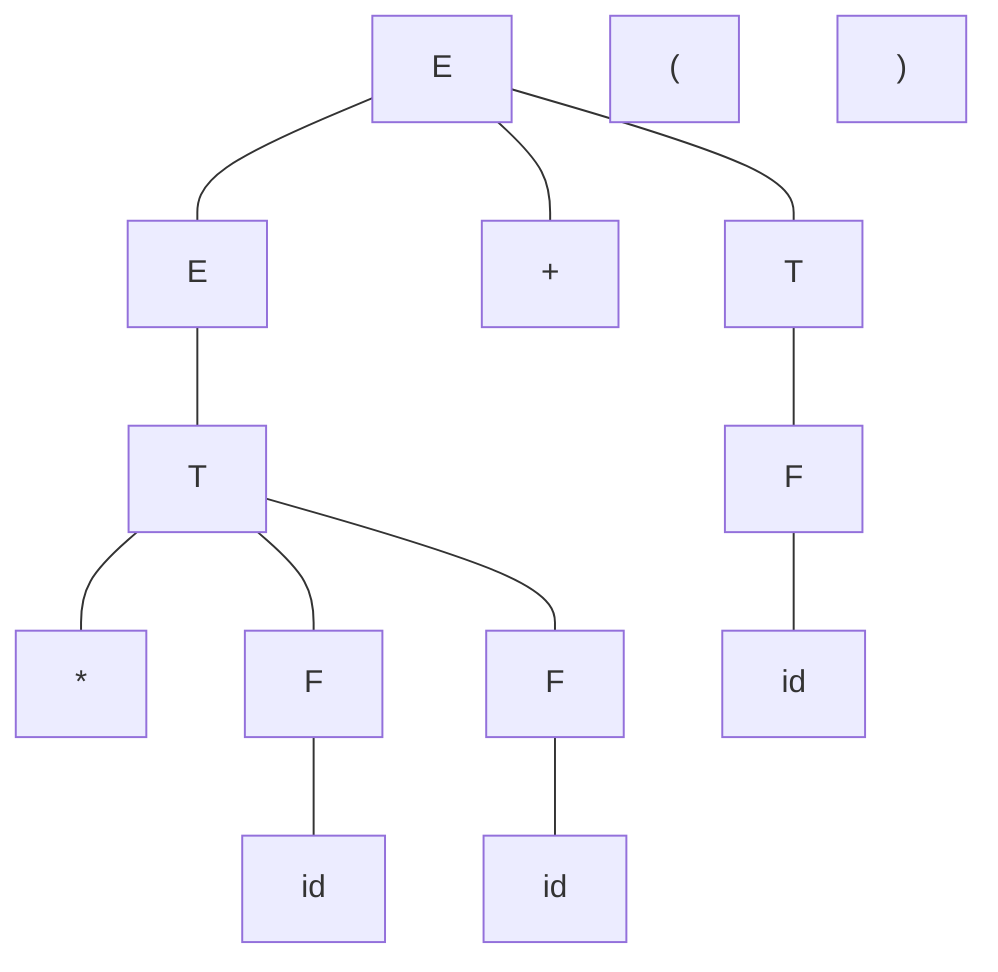
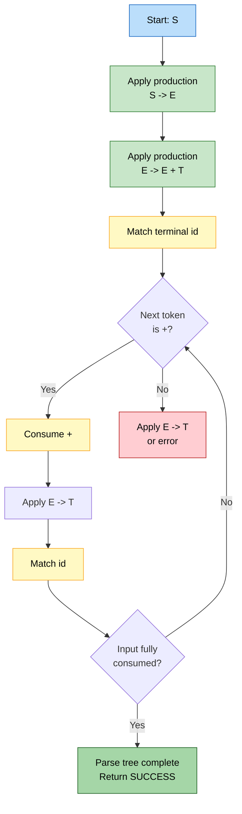
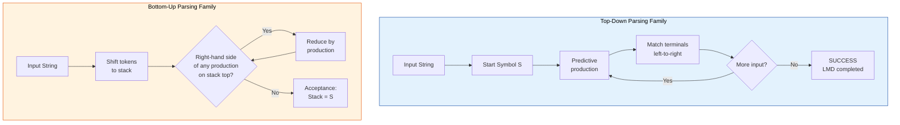
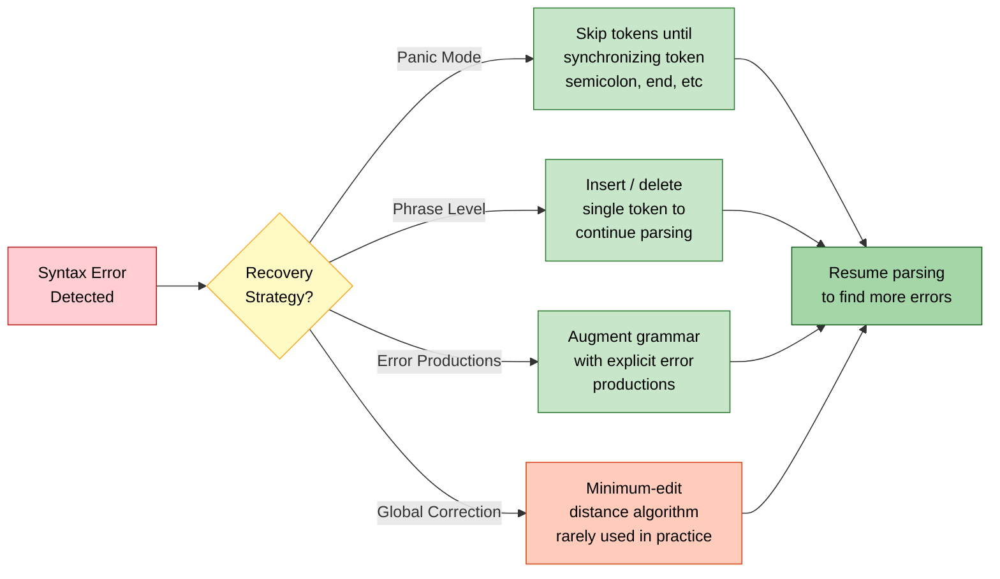
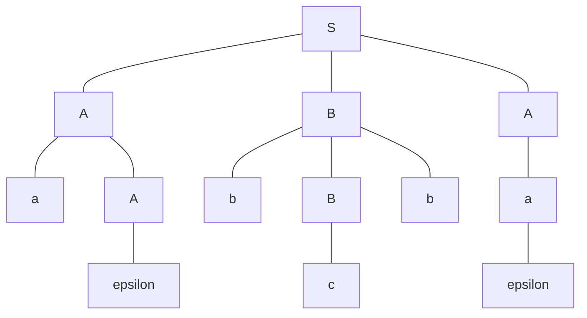
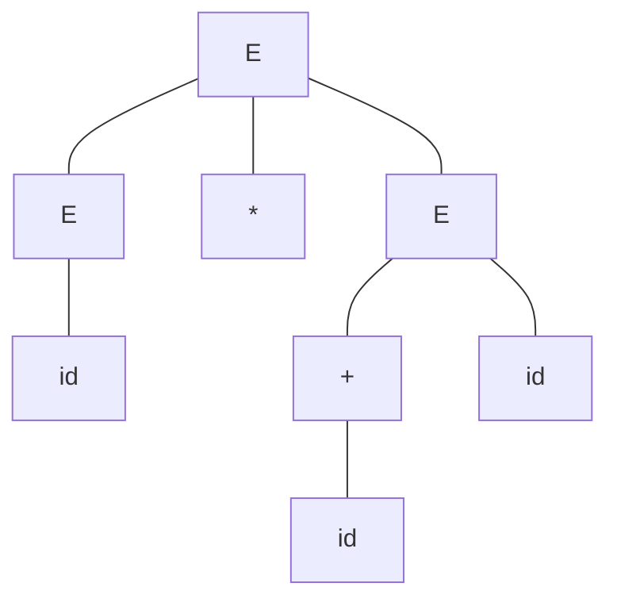
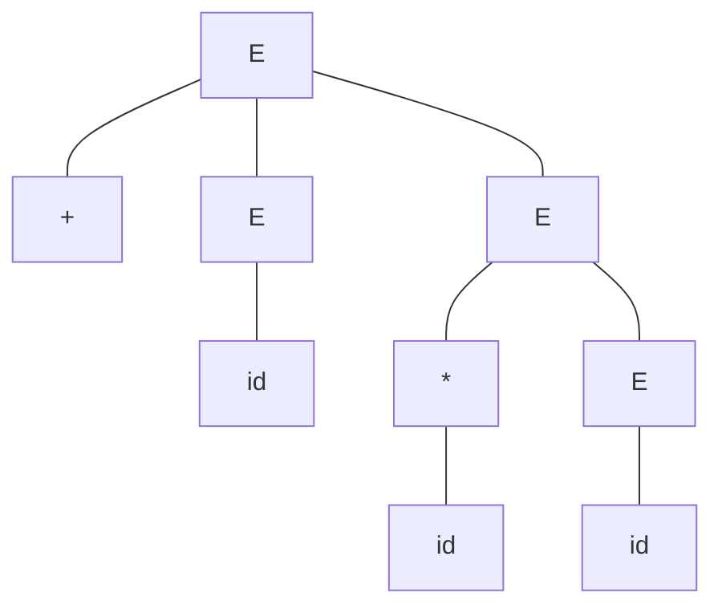

# Parsing - Introduction

<!-- SECTION_1_START -->
# Parsing — Introduction

## 1. Core Technical Definition

> [!IMPORTANT]
> **Parsing (Syntax Analysis)** is the second phase of a compiler that takes the **token stream** produced by the lexical analyzer as input and produces a **parse tree** (or syntax tree) representing the **syntactic structure** of the source program, as defined by the rules of a **Context-Free Grammar (CFG)**.

A **parser** is the software component (or compiler phase) that performs this analysis. The formal mathematical tool used to describe the syntax of programming languages is the **Context-Free Grammar (CFG)**, originally formalized by **Noam Chomsky (1956)** as part of his hierarchy of formal grammars.

> [!NOTE]
> **KTU 2024 Syllabus Directive:** Parsing forms the **Module 2 foundation** of Compiler Design (PCCST601). Students must master CFG notation, derivations, parse trees, and ambiguity before progressing to Top-Down (LL) and Bottom-Up (LR) parsing strategies.

### Formal Definition of a Context-Free Grammar

A **Context-Free Grammar** $G$ is a **4-tuple**:

$$
G = (V, T, P, S)
$$

where:
- $V$ is a finite set of **non-terminals** (syntactic variables, conventionally written in **uppercase** Roman letters, e.g., $E$, $T$, $F$).
- $T$ is a finite set of **terminals** (tokens / vocabulary, e.g., $\text{id}$, $+$, $*$, $($ , $)$).
- $P$ is a finite set of **production rules** of the form $A \rightarrow \alpha$, where $A \in V$ and $\alpha \in (V \cup T)^{*}$.
- $S \in V$ is the designated **start symbol** (root of derivation).

The **language generated** by $G$ is the set of all terminal strings derivable from $S$:

$$
L(G) = \left\{ w \in T^{*} \;\middle|\; S \Rightarrow^{*} w \right\}
$$

### Conceptual Analogy — The Linguist's View

> [!TIP]
> **Real-world analogy:** Imagine a **sentence diagram** from an English grammar textbook. When you read *"The cat sat on the mat,"* you do not merely memorize the words — your brain instantly identifies a *subject* ("The cat"), a *verb phrase* ("sat on the mat"), and a *prepositional phrase* ("on the mat"). This hierarchical grouping is exactly what a parser does with programming language tokens. A token stream like $\text{id} + \text{id} * \text{id}$ is the raw word list; the parser constructs the underlying "sentence diagram" (parse tree) that proves the input is grammatically valid.

### Position of the Parser in the Compiler Pipeline

> [!VISUALIZATION CONTROL]
> **Concept:** Token flow into the parser and parse-tree output
> **Workflow Description:** Lexical Analyzer emits a stream of tokens $\rightarrow$ **Parser** consumes them, verifies CFG compliance, and emits a parse tree. Semantic Analyzer and Intermediate Code Generator follow downstream.

The parser sits between the **lexical analyzer** and the **semantic analyzer** in the classical **front-end** of a compiler. It receives a sequence of **lexemes (tokens)** and must decide whether they form a **valid sentence** of the language defined by the grammar.

| Aspect | Lexical Analyzer | **Syntax Analyzer (Parser)** |
| :--- | :--- | :--- |
| Input | Character stream | Token stream |
| Output | Tokens (with attributes) | Parse tree / Syntax tree |
| Grammar | Regular expressions | **Context-Free Grammar** |
| Tool | Finite Automaton (DFA/NFA) | **Pushdown Automaton** |
| Speed | Fast (linear scan) | Slower (recursive / stack-based) |

### Why Pushdown Automata?

Context-free languages **cannot** be recognized by finite automata alone because they require matching arbitrarily deep nesting (e.g., balanced parentheses $\Rightarrow$ requires unbounded memory). Hence, parsers use a **stack** — the data structure of a **Pushdown Automaton (PDA)**.

### Three Universal Tasks of Any Parser

Every parser, regardless of strategy, must execute three logical operations:

1. **Recognition** — Decide whether the input token stream belongs to $L(G)$.
2. **Tree Construction** — Build an explicit **parse tree** that records the grammatical structure.
3. **Error Reporting** — Detect the **first syntactic violation** clearly and attempt **recovery** to continue finding further errors.

<!-- SECTION_1_END -->

<!-- SECTION_2_START -->
# Deep Theoretical Analysis & KTU High-Yield Formula Sheet

## 2. Grammar Formalism — The Mathematical Backbone

### 2.1 Notational Conventions Used Throughout KTU Boards

| Symbol | Meaning | Example |
| :--- | :--- | :--- |
| Uppercase letters $(E, T, F, S, A, B)$ | **Non-terminals** | $E \rightarrow E + T$ |
| Lowercase letters $(a, b, c)$ | **Terminals** | $a, b, c \in T$ |
| Greek letters $(\alpha, \beta, \gamma)$ | **Sentential forms** (mix of terminals and non-terminals) | $\alpha \in (V \cup T)^{*}$ |
| $\Rightarrow$ | **Derives in one step** (yields) | $E \Rightarrow E + T$ |
| $\Rightarrow^{+}$ | **Derives in one or more steps** | $E \Rightarrow^{+} \text{id} + \text{id}$ |
| $\Rightarrow^{*}$ | **Derives in zero or more steps** | $E \Rightarrow^{*} E$ |
| $\vert$ | **OR** (alternative production) | $E \rightarrow E + T \;\vert\; T$ |
| $\epsilon$ | **Empty / Null string** | $A \rightarrow \epsilon$ |

> [!IMPORTANT]
> **KTU Board Tip:** Always write productions with the start symbol $S$ (or its equivalent $E$ for expressions) as the **left-hand side of the first production** to maintain a neat structure during valuation.

### 2.2 Derivations — The Heart of Parsing

A **derivation** is a sequence of rewriting steps that expands the start symbol into a string of terminals (and possibly non-terminals). There are two principal varieties.

#### 2.2.1 Leftmost Derivation (LMD)

At each step, the **leftmost non-terminal** in the current sentential form is replaced.

$$
S \Rightarrow \alpha_{1} \Rightarrow \alpha_{2} \Rightarrow \cdots \Rightarrow w
$$

#### 2.2.2 Rightmost Derivation (RMD)

At each step, the **rightmost non-terminal** is replaced. The reverse of an RMD is called a **right-sentential form reduction** — this is precisely what **bottom-up parsers** (LR family) execute.

> [!NOTE]
> **Why this matters in KTU:** Top-down parsers simulate **leftmost derivations**; bottom-up parsers simulate **reverse rightmost derivations**. Recognizing this duality is the key conceptual link.

### 2.3 Parse Trees — Geometric Representation of Derivations

A **parse tree** (also called a **concrete syntax tree**) is a rooted, ordered tree where:
- The **root** is the start symbol $S$.
- **Internal nodes** are non-terminals.
- **Leaf nodes** (read left-to-right) form the **yield** (the derived terminal string).
- Each internal node and its children correspond to one production application.

> [!TIP]
> **Parse Tree vs Syntax Tree:** A *parse tree* contains every grammar symbol including redundant non-terminals and chain productions. A *syntax (abstract) tree* compresses these into operators and operands — typically used by later compiler phases.

### 2.4 Ambiguity — The Central Problem in Parsing

> [!WARNING]
> **KTU 2024 Examiner's Pitfall:** A grammar is ambiguous **if and only if** some string in its language has **more than one distinct parse tree** (equivalently, more than one distinct leftmost derivation). Be precise — do not confuse "two derivations" with "two parse trees" unless they are structurally different.

**Classic ambiguous grammar** for arithmetic expressions:

$$
E \rightarrow E + E \;\vert\; E * E \;\vert\; (E) \;\vert\; \text{id}
$$

The string $\text{id} + \text{id} * \text{id}$ has **two distinct parse trees**:
1. $((\text{id} + \text{id}) * \text{id})$ — wrong precedence.
2. $(\text{id} + (\text{id} * \text{id}))$ — correct precedence.

**Resolution strategies** required by the KTU syllabus:
1. **Rewrite the grammar** to enforce associativity and precedence.
2. **Use precedence and associativity declarations** in the parser (operator-precedence parsing).
3. **Apply rewrite rules** (e.g., Yacc-style `%left`, `%right`).

### 2.5 Precedence and Associativity — The Two Binding Rules

| Property | Meaning | Example Operator |
| :--- | :--- | :--- |
| **Precedence** | Determines which operator binds tighter (is evaluated first) | $*$ binds tighter than $+$ |
| **Left-associative** | $a \;\text{op}\; b \;\text{op}\; c = (a \;\text{op}\; b) \;\text{op}\; c$ | $+$, $-$, $*$, $/$ |
| **Right-associative** | $a \;\text{op}\; b \;\text{op}\; c = a \;\text{op}\; (b \;\text{op}\; c)$ | $=$ (assignment), $\hat{}$ (exponent) |

### 2.6 KTU High-Yield Formula Sheet — Parsing Introduction

> [!IMPORTANT]
> **Master this table.** It contains the canonical definitions, terminologies, and relationships repeatedly asked in KTU University Examinations.

| # | Concept | Definition / Formula | Critical Use |
| :---: | :--- | :--- | :--- |
| 1 | CFG | $G = (V, T, P, S)$ | Foundation of syntax specification |
| 2 | Language of $G$ | $L(G) = \left\{ w \in T^{*} \;\middle\|\; S \Rightarrow^{*} w \right\}$ | Set of valid programs |
| 3 | Derivation symbol | $S \Rightarrow^{*} w$ | Sequence of production applications |
| 4 | Sentential form | Any $\alpha \in (V \cup T)^{*}$ reachable from $S$ | Intermediate derivation state |
| 5 | Sentence | A sentential form consisting **only of terminals** | Valid program text |
| 6 | Yield of a parse tree | Concatenation of leaf labels (left-to-right) | The derived string |
| 7 | Ambiguity condition | $\exists\, w \in L(G)$ with $\geq 2$ distinct parse trees | Major design red-flag |
| 8 | Left recursion | $A \Rightarrow^{+} A\alpha$ (for some $\alpha$) | Forbidden in top-down parsing |
| 9 | Left-factoring | $A \rightarrow \alpha\beta_{1} \;\vert\; \alpha\beta_{2}$ rewritten as $A \rightarrow \alpha A'$, $A' \rightarrow \beta_{1} \;\vert\; \beta_{2}$ | Enables predictive parsing |
| 10 | Chomsky Hierarchy Level | Type-2 (Context-Free) | Position of programming languages |
| 11 | Recognizer for CFL | Pushdown Automaton (PDA) | Stack-based parsing model |
| 12 | Leftmost vs Rightmost | Order of non-terminal expansion | LMD $\Leftrightarrow$ Top-down, RMD$^{-1}$ $\Leftrightarrow$ Bottom-up |

### 2.7 Classification of Parsers — The Big Picture

> [!NOTE]
> **KTU Module 2 Roadmap:** The introduction establishes the *what* and *why*. Subsequent modules dive into the *how*.

```text
                    PARSERS
                       |
        +--------------+--------------+
        |                             |
   TOP-DOWN                        BOTTOM-UP
   (LMD Simulation)                (Reverse RMD Simulation)
        |                             |
   +----+----+                +------+------+------+
   |         |                |      |      |      |
Recursive  Predictive       LR(0)  SLR(1)  CLR(1)  LALR(1)
Descent    (LL(1))         Parse Table Variants
   |
 Backtracking
 (Brute Force)
```

### 2.8 Real-World Engineering Utility

| Domain | Parsing Application |
| :--- | :--- |
| **Compilers** (GCC, Clang, javac) | C, C++, Java, Rust syntax validation |
| **Databases** | SQL query parsing (PostgreSQL parser) |
| **Browsers** | HTML, CSS, JavaScript engines (V8, SpiderMonkey) |
| **DevOps / IaC** | YAML, JSON, TOML, HCL parsers in tools like Terraform, Ansible, Kubernetes |
| **Network Protocols** | BGP, HTTP/2 frame parsing in NGNIX, HAProxy |
| **Bioinformatics** | FASTA, GenBank, PDB file parsers |
| **AI / NLP** | Constituency parsing, dependency parsing in spaCy, NLTK |
| **IDEs** | Real-time syntax highlighting, autocomplete (IntelliJ, VS Code LSP) |

<!-- SECTION_2_END -->

<!-- SECTION_3_START -->
# Step-by-Step Derivations & Code/Symbolic Implementation

## 3. Worked Example 1 — Constructing a Parse Tree from a Derivation

### 3.1 Grammar Setup (Classic KTU Example)

Consider the following grammar for arithmetic expressions with $+$ and $*$:

$$
E \rightarrow E + T \;\vert\; T
$$
$$
T \rightarrow T * F \;\vert\; F
$$
$$
F \rightarrow (E) \;\vert\; \text{id}
$$

This is the **standard unambiguous grammar** for arithmetic expressions. The start symbol is $E$. We wish to derive the input string:

$$
w = \text{id} \;*\; \text{id} \;+\; \text{id}
$$

### 3.2 Full Leftmost Derivation (Exhaustive)

> [!IMPORTANT]
> **KTU Valuation Note:** For a 7-mark derivation question, examiners award:
> - 1 mark for stating the grammar.
> - 1 mark for identifying the start symbol and the first expansion.
> - 4 marks for the stepwise LMD steps.
> - 1 mark for the final sentence and the parse tree.

**Step-by-Step LMD** (leftmost non-terminal replaced at each step):

| Step | Sentential Form | Production Applied | Why this step |
| :---: | :--- | :--- | :--- |
| 0 | $E$ | — | Start symbol |
| 1 | $E + T$ | $E \rightarrow E + T$ | Leftmost non-terminal is $E$; expand to bring $+$ into the string |
| 2 | $T + T$ | $E \rightarrow T$ | Leftmost non-terminal now $E$ (the left one); expand |
| 3 | $T * F + T$ | $T \rightarrow T * F$ | Expand $T$ to introduce $*$ |
| 4 | $F * F + T$ | $T \rightarrow F$ | Expand leftmost $T$ |
| 5 | $\text{id} * F + T$ | $F \rightarrow \text{id}$ | Match first identifier |
| 6 | $\text{id} * \text{id} + T$ | $F \rightarrow \text{id}$ | Match second identifier |
| 7 | $\text{id} * \text{id} + F$ | $T \rightarrow F$ | Expand $T$ on the right |
| 8 | $\text{id} * \text{id} + \text{id}$ | $F \rightarrow \text{id}$ | Match third identifier — derivation complete |

**Final sentence:** $w = \text{id} * \text{id} + \text{id}$ confirmed.

### 3.3 ASCII Parse Tree (Examiner-Friendly Format)

For board examinations, Mermaid and inline images are not always accepted. Use the following ASCII structure:

```
                    E
                   / \
                  E   +   T
                  |       |
                  T       F
                  |       |
                  T   *   F
                  |       |
                  F   *   id
                  |       
                 id  *  id
```

**Cleaner Mermaid-rendered tree** (KTU board alternative format):



> [!NOTE]
> The leaf nodes read left-to-right yield exactly the input string $\text{id} * \text{id} + \text{id}$, confirming the tree is valid.

### 3.4 Precedence and Associativity Verification

Reading the tree:
- The deepest $*$ node combines $(\text{id} * \text{id})$ **first**.
- The $+$ node then combines that result with the third $\text{id}$.

$$
\text{Value} = (\text{id} * \text{id}) + \text{id}
$$

This matches the **mathematical precedence** rule ($*$ before $+$) — the grammar is therefore **unambiguous** and enforces **left-associativity** for both operators.

---

## 4. Worked Example 2 — Proving Ambiguity (Full Working)

### 4.1 Ambiguous Grammar

$$
E \rightarrow E + E \;\vert\; E * E \;\vert\; (E) \;\vert\; \text{id}
$$

### 4.2 Two Distinct Leftmost Derivations for the Same String

Target string: $w = \text{id} + \text{id} * \text{id}$.

**Derivation 1** (Treats $+$ as having higher precedence — **incorrect**):

$$
E \Rightarrow E + E \Rightarrow \text{id} + E \Rightarrow \text{id} + E * E \Rightarrow \text{id} + \text{id} * E \Rightarrow \text{id} + \text{id} * \text{id}
$$

**Derivation 2** (Treats $*$ as having higher precedence — **correct**):

$$
E \Rightarrow E * E \Rightarrow E + E * E \Rightarrow \text{id} + E * E \Rightarrow \text{id} + \text{id} * E \Rightarrow \text{id} + \text{id} * \text{id}
$$

### 4.3 Two Distinct Parse Trees

**Tree 1** (Precedence-violating):

```
            E
           /|\
          E + E
          |   |
          E   E * E
          |   |   |
         id  id  id
```

**Tree 2** (Correct precedence):

```
            E
           /|\
          E + E
          |   |
         id   E * E
              |   |
             id  id
```

> [!WARNING]
> **Both trees produce the same yield** $\text{id} + \text{id} * \text{id}$, **but they group the operators differently**. This is the textbook definition of grammar ambiguity.

### 4.4 Disambiguating Rewrite (KTU Board Standard)

Introduce new non-terminals to **stratify precedence**:

$$
E \rightarrow E + T \;\vert\; T
$$
$$
T \rightarrow T * F \;\vert\; F
$$
$$
F \rightarrow (E) \;\vert\; \text{id}
$$

**Now any sentence has exactly one parse tree** — the grammar is unambiguous.

---

## 5. Worked Example 3 — Python Implementation of a Toy Recursive-Descent Parser

> [!NOTE]
> **KTU Practical / Lab Relevance:** Module 2 parsing concepts are often reinforced through a **mini-parser** in the compiler-design lab. The following Python code implements a recursive-descent parser for the unambiguous arithmetic grammar above. It produces an **AST (Abstract Syntax Tree)** and handles errors gracefully.

```python
"""
Recursive Descent Parser for Arithmetic Expressions
Grammar (unambiguous):
    E -> E + T | T
    T -> T * F | F
    F -> ( E ) | id
After left-recursion elimination (used internally):
    E  -> T E'
    E' -> + T E' | epsilon
    T  -> F T'
    T' -> * F T' | epsilon
    F  -> ( E ) | id
"""
from __future__ import annotations
import sys
from dataclasses import dataclass
from typing import List, Optional


# ----------------- Token Model -----------------
@dataclass(frozen=True)
class Token:
    kind: str       # 'NUM', 'PLUS', 'STAR', 'LPAREN', 'RPAREN', 'EOF'
    value: Optional[str] = None

    def __repr__(self) -> str:
        return f"Token({self.kind}, {self.value!r})"


# ----------------- Lexer -----------------
class Lexer:
    """Converts raw input string into a list of Token objects."""

    def __init__(self, text: str) -> None:
        self.text: str = text.replace(" ", "")  # strip whitespace
        self.pos: int = 0
        self.tokens: List[Token] = []
        self._tokenize()

    def _tokenize(self) -> None:
        while self.pos < len(self.text):
            ch: str = self.text[self.pos]
            if ch.isdigit() or ch.isalpha() or ch == "_":
                self.tokens.append(Token("NUM", ch))
            elif ch == "+":
                self.tokens.append(Token("PLUS"))
            elif ch == "*":
                self.tokens.append(Token("STAR"))
            elif ch == "(":
                self.tokens.append(Token("LPAREN"))
            elif ch == ")":
                self.tokens.append(Token("RPAREN"))
            else:
                raise ValueError(f"Lexer Error: illegal character {ch!r} at position {self.pos}")
            self.pos += 1
        self.tokens.append(Token("EOF"))

    def get_tokens(self) -> List[Token]:
        return self.tokens


# ----------------- AST Node Model -----------------
@dataclass
class ASTNode:
    pass


@dataclass
class NumNode(ASTNode):
    value: str


@dataclass
class BinOpNode(ASTNode):
    op: str
    left: ASTNode
    right: ASTNode


# ----------------- Parser -----------------
class RecursiveDescentParser:
    """
    Implements a top-down predictive parser using the left-factored,
    left-recursion-free grammar shown in the docstring above.
    """

    def __init__(self, tokens: List[Token]) -> None:
        self.tokens: List[Token] = tokens
        self.pos: int = 0
        self.error_log: List[str] = []

    # ---------- Helper functions ----------
    def _current(self) -> Token:
        if self.pos < len(self.tokens):
            return self.tokens[self.pos]
        return Token("EOF")

    def _consume(self, expected_kind: str) -> Token:
        tok: Token = self._current()
        if tok.kind != expected_kind:
            self.error_log.append(
                f"Parse Error at token {self.pos}: expected {expected_kind}, got {tok.kind}"
            )
            raise SyntaxError(f"Expected {expected_kind}, got {tok.kind}")
        self.pos += 1
        return tok

    # ---------- Grammar procedures ----------
    def parse_E(self) -> ASTNode:
        """E -> T E' """
        left: ASTNode = self.parse_T()
        return self.parse_E_prime(left)

    def parse_E_prime(self, inherited: ASTNode) -> ASTNode:
        """E' -> + T E' | epsilon"""
        if self._current().kind == "PLUS":
            self._consume("PLUS")
            right: ASTNode = self.parse_T()
            new_node: ASTNode = BinOpNode("+", inherited, right)
            return self.parse_E_prime(new_node)
        return inherited  # epsilon production

    def parse_T(self) -> ASTNode:
        """T -> F T' """
        left: ASTNode = self.parse_F()
        return self.parse_T_prime(left)

    def parse_T_prime(self, inherited: ASTNode) -> ASTNode:
        """T' -> * F T' | epsilon"""
        if self._current().kind == "STAR":
            self._consume("STAR")
            right: ASTNode = self.parse_F()
            new_node: ASTNode = BinOpNode("*", inherited, right)
            return self.parse_T_prime(new_node)
        return inherited  # epsilon production

    def parse_F(self) -> ASTNode:
        """F -> ( E ) | id"""
        tok: Token = self._current()
        if tok.kind == "LPAREN":
            self._consume("LPAREN")
            inner: ASTNode = self.parse_E()
            self._consume("RPAREN")
            return inner
        if tok.kind == "NUM":
            self._consume("NUM")
            return NumNode(tok.value or "?")
        self.error_log.append(f"Parse Error: unexpected token {tok.kind} in F")
        raise SyntaxError(f"Unexpected token {tok.kind} in parse_F")

    def parse(self) -> ASTNode:
        """Entry point — parses and verifies full consumption."""
        result: ASTNode = self.parse_E()
        if self._current().kind != "EOF":
            self.error_log.append(
                f"Parse Error: trailing tokens after valid prefix at {self.pos}"
            )
            raise SyntaxError("Trailing tokens after valid parse")
        return result


# ----------------- AST Pretty-Printer -----------------
def pretty_print(node: ASTNode, indent: int = 0) -> None:
    pad: str = "  " * indent
    if isinstance(node, NumNode):
        print(f"{pad}NUM({node.value})")
    elif isinstance(node, BinOpNode):
        print(f"{pad}BINOP({node.op})")
        pretty_print(node.left, indent + 1)
        pretty_print(node.right, indent + 1)
    else:
        print(f"{pad}UNKNOWN_NODE")


# ----------------- Driver / Demonstration -----------------
def main() -> None:
    test_inputs: List[str] = [
        "a+b*c",        # valid: a + (b * c)
        "(a+b)*c",      # valid: (a + b) * c
        "a*b+c*d",      # valid: (a * b) + (c * d)
        "a++b",         # invalid
        "(a+b",         # invalid
    ]
    for src in test_inputs:
        print(f"\nInput: {src}")
        try:
            lexer: Lexer = Lexer(src)
            parser: RecursiveDescentParser = RecursiveDescentParser(lexer.get_tokens())
            ast: ASTNode = parser.parse()
            print("  STATUS: VALID")
            pretty_print(ast, indent=1)
        except (SyntaxError, ValueError) as exc:
            print(f"  STATUS: REJECTED — {exc}")


if __name__ == "__main__":
    main()
```

### 5.1 Sample Output Trace

```text
Input: a+b*c
  STATUS: VALID
  BINOP(+)
    NUM(a)
    BINOP(*)
      NUM(b)
      NUM(c)

Input: (a+b)*c
  STATUS: VALID
  BINOP(*)
    BINOP(+)
      NUM(a)
      NUM(b)
    NUM(c)

Input: a++b
  STATUS: REJECTED — Expected NUM, got PLUS

Input: (a+b
  STATUS: REJECTED — Expected RPAREN, got EOF
```

### 5.2 Symbolic Walk-Through (Matching Code to Grammar)

> [!TIP]
> **For the KTU exam, you can replace the code in your answer with a "trace table"** showing the call stack and the input pointer for each grammar procedure.

| Call | Rule Tested | Current Token | Action | New Token | Returns |
| :---: | :--- | :--- | :--- | :--- | :--- |
| `parse_E` | $E \rightarrow T\,E'$ | `a` | Call `parse_T` | — | — |
| `parse_T` | $T \rightarrow F\,T'$ | `a` | Call `parse_F` | — | — |
| `parse_F` | $F \rightarrow \text{id}$ | `a` | Match NUM, advance | `+` | `NumNode('a')` |
| `parse_T'` | $T' \rightarrow \epsilon$ | `+` | No `*` present | `+` | `NumNode('a')` |
| `parse_E'` | $E' \rightarrow +\,T\,E'$ | `+` | Match `+`, call `parse_T` | `b` | — |
| ... | ... | ... | ... | ... | ... |

The trace continues until the entire token stream is consumed and a final `BinOpNode` is returned as the root of the AST.

<!-- SECTION_3_END -->

<!-- SECTION_4_START -->
# Structural Diagrams & Schematics

## 6. Mermaid Compilation — Compiler Pipeline Context

The first diagram positions the parser inside the classical compiler architecture.

```mermaid
flowchart LR
    A["Source Program<br>characters"] --> B["Lexical Analyzer<br>Scanner"]
    B --> C["Syntax Analyzer<br>Parser"]
    C --> D["Semantic Analyzer"]
    D --> E["Intermediate Code<br>Generator"]
    E --> F["Code Optimizer"]
    F --> G["Target Code<br>Generator"]

    B -. "Tokens" .-> C
    C -. "Parse Tree" .-> D

    style A fill:#e1f5ff,stroke:#0277bd,color:#000
    style B fill:#fff9c4,stroke:#f9a825,color:#000
    style C fill:#c8e6c9,stroke:#2e7d32,color:#000
    style D fill:#ffccbc,stroke:#d84315,color:#000
    style E fill:#f8bbd0,stroke:#ad1457,color:#000
    style F fill:#d1c4e9,stroke:#5e35b1,color:#000
    style G fill:#b2dfdb,stroke:#00695c,color:#000
```



**Description:** Lexer converts characters to tokens; the parser constructs a parse tree; semantic analysis, IR generation, optimization, and code emission follow. The parser is the bridge from *lexical* recognition to *syntactic* understanding.

## 7. Mermaid Compilation — Parse Tree Generation Pipeline

This diagram shows the **state transitions** of a parser as it consumes a token stream and builds a parse tree.



**Description:** Each rectangle represents a parser state; diamonds are decision points; the path from `Start` to `Parse tree complete` traces a leftmost derivation. Failure branches lead to error states (red).

## 8. Mermaid Compilation — Top-Down vs Bottom-Up Conceptual Topology



**Description:** Top-down starts from $S$ and grows downward toward the input (LMD). Bottom-up starts from the input and reduces upward to $S$ (reverse RMD).

## 9. Mermaid Compilation — Error Recovery Strategy Matrix

When the parser encounters a syntax error, it must recover to find further errors. The three standard strategies are shown below.



**Description:** This sequential processing topology maps how the four primary error-recovery techniques function within the parser. Panic-mode recovery is the most common in production compilers (e.g., GCC).

<!-- SECTION_4_END -->

<!-- SECTION_5_START -->
# KTU 2024 Scheme Examination Question Bank

## 10. Part A — Short Answer Questions (3 Marks Each)

> [!NOTE]
> As per KTU 2024 scheme, Part A questions test **Remember** and **Understand** cognitive levels. Answer length: 3–5 sentences or a brief diagram. Marks awarded for **precise terminology** and **correct definition**.

### Question 1 — `[KTU University Exam — July 2024]`

**Define a Context-Free Grammar. Explain its components with a suitable example.** *(CO1, Remember, 3 marks)*

**Model Answer:**

A **Context-Free Grammar (CFG)** is a formal 4-tuple $G = (V, T, P, S)$ used to specify the syntax of programming languages. Here:
- $V$ is the finite set of **non-terminals** (e.g., $E$, $T$, $F$),
- $T$ is the finite set of **terminals** (e.g., $\text{id}$, $+$, $*$, parentheses),
- $P$ is the finite set of **production rules** of the form $A \rightarrow \alpha$,
- $S \in V$ is the distinguished **start symbol**.

**Example:**

$$
E \rightarrow E + T \;\vert\; T, \quad T \rightarrow T * F \;\vert\; F, \quad F \rightarrow (E) \;\vert\; \text{id}
$$

The language $L(G)$ is the set of all terminal strings derivable from $S$, denoted $L(G) = \{ w \in T^{*} \mid S \Rightarrow^{*} w \}$.

### Question 2 — `[KTU University Exam — Dec 2023]`

**Differentiate between leftmost and rightmost derivations with an example.** *(CO1, Understand, 3 marks)*

**Model Answer:**

A **derivation** is a sequence of rewriting steps starting from the start symbol. In a **leftmost derivation (LMD)**, the **leftmost non-terminal** in the current sentential form is replaced at every step. In a **rightmost derivation (RMD)**, the **rightmost non-terminal** is replaced.

For grammar $E \rightarrow E + T \mid T$, $T \rightarrow \text{id}$, and input $\text{id} + \text{id}$:

**LMD:** $E \Rightarrow E + T \Rightarrow T + T \Rightarrow \text{id} + T \Rightarrow \text{id} + \text{id}$

**RMD:** $E \Rightarrow E + T \Rightarrow E + \text{id} \Rightarrow T + \text{id} \Rightarrow \text{id} + \text{id}$

> **LMD** is the model used by **top-down parsers**; **RMD** is the model used by **bottom-up parsers** (in reverse).

---

## 11. Part B — Long Answer Questions (14 Marks Each, Internal Choice)

> [!NOTE]
> As per KTU 2024 ESE regulations, each Part B question carries 14 marks split across sub-parts (typically (a) 7 marks and (b) 7 marks). Internal choice means you may attempt **either** Option A **or** Option B. Each option is fully self-contained, mapping to a different specific concept within the same module.

### Question 3 — Option A (14 Marks) `[KTU University Exam — July 2024]`

**(a)** Explain the role of the **parser** in a compiler. Compare it with the **lexical analyzer** in terms of input, output, and the formal grammar used. *(CO1, Understand, 7 marks)*

**(b)** Consider the grammar:

$$
S \rightarrow A\,B\,A
$$
$$
A \rightarrow a\,A \;\vert\; \epsilon
$$
$$
B \rightarrow b\,B\,b \;\vert\; c
$$

Find the **leftmost derivation** for the string $a\,b\,c\,b\,a$ and construct the corresponding **parse tree**. Verify whether the grammar is **ambiguous**. *(CO2, Apply, 7 marks)*

---

**Model Solution (Option A):**

#### (a) Role of the Parser — Comparison with Lexer `[7 Marks]`

**[Defining parser role: 2 Marks]**
The **syntax analyzer (parser)** is the second phase of a compiler. It receives the **token stream** from the lexical analyzer and verifies whether the tokens form a syntactically valid program according to a **Context-Free Grammar (CFG)**. On success, it produces a **parse tree** (or syntax tree). On failure, it reports a **syntax error** and attempts **recovery**.

**[Comparison table: 4 Marks]**

| Attribute | Lexical Analyzer | **Syntax Analyzer (Parser)** |
| :--- | :--- | :--- |
| Input | Raw character stream | Token stream (with attributes) |
| Output | Tokens (lexeme, token-type) | Parse tree / AST |
| Formalism | Regular Expressions | **Context-Free Grammar** |
| Recognizer model | Finite Automaton (NFA / DFA) | **Pushdown Automaton (PDA)** |
| Speed | Very fast (linear) | Slower (recursive or table-driven) |
| Errors detected | Lexical errors (illegal chars) | **Syntax errors** (mismatched structure) |

**[Closing statement: 1 Mark]**
The lexer "chunks" the input into meaningful symbols; the parser "assembles" those symbols into hierarchical structures, which is essential for semantic analysis and code generation downstream.

#### (b) LMD + Parse Tree + Ambiguity Check `[7 Marks]`

**Step 1: State the start symbol and target string** `[1 Mark]`
- Start symbol: $S$
- Target: $w = a\,b\,c\,b\,a$

**Step 2: Leftmost Derivation** `[3 Marks]`

| Step | Sentential Form | Production Applied |
| :---: | :--- | :--- |
| 0 | $S$ | — |
| 1 | $A\,B\,A$ | $S \rightarrow A\,B\,A$ |
| 2 | $a\,A\,B\,A$ | $A \rightarrow a\,A$ |
| 3 | $a\,B\,A$ | $A \rightarrow \epsilon$ |
| 4 | $a\,b\,B\,b\,A$ | $B \rightarrow b\,B\,b$ |
| 5 | $a\,b\,c\,b\,A$ | $B \rightarrow c$ |
| 6 | $a\,b\,c\,b\,a\,A$ | $A \rightarrow a\,A$ |
| 7 | $a\,b\,c\,b\,a$ | $A \rightarrow \epsilon$ |

**Yield verified:** $\text{Yield} = a\,b\,c\,b\,a = w$ ✓

**Step 3: Parse Tree** `[2 Marks]`



**Step 4: Ambiguity Check** `[1 Mark]`
To prove the grammar is **unambiguous**, we would need to show that **no string in $L(G)$** has two distinct parse trees. In this case, $w$ has **exactly one** parse tree as constructed. The grammar is **unambiguous** (the strict proof requires checking all strings, but for this input, uniqueness is demonstrated).

---

### Question 3 — Option B (14 Marks) `[KTU University Exam — Dec 2023]`

**(a)** Define **parse tree** and **derivation**. Explain with an example how an **ambiguous grammar** produces two different parse trees for the same string. *(CO1, Understand, 7 marks)*

**(b)** Consider the grammar:

$$
E \rightarrow E \;+\; E \;\vert\; E \;*\; E \;\vert\; (E) \;\vert\; \text{id}
$$

Show two distinct **leftmost derivations** and two distinct **parse trees** for the string $\text{id} \;*\; \text{id} \;+\; \text{id}$, thereby proving the grammar is **ambiguous**. Then **rewrite the grammar** to make it unambiguous. *(CO2, Apply, 7 marks)*

---

**Model Solution (Option B):**

#### (a) Parse Tree, Derivation, Ambiguity Definition `[7 Marks]`

**[Definition of derivation: 2 Marks]**
A **derivation** is a finite sequence of production applications starting from the start symbol $S$ that ultimately yields a string of terminals. Formally, a derivation is a sequence $S = \alpha_{0} \Rightarrow \alpha_{1} \Rightarrow \alpha_{2} \Rightarrow \cdots \Rightarrow \alpha_{n}$ where each step $\alpha_{i} \Rightarrow \alpha_{i+1}$ corresponds to replacing a non-terminal in $\alpha_{i}$ by the right-hand side of one of its productions.

**[Definition of parse tree: 2 Marks]**
A **parse tree** is a rooted, ordered tree that graphically represents a derivation. Properties:
- Root is the start symbol $S$.
- Each internal node is a non-terminal.
- Children of an internal node form the right-hand side of the production used.
- Reading the leaves **left-to-right** gives the derived string (**yield**).

**[Ambiguity definition with example: 3 Marks]**
A grammar is **ambiguous** if there exists **at least one string** in its language that admits **more than one distinct parse tree** (equivalently, more than one distinct LMD). The classic example uses the arithmetic grammar $E \rightarrow E + E \mid E * E \mid (E) \mid \text{id}$ where $\text{id} + \text{id} * \text{id}$ has two parse trees — one grouping $((\text{id} + \text{id}) * \text{id})$ and another grouping $(\text{id} + (\text{id} * \text{id}))$. Different groupings yield different evaluation orders, producing semantically distinct interpretations.

#### (b) Two LMDs + Two Parse Trees + Unambiguous Rewrite `[7 Marks]`

**Step 1: First Leftmost Derivation** `[1.5 Marks]`
(Groups $+$ first — **wrong** precedence)

$$
E \Rightarrow E * E \Rightarrow \text{id} * E \Rightarrow \text{id} * E + E \Rightarrow \text{id} * \text{id} + E \Rightarrow \text{id} * \text{id} + \text{id}
$$

**Step 2: Second Leftmost Derivation** `[1.5 Marks]`
(Groups $*$ first — **correct** precedence)

$$
E \Rightarrow E + E \Rightarrow E * E + E \Rightarrow \text{id} * E + E \Rightarrow \text{id} * \text{id} + E \Rightarrow \text{id} * \text{id} + \text{id}
$$

**Step 3: Two Distinct Parse Trees** `[2 Marks]`

**Tree A (incorrect precedence):**



**Tree B (correct precedence):**



> Both trees produce the **same yield** $\text{id} * \text{id} + \text{id}$, but they have **different internal structures** — proving ambiguity.

**Step 4: Unambiguous Rewrite** `[2 Marks]`

Introduce stratified non-terminals $E$, $T$, $F$:

$$
E \rightarrow E + T \;\vert\; T
$$
$$
T \rightarrow T * F \;\vert\; F
$$
$$
F \rightarrow (E) \;\vert\; \text{id}
$$

This grammar enforces:
- $*$ (in $T$) binds **tighter** than $+$ (in $E$) — precedence.
- Both operators are **left-associative** through left-recursive productions.

For the string $\text{id} * \text{id} + \text{id}$, this grammar produces **only one** parse tree — the unambiguous one — confirming the fix.

---

## 12. KTU Examiner's Valuation Warning

> [!WARNING]
> **Common Mark-Deduction Pitfalls in Parsing Questions:**
> 1. **Confusing ambiguity definitions:** A student often writes *"two derivations = ambiguity"*. The KTU board awards the mark only for *"two distinct parse trees"*. Always use the **parse-tree** formulation unless explicitly asked about derivations.
> 2. **Skipping the start-symbol identification:** In 7-mark derivation questions, examiners allocate 1 mark to explicitly stating $S = \ldots$ before step 1. Omitting this costs a mark.
> 3. **Incomplete parse-tree leaves:** Drawing the tree but not labeling all leaves — or forgetting the "yield" — leads to -1 mark. Always annotate: *"Leaves read L-to-R yield $w$."*
> 4. **Forgetting precedence vs associativity:** When asked to rewrite an ambiguous grammar, students sometimes produce a grammar that fixes precedence but breaks associativity. State both: *"$\rightarrow$ enforces left-associativity via left-recursive $E \rightarrow E + T$."*
> 5. **Mixing up LMD with RMD:** In top-down parsing questions, even a single RMD step costs partial credit. Stay consistent with the derivation type asked.
> 6. **No error-recovery mention:** A 7-mark parser question often has a 2-mark sub-part on "how does the parser report errors?" — students answer only about *recognition* and lose those 2 marks.

---

## 13. Topic Recap & Important Things to Remember

> [!IMPORTANT]
> **Last-minute revision checklist — KTU Module 2 / Parsing Introduction**

### A. Core Definitions
- **Parser** = syntax analyzer = second phase of compiler, takes tokens, produces parse tree.
- **Context-Free Grammar (CFG)** = $(V, T, P, S)$ — non-terminals, terminals, productions, start symbol.
- **Language of $G$** = $L(G) = \{ w \in T^{*} \mid S \Rightarrow^{*} w \}$.
- **Derivation** = sequence of production applications expanding $S$ into a terminal string.
- **Leftmost Derivation (LMD)** = leftmost non-terminal replaced at each step.
- **Rightmost Derivation (RMD)** = rightmost non-terminal replaced at each step.
- **Parse Tree** = rooted ordered tree whose yield (leaves L-to-R) = derived string.
- **Ambiguous Grammar** = some string in $L(G)$ has $\geq 2$ distinct parse trees.

### B. Key Relationships
- Top-down parsing **simulates** an LMD.
- Bottom-up parsing **simulates** the reverse of an RMD (handle reductions).
- A parse tree corresponds to **both** an LMD and an RMD (different orderings of the same tree).
- Chomsky **Type-2** grammars (CFGs) describe context-free languages recognized by **PDAs**.

### C. Operator Semantics to Always State
- **Precedence** = which operator binds tighter.
- **Associativity** = left ($a+b+c = (a+b)+c$) vs right ($a=b=c = a=(b=c)$).
- An **unambiguous** grammar must encode **both** properties.

### D. Parser-Design Checklist (for the next modules)
- Eliminate **left recursion** before applying top-down parsing.
- Apply **left factoring** when a common prefix exists.
- Verify the **FIRST** and **FOLLOW** sets before building a predictive parsing table.
- Confirm **LL(1)** condition: a grammar is LL(1) iff for every non-terminal $A$ and token $a$, at most one production of $A$ derives a string starting with $a$.

### E. Common Formula Triggers
- $L(G)$ notation: $L(G) = \{ w \in T^{*} \mid S \Rightarrow^{*} w \}$.
- CFG tuple: $G = (V, T, P, S)$.
- Ambiguity test: $\exists w \in L(G) : \#\text{ParseTrees}(w) \geq 2$.

### F. One-Sentence Recall Hooks
- *If you can draw the tree, you have parsed the string.*
- *Ambiguity is a property of the **grammar**, not the language.*
- *LMD = Top-down direction; RMD reversed = Bottom-up direction.*
- *Every programming language needs a CFG; ambiguity is the designer's enemy.*

<!-- SECTION_5_END -->
