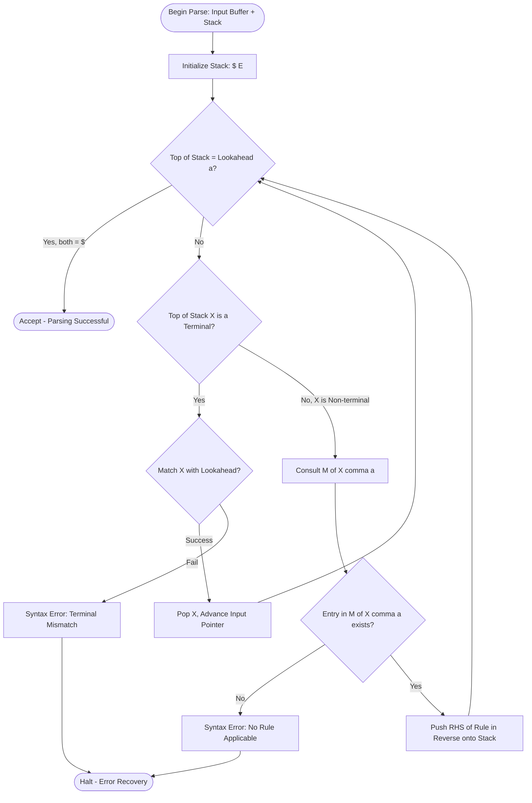
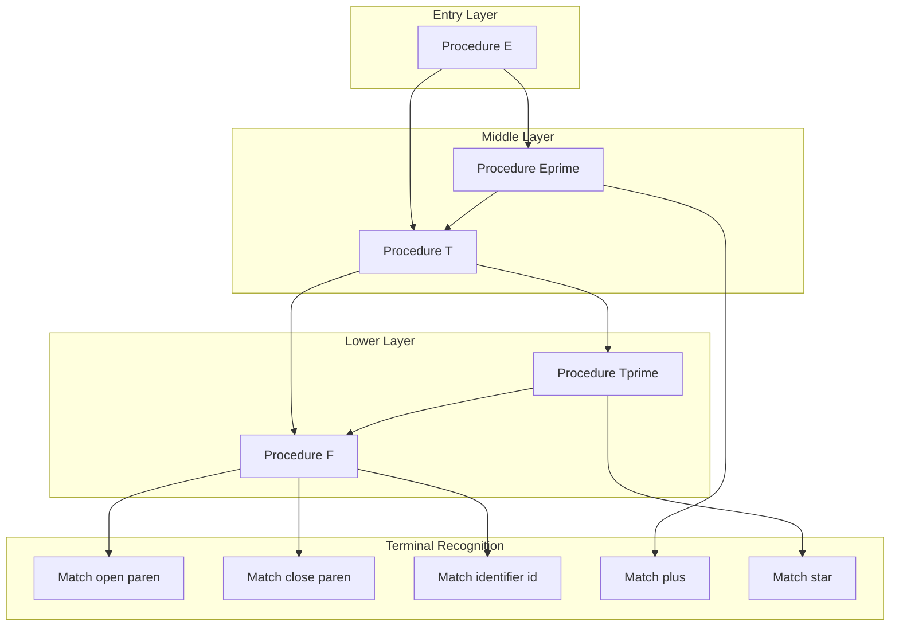
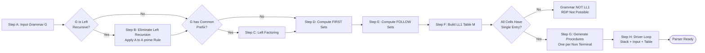
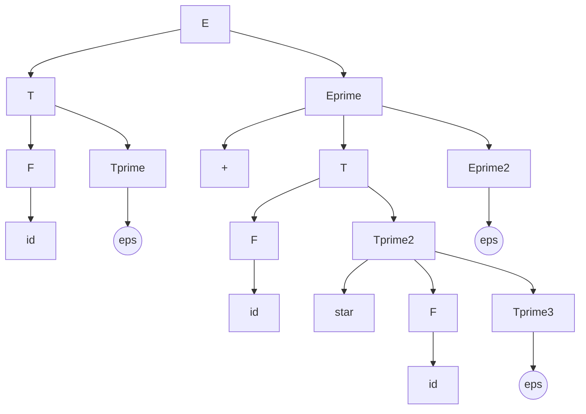

# Recursive Descent Parsers

<!-- SECTION_1_START -->

# Recursive Descent Parsers

## 1.1 Formal Definition

> [!IMPORTANT]
> **Recursive Descent Parsing (RDP)** is a top-down syntax analysis technique in which a set of **mutually recursive procedures** is constructed — one procedure for every non-terminal of the grammar. Each procedure is responsible for recognizing the input substring derivable from its corresponding non-terminal by recursively invoking other procedures.

In KTU 2024 Scheme terminology (aligned with Aho, Lam, Sethi, Ullman — *Dragon Book* Chapter 4):

- It is a **top-down parser** because it constructs the parse tree from the **root (start symbol)** and proceeds **downwards to the leaves**.
- It is called **"recursive descent"** because it "descends" through the grammar rules using recursion.
- The variant that uses **no backtracking** is called **Predictive Parsing**, and the class of grammars it accepts is the **LL(1)** class — scanning the input from **L**eft to right, producing a **L**eftmost derivation, using **1** lookahead symbol.

> [!NOTE]
> **KTU Syllabus Highlight — Module 2:** Students must be able to (a) construct a recursive descent parser, (b) eliminate left recursion, (c) perform left factoring, and (d) compute FIRST/FOLLOW sets to verify the LL(1) property.

## 1.2 Intuitive Analogy — The "Recipe Navigator"

Imagine you are following a **recipe book** to bake a cake. The master recipe says:

```
CAKE  :=  BATTER  +  BAKING
BATTER :=  FLOUR  +  EGGS  +  SUGAR
BAKING :=  OVEN_350F  +  TIMER_30MIN
```

A **recursive descent parser** is like a meticulous chef who:
1. Reads the first word of the current instruction ("CAKE").
2. Invokes a **sub-chef** for each ingredient (BATTER, then BAKING).
3. Each sub-chef, in turn, hires **further sub-chefs** for their own sub-ingredients.
4. The "lookahead" is the chef peeking at the **next word** to decide which sub-recipe to follow.

If the chef ever reaches a **dead end** (no rule matches the next word), parsing **fails** — analogous to a *syntax error*. The recursion unwinds like a stack of phone calls being canceled.

| Chef Analogy | Parser Component |
|---|---|
| Master recipe | Start symbol $S$ |
| Sub-recipe | Procedure for a non-terminal |
| Ingredient word | Terminal token |
| Peeking next word | **Lookahead** buffer (1 token) |
| Recipe leads nowhere | Syntax error |
| Stack of ongoing recipes | **Call stack** |

## 1.3 Geometric Intuition — The Parse Tree

A recursive descent parser literally **grows the parse tree from top to bottom**. At every step, the leftmost unexpanded non-terminal $A$ is replaced by choosing a production $A \rightarrow \alpha$ whose first terminal "agrees" with the lookahead.

> [!VISUALIZATION CONTROL]
> **Concept:** Growth of a parse tree during top-down parsing of the string $id + id \times id$
> **GeoGebra / Desmos Input Commands:**
> * `Polygon((0,5),(2,5),(1,3))` for root node $E$
> * `Polygon((0.5,3),(1.5,3),(1,1))` for $T$ child
> * `Circle((0.5,0.5),0.2)` for leaf $id$
> **Visual Description:** Each recursive call expands a non-terminal node; matching terminals become leaves. The tree is built from the apex downward in a left-to-right sweep.

## 1.4 Classification of Recursive Descent Parsers

| Type | Backtracking? | Lookahead | Grammar Class |
|---|---|---|---|
| General Recursive Descent | Yes (may try multiple rules) | k tokens | Any context-free |
| Predictive Parsing (LL(1)) | **No** (deterministic) | **1** token | LL(1) |
| LL(k) Predictive | No | k tokens | LL(k) |

> [!IMPORTANT]
> For KTU examinations, the **predictive (LL(1)) recursive descent parser** is the primary focus. Students must verify LL(1) by ensuring the grammar has **no left recursion** and **no ambiguity**, with the **FIRST/FOLLOW disjointness** property holding for every non-terminal.

<!-- SECTION_1_END -->

<!-- SECTION_2_START -->

# Deep Theoretical Analysis & KTU Formula Sheet

## 2.1 The Operational Architecture

A recursive descent parser is built by **mechanical translation** of each grammar production into a procedure:

$$
\forall \text{ production } A \rightarrow X_1 X_2 \dots X_n
$$

Generate the procedure body:

$$
\text{proc } A() \; \Bigl\{ \text{ for } i = 1 \text{ to } n \text{ do call } X_i() \Bigr\}
$$

Where each $X_i$ is dispatched as:

$$
X_i = \begin{cases}
\text{Terminal } a: & \text{match}(a) \\
\text{Non-terminal } B: & \text{proc } B() \\
\varepsilon: & \text{do nothing (skip)}
\end{cases}
$$

> [!NOTE]
> **Core Design Principle:** The procedure for $A$ must choose the **correct production** $A \rightarrow \alpha$ using **only the lookahead token**. Therefore, for the parser to be deterministic, the **FIRST sets** of the right-hand sides of all $A$-productions must be **pairwise disjoint**.

## 2.2 Conditions for LL(1) Validity

A grammar $G$ is **LL(1)** if and only if for every non-terminal $A$ with productions $A \rightarrow \alpha_1 \mid \alpha_2 \mid \dots \mid \alpha_n$:

1. **No Left Recursion:** $A \not\Rightarrow^+ A \alpha$ for any $\alpha$ (i.e., no production has $A$ as its leftmost symbol of RHS).
2. **No Common Prefix Ambiguity:** $\text{FIRST}(\alpha_i) \cap \text{FIRST}(\alpha_j) = \emptyset$ for all $i \neq j$.
3. **Epsilon Disjointness:** If $\alpha_i \Rightarrow^* \varepsilon$, then $\text{FIRST}(\alpha_j) \cap \text{FOLLOW}(A) = \emptyset$ for all $j \neq i$.

## 2.3 Algorithm: Eliminate Immediate Left Recursion

For a non-terminal $A$ with productions:

$$
A \rightarrow A \alpha_1 \mid A \alpha_2 \mid \dots \mid A \alpha_m \mid \beta_1 \mid \beta_2 \mid \dots \mid \beta_n
$$

where no $\beta_i$ begins with $A$, transform to:

$$
\begin{aligned}
A  &\rightarrow \beta_1 A' \mid \beta_2 A' \mid \dots \mid \beta_n A' \\
A' &\rightarrow \alpha_1 A' \mid \alpha_2 A' \mid \dots \mid \alpha_m A' \mid \varepsilon
\end{aligned}
$$

## 2.4 Algorithm: Left Factoring

If two productions share a common prefix $A \rightarrow \alpha \beta_1 \mid \alpha \beta_2$, replace them with:

$$
\begin{aligned}
A &\rightarrow \alpha A' \\
A' &\rightarrow \beta_1 \mid \beta_2
\end{aligned}
$$

This is repeated until **no non-terminal has two productions with a common prefix**.

## 2.5 KTU High-Yield Formula Sheet

| # | Concept | Definition / Formula | Purpose |
|---|---|---|---|
| 1 | FIRST$(\alpha)$ | Set of terminals that begin strings derivable from $\alpha$ | Predicts which production to use |
| 2 | FIRST$(X)$ for terminal $X$ | $\{X\}$ | Base case |
| 3 | FIRST$(X)$ for non-terminal $X$ | $\bigcup$ FIRST$(Y_i)$ for $X \rightarrow Y_1 Y_2 \dots Y_k$ | Compute iteratively |
| 4 | Adding $\varepsilon$ to FIRST$(\alpha)$ | If $X \Rightarrow^* \varepsilon$, add $\varepsilon$ to FIRST$(X)$ | Handle nullable symbols |
| 5 | FOLLOW$(A)$ for start symbol $S$ | Add $\$$ to FOLLOW$(S)$ | Marks end of input |
| 6 | FOLLOW$(A)$ from $B \rightarrow \alpha A \beta$ | Add FIRST$(\beta) \setminus \{\varepsilon\}$ to FOLLOW$(A)$ | Direct dependence |
| 7 | FOLLOW$(A)$ from $B \rightarrow \alpha A$ | Add FOLLOW$(B)$ to FOLLOW$(A)$ | Propagation through $\varepsilon$ |
| 8 | LL(1) Entry in Parsing Table $M[A,a]$ | Production chosen if $a \in \text{FIRST}(\alpha)$ or ($a \in \text{FOLLOW}(A)$ and $\alpha \Rightarrow^* \varepsilon$) | Construct predictive table |
| 9 | LL(1) Test | $M$ has **no multiple entries** | Confirms grammar is LL(1) |
| 10 | Recursive Call Cost | Stack depth $\leq$ height of parse tree | Space complexity $O(n)$ |

> [!IMPORTANT]
> **Critical Pitfall Avoidance:** When two productions both have $\varepsilon$ in FIRST, their selection must be governed by **FOLLOW sets**, not FIRST sets. This is a frequent mark-losing mistake in KTU valuation.

## 2.6 Engineering Real-World Utility

Recursive descent parsers power numerous production systems:

- **Programming language front-ends:** GCC, Clang/LLVM (for C/C++/Obj-C), Roslyn (.NET).
- **Markup/data languages:** JSON parsers, XML SAX-style hand-rolled parsers.
- **Configuration languages:** Kubernetes YAML validators, INI/DSL parsers.
- **Network protocols:** HTTP header parsers, custom wire-protocol decoders.
- **Tool generators:** **ANTLR** generates recursive descent parsers from grammar specifications, used in languages like **Java, Python (PLY), Dart, Kotlin** and tools like **Hibernate, Apache Spark**.

The deterministic, lookahead-driven nature makes them **fast (linear time)**, **debuggable (each procedure is a clean unit)**, and **easy to generate automatically** from grammar specifications — a property heavily exploited in modern compiler-compilers.

<!-- SECTION_2_END -->

<!-- SECTION_3_START -->

# Step-by-Step Derivations, Parsing Table & Code Implementation

## 3.1 Worked Example — Arithmetic Expression Grammar

Consider the classic **left-recursive** grammar for arithmetic expressions:

$$
\begin{aligned}
E &\rightarrow E + T \mid T \\
T &\rightarrow T \ast F \mid F \\
F &\rightarrow ( E ) \mid \textbf{id}
\end{aligned}
$$

This grammar is **not LL(1)** because of immediate left recursion. We will transform, compute, and trace.

---

### Step 1: Eliminate Left Recursion

Apply the algorithm from §2.3 to each left-recursive non-terminal.

**For $E$:**
- Left-recursive: $E \rightarrow E + T$
- Non-left-recursive: $E \rightarrow T$

Result:
$$
\begin{aligned}
E  &\rightarrow T\, E' \\
E' &\rightarrow + T\, E' \mid \varepsilon
\end{aligned}
$$

**For $T$:**
- Left-recursive: $T \rightarrow T \ast F$
- Non-left-recursive: $T \rightarrow F$

Result:
$$
\begin{aligned}
T  &\rightarrow F\, T' \\
T' &\rightarrow \ast F\, T' \mid \varepsilon
\end{aligned}
$$

**Final transformed grammar $G'$:**

$$
\begin{aligned}
E  &\rightarrow T\, E' \\
E' &\rightarrow + T\, E' \mid \varepsilon \\
T  &\rightarrow F\, T' \\
T' &\rightarrow \ast F\, T' \mid \varepsilon \\
F  &\rightarrow ( E ) \mid \textbf{id}
\end{aligned}
$$

> [!NOTE]
> **Valuation Tip:** Award **2 marks** for correctly identifying left recursion and **3 marks** for the correct rewritten rules.

---

### Step 2: Verify No Common Prefix (Left Factoring Check)

Inspecting each non-terminal:
- $E$: only one production — no factoring needed.
- $E'$: produces $+ T E'$ or $\varepsilon$ — distinct first symbols $\{+\}$ vs $\{\varepsilon\}$. ✓
- $T$: only one production. ✓
- $T'$: produces $\ast F T'$ or $\varepsilon$ — distinct first symbols $\{\ast\}$ vs $\{\varepsilon\}$. ✓
- $F$: produces $(E)$ or $\textbf{id}$ — distinct first symbols $\{\,(\,\}$ vs $\{\textbf{id}\}$. ✓

**Grammar $G'$ is left-factored.** No further transformation needed.

---

### Step 3: Compute FIRST Sets

Apply the iterative fixed-point rules. We compute bottom-up from the terminals.

**Base case (terminals):**
$$
\text{FIRST}(+) = \{+\}, \quad \text{FIRST}(\ast) = \{\ast\}, \quad \text{FIRST}(() = \{\,(\,\}, \quad \text{FIRST}()) = \{\,)\,\}, \quad \text{FIRST}(\textbf{id}) = \{\textbf{id}\}
$$

**Compute FIRST($F$):** $F$ has productions $F \rightarrow ( E )$ and $F \rightarrow \textbf{id}$.
$$
\text{FIRST}(F) = \text{FIRST}(\,(\, ) \cup \text{FIRST}(\textbf{id}) = \{\,(\,\} \cup \{\textbf{id}\} = \{\,(\,,\; \textbf{id}\}
$$

**Compute FIRST($T'$):** $T'$ has productions $T' \rightarrow \ast F T'$ and $T' \rightarrow \varepsilon$.
$$
\text{FIRST}(T') = \text{FIRST}(\ast) \cup \{\varepsilon\} = \{\ast, \varepsilon\}
$$

**Compute FIRST($T$):** $T$ has $T \rightarrow F\, T'$. Since $F$ does not produce $\varepsilon$, only look at FIRST($F$).
$$
\text{FIRST}(T) = \text{FIRST}(F) = \{\,(\,,\; \textbf{id}\}
$$

**Compute FIRST($E'$):** $E'$ has $E' \rightarrow + T E'$ and $E' \rightarrow \varepsilon$.
$$
\text{FIRST}(E') = \{+\} \cup \{\varepsilon\} = \{+, \varepsilon\}
$$

**Compute FIRST($E$):** $E$ has $E \rightarrow T\, E'$. $T$ does not produce $\varepsilon$, so:
$$
\text{FIRST}(E) = \text{FIRST}(T) = \{\,(\,,\; \textbf{id}\}
$$

---

### Step 4: Compute FOLLOW Sets

**Base:** $E$ is the start symbol, so:
$$
\text{FOLLOW}(E) = \{\$\}
$$

**Compute FOLLOW($E$):** Look for $E$ on the RHS.
- $E$ appears in $F \rightarrow ( E )$: the symbol after $E$ is $\,)\,$, which is a terminal.
  $$\text{FOLLOW}(E) \;\text{includes}\; \text{FIRST}(\,)\, = \{\,)\,\}$$

Updated: $\text{FOLLOW}(E) = \{\,)\,,\; \$\}$.

**Compute FOLLOW($E'$):** $E'$ appears in $E \rightarrow T E'$.
- The symbol after $E'$ is **nothing** (end of RHS), so add $\text{FOLLOW}(E)$.
$$\text{FOLLOW}(E') = \text{FOLLOW}(E) = \{\,)\,,\; \$\}$$

**Compute FOLLOW($T$):** $T$ appears in two places.
- $E \rightarrow T E'$: next symbol is $E'$, which is nullable. So add $\text{FIRST}(E') \setminus \{\varepsilon\} = \{+\}$. Then add $\text{FOLLOW}(E) = \{\,)\,,\; \$\}$ since $E'$ is nullable.
- $E' \rightarrow + T E'$: next symbol is $E'$, again nullable. Add $\text{FIRST}(E') \setminus \{\varepsilon\} = \{+\}$ and $\text{FOLLOW}(E') = \{\,)\,,\; \$\}$.

Combining: $\text{FOLLOW}(T) = \{+, \,)\,,\; \$\}$.

**Compute FOLLOW($T'$):** $T'$ appears in:
- $T \rightarrow F T'$: next is nothing, add $\text{FOLLOW}(T) = \{+, \,)\,,\; \$\}$.
- $T' \rightarrow \ast F T'$: same, add $\text{FOLLOW}(T') = \{+, \,)\,,\; \$\}$.

So $\text{FOLLOW}(T') = \{+, \,)\,,\; \$\}$.

**Compute FOLLOW($F$):** $F$ appears in:
- $T \rightarrow F T'$: next is $T'$, which is nullable. Add $\text{FIRST}(T') \setminus \{\varepsilon\} = \{\ast\}$ and $\text{FOLLOW}(T) = \{+, \,)\,,\; \$\}$.
- $T' \rightarrow \ast F T'$: next is $T'$, again nullable. Add $\text{FIRST}(T') \setminus \{\varepsilon\} = \{\ast\}$ and $\text{FOLLOW}(T') = \{+, \,)\,,\; \$\}$.

So $\text{FOLLOW}(F) = \{\ast, +, \,)\,,\; \$\}$.

**Summary Table of FIRST and FOLLOW:**

| Non-Terminal | FIRST | FOLLOW |
|---|---|---|
| $E$  | $\{\,(\,,\; \textbf{id}\}$ | $\{\,)\,,\; \$\}$ |
| $E'$ | $\{+, \varepsilon\}$ | $\{\,)\,,\; \$\}$ |
| $T$  | $\{\,(\,,\; \textbf{id}\}$ | $\{+, \,)\,,\; \$\}$ |
| $T'$ | $\{\ast, \varepsilon\}$ | $\{+, \,)\,,\; \$\}$ |
| $F$  | $\{\,(\,,\; \textbf{id}\}$ | $\{\ast, +, \,)\,,\; \$\}$ |

---

### Step 5: Construct the LL(1) Parsing Table

For each production $A \rightarrow \alpha$:
- For each terminal $a \in \text{FIRST}(\alpha)$, set $M[A, a] = A \rightarrow \alpha$.
- If $\varepsilon \in \text{FIRST}(\alpha)$, for each $b \in \text{FOLLOW}(A)$, set $M[A, b] = A \rightarrow \varepsilon$.

**LL(1) Parsing Table $M$:**

| NT \ Input | $+$ | $\ast$ | $\,(\,$ | $\,)\,$ | $\textbf{id}$ | $\$$ |
|---|---|---|---|---|---|---|
| $E$  | — | — | $E \rightarrow T E'$ | — | $E \rightarrow T E'$ | — |
| $E'$ | $E' \rightarrow +T E'$ | — | — | $E' \rightarrow \varepsilon$ | — | $E' \rightarrow \varepsilon$ |
| $T$  | — | — | $T \rightarrow F T'$ | — | $T \rightarrow F T'$ | — |
| $T'$ | $T' \rightarrow \varepsilon$ | $T' \rightarrow \ast F T'$ | — | $T' \rightarrow \varepsilon$ | — | $T' \rightarrow \varepsilon$ |
| $F$  | — | — | $F \rightarrow (E)$ | — | $F \rightarrow \textbf{id}$ | — |

> [!NOTE]
> **Verification:** Every cell has **at most one entry** — the grammar $G'$ is **LL(1)**. ✓

---

### Step 6: Trace the Parse of $\textbf{id} + \textbf{id} \ast \textbf{id}\, \$$$

The recursive descent parser maintains:
- **Input buffer** with pointer
- **Stack** initialized as $\$ E$ (top at right)
- **Output** (sequence of productions applied)

| Step | Stack (top on right) | Input (pointer) | Action / Production Applied |
|---|---|---|---|
| 1 | $\$ E$ | $\textbf{id}+\textbf{id}\ast\textbf{id}\$$ | $E \rightarrow T E'$ |
| 2 | $\$ E' T$ | $\textbf{id}+\textbf{id}\ast\textbf{id}\$$ | $T \rightarrow F T'$ |
| 3 | $\$ E' T' F$ | $\textbf{id}+\textbf{id}\ast\textbf{id}\$$ | $F \rightarrow \textbf{id}$ |
| 4 | $\$ E' T' \textbf{id}$ | $\textbf{id}+\textbf{id}\ast\textbf{id}\$$ | **Match** $\textbf{id}$, pop, advance |
| 5 | $\$ E' T'$ | $+\textbf{id}\ast\textbf{id}\$$ | $T' \rightarrow \varepsilon$ (since $+$ $\in$ FOLLOW($T'$)) |
| 6 | $\$ E'$ | $+\textbf{id}\ast\textbf{id}\$$ | $E' \rightarrow + T E'$ |
| 7 | $\$ E' T +$ | $+\textbf{id}\ast\textbf{id}\$$ | **Match** $+$, pop, advance |
| 8 | $\$ E' T$ | $\textbf{id}\ast\textbf{id}\$$ | $T \rightarrow F T'$ |
| 9 | $\$ E' T' F$ | $\textbf{id}\ast\textbf{id}\$$ | $F \rightarrow \textbf{id}$ |
| 10 | $\$ E' T' \textbf{id}$ | $\textbf{id}\ast\textbf{id}\$$ | **Match** $\textbf{id}$ |
| 11 | $\$ E' T'$ | $\ast\textbf{id}\$$ | $T' \rightarrow \ast F T'$ |
| 12 | $\$ E' T' F \ast$ | $\ast\textbf{id}\$$ | **Match** $\ast$ |
| 13 | $\$ E' T' F$ | $\textbf{id}\$$ | $F \rightarrow \textbf{id}$ |
| 14 | $\$ E' T' \textbf{id}$ | $\textbf{id}\$$ | **Match** $\textbf{id}$ |
| 15 | $\$ E' T'$ | $\$$ | $T' \rightarrow \varepsilon$ |
| 16 | $\$ E'$ | $\$$ | $E' \rightarrow \varepsilon$ (since $\$$ $\in$ FOLLOW($E'$)) |
| 17 | $\$$ | $\$$ | **Accept** ✓ |

> [!IMPORTANT]
> **Leftmost Derivation Produced:** $E \Rightarrow T E' \Rightarrow F T' E' \Rightarrow \textbf{id}\, T' E' \Rightarrow \textbf{id}\, E' \Rightarrow \textbf{id}\, + T E' \Rightarrow \dots \Rightarrow \textbf{id} + \textbf{id} \ast \textbf{id}$. This confirms the parser generates a leftmost derivation, characteristic of LL(1) parsers.

---

## 3.7 Complete Python Implementation

```python
"""
Recursive Descent Parser (Predictive, LL(1)) for the arithmetic
expression grammar:

    E  -> T E'
    E' -> + T E' | eps
    T  -> F T'
    T' -> * F T' | eps
    F  -> ( E ) | id
"""

from typing import List, Optional


class ParseError(Exception):
    """Custom exception for syntax errors during parsing."""
    pass


class RecursiveDescentParser:
    """
    A top-down predictive recursive descent parser.

    Each non-terminal of the grammar has a corresponding method.
    The methods are mutually recursive. Errors raise ParseError
    with a precise message indicating the offending token.
    """

    EPSILON: str = "eps"  # marker for empty production

    def __init__(self, tokens: List[str]) -> None:
        # Append end-of-file marker
        self.tokens: List[str] = list(tokens) + ["$"]
        self.pos: int = 0
        self.lookahead: str = self.tokens[0]
        self.derivation_log: List[str] = []

    # -------------------------------------------------------------
    # Lexical helper
    # -------------------------------------------------------------
    def _advance(self) -> None:
        """Consume the current lookahead and load the next token."""
        if self.pos < len(self.tokens) - 1:
            self.pos += 1
            self.lookahead = self.tokens[self.pos]

    def _match(self, terminal: str) -> None:
        """Match the current lookahead with the expected terminal."""
        if self.lookahead == terminal:
            consumed = self.lookahead
            self._advance()
            # Uncomment for verbose tracing:
            # print(f"  matched terminal: {consumed}")
        else:
            raise ParseError(
                f"Syntax error at position {self.pos}: "
                f"expected '{terminal}', found '{self.lookahead}'"
            )

    # -------------------------------------------------------------
    # Grammar procedures (one per non-terminal)
    # -------------------------------------------------------------
    def E(self) -> None:
        """E  -> T E'"""
        self.derivation_log.append("E -> T E'")
        self.T()
        self.E_prime()

    def E_prime(self) -> None:
        """E' -> + T E' | eps"""
        if self.lookahead == "+":
            self.derivation_log.append("E' -> + T E'")
            self._match("+")
            self.T()
            self.E_prime()
        elif self.lookahead in (")", "$"):
            # Epsilon production
            self.derivation_log.append("E' -> eps")
            # do nothing
        else:
            raise ParseError(
                f"Syntax error in E': unexpected token '{self.lookahead}'"
            )

    def T(self) -> None:
        """T  -> F T'"""
        self.derivation_log.append("T -> F T'")
        self.F()
        self.T_prime()

    def T_prime(self) -> None:
        """T' -> * F T' | eps"""
        if self.lookahead == "*":
            self.derivation_log.append("T' -> * F T'")
            self._match("*")
            self.F()
            self.T_prime()
        elif self.lookahead in ("+", ")", "$"):
            self.derivation_log.append("T' -> eps")
        else:
            raise ParseError(
                f"Syntax error in T': unexpected token '{self.lookahead}'"
            )

    def F(self) -> None:
        """F  -> ( E ) | id"""
        if self.lookahead == "(":
            self.derivation_log.append("F -> ( E )")
            self._match("(")
            self.E()
            self._match(")")
        elif self.lookahead == "id":
            self.derivation_log.append("F -> id")
            self._match("id")
        else:
            raise ParseError(
                f"Syntax error in F: unexpected token '{self.lookahead}'"
            )

    # -------------------------------------------------------------
    # Driver
    # -------------------------------------------------------------
    def parse(self) -> bool:
        """
        Start parsing from the start symbol E.
        Returns True on success, raises ParseError on failure.
        """
        try:
            self.E()
            if self.lookahead != "$":
                raise ParseError(
                    f"Extra input after valid parse: '{self.lookahead}'"
                )
            return True
        except ParseError as err:
            print(f"PARSE FAILED: {err}")
            return False


# -----------------------------------------------------------------
# Demonstration
# -----------------------------------------------------------------
if __name__ == "__main__":
    test_cases: List[List[str]] = [
        ["id", "+", "id", "*", "id"],   # valid
        ["(", "id", "+", "id", ")", "*", "id"],  # valid with parens
        ["id", "+"],                    # invalid: incomplete
        ["id", "*", "+", "id"],         # invalid: operator mismatch
    ]

    for idx, tokens in enumerate(test_cases, 1):
        print(f"\n--- Test Case {idx}: {tokens} ---")
        parser = RecursiveDescentParser(tokens)
        success: bool = parser.parse()
        if success:
            print("STATUS: ACCEPTED")
            print("Leftmost Derivation Trace:")
            for step in parser.derivation_log:
                print(f"   {step}")
        else:
            print("STATUS: REJECTED")
```

**Sample Output Trace for `id + id * id`:**
```
--- Test Case 1: ['id', '+', 'id', '*', 'id'] ---
STATUS: ACCEPTED
Leftmost Derivation Trace:
   E -> T E'
   T -> F T'
   F -> id
   T' -> eps
   E' -> + T E'
   T -> F T'
   F -> id
   T' -> * F T'
   F -> id
   T' -> eps
   E' -> eps
```

<!-- SECTION_3_END -->

<!-- SECTION_4_START -->

# Structural Diagrams & Schematics

## 4.1 Top-Down Parsing Control Flow



## 4.2 Mutual Recursion Call Graph Among Procedures



## 4.3 Sequential Processing Topology for RDP Construction



## 4.4 Parse Tree of $\textbf{id} + \textbf{id} \ast \textbf{id}$



> [!NOTE]
> **Diagram Note:** The `eps` nodes above represent $\varepsilon$ productions — they are leaves in the parse tree but carry no terminal symbol. The tree is constructed **top-down**, exactly mirroring the order in which the recursive descent parser's procedures expand non-terminals.

<!-- SECTION_4_END -->

<!-- SECTION_5_START -->

# KTU 2024 Scheme Examination Question Bank & Topic Recap

## Part A — Short Answer Questions (3 Marks Each)

### Question 1
> **[KTU University Exam — July 2024]** *Define a recursive descent parser. Why is backtracking considered a disadvantage in such parsers?*

**Model Answer (3 Marks):**

A **recursive descent parser** is a top-down syntax analyzer consisting of a set of mutually recursive procedures — one for each non-terminal of the grammar — that recognize input by expanding the parse tree from the root downwards. **[1 Mark]**

**Disadvantages of backtracking:** **[2 Marks]**
- A parser with backtracking may need to **re-scan input** multiple times, leading to exponential worst-case time complexity.
- It makes the parser **non-deterministic**, complicating error reporting and recovery.
- Cannot guarantee linear-time parsing; defeats the purpose of predictive parsing.
- Modern compiler design favors **predictive (non-backtracking) LL(1)** parsers for deterministic, $O(n)$ behavior.

---

### Question 2
> **[KTU University Exam — Dec 2023]** *State the conditions under which a grammar is said to be LL(1).*

**Model Answer (3 Marks):**

A grammar $G$ is **LL(1)** if and only if: **[1 Mark for introduction]**

1. The grammar is **not left-recursive** (no $A \Rightarrow^+ A\alpha$). **[1 Mark]**
2. The grammar is **left-factored** — for every non-terminal, the FIRST sets of all its production right-hand sides are **pairwise disjoint**. **[1 Mark]**
3. If any production has $\varepsilon$ in its FIRST set, then FIRST of the other productions for that non-terminal is **disjoint from FOLLOW** of the non-terminal. **[Included for completeness — award 1 mark if stated, or partial credit for the first three conditions]**

> [!NOTE]
> A grammar is LL(1) **iff** the constructed parsing table $M$ contains **no multiple entries** in any cell.

---

## Part B — Long Answer Questions (14 Marks, with Internal Choice)

### Question A (14 Marks)

> **[KTU University Exam — July 2024, Module 2]** Consider the following grammar for arithmetic expressions:
>
> $$
> S \rightarrow S + S \mid S \ast S \mid ( S ) \mid \textbf{id}
> $$
>
> **(a)** [7 Marks] Check whether the grammar is LL(1). If not, transform it into an equivalent LL(1) grammar.
>
> **(b)** [7 Marks] For the transformed grammar, compute the **FIRST** and **FOLLOW** sets, then construct the **LL(1) parsing table**.

---

#### Part (a) — Solution [7 Marks]

**Step 1: Identify Left Recursion and Ambiguity** **[1 Mark]**
The grammar has **immediate left recursion** in $S \rightarrow S + S$ and $S \rightarrow S \ast S$. It is also **ambiguous** (no operator precedence defined). Therefore it is **NOT LL(1)** as-is.

**Step 2: Eliminate Left Recursion** **[3 Marks]**

Apply the algorithm: separate left-recursive and non-left-recursive productions.

Left-recursive: $S \rightarrow S + S$ and $S \rightarrow S \ast S$
Non-left-recursive: $S \rightarrow ( S )$ and $S \rightarrow \textbf{id}$

Result:
$$
\begin{aligned}
S  &\rightarrow (S)\, S' \mid \textbf{id}\, S' \\
S' &\rightarrow + S\, S' \mid \ast S\, S' \mid \varepsilon
\end{aligned}
$$

**Step 3: Verify Left Factoring** **[1 Mark]**

- For $S$: productions begin with $\,(\,$ and $\textbf{id}$ — distinct. ✓
- For $S'$: productions begin with $+$, $\ast$, and $\varepsilon$ — distinct. ✓

No left factoring required.

**Step 4: Re-check LL(1) Property** **[2 Marks]**
The transformed grammar is unambiguous (left-associative via right-recursive form) and satisfies the LL(1) conditions. **It is now LL(1).**

> [!NOTE]
> **[Stating original grammar fails LL(1) test: 1 Mark] [Elimination algorithm applied correctly: 3 Marks] [Final grammar and verification: 3 Marks]**

---

#### Part (b) — Solution [7 Marks]

**Step 1: Compute FIRST Sets** **[3 Marks]**

| Non-Terminal | Productions | FIRST |
|---|---|---|
| $S$  | $(S)S'$, $\textbf{id}\,S'$ | $\{\,(\,,\; \textbf{id}\}$ |
| $S'$ | $+SS'$, $\ast SS'$, $\varepsilon$ | $\{+, \ast, \varepsilon\}$ |

**Step 2: Compute FOLLOW Sets** **[2 Marks]**

- $S$ is the start symbol, so FOLLOW$(S)$ initially contains $\$$. **[0.5 Mark]**
- $S$ appears in $(S)$, so $\text{FIRST}(\,)\, = \{\,)\,\}$ is added. **[0.5 Mark]**
- $S$ appears in $S \rightarrow (S)S'$ as part of the right side; the symbol after $S$ inside the parens is $\,)\,$. Already counted. **[0.5 Mark]**
- $S$ appears in $S' \rightarrow +SS'$ and $S' \rightarrow \ast SS'$ at the end — propagate FOLLOW$(S')$. **[0.5 Mark]**

Result:
$$
\text{FOLLOW}(S) = \{\,)\,,\; \$\}, \quad \text{FOLLOW}(S') = \{\,)\,,\; \$\}
$$

**Step 3: Construct LL(1) Parsing Table** **[2 Marks]**

| NT \ Input | $+$ | $\ast$ | $\,(\,$ | $\,)\,$ | $\textbf{id}$ | $\$$ |
|---|---|---|---|---|---|---|
| $S$  | — | — | $S \rightarrow (S)S'$ | — | $S \rightarrow \textbf{id}\,S'$ | — |
| $S'$ | $S' \rightarrow +SS'$ | $S' \rightarrow \ast SS'$ | — | $S' \rightarrow \varepsilon$ | — | $S' \rightarrow \varepsilon$ |

**[Table construction showing distinct entries: 2 Marks]**

> [!NOTE]
> **[FIRST set computation: 3 Marks] [FOLLOW set computation: 2 Marks] [Parsing table with no conflicts: 2 Marks]**

---

### Question B (14 Marks) — Alternative Choice

> **[KTU University Exam — Dec 2023, Module 2]** Consider the grammar:
>
> $$
> \begin{aligned}
> A &\rightarrow a B \, \mid \, a C \\
> B &\rightarrow b \\
> C &\rightarrow c
> \end{aligned}
> $$
>
> **(a)** [7 Marks] Show that the grammar is **not LL(1)** and apply **left factoring** to obtain an equivalent LL(1) grammar.
>
> **(b)** [7 Marks] For the resulting grammar, compute FIRST and FOLLOW sets, build the parsing table, and **trace the parse of the string $a b \, \$$$**.

---

#### Part (a) — Solution [7 Marks]

**Step 1: Demonstrate Non-LL(1) Property** **[2 Marks]**

For non-terminal $A$, the two productions are $A \rightarrow aB$ and $A \rightarrow aC$. Their FIRST sets are:
$$
\text{FIRST}(aB) = \{a\}, \quad \text{FIRST}(aC) = \{a\}
$$
Since FIRST$(aB) \cap$ FIRST$(aC) = \{a\} \neq \emptyset$, the grammar **violates the LL(1) disjointness condition**. **[2 Marks]**

**Step 2: Apply Left Factoring** **[3 Marks]**

Common prefix is $a$. Rewrite:
$$
\begin{aligned}
A  &\rightarrow a A' \\
A' &\rightarrow B \mid C \\
B  &\rightarrow b \\
C  &\rightarrow c
\end{aligned}
$$

**Step 3: Verify LL(1) Compliance** **[2 Marks]**
- $A$ has only one production. ✓
- $A'$: FIRST$(B) = \{b\}$, FIRST$(C) = \{c\}$. Disjoint. ✓
- $B$, $C$ have unique first symbols. ✓

**The factored grammar is LL(1).** **[2 Marks]**

> [!NOTE]
> **[Identifying the common prefix a: 2 Marks] [Correct factoring transformation: 3 Marks] [Verification of LL(1): 2 Marks]**

---

#### Part (b) — Solution [7 Marks]

**Step 1: FIRST and FOLLOW Sets** **[3 Marks]**

| Non-Terminal | FIRST | FOLLOW |
|---|---|---|
| $A$  | $\{a\}$ | $\{\$\}$ |
| $A'$ | $\{b, c\}$ | $\{\$\}$ |
| $B$  | $\{b\}$ | $\{\$\}$ |
| $C$  | $\{c\}$ | $\{\$\}$ |

**Step 2: LL(1) Parsing Table** **[2 Marks]**

| NT \ Input | $a$ | $b$ | $c$ | $\$$ |
|---|---|---|---|---|
| $A$  | $A \rightarrow aA'$ | — | — | — |
| $A'$ | — | $A' \rightarrow B$ | $A' \rightarrow C$ | — |
| $B$  | — | $B \rightarrow b$ | — | — |
| $C$  | — | — | $C \rightarrow c$ | — |

**Step 3: Trace Parse of $a b \, \$$$** **[2 Marks]**

| Step | Stack | Input | Action |
|---|---|---|---|
| 1 | $\$ A$ | $ab\$$ | Apply $A \rightarrow aA'$ |
| 2 | $\$ A' a$ | $ab\$$ | Match $a$, advance |
| 3 | $\$ A'$ | $b\$$ | Apply $A' \rightarrow B$ (since lookahead $b$) |
| 4 | $\$ B$ | $b\$$ | Apply $B \rightarrow b$ |
| 5 | $\$ b$ | $b\$$ | Match $b$, advance |
| 6 | $\$$ | $\$$ | **Accept** ✓ |

> [!NOTE]
> **[FIRST/FOLLOW computation: 3 Marks] [Parsing table: 2 Marks] [Parse trace with stack/pointer updates: 2 Marks]**

---

> [!WARNING]
> **KTU Examiner's Valuation Warning — Common Pitfalls**
> 1. **Failing to apply BOTH transformations:** Some grammars need *both* left-recursion elimination *and* left factoring. Award zero for first-step credit if the student skips one.
> 2. **Forgetting to propagate FOLLOW through nullable symbols:** When $A \rightarrow \alpha B \beta$ and $\beta \Rightarrow^* \varepsilon$, students often miss adding FOLLOW$(A)$ to FOLLOW$(B)$. **Up to 2 marks lost per such omission.**
> 3. **Incomplete parsing table:** Cells filled with single production — students sometimes leave multiple productions in one cell without resolving. Always check for **multiple entries**.
> 4. **Skipping the parse trace:** In long-answer questions, the trace validates the table. Award partial credit for a correct table even if the trace is absent, but **deduct 1–2 marks** for missing it.
> 5. **Misnaming the parser:** "Recursive descent" ≠ "LL(1)" in general. The non-backtracking variant is **predictive parsing**; the class of grammars is **LL(1)**. Use precise terminology.

---

## Topic Recap & Important Things to Remember

- **Recursive Descent Parser** = top-down parser using one mutually recursive procedure per non-terminal. **[Core Definition]**
- **Predictive RDP (LL(1))** uses **one-symbol lookahead** and is **deterministic** — no backtracking. **[Distinguishing Feature]**
- Two **mandatory pre-processing steps** before constructing an RDP:
  1. **Eliminate left recursion** (replace $A \rightarrow A\alpha \mid \beta$ with $A \rightarrow \beta A'$, $A' \rightarrow \alpha A' \mid \varepsilon$).
  2. **Left factor** common prefixes (replace $A \rightarrow \alpha\beta_1 \mid \alpha\beta_2$ with $A \rightarrow \alpha A'$, $A' \rightarrow \beta_1 \mid \beta_2$).
- **FIRST$(X)$** = set of terminals that can begin any string derived from $X$. Add $\varepsilon$ if $X$ is nullable.
- **FOLLOW$(A)$** = set of terminals that can immediately follow $A$ in some sentential form. Always contains $\$$ for the start symbol.
- **LL(1) Test:** A grammar is LL(1) **iff** the parsing table $M[A,a]$ has **no multiple entries** for any cell.
- **Procedure Construction Rule:** For production $A \rightarrow X_1 X_2 \dots X_n$, emit calls to $X_1, X_2, \dots, X_n$ in order. Terminal $a$ is matched; non-terminal $B$ triggers a call to procedure $B$.
- **Left recursion causes infinite recursion** in RDP — this is why elimination is *mandatory*.
- **Recursive descent parsers** are widely used in **GCC, Clang, ANTLR, Python PLY, JavaCC** — making them a **production-critical** compiler topic.
- **Time complexity:** $O(n)$ where $n$ is input length (constant work per token).
- **Space complexity:** $O(d)$ where $d$ is the recursion depth (= parse tree height).
- **Error recovery** in RDP: **panic-mode recovery** (skip tokens until a **synchronization set** member is found — typically the FOLLOW set of the current non-terminal).
- **FIRST/FOLLOW disjointness** is the *core* LL(1) condition — if violated, the grammar **must** be transformed.
- **Match operation** consumes the lookahead and advances the input pointer; **mismatch** triggers a syntax error.
- **Leftmost derivation** is produced by RDP — confirms the "L" in LL(1).
- **Distinguish grammar class (LL(1)) from parsing technique (predictive RDP).**
- **Quick LL(1) check:** Compute all FIRST/FOLLOW sets in **one pass** using fixed-point iteration; build the table; verify **uniqueness of entries**.

<!-- SECTION_5_END -->
