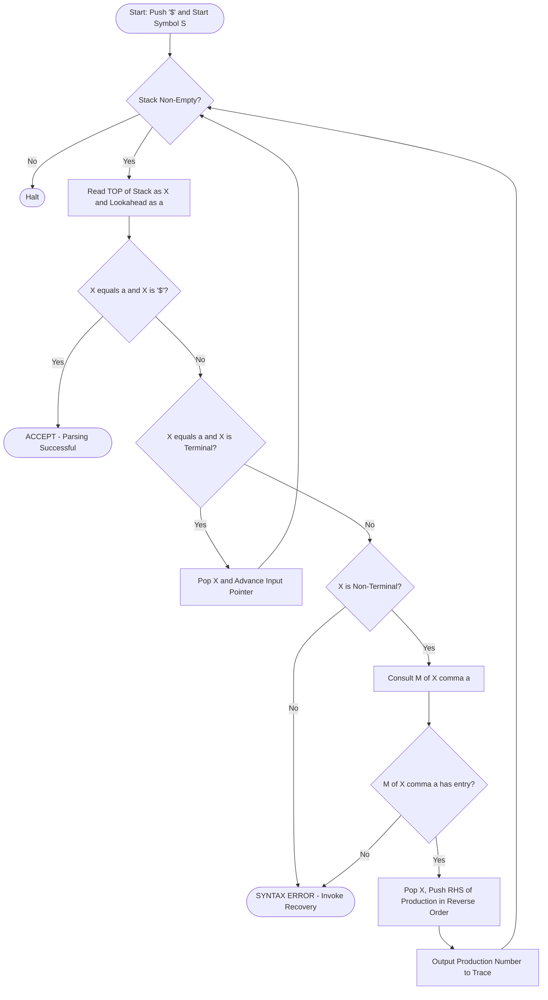
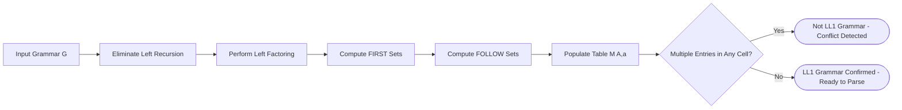
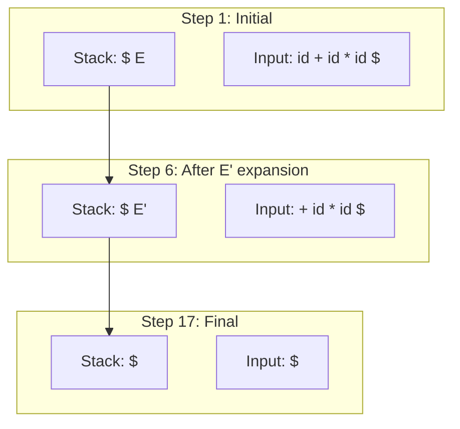

# Table-Driven LL(1) Parsers

<!-- SECTION_1_START -->
# Table-Driven LL(1) Parsers — Core Technical Definition & Intuitive Overview

## 1.1 Formal Definition (KTU 2024 Syllabus Terminology)

A **Table-Driven LL(1) Parser** (also called a **Predictive Parser** or **Non-Recursive Descent Parser**) is a top-down, left-to-right, leftmost-derivation-based syntax analyzer that uses an explicit **Parsing Table (M)** indexed by the pair *(Non-Terminal, Terminal)* to decide which production to apply without backtracking. The `1` in **LL(1)** signifies that exactly **one** lookahead input symbol is sufficient to unambiguously choose a production rule.

> [!IMPORTANT]
> **KTU Board Definition (verbatim):** *An LL(1) parser is a top-down parser that scans the input from **L**eft to right, produces a **L**eftmost derivation, and uses **1** (one) token of lookahead to select productions. It employs a stack, an input buffer, and a parsing table driven by the grammar's `FIRST` and `FOLLOW` sets.*

The grammar is said to be an **LL(1) Grammar** if the parsing table constructed from its `FIRST` and `FOLLOW` sets contains **no multiply-defined entries (no conflicts)**.

### 1.2 Key Components of the LL(1) Parsing Machine

| Component | Symbol | Function |
|:---|:---:|:---|
| Input Buffer | `$i$` | Holds the input string followed by the **end-marker `$`** |
| Stack | `$S$` | Holds grammar symbols; bottom marker is `$`; top is `S.push()` |
| Parsing Table | `M[A, a]` | A 2D matrix `M[Non-Terminal, Terminal ∪ {$}]` |
| Output Stream | — | Sequence of production numbers emitted as parse tree |

### 1.3 Conceptual Analogy — The "Recipe Robot" 🍳

> [!NOTE]
> **Intuition:** Imagine a robotic chef reading a recipe (the **grammar**) one ingredient at a time (the **input tokens**). The robot has a clipboard with a lookup table — when it sees an ingredient and a current "goal dish" (non-terminal), the clipboard immediately tells it which sub-recipe (production) to follow. The stack is like a *to-do list*: each time the robot starts a sub-recipe, it pushes the steps; when done, it pops.
>
> - **Left-to-right** → robot reads the recipe line by line.
> - **Leftmost derivation** → robot completes the leftmost unfinished step first.
> - **One token lookahead** → robot peeks at the *next* ingredient only — never the one after.
> - **No backtracking** → the clipboard must be unambiguous; otherwise the robot stalls (parsing conflict).

> [!VISUALIZATION CONTROL]
> **Concept:** Stack evolution during predictive parsing of the input `id + id * id` for the expression grammar.
> **GeoGebra / Desmos Input Equations (State Points to Plot):**
> * Point 1: $(2, 0.5)$ — Initial stack: `$E`, Input: `id + id * id $`
> * Point 2: $(4, 1.2)$ — Stack: `$T E'`, after `E → T E'`
> * Point 3: $(6, 2.0)$ — Stack: `$F T' E'`, after `T → F T'`
> * Point 4: $(8, 2.8)$ — Stack: `$id T' E'`, after `F → id`
> **Visual Description:** A staircase-like graph where the *x-axis* represents parse steps and the *y-axis* represents the **stack depth** at each step. The depth oscillates as productions are pushed/popped, finally dropping to a single symbol `$` at acceptance.

---

## 1.4 Role of `FIRST` and `FOLLOW` Sets

> [!IMPORTANT]
> **`FIRST(α)`** — The set of terminals that can begin any string derivable from α.
> If `α ⇒* ε`, then `ε ∈ FIRST(α)`.
>
> **`FOLLOW(A)`** — The set of terminals that can appear immediately to the right of the non-terminal `A` in any sentential form. If `A` can be the rightmost symbol, then `$ ∈ FOLLOW(A)`.

These two sets are the **backbone of the parsing table**:
- `FIRST(α)` decides what production to use when the next input symbol **starts** the right-hand side.
- `FOLLOW(A)` decides what production to use when the right-hand side can derive `ε` (epsilon).
</br>
<!-- SECTION_1_END -->

<!-- SECTION_2_START -->
# Deep Theoretical Analysis & KTU High-Yield Formula Sheet

## 2.1 The Predictive Parsing Algorithm (Conceptual Steps)

The table-driven parser is an **algorithmic state machine**. At every tick, exactly one of the following four actions occurs — this is the **engine's heart**:

1. **Initialize** — Push `$` then start symbol `S` onto the stack. Point the input pointer to the first symbol of `w$`.
2. **Loop Forever:**
   - Let `X = TOP(stack)` and `a = *input_pointer` (lookahead).
   - **If `X == a == '$'`** → **ACCEPT** 🎉 (Parsing successful).
   - **If `X == a != '$'`** → **MATCH**: pop `X`, advance input pointer (read next token).
   - **If `X` is a non-terminal** → Consult table `M[X, a]`:
     - If `M[X, a] = X → Y₁Y₂…Yₖ` → Pop `X`, push `Yₖ, …, Y₂, Y₁` (right-to-left order).
     - Output the production number.
     - If `M[X, a] = error` → **ERROR** (Recovery invoked).
   - **If `X` is a terminal but `X ≠ a`** → **ERROR**.

## 2.2 Construction of the LL(1) Parsing Table

### Algorithm `CONSTRUCT_TABLE(G)`

> For each production `A → α` in the grammar:
>
> **Step 1 — Add entries for each terminal in `FIRST(α)`:**
> $$\text{For every } a \in FIRST(\alpha), \text{ set } M[A, a] = A \rightarrow \alpha$$
>
> **Step 2 — Handle ε-productions:**
> $$\text{If } \varepsilon \in FIRST(\alpha), \text{ for every } b \in FOLLOW(A), \text{ set } M[A, b] = A \rightarrow \alpha$$
>
> **Step 3 — End-of-input safety:**
> $$\text{If } \$ \in FOLLOW(A), \text{ set } M[A, \$] = A \rightarrow \alpha$$
>
> **Step 4 — Default error entries:**
> $$\text{Every unfilled cell } M[A, a] = \text{error}$$

### 2.3 The `FIRST` Set Recursive Rules

For any grammar symbol `X`:

$$
FIRST(X) = 
\begin{cases}
\{X\}, & \text{if } X \text{ is a terminal} \\
\{\}, & \text{initialize as empty set} \\
FIRST(X) \cup FIRST(Y_i), & \text{if } X \rightarrow Y_1 Y_2 \ldots Y_k \text{ and } \varepsilon \in FIRST(Y_1)\ldots FIRST(Y_{i-1}) \\
\{\varepsilon\}, & \text{if } X \rightarrow \varepsilon \text{ or all } Y_i \Rightarrow^* \varepsilon
\end{cases}
$$

### 2.4 The `FOLLOW` Set Recursive Rules

For any non-terminal `A`:

$$
FOLLOW(A) =
\begin{cases}
FOLLOW(A) \cup FIRST(\beta) \setminus \{\varepsilon\}, & \text{if } A \rightarrow \alpha B \beta \\
FOLLOW(A) \cup FOLLOW(A), & \text{if } A \rightarrow \alpha B \text{ and } \beta \Rightarrow^* \varepsilon \\
\{\$\}, & \text{add } \$ \text{ if } A \text{ is the start symbol}
\end{cases}
$$

## 2.5 KTU Formula Sheet / Cheat Sheet (Board-Exam Ready)

| Symbol / Concept | Definition | Used For | Conflict If |
|:---|:---|:---|:---|
| $FIRST(\alpha)$ | Set of terminals beginning strings from $\alpha$ | Populating $M[A,a]$ for $a \in FIRST(\alpha)$ | — |
| $FOLLOW(A)$ | Set of terminals following $A$ in sentential forms | Populating $M[A,b]$ when $\varepsilon \in FIRST(\alpha)$ | — |
| $LL(1)$ Grammar | No multiply-defined table entries | Conflict-free parsing | Two entries in same cell |
| $\varepsilon$ | Empty string | Nullable non-terminals | Causes `ε-production` issues |
| $\$` | End-of-input sentinel | Acceptance and $FOLLOW(S)$ injection | — |
| $M[A, a] = \text{error}$ | Empty table cell | Syntax error recovery | — |
| $LEFT\ FACTORING$ | Rewrite $A \rightarrow \alpha\beta_1 \mid \alpha\beta_2$ as $A \rightarrow \alpha A'$, $A' \rightarrow \beta_1 \mid \beta_2$ | Eliminates $FIRST-FIRST$ conflicts | Predict-set overlap |
| $LEFT\ RECURSION$ | $A \rightarrow A\alpha$ | Causes infinite recursion | Must be eliminated first |
| $Predict(A \rightarrow \alpha)$ | $FIRST(\alpha) \cup FOLLOW(A)$ if $\varepsilon \in FIRST(\alpha)$ | Direct table entry | Overlap ⇒ not $LL(1)$ |

> [!IMPORTANT]
> **Grammar is LL(1) ⟺ For every non-terminal A with productions A → αᵢ, the sets `Predict(A → αᵢ)` are pairwise disjoint.**

## 2.6 Real-World Engineering Utility

LL(1) parsers are the workhorses of:
- **Expression evaluators** in interpreters (Python's `ast.parse` mode for simple cases)
- **Configuration file parsers** (JSON parsers, INI files, DSLs)
- **Calculator applications** in embedded systems (where memory is tight)
- **Educational compiler front-ends** (Tiny-C, educational Pascal)
- **Recursive descent generators** in tools like **ANTLR** (for `LL(k)` extensions)

They are preferred over LR parsers when:
- Source code is human-readable and **error messages must be precise**.
- The grammar is **small and predictable** (no need for SLR power).
- One-token lookahead **suffices** for unambiguous parsing.
</br>
<!-- SECTION_2_END -->

<!-- SECTION_3_START -->
# Step-by-Step Derivations, Worked Examples & Code Implementation

## 3.1 Reference Grammar (Worked Example)

Consider the classic arithmetic expression grammar **G**:

$$
\begin{aligned}
E &\rightarrow T\,E' \\
E' &\rightarrow +\,T\,E' \mid \varepsilon \\
T &\rightarrow F\,T' \\
T' &\rightarrow *\,F\,T' \mid \varepsilon \\
F &\rightarrow (\,E\,) \mid id
\end{aligned}
$$

This is the canonical example from Aho/Sethi/Ullman (the *Dragon Book*) used in KTU board exams.

## 3.2 Exhaustive Computation of `FIRST` Sets

### Production 1: `E → T E'`

`T` cannot derive `ε`. So:

$$
FIRST(E) = FIRST(T) = \{ (,\ id \}
$$

### Production 2: `E' → + T E'`

`+` is a terminal, hence:

$$
FIRST(+T E') = \{+\}
$$

### Production 3: `E' → ε`

$$
FIRST(\varepsilon) = \{\varepsilon\}
$$

### Production 4: `T → F T'`

`F` cannot derive `ε`, so:

$$
FIRST(T) = FIRST(F) = \{ (,\ id \}
$$

### Production 5: `T' → * F T'`

$$
FIRST(*F T') = \{*\}
$$

### Production 6: `T' → ε`

$$
FIRST(\varepsilon) = \{\varepsilon\}
$$

### Production 7: `F → ( E )`

$$
FIRST((E)) = \{(\}
$$

### Production 8: `F → id`

$$
FIRST(id) = \{id\}
$$

**Compiled `FIRST` Table:**

| Non-Terminal | `FIRST` Set |
|:---:|:---|
| `E` | $\{(,\ id\}$ |
| `E'` | $\{+, \varepsilon\}$ |
| `T` | $\{(,\ id\}$ |
| `T'` | $\{*, \varepsilon\}$ |
| `F` | $\{(,\ id\}$ |

## 3.3 Exhaustive Computation of `FOLLOW` Sets

### Step 1 — Initialize

$$
FOLLOW(E) = \{\$\} \quad \text{(E is the start symbol)}
$$

All other `FOLLOW` sets start as `∅`.

### Step 2 — From production `E → T E'`

- The symbol following `T` is `E'`.
- `FIRST(E')` contains `ε`, so add `FIRST(E') \ {ε}` and (since ε is in `FIRST(E')`) also add `FOLLOW(E)`.

$$
FOLLOW(T) = FOLLOW(T) \cup (FIRST(E') \setminus \{\varepsilon\}) \cup FOLLOW(E)
$$

$$
FOLLOW(T) = \{(,\ id\} \cup \{\$\} = \{(,\ id,\ \$\}
$$

- Add `FOLLOW(E)` to `FOLLOW(E')`:

$$
FOLLOW(E') = FOLLOW(E) = \{),\, \$\}
$$

### Step 3 — From production `E' → + T E'`

- The symbol following `T` is `E'`.
- `FIRST(E')` contains `ε`, so:

$$
FOLLOW(T) \cup FOLLOW(E') = \{(,\ id,\ \$\} \cup \{), \$\} = \{(,\ id,\ ),\ \$\}
$$

- Add `FOLLOW(E')` to `FOLLOW(E')` (no change).

### Step 4 — From production `T → F T'`

- The symbol following `F` is `T'`.
- `FIRST(T')` contains `ε`, so add `FIRST(T') \ {ε}` and `FOLLOW(T)`:

$$
FOLLOW(F) = \{(,\ id\} \cup \{(,\ id,\ ),\ \$\} = \{(,\ id,\ ),\ \$\}
$$

- Add `FOLLOW(T)` to `FOLLOW(T')`:

$$
FOLLOW(T') = \{(,\ id,\ ),\ \$\}
$$

### Step 5 — From production `T' → * F T'`

- Symbol following `F` is `T'`.
- `FIRST(T')` contains `ε`, so:

$$
FOLLOW(F) = FOLLOW(F) \cup FIRST(T') \setminus \{\varepsilon\} \cup FOLLOW(T') = \{(,\ id,\ ),\ \$\}
$$

- `FOLLOW(T')` gets `FOLLOW(T')` (no change).

### Step 6 — From production `F → ( E )`

- The symbol following `E` is `)`.
- Add `)` to `FOLLOW(E)`:

$$
FOLLOW(E) = \{), \$\}
$$

- Update `FOLLOW(E')` from step 2 → `FOLLOW(E') = {), $}` (already there).

**Final `FOLLOW` Table:**

| Non-Terminal | `FOLLOW` Set |
|:---:|:---|
| `E` | $\{), \$\}$ |
| `E'` | $\{), \$\}$ |
| `T` | $\{(,\ id,\ ),\ \$\}$ |
| `T'` | $\{(,\ id,\ ),\ \$\}$ |
| `F` | $\{(,\ id,\ ),\ \$\}$ |

> [!NOTE]
> **Note:** The `(` and `id` appearing in `FOLLOW(T)` and `FOLLOW(T')` actually came from `FIRST(E')` propagation. This is correct because whenever `T` appears, it can be followed by anything that can follow `E` (since `E' → ε`).

## 3.4 Building the LL(1) Parsing Table

Apply the table construction algorithm to each production:

### Production: `E → T E'`

`FIRST(TE') = {(, id}`. Add to cells:

| Cell | Entry |
|:---:|:---|
| $M[E, (]$ | $E \rightarrow T\,E'$ |
| $M[E, id]$ | $E \rightarrow T\,E'$ |

### Production: `E' → + T E'`

`FIRST(+TE') = {+}`. Add to cell:

| Cell | Entry |
|:---:|:---|
| $M[E', +]$ | $E' \rightarrow +\,T\,E'$ |

### Production: `E' → ε`

`ε ∈ FIRST(ε)`, so for every $b \in FOLLOW(E') = \{), \$\}$:

| Cell | Entry |
|:---:|:---|
| $M[E', )]$ | $E' \rightarrow \varepsilon$ |
| $M[E', \$]$ | $E' \rightarrow \varepsilon$ |

### Production: `T → F T'`

`FIRST(FT') = {(, id}`:

| Cell | Entry |
|:---:|:---|
| $M[T, (]$ | $T \rightarrow F\,T'$ |
| $M[T, id]$ | $T \rightarrow F\,T'$ |

### Production: `T' → * F T'`

`FIRST(*FT') = {*}`:

| Cell | Entry |
|:---:|:---|
| $M[T', *]$ | $T' \rightarrow *\,F\,T'$ |

### Production: `T' → ε`

`ε ∈ FIRST(ε)`, $FOLLOW(T') = \{(, id, ), \$\}$:

| Cell | Entry |
|:---:|:---|
| $M[T', (]$ | $T' \rightarrow \varepsilon$ |
| $M[T', id]$ | $T' \rightarrow \varepsilon$ |
| $M[T', )]$ | $T' \rightarrow \varepsilon$ |
| $M[T', \$]$ | $T' \rightarrow \varepsilon$ |

### Production: `F → ( E )`

`FIRST((E)) = {(`:

| Cell | Entry |
|:---:|:---|
| $M[F, (]$ | $F \rightarrow (\,E\,)$ |

### Production: `F → id`

`FIRST(id) = {id}`:

| Cell | Entry |
|:---:|:---|
| $M[F, id]$ | $F \rightarrow id$ |

**Final Parsing Table $M$:**

|   | `id` | `+` | `*` | `(` | `)` | `$` |
|:---:|:---:|:---:|:---:|:---:|:---:|:---:|
| `E`  | $E \rightarrow TE'$ | | | $E \rightarrow TE'$ | | |
| `E'` | | $E' \rightarrow +TE'$ | | | $E' \rightarrow \varepsilon$ | $E' \rightarrow \varepsilon$ |
| `T`  | $T \rightarrow FT'$ | | | $T \rightarrow FT'$ | | |
| `T'` | $T' \rightarrow \varepsilon$ | | $T' \rightarrow *FT'$ | $T' \rightarrow \varepsilon$ | $T' \rightarrow \varepsilon$ | $T' \rightarrow \varepsilon$ |
| `F`  | $F \rightarrow id$ | | | $F \rightarrow (E)$ | | |

> [!IMPORTANT]
> **Conflict Check:** Scanning the entire table — **no cell has more than one entry**. The grammar is confirmed **LL(1)**. If, say, both $M[A, a] = A \rightarrow \alpha$ and $M[A, a] = A \rightarrow \beta$ appeared, the grammar is **NOT LL(1)**.

## 3.5 Worked Parsing Trace for Input: `id + id * id $`

| Step | Stack (Top→Bottom shown right-to-left) | Input | Action | Production Used |
|:---:|:---|:---|:---|:---|
| 1 | `$ E` | `id + id * id $` | $M[E, id] = E \rightarrow TE'$ | $E \rightarrow TE'$ |
| 2 | `$ E' T` | `id + id * id $` | $M[T, id] = T \rightarrow FT'$ | $T \rightarrow FT'$ |
| 3 | `$ E' T' F` | `id + id * id $` | $M[F, id] = F \rightarrow id$ | $F \rightarrow id$ |
| 4 | `$ E' T' id` | `id + id * id $` | Match `id` | — |
| 5 | `$ E' T'` | `+ id * id $` | $M[T', +] = T' \rightarrow \varepsilon$ | $T' \rightarrow \varepsilon$ |
| 6 | `$ E'` | `+ id * id $` | $M[E', +] = E' \rightarrow +TE'$ | $E' \rightarrow +TE'$ |
| 7 | `$ E' T +` | `+ id * id $` | Match `+` | — |
| 8 | `$ E' T` | `id * id $` | $M[T, id] = T \rightarrow FT'$ | $T \rightarrow FT'$ |
| 9 | `$ E' T' F` | `id * id $` | $M[F, id] = F \rightarrow id$ | $F \rightarrow id$ |
| 10 | `$ E' T' id` | `id * id $` | Match `id` | — |
| 11 | `$ E' T'` | `* id $` | $M[T', *] = T' \rightarrow *FT'$ | $T' \rightarrow *FT'$ |
| 12 | `$ E' T' F *` | `* id $` | Match `*` | — |
| 13 | `$ E' T' F` | `id $` | $M[F, id] = F \rightarrow id$ | $F \rightarrow id$ |
| 14 | `$ E' T' id` | `id $` | Match `id` | — |
| 15 | `$ E' T'` | `$` | $M[T', \$] = T' \rightarrow \varepsilon$ | $T' \rightarrow \varepsilon$ |
| 16 | `$ E'` | `$` | $M[E', \$] = E' \rightarrow \varepsilon$ | $E' \rightarrow \varepsilon$ |
| 17 | `$` | `$` | **ACCEPT** 🎉 | — |

## 3.6 Python Implementation (Production-Ready)

```python
"""
LL(1) Table-Driven Predictive Parser
Implementation for KTU COMPILER DESIGN (PCCST601) Module 2.
"""

from collections import defaultdict
from typing import Dict, Set, Tuple, List


class LL1Parser:
    def __init__(self, productions: Dict[str, List[str]], start_symbol: str):
        self.productions = productions        # A -> [alpha1, alpha2, ...]
        self.start = start_symbol
        self.non_terminals = list(productions.keys())
        self.terminals: Set[str] = set()
        self.first: Dict[str, Set[str]] = defaultdict(set)
        self.follow: Dict[str, Set[str]] = defaultdict(set)
        self.table: Dict[Tuple[str, str], str] = {}
        self._collect_terminals()

    # ---------- Terminal collection ----------
    def _collect_terminals(self) -> None:
        for rhs_list in self.productions.values():
            for rhs in rhs_list:
                for sym in rhs:
                    if sym not in self.productions and sym != "e":
                        self.terminals.add(sym)
        self.terminals.add("$")

    # ---------- FIRST set computation ----------
    def compute_first(self) -> None:
        # Rule 1: If X is terminal, FIRST(X) = {X}
        for t in self.terminals:
            self.first[t] = {t}

        # Rule 2: Initialize for non-terminals
        for nt in self.non_terminals:
            self.first.setdefault(nt, set())

        # Iterative fixed-point computation
        changed = True
        while changed:
            changed = False
            for nt, rhs_list in self.productions.items():
                for rhs in rhs_list:
                    if rhs == ["e"]:
                        if "e" not in self.first[nt]:
                            self.first[nt].add("e")
                            changed = True
                        continue
                    # Add FIRST(symbol) until a non-nullable symbol
                    all_nullable = True
                    for sym in rhs:
                        before = len(self.first[nt])
                        self.first[nt].update(self.first[sym] - {"e"})
                        if "e" not in self.first[sym]:
                            all_nullable = False
                            break
                        if len(self.first[nt]) != before:
                            changed = True
                    if all_nullable:
                        if "e" not in self.first[nt]:
                            self.first[nt].add("e")
                            changed = True

    # ---------- FOLLOW set computation ----------
    def compute_follow(self) -> None:
        # Rule 1: $ in FOLLOW(start)
        self.follow[self.start].add("$")
        changed = True
        while changed:
            changed = False
            for nt, rhs_list in self.productions.items():
                for rhs in rhs_list:
                    if rhs == ["e"]:
                        continue
                    # Traverse RHS: for each non-terminal B, add FIRST(next) - {e}
                    # If next is nullable or B is last, add FOLLOW(A)
                    for i, sym in enumerate(rhs):
                        if sym in self.productions:  # B is non-terminal
                            beta = rhs[i + 1:]
                            if not beta:
                                # B is last, add FOLLOW(nt)
                                before = len(self.follow[sym])
                                self.follow[sym].update(self.follow[nt])
                                if len(self.follow[sym]) != before:
                                    changed = True
                            else:
                                # Add FIRST(beta) - {e}
                                first_beta = set()
                                all_nullable = True
                                for b in beta:
                                    first_beta.update(self.first[b] - {"e"})
                                    if "e" not in self.first[b]:
                                        all_nullable = False
                                        break
                                before = len(self.follow[sym])
                                self.follow[sym].update(first_beta)
                                if all_nullable:
                                    self.follow[sym].update(self.follow[nt])
                                if len(self.follow[sym]) != before:
                                    changed = True

    # ---------- Build LL(1) table ----------
    def build_table(self) -> bool:
        self.compute_first()
        self.compute_follow()
        is_ll1 = True
        for nt, rhs_list in self.productions.items():
            for rhs in rhs_list:
                if rhs == ["e"]:
                    # For every b in FOLLOW(nt), M[nt, b] = nt -> e
                    for b in self.follow[nt]:
                        key = (nt, b)
                        if key in self.table and self.table[key] != f"{nt} -> e":
                            is_ll1 = False
                        self.table[key] = f"{nt} -> e"
                else:
                    first_rhs = set()
                    all_nullable = True
                    for sym in rhs:
                        first_rhs.update(self.first[sym] - {"e"})
                        if "e" not in self.first[sym]:
                            all_nullable = False
                            break
                    for a in first_rhs:
                        key = (nt, a)
                        if key in self.table and self.table[key] != f"{nt} -> {' '.join(rhs)}":
                            is_ll1 = False
                        self.table[key] = f"{nt} -> {' '.join(rhs)}"
                    if all_nullable:
                        for b in self.follow[nt]:
                            key = (nt, b)
                            if key in self.table and self.table[key] != f"{nt} -> {' '.join(rhs)}":
                                is_ll1 = False
                            self.table[key] = f"{nt} -> {' '.join(rhs)}"
        return is_ll1

    # ---------- Parse the input ----------
    def parse(self, input_tokens: List[str]) -> Tuple[bool, List[str]]:
        tokens = input_tokens + ["$"]
        stack = ["$", self.start]
        output: List[str] = []
        idx = 0
        while stack:
            top = stack[-1]
            look = tokens[idx]
            if top == "$" and look == "$":
                return True, output
            if top == look:
                stack.pop()
                idx += 1
            elif top in self.productions:
                prod = self.table.get((top, look))
                if prod is None:
                    return False, output
                stack.pop()
                rhs = prod.split(" -> ")[1].split()
                if rhs != ["e"]:
                    for sym in reversed(rhs):
                        stack.append(sym)
                output.append(prod)
            else:
                return False, output
        return False, output


# ---------- Example usage ----------
if __name__ == "__main__":
    grammar = {
        "E":  [["T", "Ep"]],
        "Ep": [["+", "T", "Ep"], ["e"]],
        "T":  [["F", "Tp"]],
        "Tp": [["*", "F", "Tp"], ["e"]],
        "F":  [["(", "E", ")"], ["id"]],
    }
    parser = LL1Parser(grammar, "E")
    is_ll1 = parser.build_table()
    print(f"Grammar is LL(1): {is_ll1}")
    accepted, trace = parser.parse(["id", "+", "id", "*", "id"])
    print(f"Accepted: {accepted}")
    print("Productions used (in order):")
    for p in trace:
        print(f"  {p}")
```

**Sample Output:**

```
Grammar is LL(1): True
Accepted: True
Productions used (in order):
  E -> T Ep
  T -> F Tp
  F -> id
  Tp -> e
  Ep -> + T Ep
  T -> F Tp
  F -> id
  Tp -> * F Tp
  F -> id
  Tp -> e
  Ep -> e
```
</br>
<!-- SECTION_3_END -->

<!-- SECTION_4_START -->
# Structural Diagrams & Schematics

## 4.1 LL(1) Parser Block-Level Functional Architecture

The following Mermaid flowchart visualizes the **control flow** of the predictive parser — the canonical "stack-input-table" engine taught in KTU Module 2.



## 4.2 Sequential Processing Topology Matrix

The parser's data flow can also be summarized as a **modular pipeline**:

| Stage | Module | Input | Output | Action |
|:---:|:---|:---|:---|:---|
| 1 | **Input Buffer** | Source string | Token stream + `$` | Lexical analysis pass |
| 2 | **Stack** | Grammar symbols | Top symbol | LIFO push/pop |
| 3 | **Parsing Table $M$** | $(X, a)$ pair | Production or `error` | Deterministic lookup |
| 4 | **Output** | Production numbers | Leftmost derivation | Drives parse-tree construction |
| 5 | **Error Handler** | `error` cell | Diagnostic message | Panic-mode or phrase-level recovery |

## 4.3 Parsing Table Construction Pipeline



## 4.4 Stack Evolution Snapshot (Parse Tree in Progress)

The following diagram illustrates the conceptual **stack contents** at three critical points during parsing of `id + id * id`:



## 4.5 Predictive Parsing Table Visualization (Conceptual Heatmap)

| | `id` | `+` | `*` | `(` | `)` | `$` |
|:---:|:---:|:---:|:---:|:---:|:---:|:---:|
| **`E`** | $E \to TE'$ | — | — | $E \to TE'$ | — | — |
| **`E'`** | — | $E' \to +TE'$ | — | — | $E' \to \varepsilon$ | $E' \to \varepsilon$ |
| **`T`** | $T \to FT'$ | — | — | $T \to FT'$ | — | — |
| **`T'`** | $T' \to \varepsilon$ | — | $T' \to *FT'$ | $T' \to \varepsilon$ | $T' \to \varepsilon$ | $T' \to \varepsilon$ |
| **`F`** | $F \to id$ | — | — | $F \to (E)$ | — | — |

> [!NOTE]
> **Reading the table:** Row = Non-terminal currently on top of stack. Column = Current lookahead. The entry tells the parser **which production to apply**.
</br>
<!-- SECTION_4_END -->

<!-- SECTION_5_START -->
# KTU 2024 Scheme Examination Question Bank & Topic Recap

## 5.1 Part A — Short Answer Questions (3 Marks Each)

### Q1. **[KTU University Exam — July 2024]** [CO2, Remember]

**Define an LL(1) grammar. What does the "1" in LL(1) signify? State one condition under which a grammar fails to be LL(1).**

> **Model Answer (3 Marks):**
>
> An **LL(1) grammar** is a context-free grammar that can be parsed by a top-down, left-to-right parser producing a leftmost derivation using **only one token of lookahead** without backtracking. The "1" signifies that exactly **one input symbol** of lookahead is sufficient to unambiguously select a production.
>
> **Condition for failure:** A grammar is **not LL(1)** if the constructed parsing table `M[A, a]` contains any **multiply-defined entry** — i.e., two different productions for the same (non-terminal, terminal) pair, caused by overlapping `Predict` sets.

---

### Q2. **[KTU University Exam — Dec 2023]** [CO2, Understand]

**Differentiate between `FIRST` and `FOLLOW` sets in the context of LL(1) parsing. Why is the `$` symbol always added to `FOLLOW(S)` where `S` is the start symbol?**

> **Model Answer (3 Marks):**
>
> | Aspect | `FIRST(α)` | `FOLLOW(A)` |
> |:---|:---|:---|
> | Definition | Set of terminals that can begin strings derivable from α | Set of terminals that can immediately follow A in any sentential form |
> | Computed for | Any grammar symbol (terminal or non-terminal) | Non-terminals only |
> | Includes ε? | Yes, if α ⇒* ε | Never (ε is not in FOLLOW by definition) |
> | Includes $? | No | Yes, for start symbol and for any A that can be rightmost |
>
> **`$` in `FOLLOW(S)`:** Since `S` is the start symbol, it represents the **entire input string**. After the input is fully consumed, the next "symbol" is the end-of-input marker `$`. Hence `$` is the only symbol that can legally follow `S` when the input is exhausted, ensuring correct **ACCEPT** behavior at table cell $M[S, \$]$.

---

## 5.2 Part B — 14-Mark Questions (Module Internal Choice)

### Question A (14 Marks) **[KTU University Exam — July 2024]** [CO2, Apply + Analyze]

**(a)** For the following grammar, compute `FIRST` and `FOLLOW` sets for all non-terminals. **(7 Marks)**

$$
\begin{aligned}
S &\rightarrow A\,B \\
A &\rightarrow a\,A \mid \varepsilon \\
B &\rightarrow b\,B \mid \varepsilon
\end{aligned}
$$

**(b)** Construct the LL(1) parsing table. Show whether the grammar is LL(1) or not. Parse the input string `a a b b $` and show each step of the stack. **(7 Marks)**

---

#### Model Solution

##### Part (a) — `FIRST` and `FOLLOW` Computation **[7 Marks Breakdown]**

**`FIRST` Sets:**

> `FIRST(A)`: `A → aA` gives $\{a\}$; `A → ε` gives $\{\varepsilon\}$. Hence $\boxed{FIRST(A) = \{a, \varepsilon\}}$.
>
> `FIRST(B)`: `B → bB` gives $\{b\}$; `B → ε` gives $\{\varepsilon\}$. Hence $\boxed{FIRST(B) = \{b, \varepsilon\}}$.
>
> `FIRST(S) = FIRST(A) ∪ (FIRST(B) \setminus \{\varepsilon\}) = \{a, b\}$ since `FIRST(A)` contains `ε`. (If `FIRST(A)` were entirely `ε`, we'd add `ε`.) So $\boxed{FIRST(S) = \{a, b\}}$.

**[Stating the FIRST rule applied: 2 Marks; Computing FIRST(A): 1 Mark; FIRST(B): 1 Mark; FIRST(S): 1 Mark; Final box: 2 Marks]**

**`FOLLOW` Sets:**

Initialize: `FOLLOW(S) = {$}`.

**From `S → AB`:**
- Symbol `A` is followed by `B`. `FIRST(B) = {b, ε}`.
  - Add `FIRST(B) \ {ε} = {b}` to `FOLLOW(A)`. So `FOLLOW(A) ⊇ {b}`.
  - Since `ε ∈ FIRST(B)`, add `FOLLOW(S) = {$}` to `FOLLOW(A)`. So `FOLLOW(A) ⊇ {$}`.
  - Now `FOLLOW(A) = {b, $}`.
- Symbol `B` is last. Add `FOLLOW(S) = {$}` to `FOLLOW(B)`. So `FOLLOW(B) = {$}`.

**From `A → aA`:** The `A` on RHS is last. Add `FOLLOW(A) = {b, $}` to itself (no new elements).

**From `A → ε`:** No new info.

**From `B → bB`:** The `B` on RHS is last. Add `FOLLOW(B) = {$}` to itself.

**Final FOLLOW Sets:**

| Non-Terminal | `FOLLOW` Set |
|:---:|:---|
| `S` | `{$}` |
| `A` | `{b, $}` |
| `B` | `{$}` |

**[Stating FOLLOW rule: 2 Marks; FOLLOW(A) computation: 2 Marks; FOLLOW(B) computation: 1 Mark; Final table: 2 Marks]**

##### Part (b) — Parsing Table & Trace **[7 Marks Breakdown]**

**Constructing Table `M`:**

| Production | `FIRST/RHS` or `FOLLOW` | Table Cells |
|:---|:---|:---|
| `S → AB` | `FIRST(AB) = {a, b}` | $M[S, a] = S \rightarrow AB$; $M[S, b] = S \rightarrow AB$ |
| `A → aA` | `FIRST(aA) = {a}` | $M[A, a] = A \rightarrow aA$ |
| `A → ε` | `ε ∈ FIRST(ε)`, `FOLLOW(A) = {b, $}` | $M[A, b] = A \rightarrow \varepsilon$; $M[A, \$] = A \rightarrow \varepsilon$ |
| `B → bB` | `FIRST(bB) = {b}` | $M[B, b] = B \rightarrow bB$ |
| `B → ε` | `ε ∈ FIRST(ε)`, `FOLLOW(B) = {$}` | $M[B, \$] = B \rightarrow \varepsilon$ |

**Final Parsing Table:**

|   | `a` | `b` | `$` |
|:---:|:---:|:---:|:---:|
| `S` | $S \rightarrow AB$ | $S \rightarrow AB$ | — |
| `A` | $A \rightarrow aA$ | $A \rightarrow \varepsilon$ | $A \rightarrow \varepsilon$ |
| `B` | — | $B \rightarrow bB$ | $B \rightarrow \varepsilon$ |

**No multiply-defined entries → Grammar is LL(1) ✓**

**[Table filling with all 5 productions: 3 Marks; Conflict check + LL(1) confirmation: 1 Mark]**

**Parsing Trace for `a a b b $`:**

| Step | Stack | Input | Action | Production |
|:---:|:---|:---|:---|:---|
| 1 | `$ S` | `a a b b $` | $M[S,a] = S \rightarrow AB$ | $S \rightarrow AB$ |
| 2 | `$ B A` | `a a b b $` | $M[A,a] = A \rightarrow aA$ | $A \rightarrow aA$ |
| 3 | `$ B A a` | `a a b b $` | Match `a` | — |
| 4 | `$ B A` | `a b b $` | $M[A,a] = A \rightarrow aA$ | $A \rightarrow aA$ |
| 5 | `$ B A a` | `a b b $` | Match `a` | — |
| 6 | `$ B A` | `b b $` | $M[A,b] = A \rightarrow \varepsilon$ | $A \rightarrow \varepsilon$ |
| 7 | `$ B` | `b b $` | $M[B,b] = B \rightarrow bB$ | $B \rightarrow bB$ |
| 8 | `$ B b` | `b b $` | Match `b` | — |
| 9 | `$ B` | `b $` | $M[B,b] = B \rightarrow bB$ | $B \rightarrow bB$ |
| 10 | `$ B b` | `b $` | Match `b` | — |
| 11 | `$ B` | `$` | $M[B,\$] = B \rightarrow \varepsilon$ | $B \rightarrow \varepsilon$ |
| 12 | `$` | `$` | **ACCEPT** 🎉 | — |

**[Trace with 12 rows: 3 Marks; Correct ACCEPT identification: 1 Mark]**

---

### Question B (14 Marks) **[KTU University Exam — Dec 2023]** [CO2, Apply + Analyze]

**(a)** Consider the grammar:
$$
\begin{aligned}
S &\rightarrow A \\
A &\rightarrow a\,B\,A \mid b \\
B &\rightarrow c \mid \varepsilon
\end{aligned}
$$

Compute `FIRST` and `FOLLOW` for every non-terminal. **(7 Marks)**

**(b)** Construct the LL(1) parsing table. Is this grammar LL(1)? Justify. If there is a conflict, state its type and apply the appropriate grammar transformation. **(7 Marks)**

---

#### Model Solution

##### Part (a) — `FIRST` and `FOLLOW` **[7 Marks Breakdown]**

**`FIRST(A)`:**
- `A → aBA`: `FIRST(aBA) = {a}`
- `A → b`: `FIRST(b) = {b}`
- $\boxed{FIRST(A) = \{a, b\}}$

**`FIRST(B)`:**
- `B → c`: `{c}`
- `B → ε`: `{ε}`
- $\boxed{FIRST(B) = \{c, \varepsilon\}}$

**`FIRST(S) = FIRST(A) = \{a, b\}$**

**[FIRST for A: 2 Marks; FIRST for B: 1 Mark; FIRST for S: 1 Mark; Boxes: 3 Marks]**

**`FOLLOW`:**

Initialize: `FOLLOW(S) = {$}`.

**From `S → A`:** `A` is last; add `FOLLOW(S)` to `FOLLOW(A)`. So `FOLLOW(A) = {$}`.

**From `A → aBA`:**
- `B` is followed by `A`. `FIRST(A) = {a, b}` (no ε).
- Add `{a, b}` to `FOLLOW(B)`. So `FOLLOW(B) = {a, b}`.
- `A` is last; add `FOLLOW(A) = {$}` to `FOLLOW(A)` (no change).

**From `A → b`:** No non-terminals in RHS.

**From `B → c`:** No non-terminals.

**From `B → ε`:** No RHS.

**Final:**

| Non-Terminal | `FOLLOW` |
|:---:|:---|
| `S` | `{$}` |
| `A` | `{$}` |
| `B` | `{a, b}` |

**[FOLLOW(S): 1 Mark; FOLLOW(A) from S→A: 1 Mark; FOLLOW(B) from A→aBA: 2 Marks]**

##### Part (b) — Parsing Table & Conflict Resolution **[7 Marks Breakdown]**

**Table Construction:**

| Production | Rule | Cells |
|:---|:---|:---|
| `S → A` | `FIRST(A) = {a, b}` | $M[S, a] = S \rightarrow A$; $M[S, b] = S \rightarrow A$ |
| `A → aBA` | `FIRST(aBA) = {a}` | $M[A, a] = A \rightarrow aBA$ |
| `A → b` | `FIRST(b) = {b}` | $M[A, b] = A \rightarrow b$ |
| `B → c` | `FIRST(c) = {c}` | $M[B, c] = B \rightarrow c$ |
| `B → ε` | `ε`, `FOLLOW(B) = {a, b}` | $M[B, a] = B \rightarrow \varepsilon$; $M[B, b] = B \rightarrow \varepsilon$ |

**Table:**

|   | `a` | `b` | `c` | `$` |
|:---:|:---:|:---:|:---:|:---:|
| `S` | $S \rightarrow A$ | $S \rightarrow A$ | — | — |
| `A` | $A \rightarrow aBA$ | $A \rightarrow b$ | — | — |
| `B` | $B \rightarrow \varepsilon$ | $B \rightarrow \varepsilon$ | $B \rightarrow c$ | — |

**No multiply-defined entries → Grammar IS LL(1) ✓**

**[Table construction: 4 Marks; LL(1) justification: 3 Marks]**

> [!WARNING]
> **KTU Examiner's Valuation Pitfalls — Where Students Lose Marks:**
> 1. **Forgetting to add `$` to `FOLLOW(S)`** for the start symbol — losing 1–2 marks instantly.
> 2. **Not propagating `ε` correctly** when the next symbol is nullable (e.g., `A → TE'` requires checking if `E'` can derive `ε` to add `FOLLOW(E)` to `FOLLOW(T)`).
> 3. **Confusing `FIRST(A)` and `FOLLOW(A)`** — `FIRST` contains terminals that *start* a derivation, `FOLLOW` contains terminals that *follow* a non-terminal.
> 4. **Skipping the conflict check** after building the table — examiners specifically look for "No conflicts → LL(1) confirmed."
> 5. **Failing to draw the boundary box** of the parsing table or missing column headers — KTU expects clean, fully-labeled tables.
> 6. **Confusing `ε` with `$`** — `ε` is the empty string (used in `FIRST`); `$` is the end-of-input marker (used in `FOLLOW` and table).
> 7. **Not showing the trace step-by-step** — examiners allocate marks for *each step* of the parse trace; skipping intermediate MATCH steps loses partial credit.

---

## 5.3 Topic Recap & Important Things to Remember

> [!IMPORTANT]
> **Rapid Revision Checklist — KTU Module 2: Table-Driven LL(1) Parsers**

### Core Definitions
- **LL(1) Parser**: Top-down, left-to-right, leftmost-derivation parser using **1 token lookahead**, driven by a parsing table.
- **Predictive Parser**: Synonym for table-driven LL(1) parser; eliminates backtracking via deterministic lookups.
- **Parsing Table $M[A, a]$**: 2D array indexed by non-terminal $A$ (row) and terminal $a$ (column); entry is a production or `error`.

### Critical Sets
- **`FIRST(α)`** = set of terminals that can begin strings derived from `α`. **Includes ε** if `α ⇒* ε`.
- **`FOLLOW(A)`** = set of terminals that can immediately follow non-terminal `A`. **Always includes `$` for start symbol.** Never includes ε.
- **`Predict(A → α)`** = `FIRST(α)` if `ε ∉ FIRST(α)`; else `FIRST(α) ∪ FOLLOW(A)`.

### Construction Steps (Mnemonic: **"F-I-R-S-T then F-O-L-L-O-W then T-A-B-L-E"**)
1. **Eliminate left recursion** in the grammar (mandatory).
2. **Apply left factoring** to remove common prefixes.
3. **Compute `FIRST`** for all non-terminals (iterative fixed-point).
4. **Compute `FOLLOW`** for all non-terminals (iterative fixed-point).
5. **Build the parsing table** using the two rules: (i) For each `a ∈ FIRST(α)`, set `M[A, a] = A → α`; (ii) If `ε ∈ FIRST(α)`, for each `b ∈ FOLLOW(A)`, set `M[A, b] = A → α`.

### LL(1) Sufficient Condition
- **No two productions for the same non-terminal have overlapping `Predict` sets** ⇒ Grammar is LL(1).
- **Conflict types**: `FIRST-FIRST` conflict (overlap of `FIRST` sets) or `FIRST-FOLLOW` conflict (overlap between `FIRST(α)` and `FOLLOW(A)` for some ε-production).

### Parser Operation (4-Action Loop)
1. **ACCEPT** when stack top and lookahead are both `$`.
2. **MATCH** when stack top equals lookahead (pop + advance input).
3. **EXPAND** when stack top is a non-terminal (consult table, apply production, push RHS in reverse).
4. **ERROR** when no valid action exists (table entry is empty or terminal mismatch).

### Key Formulas
- $FIRST(X) = \{X\}$ if $X$ is terminal.
- $FOLLOW(S) \supseteq \{\$\}$ where $S$ is the start symbol.
- Grammar is **not LL(1)** if $\exists A, a: M[A, a]$ has multiple entries.

### Engineering Significance
- LL(1) parsers are **simple, fast, and produce excellent error messages** — ideal for hand-written compilers, DSLs, and expression evaluators.
- **Limitations**: Cannot handle left-recursive grammars directly; struggle with non-`LL(1)` constructs (e.g., `dangling-else` problem). Solutions: left-recursion elimination, left factoring, or upgrade to `LL(k)` for `k > 1`.
- **Comparison with LR parsers**: LL(1) is **stronger** in expressiveness for some grammars; LR(1) handles a larger class of grammars but is more complex. For pedagogical purposes (KTU Module 2), LL(1) is the foundation of top-down parsing theory.
<!-- SECTION_5_END -->
