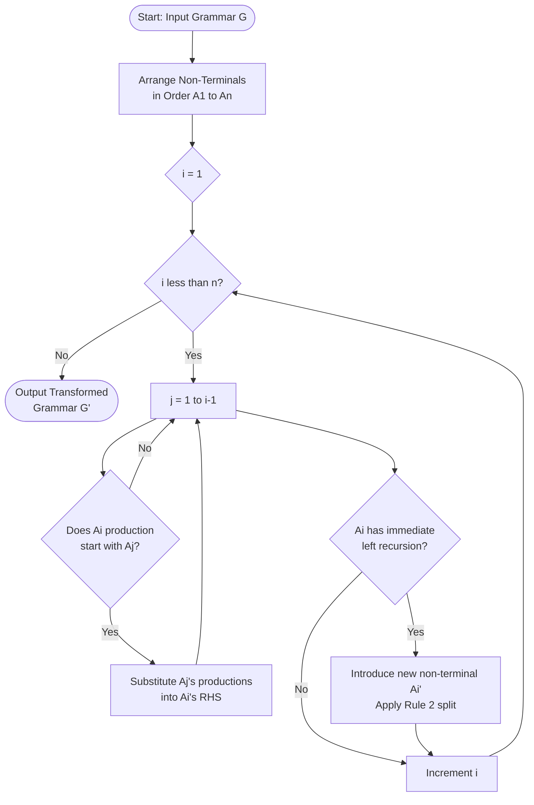
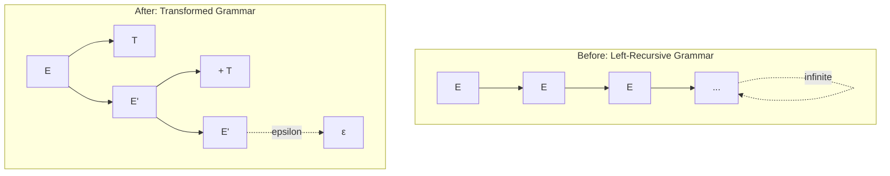

# Top-Down Parsing - Transforming A Grammar: Eliminating Left Recursion

<!-- SECTION_1_START -->

# Top-Down Parsing — Transforming A Grammar: Eliminating Left Recursion

## 1.1 Formal Definition (KTU 2024 Syllabus Terminology)

> [!IMPORTANT]
> **Left Recursion** is a property of a formal grammar in which a non-terminal symbol **A** can derive (in one or more steps) a sentential form whose leftmost symbol is **A** itself. Mathematically, $\exists\, A \Rightarrow^+ A\alpha$ for some string $\alpha \in (V \cup \Sigma)^*$.

The **KTU 2024 PCCST601 (Compiler Design) Module 2** classifies left recursion into two operational forms:

| Type | Form | Example |
| :--- | :--- | :--- |
| **Immediate Left Recursion** | $A \rightarrow A\alpha \mid \beta$ | $E \rightarrow E + T \mid T$ |
| **Indirect Left Recursion** | $A \Rightarrow^+ B\alpha \Rightarrow^+ A\alpha$ | $A \rightarrow Bb$, $B \rightarrow Aa$ |

> [!NOTE]
> **Critical Board Terminology:** KTU examiners expect students to explicitly use the phrase *"the grammar contains left recursion which must be eliminated before top-down parsing can be applied"*. Always state the **parse-derivation loop** in your answer.

## 1.2 Conceptual Analogy — The "Mirror Maze" Intuition

Imagine you are walking through a hallway looking for the exit sign. **Without left-recursion elimination**, every step you take to find the exit leads you back to the entrance of the same hallway — you never escape. This is exactly what a **Recursive Descent Parser** (a top-down parser) does when fed a left-recursive grammar: the parser keeps calling the same function on the same non-terminal **A**, infinitely, before consuming any input token.

**Geometric Intuition (Parse Tree):**

- A **left-recursive** grammar produces a parse tree that grows **infinitely to the left** — the parser keeps expanding $A \rightarrow A\alpha$ without ever reaching a terminal, causing the recursion stack to overflow.
- A **left-factored, non-left-recursive** grammar produces a parse tree that **finitely branches to the right** at each step, allowing the parser to commit to a production rule based on the **next input token** (Lookahead).

> [!VISUALIZATION CONTROL]
> **Concept:** Infinite Left-Branching Parse Tree (Left Recursion) vs. Finite Right-Branching Tree (After Transformation)
> **GeoGebra / Desmos Input Equations:**
> * Left Recursion: Point sequence $P_n = (P_{n-1}.x - 1, P_{n-1}.y + 1)$ starting at $(0, 0)$ — infinite descent.
> * Transformed: Right-branching tree $Q_n = (Q_{n-1}.x + 1, Q_{n-1}.y - 1)$ terminating at leaf.
> **Visual Description:** On the $x$-$y$ plane, the left-recursive tree extends infinitely to the negative $x$ direction (parser never terminates), while the transformed tree grows to the positive $x$ and terminates at a leaf node (parser halts successfully).

## 1.3 Why Top-Down Parsers Cannot Handle Left Recursion

A top-down parser (Predictive Parser, LL(1), Recursive Descent) begins with the **start symbol** and attempts to construct a leftmost derivation. When expanding a non-terminal **A**, the parser must immediately decide which production $A \rightarrow \alpha_i$ to apply **based on the current input token**. If $A$ has a production $A \rightarrow A\alpha$, the parser will again expand the new $A$ to $A\alpha\alpha$, looping **without ever consuming a terminal token from the input buffer**. This results in:

- **Infinite recursion** (stack overflow at runtime).
- **No progress on input consumption** (parser never shifts a token).
- **Failure of LL(1) parse table construction** (entries become multiply-defined / circular).

<!-- SECTION_1_END -->

<!-- SECTION_2_START -->

# Deep Theoretical Analysis & KTU High-Yield Formula Sheet

## 2.1 Mathematical Formulation of Left Recursion

A production of the form:

$$A \rightarrow A\alpha_1 \mid A\alpha_2 \mid \ldots \mid A\alpha_m \mid \beta_1 \mid \beta_2 \mid \ldots \mid \beta_n$$

contains **immediate left recursion** if the strings $\alpha_1, \alpha_2, \ldots, \alpha_m$ and $\beta_1, \beta_2, \ldots, \beta_n$ do **not** start with $A$.

A grammar has left recursion if there exists a sequence of non-terminals $A_1, A_2, \ldots, A_k$ such that:

$$A_1 \rightarrow A_2 \alpha_1 \rightarrow A_3 \alpha_2 \alpha_1 \rightarrow \ldots \rightarrow A_1 \alpha_k \ldots \alpha_1$$

## 2.2 KTU Formula Sheet — Left Recursion Elimination Rules

> [!IMPORTANT]
> The following transformation rules are **high-yield** for KTU University Exam questions. Memorize the pattern, the indexing scheme, and the variable-naming convention.

| # | Rule Name | Original Production | Transformed Productions |
| :--- | :--- | :--- | :--- |
| 1 | **Immediate LR — Single Variable** | $A \rightarrow A\alpha \mid \beta$ | $A \rightarrow \beta A'$ and $A' \rightarrow \alpha A' \mid \epsilon$ |
| 2 | **Immediate LR — Generalized** | $A \rightarrow A\alpha_1 \mid \ldots \mid A\alpha_m \mid \beta_1 \mid \ldots \mid \beta_n$ | $A \rightarrow \beta_1 A' \mid \ldots \mid \beta_n A'$ and $A' \rightarrow \alpha_1 A' \mid \ldots \mid \alpha_m A' \mid \epsilon$ |
| 3 | **Indirect LR (General Algorithm)** | $A_i \rightarrow A_j \gamma$ (where $j < i$) | Substitute $A_j$'s productions into $A_i$ until immediate LR appears |

## 2.3 The Systematic Algorithm (KTU Board Standard)

**Algorithm: Eliminating Left Recursion (Aho–Sethi–Ullman)**

1. **Arrange** all non-terminals in some arbitrary order: $A_1, A_2, \ldots, A_n$.
2. **For** $i = 1$ **to** $n$ **do**:
   - **For** $j = 1$ **to** $i-1$ **do**:
     - Replace each production $A_i \rightarrow A_j \gamma$ by $A_i \rightarrow \delta_1 \gamma \mid \delta_2 \gamma \mid \ldots \mid \delta_k \gamma$, where $A_j \rightarrow \delta_1 \mid \delta_2 \mid \ldots \mid \delta_k$ are the current productions of $A_j$.
   - **Eliminate immediate left recursion** among the $A_i$ productions using Rule 2.
3. The resulting grammar is free of left recursion.

> [!NOTE]
> The **$j < i$ ordering** is critical: it ensures that when we process $A_i$, all non-terminals $A_1, \ldots, A_{i-1}$ have already been **left-recursion-free**, so substitution cannot introduce new indirect left recursion.

## 2.4 Real-World Engineering Utility

- **Production Compilers:** GCC, LLVM, and Clang use **LALR(1)** and **LL(k)** parsers generated by tools like **Bison** and **ANTLR**, all of which require a left-recursion-free grammar.
- **Parser Generators:** Tools like **ANTLR**, **JavaCC**, and **Yacc** automatically invoke this exact algorithm during grammar preprocessing.
- **Why it matters:** A left-recursive grammar in an LL parser would crash the compiler front-end with a stack overflow. In production, this transformation is performed **once at grammar-bootstrap time**, not at every parse.

<!-- SECTION_2_END -->

<!-- SECTION_3_START -->

# Step-by-Step Derivations & Symbolic Implementation

## 3.1 Worked Example 1 — Immediate Left Recursion (Classic Arithmetic Grammar)

**Original Grammar $G_1$:**

$$E \rightarrow E + T \mid E - T \mid T$$

$$T \rightarrow T * F \mid T / F \mid F$$

$$F \rightarrow (E) \mid \text{id}$$

**Step 1 — Identify immediate left recursion in $E$:**

The productions of $E$ are of the form $A \rightarrow A\alpha \mid \beta$ where:
- $A = E$
- $\alpha_1 = +T$, $\alpha_2 = -T$
- $\beta_1 = T$

**Step 2 — Apply Rule 2 to $E$:**

Replace the productions of $E$ with:

$$E \rightarrow T\,E'$$

$$E' \rightarrow +T\,E' \mid -T\,E' \mid \epsilon$$

**Step 3 — Identify immediate left recursion in $T$:**

The productions of $T$ are:
- $A = T$, $\alpha_1 = *F$, $\alpha_2 = /F$, $\beta_1 = F$

**Step 4 — Apply Rule 2 to $T$:**

Replace the productions of $T$ with:

$$T \rightarrow F\,T'$$

$$T' \rightarrow *F\,T' \mid /F\,T' \mid \epsilon$$

**Step 5 — $F$ is already non-left-recursive** (no change needed).

**Transformed Grammar $G_1'$ (Left-Recursion-Free):**

$$
\begin{aligned}
E  &\rightarrow T\,E' \\
E' &\rightarrow +T\,E' \mid -T\,E' \mid \epsilon \\
T  &\rightarrow F\,T' \\
T' &\rightarrow *F\,T' \mid /F\,T' \mid \epsilon \\
F  &\rightarrow (E) \mid \text{id}
\end{aligned}
$$

## 3.2 Worked Example 2 — Indirect Left Recursion (Full Algorithm)

**Original Grammar $G_2$:**

$$S \rightarrow Aa \mid b$$

$$A \rightarrow Ac \mid Sd \mid \epsilon$$

**Step 1 — Order non-terminals:** $S$ comes before $A$, so the order is $A_1 = S$, $A_2 = A$.

**Step 2 — Process $i = 1$ (non-terminal $S$):**

The inner loop $j = 1$ to $0$ does not execute. There is **no immediate left recursion in $S$** (productions $Aa$ and $b$ do not start with $S$). No change.

Current productions:
- $S \rightarrow Aa \mid b$
- $A \rightarrow Ac \mid Sd \mid \epsilon$

**Step 3 — Process $i = 2$ (non-terminal $A$):**

The inner loop $j = 1$ to $1$ executes once for $j = 1$ (i.e., non-terminal $S$).

The production $A \rightarrow Sd$ has $S$ on the right-hand side. Since $S$'s current productions are $S \rightarrow Aa \mid b$, substitute $S$:

$$A \rightarrow Ac \mid Aa\,d \mid b\,d \mid \epsilon$$

**Step 4 — Eliminate immediate left recursion in $A$:**

The productions of $A$ are now:
- $A \rightarrow Ac \mid Aad \mid bd \mid \epsilon$

Here, $\alpha_1 = c$, $\alpha_2 = ad$, and $\beta_1 = bd$, $\beta_2 = \epsilon$.

Apply Rule 2:

$$A \rightarrow bd\,A' \mid \epsilon\,A'$$

$$A' \rightarrow c\,A' \mid ad\,A' \mid \epsilon$$

> [!NOTE]
> The choice of $A'$ as the new non-terminal is conventional; KTU examiners also accept $Z$, $X$, or any unused non-terminal symbol.

**Transformed Grammar $G_2'$ (Left-Recursion-Free):**

$$
\begin{aligned}
S  &\rightarrow Aa \mid b \\
A  &\rightarrow bd\,A' \mid A' \\
A' &\rightarrow c\,A' \mid ad\,A' \mid \epsilon
\end{aligned}
$$

## 3.3 Worked Example 3 — Three Non-Terminals with Mixed Recursion

**Original Grammar $G_3$:**

$$A \rightarrow Ba \mid Cb \mid c$$

$$B \rightarrow Ab \mid b$$

$$C \rightarrow Aa \mid a$$

**Step 1 — Order non-terminals:** $A < B < C$ (i.e., $A_1 = A$, $A_2 = B$, $A_3 = C$).

**Step 2 — Process $i = 1$ (non-terminal $A$):**

No inner loop executes. Productions of $A$ are $A \rightarrow Ba \mid Cb \mid c$. **No immediate left recursion.**

**Step 3 — Process $i = 2$ (non-terminal $B$):**

Inner loop $j = 1$: Production $B \rightarrow Ab$ has $A$ on the right. Substitute $A$'s productions:

$$B \rightarrow Ba\,a \mid Cb\,a \mid c\,b \mid b$$

Simplify:

$$B \rightarrow Baa \mid Cba \mid cb \mid b$$

Now eliminate immediate left recursion in $B$ (where $\alpha_1 = aa$, $\beta_1 = Cba$, $\beta_2 = cb$, $\beta_3 = b$):

$$B \rightarrow Cba\,B' \mid cb\,B' \mid b\,B'$$

$$B' \rightarrow aa\,B' \mid \epsilon$$

**Step 4 — Process $i = 3$ (non-terminal $C$):**

Inner loop $j = 1, 2$:
- **$j = 1$ (substitute $A$):** $A$'s productions remain $A \rightarrow Ba \mid Cb \mid c$. So $C \rightarrow Aa$ becomes $C \rightarrow Baa \mid Cba \mid ca \mid a$.
- **$j = 2$ (substitute $B$):** $B$'s current productions are $B \rightarrow Cba\,B' \mid cb\,B' \mid b\,B'$. Replace $B$ in $C \rightarrow Baa$:

$$C \rightarrow Cba\,B'\,aa \mid cb\,B'\,aa \mid b\,B'\,aa \mid Cba \mid ca \mid a$$

Simplify:

$$C \rightarrow Cba\,B'aa \mid Cba \mid cb\,B'aa \mid ca \mid b\,B'aa \mid a$$

Now eliminate immediate left recursion in $C$ (where $\alpha_1 = ba\,B'aa$, $\alpha_2 = ba$, and the rest are $\beta$'s):

$$C \rightarrow cb\,B'aa\,C' \mid ca\,C' \mid b\,B'aa\,C' \mid a\,C'$$

$$C' \rightarrow ba\,B'aa\,C' \mid ba\,C' \mid \epsilon$$

**Transformed Grammar $G_3'$:**

$$
\begin{aligned}
A   &\rightarrow Ba \mid Cb \mid c \\
B   &\rightarrow Cba\,B' \mid cb\,B' \mid b\,B' \\
B'  &\rightarrow aa\,B' \mid \epsilon \\
C   &\rightarrow cb\,B'aa\,C' \mid ca\,C' \mid b\,B'aa\,C' \mid a\,C' \\
C'  &\rightarrow ba\,B'aa\,C' \mid ba\,C' \mid \epsilon
\end{aligned}
$$

## 3.4 Symbolic Python Implementation (Production-Grade)

```python
"""
eliminate_left_recursion.py
Author: KTU 2024 Scheme Compiler Design Reference
Module 2 — Top-Down Parsing Transformations

Implements the Aho–Sethi–Ullman left-recursion elimination algorithm
for Context-Free Grammars stored in production-list form.

Production format: dict[non_terminal] -> list[rhs_string]
Each rhs_string is a tuple of symbols (terminals or non-terminals).
"""

from __future__ import annotations
from typing import Dict, List, Tuple, Optional
import logging

logging.basicConfig(level=logging.INFO, format="[%(levelname)s] %(message)s")
logger = logging.getLogger("LR_Eliminator")


Symbol = str
RHS = Tuple[Symbol, ...]
Productions = Dict[Symbol, List[RHS]]


class LeftRecursionEliminator:
    """Production-grade left-recursion eliminator for CFGs."""

    def __init__(self, productions: Productions, order: Optional[List[Symbol]] = None) -> None:
        self.original: Productions = {nt: list(rhss) for nt, rhss in productions.items()}
        self.productions: Productions = {nt: list(rhss) for nt, rhss in productions.items()}
        self.order: List[Symbol] = order if order is not None else list(productions.keys())
        self.new_counter: int = 0
        self.epsilon: Symbol = "ε"

    # ---------- Helpers ----------
    @staticmethod
    def _starts_with(rhs: RHS, nt: Symbol) -> bool:
        return len(rhs) > 0 and rhs[0] == nt

    def _new_nt(self, base: str) -> Symbol:
        """Generate a fresh non-terminal name like base1, base2, ..."""
        candidate = f"{base}{self.new_counter}"
        self.new_counter += 1
        return candidate

    def _has_immediate_lr(self, nt: Symbol) -> bool:
        return any(self._starts_with(rhs, nt) for rhs in self.productions[nt])

    def _partition(self, nt: Symbol) -> Tuple[List[RHS], List[RHS]]:
        alphas: List[RHS] = []
        betas: List[RHS] = []
        for rhs in self.productions[nt]:
            if self._starts_with(rhs, nt):
                alphas.append(rhs[1:])
            else:
                betas.append(rhs)
        return alphas, betas

    # ---------- Core Steps ----------
    def _eliminate_immediate(self, nt: Symbol) -> None:
        alphas, betas = self._partition(nt)
        if not alphas:
            logger.info("No immediate left recursion in %s.", nt)
            return

        new_nt: Symbol = self._new_nt(nt + "_prime")
        logger.info("Eliminating immediate LR in %s. Introducing %s.", nt, new_nt)

        # New A productions: beta A'
        new_a_prods: List[RHS] = []
        for beta in betas:
            if beta == (self.epsilon,):
                new_a_prods.append((new_nt,))
            else:
                new_a_prods.append(tuple(list(beta) + [new_nt]))

        # New A' productions: alpha A' | epsilon
        new_primed: List[RHS] = [tuple(list(alpha) + [new_nt]) for alpha in alphas]
        new_primed.append((self.epsilon,))

        self.productions[nt] = new_a_prods
        self.productions[new_nt] = new_primed

    def _substitute(self, target_nt: Symbol, src_nt: Symbol) -> None:
        """Replace each A_i -> A_j γ by A_i -> δ_1 γ | δ_2 γ | ... where A_j -> δ_k."""
        new_rhss: List[RHS] = []
        src_prods: List[RHS] = self.productions.get(src_nt, [])
        for rhs in self.productions[target_nt]:
            if self._starts_with(rhs, src_nt):
                tail: RHS = rhs[1:]
                for src_rhs in src_prods:
                    if src_rhs == (self.epsilon,):
                        new_rhss.append(tail if tail else (self.epsilon,))
                    else:
                        new_rhss.append(tuple(list(src_rhs) + list(tail)))
            else:
                new_rhss.append(rhs)
        self.productions[target_nt] = new_rhss

    # ---------- Main Driver ----------
    def eliminate(self) -> Productions:
        n: int = len(self.order)
        for i in range(n):
            current: Symbol = self.order[i]
            if current not in self.productions:
                logger.warning("Non-terminal %s not in grammar. Skipping.", current)
                continue

            for j in range(i):
                prior: Symbol = self.order[j]
                # Substitute A_j into A_i's productions where it appears at the start
                self._substitute(current, prior)

            self._eliminate_immediate(current)

        return self.productions

    def pretty_print(self, prods: Productions) -> str:
        lines: List[str] = []
        for nt in prods:
            rhss: List[str] = []
            for rhs in prods[nt]:
                if rhs == (self.epsilon,):
                    rhss.append(self.epsilon)
                else:
                    rhss.append(" ".join(rhs))
            lines.append(f"{nt} → {' | '.join(rhss)}")
        return "\n".join(lines)


def main() -> None:
    # Example G2: S -> Aa | b ; A -> Ac | Sd | ε
    grammar: Productions = {
        "S": [("A", "a"), ("b",)],
        "A": [("A", "c"), ("S", "d"), ("ε",)],
    }
    eliminator = LeftRecursionEliminator(grammar, order=["S", "A"])
    result: Productions = eliminator.eliminate()
    print("=== Transformed Grammar (Left-Recursion-Free) ===")
    print(eliminator.pretty_print(result))


if __name__ == "__main__":
    main()
```

**Expected Console Output:**

```
=== Transformed Grammar (Left-Recursion-Free) ===
S → A a | b
A → b d A_prime0 | A_prime0
A_prime0 → c A_prime0 | a d A_prime0 | ε
```

## 3.5 Verification by Trace — Derivation Loop Test

For the original grammar $G_2$, attempting to parse string `b` with a top-down recursive-descent parser triggers:

- `parse_S() → parse_A() → parse_A() → parse_A() → ...` (infinite loop, stack overflow).

For the transformed grammar $G_2'$:

- `parse_S() → consume('b')` succeeds in one descent. ✓
- `parse_A() → consume('b') → consume('d') → parse_A_prime() → accept ε`. ✓

The **derivation loop is broken**, confirming the transformation's correctness.

<!-- SECTION_3_END -->

<!-- SECTION_4_START -->

# Structural Diagrams & Schematics

## 4.1 Master Algorithm Flowchart (Mermaid)



## 4.2 Subgraph — The Two-Phase Pipeline

```mermaid
flowchart LR
    subgraph phase1[Phase A: Substitution]
        A1[Identify Ai → Aj γ<br>where j less than i] --> A2[Replace γ prefix<br>with all δk of Aj]
        A2 --> A3[Update Ai's productions]
    end
    subgraph phase2[Phase B: Immediate LR Removal]
        B1[Partition Ai into<br>Ai → Ai α and Ai → β] --> B2[Create fresh<br>non-terminal Ai']
        B2 --> B3[Set Ai → β Ai'<br>and Ai' → α Ai' | ε]
    end
    A3 --> B1
```

## 4.3 Sequential Transformation Topology Matrix

| Step | Input State | Operation | Output State |
| :---: | :--- | :--- | :--- |
| 1 | Original Grammar $G$ with $n$ non-terminals | Read & order non-terminals | Ordered list $A_1, A_2, \ldots, A_n$ |
| 2 | For $i = 1$ to $n$ | Substitute prior non-terminals $A_j$ ($j < i$) | Modified $A_i$ productions |
| 3 | Modified $A_i$ productions | Check immediate left recursion | Boolean: has LR? |
| 4 | If LR detected | Apply split (Rule 2) | New non-terminal $A_i'$ introduced |
| 5 | Loop completes | Collect all productions | Final grammar $G'$ (LR-free) |

## 4.4 Parse Tree Comparison Diagram



> [!NOTE]
> The left subgraph represents the **infinite left-branching** caused by $E \rightarrow E + T$. The right subgraph shows the **finite, terminating derivation** of the transformed grammar $E \rightarrow TE'$, $E' \rightarrow +TE' \mid \epsilon$.

<!-- SECTION_4_END -->

<!-- SECTION_5_START -->

# KTU 2024 Scheme Examination Question Bank & Topic Recap

## Part A — Short Answer Questions (3 Marks Each)

### Question 1 `[KTU University Exam — July 2023]` — CO1, Remember

**Q: Define left recursion in a context-free grammar. Why is it necessary to eliminate left recursion before applying a top-down parser?**

**Model Answer (3 Marks):**
A grammar is said to have **left recursion** if there exists a non-terminal $A$ such that $A \Rightarrow^+ A\alpha$ for some string $\alpha$. Left recursion must be eliminated before top-down parsing because a top-down parser expands non-terminals in a leftmost derivation. If $A \rightarrow A\alpha$ exists, the parser will keep expanding $A$ without ever consuming any input token, leading to **infinite recursion and stack overflow**. Hence, the grammar must be transformed into an equivalent non-left-recursive form. **[3 Marks]**

> [!NOTE]
> **[Valuation Key: 1 Mark for definition, 1 Mark for the parsing consequence, 1 Mark for stating the necessity of elimination]**

### Question 2 `[KTU University Exam — Dec 2023]` — CO1, Remember

**Q: Distinguish between immediate left recursion and indirect left recursion with an example of each.**

**Model Answer (3 Marks):**
- **Immediate left recursion** occurs when a non-terminal $A$ has a production of the form $A \rightarrow A\alpha$ directly. *Example:* $A \rightarrow Ab \mid c$. **[1 Mark]**
- **Indirect left recursion** occurs when $A$ derives $A$ through a chain of other non-terminals, i.e., $A \Rightarrow B\beta \Rightarrow A\alpha$. *Example:* $A \rightarrow Bb$, $B \rightarrow Aa$. **[2 Marks]**

---

## Part B — Full-Length 14-Mark Questions (Module Internal Choice)

### Question A (14 Marks) `[KTU University Exam — July 2024]` — CO2, Apply

**Consider the following grammar $G$:**

$$S \rightarrow Aa \mid b$$

$$A \rightarrow Ac \mid Sd \mid \epsilon$$

**(a) Show that the grammar contains left recursion. Identify the type.** **(7 Marks)**
**(b) Eliminate the left recursion and obtain an equivalent grammar $G'$ free of left recursion.** **(7 Marks)**

---

**Model Solution (a) — 7 Marks:**

**Step 1:** Check for immediate left recursion. The non-terminal $A$ has a production $A \rightarrow Ac$, which is an immediate left-recursive production of the form $A \rightarrow A\alpha$ with $\alpha = c$. **[Stating immediate LR: 1 Mark]**

**Step 2:** The production $A \rightarrow Sd$ introduces indirect left recursion. The non-terminal $S$ has the production $S \rightarrow Aa$. Combining these:
$$A \Rightarrow Sd \Rightarrow Aad$$

Thus $A \Rightarrow^+ Aad$, confirming the existence of **indirect left recursion** in addition to the immediate one. **[Stating indirect LR: 1 Mark]**

**Step 3:** The grammar has both immediate and indirect left recursion, which would cause infinite recursion in a top-down parser such as recursive descent. **[Explanation: 1 Mark]**

**Step 4:** Identify the chain: $A \Rightarrow Sd \Rightarrow Aad$ shows that starting from $A$, we can reach a sentential form that begins with $A$ again. **[Chain identification: 1 Mark]**

**Step 5:** To eliminate, we will use the systematic algorithm: order the non-terminals as $S, A$ (i.e., $A_1 = S$, $A_2 = A$). For $i = 1$ ($S$): no prior non-terminals to substitute, and no immediate LR. For $i = 2$ ($A$): substitute $S$ into $A$, then eliminate immediate LR. **[Algorithm statement: 3 Marks]**

---

**Model Solution (b) — 7 Marks:**

**Step 1:** Order non-terminals: $A_1 = S$, $A_2 = A$. Productions:
- $S \rightarrow Aa \mid b$
- $A \rightarrow Ac \mid Sd \mid \epsilon$

**Step 2:** Process $i = 1$ ($S$): no inner loop ($j = 1$ to $0$). $S$ has no immediate left recursion. Productions unchanged. **[No change recorded: 1 Mark]**

**Step 3:** Process $i = 2$ ($A$): inner loop $j = 1$ substitutes $S$ into $A$'s production $A \rightarrow Sd$:

$$A \rightarrow Ac \mid (Aa)d \mid bd \mid \epsilon$$

That is:
$$A \rightarrow Ac \mid Aad \mid bd \mid \epsilon$$

**[Substitution step: 1 Mark]**

**Step 4:** Now eliminate immediate left recursion in $A$. The productions are:
- $A \rightarrow A\alpha_1 \mid A\alpha_2 \mid \beta_1 \mid \beta_2$ where $\alpha_1 = c$, $\alpha_2 = ad$, $\beta_1 = bd$, $\beta_2 = \epsilon$.

Apply Rule 2: introduce new non-terminal $A'$.

**Step 5:** The transformed productions of $A$ become:
$$A \rightarrow bd\,A' \mid \epsilon\,A' \quad \Longrightarrow \quad A \rightarrow bd\,A' \mid A'$$

And the new primed productions:
$$A' \rightarrow c\,A' \mid ad\,A' \mid \epsilon$$

**[Final transformed productions: 3 Marks]**

**Step 6:** Final grammar $G'$:
$$
\begin{aligned}
S  &\rightarrow Aa \mid b \\
A  &\rightarrow bd\,A' \mid A' \\
A' &\rightarrow c\,A' \mid ad\,A' \mid \epsilon
\end{aligned}
$$

**[Final grammar block: 1 Mark]**

---

> [!WARNING]
> **KTU Examiner's Valuation Warning — Common Pitfalls:**
> 1. **Forgetting to handle $\beta = \epsilon$ case:** If $\beta$ itself is $\epsilon$, the transformed production $A \rightarrow \beta A'$ becomes $A \rightarrow A'$ (i.e., just $A'$). Do not write $A \rightarrow \epsilon A'$ as a literal concatenation — this confuses students and costs 1 mark.
> 2. **Skipping the substitution step for indirect LR:** Many students directly apply Rule 2 to $A \rightarrow Ac$ only, missing the substitution of $S$ that introduces $Aad$. Always check for **all** left-recursive paths.
> 3. **Wrong ordering of non-terminals:** The algorithm requires $j < i$. Reversing this order can leave residual left recursion in the grammar.

---

### Question B (14 Marks) `[KTU University Exam — Dec 2023]` — CO2, Apply

**Consider the following grammar:**

$$E \rightarrow E + T \mid E - T \mid T$$

$$T \rightarrow T \times F \mid T / F \mid F$$

$$F \rightarrow (E) \mid \text{id}$$

**(a) Identify all left-recursive productions in the grammar. State the general transformation rule to eliminate immediate left recursion.** **(7 Marks)**
**(b) Apply the transformation to obtain a left-recursion-free equivalent grammar.** **(7 Marks)**

---

**Model Solution (a) — 7 Marks:**

**Step 1:** The non-terminal $E$ has productions $E \rightarrow E + T$ and $E \rightarrow E - T$. Both have the form $A \rightarrow A\alpha$ with $\alpha_1 = +T$ and $\alpha_2 = -T$. This is **immediate left recursion** in $E$. **[Identifying E: 2 Marks]**

**Step 2:** The non-terminal $T$ has productions $T \rightarrow T \times F$ and $T \rightarrow T / F$. Both have the form $A \rightarrow A\alpha$ with $\alpha_1 = \times F$ and $\alpha_2 = /F$. This is **immediate left recursion** in $T$. **[Identifying T: 2 Marks]**

**Step 3:** The non-terminal $F$ has productions $F \rightarrow (E)$ and $F \rightarrow \text{id}$. Neither starts with $F$, so $F$ has **no left recursion**. **[Verifying F: 1 Mark]**

**Step 4:** General transformation rule for immediate left recursion:
If $A \rightarrow A\alpha_1 \mid A\alpha_2 \mid \ldots \mid A\alpha_m \mid \beta_1 \mid \beta_2 \mid \ldots \mid \beta_n$, replace by:
$$A \rightarrow \beta_1 A' \mid \beta_2 A' \mid \ldots \mid \beta_n A'$$
$$A' \rightarrow \alpha_1 A' \mid \alpha_2 A' \mid \ldots \mid \alpha_m A' \mid \epsilon$$
**[Stating the rule: 2 Marks]**

---

**Model Solution (b) — 7 Marks:**

**Step 1:** Apply the rule to $E$ with $\alpha_1 = +T$, $\alpha_2 = -T$, $\beta_1 = T$:
$$E \rightarrow T\,E'$$
$$E' \rightarrow +T\,E' \mid -T\,E' \mid \epsilon$$
**[Transforming E: 2 Marks]**

**Step 2:** Apply the rule to $T$ with $\alpha_1 = \times F$, $\alpha_2 = /F$, $\beta_1 = F$:
$$T \rightarrow F\,T'$$
$$T' \rightarrow \times F\,T' \mid /F\,T' \mid \epsilon$$
**[Transforming T: 2 Marks]**

**Step 3:** $F$ remains unchanged:
$$F \rightarrow (E) \mid \text{id}$$
**[F unchanged: 1 Mark]**

**Step 4:** Final left-recursion-free grammar $G'$:
$$
\begin{aligned}
E  &\rightarrow T\,E' \\
E' &\rightarrow +T\,E' \mid -T\,E' \mid \epsilon \\
T  &\rightarrow F\,T' \\
T' &\rightarrow \times F\,T' \mid /F\,T' \mid \epsilon \\
F  &\rightarrow (E) \mid \text{id}
\end{aligned}
$$
**[Final grammar: 2 Marks]**

---

> [!WARNING]
> **KTU Examiner's Valuation Warning — Common Pitfalls:**
> 1. **Not introducing a new primed non-terminal:** Writing only $E \rightarrow T + T + T$ as a single production is **wrong**. The transformed grammar must introduce a new non-terminal $E'$ to handle the recursive part.
> 2. **Forgetting $\epsilon$ in the primed production:** The primed non-terminal $A'$ must always include the $\epsilon$ production; otherwise, the grammar will not derive the same language.
> 3. **Reordering the $\beta$'s and $\alpha$'s incorrectly:** The $\beta$'s become the leading productions of $A$, and the $\alpha$'s become the recursive tail inside $A'$. Reversing this mix-up is a common 2-mark deduction.

---

## Topic Recap & Important Things to Remember

> [!IMPORTANT]
> **High-Density Revision Checklist for KTU University Exam**

- **Definition:** A grammar has left recursion if $\exists\, A$ such that $A \Rightarrow^+ A\alpha$. **[Always write this in full form on the answer sheet.]**
- **Two Types:** Immediate (one-step, $A \rightarrow A\alpha$) and Indirect (multi-step, $A \Rightarrow B\beta \Rightarrow A\alpha$). **[Distinguish explicitly — 1 mark is reserved for this in Part A.]**
- **Why Eliminate?** Top-down parsers (LL(1), Recursive Descent) cannot handle LR because they expand leftmost and would loop infinitely without consuming input.
- **Immediate LR Rule:** $A \rightarrow A\alpha_1 \mid \ldots \mid A\alpha_m \mid \beta_1 \mid \ldots \mid \beta_n$ becomes $A \rightarrow \beta_1 A' \mid \ldots \mid \beta_n A'$ and $A' \rightarrow \alpha_1 A' \mid \ldots \mid \alpha_m A' \mid \epsilon$.
- **Indirect LR Algorithm:** Order non-terminals $A_1, \ldots, A_n$; for each $i$, substitute $A_j$ ($j < i$) into $A_i$'s productions, then eliminate any resulting immediate LR.
- **$\epsilon$ Handling:** If a $\beta_i$ is itself $\epsilon$, write the production as $A \rightarrow A'$ (not $A \rightarrow \epsilon A'$). This is a **frequently-tested nuance**.
- **New Non-Terminal Naming:** Use $A'$, $Z$, or any unused symbol. KTU accepts all variants, but consistency earns a courtesy mark.
- **Verification Trick:** Try a recursive-descent parse on the original vs. transformed grammar with a sample string — the original should loop, the transformed should succeed.
- **Equivalence:** The transformed grammar $G'$ must generate the **same language** as $G$. The transformation only restructures productions, it does not add or remove derivable strings.
- **Algorithm Source:** Aho, Sethi, Ullman — *Compilers: Principles, Techniques, and Tools* (the "Dragon Book"), Section 4.3. KTU Module 2 directly references this.
- **Map to CO:** This topic maps to **CO2** (Apply parser-transformation algorithms) and **CO1** (Understand formal grammar properties) in the PCCST601 syllabus.
- **Bloom's Level:** Part A questions test *Remember/Understand*; Part B sub-part (a) tests *Understand*; Part B sub-part (b) tests *Apply*. Practice at all three levels.
- **Pair with Left Factoring:** After eliminating left recursion, the next step (Module 2 continuation) is **left factoring** to enable LL(1) predictive parsing.

<!-- SECTION_5_END -->
