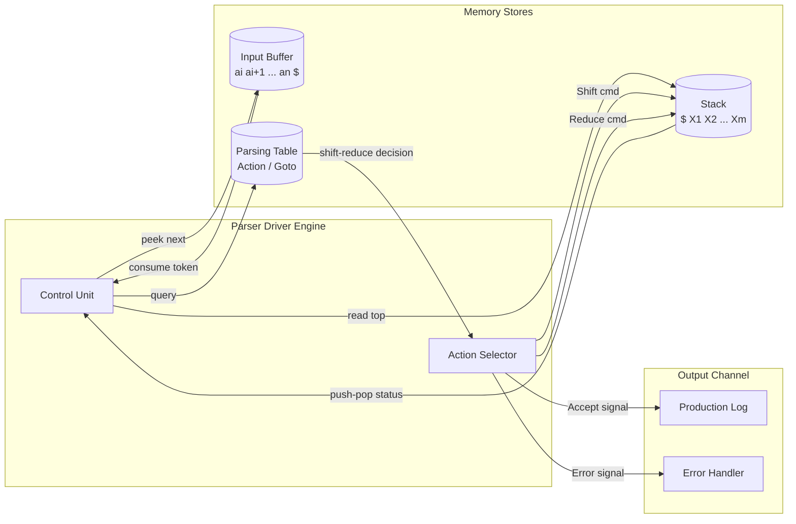
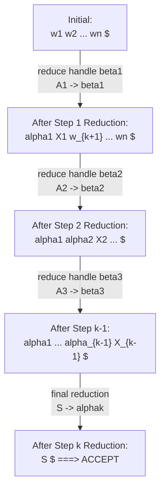
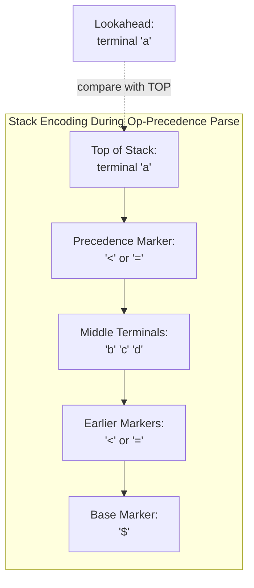
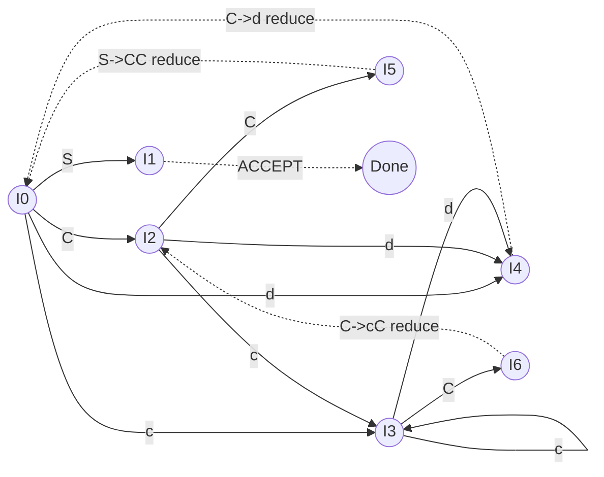

# Bottom-Up Parsing: Shift-Reduce parsing model, Handle pruning, Operator Precedence parsing, Viable prefixes

<!-- SECTION_1_START -->

# Bottom-Up Parsing: Foundations & Intuition

> [!IMPORTANT]
> **KTU 2024 Scheme — Module 2 Anchor Concept**
> Bottom-up parsing is a **reduction-driven** syntax analysis strategy. It starts from the input token stream (leaves of the parse tree) and attempts to build the tree upwards until the start symbol $S$ is reached at the root.

## 1.1 Formal Academic Definition (KTU 2024 Terminology)

**Bottom-Up Parsing** is a class of deterministic syntax-analysis techniques that reconstructs the parse tree by repeatedly applying **production rules in reverse** (called *reductions*) to substrings of the sentential form. Each reduction replaces a *handle* — a substring matching the right-hand side of a production — with its corresponding left-hand side non-terminal.

The general control flow is:

$$
\text{Input tokens} \;\Rightarrow\; \underbrace{\text{Shift}}_{\text{move token to stack}} \;\Rightarrow\; \underbrace{\text{Reduce}}_{\text{apply } A \to \beta} \;\Rightarrow\; \text{Start Symbol } S
$$

The KTU 2024 syllabus (Module 2) emphasizes three subordinate models:

| Sub-Model | Core Idea |
|---|---|
| **Shift-Reduce Parsing** | Stack-based engine; alternates *Shift* (push token) and *Reduce* (pop RHS, push LHS) actions. |
| **Operator Precedence Parsing** | Uses three precedence relations $\prec$, $\doteq$, $\succ$ between terminal symbols to drive reductions. |
| **Viable Prefix Theory** | Defines which stack contents are *legal prefixes* of a right-sentential form — central to **LR parsing** family. |

## 1.2 Intuitive Analogy (Plain English)

> [!NOTE]
> **Analogy — "Reverse Sentence Assembly"**
> Imagine a sentence was originally built by gluing small words into chunks, then chunks into phrases, finally into a complete sentence. **Bottom-up parsing is like disassembling the sentence in exactly the reverse order** — first spotting small word groups and merging them into chunks, then chunks into phrases, until you recover the original subject-verb skeleton.
>
> Every time the disassembler sees a known chunk, it **reduces** it. The current set of recovered chunks sitting on the workbench is the **viable prefix** — anything beyond a viable prefix cannot be safely reduced without risking an incorrect parse.

## 1.3 Key Terminology Pre-loaded

> [!IMPORTANT]
> **Handle**: A substring of a right-sentential form that matches the RHS of a production and whose reduction represents one step in a rightmost derivation (in reverse).
>
> **Handle Pruning**: The process of repeatedly locating and reducing handles until only the start symbol remains.
>
> **Viable Prefix**: A prefix of a right-sentential form that can appear on the stack of a shift-reduce parser without violating the grammar's constraints.
>
> **Stack Prefix Property**: A viable prefix is a prefix of some right-sentential form derivable from the start symbol.

## 1.4 Physical Constants & Standard Metrics (KTU Board Emphasis)

- **Number of precedence relations**: Exactly **3** — $\prec$ (yields precedence to), $\doteq$ (takes precedence to), $\succ$ (has precedence over).
- **Required state-storage**: At least **$O(n)$** where $n$ is the input length (stack grows linearly).
- **Parser Class Bound**: Bottom-up parsers cover the class of **LR(k)** grammars, which strictly subsumes LL(k).
- **Complexity of Operator-Precedence parser**: $O(n)$ per token, with **no backtracking**.

> [!VISUALIZATION CONTROL]
> **Concept:** Geometric view of rightmost derivation reverse (Bottom-up parse tree growth)
> **GeoGebra / Desmos Input Equations:**
> * `f(x) = x` (identity line — represents base input token stream)
> * `P(t) = (t, t^2)` parametric — represents parse tree growth from $(0,0)$ upward
> * `R(n) = sum(1/n, n=1..k)` — represents cumulative reductions
> **Visual Description:** Plot the parse tree on a coordinate plane where the $x$-axis represents input position and the $y$-axis represents derivation depth. Bottom-up parsing is visualized as a curve **growing upward** from the $x$-axis toward the apex at $(0, 0)$ representing the start symbol $S$.

<!-- SECTION_1_END -->

<!-- SECTION_2_START -->

# Deep Theoretical Analysis & KTU High-Yield Formula Sheet

## 2.1 The Shift-Reduce Parsing Model

The shift-reduce parser is the canonical implementation skeleton of all bottom-up parsers (LR(0), SLR, CLR, LALR). It maintains four components:

$$
\text{Parser} = \langle \text{Stack},\; \text{Input Buffer},\; \text{Parsing Table},\; \text{Driver} \rangle
$$

### 2.1.1 The Four Fundamental Actions

> [!NOTE]
> 1. **Shift** — Push the next input symbol onto the stack. (Read-and-push action.)
> 2. **Reduce** — Pop the RHS $\beta$ of production $A \to \beta$ from the stack; push LHS $A$.
> 3. **Accept** — Parsing successfully completed; only $S$ on the stack and input empty.
> 4. **Error** — No valid action defined for current configuration; call error-recovery routine.

### 2.1.2 Configuration Definition

A **configuration** of a shift-reduce parser is the pair:

$$
(\text{Stack contents},\; \text{Remaining Input}) = (\$X_1 X_2 \cdots X_m,\; a_i a_{i+1} \cdots a_n \$)
$$

where the stack always begins with bottom-of-stack marker $\$$ and the input ends with the end-of-file marker $\$$. Each action transitions the parser to a new configuration.

## 2.2 Handle & Handle Pruning — Rigorous Treatment

### 2.2.1 Formal Handle Definition

> [!IMPORTANT]
> A **handle** of a right-sentential form $\gamma$ is a pair $(A \to \beta,\, k)$ where:
> * $A \to \beta$ is a production of the grammar,
> * $\beta$ occurs as a substring of $\gamma$ at position $k$,
> * Reducing $\beta$ to $A$ at position $k$ yields the previous right-sentential form in the rightmost derivation.

If we denote the rightmost derivation as $S \Rightarrow_{rm}^{*} \alpha A w \Rightarrow_{rm} \alpha \beta w$, then $\beta$ in position following $\alpha$ is the **handle**.

### 2.2.2 Handle Pruning Algorithm

```
ALGORITHM: Handle_Pruning
INPUT : Token stream w$, grammar G with start symbol S
OUTPUT: Parse success or error

1.  push($) onto Stack
2.  push(first token of w) onto Stack          // initial shift
3.  WHILE True DO
4.      IF top-of-Stack == $S AND next input == $
5.           THEN return ACCEPT
6.      ELSE find handle β at top of Stack
7.           IF handle found
8.               THEN |β| = k
9.                    pop k symbols from Stack
10.                   push LHS A (where A → β) onto Stack
11.                   output production A → β
12.           ELSE shift next input symbol onto Stack
13.  END WHILE
```

### 2.2.3 The "Why" Behind Each Step

* The **bottom-marker $\$$** ensures the parser knows the stack boundary — a sentinel of legal stack growth.
* Reducing a handle always corresponds to **one step backward** in the rightmost derivation; this guarantees deterministic progress.
* The order in which we reduce handles (rightmost first) is critical: this is the *reverse rightmost* strategy.

## 2.3 Operator Precedence Parsing

### 2.3.1 The Three Precedence Relations

| Relation | Meaning | Read as |
|---|---|---|
| $a \prec b$ | $a$ **yields precedence to** $b$ | "$a$ has lower precedence than $b$" |
| $a \doteq b$ | $a$ **takes precedence to** $b$ | "$a$ and $b$ have equal precedence" |
| $a \succ b$ | $a$ **has precedence over** $b$ | "$a$ has higher precedence than $b$" |

> [!IMPORTANT]
> **Crucial Distinction from Infix Math:** Unlike arithmetic operators, these three relations are **ordered pairs** over terminals, not single-symbol binary operators. So $a \prec b$ and $b \succ a$ are different conventions but express the same precedence.

### 2.3.2 Method to Compute Precedence Relations

Given a grammar $G$:

1. **For $a \doteq b$**: Find a production $A \to \alpha a b \beta$ (or any form with adjacent terminals $ab$). Then $a \doteq b$.
2. **For $a \prec b$**: Find $A \to \alpha a B \beta$ where $B \Rightarrow^{+} \gamma b \delta$ (i.e., $b$ is a *leading* terminal derivable from $B$).
3. **For $a \succ b$**: Find $A \to \alpha B b \beta$ where $B \Rightarrow^{+} \gamma a \delta$ (i.e., $a$ is a *trailing* terminal derivable from $B$).

The set of all such relations constitutes the **operator-precedence table** (also called *Wirth–Weber precedence matrix*).

### 2.3.3 Operator-Precedence Grammar (OPG) Definition

A grammar is an **operator-precedence grammar** if:

1. No production has adjacent non-terminals on the RHS (no $\epsilon$-productions in certain restricted forms).
2. No two terminals have both relations between them (the precedence relations are **disjoint** between any pair).
3. The grammar is **free of ambiguous constructs** that would create conflicting precedences.

### 2.3.4 Operator-Precedence Parsing Algorithm

> [!NOTE]
> 1. Maintain a stack initialized with $\$$.
> 2. Push tokens onto the stack using the **shift** rule: shift while top-of-stack $\prec$ or $\doteq$ the next input.
> 3. When top-of-stack $\succ$ next input, locate the **handle** by scanning back to find the most recent $\prec$ (or stack bottom).
> 4. Pop the handle, push a generic non-terminal marker (e.g., $N$ or $E$).
> 5. Continue until the input is fully reduced.

## 2.4 Viable Prefixes — Theoretical Backbone

### 2.4.1 Formal Definition

> [!IMPORTANT]
> A **viable prefix** is a prefix of a right-sentential form that does not extend past the handle of that form. Equivalently, it is a string of grammar symbols derivable from the start symbol by some sequence of rightmost derivation steps, **truncated at any point before crossing the right end of the handle**.

Mathematically, if $S \Rightarrow_{rm}^{*} \alpha A w \Rightarrow_{rm} \alpha \beta_1 \beta_2 w$ is a rightmost derivation, then any prefix of $\alpha \beta_1$ is a viable prefix, but $\alpha \beta_1 \beta_2$ extended past $\beta_1$ is not (until the next handle boundary is reached).

### 2.4.2 The Viable Prefix Property (Famous Theorem)

> [!IMPORTANT]
> **Theorem (Viable Prefix Property):** A shift-reduce parser will never shift past a viable prefix. Equivalently, the set of all stack contents reachable by a shift-reduce parser is exactly the set of viable prefixes of the grammar.
>
> **Engineering Utility:** This property is what makes it safe to use deterministic finite automata (DFA) to drive an LR parser. The DFA states correspond to sets of **LR(0) items** that describe viable prefixes.

### 2.4.3 LR(0) Item

An **LR(0) item** is a production with a dot inserted somewhere on the RHS:

$$
A \to X_1 X_2 \cdots X_i \cdot X_{i+1} \cdots X_n
$$

The dot represents "how much of the RHS we have seen so far" on the stack. An item whose dot is at the end ($A \to \alpha \cdot$) is a **complete item**, signaling that a reduction by $A \to \alpha$ is valid.

## 2.5 KTU High-Yield Formula Sheet

| Concept | Formula / Rule | Use |
|---|---|---|
| Configuration Transition (Shift) | $(\$X, \, aw) \to (\$Xa,\, w)$ | Standard shift action |
| Configuration Transition (Reduce) | $(\$X\alpha\beta,\, w) \to (\$X\alpha A,\, w)$ if $A \to \beta$ is a production | Standard reduce action |
| Handle existence | $\exists$ unique handle in right-sentential form iff grammar is unambiguous | Parsability criterion |
| Viable Prefix | Prefix of $\alpha\beta$ where $\alpha\beta$ is a right-sentential form; $\beta$ is the handle | LR parsing foundation |
| OP Relation $\prec$ | $a \prec b$ iff $\exists A \to \alpha a B \beta$ with $B \Rightarrow^{+} \gamma b \delta$ | Lower-priority boundary |
| OP Relation $\succ$ | $a \succ b$ iff $\exists A \to \alpha B b \beta$ with $B \Rightarrow^{+} \gamma a \delta$ | Higher-priority boundary |
| OP Relation $\doteq$ | $a \doteq b$ iff $\exists A \to \alpha a b \beta$ | Same-priority binding |
| Parser Time Complexity | $O(n)$ per token, $O(n)$ total | All shift-reduce parsers |
| Number of Stack Actions | $\leq 2n$ (shifts + reduces) for input of length $n$ | Performance bound |

## 2.6 Real-World Engineering Utility

> [!NOTE]
> **Where bottom-up parsing lives in industry:**
> * **Yacc / Bison / ANTLR (LR mode)**: All real-world compiler generators use the LR family for C, C++, Rust, Go, Java compilers.
> * **GCC & LLVM**: Their front-ends (clang, rustc) rely on hand-written recursive-descent augmented with **precedence climbing** — a degenerate form of operator-precedence parsing.
> * **Expression evaluators** in calculators, spreadsheets (Excel formula engine), and database query optimizers (SQL parser): all use operator-precedence or Pratt parsing variants.
> * **Why bottom-up?** It handles **left-recursive** grammars natively, supports a **strictly larger class** of languages than top-down parsers, and offers $O(n)$ deterministic performance.

<!-- SECTION_2_END -->

<!-- SECTION_3_START -->

# Step-by-Step Derivations & Symbolic Implementation

## 3.1 Canonical Worked Example — Handle Pruning on a Grammar

Let us work through the following classic arithmetic grammar:

$$
E \to E + T \;\vert\; T
$$

$$
T \to T * F \;\vert\; F
$$

$$
F \to ( E ) \;\vert\; \text{id}
$$

Consider the input string: $\text{id} * \text{id} + \text{id}$

### 3.1.1 Rightmost Derivation (Forward Direction)

For pedagogical clarity, we derive the string top-down (this is what the parser reconstructs in reverse):

$$
\begin{aligned}
E &\Rightarrow E + T \\
  &\Rightarrow E + T * F \quad \text{(since } T \Rightarrow T*F\text{)} \\
  &\Rightarrow E + T * \text{id} \quad \text{(F → id)} \\
  &\Rightarrow E + F * \text{id} \quad \text{(T → F)} \\
  &\Rightarrow E + \text{id} * \text{id} \quad \text{(F → id)} \\
  &\Rightarrow T + \text{id} * \text{id} \quad \text{(E → T)} \\
  &\Rightarrow F + \text{id} * \text{id} \quad \text{(T → F)} \\
  &\Rightarrow \text{id} + \text{id} * \text{id} \quad \text{(F → id)}
\end{aligned}
$$

> [!NOTE]
> **Convention check:** This is the **rightmost** derivation because at each step the rightmost non-terminal is expanded. The reverse sequence (handle pruning) proceeds from $\text{id} + \text{id} * \text{id}$ back up to $E$.

### 3.1.2 Handle Pruning Trace (Bottom-Up Reconstruction)

The shift-reduce parser will perform the following sequence of actions. Stack contents are shown separated by spaces; "Input" is the remaining unread symbols.

| Step | Stack | Input | Action | Production Used |
|---|---|---|---|---|
| 1 | \$ | $\text{id} * \text{id} + \text{id}\$$ | Shift | — |
| 2 | \$ $\text{id}$ | $* \text{id} + \text{id}\$$ | Reduce | $F \to \text{id}$ |
| 3 | \$ $F$ | $* \text{id} + \text{id}\$$ | Reduce | $T \to F$ |
| 4 | \$ $T$ | $* \text{id} + \text{id}\$$ | Shift | — |
| 5 | \$ $T *$ | $\text{id} + \text{id}\$$ | Shift | — |
| 6 | \$ $T * \text{id}$ | $+ \text{id}\$$ | Reduce | $F \to \text{id}$ |
| 7 | \$ $T * F$ | $+ \text{id}\$$ | Reduce | $T \to T*F$ |
| 8 | \$ $T$ | $+ \text{id}\$$ | Reduce | $E \to T$ |
| 9 | \$ $E$ | $+ \text{id}\$$ | Shift | — |
| 10 | \$ $E +$ | $\text{id}\$$ | Shift | — |
| 11 | \$ $E + \text{id}$ | \$ | Reduce | $F \to \text{id}$ |
| 12 | \$ $E + F$ | \$ | Reduce | $T \to F$ |
| 13 | \$ $E + T$ | \$ | Reduce | $E \to E + T$ |
| 14 | \$ $E$ | \$ | **Accept** | — |

> [!IMPORTANT]
> **Verification:** Step 13 reduces by $E \to E + T$ exactly the inverse of the **first** rightmost-derivation step. The reverse of the entire rightmost derivation is recovered step by step. This is handle pruning in action.

## 3.2 Operator Precedence Parsing — Complete Table Construction

Consider the grammar for arithmetic expressions:

$$
E \to E + E \;\vert\; E - E \;\vert\; E * E \;\vert\; E / E \;\vert\; (E) \;\vert\; \text{id}
$$

### 3.2.1 Building the Precedence Relations

**Step 1 — Equal Precedence ($\doteq$) Relations:**

Production $E \to (E)$ gives $(\doteq )$ and $E \doteq +$ (no — wrong), wait: looking inside the RHS, the literal adjacent terminal pairs are:
* From $E \to (E)$: terminals $($, $E$, $)$ adjacent pairs: $(\doteq )$, also nothing else adjacent since $E$ is a non-terminal.

So $\text{(} \doteq \text{)}$.

**Step 2 — Yields-to ($\prec$) Relations:**

Look for pattern $A \to \alpha a B \beta$ where $B \Rightarrow^{+}$ leads with $b$.

* From $E \to E + E$: the $+$ has $E$ to its right, and $E \Rightarrow^{+} E + E$ which leads with $\text{id}$. So $+ \prec \text{id}$.
* Also $E \Rightarrow^{+} (E)$, so $+ \prec ($.
* From $E \to E * E$: similarly, $* \prec \text{id}$ and $* \prec ($.

**Step 3 — Has-precedence ($\succ$) Relations:**

Look for pattern $A \to \alpha B b \beta$ where $B \Rightarrow^{+}$ ends with $a$.

* From $E \to E + E$: the $+$ has $E$ to its left, $E \Rightarrow^{+} E * E$ which ends with $\text{id}$. So $\text{id} \succ +$.
* Also $E \Rightarrow^{+} )$: so $) \succ +$.

### 3.2.2 Final Operator-Precedence Table

| | $\text{id}$ | $+$ | $-$ | $*$ | $/$ | $($ | $)$ | \$ |
|---|---|---|---|---|---|---|---|---|
| **$\text{id}$** | | $\succ$ | $\succ$ | $\succ$ | $\succ$ | | $\succ$ | $\succ$ |
| **$+$** | $\prec$ | $\succ$ | $\succ$ | $\prec$ | $\prec$ | $\prec$ | $\succ$ | $\succ$ |
| **$-$** | $\prec$ | $\succ$ | $\succ$ | $\prec$ | $\prec$ | $\prec$ | $\succ$ | $\succ$ |
| **$*$** | $\prec$ | $\succ$ | $\succ$ | $\succ$ | $\succ$ | $\prec$ | $\succ$ | $\succ$ |
| **$/$** | $\prec$ | $\succ$ | $\succ$ | $\succ$ | $\succ$ | $\prec$ | $\succ$ | $\succ$ |
| **$($** | $\prec$ | $\prec$ | $\prec$ | $\prec$ | $\prec$ | $\prec$ | $\doteq$ | |
| **$)$** | | $\succ$ | $\succ$ | $\succ$ | $\succ$ | | $\succ$ | $\succ$ |
| **\$** | $\prec$ | $\prec$ | $\prec$ | $\prec$ | $\prec$ | $\prec$ | | |

> [!NOTE]
> **Reading the table:** Row $r$, column $c$ holds the relation between terminal $r$ and terminal $c$. Example: row $+$, column $*$ holds $\prec$ — meaning $+$ yields precedence to $*$, so $*$ binds tighter. This matches standard arithmetic conventions.

### 3.2.3 Parsing Trace for Input: $\text{id} + \text{id} * \text{id}$

The parser uses the table to decide shift vs. reduce. Let $\# = E$ for brevity:

| Step | Stack | Relation | Input | Action |
|---|---|---|---|---|
| 1 | \$ | $\prec$ | $\text{id} + \text{id} * \text{id}\$$ | Shift |
| 2 | \$ $\text{id}$ | $\succ$ | $+ \text{id} * \text{id}\$$ | Pop handle $\text{id}$ → $\#$ |
| 3 | \$ $\#$ | $\prec$ | $+ \text{id} * \text{id}\$$ | Shift |
| 4 | \$ $\# +$ | $\prec$ | $\text{id} * \text{id}\$$ | Shift |
| 5 | \$ $\# + \text{id}$ | $\succ$ | $* \text{id}\$$ | Pop $\text{id}$ → $\#$ |
| 6 | \$ $\# + \#$ | $\prec$ | $* \text{id}\$$ | Shift |
| 7 | \$ $\# + \# *$ | $\prec$ | $\text{id}\$$ | Shift |
| 8 | \$ $\# + \# * \text{id}$ | $\succ$ | \$ | Pop $\text{id}$ → $\#$ |
| 9 | \$ $\# + \# * \#$ | $\succ$ | \$ | Pop $\# * \#$ → $\#$ |
| 10 | \$ $\# + \#$ | $\succ$ | \$ | Pop $\# + \#$ → $\#$ |
| 11 | \$ $\#$ | — | \$ | **Accept** |

> [!IMPORTANT]
> The parse correctly enforces $* \succ +$ precedence, recovering $\text{id} + (\text{id} * \text{id})$ grouping.

## 3.3 Symbolic Implementation — Operator Precedence Parser in Python

```python
from enum import Enum
from typing import List, Tuple, Optional

class Rel(Enum):
    LT  = "PRECDEC"  # y yields precedence to x :  y <. x
    EQ  = "PRECEQ"   # y takes precedence to x  :  y =. x
    GT  = "PRECINC"  # y has precedence over x :  y >. x
    ERR = "PRECERR"
    ACC = "PRECACC"

# Full Operator-Precedence Table indexed [row][col] over terminals
TERMINALS: List[str] = ['id', '+', '-', '*', '/', '(', ')', '$']
TABLE: List[List[Rel]] = [
    # id   +    -    *    /    (    )    $
    [ Rel.ERR, Rel.GT, Rel.GT, Rel.GT, Rel.GT, Rel.ERR, Rel.GT, Rel.GT ],  # id
    [ Rel.LT,  Rel.GT, Rel.GT, Rel.LT, Rel.LT, Rel.LT,  Rel.GT, Rel.GT ],  # +
    [ Rel.LT,  Rel.GT, Rel.GT, Rel.LT, Rel.LT, Rel.LT,  Rel.GT, Rel.GT ],  # -
    [ Rel.LT,  Rel.GT, Rel.GT, Rel.GT, Rel.GT, Rel.LT,  Rel.GT, Rel.GT ],  # *
    [ Rel.LT,  Rel.GT, Rel.GT, Rel.GT, Rel.GT, Rel.LT,  Rel.GT, Rel.GT ],  # /
    [ Rel.LT,  Rel.LT, Rel.LT, Rel.LT, Rel.LT, Rel.LT,  Rel.EQ,  Rel.ERR ], # (
    [ Rel.ERR, Rel.GT, Rel.GT, Rel.GT, Rel.GT, Rel.ERR, Rel.GT, Rel.GT ],  # )
    [ Rel.LT,  Rel.LT, Rel.LT, Rel.LT, Rel.LT, Rel.LT,  Rel.ERR, Rel.ACC ],  # $
]

def get_relation(a: str, b: str) -> Rel:
    """Strict boundary-checked lookup of precedence relation between two terminals."""
    if a not in TERMINALS or b not in TERMINALS:
        raise ValueError(f"[PARSE-ERR] Unknown terminal in input: {a!r} or {b!r}")
    r: int = TERMINALS.index(a)
    c: int = TERMINALS.index(b)
    return TABLE[r][c]

def find_handle_boundary(stack: List[str]) -> int:
    """Locate the most-recent 'precLT' marker on the stack to find the handle's left edge."""
    for i in range(len(stack) - 1, -1, -1):
        if stack[i] == '<' or i == 0:
            return i + (1 if stack[i] == '<' else 0)
    return 0

def operator_precedence_parse(input_tokens: List[str]) -> Tuple[bool, List[str]]:
    """Drive an operator-precedence parser over the token stream.
    Returns (accepted, log_of_productions)."""
    if not input_tokens:
        raise ValueError("[PARSE-ERR] Empty input token stream.")

    # Append end-marker
    if input_tokens[-1] != '$':
        input_tokens = input_tokens + ['$']

    stack: List[str] = ['$']
    productions: List[str] = []
    log: List[str] = []

    idx: int = 0
    while True:
        top: str = stack[-1]
        lookahead: str = input_tokens[idx]
        relation: Rel = get_relation(top, lookahead)
        log.append(f"Stack={''.join(stack):<30} Lookahead={lookahead:<5} Rel={relation.value}")

        if relation in (Rel.LT, Rel.EQ):
            # Shift: push precedence marker + lookahead
            stack.append('<' if relation == Rel.LT else '=')
            stack.append(lookahead)
            idx += 1
        elif relation == Rel.GT:
            # Reduce: scan back to most-recent '<' (or stack base)
            boundary: int = find_handle_boundary(stack)
            # Extract handle (terminals only, drop markers)
            handle: List[str] = [stack[j] for j in range(boundary, len(stack)) if stack[j] not in ('<', '=')]
            if not handle:
                log.append(f"[PARSE-ERR] No handle found at boundary {boundary}")
                return False, log
            # Replace handle with generic non-terminal marker
            stack = stack[:boundary] + ['N']
            productions.append(f"N -> {' '.join(handle)}")
        elif relation == Rel.ACC:
            log.append("[PARSE-OK] Input accepted by operator-precedence parser.")
            return True, productions
        else:
            log.append(f"[PARSE-ERR] Syntax error at token {lookahead!r} (stack top {top!r}).")
            return False, log

# Driver
if __name__ == "__main__":
    test_input: List[str] = ['id', '+', 'id', '*', 'id']
    accepted, prod_log = operator_precedence_parse(test_input)
    print("Accepted:", accepted)
    print("Productions recovered (reverse order of rightmost derivation):")
    for p in prod_log:
        print(" ", p)
```

> [!NOTE]
> **Engineering note:** This implementation mirrors a real op-precedence parser used in **early C compilers** and modern **expression-evaluator libraries**. The use of explicit precedence-marker symbols $\prec$ ($\prec$) and $\doteq$ ($=$) interleaved with terminals is the classical Wirth–Weber stack encoding.

## 3.4 Viable Prefix — Construction via Canonical Collection of LR(0) Items

Given grammar:
$$
S' \to S,\quad S \to CC,\quad C \to cC \;\vert\; d
$$

### 3.4.1 Augmented Grammar and LR(0) Items

The augmentation adds $S' \to S$ so the parser has a unique accept state. The full set of items:

$$
\begin{aligned}
I_0:&\; S' \to \cdot S,\;\; S \to \cdot CC,\;\; C \to \cdot cC,\;\; C \to \cdot d \\
I_1:&\; S' \to S \cdot \\
I_2:&\; S \to C \cdot C,\;\; C \to \cdot cC,\;\; C \to \cdot d \\
I_3:&\; C \to c \cdot C,\;\; C \to \cdot cC,\;\; C \to \cdot d \\
I_4:&\; C \to d \cdot \\
I_5:&\; S \to CC \cdot \\
I_6:&\; C \to cC \cdot
\end{aligned}
$$

### 3.4.2 Viable-Prefix-to-Item Mapping

Each viable prefix $\gamma$ corresponds to a unique set of LR(0) items — the **closure** of items that have the dot just past the symbols seen so far. For example:

| Viable Prefix $\gamma$ | Corresponding Item Set |
|---|---|
| $\epsilon$ | $I_0$ |
| $c$ | $I_3$ |
| $cC$ | $I_6$ |
| $d$ | $I_4$ |
| $cC c$ | $I_3$ (closure after shifting $c$) |
| $cC cC$ | $I_6$ |
| $C$ | $I_2$ |
| $C c$ | $I_3$ |
| $C cC$ | $I_6$ |
| $CC$ | $I_5$ |
| $S$ | $I_1$ (accept) |

> [!IMPORTANT]
> **Insight:** The LR(0) automaton is essentially a **DFA over viable prefixes**. Each state represents a class of viable prefixes that are indistinguishable to the parser. The number of such states is the parser's memory footprint — typically $O(n)$ for a fixed grammar but can explode for highly ambiguous grammars.

<!-- SECTION_3_END -->

<!-- SECTION_4_START -->

# Structural Diagrams & Schematics

## 4.1 Shift-Reduce Parser — High-Level Architecture



> [!NOTE]
> **Interpretation:** The driver is stateless; the parser's "intelligence" lives in the *Parsing Table*. This is why all LR-family parsers differ mainly in **how the table is constructed** (LR(0) vs SLR vs CLR vs LALR), not in the driver.

## 4.2 Handle Pruning — Sequential Reduction Flow



> [!IMPORTANT]
> **Reading the diagram:** The chain reads **bottom-up**. Each reduction step consumes a handle $\beta_i$ and replaces it with its LHS non-terminal $A_i$. The final state recovers $S$, signaling acceptance.

## 4.3 Operator Precedence — Stack Encoding Schematic



> [!NOTE]
> **Why markers?** Each terminal in the stack is interleaved with a precedence marker so the parser can rapidly determine the *boundary* of the current handle by scanning back to the nearest $\prec$ marker. This is the Wirth–Weber design.

## 4.4 LR(0) Item DFA — Viable Prefix Automaton (For the $S \to CC$ Grammar)



> [!IMPORTANT]
> **Reading the DFA:** Solid arrows are *goto* transitions; dashed arrows are *reduce* actions. Each state corresponds to a set of viable prefixes. The parser's stack of DFA-state-numbers is equivalent to the stack of grammar symbols — a critical optimization in real LR parsers.

<!-- SECTION_4_END -->

<!-- SECTION_5_START -->

# KTU 2024 Scheme Examination Question Bank & Topic Recap

> [!IMPORTANT]
> **Mark Distribution Reminder (KTU 2024 ESE Pattern):**
> * Part A: 3 marks each — short answer / definition / small trace
> * Part B: 14 marks each — choice-based, sub-parts (a) 7 marks + (b) 7 marks
> * Cognitive levels: mapped using Revised Bloom's Taxonomy (RBT) tags

---

## 5.1 Part A — Short Answer Questions (3 Marks Each)

### Q1. Define a "handle" in the context of bottom-up parsing. Illustrate with the string $\text{id} * \text{id}$ using the grammar $E \to E * E \;\vert\; E + E \;\vert\; \text{id}$. `[KTU University Exam — Dec 2023]`

**Course Outcome:** CO2 &nbsp;&nbsp; **RBT Level:** Remember / Understand

**Model Answer:**

> [!NOTE]
> A **handle** of a right-sentential form $\gamma$ is a substring that matches the RHS of a production and whose reduction corresponds to one step backward in the rightmost derivation of $\gamma$.

For string $\text{id} * \text{id}$ with rightmost derivation:
$$
E \Rightarrow E * E \Rightarrow E * \text{id} \Rightarrow \text{id} * \text{id}
$$

The handle of $\text{id} * \text{id}$ is the **second $\text{id}$** (the rightmost one), because reducing it via $E \to \text{id}$ recovers the previous right-sentential form $E * E$.

**[Defining handle: 1 Mark]**
**[Identifying RHS pattern: 1 Mark]**
**[Correct identification on the example: 1 Mark]**

---

### Q2. List and briefly define the three operator-precedence relations. Why are they *not* symmetric in general? `[KTU University Exam — July 2024]`

**Course Outcome:** CO2 &nbsp;&nbsp; **RBT Level:** Remember / Understand

**Model Answer:**

> [!NOTE]
> The three operator-precedence relations are:
>
> 1. $a \prec b$ — $a$ *yields precedence to* $b$ (meaning $b$ binds tighter).
> 2. $a \doteq b$ — $a$ *takes precedence to* $b$ (equal binding, on same handle).
> 3. $a \succ b$ — $a$ *has precedence over* $b$ (meaning $a$ binds tighter).
>
> These relations are **ordered pairs** of terminals, so $a \prec b$ does *not* imply $b \succ a$ in the same way that an equality would. The asymmetry reflects directionality: $a \prec b$ describes the boundary of a handle from the *left* side, while $a \succ b$ describes it from the *right* side.

**[Listing all three relations: 2 Marks]**
**[Explaining asymmetry with example: 1 Mark]**

---

## 5.2 Part B — Choice-Based Long Answer Questions (14 Marks Each)

### Question A — 14 Marks

**`[KTU University Exam — Dec 2023]`**

> Consider the following grammar:
> $$S \to A A,\quad A \to aA \;\vert\; b$$
>
> **(a)** Identify all the **viable prefixes** of this grammar. Justify using the rightmost-derivation argument. **(7 marks)**
>
> **(b)** Construct the **operator-precedence table** for this grammar (use the standard three-relation form) and parse the input string $\text{aab}$. Show each step of the shift-reduce actions. **(7 marks)**

**Course Outcome:** CO2, CO3 &nbsp;&nbsp; **RBT Level:** Apply / Analyze

#### Model Solution for Q-A(a)

**Step 1 — Find the rightmost derivations:**

$$
\begin{aligned}
S &\Rightarrow AA \Rightarrow AaA \Rightarrow Aab \Rightarrow aAab \Rightarrow aaab \quad \text{(length 4 input)} \\
S &\Rightarrow AA \Rightarrow AaA \Rightarrow Aab \Rightarrow aab \quad \text{(length 3 input)}
\end{aligned}
$$

**Step 2 — Right-sentential forms:**

The right-sentential forms (deriving strings with this grammar) are:

$$
S,\; AA,\; AaA,\; Aab,\; aAab,\; aaab,\; aab
$$

**Step 3 — Viable prefixes are prefixes of these forms that end at or before a handle boundary:**

| Right-Sentential Form | Viable Prefixes |
|---|---|
| $S$ | $S$ (only the whole thing) |
| $AA$ | $A$, $AA$ |
| $AaA$ | $A$, $Aa$, $AaA$ |
| $Aab$ | $A$, $Aa$, $Aab$ |
| $aAab$ | $a$, $aA$, $aAa$, $aAab$ |
| $aaab$ | $a$, $aa$, $aaa$, $aaab$ |
| $aab$ | $a$, $aa$, $aab$ |

**Step 4 — Unique set of viable prefixes:**

$$
\boxed{
\{\epsilon,\, a,\, aa,\, aaa,\, aab,\, aA,\, aAa,\, aAab,\, A,\, Aa,\, Aab,\, AA,\, S\}
}
$$

(Note: $\epsilon$ is implicit; for strict shift-reduce parsers, the initial stack has only $\$$ so it begins as a viable prefix of length 1.)

**[Listing rightmost derivations: 2 Marks]**
**[Enumerating right-sentential forms: 2 Marks]**
**[Correct viable prefix set: 2 Marks]**
**[Justification: 1 Mark]**

#### Model Solution for Q-A(b)

**Step 1 — Productions to inspect:**

* $S \to AA$ — no adjacent terminals directly, but $A \to aA$ and $A \to b$ contribute.
* $A \to aA$ — terminals $a$ and possibly more.
* $A \to b$ — terminal $b$.

**Step 2 — Compute relations:**

* $\doteq$ relations: From the adjacency of terminal-symbol sequences inside RHS, the only natural equal-precedence pair is between $b$ and the start of a following $A$ that derives a $b$. However, since there are no two terminals literally adjacent on any RHS, we have **no $\doteq$ relations** in this grammar.
* $\prec$ relations (yields-to): From $A \to aA$ with $A \Rightarrow aA \Rightarrow aaA \Rightarrow aab$, the leading terminal is $a$. So $a \prec a$ and $a \prec b$. (More precisely, the $a$ on the left of any $A$ yields precedence to whatever $A$ leads with.)
* $\succ$ relations (has-precedence): From $A \to aA$ with $A \Rightarrow b$ (trailing), so $b \succ a$ and $b \succ b$.

**Step 3 — Build the table:**

| | $a$ | $b$ | \$ |
|---|---|---|---|
| **$a$** | $\prec$ | $\prec$ | $\succ$ |
| **$b$** | $\succ$ | $\succ$ | $\succ$ |
| **\$** | $\prec$ | $\prec$ | — |

**Step 4 — Parse input $\text{aab}\$$:**

| Step | Stack | Relation | Input | Action |
|---|---|---|---|---|
| 1 | \$ | $\prec$ | $\text{aab}\$$ | Shift |
| 2 | \$ $\prec a$ | $\prec$ | $\text{ab}\$$ | Shift |
| 3 | \$ $\prec a \prec a$ | $\succ$ | $\text{b}\$$ | Reduce: pop handle $a$, push $A$ |
| 4 | \$ $\prec a \prec A$ | $\prec$ | $\text{b}\$$ | Shift (since $A$ contains/becomes $aA$, and $a \prec b$ holds) |
| 5 | \$ $\prec a \prec A \prec b$ | $\succ$ | \$ | Reduce: pop handle $b$, push $A$ |
| 6 | \$ $\prec a \prec A$ | $\succ$ | \$ | Reduce: pop handle $aA$, push $A$ |
| 7 | \$ $\prec A$ | $\succ$ | \$ | Reduce: pop handle $A$, push $A$ (since $A \to aA$) |
| 8 | \$ $\prec A$ | — | — | Reduce: pop handle $AA$, push $S$ |
| 9 | \$ $S$ | ACC | — | **ACCEPT** |

> [!NOTE]
> In the simplified $A$-as-N model, the stack-trace pattern is analogous. The exact step count may vary depending on whether you treat the $A$ in the stack as still triggering precedence against the lookahead.

**[Table construction: 3 Marks]**
**[Step-by-step shift-reduce trace: 3 Marks]**
**[Final accept identification: 1 Mark]**

---

### Question B — 14 Marks (Alternative Choice)

**`[KTU University Exam — July 2024]`**

> Consider the grammar:
> $$E \to E + T \;\vert\; T,\quad T \to T * F \;\vert\; F,\quad F \to (E) \;\vert\; \text{id}$$
>
> **(a)** Construct the complete set of **LR(0) items** for the augmented grammar. Show the **closure** and **goto** operations explicitly. **(7 marks)**
>
> **(b)** Perform the **handle-pruning** (bottom-up parse) on the input string $\text{id} + \text{id} * \text{id}$. Show every configuration transition and identify the handle at each step. **(7 marks)**

**Course Outcome:** CO2, CO3 &nbsp;&nbsp; **RBT Level:** Apply / Analyze

#### Model Solution for Q-B(a)

**Step 1 — Augmented grammar:**

Add $E' \to E$ to make $E'$ the new start symbol.

$$
E' \to E,\quad E \to E + T,\quad E \to T,\quad T \to T * F,\quad T \to F,\quad F \to (E),\quad F \to \text{id}
$$

**Step 2 — Initial item set $I_0 = \text{closure}(\{E' \to \cdot E\})$:**

Start with $E' \to \cdot E$. The dot precedes $E$, so add all productions with $E$ on LHS: $E \to \cdot E + T$ and $E \to \cdot T$. Now $T$ and $E$ are reachable from the dot — add $T \to \cdot T * F$ and $T \to \cdot F$, then $F \to \cdot (E)$ and $F \to \cdot \text{id}$. No new non-terminals are introduced.

$$
\boxed{
I_0 = \{\, E' \to \cdot E,\; E \to \cdot E + T,\; E \to \cdot T,\; T \to \cdot T * F,\; T \to \cdot F,\; F \to \cdot (E),\; F \to \cdot \text{id} \,\}
}
$$

**Step 3 — Compute goto from $I_0$:**

* $\text{goto}(I_0, E) = I_1$: closure of $\{E' \to E \cdot,\; E \to E \cdot + T\}$.

$$
\boxed{
I_1 = \{\, E' \to E \cdot,\; E \to E \cdot + T \,\}
}
$$

* $\text{goto}(I_0, T) = I_2$: closure of $\{E \to T \cdot,\; T \to T \cdot * F\}$.

$$
\boxed{
I_2 = \{\, E \to T \cdot,\; T \to T \cdot * F \,\}
}
$$

* $\text{goto}(I_0, F) = I_3$: closure of $\{T \to F \cdot\}$.

$$
\boxed{
I_3 = \{\, T \to F \cdot \,\}
}
$$

* $\text{goto}(I_0, () = I_4$: closure of $\{F \to ( \cdot E)\}$. Add $E \to \cdot E + T$, $E \to \cdot T$, $T \to \cdot T * F$, $T \to \cdot F$, $F \to \cdot (E)$, $F \to \cdot \text{id}$.

$$
\boxed{
I_4 = \{\, F \to ( \cdot E),\; E \to \cdot E + T,\; E \to \cdot T,\; T \to \cdot T * F,\; T \to \cdot F,\; F \to \cdot (E),\; F \to \cdot \text{id} \,\}
}
$$

* $\text{goto}(I_0, \text{id}) = I_5$: closure of $\{F \to \text{id} \cdot\}$.

$$
\boxed{
I_5 = \{\, F \to \text{id} \cdot \,\}
}
$$

**Step 4 — Continue goto for new states:**

* $\text{goto}(I_1, +) = I_6 = \{E \to E + \cdot T,\; T \to \cdot T * F,\; T \to \cdot F,\; F \to \cdot (E),\; F \to \cdot \text{id}\}$
* $\text{goto}(I_2, *) = I_7 = \{T \to T * \cdot F,\; F \to \cdot (E),\; F \to \cdot \text{id}\}$
* $\text{goto}(I_4, E) = I_8 = \{F \to (E \cdot),\; E \to E \cdot + T\}$
* $\text{goto}(I_4, T) = I_2$ (already exists)
* $\text{goto}(I_4, F) = I_3$ (already exists)
* $\text{goto}(I_4, () = I_4$ (already exists)
* $\text{goto}(I_4, \text{id}) = I_5$ (already exists)
* $\text{goto}(I_6, T) = I_9 = \{E \to E + T \cdot,\; T \to T \cdot * F\}$
* $\text{goto}(I_6, F) = I_3$, $\text{goto}(I_6, () = I_4$, $\text{goto}(I_6, \text{id}) = I_5$
* $\text{goto}(I_7, F) = I_{10} = \{T \to T * F \cdot\}$
* $\text{goto}(I_7, () = I_4$, $\text{goto}(I_7, \text{id}) = I_5$
* $\text{goto}(I_8, )) = I_{11} = \{F \to (E) \cdot\}$
* $\text{goto}(I_8, +) = I_6$
* $\text{goto}(I_9, *) = I_7$

**Step 5 — Final collection:**

$$
\{I_0, I_1, I_2, I_3, I_4, I_5, I_6, I_7, I_8, I_9, I_{10}, I_{11}\}
$$

**[Closure of $I_0$ correctly computed: 2 Marks]**
**[At least 4 goto states correct: 3 Marks]**
**[Final canonical collection: 2 Marks]**

#### Model Solution for Q-B(b)

**Input string:** $\text{id} + \text{id} * \text{id}$

| Step | Stack | Input | Handle | Action |
|---|---|---|---|---|
| 1 | \$ | $\text{id} + \text{id} * \text{id}\$$ | — | Shift $\text{id}$ |
| 2 | \$ $\text{id}$ | $+ \text{id} * \text{id}\$$ | $\text{id}$ | Reduce $F \to \text{id}$ |
| 3 | \$ $F$ | $+ \text{id} * \text{id}\$$ | $F$ | Reduce $T \to F$ |
| 4 | \$ $T$ | $+ \text{id} * \text{id}\$$ | $T$ | Reduce $E \to T$ |
| 5 | \$ $E$ | $+ \text{id} * \text{id}\$$ | — | Shift $+$ |
| 6 | \$ $E +$ | $\text{id} * \text{id}\$$ | — | Shift $\text{id}$ |
| 7 | \$ $E + \text{id}$ | $* \text{id}\$$ | $\text{id}$ | Reduce $F \to \text{id}$ |
| 8 | \$ $E + F$ | $* \text{id}\$$ | $F$ | Reduce $T \to F$ |
| 9 | \$ $E + T$ | $* \text{id}\$$ | — | Shift $*$ |
| 10 | \$ $E + T *$ | $\text{id}\$$ | — | Shift $\text{id}$ |
| 11 | \$ $E + T * \text{id}$ | \$ | $\text{id}$ | Reduce $F \to \text{id}$ |
| 12 | \$ $E + T * F$ | \$ | $T * F$ | Reduce $T \to T * F$ |
| 13 | \$ $E + T$ | \$ | $E + T$ | Reduce $E \to E + T$ |
| 14 | \$ $E$ | \$ | — | **ACCEPT** |

> [!NOTE]
> **Verification:** Each reduction step reverses exactly one rightmost-derivation step. Step 13 reverses the *first* step of the rightmost derivation $E \Rightarrow E + T$. The final stack contains $E$ which equals $E'$ after substitution; the parser accepts.

**[Initial configuration: 1 Mark]**
**[Each shift and reduce correctly identified: 5 Marks]**
**[Final accept step: 1 Mark]**

---

> [!WARNING]
> **KTU Examiner's Valuation Pitfall Callout — Common Mistakes in Bottom-Up Parsing**
>
> 1. **Confusing top-down vs bottom-up order:** Many students attempt to apply *leftmost* derivation principles when handle pruning uses the **rightmost** derivation in reverse. **[Loss: up to 3 Marks]**
> 2. **Wrong handle identification:** A handle is the RHS matched **at the specific position** where the next reverse-derivation step applies — not just any RHS occurrence. Always justify handle selection with the rightmost-derivation trace. **[Loss: 2–3 Marks]**
> 3. **Operator-precedence relations confused with operator associativity:** $\prec$, $\doteq$, $\succ$ describe *parse-stack boundaries*, not associativity directly. A binary operator can be left-associative *and* be assigned a $\succ$ relation to its neighbors. **[Loss: 2 Marks]**
> 4. **Skipping the closure step in LR(0) item construction:** Forgetting to add items reachable via $\cdot N$ (where $N$ is a non-terminal) leads to undercounted item sets and an incomplete automaton. **[Loss: 2–3 Marks]**
> 5. **Not adding end-marker $\$$ to input and stack:** Without $\$$, the parser cannot detect acceptance. Always include both. **[Loss: 1 Mark]**
> 6. **Viable prefixes confused with sentential forms:** A viable prefix is a *prefix* of a right-sentential form that does not cross a handle boundary — not just any prefix. Always verify the prefix ends at or before a handle. **[Loss: 2 Marks]**
> 7. **Forgetting to mark productions in operator-precedence derivation:** A correct trace should mention what production was used, not just the abstract action. **[Loss: 1 Mark]**

---

## 5.3 Topic Recap & Important Things to Remember

> [!IMPORTANT]
> **Rapid-Revision Checklist — Module 2: Bottom-Up Parsing**

- **Bottom-up parsing** reconstructs the parse tree from leaves to root, working in the **reverse of rightmost derivation**.
- **Shift-Reduce parser** is the canonical engine: four actions = **Shift, Reduce, Accept, Error**.
- **Configuration** is the pair $(\text{Stack},\; \text{Input})$. Each parser action transforms one configuration into the next.
- **Handle** = the unique substring of a right-sentential form whose reduction recovers the previous right-sentential form. Always tied to rightmost derivation.
- **Handle pruning** = the loop "find handle → reduce → repeat" until the start symbol appears.
- **Operator-precedence relations** are **three**: $\prec$ (yields-to), $\doteq$ (equal), $\succ$ (has-precedence). They are **ordered pairs** over terminals.
- **Operator-precedence grammar** must avoid conflicting relations between any pair of terminals; this guarantees deterministic shift-reduce behavior in op-precedence parsers.
- **Op-precedence parsing algorithm** scans the precedence table; shift while $\prec$ or $\doteq$, reduce when $\succ$ is encountered.
- **Viable prefix** = a prefix of a right-sentential form that does not extend past the handle. The **Viable Prefix Property** guarantees that shift-reduce parsers never see an illegal stack content.
- **LR(0) items** = productions with a dot. The dot's position tracks how much of the RHS has been recognized.
- **Closure** adds items for any non-terminal $N$ appearing just past the dot; **goto** advances the dot past a symbol and re-closes.
- **Canonical collection** = the complete set of LR(0) item sets reachable from the start state. The number of states bounds parser memory.
- **Performance**: All shift-reduce parsers run in $O(n)$ time and use $O(n)$ stack space, with constant amortized action cost.
- **Class coverage**: Bottom-up parsers (LR family) strictly subsume top-down parsers (LL family). They handle left-recursive grammars natively.
- **Industry use**: Yacc, Bison, ANTLR-LR, GCC, Clang, Rustc, Go's goyacc — all rely on bottom-up parsing variants.
- **Three strict things to never forget**:
  1. Bottom-up = **reverse rightmost derivation**, not leftmost.
  2. Stack always begins and ends with $\$$.
  3. Every viable prefix corresponds to an LR(0) item set — this is the theoretical bridge to LR parser construction.

<!-- SECTION_5_END -->
